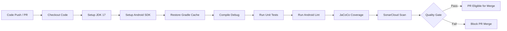
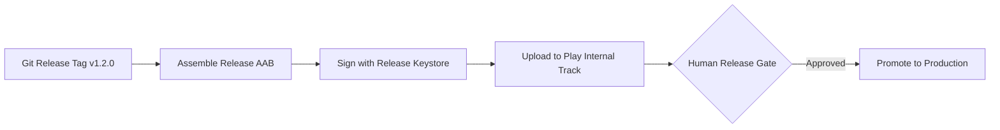
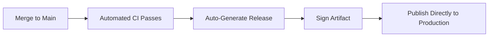
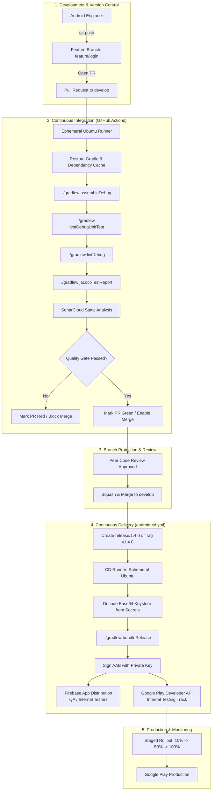
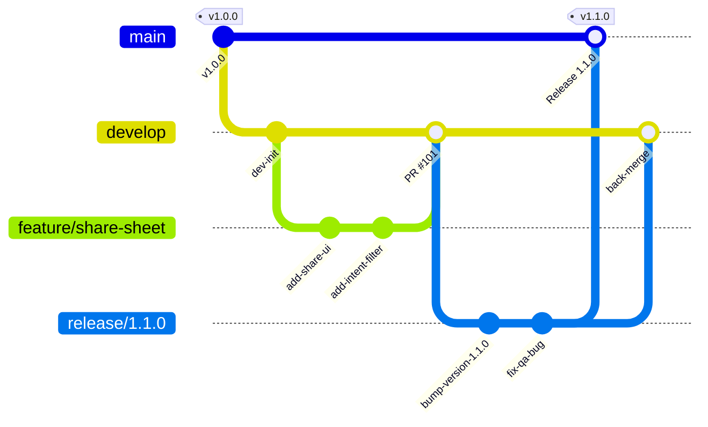
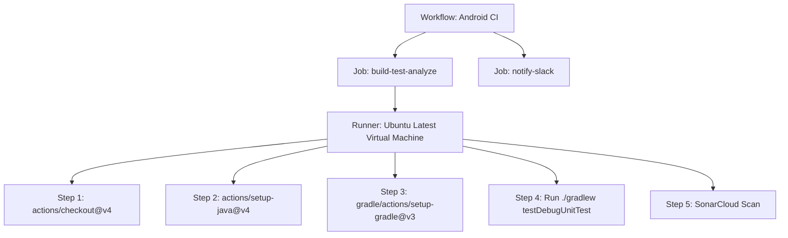
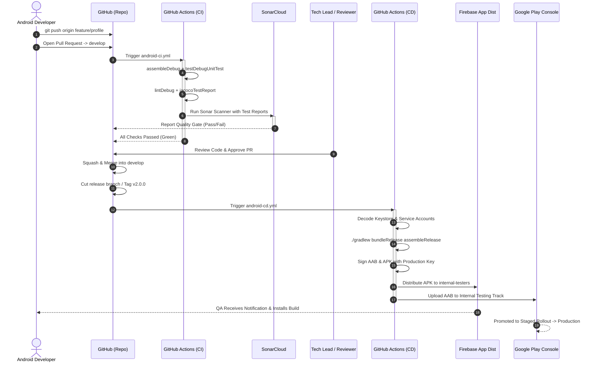
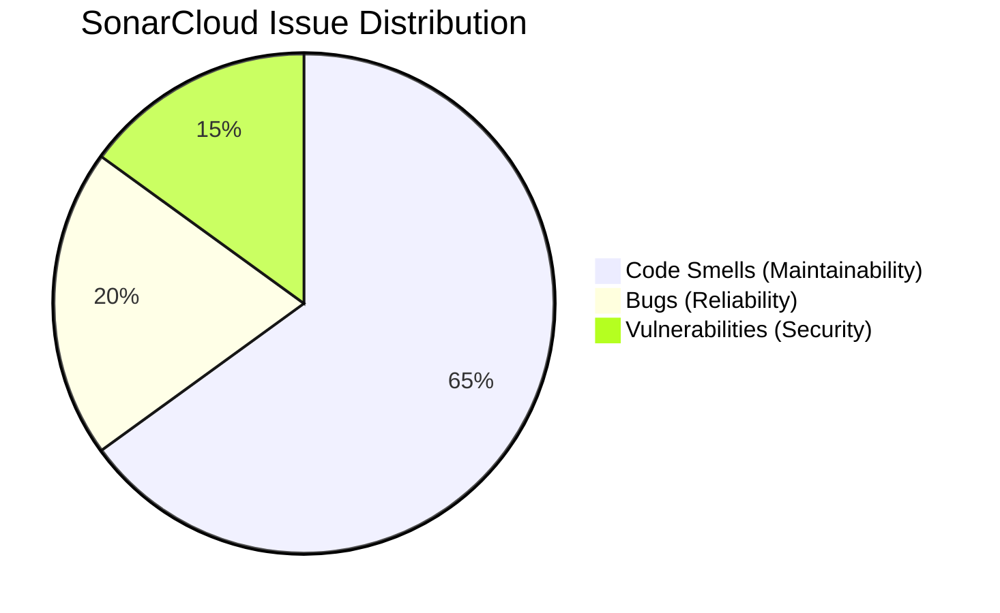
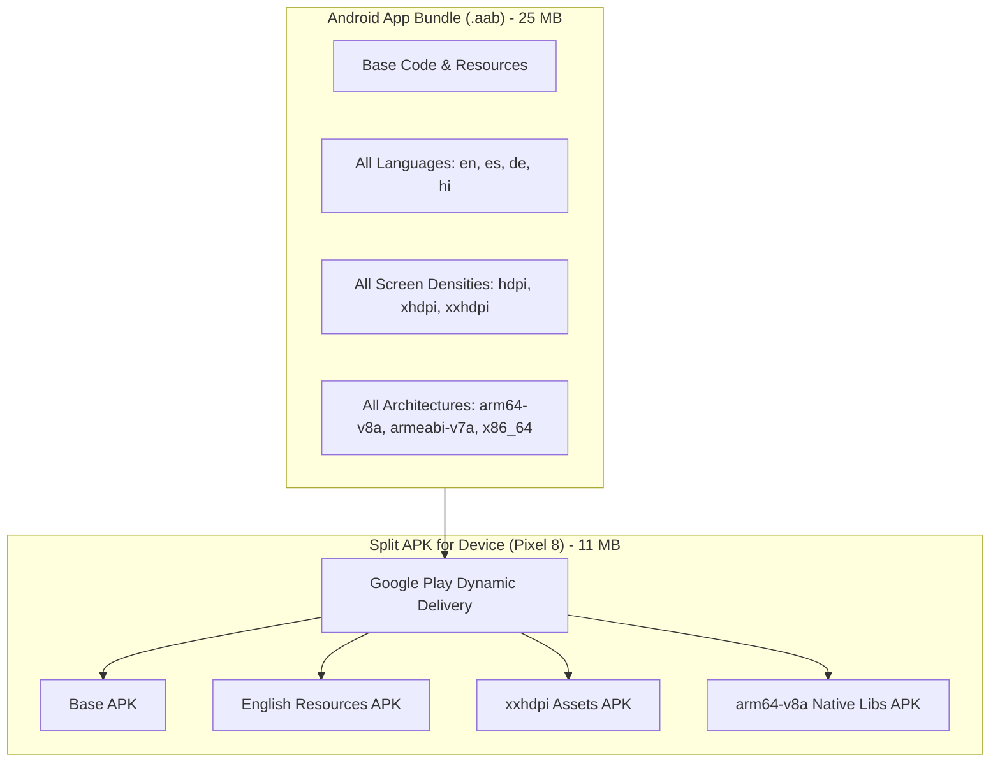

# 🛠️ FluxShare — CI/CD Pipeline Setup, Architecture & Interview Guide

A comprehensive, production-grade guide to the Continuous Integration and Continuous Delivery (CI/CD) pipeline for the **FluxShare** Android application. This document details architecture, Git workflows, GitHub Actions configuration, Android signing, Firebase App Distribution, Google Play Console automation, SonarCloud static analysis, troubleshooting, and 110+ senior-level interview questions.

---

## 📑 Table of Contents

1. [CI/CD — What Does It Mean?](#1-cicd--what-does-it-mean)
   - [1.1 Continuous Integration (CI)](#11-continuous-integration-ci)
   - [1.2 Continuous Delivery (CD)](#12-continuous-delivery-cd)
   - [1.3 Continuous Deployment](#13-continuous-deployment)
   - [1.4 CI vs Continuous Delivery vs Continuous Deployment](#14-ci-vs-continuous-delivery-vs-continuous-deployment)
2. [Real-World CI/CD Architecture](#2-real-world-cicd-architecture)
3. [Git vs GitHub vs GitHub Actions](#3-git-vs-github-vs-github-actions)
   - [3.1 Git](#31-git)
   - [3.2 GitHub](#32-github)
   - [3.3 GitHub Actions](#33-github-actions)
4. [Git Workflow](#4-git-workflow)
   - [4.1 Branching Strategy](#41-branching-strategy)
   - [4.2 Feature Branches](#42-feature-branches)
   - [4.3 Pull Requests (PR)](#43-pull-requests-pr)
   - [4.4 Code Review Best Practices](#44-code-review-best-practices)
   - [4.5 Branch Roles (Main, Develop, Release, Hotfix)](#45-branch-roles)
   - [4.6 Git Tags](#46-git-tags)
   - [4.7 Git Merge vs Git Rebase](#47-git-merge-vs-git-rebase)
5. [GitHub Actions Workflow Fundamentals](#5-github-actions-workflow-fundamentals)
   - [5.1 What is a Workflow?](#51-what-is-a-workflow)
   - [5.2 Hierarchy: Workflow → Job → Step → Runner](#52-hierarchy-workflow--job--step--runner)
   - [5.3 GitHub Actions Events & Triggers](#53-github-actions-events--triggers)
   - [5.4 GitHub Secrets & Environment Variables](#54-github-secrets--environment-variables)
6. [FluxShare Pipeline Flow](#6-fluxshare-pipeline-flow)
7. [Step 1 — Local Build Validation](#step-1--local-build-validation)
   - [7.1 Why Run clean?](#71-why-run-clean)
   - [7.2 assembleDebug](#72-assembledebug)
   - [7.3 Unit Tests](#73-unit-tests)
   - [7.4 Android Lint](#74-android-lint)
   - [7.5 JaCoCo Code Coverage](#75-jacoco-code-coverage)
8. [Step 2 — Android Release Signing](#step-2--android-release-signing)
   - [8.1 What is an Android Keystore?](#81-what-is-an-android-keystore)
   - [8.2 Why is Cryptographic Signing Required?](#82-why-is-cryptographic-signing-required)
   - [8.3 Generating a Production Keystore](#83-generating-a-production-keystore)
   - [8.4 Base64 Encoding for Ephemeral CI Runners](#84-base64-encoding-for-ephemeral-ci-runners)
   - [8.5 Critical Keystore Security Rules](#85-critical-keystore-security-rules)
9. [Step 3 — Firebase App Distribution](#step-3--firebase-app-distribution)
   - [9.1 Purpose & Role in QA](#91-purpose--role-in-qa)
   - [9.2 Step-by-Step Firebase Project Configuration](#92-step-by-step-firebase-project-configuration)
   - [9.3 Real-World Use Cases & Limitations](#93-real-world-use-cases--limitations)
10. [Step 4 — SonarCloud Static Code Analysis](#step-4--sonarcloud-static-code-analysis)
    - [10.1 Static Analysis vs Runtime Testing](#101-static-analysis-vs-runtime-testing)
    - [10.2 Bugs vs Vulnerabilities vs Code Smells](#102-bugs-vs-vulnerabilities-vs-code-smells)
    - [10.3 Quality Gates & Technical Debt Management](#103-quality-gates--technical-debt-management)
    - [10.4 Why Analyze "New Code" in Legacy Projects?](#104-why-analyze-new-code-in-legacy-projects)
    - [10.5 Step-by-Step SonarCloud Setup](#105-step-by-step-sonarcloud-setup)
11. [Step 5 — Google Play Console Automation](#step-5--google-play-console-automation)
    - [11.1 APK vs Android App Bundle (AAB)](#111-apk-vs-android-app-bundle-aab)
    - [11.2 Google Cloud Service Account Setup](#112-google-cloud-service-account-setup)
    - [11.3 Principle of Least Privilege in Play Console](#113-principle-of-least-privilege-in-play-console)
12. [Step 6 — GitHub Actions Secrets Configuration](#step-6--github-actions-secrets-configuration)
13. [Step 7 — Branch Protection Rules](#step-7--branch-protection-rules)
14. [Step 8 — Production CI Workflow (`android-ci.yml`)](#step-8--production-ci-workflow-android-ciyml)
15. [Step 9 — Production CD Workflow (`android-cd.yml`)](#step-9--production-cd-workflow-android-cdyml)
16. [Step 10 — Release Management & Versioning](#step-10--release-management--versioning)
    - [16.1 Semantic Versioning (SemVer)](#161-semantic-versioning-semver)
    - [16.2 versionCode vs versionName in Android](#162-versioncode-vs-versionname-in-android)
17. [Step 11 — Rollback Strategy Playbooks](#step-11--rollback-strategy-playbooks)
18. [Step 12 — AGP & Kotlin Migration Pitfalls](#step-12--agp--kotlin-migration-pitfalls)
19. [Step 13 — Pipeline Troubleshooting Reference](#step-13--pipeline-troubleshooting-reference)
20. [Real-World Pipeline Use Cases](#20-real-world-pipeline-use-cases)
21. [Advantages of an Automated Pipeline](#21-advantages-of-an-automated-pipeline)
22. [Limitations & Realities of CI/CD](#22-limitations--realities-of-cicd)
23. [Security Considerations & Best Practices](#23-security-considerations--best-practices)
24. [Complete Senior Android Interview Question Bank](#24-complete-senior-android-interview-question-bank)
    - [24.1 CI/CD Core Questions](#241-cicd-core-questions)
    - [24.2 Git Deep-Dive Questions](#242-git-deep-dive-questions)
    - [24.3 GitHub Actions Architecture Questions](#243-github-actions-architecture-questions)
    - [24.4 Android CI/CD & Build Automation Questions](#244-android-cicd--build-automation-questions)
    - [24.5 SonarCloud & Quality Gate Questions](#245-sonarcloud--quality-gate-questions)
    - [24.6 Firebase App Distribution Questions](#246-firebase-app-distribution-questions)
    - [24.7 Google Play Console Questions](#247-google-play-console-questions)
    - [24.8 CI/CD Security & Compliance Questions](#248-cicd-security--compliance-questions)
    - [24.9 Scenario-Based System Design Interview Questions](#249-scenario-based-system-design-interview-questions)
25. [Senior-Level Interview Summary](#25-senior-level-interview-summary)

---

## 1. CI/CD — What Does It Mean?

### 1.1 Continuous Integration (CI)

**Definition:** Continuous Integration (CI) is the engineering practice of automatically compiling, testing, and verifying code modifications every time a developer commits and pushes code to a shared repository.

The goal of CI is to **detect regressions and defects immediately at the integration point** rather than during late-stage QA or post-release.



#### Real-World Example
Suppose five Android engineers are simultaneously collaborating on **FluxShare**:
- **Engineer A:** Refactors Authentication to OAuth 2.0 PKCE.
- **Engineer B:** Integrates In-App Billing / Subscriptions.
- **Engineer C:** Redesigns the Home Dashboard in Jetpack Compose.
- **Engineer D:** Upgrades Retrofit & OkHttp networking stack.
- **Engineer E:** Migrates Room database schema from version 3 to 4.

When Engineer A opens a Pull Request:
1. Does the code compile without breaking Engineer B, C, D, or E's modules?
2. Do all 450+ JVM unit tests pass?
3. Does Android Lint flag any memory leaks, missing permissions, or deprecated API usages?
4. Does test code coverage drop below the required threshold (e.g., 80%)?
5. Does SonarCloud detect new security vulnerabilities, high cyclomatic complexity, or code smells?

Without CI, broken dependencies, schema conflicts, or compilation errors would only surface days later when someone pulls the shared branch. With CI, the PR is automatically evaluated in an isolated virtual machine within 4 minutes.

---

### 1.2 Continuous Delivery (CD)

**Definition:** Continuous Delivery ensures that code in the main or release branch is **always in a deployable state**, and that generating, signing, and packaging the release binary (APK/AAB) is completely automated.

In Continuous Delivery, the artifacts are automatically built, cryptographically signed, and uploaded to a testing track or staging environment (e.g., Firebase App Distribution or Google Play Internal Testing), but **the final rollout to end-user production typically requires explicit human approval** (a release manager or engineering lead clicking "Promote to Production").



---

### 1.3 Continuous Deployment

**Definition:** Continuous Deployment takes automation one step further: every change that passes all automated tests and quality gates is **automatically pushed directly into production** without manual human intervention.



> [!NOTE]
> In mobile app engineering, **Continuous Delivery** is standard industry practice, whereas pure **Continuous Deployment** is rare. Mobile apps must adhere to app store review queues (Google Play / Apple App Store), staged rollouts (e.g., 5% → 20% → 100%), and binary immutability on end-user devices where rollbacks cannot be performed instantaneously.

---

### 1.4 CI vs Continuous Delivery vs Continuous Deployment

| Dimension | Continuous Integration (CI) | Continuous Delivery (CD) | Continuous Deployment |
|---|---|---|---|
| **Primary Goal** | Validate code changes early and often | Keep software in an always-deployable state | Automatically ship every change to production |
| **Trigger** | Pull Request, commit push | Release branch merge, release tag (`v*`) | Merge to primary production branch |
| **Output** | Build status, test reports, lint results, coverage | Signed APK/AAB, release notes, staging distribution | Live update deployed directly to users |
| **Production Release** | Manual (out of scope) | **Manual trigger/approval** to promote | **100% Automated** without human gates |
| **Mobile Suitability** | Universally required | Standard industry practice | Rarely used for production app stores |

---

## 2. Real-World CI/CD Architecture

The following diagram illustrates the complete infrastructure and lifecycle of the **FluxShare** Android engineering pipeline:



---

## 3. Git vs GitHub vs GitHub Actions

| Tool | Type | Core Responsibility | Key Concepts / Commands |
|---|---|---|---|
| **Git** | Distributed Version Control System (DVCS) | Tracks file deltas, commits, historical branch trees locally on machines without network dependency. | `git commit`, `git rebase`, `git merge`, `git cherry-pick`, `git tag` |
| **GitHub** | Cloud Collaboration Platform | Hosts remote Git repositories and adds peer review, issue tracking, project management, and governance. | Pull Requests, Branch Protection, Issue Tracker, GitHub Releases |
| **GitHub Actions** | Built-in CI/CD Automation Platform | Orchestrates virtual machines (runners) to execute custom bash commands and containerized actions in response to GitHub webhooks. | Workflows, Jobs, Steps, Runners, Secrets, Matrix builds |

---

## 4. Git Workflow

### 4.1 Branching Strategy

FluxShare adopts a battle-tested **Git Flow / GitHub Flow hybrid** optimized for mobile release cadences:



### 4.2 Feature Branches
- Branch off: `develop`
- Naming convention: `feature/JIRA-123-short-description` or `fix/JIRA-456-bug-name`
- Isolated from unstable work; pushed to remote to trigger CI verification on draft PRs.

### 4.3 Pull Requests (PR)
- Target branch: `develop`
- Automated checks: Must pass compile, unit tests, Android Lint, JaCoCo coverage, and SonarCloud Quality Gate.
- Approvals: Minimum of **1 senior peer approval** required.

### 4.4 Code Review Best Practices
Reviewers evaluate:
1. **Architecture & Clean Code:** Adherence to MVVM/MVI, repository pattern, and separation of concerns.
2. **Resource Management:** Proper coroutine lifecycle binding (`repeatOnLifecycle`), cancellation handling, memory leak avoidance.
3. **Security:** Zero plaintext credentials, proper scoped storage compliance, secure Intent handling.
4. **Performance:** Compose recomposition count, no heavy work on Dispatchers.Main.

### 4.5 Branch Roles
- **`main`**: Mirrors live production code. Every commit on `main` is tagged with a release version (e.g., `v2.4.1`). Direct pushes are permanently blocked.
- **`develop`**: The primary integration branch containing features targeted for the next release.
- **`release/x.y.z`**: Cut from `develop` when feature freeze begins. QA conducts regression testing on this branch. Only bug fixes and version bumps occur here.
- **`hotfix/x.y.z`**: Cut directly from `main` to address critical production outages. Merged into both `main` and `develop`.

### 4.6 Git Tags
A Git tag is an immutable reference pointing to a specific commit SHA.
```bash
# Create annotated tag
git tag -a v1.4.0 -m "Release version 1.4.0 (Build 42)"
# Push tag to remote (triggers CD pipeline)
git push origin v1.4.0
```

### 4.7 Git Merge vs Git Rebase

```
Git Merge:                               Git Rebase:
A---B---C (main)                         A---B---C (main)
     \                                            \
      D---E (feature)                              D'---E' (feature rebased)
           \
A---B---C---M (Merge commit)             A---B---C---D'---E' (Linear history)
```

| Feature | `git merge` | `git rebase` |
|---|---|---|
| **History** | Non-linear; preserves complete branching context | Linear; creates a clean, straight line of commits |
| **Commit SHAs** | Original commit SHAs are preserved | Re-writes commit history (new SHAs are generated) |
| **Merge Commit** | Creates a dedicated 2-parent merge commit | No merge commit generated |
| **Golden Rule** | Safe for shared public branches (`main`, `develop`) | **Never rebase a public shared branch.** Use only on local feature branches before opening a PR. |

---

## 5. GitHub Actions Workflow Fundamentals

### 5.1 What is a Workflow?
A workflow is an automated, configurable process defined in a `.yml` file located in `.github/workflows/`.

```
.github/
└── workflows/
    ├── android-ci.yml   # Triggered on Pull Requests to develop/main
    └── android-cd.yml   # Triggered on release tags (v*) and release/* branches
```

### 5.2 Hierarchy: Workflow → Job → Step → Runner



- **Workflow:** Top-level automation specification.
- **Job:** A group of sequential steps executed on the same fresh virtual machine (runner). Jobs run in parallel by default unless configured with `needs: [job-id]`.
- **Step:** An individual unit of execution (a shell script or an action).
- **Runner:** The host server (Ubuntu Linux, macOS, or Windows) hosted by GitHub or self-hosted.

### 5.3 GitHub Actions Events & Triggers

| Event | Trigger Description | Typical Mobile Use Case |
|---|---|---|
| `pull_request` | PR opened, synchronized (new commit pushed), or reopened | Triggering compilation, unit tests, lint, coverage, and SonarCloud |
| `push` | Direct commit pushed to a branch or tag | Building release candidates when commits hit `release/*` |
| `workflow_dispatch` | Manual execution button in GitHub UI with custom inputs | Ad-hoc internal QA builds or manual rollback executions |
| `schedule` | Cron schedule (e.g., `0 2 * * *` at 2 AM UTC) | Nightly builds, lengthy end-to-end UI tests, dependency vulnerability scans |
| `release` | GitHub release created/published | Production publishing to Google Play Store |

### 5.4 GitHub Secrets & Environment Variables

- **Environment Variables (`env`):** Non-sensitive configurations (e.g., `JAVA_VERSION: '17'`, `BUILD_VARIANT: 'release'`).
- **Secrets (`${{ secrets.KEY }}`):** Encrypted strings masked in execution logs. Stored under **Settings → Secrets and variables → Actions**.

> [!WARNING]
> GitHub Actions automatically masks secrets in console logs. However, if a secret is Base64-decoded or printed via a loop, it may appear in plain text. Always avoid `echo` commands on decrypted credentials.

---

## 6. FluxShare Pipeline Flow

The following sequence diagram demonstrates how a code change travels from a developer's workstation to end-user devices:



---

## Step 1 — Local Build Validation

Always validate compilation, test execution, linting, and coverage generation locally before pushing to remote:

```bash
cd /path/to/FluxShare
./gradlew clean assembleDebug testDebugUnitTest lintDebug jacocoTestReport --stacktrace
```

### 7.1 Why Run clean?
`./gradlew clean` deletes the root and module `build/` directories, purging:
- Generated Kotlin/Java sources (e.g., Room DAOs, Dagger/Hilt components)
- Cached Android resource tables and merged manifests
- Pre-compiled classes

> [!TIP]
> In local development, `clean` ensures a fresh build when troubleshooting cryptic compiler errors. However, **do not run `clean` blindly in CI pipelines**, as it destroys Gradle build caches and drastically increases build times.

### 7.2 assembleDebug
Compiles Java/Kotlin code, processes XML resources, runs Dexing (`d8`), and packages the debug APK into `app/build/outputs/apk/debug/app-debug.apk`. Signed automatically with the default Android debug keystore.

### 7.3 Unit Tests
`./gradlew testDebugUnitTest` executes JVM-based JUnit/MockK tests located in `src/test/`. These tests do not require an Android emulator or physical device, completing in seconds.

### 7.4 Android Lint
`./gradlew lintDebug` scans the codebase for structural issues without executing code:
- Unused resources and code paths
- Missing internationalization strings
- Hardcoded dimensions and colors
- Insecure network protocols (HTTP instead of HTTPS)
- Target SDK compatibility and permission declarations

### 7.5 JaCoCo Code Coverage
JaCoCo instruments Java bytecode and Kotlin inline functions to measure statement, branch, and line coverage during unit test execution. Generates an XML report consumed by SonarCloud:
```
app/build/reports/jacoco/jacocoTestReport/jacocoTestReport.xml
```

---

## Step 2 — Android Release Signing

### 8.1 What is an Android Keystore?
An Android Keystore (`.jks` or `.keystore`) is a password-protected cryptographic container holding private keys and public certificates used to sign Android application packages.

### 8.2 Why is Cryptographic Signing Required?
1. **Application Identity:** Proves that updates originate from the original author.
2. **Integrity:** Guarantees the application package has not been tampered with or modified by third parties.
3. **Android OS Enforcement:** Android prevents updating an installed app if the update binary's signature differs from the installed version (`INSTALL_FAILED_UPDATE_INCOMPATIBLE`).

### 8.3 Generating a Production Keystore
Generate a 2048-bit RSA key valid for 25+ years (10,000+ days):

```bash
keytool -genkey -v \
  -keystore release.keystore \
  -alias fluxshare-key \
  -keyalg RSA \
  -keysize 2048 \
  -validity 10000
```

### 8.4 Base64 Encoding for Ephemeral CI Runners
GitHub Actions runners are ephemeral virtual machines destroyed after every job. You cannot mount a persistent local file path. The keystore binary must be encoded into an ASCII Base64 string and stored in GitHub Secrets.

#### macOS (Copy directly to clipboard):
```bash
base64 -i release.keystore | pbcopy
```

#### Linux (Output to single-line text file):
```bash
base64 -w0 release.keystore > keystore.b64
```

In the GitHub Actions CD workflow, decode it back to a binary file:
```bash
echo "${{ secrets.KEYSTORE_BASE64 }}" | base64 --decode > /tmp/release.keystore
```

### 8.5 Critical Keystore Security Rules
- **Never commit** `.jks`, `.keystore`, or `.b64` files to Git. Add them to `.gitignore`:
  ```gitignore
  *.jks
  *.keystore
  *.b64
  service-account.json
  google-services.json
  ```
- Store offline backups of the keystore in a secure corporate password vault (e.g., 1Password, Bitwarden, or AWS Secrets Manager). **If you lose the upload/signing key and do not use Google Play App Signing, you can never update the app on the Play Store again.**

---

## Step 3 — Firebase App Distribution

### 9.1 Purpose & Role in QA
Firebase App Distribution distributes pre-release APKs/AABs to internal QA, product managers, and beta testers instantly without waiting for Google Play Store review queues.

### 9.2 Step-by-Step Firebase Project Configuration
1. Open the [Firebase Console](https://console.firebase.google.com/) and click **Add Project**.
2. Name the project `FluxShare`.
3. Register the Android App with package name `com.rajamohan.fluxshare`.
4. Copy the **Firebase App ID** from **Project Settings → General**:
   - Format: `1:1234567890:android:abcdef123456`
   - Save in GitHub Secrets as `FIREBASE_APP_ID`.
5. Generate a Google Cloud Service Account Key:
   - Navigate to **Project Settings → Service Accounts**.
   - Click **Generate New Private Key** to download the JSON credentials.
   - Save the raw contents in GitHub Secrets as `FIREBASE_SERVICE_ACCOUNT`.
6. Configure Tester Groups:
   - Go to **Release & Monitor → App Distribution → Testers & Groups**.
   - Create a group named `internal-testers` and add QA email addresses.

### 9.3 Real-World Use Cases & Limitations

| Aspect | Firebase App Distribution | Google Play Console |
|---|---|---|
| **Audience** | Internal QA, Product Owners, Alpha Testers | Global end-users, Open/Closed Beta testers |
| **Review Queue** | **Zero delay:** builds available within 60 seconds | Subject to Google Play policy and human review |
| **Install Method** | Firebase App Tester app or direct email APK link | Google Play Store Client |
| **Limitations** | Testers must enable "Install Unknown Apps"; APK sizes not device-optimized | Requires Google Play account; stricter validation |

---

## Step 4 — SonarCloud Static Code Analysis

### 10.1 Static Analysis vs Runtime Testing
- **Runtime Testing (Unit/UI Tests):** Executes the code and asserts that given input $X$, the output is $Y$. Verifies functional correctness.
- **Static Analysis (SonarCloud):** Parses source files into Abstract Syntax Trees (AST) and inspects code patterns *without running the program*. Flags code smells, memory leaks, security flaws, and maintainability issues.

### 10.2 Bugs vs Vulnerabilities vs Code Smells



- **Bug:** An issue that will cause an unexpected runtime exception or incorrect behavior (e.g., null pointer dereference, unclosed cursor).
- **Vulnerability:** A security weakness that can be exploited by an attacker (e.g., SQL injection, hardcoded encryption keys, insecure broadcast receivers).
- **Code Smell:** A design flaw or anti-pattern that makes code difficult to maintain, understand, or extend (e.g., a function with 150 lines, high cyclomatic complexity, duplicated blocks).

### 10.3 Quality Gates & Technical Debt Management
A **Quality Gate** is a policy-enforced threshold that a Pull Request must satisfy before merging.
- New Bugs: **0**
- New Vulnerabilities: **0**
- Code Duplication on New Code: **< 3.0%**
- Code Coverage on New Code: **≥ 80.0%**

If the Quality Gate fails, GitHub Actions blocks the Pull Request from merging.

### 10.4 Why Analyze "New Code" in Legacy Projects?
In mature legacy projects, thousands of historical issues exist. Requiring 100% resolution immediately halts feature delivery. By enforcing the **Clean as You Code** paradigm:
1. Legacy code issues are cataloged as technical debt.
2. Strictest Quality Gate rules apply exclusively to **newly introduced or modified code**.
3. Technical debt decreases naturally over time without disrupting roadmap velocity.

### 10.5 Step-by-Step SonarCloud Setup
1. Log into [SonarCloud](https://sonarcloud.io/) using GitHub OAuth.
2. Select **Analyze New Project** and import the `FluxShare` repository.
3. Note the keys:
   - **Organization Key:** `rajamohan006`
   - **Project Key:** `Rajamohan006_FluxShare`
4. Generate an API Token under **My Account → Security → Generate Tokens**. Save as `SONAR_TOKEN` in GitHub Secrets.
5. In project settings, navigate to **Administration → Analysis Method** and **turn OFF "Automatic Analysis"**. This allows the analysis to run directly inside GitHub Actions after tests and JaCoCo reports execute.

---

## Step 5 — Google Play Console Automation

### 11.1 APK vs Android App Bundle (AAB)



Google Play mandates the AAB format for new apps because Dynamic Delivery generates customized, split APKs containing only the resources required for a specific device, reducing download size by up to 35%.

### 11.2 Google Cloud Service Account Setup
1. Go to **Google Play Console → Setup → API access**.
2. Link your Google Cloud project.
3. Click **Create Service Account** and navigate to Google Cloud Console.
4. Create the service account and assign role: **Service Account User**.
5. Generate a private JSON key under **Keys → Add Key → Create new key (JSON)**.
6. Return to Google Play Console, locate the service account, click **Grant Access**, and grant **Release Manager** permissions for `com.rajamohan.fluxshare`.
7. Store the raw JSON content in GitHub Secrets as `PLAY_SERVICE_ACCOUNT_JSON`.

### 11.3 Principle of Least Privilege in Play Console
Never grant the CI/CD service account `Admin` or `Account Owner` permissions. Limit access strictly to:
- Edit app releases
- Manage testing tracks (Internal, Closed, Open)
- View app information

---

## Step 6 — GitHub Actions Secrets Configuration

Configure the following secrets in GitHub under **Settings → Secrets and variables → Actions**:

| Secret Key | Description | Example / Format | Source |
|---|---|---|---|
| `KEYSTORE_BASE64` | Base64-encoded binary release keystore | `MIIKPQIBAzCCCgcGCSqGSIb3...` | Step 2 (`base64 -w0`) |
| `KEYSTORE_PASSWORD` | Master password for the release keystore | `UltraSecurePassw0rd!` | Step 2 (Keystore creation) |
| `KEY_ALIAS` | Private key alias inside the keystore | `fluxshare-key` | Step 2 (`-alias`) |
| `KEY_PASSWORD` | Password for the specified key alias | `UltraSecureKeyPassw0rd!` | Step 2 (Keystore creation) |
| `SONAR_TOKEN` | SonarCloud API token for static analysis | `a1b2c3d4e5f6...` (40 chars) | Step 4 (SonarCloud Security) |
| `FIREBASE_APP_ID` | Firebase Android application identifier | `1:9876543210:android:abcdef` | Step 3 (Firebase Project) |
| `FIREBASE_SERVICE_ACCOUNT`| Google Cloud service account JSON for Firebase | `{"type": "service_account", ...}` | Step 3 (Firebase Console) |
| `PLAY_SERVICE_ACCOUNT_JSON`| Google Cloud service account JSON for Play Store | `{"type": "service_account", ...}` | Step 5 (Google Cloud Console) |

---

## Step 7 — Branch Protection Rules

Navigate to **Settings → Branches → Add rule**:

### Rules for `main` and `develop`
- [x] **Require a pull request before merging**
  - Require approvals: minimum **1**
  - Dismiss stale pull request approvals when new commits are pushed
- [x] **Require status checks to pass before merging**
  - Require branches to be up to date before merging
  - Required check: `build-test-analyze` (from `android-ci.yml`)
- [x] **Require conversation resolution before merging**
- [x] **Do not allow bypassing the above settings**
- [x] **Block force pushes** (`git push --force` is denied)
- [x] **Block deletions**

---

## Step 8 — Production CI Workflow (`android-ci.yml`)

Save this file in `.github/workflows/android-ci.yml`:

```yaml
name: Android CI

on:
  pull_request:
    branches:
      - develop
      - main
  workflow_dispatch:

concurrency:
  group: ci-${{ github.ref }}
  cancel-in-progress: true

jobs:
  build-test-analyze:
    name: Build · Test · Lint · Coverage · SonarCloud
    runs-on: ubuntu-latest
    timeout-minutes: 25

    steps:
      - name: Checkout Source Code
        uses: actions/checkout@v4
        with:
          fetch-depth: 0 # Full git history required for SonarCloud blame & analysis

      - name: Set up JDK 17
        uses: actions/setup-java@v4
        with:
          distribution: 'temurin'
          java-version: '17'

      - name: Setup Gradle
        uses: gradle/actions/setup-gradle@v3
        with:
          cache-read-only: false

      - name: Make Gradle Wrapper Executable
        run: chmod +x gradlew

      - name: Build Debug APK
        run: ./gradlew assembleDebug --stacktrace

      - name: Run JVM Unit Tests
        run: ./gradlew testDebugUnitTest --stacktrace

      - name: Run Android Lint
        run: ./gradlew lintDebug

      - name: Generate JaCoCo Code Coverage Report
        run: ./gradlew jacocoTestReport

      - name: Run SonarCloud Static Code Analysis
        env:
          GITHUB_TOKEN: ${{ secrets.GITHUB_TOKEN }}
          SONAR_TOKEN: ${{ secrets.SONAR_TOKEN }}
        run: |
          ./gradlew sonar \
            -Dsonar.organization=rajamohan006 \
            -Dsonar.projectKey=Rajamohan006_FluxShare \
            -Dsonar.host.url=https://sonarcloud.io \
            -Dsonar.coverage.jacoco.xmlReportPaths=app/build/reports/jacoco/jacocoTestReport/jacocoTestReport.xml

      - name: Upload Test Results Artifact
        if: always()
        uses: actions/upload-artifact@v4
        with:
          name: unit-test-and-lint-reports
          path: |
            app/build/reports/tests/testDebugUnitTest/
            app/build/reports/lint-results-debug.html
            app/build/reports/jacoco/jacocoTestReport/html/
          retention-days: 14
```

---

## Step 9 — Production CD Workflow (`android-cd.yml`)

Save this file in `.github/workflows/android-cd.yml`:

```yaml
name: Android CD

on:
  push:
    tags:
      - 'v*'
    branches:
      - 'release/**'
  workflow_dispatch:

jobs:
  deploy-qa-and-production:
    name: Build · Sign · Distribute (Firebase & Play Store)
    runs-on: ubuntu-latest
    timeout-minutes: 30

    steps:
      - name: Checkout Code
        uses: actions/checkout@v4
        with:
          fetch-depth: 1

      - name: Set up JDK 17
        uses: actions/setup-java@v4
        with:
          distribution: 'temurin'
          java-version: '17'

      - name: Setup Gradle
        uses: gradle/actions/setup-gradle@v3

      - name: Make Gradlew Executable
        run: chmod +x gradlew

      - name: Decode Release Keystore
        env:
          KEYSTORE_BASE64: ${{ secrets.KEYSTORE_BASE64 }}
        run: |
          echo "$KEYSTORE_BASE64" | base64 --decode > /tmp/release.keystore

      - name: Build Release APK and AAB
        env:
          KEYSTORE_FILE: /tmp/release.keystore
          KEYSTORE_PASSWORD: ${{ secrets.KEYSTORE_PASSWORD }}
          KEY_ALIAS: ${{ secrets.KEY_ALIAS }}
          KEY_PASSWORD: ${{ secrets.KEY_PASSWORD }}
        run: |
          ./gradlew assembleRelease bundleRelease \
            -Pandroid.injected.signing.store.file=$KEYSTORE_FILE \
            -Pandroid.injected.signing.store.password=$KEYSTORE_PASSWORD \
            -Pandroid.injected.signing.key.alias=$KEY_ALIAS \
            -Pandroid.injected.signing.key.password=$KEY_PASSWORD

      - name: Upload to Firebase App Distribution (QA)
        uses: wzieba/Firebase-Distribution-Github-Action@v1
        with:
          appId: ${{ secrets.FIREBASE_APP_ID }}
          serviceCredentialsFileContent: ${{ secrets.FIREBASE_SERVICE_ACCOUNT }}
          groups: internal-testers
          file: app/build/outputs/apk/release/app-release.apk
          releaseNotes: "Automated CD Build for commit ${{ github.sha }} on ${{ github.ref }}"

      - name: Upload to Google Play Store (Internal Track)
        if: startsWith(github.ref, 'refs/tags/v')
        uses: r0adkll/upload-google-play@v1
        with:
          serviceAccountJsonPlainText: ${{ secrets.PLAY_SERVICE_ACCOUNT_JSON }}
          packageName: com.rajamohan.fluxshare
          releaseFiles: app/build/outputs/bundle/release/app-release.aab
          track: internal
          status: completed

      - name: Cleanup Keystore
        if: always()
        run: rm -f /tmp/release.keystore
```

---

## Step 10 — Release Management & Versioning

### 16.1 Semantic Versioning (SemVer)
Versions follow the format: `MAJOR.MINOR.PATCH` (e.g., `2.4.1`)
- **MAJOR:** Incompatible architectural changes, major database redesigns, breaking public APIs.
- **MINOR:** New backward-compatible features added (e.g., adding Bluetooth file sharing).
- **PATCH:** Backward-compatible bug fixes and stability improvements.

### 16.2 versionCode vs versionName in Android

```kotlin
// app/build.gradle.kts
defaultConfig {
    applicationId = "com.rajamohan.fluxshare"
    minSdk = 26
    targetSdk = 35
    versionCode = 10401  // Monotonically increasing integer
    versionName = "1.4.1" // User-facing semantic version
}
```

- **`versionCode`:** A positive integer strictly evaluated by the Android OS and Google Play Store. Every new upload to Play Console **must have a strictly higher `versionCode`** than preceding releases.
- **`versionName`:** A user-visible string displayed in App Info and the Play Store.

---

## Step 11 — Rollback Strategy Playbooks

| Incident Channel | Mechanism | Execution Procedure |
|---|---|---|
| **Google Play Store (Production Crash)** | **Halt Staged Rollout** | 1. Go to Play Console → Release Overview.<br/>2. If rollout is at e.g., 20%, click **Halt Rollout** immediately.<br/>3. Existing users on the buggy version stay on it, but new downloads revert to the previous stable release. |
| **Google Play Store (100% Deployed)** | **Hotfix Expedited Release** | Android OS blocks installing lower versionCodes. A true rollback requires cutting `hotfix/x.y.z`, bumping `versionCode` (e.g., `10402`), fixing the root cause, and deploying an expedited release. |
| **Firebase App Distribution** | **Re-download Prior Build** | Testers open Firebase App Tester on device, open Version History, and install the previous marked stable build. |
| **GitHub Tag / Release** | **Git Revert** | `git revert <commit-sha> -m 1`, push to `develop`/`main`, and tag a new patch release. |

---

## Step 12 — AGP & Kotlin Migration Pitfalls

When upgrading modern Android Gradle Plugin (AGP 8.5 → 8.13+) and Kotlin (1.9 → 2.0+):

| Symptom / Error | Root Cause | Resolution |
|---|---|---|
| `Unresolved reference: composeOptions` | Legacy `composeOptions` block left in build scripts | **Delete `composeOptions`.** Kotlin 2.0+ uses the `org.jetbrains.kotlin.plugin.compose` plugin which aligns versions automatically. |
| `KSP compilation mismatch` | KSP version is out of sync with the Kotlin compiler | Check Google's KSP release matrix and match exact Kotlin version (e.g., Kotlin `2.0.21` requires KSP `2.0.21-1.0.28`). |
| `kapt tasks not found` | Deprecated kapt plugin lingering in submodules | Replace `id("kotlin-kapt")` with `id("com.google.devtools.ksp")` and convert `kapt(...)` to `ksp(...)`. |
| Outdated Gradle Daemon cache | Stale daemon artifacts in `.gradle/` | Run `./gradlew --stop` and clear `~/.gradle/caches/`. |

---

## Step 13 — Pipeline Troubleshooting Reference

### 1. Keystore Error: `Keystore was tampered with, or password was incorrect`
- **Root Cause:** Base64 secret was decoded with trailing newline characters (`\n` or `\r`), or the key alias/password does not match the keystore.
- **Resolution:** Verify keystore credentials locally first:
  ```bash
  keytool -list -v -keystore release.keystore -alias fluxshare-key
  ```
  Ensure encoding command uses `-w0` (Linux) or `-i` (macOS).

### 2. Lint Failure: `lintDebug failed with errors`
- **Root Cause:** New warnings treated as fatal errors, or missing permission checks.
- **Resolution:** Review `app/build/reports/lint-results-debug.html`. Fix the code or generate a baseline if migrating legacy code:
  ```bash
  ./gradlew lintDebug -PwriteLintBaseline
  ```
  Avoid putting `abortOnError = false` in production builds.

### 3. Firebase 401/403 Unauthorized
- **Root Cause:** Service account does not have **Firebase App Distribution Admin** role, or `FIREBASE_APP_ID` has a typo.
- **Resolution:** Re-download service account JSON and confirm the role in Google Cloud Console IAM.

### 4. SonarCloud Analysis Fails
- **Root Cause:** Incorrect `sonar.organization` or `sonar.projectKey`.
- **Resolution:** Match keys exactly with SonarCloud project URL.

### 5. Gradle Build Fails in CI but Passes Locally
- **Root Cause:** CI runner uses JDK 21 while local uses JDK 17, or CI runner lacks an environment variable.
- **Resolution:** Check `actions/setup-java` configuration. Run locally with clean environment:
  ```bash
  env -i HOME="$HOME" PATH="$PATH" ./gradlew assembleDebug
  ```

---

## 20. Real-World Pipeline Use Cases

1. **Feature Development:** Engineer branches from `develop`, commits code, pushes, opens PR. CI verifies compile, tests, lint, coverage, and SonarCloud in 4 minutes.
2. **PR Gatekeeping:** If tests fail or SonarCloud Quality Gate fails, GitHub blocks merge. Engineer pushes fixes to branch; CI re-evaluates automatically.
3. **Internal QA Release:** Merge into `release/1.2.0` automatically triggers CD to build signed APK and deliver to Firebase App Distribution for QA testing.
4. **Production Release:** Engineering Lead tags commit with `v1.2.0` and pushes tag. CD triggers, compiles release AAB, signs it, and publishes to Google Play Internal Testing track.
5. **Emergency Hotfix:** Critical production bug discovered. Branch `hotfix/1.2.1` cut from `main`. Bug fixed, CI passes, merged to `main` with tag `v1.2.1`. CD deploys directly to Play Store.

---

## 21. Advantages of an Automated Pipeline

- **Zero Manual Overhead:** No manual keystore handling, APK exporting, or uploading through web dashboards.
- **Rapid Feedback Loop:** Developers learn within minutes if their code breaks compilation, unit tests, or lint checks.
- **Strict Quality Enforcement:** Enforces code coverage and static analysis gates before bad code enters production.
- **Traceability & Auditability:** Every deployed binary is directly traceable to an exact Git commit SHA, author, and CI run log.
- **Consistent Build Environment:** Eliminates "it builds on my machine" syndrome by compiling in standardized Ubuntu containers.

---

## 22. Limitations & Realities of CI/CD

1. **Passing CI ≠ Bug-Free Software:** CI validates only what is tested. It cannot catch logical UI glitches or third-party backend outages.
2. **High Code Coverage ≠ High Test Quality:** A 90% coverage suite with weak assertions will still let regressions pass.
3. **Static Analysis Limitations:** SonarCloud detects patterns, but cannot simulate device race conditions, low-memory conditions, or hardware variations.
4. **Resource & Minute Consumption:** GitHub Actions runners cost minutes. Careless Gradle caching can cause builds to exceed 20+ minutes.
5. **Secrets Vulnerability:** If a malicious PR from a fork could access secrets, credentials could be leaked. (GitHub disables secrets on forks by default).

---

## 23. Security Considerations & Best Practices

1. **Never Commit Secrets:** Enforce git pre-commit hooks (`git-secrets` or `trufflehog`) to scan for API keys before commits are recorded.
2. **Least Privilege Principle:** Keep service accounts scoped strictly to the minimum role (e.g., Release Manager, not Project Owner).
3. **Protected Branches:** Disallow force pushes and require PR approvals on `main` and `develop`.
4. **Protect Keystore Backups:** Store production keystores in secure corporate password vaults with multi-factor authentication.

---

## 24. Complete Senior Android Interview Question Bank

---

### 24.1 CI/CD Core Questions

#### Q1: What is CI/CD, and why is it vital for Android development?
> **Answer:** CI (Continuous Integration) is the automated process of checking out, compiling, and testing code whenever changes are pushed. CD (Continuous Delivery/Deployment) automates signing, packaging, and deploying the resulting artifacts (APK/AAB) to QA or app stores. In Android, CI/CD is vital because Android builds involve expensive compilation (Kotlin, KSP, R8, D8, resource merging), diverse device matrix constraints, and cryptographic signing. Automated pipelines catch compilation failures, unit test regressions, and lint issues before they merge into shared branches.

#### Q2: What is the architectural difference between Continuous Delivery and Continuous Deployment in mobile apps?
> **Answer:** In Continuous Delivery, every passing change produces a signed, deployable release artifact (AAB/APK) and deploys it to a staging/internal test track, but production release requires manual approval. In Continuous Deployment, validated code is automatically pushed to live end-users without human intervention. In mobile development, Continuous Delivery is universally preferred because app updates cannot be instantly rolled back once downloaded to end-user devices, and releases must navigate Google Play/Apple review processes and staged rollouts.

#### Q3: What stages must an enterprise-grade Android CI pipeline contain?
> **Answer:**
> 1. **Checkout & Environment Setup:** JDK setup (Temurin 17), Android SDK setup, Gradle caching.
> 2. **Build Validation:** `./gradlew assembleDebug` (compilation and resource merging).
> 3. **Unit Testing:** `./gradlew testDebugUnitTest` (JVM-based business logic tests).
> 4. **Code Quality & Linting:** `./gradlew lintDebug` (Android-specific static analysis).
> 5. **Test Coverage:** `./gradlew jacocoTestReport` (branch and line coverage metrics).
> 6. **Static Security & Code Analysis:** SonarCloud / Detekt / Spotless.
> 7. **Quality Gate Evaluation:** Automated PR blocking if quality/coverage thresholds fail.
> 8. **Artifact Archiving:** Upload test reports and lint HTML files for inspection.

#### Q4: How would you optimize a slow Android CI pipeline that takes 25+ minutes?
> **Answer:**
> 1. **Gradle Build Cache:** Enable local and remote build caching (`org.gradle.caching=true`) and Gradle configuration cache (`org.gradle.configuration-cache=true`).
> 2. **Avoid Unnecessary clean:** Do not run `./gradlew clean` in CI on every run; rely on Gradle's up-to-date checks and task inputs/outputs.
> 3. **Dependency Caching:** Use `gradle/actions/setup-gradle` to cache `~/.gradle/caches` and `~/.gradle/wrapper`.
> 4. **Modularization:** Divide the monolithic `:app` into independent feature and core library modules to enable parallel compilation (`org.gradle.parallel=true`).
> 5. **Targeted CI Workflows:** Run unit tests and lint on PRs, but defer slow UI/instrumented tests to nightly runs.
> 6. **Disable Unneeded Tasks in CI:** Disable PNG crunching, disable test debugging options, and avoid building release variants on PR checks.

---

### 24.2 Git Deep-Dive Questions

#### Q1: What is the difference between `git merge` and `git rebase`? When should you use each?
> **Answer:** `git merge` takes the changes from one branch and integrates them into another by creating a new merge commit with two parents. It preserves the exact chronological history of what happened and when. `git rebase` lifts your branch's commits and replays them on top of the target branch, rewriting the commit history to produce a perfectly linear history.
>
> **Golden Rule:** Use `rebase` on local, private feature branches to keep them updated with `develop` before opening a PR. Use `merge` (or squash merge) when incorporating PRs into shared public branches like `develop` or `main`. Never rebase a public branch.

#### Q2: What is a detached HEAD state in Git, and how do you recover from it?
> **Answer:** A detached HEAD occurs when `HEAD` points directly to an individual commit SHA or tag rather than to a named branch. Any new commits made in this state do not belong to any branch and will eventually be garbage collected by Git.
>
> **Recovery:** To keep your changes, create a new branch from that commit:
> ```bash
> git checkout -b recovery-branch
> ```
> If you arrived there accidentally and have no changes:
> ```bash
> git checkout develop
> ```

#### Q3: What is the difference between `git reset` (soft, mixed, hard) and `git revert`?
> **Answer:**
> - `git reset --soft <commit>`: Moves HEAD to `<commit>`. Changes in between remain staged in the index.
> - `git reset --mixed <commit>` (default): Moves HEAD to `<commit>`. Changes remain in the working directory but unstaged.
> - `git reset --hard <commit>`: Moves HEAD and wipes out all working directory changes and index updates. Dangerous.
> - `git revert <commit>`: Creates a **brand new commit** that introduces the exact inverse of the target commit. It is safe for shared/public branches because it does not rewrite history.

#### Q4: What is `git cherry-pick`, and what are its potential risks?
> **Answer:** `git cherry-pick <commit-sha>` applies the changes introduced by a specific commit from one branch onto the current branch as a new commit.
>
> **Risks:** It creates a duplicate commit with a different SHA. If the original branch is later merged into the target branch, Git may encounter merge conflicts or redundant commits. It should be used sparingly, primarily for pulling critical hotfixes across release branches.

---

### 24.3 GitHub Actions Architecture Questions

#### Q1: What is a matrix strategy in GitHub Actions, and how is it used in Android?
> **Answer:** A matrix strategy allows you to automatically run a job across multiple combinations of variables (e.g., operating systems, Java versions, Android API levels).
> ```yaml
> strategy:
>   matrix:
>     api-level: [28, 31, 34]
>     target: [default, google_apis]
> ```
> In Android, this is used for running instrumented emulator tests across different Android OS versions in parallel.

#### Q2: What are GitHub Actions artifacts vs caches?
> **Answer:**
> - **Cache (`actions/cache` or `gradle/actions/setup-gradle`):** Intended for ephemeral dependencies and build caches (e.g., Maven dependencies, Gradle build cache). Can be evicted if cache storage limits (10 GB/repo) are reached.
> - **Artifact (`actions/upload-artifact`):** Persistent outputs generated by the workflow (e.g., test reports, APKs, AABs, lint HTML files) intended for human inspection or downstream jobs. They remain downloadable for a configured retention period (e.g., 14 to 90 days).

#### Q3: How do you prevent deployment jobs from running if test jobs fail?
> **Answer:** Use the `needs` keyword in GitHub Actions job definitions:
> ```yaml
> jobs:
>   test:
>     runs-on: ubuntu-latest
>     steps: [...]
>   deploy:
>     needs: test
>     runs-on: ubuntu-latest
>     steps: [...]
> ```
> The `deploy` job will not start unless the `test` job completes with status `success`.

---

### 24.4 Android CI/CD & Build Automation Questions

#### Q1: What is the difference between `assembleDebug` and `bundleRelease`?
> **Answer:**
> - `assembleDebug`: Compiles, dexes, and packages the app into an APK (`.apk`) signed with the default debug key. Ready to be installed directly on a device or emulator via `adb install`.
> - `bundleRelease`: Compiles, optimizes (R8 shrinking/obfuscation), and packages the app into an Android App Bundle (`.aab`). An AAB cannot be installed directly via `adb`; it is designed for uploading to Google Play Console, where Google generates optimized split APKs for target device configurations.

#### Q2: How does R8/ProGuard fit into a CI/CD pipeline?
> **Answer:** R8 performs code shrinking, resource shrinking, optimization, and name obfuscation during release builds (`minifyEnabled = true`). In CI/CD:
> 1. R8 executes during `assembleRelease` or `bundleRelease`.
> 2. It produces a `mapping.txt` file (located in `app/build/outputs/mapping/release/mapping.txt`).
> 3. The CD pipeline must automatically archive or upload this `mapping.txt` to Google Play Console or Firebase Crashlytics to de-obfuscate production stack traces.

#### Q3: How do you handle multiple build environments (dev, staging, production) in Android CI/CD?
> **Answer:** Use Gradle **product flavors** and **build types**:
> ```kotlin
> flavorDimensions += "environment"
> productFlavors {
>     create("dev") { dimension = "environment"; applicationIdSuffix = ".dev" }
>     create("staging") { dimension = "environment"; applicationIdSuffix = ".staging" }
>     create("prod") { dimension = "environment" }
> }
> ```
> In CI, you invoke specific tasks: `./gradlew assembleDevDebug` for developers, `./gradlew assembleStagingRelease` for QA Firebase distribution, and `./gradlew bundleProdRelease` for Google Play deployment.

---

### 24.5 SonarCloud & Quality Gate Questions

#### Q1: What is a Quality Gate, and what happens when it fails?
> **Answer:** A Quality Gate is an automated set of pass/fail criteria enforced by SonarCloud (e.g., 0 new bugs, 0 new security vulnerabilities, ≥ 80% coverage on new code, < 3% duplication). If any criterion fails:
> 1. SonarCloud reports the status as `FAILED`.
> 2. The GitHub status check for SonarCloud turns red.
> 3. If GitHub Branch Protection requires status checks to pass, the PR is blocked from merging until the developer fixes the issues and pushes new commits.

#### Q2: Can SonarCloud replace unit tests?
> **Answer:** No. SonarCloud performs static analysis—it inspects code patterns without executing the code. It cannot verify whether your business logic produces the expected output. A method may be completely free of code smells and vulnerabilities according to SonarCloud, but still calculate payments incorrectly. Unit tests test runtime correctness; static analysis tests code hygiene and vulnerability patterns. Both are complementary.

#### Q3: What is "Clean as You Code"?
> **Answer:** "Clean as You Code" is SonarCloud's approach to technical debt. Instead of forcing teams to fix thousands of existing issues in a legacy codebase, quality standards are enforced strictly on **new code** (code added or modified in the current branch/PR). This prevents the introduction of new technical debt while allowing old debt to be addressed incrementally.

---

### 24.6 Firebase App Distribution Questions

#### Q1: Why use Firebase App Distribution over Google Play Internal Testing?
> **Answer:**
> - **Speed:** Firebase App Distribution makes builds available to testers within 1–2 minutes after compilation. Google Play Internal Testing can take 15 minutes to several hours due to processing and review checks.
> - **Ease of Management:** Testers can be grouped easily (e.g., `qa-team`, `design-reviewers`, `clients`) without needing Google Play accounts.
> - **Direct APK Delivery:** Testers can download the raw APK directly without going through the Play Store client.

#### Q2: What are the main limitations of Firebase App Distribution?
> **Answer:**
> 1. It is not an app store; it does not support in-app purchase validation or subscription testing.
> 2. It does not generate optimized split APKs; users download the full universal APK or test bundle.
> 3. Users must enable "Install Unknown Apps" permissions on their Android devices.
> 4. Builds expire after 150 days.

---

### 24.7 Google Play Console Questions

#### Q1: What are Google Play release tracks, and how should a team use them?
> **Answer:**
> 1. **Internal Testing Track:** Rapid distribution to up to 100 internal team members. Bypasses general review.
> 2. **Closed Testing Track (Alpha):** Distribution to pre-defined tester lists. Used for company-wide testing.
> 3. **Open Testing Track (Beta):** Anyone on Google Play can join the test program and submit feedback without public store ratings.
> 4. **Production Track:** Live app store version available to all public users.

#### Q2: What is a Staged Rollout, and why is it critical?
> **Answer:** A staged rollout releases an update to a fraction of your production user base (e.g., 5% → 10% → 20% → 50% → 100%).
>
> **Why it's critical:** If an unexpected crash occurs in production (e.g., due to an unhandled backend change or rare device hardware incompatibility), only a small percentage of users are impacted. The engineering team can halt the rollout, fix the bug, and deploy a hotfix before the entire user base is affected.

#### Q3: Can you upload an APK with the same or lower `versionCode` to Play Console?
> **Answer:** No. Google Play Console strictly enforces that every new binary uploaded must have a `versionCode` strictly greater than the highest `versionCode` previously uploaded to that app.

---

### 24.8 CI/CD Security & Compliance Questions

#### Q1: How do you prevent sensitive signing keys from leaking in CI/CD?
> **Answer:**
> 1. Never commit `.jks`, `.keystore`, or credential JSONs to Git (`.gitignore` enforcement).
> 2. Store keys as Base64-encoded strings inside encrypted GitHub Secrets.
> 3. Decode keys into temporary directories (e.g., `/tmp/release.keystore`) during the runner job.
> 4. Delete the temporary keystore file in an `if: always()` post-build step.
> 5. Restrict access to repository settings so only Tech Leads / Admins can view or change secrets.

#### Q2: What is the Principle of Least Privilege in CI/CD automation?
> **Answer:** Automation credentials (service accounts and tokens) should be granted only the minimum permissions necessary to perform their specific task. For example, a Google Cloud service account used in CI/CD should have **Release Manager** permissions for the specific app package, rather than **Owner** or **Admin** privileges across the entire Google Cloud project or Play Console account.

---

### 24.9 Scenario-Based System Design Interview Questions

#### Scenario 1: A developer accidentally pushes code directly to `develop` that breaks the build. How do you prevent this?
> **Solution:** Configure GitHub **Branch Protection Rules** on `develop`:
> 1. Enable **Require a pull request before merging**.
> 2. Enable **Require status checks to pass before merging** and select `build-test-analyze`.
> 3. Disallow bypassing rules, even for administrators.
> 4. Block force pushes.
> This makes direct pushes impossible; every change must enter via a PR that passes CI.

#### Scenario 2: Your CI build time has grown to 30 minutes, blocking developer PRs. What is your optimization plan?
> **Solution:**
> 1. **Analyze:** Inspect the CI job timeline to identify bottlenecks (compilation, tests, lint, or SonarCloud).
> 2. **Gradle Build Cache:** Ensure remote build caching is enabled so unmodified modules reuse cached task outputs.
> 3. **Avoid clean:** Remove `./gradlew clean` from CI scripts.
> 4. **Parallelize:** Split unit tests and linting into separate parallel jobs.
> 5. **Modularize:** Split monolithic modules into independent feature modules to maximize parallel compilation.
> 6. **Disable R8 on PRs:** Only run R8 shrinking and obfuscation on release builds, not on PR validation builds.

#### Scenario 3: SonarCloud reports 2,500 existing issues on a legacy Android codebase. The team wants to enforce Quality Gates. How do you implement this without halting feature delivery?
> **Solution:** Adopt the **"Clean as You Code"** strategy:
> 1. Define the Quality Gate criteria to apply **strictly to "New Code"** (code modified or added in the last 30 days or within the PR).
> 2. Configure Quality Gate: 0 new bugs, 0 new vulnerabilities, ≥ 80% coverage on new lines.
> 3. Existing 2,500 issues are logged in the technical debt backlog and addressed during scheduled refactoring sprints.
> 4. PRs touching only new code pass seamlessly as long as the new code meets standards.

#### Scenario 4: The CI pipeline passed 100%, but users report immediate crashes on Android 14 devices. What went wrong?
> **Solution:**
> 1. **Root Cause:** CI ran JVM unit tests (`testDebugUnitTest`), which execute on desktop JVMs without Android OS runtime context. The crash was likely caused by Android 14 behavioral changes (e.g., requirement of `FOREGROUND_SERVICE` types in Manifest or strict runtime receiver export flags `RECEIVER_NOT_EXPORTED`).
> 2. **Remediation:**
>    - Add Android Lint rules targeting Android 14 (`targetSdk = 34+`).
>    - Implement automated instrumented tests running on Android 14 emulators in CI for critical flows.
>    - Ensure pre-launch testing reports in Google Play Console are reviewed before promoting to production.

#### Scenario 5: A release keystore password is leaked in a public Slack channel. What is your response?
> **Solution:**
> 1. **If using Google Play App Signing:**
>    - The leaked key is only an **Upload Key**, not the master app signing key.
>    - Contact Google Play Developer Support to revoke the compromised upload key.
>    - Generate a new upload keystore locally, export the certificate, submit it to Google Play, and update `KEYSTORE_BASE64` in GitHub Secrets.
> 2. **If NOT using Google Play App Signing:**
>    - The master signing key is compromised. Existing app installations cannot have their signing key rotated without publishing an entirely new application under a new package name.
>    - Immediate internal security audit to determine if malicious binaries were distributed.

#### Scenario 6: You must support three environments: Dev, Staging, and Production. How do you design the pipeline?
> **Solution:**
> 1. **Gradle Build Variants:** Configure `productFlavors` for `dev`, `staging`, and `prod` with distinct `applicationId` suffixes (`.dev`, `.staging`).
> 2. **Workflow Triggers:**
>    - PR to `develop`: Builds and tests `devDebug`.
>    - Merge to `develop`: Builds `stagingRelease`, signs it, and distributes to Firebase `internal-testers`.
>    - Release Tag (`v*`): Builds `prodRelease`, signs it with the production keystore, and uploads AAB to Google Play Internal Testing.
> 3. **Configuration Isolation:** Store environment-specific backend base URLs and API keys in separate `BuildConfig` fields or flavors, never hardcoding them in shared source sets.

#### Scenario 7: A production release deployed to 100% of users contains an ANR bug affecting 15% of sessions. How do you manage the rollback?
> **Solution:**
> 1. **Mobile Reality:** You cannot instantly roll back an installed mobile binary from user devices.
> 2. **Feature Flag Check:** If the feature was wrapped in a remote config/feature flag (Firebase Remote Config), immediately toggle the flag to `false` on the server.
> 3. **Hotfix Workflow:**
>    - Branch `hotfix/x.y.z` from `main`.
>    - Identify and resolve the main-thread deadlock or heavy operation.
>    - Increment `versionCode` (e.g., `10403`).
>    - Merge into `main` and push tag `v1.4.2`.
>    - Automated CD pipeline builds, signs, and uploads AAB to Google Play.
> 4. **Expedited Review:** Request an expedited review from Google Play Console support citing high-severity ANR impact.
> 5. **Deploy & Post-Mortem:** Release to 100% and schedule an engineering post-mortem to integrate reproduction tests into the CI suite.

---

## 25. Senior-Level Interview Summary

When asked in a senior Android interview: *"How do you design and manage CI/CD for your Android application?"*, avoid simplistic answers like *"GitHub Actions builds my APK automatically."*

### The Senior Architectural Pitch:
> "We treat our CI/CD pipeline as a mission-critical system that enforces engineering discipline, software quality, and rapid release velocity.
>
> For **Continuous Integration**, every Pull Request triggers an ephemeral GitHub Actions runner. The pipeline compiles the debug variant, runs the JVM unit test suite, executes Android Lint for static safety, measures statement and branch coverage with JaCoCo, and runs SonarCloud static analysis. We enforce branch protection with automated Quality Gates: a PR cannot be merged unless all tests pass, there are zero new vulnerabilities or bugs, and code coverage on new lines exceeds 80%.
>
> For **Continuous Delivery**, merges to release branches automatically build and sign release artifacts, publishing them to Firebase App Distribution for QA and internal dogfooding. When a release tag is pushed, the CD pipeline compiles an optimized Android App Bundle (AAB), signs it via secrets-managed keystores, and uploads it via the Google Play Developer API to the Internal Testing track.
>
> We manage releases using Semantic Versioning and staged rollouts (10% → 50% → 100%) to mitigate blast radius, backed by Firebase Remote Config feature flags for instantaneous kill-switch capabilities in production."

### Stage-by-Stage Purpose Mapping

```
Stage                   Core Responsibility
---------------------------------------------------------------------------------
Git                     Distributed version control, branch isolation
GitHub                  Collaboration, Pull Requests, code review, governance
Pull Request            Isolation gate for automated verification & peer review
GitHub Actions          Orchestration of automated build & test virtual machines
Gradle                  Build automation, dependency resolution, task DAG execution
JVM Unit Tests          Validation of ViewModel, Repository, and UseCase correctness
Android Lint            Android-specific resource, security, and API misuse scanning
JaCoCo                  Quantitative test coverage measurement
SonarCloud              Static code analysis, code smell detection, and security audit
Quality Gate            Automated gatekeeper blocking sub-standard PRs from merging
Release Keystore        Cryptographic application identity and update integrity
Firebase App Dist       Rapid pre-release distribution to internal QA testers
Play Console API        Automated delivery of production AABs to Google Play tracks
Branch Protection       Repository governance preventing unreviewed or failing code
```
