# 🤖 Android Technical Interview Preparation Guide (2–5 Years Experience)

> **Authoritative Technical Reference**  
> Designed for Android Developers with 2–5 years of experience. This guide provides deep architectural insights, internal mechanism breakdowns, comparison structures, design patterns, and code snippets updated for **Android 15**, **Kotlin 2.0+**, **Modern Jetpack Libraries**, **Jetpack Compose**, and **Hilt/Koin DI**.

---

## 📑 Table of Contents

1. [Module 1: Android System & SDK Architecture](#1-android-system--sdk-architecture)
2. [Module 2: Core Application Components & Manifest](#2-core-application-components--manifest)
3. [Module 3: UI Layouts, Views, and Fragments](#3-ui-layouts-views-and-fragments)
4. [Module 4: Jetpack Architecture & State Management](#4-jetpack-architecture--state-management)
5. [Module 5: Threading, Concurrency & Reactive Streams](#5-threading-concurrency--reactive-streams)
6. [Module 6: Data Storage & Networking](#6-data-storage--networking)
7. [Module 7: Background Execution & Pagination](#7-background-execution--pagination)
8. [Module 8: Dependency Injection (DI)](#8-dependency-injection-di)
9. [Module 9: Performance, Security, and Diagnostics](#9-performance-security-and-diagnostics)

---

# 1. Android System & SDK Architecture

## 1.1 What is Android?

### Definition
* **Simple:** Android is an open-source operating system designed for touchscreen mobile devices, TVs, watches, and cars.
* **Advanced:** Android is a multi-user, Linux-based software stack. It consists of a hardened Linux kernel, a native C/C++ libraries layer, the Android Runtime (ART), a Java/Kotlin Application Framework, and pre-installed system applications.

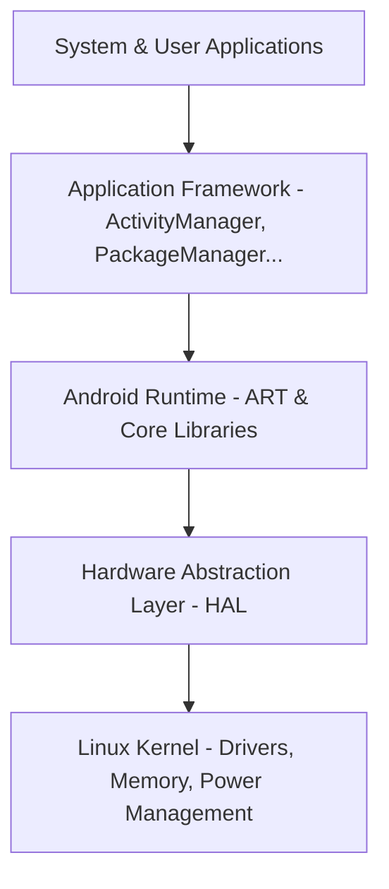

### Why it is Used
Android provides a standardized, hardware-agnostic platform for developers to build applications. Its open-source nature (Android Open Source Project - AOSP) allows device manufacturers to customize the OS while maintaining compatibility via the Compatibility Test Suite (CTS).

### How it Works Internally
Android uses a sandbox security model. Each application runs in a separate process with its own unique Linux User ID (UID) assigned at install time. This isolates processes, preventing applications from accessing each other's memory space or resources without explicit runtime permissions.

---

## 1.2 Android Runtime (ART) vs. Dalvik

### Definition
* **Dalvik:** The legacy runtime used up to Android 4.4 (KitKat) that executes Dalvik Executable (`.dex`) files.
* **ART:** The modern Android Runtime introduced in Android 5.0 (Lollipop) that executes DEX files using a hybrid Ahead-of-Time (AOT) and Just-in-Time (JIT) compilation model.

### Compilation Mechanics
1. **Dalvik DVM:** Relied on a Just-In-Time (JIT) compiler. It compiled DEX bytecode into machine code at runtime as the code was executed.
2. **ART (Early versions):** Used Ahead-of-Time (AOT) compilation via the `dex2oat` tool, compiling the entire app into native machine code (`.oat` / ELF format) during installation.
3. **ART (Modern - Android 7.0+ to Android 15):** Uses a hybrid model. The app starts with JIT. When the device is idle and charging, ART compiles frequently used paths (profile-guided compilation) into native code (AOT).

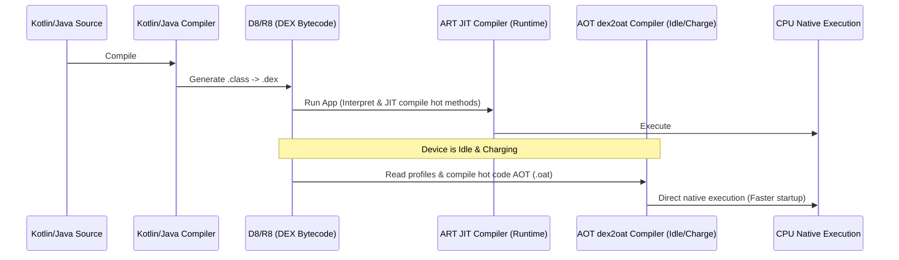

### Comparison Table

| Feature | Dalvik Virtual Machine (DVM) | Android Runtime (ART) |
|---|---|---|
| **Compilation Type** | Just-In-Time (JIT) only | Hybrid AOT + JIT (Profile-guided) |
| **App Startup Speed** | Slower (requires compilation on the fly) | Faster (executes pre-compiled native code) |
| **Installation Time** | Fast | Slower (modern ART mitigates this via post-install idle AOT) |
| **Storage Footprint** | Low (bytecode only) | Slightly higher (pre-compiled `.oat` files) |
| **Garbage Collector** | Simple stop-the-world phases | Highly optimized concurrent copy collector |
| **Battery Impact** | Higher CPU overhead at runtime | Lower runtime CPU overhead |

---

## 1.3 SDK Tools: ADB, AAPT2, D8, R8, and Build Formats

### Definition
* **ADB (Android Debug Bridge):** A command-line utility that facilitates communication between your development computer and a target device/emulator.
* **AAPT2 (Android Asset Packaging Tool 2):** Parses, indexes, and compiles Android resources into a binary format optimized for Android platforms, generating the `R.java` class.
* **D8:** The compiler that converts Java bytecode (`.class` files) into Dalvik Executable (`.dex`) files.
* **R8:** The replacement for ProGuard. It performs code shrinking, resource shrinking, optimization, and obfuscation during the DEX compilation phase.
* **APK vs. AAB:**
  * **APK (Android Package):** The final distributable package containing DEX files, raw resources, and manifest files ready for direct installation on a device.
  * **AAB (Android App Bundle):** A publishing format containing compiled code and resources in an archive format. Google Play uses the AAB to generate and serve optimized APKs tailored to specific device configurations (target ABI, screen density, language).

### Real-world ADB Commands
```bash
# Install an application
adb install path/to/app.apk

# View real-time device logs filtered by tag
adb logcat -s "MyActivityTag"

# Access the device's shell
adb shell

# Take a screenshot and save it locally
adb shell screencap -p /sdcard/screen.png
adb pull /sdcard/screen.png ./
```

---

# 2. Core Application Components & Manifest

Android apps are composed of four primary entry points, which must be declared in the `AndroidManifest.xml` file.

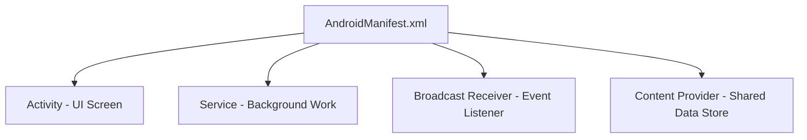

---

## 2.1 Activity & Launch Modes

### Definition
An **Activity** is an entry point representing a single screen with a User Interface (UI). It manages user interaction and handles system events.

### Activity Lifecycle Transitions
The lifecycle is defined by a state machine managed by the `ActivityThread` and monitored by the `ActivityTaskManagerService` (ATMS).

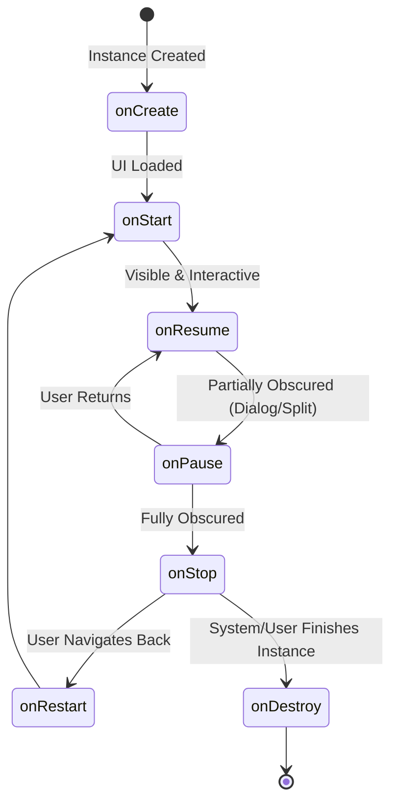

#### Transition Scenarios
1. **Activity A launches Activity B:**
   * `A.onPause()` $\rightarrow$ `B.onCreate()` $\rightarrow$ `B.onStart()` $\rightarrow$ `B.onResume()` $\rightarrow$ `A.onStop()`.
2. **Device rotated (Configuration Change):**
   * Active Activity is destroyed and recreated: `onPause()` $\rightarrow$ `onStop()` $\rightarrow$ `onDestroy()` $\rightarrow$ `onCreate()` $\rightarrow$ `onStart()` $\rightarrow$ `onResume()`.

### Launch Modes & Task Affinities
Declared using `android:launchMode` in the manifest or via Intent flags (`FLAG_ACTIVITY_NEW_TASK`, `FLAG_ACTIVITY_SINGLE_TOP`, `FLAG_ACTIVITY_CLEAR_TOP`).

1. **`standard` (Default):**
   * Creates a new instance of the Activity in the task from which it was started.
2. **`singleTop`:**
   * If an instance exists at the **top** of the target stack, Android routes the intent via `onNewIntent()` instead of creating a new instance.
3. **`singleTask`:**
   * Creates a new task and instantiates the Activity at the root of the task. If the activity already exists in another task, the system brings that task to the foreground and clears all activities above it (triggers `onNewIntent()`).
4. **`singleInstance`:**
   * Same as `singleTask`, but the system does not launch any other activities into the task holding this instance. It is always the single and unique member of its task.
5. **`singleInstancePerTask` (Android 12+):**
   * The activity can only be instantiated as the root activity of a task. It allows multiple instances in different tasks.

---

## 2.2 Services & Background Restrictions (Android 14/15)

### Definition
A **Service** is a component that performs long-running background operations without providing a user interface.

### Types of Services
* **Foreground Service:** Performs work noticeable to the user. It **must** show a non-dismissible status bar notification. In Android 14/15, you must explicitly declare a foreground service type (`android:foregroundServiceType`) in the manifest and request the corresponding permission.
* **Started Service (Background):** Initiated via `startService()`. Runs indefinitely until it stops itself (`stopSelf()`) or another component stops it (`stopService()`). Subject to background execution limits since Android 8.0.
* **Bound Service:** Initiated via `bindService()`. Provides a client-server interface using an `IBinder` implementation. It runs only as long as components are bound to it.

```kotlin
// Android 14/15 Foreground Service Example
class LocationTrackingService : Service() {
    private val binder = LocalBinder()

    inner class LocalBinder : Binder() {
        fun getService(): LocationTrackingService = this@LocationTrackingService
    }

    override fun onBind(intent: Intent): IBinder = binder

    override fun onStartCommand(intent: Intent?, flags: Int, startId: Int): Int {
        createNotificationChannel()
        val notification = NotificationCompat.Builder(this, CHANNEL_ID)
            .setContentTitle("Location Tracking Active")
            .setSmallIcon(R.drawable.ic_location)
            .setForegroundServiceBehavior(NotificationCompat.FOREGROUND_SERVICE_IMMEDIATE)
            .build()
        
        // Starting foreground service with type (Required Android 14+)
        ServiceCompat.startForeground(
            this,
            NOTIFICATION_ID,
            notification,
            if (Build.VERSION.SDK_INT >= Build.VERSION_CODES.UPSIDE_DOWN_CAKE) {
                ServiceInfo.FOREGROUND_SERVICE_TYPE_LOCATION
            } else 0
        )
        return START_STICKY
    }
}
```

---

## 2.3 Broadcast Receiver & Content Providers

### Broadcast Receiver
A component that listens for system-wide or application-level broadcast announcements.

* **Static Registration:** Declared in the manifest (`<receiver>`). Since Android 8.0, static registration is severely restricted for implicit broadcasts.
* **Dynamic Registration:** Registered programmatically using `Context.registerReceiver()`. Must be unregistered in lifecycle teardown methods to prevent context leaks.

```kotlin
// Dynamic Registration Example
class NetworkStateReceiver : BroadcastReceiver() {
    override fun onReceive(context: Context, intent: Intent) {
        val isAirplaneModeOn = intent.getBooleanExtra("state", false)
        Log.d("Receiver", "Airplane mode state changed: $isAirplaneModeOn")
    }
}

// Activity Usage
class MainActivity : AppCompatActivity() {
    private val receiver = NetworkStateReceiver()

    override fun onStart() {
        super.onStart()
        registerReceiver(
            receiver, 
            IntentFilter(Intent.ACTION_AIRPLANE_MODE_CHANGED),
            RECEIVER_EXPORTED // Android 14 requirement
        )
    }

    override fun onStop() {
        super.onStop()
        unregisterReceiver(receiver) // Prevent memory leaks
    }
}
```

### Content Providers
Encapsulates application data (usually an underlying SQLite database) and exposes it to other apps via a standard query interface (`content://` URIs).

* **Why it exists:** Enforces app sandboxing while providing secure, permission-controlled, transactional inter-process communication (IPC) for structured data.
* **Components:** Implements CRUD operations (`query()`, `insert()`, `update()`, `delete()`) and uses `UriMatcher` to parse incoming client URIs.

---

## 2.4 Binder IPC Architecture

### Definition
* **Simple:** Binder is the mechanism Android uses to let different applications or system services communicate and share data with each other safely.
* **Advanced:** Binder is a Linux kernel-based driver (`/dev/binder`) that provides inter-process communication (IPC) and remote procedure calls (RPC) using a client-server architecture, memory mapping, and AIDL-defined interfaces.

```mermaid
graph TD
    Client[Client App Process] -->|1. Marshals params into Parcel| Proxy[Proxy - Client Stub]
    Proxy -->|2. ioctl transaction| Driver[/dev/binder Driver]
    Driver -->|3. Single Copy mmap| Stub[Stub - Server Implementation]
    Stub -->|4. Unmarshals Parcel| Server[Server System Process]
```

### How it Works Internally
1. **Single-Copy Data Transfer (`mmap`):** Standard Linux IPC systems require copying data twice (User Space A &rarr; Kernel Space &rarr; User Space B). Binder maps a shared virtual memory region (using `mmap()`) between the kernel and the receiving process's address space. When a transaction occurs, the kernel copies data directly from the sender's user space into the receiver's mapped memory buffer once, saving CPU cycles.
2. **Transaction Buffer Limit (1MB):** The Binder transaction buffer is capped at **1MB** per process, shared across all ongoing transactions. If an application attempts to pass large files (like high-res bitmaps) or large data lists via Intents, Services, or Content Providers, it throws a `TransactionTooLargeException`.
3. **AIDL (Android Interface Definition Language):** Defines programming interfaces that client and server agree on. The AIDL compiler generates the `Proxy` class (used by the client to marshal data into a `Parcel` and execute `transact()`) and the `Stub` class (used by the server to execute `onTransact()` and unmarshal data).

---

## 2.5 Context Hierarchy & Window Tokens

### Definition
* **Simple:** Context represents the handle to Android system resources and services. Different types of contexts (like Application vs. Activity) have different capabilities.
* **Advanced:** Context is an abstract class implemented by `ContextImpl`. It is decorated by `ContextWrapper` subclasses (`Activity`, `Service`, `Application`) to delegate resource lookup and system operations.

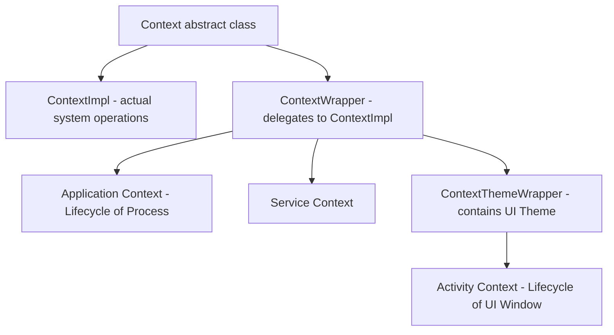

### Comparison: Context Capabilities

| Context Type | Can Start Activity? | Can Inflate Layout? | Can Show Dialogs? |
|---|---|---|---|
| **Application** | Yes (requires `FLAG_ACTIVITY_NEW_TASK`) | Yes (inherits system theme, not app theme) | No (throws `BadTokenException`) |
| **Activity** | Yes | Yes | Yes (owns valid Window Token) |
| **Service** | Yes (requires `FLAG_ACTIVITY_NEW_TASK`) | Yes | No |

### Window Tokens & BadTokenException
* **Window Token:** A unique binder token generated by the `WindowManagerService` (WMS) that authorizes a client to draw a window layer on the screen.
* **Why Application Context fails:** An `Application` context does not have a `WindowToken` associated with a physical screen layer. Attempting to display dialogs or popup windows using the Application Context causes the system to throw a `WindowManager.BadTokenException`.

---

# 3. UI Layouts, Views, and Fragments

## 3.1 Layout Performance & ConstraintLayout

### View Tree Rendering Pipeline
When a layout is loaded, the system performs a three-pass traversal of the View hierarchy:

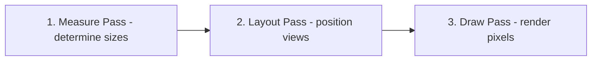

### Layout Comparison

| Layout Class | Hierarchy Type | Best Use Case | Performance Cost |
|---|---|---|---|
| **LinearLayout** | Linear (Vertical/Horizontal) | Simple, single-row/column items | Low (increases to High if nested with layout weights) |
| **RelativeLayout** | Relative (Sibling/Parent) | Simple relative positions | High (performs double measure passes on children) |
| **FrameLayout** | Stack (Overlapping views) | Single child holder, Fragment containers | Very Low |
| **ConstraintLayout** | Flat | Complex, responsive UI designs | Extremely Low (eliminates nested view hierarchies) |

---

## 3.2 RecyclerView Internals

### How RecyclerView Works Internally
`RecyclerView` optimizes scrolling lists by recycling view objects instead of inflating a new view for every data item. It uses the `Recycler` class, which holds several caching layers:

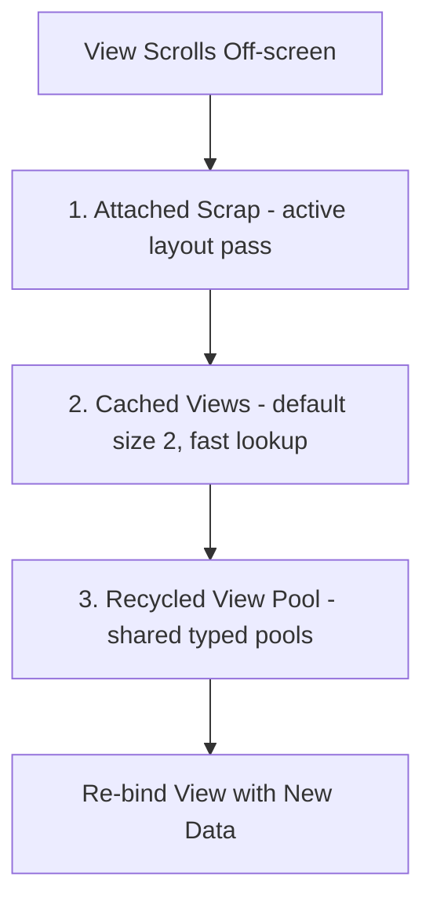

1. **Scrap Heap (Attached Scrap / Changed Scrap):** Temporarily detached views that are still active in the current layout pass.
2. **Cached Views (mCachedViews):** Contains views that were recently scrolled off. They can be re-added without re-binding data. (Default limit is 2).
3. **RecycledViewPool:** Contains views categorized by `viewType`. Views retrieved from the pool must undergo the `onBindViewHolder()` data binding phase.

### ListAdapter vs. RecyclerView.Adapter
* **`RecyclerView.Adapter`:** Requires manual data set mutation notifications (`notifyDataSetChanged()` or granular updates).
* **`ListAdapter`:** Built on top of `AsyncListDiffer`. It compares old and new lists on a background thread using the **DiffUtil** algorithm and dispatches minimal update commands to the RecyclerView, preventing redundant rendering.

```kotlin
class UserAdapter : ListAdapter<User, UserAdapter.UserViewHolder>(UserDiffCallback) {

    object UserDiffCallback : DiffUtil.ItemCallback<User>() {
        override fun areItemsTheSame(oldItem: User, newItem: User): Boolean = oldItem.id == newItem.id
        override fun areContentsTheSame(oldItem: User, newItem: User): Boolean = oldItem == newItem
    }

    override fun onCreateViewHolder(parent: ViewGroup, viewType: Int): UserViewHolder {
        val binding = ItemUserBinding.inflate(LayoutInflater.from(parent.context), parent, false)
        return UserViewHolder(binding)
    }

    override fun onBindViewHolder(holder: UserViewHolder, position: Int) {
        holder.bind(getItem(position))
    }

    class UserViewHolder(private val binding: ItemUserBinding) : RecyclerView.ViewHolder(binding.root) {
        fun bind(user: User) {
            binding.txtName.text = user.name
        }
    }
}
```

---

## 3.3 Fragment Lifecycle

A **Fragment** represents a modular, reusable portion of an Activity's user interface. Its lifecycle is tied to its host Activity but contains extra states for managing its View hierarchy.

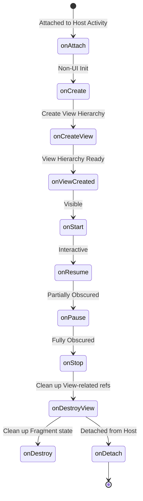

### Critical Fragment Lifecycle Gotcha
* **Memory Leaks in Fragments:** The Fragment instance and the Fragment's view hierarchy have different lifetimes. The View is destroyed when a Fragment goes into the backstack (`onDestroyView()`), but the Fragment instance persists.
* **Best Practice:** You must set UI bindings to `null` in `onDestroyView()` to release memory references to views, and observe LiveData/Flows using `viewLifecycleOwner` instead of `this`.

---

# 4. Jetpack Architecture & State Management

## 4.1 Modern Architecture (MVVM / MVI)

* **MVVM (Model-View-ViewModel):** Exposes UI state from the ViewModel using observables (LiveData, Flow). The View binds to these states and updates automatically.
* **MVI (Model-View-Intent):** Enforces unidirectional data flow (UDF). The View sends UI "Intents" (actions) to a processor, which updates a single immutable State object, which is then emitted back to the View.

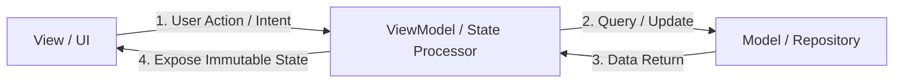

---

## 4.2 ViewModel & SavedStateHandle

### Definition
A **ViewModel** is a Jetpack Architecture Component designed to store and manage UI-related data in a lifecycle-conscious way.

### How ViewModel Works Internally
During configuration changes (e.g., screen rotation), the system destroys the Activity instance. However, the `ViewModelStore` holding the ViewModels is retained.

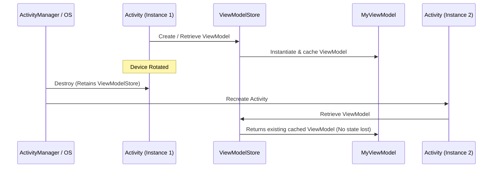

1. The `ViewModelProvider` retrieves ViewModels from a `ViewModelStore` associated with the activity or fragment (`ViewModelStoreOwner`).
2. When the activity is destroyed due to configuration changes, `Activity.onDestroy()` is called, but the `ViewModelStore` instance is preserved inside `NonConfigurationInstances`.
3. When the activity is recreated, the new activity instance attaches to the existing `ViewModelStore` and retrieves the identical ViewModel instance.
4. When the activity is closed permanently (finished), the system clears the `ViewModelStore` and calls `onCleared()` on the ViewModels to release resources.

### SavedStateHandle
When an application process is killed in the background by the OS to reclaim memory (Process Death), ViewModels are destroyed. `SavedStateHandle` allows saving and restoring state across process death using a key-value map.

---

## 4.3 State Holders: LiveData vs. StateFlow vs. SharedFlow

### Definitions
* **LiveData:** An active, lifecycle-aware observable data holder. It always updates observers on the main thread and only when they are in an active state (`STARTED` or `RESUMED`).
* **StateFlow:** A hot Flow from Kotlin Coroutines that represents a state-holding stream. It always holds a value, requires an initial value, and emits the latest state to new collectors (conflation).
* **SharedFlow:** A hot Flow that does not require an initial value and is optimized for emitting event streams (like toast messages, navigation events) to multiple collectors.

### Comparison Table

| Feature | LiveData | StateFlow | SharedFlow |
|---|---|---|---|
| **Lifecycle Aware** | Yes (Built-in) | No (Requires `repeatOnLifecycle`) | No (Requires `repeatOnLifecycle`) |
| **Initial Value** | Not required | Required | Not required |
| **Hot/Cold Stream** | Hot | Hot | Hot |
| **Threading** | Tied to Main Thread | Coroutine Dispatcher flexible | Coroutine Dispatcher flexible |
| **Conflation** | Yes (emits only latest value) | Yes (emits only latest value) | Optional (configurable replay buffer) |
| **Reactive Operators** | Limited | Rich (Kotlin Flow APIs) | Rich (Kotlin Flow APIs) |

### Modern Safe Flow Collection
To collect Flows safely in Android, use `repeatOnLifecycle` or `flowWithLifecycle` to prevent resource waste when the UI is in the background.

```kotlin
class UserActivity : AppCompatActivity() {
    private val viewModel: UserViewModel by viewModels()
    private lateinit var textView: TextView

    override fun onCreate(savedInstanceState: Bundle?) {
        super.onCreate(savedInstanceState)
        setContentView(R.layout.activity_main)

        // Safe Flow collection
        lifecycleScope.launch {
            repeatOnLifecycle(Lifecycle.State.STARTED) {
                viewModel.uiState.collect { state ->
                    textView.text = state.userName
                }
            }
        }
    }
}
```

---

# 5. Threading, Concurrency & Reactive Streams

## 5.1 Kotlin Coroutines Internals

### Definition
Coroutines are light-weight execution threads that execute asynchronously and are non-blocking.

### Under the Hood: Suspension Points and State Machine
How does a coroutine pause execution without blocking the underlying thread?
* The Kotlin compiler transforms suspending functions into a **State Machine** using a **Continuation Passing Style (CPS)**.
* Every suspending function receives an extra parameter of type `Continuation<T>` at compile time.

```kotlin
// Source Code
suspend fun fetchUser(): User {
    val id = getUserId() // Suspending
    return apiService.getUserDetail(id) // Suspending
}

// Compiled Code (Simplified Concept)
fun fetchUser(completion: Continuation<Any?>): Any? {
    class FetchUserStateMachine : ContinuationImpl(completion) {
        var label = 0
        var result: Any? = null
        override fun invokeSuspend(result: Any?) {
            this.result = result
            this.label = this.label or Int.MIN_VALUE
            return fetchUser(this)
        }
    }
    
    val sm = completion as? FetchUserStateMachine ?: FetchUserStateMachine()
    switch(sm.label) {
        case 0:
            sm.label = 1
            val id = getUserId(sm) // Passes state machine as continuation
            if (id == COROUTINE_SUSPENDED) return COROUTINE_SUSPENDED
        case 1:
            sm.label = 2
            val user = apiService.getUserDetail(sm.result as String, sm)
            if (user == COROUTINE_SUSPENDED) return COROUTINE_SUSPENDED
            return user
    }
}
```
When a coroutine hits a suspension point, the function saves its local variables to the state machine, returns `COROUTINE_SUSPENDED`, and frees up the physical thread. Once the background process completes, the `Continuation` object calls `resumeWith()`, reloading the saved state and resuming execution at the correct label.

### Coroutine Scope and Dispatchers
* **`Dispatchers.Main`:** Executes on the main thread (uses Android Looper).
* **`Dispatchers.IO`:** Optimized for disk or network tasks (backed by a dynamic shared pool of threads).
* **`Dispatchers.Default`:** Optimized for CPU-intensive work (backed by a pool size equal to the CPU core count).

---

## 5.2 RxJava Reactive Streams

### Definition
RxJava is a library for composing asynchronous and event-based programs by using observable sequences.

* **Observable:** Emits a stream of data elements.
* **Observer:** Consumes emissions from the Observable.
* **Schedulers:** Controls concurrency (`Schedulers.io()`, `AndroidSchedulers.mainThread()`).
* **Disposable:** Represents the link between subscription and emissions. It must be cleared (`CompositeDisposable`) to prevent memory leaks when the UI is destroyed.

```kotlin
// RxJava Network Call Example
class UserRepository(private val apiService: ApiService) {
    private val disposables = CompositeDisposable()

    fun loadUserData() {
        disposables.add(
            apiService.getUserProfile()
                .subscribeOn(Schedulers.io()) // Run network request on IO thread
                .observeOn(AndroidSchedulers.mainThread()) // Receive on Main Thread
                .subscribe(
                    { profile -> updateUI(profile) },
                    { error -> handleError(error) }
                )
        )
    }

    fun clear() {
        disposables.clear() // Prevent memory leaks
    }
}
```

## 5.3 Handler, Looper, and MessageQueue Internals

### Definition
* **Simple:** Handlers and Loopers allow you to send messages between different threads, such as running a background task and sending the result back to update the main UI thread.
* **Advanced:** The Handler-Looper-MessageQueue framework is Android's native event-loop mechanism. It consists of a `MessageQueue` that stores serialized execution tasks, a `Looper` that continuously pulls tasks from the queue, and a `Handler` that posts or processes those tasks on the associated thread.

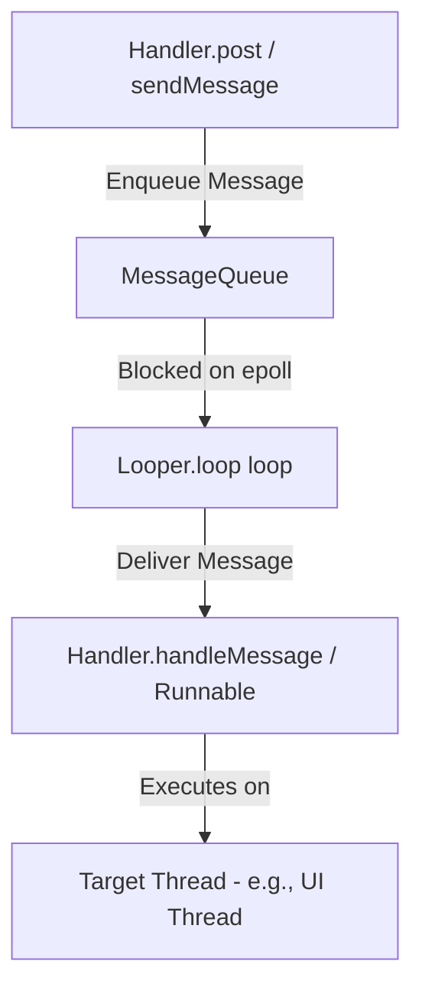

### How it Works Internally
1. **Thread Thread-Local Storage (TLS):** A thread must call `Looper.prepare()` (done automatically for the main thread by `ActivityThread`) to instantiate a `Looper` and bind it to the thread via `ThreadLocal`.
2. **The Event Loop (`Looper.loop()`):** Runs an infinite loop on the thread. It queries `MessageQueue.next()`.
3. **Linux epoll blocking:** To prevent the CPU from running at 100% load during idle states, `MessageQueue` blocks the thread using the Linux `epoll_wait` system call on a pipe file descriptor. The thread goes to sleep and is woken up by the kernel only when a new message is posted.
4. **Synchronization Barriers:** A synchronization barrier is a message with a null `target` (`msg.target == null`) injected into the queue. When the `MessageQueue` encounters a barrier, it suspends execution of all subsequent **synchronous** messages, but allows **asynchronous** messages (e.g., UI measurement and draw commands posted by the `Choreographer`) to pass through. This ensures layout traversals bypass background work, maintaining smooth UI rendering.

## 5.4 Advanced System Resource Management

### Binder Memory Mapping (mmap)
Binder enables Inter-Process Communication (IPC) by using `mmap()` to allocate a 1MB memory buffer in the receiving process's kernel address space. This allows data to be copied from the sender's process into the shared kernel buffer, which is then mapped into the recipient's virtual memory space, minimizing data copies between processes.

### LMK (Low Memory Killer) Score Allocation
The Android LMK uses `oom_adj` scores (now handled via `lmkd`) to decide which processes to kill. Processes are categorized by their importance:
* **Foreground:** High score, last to be killed.
* **Visible/Service/Background:** Lower scores, reclaimed when system pressure increases.
* **Empty:** Reclaimed first to free up memory for active tasks.

### ART Concurrent Copying (CC) GC
The ART (Android Runtime) uses a Concurrent Copying Garbage Collector. It moves objects during the "root scan" and "marking" phases while the application continues to run. By moving objects in the heap concurrently, it eliminates the need for a "Stop-the-World" pause, significantly reducing UI jank during GC cycles.

---

# 6. Data Storage & Networking

## 6.1 Room Database Architecture

Room is a Jetpack data storage component providing an abstraction layer over SQLite.

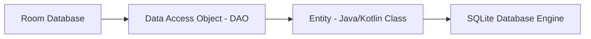

### Components
1. **Entity:** Represents a table within the database. Annotations like `@Entity` and `@PrimaryKey` map properties to columns.
2. **DAO (Data Access Object):** Contains methods used for querying, inserting, and deleting data. Room validates SQL queries in DAOs at compile time.
3. **RoomDatabase:** Serves as the database controller and main access point to the connection.

### Migration Mechanics
When you modify database tables, you must increment the database version and provide a `Migration` implementation to avoid app crashes.

```kotlin
val MIGRATION_1_2 = object : Migration(1, 2) {
    override fun migrate(db: SupportSQLiteDatabase) {
        // Execute SQL statement to modify schema
        db.execSQL("ALTER TABLE User ADD COLUMN age INTEGER NOT NULL DEFAULT 0")
    }
}

// Room Database Builder
Room.databaseBuilder(context, AppDatabase::class.java, "app-db")
    .addMigrations(MIGRATION_1_2)
    .build()
```

---

## 6.2 SharedPreferences vs. DataStore

### Comparison Table

| Feature | SharedPreferences | Jetpack DataStore (Preferences/Proto) |
|---|---|---|
| **API Style** | Synchronous (blocking calls) | Asynchronous API (uses Kotlin Coroutines & Flow) |
| **Thread Safety** | No (unsafe modifications from background) | Yes (safe to call from UI/background threads) |
| **Exception Handling** | Throws runtime exceptions on parser errors | Catchable input/output exceptions |
| **Transaction support** | No | Yes (transactional data updates via `DataStore`) |
| **Type Safety** | No | Yes (Proto DataStore) |

---

## 6.3 Networking Stack (Retrofit & OkHttp)

* **Retrofit:** A type-safe HTTP client library that maps HTTP API endpoints directly to Kotlin/Java interfaces.
* **OkHttp:** The underlying client engine that handles socket connections, requests execution, connection pooling, and payload compression.

### The Interceptor Pipeline
OkHttp passes outbound requests and inbound responses through a chain of interceptors:

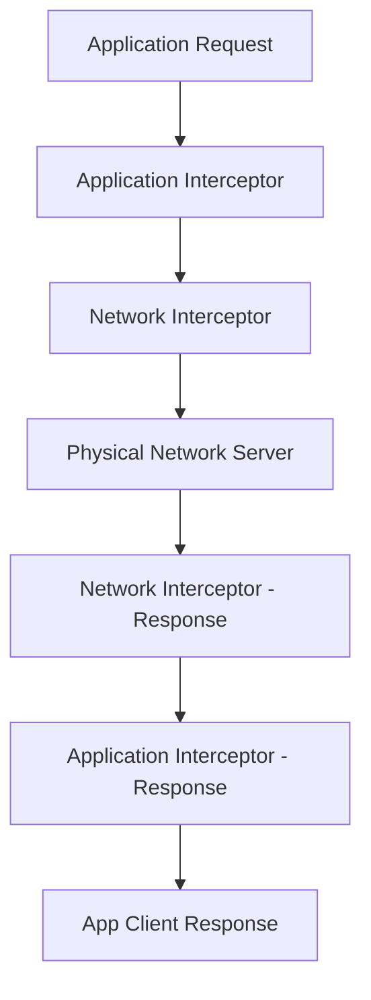

* **Application Interceptor:** Runs at the top level. Always called once, even if the response is served from the cache. Ideal for adding custom headers.
* **Network Interceptor:** Runs between OkHttp and the physical network. Allows monitoring redirects and raw headers traveling over the wire.

```kotlin
// Custom Auth Interceptor
class AuthInterceptor(private val tokenProvider: TokenProvider) : Interceptor {
    override fun intercept(chain: Interceptor.Chain): Response {
        val originalRequest = chain.request()
        val authenticatedRequest = originalRequest.newBuilder()
            .header("Authorization", "Bearer ${tokenProvider.getToken()}")
            .build()
        return chain.proceed(authenticatedRequest)
    }
}
```

---

# 7. Background Execution & Pagination

## 7.1 WorkManager Internals

### Definition
WorkManager is the recommended background scheduler for deferrable, guaranteed background tasks that must run even if the app closes or the device restarts.

### How it Works Internally
WorkManager chooses the most efficient scheduling mechanism depending on the OS version and system states.

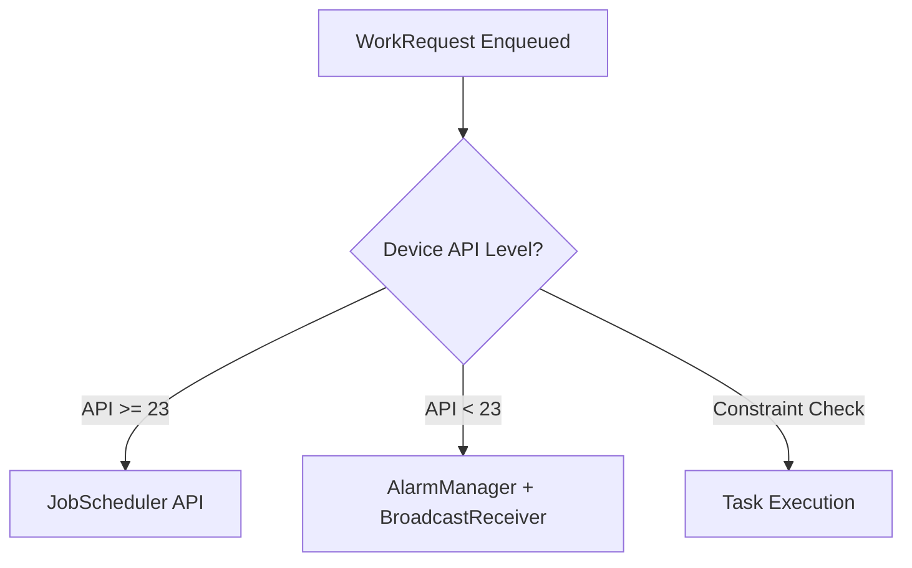

* Under the hood, it stores task metadata in a Room database file to ensure tasks survive device restarts.
* It uses **JobScheduler** on API 23+, and falls back to a custom configuration of **AlarmManager** + **BroadcastReceiver** on older devices.
* It monitors system constraints (battery charging, active Wi-Fi, storage availability) and schedules execution windows when all conditions are satisfied.

```kotlin
// Example Coroutine Worker
class CacheSyncWorker(
    context: Context,
    params: WorkerParameters
) : CoroutineWorker(context, params) {

    override suspend fun doWork(): Result {
        return try {
            // Perform background sync operation
            syncCacheData()
            Result.success()
        } catch (e: Exception) {
            if (runAttemptCount < 3) {
                Result.retry() // Reschedule work based on backoff policy
            } else {
                Result.failure()
            }
        }
    }
}
```

---

## 7.2 Paging 3 Architecture

The Paging 3 library helps load data in blocks as the user scrolls, optimizing memory and network bandwidth.

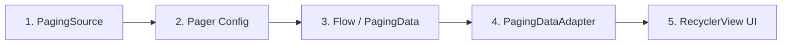

1. **PagingSource:** Fetches incremental pages of data from a raw source (like a REST API or SQLite).
2. **RemoteMediator:** Coordinates loading data from the network into the database cache for offline usage.
3. **Pager:** Configures the paging parameters (like `pageSize`, `prefetchDistance`) and generates the `Flow<PagingData<Value>>`.
4. **PagingDataAdapter:** Integrates with the RecyclerView, displaying data elements and handling loading state callbacks automatically.

---

# 8. Dependency Injection (DI)

## 8.1 Dagger 2 vs. Hilt vs. Koin

### Comparison Table

| Feature | Dagger 2 | Hilt | Koin |
|---|---|---|---|
| **Compilation vs. Runtime** | Compile-time validation | Compile-time validation | Runtime validation |
| **Reflection / Codegen** | Annotation processing (no reflection) | Annotation processing + Bytecode manipulation | Pure Kotlin DSL (no reflection/codegen) |
| **Boilerplate Code** | High (must define components & graphs) | Low (Google pre-defines standard components) | Extremely Low |
| **Android Integration** | Manual setup required | Direct annotations (`@AndroidEntryPoint`) | Simple extension functions (`by inject()`) |
| **Performance Impact** | Nil at runtime, increases build times | Nil at runtime, increases build times | Small runtime lookup overhead |

---

## 8.2 Hilt Implementation Reference

Hilt is a wrapper built around Dagger 2, standardizing dependency injection in Android apps.

```kotlin
// 1. Application setup
@HiltAndroidApp
class BaseApplication : Application()

// 2. Network Module
@Module
@InstallIn(SingletonComponent::class)
object NetworkModule {

    @Provides
    @Singleton
    fun provideOkHttpClient(): OkHttpClient {
        return OkHttpClient.Builder().build()
    }

    @Provides
    @Singleton
    fun provideRetrofit(okHttpClient: OkHttpClient): Retrofit {
        return Retrofit.Builder()
            .baseUrl("https://api.example.com/")
            .client(okHttpClient)
            .build()
    }
}

// 3. Injecting ViewModel
@HiltViewModel
class MainViewModel @Inject constructor(
    private val repository: UserRepository
) : ViewModel()

// 4. Injecting Activity
@AndroidEntryPoint
class MainActivity : AppCompatActivity() {
    private val viewModel: MainViewModel by viewModels()
}
```

---

# 9. Performance, Security, and Diagnostics

## 9.1 Memory Leaks & Garbage Collection (ART)

### Definition
A **Memory Leak** occurs when an application retains references to objects that are no longer needed, preventing the Garbage Collector (GC) from reclaiming their memory.

### Low Memory Killer Daemon (LMKD)
When system memory is depleted, the kernel's `lmkd` daemon terminates cached processes to allocate resources to foreground applications.
* **`oom_score_adj`:** Each running process is assigned a score ranging from **-1000** (system process, never kill) to **1000** (cached background app, kill first).
* **Process Priority States:**
  1. **Foreground Process (oom_score_adj: 0):** Currently visible activity, executing foreground service, or active broadcast receiver.
  2. **Visible Process (oom_score_adj: 100-200):** Visible but not interactive (e.g., activity covered by a dialog).
  3. **Service Process (oom_score_adj: 500):** Service running in background (e.g., media playback or sync).
  4. **Cached/Empty Process (oom_score_adj: 900-1000):** App hosted in background backstack. Reclaimed immediately under memory pressure.

### ART Garbage Collection (GC) Internals
Modern Android Runtime (ART) uses a **Concurrent Copying (CC) GC** collector to reclaim memory.
1. **Concurrent Collection:** ART performs the GC pass concurrently with app execution using a **read barrier** mechanism. When the app thread reads an object pointer, the read barrier intercepts it and redirects it if the object is being relocated.
2. **Generational Collection:** Divides the heap into young and old generations. Young objects (new allocations) are garbage collected frequently (minor GC) using copying mechanisms. Surviving objects are promoted to the old generation.
3. **Heap Compaction:** Rather than leaving free memory fragmented, ART moves active objects to a contiguous memory region, eliminating memory fragmentation and reducing the likelihood of `OutOfMemoryError` (OOM) due to allocation mismatches.

### Common Memory Leak Scenarios
1. **Holding Context References:** Storing a static reference to an `Activity` or passing an Activity `Context` to a long-lived Singleton instance.
2. **Unregistered Listeners:** Forgetting to unregister BroadcastReceivers, location update listeners, or RxJava subscriptions in lifecycle teardown methods.
3. **Anonymous Inner Classes / Handlers:** Non-static inner classes hold an implicit reference to their outer class. A background task running inside an inner class can leak the entire activity.

```kotlin
// Memory Leak Example
class LeakyActivity : AppCompatActivity() {
    companion object {
        // Leaks the Activity context globally because static fields live as long as the App process
        lateinit var leakyContext: Context 
    }

    override fun onCreate(savedInstanceState: Bundle?) {
        super.onCreate(savedInstanceState)
        leakyContext = this
    }
}
```

### Diagnostics (LeakCanary)
`LeakCanary` runs inside your debug application, listening to activity and fragment lifecycle destructions. It keeps weak references to these instances. If they are not collected after 5 seconds, it forces a GC pass, dumps the heap (`.hprof` file), and parses it to trace the shortest path of strong references holding the object (the leak trace).

---

## 9.2 Application Not Responding (ANR)

### Definition
An **ANR (Application Not Responding)** error occurs when the main thread (UI thread) of an Android application is blocked for too long.

### ANR Thresholds
* **Input dispatching timeout:** A user event (e.g., screen touch) is not processed within **5 seconds**.
* **Broadcast Receiver timeout:** A BroadcastReceiver does not finish executing within **10 seconds** (for foreground receivers).
* **Service execution timeout:** A Service does not complete execution within **20 seconds** (for foreground services).

### Prevention
1. Never perform network operations, heavy computations, or disk read/write calls on the main thread.
2. Use Coroutines with appropriate Dispatchers (`Dispatchers.IO`) for background workloads.
3. Use profiling tools (Traceview, Android Profiler) to monitor layout passes and thread execution.

---

## 9.3 Security Best Practices

1. **Network Security Config:** Enforce HTTPS connections. Disallow cleartext HTTP traffic unless explicitly configured for testing.
2. **Android Keystore System:** Secure sensitive cryptographic keys by storing them in a dedicated hardware container (TEE/SE), making them extraction-resistant.
3. **EncryptedDataStore:** Encrypt preference values on disk using AES-GCM cryptography.
4. **Code Obfuscation (R8):** Shrink, optimize, and obfuscate your codebase to make reverse engineering difficult.

---

# 10. Core Interview Questions & Answers

### Q. How does a custom view work in Android?
* **Answer:** A custom view is created by extending the `View` class (or existing widgets like `TextView`). To render custom graphics, you override the lifecycle methods:
  1. `onMeasure(widthSpec, heightSpec)`: Determines the dimensions of the view.
  2. `onLayout(changed, left, top, right, bottom)`: Assigns a size and position to all of its children.
  3. `onDraw(canvas)`: Renders drawing operations (using a `Canvas` and `Paint` objects).
* **Follow-up:** *How do you optimize `onDraw`?*  
  *Never allocate objects (like `Paint` or `Path`) inside `onDraw()` because it is called up to 60 or 120 times per second, and allocations will trigger garbage collection pauses, causing UI stutter (jank).*

### Q. What is the difference between `launch` and `async` in Coroutines?
* **Answer:** Both are coroutine builders used to launch new asynchronous tasks.
  * **`launch`:** Starts a coroutine and returns a `Job` object. It uses a "fire-and-forget" model, throwing unhandled exceptions directly up to the parent handler.
  * **`async`:** Starts a coroutine and returns a `Deferred<T>` object. It allows you to retrieve a result value by calling `await()`. Exceptions occurring inside `async` are captured and thrown only when `await()` is called.

### Q. What happens if a Foreground Service is started in the background on Android 14+?
* **Answer:** Starting from Android 12, and heavily enforced in Android 14/15, the OS restricts apps from launching foreground services while the app is in the background. Doing so throws a `ForegroundServiceStartNotAllowedException` unless the app satisfies specific exclusion categories (e.g., handling Bluetooth connections, high-priority FCM push messages, companion device association, or system alarms).
