# 🤖 Android Technical Interview Preparation Guide (2–5 Years Experience)

> **Authoritative Technical Reference**
> Deep architectural coverage for Android developers with 2–5 years of experience. Every topic follows the same structure — **Definition → Why It Is Used → How It Works Internally → Code Example → Common Pitfalls** — with comparison tables and diagrams where they clarify the mechanism.
>
> Updated for **Android 16 (API 36)**, **Kotlin 2.x**, **Jetpack Compose**, **Media3**, **Hilt/Koin**, and current Play policy.
>
> Contains deep architectural coverage and **215 core interview questions** directly integrated under [Section 15](#15-core-android-interview-questions-bank).

---

## 📑 Table of Contents

| # | Module | Key Topics |
|---|---|---|
| 1 | [Android System & SDK Architecture](#1-android-system--sdk-architecture) | Platform stack, ART vs Dalvik, SDK tools, R8, APK/AAB & signing, API 12→16 changes |
| 2 | [Core Application Components & Manifest](#2-core-application-components--manifest) | Activity & launch modes, Services, Receivers, Providers, Binder, Context, Intents & deep links, permissions, notifications, config change & process death |
| 3 | [UI Layouts, Views, and Fragments](#3-ui-layouts-views-and-fragments) | Layout performance, RecyclerView internals, Fragment lifecycle, custom views, touch dispatch, Choreographer & jank |
| 4 | [Jetpack Architecture & State Management](#4-jetpack-architecture--state-management) | MVVM/MVI, ViewModel & SavedStateHandle, LiveData vs StateFlow, lifecycle components, Navigation, ViewBinding |
| 5 | [Threading, Concurrency & Reactive Streams](#5-threading-concurrency--reactive-streams) | Coroutine internals, RxJava, Handler/Looper, structured concurrency, Flow operators, JVM primitives |
| 6 | [Data Storage & Networking](#6-data-storage--networking) | Room, DataStore, Retrofit/OkHttp, serialization, image loading, offline-first, error modelling |
| 7 | [Background Execution & Pagination](#7-background-execution--pagination) | WorkManager, Paging 3, scheduler selection, Doze & standby buckets, FCM |
| 8 | [Dependency Injection](#8-dependency-injection-di) | Dagger vs Hilt vs Koin, components & scopes, assisted injection, multibinding |
| 9 | [Performance, Security & Diagnostics](#9-performance-security-and-diagnostics) | Leaks & GC, ANR, security practices, startup & Baseline Profiles, profiling tools, app size |
| 10 | [Media, Camera & Device APIs](#10-media-camera-and-device-apis) | CameraX, Media3/ExoPlayer, location, sensors, biometrics |
| 11 | [Firebase & Google Play Services](#11-firebase-and-google-play-services) | Crashlytics, Analytics, Remote Config, Play Integrity, in-app updates, review, billing |
| 12 | [Modern Platform UI](#12-modern-platform-ui-edge-to-edge-predictive-back-and-adaptive-layouts) | Edge-to-edge & insets, predictive back, foldables & window size classes |
| 13 | [Accessibility & Internationalization](#13-accessibility-and-internationalization) | TalkBack semantics, contrast & targets, plurals, RTL, per-app language |
| 14 | [Interoperability](#14-interoperability-java--kotlin-and-views--compose) | Java↔Kotlin interop, ComposeView & AndroidView |
| 15 | [Interview Questions](#15-core-android-interview-questions-bank) | 215 Core Android interview Q&As across 8 topic areas |

---

# 1. Android System & SDK Architecture

## 1.1 What is Android?

### Definition
* **Simple:** Android is an open-source operating system designed for touchscreen mobile devices, TVs, watches, and cars.
* **Advanced:** Android is a multi-user, Linux-based software stack. It consists of a hardened Linux kernel, a native C/C++ libraries layer, the Android Runtime (ART), a Java/Kotlin Application Framework, and pre-installed system applications.

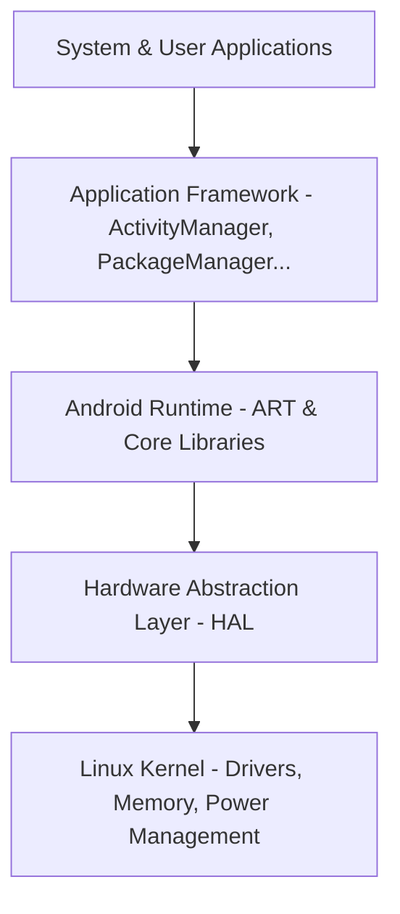

### Why It Is Used
Android provides a standardized, hardware-agnostic platform for developers to build applications. Its open-source nature (Android Open Source Project - AOSP) allows device manufacturers to customize the OS while maintaining compatibility via the Compatibility Test Suite (CTS).

### How It Works Internally
Android uses a sandbox security model. Each application runs in a separate process with its own unique Linux User ID (UID) assigned at install time. This isolates processes, preventing applications from accessing each other's memory space or resources without explicit runtime permissions.

---

## 1.2 Android Runtime (ART) vs. Dalvik

### Definition
* **Dalvik:** The legacy runtime used up to Android 4.4 (KitKat) that executes Dalvik Executable (`.dex`) files.
* **ART:** The modern Android Runtime introduced in Android 5.0 (Lollipop) that executes DEX files using a hybrid Ahead-of-Time (AOT) and Just-in-Time (JIT) compilation model.

### Compilation Mechanics
1. **Dalvik DVM:** Relied on a Just-In-Time (JIT) compiler. It compiled DEX bytecode into machine code at runtime as the code was executed.
2. **ART (Early versions):** Used Ahead-of-Time (AOT) compilation via the `dex2oat` tool, compiling the entire app into native machine code (`.oat` / ELF format) during installation.
3. **ART (Modern - Android 7.0+ to Android 15):** Uses a hybrid model. The app starts with JIT. When the device is idle and charging, ART compiles frequently used paths (profile-guided compilation) into native code (AOT).

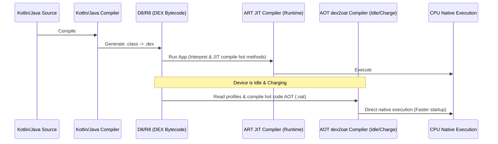

### Comparison Table

| Feature | Dalvik Virtual Machine (DVM) | Android Runtime (ART) |
|---|---|---|
| **Compilation Type** | Just-In-Time (JIT) only | Hybrid AOT + JIT (Profile-guided) |
| **App Startup Speed** | Slower (requires compilation on the fly) | Faster (executes pre-compiled native code) |
| **Installation Time** | Fast | Slower (modern ART mitigates this via post-install idle AOT) |
| **Storage Footprint** | Low (bytecode only) | Slightly higher (pre-compiled `.oat` files) |
| **Garbage Collector** | Simple stop-the-world phases | Highly optimized concurrent copy collector |
| **Battery Impact** | Higher CPU overhead at runtime | Lower runtime CPU overhead |

---

## 1.3 SDK Tools: ADB, AAPT2, D8, R8, and Build Formats

### Definition
* **ADB (Android Debug Bridge):** A command-line utility that facilitates communication between your development computer and a target device/emulator.
* **AAPT2 (Android Asset Packaging Tool 2):** Parses, indexes, and compiles Android resources into a binary format optimized for Android platforms, generating the `R.java` class.
* **D8:** The compiler that converts Java bytecode (`.class` files) into Dalvik Executable (`.dex`) files.
* **R8:** The replacement for ProGuard. It performs code shrinking, resource shrinking, optimization, and obfuscation during the DEX compilation phase.
* **APK vs. AAB:**
  * **APK (Android Package):** The final distributable package containing DEX files, raw resources, and manifest files ready for direct installation on a device.
  * **AAB (Android App Bundle):** A publishing format containing compiled code and resources in an archive format. Google Play uses the AAB to generate and serve optimized APKs tailored to specific device configurations (target ABI, screen density, language).

### Real-world ADB Commands
```bash
# Install an application
adb install path/to/app.apk

# View real-time device logs filtered by tag
adb logcat -s "MyActivityTag"

# Access the device's shell
adb shell

# Take a screenshot and save it locally
adb shell screencap -p /sdcard/screen.png
adb pull /sdcard/screen.png ./
```

---

## 1.4 R8 Compiler, Optimization, and Obfuscation

### Definition
* **Simple:** R8 is a tool that shrinks your app's code and resources, renames classes and methods to make reverse engineering harder, and optimizes the code to make it run faster and consume less storage space.
* **Advanced:** R8 is Android's default compiler tool that converts Java bytecode into optimized Dalvik Executable (DEX) bytecode. It integrates the functionality of shrinking, optimization, obfuscation, and resource reduction into a single compilation pass.

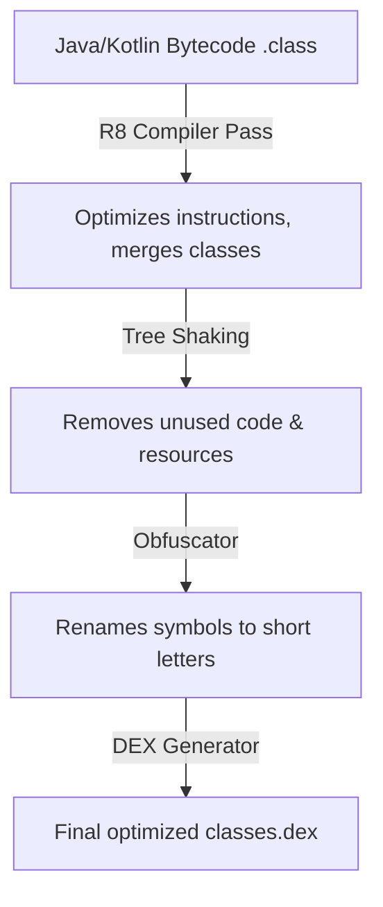

### The 4 Pillars of R8 Execution
1. **Code Shrinking (Tree Shaking):** Statically analyzes the codebase starting from declared entry points (e.g. Activities, Services, and Receivers declared in `AndroidManifest.xml`). R8 maps the call graph and discards any class, method, variable, or library dependency that cannot be reached through active execution paths, drastically reducing APK size.
2. **Optimization:** Performs dead-code elimination, inlines short method bodies, removes unused parameters, and merges vertical inheritance trees (e.g., merging a subclass into its parent class if it is the sole implementer) to minimize runtime call stacks.
3. **Obfuscation:** Renames human-readable classes, variables, and methods to short, meaningless identifiers (e.g. `UserRepository` becomes `a`, `fetchData` becomes `b`). This shrinks the string pool inside the DEX file and increases the difficulty of reverse engineering.
4. **Resource Shrinking:** Runs in tandem with code shrinking. Once R8 identifies and discards unused code, it checks resource folder files (`res/`, `assets/`). Any resource drawable, string, or layout that is not referenced in the remaining code graph is stripped.

### R8 vs. ProGuard

```mermaid
graph TD
    subgraph Legacy Build Pipeline
        Code1[Bytecode] --> PG[ProGuard Shrink/Optimize]
        PG --> BytecodeOptimized[Optimized Bytecode]
        BytecodeOptimized --> D8[D8 Compiler]
        D8 --> DEX1[classes.dex]
    end

    subgraph Modern Build Pipeline (R8)
        Code2[Bytecode] --> R8Compiler[R8 Single-Pass Tool]
        R8Compiler --> DEX2[classes.dex]
    end
```

* **Pipeline Differences:** ProGuard operates on Java bytecode (`.class`), outputting modified Java bytecode that must subsequently be compiled into DEX by the D8 compiler. R8 combines bytecode optimization and DEX translation into a **single step**, reducing compile times by up to 30%.
* **Memory & Efficiency:** Because R8 has complete visibility over the final DEX register layout during optimization, it can make more accurate register allocations and class merging decisions than ProGuard.

### Reflection Gotchas & Keep Rules
Because R8 relies on static analysis of the source code, any class or field accessed **dynamically at runtime via reflection** (such as JSON deserialization using Gson/Moshi, or dependency injection frameworks) will appear to R8 as "unused" and will be stripped or obfuscated, leading to runtime crash exceptions (e.g., `ClassNotFoundException` or JSON parsing failures).

Developers resolve this by defining **Keep Rules** in the `proguard-rules.pro` file:

```proguard
# Prevent R8 from obfuscating or shrinking data model classes used in JSON serialization
-keep class com.example.app.data.model.** { *; }

# Keep class names for custom views referenced exclusively in XML layouts
-keepclassmembers class * extends android.view.View {
    public <init>(android.content.Context);
    public <init>(android.content.Context, android.util.AttributeSet);
}
```

---

## 1.5 APK / AAB Anatomy, DEX Limits, and App Signing

### Definition
* **Simple:** An APK is a ZIP archive that holds everything the device needs to run your app. An AAB is the upload format Google Play splits into smaller, device-specific APKs. App signing proves that an update genuinely came from you.
* **Advanced:** An APK is a signed ZIP container carrying `classes*.dex`, `resources.arsc`, `AndroidManifest.xml` (binary XML), native libraries per ABI, and raw assets. Integrity is enforced by one of four signature schemes (v1 JAR signing through v4 incremental streaming).

### Why It Is Used
The container format lets the Package Manager verify authenticity before installation, map resources without decompressing them, and memory-map DEX files directly. AAB moves configuration splitting to Play, which typically reduces install size by 15–35% because a device downloads only its own density, ABI, and language.

### How It Works Internally

```
app.apk
├── AndroidManifest.xml    # Binary XML, parsed by PackageParser at install time
├── classes.dex            # Primary DEX; classes2.dex... when multidexed
├── resources.arsc         # Flat resource table, mmap'd (never decompressed)
├── res/                   # Compiled XML layouts, drawables
├── assets/                # Raw files, read via AssetManager
├── lib/<abi>/*.so         # JNI native libraries per ABI
└── META-INF/              # v1 signature manifests + certificates
```

**The 64K DEX method limit.** A single DEX file addresses methods with a 16-bit index, capping it at 65,536 method references. Exceeding it fails the build with `Cannot fit requested classes in a single dex file`.
* **minSdk 21+:** native multidex — ART loads `classes2.dex`, `classes3.dex` and so on with no runtime cost and no configuration.
* **minSdk < 21:** legacy multidex requires `multiDexEnabled true` plus `MultiDexApplication`, and pays a slow secondary-DEX extraction cost on first launch.
* **Real fix:** enable R8 so tree shaking removes unreachable methods before the limit is hit.

**Signature schemes.**

| Scheme | Since | What It Signs | Key Property |
|---|---|---|---|
| **v1 (JAR)** | Always | Individual files listed in `META-INF` | Slow verification; ZIP metadata unprotected |
| **v2** | Android 7.0 | The whole APK byte-for-byte | Fast, whole-file integrity; blocks ZIP tampering |
| **v3** | Android 9 | Whole APK + key-rotation lineage | Allows rotating the signing key without losing update rights |
| **v4** | Android 11 | Merkle hash tree in a sidecar `.apk.idsig` | Enables ADB Incremental Install (play while installing) |

**Play App Signing.** You keep an *upload key*; Google holds the *app signing key*. Play verifies your upload signature, strips it, and re-signs the generated APKs with the real app signing key. A lost upload key can be reset by support; a lost app signing key without Play App Signing means the app can never be updated again.

### Code Example
```kotlin
// build.gradle.kts — release signing plus bundle split configuration
android {
    signingConfigs {
        create("release") {
            storeFile = file(System.getenv("KEYSTORE_PATH") ?: "keystore.jks")
            storePassword = System.getenv("KEYSTORE_PASSWORD")
            keyAlias = System.getenv("KEY_ALIAS")
            keyPassword = System.getenv("KEY_PASSWORD")
            enableV1Signing = false   // Drop v1 when minSdk >= 24 (faster verify, smaller APK)
            enableV2Signing = true
            enableV3Signing = true
        }
    }
    bundle {
        language { enableSplit = true }   // Ship only the user's locale
        density  { enableSplit = true }   // Ship only the device's density buckets
        abi      { enableSplit = true }   // Ship only the device's ABI .so files
    }
}
```

```bash
# Inspect what is actually inside a build artifact
unzip -l app-release.apk | sort -k1 -n -r | head        # Largest entries first
apkanalyzer dex packages app-release.apk                 # Method counts per package
apkanalyzer apk compare old.apk new.apk                  # Size regression between builds
apksigner verify --print-certs --verbose app-release.apk # Which schemes are present
bundletool build-apks --bundle=app.aab --output=app.apks # Reproduce Play's split output
```

### Common Pitfalls
* **Debug keystore in CI.** A build signed with the auto-generated debug key cannot be uploaded to Play. Always fail the release task when the signing config resolves to null.
* **Reading `versionCode` from git at configuration time** breaks build caching and makes builds non-reproducible.
* **Assuming the APK size equals the download size.** After AAB splitting, the delivered size is much smaller. Quote the Play Console "download size" figure, not the local APK size.

---

## 1.6 Platform Behavior Changes: Android 12 → Android 16

### Definition
* **Behavior change** — a platform rule that alters how an existing API acts. Most are **gated on `targetSdk`**, so an app keeps the old behavior until it raises that value.
* **`targetSdk`** — the API level your app declares it was written and tested against. It is a compatibility contract, not a minimum requirement.
* **`compileSdk` vs `targetSdk` vs `minSdk`** — `compileSdk` is what you build against, `targetSdk` selects which behaviors apply, `minSdk` is the oldest device that can install the app.
* **Why raising `targetSdk` is the riskiest change in an upgrade** — every gated behavior switches on at once, and Play enforces a rolling floor so it cannot be deferred indefinitely.

### Why It Is Used
`targetSdk` is a compatibility contract. The OS reads it and decides whether to apply new restrictions or preserve legacy behavior. Raising it is the single highest-risk change in an Android upgrade, and every interviewer for a 2–5 year role expects you to name the breaking changes.

### How It Works Internally
The framework guards each behavior change with `CompatChanges.isChangeEnabled(CHANGE_ID)`, which compares the calling app's `targetSdkVersion` against the change's enable-after SDK. This is why an app targeting API 30 keeps old behavior on an Android 15 device.

| Release | API | Behavior Changes You Must Handle |
|---|---|---|
| **Android 12** | 31 | `android:exported` mandatory on every manifest component with an intent filter; approximate location option; splash screen applied to every cold start; `PendingIntent` requires an explicit mutability flag; foreground service launch from background restricted |
| **Android 13** | 33 | Runtime `POST_NOTIFICATIONS` permission; granular media permissions (`READ_MEDIA_IMAGES` / `_VIDEO` / `_AUDIO`) replace `READ_EXTERNAL_STORAGE`; per-app language preferences; themed app icons; nearby Wi-Fi devices permission |
| **Android 14** | 34 | `foregroundServiceType` mandatory with a matching permission per type; runtime receivers must pass `RECEIVER_EXPORTED` or `RECEIVER_NOT_EXPORTED`; implicit intents must target the app's own package; `SCHEDULE_EXACT_ALARM` no longer auto-granted; partial photo/video access ("Select photos") |
| **Android 15** | 35 | Edge-to-edge enforced by default (insets must be handled or content sits under system bars); 16 KB memory-page support for native libraries; foreground service timeouts for `dataSync`; ends of the predictive-back migration path |
| **Android 16** | 36 | Adaptive layouts required on large screens (activity orientation and resize restrictions ignored); further predictive-back enforcement; tightened background work and intent-redirect rules |

### Code Example
```kotlin
// Android 13+: notifications require an explicit runtime grant
class NotificationPermissionHelper(private val activity: ComponentActivity) {

    private val launcher = activity.registerForActivityResult(
        ActivityResultContracts.RequestPermission()
    ) { granted -> if (!granted) showRationaleOrSettings() }

    fun ensure() {
        if (Build.VERSION.SDK_INT < Build.VERSION_CODES.TIRAMISU) return  // Auto-granted pre-33
        val state = ContextCompat.checkSelfPermission(
            activity, Manifest.permission.POST_NOTIFICATIONS
        )
        if (state != PackageManager.PERMISSION_GRANTED) {
            launcher.launch(Manifest.permission.POST_NOTIFICATIONS)
        }
    }
}
```

```xml
<!-- Android 12+: exported must be explicit or the app will not install -->
<activity
    android:name=".DeepLinkActivity"
    android:exported="true">
    <intent-filter>
        <action android:name="android.intent.action.VIEW" />
        <category android:name="android.intent.category.DEFAULT" />
        <category android:name="android.intent.category.BROWSABLE" />
        <data android:scheme="https" android:host="example.com" />
    </intent-filter>
</activity>

<!-- Android 14+: a foreground service type and its matching permission are both required -->
<uses-permission android:name="android.permission.FOREGROUND_SERVICE" />
<uses-permission android:name="android.permission.FOREGROUND_SERVICE_LOCATION" />
<service
    android:name=".LocationTrackingService"
    android:foregroundServiceType="location"
    android:exported="false" />
```

### Common Pitfalls
* **Testing on an old emulator.** Behavior changes gate on `targetSdk`, so a bug that only appears at API 34 will never reproduce on an API 30 image.
* **`PendingIntent` without a mutability flag** throws `IllegalArgumentException` on API 31+. Use `FLAG_IMMUTABLE` unless the receiver genuinely needs to fill in extras (for example `Notification.Action` reply), which requires `FLAG_MUTABLE`.
* **Silently dropped implicit intents on API 34.** An implicit intent that matches only a non-exported component of your own app is now blocked. Make those intents explicit.

---
# 2. Core Application Components & Manifest

Android apps are composed of four primary entry points, which must be declared in the `AndroidManifest.xml` file.

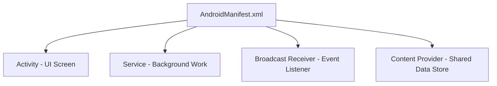

---

## 2.1 Activity & Launch Modes

### Definition
* **Activity** — a single focused screen the user interacts with, and one of the four entry points the system can start.
* **Task** — the stack of activities the user moves through for one piece of work. Pressing Back pops the stack; Recents shows one entry per task.
* **Back stack** — the ordering within a task that determines what Back returns to.
* **Launch mode** — the rule deciding whether starting an activity creates a **new instance** or reuses an existing one, declared as `android:launchMode` or with Intent flags.
* **`onNewIntent()`** — the callback delivering a new Intent to an activity instance that was **reused** rather than created, which is why link handling must be implemented there as well as in `onCreate`.

### Activity Lifecycle Transitions
The lifecycle is defined by a state machine managed by the `ActivityThread` and monitored by the `ActivityTaskManagerService` (ATMS).

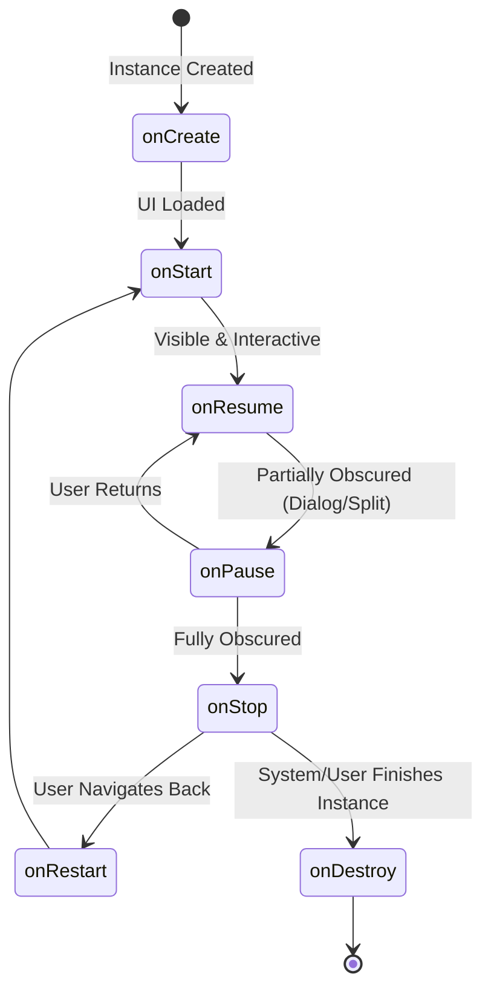

#### Transition Scenarios
1. **Activity A launches Activity B:**
   * `A.onPause()` $\rightarrow$ `B.onCreate()` $\rightarrow$ `B.onStart()` $\rightarrow$ `B.onResume()` $\rightarrow$ `A.onStop()`.
2. **Device rotated (Configuration Change):**
   * Active Activity is destroyed and recreated: `onPause()` $\rightarrow$ `onStop()` $\rightarrow$ `onDestroy()` $\rightarrow$ `onCreate()` $\rightarrow$ `onStart()` $\rightarrow$ `onResume()`.

### Launch Modes & Task Affinities
Declared using `android:launchMode` in the manifest or via Intent flags (`FLAG_ACTIVITY_NEW_TASK`, `FLAG_ACTIVITY_SINGLE_TOP`, `FLAG_ACTIVITY_CLEAR_TOP`).

1. **`standard` (Default):**
   * Creates a new instance of the Activity in the task from which it was started.
2. **`singleTop`:**
   * If an instance exists at the **top** of the target stack, Android routes the intent via `onNewIntent()` instead of creating a new instance.
3. **`singleTask`:**
   * Creates a new task and instantiates the Activity at the root of the task. If the activity already exists in another task, the system brings that task to the foreground and clears all activities above it (triggers `onNewIntent()`).
4. **`singleInstance`:**
   * Same as `singleTask`, but the system does not launch any other activities into the task holding this instance. It is always the single and unique member of its task.
5. **`singleInstancePerTask` (Android 12+):**
   * The activity can only be instantiated as the root activity of a task. It allows multiple instances in different tasks.

---

## 2.2 Services & Background Restrictions (Android 14/15)

### Definition
* **Service** — an application component for work with no user interface, able to keep running when no screen of the app is visible.
* **Foreground service** — work the user is actively aware of (playback, navigation, tracking). It **must** post a persistent notification, and from Android 14 must declare a `foregroundServiceType` and hold the matching permission.
* **Background (started) service** — started with `startService()` and left to run. Effectively unusable since Android 8's background execution limits.
* **Bound service** — exposes an `IBinder` client interface and lives only while something is bound to it.
* **Background execution limits** — the platform rules, tightened in every release since Android 8, restricting what an app may do once it is no longer visible.

### Types of Services
* **Foreground Service:** Performs work noticeable to the user. It **must** show a non-dismissible status bar notification. In Android 14/15, you must explicitly declare a foreground service type (`android:foregroundServiceType`) in the manifest and request the corresponding permission.
* **Started Service (Background):** Initiated via `startService()`. Runs indefinitely until it stops itself (`stopSelf()`) or another component stops it (`stopService()`). Subject to background execution limits since Android 8.0.
* **Bound Service:** Initiated via `bindService()`. Provides a client-server interface using an `IBinder` implementation. It runs only as long as components are bound to it.

```kotlin
// Android 14/15 Foreground Service Example
class LocationTrackingService : Service() {
    private val binder = LocalBinder()

    inner class LocalBinder : Binder() {
        fun getService(): LocationTrackingService = this@LocationTrackingService
    }

    override fun onBind(intent: Intent): IBinder = binder

    override fun onStartCommand(intent: Intent?, flags: Int, startId: Int): Int {
        createNotificationChannel()
        val notification = NotificationCompat.Builder(this, CHANNEL_ID)
            .setContentTitle("Location Tracking Active")
            .setSmallIcon(R.drawable.ic_location)
            .setForegroundServiceBehavior(NotificationCompat.FOREGROUND_SERVICE_IMMEDIATE)
            .build()
        
        // Starting foreground service with type (Required Android 14+)
        ServiceCompat.startForeground(
            this,
            NOTIFICATION_ID,
            notification,
            if (Build.VERSION.SDK_INT >= Build.VERSION_CODES.UPSIDE_DOWN_CAKE) {
                ServiceInfo.FOREGROUND_SERVICE_TYPE_LOCATION
            } else 0
        )
        return START_STICKY
    }
}
```

---

## 2.3 Broadcast Receiver & Content Providers

### Definition
* **Broadcast** — a system-wide or app-wide announcement that something happened (the device booted, connectivity changed, a download finished). It is a one-to-many, fire-and-forget message.
* **BroadcastReceiver** — a component that subscribes to those announcements and runs a short piece of code when one arrives. It has roughly **10 seconds** to finish before the system considers it stuck.
* **Static registration** — declaring the receiver in the manifest, so it can run even when the app is not running. Since Android 8 this is blocked for most *implicit* broadcasts.
* **Dynamic registration** — registering at runtime with `Context.registerReceiver()`. It works for any broadcast but lives only as long as the registering component, and **must** be unregistered or it leaks the context.
* **ContentProvider** — a component that exposes structured data to *other apps* behind a `content://` URI, with per-URI permission grants. It is the only sanctioned way to share a database across app sandboxes.

### Broadcast Receiver
A component that listens for system-wide or application-level broadcast announcements.

* **Static Registration:** Declared in the manifest (`<receiver>`). Since Android 8.0, static registration is severely restricted for implicit broadcasts.
* **Dynamic Registration:** Registered programmatically using `Context.registerReceiver()`. Must be unregistered in lifecycle teardown methods to prevent context leaks.

```kotlin
// Dynamic Registration Example
class NetworkStateReceiver : BroadcastReceiver() {
    override fun onReceive(context: Context, intent: Intent) {
        val isAirplaneModeOn = intent.getBooleanExtra("state", false)
        Log.d("Receiver", "Airplane mode state changed: $isAirplaneModeOn")
    }
}

// Activity Usage
class MainActivity : AppCompatActivity() {
    private val receiver = NetworkStateReceiver()

    override fun onStart() {
        super.onStart()
        registerReceiver(
            receiver, 
            IntentFilter(Intent.ACTION_AIRPLANE_MODE_CHANGED),
            RECEIVER_EXPORTED // Android 14 requirement
        )
    }

    override fun onStop() {
        super.onStop()
        unregisterReceiver(receiver) // Prevent memory leaks
    }
}
```

### Content Providers
Encapsulates application data (usually an underlying SQLite database) and exposes it to other apps via a standard query interface (`content://` URIs).

* **Why it exists:** Enforces app sandboxing while providing secure, permission-controlled, transactional inter-process communication (IPC) for structured data.
* **Components:** Implements CRUD operations (`query()`, `insert()`, `update()`, `delete()`) and uses `UriMatcher` to parse incoming client URIs.

---

## 2.4 Binder IPC Architecture

### Definition
* **Simple:** Binder is the mechanism Android uses to let different applications or system services communicate and share data with each other safely.
* **Advanced:** Binder is a Linux kernel-based driver (`/dev/binder`) that provides inter-process communication (IPC) and remote procedure calls (RPC) using a client-server architecture, memory mapping, and AIDL-defined interfaces.

```mermaid
graph TD
    Client[Client App Process] -->|1. Marshals params into Parcel| Proxy[Proxy - Client Stub]
    Proxy -->|2. ioctl transaction| Driver[/dev/binder Driver]
    Driver -->|3. Single Copy mmap| Stub[Stub - Server Implementation]
    Stub -->|4. Unmarshals Parcel| Server[Server System Process]
```

### How It Works Internally
1. **Single-Copy Data Transfer (`mmap`):** Standard Linux IPC systems require copying data twice (User Space A &rarr; Kernel Space &rarr; User Space B). Binder maps a shared virtual memory region (using `mmap()`) between the kernel and the receiving process's address space. When a transaction occurs, the kernel copies data directly from the sender's user space into the receiver's mapped memory buffer once, saving CPU cycles.
2. **Transaction Buffer Limit (1MB):** The Binder transaction buffer is capped at **1MB** per process, shared across all ongoing transactions. If an application attempts to pass large files (like high-res bitmaps) or large data lists via Intents, Services, or Content Providers, it throws a `TransactionTooLargeException`.
3. **AIDL (Android Interface Definition Language):** Defines programming interfaces that client and server agree on. The AIDL compiler generates the `Proxy` class (used by the client to marshal data into a `Parcel` and execute `transact()`) and the `Stub` class (used by the server to execute `onTransact()` and unmarshal data).

---

## 2.5 Context Hierarchy & Window Tokens

### Definition
* **Simple:** Context represents the handle to Android system resources and services. Different types of contexts (like Application vs. Activity) have different capabilities.
* **Advanced:** Context is an abstract class implemented by `ContextImpl`. It is decorated by `ContextWrapper` subclasses (`Activity`, `Service`, `Application`) to delegate resource lookup and system operations.

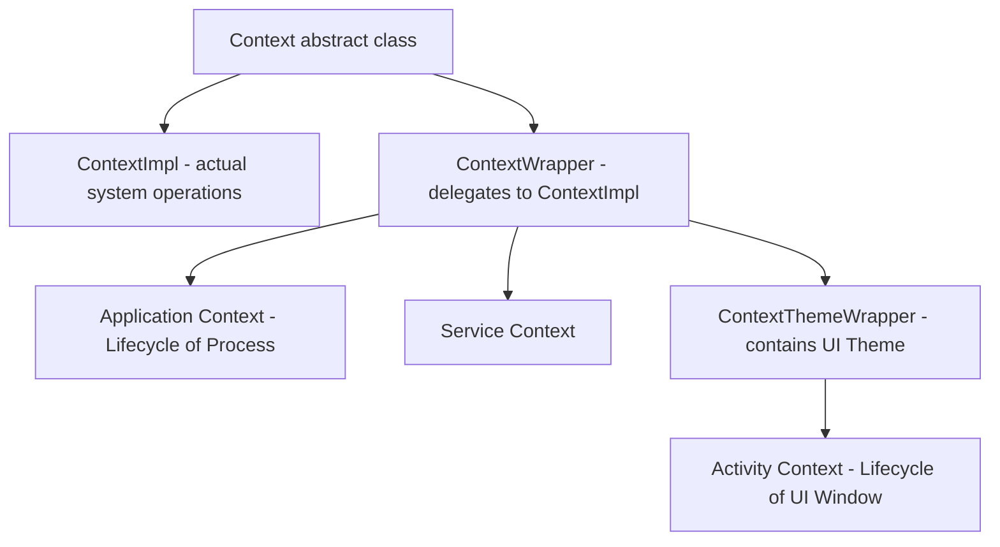

### Comparison: Context Capabilities

| Context Type | Can Start Activity? | Can Inflate Layout? | Can Show Dialogs? |
|---|---|---|---|
| **Application** | Yes (requires `FLAG_ACTIVITY_NEW_TASK`) | Yes (inherits system theme, not app theme) | No (throws `BadTokenException`) |
| **Activity** | Yes | Yes | Yes (owns valid Window Token) |
| **Service** | Yes (requires `FLAG_ACTIVITY_NEW_TASK`) | Yes | No |

### Window Tokens & BadTokenException
* **Window Token:** A unique binder token generated by the `WindowManagerService` (WMS) that authorizes a client to draw a window layer on the screen.
* **Why Application Context fails:** An `Application` context does not have a `WindowToken` associated with a physical screen layer. Attempting to display dialogs or popup windows using the Application Context causes the system to throw a `WindowManager.BadTokenException`.

---

## 2.6 Intents, Deep Links, and App Links

### Definition
* **Simple:** An Intent is a message object asking the system to start a component or perform an action. A deep link is a URL that opens a specific screen inside your app.
* **Advanced:** An `Intent` is a Parcelable message containing an action, data URI, category set, component name, flags, and an extras `Bundle`. The `PackageManagerService` resolves it against the intent filters declared by installed packages.

### Why It Is Used
Intents decouple callers from implementations: your app can say "share this text" without knowing which app handles it. Deep links let notifications, web pages, and other apps land users on an exact screen, which is a direct conversion and retention lever.

### How It Works Internally
1. **Explicit intent** — names a target `ComponentName`. Resolution skips the filter database and goes straight to the component. Always use this for internal navigation, because implicit resolution can be hijacked by another installed app.
2. **Implicit intent** — carries only action, data, and categories. `PackageManagerService` scans registered `<intent-filter>` entries; a filter matches only if the action matches, **every** category in the intent is present in the filter, and the data scheme/host/mimeType matches.
3. **Resolution outcome** — one match launches directly, multiple matches show the disambiguation chooser, and zero matches throws `ActivityNotFoundException`.

**Deep link vs. App Link.**

| | Custom-scheme deep link | Web deep link | Android App Link |
|---|---|---|---|
| **URI** | `myapp://profile/42` | `https://example.com/profile/42` | `https://example.com/profile/42` |
| **Verification** | None — any app can claim the scheme | None — shows a chooser | Cryptographic, via `assetlinks.json` |
| **User experience** | Chooser or hijack risk | Disambiguation dialog | Opens your app directly, no dialog |
| **Requires** | Nothing | Nothing | `android:autoVerify="true"` + hosted Digital Asset Links file |

### Code Example
```xml
<!-- Verified App Link: opens directly with no chooser dialog -->
<activity android:name=".MainActivity" android:exported="true">
    <intent-filter android:autoVerify="true">
        <action android:name="android.intent.action.VIEW" />
        <category android:name="android.intent.category.DEFAULT" />
        <category android:name="android.intent.category.BROWSABLE" />
        <data android:scheme="https" android:host="example.com" android:pathPrefix="/profile" />
    </intent-filter>
</activity>
```

```json
// Must be served at https://example.com/.well-known/assetlinks.json over HTTPS, no redirects
[{
  "relation": ["delegate_permission/common.handle_all_urls"],
  "target": {
    "namespace": "android_app",
    "package_name": "com.example.app",
    "sha256_cert_fingerprints": ["AB:CD:...:EF"]
  }
}]
```

```kotlin
// Handling the link on both cold start and warm re-delivery
class MainActivity : AppCompatActivity() {

    override fun onCreate(savedInstanceState: Bundle?) {
        super.onCreate(savedInstanceState)
        handleDeepLink(intent)                 // Cold start: link arrives in the launch Intent
    }

    // singleTop / singleTask activities receive later links here, NOT in onCreate
    override fun onNewIntent(intent: Intent) {
        super.onNewIntent(intent)
        setIntent(intent)                      // Keep getIntent() consistent for later reads
        handleDeepLink(intent)
    }

    private fun handleDeepLink(intent: Intent) {
        val userId = intent.data
            ?.takeIf { it.pathSegments.firstOrNull() == "profile" }
            ?.lastPathSegment
            ?.toLongOrNull() ?: return
        navigateToProfile(userId)
    }
}

// Safe implicit intent: always guard resolution
fun Context.shareText(text: String) {
    val send = Intent(Intent.ACTION_SEND).apply {
        type = "text/plain"
        putExtra(Intent.EXTRA_TEXT, text)
    }
    // createChooser never throws even when no handler exists
    startActivity(Intent.createChooser(send, "Share via"))
}
```

```bash
# Verify a deep link without leaving the terminal
adb shell am start -W -a android.intent.action.VIEW -d "https://example.com/profile/42" com.example.app
adb shell pm get-app-links com.example.app     # Shows verified / unverified domain state
```

### Common Pitfalls
* **Reading the link only in `onCreate`.** With `singleTop` or `singleTask`, a second link arrives in `onNewIntent()` and is otherwise silently ignored.
* **App Link verification failing quietly.** A redirect, a missing content type, or a fingerprint from the wrong signing key (upload key vs. Play app signing key) breaks verification with no user-visible error. With Play App Signing, publish the *app signing key* fingerprint.
* **Trusting deep-link parameters.** They are attacker-controlled input. Validate and authorize server-side before acting on them.

---

## 2.7 Permissions Model and Scoped Storage

### Definition
* **Simple:** Permissions are the user's yes/no answer to an app requesting access to sensitive data or hardware. Scoped storage limits an app to its own files unless the user explicitly picks something else.
* **Advanced:** Permissions are declared in the manifest and classified as install-time (normal/signature) or runtime (dangerous). Runtime permissions are granted per permission group and are revocable at any moment, including while the app is running.

### Why It Is Used
It moves the trust decision from install time to the moment of use, when the user has context. Scoped storage ends the era of apps freely reading the whole shared partition, which was the single largest privacy hole on the platform.

### How It Works Internally
1. `PackageManagerService` records granted permissions per package UID.
2. A dangerous permission grant applies to the whole group at the framework level, but you must still request each permission you use.
3. `shouldShowRequestPermissionRationale()` returns `true` only after one denial and before a permanent denial. The tri-state — never asked / denied once / denied permanently — has no direct API, so track "have we asked before" yourself.
4. Under scoped storage (API 29+, enforced at 30), each app writes freely into its own `getExternalFilesDir()`, and reaches shared collections only via `MediaStore` or the Storage Access Framework.

**Storage decision table.**

| Need | API to Use | Permission Required |
|---|---|---|
| App-private cache / files | `context.filesDir`, `context.cacheDir` | None |
| App-private on external volume | `context.getExternalFilesDir()` | None (API 19+) |
| Save a photo/video to the gallery | `MediaStore.Images` insert | None on API 29+ |
| Read the user's photos | Photo Picker (`PickVisualMedia`) | **None** — preferred |
| Read all media programmatically | `MediaStore` query | `READ_MEDIA_IMAGES` / `_VIDEO` / `_AUDIO` (API 33+) |
| Open an arbitrary user file | Storage Access Framework `OpenDocument` | None |
| Full filesystem access | `MANAGE_EXTERNAL_STORAGE` | Special access; Play restricts to file managers |

### Code Example
```kotlin
// Runtime permission with correct rationale handling
class CameraPermissionFlow(private val fragment: Fragment) {

    private val request = fragment.registerForActivityResult(
        ActivityResultContracts.RequestPermission()
    ) { granted ->
        when {
            granted -> openCamera()
            fragment.shouldShowRequestPermissionRationale(Manifest.permission.CAMERA) ->
                showRationaleDialog()          // Denied once; asking again is allowed
            else -> showSettingsRedirect()     // Permanently denied; only Settings can restore it
        }
    }

    fun start() {
        val ctx = fragment.requireContext()
        if (ContextCompat.checkSelfPermission(ctx, Manifest.permission.CAMERA)
            == PackageManager.PERMISSION_GRANTED
        ) openCamera() else request.launch(Manifest.permission.CAMERA)
    }
}

// Photo Picker: no permission at all, and it is the Play-recommended path
class GalleryPicker(activity: ComponentActivity) {
    val pick = activity.registerForActivityResult(
        ActivityResultContracts.PickVisualMedia()
    ) { uri: Uri? -> uri?.let { loadImage(it) } }

    fun open() = pick.launch(
        PickVisualMediaRequest(ActivityResultContracts.PickVisualMedia.ImageOnly)
    )
}

// Saving to the shared gallery under scoped storage — no permission needed on API 29+
suspend fun Context.saveToGallery(bytes: ByteArray, name: String): Uri? =
    withContext(Dispatchers.IO) {
        val values = ContentValues().apply {
            put(MediaStore.Images.Media.DISPLAY_NAME, name)
            put(MediaStore.Images.Media.MIME_TYPE, "image/jpeg")
            if (Build.VERSION.SDK_INT >= Build.VERSION_CODES.Q) {
                put(MediaStore.Images.Media.RELATIVE_PATH, Environment.DIRECTORY_PICTURES)
                put(MediaStore.Images.Media.IS_PENDING, 1)  // Hide until fully written
            }
        }
        val uri = contentResolver.insert(
            MediaStore.Images.Media.EXTERNAL_CONTENT_URI, values
        ) ?: return@withContext null

        contentResolver.openOutputStream(uri)?.use { it.write(bytes) }

        if (Build.VERSION.SDK_INT >= Build.VERSION_CODES.Q) {
            values.clear()
            values.put(MediaStore.Images.Media.IS_PENDING, 0)
            contentResolver.update(uri, values, null, null)
        }
        uri
    }
```

### Common Pitfalls
* **Requesting permission on app launch.** Denial rates spike. Ask at the point of use, after the value is clear.
* **Caching the grant result.** A user can revoke permission from Settings while your process is alive, or Android 11+ can auto-revoke it for unused apps. Re-check before every use.
* **Requesting `READ_EXTERNAL_STORAGE` on API 33+.** It is a no-op there. Use the granular media permissions, or better, the Photo Picker.
* **Passing a `file://` URI to another app** throws `FileUriExposedException`. Use `FileProvider` and grant `FLAG_GRANT_READ_URI_PERMISSION`.

---

## 2.8 Notifications, Channels, and PendingIntent

### Definition
* **Simple:** A notification is a message your app shows outside its own UI. A channel is a user-controllable category for those messages.
* **Advanced:** `NotificationManagerService` owns posted notifications. Since API 26, every notification must belong to a `NotificationChannel` whose importance, sound, and vibration are controlled by the user, not the app.

### Why It Is Used
Channels moved control of interruption from the developer to the user, which reduced blanket app-level notification blocks. `PendingIntent` gives another process (the system UI) permission to execute an intent **as your app**, which is what makes a notification tap able to open your activity.

### How It Works Internally
* **Channel immutability.** Importance, sound, and vibration set at creation can never be raised by the app afterward. Only the user can change them. To change defaults you must delete and recreate the channel with a **new ID**, which resets the user's preference and is user-hostile — so get the design right the first time.
* **`PendingIntent` identity.** It is keyed by `(requestCode, Intent action/data/component/categories)`. **Extras are not part of the key.** Two `PendingIntent`s that differ only in extras collide, and the second one silently reuses the first one's extras unless you pass `FLAG_UPDATE_CURRENT`.
* **Mutability (API 31+).** You must pass `FLAG_IMMUTABLE` or `FLAG_MUTABLE`. Immutable is the safe default; mutable is needed only for direct-reply actions and Bubbles.

### Code Example
```kotlin
object Notifier {
    private const val CHANNEL_SYNC = "sync_status_v1"

    // Create channels once, ideally in Application.onCreate — repeat calls are cheap no-ops
    fun createChannels(context: Context) {
        if (Build.VERSION.SDK_INT < Build.VERSION_CODES.O) return
        val channel = NotificationChannel(
            CHANNEL_SYNC,
            context.getString(R.string.channel_sync_name),   // Localized: shown in Settings
            NotificationManager.IMPORTANCE_DEFAULT
        ).apply {
            description = context.getString(R.string.channel_sync_desc)
            setShowBadge(false)
        }
        context.getSystemService(NotificationManager::class.java)
            .createNotificationChannel(channel)
    }

    fun showSyncComplete(context: Context, itemId: Long) {
        val deepLink = Intent(
            Intent.ACTION_VIEW,
            "https://example.com/item/$itemId".toUri(),
            context,
            MainActivity::class.java
        )

        // TaskStackBuilder synthesizes a correct back stack for the deep-linked screen
        val pending = TaskStackBuilder.create(context).run {
            addNextIntentWithParentStack(deepLink)
            getPendingIntent(
                itemId.toInt(),                                       // Unique per item: avoids collision
                PendingIntent.FLAG_UPDATE_CURRENT or PendingIntent.FLAG_IMMUTABLE
            )
        }

        val notification = NotificationCompat.Builder(context, CHANNEL_SYNC)
            .setSmallIcon(R.drawable.ic_sync)
            .setContentTitle(context.getString(R.string.sync_done_title))
            .setContentText(context.getString(R.string.sync_done_body))
            .setContentIntent(pending)
            .setAutoCancel(true)                                      // Dismiss on tap
            .setPriority(NotificationCompat.PRIORITY_DEFAULT)         // Honored on pre-26 only
            .build()

        // Guard: posting without POST_NOTIFICATIONS on API 33+ is silently dropped
        with(NotificationManagerCompat.from(context)) {
            if (areNotificationsEnabled()) notify(itemId.toInt(), notification)
        }
    }
}
```

### Common Pitfalls
* **Reusing notification ID `0` or a constant** for every item collapses all of them into one. Derive a stable per-item ID.
* **Assuming `notify()` throws when blocked.** It silently no-ops. Check `areNotificationsEnabled()` and surface an in-app prompt.
* **Setting priority instead of channel importance** on API 26+. `setPriority` is ignored; the channel wins.

---

## 2.9 Configuration Changes, Process Death, and State Restoration

### Definition
* **Simple:** A configuration change (rotation, dark mode, language, window resize) destroys and recreates your activity. Process death is the OS killing your app entirely while it sits in the background.
* **Advanced:** Configuration changes trigger an `Activity` relaunch through `ActivityThread.handleRelaunchActivity`, preserving `ViewModelStore` via `NonConfigurationInstances`. Process death destroys everything in memory; only the serialized `Bundle` written by `onSaveInstanceState` survives.

### Why It Is Used
These are two distinct failure modes that developers routinely conflate. A ViewModel survives rotation but **not** process death. `SavedStateHandle` survives both. Getting this wrong produces bugs that only appear after the app has been backgrounded for a while — exactly the class of bug interviewers probe for.

### How It Works Internally

| Scenario | Activity Instance | ViewModel | `SavedStateHandle` / `Bundle` | Static / Singleton |
|---|---|---|---|---|
| Rotation / config change | Destroyed, recreated | **Survives** | Survives | Survives |
| System-initiated process death | Destroyed | **Lost** | **Survives** | **Lost** |
| User swipes app from Recents | Destroyed | Lost | **Lost** | Lost |
| `finish()` / back out | Destroyed | Cleared (`onCleared`) | Lost | Survives |

**Bundle size limit.** `onSaveInstanceState` writes into a Binder transaction, subject to the ~1 MB per-process buffer. Storing a large list or a bitmap throws `TransactionTooLargeException`. Save IDs and scroll positions, never data payloads.

### Code Example
```kotlin
// SavedStateHandle: the only state holder that survives BOTH config change and process death
@HiltViewModel
class SearchViewModel @Inject constructor(
    private val savedState: SavedStateHandle,
    private val repo: SearchRepository
) : ViewModel() {

    // Backed by the saved-state Bundle; restored automatically after process death
    val query: StateFlow<String> = savedState.getStateFlow(KEY_QUERY, "")

    @OptIn(ExperimentalCoroutinesApi::class)
    val results: StateFlow<UiState> = query
        .debounce(300)
        .flatMapLatest { q -> if (q.isBlank()) flowOf(UiState.Idle) else repo.search(q) }
        .stateIn(viewModelScope, SharingStarted.WhileSubscribed(5_000), UiState.Idle)

    fun onQueryChange(value: String) { savedState[KEY_QUERY] = value }

    private companion object { const val KEY_QUERY = "query" }
}

// Reproducing process death in a test/QA pass — this is the only reliable way to catch these bugs
// 1. Put the app in the background (Home button, NOT swipe-away).
// 2. adb shell am kill com.example.app
// 3. Reopen from Recents; the system restores the saved Bundle.
```

```xml
<!-- Handling config changes yourself: valid only when you genuinely re-lay-out without recreating.
     Omitting a qualifier here (e.g. locale) means that change silently stops recreating the
     activity and your localized strings never refresh. -->
<activity
    android:name=".VideoPlayerActivity"
    android:configChanges="orientation|screenSize|smallestScreenSize|screenLayout|keyboardHidden" />
```

### Common Pitfalls
* **Using `android:configChanges` to "fix" rotation bugs.** It hides the bug instead of fixing it, and process death will still break the screen. Fix state ownership instead.
* **Storing UI state in a singleton or `object`.** It looks like it works until process death, then returns a stale default.
* **Testing rotation only.** Rotation exercises ViewModel retention, which is the *easy* path. Always also test `am kill`.
* **`onSaveInstanceState` is not guaranteed on `finish()`.** Do not use it as a persistence mechanism; use DataStore or Room for anything durable.

---
# 3. UI Layouts, Views, and Fragments

## 3.1 Layout Performance & ConstraintLayout

### Definition
* **View hierarchy** — the tree of `View` and `ViewGroup` objects that makes up a screen. Its **depth** is what drives layout cost.
* **The three-pass traversal** — every frame the system walks that tree three times: **measure** (each parent asks each child how big it wants to be), **layout** (each parent assigns final positions), and **draw** (each view records its drawing commands).
* **Why depth is expensive** — each nesting level repeats the traversal for its subtree, and `RelativeLayout` and weighted `LinearLayout` measure their children **twice**, so nesting them multiplies the cost.
* **ConstraintLayout** — a layout that positions children by *constraints* between them rather than by nesting, solving the whole screen with one constraint solver in a **flat** hierarchy.

### View Tree Rendering Pipeline
When a layout is loaded, the system performs a three-pass traversal of the View hierarchy:

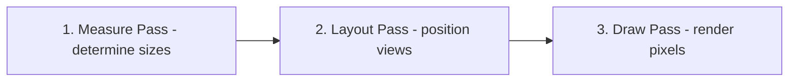

### Layout Comparison

| Layout Class | Hierarchy Type | Best Use Case | Performance Cost |
|---|---|---|---|
| **LinearLayout** | Linear (Vertical/Horizontal) | Simple, single-row/column items | Low (increases to High if nested with layout weights) |
| **RelativeLayout** | Relative (Sibling/Parent) | Simple relative positions | High (performs double measure passes on children) |
| **FrameLayout** | Stack (Overlapping views) | Single child holder, Fragment containers | Very Low |
| **ConstraintLayout** | Flat | Complex, responsive UI designs | Extremely Low (eliminates nested view hierarchies) |

---

## 3.2 RecyclerView Internals

### Definition
* **RecyclerView** — a scrolling container that keeps only enough child views to fill the screen and **reuses** them as items scroll away, instead of creating one view per data item.
* **ViewHolder** — the object that holds the inflated views for one row, so binding new data never has to call `findViewById` again.
* **Recycling** — detaching a view that has scrolled off and handing it back for a new item. This is what makes a 10,000-item list cost the same as a 10-item one.
* **Binding** — filling a recycled view with a new item's data, in `onBindViewHolder`. It runs on the **UI thread inside the frame**, which is why work there causes scroll jank.
* **View type** — an integer identifying which layout a row uses, so the recycler only reuses a view for an item of the same shape.

### How RecyclerView Works Internally
`RecyclerView` optimizes scrolling lists by recycling view objects instead of inflating a new view for every data item. It uses the `Recycler` class, which holds several caching layers:

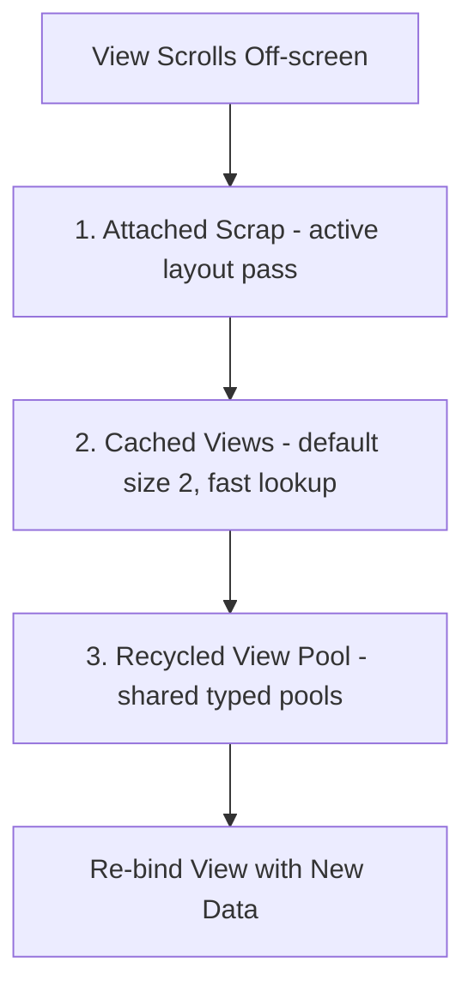

1. **Scrap Heap (Attached Scrap / Changed Scrap):** Temporarily detached views that are still active in the current layout pass.
2. **Cached Views (mCachedViews):** Contains views that were recently scrolled off. They can be re-added without re-binding data. (Default limit is 2).
3. **RecycledViewPool:** Contains views categorized by `viewType`. Views retrieved from the pool must undergo the `onBindViewHolder()` data binding phase.

### ListAdapter vs. RecyclerView.Adapter
* **`RecyclerView.Adapter`:** Requires manual data set mutation notifications (`notifyDataSetChanged()` or granular updates).
* **`ListAdapter`:** Built on top of `AsyncListDiffer`. It compares old and new lists on a background thread using the **DiffUtil** algorithm and dispatches minimal update commands to the RecyclerView, preventing redundant rendering.

```kotlin
class UserAdapter : ListAdapter<User, UserAdapter.UserViewHolder>(UserDiffCallback) {

    object UserDiffCallback : DiffUtil.ItemCallback<User>() {
        override fun areItemsTheSame(oldItem: User, newItem: User): Boolean = oldItem.id == newItem.id
        override fun areContentsTheSame(oldItem: User, newItem: User): Boolean = oldItem == newItem
    }

    override fun onCreateViewHolder(parent: ViewGroup, viewType: Int): UserViewHolder {
        val binding = ItemUserBinding.inflate(LayoutInflater.from(parent.context), parent, false)
        return UserViewHolder(binding)
    }

    override fun onBindViewHolder(holder: UserViewHolder, position: Int) {
        holder.bind(getItem(position))
    }

    class UserViewHolder(private val binding: ItemUserBinding) : RecyclerView.ViewHolder(binding.root) {
        fun bind(user: User) {
            binding.txtName.text = user.name
        }
    }
}
```

---

## 3.3 Fragment Lifecycle

### Definition
* **Fragment** — a reusable, self-contained portion of a screen with its own lifecycle, hosted inside an Activity. Several can be combined on one screen, or swapped in and out of a container.
* **Two lifecycles, not one** — the crucial fact. The **Fragment instance** lives from `onAttach` to `onDestroy`, while its **view hierarchy** lives only from `onCreateView` to `onDestroyView`.
* **Why they differ** — putting a Fragment on the back stack destroys its *view* but keeps the *instance*, so a reference held from the instance to the view outlives the view itself.
* **`viewLifecycleOwner`** — the lifecycle owner scoped to the **view**, and the one that must be used for any UI observation.

A **Fragment** represents a modular, reusable portion of an Activity's user interface. Its lifecycle is tied to its host Activity but contains extra states for managing its View hierarchy.

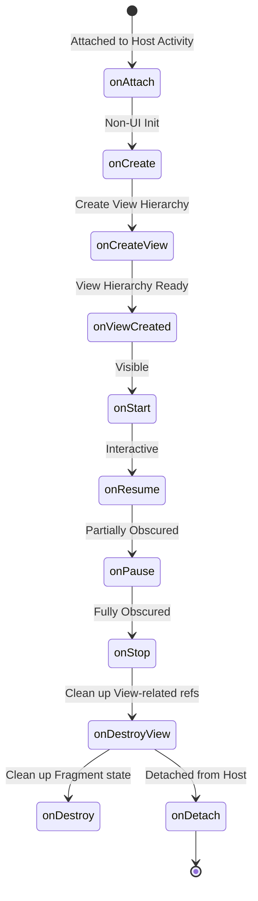

### Critical Fragment Lifecycle Gotcha
* **Memory Leaks in Fragments:** The Fragment instance and the Fragment's view hierarchy have different lifetimes. The View is destroyed when a Fragment goes into the backstack (`onDestroyView()`), but the Fragment instance persists.
* **Best Practice:** You must set UI bindings to `null` in `onDestroyView()` to release memory references to views, and observe LiveData/Flows using `viewLifecycleOwner` instead of `this`.

---

## 3.4 Custom Views: Measure, Layout, Draw

### Definition
* **Simple:** A custom view is a class extending `View` (or an existing widget) where you control the size, position, and pixels yourself.
* **Advanced:** A custom view participates in the three-pass traversal by overriding `onMeasure` (resolve size against `MeasureSpec` constraints), `onLayout` (position children, `ViewGroup` only), and `onDraw` (issue commands into a `Canvas` backed by a display list).

### Why It Is Used
When no combination of framework widgets produces the visual or interaction you need — a gauge, a custom chart, a signature pad — a single custom view replaces a deep nested hierarchy and measures once instead of many times.

### How It Works Internally
**`MeasureSpec` is a packed int**: 2 bits of mode plus 30 bits of size.

| Mode | Meaning | Produced By |
|---|---|---|
| `EXACTLY` | Parent has fixed this dimension | `match_parent`, or a fixed `dp` value |
| `AT_MOST` | Child may be any size up to the given bound | `wrap_content` |
| `UNSPECIFIED` | No constraint at all | `ScrollView` measuring its child, `RecyclerView` pre-measure |

**Invalidation cost.**

| Call | Triggers | Cost |
|---|---|---|
| `invalidate()` | Draw pass only | Cheap |
| `requestLayout()` | Measure + Layout + Draw, propagating **up** to the root | Expensive |

### Code Example
```kotlin
class RingProgressView @JvmOverloads constructor(
    context: Context,
    attrs: AttributeSet? = null,
    defStyleAttr: Int = 0
) : View(context, attrs, defStyleAttr) {

    // Allocate every object ONCE. onDraw runs up to 120x/second; allocation there causes GC jank.
    private val trackPaint = Paint(Paint.ANTI_ALIAS_FLAG).apply { style = Paint.Style.STROKE }
    private val progressPaint = Paint(Paint.ANTI_ALIAS_FLAG).apply {
        style = Paint.Style.STROKE
        strokeCap = Paint.Cap.ROUND
    }
    private val arcBounds = RectF()

    private var strokeWidthPx = 0f

    var progress: Float = 0f
        set(value) {
            val clamped = value.coerceIn(0f, 1f)
            if (field == clamped) return
            field = clamped
            invalidate()          // Size did not change, so only the draw pass is needed
        }

    init {
        // obtainStyledAttributes returns a pooled TypedArray; not recycling it leaks the pool slot
        context.obtainStyledAttributes(attrs, R.styleable.RingProgressView).use { a ->
            strokeWidthPx = a.getDimension(R.styleable.RingProgressView_ringStrokeWidth, 12f)
            trackPaint.color = a.getColor(R.styleable.RingProgressView_ringTrackColor, Color.LTGRAY)
            progressPaint.color = a.getColor(R.styleable.RingProgressView_ringColor, Color.BLUE)
        }
        trackPaint.strokeWidth = strokeWidthPx
        progressPaint.strokeWidth = strokeWidthPx
    }

    override fun onMeasure(widthMeasureSpec: Int, heightMeasureSpec: Int) {
        val desired = (96 * resources.displayMetrics.density).toInt()
        // resolveSize honors the parent's EXACTLY/AT_MOST constraint against our preferred size
        val w = resolveSize(desired + paddingLeft + paddingRight, widthMeasureSpec)
        val h = resolveSize(desired + paddingTop + paddingBottom, heightMeasureSpec)
        val side = minOf(w, h)                     // Keep the ring square
        setMeasuredDimension(side, side)
    }

    // Called on size change only — the right place for bounds math, not onDraw
    override fun onSizeChanged(w: Int, h: Int, oldw: Int, oldh: Int) {
        val inset = strokeWidthPx / 2f
        arcBounds.set(
            paddingLeft + inset,
            paddingTop + inset,
            w - paddingRight - inset,
            h - paddingBottom - inset
        )
    }

    override fun onDraw(canvas: Canvas) {
        canvas.drawOval(arcBounds, trackPaint)
        canvas.drawArc(arcBounds, -90f, 360f * progress, false, progressPaint)
    }

    // Custom views must save their own state; the framework only saves framework properties
    override fun onSaveInstanceState(): Parcelable = Bundle().apply {
        putParcelable(KEY_SUPER, super.onSaveInstanceState())
        putFloat(KEY_PROGRESS, progress)
    }

    override fun onRestoreInstanceState(state: Parcelable?) {
        val bundle = state as? Bundle ?: return super.onRestoreInstanceState(state)
        progress = bundle.getFloat(KEY_PROGRESS)
        super.onRestoreInstanceState(BundleCompat.getParcelable(bundle, KEY_SUPER, Parcelable::class.java))
    }

    private companion object {
        const val KEY_SUPER = "super"
        const val KEY_PROGRESS = "progress"
    }
}
```

### Common Pitfalls
* **Allocating in `onDraw`.** A `Paint`, `Path`, `Rect`, or even a string concatenation per frame triggers GC churn and visible stutter. Lint flags this as `DrawAllocation`.
* **Not recycling `TypedArray`.** Use Kotlin's `.use { }` extension, or call `recycle()` in a `finally`.
* **Calling `requestLayout()` when `invalidate()` suffices.** A layout pass walks the whole tree upward; a colour change never needs it.
* **Views with the same ID sharing saved state.** If several instances of the custom view share an XML `android:id`, the framework restores the same Bundle into all of them.

---

## 3.5 Touch Event Dispatch

### Definition
* **`MotionEvent`** — one touch report, carrying an action (`ACTION_DOWN`, `MOVE`, `UP`, `CANCEL`) and coordinates.
* **Gesture** — the whole sequence from `ACTION_DOWN` to `ACTION_UP`, treated as one unit.
* **Dispatch** — the event travelling **down** the view tree from the window to the deepest child.
* **Interception (`onInterceptTouchEvent`)** — a parent's opportunity to **claim** a gesture in progress, after which the child receives `ACTION_CANCEL` and is out of it.
* **Consumption (`onTouchEvent` returning `true`)** — a view declaring it will handle this gesture. Whoever consumes `ACTION_DOWN` receives every subsequent event in that gesture.
* **Touch slop** — the small movement threshold below which a drag is still treated as a tap, obtained from `ViewConfiguration` rather than hardcoded.

### Why It Is Used
Every "my button inside a RecyclerView inside a ViewPager does not respond" bug is a dispatch bug. Understanding the three-method contract is the difference between guessing and fixing.

### How It Works Internally

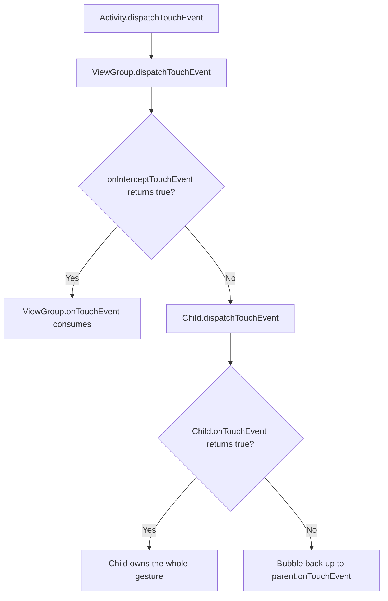

**The three rules that explain nearly every dispatch bug:**
1. **`ACTION_DOWN` decides ownership.** Whichever view returns `true` from `onTouchEvent` for the DOWN event receives every subsequent MOVE and UP in that gesture. Returning `false` for DOWN means the view never sees the rest.
2. **Interception is one-way.** Once a parent intercepts mid-gesture, the child receives `ACTION_CANCEL` and is out of the gesture for good.
3. **`requestDisallowInterceptTouchEvent(true)`** is the child's veto — it tells ancestors to stop calling `onInterceptTouchEvent` for the rest of the gesture. This is how a horizontal `RecyclerView` survives inside a vertical `ViewPager2`.

### Code Example
```kotlin
// A ViewGroup that steals vertical drags but leaves horizontal ones to its children
class VerticalSwipeContainer @JvmOverloads constructor(
    context: Context, attrs: AttributeSet? = null
) : FrameLayout(context, attrs) {

    private val touchSlop = ViewConfiguration.get(context).scaledTouchSlop
    private var downX = 0f
    private var downY = 0f

    override fun onInterceptTouchEvent(ev: MotionEvent): Boolean {
        when (ev.actionMasked) {
            MotionEvent.ACTION_DOWN -> {
                downX = ev.x; downY = ev.y
                return false                      // Never intercept DOWN: children must get a chance
            }
            MotionEvent.ACTION_MOVE -> {
                val dx = abs(ev.x - downX)
                val dy = abs(ev.y - downY)
                // Only claim the gesture once it is unambiguously vertical and past the slop
                return dy > touchSlop && dy > dx
            }
        }
        return false
    }

    override fun onTouchEvent(event: MotionEvent): Boolean {
        // Must return true for DOWN, or MOVE/UP will never be delivered here
        return when (event.actionMasked) {
            MotionEvent.ACTION_DOWN -> true
            MotionEvent.ACTION_MOVE -> { applyDrag(event.y - downY); true }
            else -> super.onTouchEvent(event)
        }
    }
}

// The child-side veto: a horizontal list inside a vertical pager
horizontalRecyclerView.addOnItemTouchListener(object : RecyclerView.SimpleOnItemTouchListener() {
    override fun onInterceptTouchEvent(rv: RecyclerView, e: MotionEvent): Boolean {
        if (e.actionMasked == MotionEvent.ACTION_DOWN) {
            rv.parent.requestDisallowInterceptTouchEvent(true)   // Lock ancestors out of this gesture
        }
        return false
    }
})
```

### Common Pitfalls
* **Intercepting `ACTION_DOWN`.** Children then never receive touches at all. Intercept from `ACTION_MOVE` once intent is clear.
* **Returning `false` from `onTouchEvent` for DOWN** and then wondering why MOVE never arrives.
* **Ignoring `ACTION_CANCEL`.** A view whose gesture was stolen must reset its pressed/drag state or it stays visually stuck.
* **Hardcoding a drag threshold.** Use `ViewConfiguration.get(context).scaledTouchSlop`, which respects device density and accessibility settings.

---

## 3.6 The Rendering Pipeline, Choreographer, and Jank

### Definition
* **Simple:** The system tries to produce one frame every 16.6 ms (60 Hz) or 8.3 ms (120 Hz). Missing that deadline is "jank" — visible stutter.
* **Advanced:** `Choreographer` receives a VSYNC pulse from `SurfaceFlinger` via `DisplayEventReceiver`, then runs callbacks in a fixed order: INPUT → ANIMATION → TRAVERSAL (measure/layout/draw) → COMMIT. Draw records a `DisplayList` into `RenderNode`s, which `RenderThread` replays on the GPU.

### Why It Is Used
Frame budget is the currency of Android performance. "Why is my list janky?" is answered by identifying which phase blows the budget, not by randomly optimizing.

### How It Works Internally

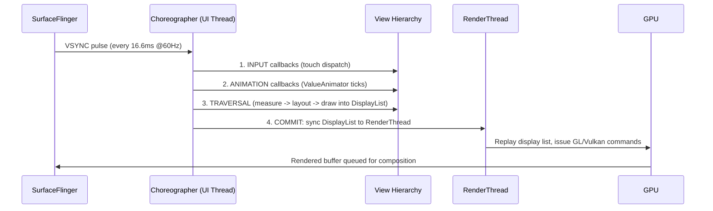

**Where frames are actually lost:**

| Symptom | Likely Phase | Diagnosis Tool |
|---|---|---|
| Stutter while scrolling a list | `onBindViewHolder` doing IO or heavy work | Systrace / Perfetto `RV OnBindView` slice |
| Stutter on first display of a screen | Layout inflation on the UI thread | `Choreographer` skipped-frames log, Perfetto `inflate` slice |
| Periodic hitches, no obvious cause | GC pauses from per-frame allocation | Memory Profiler allocation tracking |
| Slow overall but even | Overdraw — same pixel painted many times | Developer Options → Debug GPU Overdraw |
| Hitch only on the very first run | JIT compiling cold code | Macrobenchmark + Baseline Profiles |

### Code Example
```kotlin
// Measure real jank in a debug build using JankStats (androidx.metrics)
class JankReporter(activity: Activity) {
    init {
        JankStats.createAndTrack(activity.window) { frameData ->
            if (frameData.isJank) {
                // states carry the contextual name you attached, e.g. which screen was on-screen
                Log.w("Jank", "dropped frame ${frameData.frameDurationUiNanos / 1_000_000}ms " +
                        "states=${frameData.states}")
            }
        }
    }
}

// Attribute jank to a specific screen so reports are actionable
val holder = PerformanceMetricsState.getHolderForHierarchy(rootView)
holder.state?.putState("Screen", "ProductDetail")

// RecyclerView tuning that removes the most common causes of scroll jank
recyclerView.apply {
    setHasFixedSize(true)            // Skips full-hierarchy requestLayout when item count changes
    setItemViewCacheSize(8)          // Larger cache = fewer rebinds on short scroll-backs
    // Share the pool across pages of a ViewPager so nested lists do not re-inflate
    setRecycledViewPool(sharedPool)
}
```

```bash
# Objective frame-timing data from a real device, no instrumentation required
adb shell dumpsys gfxinfo com.example.app framestats
adb shell dumpsys gfxinfo com.example.app          # Janky-frame percentage + 50/90/95/99th percentiles
```

### Common Pitfalls
* **Optimizing by feel.** Always confirm the phase with Perfetto before changing code.
* **Assuming 60 Hz.** Modern devices run 90/120/144 Hz, cutting the budget to 8.3 ms or less. Read `Display.getRefreshRate()` rather than hardcoding.
* **Heavy work in `onBindViewHolder`.** It runs on the UI thread inside the frame. Date formatting, string building, and image decoding all belong off it.
* **Deep hierarchies.** Each nesting level multiplies measure passes, and `RelativeLayout`/weighted `LinearLayout` measure children twice.

---
# 4. Jetpack Architecture & State Management

## 4.1 Modern Architecture (MVVM / MVI)

### Definition
* **Presentation pattern** — a convention for deciding *where UI logic lives* and *how the view learns that something changed*.
* **MVVM (Model–View–ViewModel)** — the ViewModel holds UI state and exposes it as observables; the View subscribes and re-renders. The ViewModel has **no reference to the View**, which is what makes it testable and leak-free.
* **MVI (Model–View–Intent)** — a stricter form where all user actions enter through a single **intent** channel and the screen is described by **one immutable state object**, so contradictory states cannot be constructed.
* **UDF (Unidirectional Data Flow)** — the property both aim for: state flows **down** to the UI and events flow **up** from it, never both directions through the same channel.

* **MVVM (Model-View-ViewModel):** Exposes UI state from the ViewModel using observables (LiveData, Flow). The View binds to these states and updates automatically.
* **MVI (Model-View-Intent):** Enforces unidirectional data flow (UDF). The View sends UI "Intents" (actions) to a processor, which updates a single immutable State object, which is then emitted back to the View.

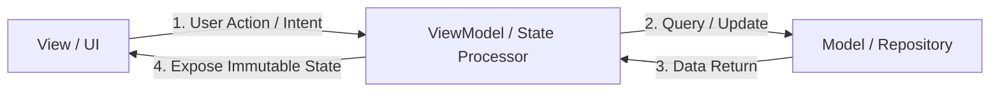

---

## 4.2 ViewModel & SavedStateHandle

### Definition
* **ViewModel** — a state holder scoped to a screen that **survives configuration changes**, so rotating the device does not discard loaded data or re-trigger requests.
* **`ViewModelStore`** — the container that actually holds ViewModels. The framework preserves it across an Activity's destruction and recreation, which is the whole mechanism.
* **`onCleared()`** — called when the owner is finished for good (not on rotation), the point at which to release resources.
* **`SavedStateHandle`** — a key-value map backed by the saved-state `Bundle`, so its contents survive **both** configuration change and **system-initiated process death** — which a ViewModel's own fields do not.
* **Process death** — the OS killing a backgrounded app to reclaim memory. Everything in memory is lost; only the saved `Bundle` returns.

### How ViewModel Works Internally
During configuration changes (e.g., screen rotation), the system destroys the Activity instance. However, the `ViewModelStore` holding the ViewModels is retained.

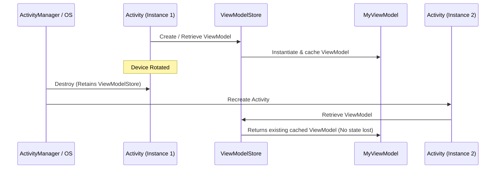

1. The `ViewModelProvider` retrieves ViewModels from a `ViewModelStore` associated with the activity or fragment (`ViewModelStoreOwner`).
2. When the activity is destroyed due to configuration changes, `Activity.onDestroy()` is called, but the `ViewModelStore` instance is preserved inside `NonConfigurationInstances`.
3. When the activity is recreated, the new activity instance attaches to the existing `ViewModelStore` and retrieves the identical ViewModel instance.
4. When the activity is closed permanently (finished), the system clears the `ViewModelStore` and calls `onCleared()` on the ViewModels to release resources.

### SavedStateHandle
When an application process is killed in the background by the OS to reclaim memory (Process Death), ViewModels are destroyed. `SavedStateHandle` allows saving and restoring state across process death using a key-value map.

---

## 4.3 State Holders: LiveData vs. StateFlow vs. SharedFlow

### Definitions
* **LiveData:** An active, lifecycle-aware observable data holder. It always updates observers on the main thread and only when they are in an active state (`STARTED` or `RESUMED`).
* **StateFlow:** A hot Flow from Kotlin Coroutines that represents a state-holding stream. It always holds a value, requires an initial value, and emits the latest state to new collectors (conflation).
* **SharedFlow:** A hot Flow that does not require an initial value and is optimized for emitting event streams (like toast messages, navigation events) to multiple collectors.

### Comparison Table

| Feature | LiveData | StateFlow | SharedFlow |
|---|---|---|---|
| **Lifecycle Aware** | Yes (Built-in) | No (Requires `repeatOnLifecycle`) | No (Requires `repeatOnLifecycle`) |
| **Initial Value** | Not required | Required | Not required |
| **Hot/Cold Stream** | Hot | Hot | Hot |
| **Threading** | Tied to Main Thread | Coroutine Dispatcher flexible | Coroutine Dispatcher flexible |
| **Conflation** | Yes (emits only latest value) | Yes (emits only latest value) | Optional (configurable replay buffer) |
| **Reactive Operators** | Limited | Rich (Kotlin Flow APIs) | Rich (Kotlin Flow APIs) |

### Modern Safe Flow Collection
To collect Flows safely in Android, use `repeatOnLifecycle` or `flowWithLifecycle` to prevent resource waste when the UI is in the background.

```kotlin
class UserActivity : AppCompatActivity() {
    private val viewModel: UserViewModel by viewModels()
    private lateinit var textView: TextView

    override fun onCreate(savedInstanceState: Bundle?) {
        super.onCreate(savedInstanceState)
        setContentView(R.layout.activity_main)

        // Safe Flow collection
        lifecycleScope.launch {
            repeatOnLifecycle(Lifecycle.State.STARTED) {
                viewModel.uiState.collect { state ->
                    textView.text = state.userName
                }
            }
        }
    }
}
```

---

## 4.4 Lifecycle-Aware Components

### Definition
* **Simple:** Classes that observe an Activity or Fragment lifecycle and start/stop themselves automatically, so you never forget to clean up.
* **Advanced:** `LifecycleOwner` exposes a `Lifecycle` state machine (`INITIALIZED → CREATED → STARTED → RESUMED → DESTROYED`). `LifecycleObserver`s registered on it receive state transitions and can move work into the correct window without the host writing manual callbacks.

### Why It Is Used
It inverts the dependency: instead of an Activity remembering to call `start()` and `stop()` on five collaborators, each collaborator owns its own lifecycle rules. This removes the single most common leak source in Android — forgotten teardown.

### How It Works Internally
* `LifecycleRegistry` holds the current state and dispatches events. `ComponentActivity` and `Fragment` install a `ReportFragment` (or direct callbacks on newer APIs) to feed it.
* `lifecycleScope` is a `CoroutineScope` bound to the registry; it is cancelled at `ON_DESTROY`.
* `repeatOnLifecycle(STARTED)` **suspends** until the state is reached, runs its block in a new coroutine, cancels that coroutine on the way below `STARTED`, and restarts it on the way back up. `flowWithLifecycle` is the single-flow shorthand.

**Critical distinction in Fragments:**

| Owner | Lifetime | Use For |
|---|---|---|
| `this` (the Fragment) | Fragment instance — survives back stack | Non-view work; **leaks views if used for UI collection** |
| `viewLifecycleOwner` | `onCreateView` → `onDestroyView` | **All UI observation and Flow collection** |

A Fragment on the back stack is destroyed as a view but alive as an instance. Collecting with `this` means the old, detached view keeps receiving updates and is retained — the classic Fragment leak.

### Code Example
```kotlin
// A self-managing component: no start/stop calls anywhere in the Activity
class LocationTracker(
    private val client: FusedLocationProviderClient,
    private val onLocation: (Location) -> Unit
) : DefaultLifecycleObserver {

    private val callback = object : LocationCallback() {
        override fun onLocationResult(result: LocationResult) {
            result.lastLocation?.let(onLocation)
        }
    }

    @SuppressLint("MissingPermission")
    override fun onStart(owner: LifecycleOwner) {
        client.requestLocationUpdates(request, callback, Looper.getMainLooper())
    }

    override fun onStop(owner: LifecycleOwner) {
        client.removeLocationUpdates(callback)   // Guaranteed cleanup, symmetric with onStart
    }
}

class MapActivity : AppCompatActivity() {
    override fun onCreate(savedInstanceState: Bundle?) {
        super.onCreate(savedInstanceState)
        // One line replaces two manual callbacks and the bug of forgetting one of them
        lifecycle.addObserver(LocationTracker(locationClient, ::renderMarker))
    }
}

// Correct Flow collection in a Fragment
class ProfileFragment : Fragment(R.layout.fragment_profile) {
    private val viewModel: ProfileViewModel by viewModels()
    private var binding: FragmentProfileBinding? = null

    override fun onViewCreated(view: View, savedInstanceState: Bundle?) {
        binding = FragmentProfileBinding.bind(view)

        // viewLifecycleOwner, NOT `this` — otherwise the back-stacked view leaks
        viewLifecycleOwner.lifecycleScope.launch {
            viewLifecycleOwner.repeatOnLifecycle(Lifecycle.State.STARTED) {
                // Multiple independent collectors each need their own launch
                launch { viewModel.uiState.collect(::render) }
                launch { viewModel.events.collect(::handleEvent) }
            }
        }
    }

    override fun onDestroyView() {
        super.onDestroyView()
        binding = null                     // Release the view reference the Fragment instance holds
    }
}

// Process-wide foreground/background detection (app-level, not per-Activity)
class App : Application() {
    override fun onCreate() {
        super.onCreate()
        ProcessLifecycleOwner.get().lifecycle.addObserver(object : DefaultLifecycleObserver {
            override fun onStart(owner: LifecycleOwner) = Analytics.appForegrounded()
            override fun onStop(owner: LifecycleOwner) = Analytics.appBackgrounded()
        })
    }
}
```

### Common Pitfalls
* **Collecting with `lifecycleScope.launch { flow.collect {} }` and no `repeatOnLifecycle`.** The collection keeps running while the app is backgrounded, wasting CPU and network and potentially touching a destroyed view.
* **Nesting `repeatOnLifecycle` blocks per flow.** One block, several inner `launch`es, is cheaper and clearer.
* **Using `this` instead of `viewLifecycleOwner`** in a Fragment — the leak this API exists to prevent.
* **Doing work in `ON_CREATE` that needs a window.** Insets and window size are not final until `ON_START` at the earliest.

---

## 4.5 Navigation Component and Type-Safe Arguments

### Definition
* **Simple:** A library that models your app's screens and the paths between them as a graph, and handles the back stack for you.
* **Advanced:** `NavController` owns a `NavBackStackEntry` stack, where each entry is itself a `LifecycleOwner`, `ViewModelStoreOwner`, and `SavedStateRegistryOwner`. Destinations are resolved from an inflated `NavGraph`.

### Why It Is Used
It centralizes back-stack rules, makes deep links declarative, enforces type-safe arguments at compile time, and gives each destination a scoped `ViewModelStore` — so a multi-screen flow can share one ViewModel that dies when the flow ends.

### How It Works Internally
* Each `NavBackStackEntry` gets its own `ViewModelStore`, cleared when that entry is popped. This is how graph-scoped ViewModels work.
* Safe Args (XML graphs) or Kotlin Serialization (Navigation 2.8+) generates argument classes at compile time, so a missing or mistyped argument fails the build rather than throwing at runtime.
* Results between destinations flow through the **previous** entry's `SavedStateHandle`, which is why the result survives process death.

### Code Example
```kotlin
// Navigation 2.8+ type-safe routes — no string route parsing at all
@Serializable data object ProductList
@Serializable data class ProductDetail(val productId: Long, val referrer: String? = null)

@Composable
fun AppNavHost(navController: NavHostController) {
    NavHost(navController, startDestination = ProductList) {
        composable<ProductList> {
            ProductListScreen(
                onProductClick = { id -> navController.navigate(ProductDetail(id, referrer = "list")) }
            )
        }
        composable<ProductDetail> { entry ->
            // Compile-time typed; a signature change breaks the build, not production
            val args: ProductDetail = entry.toRoute()
            ProductDetailScreen(productId = args.productId)
        }
    }
}

// ViewModel reads the same typed args straight from SavedStateHandle
@HiltViewModel
class ProductDetailViewModel @Inject constructor(
    savedState: SavedStateHandle,
    repo: ProductRepository
) : ViewModel() {
    private val args = savedState.toRoute<ProductDetail>()
    val product = repo.observeProduct(args.productId)
        .stateIn(viewModelScope, SharingStarted.WhileSubscribed(5_000), null)
}
```

```kotlin
// Back-stack control: pop up to a destination so the user cannot return to the login flow
navController.navigate(Home) {
    popUpTo(Login) { inclusive = true }
    launchSingleTop = true            // Avoid stacking duplicates of the same destination
}

// Returning a result to the previous screen (survives process death via SavedStateHandle)
// Producer:
navController.previousBackStackEntry
    ?.savedStateHandle?.set("selected_address_id", addressId)
navController.popBackStack()

// Consumer, observed on the current entry:
val id = navController.currentBackStackEntry
    ?.savedStateHandle
    ?.getStateFlow<Long?>("selected_address_id", null)
    ?.collectAsStateWithLifecycle()
```

### Common Pitfalls
* **Navigating twice on a fast double tap** throws or pushes a duplicate. Guard with `launchSingleTop`, or check `currentDestination?.id == expectedId` before navigating.
* **Passing large objects as arguments.** Arguments are serialized into a Bundle bounded by the Binder limit. Pass an ID and re-fetch.
* **Holding the `NavController` in a ViewModel.** It is a UI-scoped object; leaking it leaks the whole Activity. Emit navigation *events* from the ViewModel and let the UI act on them.
* **Navigating from a `LaunchedEffect` keyed on a state that recomposes.** The effect restarts and navigates repeatedly. Key it on a one-shot event, and consume the event after handling.

---

## 4.6 ViewBinding vs. DataBinding vs. findViewById

### Definition
* **ViewBinding:** Generates a binding class per XML layout containing typed, non-null references to every view with an ID.
* **DataBinding:** A superset that additionally parses `<layout>` expressions and binds data objects directly in XML, with optional two-way binding.
* **findViewById:** The legacy runtime lookup, returning a nullable, uncast `View`.

### Why It Is Used
`findViewById` fails at runtime for typos, wrong types, and views absent from the current configuration's layout. ViewBinding turns all three into compile errors at essentially zero cost.

### How It Works Internally
* ViewBinding runs at compile time as part of the resource pipeline. It walks each layout, emits a class with one field per ID, and marks a field nullable when the view exists only in some configuration variants of the layout.
* DataBinding additionally runs an annotation processor, generates expression-evaluation code, and installs listeners for `Observable` fields. This is why it materially increases build time.

| | findViewById | ViewBinding | DataBinding |
|---|---|---|---|
| **Null safety** | No | Yes | Yes |
| **Type safety** | No (manual cast) | Yes | Yes |
| **Build-time cost** | None | Negligible | Significant (kapt/KSP) |
| **Logic in XML** | No | No | Yes (a drawback for testability) |
| **Two-way binding** | No | No | Yes |
| **Google's current recommendation** | Avoid | **Use this** | Only for existing code |

### Code Example
```kotlin
// Activity: bind once, keep the reference for the Activity's lifetime
class MainActivity : AppCompatActivity() {
    private lateinit var binding: ActivityMainBinding

    override fun onCreate(savedInstanceState: Bundle?) {
        super.onCreate(savedInstanceState)
        binding = ActivityMainBinding.inflate(layoutInflater)
        setContentView(binding.root)
        binding.submitButton.setOnClickListener { viewModel.submit() }
    }
}

// Fragment: the binding must be nulled in onDestroyView or the view hierarchy leaks
class ProfileFragment : Fragment(R.layout.fragment_profile) {
    private var _binding: FragmentProfileBinding? = null
    private val binding get() = _binding!!     // Valid only between onCreateView and onDestroyView

    override fun onViewCreated(view: View, savedInstanceState: Bundle?) {
        _binding = FragmentProfileBinding.bind(view)
        binding.nameField.doAfterTextChanged { viewModel.onNameChanged(it.toString()) }
    }

    override fun onDestroyView() {
        super.onDestroyView()
        _binding = null
    }
}

// RecyclerView ViewHolder with ViewBinding
class UserViewHolder(private val binding: ItemUserBinding) : RecyclerView.ViewHolder(binding.root) {
    fun bind(user: User) {
        binding.name.text = user.name
        binding.avatar.load(user.avatarUrl)
    }
}
```

```gradle
android {
    buildFeatures {
        viewBinding = true      // Enable per module; costs nothing at runtime
    }
}
```

### Common Pitfalls
* **Leaking the Fragment binding** by holding it past `onDestroyView`. This is the single most common ViewBinding mistake. A `by viewBinding()` delegate that auto-clears is a worth-adopting pattern.
* **Assuming every field is non-null.** A view present only in `layout-land/` is generated as nullable; guard it.
* **Migrating to DataBinding for null safety alone.** ViewBinding gives that without the build cost or the untestable XML logic.

---
# 5. Threading, Concurrency & Reactive Streams

## 5.1 Kotlin Coroutines Internals

### Definition
* **Coroutine** — a unit of work that can **suspend** and later resume without blocking the thread it was running on.
* **Suspend vs block** — suspending **releases** the thread for other work; blocking holds it idle. This distinction is the entire performance argument for coroutines.
* **`Continuation`** — the object representing "the rest of this coroutine", passed invisibly to every `suspend` function so execution can be resumed later.
* **CPS (Continuation-Passing Style)** — the transformation the compiler applies: each `suspend` function gains a hidden `Continuation` parameter and its body becomes a **state machine** whose `label` records where to resume.
* **Suspension point** — any call that may suspend. It is also the only place cancellation can take effect, which is why CPU-bound loops need an explicit `ensureActive()`.

### Under the Hood: Suspension Points and State Machine
How does a coroutine pause execution without blocking the underlying thread?
* The Kotlin compiler transforms suspending functions into a **State Machine** using a **Continuation Passing Style (CPS)**.
* Every suspending function receives an extra parameter of type `Continuation<T>` at compile time.

```kotlin
// Source Code
suspend fun fetchUser(): User {
    val id = getUserId() // Suspending
    return apiService.getUserDetail(id) // Suspending
}

// Compiled Code (Simplified Concept)
fun fetchUser(completion: Continuation<Any?>): Any? {
    class FetchUserStateMachine : ContinuationImpl(completion) {
        var label = 0
        var result: Any? = null
        override fun invokeSuspend(result: Any?) {
            this.result = result
            this.label = this.label or Int.MIN_VALUE
            return fetchUser(this)
        }
    }
    
    val sm = completion as? FetchUserStateMachine ?: FetchUserStateMachine()
    switch(sm.label) {
        case 0:
            sm.label = 1
            val id = getUserId(sm) // Passes state machine as continuation
            if (id == COROUTINE_SUSPENDED) return COROUTINE_SUSPENDED
        case 1:
            sm.label = 2
            val user = apiService.getUserDetail(sm.result as String, sm)
            if (user == COROUTINE_SUSPENDED) return COROUTINE_SUSPENDED
            return user
    }
}
```
When a coroutine hits a suspension point, the function saves its local variables to the state machine, returns `COROUTINE_SUSPENDED`, and frees up the physical thread. Once the background process completes, the `Continuation` object calls `resumeWith()`, reloading the saved state and resuming execution at the correct label.

### Coroutine Scope and Dispatchers
* **`Dispatchers.Main`:** Executes on the main thread (uses Android Looper).
* **`Dispatchers.IO`:** Optimized for disk or network tasks (backed by a dynamic shared pool of threads).
* **`Dispatchers.Default`:** Optimized for CPU-intensive work (backed by a pool size equal to the CPU core count).

---

## 5.2 RxJava Reactive Streams

### Definition
RxJava is a library for composing asynchronous and event-based programs by using observable sequences.

* **Observable:** Emits a stream of data elements.
* **Observer:** Consumes emissions from the Observable.
* **Schedulers:** Controls concurrency (`Schedulers.io()`, `AndroidSchedulers.mainThread()`).
* **Disposable:** Represents the link between subscription and emissions. It must be cleared (`CompositeDisposable`) to prevent memory leaks when the UI is destroyed.

```kotlin
// RxJava Network Call Example
class UserRepository(private val apiService: ApiService) {
    private val disposables = CompositeDisposable()

    fun loadUserData() {
        disposables.add(
            apiService.getUserProfile()
                .subscribeOn(Schedulers.io()) // Run network request on IO thread
                .observeOn(AndroidSchedulers.mainThread()) // Receive on Main Thread
                .subscribe(
                    { profile -> updateUI(profile) },
                    { error -> handleError(error) }
                )
        )
    }

    fun clear() {
        disposables.clear() // Prevent memory leaks
    }
}
```

## 5.3 Handler, Looper, and MessageQueue Internals

### Definition
* **Simple:** Handlers and Loopers allow you to send messages between different threads, such as running a background task and sending the result back to update the main UI thread.
* **Advanced:** The Handler-Looper-MessageQueue framework is Android's native event-loop mechanism. It consists of a `MessageQueue` that stores serialized execution tasks, a `Looper` that continuously pulls tasks from the queue, and a `Handler` that posts or processes those tasks on the associated thread.

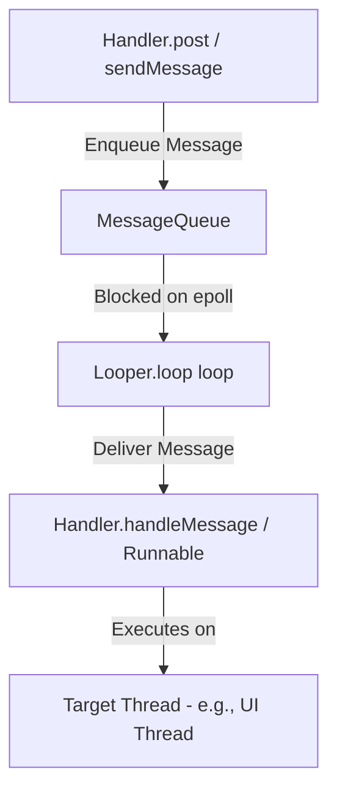

### How It Works Internally
1. **Thread Thread-Local Storage (TLS):** A thread must call `Looper.prepare()` (done automatically for the main thread by `ActivityThread`) to instantiate a `Looper` and bind it to the thread via `ThreadLocal`.
2. **The Event Loop (`Looper.loop()`):** Runs an infinite loop on the thread. It queries `MessageQueue.next()`.
3. **Linux epoll blocking:** To prevent the CPU from running at 100% load during idle states, `MessageQueue` blocks the thread using the Linux `epoll_wait` system call on a pipe file descriptor. The thread goes to sleep and is woken up by the kernel only when a new message is posted.
4. **Synchronization Barriers:** A synchronization barrier is a message with a null `target` (`msg.target == null`) injected into the queue. When the `MessageQueue` encounters a barrier, it suspends execution of all subsequent **synchronous** messages, but allows **asynchronous** messages (e.g., UI measurement and draw commands posted by the `Choreographer`) to pass through. This ensures layout traversals bypass background work, maintaining smooth UI rendering.

## 5.4 Advanced System Resource Management

### Definition
* **Resource management** — how the OS shares finite memory and CPU across every running app, and how it decides what to reclaim when they run short.
* **Binder memory mapping (`mmap`)** — the mechanism that makes IPC cheap: the kernel maps a shared buffer into the receiving process, so a transaction copies data **once** rather than twice.
* **Low Memory Killer (`lmkd`)** — the userspace daemon that terminates processes under memory pressure, choosing victims by an importance score rather than at random.
* **Concurrent Copying GC** — ART's garbage collector, which relocates live objects **while the app keeps running**, eliminating the stop-the-world pause that made older collectors visibly stutter.

### Binder Memory Mapping (mmap)
Binder enables Inter-Process Communication (IPC) by using `mmap()` to allocate a 1MB memory buffer in the receiving process's kernel address space. This allows data to be copied from the sender's process into the shared kernel buffer, which is then mapped into the recipient's virtual memory space, minimizing data copies between processes.

### LMK (Low Memory Killer) Score Allocation
The Android LMK uses `oom_adj` scores (now handled via `lmkd`) to decide which processes to kill. Processes are categorized by their importance:
* **Foreground:** High score, last to be killed.
* **Visible/Service/Background:** Lower scores, reclaimed when system pressure increases.
* **Empty:** Reclaimed first to free up memory for active tasks.

### ART Concurrent Copying (CC) GC
The ART (Android Runtime) uses a Concurrent Copying Garbage Collector. It moves objects during the "root scan" and "marking" phases while the application continues to run. By moving objects in the heap concurrently, it eliminates the need for a "Stop-the-World" pause, significantly reducing UI jank during GC cycles.

---

## 5.5 Structured Concurrency, Job Hierarchy, and Exception Handling

### Definition
* **Simple:** Every coroutine belongs to a parent scope. Cancelling the parent cancels all children, and no coroutine can outlive its scope.
* **Advanced:** Structured concurrency is enforced by the `Job` hierarchy in `CoroutineContext`. A child `Job` registers with its parent; cancellation propagates downward, and by default an uncaught failure propagates **upward**, cancelling siblings.

### Why It Is Used
It eliminates leaked background work. Without it, an Activity destroyed mid-request leaves a coroutine writing into a dead view. With it, `viewModelScope` cancellation is automatic and total.

### How It Works Internally

**Cancellation is cooperative.** `job.cancel()` only sets `isActive = false` and throws `CancellationException` at the next suspension point. A tight CPU loop with no suspension point ignores cancellation entirely — you must call `ensureActive()` or `yield()`.

**`Job` vs. `SupervisorJob`:**

| | `Job` (default) | `SupervisorJob` |
|---|---|---|
| Child fails | Cancels parent **and all siblings** | Only that child fails |
| Used by | `coroutineScope { }`, plain `launch` | `viewModelScope`, `lifecycleScope`, `supervisorScope { }` |
| Right for | All-or-nothing work (parallel decomposition) | Independent tasks (several screen sections loading) |

**Exception propagation differs by builder:**
* `launch` — throws immediately to the `CoroutineExceptionHandler`, or to the thread's default handler (crash) if none is installed.
* `async` — **stores** the exception in the `Deferred`. It surfaces only at `await()`. An `async` whose result is never awaited swallows its exception silently.
* `CoroutineExceptionHandler` works only on a **root** coroutine's context. Installing it on a child is a no-op; the exception has already gone up to the parent.

### Code Example
```kotlin
class DashboardViewModel(
    private val repo: Repository
) : ViewModel() {

    // Installed on the ROOT coroutine's context — a handler on a child would never fire
    private val handler = CoroutineExceptionHandler { _, throwable ->
        _state.update { it.copy(error = throwable.message) }
    }

    // Parallel decomposition: all three must succeed, so a plain coroutineScope is correct
    fun loadAll() = viewModelScope.launch(handler) {
        val page = coroutineScope {
            val user = async { repo.user() }
            val feed = async { repo.feed() }
            val ads  = async { repo.ads() }
            // If any fails, the other two are cancelled and the failure surfaces here
            DashboardPage(user.await(), feed.await(), ads.await())
        }
        _state.update { it.copy(page = page) }
    }

    // Independent sections: one failing must not blank the others
    fun loadIndependently() = viewModelScope.launch {
        supervisorScope {
            launch { runCatching { repo.user() }.onSuccess(::setUser).onFailure(::setUserError) }
            launch { runCatching { repo.feed() }.onSuccess(::setFeed).onFailure(::setFeedError) }
        }
    }

    // Cooperative cancellation in CPU-bound work
    suspend fun compress(frames: List<Frame>) = withContext(Dispatchers.Default) {
        frames.map { frame ->
            ensureActive()          // Throws CancellationException if the scope was cancelled
            encode(frame)           // Without this, cancellation is ignored until the loop ends
        }
    }

    // Cleanup that must survive cancellation
    suspend fun writeThenClose(data: ByteArray) {
        try {
            repo.upload(data)
        } finally {
            // A suspending call in `finally` after cancellation needs NonCancellable,
            // otherwise it throws CancellationException immediately and never runs.
            withContext(NonCancellable) { repo.releaseLock() }
        }
    }
}
```

### Common Pitfalls
* **Catching `Exception` around a suspending call.** `CancellationException` is an `Exception`; swallowing it breaks cancellation and can hang the scope. Rethrow it, or catch specific types, or use `runCatching` carefully (it also swallows it).
* **`GlobalScope.launch`.** No parent, never cancelled, leaks by construction. Use an injected scope with a `SupervisorJob` if you genuinely need app-lifetime work.
* **`async` without `await`.** The exception disappears. If you do not need the result, use `launch`.
* **`withContext(Dispatchers.IO)` inside a loop.** Each call is a context switch. Wrap the loop, not the body.

---

## 5.6 Kotlin Flow Operators in Practice

### Definition
* **Flow** — an asynchronous stream of values delivered over time, consumed by a collector.
* **Cold** — a `flow { }` runs **nothing** until collected, and its body re-executes independently for each collector.
* **Intermediate operator** (`map`, `filter`, `debounce`, `flatMapLatest`) — describes a transformation and returns a new flow. It is lazy and performs no work by itself.
* **Terminal operator** (`collect`, `first`, `stateIn`) — starts the pipeline; nothing runs without one.
* **Operator choice as a correctness decision** — `flatMapLatest` cancels the previous request while `flatMapMerge` does not, so picking the wrong one produces stale-response bugs rather than merely slower code.

### Why It Is Used
It replaces callback chains and RxJava for most Android work, integrates with structured concurrency (cancellation is free), and gives declarative operators for the debounce/retry/combine patterns that every real app needs.

### How It Works Internally
* **Cold vs. hot.** `flow { }` re-executes its builder per collector. `StateFlow`/`SharedFlow` are hot: they exist independently of collectors and share one emission stream.
* **Context preservation.** A `Flow` must emit in the context it was collected in. `withContext` inside `flow { }` violates this and throws; `flowOn` is the sanctioned way, and it affects only operators **upstream** of it.
* **`shareIn` / `stateIn`** convert a cold flow into a hot one. `SharingStarted.WhileSubscribed(5_000)` keeps the upstream alive for 5 seconds after the last collector leaves — long enough to survive a rotation, short enough not to waste resources.

**Operator selection table:**

| Need | Operator |
|---|---|
| Cancel the previous request when a new value arrives (search) | `flatMapLatest` |
| Run all requests concurrently, interleave results | `flatMapMerge` |
| Run requests strictly in order | `flatMapConcat` |
| Wait for typing to settle | `debounce` |
| Drop duplicate consecutive values | `distinctUntilChanged` |
| Merge two streams into one derived value | `combine` |
| Pair values one-to-one from two streams | `zip` |
| Retry with exponential backoff | `retryWhen` |
| Move upstream work to another dispatcher | `flowOn` |
| Emit a loading state before the data | `onStart` |
| Handle upstream errors without breaking the stream | `catch` |

### Code Example
```kotlin
class SearchViewModel(
    private val repo: SearchRepository,
    private val connectivity: ConnectivityObserver
) : ViewModel() {

    private val query = MutableStateFlow("")
    private val filters = MutableStateFlow(Filters.DEFAULT)

    @OptIn(ExperimentalCoroutinesApi::class, FlowPreview::class)
    val uiState: StateFlow<SearchUiState> =
        combine(query, filters) { q, f -> q to f }          // React to either input changing
            .debounce(300)                                   // Wait for typing to settle
            .distinctUntilChanged()                          // Ignore no-op re-emissions
            .flatMapLatest { (q, f) ->                       // Cancel the in-flight request
                if (q.length < 2) flowOf(SearchUiState.Idle)
                else repo.search(q, f)
                    .map { SearchUiState.Success(it) }
                    .onStart { emit(SearchUiState.Loading) }
                    .retryWhen { cause, attempt ->
                        // Retry transient IO failures up to 3 times with exponential backoff
                        val retryable = cause is IOException && attempt < 3
                        if (retryable) delay(1000L shl attempt.toInt())
                        retryable
                    }
                    .catch { emit(SearchUiState.Error(it.toUserMessage())) }
            }
            .flowOn(Dispatchers.IO)                          // Applies to everything UPSTREAM
            .stateIn(
                scope = viewModelScope,
                // Keeps the upstream alive across rotation, tears it down when truly gone
                started = SharingStarted.WhileSubscribed(5_000),
                initialValue = SearchUiState.Idle
            )

    fun onQueryChange(value: String) { query.value = value }
}

// Turning a callback API into a Flow, with guaranteed unregistration
fun ConnectivityManager.networkStatus(): Flow<Boolean> = callbackFlow {
    val callback = object : ConnectivityManager.NetworkCallback() {
        override fun onAvailable(network: Network) { trySend(true) }
        override fun onLost(network: Network) { trySend(false) }
    }
    registerDefaultNetworkCallback(callback)
    // awaitClose is MANDATORY in callbackFlow; omitting it throws at runtime
    awaitClose { unregisterNetworkCallback(callback) }
}.distinctUntilChanged()

// One-shot events (navigation, snackbars) must NOT be a StateFlow — replay would re-fire them
private val _events = Channel<UiEvent>(Channel.BUFFERED)
val events: Flow<UiEvent> = _events.receiveAsFlow()
```

### Common Pitfalls
* **Modelling one-shot events as `StateFlow`.** After a rotation the collector re-reads the current value and the navigation or snackbar fires again. Use a `Channel` + `receiveAsFlow`, or a state field the UI explicitly consumes.
* **`SharingStarted.Eagerly` on an expensive upstream.** It runs even with no collector, for the whole ViewModel lifetime.
* **`withContext` inside `flow { }`** throws `IllegalStateException: Flow invariant is violated`. Use `flowOn`.
* **`catch` placed after `stateIn`.** `catch` only sees exceptions from upstream; put it before the conversion.
* **`combine` firing on the very first emission of each source.** It waits for *all* sources to emit at least once, so a source with no initial value stalls the whole chain.

---

## 5.7 Java Concurrency Primitives on Android

### Definition
* **Thread** — an independently scheduled path of execution, costing roughly 1 MB of stack plus OS context-switching.
* **Memory visibility** — the problem underneath all of this: each CPU core caches values, so without a synchronization action a write by one thread may **never** become visible to another.
* **`volatile`** — guarantees visibility and ordering for a single field. It does **not** make compound operations such as `count++` atomic.
* **`synchronized`** — guarantees visibility, ordering, **and** mutual exclusion, at the cost of blocking whichever thread waits.
* **Atomic classes** — provide lock-free read-modify-write on one variable using a compare-and-swap instruction.
* **`ExecutorService`** — a managed pool that reuses threads, so work is queued rather than spawning an unbounded number of threads.

### Why It Is Used
Coroutines run on thread pools built from these primitives. Interviewers ask about them because memory-visibility bugs are invisible in testing and catastrophic in production, and because legacy Android code and third-party SDKs still use them directly.

### How It Works Internally

**The Java Memory Model problem.** Each CPU core has its own cache. Without a synchronization action, a write by thread A may never become visible to thread B — the value can sit in a core's store buffer indefinitely. This is not theoretical; it reproduces reliably on ARM, which has a weaker memory model than x86.

| Primitive | Guarantees | Does NOT Guarantee |
|---|---|---|
| `volatile` | Visibility + ordering (happens-before on read/write) | **Atomicity** — `count++` is still a race |
| `synchronized` | Visibility + ordering + mutual exclusion | Fairness; also risks deadlock |
| `AtomicInteger` | Visibility + atomic read-modify-write via CAS | Atomicity across *multiple* variables |
| `@Volatile` + double-check | Correct lazy singleton | Anything on its own |

**Executor sizing:**

| Workload | Pool | Rationale |
|---|---|---|
| CPU-bound | `newFixedThreadPool(numCores)` | More threads only add context switches |
| IO-bound | Large or cached pool (coroutines: `Dispatchers.IO`, 64 threads) | Threads spend their time blocked, not computing |
| Sequential ordering required | `newSingleThreadExecutor()` | Implicit mutual exclusion, no locks needed |

### Code Example
```kotlin
// Thread-safe lazy singleton: @Volatile is required, not optional.
// Without it, another thread can observe a NON-NULL reference to a PARTIALLY constructed object,
// because the constructor's field writes may be reordered after the reference assignment.
class AnalyticsClient private constructor(context: Context) {
    companion object {
        @Volatile private var instance: AnalyticsClient? = null

        fun get(context: Context): AnalyticsClient =
            instance ?: synchronized(this) {
                instance ?: AnalyticsClient(context.applicationContext).also { instance = it }
            }
    }
}

// Kotlin's idiomatic equivalent — LazyThreadSafetyMode.SYNCHRONIZED is the default
val analytics: AnalyticsClient by lazy { AnalyticsClient(appContext) }

// volatile does NOT make compound operations atomic
class Counter {
    @Volatile var wrong = 0            // wrong++ is read-modify-write: still races
    private val right = AtomicInteger(0)

    fun incrementWrong() { wrong++ }                  // BUG: lost updates under contention
    fun incrementRight() { right.incrementAndGet() }  // Correct: single CAS instruction
}

// Executor with a named factory so thread names are readable in a stack trace / ANR log
val ioExecutor: ExecutorService = ThreadPoolExecutor(
    4, 16, 60L, TimeUnit.SECONDS,
    LinkedBlockingQueue(),
    ThreadFactory { r -> Thread(r, "app-io-${counter.getAndIncrement()}").apply { isDaemon = true } }
)

// Bridging a legacy callback API into coroutines
suspend fun LegacySdk.fetchToken(): String = suspendCancellableCoroutine { cont ->
    val call = requestToken(object : TokenCallback {
        override fun onSuccess(token: String) = cont.resume(token)
        override fun onError(e: Throwable) = cont.resumeWithException(e)
    })
    // Without this, cancelling the coroutine leaves the SDK call running
    cont.invokeOnCancellation { call.cancel() }
}
```

### Common Pitfalls
* **Assuming `volatile` makes `++` safe.** It does not. Use `AtomicInteger` or a lock.
* **Deadlock from nested locks acquired in different orders.** Establish a global lock ordering, or avoid holding two locks at once.
* **`synchronized` on the main thread.** If the lock is held by a slow background thread, the UI blocks and you get an ANR.
* **Unbounded thread creation.** Each thread costs ~1 MB of stack. A `Thread { }` per request exhausts memory under load.
* **Forgetting `invokeOnCancellation`** when wrapping a callback API — the coroutine cancels but the underlying work keeps running.

---
# 6. Data Storage & Networking

## 6.1 Room Database Architecture

### Definition
* **Room** — a Jetpack library that sits on top of SQLite and generates the boilerplate for you, while **verifying your SQL at compile time**.
* **`@Entity`** — a class that maps to a table; its properties become columns.
* **`@Dao` (Data Access Object)** — an interface of query methods. Room generates the implementation, so a typo in a column name is a build error rather than a runtime crash.
* **`@Database`** — the class that ties entities and DAOs together, owns the connection, and carries the schema **version**.
* **Migration** — the SQL that transforms an old schema into a new one when the version increases. Without it, Room throws rather than risk corrupting user data.

Room is a Jetpack data storage component providing an abstraction layer over SQLite.

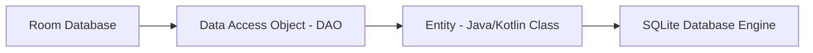

### Components
1. **Entity:** Represents a table within the database. Annotations like `@Entity` and `@PrimaryKey` map properties to columns.
2. **DAO (Data Access Object):** Contains methods used for querying, inserting, and deleting data. Room validates SQL queries in DAOs at compile time.
3. **RoomDatabase:** Serves as the database controller and main access point to the connection.

### Migration Mechanics
When you modify database tables, you must increment the database version and provide a `Migration` implementation to avoid app crashes.

```kotlin
val MIGRATION_1_2 = object : Migration(1, 2) {
    override fun migrate(db: SupportSQLiteDatabase) {
        // Execute SQL statement to modify schema
        db.execSQL("ALTER TABLE User ADD COLUMN age INTEGER NOT NULL DEFAULT 0")
    }
}

// Room Database Builder
Room.databaseBuilder(context, AppDatabase::class.java, "app-db")
    .addMigrations(MIGRATION_1_2)
    .build()
```

---

## 6.2 SharedPreferences vs. DataStore

### Definition
* **Key-value storage** — persisting small pieces of data (a flag, a token, a chosen theme) by name, as opposed to the structured tables a database provides.
* **SharedPreferences** — the original Android API. It is **synchronous**, backed by an XML file, and its first read parses that whole file on the calling thread.
* **DataStore** — the Jetpack replacement. It is **asynchronous** (coroutines and `Flow`), transactional, and reports errors through the stream instead of throwing.
* **Preferences DataStore vs Proto DataStore** — the first is untyped key-value like SharedPreferences; the second is backed by a protobuf schema, so the stored object is fully typed.

### Comparison Table

| Feature | SharedPreferences | Jetpack DataStore (Preferences/Proto) |
|---|---|---|
| **API Style** | Synchronous (blocking calls) | Asynchronous API (uses Kotlin Coroutines & Flow) |
| **Thread Safety** | No (unsafe modifications from background) | Yes (safe to call from UI/background threads) |
| **Exception Handling** | Throws runtime exceptions on parser errors | Catchable input/output exceptions |
| **Transaction support** | No | Yes (transactional data updates via `DataStore`) |
| **Type Safety** | No | Yes (Proto DataStore) |

---

## 6.3 Networking Stack (Retrofit & OkHttp)

### Definition
* **OkHttp** — the HTTP **engine**: it opens sockets, pools and reuses connections, follows redirects, handles HTTP/2, and applies the disk cache.
* **Retrofit** — a **type-safe wrapper** over that engine. You declare an annotated Kotlin interface, and Retrofit generates the implementation that builds requests and parses responses.
* **Converter** — the component that turns a response body into your model type (kotlinx.serialization, Moshi, Gson).
* **Interceptor** — a hook in OkHttp's request/response chain, used to add headers, log, retry, or rewrite. This is where cross-cutting concerns such as authentication belong.

* **Retrofit:** A type-safe HTTP client library that maps HTTP API endpoints directly to Kotlin/Java interfaces.
* **OkHttp:** The underlying client engine that handles socket connections, requests execution, connection pooling, and payload compression.

### The Interceptor Pipeline
OkHttp passes outbound requests and inbound responses through a chain of interceptors:

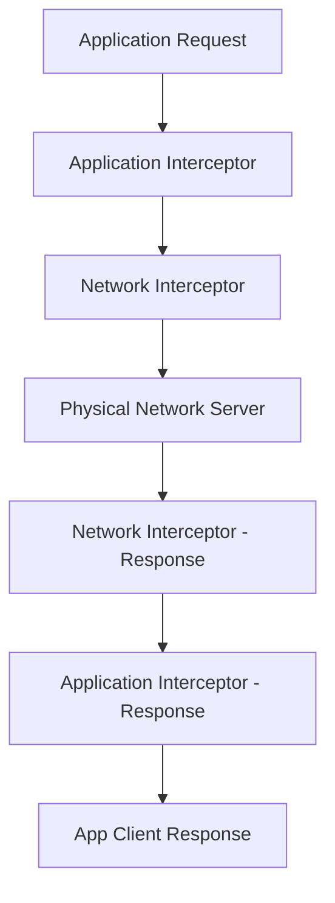

* **Application Interceptor:** Runs at the top level. Always called once, even if the response is served from the cache. Ideal for adding custom headers.
* **Network Interceptor:** Runs between OkHttp and the physical network. Allows monitoring redirects and raw headers traveling over the wire.

```kotlin
// Custom Auth Interceptor
class AuthInterceptor(private val tokenProvider: TokenProvider) : Interceptor {
    override fun intercept(chain: Interceptor.Chain): Response {
        val originalRequest = chain.request()
        val authenticatedRequest = originalRequest.newBuilder()
            .header("Authorization", "Bearer ${tokenProvider.getToken()}")
            .build()
        return chain.proceed(authenticatedRequest)
    }
}
```

---

## 6.4 JSON Serialization: kotlinx.serialization vs. Moshi vs. Gson

### Definition
* **Serialization** — converting an object into a transportable form (here, JSON text); **deserialization** is the reverse.
* **Adapter / serializer** — the code that performs the conversion for one type. *When* it is produced is what separates these libraries.
* **Compile-time generation** (kotlinx.serialization, Moshi with KSP) — the adapter is generated during the build, so it is fast, needs no reflection, and **respects Kotlin's null safety and default values**.
* **Runtime reflection** (Gson) — the adapter is derived by inspecting the class at runtime. Gson also constructs objects by bypassing the constructor, so Kotlin's null checks and defaults never run — which is why a missing JSON field can leave a non-null `String` holding `null`.
* **DTO (Data Transfer Object)** — a model shaped to the wire format, deliberately kept separate from the domain model so backend changes stop at the mapper.

### Why It Is Used
Gson predates Kotlin and uses `sun.misc.Unsafe` to bypass constructors entirely. It will happily hand you an object whose non-null `String` field is `null`, producing a `NullPointerException` far from the parse site. This is the single most common source of "impossible" crashes in Kotlin Android apps.

### How It Works Internally

| | kotlinx.serialization | Moshi (with codegen) | Gson |
|---|---|---|---|
| **Adapter generation** | Compiler plugin, compile time | KSP, compile time | Reflection, runtime |
| **Kotlin null safety** | Fully enforced | Fully enforced | **Broken** — bypasses constructors |
| **Default values honored** | Yes | Yes | No (fields left null) |
| **Reflection at runtime** | None | None (codegen mode) | Heavy |
| **Multiplatform** | Yes | No | No |
| **Verdict** | Default choice for new code | Excellent, JVM-only | Legacy only |

**Why Gson breaks null safety:** it allocates the instance via `Unsafe.allocateInstance`, skipping the Kotlin-generated constructor that performs null checks and applies defaults. A missing JSON field therefore leaves a `String` (not `String?`) holding `null`.

### Code Example
```kotlin
// kotlinx.serialization — the compiler plugin generates the serializer at build time
@Serializable
data class UserDto(
    val id: Long,
    @SerialName("full_name") val fullName: String,      // Map JSON snake_case to Kotlin camelCase
    val email: String? = null,                          // Explicitly optional
    val role: Role = Role.MEMBER,                       // Default applied when the field is absent
    @Transient val localOnly: Boolean = false           // Never serialized
)

@Serializable
enum class Role {
    @SerialName("admin") ADMIN,
    @SerialName("member") MEMBER
}

val json = Json {
    ignoreUnknownKeys = true      // ESSENTIAL: a new server field must not crash old clients
    explicitNulls = false         // Omit nulls when writing, rather than emitting "field": null
    coerceInputValues = true      // Fall back to the default when the server sends null for a non-null field
}
```

```kotlin
// Wiring it into Retrofit
val retrofit = Retrofit.Builder()
    .baseUrl(BASE_URL)
    .addConverterFactory(json.asConverterFactory("application/json".toMediaType()))
    .client(okHttpClient)
    .build()
```

```kotlin
// Polymorphic responses — a common real-world API shape
@Serializable
sealed interface Notification {
    @Serializable @SerialName("message")
    data class Message(val from: String, val body: String) : Notification

    @Serializable @SerialName("friend_request")
    data class FriendRequest(val userId: Long) : Notification
}
// Reads: { "type": "message", "from": "alice", "body": "hi" }
// The discriminator key defaults to "type"; override with Json { classDiscriminator = "kind" }
```

```kotlin
// DTO -> domain mapping keeps network shape changes out of the rest of the app
fun UserDto.toDomain(): User = User(
    id = id,
    name = fullName,
    email = email.orEmpty(),
    isAdmin = role == Role.ADMIN
)
```

### Common Pitfalls
* **Not setting `ignoreUnknownKeys = true`.** The first field the backend adds crashes every deployed client.
* **Using DTOs as domain models.** Every backend rename then ripples through the UI. Map at the repository boundary.
* **Keeping Gson while migrating to Kotlin** and blaming the resulting NPEs on "flaky data".
* **Forgetting R8 keep rules.** Reflection-based parsers need `-keep` rules for model classes; kotlinx.serialization ships its own rules but needs `@Serializable` on every model.

---

## 6.5 Image Loading: Coil and Glide

### Definition
* **Image loading library** — a component that fetches, decodes, caches, resizes, and binds images, cancelling work when the target is no longer on screen.
* **Decoding** — turning compressed bytes (JPEG, PNG) into an in-memory bitmap. Memory cost is **width × height × 4 bytes**, independent of the file size, which is why a 4000×3000 photo needs ~48 MB.
* **Downsampling** — decoding at a reduced resolution matched to the view's measured size. This single step is what prevents most out-of-memory crashes.
* **Two-level cache** — decoded bitmaps in a memory `LruCache` for instant reuse, plus compressed bytes on disk so they survive process death.
* **Request cancellation** — dropping an in-flight load when its target view is recycled, which is what stops the wrong image flashing into a reused list row.

### Why It Is Used
Naïvely decoding a 4000×3000 JPEG into a 300 dp `ImageView` allocates ~48 MB and reliably produces `OutOfMemoryError`. Image loaders downsample to the target's actual size, cache at two levels, and cancel in-flight requests when a `RecyclerView` row is recycled.

### How It Works Internally

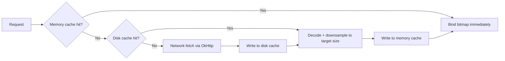

* **Memory cache** — an `LruCache` sized as a fraction of the app heap, holding decoded bitmaps.
* **Disk cache** — the compressed bytes, keyed by URL plus transformations, surviving process death.
* **Downsampling** — `BitmapFactory.Options.inSampleSize` is computed from the target view's measured size, so memory scales with display size, not source size.
* **Lifecycle cancellation** — Coil ties requests to the `LifecycleOwner` resolved from the context; Glide ties them to a `RequestManager` in a hidden retained Fragment.

| | Coil 3 | Glide |
|---|---|---|
| Language | Kotlin, coroutine-based | Java |
| Compose support | First-class (`AsyncImage`) | Via an accompanist-style wrapper |
| Multiplatform | Yes (Coil 3) | No |
| Size added to APK | ~250 KB | ~1 MB (with annotation processor) |

### Code Example
```kotlin
// Coil in Compose
@Composable
fun Avatar(url: String, modifier: Modifier = Modifier) {
    AsyncImage(
        model = ImageRequest.Builder(LocalContext.current)
            .data(url)
            .crossfade(true)
            .memoryCacheKey(url)                 // Explicit key when the URL carries volatile params
            .build(),
        contentDescription = null,               // null = decorative; set real text for meaningful images
        placeholder = painterResource(R.drawable.avatar_placeholder),
        error = painterResource(R.drawable.avatar_error),
        contentScale = ContentScale.Crop,
        modifier = modifier.size(48.dp).clip(CircleShape)
    )
}

// Coil in a RecyclerView — the extension cancels the previous request on the same view automatically
class UserViewHolder(private val binding: ItemUserBinding) : RecyclerView.ViewHolder(binding.root) {
    fun bind(user: User) {
        binding.avatar.load(user.avatarUrl) {
            placeholder(R.drawable.avatar_placeholder)
            transformations(CircleCropTransformation())
        }
    }
}

// Application-scoped loader sharing the app's OkHttpClient (one connection pool, one cache)
class App : Application(), SingletonImageLoader.Factory {
    override fun newImageLoader(context: PlatformContext): ImageLoader =
        ImageLoader.Builder(context)
            .memoryCache {
                MemoryCache.Builder()
                    .maxSizePercent(context, 0.25)   // 25% of the app heap
                    .build()
            }
            .diskCache {
                DiskCache.Builder()
                    .directory(context.cacheDir.resolve("image_cache"))
                    .maxSizeBytes(100L * 1024 * 1024)
                    .build()
            }
            .build()
}
```

### Common Pitfalls
* **Loading a full-resolution image into a small view** with a hand-rolled `BitmapFactory.decodeStream`. Always downsample.
* **Forgetting to cancel on recycle** in a hand-rolled loader — the wrong image flashes into a recycled row.
* **Caching images that contain personal data** in the shared cache directory without considering that other processes on a rooted device can read it.
* **Setting a `contentDescription` of `""` on a meaningful image.** Screen-reader users lose the content entirely.

---

## 6.6 Caching Strategy and Offline-First Architecture

### Definition
* **Simple:** Store data locally so the app works without a network and feels instant, then reconcile with the server.
* **Advanced:** Designate the local database as the **single source of truth**. The UI observes the database only; the network layer writes into the database and never into the UI.

### Why It Is Used
Network-first apps show spinners on every screen and break entirely offline. Offline-first apps render instantly from cache, degrade gracefully, and are dramatically easier to test because the UI has one input.

### How It Works Internally

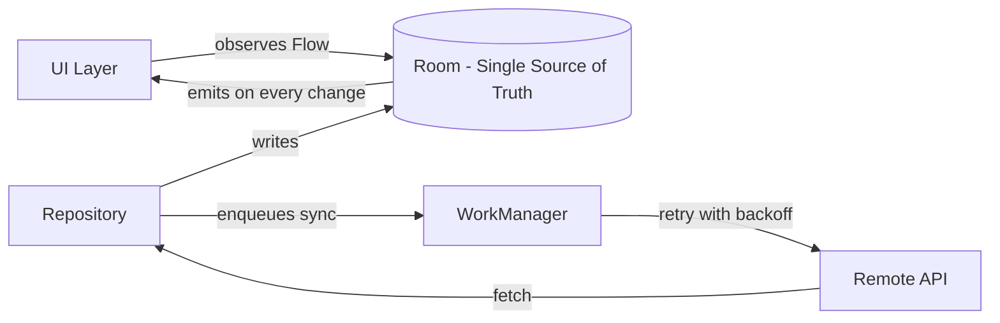

**HTTP cache layer (OkHttp).** Separate from your database cache, and controlled by response headers:

| Header | Effect |
|---|---|
| `Cache-Control: max-age=60` | Served from cache without a network call for 60 s |
| `Cache-Control: no-cache` | Cached, but revalidated with `If-None-Match` every time |
| `ETag` / `If-None-Match` | Server replies `304 Not Modified`, saving the body transfer |
| `Cache-Control: only-if-cached` | Forces a cache read; fails with `504` when absent — the offline path |

### Code Example
```kotlin
// Repository with the database as the single source of truth
class ArticleRepository @Inject constructor(
    private val dao: ArticleDao,
    private val api: ArticleApi,
    private val scope: CoroutineScope
) {
    // The UI observes ONLY this. It emits cached data instantly, then again after the refresh lands.
    fun observeArticles(): Flow<List<Article>> = dao.observeAll().map { it.map(ArticleEntity::toDomain) }

    // Explicit refresh returns a Result so the UI can show an error banner
    // WITHOUT clearing the content already on screen.
    suspend fun refresh(): Result<Unit> = runCatching {
        val remote = api.fetchArticles()
        dao.upsertAll(remote.map { it.toEntity() })     // Emission to the UI happens automatically
    }.onFailure { if (it is CancellationException) throw it }
}

// ViewModel: content and refresh state are independent, which is what makes offline-first feel good
class ArticleListViewModel @Inject constructor(
    private val repo: ArticleRepository
) : ViewModel() {
    private val refreshing = MutableStateFlow(false)
    private val errors = MutableStateFlow<String?>(null)

    val uiState: StateFlow<ArticleUiState> =
        combine(repo.observeArticles(), refreshing, errors) { items, isRefreshing, error ->
            ArticleUiState(items = items, isRefreshing = isRefreshing, error = error)
        }.stateIn(viewModelScope, SharingStarted.WhileSubscribed(5_000), ArticleUiState())

    fun refresh() = viewModelScope.launch {
        refreshing.value = true
        repo.refresh().onFailure { errors.value = it.toUserMessage() }
        refreshing.value = false
    }
}
```

```kotlin
// OkHttp cache + an interceptor that falls back to stale data when offline
val client = OkHttpClient.Builder()
    .cache(Cache(File(context.cacheDir, "http"), 20L * 1024 * 1024))
    .addInterceptor { chain ->
        val request = if (connectivity.isOnline()) chain.request()
        else chain.request().newBuilder()
            // Accept cached responses up to 7 days old rather than failing outright
            .cacheControl(CacheControl.Builder().onlyIfCached().maxStale(7, TimeUnit.DAYS).build())
            .build()
        chain.proceed(request)
    }
    .build()
```

```kotlin
// Outbox pattern: writes made offline are queued and replayed by WorkManager
@Entity
data class PendingAction(
    @PrimaryKey(autoGenerate = true) val id: Long = 0,
    val type: String,
    val payload: String,
    val createdAt: Long = System.currentTimeMillis()
)

class SyncWorker(ctx: Context, params: WorkerParameters) : CoroutineWorker(ctx, params) {
    override suspend fun doWork(): Result {
        val pending = dao.pendingActions()
        pending.forEach { action ->
            when (val outcome = api.execute(action)) {
                is Ok -> dao.delete(action)
                is Retryable -> return Result.retry()      // Backoff, preserve remaining queue order
                is Fatal -> dao.delete(action)             // Drop poison messages, log for triage
            }
        }
        return Result.success()
    }
}
```

### Common Pitfalls
* **Clearing the list while refreshing.** Offline-first means keeping stale content visible and showing the refresh state separately.
* **Two sources of truth.** If the UI reads sometimes from network and sometimes from cache, the screen flickers between versions.
* **Unbounded cache growth.** Add a retention policy — delete rows older than N days on each successful sync.
* **Assuming `isOnline()` means reachable.** Captive portals report connectivity while blocking all traffic. Treat network failure as normal, not exceptional.

---

## 6.7 Error Handling and Result Modelling

### Definition
* **Error modelling** — representing the ways an operation can fail as **data** with a type, instead of as exceptions caught somewhere far from where they were raised.
* **Why it matters** — an exception crossing layers loses its meaning: the UI ends up matching on exception classes and message strings to decide what to show.
* **Sealed result type** — a closed hierarchy of success and failure cases, so the compiler can verify that every case is handled and a newly added failure mode breaks the build.
* **Domain error** — a failure expressed in the app's own vocabulary (`Offline`, `Unauthorized`, `Validation`) rather than in transport terms (`IOException`, HTTP 401).
* **Error boundary** — the single place, usually the repository, where transport failures are translated into domain errors.

### Why It Is Used
An exception thrown at the network layer and caught in the ViewModel loses all type information — you end up matching on exception classes and string messages. A sealed result type makes every failure the compiler's problem and makes the `when` exhaustive.

### How It Works Internally
A sealed hierarchy gives the compiler a closed set of subtypes, so an unhandled case is a compile error. Combined with `data class`, error payloads can carry structured context (retry-after, field validation errors) that an exception message cannot.

### Code Example
```kotlin
// Domain-level result: the UI never sees an IOException or an HTTP code
sealed interface DataResult<out T> {
    data class Success<T>(val data: T) : DataResult<T>
    data class Failure(val error: AppError) : DataResult<Nothing>
}

sealed interface AppError {
    data object Offline : AppError
    data object Unauthorized : AppError
    data class Server(val code: Int) : AppError
    data class Validation(val fieldErrors: Map<String, String>) : AppError
    data class Unknown(val cause: Throwable) : AppError
}

// One place translates transport failures into domain errors
suspend fun <T> safeApiCall(block: suspend () -> T): DataResult<T> = try {
    DataResult.Success(block())
} catch (e: CancellationException) {
    throw e                                            // NEVER swallow cancellation
} catch (e: HttpException) {
    DataResult.Failure(
        when (e.code()) {
            401, 403 -> AppError.Unauthorized
            422 -> AppError.Validation(e.parseFieldErrors())
            else -> AppError.Server(e.code())
        }
    )
} catch (e: IOException) {
    DataResult.Failure(AppError.Offline)               // Includes timeouts and DNS failures
} catch (e: Throwable) {
    DataResult.Failure(AppError.Unknown(e))
}

// The UI maps errors to messages and actions — exhaustive, so a new error type breaks the build
fun AppError.toUiMessage(res: Resources): UiMessage = when (this) {
    AppError.Offline -> UiMessage(res.getString(R.string.err_offline), action = UiAction.Retry)
    AppError.Unauthorized -> UiMessage(res.getString(R.string.err_session), action = UiAction.SignIn)
    is AppError.Server -> UiMessage(res.getString(R.string.err_server, code), action = UiAction.Retry)
    is AppError.Validation -> UiMessage(fieldErrors.values.first(), action = UiAction.None)
    is AppError.Unknown -> UiMessage(res.getString(R.string.err_generic), action = UiAction.Retry)
}
```

### Common Pitfalls
* **Catching `Throwable` without rethrowing `CancellationException`.** This silently breaks structured concurrency.
* **Exposing `Throwable` to the UI layer.** The UI then formats raw exception messages, which leak internals to users.
* **Using Kotlin's built-in `Result<T>` across module boundaries.** It is a value class with restrictions on being returned from suspending functions in some positions, and it carries no domain typing. A custom sealed type is clearer.
* **One generic "Something went wrong".** Users cannot distinguish "you are offline" from "your session expired", and neither can your support team.

---
# 7. Background Execution & Pagination

## 7.1 WorkManager Internals

### Definition
* **Deferrable work** — work that must eventually happen but does not have to happen *now*: syncing, uploading, cleanup, log shipping.
* **Guaranteed execution** — WorkManager's core promise: the request is **persisted to disk**, so it survives process death, app restarts, and device reboots. "Guaranteed" means it will eventually run, not that it runs on time.
* **`Worker` / `CoroutineWorker`** — the class holding the work. `doWork()` returns `success`, `failure`, or `retry`.
* **Constraint** — a condition that must hold before execution (network type, charging, battery not low), which lets the OS batch work from many apps into shared wake-ups.
* **Backoff policy** — how long to wait before retrying after `Result.retry()`, linear or exponential.
* **Idempotency** — the property every worker needs, because WorkManager can re-run one after a process kill.

### How It Works Internally
WorkManager chooses the most efficient scheduling mechanism depending on the OS version and system states.

```mermaid
graph TD
    Request[WorkRequest Enqueued] --> CheckOS{Device API Level?}
    CheckOS -->|API >= 23| JobScheduler[JobScheduler API]
    CheckOS -->|API < 23| AlarmManager[AlarmManager + BroadcastReceiver]
    CheckOS -->|Constraint Check| Execution[Task Execution]
```

* Under the hood, it stores task metadata in a Room database file to ensure tasks survive device restarts.
* It uses **JobScheduler** on API 23+, and falls back to a custom configuration of **AlarmManager** + **BroadcastReceiver** on older devices.
* It monitors system constraints (battery charging, active Wi-Fi, storage availability) and schedules execution windows when all conditions are satisfied.

```kotlin
// Example Coroutine Worker
class CacheSyncWorker(
    context: Context,
    params: WorkerParameters
) : CoroutineWorker(context, params) {

    override suspend fun doWork(): Result {
        return try {
            // Perform background sync operation
            syncCacheData()
            Result.success()
        } catch (e: Exception) {
            if (runAttemptCount < 3) {
                Result.retry() // Reschedule work based on backoff policy
            } else {
                Result.failure()
            }
        }
    }
}
```

---

## 7.2 Paging 3 Architecture

### Definition
* **Paging** — loading a long list in **pages** as the user scrolls, rather than fetching every row up front. It bounds both memory use and network transfer.
* **`PagingSource`** — loads one page from a single source and returns the keys for the next and previous pages.
* **`RemoteMediator`** — coordinates network and database so pages fetched remotely are written locally, which is what makes a paged list work offline.
* **`Pager`** — the configuration object (`pageSize`, `prefetchDistance`) that produces a `Flow<PagingData<T>>`.
* **`PagingDataAdapter` / `collectAsLazyPagingItems`** — the UI-side consumer, which also exposes `loadState` so you can render loading and error rows.

The Paging 3 library helps load data in blocks as the user scrolls, optimizing memory and network bandwidth.

```mermaid
graph LR
    PagingSource[1. PagingSource] --> Pager[2. Pager Config]
    Pager --> PagingData[3. Flow / PagingData]
    PagingData --> Adapter[4. PagingDataAdapter]
    Adapter --> RecyclerView[5. RecyclerView UI]
```

1. **PagingSource:** Fetches incremental pages of data from a raw source (like a REST API or SQLite).
2. **RemoteMediator:** Coordinates loading data from the network into the database cache for offline usage.
3. **Pager:** Configures the paging parameters (like `pageSize`, `prefetchDistance`) and generates the `Flow<PagingData<Value>>`.
4. **PagingDataAdapter:** Integrates with the RecyclerView, displaying data elements and handling loading state callbacks automatically.

---

## 7.3 Choosing a Scheduler: WorkManager vs. AlarmManager vs. Foreground Service

### Definition
* **Scheduler choice as a correctness decision** — these APIs are not stylistic alternatives. Each survives a different set of OS restrictions, so picking the wrong one means the work is silently dropped.
* **WorkManager** — persisted, constraint-aware, retried, deferrable. The default for anything the user is not watching happen.
* **Foreground service** — runs continuously with a visible notification, for work the user is actively aware of right now.
* **`AlarmManager` exact alarm** — fires at a specific wall-clock time, and is the only option when the user chose that time. Gated behind a permission since Android 12.
* **The deciding question** — would the user notice this *not happening right now* (foreground service), *not happening at a specific time* (exact alarm), or neither (WorkManager)?

### Why It Is Used
Since Android 6 (Doze) the platform has aggressively suppressed background execution to protect battery. Each API survives a different set of restrictions, so the choice is a correctness decision, not a style preference.

### How It Works Internally

| API | Guaranteed? | Survives Reboot | Exact Timing | Correct Use Case |
|---|---|---|---|---|
| **WorkManager** | Yes — persisted in its own Room DB | Yes | No (deferrable) | Sync, upload, periodic cleanup, log shipping |
| **Foreground Service** | Yes, while it runs | No | Immediate & continuous | Music playback, navigation, active workout tracking |
| **AlarmManager (`setExactAndAllowWhileIdle`)** | Yes, but rate-limited | Needs `BOOT_COMPLETED` receiver | Yes | Alarm clock, medication reminder, calendar event |
| **`Coroutine` in `viewModelScope`** | No | No | Immediate | Work tied to a visible screen only |
| **`JobScheduler`** | Yes | Yes | No | Legacy — WorkManager wraps it |

**Decision rule:** if the user would notice the work not happening *right now*, it needs a foreground service. If the user would notice it not happening *at a specific wall-clock time*, it needs an exact alarm. Everything else is WorkManager.

**Exact alarms are now a permission.** On Android 12+ `SCHEDULE_EXACT_ALARM` is required, and on Android 13+ it is no longer auto-granted for most apps. Play restricts the `USE_EXACT_ALARM` permission to alarm clocks and calendar apps.

### Code Example
```kotlin
// WorkManager: constrained, unique, with exponential backoff
val syncRequest = PeriodicWorkRequestBuilder<SyncWorker>(6, TimeUnit.HOURS)
    .setConstraints(
        Constraints.Builder()
            .setRequiredNetworkType(NetworkType.UNMETERED)   // Wi-Fi only
            .setRequiresBatteryNotLow(true)
            .build()
    )
    .setBackoffCriteria(BackoffPolicy.EXPONENTIAL, 30, TimeUnit.SECONDS)
    .addTag("periodic-sync")
    .build()

WorkManager.getInstance(context).enqueueUniquePeriodicWork(
    "periodic-sync",
    // KEEP preserves the existing schedule across app restarts; UPDATE would reset the interval
    ExistingPeriodicWorkPolicy.KEEP,
    syncRequest
)

// Chained work: each stage runs only if the previous succeeded, and output flows forward
WorkManager.getInstance(context)
    .beginUniqueWork("upload-flow", ExistingWorkPolicy.REPLACE, compressRequest)
    .then(uploadRequest)
    .then(cleanupRequest)
    .enqueue()

// Expedited work: for user-initiated work that must start immediately.
// setExpedited is a REQUEST, not a guarantee — the OS grants a limited daily quota.
val urgent = OneTimeWorkRequestBuilder<SendMessageWorker>()
    .setExpedited(OutOfQuotaPolicy.RUN_AS_NON_EXPEDITED_WORK_REQUEST)
    .setInputData(workDataOf("message_id" to id))
    .build()
```

```kotlin
// Exact alarm, correct for Android 12+
fun scheduleReminder(context: Context, triggerAtMillis: Long, reminderId: Int) {
    val alarmManager = context.getSystemService(AlarmManager::class.java)

    // On API 31+ the user can revoke this at any time; check before every schedule
    if (Build.VERSION.SDK_INT >= Build.VERSION_CODES.S && !alarmManager.canScheduleExactAlarms()) {
        context.startActivity(Intent(Settings.ACTION_REQUEST_SCHEDULE_EXACT_ALARM))
        return
    }

    val pending = PendingIntent.getBroadcast(
        context, reminderId,
        Intent(context, ReminderReceiver::class.java).putExtra("id", reminderId),
        PendingIntent.FLAG_UPDATE_CURRENT or PendingIntent.FLAG_IMMUTABLE
    )

    // ...AllowWhileIdle is what makes it fire during Doze
    alarmManager.setExactAndAllowWhileIdle(AlarmManager.RTC_WAKEUP, triggerAtMillis, pending)
}
```

```xml
<!-- Alarms do not survive reboot on their own; re-register them -->
<uses-permission android:name="android.permission.RECEIVE_BOOT_COMPLETED" />
<receiver android:name=".BootReceiver" android:exported="false">
    <intent-filter>
        <action android:name="android.intent.action.BOOT_COMPLETED" />
    </intent-filter>
</receiver>
```

### Common Pitfalls
* **Using `AlarmManager` for periodic sync.** It wakes the device unnecessarily and drains battery; WorkManager batches work across apps.
* **Assuming `PeriodicWorkRequest` intervals are precise.** The minimum interval is 15 minutes and the OS may delay execution substantially. Never build a clock on it.
* **Not making work idempotent.** WorkManager can re-run a worker after a process kill. Running it twice must be harmless.
* **Passing large data through `Data`.** The `Data` object is capped at ~10 KB. Pass an ID and read from the database.
* **Forgetting `BOOT_COMPLETED`.** All exact alarms are cleared on reboot.

---

## 7.4 Doze, App Standby Buckets, and Battery Restrictions

### Definition
* **Doze:** When a device is stationary, unplugged, and screen-off for a while, the system enters maintenance windows and suspends network access, alarms, jobs, and wakelocks for all apps between them.
* **App Standby Buckets:** A per-app classification (API 28+) based on usage recency and frequency that determines how much background work the app is allowed.

### Why It Is Used
"It works on my phone but not on the user's" is almost always a Doze or bucket issue. Understanding the buckets explains why background work degrades over time for infrequently-opened apps.

### How It Works Internally

| Bucket | Assigned When | Job Quota | Alarm Quota |
|---|---|---|---|
| **Active** | App is in use right now | Unlimited | Unlimited |
| **Working set** | Used regularly | ~Every 2 hours | ~Every 2 hours |
| **Frequent** | Used often but not daily | ~Every 8 hours | ~Every 8 hours |
| **Rare** | Used infrequently | ~Every 24 hours | ~Every 24 hours |
| **Restricted** (API 30+) | Heavy background use, or user-set | ~Once per day | ~Once per day |

**Doze restrictions between maintenance windows:** no network access, deferred `AlarmManager` alarms (except `...AllowWhileIdle`), suspended jobs and syncs, ignored wakelocks, no Wi-Fi scans. High-priority FCM messages are the sanctioned way to break through.

**App Standby Buckets are per-device and adaptive** — you cannot set your own bucket, and users who rarely open your app will see background work throttled to near-nothing. Design for that rather than fighting it.

### Code Example
```bash
# Reproduce Doze and bucket behavior on a real device — this is the only reliable way to test it
adb shell dumpsys battery unplug
adb shell dumpsys deviceidle force-idle          # Force full Doze immediately
adb shell dumpsys deviceidle step                # Advance one Doze stage at a time
adb shell dumpsys deviceidle unforce             # Back to normal
adb shell dumpsys battery reset

# Inspect and force App Standby buckets
adb shell am get-standby-bucket com.example.app
adb shell am set-standby-bucket com.example.app rare
adb shell dumpsys usagestats | grep com.example.app
```

```kotlin
// Detect whether the user has excluded the app from battery optimization.
// Requesting this exemption is heavily restricted by Play policy — only ask when
// the core feature (alarm clock, sleep tracking) genuinely cannot work without it.
fun isIgnoringBatteryOptimizations(context: Context): Boolean {
    val pm = context.getSystemService(PowerManager::class.java)
    return pm.isIgnoringBatteryOptimizations(context.packageName)
}

// Also surface the case where the user has put the app in the Restricted bucket,
// which silently kills nearly all background work.
fun isBackgroundRestricted(context: Context): Boolean {
    val am = context.getSystemService(ActivityManager::class.java)
    return Build.VERSION.SDK_INT >= Build.VERSION_CODES.P && am.isBackgroundRestricted
}
```

### Common Pitfalls
* **Requesting `REQUEST_IGNORE_BATTERY_OPTIMIZATIONS` casually.** Play rejects apps that ask without an approved use case.
* **Testing only with the screen on and the device plugged in.** Doze never triggers, so the bug never appears in QA.
* **Vendor-specific killers.** Xiaomi, Huawei, Oppo, and others add their own aggressive process killing beyond AOSP. Test on those devices; direct users to the OEM's autostart settings when a feature genuinely requires it.

---

## 7.5 Firebase Cloud Messaging (FCM)

### Definition
* **Push messaging** — the server initiating contact with the app, rather than the app polling. It is the only way to reach an app that is not currently running.
* **Registration token** — the per-installation address FCM delivers to. It **rotates** (on reinstall, restore, clear-data, and periodically), so it must be re-uploaded whenever it changes.
* **Notification message** — a payload with a `notification` block. When the app is **backgrounded the system tray displays it and your code never runs**.
* **Data message** — a payload with only a `data` block. It reaches `onMessageReceived` in **every** app state, which is why it is preferred whenever any logic is needed.
* **Priority** — `normal` messages may be batched and delayed in Doze; `high` wakes the device immediately, subject to a per-app budget.
* **At-least-once delivery** — the same message can arrive twice, so handling must be deduplicated on a server-supplied ID.

### Why It Is Used
It is the only way to wake an app that is not running, and the only sanctioned way to bypass Doze for time-critical delivery. One system-level connection serves all apps, so battery cost is shared.

### How It Works Internally

```mermaid
sequenceDiagram
    participant App as Your App
    participant FCM as FCM Backend
    participant Server as Your Server
    participant GPS as Play Services (device)

    App->>FCM: Request registration token
    FCM-->>App: token
    App->>Server: Upload token (associate with user)
    Server->>FCM: Send message (token or topic)
    FCM->>GPS: Deliver over the shared persistent socket
    GPS->>App: onMessageReceived / system tray notification
```

**Two message types, and the distinction matters enormously:**

| | Notification message | Data message |
|---|---|---|
| Payload key | `notification` | `data` |
| App in **foreground** | `onMessageReceived` called | `onMessageReceived` called |
| App in **background** | **Shown by the system tray; your code never runs** | `onMessageReceived` called |
| Customizable | Limited | Fully |
| Recommendation | Avoid for anything that needs logic | **Use this** |

**Priority.** `normal` priority is batched and may be delayed indefinitely in Doze. `high` priority wakes the device and breaks through Doze — but Android tracks a per-app budget, and abusing high priority for non-urgent messages gets the app throttled.

### Code Example
```kotlin
class AppMessagingService : FirebaseMessagingService() {

    // Called on install, app restore, app clear-data, and periodic token rotation.
    // The token is NOT stable — always re-upload it.
    override fun onNewToken(token: String) {
        // Enqueue rather than calling the network directly; this can run with no connectivity
        WorkManager.getInstance(this).enqueue(
            OneTimeWorkRequestBuilder<TokenUploadWorker>()
                .setInputData(workDataOf("token" to token))
                .setConstraints(Constraints.Builder()
                    .setRequiredNetworkType(NetworkType.CONNECTED).build())
                .build()
        )
    }

    override fun onMessageReceived(message: RemoteMessage) {
        // Data messages reach here in ALL app states, which is why they are preferred
        val type = message.data["type"] ?: return

        // onMessageReceived runs on a background thread with roughly 10-20 seconds of budget.
        // Anything longer must be handed to WorkManager.
        when (type) {
            "chat" -> {
                val conversationId = message.data["conversation_id"]!!
                Notifier.showChatMessage(this, conversationId, message.data["body"].orEmpty())
            }
            "sync" -> WorkManager.getInstance(this)
                .enqueue(OneTimeWorkRequestBuilder<SyncWorker>().build())
        }
    }
}
```

```json
// Server payload: data-only, high priority, with the Android-specific block
{
  "message": {
    "token": "<device-token>",
    "data": { "type": "chat", "conversation_id": "1234", "body": "See you at 6" },
    "android": {
      "priority": "high",
      "ttl": "3600s"
    }
  }
}
```

```xml
<service android:name=".AppMessagingService" android:exported="false">
    <intent-filter>
        <action android:name="com.google.firebase.MESSAGING_EVENT" />
    </intent-filter>
</service>
```

### Common Pitfalls
* **Sending `notification` payloads and wondering why the tap handler never runs** when the app is backgrounded. The system tray handles it; your service is skipped.
* **Treating the token as permanent.** It rotates. Re-upload on every `onNewToken` and on every app start.
* **Doing long work in `onMessageReceived`.** The execution window is short; hand off to WorkManager.
* **Not deduplicating.** FCM guarantees at-least-once delivery, so the same message can arrive twice. Key notifications by a server-supplied message ID.
* **Forgetting `POST_NOTIFICATIONS` on Android 13+.** Messages arrive and are silently discarded.

---
# 8. Dependency Injection (DI)

## 8.1 Dagger 2 vs. Hilt vs. Koin

### Definition
* **Dependency injection (DI)** — supplying an object's collaborators from outside rather than letting it construct them, so implementations can be swapped and tests can substitute fakes.
* **DI container** — the machinery that knows how to build each type and wires the graph for you.
* **Dagger 2** — resolves the graph at **compile time** through annotation processing, so a missing binding is a build error. Powerful, but you define every component by hand.
* **Hilt** — Dagger with a **predefined set of components** matched to Android lifecycles, removing most of the boilerplate. Android-only.
* **Koin** — a pure-Kotlin container that resolves at **runtime** via a DSL. No code generation and no build cost, but a missing binding surfaces on first use rather than at compile time.

### Comparison Table

| Feature | Dagger 2 | Hilt | Koin |
|---|---|---|---|
| **Compilation vs. Runtime** | Compile-time validation | Compile-time validation | Runtime validation |
| **Reflection / Codegen** | Annotation processing (no reflection) | Annotation processing + Bytecode manipulation | Pure Kotlin DSL (no reflection/codegen) |
| **Boilerplate Code** | High (must define components & graphs) | Low (Google pre-defines standard components) | Extremely Low |
| **Android Integration** | Manual setup required | Direct annotations (`@AndroidEntryPoint`) | Simple extension functions (`by inject()`) |
| **Performance Impact** | Nil at runtime, increases build times | Nil at runtime, increases build times | Small runtime lookup overhead |

---

## 8.2 Hilt Implementation Reference

### Definition
* **`@HiltAndroidApp`** — placed on the `Application` class; it generates the root component and triggers all of Hilt's code generation.
* **`@AndroidEntryPoint`** — placed on an Activity, Fragment, Service, or View so Hilt can inject into it at the correct lifecycle moment.
* **`@Module` + `@InstallIn`** — a module supplies bindings Hilt cannot infer; `@InstallIn` names the component (and therefore the **lifetime**) those bindings belong to.
* **`@Provides` vs `@Binds`** — `@Provides` is a function that constructs the object; `@Binds` simply declares that an interface is satisfied by an implementation, generating no factory body.
* **`@HiltViewModel`** — lets Hilt construct a ViewModel, so `by viewModels()` resolves its dependencies automatically.

Hilt is a wrapper built around Dagger 2, standardizing dependency injection in Android apps.

```kotlin
// 1. Application setup
@HiltAndroidApp
class BaseApplication : Application()

// 2. Network Module
@Module
@InstallIn(SingletonComponent::class)
object NetworkModule {

    @Provides
    @Singleton
    fun provideOkHttpClient(): OkHttpClient {
        return OkHttpClient.Builder().build()
    }

    @Provides
    @Singleton
    fun provideRetrofit(okHttpClient: OkHttpClient): Retrofit {
        return Retrofit.Builder()
            .baseUrl("https://api.example.com/")
            .client(okHttpClient)
            .build()
    }
}

// 3. Injecting ViewModel
@HiltViewModel
class MainViewModel @Inject constructor(
    private val repository: UserRepository
) : ViewModel()

// 4. Injecting Activity
@AndroidEntryPoint
class MainActivity : AppCompatActivity() {
    private val viewModel: MainViewModel by viewModels()
}
```

---

## 8.3 Hilt Components, Scopes, and Bindings

### Definition
* **Component** — a container that holds bindings and has a **lifetime** matched to an Android lifecycle. Hilt predefines the whole hierarchy so you never declare one.
* **Component hierarchy** — components form a parent/child tree. A child can use anything its ancestors provide; the reverse is impossible, which is exactly the compile error you get when a `@Singleton` binding depends on an Activity.
* **Scope annotation** (`@Singleton`, `@ActivityRetainedScoped`, `@ViewModelScoped`) — declares that **one instance** is shared for that component's lifetime.
* **Unscoped** — the default: a new instance at every injection point. Correct for most bindings, because it costs nothing and has no lifetime implications.
* **Binding** — an entry telling Hilt how to obtain a type, declared with `@Provides`, `@Binds`, or an `@Inject` constructor.
* **Qualifier** — an annotation distinguishing two bindings of the **same type**, such as an authenticated and an anonymous HTTP client.

### Why It Is Used
Manual Dagger required you to define every component, its parent, and its lifecycle by hand. Hilt's fixed hierarchy removes that boilerplate and makes scope errors detectable at compile time.

### How It Works Internally
Components form a parent-child tree. A child can inject anything its ancestors provide; the reverse is impossible — that is exactly the compile error Hilt gives when a `SingletonComponent` binding depends on an `Activity`.

| Component | Scope Annotation | Created At | Destroyed At |
|---|---|---|---|
| `SingletonComponent` | `@Singleton` | `Application.onCreate` | Process death |
| `ActivityRetainedComponent` | `@ActivityRetainedScoped` | `Activity.onCreate` | `onDestroy` (**survives config change**) |
| `ViewModelComponent` | `@ViewModelScoped` | ViewModel created | `onCleared` |
| `ActivityComponent` | `@ActivityScoped` | `onCreate` | `onDestroy` (recreated on rotation) |
| `FragmentComponent` | `@FragmentScoped` | `onAttach` | `onDestroy` |
| `ViewComponent` | `@ViewScoped` | `View` constructed | View destroyed |
| `ServiceComponent` | `@ServiceScoped` | `Service.onCreate` | `onDestroy` |

**Unscoped is the default and usually correct.** An unscoped binding creates a new instance at every injection point. Scope it only when the instance is expensive (an `OkHttpClient`, a database) or must be shared (an in-memory cache).

### Code Example
```kotlin
// @Binds is more efficient than @Provides for interface-to-implementation:
// it generates no factory method body, just a graph edge.
@Module
@InstallIn(SingletonComponent::class)
abstract class RepositoryModule {

    @Binds
    @Singleton
    abstract fun bindUserRepository(impl: UserRepositoryImpl): UserRepository
}

// Qualifiers disambiguate two bindings of the same type
@Retention(AnnotationRetention.BINARY) @Qualifier annotation class AuthedClient
@Retention(AnnotationRetention.BINARY) @Qualifier annotation class PublicClient

@Module
@InstallIn(SingletonComponent::class)
object NetworkModule {

    @Provides @Singleton @AuthedClient
    fun authedClient(interceptor: AuthInterceptor): OkHttpClient =
        OkHttpClient.Builder().addInterceptor(interceptor).build()

    @Provides @Singleton @PublicClient
    fun publicClient(): OkHttpClient = OkHttpClient.Builder().build()

    // Injecting the application Context requires the built-in qualifier
    @Provides @Singleton
    fun database(@ApplicationContext context: Context): AppDatabase =
        Room.databaseBuilder(context, AppDatabase::class.java, "app.db").build()

    // DAOs come from the database, so they are trivial @Provides functions
    @Provides fun userDao(db: AppDatabase): UserDao = db.userDao()

    // Injecting a CoroutineScope for app-lifetime work, instead of GlobalScope
    @Provides @Singleton
    fun appScope(): CoroutineScope = CoroutineScope(SupervisorJob() + Dispatchers.Default)
}

// Dispatchers should be injected so tests can substitute a TestDispatcher
@Qualifier annotation class IoDispatcher
@Module @InstallIn(SingletonComponent::class)
object DispatcherModule {
    @Provides @IoDispatcher fun io(): CoroutineDispatcher = Dispatchers.IO
}
```

```kotlin
// Assisted injection: some constructor params come from the graph, one comes from the caller
class ProductDetailViewModel @AssistedInject constructor(
    private val repo: ProductRepository,          // From the graph
    @Assisted private val productId: Long         // From the caller at runtime
) : ViewModel() {

    @AssistedFactory
    interface Factory {
        fun create(productId: Long): ProductDetailViewModel
    }
}

// Note: with Navigation + SavedStateHandle, prefer reading the ID from SavedStateHandle.
// Assisted injection is for values that genuinely cannot come from navigation arguments.
```

```kotlin
// Multibinding: contribute to a Set without any single module knowing all contributors.
// This is how a plugin-style initializer list is built.
@Module @InstallIn(SingletonComponent::class)
abstract class InitializerModule {
    @Binds @IntoSet abstract fun crashlytics(i: CrashlyticsInitializer): AppInitializer
    @Binds @IntoSet abstract fun analytics(i: AnalyticsInitializer): AppInitializer
}

@HiltAndroidApp
class App : Application() {
    @Inject lateinit var initializers: Set<@JvmSuppressWildcards AppInitializer>
    override fun onCreate() {
        super.onCreate()
        initializers.forEach { it.initialize(this) }
    }
}
```

### Common Pitfalls
* **Scoping everything `@Singleton`.** Objects then live for the whole process; anything holding an `Activity` context becomes a permanent leak.
* **Injecting `@ActivityContext` into a `@Singleton`.** Hilt catches most of these at compile time, but a manually-passed context slips through and leaks the Activity.
* **`@ActivityScoped` for state that must survive rotation.** Use `@ActivityRetainedScoped`, or better, a ViewModel.
* **`field injection` into a class Hilt does not know about.** Only `@AndroidEntryPoint` classes support it; for others use constructor injection or an `EntryPoint`.
* **Forgetting `@JvmSuppressWildcards` on injected generic collections.** Kotlin generates `Set<? extends T>` and Dagger cannot match it.

---

## 8.4 Koin: Runtime DI in Kotlin

### Definition
* **Runtime DI container** — a container that resolves dependencies by **looking them up while the app runs**, rather than generating a wired graph at compile time.
* **Module** — a Kotlin DSL block declaring how to build each type.
* **`single` vs `factory`** — `single` registers one shared instance for the container's lifetime; `factory` builds a new one on every resolution.
* **The trade-off** — no annotation processing means no build-time cost and full Kotlin Multiplatform support, but a missing binding is discovered **at first use** instead of at compile time.
* **`checkModules()`** — the test helper that moves that failure into CI, which is what makes Koin safe to use at scale.

### Why It Is Used
Zero build-time cost, trivial setup, and full Kotlin Multiplatform support — which is why KMP projects overwhelmingly use Koin rather than Hilt (Hilt is Android-only).

### How It Works Internally
Koin registers factory lambdas in a map keyed by type plus optional qualifier. Resolution is a runtime map lookup, so a missing binding surfaces as a `NoBeanDefFoundException` **at first use**, not at compile time. Koin's `verify()` and `checkModules()` test helpers exist specifically to move that failure into the test suite.

| | Hilt | Koin |
|---|---|---|
| Validation | Compile time | Runtime (test-time with `verify()`) |
| Build-time cost | KSP/kapt round | None |
| Runtime cost | None | Small map lookup per resolution |
| Multiplatform | Android only | Yes |
| Learning curve | Steeper (Dagger concepts) | Shallow |

### Code Example
```kotlin
val networkModule = module {
    single { OkHttpClient.Builder().addInterceptor(get<AuthInterceptor>()).build() }
    single {
        Retrofit.Builder()
            .baseUrl(BuildConfig.BASE_URL)
            .client(get())
            .addConverterFactory(Json.asConverterFactory("application/json".toMediaType()))
            .build()
    }
    single { get<Retrofit>().create(UserApi::class.java) }
}

val dataModule = module {
    single { Room.databaseBuilder(androidContext(), AppDatabase::class.java, "app.db").build() }
    single { get<AppDatabase>().userDao() }
    // `single` = one shared instance; `factory` = new instance every resolution
    single<UserRepository> { UserRepositoryImpl(api = get(), dao = get()) }
}

val viewModelModule = module {
    viewModelOf(::UserListViewModel)               // Constructor reference, no manual get() calls
    viewModel { (userId: Long) -> UserDetailViewModel(get(), userId) }   // Parameterized
}

class App : Application() {
    override fun onCreate() {
        super.onCreate()
        startKoin {
            androidContext(this@App)
            androidLogger(if (BuildConfig.DEBUG) Level.ERROR else Level.NONE)
            modules(networkModule, dataModule, viewModelModule)
        }
    }
}

// Consumption
class UserListFragment : Fragment() {
    private val viewModel: UserListViewModel by viewModel()
    private val analytics: Analytics by inject()
}
```

```kotlin
// Move Koin's runtime failures into CI — this is what makes Koin safe to use at scale
class KoinModuleTest : KoinTest {
    @Test
    fun `all dependencies resolve`() {
        koinApplication {
            androidContext(ApplicationProvider.getApplicationContext())
            modules(networkModule, dataModule, viewModelModule)
        }.checkModules()
    }
}
```

### Common Pitfalls
* **No `checkModules()` test.** Without it, a missing binding is discovered by a user, in production, on the screen that uses it.
* **`single` where `factory` is meant.** A `single` holding per-screen state is shared across screens and leaks it.
* **Capturing an Activity context in a `single`.** Same leak as an over-scoped Hilt `@Singleton`.
* **Large graphs.** Runtime resolution cost is small per lookup but not zero; deeply nested graphs resolved in a scroll callback are measurable.

---
# 9. Performance, Security, and Diagnostics

## 9.1 Memory Leaks & Garbage Collection (ART)

### Definition
* **Garbage collection** — automatic reclamation of objects the program can no longer reach.
* **Reachability** — an object is kept alive if a chain of strong references leads to it from a **GC root** (a static field, a live thread's stack, a JNI reference).
* **Memory leak** — an object that is no longer *needed* but is still *reachable*, so the collector cannot reclaim it. On Android the object is usually an Activity, which drags its whole view hierarchy with it.
* **Reference strength** — *strong* prevents collection; *weak* does not; *soft* is cleared under memory pressure.
* **Retained size** — the memory that would actually be freed if an object were collected. This, not shallow size, is what identifies the real culprit in a heap dump.

### Low Memory Killer Daemon (LMKD)
When system memory is depleted, the kernel's `lmkd` daemon terminates cached processes to allocate resources to foreground applications.
* **`oom_score_adj`:** Each running process is assigned a score ranging from **-1000** (system process, never kill) to **1000** (cached background app, kill first).
* **Process Priority States:**
  1. **Foreground Process (oom_score_adj: 0):** Currently visible activity, executing foreground service, or active broadcast receiver.
  2. **Visible Process (oom_score_adj: 100-200):** Visible but not interactive (e.g., activity covered by a dialog).
  3. **Service Process (oom_score_adj: 500):** Service running in background (e.g., media playback or sync).
  4. **Cached/Empty Process (oom_score_adj: 900-1000):** App hosted in background backstack. Reclaimed immediately under memory pressure.

### ART Garbage Collection (GC) Internals
Modern Android Runtime (ART) uses a **Concurrent Copying (CC) GC** collector to reclaim memory.
1. **Concurrent Collection:** ART performs the GC pass concurrently with app execution using a **read barrier** mechanism. When the app thread reads an object pointer, the read barrier intercepts it and redirects it if the object is being relocated.
2. **Generational Collection:** Divides the heap into young and old generations. Young objects (new allocations) are garbage collected frequently (minor GC) using copying mechanisms. Surviving objects are promoted to the old generation.
3. **Heap Compaction:** Rather than leaving free memory fragmented, ART moves active objects to a contiguous memory region, eliminating memory fragmentation and reducing the likelihood of `OutOfMemoryError` (OOM) due to allocation mismatches.

### Common Memory Leak Scenarios
1. **Holding Context References:** Storing a static reference to an `Activity` or passing an Activity `Context` to a long-lived Singleton instance.
2. **Unregistered Listeners:** Forgetting to unregister BroadcastReceivers, location update listeners, or RxJava subscriptions in lifecycle teardown methods.
3. **Anonymous Inner Classes / Handlers:** Non-static inner classes hold an implicit reference to their outer class. A background task running inside an inner class can leak the entire activity.

```kotlin
// Memory Leak Example
class LeakyActivity : AppCompatActivity() {
    companion object {
        // Leaks the Activity context globally because static fields live as long as the App process
        lateinit var leakyContext: Context 
    }

    override fun onCreate(savedInstanceState: Bundle?) {
        super.onCreate(savedInstanceState)
        leakyContext = this
    }
}
```

### Diagnostics (LeakCanary)
`LeakCanary` runs inside your debug application, listening to activity and fragment lifecycle destructions. It keeps weak references to these instances. If they are not collected after 5 seconds, it forces a GC pass, dumps the heap (`.hprof` file), and parses it to trace the shortest path of strong references holding the object (the leak trace).

---

## 9.2 Application Not Responding (ANR)

### Definition
* **ANR** — the dialog the system shows when an app fails to respond in time, and the metric Play tracks against a quality threshold.
* **What actually triggers it** — not a busy main thread in general, but a **specific event going unprocessed** within its deadline: an input event, a broadcast, a service start, or a provider call.
* **Main thread** — the single thread that processes input and runs the UI. Anything slow on it delays every subsequent event.
* **The usual cause** — blocking the main thread with disk I/O, a network call, or waiting on a lock another thread holds while doing I/O.
* **The trace** — a snapshot of every thread at the moment of the ANR. The main thread shows *where it stopped*; the cause is frequently in whichever thread holds the resource it is waiting for.

### ANR Thresholds
* **Input dispatching timeout:** A user event (e.g., screen touch) is not processed within **5 seconds**.
* **Broadcast Receiver timeout:** A BroadcastReceiver does not finish executing within **10 seconds** (for foreground receivers).
* **Service execution timeout:** A Service does not complete execution within **20 seconds** (for foreground services).

### Prevention
1. Never perform network operations, heavy computations, or disk read/write calls on the main thread.
2. Use Coroutines with appropriate Dispatchers (`Dispatchers.IO`) for background workloads.
3. Use profiling tools (Traceview, Android Profiler) to monitor layout passes and thread execution.

---

## 9.3 Security Best Practices

### Definition
* **Defense in depth** — the principle behind this list: no single client-side control is sufficient, because the attacker ultimately controls the device. Each measure raises cost and narrows the attack surface.
* **Data in transit** — protecting traffic between app and server with TLS, enforced declaratively by a Network Security Config so it applies to every library in the process.
* **Data at rest** — protecting what is stored on device, using keys the app can *use* but never *read*, held in the Android Keystore's secure hardware.
* **Code protection** — making the shipped binary harder to read and modify (R8 shrinking and obfuscation). It buys time; it does not prevent analysis.
* **The boundary that actually holds** — server-side verification. Anything decided on the device can be patched out by whoever owns the device.

1. **Network Security Config:** Enforce HTTPS connections. Disallow cleartext HTTP traffic unless explicitly configured for testing.
2. **Android Keystore System:** Secure sensitive cryptographic keys by storing them in a dedicated hardware container (TEE/SE), making them extraction-resistant.
3. **EncryptedDataStore:** Encrypt preference values on disk using AES-GCM cryptography.
4. **Code Obfuscation (R8):** Shrink, optimize, and obfuscate your codebase to make reverse engineering difficult.

---

## 9.4 App Startup: Cold, Warm, Hot, and Baseline Profiles

### Definition
* **Cold start:** The process does not exist. Android forks Zygote, creates the `Application`, then the first `Activity`. The slowest and the one users judge you on.
* **Warm start:** The process is alive but the Activity was destroyed. Only the Activity is recreated.
* **Hot start:** Both process and Activity exist; the Activity is simply brought forward.

### Why It Is Used
Play Console Android Vitals flags cold starts over 5 seconds as "bad behavior", which affects store ranking. Startup is also the metric users perceive most directly.

### How It Works Internally

```mermaid
graph LR
    Launch[Launcher tap] --> Fork[Zygote fork: process created]
    Fork --> AppInit[Application.onCreate + ContentProvider init]
    AppInit --> ActCreate[Activity onCreate / setContentView]
    ActCreate --> Measure[First measure + layout + draw]
    Measure --> TTID[TTID: first frame rendered]
    TTID --> Data[Async data load completes]
    Data --> TTFD[TTFD: fully drawn]
```

| Metric | Meaning | Where It Comes From |
|---|---|---|
| **TTID** (Time To Initial Display) | First frame drawn, possibly a skeleton | `adb shell am start -W` `TotalTime` |
| **TTFD** (Time To Full Display) | Screen is meaningfully usable | `Activity.reportFullyDrawn()` |

**Baseline Profiles** are the highest-leverage startup fix. A profile file lists the classes and methods executed on the critical path; AOT-compiling them at install time removes JIT and interpretation from the first run. Typical improvement: **20–40% faster cold start**, plus reduced first-scroll jank — with no code change to the app's logic.

**The `ContentProvider` startup tax.** Many libraries (WorkManager, Firebase, older Coil) auto-initialize by declaring a `ContentProvider`, each of which the system instantiates before `Application.onCreate` returns. The App Startup library merges them into a single provider with declared ordering.

### Code Example
```kotlin
// Generate a Baseline Profile with a Macrobenchmark module
@RunWith(AndroidJUnit4::class)
class BaselineProfileGenerator {
    @get:Rule val rule = BaselineProfileRule()

    @Test
    fun generate() = rule.collect(packageName = "com.example.app") {
        pressHome()
        startActivityAndWait()
        // Exercise the real critical path: startup PLUS the first scroll users perform
        device.findObject(By.res("feed_list")).fling(Direction.DOWN)
        device.waitForIdle()
    }
}

// Measure the improvement objectively — never claim a startup win without this
@RunWith(AndroidJUnit4::class)
class StartupBenchmark {
    @get:Rule val rule = MacrobenchmarkRule()

    @Test
    fun coldStartup() = rule.measureRepeated(
        packageName = "com.example.app",
        metrics = listOf(StartupTimingMetric()),
        iterations = 10,
        startupMode = StartupMode.COLD
    ) {
        pressHome()
        startActivityAndWait()
    }
}
```

```kotlin
// App Startup: replace N auto-init ContentProviders with one, and control ordering
class AnalyticsInitializer : Initializer<AnalyticsClient> {
    override fun create(context: Context): AnalyticsClient =
        AnalyticsClient(context).also { it.start() }

    // Declares that WorkManager must be initialized first
    override fun dependencies(): List<Class<out Initializer<*>>> =
        listOf(WorkManagerInitializer::class.java)
}
```

```xml
<!-- Disable a library's own provider and route it through App Startup instead -->
<provider
    android:name="androidx.startup.InitializationProvider"
    android:authorities="${applicationId}.androidx-startup"
    android:exported="false"
    tools:node="merge">
    <meta-data android:name="com.example.AnalyticsInitializer" android:value="androidx.startup" />
</provider>
```

```kotlin
// Tell the system when the screen is actually usable, so TTFD is measured correctly
class FeedActivity : AppCompatActivity() {
    override fun onCreate(savedInstanceState: Bundle?) {
        super.onCreate(savedInstanceState)
        setContent { FeedScreen(onContentLoaded = { reportFullyDrawn() }) }
    }
}
```

```bash
# Baseline startup measurement, no tooling required
adb shell am force-stop com.example.app
adb shell am start -W -n com.example.app/.MainActivity   # Reports ThisTime / TotalTime / WaitTime
```

### Common Pitfalls
* **Doing work in `Application.onCreate`.** Every millisecond there is on every cold start. Move initialization to lazy, or to a background dispatcher, or behind App Startup.
* **Blocking the first frame on network or database.** Render a skeleton immediately, fill it asynchronously.
* **Benchmarking a debuggable build.** Debug builds disable AOT optimizations and produce numbers 2–5× worse and directionally misleading. Macrobenchmark requires a release-like build.
* **Shipping without a Baseline Profile.** It is nearly free and among the largest single wins available.

---

## 9.5 Profiling Tools: Perfetto, Android Profiler, StrictMode

### Definition
* **Profiling** — measuring where a program actually spends time or memory, as opposed to reasoning about where it probably does.
* **Tracing** — recording timestamped events (a *slice* per method or phase) to build a timeline of what ran, on which thread, and for how long.
* **Sampling vs instrumentation** — sampling periodically records the stack (low overhead, statistical); instrumentation records every call (exact, but it distorts the timings it measures).
* **The rule that makes all of this worthwhile** — measure first. Optimization guided by intuition usually adds complexity without improving the metric that matters.

### Why It Is Used
Optimization without measurement usually makes code more complex and no faster. Each tool answers a distinct question.

### How It Works Internally

| Question | Tool | What It Shows |
|---|---|---|
| Which method blows the frame budget? | **Perfetto / System Trace** | Per-thread timeline with named slices, GC events, binder calls |
| Where is memory going? | **Memory Profiler** heap dump | Retained size per class, GC-root reference chain |
| Is my code leaking? | **LeakCanary** | Automatic leak trace on every destroyed Activity/Fragment |
| Am I doing IO on the main thread? | **StrictMode** | Immediate log/crash at the offending call site |
| Did this change actually help? | **Macrobenchmark** | Statistically stable startup and frame metrics |
| Why is the APK so big? | **APK Analyzer** | Per-file and per-package size breakdown, DEX method counts |
| What is the network doing? | **Network Profiler / OkHttp logging** | Request timeline, payload sizes, connection reuse |

### Code Example
```kotlin
// StrictMode: catches main-thread IO and leaked resources during development.
// This single block finds more real bugs per line than any other 20 lines in an Android app.
class App : Application() {
    override fun onCreate() {
        super.onCreate()
        if (BuildConfig.DEBUG) {
            StrictMode.setThreadPolicy(
                StrictMode.ThreadPolicy.Builder()
                    .detectDiskReads()
                    .detectDiskWrites()
                    .detectNetwork()
                    .detectCustomSlowCalls()
                    .penaltyLog()
                    // penaltyDeath() is the honest setting, but enable it only once the
                    // existing violations are cleared, or the app cannot start.
                    .build()
            )
            StrictMode.setVmPolicy(
                StrictMode.VmPolicy.Builder()
                    .detectLeakedSqlLiteObjects()
                    .detectLeakedClosableObjects()
                    .detectActivityLeaks()
                    .detectFileUriExposure()
                    .penaltyLog()
                    .build()
            )
        }
        super.onCreate()
    }
}

// Custom trace sections make your own code visible in Perfetto alongside framework slices
fun loadFeed() {
    trace("FeedRepository.load") {          // androidx.tracing.trace
        val raw = api.fetchFeed()
        trace("FeedRepository.parse") { parse(raw) }
    }
}
```

```bash
# Capture a Perfetto trace from the command line
adb shell perfetto -o /data/misc/perfetto-traces/trace.pb -t 10s \
    sched freq idle am wm gfx view binder_driver hal dalvik
adb pull /data/misc/perfetto-traces/trace.pb        # Open at ui.perfetto.dev

# Heap dump for offline analysis
adb shell am dumpheap com.example.app /data/local/tmp/heap.hprof
adb pull /data/local/tmp/heap.hprof
```

### Common Pitfalls
* **Enabling `penaltyDeath` on an existing app.** It will crash on startup. Start with `penaltyLog`, fix, then tighten.
* **Profiling a debug build and drawing conclusions.** Debug builds are not representative; use a release build with `debuggable true` temporarily, or Macrobenchmark.
* **Reading "shallow size" instead of "retained size"** in a heap dump. Retained size is what actually gets freed.
* **Leaving `LeakCanary` in the release variant.** Keep it on `debugImplementation` only.

---

## 9.6 App Size Optimization

### Definition
* **Download size vs install size** — what the user downloads from Play versus what the app occupies on device. Play reports both, and after AAB splitting neither equals the size of your local APK.
* **Why it is a product metric** — install conversion drops measurably with each additional megabyte, and more sharply where mobile data is expensive.
* **Code shrinking** — R8 removing classes and methods no execution path can reach.
* **Resource shrinking** — removing drawables and strings no code references. It does nothing unless code shrinking is also enabled.
* **App Bundle splitting** — Play generating a per-device artifact containing only the required ABI, screen density, and language.

### Why It Is Used
Google's own data shows install conversion drops measurably for each additional 6 MB of download size, and more sharply in markets with expensive data.

### How It Works Internally

| Technique | Typical Saving | Cost |
|---|---|---|
| **Ship AAB instead of APK** | 15–35% | None — required by Play anyway |
| **R8 full mode** | 10–25% of DEX | Needs correct keep rules |
| **`shrinkResources true`** | 5–15% | Must pair with `minifyEnabled` |
| **WebP / AVIF instead of PNG** | 25–50% of images | Minor tooling change |
| **Vector drawables for icons** | Large — one asset replaces 5 densities | Not suitable for complex art |
| **Play Feature Delivery** | Defers rarely-used features | Significant architectural work |
| **Removing unused dependencies** | Varies, often large | Audit effort |

### Code Example
```gradle
android {
    buildTypes {
        release {
            isMinifyEnabled = true
            isShrinkResources = true        // No-op unless minifyEnabled is also true
            proguardFiles(
                getDefaultProguardFile("proguard-android-optimize.txt"),
                "proguard-rules.pro"
            )
        }
    }
    // Do not ship every density of every raster asset
    defaultConfig {
        resourceConfigurations += listOf("en", "es", "hi")   // Only the locales you actually translate
    }
}
```

```proguard
# proguard-rules.pro — keep only what reflection genuinely needs

# Models read by reflection-based parsers
-keep class com.example.app.data.dto.** { *; }

# Custom views referenced only from XML: the (Context, AttributeSet) constructor is invoked reflectively
-keepclasseswithmembers class * extends android.view.View {
    public <init>(android.content.Context, android.util.AttributeSet);
}

# Strip verbose/debug logging entirely from release builds (assumenosideeffects lets R8 delete the calls)
-assumenosideeffects class android.util.Log {
    public static int v(...);
    public static int d(...);
}
```

```bash
# Find what is actually large before optimizing anything
apkanalyzer apk file-size app-release.apk
apkanalyzer files list --exclude-dirs app-release.apk | sort -k2 -h -r | head -30
apkanalyzer dex packages --defined-only app-release.apk | sort -k2 -n -r | head -20
./gradlew :app:dependencies --configuration releaseRuntimeClasspath   # Find unused transitive deps
```

### Common Pitfalls
* **Over-broad keep rules** such as `-keep class com.example.** { *; }`, which disables shrinking for the whole app.
* **`shrinkResources` without `minifyEnabled`.** It silently does nothing.
* **Not uploading the mapping file.** Release crash reports become unreadable stack traces of `a.b.c`.
* **Measuring the APK, not the delivered size.** Use the Play Console figure or `bundletool get-size total`.

---
# 10. Media, Camera, and Device APIs

## 10.1 CameraX

### Definition
* **Simple:** A Jetpack library that gives you a camera that works the same way across thousands of different devices.
* **Advanced:** CameraX is a lifecycle-aware abstraction over Camera2. It exposes composable *use cases* (Preview, ImageCapture, ImageAnalysis, VideoCapture) and applies a device-specific compatibility layer validated against a large automated test lab.

### Why It Is Used
Camera2 is powerful and brutally verbose — a working preview requires managing a `CameraDevice`, a `CaptureSession`, `Surface` targets, and threading, and then still behaves differently on each OEM. CameraX reduces the same result to roughly 30 lines and absorbs the device quirks.

### How It Works Internally
`ProcessCameraProvider.bindToLifecycle` ties the camera session to a `LifecycleOwner`: the camera opens at `ON_START` and closes at `ON_STOP` automatically. Use cases are bound together so CameraX can pick a single compatible stream configuration for all of them, which is the part that varies most across devices.

**Use case limits:** most devices support Preview + ImageCapture + ImageAnalysis simultaneously, but Preview + VideoCapture + ImageAnalysis is not universally supported. Bind only what you need.

### Code Example
```kotlin
class CameraFragment : Fragment(R.layout.fragment_camera) {

    private lateinit var imageCapture: ImageCapture
    private val analysisExecutor = Executors.newSingleThreadExecutor()

    override fun onViewCreated(view: View, savedInstanceState: Bundle?) {
        val previewView = view.findViewById<PreviewView>(R.id.preview)

        val providerFuture = ProcessCameraProvider.getInstance(requireContext())
        providerFuture.addListener({
            val provider = providerFuture.get()

            val preview = Preview.Builder().build().apply {
                surfaceProvider = previewView.surfaceProvider
            }

            imageCapture = ImageCapture.Builder()
                .setCaptureMode(ImageCapture.CAPTURE_MODE_MINIMIZE_LATENCY)
                .build()

            val analysis = ImageAnalysis.Builder()
                // KEEP_ONLY_LATEST drops frames instead of queueing them — essential, or the
                // analyzer falls behind and memory grows until the app is killed.
                .setBackpressureStrategy(ImageAnalysis.STRATEGY_KEEP_ONLY_LATEST)
                .build().apply {
                    setAnalyzer(analysisExecutor) { proxy ->
                        try {
                            detectBarcodes(proxy)
                        } finally {
                            proxy.close()   // MANDATORY: not closing stalls the pipeline permanently
                        }
                    }
                }

            provider.unbindAll()            // Rebinding without unbinding throws
            provider.bindToLifecycle(
                viewLifecycleOwner,         // Camera opens/closes with the view lifecycle
                CameraSelector.DEFAULT_BACK_CAMERA,
                preview, imageCapture, analysis
            )
        }, ContextCompat.getMainExecutor(requireContext()))
    }

    fun takePhoto() {
        // Writing straight into MediaStore requires no storage permission on API 29+
        val values = ContentValues().apply {
            put(MediaStore.MediaColumns.DISPLAY_NAME, "IMG_${System.currentTimeMillis()}.jpg")
            put(MediaStore.MediaColumns.MIME_TYPE, "image/jpeg")
            put(MediaStore.MediaColumns.RELATIVE_PATH, Environment.DIRECTORY_PICTURES)
        }
        val options = ImageCapture.OutputFileOptions.Builder(
            requireContext().contentResolver,
            MediaStore.Images.Media.EXTERNAL_CONTENT_URI,
            values
        ).build()

        imageCapture.takePicture(
            options,
            ContextCompat.getMainExecutor(requireContext()),
            object : ImageCapture.OnImageSavedCallback {
                override fun onImageSaved(output: ImageCapture.OutputFileResults) =
                    onSaved(output.savedUri)
                override fun onError(exc: ImageCaptureException) = showError(exc)
            }
        )
    }

    override fun onDestroyView() {
        super.onDestroyView()
        analysisExecutor.shutdown()
    }
}
```

### Common Pitfalls
* **Not closing the `ImageProxy`.** The pipeline has a small buffer; one unclosed frame freezes the analyzer forever.
* **Analyzing on the main thread.** Use a dedicated single-thread executor.
* **Binding too many use cases.** Exceeding a device's supported stream combination throws `IllegalArgumentException` at bind time, often only on specific OEMs.
* **Ignoring rotation.** Set `targetRotation` from the display, or captured images arrive sideways.

---

## 10.2 Media3 / ExoPlayer

### Definition
* **Media3** — the current Jetpack media stack; **ExoPlayer** is its `Player` implementation.
* **Adaptive streaming (HLS, DASH)** — the server publishes the same content at several bitrates, and the player switches between them continuously based on measured bandwidth and buffer health. The platform `MediaPlayer` cannot do this.
* **`MediaSource` / `TrackSelector` / `LoadControl` / `Renderer`** — the pipeline: load and parse the container, choose which track and bitrate to play, decide when to buffer, then decode and output frames.
* **`MediaSession`** — publishes playback state and metadata to the system, which is what makes playback controllable from the notification, lock screen, Bluetooth headset, Auto, and Wear.
* **`MediaCodec`** — the hardware decoder. Devices expose only a handful of instances, which is why every player **must** be released.

### Why It Is Used
`MediaPlayer` cannot do adaptive bitrate streaming, DRM, or gapless playback, and its behavior varies by OEM. Media3 also provides `MediaSession`, which is what makes playback controllable from the notification, lock screen, Bluetooth headset, Wear OS, and Android Auto.

### How It Works Internally
* **`MediaSource`** loads and parses the container, exposing `SampleStream`s.
* **`TrackSelector`** picks a video/audio/text track, and for adaptive streams continuously reselects bitrate based on measured bandwidth and buffer health.
* **`LoadControl`** decides when to buffer more and when playback may start.
* **`Renderer`s** decode via `MediaCodec` and push frames to a `Surface`/`AudioTrack`.
* **`MediaSession`** publishes playback state and metadata to the system, which builds the media notification for you.

### Code Example
```kotlin
// Playback must live in a foreground service, or it stops when the app is backgrounded
@AndroidEntryPoint
class PlaybackService : MediaSessionService() {

    private var mediaSession: MediaSession? = null

    override fun onCreate() {
        super.onCreate()
        val player = ExoPlayer.Builder(this)
            .setAudioAttributes(
                AudioAttributes.Builder()
                    .setContentType(C.AUDIO_CONTENT_TYPE_MUSIC)
                    .setUsage(C.USAGE_MEDIA)
                    .build(),
                /* handleAudioFocus = */ true      // Pause when another app takes focus
            )
            .setHandleAudioBecomingNoisy(true)     // Pause when headphones are unplugged
            .build()

        // Media3 builds and updates the media notification automatically from the session
        mediaSession = MediaSession.Builder(this, player).build()
    }

    override fun onGetSession(controllerInfo: MediaSession.ControllerInfo) = mediaSession

    override fun onDestroy() {
        mediaSession?.run { player.release(); release() }
        mediaSession = null
        super.onDestroy()
    }
}
```

```kotlin
// Compose surface for the player, with correct lifecycle handling
@Composable
fun VideoPlayer(uri: String, modifier: Modifier = Modifier) {
    val context = LocalContext.current
    val lifecycleOwner = LocalLifecycleOwner.current

    val player = remember {
        ExoPlayer.Builder(context).build().apply {
            setMediaItem(MediaItem.fromUri(uri))
            prepare()
        }
    }

    // Release on dispose, or the decoder and its surface leak
    DisposableEffect(lifecycleOwner) {
        val observer = LifecycleEventObserver { _, event ->
            when (event) {
                Lifecycle.Event.ON_STOP -> player.pause()
                else -> Unit
            }
        }
        lifecycleOwner.lifecycle.addObserver(observer)
        onDispose {
            lifecycleOwner.lifecycle.removeObserver(observer)
            player.release()
        }
    }

    AndroidView(
        factory = { PlayerView(it).apply { this.player = player } },
        modifier = modifier
    )
}
```

```xml
<uses-permission android:name="android.permission.FOREGROUND_SERVICE" />
<uses-permission android:name="android.permission.FOREGROUND_SERVICE_MEDIA_PLAYBACK" />
<service
    android:name=".PlaybackService"
    android:foregroundServiceType="mediaPlayback"
    android:exported="true">
    <intent-filter>
        <action android:name="androidx.media3.session.MediaSessionService" />
    </intent-filter>
</service>
```

### Common Pitfalls
* **Not calling `player.release()`.** Each `ExoPlayer` holds a `MediaCodec` instance; devices support only a handful, so leaked players eventually make all playback fail.
* **Playing audio without a foreground service.** Playback is killed once the app backgrounds.
* **Ignoring audio focus.** Your audio then plays over a phone call or another app's music.
* **Creating a new player per list item.** Reuse a single player and re-point it at a new `MediaItem`.

---

## 10.3 Location, Sensors, and Biometrics

### Definition
* **Fused location** — Play Services' provider that blends GPS, Wi-Fi, cell, and sensor data, letting you request an **accuracy/battery trade-off** rather than a specific hardware source.
* **Location permission tiers** — *coarse* (~3 km), *fine* (GPS-level), and *background* (while the app is not visible). Background is requested **separately, after** foreground is already granted; asking for both together gets both denied.
* **Sensor listener** — a callback registered with `SensorManager`. While registered it effectively keeps the CPU awake, so it must be unregistered when not needed.
* **`BiometricPrompt`** — the system-rendered authentication dialog. Your app never sees biometric data.
* **`CryptoObject`** — a Keystore key bound to successful authentication, so the key is **unusable** until the TEE observes a match. This is what turns a biometric prompt from a UI gate into real security.

### Why It Is Used
Each is permission-gated and battery-sensitive, and each has a "naive" approach that drains the battery or gets the app rejected.

### How It Works Internally

**Location permission tiers (post Android 10):**

| Permission | Grants | Notes |
|---|---|---|
| `ACCESS_COARSE_LOCATION` | ~3 km accuracy | Users can downgrade fine to coarse on Android 12+ |
| `ACCESS_FINE_LOCATION` | GPS-level accuracy | Must be requested **with** coarse |
| `ACCESS_BACKGROUND_LOCATION` | Location while the app is not visible | Separate request, a separate Settings screen, and Play requires a video justification |

Background location must be requested **after** foreground location is already granted, in a separate request. Requesting both at once causes the system to deny both.

**Biometrics.** `BiometricPrompt` renders a system dialog; your app never touches biometric data. Binding a `CryptoObject` ties an Android Keystore key to successful authentication, so the key is unusable without it — that is what makes it real security rather than a UI gate.

### Code Example
```kotlin
// Fused location as a Flow, with correct permission and cleanup handling
@SuppressLint("MissingPermission")
fun FusedLocationProviderClient.locationFlow(intervalMs: Long): Flow<Location> = callbackFlow {
    val request = LocationRequest.Builder(Priority.PRIORITY_BALANCED_POWER_ACCURACY, intervalMs)
        .setMinUpdateDistanceMeters(10f)      // Do not wake for sub-10 m movement
        .setWaitForAccurateLocation(false)
        .build()

    val callback = object : LocationCallback() {
        override fun onLocationResult(result: LocationResult) {
            result.lastLocation?.let { trySend(it) }
        }
    }
    requestLocationUpdates(request, callback, Looper.getMainLooper())
    awaitClose { removeLocationUpdates(callback) }   // Without this, GPS runs forever
}
```

```kotlin
// Biometric authentication bound to a Keystore key — the key cannot be used without a match
class BiometricGate(private val activity: FragmentActivity) {

    fun canAuthenticate(): Boolean =
        BiometricManager.from(activity).canAuthenticate(
            BiometricManager.Authenticators.BIOMETRIC_STRONG
        ) == BiometricManager.BIOMETRIC_SUCCESS

    fun authenticate(cipher: Cipher, onSuccess: (Cipher) -> Unit, onFail: (String) -> Unit) {
        val prompt = BiometricPrompt(
            activity,
            ContextCompat.getMainExecutor(activity),
            object : BiometricPrompt.AuthenticationCallback() {
                override fun onAuthenticationSucceeded(result: BiometricPrompt.AuthenticationResult) {
                    // The unlocked cipher is the proof of authentication, not the callback itself
                    result.cryptoObject?.cipher?.let(onSuccess)
                }
                override fun onAuthenticationError(code: Int, msg: CharSequence) = onFail(msg.toString())
            }
        )

        val info = BiometricPrompt.PromptInfo.Builder()
            .setTitle(activity.getString(R.string.unlock_title))
            .setSubtitle(activity.getString(R.string.unlock_subtitle))
            .setNegativeButtonText(activity.getString(R.string.cancel))
            // BIOMETRIC_STRONG only: BIOMETRIC_WEAK (some face unlocks) cannot back a CryptoObject
            .setAllowedAuthenticators(BiometricManager.Authenticators.BIOMETRIC_STRONG)
            .build()

        prompt.authenticate(info, BiometricPrompt.CryptoObject(cipher))
    }
}
```

```kotlin
// Sensors: register in onResume, unregister in onPause. A registered listener keeps the CPU awake.
class StepCounter(context: Context) : SensorEventListener {
    private val manager = context.getSystemService(SensorManager::class.java)
    private val sensor = manager.getDefaultSensor(Sensor.TYPE_STEP_COUNTER)

    fun start() = manager.registerListener(this, sensor, SensorManager.SENSOR_DELAY_NORMAL)
    fun stop() = manager.unregisterListener(this)      // Skipping this drains the battery silently

    override fun onSensorChanged(event: SensorEvent) { /* event.values[0] = steps since boot */ }
    override fun onAccuracyChanged(sensor: Sensor?, accuracy: Int) = Unit
}
```

### Common Pitfalls
* **Requesting background location in the same call as foreground.** Both are denied. Request foreground first, explain why, then request background separately.
* **`PRIORITY_HIGH_ACCURACY` with a 1-second interval** for a feature that needs a city-level fix. This is the classic battery-drain bug.
* **Treating the biometric success callback as authorization** without a `CryptoObject`. A rooted device can invoke that callback directly.
* **Never unregistering a `SensorEventListener`.** It holds a partial wakelock in effect and drains the battery even with the screen off.

---

# 11. Firebase and Google Play Services

## 11.1 Crashlytics, Analytics, and Remote Config

### Definition
* **Crashlytics:** Crash and non-fatal exception reporting with deobfuscated stack traces and grouping.
* **Analytics:** Event logging with automatic screen tracking and user properties.
* **Remote Config:** Server-controlled key/value parameters, fetched and cached on device, for feature flags and staged rollouts.

### Why It Is Used
Crashlytics converts "some users crash" into a ranked list with exact stack traces and device breakdowns. Remote Config lets you kill a broken feature in minutes rather than waiting days for a Play rollout.

### How It Works Internally
* **Crashlytics** installs an uncaught-exception handler plus a native signal handler, writes a minimal crash record to disk *during* the crash (when the process is unstable), and uploads it on the next launch. Deobfuscation requires uploading the R8 `mapping.txt` for each release build.
* **Remote Config** uses a three-layer resolution: **in-app defaults** → **fetched-and-activated values** → server. `fetch()` downloads but does not apply; `activate()` swaps values in. Splitting them lets you avoid values changing mid-session.

### Code Example
```kotlin
// Crashlytics: custom keys and breadcrumbs turn an unreproducible crash into a diagnosable one
class CrashReporter @Inject constructor() {

    fun setUser(userId: String, plan: String) {
        Firebase.crashlytics.apply {
            setUserId(userId)                // Never log an email or any PII here
            setCustomKey("plan", plan)
            setCustomKey("locale", Locale.getDefault().toLanguageTag())
        }
    }

    fun breadcrumb(message: String) = Firebase.crashlytics.log(message)

    // Non-fatals: errors you handled but still want to track, e.g. a failed sync
    fun recordHandled(t: Throwable, context: String) {
        Firebase.crashlytics.setCustomKey("failure_context", context)
        Firebase.crashlytics.recordException(t)
    }
}
```

```kotlin
// Remote Config as a typed feature-flag source, exposed as a Flow
class FeatureFlags @Inject constructor(private val config: FirebaseRemoteConfig) {

    init {
        config.setDefaultsAsync(
            mapOf(
                "checkout_v2_enabled" to false,
                "max_upload_mb" to 25L
            )
        )
        config.setConfigSettingsAsync(
            remoteConfigSettings {
                // 12 hours in production; a short interval in debug for fast iteration.
                // Fetching too often in release gets the client throttled by the backend.
                minimumFetchIntervalInSeconds = if (BuildConfig.DEBUG) 0 else 43_200
            }
        )
    }

    // fetchAndActivate on app start means new values apply from the NEXT session,
    // which avoids a flag flipping while a user is mid-flow.
    suspend fun refresh() = runCatching { config.fetchAndActivate().await() }

    val checkoutV2: Boolean get() = config.getBoolean("checkout_v2_enabled")
}
```

```gradle
// Ensure the mapping file reaches Crashlytics, or every release stack trace is unreadable
android {
    buildTypes {
        release {
            configure<CrashlyticsExtension> {
                mappingFileUploadEnabled = true
                nativeSymbolUploadEnabled = true   // Needed for NDK crashes
            }
        }
    }
}
```

### Common Pitfalls
* **Logging PII into Crashlytics keys or Analytics parameters.** This is a privacy incident and a Play policy violation.
* **Not uploading the mapping file.** Release traces show `a.b.c(Unknown Source)`.
* **Calling `activate()` mid-session.** UI reads flags at different times and behaves inconsistently. Activate at startup.
* **Treating Remote Config as a data API.** It is cached, eventually consistent, and rate-limited — it is not a substitute for your backend.

---

## 11.2 Play Integrity, In-App Updates, Review, and Billing

### Definition
* **Play Integrity** — an API returning a **signed verdict** about the device, the app binary, and the account. It replaced SafetyNet Attestation, and its value depends entirely on the token being verified **on your server**.
* **In-app updates** — prompting the user to update without leaving the app: *flexible* (downloads in the background, user keeps working) or *immediate* (blocking, for a critical fix).
* **In-app review** — the system-controlled rating prompt. Play decides whether to show it at all, and gives no callback about the outcome, by design.
* **Play Billing** — the mandatory payment path for digital goods, including the requirement to **acknowledge** a purchase within three days or it is automatically refunded.

### Why It Is Used
Play Integrity is the sanctioned replacement for SafetyNet Attestation (fully removed in 2025). In-app updates and reviews raise adoption and rating conversion without leaving the app. Billing is mandatory for digital goods.

### How It Works Internally

**Play Integrity** returns a signed verdict covering: the device (`MEETS_DEVICE_INTEGRITY`), the app (recognized, unmodified, Play-installed), and the account (licensed). The critical rule: **verify the token on your server**, never on device. A client-side check is trivially patched out by exactly the attacker it targets.

**In-app updates:**

| Mode | Behavior | Use When |
|---|---|---|
| **Flexible** | Downloads in the background; the user keeps using the app; you prompt to restart | Routine updates |
| **Immediate** | Blocking full-screen flow; the app is unusable until updated | Critical security fix or a breaking API change |

### Code Example
```kotlin
// Play Integrity: request on device, verify on server
class IntegrityChecker @Inject constructor(private val context: Context) {

    suspend fun token(nonceFromServer: String): String {
        val manager = IntegrityManagerFactory.createStandard(context)
        val request = StandardIntegrityManager.StandardIntegrityTokenRequest.builder()
            .setRequestHash(nonceFromServer)   // Server-generated, single-use: prevents replay
            .build()
        // The provider should be warmed up at app start; token requests are then fast
        return provider.request(request).await().token()
    }
}
// The server decodes the token with Google's API and decides. NEVER branch on this client-side.
```

```kotlin
// Flexible in-app update with correct completion handling
class UpdateManager(private val activity: ComponentActivity) {
    private val manager = AppUpdateManagerFactory.create(activity)

    private val launcher = activity.registerForActivityResult(
        ActivityResultContracts.StartIntentSenderForResult()
    ) { result -> if (result.resultCode != Activity.RESULT_OK) trackUpdateDeclined() }

    fun checkForUpdate() {
        manager.appUpdateInfo.addOnSuccessListener { info ->
            val staleEnough = (info.clientVersionStalenessDays() ?: 0) >= 7
            if (info.updateAvailability() == UpdateAvailability.UPDATE_AVAILABLE &&
                staleEnough &&
                info.isUpdateTypeAllowed(AppUpdateType.FLEXIBLE)
            ) {
                manager.startUpdateFlowForResult(
                    info,
                    launcher,
                    AppUpdateOptions.newBuilder(AppUpdateType.FLEXIBLE).build()
                )
            }
        }
        // A flexible update finishes downloading in the background; you must prompt for the restart
        manager.registerListener { state ->
            if (state.installStatus() == InstallStatus.DOWNLOADED) showRestartSnackbar()
        }
    }

    fun completeUpdate() = manager.completeUpdate()
}
```

```kotlin
// In-app review: the API decides whether to show anything at all. Quota is limited and opaque.
fun requestReview(activity: Activity) {
    val manager = ReviewManagerFactory.create(activity)
    manager.requestReviewFlow().addOnCompleteListener { task ->
        if (!task.isSuccessful) return@addOnCompleteListener
        // No callback tells you whether the dialog appeared or what the user did — by design.
        // Never gate a reward on leaving a review; that violates Play policy.
        manager.launchReviewFlow(activity, task.result)
    }
}
```

### Common Pitfalls
* **Verifying an integrity verdict on the device.** The attacker controls the device; this provides no security.
* **Prompting for review immediately on launch.** Play throttles the flow and the user is not in a position to judge. Trigger it after a genuine success moment.
* **Using immediate updates for routine releases.** It blocks users and increases uninstalls.
* **Not acknowledging a purchase within 3 days.** Play automatically refunds it.

---

# 12. Modern Platform UI: Edge-to-Edge, Predictive Back, and Adaptive Layouts

## 12.1 Edge-to-Edge and Window Insets

### Definition
* **Simple:** Your app draws behind the status bar and navigation bar, and you add padding so nothing important sits under them.
* **Advanced:** `WindowCompat.setDecorFitsSystemWindows(window, false)` stops the framework from auto-insetting the content view, handing you the raw `WindowInsets` to distribute yourself.

### Why It Is Used
On Android 15 (`targetSdk 35`) edge-to-edge is **enforced** — you no longer opt in, you only choose whether to handle insets correctly. Apps that ignore it ship with buttons under the navigation bar.

### How It Works Internally

| Inset Type | Covers |
|---|---|
| `systemBars()` | Status bar + navigation bar + caption bar |
| `ime()` | The on-screen keyboard |
| `displayCutout()` | Camera notch / punch hole |
| `safeDrawing()` | Union of everything unsafe to draw under — the usual choice |
| `safeContent()` | `safeDrawing` + `safeGestures` (gesture-navigation exclusion zones) |

### Code Example
```kotlin
// Views
class MainActivity : AppCompatActivity() {
    override fun onCreate(savedInstanceState: Bundle?) {
        // Must be called BEFORE setContentView
        WindowCompat.setDecorFitsSystemWindows(window, false)
        super.onCreate(savedInstanceState)
        setContentView(binding.root)

        ViewCompat.setOnApplyWindowInsetsListener(binding.root) { view, windowInsets ->
            val bars = windowInsets.getInsets(
                WindowInsetsCompat.Type.systemBars() or WindowInsetsCompat.Type.displayCutout()
            )
            view.updatePadding(left = bars.left, top = bars.top, right = bars.right, bottom = bars.bottom)
            WindowInsetsCompat.CONSUMED
        }
    }
}
```

```kotlin
// Compose
class MainActivity : ComponentActivity() {
    override fun onCreate(savedInstanceState: Bundle?) {
        enableEdgeToEdge()            // androidx.activity — handles the bar-style plumbing too
        super.onCreate(savedInstanceState)
        setContent {
            AppTheme {
                Scaffold(
                    // Scaffold provides innerPadding derived from the current insets
                    modifier = Modifier.fillMaxSize()
                ) { innerPadding ->
                    Content(Modifier.padding(innerPadding))
                }
            }
        }
    }
}

@Composable
fun ChatScreen() {
    Column(
        Modifier
            .fillMaxSize()
            .windowInsetsPadding(WindowInsets.safeDrawing)   // Bars + cutout in one call
            .imePadding()                                     // Input row rises with the keyboard
    ) {
        MessageList(Modifier.weight(1f))
        MessageInput()
    }
}
```

```kotlin
// Compose list: consume insets as CONTENT PADDING, not as a modifier, so items scroll
// under the bars instead of the whole list being clipped.
LazyColumn(
    contentPadding = WindowInsets.safeDrawing.asPaddingValues(),
    modifier = Modifier.fillMaxSize()
) { items(messages) { MessageRow(it) } }
```

### Common Pitfalls
* **Applying `windowInsetsPadding` to a scrolling container.** The list stops short of the bars instead of scrolling under them. Use `contentPadding`.
* **Consuming insets at the top of the tree** so nested composables receive zero and place content under the keyboard.
* **`adjustResize` assumptions.** In Compose, use `imePadding()` / `WindowInsets.ime` rather than relying on the legacy soft-input mode.
* **Testing only on gesture navigation.** Three-button navigation produces much larger bottom insets.

---

## 12.2 Predictive Back

### Definition
* **Predictive back** — the gesture that shows a **preview** of the destination while the user's finger is still moving, so they can see where Back will take them and cancel mid-swipe.
* **Why the old API could not support it** — `onBackPressed()` was *reactive*: the system called it after the gesture finished, so it could not know in advance whether the app would intercept.
* **`OnBackPressedCallback`** — the registration model that replaced it. Each component registers a callback with an **`enabled` flag**, so the system knows before the gesture starts who will handle it.
* **`BackHandler`** — the Compose equivalent, taking the same `enabled` flag.

### Why It Is Used
It becomes mandatory behavior as `targetSdk` rises. More practically, the legacy `onBackPressed()` override is deprecated because it cannot support a *predictive* animation — the system needs to know in advance who will handle the gesture.

### How It Works Internally
The old model was reactive: the system called `onBackPressed()` after the gesture completed. The new model is a registration model: components register an `OnBackPressedCallback` with an `enabled` flag, so the system knows *before* the gesture starts whether the app will intercept it, and can therefore animate a preview.

### Code Example
```xml
<application android:enableOnBackInvokedCallback="true" ... >
```

```kotlin
// Views / Fragments: a lifecycle-scoped callback, enabled only while it should intercept
class EditorFragment : Fragment() {

    private val backCallback = object : OnBackPressedCallback(/* enabled = */ false) {
        override fun handleOnBackPressed() = showDiscardChangesDialog()
    }

    override fun onViewCreated(view: View, savedInstanceState: Bundle?) {
        requireActivity().onBackPressedDispatcher
            .addCallback(viewLifecycleOwner, backCallback)   // Auto-removed at onDestroyView

        viewLifecycleOwner.lifecycleScope.launch {
            viewLifecycleOwner.repeatOnLifecycle(Lifecycle.State.STARTED) {
                // Intercept back ONLY when there are unsaved changes
                viewModel.hasUnsavedChanges.collect { backCallback.isEnabled = it }
            }
        }
    }
}
```

```kotlin
// Compose: BackHandler is the equivalent, and its enabled flag drives the same mechanism
@Composable
fun EditorScreen(hasChanges: Boolean, onDiscard: () -> Unit) {
    BackHandler(enabled = hasChanges) { onDiscard() }
    // ...
}

// Animated predictive back in Compose: observe the in-progress gesture
@Composable
fun PredictiveSheet(visible: Boolean, onDismiss: () -> Unit) {
    PredictiveBackHandler(enabled = visible) { progress: Flow<BackEventCompat> ->
        try {
            progress.collect { event -> sheetOffset = event.progress }  // Follow the finger
            onDismiss()                                                 // Gesture completed
        } catch (e: CancellationException) {
            sheetOffset = 0f                                            // Gesture cancelled: snap back
        }
    }
}
```

### Common Pitfalls
* **Overriding `onBackPressed()`.** Deprecated, and it disables predictive back for the whole activity.
* **A permanently-enabled callback.** Back then never exits the screen; users get stuck. Drive `isEnabled` from state.
* **Registering on `this` instead of `viewLifecycleOwner`** in a Fragment — the callback survives into the back stack and intercepts on the wrong screen.

---

## 12.3 Adaptive Layouts, Foldables, and Window Size Classes

### Definition
* **Adaptive layout** — a layout that reorganizes based on the **space actually available**, rather than on the device category it assumes it is running on.
* **Window vs screen** — the distinction everything here rests on. Split-screen, freeform, and desktop windowing all mean the app's *window* can be far smaller than the *screen*.
* **`WindowSizeClass`** — a coarse bucketing of the current window into Compact / Medium / Expanded per axis, giving a stable basis for layout decisions.
* **Folding feature** — a reported hinge with a position, orientation, and state (`FLAT` or `HALF_OPENED`), enabling layouts such as tabletop mode.
* **Why it is now mandatory** — Android 16 ignores an activity's orientation and resize restrictions on large screens, so an app that assumes a phone-shaped portrait window will be stretched regardless.

### Why It Is Used
Android 16 (`targetSdk 36`) ignores activity orientation and resize restrictions on large screens, so an app that assumes a phone-shaped portrait window will be stretched into a tablet or desktop window whether it is ready or not. Split-screen, foldables, and desktop windowing make window size independent of device size.

### How It Works Internally

| Width Class | Range | Typical Layout |
|---|---|---|
| **Compact** | < 600 dp | Phone portrait — single pane, bottom navigation |
| **Medium** | 600–840 dp | Tablet portrait, unfolded foldable — navigation rail, optional two panes |
| **Expanded** | ≥ 840 dp | Tablet landscape, desktop — navigation drawer, list-detail |

`WindowInfoTracker` additionally reports **folding features** — a hinge's position, orientation, and state (`FLAT` vs `HALF_OPENED`) — which is what enables tabletop-mode layouts.

### Code Example
```kotlin
@Composable
fun AdaptiveApp() {
    val windowSizeClass = calculateWindowSizeClass(LocalActivity.current!!)

    when (windowSizeClass.widthSizeClass) {
        WindowWidthSizeClass.Compact ->
            CompactLayout()                       // One pane + bottom bar
        WindowWidthSizeClass.Medium ->
            MediumLayout()                        // Navigation rail
        WindowWidthSizeClass.Expanded ->
            ListDetailLayout()                    // Permanent two-pane
    }
}

// Canonical list-detail with automatic adaptation
@Composable
fun ProductListDetail() {
    val navigator = rememberListDetailPaneScaffoldNavigator<Long>()

    // Back collapses the detail pane on compact, exits on expanded — handled for you
    BackHandler(navigator.canNavigateBack()) { navigator.navigateBack() }

    ListDetailPaneScaffold(
        directive = navigator.scaffoldDirective,
        value = navigator.scaffoldValue,
        listPane = {
            AnimatedPane {
                ProductList(onClick = { id ->
                    navigator.navigateTo(ListDetailPaneScaffoldRole.Detail, id)
                })
            }
        },
        detailPane = {
            AnimatedPane {
                navigator.currentDestination?.contentKey?.let { ProductDetail(it) }
            }
        }
    )
}
```

```kotlin
// Reacting to a fold: tabletop mode puts video above the hinge and controls below
@Composable
fun rememberFoldingFeature(): FoldingFeature? {
    val context = LocalContext.current
    val activity = context as Activity
    val layoutInfo by remember {
        WindowInfoTracker.getOrCreate(context).windowLayoutInfo(activity)
    }.collectAsStateWithLifecycle(null)

    return layoutInfo?.displayFeatures?.filterIsInstance<FoldingFeature>()?.firstOrNull()
}
```

### Common Pitfalls
* **Branching on `Configuration.screenWidthDp` directly** instead of size classes. It works until split-screen, where the window is far smaller than the screen.
* **Locking orientation in the manifest.** Ignored on large screens from Android 16, and it was always hostile to tablet users.
* **Using `sw600dp` resource qualifiers alone.** They describe the *smallest screen* dimension, not the current window, so they do not react to split-screen resizing.
* **Testing on emulators only.** The resizable emulator and foldable profiles are good, but hinge behavior is best verified on hardware.

---

# 13. Accessibility and Internationalization

## 13.1 Accessibility (a11y)

### Definition
* **Accessibility** — making the app usable by people who interact with it differently: through a screen reader, a switch device, enlarged text, or high-contrast colors.
* **TalkBack** — Android's screen reader. It navigates an app by moving focus between nodes and speaking each one's label, role, and state.
* **Accessibility tree** — the parallel tree of `AccessibilityNodeInfo` objects that assistive technology reads. Every `View` and every Compose semantics node contributes to it.
* **Content description** — the text spoken for an element. It should describe the **action or content**, not the picture.
* **Touch target** — the tappable area, which must be at least **48 × 48 dp** regardless of how small the drawn icon is.
* **Contrast ratio** — the measured difference between text and background luminance; **4.5:1** is the minimum for normal text.

### Why It Is Used
It is a legal requirement in many markets, it is a Play Store quality signal, and the same changes (larger touch targets, real content labels, sufficient contrast) measurably improve usability for everyone.

### How It Works Internally
Every `View` exposes an `AccessibilityNodeInfo`; Compose builds an equivalent semantics tree and bridges it to the same accessibility framework. TalkBack walks that tree and reads each node's label, role, and state.

**The non-negotiables:**

| Requirement | Threshold |
|---|---|
| Touch target size | ≥ 48 × 48 dp |
| Text contrast (normal) | ≥ 4.5:1 |
| Text contrast (large / bold) | ≥ 3:1 |
| Text scaling | Must survive 200% font scale without clipping |
| Content labels | Every actionable element needs one |

### Code Example
```kotlin
// Compose semantics
@Composable
fun LikeButton(liked: Boolean, count: Int, onToggle: () -> Unit) {
    IconButton(
        onClick = onToggle,
        modifier = Modifier
            .size(48.dp)                                   // Meets the minimum target size
            .semantics {
                // Describes the ACTION, not the icon; TalkBack already announces "button"
                contentDescription = if (liked) "Unlike, $count likes" else "Like, $count likes"
                role = Role.Button
                stateDescription = if (liked) "Liked" else "Not liked"
            }
    ) {
        Icon(
            imageVector = if (liked) Icons.Filled.Favorite else Icons.Outlined.FavoriteBorder,
            contentDescription = null                       // null: the parent already describes it
        )
    }
}

// Merge a composite row into ONE accessibility node instead of three separate stops
@Composable
fun ProductRow(product: Product, onClick: () -> Unit) {
    Row(
        Modifier
            .clickable(onClick = onClick)
            .semantics(mergeDescendants = true) {}          // One swipe stop, not three
            .padding(16.dp)
    ) {
        AsyncImage(model = product.imageUrl, contentDescription = null)
        Column {
            Text(product.name)
            Text(product.formattedPrice)
        }
    }
}

// Use sp for text so it scales; use dp for everything else so layouts stay stable
Text("Title", fontSize = 20.sp)          // Correct: respects the user's font scale
// Text("Title", fontSize = 20.dp.value.sp)   // Wrong: defeats font scaling
```

```xml
<!-- Views -->
<ImageButton
    android:id="@+id/share"
    android:layout_width="48dp"
    android:layout_height="48dp"
    android:contentDescription="@string/share_article"
    android:src="@drawable/ic_share" />

<!-- Decorative image: explicitly excluded from the accessibility tree -->
<ImageView
    android:importantForAccessibility="no"
    android:src="@drawable/decorative_divider" />
```

```bash
# Automated checks catch roughly half of real issues; the other half needs manual TalkBack testing
./gradlew :app:connectedDebugAndroidTest   # With AccessibilityChecks.enable() in the test setup
adb shell settings put secure enabled_accessibility_services \
    com.google.android.marvin.talkback/.TalkBackService
```

### Common Pitfalls
* **Describing the icon instead of the action.** "Heart icon" is useless; "Like, 42 likes" is not.
* **Appending the role to the label.** TalkBack already says "button"; "Share button" is read as "Share button, button".
* **Composite views as separate stops.** A product card that takes five swipes to traverse is exhausting. Merge it.
* **Fixed-height text containers.** They clip at 200% font scale. Test with Settings → Display → Font size at maximum.
* **`contentDescription = ""` on a meaningful image.** The content vanishes for screen-reader users; only use it for genuinely decorative graphics.

---

## 13.2 Internationalization and Localization

### Definition
* **i18n:** Building the app so it *can* be translated — no hardcoded strings, no assumptions about text direction, date format, or number format.
* **l10n:** Supplying the actual translations and locale-specific resources.

### Why It Is Used
Hardcoded strings and manual string concatenation are invisible in English and break completely in RTL languages or in locales where word order differs.

### How It Works Internally
`Resources` resolves the best-matching qualified directory for the current locale, falling back through a defined chain to the default `values/`. Per-app language (Android 13+) lets a user set a language for your app alone, stored by the system in `LocaleManager`.

### Code Example
```xml
<!-- res/values/strings.xml -->
<resources>
    <!-- Positional arguments so translators can reorder them freely -->
    <string name="greeting">Hello, %1$s! You have %2$d new messages.</string>

    <!-- Plurals: NEVER build these with if/else. Languages have up to 6 plural forms. -->
    <plurals name="item_count">
        <item quantity="one">%d item</item>
        <item quantity="other">%d items</item>
    </plurals>

    <!-- Mark strings that must not be translated -->
    <string name="api_host" translatable="false">api.example.com</string>
</resources>
```

```kotlin
// Correct string building
val greeting = getString(R.string.greeting, userName, messageCount)
val items = resources.getQuantityString(R.plurals.item_count, count, count)

// WRONG: breaks in every language with different word order, and in RTL
// val greeting = "Hello, " + userName + "! You have " + count + " new messages."

// Locale-aware formatting — never hand-format dates, numbers, or currency
val price = NumberFormat.getCurrencyInstance(Locale.getDefault())
    .apply { currency = Currency.getInstance("EUR") }
    .format(amount)

val date = DateTimeFormatter
    .ofLocalizedDate(FormatStyle.MEDIUM)
    .withLocale(Locale.getDefault())
    .format(instant.atZone(ZoneId.systemDefault()))

// Per-app language (Android 13+, with AppCompat back-compat)
AppCompatDelegate.setApplicationLocales(LocaleListCompat.forLanguageTags("es-ES"))
```

```xml
<!-- RTL support: use start/end, never left/right -->
<TextView
    android:layout_marginStart="16dp"
    android:paddingEnd="8dp"
    android:textAlignment="viewStart" />

<!-- Declare support once at the application level -->
<application android:supportsRtl="true" ... >
```

```kotlin
// Compose is RTL-aware by default when you use start/end-relative APIs
Row(Modifier.padding(start = 16.dp, end = 8.dp))   // Mirrors automatically in RTL

// Force RTL in a preview to catch layout bugs before QA does
@Preview(locale = "ar")
@Composable fun ArabicPreview() = AppTheme { ProductRow(sampleProduct, {}) }
```

### Common Pitfalls
* **Concatenating translated fragments.** Word order differs by language; the result is gibberish.
* **`if (count == 1) "item" else "items"`.** Arabic has six plural forms, Polish three. Use `plurals`.
* **`left`/`right` in layouts.** Breaks Arabic, Hebrew, Persian, and Urdu.
* **Assuming translated text is the same length.** German is routinely 30% longer than English. Never fix widths to fit the English string.
* **Formatting dates with `SimpleDateFormat("MM/dd/yyyy")`.** Most of the world reads that as day/month.

---

# 14. Interoperability: Java ↔ Kotlin and Views ↔ Compose

## 14.1 Java and Kotlin Interop

### Definition
* **Interoperability** — Java and Kotlin compiling to the same bytecode and calling each other freely within one module, which is what makes incremental migration possible.
* **Platform type** — the type Kotlin assigns to a value from **unannotated** Java, written `String!`. The compiler applies **no null checks** to it, which is the single largest hole in Kotlin's null safety.
* **The mapping problem** — several Kotlin features (default arguments, companion objects, top-level functions, properties, `suspend`) have no Java equivalent, so Java sees generated names and signatures.
* **`@Jvm*` annotations** — the family that controls **only what Java sees**, leaving Kotlin call sites unchanged.

### Why It Is Used
Migration is incremental. Most 2–5 year roles involve a codebase with both languages, and the interop edges are where null-safety guarantees quietly break.

### How It Works Internally

**Platform types.** A Java method returning `String` has unknown nullability, so Kotlin gives it the platform type `String!` — it applies **no** null check. Assigning it to a non-null `String` compiles fine and throws at runtime, at the assignment. Annotating the Java side with `@Nullable`/`@NonNull` restores the compiler's protection.

| Kotlin Feature | What Java Sees | Annotation to Fix It |
|---|---|---|
| Top-level function in `Utils.kt` | `UtilsKt.foo()` | `@file:JvmName("Utils")` |
| `companion object` member | `Foo.Companion.bar()` | `@JvmStatic` |
| Default parameter values | Only the full-arity overload | `@JvmOverloads` |
| Property named `isX` | `isX()` / `setX()` | — |
| `suspend fun` | A method taking a `Continuation` | Expose a callback wrapper |
| Checked exceptions | None declared | `@Throws(IOException::class)` |

### Code Example
```kotlin
@file:JvmName("StringUtils")     // Java calls StringUtils.slugify(...), not StringUtilsKt
package com.example.util

fun slugify(input: String): String = input.lowercase().replace(Regex("[^a-z0-9]+"), "-")

class Analytics private constructor() {
    companion object {
        // Without @JvmStatic, Java must write Analytics.Companion.getInstance()
        @JvmStatic fun getInstance(): Analytics = INSTANCE
        private val INSTANCE = Analytics()
    }

    // Generates 3 Java overloads: (String), (String, Map), (String, Map, Boolean)
    @JvmOverloads
    fun track(event: String, params: Map<String, Any> = emptyMap(), immediate: Boolean = false) { }

    // Java callers can only catch this if it is declared
    @Throws(IOException::class)
    fun flush() { }
}
```

```java
// Java side: annotate for Kotlin's benefit
public class LegacyRepository {
    @Nullable  public User findUser(long id) { ... }   // Kotlin sees User?, forces a null check
    @NonNull   public List<User> allUsers()  { ... }   // Kotlin sees List<User>
}
```

```kotlin
// The platform-type trap
val user: User = legacyRepo.findUser(id)     // Compiles; throws NPE at runtime if unannotated
val safe: User? = legacyRepo.findUser(id)    // Correct: treat unannotated Java returns as nullable
```

### Common Pitfalls
* **Trusting unannotated Java return types.** Add `@Nullable`/`@NonNull` to the Java side, or type the Kotlin variable as nullable.
* **Kotlin `object` singletons from Java** require `Foo.INSTANCE.bar()` unless members are `@JvmStatic`.
* **`suspend` functions exposed to Java.** Unusable directly; wrap them in a callback or `CompletableFuture` API.
* **Kotlin `List<T>` is read-only, not immutable.** Java can still mutate the underlying `ArrayList` it was handed.

---

## 14.2 Views ↔ Compose Interop

### Definition
* **Interop** — running the View system and Compose in the same app, and often on the same screen, so migration can happen screen by screen instead of all at once.
* **`ComposeView`** — a `View` that hosts a composition, letting Compose content sit inside an existing XML layout or Fragment.
* **`AndroidView`** — a composable that hosts a `View`, letting a map, video surface, or ad SDK live inside a Compose screen.
* **`ViewCompositionStrategy`** — the rule deciding **when a `ComposeView` disposes its composition**. The default disposes on window detach, which is wrong for a back-stacked Fragment and is the most common interop leak.
* **`factory` / `update` / `onRelease`** — `AndroidView`'s three phases: construct once, apply changed properties on recomposition, and release native resources on disposal.

### Why It Is Used
No real app migrates in one release. Interop lets you adopt Compose screen by screen, or keep a View-only component (a map, a video surface, an ad SDK) inside an otherwise Compose screen.

### How It Works Internally
* **`ComposeView`** is a `View` that owns a `Composition`. It needs a `ViewCompositionStrategy` telling it when to dispose that composition — the default is wrong for Fragments, which is the single most common interop leak.
* **`AndroidView`** creates the View once in `factory`, then calls `update` on every recomposition where a read state changed. Anything constructed in `factory` must be released in `onRelease`.

### Code Example
```kotlin
// Compose inside a Fragment — the disposal strategy matters
class ProfileFragment : Fragment() {
    override fun onCreateView(
        inflater: LayoutInflater, container: ViewGroup?, savedInstanceState: Bundle?
    ): View = ComposeView(requireContext()).apply {
        // DEFAULT strategy disposes on window detach, which is WRONG for a fragment placed
        // on the back stack: the composition survives detached and leaks its state.
        setViewCompositionStrategy(ViewCompositionStrategy.DisposeOnViewTreeLifecycleDestroyed)
        setContent {
            AppTheme { ProfileScreen(viewModel = hiltViewModel()) }
        }
    }
}
```

```kotlin
// A View inside a composition
@Composable
fun MapView(location: LatLng, modifier: Modifier = Modifier) {
    AndroidView(
        // factory runs ONCE; expensive construction belongs here
        factory = { context ->
            MapView(context).apply { onCreate(null); getMapAsync { /* ... */ } }
        },
        // update runs on every recomposition where a state it reads has changed
        update = { view -> view.moveCamera(location) },
        // onRelease is the only place to release native resources held by the View
        onRelease = { view -> view.onDestroy() },
        modifier = modifier
    )
}

// Compose inside an XML layout
// <androidx.compose.ui.platform.ComposeView
//     android:id="@+id/compose_header"
//     android:layout_width="match_parent"
//     android:layout_height="wrap_content" />
binding.composeHeader.setContent { AppTheme { HeaderSection(state) } }
```

```kotlin
// Sharing a ViewModel across the boundary: both sides resolve the SAME instance
// because they share the Activity's ViewModelStoreOwner.
class HybridActivity : AppCompatActivity() {
    private val viewModel: SharedViewModel by viewModels()      // View side

    override fun onCreate(savedInstanceState: Bundle?) {
        super.onCreate(savedInstanceState)
        binding.composeSection.setContent {
            val vm: SharedViewModel = viewModel()               // Compose side, same instance
            SectionContent(vm.state.collectAsStateWithLifecycle().value)
        }
    }
}
```

### Common Pitfalls
* **Leaving the default `ViewCompositionStrategy` in a Fragment.** Use `DisposeOnViewTreeLifecycleDestroyed`.
* **Expensive work in `AndroidView`'s `update`.** It runs on every relevant recomposition; keep it to property assignment.
* **Forgetting `onRelease`.** Views holding a `Surface`, a `MediaCodec`, or a map session leak permanently.
* **Two theme systems drifting apart.** Bridge them — derive the Compose `MaterialTheme` colors from the XML theme attributes, or extract both from one source of truth.
* **A `ComposeView` inside a `RecyclerView` item** without a disposal strategy. Each recycled row leaks a composition.

---

# 15. Core Android Interview Questions Bank

> Deep technical interview questions categorized across the core Android platform topics. Every question includes a primary answer, a senior follow-up probe, and code snippets where relevant.
> Difficulty tags: `[Junior]` · `[Mid]` · `[Senior]`

---

## 15.1 System Internals & Low-Level Architecture (30 Questions)
> Reference: [`knowledge_points.md`](./knowledge_points.md)

### Q1. Describe the Android boot sequence from power-on to the launcher. `[Mid]`

**Answer**
1. **Boot ROM** loads the bootloader from a fixed address.
2. **Bootloader** initializes memory and loads the Linux kernel.
3. **Kernel** sets up drivers, memory management, and mounts the root filesystem, then starts `init` as PID 1.
4. **`init`** parses `init.rc`, mounts partitions, and starts native daemons (`servicemanager`, `lmkd`, `surfaceflinger`, `vold`).
5. **Zygote** starts, initializes a Dalvik/ART VM, preloads framework classes and resources, then listens on a socket.
6. **SystemServer** is forked from Zygote and starts ~100 system services — `ActivityManagerService`, `PackageManagerService`, `WindowManagerService`.
7. `ActivityManagerService` broadcasts `ACTION_BOOT_COMPLETED` and launches the **Launcher** via a `HOME` intent.

**Follow-up:** *Why is `servicemanager` started before Zygote?*
> Every Binder service registers itself with `servicemanager` and every client looks services up through it. It is the Binder name registry, so it must exist before any process that publishes or consumes a system service.

---

### Q2. What is Zygote and why does it exist? `[Mid]`

**Answer**
Zygote is a process started at boot that initializes a VM and preloads ~2,000 framework classes and shared resources. Every app process is `fork()`ed from it rather than started from scratch.

Two benefits:
* **Startup speed** — the framework is already loaded and, on modern ART, already JIT/AOT-warmed.
* **Memory** — forked processes share the preloaded pages via copy-on-write, so N apps do not each hold their own copy of the framework.

**Follow-up:** *What happens to those shared pages when an app writes to a preloaded object?*
> The kernel traps the write, copies just that 4 KB page into the child's private memory, and redirects the mapping. Only modified pages are duplicated, which is why the framework stays mostly shared across every running app.

---

### Q3. Explain Copy-on-Write and how the ART heap is laid out to maximize sharing. `[Senior]`

**Answer**
`fork()` gives the child an identical virtual address space where all pages are marked read-only and shared. A write triggers a page fault; the kernel copies that single page for the writer.

ART is designed around this: preloaded classes go into a **boot image** (`boot.art`/`boot.oat`) which is memory-mapped read-only and shared across every process on the device. The heap is also arranged so that write-heavy objects are separated from read-mostly ones, keeping more pages shareable.

**Follow-up:** *Why must you never modify a preloaded framework object's static state?*
> It dirties a shared page for that process, costing memory, and on some framework classes the mutation is visible only in your process, producing behavior that differs from every other app.

---

### Q4. Compare Dalvik and ART. `[Junior]`

**Answer**

| | Dalvik | ART |
|---|---|---|
| Compilation | JIT only | Hybrid AOT + JIT, profile-guided |
| Startup | Slower — compiles as it runs | Faster — runs pre-compiled native code |
| Install time | Fast | Slower originally; modern ART compiles during idle instead |
| Storage | Bytecode only | Bytecode + `.oat` native code |
| GC | Stop-the-world | Concurrent copying, mostly pause-free |

**Follow-up:** *ART originally compiled everything at install. Why did Google move away from that?*
> Install times became unacceptable (minutes for large apps), and most compiled code was never executed. Profile-guided compilation compiles only what the user actually runs, during idle-and-charging windows.

---

### Q5. What is a Baseline Profile and how does it improve startup? `[Mid]`

**Answer**
A Baseline Profile is a text file listing the classes and methods on the app's critical path. It ships in the APK/AAB, and at install time ART AOT-compiles exactly those methods. The first run therefore executes native code instead of interpreting and JIT-compiling.

Typical result: **20–40% faster cold start** and noticeably less jank on the first scroll.

```kotlin
@RunWith(AndroidJUnit4::class)
class BaselineProfileGenerator {
    @get:Rule val rule = BaselineProfileRule()

    @Test fun generate() = rule.collect(packageName = "com.example.app") {
        pressHome()
        startActivityAndWait()
        device.findObject(By.res("feed")).fling(Direction.DOWN)  // Cover the first scroll too
    }
}
```

**Follow-up:** *How is a Baseline Profile different from a Cloud Profile?*
> Baseline Profiles ship with the app and apply from the very first launch. Cloud Profiles are aggregated by Play from real users of previous versions and delivered later; they complement, not replace, a Baseline Profile — which is the only one available on day one of a release.

---

### Q6. Explain the class loader hierarchy in Android. `[Mid]`

**Answer**
Android uses the standard parent-delegation model with Android-specific loaders:
* **`BootClassLoader`** — framework classes from the boot image.
* **`PathClassLoader`** — your app's `classes*.dex` from the installed APK. Cannot load DEX from an arbitrary path.
* **`DexClassLoader`** — can load DEX/JAR/APK from any readable path, which is what makes plugin architectures and hot-fix frameworks possible.
* **`InMemoryDexClassLoader`** — loads DEX from a `ByteBuffer` with no file on disk.

Delegation: a loader asks its parent first, and only loads the class itself if the parent cannot.

**Follow-up:** *Why is parent delegation a security property, not just an organizational one?*
> It makes it impossible for app code to substitute its own `java.lang.String` or `android.app.Activity` — the boot loader always wins, so core classes cannot be shadowed by an attacker-supplied DEX.

---

### Q7. What is Binder and why does Android use it instead of standard Linux IPC? `[Senior]`

**Answer**
Binder is a kernel driver (`/dev/binder`) providing object-oriented RPC between processes.

Advantages over pipes/sockets/SysV IPC:
* **One copy instead of two.** Standard IPC copies user→kernel→user. Binder `mmap`s a buffer into the receiver's address space, so the kernel copies once.
* **Identity.** Every transaction carries the caller's verified UID and PID, so a service can authorize the caller (`Binder.getCallingUid()`) without trusting anything the caller claims.
* **Object references.** A Binder handle can be passed between processes and the kernel maintains the mapping, enabling capability-style access control.
* **Death notification.** `linkToDeath` tells a client when the remote process dies.

**Follow-up:** *What is the transaction size limit and why does it produce intermittent failures?*
> The buffer is **1 MB per process, shared across all in-flight transactions**. Whether a given 400 KB payload succeeds depends on what else is transacting at that instant, which is why `TransactionTooLargeException` reproduces inconsistently.

---

### Q8. What does the D8 compiler do, and how does R8 differ? `[Junior]`

**Answer**
**D8** converts Java bytecode (`.class`) into Dalvik bytecode (`.dex`). **R8** does the same job *plus* shrinking, optimization, and obfuscation in a single pass. R8 replaced ProGuard, which ran as a separate step before dexing.

**Follow-up:** *What is R8 "full mode" and what breaks in it?*
> Full mode (default since AGP 8) makes stronger assumptions — notably that classes without keep rules are not reflected on — enabling more aggressive optimization. Libraries relying on reflection without shipping consumer rules can break, showing up as `ClassNotFoundException` or a null field only in release builds.

---

### Q9. Name the four things R8 does and give an example of what each removes. `[Mid]`

**Answer**
1. **Shrinking (tree shaking)** — walks reachability from entry points (manifest components, keep rules) and deletes anything unreachable. Removes 80% of a large utility library you use one function from.
2. **Optimization** — inlines small methods, removes unused parameters, merges class hierarchies, and does dead-code elimination.
3. **Obfuscation** — renames `UserRepository.fetchProfile` to `a.b`, shrinking the string pool and hindering analysis.
4. **Resource shrinking** — removes unreferenced drawables and strings (requires `shrinkResources` alongside `minifyEnabled`).

**Follow-up:** *Which of these can break your app, and how do you find out before users do?*
> All except resource shrinking commonly break reflection-based code. Run the full instrumented test suite against a minified build, and read `build/outputs/mapping/release/usage.txt` to see exactly what was deleted.

---

### Q10. What is inside an APK? `[Junior]`

**Answer**
```
app.apk (a ZIP)
├── AndroidManifest.xml    # Binary XML, parsed by PackageParser
├── classes.dex            # Dalvik bytecode; classes2.dex... when multidexed
├── resources.arsc         # Flat resource table, stored uncompressed so it can be mmap'd
├── res/                   # Compiled layouts and drawables
├── assets/                # Raw files, read via AssetManager
├── lib/<abi>/*.so         # Native libraries per ABI
└── META-INF/              # v1 signature manifests and certificates
```

**Follow-up:** *Why are `classes.dex` and `resources.arsc` stored uncompressed?*
> So the runtime can memory-map them directly out of the APK instead of extracting and decompressing them. That is why they must also be page-aligned (`zipalign`), and why an APK's on-disk size is larger than a fully-compressed ZIP would be.

---

### Q11. APK vs AAB — what changes for the developer and for the user? `[Junior]`

**Answer**
An **APK** is installable. An **AAB** is a publishing format: Play uses it to generate device-specific APKs containing only the ABI, density, and language that device needs.

* **User:** typically 15–35% smaller download.
* **Developer:** Play holds the app signing key (Play App Signing), and you can no longer directly produce the exact artifact a user installs — use `bundletool` to reproduce it locally.

**Follow-up:** *You have a crash reported only on one device model. How do you get the exact APK it received?*
> `bundletool build-apks --bundle=app.aab --output=app.apks --device-spec=device.json`, where `device.json` comes from `bundletool get-device-spec` on that device (or is hand-written from the model's ABI/density/locale).

---

### Q12. Explain the 64K method limit. `[Mid]`

**Answer**
The DEX format addresses methods with a 16-bit `method_id` index, capping a single DEX at 65,536 **referenced** methods — which includes every framework and library method your code calls, not just methods you wrote.

* **minSdk ≥ 21:** ART loads `classes2.dex`, `classes3.dex`… natively with no cost or configuration.
* **minSdk < 21:** legacy multidex extracts and optimizes secondary DEX files at first launch, adding seconds to cold start.

**Follow-up:** *Your build just crossed the limit. What is the first thing you do?*
> Enable R8, not multidex. Shrinking usually drops the count well below the limit and makes the app smaller and faster, whereas multidex just accommodates the bloat.

---

### Q13. Compare the four APK signature schemes. `[Mid]`

**Answer**

| Scheme | Since | Signs | Key property |
|---|---|---|---|
| v1 (JAR) | Always | Individual files via `META-INF` | Slow; ZIP metadata unprotected |
| v2 | API 24 | The whole APK byte-for-byte | Fast; detects any modification |
| v3 | API 28 | v2 + key-rotation lineage | Rotate the signing key without losing update rights |
| v4 | API 30 | Merkle tree in a sidecar `.idsig` | Enables ADB incremental install |

**Follow-up:** *You lost your app signing key and are not on Play App Signing. What are your options?*
> None that preserve the app. Android refuses an update signed by a different key. You must publish under a new package name and migrate users manually — which is exactly the failure mode Play App Signing exists to prevent.

---

### Q14. What is `oom_score_adj` and how does the Low Memory Killer use it? `[Senior]`

**Answer**
Every process has an `oom_score_adj` from −1000 (never kill) to 1000 (kill first). `lmkd` (the userspace low-memory-killer daemon) watches memory pressure via PSI and kills the highest-scoring processes first.

| Process state | Approx. score | Killed |
|---|---|---|
| Foreground (visible Activity) | 0 | Last |
| Visible (behind a dialog) | 100–200 | Rarely |
| Service (running background service) | 500 | Under pressure |
| Cached / empty | 900–1000 | First |

**Follow-up:** *Your app is killed within seconds of backgrounding on a low-end device. What can you actually do?*
> Nothing to change the score directly — you make the app cheap to kill and cheap to restore: shrink the retained heap, persist state via `SavedStateHandle` and a database, and test with `adb shell am kill` so restoration is correct rather than fighting the kill.

---

### Q15. Explain ART's Concurrent Copying garbage collector. `[Senior]`

**Answer**
CC GC relocates live objects into a fresh region while the app keeps running:
* **Read barriers** — every object-reference read goes through a barrier that redirects to the new location if the object has been moved. This is what removes the stop-the-world pause.
* **Generational** — new allocations go into a young region collected frequently and cheaply; survivors are promoted.
* **Compaction** — moving objects into contiguous regions eliminates fragmentation, so a large allocation is less likely to fail even when total free memory is sufficient.

**Follow-up:** *If GC is concurrent, why do allocations still cause jank?*
> The barriers have a small per-read cost, allocation itself can trigger a blocking allocation-failure GC when the heap is exhausted, and high allocation rates force more frequent collections. Allocating in `onDraw` or `onBindViewHolder` still costs frames.

---

### Q16. Strong, soft, weak, and phantom references — when do you use each? `[Mid]`

**Answer**

| Type | Collected when | Android use |
|---|---|---|
| **Strong** | Never while reachable | Normal references |
| **Soft** | Only under memory pressure | Memory caches (but prefer `LruCache`) |
| **Weak** | At the next GC | Breaking a leak: a listener or a `Handler` holding an Activity |
| **Phantom** | After finalization, for cleanup notification | Native resource cleanup; rarely used in apps |

```kotlin
// A static Handler leaks the Activity through its implicit outer reference.
// A WeakReference breaks the chain.
class SafeHandler(activity: MainActivity) : Handler(Looper.getMainLooper()) {
    private val ref = WeakReference(activity)
    override fun handleMessage(msg: Message) {
        ref.get()?.updateUi(msg)      // Null if the Activity was collected
    }
}
```

**Follow-up:** *Why is `SoftReference` discouraged for caching on Android?*
> ART's collector treats soft references aggressively and unpredictably, so the cache can be cleared long before memory is actually tight. `LruCache` with an explicit size budget is predictable and is what the framework recommends.

---

### Q17. `Serializable` vs `Parcelable` — and does the answer change with `@Parcelize`? `[Mid]`

**Answer**
`Serializable` is a JVM marker interface; the runtime uses **reflection** to walk fields, which is slow and allocates heavily. `Parcelable` requires you to write explicit marshalling, which is roughly an order of magnitude faster and is what the framework uses for IPC.

`@Parcelize` (kotlin-parcelize) generates the `writeToParcel`/`CREATOR` boilerplate at compile time, so you get `Parcelable` performance with `Serializable`-level ergonomics. There is no longer a good reason to choose `Serializable` for Android IPC.

```kotlin
@Parcelize
data class User(val id: Long, val name: String, val tags: List<String>) : Parcelable
```

**Follow-up:** *Is a `Parcel` a valid format for persisting data to disk?*
> No. `Parcel` is explicitly not a stable serialization format — its layout can change between Android versions, so data written by one release may be unreadable by the next. Use JSON, Proto, or a database.

---

### Q18. What is JNI and what does it cost? `[Mid]`

**Answer**
JNI is the bridge between managed (Kotlin/Java) and native (C/C++) code. Costs:
* **Transition overhead** — each call crosses a managed/native boundary; a call in a tight loop is dominated by that cost.
* **Manual reference management** — local references must be freed or the local reference table overflows; global references leak if not deleted.
* **No GC visibility** — native memory is invisible to ART, so heap profiling misses it entirely.
* **Crash severity** — a native crash is a SIGSEGV that kills the process with no catchable exception.

**Follow-up:** *When is the NDK actually worth it?*
> Compute-heavy work where the boundary is crossed rarely and a lot happens inside: image and video processing, audio DSP, cryptography, physics, ML inference, and reusing an existing large C/C++ library. Not for business logic.

---

### Q19. Explain the Handler / Looper / MessageQueue mechanism. `[Mid]`

**Answer**
* **`Looper`** — an infinite loop bound to a thread via `ThreadLocal`, pulling messages off a queue. The main thread's is created by `ActivityThread`.
* **`MessageQueue`** — a time-ordered linked list of `Message`s. When empty it blocks on `epoll_wait` on a pipe FD, so an idle thread uses zero CPU.
* **`Handler`** — posts into a queue and processes the messages it posted.

```kotlin
val mainHandler = Handler(Looper.getMainLooper())
mainHandler.post { textView.text = "done" }
```

**Follow-up:** *What is a synchronization barrier?*
> A message with a `null` target inserted into the queue. While it is present, synchronous messages are blocked but **asynchronous** ones still run. `Choreographer` uses this so that measure/layout/draw traversals jump ahead of queued background work, protecting frame timing.

---

### Q20. Why is `Looper.loop()` an infinite loop that does not ANR? `[Senior]`

**Answer**
An ANR is triggered by an input event or a broadcast not being *processed* within a timeout — not by the main thread being busy in general. `Looper.loop()` spends its idle time blocked in `epoll_wait`, which is a sleeping state consuming no CPU; the kernel wakes it when a message arrives. The loop is therefore always available to process the next message immediately.

The ANR happens when a *single* message handler takes too long, blocking the loop from reaching the next message.

**Follow-up:** *So what exactly does the 5-second input-dispatch ANR measure?*
> The time from an input event being delivered to the app's window until the app finishes processing it. If the main thread is stuck inside a previous message's handler, the input event sits unprocessed and the timer expires.

---

### Q21. What are the ANR thresholds and how do you diagnose one from a trace? `[Mid]`

**Answer**
* Input dispatch: **5 s**
* Broadcast receiver: **10 s** (foreground), 60 s (background)
* Service start: **20 s** (foreground), 200 s (background)
* `ContentProvider`: **10 s**

Diagnosis: the main thread's state names the shape of the problem.
* `Blocked` with `held by thread N` → lock contention; read **thread N's** stack.
* `Runnable` in your own code → slow main-thread work; the stack is the answer.
* `Waiting` on a latch → a background thread never signalled.

**Follow-up:** *The main thread shows `Blocked` waiting on a lock held by a thread doing disk IO. What is the fix?*
> Stop holding the lock across the IO. Compute or load outside the critical section and only take the lock to publish the result — or restructure so the main thread never waits on that lock at all.

---

### Q22. Explain `TransactionTooLargeException` and how to prevent it. `[Mid]`

**Answer**
It is thrown when a Binder transaction exceeds the available portion of the 1 MB per-process buffer. Common causes: a big `Bundle` in `onSaveInstanceState`, a large list in an Intent extra, or a `ContentProvider` returning too many rows.

Prevention: save **identity**, not data.
```kotlin
override fun onSaveInstanceState(outState: Bundle) {
    super.onSaveInstanceState(outState)
    // outState.putParcelableArrayList("photos", photos)   // Megabytes: throws
    outState.putLong("album_id", albumId)                  // Rebuild from the DB instead
    outState.putInt("scroll", layoutManager.findFirstVisibleItemPosition())
}
```

**Follow-up:** *Why does it only crash sometimes?*
> The 1 MB buffer is shared across all concurrent transactions in the process. Whether a given payload fits depends on what else is in flight at that moment, which makes it look non-deterministic.

---

### Q23. `PathClassLoader` vs `DexClassLoader` — and what is each used for? `[Senior]`

**Answer**
`PathClassLoader` loads DEX only from the installed APK path; it is what the framework creates for your app. `DexClassLoader` accepts an arbitrary readable path, which allows loading code that was not part of the installed package.

`DexClassLoader` powers plugin frameworks, hot-fix systems, and dynamic feature loading — and is also the mechanism malware uses to fetch a payload after passing store review.

**Follow-up:** *What is the security concern with `DexClassLoader`?*
> If the DEX comes from a writable location or an unauthenticated network source, an attacker who can write there achieves arbitrary code execution inside your app's UID. Any dynamically loaded code must be signature-verified and read from app-private storage.

---

### Q24. What is AIDL and on which thread do AIDL methods execute? `[Senior]`

**Answer**
AIDL declares a cross-process interface; the compiler generates a client `Proxy` (marshals into a `Parcel`, calls `transact`) and a server `Stub` (`onTransact`, unmarshals, dispatches).

AIDL methods execute on a thread from the **Binder thread pool** — never the main thread. Touching UI from one crashes; blocking in one occupies a finite pool thread (16 by default).

**Follow-up:** *When would you use `Messenger` instead?*
> When you want requests serialized. `Messenger` funnels every call onto a single `Handler`, so you get ordering and implicit mutual exclusion with no locks — at the cost of throughput. AIDL is for concurrent callers.

---

### Q25. What happens when you run an app in a separate process with `android:process`? `[Senior]`

**Answer**
It becomes a distinct OS process, forked separately from Zygote. Consequences:
* `Application.onCreate` runs **once per process**.
* Every singleton, static field, and in-memory cache exists **independently** per process.
* Crashes are isolated — a native crash in `:web` does not kill the main process.
* Communication requires IPC; static fields do not cross the boundary.

```kotlin
override fun onCreate() {
    super.onCreate()
    when (getProcessName()) {
        packageName -> initUiStack()        // Main process only
        "$packageName:web" -> Unit          // Keep it minimal
    }
}
```

**Follow-up:** *You use Room from two processes and updates in one are invisible to the other. Why?*
> Room's invalidation tracker uses in-process observers. Enable `enableMultiInstanceInvalidation()` on the builder, which uses a `ContentProvider`-based mechanism to propagate invalidation across processes.

---

### Q26. What is the Android security sandbox? `[Junior]`

**Answer**
Each app is assigned a unique Linux **UID** at install. Its files are owned by that UID with no world access, and its process runs as that UID. Standard Linux DAC therefore prevents one app from reading another's data or memory. SELinux (enforcing since Android 5) adds mandatory access control on top, restricting even root-owned processes to their declared domain.

**Follow-up:** *How can two apps share a UID, and why is it discouraged now?*
> `android:sharedUserId` with identical signing keys. It is deprecated because it is irreversible — you cannot later split apps that share a UID without data loss — and it collapses the security boundary between them.

---

### Q27. How does `PackageManagerService` resolve an implicit intent? `[Mid]`

**Answer**
It matches the intent against every registered `<intent-filter>`. A filter matches only if **all three** hold:
1. The **action** matches one listed in the filter.
2. **Every** category in the intent is present in the filter (`DEFAULT` is added automatically for `startActivity`).
3. The **data** matches: scheme, host, port, path, and MIME type as declared.

One match launches directly; several show the chooser; zero throws `ActivityNotFoundException`.

**Follow-up:** *Why does Android 14 block some implicit intents that previously worked?*
> Targeting API 34, an implicit intent can no longer be delivered to a **non-exported** component of your own app. Internal navigation that relied on implicit resolution must be made explicit.

---

### Q28. What is a `WindowToken` and why does `Application` context fail to show a dialog? `[Mid]`

**Answer**
A `WindowToken` is a Binder token issued by `WindowManagerService` authorizing a client to add a window layer at a given position in the z-order. An `Activity` has one; an `Application` does not, because it corresponds to no on-screen window.

Showing a dialog with the application context therefore throws `WindowManager$BadTokenException: Unable to add window — token null is not valid`.

**Follow-up:** *What legitimately uses the application context then?*
> Anything that must outlive an Activity: singletons, WorkManager, Room, DI-provided clients, and `registerReceiver` for process-lifetime listeners. The rule of thumb is that anything drawing UI needs the Activity context; anything else should take the application context to avoid leaks.

---

### Q29. Walk through what happens between `startActivity()` and `onCreate()`. `[Senior]`

**Answer**
1. `Activity.startActivity` → `Instrumentation.execStartActivity` → Binder call to **`ActivityTaskManagerService`** in `system_server`.
2. ATMS resolves the intent via `PackageManagerService`, checks permissions, and determines the target task and launch mode.
3. If the target process does not exist, ATMS asks Zygote to fork it; the new process's `ActivityThread.main()` runs and attaches back to ATMS.
4. ATMS sends a launch transaction back over Binder to the app's `ApplicationThread`.
5. `ActivityThread` posts it to the main `Handler`; `performLaunchActivity` instantiates the Activity, attaches the `ContextImpl`, and calls `onCreate`.
6. `onStart`, `onResume`, then `WindowManager.addView` makes the window visible.

**Follow-up:** *Where in that sequence does the "cold start" cost actually go?*
> Step 3 dominates: process fork plus `Application.onCreate` plus every auto-initializing `ContentProvider` runs before your first Activity line executes. That is why moving work out of `Application.onCreate` is the highest-leverage startup fix.

---

### Q30. What is `mmap` and where does Android rely on it? `[Senior]`

**Answer**
`mmap` maps a file (or anonymous memory) into a process's virtual address space, so the file is accessed as memory with the kernel paging it in on demand, avoiding an explicit read-into-buffer copy.

Android uses it for:
* **DEX and `.oat` loading** — pages are shared across processes and loaded lazily, which is why DEX is stored uncompressed.
* **`resources.arsc`** — mapped directly rather than parsed into the heap.
* **Binder** — the receiver's buffer is mapped into the kernel, enabling the single-copy transfer.
* **The ART boot image** — one physical copy shared by every app on the device.

**Follow-up:** *Why does an mmap'd file not count toward your app's Java heap limit?*
> It is not on the managed heap at all; it lives in the process's virtual address space and is backed by the page cache. This is why `Runtime.maxMemory()` can look healthy while the process is still killed for exceeding its total memory footprint (PSS).

---

## 15.2 Core Application Components & Manifest (30 Questions)
> Activity lifecycle, launch modes, Services, BroadcastReceivers, ContentProviders, Binder IPC, Context types, Intents & deep links, runtime permissions, and notifications.

### Q1. Name the four app components and what each is for. `[Junior]`

**Answer**
* **Activity** — a single screen with a UI; the entry point for user interaction.
* **Service** — long-running work with no UI (foreground, background, or bound).
* **BroadcastReceiver** — responds to system or app-wide announcements.
* **ContentProvider** — exposes structured data to other apps through a `content://` URI with permission control.

All four must be declared in `AndroidManifest.xml` (a `BroadcastReceiver` may instead be registered at runtime).

**Follow-up:** *Which of these can be started while your app is in the background on modern Android?*
> Practically only WorkManager-scheduled work and a foreground service started from an allowed context. Background services are blocked since Android 8, implicit broadcasts since Android 8, and foreground service starts from the background since Android 12.

---

### Q2. Walk through the Activity lifecycle for: A launches B, then the user presses back. `[Junior]`

**Answer**
Launching B: `A.onPause()` → `B.onCreate()` → `B.onStart()` → `B.onResume()` → `A.onStop()`.

Back from B: `B.onPause()` → `A.onRestart()` → `A.onStart()` → `A.onResume()` → `B.onStop()` → `B.onDestroy()`.

The key detail is that A's `onStop` runs **after** B is fully resumed — so `onPause` must be fast, and heavy release work belongs in `onStop`.

**Follow-up:** *Why should you not save data in `onPause`?*
> `onPause` runs on the critical path of the next Activity appearing; slow work there delays the transition visibly. It is also not the last guaranteed callback for persistence purposes — do lightweight state capture in `onSaveInstanceState` and durable persistence in a repository as changes happen.

---

### Q3. Explain the four launch modes. `[Mid]`

**Answer**

| Mode | Behavior |
|---|---|
| `standard` | New instance every time, in the caller's task |
| `singleTop` | Reuses the instance **if it is already on top**; delivers via `onNewIntent()` |
| `singleTask` | One instance per task; brought forward and everything above it cleared; `onNewIntent()` |
| `singleInstance` | Like `singleTask`, but alone in its own task — nothing else can be launched into it |
| `singleInstancePerTask` (API 31+) | Root of a task, but multiple tasks may each hold one |

**Follow-up:** *A deep link opens your `singleTop` MainActivity but the handler never runs. Why?*
> The link arrives in `onNewIntent()`, not `onCreate()`. Handle it in both, and call `setIntent(intent)` in `onNewIntent` so later `getIntent()` reads stay consistent.

---

### Q4. What is the difference between a foreground, background, and bound service? `[Mid]`

**Answer**
* **Foreground** — user-visible work with a mandatory persistent notification. Survives backgrounding. Requires `foregroundServiceType` and a matching permission on Android 14+.
* **Background (started)** — `startService()`, runs until `stopSelf()`. Effectively unusable since Android 8's background execution limits.
* **Bound** — `bindService()`, exposes an `IBinder` client interface, lives only while clients are bound.

**Follow-up:** *You need to upload a file the user just selected. Foreground service or WorkManager?*
> WorkManager with `setExpedited`. It survives process death, retries with backoff, and respects constraints. A foreground service is right only when the user is actively watching continuous work — playback, navigation, a live workout.

---

### Q5. What happens if you start a foreground service from the background on Android 14? `[Mid]`

**Answer**
`ForegroundServiceStartNotAllowedException`, unless the app falls into an exemption: it received a high-priority FCM message, the user interacted with a notification, it is a companion device manager, an exact alarm fired, a Bluetooth or geofence event occurred, or it is a device owner/system app.

On Android 14 you additionally must declare `android:foregroundServiceType` and hold the type's matching permission, or `startForeground` throws.

**Follow-up:** *How do you handle the case where you cannot start it?*
> Catch the exception and fall back to expedited WorkManager, and design so the feature degrades rather than crashing. Never let this exception reach the default handler — it is expected, not exceptional.

---

### Q6. Static vs dynamic BroadcastReceiver registration. `[Mid]`

**Answer**
* **Static** (`<receiver>` in the manifest): works when the app is not running, but since Android 8 implicit broadcasts are blocked for manifest-declared receivers except for a short allowlist (`BOOT_COMPLETED`, `LOCALE_CHANGED`, and similar).
* **Dynamic** (`registerReceiver`): works for any broadcast but only while the registering component is alive, and **must** be unregistered or it leaks the context.

On Android 14+, `registerReceiver` requires an explicit `RECEIVER_EXPORTED` or `RECEIVER_NOT_EXPORTED` flag.

```kotlin
override fun onStart() {
    super.onStart()
    registerReceiver(receiver, IntentFilter(ACTION), RECEIVER_NOT_EXPORTED)
}
override fun onStop() {
    super.onStop()
    unregisterReceiver(receiver)      // Skipping this leaks the Activity
}
```

**Follow-up:** *Why were implicit broadcasts restricted?*
> A single system broadcast could wake dozens of apps simultaneously, each forking a process and running code. The battery and memory cost was disproportionate to the value.

---

### Q7. Ordered vs normal broadcasts, and the security implication. `[Senior]`

**Answer**
A **normal** broadcast is delivered to all receivers asynchronously and in undefined order; it cannot be aborted. An **ordered** broadcast is delivered one receiver at a time by priority; each can modify the result data or call `abortBroadcast()`.

The security implication: a malicious app can register a high-priority receiver for an ordered broadcast, read the payload first, modify the result, and abort delivery before the legitimate receiver ever sees it.

**Follow-up:** *How do you send a broadcast only your own app can receive?*
> Use `LocalBroadcastManager`'s replacement — a shared `Flow` or event bus in a singleton — or send with a signature-level permission (`sendBroadcast(intent, "com.example.permission.INTERNAL")`) and declare that permission with `android:protectionLevel="signature"`.

---

### Q8. What is a ContentProvider and when do you actually need one? `[Mid]`

**Answer**
A ContentProvider exposes structured data through a `content://` URI with CRUD operations and per-URI permission grants. Internally it is a Binder service with a standardized interface.

You need one when: sharing data with **other apps**, integrating with system features that require it (search suggestions, sync adapters, the sharesheet via `FileProvider`), or sharing data across your own **processes**.

You do **not** need one to access your own database from your own process — use Room directly.

**Follow-up:** *What is `FileProvider` and what problem does it solve?*
> Passing a `file://` URI to another app throws `FileUriExposedException` since Android 7. `FileProvider` converts a file into a `content://` URI and, with `FLAG_GRANT_READ_URI_PERMISSION`, grants the recipient temporary read access without opening up your whole storage.

---

### Q9. Explicit vs implicit intents. `[Junior]`

**Answer**
An **explicit** intent names the target `ComponentName` directly; resolution skips the filter database. An **implicit** intent describes an action and lets the system find a handler.

Always use explicit intents for internal navigation. An implicit intent for internal navigation can be intercepted by another installed app that declares a matching filter.

```kotlin
startActivity(Intent(this, DetailActivity::class.java))          // Explicit
startActivity(Intent.createChooser(shareIntent, "Share via"))    // Implicit, guarded
```

**Follow-up:** *Why wrap an implicit intent in `createChooser`?*
> A bare `startActivity` on an implicit intent throws `ActivityNotFoundException` when nothing handles it. `createChooser` always resolves (to the chooser itself), and it also prevents a single installed app from becoming the silent default handler.

---

### Q10. Deep link vs App Link. `[Mid]`

**Answer**
Both use `<intent-filter>` with `ACTION_VIEW`. The difference is verification:
* A **deep link** (custom scheme or unverified https) shows a disambiguation dialog, and a custom scheme can be claimed by any app.
* An **Android App Link** adds `android:autoVerify="true"` and requires a `assetlinks.json` file at `https://yourdomain/.well-known/assetlinks.json` containing your signing certificate's SHA-256. Verified links open your app directly with no dialog.

**Follow-up:** *Verification is failing in production but works in debug. What is the most likely cause?*
> The fingerprint in `assetlinks.json` is the upload key's, not the Play **app signing key's**. With Play App Signing, the installed app is signed by Google's key, so that is the fingerprint that must be published. `adb shell pm get-app-links <pkg>` shows the verification state.

---

### Q11. Explain the Context hierarchy and which context to use where. `[Mid]`

**Answer**
`Context` is abstract; `ContextImpl` does the real work; `ContextWrapper` subclasses (`Application`, `Service`, `ContextThemeWrapper` → `Activity`) delegate to it.

| Need | Context |
|---|---|
| Inflate a themed layout, show a dialog, start an activity normally | **Activity** |
| Anything stored longer than a screen (singleton, DI, WorkManager, Room) | **Application** |
| Start a service, access system services | Either |

**Follow-up:** *Why does inflating with the application context produce unstyled views?*
> `Application` is not a `ContextThemeWrapper`, so it carries the system default theme rather than your app theme. Attribute references like `?attr/colorPrimary` resolve to platform defaults, producing subtly wrong colors.

---

### Q12. What survives a configuration change, and what survives process death? `[Mid]`

**Answer**

| | Config change | Process death | Swipe from Recents |
|---|---|---|---|
| Activity instance | Recreated | Recreated | Gone |
| ViewModel | **Survives** | **Lost** | Lost |
| `SavedStateHandle` / `onSaveInstanceState` Bundle | Survives | **Survives** | **Lost** |
| Static / singleton | Survives | **Lost** | Lost |

**Follow-up:** *How do you actually test process death?*
> Background the app with the Home button (not swipe-away), run `adb shell am kill com.example.app`, then reopen from Recents. Rotation only exercises ViewModel retention, which is the easy half.

---

### Q13. When is `android:configChanges` the right answer? `[Senior]`

**Answer**
Rarely. It is legitimate when the Activity genuinely re-lays-out without needing recreation — a full-screen video player, a map, or a camera preview where recreating would visibly interrupt.

It is the wrong answer when used to "fix" a state-loss bug, because process death will still destroy that state, and because omitting a qualifier (locale, for instance) silently stops the Activity from picking up that configuration change at all.

**Follow-up:** *You add `android:configChanges="orientation|screenSize"` and dark mode stops working. Why?*
> `uiMode` is not in the list, so it still recreates — but if you *had* added `uiMode`, the Activity would no longer recreate and your theme-dependent resources would never be re-resolved. You would then have to handle it manually in `onConfigurationChanged`.

---

### Q14. Explain `SavedStateHandle`. `[Mid]`

**Answer**
A key-value map owned by the ViewModel and backed by the same `Bundle` mechanism as `onSaveInstanceState`, so its contents survive **both** configuration change and system-initiated process death. Navigation arguments are placed into it automatically.

```kotlin
@HiltViewModel
class SearchViewModel @Inject constructor(
    private val saved: SavedStateHandle
) : ViewModel() {
    val query: StateFlow<String> = saved.getStateFlow("query", "")
    fun onQueryChange(v: String) { saved["query"] = v }
}
```

**Follow-up:** *What are its limits?*
> It goes through a Binder transaction, so it is bounded by the ~1 MB buffer and must hold only `Bundle`-compatible types. Store IDs and small primitives; never lists of models or bitmaps.

---

### Q15. Explain the runtime permission flow including the "denied permanently" case. `[Mid]`

**Answer**
There are three states but only two APIs, so you must track the third:
1. **Never asked** — `checkSelfPermission` is denied and `shouldShowRequestPermissionRationale` is `false`.
2. **Denied once** — denied, and `shouldShowRequestPermissionRationale` is `true` → show rationale and re-ask.
3. **Denied permanently** — denied, and rationale is `false` **after** you have asked → only Settings can restore it.

```kotlin
val launcher = registerForActivityResult(RequestPermission()) { granted ->
    when {
        granted -> proceed()
        shouldShowRequestPermissionRationale(CAMERA) -> showRationale()
        else -> showSettingsRedirect()
    }
}
```

**Follow-up:** *Why can you not just cache the granted result?*
> The user can revoke it from Settings while your process is alive, and Android 11+ auto-revokes permissions for apps unused for a few months. Re-check before every use.

---

### Q16. What changed for storage permissions on Android 13? `[Mid]`

**Answer**
`READ_EXTERNAL_STORAGE` is ignored. It is replaced by granular `READ_MEDIA_IMAGES`, `READ_MEDIA_VIDEO`, and `READ_MEDIA_AUDIO`. Android 14 adds partial access (`READ_MEDIA_VISUAL_USER_SELECTED`), where the user grants access to specific items only.

The better answer for most apps is the **Photo Picker**, which requires no permission at all.

```kotlin
val pick = registerForActivityResult(PickVisualMedia()) { uri -> uri?.let(::load) }
pick.launch(PickVisualMediaRequest(PickVisualMedia.ImageOnly))
```

**Follow-up:** *You need to save a photo to the gallery. What permission?*
> None on API 29+. Insert into `MediaStore.Images` with `RELATIVE_PATH` set; scoped storage grants write access to your own inserted entries without any permission.

---

### Q17. What is a notification channel and what can the app control? `[Junior]`

**Answer**
A channel is a user-facing category for notifications, mandatory since Android 8. The app sets importance, sound, and vibration **at creation**; after that only the user can change them. The app can never raise importance later.

To change defaults you must create a channel with a **new ID**, which resets the user's preference — user-hostile, so design channels carefully upfront.

**Follow-up:** *You call `notify()` and nothing appears, with no exception. Why?*
> Notifications are disabled — either the app-level toggle, the channel, or the missing `POST_NOTIFICATIONS` runtime permission on Android 13+. `notify()` silently no-ops. Check `NotificationManagerCompat.areNotificationsEnabled()`.

---

### Q18. Explain `PendingIntent` and its flags. `[Mid]`

**Answer**
A `PendingIntent` is a token granting another process (usually the system UI) permission to execute an Intent **as your app**, with your identity and permissions.

Its identity is `(requestCode, Intent action/data/component/categories)` — **extras are not part of the key**. Two PendingIntents differing only in extras collide.

| Flag | Effect |
|---|---|
| `FLAG_UPDATE_CURRENT` | Reuse the existing one but replace its extras |
| `FLAG_CANCEL_CURRENT` | Cancel the old one and create a new one |
| `FLAG_IMMUTABLE` | The recipient cannot modify the Intent — the safe default |
| `FLAG_MUTABLE` | Required for direct-reply actions and Bubbles |

Since API 31, one of `IMMUTABLE`/`MUTABLE` is mandatory or it throws.

**Follow-up:** *Two notifications open the same screen with different IDs and both show the first ID. Why?*
> Same request code and structurally identical Intents, so the second `getActivity` call returned the cached first PendingIntent with its original extras. Use a unique `requestCode` per item, plus `FLAG_UPDATE_CURRENT`.

---

### Q19. Why must `android:exported` be explicit since Android 12? `[Mid]`

**Answer**
Previously, a component with an `<intent-filter>` defaulted to `exported="true"`, so developers unknowingly exposed internal activities, services, and receivers to every app on the device. Targeting API 31+, omitting the attribute on a component with a filter is an **install-time failure**, forcing an explicit decision.

**Follow-up:** *What is the risk of an exported service with no permission?*
> Any app can bind to it and invoke its methods with your app's UID and permissions — a privilege escalation. Exported components must either be genuinely public or be protected with a `signature`-level permission.

---

### Q20. What is `taskAffinity` and how does it interact with `FLAG_ACTIVITY_NEW_TASK`? `[Senior]`

**Answer**
`taskAffinity` names the task an Activity prefers to belong to; it defaults to the application ID. With `FLAG_ACTIVITY_NEW_TASK`, the system looks for an existing task with a matching affinity and places the Activity there, or creates a new task if none exists.

Without `NEW_TASK`, affinity is mostly ignored for a `standard` Activity — it goes into the caller's task.

**Follow-up:** *What is task hijacking (StrandHogg)?*
> A malicious app declares the same `taskAffinity` as a target app plus `allowTaskReparenting`, so its Activity is placed into the victim's task and appears when the user opens the victim app — enabling convincing phishing. Mitigation: set `android:taskAffinity=""` on sensitive Activities and use `singleTask` for the launcher Activity.

---

### Q21. Explain `onSaveInstanceState` vs `onPause` vs `onStop` timing. `[Mid]`

**Answer**
* `onPause` — the Activity is losing focus but may still be visible (a dialog, split screen). Must be fast.
* `onStop` — no longer visible. The right place to release resources.
* `onSaveInstanceState` — called **before** the Activity may be killed. On API 28+, it runs *after* `onStop`; on earlier versions, before it.

Crucially, `onSaveInstanceState` is **not** called when the user explicitly finishes the Activity (back press, `finish()`), because there is no state to restore.

**Follow-up:** *So where does durable persistence belong?*
> In the repository, as changes happen — not in a lifecycle callback. Lifecycle callbacks handle transient UI state (scroll position, expanded rows); anything the user would be upset to lose belongs in a database or DataStore immediately.

---

### Q22. What is the Fragment lifecycle and what is the `viewLifecycleOwner` trap? `[Mid]`

**Answer**
A Fragment has two lifecycles: the **instance** (`onAttach` → `onDestroy`) and the **view** (`onCreateView` → `onDestroyView`). When a Fragment goes onto the back stack, the view is destroyed but the instance survives.

Collecting a Flow with `this` (the Fragment) as the lifecycle owner means the collection outlives the view, keeps a reference to the destroyed view hierarchy, and delivers updates to detached views.

```kotlin
viewLifecycleOwner.lifecycleScope.launch {
    viewLifecycleOwner.repeatOnLifecycle(STARTED) { viewModel.state.collect(::render) }
}
override fun onDestroyView() { super.onDestroyView(); binding = null }
```

**Follow-up:** *Why does `binding = null` in `onDestroyView` matter if the Fragment is going to be destroyed anyway?*
> It is not going to be destroyed — that is the whole point. On the back stack the instance lives on, and a non-null binding keeps the entire destroyed view hierarchy in memory.

---

### Q23. `commit()` vs `commitNow()` vs `commitAllowingStateLoss()`. `[Senior]`

**Answer**
* `commit()` — schedules the transaction asynchronously on the main thread's queue. Throws `IllegalStateException` if the Activity's state was already saved.
* `commitNow()` — executes synchronously. Cannot be used with `addToBackStack`.
* `commitAllowingStateLoss()` — same as `commit` but silently drops the transaction rather than throwing after state save.

**Follow-up:** *Is `commitAllowingStateLoss` an acceptable fix for the `IllegalStateException`?*
> Only when losing the transaction is genuinely acceptable — a transient UI update. It is usually masking the real bug: performing a transaction from an asynchronous callback that arrives after `onSaveInstanceState`. The correct fix is to drive fragment transactions from lifecycle-aware state, so they only run while the Fragment is `STARTED`.

---

### Q24. How do you share data between two Fragments? `[Junior]`

**Answer**
Options in order of preference:
1. **A shared ViewModel** scoped to the Activity or a navigation graph (`by activityViewModels()` / `by navGraphViewModels(R.id.flow)`).
2. **The Fragment Result API** (`setFragmentResult` / `setFragmentResultListener`) for a one-shot result.
3. **`NavBackStackEntry.savedStateHandle`** for a result that must survive process death.

Never through an interface implemented by the Activity — that couples both fragments to the host.

**Follow-up:** *Why is a graph-scoped ViewModel better than an Activity-scoped one for a checkout flow?*
> It is cleared automatically when the flow is popped, so a cancelled checkout does not leave stale state that reappears when the user starts a new one.

---

### Q25. What is `RemoteCallbackList` and why not a plain list? `[Senior]`

**Answer**
When a service holds callbacks from other processes, those processes can die at any time. A plain `List<IBinder>` accumulates dead references and leaks; calling a dead one throws `DeadObjectException`.

`RemoteCallbackList` registers a death recipient for each entry and removes it automatically when the client process dies, and its `beginBroadcast`/`finishBroadcast` pair handles concurrent modification safely.

**Follow-up:** *You still get `DeadObjectException` inside the broadcast loop. Why?*
> A process can die between the death notification and your call. Wrap each individual invocation in a `try`/`runCatching`; the list cleans up but cannot prevent the race.

---

### Q26. What does `START_STICKY` vs `START_NOT_STICKY` vs `START_REDELIVER_INTENT` mean? `[Mid]`

**Answer**
The return value of `onStartCommand` tells the system what to do if the service is killed:
* `START_STICKY` — recreate the service with a **null** Intent. For services that manage ongoing state (a music player).
* `START_NOT_STICKY` — do not recreate. For work that is pointless to resume.
* `START_REDELIVER_INTENT` — recreate and redeliver the **last** Intent. For work that must complete.

**Follow-up:** *Does any of this still matter on modern Android?*
> Much less than it used to. Background services are already restricted, and WorkManager provides stronger guarantees with retry and constraints. These flags remain relevant mainly for long-running foreground services.

---

### Q27. Explain the manifest merger and how you resolve a conflict. `[Mid]`

**Answer**
Manifests merge with priority: **build variant → main → library manifests** (in dependency order). Conflicts occur when a library declares an attribute your app also declares with a different value.

```xml
<application
    android:allowBackup="false"
    tools:replace="android:allowBackup">   <!-- Explicitly win over the library -->

    <provider
        android:name="com.thirdparty.InitProvider"
        android:authorities="${applicationId}.thirdparty-init"
        tools:node="remove" />             <!-- Drop a component a library injected -->
</application>
```

**Follow-up:** *How do you find out which library injected an unwanted component?*
> `app/build/outputs/logs/manifest-merger-debug-report.txt` lists every merge decision with the source file, and the merged output is at `app/build/intermediates/merged_manifest/debug/AndroidManifest.xml`.

---

### Q28. What is `android:launchMode="singleInstancePerTask"` for? `[Senior]`

**Answer**
Added in API 31, it allows an Activity to be the root of a task while permitting **multiple** tasks each containing one instance. `singleTask` allows only one instance device-wide, which broke multi-window and multi-display use cases — a user could not open two documents from the same app side by side.

**Follow-up:** *Which scenario specifically motivated it?*
> Freeform/desktop windowing and foldables, where the same app should legitimately appear as several independent windows, each with its own task and back stack.

---

### Q29. What happens to a bound service when the last client unbinds? `[Mid]`

**Answer**
If the service was **only** bound (never `startService`d), it is destroyed: `onUnbind` → `onDestroy`. If it was also started, it keeps running until `stopSelf`/`stopService`.

A service that must both provide a client interface and survive unbinding uses both mechanisms — `startService` for lifetime and `bindService` for the interface.

**Follow-up:** *You bind with `BIND_AUTO_CREATE` from an Activity and the service dies on rotation. Why?*
> The Activity unbinds during destruction and rebinds in the new instance, and if no client is bound in the gap the service is destroyed and recreated. Bind from an Activity-retained scope, or use `startService` alongside binding, or move the work to WorkManager.

---

### Q30. Design a component structure for an app that must play audio, sync data hourly, and respond to a "device unlocked" event. `[Senior]`

**Answer**
* **Audio playback** → `MediaSessionService` (Media3) as a **foreground service** with `foregroundServiceType="mediaPlayback"`. It must be foreground because the user expects it to continue and to be controllable from the lock screen.
* **Hourly sync** → `PeriodicWorkRequest` (minimum 15 min interval) with `NetworkType.CONNECTED` and `requiresBatteryNotLow`. Never `AlarmManager` — the timing is not user-visible so it should be batched with other apps' work.
* **Device unlocked** → `ACTION_USER_PRESENT` is one of the broadcasts still allowed for a manifest receiver; register it statically, and have the receiver do nothing but enqueue work, since receivers have a 10-second budget.

The unifying rule: foreground service for continuous user-visible work, WorkManager for deferrable guaranteed work, receivers only as thin triggers.

**Follow-up:** *The sync sometimes does not run for days on certain devices. What do you check?*
> App Standby bucket (`adb shell am get-standby-bucket`) — an infrequently-opened app drops to `rare` or `restricted` with a ~24-hour job quota. Also check OEM battery managers (Xiaomi, Huawei, Oppo), which kill background work beyond AOSP rules.

---

## 15.3 UI Layouts, Views, and Rendering (30 Questions)
> View measurement & layout, custom views, RecyclerView recycling & prefetching, touch event dispatch, and Choreographer/jank triage.

### Q1. Describe the three passes of the View rendering pipeline. `[Junior]`

**Answer**
1. **Measure** — each parent asks each child how big it wants to be, passing a `MeasureSpec` (mode + size). The child calls `setMeasuredDimension`.
2. **Layout** — each parent assigns final positions to children via `layout(l, t, r, b)`.
3. **Draw** — each view records drawing commands into a `DisplayList`, which `RenderThread` replays on the GPU.

**Follow-up:** *Why can a single layout pass measure a child more than once?*
> `RelativeLayout` measures twice by design (once to resolve dependencies, once with final constraints), and `LinearLayout` with `layout_weight` measures twice to distribute remaining space. Nesting these multiplies: two levels of weighted LinearLayout is four measure passes per child.

---

### Q2. Explain `MeasureSpec` modes. `[Mid]`

**Answer**
A `MeasureSpec` is a packed int: 2 bits of mode, 30 bits of size.

| Mode | Meaning | Produced by |
|---|---|---|
| `EXACTLY` | This dimension is fixed | `match_parent` or a fixed dp |
| `AT_MOST` | Anything up to this bound | `wrap_content` |
| `UNSPECIFIED` | No constraint | `ScrollView` measuring its child |

```kotlin
override fun onMeasure(widthSpec: Int, heightSpec: Int) {
    val desired = (96 * resources.displayMetrics.density).toInt()
    // resolveSize honors the parent's constraint against our preference
    setMeasuredDimension(resolveSize(desired, widthSpec), resolveSize(desired, heightSpec))
}
```

**Follow-up:** *What happens if you ignore the spec and call `setMeasuredDimension(500, 500)` unconditionally?*
> The view claims 500px regardless of what the parent allowed, so it gets clipped, overlaps siblings, or breaks the parent's layout. Lint does not catch it; it just looks broken on some screen sizes.

---

### Q3. `invalidate()` vs `requestLayout()`. `[Junior]`

**Answer**
`invalidate()` marks the view dirty and schedules a **draw** pass only — cheap. `requestLayout()` marks the view and every ancestor up to the root as needing **measure and layout**, then draw — expensive.

Change a color → `invalidate()`. Change a size or add a child → `requestLayout()`.

**Follow-up:** *Why does calling `requestLayout()` in `onDraw` cause a problem?*
> It schedules a layout pass from inside the draw pass, so the next frame re-measures the whole tree. Doing it every frame means the view hierarchy is never stable and the app drops frames continuously.

---

### Q4. How does RecyclerView recycle views? `[Mid]`

**Answer**
Four cache tiers, from cheapest to most expensive:
1. **Attached/Changed Scrap** — views detached during the current layout pass; reattached with no rebind.
2. **Cache (`mCachedViews`, default 2)** — recently scrolled-off views, reused **without** rebinding if the same position returns.
3. **ViewCacheExtension** — an optional custom tier.
4. **RecycledViewPool** — keyed by `viewType`; views from here **must** be rebound via `onBindViewHolder`.

**Follow-up:** *Why does increasing `setItemViewCacheSize` help a scroll-back-and-forth pattern but not a one-directional scroll?*
> The cache reuses views without rebinding only for the *same* position. Scrolling one direction always hits new positions, so views come from the pool and are rebound anyway; the larger cache just holds more memory for nothing.

---

### Q5. `RecyclerView.Adapter` vs `ListAdapter`. `[Mid]`

**Answer**
`RecyclerView.Adapter` requires manual `notify*` calls; `notifyDataSetChanged()` rebinds everything and loses animations. `ListAdapter` wraps `AsyncListDiffer`, computes a diff on a background thread with `DiffUtil`, and dispatches minimal granular updates.

```kotlin
class UserAdapter : ListAdapter<User, UserViewHolder>(Diff) {
    object Diff : DiffUtil.ItemCallback<User>() {
        // Identity: is this the same logical item?
        override fun areItemsTheSame(a: User, b: User) = a.id == b.id
        // Contents: does it need rebinding?
        override fun areContentsTheSame(a: User, b: User) = a == b
    }
}
```

**Follow-up:** *`areContentsTheSame` returns `true` but the row still shows stale data. What went wrong?*
> The model is not a `data class`, or it contains a mutable field not included in `equals`. `DiffUtil` trusts `equals` completely, so a model mutated in place looks unchanged.

---

### Q6. A RecyclerView scrolls with visible stutter. How do you diagnose and fix it? `[Senior]`

**Answer**
Diagnose first: capture a Perfetto trace and look at the `RV OnBindView` slices on the main thread. Common causes in order of frequency:
1. **Work in `onBindViewHolder`** — date formatting, string building, database or file access. Move it into the model, precomputed off the main thread.
2. **Nested layouts in the item** — flatten to `ConstraintLayout`.
3. **`notifyDataSetChanged()`** — switch to `ListAdapter`.
4. **Image decoding on the main thread** — use Coil/Glide, which downsample and decode off-thread.
5. **`wrap_content` on the RecyclerView itself** — forces it to measure all children. Give it a fixed size and `setHasFixedSize(true)`.

**Follow-up:** *What does `setHasFixedSize(true)` actually do?*
> It tells RecyclerView that adapter content changes cannot change the RecyclerView's own size, so an item insert or removal skips a full `requestLayout` up the tree. It is about the RecyclerView's dimensions, not the items'.

---

### Q7. Compare LinearLayout, RelativeLayout, FrameLayout, and ConstraintLayout. `[Junior]`

**Answer**

| Layout | Cost | Use for |
|---|---|---|
| `FrameLayout` | Very low | Single child, overlays, fragment containers |
| `LinearLayout` | Low, **high with weights** | Simple rows/columns |
| `RelativeLayout` | High — double measure | Legacy; superseded |
| `ConstraintLayout` | Low, flat hierarchy | Complex responsive UI |

**Follow-up:** *Is ConstraintLayout always faster than LinearLayout?*
> No. For a simple vertical stack of three views, `LinearLayout` is faster — the constraint solver has overhead. ConstraintLayout wins when it removes nesting, which is where the real cost lives.

---

### Q8. What are Barriers, Guidelines, Groups, and Flow in ConstraintLayout? `[Mid]`

**Answer**
All are zero-size `View`s that contribute constraints without drawing:
* **Guideline** — a virtual line at a fixed dp or percent of the parent.
* **Barrier** — a virtual line at the extreme edge of several referenced views; it moves to whichever is longest. This is how a label/value layout survives translation.
* **Group** — toggles visibility of several views at once.
* **Flow** — a virtual chain that wraps, replacing a nested layout for tag rows.

**Follow-up:** *Why is a Barrier better than a fixed-width label column?*
> A fixed width is tuned to the English string. German is often 30% longer and Arabic wraps differently, so the fixed column either clips or wastes space. A Barrier adapts per locale automatically.

---

### Q9. What does `0dp` mean in ConstraintLayout? `[Junior]`

**Answer**
`0dp` means "match constraints" — the view expands to fill the space between its start and end constraints. `match_parent` is not supported inside ConstraintLayout and behaves unpredictably.

**Follow-up:** *A view with `0dp` width collapses to nothing. Why?*
> It has a constraint on only one side. "Match constraints" needs both ends anchored; with one, there is no span to fill.

---

### Q10. Explain the custom view lifecycle and where to do what. `[Mid]`

**Answer**
* **Constructors** — read custom attributes via `obtainStyledAttributes`; recycle the `TypedArray`.
* `onAttachedToWindow` / `onDetachedFromWindow` — start/stop animations, register/unregister listeners.
* `onMeasure` — resolve size against the spec.
* `onSizeChanged` — recompute bounds-dependent geometry. This is where `RectF`s belong, not in `onDraw`.
* `onLayout` — position children (`ViewGroup` only).
* `onDraw` — issue drawing commands. **Allocate nothing here.**
* `onSaveInstanceState` / `onRestoreInstanceState` — persist your own properties.

**Follow-up:** *Why must you recycle a `TypedArray`?*
> It comes from a shared pool. Not recycling exhausts the pool over time and leaks the underlying data. Kotlin's `.use { }` extension handles it.

---

### Q11. Why must you never allocate in `onDraw`? `[Junior]`

**Answer**
`onDraw` runs up to 120 times per second per view. A `Paint`, `Path`, `Rect`, or even a string concatenation allocated there produces continuous garbage, triggering frequent GC and visible stutter. Lint flags it as `DrawAllocation`.

```kotlin
// Correct: allocate once as a field
private val paint = Paint(Paint.ANTI_ALIAS_FLAG)
private val bounds = RectF()

override fun onSizeChanged(w: Int, h: Int, ow: Int, oh: Int) { bounds.set(0f, 0f, w.toFloat(), h.toFloat()) }
override fun onDraw(canvas: Canvas) { canvas.drawOval(bounds, paint) }
```

**Follow-up:** *ART's GC is concurrent. Why does allocation still cost frames?*
> High allocation rates force more frequent collections, read barriers add per-access cost, and exhausting the heap triggers a blocking allocation-failure GC. Concurrent means mostly pause-free, not free.

---

### Q12. Explain touch event dispatch through a ViewGroup. `[Senior]`

**Answer**
`dispatchTouchEvent` → `onInterceptTouchEvent` → child's `dispatchTouchEvent` → child's `onTouchEvent`, bubbling back up if unconsumed.

Three rules explain nearly every dispatch bug:
1. **`ACTION_DOWN` decides ownership.** Whoever returns `true` from `onTouchEvent` for DOWN gets every subsequent MOVE and UP.
2. **Interception is one-way.** Once a parent intercepts mid-gesture, the child gets `ACTION_CANCEL` and is out.
3. **`requestDisallowInterceptTouchEvent(true)`** is the child's veto against ancestors for the rest of the gesture.

**Follow-up:** *A horizontal RecyclerView inside a ViewPager2 does not scroll horizontally. Fix?*
> On `ACTION_DOWN` in the inner list, call `parent.requestDisallowInterceptTouchEvent(true)` so the pager stops intercepting. ViewPager2 also offers a `NestedScrollableHost` wrapper that implements this correctly.

---

### Q13. Why should you never intercept `ACTION_DOWN`? `[Mid]`

**Answer**
Returning `true` from `onInterceptTouchEvent` for DOWN means children never receive the gesture at all — buttons stop responding entirely. Interception should begin at `ACTION_MOVE`, once the gesture's direction reveals whether the parent should claim it.

```kotlin
override fun onInterceptTouchEvent(ev: MotionEvent): Boolean = when (ev.actionMasked) {
    MotionEvent.ACTION_DOWN -> { downY = ev.y; false }               // Never intercept DOWN
    MotionEvent.ACTION_MOVE -> abs(ev.y - downY) > touchSlop         // Claim once clearly vertical
    else -> false
}
```

**Follow-up:** *Why use `ViewConfiguration.get(context).scaledTouchSlop` instead of a constant?*
> It is density-aware and respects accessibility settings. A hardcoded 20px threshold feels twitchy on a low-density screen and unresponsive on a high-density one.

---

### Q14. What is `ACTION_CANCEL` and why must you handle it? `[Mid]`

**Answer**
It is delivered to a view whose gesture was stolen by an ancestor. If you only handle `ACTION_UP` for cleanup, a cancelled gesture leaves the view in a stuck state — still pressed, still dragging, animation half-run.

**Follow-up:** *Where does `ACTION_CANCEL` most commonly appear in a normal app?*
> Any clickable item inside a scrolling container. Pressing a list row then scrolling delivers CANCEL to the row so it does not fire its click and does not stay highlighted.

---

### Q15. Explain `Choreographer` and the frame budget. `[Senior]`

**Answer**
`Choreographer` receives a VSYNC pulse from `SurfaceFlinger` and runs callbacks in a fixed order per frame: **INPUT → ANIMATION → TRAVERSAL (measure/layout/draw) → COMMIT**. The budget is 16.6 ms at 60 Hz, 8.3 ms at 120 Hz.

Missing the deadline means the previous frame is shown again — visible jank.

**Follow-up:** *How do you measure jank objectively?*
> `adb shell dumpsys gfxinfo <pkg> framestats` for per-frame timings, `JankStats` (androidx.metrics) in-app with contextual state attribution, and `FrameTimingMetric` in Macrobenchmark for CI regression detection.

---

### Q16. What is overdraw and how do you find it? `[Mid]`

**Answer**
Overdraw is painting the same pixel multiple times in one frame — a window background, under an opaque layout background, under an opaque card. GPU fill rate is finite, so heavy overdraw costs frames.

Find it with Developer Options → **Debug GPU Overdraw**: blue is 1×, green 2×, light red 3×, dark red 4×+. Aim for at most 2× on most of the screen.

**Follow-up:** *What is the single most common fix?*
> Removing the window background when the app's root layout already paints an opaque background: `<item name="android:windowBackground">@null</item>`, or `getWindow().setBackgroundDrawable(null)` after the first frame.

---

### Q17. `include`, `merge`, and `ViewStub` — what does each do? `[Mid]`

**Answer**
* **`<include>`** — inserts another layout file; the reused layout's root becomes a real view.
* **`<merge>`** — used as the root of an included layout to avoid adding a redundant wrapper view when the parent already provides one.
* **`<ViewStub>`** — a zero-size, invisible placeholder that inflates its layout only when made visible. Perfect for error states, empty states, and rarely-shown sections.

```xml
<ViewStub
    android:id="@+id/error_stub"
    android:layout="@layout/view_error"
    android:layout_width="match_parent"
    android:layout_height="wrap_content" />
```
```kotlin
// Inflates on first use only; the stub then removes itself from the hierarchy
binding.errorStub.inflate().findViewById<TextView>(R.id.message).text = error
```

**Follow-up:** *What is the gotcha with `ViewStub`?*
> It can be inflated only once, and after inflation the stub's ID no longer exists in the hierarchy — `findViewById(R.id.error_stub)` returns null. Keep the reference returned by `inflate()`.

---

### Q18. How does `LayoutInflater` work and why is inflation expensive? `[Mid]`

**Answer**
It parses the compiled binary XML, and for each tag **reflectively** instantiates the View class via its `(Context, AttributeSet)` constructor, then parses and applies every attribute. Reflection plus attribute resolution plus object allocation, per view, per inflation.

Mitigations: flatten the hierarchy, use `ViewStub` for conditional content, use `AsyncLayoutInflater` for very large layouts, and use a `RecyclerView` so inflation is amortized across scrolling.

**Follow-up:** *What does `attachToRoot` do in `inflate(resource, root, attachToRoot)`?*
> `true` adds the inflated view to `root` immediately and returns `root`. `false` returns the inflated view without attaching, but still uses `root` to resolve `layout_*` params. Passing `null` as root discards all `layout_*` attributes — the classic bug where a RecyclerView item's margins silently disappear.

---

### Q19. Styles vs themes. `[Junior]`

**Answer**
A **style** is a set of attributes applied to a **single view** (`style="@style/PrimaryButton"`). A **theme** is applied to an Activity or a view subtree and supplies values that anything inside can reference with `?attr/`.

A theme's values are inherited down the hierarchy; a style's are not.

**Follow-up:** *What is a `ThemeOverlay` for?*
> Changing part of a theme for one subtree without defining a whole new theme — for example making a header render on the primary color by remapping `colorSurface` to `colorPrimary` for that subtree only.

---

### Q20. How does dark theme work, and what is the one rule that makes it work? `[Junior]`

**Answer**
Provide `values-night/` overrides for colors and theme attributes; the system selects them based on `AppCompatDelegate.setDefaultNightMode` or the system setting.

The one rule: **reference theme attributes, not raw colors**, in layouts and drawables.
```xml
<TextView android:textColor="?attr/colorOnSurface" />   <!-- Adapts -->
<!-- <TextView android:textColor="@color/black" />          Never adapts -->
```

**Follow-up:** *The app flashes the light theme for a moment on cold start in dark mode. Fix?*
> Call `AppCompatDelegate.setDefaultNightMode` with the persisted value in `Application.onCreate`, before any Activity is created, and make sure `windowBackground` in the theme itself is night-aware.

---

### Q21. Explain resource qualifier precedence. `[Mid]`

**Answer**
Qualifiers are evaluated in a fixed priority order: MCC/MNC → locale → layout direction → smallest width → available width/height → screen size → orientation → UI mode → **night mode** → density → touchscreen → keyboard → navigation → platform version. The first qualifier that eliminates candidates decides.

**Follow-up:** *`sw600dp` vs `w600dp` — which one for adaptive layouts, and why?*
> `w600dp`. `sw` describes the **device's** smallest dimension and never changes at runtime, so it ignores split-screen and foldable resizing. `w` describes the **current window** and reacts correctly.

---

### Q22. What drawable types exist and when do you use each? `[Mid]`

**Answer**

| Type | Use |
|---|---|
| `<vector>` | Icons — one asset, all densities |
| `<shape>` | Backgrounds, dividers, chips |
| `<layer-list>` | Stacking without extra views |
| `<selector>` | Pressed/checked/disabled states — order matters, first match wins |
| `.9.png` | Stretchable raster (chat bubbles) |
| `<animated-vector>` | Icon morphs |
| `<ripple>` | Touch feedback |

**Follow-up:** *You tint a drawable and every other view using the same resource turns that color. Why?*
> Drawables loaded from the same resource share a `ConstantState`. Call `.mutate()` before changing state to get a private copy.

---

### Q23. What is a `<selector>` and what is the ordering trap? `[Junior]`

**Answer**
A state-list drawable picks a drawable based on view state. The system uses the **first** `<item>` whose conditions all match, so the default (no state qualifiers) must be **last**.

```xml
<selector xmlns:android="http://schemas.android.com/apk/res/android">
    <item android:state_enabled="false" android:drawable="@drawable/btn_disabled" />
    <item android:state_pressed="true"  android:drawable="@drawable/btn_pressed" />
    <item android:drawable="@drawable/btn_normal" />   <!-- Default LAST -->
</selector>
```

**Follow-up:** *What happens if the default is first?*
> It matches unconditionally, so the pressed and disabled states are never reached and the button never changes appearance.

---

### Q24. `android:gravity` vs `android:layout_gravity`. `[Junior]`

**Answer**
`android:gravity` positions a view's **content** within itself (text inside a TextView). `android:layout_gravity` positions the **view itself** within its parent, and it only works in parents that support it (`LinearLayout`, `FrameLayout`).

**Follow-up:** *`layout_gravity="center"` has no effect inside a ConstraintLayout. Why?*
> ConstraintLayout does not honor `layout_gravity` — positioning is expressed entirely through constraints. Center a view by constraining it to both opposite sides of the parent.

---

### Q25. ViewBinding vs DataBinding vs findViewById. `[Junior]`

**Answer**

| | findViewById | ViewBinding | DataBinding |
|---|---|---|---|
| Null-safe | No | Yes | Yes |
| Type-safe | No | Yes | Yes |
| Build cost | None | Negligible | Significant (KSP/kapt) |
| Logic in XML | No | No | Yes |

ViewBinding is the current recommendation; DataBinding only for existing code.

**Follow-up:** *What is the one thing you must remember with ViewBinding in a Fragment?*
> Null the binding in `onDestroyView`. The Fragment instance survives on the back stack, and a retained binding keeps the whole destroyed view hierarchy alive.

---

### Q26. What is two-way data binding and what is the risk? `[Senior]`

**Answer**
`@={}` binds in both directions: the view updates when the data changes, and the data updates when the user edits the view. `@{}` is one-way.

```xml
<EditText android:text="@={viewModel.email}" />
```

The risk is an infinite loop — the view writes the data, which writes the view, which writes the data. The framework guards against the trivial case by comparing values, but a formatter or a validator in between can defeat that comparison and loop.

**Follow-up:** *Why do modern codebases avoid two-way binding?*
> It is bidirectional data flow, which is exactly what UDF exists to eliminate. It also puts logic in XML, which is untestable and invisible to code search. Compose's `TextFieldState` or an explicit `onValueChange` gives the same ergonomics with one-way flow.

---

### Q27. What is MotionLayout and when would you not use it? `[Mid]`

**Answer**
MotionLayout animates between two `ConstraintSet`s described in a MotionScene, with progress optionally driven directly by a touch gesture (`<OnSwipe>`). It replaces hundreds of lines of coordinated animator code for things like collapsing toolbars.

Do not use it if: the app is Compose-based (use `Transition` and `nestedScroll` instead), the animation is a single property (a plain `ValueAnimator` is simpler), or the views are inside a scrolling parent that will fight over the gesture.

**Follow-up:** *Views vanish to the top-left when the transition starts. Why?*
> Every animated view must be constrained in **both** ConstraintSets. Constraints in the layout XML are overwritten by the MotionScene, so a view missing from one set has no position there.

---

### Q28. Explain the Navigation Component's back-stack model. `[Mid]`

**Answer**
`NavController` owns a stack of `NavBackStackEntry`s. Each entry is itself a `LifecycleOwner`, `ViewModelStoreOwner`, and `SavedStateRegistryOwner` — which is why a graph-scoped ViewModel is cleared exactly when that entry is popped.

```kotlin
navController.navigate(Home) {
    popUpTo(Login) { inclusive = true }   // User cannot go back into the login flow
    launchSingleTop = true                // No duplicate destination on a double tap
}
```

**Follow-up:** *How do you return a result to the previous screen so it survives process death?*
> Write into `navController.previousBackStackEntry?.savedStateHandle` before popping, and observe it via `currentBackStackEntry?.savedStateHandle?.getStateFlow(...)`. Because it is a `SavedStateHandle`, the value survives process death.

---

### Q29. How do you support RTL languages properly? `[Mid]`

**Answer**
* Set `android:supportsRtl="true"` on `<application>`.
* Use `Start`/`End` instead of `Left`/`Right` for margins, padding, gravity, and drawables (`drawableStart`).
* Use `android:textAlignment="viewStart"` rather than `gravity="left"`.
* Never build sentences by concatenation — word order differs.
* Test with `adb shell settings put global debug.force_rtl 1` or a `@Preview(locale = "ar")`.

**Follow-up:** *What still breaks even after doing all of that?*
> Custom views drawing with hardcoded coordinates, and any layout with a fixed width tuned to the English string length. Check `layoutDirection == LAYOUT_DIRECTION_RTL` in custom drawing code.

---

### Q30. You are given a screen that scrolls badly, overdraws heavily, and takes 400 ms to inflate. Walk through your fix. `[Senior]`

**Answer**
Measure before changing anything:
1. **Perfetto trace** to see whether time goes to `inflate`, `measure`, or `draw`.
2. **Layout Inspector** for hierarchy depth; each nesting level multiplies measure cost, and weighted/relative layouts double it.
3. **GPU Overdraw** to see the fill-rate cost.

Then, in order of expected payoff:
* Flatten the hierarchy into one `ConstraintLayout` — usually the single biggest win for both inflation and measure.
* Remove redundant backgrounds; clear `windowBackground` if the root is opaque.
* Move rarely-shown sections into `ViewStub`s.
* Move any formatting or data work out of `onBindViewHolder` into precomputed model fields.
* Use `ListAdapter` so updates are granular.
* Verify with a Macrobenchmark `FrameTimingMetric` run, comparing before and after.

**Follow-up:** *Everything is fixed but the first launch is still slow. What is left?*
> JIT compilation of cold code paths. Add a Baseline Profile covering startup and the first scroll — typically 20–40% off cold start with no code change.

---

## 15.4 Threading, Concurrency & Reactive Streams (30 Questions)
> Coroutine internals (CPS, state machines), structured concurrency, cancellation, Flow operators, StateFlow/SharedFlow, Handler/Looper, and JVM synchronization.

### Q1. What is a coroutine and how is it different from a thread? `[Junior]`

**Answer**
A thread is an OS-scheduled execution context costing ~1 MB of stack. A coroutine is a **compiler-generated state machine** that runs *on* a thread and can suspend without blocking it — thousands can share a small pool.

Suspending releases the thread; blocking holds it.

**Follow-up:** *Can you have 100,000 coroutines but not 100,000 threads?*
> Yes. Each coroutine is a small heap object; 100,000 of them are trivially fine. 100,000 threads would need ~100 GB of stack and would spend all their time in context switches.

---

### Q2. How does the compiler implement `suspend`? `[Senior]`

**Answer**
Continuation-Passing Style. Every `suspend fun` gains a hidden `Continuation<T>` parameter, and its body is rewritten into a state machine with a `label` field marking the current suspension point.

```kotlin
suspend fun load(): User {
    val id = fetchId()          // suspension point 1
    return fetchUser(id)        // suspension point 2
}
// Conceptually becomes a class with label = 0, 1, 2; locals stored as fields.
// At a suspension point it saves state, returns COROUTINE_SUSPENDED, and frees the thread.
// The callback later calls resumeWith(), which re-enters at the saved label.
```

**Follow-up:** *Why does this mean a suspend function has almost no runtime cost when it does not actually suspend?*
> If the callee completes without suspending, it returns the value directly rather than `COROUTINE_SUSPENDED`, and the state machine falls straight through to the next label. There is no thread handoff and no allocation beyond the continuation object itself.

---

### Q3. `launch` vs `async`. `[Junior]`

**Answer**
* `launch` returns a `Job`, produces no value, and throws uncaught exceptions **immediately** to the parent / `CoroutineExceptionHandler`.
* `async` returns a `Deferred<T>`, produces a value via `await()`, and **stores** its exception until `await()` is called.

```kotlin
// Parallel decomposition: both start now, both awaited together
val page = coroutineScope {
    val user = async { repo.user() }
    val feed = async { repo.feed() }
    Page(user.await(), feed.await())
}
```

**Follow-up:** *What happens to an exception in an `async` whose result is never awaited?*
> It is silently swallowed (unless the scope is a plain `Job`, in which case it still cancels the parent). If you do not need the value, use `launch` — an unawaited `async` is a bug waiting to hide a failure.

---

### Q4. What is structured concurrency? `[Mid]`

**Answer**
Every coroutine has a parent. Cancelling the parent cancels all children; the parent does not complete until all children do; and by default a child's failure cancels the parent and its siblings.

The practical consequence: `viewModelScope` cancellation is total. No coroutine can outlive the screen that started it, so leaked background work becomes structurally impossible.

**Follow-up:** *What breaks structured concurrency?*
> `GlobalScope.launch` — it has no parent, so nothing ever cancels it. If you genuinely need app-lifetime work, inject a scope built from `SupervisorJob() + Dispatchers.Default` so it is at least owned and testable.

---

### Q5. `Job` vs `SupervisorJob`. `[Mid]`

**Answer**

| | `Job` | `SupervisorJob` |
|---|---|---|
| A child fails | Cancels the parent **and all siblings** | Only that child fails |
| Used by | `coroutineScope { }`, plain `launch` | `viewModelScope`, `lifecycleScope`, `supervisorScope { }` |
| Right for | All-or-nothing work | Independent tasks |

```kotlin
// All three must succeed → coroutineScope
coroutineScope { val a = async { x() }; val b = async { y() }; combine(a.await(), b.await()) }

// Independent sections → supervisorScope
supervisorScope {
    launch { runCatching { loadHeader() } }
    launch { runCatching { loadFeed() } }     // Header failing must not blank the feed
}
```

**Follow-up:** *Does `SupervisorJob` help if you pass it to a child `launch`?*
> No. Supervision is a property of the **scope**, determined by the parent's job. `launch(SupervisorJob())` creates a child whose parent is that new job, detaching it from the real scope — a common and subtle bug.

---

### Q6. Why is cancellation cooperative, and how do you cooperate? `[Mid]`

**Answer**
`cancel()` only sets `isActive = false` and arranges for `CancellationException` to be thrown at the **next suspension point**. A tight CPU loop with no suspension point ignores cancellation completely.

```kotlin
suspend fun compress(frames: List<Frame>) = withContext(Dispatchers.Default) {
    frames.map { frame ->
        ensureActive()          // Throws if cancelled — the cooperation point
        encode(frame)
    }
}
```
`yield()` also works and additionally gives other coroutines a turn.

**Follow-up:** *Your cleanup code in `finally` throws `CancellationException` and never runs. Why?*
> Any suspending call in a cancelled coroutine throws immediately. Wrap the cleanup in `withContext(NonCancellable) { }` so it is permitted to suspend.

---

### Q7. Why is catching `Exception` around a suspending call dangerous? `[Senior]`

**Answer**
`CancellationException` is an `Exception`. Swallowing it means the coroutine believes it is still running after being cancelled — it keeps working, may write to a dead UI, and can prevent its parent scope from completing.

```kotlin
try { repo.load() }
catch (e: CancellationException) { throw e }    // ALWAYS rethrow
catch (e: IOException) { showOffline() }
```
`runCatching` has the same problem — it catches `Throwable`.

**Follow-up:** *How do you use `runCatching` safely?*
> Rethrow explicitly: `runCatching { ... }.onFailure { if (it is CancellationException) throw it }`. Or avoid it in suspending code and catch specific types.

---

### Q8. Explain the dispatchers and when to use each. `[Junior]`

**Answer**

| Dispatcher | Backing | Use for |
|---|---|---|
| `Main` | Android main looper | UI updates |
| `Main.immediate` | Same, no re-dispatch if already on main | Avoiding an unnecessary post |
| `IO` | Elastic pool, 64 threads by default | Network, disk, database |
| `Default` | Pool sized to CPU cores | Parsing, sorting, image processing |
| `Unconfined` | Caller's thread until first suspension | Testing and advanced cases only |

**Follow-up:** *Why is `Dispatchers.IO` 64 threads while `Default` is core-count?*
> IO-bound work spends its time blocked, so more threads mean more concurrent in-flight operations. CPU-bound work gains nothing from more threads than cores — extra threads only add context switches.

---

### Q9. Do you need `withContext(Dispatchers.IO)` around a Retrofit or Room suspend call? `[Mid]`

**Answer**
No. Retrofit dispatches on its own executor and Room's suspend DAOs use their own query executor. Both are **main-safe** by contract. Adding `withContext(Dispatchers.IO)` costs an extra context switch for nothing.

The rule: a well-designed suspending API is main-safe. Add `withContext` only around code you wrote that blocks.

**Follow-up:** *What about a Room DAO that is not a suspend function?*
> A blocking DAO method genuinely blocks the calling thread and needs `withContext(Dispatchers.IO)`. Room throws by default if you call one on the main thread, unless `allowMainThreadQueries()` was enabled — which it should not be outside tests.

---

### Q10. `coroutineScope` vs `supervisorScope` vs `withContext`. `[Mid]`

**Answer**
* `withContext(dispatcher)` — switches context, suspends until the block completes, returns its value. Not for concurrency.
* `coroutineScope { }` — creates a child scope for concurrent children; waits for all; a failure cancels the rest.
* `supervisorScope { }` — same, but children fail independently.

**Follow-up:** *Why is `withContext(Dispatchers.IO)` inside a loop a mistake?*
> Each call is a context switch. Wrap the loop, not the body: `withContext(IO) { items.forEach { process(it) } }`.

---

### Q11. Cold vs hot flows. `[Mid]`

**Answer**
A **cold** flow (`flow { }`) re-executes its builder for each collector, and does nothing with no collector. A **hot** flow (`StateFlow`, `SharedFlow`, `Channel`) exists independently and shares one emission stream across collectors.

**Follow-up:** *You call `repository.observeUsers()` from two composables and see two database queries. Why?*
> It is a cold flow, so each collector triggers its own upstream. Convert it once with `shareIn`/`stateIn` in the ViewModel so both collectors share one upstream.

---

### Q12. What does `flowOn` do, and why can you not use `withContext` inside `flow { }`? `[Senior]`

**Answer**
A flow must emit in the context in which it is collected — the **context preservation** invariant. `withContext` inside `flow { }` violates it and throws `IllegalStateException: Flow invariant is violated`.

`flowOn(dispatcher)` is the sanctioned mechanism: it changes the context of everything **upstream** of it, while downstream operators and the collector stay in the collector's context.

```kotlin
flow { emit(readFile()) }       // Runs on IO
    .map { parse(it) }          // Runs on IO — upstream of flowOn
    .flowOn(Dispatchers.IO)
    .collect { render(it) }     // Runs in the collector's context (Main)
```

**Follow-up:** *Why does this invariant exist at all?*
> So a collector can reason about where its code runs. Without it, an operator deep in a library's flow could silently move your `collect` block off the main thread.

---

### Q13. `flatMapLatest` vs `flatMapMerge` vs `flatMapConcat`. `[Mid]`

**Answer**
* `flatMapLatest` — cancels the previous inner flow when a new value arrives. **Search-as-you-type.**
* `flatMapMerge` — runs inner flows concurrently, interleaving results. Parallel independent fetches.
* `flatMapConcat` — runs them strictly in order, one after another. Sequential dependency.

**Follow-up:** *Why is `flatMapLatest` the fix for a stale-response race?*
> When the upstream emits, it cancels the coroutine collecting the previous inner flow before starting the new one. The old response's emission is therefore structurally impossible, not merely ignored.

---

### Q14. Write a search-as-you-type flow. `[Mid]`

**Answer**
```kotlin
val results: StateFlow<UiState> = query
    .debounce(300)                      // Wait for typing to settle
    .distinctUntilChanged()             // Ignore no-op re-emissions
    .flatMapLatest { q ->               // Cancel the in-flight request
        if (q.length < 2) flowOf(UiState.Idle)
        else repo.search(q)
            .map { UiState.Success(it) }
            .onStart { emit(UiState.Loading) }
            .catch { emit(UiState.Error(it.toUserMessage())) }
    }
    .flowOn(Dispatchers.IO)
    .stateIn(viewModelScope, SharingStarted.WhileSubscribed(5_000), UiState.Idle)
```

**Follow-up:** *Why is `catch` inside the `flatMapLatest` rather than at the end?*
> A `catch` at the end would terminate the **outer** flow on the first error, so the screen would never respond to further typing. Inside, it terminates only that one inner flow and the outer stream keeps accepting queries.

---

### Q15. What does `catch` actually catch? `[Mid]`

**Answer**
Only exceptions from **upstream** operators — everything before it in the chain. It does not catch exceptions thrown in the `collect` block, and it does not catch `CancellationException`.

**Follow-up:** *How do you handle an exception in the collector?*
> A plain `try`/`catch` around the `collect` call, or restructure so the collector cannot throw. Putting UI-rendering code that can throw inside `collect` is usually the real problem.

---

### Q16. `combine` vs `zip`. `[Mid]`

**Answer**
`combine` emits whenever **any** source emits, using each source's latest value — the right choice for deriving UI state from several inputs. `zip` pairs emissions one-to-one and waits for both.

The trap: `combine` waits until **every** source has emitted at least once before its first emission. A source with no initial value stalls the whole chain.

**Follow-up:** *Your combined state never emits. What do you check?*
> Whether every source has produced a value. Convert cold sources with no natural first value using `onStart { emit(default) }`, or use `StateFlow`, which always has one.

---

### Q17. Explain `callbackFlow` and why `awaitClose` is mandatory. `[Mid]`

**Answer**
`callbackFlow` bridges a callback API into a flow. `awaitClose` suspends until the flow is cancelled and runs the unregistration — without it, the block would return immediately and the callback would leak. The builder throws at runtime if `awaitClose` is missing.

```kotlin
fun ConnectivityManager.status(): Flow<Boolean> = callbackFlow {
    val cb = object : NetworkCallback() {
        override fun onAvailable(n: Network) { trySend(true) }
        override fun onLost(n: Network) { trySend(false) }
    }
    registerDefaultNetworkCallback(cb)
    awaitClose { unregisterNetworkCallback(cb) }
}
```

**Follow-up:** *Why `trySend` rather than `send`?*
> The callback is not a suspending context, so `send` cannot be called there. `trySend` is non-suspending and returns a result you can inspect if the buffer is full.

---

### Q18. `StateFlow` vs `SharedFlow` — when do you need `SharedFlow`? `[Mid]`

**Answer**
`StateFlow` always has a current value, conflates, and drops emissions equal to the current one. Use it for state.

`SharedFlow` has configurable `replay` and buffering and does not conflate by default. Use it when every emission matters, or when you need replay of the last N values to new subscribers.

**Follow-up:** *For one-shot events, `SharedFlow(replay = 0)` or a `Channel`?*
> `Channel` + `receiveAsFlow()`. A `SharedFlow` with no replay drops events emitted while there is no collector — exactly what happens during a configuration change. A `Channel` buffers them.

---

### Q19. What is `suspendCancellableCoroutine` for? `[Senior]`

**Answer**
Wrapping a callback-based one-shot API as a suspending function, with cancellation support.

```kotlin
suspend fun LegacySdk.token(): String = suspendCancellableCoroutine { cont ->
    val call = requestToken(object : Callback {
        override fun onSuccess(t: String) = cont.resume(t)
        override fun onError(e: Throwable) = cont.resumeWithException(e)
    })
    cont.invokeOnCancellation { call.cancel() }   // Without this the SDK call keeps running
}
```

**Follow-up:** *What happens if you call `resume` twice?*
> `IllegalStateException: Already resumed`. Callback APIs that can fire twice (a retry callback, a listener invoked per attempt) need guarding — check `cont.isActive` before resuming.

---

### Q20. Explain `volatile` and what it does not guarantee. `[Mid]`

**Answer**
`@Volatile` guarantees **visibility** and **ordering** — a write is immediately visible to other threads, and reads/writes are not reordered around it. It does **not** guarantee **atomicity**.

```kotlin
@Volatile var count = 0
fun inc() { count++ }        // BUG: read-modify-write, still races

private val safe = AtomicInteger(0)
fun incSafe() { safe.incrementAndGet() }   // Single CAS instruction
```

**Follow-up:** *Why is `@Volatile` mandatory in the double-checked-locking singleton?*
> Without it, another thread can observe a non-null reference to a **partially constructed** object, because the constructor's field writes may be reordered after the reference assignment. The reader then sees an object with uninitialized fields.

---

### Q21. What does `synchronized` guarantee, and what is its Android-specific risk? `[Mid]`

**Answer**
Mutual exclusion plus the visibility and ordering guarantees of `volatile` for everything inside the block.

The Android-specific risk: if the main thread takes a lock held by a background thread doing slow work, the UI blocks and you get an ANR. This is one of the most common ANR shapes, and the trace shows the main thread `Blocked` with `held by thread N`.

**Follow-up:** *What is the rule that prevents it?*
> Never hold a lock across IO or any potentially slow operation, and never let the main thread contend for a lock a background thread can hold for long. Prefer immutable data and message passing over shared mutable state.

---

### Q22. How do you size a thread pool? `[Mid]`

**Answer**
* **CPU-bound:** `Runtime.getRuntime().availableProcessors()`. More threads only add context switches.
* **IO-bound:** much larger, because threads spend their time blocked. `Dispatchers.IO` uses 64 by default.
* **Ordering required:** `newSingleThreadExecutor()` gives sequential execution and implicit mutual exclusion with no locks.

**Follow-up:** *What is wrong with `Thread { }` per request?*
> Each thread costs ~1 MB of stack and creation is not free. Under load it exhausts memory and thrashes the scheduler. Always use a bounded pool, or coroutines on a bounded dispatcher.

---

### Q23. What is a deadlock and how do you avoid one? `[Mid]`

**Answer**
Two threads each hold a lock the other needs. Classic shape:
```
Thread A: lock(X) then lock(Y)
Thread B: lock(Y) then lock(X)
```
Avoid it with a **global lock ordering** — always acquire X before Y everywhere — or, better, by not holding two locks at once.

**Follow-up:** *Can coroutines deadlock?*
> Yes. A `Mutex` used in the wrong order deadlocks identically, and `runBlocking` on a dispatcher whose only thread is needed to complete the awaited work deadlocks immediately. `runBlocking` in production code is almost always a bug.

---

### Q24. `Channel` vs `SharedFlow` — when do you use each? `[Senior]`

**Answer**
A `Channel` is a **hot, single-consumer queue** with backpressure; each element goes to exactly one receiver. A `SharedFlow` broadcasts every emission to **all** collectors.

Use a `Channel` for one-shot UI events (exactly-once delivery, buffered while no collector) and for producer/consumer pipelines. Use `SharedFlow` when several independent parts of the app must all see the same event.

**Follow-up:** *What are the Channel buffer options and which for UI events?*
> `RENDEZVOUS` (default, suspends until received), `BUFFERED` (64), `UNLIMITED`, `CONFLATED` (keeps only the latest). For UI events, `BUFFERED` — the events survive a configuration-change gap without the producer suspending.

---

### Q25. Explain `CoroutineExceptionHandler` and why it sometimes does nothing. `[Senior]`

**Answer**
It handles exceptions that reach a **root** coroutine. Installing it on a child is a no-op, because the exception has already propagated to the parent, which handles it according to its own job.

```kotlin
private val handler = CoroutineExceptionHandler { _, e -> _state.update { it.copy(error = e) } }
fun load() = viewModelScope.launch(handler) { ... }   // Root of this launch: works
// viewModelScope.launch { launch(handler) { ... } }  // Child: never fires
```

Also: it never fires for `async` — that exception lives in the `Deferred` until `await()`.

**Follow-up:** *What handles the exception if no handler is installed?*
> It propagates to the thread's default uncaught exception handler, which on Android crashes the app. That is usually the right default in debug and the wrong one in production, which is why a handler plus a Crashlytics `recordException` is the common pattern.

---

### Q26. What is `runTest` and how does virtual time work? `[Mid]`

**Answer**
`runTest` runs the body on a `TestScope` with a `TestCoroutineScheduler` that fast-forwards `delay`. A `delay(30_000)` completes instantly when the scheduler advances past it, so testing a 30-second timeout takes microseconds.

* `advanceTimeBy(n)` — advance virtual time by n ms.
* `advanceUntilIdle()` — run everything queued.
* `runCurrent()` — run only what is due now.

**Follow-up:** *`StandardTestDispatcher` vs `UnconfinedTestDispatcher`?*
> `Standard` queues coroutines and requires explicit advancement — deterministic, and it surfaces ordering bugs. `Unconfined` runs eagerly, which is convenient but hides those bugs. Prefer `Standard` and reach for `Unconfined` only when eager execution is genuinely what you are testing.

---

### Q27. Why does a ViewModel test fail with "Module with the Main dispatcher had failed to initialize"? `[Mid]`

**Answer**
`viewModelScope` uses `Dispatchers.Main`, which on the JVM has no Android main looper. Replace it:

```kotlin
class MainDispatcherRule(
    private val dispatcher: TestDispatcher = StandardTestDispatcher()
) : TestWatcher() {
    override fun starting(d: Description) = Dispatchers.setMain(dispatcher)
    override fun finished(d: Description) = Dispatchers.resetMain()
}
```

**Follow-up:** *Why is `resetMain` in `finished` important?*
> `setMain` is global state. Leaving it set leaks the test dispatcher into subsequent tests, causing failures that depend on test execution order — the worst kind to debug.

---

### Q28. Explain backpressure in Flow and how `buffer`, `conflate`, and `collectLatest` differ. `[Senior]`

**Answer**
By default a flow is sequential: the emitter waits for the collector. That is backpressure by suspension.

* `buffer(n)` — the emitter continues into a buffer while the collector works; both run concurrently.
* `conflate()` — a buffer of size 1 that drops intermediate values; the collector always gets the latest.
* `collectLatest { }` — **cancels** the collector's block when a new value arrives, then restarts it.

**Follow-up:** *A UI collector renders every value from a fast sensor and drops frames. Which operator?*
> `conflate()`. The UI only needs the latest state; intermediate values are wasted work. `collectLatest` also works but cancels mid-render, which can leave partial UI updates.

---

### Q29. What is `Mutex` in coroutines and how does it differ from `synchronized`? `[Senior]`

**Answer**
`Mutex.withLock { }` **suspends** rather than blocking, so a waiting coroutine releases its thread. `synchronized` blocks the thread, which on `Dispatchers.IO` wastes a pool thread and on `Main` risks an ANR.

`Mutex` is also not reentrant — a coroutine that takes the same mutex twice deadlocks, unlike `synchronized`.

```kotlin
private val mutex = Mutex()
suspend fun update(block: suspend () -> Unit) = mutex.withLock { block() }
```

**Follow-up:** *When do you need a `Mutex` at all if coroutines on the same dispatcher run one at a time?*
> They do not — `Dispatchers.Default` and `IO` are multi-threaded, so two coroutines genuinely run in parallel. A `Mutex` (or confining the state to a single-threaded dispatcher, or using immutable data) is required for shared mutable state.

---

### Q30. You need to load a user's profile, their orders, and their recommendations. Profile is required; the other two are optional and independent. Write it. `[Senior]`

**Answer**
```kotlin
fun load() = viewModelScope.launch(exceptionHandler) {
    // Required: a failure here must fail the whole screen
    val profile = repo.profile()

    _state.update { it.copy(profile = profile, loading = false) }

    // Optional and independent: one failing must not affect the other or the profile
    supervisorScope {
        launch {
            runCatching { repo.orders() }
                .onSuccess { o -> _state.update { it.copy(orders = o) } }
                .onFailure { e ->
                    if (e is CancellationException) throw e
                    _state.update { it.copy(ordersError = true) }
                }
        }
        launch {
            runCatching { repo.recommendations() }
                .onSuccess { r -> _state.update { it.copy(recommendations = r) } }
                .onFailure { if (it is CancellationException) throw it }   // Silently omit
        }
    }
}
```

The reasoning to state: `supervisorScope` because the two optional loads are independent; `runCatching` with an explicit `CancellationException` rethrow; and separate error fields in state so each section can render its own failure without blanking the others.

**Follow-up:** *Why not `async` for all three and `awaitAll`?*
> `awaitAll` is all-or-nothing — one failure cancels the others and fails the screen. That is correct only when all three are genuinely required. Here two are optional, so their failures must be isolated.

---

## 15.5 Data Storage & Networking (30 Questions)
> Room database (migrations, relations, threading), DataStore, Retrofit/OkHttp internals, serialization, caching policies, and offline-first synchronization.

### Q1. What are Room's three components? `[Junior]`

**Answer**
* **`@Entity`** — a class mapping to a table.
* **`@Dao`** — an interface of query methods; Room validates the SQL at **compile time**.
* **`@Database`** — the holder that ties entities and DAOs together and manages the connection.

**Follow-up:** *What is Room's main advantage over raw SQLite?*
> Compile-time SQL verification. A typo in a column name is a build error rather than a runtime crash on a screen QA did not open. It also generates the boilerplate cursor-to-object mapping and integrates with Flow for observable queries.

---

### Q2. How do Room migrations work and what happens if you get one wrong? `[Mid]`

**Answer**
Increment the database version and supply a `Migration` with the SQL to transform the old schema into the new one. Room validates the resulting schema against the expected one at open time and throws `IllegalStateException` on mismatch.

```kotlin
val MIGRATION_1_2 = object : Migration(1, 2) {
    override fun migrate(db: SupportSQLiteDatabase) {
        db.execSQL("ALTER TABLE user ADD COLUMN age INTEGER NOT NULL DEFAULT 0")
    }
}
Room.databaseBuilder(context, AppDatabase::class.java, "app.db")
    .addMigrations(MIGRATION_1_2)
    .build()
```

**Follow-up:** *Is `fallbackToDestructiveMigration()` ever acceptable?*
> Only for a cache that can be fully rebuilt from the network, and only with that decision documented. It **deletes all user data**. For anything the user created, a missing migration must be a crash in development, not silent data loss in production.

---

### Q3. How do you test a Room migration? `[Senior]`

**Answer**
Export schemas (`room.schemaLocation`) and use `MigrationTestHelper`, which creates the old schema, runs the migration, and validates the result.

```kotlin
@get:Rule val helper = MigrationTestHelper(
    InstrumentationRegistry.getInstrumentation(), AppDatabase::class.java
)

@Test fun migrate1To2() {
    helper.createDatabase(TEST_DB, 1).apply {
        execSQL("INSERT INTO user (id, name) VALUES (1, 'Ada')")
        close()
    }
    val db = helper.runMigrationsAndValidate(TEST_DB, 2, true, MIGRATION_1_2)
    db.query("SELECT age FROM user WHERE id = 1").use {
        it.moveToFirst()
        assertThat(it.getInt(0)).isEqualTo(0)     // The default was applied
    }
}
```

**Follow-up:** *Why must you insert data before migrating?*
> A migration that drops and recreates a table passes schema validation while destroying every row. Only asserting on real data after the migration catches that.

---

### Q4. Why should a DAO return `Flow<List<T>>` rather than `List<T>`? `[Mid]`

**Answer**
Room's `InvalidationTracker` watches the tables a query touches and re-runs the query whenever they change, emitting the new result. The UI therefore updates automatically after any write, with no manual refresh and no risk of the screen disagreeing with the database.

**Follow-up:** *Does the Flow re-emit when an unrelated table changes?*
> No — invalidation is per-table, derived from the query's referenced tables. But it does re-emit on **any** write to a table the query touches, even one that does not change the result, so add `distinctUntilChanged()` when re-rendering is expensive.

---

### Q5. SharedPreferences vs DataStore. `[Junior]`

**Answer**

| | SharedPreferences | DataStore |
|---|---|---|
| API | Synchronous, blocking | Coroutines + Flow |
| Main-thread safety | `commit()` blocks; `apply()` still does disk IO and can block at `onPause` | Fully async |
| Errors | Runtime exceptions | Catchable via the Flow |
| Transactions | No | Yes |
| Type safety | No | Yes with Proto DataStore |

**Follow-up:** *`apply()` is asynchronous — so why is SharedPreferences still a main-thread problem?*
> The first read loads and parses the whole XML file synchronously, and pending `apply()` writes are **force-flushed on the main thread** during `onPause`/`onStop` by `QueuedWork`. StrictMode surfaces both.

---

### Q6. Preferences DataStore vs Proto DataStore. `[Mid]`

**Answer**
Preferences DataStore is a typed key-value store with no schema — same shape as SharedPreferences but async and transactional. Proto DataStore uses a protobuf schema, giving a real typed object, compile-time field checking, and defined defaults.

Use Proto when the stored state is a structured object (user settings with nested types); Preferences for a handful of independent flags.

**Follow-up:** *How do you migrate from SharedPreferences to DataStore without losing data?*
> `SharedPreferencesMigration` passed to the DataStore builder. It runs once on first access, copies the values, and can delete the old file afterward.

---

### Q7. Explain Retrofit's relationship to OkHttp. `[Junior]`

**Answer**
Retrofit is a type-safe wrapper that turns an annotated Kotlin interface into HTTP calls. OkHttp is the engine underneath — sockets, connection pooling, HTTP/2, redirects, caching, retries.

Retrofit handles serialization and the call adapter (suspend functions, Flow, Call); OkHttp handles the network.

**Follow-up:** *Where do you add an auth header — a Retrofit annotation or an OkHttp interceptor?*
> An OkHttp interceptor, so every request gets it automatically and the token can be read fresh at call time. A `@Header` parameter on every method is repetitive and captures the token at the wrong moment.

---

### Q8. Application interceptor vs network interceptor. `[Mid]`

**Answer**

| | Application interceptor | Network interceptor |
|---|---|---|
| Called | Once per call, **even on a cache hit** | Once per network request, so multiple times on redirects and retries |
| Sees | The logical request/response | The actual wire request, including redirects and `Content-Encoding` |
| Use for | Auth headers, logging the logical call, retry policy | Inspecting redirects, cache headers, wire-level debugging |

**Follow-up:** *You add a logging interceptor and never see cached responses. Which one did you use?*
> A network interceptor — it is skipped entirely when the response is served from cache. Move it to an application interceptor to see every logical call.

---

### Q9. What is `Authenticator` in OkHttp and how is it different from an interceptor? `[Senior]`

**Answer**
An `Authenticator` is invoked specifically on a **401** response. It lets you refresh the token and return a new request, which OkHttp automatically retries — the standard token-refresh pattern.

```kotlin
class TokenAuthenticator(private val store: TokenStore) : Authenticator {
    override fun authenticate(route: Route?, response: Response): Request? {
        if (responseCount(response) >= 2) return null      // Give up rather than loop forever
        val fresh = synchronized(this) {                    // One refresh for concurrent 401s
            store.refreshBlocking() ?: return null
        }
        return response.request.newBuilder()
            .header("Authorization", "Bearer $fresh")
            .build()
    }
}
```

**Follow-up:** *Why is the synchronization important?*
> Ten concurrent requests can all get 401 simultaneously. Without a lock, all ten refresh, and nine of the resulting tokens are immediately invalidated by the tenth — often logging the user out.

---

### Q10. How does OkHttp's HTTP cache work? `[Mid]`

**Answer**
It is a disk cache keyed by URL, obeying standard HTTP semantics from response headers:

| Header | Effect |
|---|---|
| `Cache-Control: max-age=60` | Served from cache for 60 s with no network call |
| `ETag` / `If-None-Match` | Conditional request; a `304` saves the body transfer |
| `Cache-Control: no-store` | Never cached |
| `only-if-cached` | Cache-only; fails with `504` if absent — the offline path |

```kotlin
OkHttpClient.Builder()
    .cache(Cache(File(context.cacheDir, "http"), 20L * 1024 * 1024))
    .build()
```

**Follow-up:** *Your server sends no cache headers. Can you cache anyway?*
> Yes, by rewriting the response in a network interceptor to add `Cache-Control: max-age=...`. Do it deliberately — you are overriding the server's intent, and doing it for user-specific or rapidly-changing data serves stale content.

---

### Q11. kotlinx.serialization vs Moshi vs Gson. `[Mid]`

**Answer**

| | kotlinx.serialization | Moshi (codegen) | Gson |
|---|---|---|---|
| Adapters | Compiler plugin | KSP | Runtime reflection |
| Kotlin null safety | Enforced | Enforced | **Broken** |
| Default values | Honored | Honored | Ignored |
| Multiplatform | Yes | No | No |

**Follow-up:** *Why exactly does Gson break Kotlin null safety?*
> It instantiates objects via `Unsafe.allocateInstance`, bypassing the Kotlin-generated constructor that performs null checks and applies defaults. A missing JSON field therefore leaves a non-null `String` holding `null`, and the NPE surfaces far from the parse site.

---

### Q12. What is the single most important `Json` configuration option and why? `[Mid]`

**Answer**
`ignoreUnknownKeys = true`. Without it, the first field the backend adds throws `SerializationException` in every already-installed client — an outage you cannot fix without a release.

```kotlin
val json = Json {
    ignoreUnknownKeys = true
    explicitNulls = false        // Omit nulls when writing
    coerceInputValues = true     // Use the default when the server sends null for a non-null field
}
```

**Follow-up:** *Why should DTOs not be used as domain models?*
> Every backend rename then ripples through the ViewModel and UI, and the domain layer becomes coupled to the wire format's optionality. Map at the repository boundary so wire changes stop there.

---

### Q13. How do you model a polymorphic API response? `[Senior]`

**Answer**
A sealed hierarchy with a class discriminator.

```kotlin
@Serializable
sealed interface Notification {
    @Serializable @SerialName("message")        data class Message(val body: String) : Notification
    @Serializable @SerialName("friend_request") data class FriendRequest(val userId: Long) : Notification
}
// Reads { "type": "message", "body": "hi" }; override the key with Json { classDiscriminator = "kind" }
```

**Follow-up:** *The server adds a new type your app does not know. What happens?*
> `SerializationException` on that element. Handle it with a `JsonContentPolymorphicSerializer` that falls back to an `Unknown` variant, so a new server type degrades gracefully instead of crashing the list.

---

### Q14. Design an offline-first data layer. `[Senior]`

**Answer**
The database is the single source of truth. The UI observes only the database; the network writes into it.

```kotlin
fun observeArticles(): Flow<List<Article>> =
    dao.observeAll().map { it.map(ArticleEntity::toDomain) }

suspend fun refresh(): Result<Unit> = runCatching {
    dao.upsertAll(api.fetch().map { it.toEntity() })   // The UI updates automatically
}
```

Writes use an **outbox**: insert locally with a `PENDING` status and a client-generated ID, enqueue a WorkManager job, mark `SYNCED` on success. The user sees the change instantly and offline writes are queued.

**Follow-up:** *How do you prevent duplicates when a sync job is retried?*
> Client-generated IDs make the operation idempotent — the server upserts on that key, so a retry after a lost response cannot create a second record.

---

### Q15. How do you show cached data and a refresh failure at the same time? `[Mid]`

**Answer**
Keep content and refresh state independent, and report the failure as a one-shot event rather than as state that replaces the content.

```kotlin
val uiState = combine(repo.observeArticles(), refreshing) { items, isRefreshing ->
    ArticleUiState(items, isRefreshing)
}.stateIn(viewModelScope, WhileSubscribed(5_000), ArticleUiState())

fun refresh() = viewModelScope.launch {
    refreshing.value = true
    repo.refresh().onFailure { _events.trySend(ShowSnackbar(it.toUserMessage())) }
    refreshing.value = false
}
```

**Follow-up:** *What is the common mistake?*
> Setting state to `Loading` on refresh, which blanks the list the user is reading. Loading is for a cold start with nothing to show.

---

### Q16. How should errors cross the layer boundary? `[Mid]`

**Answer**
Translate transport failures into a domain error type at the repository boundary, so the UI never sees an `IOException` or an HTTP code.

```kotlin
sealed interface AppError {
    data object Offline : AppError
    data object Unauthorized : AppError
    data class Server(val code: Int) : AppError
    data class Validation(val fields: Map<String, String>) : AppError
}

suspend fun <T> safeApiCall(block: suspend () -> T): DataResult<T> = try {
    DataResult.Success(block())
} catch (e: CancellationException) { throw e            // NEVER swallow
} catch (e: HttpException) { DataResult.Failure(e.toAppError())
} catch (e: IOException) { DataResult.Failure(AppError.Offline)   // Includes timeouts and DNS
}
```

**Follow-up:** *Why not use Kotlin's built-in `Result<T>`?*
> It carries only a `Throwable`, so the UI ends up matching on exception types and message strings. It also has restrictions as a return type in some suspending positions. A domain sealed type makes the `when` exhaustive and carries structured payloads.

---

### Q17. What does an image loader do that a naive `BitmapFactory.decodeStream` does not? `[Mid]`

**Answer**
* **Downsamples** to the target view's measured size — a 4000×3000 JPEG into a 300 dp view is 48 MB decoded, and reliably OOMs.
* **Two-level caching** — decoded bitmaps in an `LruCache`, compressed bytes on disk.
* **Cancels** in-flight requests when a RecyclerView row is recycled, preventing the wrong image flashing into a reused row.
* **Lifecycle awareness** — Coil ties requests to the resolved `LifecycleOwner`.

**Follow-up:** *Coil or Glide for a new project?*
> Coil 3 — Kotlin-first, coroutine-based, first-class Compose support (`AsyncImage`), multiplatform, and about a quarter of Glide's APK footprint. Glide remains excellent and is the right answer for an existing Java/View codebase already using it.

---

### Q18. Why is `contentDescription = null` on an image inside a described row correct? `[Mid]`

**Answer**
Because the parent already describes the whole row. Giving the image its own description makes TalkBack announce the content twice and adds an extra swipe stop.

`null` means "decorative, skip me". A meaningful standalone image must have a real description.

**Follow-up:** *What is the difference between `null` and `""`?*
> `null` removes the node from the accessibility tree entirely. `""` leaves a focusable node with no label, which is worse — the user lands on something and hears nothing.

---

### Q19. What is SQLCipher and when do you need it? `[Mid]`

**Answer**
SQLCipher transparently encrypts the entire SQLite file with AES. You need it when the app stores data that would be damaging if extracted from a rooted device, a device backup, or a stolen unencrypted image — health records, financial data, message contents.

```kotlin
val factory = SupportOpenHelperFactory(passphraseFromKeystore())
Room.databaseBuilder(context, AppDatabase::class.java, "secure.db")
    .openHelperFactory(factory)
    .build()
```

**Follow-up:** *Where does the passphrase come from?*
> Generated once per install and stored in the Android Keystore, so it never exists as extractable material. Storing it in SharedPreferences defeats the entire purpose — the weakest link defines the security.

---

### Q20. How do you handle a paginated API with Paging 3? `[Mid]`

**Answer**
```kotlin
class ArticlePagingSource(private val api: ArticleApi) : PagingSource<Int, Article>() {
    override suspend fun load(params: LoadParams<Int>): LoadResult<Int, Article> = try {
        val page = params.key ?: 1
        val response = api.articles(page, params.loadSize)
        LoadResult.Page(
            data = response.items,
            prevKey = if (page == 1) null else page - 1,
            nextKey = if (response.items.isEmpty()) null else page + 1
        )
    } catch (e: IOException) { LoadResult.Error(e) }

    // Used after invalidation, so refresh resumes near the user's scroll position
    override fun getRefreshKey(state: PagingState<Int, Article>): Int? =
        state.anchorPosition?.let { state.closestPageToPosition(it)?.nextKey?.minus(1) }
}
```

**Follow-up:** *How do you make it work offline?*
> A `RemoteMediator` that writes network pages into Room, with the `PagingSource` coming from the DAO. The UI then pages from the database, which is populated by the network.

---

### Q21. What is `cachedIn` and why is it necessary? `[Mid]`

**Answer**
`Flow<PagingData<T>>` is a stream of loading events, not a snapshot. Without `cachedIn(viewModelScope)`, a configuration change restarts collection and the list reloads from page one. `cachedIn` multicasts the stream and retains loaded pages for the scope's lifetime.

**Follow-up:** *Can you apply `map` to `PagingData` after `cachedIn`?*
> Yes, and you should — transformations after `cachedIn` re-run on each collection without refetching, so presentation-only mapping belongs there. Expensive transformations belong before it so they are cached.

---

### Q22. When do you use `@Transaction` in Room? `[Mid]`

**Answer**
Whenever several operations must be atomic, and — importantly — on any `@Query` returning a `@Relation`, because Room runs multiple queries to assemble the object graph and without a transaction they can see inconsistent intermediate states.

```kotlin
@Transaction
@Query("SELECT * FROM user")
fun observeUsersWithOrders(): Flow<List<UserWithOrders>>

@Transaction
suspend fun replaceAll(items: List<ArticleEntity>) {
    deleteAll(); insertAll(items)      // The UI never observes an empty list mid-write
}
```

**Follow-up:** *What happens without `@Transaction` on a relation query?*
> Room logs a warning, and you can get a user joined to orders that were deleted between the two queries — a rare, timing-dependent inconsistency that is very hard to reproduce.

---

### Q23. How do you handle a very large response without OOM? `[Senior]`

**Answer**
Stream it rather than materializing it.
* Retrofit: return `ResponseBody` and read the stream, or use `@Streaming` to prevent buffering the whole body into memory.
* Parse incrementally with a streaming JSON reader and insert into the database in batches.
* Never build the full `List<T>` in memory before writing.

```kotlin
@Streaming
@GET("export")
suspend fun export(): ResponseBody

suspend fun importAll() = api.export().byteStream().use { stream ->
    json.decodeToSequence<ItemDto>(stream)
        .chunked(500)
        .forEach { batch -> dao.insertAll(batch.map { it.toEntity() }) }
}
```

**Follow-up:** *Why `@Streaming` specifically?*
> Without it, Retrofit buffers the entire response body into memory before handing it to you — so the OOM happens before your streaming parser ever runs.

---

### Q24. What is certificate pinning and what is the operational risk? `[Mid]`

**Answer**
Pinning restricts accepted certificates to specific public-key hashes, defeating a proxy with a user-installed CA.

The operational risk is severe: when the certificate rotates and the new key is not pinned, **every installed client loses connectivity** and you cannot fix it server-side. Always pin a backup key, and set an expiry on the pin set.

```xml
<pin-set expiration="2027-01-01">
    <pin digest="SHA-256">primaryKeyHash=</pin>
    <pin digest="SHA-256">backupKeyHash=</pin>   <!-- Mandatory -->
</pin-set>
```

**Follow-up:** *Does pinning protect you from a determined attacker on a rooted device?*
> No. Frida patches it out in minutes. Pinning protects **users** from network attackers; it does not protect **you** from the device owner. Server-side verification is the only control that survives a hostile client.

---

### Q25. How do you correctly configure timeouts? `[Mid]`

**Answer**
```kotlin
OkHttpClient.Builder()
    .connectTimeout(15, TimeUnit.SECONDS)   // TCP + TLS handshake
    .readTimeout(30, TimeUnit.SECONDS)      // Between bytes, not total
    .writeTimeout(30, TimeUnit.SECONDS)
    .callTimeout(60, TimeUnit.SECONDS)      // TOTAL, including redirects and retries
    .build()
```

**Follow-up:** *Which one do people usually forget, and why does it matter?*
> `callTimeout`. Without it, a response that trickles one byte every 29 seconds never triggers the read timeout and the call can hang effectively forever. `callTimeout` is the only bound on total duration.

---

### Q26. What is `WorkManager` + `Retrofit` retry vs OkHttp retry — which handles what? `[Senior]`

**Answer**
* **OkHttp** retries transparently for connection-level failures (a stale pooled connection, a failed route) via `retryOnConnectionFailure`. It does **not** retry on HTTP error codes.
* **In-flow retry** (`retryWhen` with backoff) handles transient server errors within the current process and screen.
* **WorkManager** handles retries that must survive process death and the app being closed — and applies OS-level constraints and backoff.

**Follow-up:** *A user taps "save" offline. Which mechanism?*
> WorkManager. In-flow retry dies with the screen, and OkHttp will not retry an unreachable network for minutes. WorkManager persists the request, waits for connectivity, and retries with exponential backoff across process restarts.

---

### Q27. How do you test networking code? `[Mid]`

**Answer**
`MockWebServer` — a real HTTP server on localhost, so serialization, interceptors, and error mapping are all genuinely exercised.

```kotlin
@Test fun `unknown fields do not break parsing`() = runTest {
    server.enqueue(MockResponse().setBody("""{"id":1,"full_name":"Ada","new_field":"x"}"""))
    assertThat(api.getUser(1).fullName).isEqualTo("Ada")
}

@Test fun `500 maps to a server error`() = runTest {
    server.enqueue(MockResponse().setResponseCode(500))
    assertThat(safeApiCall { api.getUser(1) }).isEqualTo(DataResult.Failure(AppError.Server(500)))
}
```

**Follow-up:** *Why is `MockWebServer` better than mocking the Retrofit interface?*
> Mocking the interface skips serialization, interceptors, and error mapping — exactly the layers where the bugs are. `MockWebServer` tests the real stack with a controlled server.

---

### Q28. What is the N+1 query problem in Room and how do you avoid it? `[Senior]`

**Answer**
Loading a list of users and then querying each user's orders individually is N+1 queries. Room's `@Relation` solves it with two queries total: one for users, one `IN`-query for all their orders.

```kotlin
data class UserWithOrders(
    @Embedded val user: UserEntity,
    @Relation(parentColumn = "id", entityColumn = "user_id") val orders: List<OrderEntity>
)

@Transaction
@Query("SELECT * FROM user")
fun observeAll(): Flow<List<UserWithOrders>>
```

**Follow-up:** *When is `@Relation` the wrong tool?*
> When the relation is large — a user with 10,000 orders loads all of them into memory. For that, page the child collection separately or query only an aggregate (a count, the latest N).

---

### Q29. How would you implement a token refresh that is correct under concurrency? `[Senior]`

**Answer**
Use an OkHttp `Authenticator` with a mutex, so concurrent 401s trigger exactly one refresh, and a retry counter so a persistently-failing refresh cannot loop.

```kotlin
class TokenAuthenticator(private val store: TokenStore) : Authenticator {
    private val lock = Any()

    override fun authenticate(route: Route?, response: Response): Request? {
        val failedToken = response.request.header("Authorization")

        synchronized(lock) {
            val current = store.accessToken()
            // Another thread already refreshed while we waited — just use the new token
            if (current != null && "Bearer $current" != failedToken) return retry(response, current)

            if (responseCount(response) >= 2) { store.clear(); return null }  // Give up: log out

            val fresh = store.refreshBlocking() ?: run { store.clear(); return null }
            return retry(response, fresh)
        }
    }
}
```

**Follow-up:** *Why check whether the token already changed before refreshing?*
> Ten concurrent requests hit 401 together. The first refreshes; the other nine reach the lock afterwards. Without that check they each refresh again, invalidating each other's tokens and often logging the user out.

---

### Q30. Design the data layer for a news app with feeds, offline reading, bookmarks, and search. `[Senior]`

**Answer**
**Storage**
* Room as the single source of truth: `articles`, `bookmarks`, `feeds`, `pending_actions`.
* FTS4/FTS5 virtual table for search — orders of magnitude faster than `LIKE '%term%'` and it works offline.
* Downloaded article bodies in app-private files, referenced by path from the article row.

**Reads**
* Feed: Paging 3 with a `RemoteMediator` (network → Room, UI pages from Room).
* Search: query the FTS table, debounced, `flatMapLatest` to cancel superseded queries.

**Writes**
* Bookmarks are optimistic: write to Room immediately, enqueue a `pending_action`, sync via WorkManager. The UI is instant and offline bookmarking works.

**Refresh policy**
* Time-based TTL on the feed (5 min), plus a manual pull-to-refresh, plus a periodic WorkManager sync on unmetered networks for offline reading.

**Retention**
* Delete articles older than N days on each successful sync, and cap the offline body cache by total size — otherwise storage grows without bound.

**Follow-up:** *How do you keep the offline body cache from growing forever?*
> An LRU policy keyed on last-read timestamp, enforced in the same WorkManager job that syncs: delete the least-recently-read bodies until the directory is under budget, and never delete anything the user explicitly saved for offline.

---

## 15.6 Background Execution & Scheduling (20 Questions)
> WorkManager constraints & expedited work, AlarmManager, JobScheduler, Doze mode, App Standby buckets, and foreground services.

### Q1. When do you use WorkManager vs a foreground service vs an exact alarm? `[Mid]`

**Answer**
The decision rule:
* Would the user notice it **not happening right now**? → **Foreground service** (music, navigation, active tracking).
* Would the user notice it **not happening at a specific wall-clock time**? → **Exact alarm** (alarm clock, medication reminder).
* Everything else → **WorkManager** (sync, upload, cleanup, log shipping).

**Follow-up:** *A user taps "upload photo" and backgrounds the app. Which one?*
> WorkManager with `setExpedited`. It survives process death, retries with backoff, and respects constraints. A foreground service would work but shows a permanent notification for something the user does not need to watch.

---

### Q2. How does WorkManager guarantee execution? `[Mid]`

**Answer**
It persists every `WorkRequest` in its own Room database. On device reboot, its `BOOT_COMPLETED` receiver reschedules pending work. Underneath it delegates to `JobScheduler` (API 23+) or `AlarmManager` + `BroadcastReceiver` on older devices.

Guaranteed means "will eventually run if constraints are met and the app is not uninstalled" — not "will run on time".

**Follow-up:** *What is the one thing WorkManager cannot guarantee?*
> Timing. A `PeriodicWorkRequest` has a 15-minute minimum interval and the OS may delay execution substantially based on Doze and the App Standby bucket. Never build a clock or a deadline on it.

---

### Q3. Why must a Worker be idempotent? `[Mid]`

**Answer**
WorkManager can re-run a worker after a process kill mid-execution, and `Result.retry()` re-runs it explicitly. If `doWork` charges a card or posts a comment, running it twice does it twice.

Make it idempotent with a client-generated operation ID the server deduplicates on, or by checking whether the work is already done before doing it.

**Follow-up:** *How do you make an upload idempotent?*
> Generate a UUID when enqueuing, pass it in the input `Data`, and send it as an idempotency key. The server returns the original result for a repeated key, so a retry after a lost response cannot create a duplicate.

---

### Q4. What are the WorkManager `Result` values? `[Junior]`

**Answer**
* `Result.success()` — done; chained work proceeds. Can carry output `Data`.
* `Result.failure()` — done, unrecoverably; chained work is cancelled.
* `Result.retry()` — reschedule according to the backoff policy.

**Follow-up:** *When should a network failure be `retry` and when `failure`?*
> `retry` for transient failures — timeout, 5xx, no connectivity. `failure` for permanent ones — 400, 401 after refresh failed, malformed input. Retrying a 400 forever burns battery and never succeeds.

---

### Q5. Explain `ExistingWorkPolicy` and `ExistingPeriodicWorkPolicy`. `[Mid]`

**Answer**
For unique work:
* `REPLACE` — cancel the existing and enqueue the new.
* `KEEP` — do nothing if one already exists.
* `APPEND` / `APPEND_OR_REPLACE` — chain after the existing work.

For periodic work:
* `KEEP` — preserve the existing schedule (so the interval is not reset on every app launch).
* `UPDATE` — apply the new request's configuration to the existing schedule.

**Follow-up:** *You enqueue periodic sync in `Application.onCreate` with `REPLACE` and it never runs. Why?*
> Every app launch cancels and re-enqueues it, restarting the interval from zero. If the user opens the app more often than the interval, it never fires. Use `KEEP`.

---

### Q6. What is expedited work and what are its limits? `[Mid]`

**Answer**
`setExpedited` requests immediate execution for user-initiated work. It is a **request**, not a guarantee — the OS grants a limited per-app quota that depends on the App Standby bucket.

You must supply an out-of-quota policy: `RUN_AS_NON_EXPEDITED_WORK_REQUEST` (fall back to normal) or `DROP_WORK_REQUEST`.

```kotlin
OneTimeWorkRequestBuilder<SendWorker>()
    .setExpedited(OutOfQuotaPolicy.RUN_AS_NON_EXPEDITED_WORK_REQUEST)
    .build()
```

**Follow-up:** *On API < 31, what does expedited work actually do?*
> It runs as a foreground service, so the worker must implement `getForegroundInfo()` and supply a notification. Omitting it throws `IllegalStateException` on those devices only — a classic bug found late.

---

### Q7. How do you chain work and pass data between stages? `[Mid]`

**Answer**
```kotlin
WorkManager.getInstance(context)
    .beginUniqueWork("upload", ExistingWorkPolicy.REPLACE, compress)
    .then(upload)          // Runs only if compress succeeded; gets its output as input
    .then(cleanup)
    .enqueue()

// Inside a worker
override suspend fun doWork(): Result {
    val path = inputData.getString("path") ?: return Result.failure()
    return Result.success(workDataOf("compressed_path" to compress(path)))
}
```

**Follow-up:** *What is the size limit on `Data`?*
> About 10 KB. It goes through a Binder transaction, so a larger payload throws. Pass a file path or a database ID and read the actual content inside the worker.

---

### Q8. What constraints can WorkManager apply and why do they matter? `[Junior]`

**Answer**
Network type (`CONNECTED`, `UNMETERED`, `NOT_ROAMING`), charging, battery not low, storage not low, and device idle.

They matter because they let the OS **batch** work across apps into maintenance windows, which is far cheaper for battery than each app waking the device independently.

```kotlin
Constraints.Builder()
    .setRequiredNetworkType(NetworkType.UNMETERED)   // Wi-Fi only
    .setRequiresBatteryNotLow(true)
    .build()
```

**Follow-up:** *Constraints are met but the work still does not run. What do you check?*
> The App Standby bucket. A `rare` or `restricted` app has a job quota of roughly one execution per day regardless of constraints. `adb shell am get-standby-bucket <pkg>` shows it.

---

### Q9. Explain Doze mode. `[Mid]`

**Answer**
When the device is stationary, unplugged, and screen-off for a while, the system enters Doze: network access is suspended, alarms are deferred, jobs and syncs are suspended, and wakelocks are ignored — except during periodic **maintenance windows**, which grow further apart the longer Doze persists.

Escapes: `setExactAndAllowWhileIdle` alarms, high-priority FCM messages, and foreground services already running.

**Follow-up:** *How do you test Doze?*
> ```
> adb shell dumpsys battery unplug
> adb shell dumpsys deviceidle force-idle
> ```
> Then `adb shell dumpsys deviceidle step` to advance stage by stage. Testing with the screen on and the device plugged in never enters Doze, which is why these bugs reach production.

---

### Q10. What are App Standby buckets? `[Mid]`

**Answer**
A per-app adaptive classification based on usage recency and frequency, determining job and alarm quotas.

| Bucket | Assigned when | Job quota |
|---|---|---|
| Active | In use now | Unlimited |
| Working set | Used regularly | ~every 2 h |
| Frequent | Used often | ~every 8 h |
| Rare | Used infrequently | ~every 24 h |
| Restricted | Heavy background use, or user-set | ~once/day |

**Follow-up:** *Can your app influence its own bucket?*
> Not directly. The only lever is genuine user engagement. Design so that degraded background frequency is acceptable — and surface to the user when a feature they enabled is being throttled, rather than failing silently.

---

### Q11. When is an exact alarm justified, and what does it require now? `[Mid]`

**Answer**
Only when the user set a specific time: an alarm clock, a calendar reminder, a medication reminder.

Android 12+ requires `SCHEDULE_EXACT_ALARM`, which on Android 13+ is **not** auto-granted for most apps — the user must enable it in Settings. `USE_EXACT_ALARM` (auto-granted) is restricted by Play policy to alarm clock and calendar apps.

```kotlin
if (Build.VERSION.SDK_INT >= S && !alarmManager.canScheduleExactAlarms()) {
    startActivity(Intent(Settings.ACTION_REQUEST_SCHEDULE_EXACT_ALARM))
    return
}
alarmManager.setExactAndAllowWhileIdle(RTC_WAKEUP, triggerAt, pendingIntent)
```

**Follow-up:** *Why `setExactAndAllowWhileIdle` rather than `setExact`?*
> `setExact` is deferred to the next maintenance window during Doze, so a 3 a.m. alarm can fire at 5 a.m. The `AllowWhileIdle` variant fires during Doze — rate-limited to roughly once every 9 minutes per app, which is fine for user-set alarms.

---

### Q12. Do alarms survive a reboot? `[Junior]`

**Answer**
No. All alarms are cleared on reboot. You must register a `BOOT_COMPLETED` receiver and reschedule them from persisted state.

```xml
<uses-permission android:name="android.permission.RECEIVE_BOOT_COMPLETED" />
<receiver android:name=".BootReceiver" android:exported="false">
    <intent-filter><action android:name="android.intent.action.BOOT_COMPLETED" /></intent-filter>
</receiver>
```

**Follow-up:** *Does WorkManager need the same treatment?*
> No — WorkManager persists its own state and reschedules automatically after boot. That persistence is precisely its value over raw `JobScheduler`.

---

### Q13. Explain the FCM notification-vs-data message distinction. `[Mid]`

**Answer**

| | `notification` payload | `data` payload |
|---|---|---|
| App foreground | `onMessageReceived` called | `onMessageReceived` called |
| App **background** | **Shown by the system tray; your code never runs** | `onMessageReceived` called |
| Customizable | Limited | Fully |

Use **data messages** for anything that needs logic, and build the notification yourself.

**Follow-up:** *Why do people get this wrong so often?*
> It works perfectly in development, because the app is in the foreground while you test. The bug only appears when the app is backgrounded — exactly the case push exists for.

---

### Q14. What is FCM message priority and when is `high` appropriate? `[Mid]`

**Answer**
`normal` priority is batched and can be delayed indefinitely in Doze. `high` wakes the device and delivers immediately, breaking through Doze.

`high` is for genuinely time-sensitive, user-visible messages — a chat message, an incoming call. Android tracks a per-app budget, and using `high` for background sync gets the app throttled, which then delays the messages that actually matter.

**Follow-up:** *What TTL should you set?*
> Match the message's usefulness. A chat message might use `ttl=3600s`; a "your ride is here" notification should have a short TTL so it is not delivered 20 minutes late when it is meaningless or misleading.

---

### Q15. How long does `onMessageReceived` have to run, and what if you need longer? `[Mid]`

**Answer**
Roughly 10–20 seconds, on a background thread. Beyond that the process may be killed.

For anything longer, enqueue WorkManager from `onMessageReceived` and return immediately.

```kotlin
override fun onMessageReceived(message: RemoteMessage) {
    when (message.data["type"]) {
        "chat" -> Notifier.show(this, message.data)            // Fast, do it inline
        "sync" -> WorkManager.getInstance(this)
            .enqueue(OneTimeWorkRequestBuilder<SyncWorker>().build())
    }
}
```

**Follow-up:** *Why is the FCM token not stable, and what must you do about it?*
> It rotates on app restore, clear-data, reinstall, and periodically. Re-upload it in `onNewToken` — through WorkManager, since that callback can fire with no connectivity — and also verify it on app start.

---

### Q16. Why does the same FCM message sometimes arrive twice? `[Mid]`

**Answer**
FCM guarantees **at-least-once** delivery. Network conditions and retries can produce duplicates.

Deduplicate on a server-supplied message ID: keep a small recent-ID set (or a Room table with a TTL) and ignore a repeat.

**Follow-up:** *Where do you deduplicate — in the service or in the repository?*
> In the repository or database, keyed on the server message ID with `onConflict = IGNORE`. Deduplicating in the service only covers the push path; the same message can also arrive from a history fetch.

---

### Q17. What are foreground service types and why did Android 14 require them? `[Mid]`

**Answer**
Every foreground service must declare `android:foregroundServiceType` (`location`, `mediaPlayback`, `dataSync`, `camera`, `microphone`, `connectedDevice`, …) and hold the matching permission. Calling `startForeground` without them throws.

The motivation: apps were using foreground services generically to avoid background limits. Typed services let the OS apply per-type rules — Android 15 added a timeout for `dataSync`, for example.

```xml
<uses-permission android:name="android.permission.FOREGROUND_SERVICE_LOCATION" />
<service android:name=".TrackingService" android:foregroundServiceType="location" />
```

**Follow-up:** *What happens if the declared type does not match the actual work?*
> Play policy violation and possible rejection, and on some versions a runtime `SecurityException`. The type is a declaration the OS and Play both enforce.

---

### Q18. Why does background work stop entirely on some Chinese OEM devices? `[Senior]`

**Answer**
Xiaomi, Huawei, Oppo, Vivo, and others add aggressive process management beyond AOSP: apps not on a user-managed "autostart" allowlist are killed on screen-off, and background work is terminated regardless of WorkManager's guarantees.

There is no API to detect or bypass it. The practical approach: detect the manufacturer, and for features that genuinely require background execution, guide the user to the OEM's autostart/battery settings with clear instructions.

**Follow-up:** *Is requesting battery-optimization exemption a fix?*
> Only partially, and Play restricts `REQUEST_IGNORE_BATTERY_OPTIMIZATIONS` to approved use cases. It also does not affect OEM-specific killers, which operate outside the AOSP battery-optimization framework.

---

### Q19. How do you observe and test WorkManager? `[Mid]`

**Answer**
Observe with `getWorkInfoByIdFlow` / `getWorkInfosForUniqueWorkLiveData`; test with `WorkManagerTestInitHelper`, which gives a synchronous executor and a driver for constraints and delays.

```kotlin
@Before fun setup() {
    val config = Configuration.Builder()
        .setExecutor(SynchronousExecutor())
        .setMinimumLoggingLevel(Log.DEBUG)
        .build()
    WorkManagerTestInitHelper.initializeTestWorkManager(context, config)
}

@Test fun `sync succeeds when constraints are met`() {
    val request = OneTimeWorkRequestBuilder<SyncWorker>()
        .setConstraints(Constraints.Builder().setRequiredNetworkType(CONNECTED).build())
        .build()
    val wm = WorkManager.getInstance(context)
    wm.enqueue(request).result.get()

    WorkManagerTestInitHelper.getTestDriver(context)!!.setAllConstraintsMet(request.id)

    assertThat(wm.getWorkInfoById(request.id).get().state).isEqualTo(WorkInfo.State.SUCCEEDED)
}
```

**Follow-up:** *How do you test the worker's logic without WorkManager at all?*
> Extract the logic into an injected class and unit-test that. `TestListenableWorkerBuilder` can construct a worker directly if you must test `doWork`, but a thin worker delegating to a testable class is better design.

---

### Q20. Design the background architecture for an app that syncs data hourly, uploads user photos, tracks a run in real time, and sends chat push. `[Senior]`

**Answer**
* **Hourly sync** → `PeriodicWorkRequest` (interval 1 h, real minimum 15 min) with `NetworkType.CONNECTED` and `requiresBatteryNotLow`, `ExistingPeriodicWorkPolicy.KEEP`. Idempotent, with a last-sync cursor so a delayed run still catches up.
* **Photo upload** → `OneTimeWorkRequest` per photo with `setExpedited`, an idempotency key, exponential backoff, and `NetworkType.UNMETERED` unless the user opted into cellular. Chained: compress → upload → cleanup.
* **Run tracking** → **foreground service** with `foregroundServiceType="location"` and `FOREGROUND_SERVICE_LOCATION`. This is genuinely continuous user-visible work; WorkManager cannot do it. Buffer points locally and flush via WorkManager so a network gap does not lose data.
* **Chat push** → FCM **data** messages, `high` priority with a short TTL, deduplicated on server message ID, with `onMessageReceived` posting the notification inline and enqueuing WorkManager for anything slower.

**Cross-cutting decisions to state**
* All work idempotent, because WorkManager re-runs.
* A single `SyncWorker` with a unique name, so concurrent triggers (push, manual pull, periodic) collapse rather than racing.
* Instrument success/failure rates — silent background failure is invisible without telemetry.

**Follow-up:** *Three things can trigger a sync — push, pull-to-refresh, and the periodic job. How do you prevent them racing?*
> `enqueueUniqueWork` with a single name and `ExistingWorkPolicy.KEEP`, so a sync already running or queued absorbs the new trigger. Combined with a last-sync cursor, the result is at-most-one-in-flight with no lost updates.

---

## 15.7 Dependency Injection (20 Questions)
> Dagger 2 vs Hilt vs Koin, component hierarchy, scoping, assisted injection, multibinding, and testing setups.

### Q1. What is dependency injection and what problem does it solve? `[Junior]`

**Answer**
A class receives its collaborators from outside instead of constructing them. The problem it solves is testability and coupling: a ViewModel that builds its own Retrofit instance cannot be unit-tested without a real server, and cannot have its data source swapped.

```kotlin
// Not injectable: welded to Retrofit, untestable
class ProfileViewModel : ViewModel() {
    private val api = Retrofit.Builder().baseUrl(URL).build().create(UserApi::class.java)
}

// Injectable: the dependency is an interface supplied from outside
class ProfileViewModel @Inject constructor(private val repo: UserRepository) : ViewModel()
```

**Follow-up:** *Is a service locator dependency injection?*
> No. With a service locator the class **pulls** its dependencies (`ServiceLocator.get<Repo>()`), so the dependency is hidden inside the implementation and the class still cannot be constructed with alternatives. DI **pushes** them in through the constructor, making them visible in the signature.

---

### Q2. Dagger vs Hilt vs Koin. `[Mid]`

**Answer**

| | Dagger 2 | Hilt | Koin |
|---|---|---|---|
| Validation | Compile time | Compile time | Runtime |
| Codegen | Annotation processing | Annotation processing | None |
| Boilerplate | High — you define every component | Low — components are predefined | Very low |
| Android integration | Manual | `@AndroidEntryPoint` | Extension functions |
| Multiplatform | No | **No** | **Yes** |

**Follow-up:** *Why do KMP projects use Koin rather than Hilt?*
> Hilt is Android-only — it depends on Android component lifecycles and cannot compile for `commonMain` or iOS targets. Koin is pure Kotlin and works on every target.

---

### Q3. What does Hilt generate and what does `@AndroidEntryPoint` do? `[Mid]`

**Answer**
Hilt generates a predefined component hierarchy mirroring Android lifecycles and, for each `@AndroidEntryPoint` class, a base class that performs member injection at the right lifecycle moment. It rewrites the class's superclass via bytecode transformation so you do not have to extend a generated type manually.

`@HiltAndroidApp` on the `Application` generates the root `SingletonComponent`.

**Follow-up:** *Why does a Fragment need `@AndroidEntryPoint` even when its Activity has it?*
> Injection is per-class. The generated base class for the Fragment performs injection in `onAttach`, using the Activity's component as its parent — so the Activity being annotated is necessary but not sufficient.

---

### Q4. Name the Hilt components and their lifetimes. `[Mid]`

**Answer**

| Component | Scope | Created / Destroyed |
|---|---|---|
| `SingletonComponent` | `@Singleton` | `Application.onCreate` / process death |
| `ActivityRetainedComponent` | `@ActivityRetainedScoped` | `onCreate` / `onDestroy` — **survives config change** |
| `ViewModelComponent` | `@ViewModelScoped` | ViewModel created / `onCleared` |
| `ActivityComponent` | `@ActivityScoped` | `onCreate` / `onDestroy` — recreated on rotation |
| `FragmentComponent` | `@FragmentScoped` | `onAttach` / `onDestroy` |
| `ServiceComponent` | `@ServiceScoped` | `onCreate` / `onDestroy` |

**Follow-up:** *Which do you use for state that must survive rotation but not the whole app?*
> `@ActivityRetainedScoped`, or better, put it in a ViewModel. `@ActivityScoped` is recreated on rotation, which is the trap.

---

### Q5. What does it mean for a binding to be unscoped? `[Mid]`

**Answer**
An unscoped binding creates a **new instance at every injection point**. That is the default and usually correct — it is cheap and has no lifetime implications.

Scope only when the instance is expensive to build (an `OkHttpClient`, a `RoomDatabase`) or must be **shared** (an in-memory cache, a connection).

**Follow-up:** *What is the cost of scoping everything `@Singleton`?*
> Everything lives for the whole process. Anything holding an Activity context becomes a permanent leak, memory grows, and stateful objects retain state across screens that expected a fresh instance.

---

### Q6. `@Provides` vs `@Binds`. `[Mid]`

**Answer**
`@Provides` is a function with a body that constructs the object — needed when you do not own the class or the construction is non-trivial. `@Binds` is an abstract function declaring "this interface is satisfied by this implementation", generating no factory body at all.

```kotlin
@Module @InstallIn(SingletonComponent::class)
abstract class RepoModule {
    @Binds @Singleton
    abstract fun bindUserRepository(impl: UserRepositoryImpl): UserRepository
}
```

**Follow-up:** *Why prefer `@Binds` for interface bindings?*
> It generates less code and is a pure graph edge rather than a factory invocation. Functionally equivalent, but cheaper at build time and at runtime.

---

### Q7. What is a qualifier and when do you need one? `[Mid]`

**Answer**
When two bindings share a type, a qualifier disambiguates them.

```kotlin
@Qualifier @Retention(BINARY) annotation class AuthedClient
@Qualifier @Retention(BINARY) annotation class PublicClient

@Provides @Singleton @AuthedClient
fun authed(i: AuthInterceptor): OkHttpClient = OkHttpClient.Builder().addInterceptor(i).build()

@Provides @Singleton @PublicClient
fun public(): OkHttpClient = OkHttpClient.Builder().build()
```

**Follow-up:** *What is the most valuable everyday use of qualifiers?*
> Injecting dispatchers. `@IoDispatcher CoroutineDispatcher` means a test can substitute a `TestDispatcher` without touching `Dispatchers.setMain`, making the class testable in isolation.

---

### Q8. How do you inject the application context? `[Junior]`

**Answer**
```kotlin
@Provides @Singleton
fun database(@ApplicationContext context: Context): AppDatabase =
    Room.databaseBuilder(context, AppDatabase::class.java, "app.db").build()
```
Hilt predefines `@ApplicationContext` and `@ActivityContext`.

**Follow-up:** *What happens if you inject `@ActivityContext` into a `@Singleton`?*
> Hilt catches it at compile time in most cases, because `ActivityContext` is not available in `SingletonComponent`. If it slips through some other route, it is a permanent Activity leak.

---

### Q9. What is assisted injection and when do you need it? `[Senior]`

**Answer**
When some constructor parameters come from the graph and one comes from the caller at runtime.

```kotlin
class ProductViewModel @AssistedInject constructor(
    private val repo: ProductRepository,     // From the graph
    @Assisted private val productId: Long    // From the caller
) : ViewModel() {
    @AssistedFactory interface Factory { fun create(productId: Long): ProductViewModel }
}
```

**Follow-up:** *For a ViewModel with a navigation argument, is assisted injection the right tool?*
> Usually not. Navigation arguments arrive in `SavedStateHandle`, so the ViewModel can read them directly — simpler, and it survives process death. Assisted injection is for values that genuinely cannot come from navigation.

---

### Q10. What is multibinding and what is it for? `[Senior]`

**Answer**
Contributing to a `Set` or `Map` from several modules without any one of them knowing all contributors — a plugin architecture.

```kotlin
@Module @InstallIn(SingletonComponent::class)
abstract class InitModule {
    @Binds @IntoSet abstract fun crashlytics(i: CrashlyticsInitializer): AppInitializer
    @Binds @IntoSet abstract fun analytics(i: AnalyticsInitializer): AppInitializer
}

@HiltAndroidApp
class App : Application() {
    @Inject lateinit var initializers: Set<@JvmSuppressWildcards AppInitializer>
    override fun onCreate() { super.onCreate(); initializers.forEach { it.initialize(this) } }
}
```

**Follow-up:** *Why `@JvmSuppressWildcards`?*
> Kotlin generates `Set<? extends AppInitializer>` for a generic parameter, and Dagger cannot match that against its `Set<AppInitializer>` binding. The annotation removes the wildcard.

---

### Q11. How do you inject into a class Hilt does not know about? `[Senior]`

**Answer**
An `@EntryPoint` — an interface Hilt implements, letting you reach into a component from a non-Hilt class such as a `ContentProvider` or a third-party-instantiated object.

```kotlin
@EntryPoint
@InstallIn(SingletonComponent::class)
interface AnalyticsEntryPoint { fun analytics(): Analytics }

// From a ContentProvider, which is created before Application.onCreate finishes
val analytics = EntryPointAccessors
    .fromApplication(context, AnalyticsEntryPoint::class.java)
    .analytics()
```

**Follow-up:** *Why can a `ContentProvider` not just use `@AndroidEntryPoint`?*
> Providers are created **before** `Application.onCreate` completes, so the Hilt component does not exist yet. `EntryPointAccessors` forces component creation at that moment, which works but means the provider's initialization cost lands on every cold start.

---

### Q12. How do you replace a dependency in a test with Hilt? `[Mid]`

**Answer**
`@BindValue` for a single binding, or `@UninstallModules` plus a test module for a whole module.

```kotlin
@HiltAndroidTest
class LoginTest {
    @get:Rule(order = 0) val hilt = HiltAndroidRule(this)
    @get:Rule(order = 1) val compose = createAndroidComposeRule<MainActivity>()

    @BindValue @JvmField val repo: AuthRepository = FakeAuthRepository()
}
```

**Follow-up:** *Why does the rule order matter?*
> `HiltAndroidRule` must run first so the component is built before the Activity is launched. With the wrong order the Activity starts before injection is ready and fails with a missing-binding error at runtime.

---

### Q13. How is Koin's model different, and what is its main risk? `[Mid]`

**Answer**
Koin registers factory lambdas in a map keyed by type plus qualifier; resolution is a runtime lookup. There is no code generation, so no build-time cost — but a missing binding is a `NoBeanDefFoundException` **at first use**, in production, on the screen that needs it.

The mitigation is mandatory: a `checkModules()` test.

```kotlin
@Test fun `all dependencies resolve`() {
    koinApplication {
        androidContext(ApplicationProvider.getApplicationContext())
        modules(networkModule, dataModule, viewModelModule)
    }.checkModules()
}
```

**Follow-up:** *`single` vs `factory` vs `viewModel` in Koin?*
> `single` = one shared instance for the container's lifetime. `factory` = new instance per resolution. `viewModel` = resolved through `ViewModelProvider`, so it follows Android ViewModel lifetime. Using `single` for per-screen state shares it across screens — the most common Koin bug.

---

### Q14. How do you provide a `CoroutineScope` for app-lifetime work? `[Senior]`

**Answer**
```kotlin
@Provides @Singleton
fun appScope(): CoroutineScope = CoroutineScope(SupervisorJob() + Dispatchers.Default)
```

Injecting it replaces `GlobalScope`: it is owned, testable (substitutable with a `TestScope`), and `SupervisorJob` means one failing child does not tear down every other background task.

**Follow-up:** *When do you actually need one?*
> Work that must outlive the screen that started it — a fire-and-forget analytics flush, a cache warm, writing to the outbox. Most work belongs in `viewModelScope` or WorkManager; an app scope is the exception, not the default.

---

### Q15. Why should modules be `object` rather than `class` where possible? `[Mid]`

**Answer**
A Dagger module with only `@Provides` functions and no state should be an `object` (or the functions should be `@JvmStatic`), so Dagger can call them statically without instantiating the module. It is a small but free build-output and runtime saving.

Modules with `@Binds` must be `abstract class` or `interface`, since `@Binds` functions are abstract.

**Follow-up:** *Can you mix `@Binds` and `@Provides` in one module?*
> Only if the module is an abstract class and the `@Provides` functions are in a nested `companion object`. Cleaner to split them into two modules.

---

### Q16. What is a circular dependency and how do you break it? `[Senior]`

**Answer**
A depends on B, B depends on A. Dagger reports it at compile time as a dependency cycle.

Break it by:
1. **Extracting the shared piece** into a third class both depend on — almost always the right fix, because a cycle signals a design problem.
2. **`Lazy<T>` or `Provider<T>`**, which defers resolution until first use, breaking the construction cycle.

```kotlin
class A @Inject constructor(private val b: Lazy<B>) {
    fun doWork() = b.get().helper()      // Resolved on first call, not at construction
}
```

**Follow-up:** *Why is `Lazy` a workaround rather than a fix?*
> It resolves the construction order but leaves the mutual coupling. The classes still cannot be understood or tested independently. Use it when the cycle is genuinely unavoidable (a framework callback), not to avoid refactoring.

---

### Q17. What is `@Reusable` in Dagger? `[Senior]`

**Answer**
A scope-like annotation meaning "you may cache this instance, but you need not". It is weaker than a real scope: Dagger may create more than one instance and does not bind it to a component's lifetime.

Use it for objects that are expensive to create but where sharing is an optimization, not a requirement — a stateless parser, a formatter.

**Follow-up:** *When is `@Reusable` wrong?*
> Whenever sharing is semantically required — a cache, a connection pool, anything holding state. `@Reusable` gives no guarantee of a single instance, so state can silently diverge.

---

### Q18. How does DI interact with modularization? `[Senior]`

**Answer**
Hilt's `@InstallIn` means a feature module can contribute bindings to `SingletonComponent` without `:app` knowing about them — the module is discovered at compile time by the aggregating processor. That keeps `:app` from having to reference every feature's internals.

The rule that keeps it clean: a feature module contributes **implementations**; the interfaces live in `:domain` or `:core`, so features stay decoupled.

**Follow-up:** *What is the build-time cost of Hilt in a large multi-module project?*
> Hilt's aggregating processor must see every module, so a change to any DI-annotated class can invalidate `:app`'s Hilt task. Mitigate with KSP instead of kapt, by keeping DI annotations out of frequently-edited classes, and by keeping the number of `@InstallIn(SingletonComponent::class)` modules modest.

---

### Q19. How do you decide what to inject and what to construct directly? `[Mid]`

**Answer**
Inject anything that:
* has a **non-trivial lifetime** (database, HTTP client, cache),
* is a **boundary** you will want to fake in tests (repositories, dispatchers, clocks, analytics),
* has **platform dependencies** (Context, system services).

Construct directly anything that is a pure value or a simple transformation — a mapper, a data class, a formatter with no dependencies. Injecting those adds indirection without benefit.

**Follow-up:** *Why inject a `Clock`?*
> Because `System.currentTimeMillis()` makes time-dependent logic untestable. An injected `Clock` lets a test fix "now", which is the difference between a reliable test and one that fails at midnight.

---

### Q20. Design the DI setup for an app with feature modules, two backends, and a Compose UI. `[Senior]`

**Answer**
**Structure**
* `:core:network` — `@Provides` for `OkHttpClient`, `Json`, and both Retrofit instances distinguished by `@MainApi` / `@PaymentsApi` qualifiers.
* `:core:database` — `RoomDatabase` and DAO providers, `@Singleton`.
* `:core:common` — dispatcher qualifiers (`@IoDispatcher`, `@DefaultDispatcher`), `Clock`, an app-scoped `CoroutineScope`.
* `:data` — `@Binds` mapping each `domain` repository interface to its implementation, `@Singleton` where an in-memory cache is shared, unscoped otherwise.
* `:feature:*` — `@HiltViewModel` classes only; no modules unless the feature has feature-local bindings, in which case they go in `ViewModelComponent`.
* `:app` — `@HiltAndroidApp`, plus any binding that genuinely needs to know about multiple features (a `Navigator` implementation).

**Scoping decisions to state**
* `@Singleton` for the database, the HTTP clients, and DataStore — expensive and genuinely shared.
* Repositories unscoped unless they hold a cache.
* `@ViewModelScoped` for anything a ViewModel and its use cases must share within one screen.

**Testing**
* Dispatchers injected, so tests substitute `TestDispatcher`.
* `@BindValue` for per-test fakes; `@UninstallModules` + a test module for suite-wide replacements.

**Follow-up:** *A feature module needs a binding that only makes sense for that feature. Where does it go?*
> A module inside the feature, `@InstallIn(ViewModelComponent::class)` with `@ViewModelScoped`. It stays invisible to the rest of the app, which is exactly the boundary modularization is meant to create — putting it in `SingletonComponent` would expose it app-wide and keep it alive forever.

---

## 15.8 Performance, Memory & Diagnostics (25 Questions)
> Memory leaks & LeakCanary, ART GC mechanics, ANR investigation, cold startup optimization, Baseline Profiles, and app size reduction.

### Q1. What is a memory leak in Android and what are the classic sources? `[Junior]`

**Answer**
An object that is no longer needed but is still strongly reachable, so the GC cannot reclaim it. On Android the object is usually an Activity, and the leak retains its entire view hierarchy.

Classic sources:
1. A `static`/`object` field holding a Context or View.
2. An unregistered listener, `BroadcastReceiver`, or RxJava subscription.
3. A non-static inner class (including anonymous `Runnable`s and `Handler`s) holding an implicit outer reference.
4. A Fragment's `ViewBinding` not nulled in `onDestroyView`.
5. A `ViewModel` holding a View or Context.

**Follow-up:** *Why is a leaked Activity so much worse than a leaked plain object?*
> An Activity retains its entire view hierarchy, every bitmap those views reference, and its Context. A single leaked Activity is routinely tens of megabytes, and leaking one per rotation makes the app OOM quickly.

---

### Q2. How does LeakCanary work? `[Mid]`

**Answer**
It observes Activity and Fragment destruction, holds a `WeakReference` to each destroyed instance, and after a delay forces a GC. If the reference is still alive, it dumps the heap (`.hprof`), parses it, and computes the **shortest strong reference path** from a GC root to the leaked object — the leak trace.

**Follow-up:** *Why does it report the shortest path specifically?*
> Any path keeps the object alive, but the shortest one is almost always the one you introduced. Longer paths tend to run through framework internals that are consequences, not causes.

---

### Q3. What is a `Handler` leak and how do you fix it? `[Mid]`

**Answer**
A non-static `Handler` (or an anonymous `Runnable` posted to one) holds an implicit reference to its outer Activity. A message queued with a delay keeps that reference alive in the `MessageQueue` until it is processed.

```kotlin
class SafeHandler(activity: MainActivity) : Handler(Looper.getMainLooper()) {
    private val ref = WeakReference(activity)
    override fun handleMessage(msg: Message) { ref.get()?.update(msg) }
}
// And always: handler.removeCallbacksAndMessages(null) in onDestroy
```

**Follow-up:** *Is this still a common bug?*
> Much less so — coroutines with `lifecycleScope` are cancelled automatically, which removes the whole class of problem. It still appears in older code and in third-party SDKs.

---

### Q4. Explain ART's Concurrent Copying GC and why allocation still costs frames. `[Senior]`

**Answer**
CC GC relocates live objects into a fresh region while the app runs, using **read barriers** to redirect any read of a moved object. That removes the stop-the-world pause and compacts the heap, eliminating fragmentation.

Allocation still costs because: barriers add a small per-read cost; a high allocation rate forces more frequent collections; and exhausting the heap triggers a **blocking** allocation-failure GC. "Concurrent" means mostly pause-free, not free.

**Follow-up:** *Where does allocation hurt most?*
> In `onDraw`, `onBindViewHolder`, and any per-frame callback. Lint's `DrawAllocation` catches the first; the others need profiling.

---

### Q5. How do you find what is consuming memory? `[Mid]`

**Answer**
Memory Profiler → capture a heap dump → sort by **retained size**, not shallow size. Retained size is what would actually be freed. Then follow the reference chain to a GC root to see what is holding it.

```bash
adb shell am dumpheap com.example.app /data/local/tmp/heap.hprof
adb pull /data/local/tmp/heap.hprof
adb shell dumpsys meminfo com.example.app     # PSS breakdown by category
```

**Follow-up:** *`dumpsys meminfo` shows high "Graphics" but the Java heap is small. What is happening?*
> Bitmaps and GPU-backed surfaces. Since Android 8, bitmap pixel data lives in **native** memory, not the Java heap, so `Runtime.maxMemory()` looks healthy while the process is killed for total footprint. Look at image loading and cache sizes.

---

### Q6. Why does loading a large image cause OOM, and what is the fix? `[Junior]`

**Answer**
A 4000×3000 JPEG decodes to 4000 × 3000 × 4 bytes ≈ 48 MB in ARGB_8888, regardless of the view's size.

Fix by downsampling to the target size — which is exactly what Coil and Glide do automatically. Manually, compute `BitmapFactory.Options.inSampleSize` from the target dimensions.

**Follow-up:** *When is `RGB_565` worth using?*
> It halves memory but loses alpha and shows banding on gradients. Reasonable for full-screen opaque photo backgrounds on low-memory devices; a bad default for UI imagery.

---

### Q7. What are the ANR thresholds and how do you read an ANR trace? `[Mid]`

**Answer**
Input dispatch 5 s; broadcast 10 s foreground; service start 20 s foreground; `ContentProvider` 10 s.

Reading the trace, the main thread's state names the shape:
* `Blocked` with `held by thread N` → lock contention; **read thread N's stack**.
* `Runnable` in your code → slow main-thread work.
* `Waiting` on a latch → a background thread never signalled.

**Follow-up:** *Where do you get the trace?*
> `adb pull /data/anr/` on a device, or the Play Console's ANR cluster with a deobfuscated stack (requires the uploaded mapping file).

---

### Q8. Give the most common ANR cause and its fix. `[Mid]`

**Answer**
Main-thread IO — a SharedPreferences read, a synchronous database query, a file read, or a network call.

```kotlin
// StrictMode surfaces every instance of this in seconds
StrictMode.setThreadPolicy(
    StrictMode.ThreadPolicy.Builder()
        .detectDiskReads().detectDiskWrites().detectNetwork()
        .penaltyLog()
        .build()
)
```

**Follow-up:** *Why does `SharedPreferences.apply()` still cause ANRs despite being asynchronous?*
> Pending writes are force-flushed **on the main thread** by `QueuedWork` during `onPause`/`onStop`, and the very first read parses the whole XML synchronously. DataStore has neither problem.

---

### Q9. Explain cold, warm, and hot start. `[Junior]`

**Answer**
* **Cold** — no process exists. Zygote fork, `Application.onCreate`, ContentProvider initialization, then the first Activity. The slowest, and what users judge.
* **Warm** — the process exists but the Activity was destroyed; only the Activity is recreated.
* **Hot** — both exist; the Activity is brought forward.

**Follow-up:** *What is the Play Console threshold you must stay under?*
> Android Vitals flags cold starts over **5 seconds** as bad behavior, which affects store ranking. The percentile that matters is the 90th on low-end devices, not your flagship test device.

---

### Q10. What is TTID vs TTFD? `[Mid]`

**Answer**
* **TTID (Time To Initial Display)** — the first frame is drawn, possibly a skeleton. Reported by `adb shell am start -W`.
* **TTFD (Time To Full Display)** — the screen is genuinely usable. You must report it yourself with `reportFullyDrawn()`.

Optimizing TTID alone can produce a fast-looking empty screen; TTFD is what the user actually experiences.

**Follow-up:** *What happens if you never call `reportFullyDrawn()`?*
> Vitals and Macrobenchmark fall back to TTID, so your metrics look better than reality and you cannot detect regressions in data loading.

---

### Q11. What are the highest-leverage startup optimizations? `[Senior]`

**Answer**
1. **Baseline Profile** — 20–40% off cold start with no logic change. Nearly free.
2. **Move work out of `Application.onCreate`** — every millisecond there is on every cold start. Make initialization lazy or move it to a background dispatcher.
3. **Consolidate auto-initializing `ContentProvider`s** with App Startup — each library provider is instantiated before your first Activity line runs.
4. **Render a skeleton immediately**, fill it asynchronously — never block the first frame on network or database.
5. **Avoid heavy dependency-graph construction** at startup; scope expensive objects lazily.

**Follow-up:** *How do you prove a startup change actually helped?*
> Macrobenchmark with `StartupTimingMetric`, 10+ iterations, `StartupMode.COLD`, on a **release** build. Anything measured on a debuggable build is meaningless because AOT optimizations are disabled.

---

### Q12. What is the frame budget and what causes jank? `[Mid]`

**Answer**
16.6 ms at 60 Hz, 8.3 ms at 120 Hz. Missing it re-displays the previous frame — visible stutter.

| Symptom | Likely cause |
|---|---|
| Stutter while scrolling | Work in `onBindViewHolder` / unstable Compose params |
| Stutter on first display | Layout inflation or composition on the UI thread |
| Periodic hitches | GC from per-frame allocation |
| Uniformly slow | Overdraw |
| Only on first run | JIT compiling cold code — needs a Baseline Profile |

**Follow-up:** *Why is assuming 60 Hz a mistake?*
> Modern devices run 90/120/144 Hz, cutting the budget to 8.3 ms or less. Read `Display.getRefreshRate()`; code that fits comfortably at 60 Hz can jank badly at 120.

---

### Q13. How do you measure jank objectively? `[Mid]`

**Answer**
```bash
adb shell dumpsys gfxinfo com.example.app             # Janky-frame % and percentiles
adb shell dumpsys gfxinfo com.example.app framestats  # Per-frame phase breakdown
```
In-app, `JankStats` (androidx.metrics) reports dropped frames with contextual state, so you know *which screen* janked. In CI, Macrobenchmark's `FrameTimingMetric` catches regressions.

**Follow-up:** *Why attach state to `JankStats`?*
> `PerformanceMetricsState.putState("Screen", "ProductDetail")` turns "3% of frames janked" into "3% of frames janked, almost all on ProductDetail" — the difference between a number and an action.

---

### Q14. What is overdraw and how do you fix it? `[Mid]`

**Answer**
Painting the same pixel multiple times per frame. Find it with Developer Options → Debug GPU Overdraw (blue 1×, green 2×, light red 3×, dark red 4×+).

The most common fix is removing the window background when your root layout already paints an opaque background:
```xml
<item name="android:windowBackground">@null</item>
```

**Follow-up:** *Why does a translucent scrim cost more than an opaque one?*
> The GPU must read the existing pixels, blend, and write back, rather than simply writing. Large translucent areas are disproportionately expensive on low-end GPUs.

---

### Q15. What does StrictMode catch and how should you roll it out? `[Mid]`

**Answer**
Thread policy: disk reads/writes, network, and custom slow calls on the main thread. VM policy: leaked Activities, leaked `Closeable`s, leaked SQLite cursors, `file://` URI exposure.

Roll it out with `penaltyLog()` first, fix the existing violations, then tighten to `penaltyDeath()` in debug — starting with `penaltyDeath` on an existing app simply crashes it at launch.

**Follow-up:** *Should StrictMode ever be enabled in release?*
> Not with penalties. Some teams enable detection with a custom penalty that reports to Crashlytics at a low sample rate, which surfaces violations only occurring on real devices. Never `penaltyDeath` in release.

---

### Q16. What is Perfetto and what does it show you? `[Senior]`

**Answer**
A system-wide tracing tool giving a per-thread timeline with named slices, GC events, binder transactions, scheduling states, and frame lifecycle. It answers "which phase blew the budget" definitively.

```bash
adb shell perfetto -o /data/misc/perfetto-traces/t.pb -t 10s \
    sched freq idle am wm gfx view binder_driver dalvik
adb pull /data/misc/perfetto-traces/t.pb     # Open at ui.perfetto.dev
```
Add your own slices with `androidx.tracing`'s `trace("name") { }` so app code appears alongside framework slices.

**Follow-up:** *What does a thread in "Uninterruptible Sleep" (D state) tell you?*
> It is blocked on IO at the kernel level — usually disk. Seeing the main thread in D state is a direct pointer at main-thread file access.

---

### Q17. What is Macrobenchmark and why can it not run on a debug build? `[Mid]`

**Answer**
Macrobenchmark launches your app as a separate process and measures startup and frame timing with statistical repetition. It requires a non-debuggable, release-like build because debug builds disable AOT compilation and enable extra checks, producing numbers that are 2–5× worse and directionally misleading.

The usual setup is a `benchmark` build type derived from `release` but signed with the debug key.

**Follow-up:** *What is `CompilationMode` for?*
> It controls how the app is compiled before measurement: `None()` (no AOT — worst case), `Partial()` (with Baseline Profiles — what users get), `Full()` (everything AOT). Comparing `None` with `Partial` quantifies exactly what your Baseline Profile buys.

---

### Q18. How do you reduce app size? `[Mid]`

**Answer**

| Technique | Typical saving |
|---|---|
| Ship an AAB | 15–35% |
| R8 full mode | 10–25% of DEX |
| `shrinkResources` (with `minifyEnabled`) | 5–15% |
| WebP/AVIF instead of PNG | 25–50% of images |
| Vector drawables for icons | Large — one asset replaces five densities |
| Removing unused dependencies | Varies, often large |

```bash
apkanalyzer apk file-size app-release.apk
apkanalyzer files list --exclude-dirs app-release.apk | sort -k2 -h -r | head -30
apkanalyzer dex packages --defined-only app-release.apk | sort -k2 -nr | head -20
```

**Follow-up:** *Why is measuring the APK size misleading?*
> After AAB splitting, the delivered size is much smaller and varies per device. Quote the Play Console download size, or `bundletool get-size total`.

---

### Q19. What causes battery drain and how do you detect it? `[Mid]`

**Answer**
Main causes: wakelocks held too long, frequent high-accuracy location, unnecessary network wakeups, unregistered sensor listeners, and excessive `AlarmManager` use.

```bash
adb shell dumpsys batterystats --charged com.example.app
# Then Battery Historian for a visual timeline of wakelocks, jobs, and radio state
```
Play Console's Android Vitals reports excessive wakeups and partial wakelocks against thresholds.

**Follow-up:** *Which single mistake causes the most drain in practice?*
> A registered `SensorEventListener` or location callback that is never unregistered. It effectively holds the CPU awake continuously, even with the screen off, and there is no crash or error to notice.

---

### Q20. What is `oom_score_adj` and what can you do about being killed? `[Senior]`

**Answer**
A per-process score from −1000 to 1000 that `lmkd` uses to choose kill victims under memory pressure. Foreground ≈ 0; cached/empty ≈ 900–1000 and killed first.

You cannot change your score. What you can do: reduce the retained heap so the app is cheaper to keep, and make restoration correct so being killed is invisible — persist via `SavedStateHandle` and the database, and test with `adb shell am kill`.

**Follow-up:** *How do you know how often your app is being killed?*
> `ActivityManager.getHistoricalProcessExitReasons()` (API 30+) reports why the process last died — `REASON_LOW_MEMORY`, `REASON_ANR`, `REASON_CRASH`, `REASON_USER_REQUESTED`. Log it on startup to get real data instead of guessing.

---

### Q21. What is the difference between shallow size, retained size, and PSS? `[Senior]`

**Answer**
* **Shallow size** — the object's own fields only.
* **Retained size** — everything that would be freed if this object were collected. The number that matters in a heap dump.
* **PSS (Proportional Set Size)** — the process's physical memory including native allocations and a proportional share of shared pages. This is what `lmkd` actually considers.

**Follow-up:** *Why can the Java heap be small while PSS is huge?*
> Bitmaps (native since Android 8), native libraries, GPU buffers, and mmap'd files all count toward PSS but not the Java heap. Optimizing `Runtime.totalMemory()` while ignoring PSS optimizes the wrong number.

---

### Q22. How do you decide whether a performance problem is worth fixing? `[Senior]`

**Answer**
By data, at the percentile that matters:
* **Vitals** for field data — the p90 on real devices, not your test device.
* **Device distribution** — a 200 ms regression on a device class holding 40% of your users outweighs a 2 s regression on 0.5%.
* **User impact** — startup and scroll are perceived directly; a 50 ms improvement in a rarely-opened settings screen is not.
* **Cost** — a Baseline Profile is hours of work for 20–40%; a rewrite is months for less.

**Follow-up:** *What is the most common misallocation of performance effort?*
> Micro-optimizing code that is not on the critical path, guided by intuition rather than a trace — while shipping without a Baseline Profile, which is the largest available win and requires almost no work.

---

### Q23. A user reports the app "feels slow" but you cannot reproduce it. What do you do? `[Senior]`

**Answer**
1. **Check Vitals** for their device model and Android version — the problem is often device-class-specific.
2. **Look at `getHistoricalProcessExitReasons`** telemetry for low-memory kills.
3. **Add JankStats reporting** with screen attribution so field data tells you where.
4. **Test on a genuinely low-end device**, not an emulator — storage IO and thermal throttling are the usual differences.
5. **Check data scale** — a user with 10,000 rows exercises code paths your test data never does.
6. **Check network conditions** — throttle to 3G with high latency; code that assumes a fast response often shows a spinner forever on a slow one.

**Follow-up:** *Which of those is most often the answer?*
> Data scale and low-end hardware. Both are trivially testable and both are routinely skipped, so they account for a disproportionate share of "cannot reproduce" reports.

---

### Q24. What is thermal throttling and how does it affect measurement? `[Senior]`

**Answer**
Sustained load raises device temperature, and the OS reduces CPU/GPU frequency to compensate. A benchmark run immediately after another can be 30%+ slower for reasons unrelated to the code.

Macrobenchmark checks `PowerManager.getCurrentThermalStatus()` and warns. For manual measurement, let the device cool and repeat runs.

**Follow-up:** *How do you make benchmarks reproducible in CI?*
> Lock CPU clocks where the device permits it (`./gradlew lockClocks` on rooted devices), run enough iterations for a stable median, compare medians rather than single runs, and treat only sustained changes across runs as real.

---

### Q25. Design a performance monitoring strategy for a production app. `[Senior]`

**Answer**
**In the field**
* **Android Vitals** — cold start, ANR rate, crash rate, excessive wakeups. The baseline, free, and it is what affects store ranking.
* **Firebase Performance or a custom trace** — TTFD per screen, key network call durations, with device class and country as dimensions.
* **JankStats** with screen attribution, sampled.
* **`getHistoricalProcessExitReasons`** logged on startup, so low-memory kills are visible.
* **Crashlytics** with custom keys (device tier, data-set size, feature flags) so crashes are diagnosable.

**In CI**
* **Macrobenchmark** startup and scroll metrics on a fixed device, failing the build on regression beyond a threshold.
* **APK size check** with a budget, failing on unexpected growth.
* **Baseline Profile regenerated** on each release.

**Process**
* Track p90 rather than mean — the mean hides the users having a bad time.
* Segment by device tier; a single global number averages away the population that suffers most.
* Set explicit budgets (cold start < 1.5 s p90, jank < 1%) so a regression is a defined failure rather than a judgment call.

**Follow-up:** *What is the single most valuable metric if you can only have one?*
> Cold start at p90, segmented by device tier. It correlates with retention, it is the metric Play penalizes, and it is sensitive to a broad class of regressions — a new library, an added `ContentProvider`, a heavier dependency graph all show up there first.

---

## 📚 Related Guides in This Repository

| Guide | Covers |
|---|---|
| [`compose.md`](./compose.md) | Jetpack Compose: recomposition, state, effects, animation, performance |
| [`xml.md`](./xml.md) | XML layouts, resources, styles, drawables, Data Binding |
| [`architecture_patterns.md`](./architecture_patterns.md) | MVC/MVP/MVVM/MVI, Clean Architecture, modularization |
| [`gradle_build.md`](./gradle_build.md) | Gradle build system, variants, KSP, build performance |
| [`knowledge_points.md`](./knowledge_points.md) | Boot sequence, Zygote, class loaders, JNI, ML Kit |
| [`testing_security.md`](./testing_security.md) | Unit/UI testing, pentesting, OWASP MASVS |
| [`kmp_cmp.md`](./kmp_cmp.md) | Kotlin Multiplatform and Compose Multiplatform |
| [`CD_Setup_Guide.md`](./CD_Setup_Guide.md) | Concrete CI/CD pipeline setup walkthrough |
