# 🤖 Android Technical Interview Preparation Guide (2–5 Years Experience)

> **Authoritative Technical Reference**
> Deep architectural coverage for Android developers with 2–5 years of experience. Every topic follows the same structure — **Definition → Why It Is Used → How It Works Internally → Code Example → Common Pitfalls** — with comparison tables and diagrams where they clarify the mechanism.
>
> Updated for **Android 16 (API 36)**, **Kotlin 2.x**, **Jetpack Compose**, **Media3**, **Hilt/Koin**, and current Play policy.
>
> **370+ interview questions** live in a separate package: **[`interview_questions/`](./interview_questions/00_INDEX.md)**

---

## 📑 Table of Contents

| # | Module | Key Topics |
|---|---|---|
| 1 | [Android System & SDK Architecture](#1-android-system--sdk-architecture) | Platform stack, ART vs Dalvik, SDK tools, R8, APK/AAB & signing, API 12→16 changes |
| 2 | [Core Application Components & Manifest](#2-core-application-components--manifest) | Activity & launch modes, Services, Receivers, Providers, Binder, Context, Intents & deep links, permissions, notifications, config change & process death |
| 3 | [UI Layouts, Views, and Fragments](#3-ui-layouts-views-and-fragments) | Layout performance, RecyclerView internals, Fragment lifecycle, custom views, touch dispatch, Choreographer & jank |
| 4 | [Jetpack Architecture & State Management](#4-jetpack-architecture--state-management) | MVVM/MVI, ViewModel & SavedStateHandle, LiveData vs StateFlow, lifecycle components, Navigation, ViewBinding |
| 5 | [Threading, Concurrency & Reactive Streams](#5-threading-concurrency--reactive-streams) | Coroutine internals, RxJava, Handler/Looper, structured concurrency, Flow operators, JVM primitives |
| 6 | [Data Storage & Networking](#6-data-storage--networking) | Room, DataStore, Retrofit/OkHttp, serialization, image loading, offline-first, error modelling |
| 7 | [Background Execution & Pagination](#7-background-execution--pagination) | WorkManager, Paging 3, scheduler selection, Doze & standby buckets, FCM |
| 8 | [Dependency Injection](#8-dependency-injection-di) | Dagger vs Hilt vs Koin, components & scopes, assisted injection, multibinding |
| 9 | [Performance, Security & Diagnostics](#9-performance-security-and-diagnostics) | Leaks & GC, ANR, security practices, startup & Baseline Profiles, profiling tools, app size |
| 10 | [Media, Camera & Device APIs](#10-media-camera-and-device-apis) | CameraX, Media3/ExoPlayer, location, sensors, biometrics |
| 11 | [Firebase & Google Play Services](#11-firebase-and-google-play-services) | Crashlytics, Analytics, Remote Config, Play Integrity, in-app updates, review, billing |
| 12 | [Modern Platform UI](#12-modern-platform-ui-edge-to-edge-predictive-back-and-adaptive-layouts) | Edge-to-edge & insets, predictive back, foldables & window size classes |
| 13 | [Accessibility & Internationalization](#13-accessibility-and-internationalization) | TalkBack semantics, contrast & targets, plurals, RTL, per-app language |
| 14 | [Interoperability](#14-interoperability-java--kotlin-and-views--compose) | Java↔Kotlin interop, ComposeView & AndroidView |
| 15 | [Interview Questions](#15-interview-questions) | Pointer to the 370-question bank |

---

# 1. Android System & SDK Architecture

## 1.1 What is Android?

### Definition
* **Simple:** Android is an open-source operating system designed for touchscreen mobile devices, TVs, watches, and cars.
* **Advanced:** Android is a multi-user, Linux-based software stack. It consists of a hardened Linux kernel, a native C/C++ libraries layer, the Android Runtime (ART), a Java/Kotlin Application Framework, and pre-installed system applications.

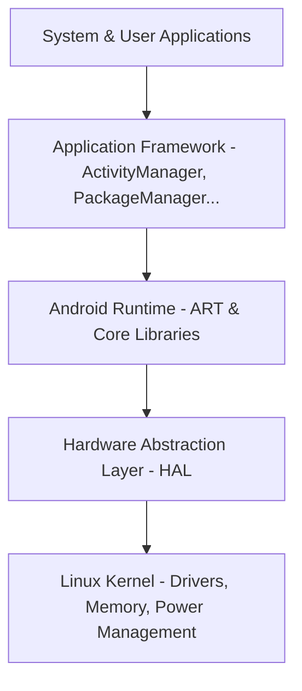

### Why it is Used
Android provides a standardized, hardware-agnostic platform for developers to build applications. Its open-source nature (Android Open Source Project - AOSP) allows device manufacturers to customize the OS while maintaining compatibility via the Compatibility Test Suite (CTS).

### How it Works Internally
Android uses a sandbox security model. Each application runs in a separate process with its own unique Linux User ID (UID) assigned at install time. This isolates processes, preventing applications from accessing each other's memory space or resources without explicit runtime permissions.

---

## 1.2 Android Runtime (ART) vs. Dalvik

### Definition
* **Dalvik:** The legacy runtime used up to Android 4.4 (KitKat) that executes Dalvik Executable (`.dex`) files.
* **ART:** The modern Android Runtime introduced in Android 5.0 (Lollipop) that executes DEX files using a hybrid Ahead-of-Time (AOT) and Just-in-Time (JIT) compilation model.

### Compilation Mechanics
1. **Dalvik DVM:** Relied on a Just-In-Time (JIT) compiler. It compiled DEX bytecode into machine code at runtime as the code was executed.
2. **ART (Early versions):** Used Ahead-of-Time (AOT) compilation via the `dex2oat` tool, compiling the entire app into native machine code (`.oat` / ELF format) during installation.
3. **ART (Modern - Android 7.0+ to Android 15):** Uses a hybrid model. The app starts with JIT. When the device is idle and charging, ART compiles frequently used paths (profile-guided compilation) into native code (AOT).

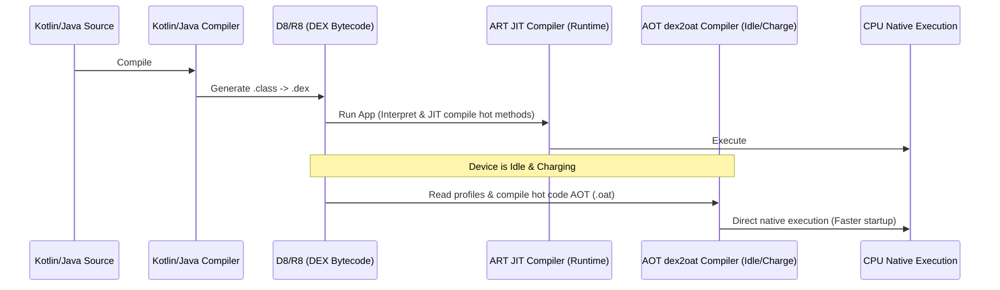

### Comparison Table

| Feature | Dalvik Virtual Machine (DVM) | Android Runtime (ART) |
|---|---|---|
| **Compilation Type** | Just-In-Time (JIT) only | Hybrid AOT + JIT (Profile-guided) |
| **App Startup Speed** | Slower (requires compilation on the fly) | Faster (executes pre-compiled native code) |
| **Installation Time** | Fast | Slower (modern ART mitigates this via post-install idle AOT) |
| **Storage Footprint** | Low (bytecode only) | Slightly higher (pre-compiled `.oat` files) |
| **Garbage Collector** | Simple stop-the-world phases | Highly optimized concurrent copy collector |
| **Battery Impact** | Higher CPU overhead at runtime | Lower runtime CPU overhead |

---

## 1.3 SDK Tools: ADB, AAPT2, D8, R8, and Build Formats

### Definition
* **ADB (Android Debug Bridge):** A command-line utility that facilitates communication between your development computer and a target device/emulator.
* **AAPT2 (Android Asset Packaging Tool 2):** Parses, indexes, and compiles Android resources into a binary format optimized for Android platforms, generating the `R.java` class.
* **D8:** The compiler that converts Java bytecode (`.class` files) into Dalvik Executable (`.dex`) files.
* **R8:** The replacement for ProGuard. It performs code shrinking, resource shrinking, optimization, and obfuscation during the DEX compilation phase.
* **APK vs. AAB:**
  * **APK (Android Package):** The final distributable package containing DEX files, raw resources, and manifest files ready for direct installation on a device.
  * **AAB (Android App Bundle):** A publishing format containing compiled code and resources in an archive format. Google Play uses the AAB to generate and serve optimized APKs tailored to specific device configurations (target ABI, screen density, language).

### Real-world ADB Commands
```bash
# Install an application
adb install path/to/app.apk

# View real-time device logs filtered by tag
adb logcat -s "MyActivityTag"

# Access the device's shell
adb shell

# Take a screenshot and save it locally
adb shell screencap -p /sdcard/screen.png
adb pull /sdcard/screen.png ./
```

---

## 1.4 R8 Compiler, Optimization, and Obfuscation

### Definition
* **Simple:** R8 is a tool that shrinks your app's code and resources, renames classes and methods to make reverse engineering harder, and optimizes the code to make it run faster and consume less storage space.
* **Advanced:** R8 is Android's default compiler tool that converts Java bytecode into optimized Dalvik Executable (DEX) bytecode. It integrates the functionality of shrinking, optimization, obfuscation, and resource reduction into a single compilation pass.

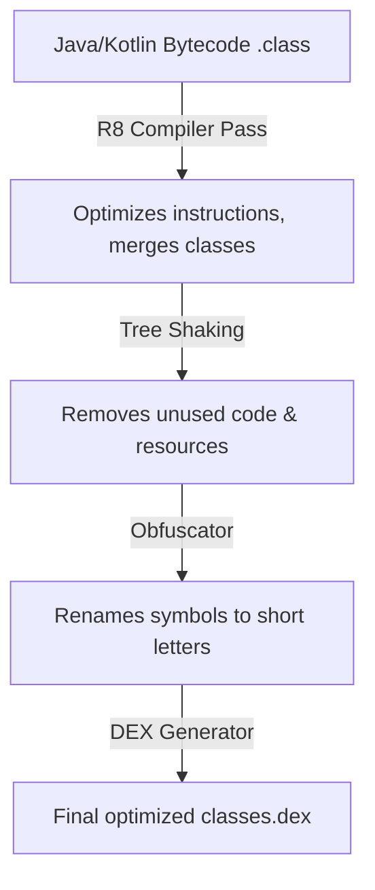

### The 4 Pillars of R8 Execution
1. **Code Shrinking (Tree Shaking):** Statically analyzes the codebase starting from declared entry points (e.g. Activities, Services, and Receivers declared in `AndroidManifest.xml`). R8 maps the call graph and discards any class, method, variable, or library dependency that cannot be reached through active execution paths, drastically reducing APK size.
2. **Optimization:** Performs dead-code elimination, inlines short method bodies, removes unused parameters, and merges vertical inheritance trees (e.g., merging a subclass into its parent class if it is the sole implementer) to minimize runtime call stacks.
3. **Obfuscation:** Renames human-readable classes, variables, and methods to short, meaningless identifiers (e.g. `UserRepository` becomes `a`, `fetchData` becomes `b`). This shrinks the string pool inside the DEX file and increases the difficulty of reverse engineering.
4. **Resource Shrinking:** Runs in tandem with code shrinking. Once R8 identifies and discards unused code, it checks resource folder files (`res/`, `assets/`). Any resource drawable, string, or layout that is not referenced in the remaining code graph is stripped.

### R8 vs. ProGuard

```mermaid
graph TD
    subgraph Legacy Build Pipeline
        Code1[Bytecode] --> PG[ProGuard Shrink/Optimize]
        PG --> BytecodeOptimized[Optimized Bytecode]
        BytecodeOptimized --> D8[D8 Compiler]
        D8 --> DEX1[classes.dex]
    end

    subgraph Modern Build Pipeline (R8)
        Code2[Bytecode] --> R8Compiler[R8 Single-Pass Tool]
        R8Compiler --> DEX2[classes.dex]
    end
```

* **Pipeline Differences:** ProGuard operates on Java bytecode (`.class`), outputting modified Java bytecode that must subsequently be compiled into DEX by the D8 compiler. R8 combines bytecode optimization and DEX translation into a **single step**, reducing compile times by up to 30%.
* **Memory & Efficiency:** Because R8 has complete visibility over the final DEX register layout during optimization, it can make more accurate register allocations and class merging decisions than ProGuard.

### Reflection Gotchas & Keep Rules
Because R8 relies on static analysis of the source code, any class or field accessed **dynamically at runtime via reflection** (such as JSON deserialization using Gson/Moshi, or dependency injection frameworks) will appear to R8 as "unused" and will be stripped or obfuscated, leading to runtime crash exceptions (e.g., `ClassNotFoundException` or JSON parsing failures).

Developers resolve this by defining **Keep Rules** in the `proguard-rules.pro` file:

```proguard
# Prevent R8 from obfuscating or shrinking data model classes used in JSON serialization
-keep class com.example.app.data.model.** { *; }

# Keep class names for custom views referenced exclusively in XML layouts
-keepclassmembers class * extends android.view.View {
    public <init>(android.content.Context);
    public <init>(android.content.Context, android.util.AttributeSet);
}
```

---

## 1.5 APK / AAB Anatomy, DEX Limits, and App Signing

### Definition
* **Simple:** An APK is a ZIP archive that holds everything the device needs to run your app. An AAB is the upload format Google Play splits into smaller, device-specific APKs. App signing proves that an update genuinely came from you.
* **Advanced:** An APK is a signed ZIP container carrying `classes*.dex`, `resources.arsc`, `AndroidManifest.xml` (binary XML), native libraries per ABI, and raw assets. Integrity is enforced by one of four signature schemes (v1 JAR signing through v4 incremental streaming).

### Why It Is Used
The container format lets the Package Manager verify authenticity before installation, map resources without decompressing them, and memory-map DEX files directly. AAB moves configuration splitting to Play, which typically reduces install size by 15–35% because a device downloads only its own density, ABI, and language.

### How It Works Internally

```
app.apk
├── AndroidManifest.xml    # Binary XML, parsed by PackageParser at install time
├── classes.dex            # Primary DEX; classes2.dex... when multidexed
├── resources.arsc         # Flat resource table, mmap'd (never decompressed)
├── res/                   # Compiled XML layouts, drawables
├── assets/                # Raw files, read via AssetManager
├── lib/<abi>/*.so         # JNI native libraries per ABI
└── META-INF/              # v1 signature manifests + certificates
```

**The 64K DEX method limit.** A single DEX file addresses methods with a 16-bit index, capping it at 65,536 method references. Exceeding it fails the build with `Cannot fit requested classes in a single dex file`.
* **minSdk 21+:** native multidex — ART loads `classes2.dex`, `classes3.dex` and so on with no runtime cost and no configuration.
* **minSdk < 21:** legacy multidex requires `multiDexEnabled true` plus `MultiDexApplication`, and pays a slow secondary-DEX extraction cost on first launch.
* **Real fix:** enable R8 so tree shaking removes unreachable methods before the limit is hit.

**Signature schemes.**

| Scheme | Since | What It Signs | Key Property |
|---|---|---|---|
| **v1 (JAR)** | Always | Individual files listed in `META-INF` | Slow verification; ZIP metadata unprotected |
| **v2** | Android 7.0 | The whole APK byte-for-byte | Fast, whole-file integrity; blocks ZIP tampering |
| **v3** | Android 9 | Whole APK + key-rotation lineage | Allows rotating the signing key without losing update rights |
| **v4** | Android 11 | Merkle hash tree in a sidecar `.apk.idsig` | Enables ADB Incremental Install (play while installing) |

**Play App Signing.** You keep an *upload key*; Google holds the *app signing key*. Play verifies your upload signature, strips it, and re-signs the generated APKs with the real app signing key. A lost upload key can be reset by support; a lost app signing key without Play App Signing means the app can never be updated again.

### Code Example
```kotlin
// build.gradle.kts — release signing plus bundle split configuration
android {
    signingConfigs {
        create("release") {
            storeFile = file(System.getenv("KEYSTORE_PATH") ?: "keystore.jks")
            storePassword = System.getenv("KEYSTORE_PASSWORD")
            keyAlias = System.getenv("KEY_ALIAS")
            keyPassword = System.getenv("KEY_PASSWORD")
            enableV1Signing = false   // Drop v1 when minSdk >= 24 (faster verify, smaller APK)
            enableV2Signing = true
            enableV3Signing = true
        }
    }
    bundle {
        language { enableSplit = true }   // Ship only the user's locale
        density  { enableSplit = true }   // Ship only the device's density buckets
        abi      { enableSplit = true }   // Ship only the device's ABI .so files
    }
}
```

```bash
# Inspect what is actually inside a build artifact
unzip -l app-release.apk | sort -k1 -n -r | head        # Largest entries first
apkanalyzer dex packages app-release.apk                 # Method counts per package
apkanalyzer apk compare old.apk new.apk                  # Size regression between builds
apksigner verify --print-certs --verbose app-release.apk # Which schemes are present
bundletool build-apks --bundle=app.aab --output=app.apks # Reproduce Play's split output
```

### Common Pitfalls
* **Debug keystore in CI.** A build signed with the auto-generated debug key cannot be uploaded to Play. Always fail the release task when the signing config resolves to null.
* **Reading `versionCode` from git at configuration time** breaks build caching and makes builds non-reproducible.
* **Assuming the APK size equals the download size.** After AAB splitting, the delivered size is much smaller. Quote the Play Console "download size" figure, not the local APK size.

---

## 1.6 Platform Behavior Changes: Android 12 → Android 16

### Definition
Each platform release adds behavior changes that apply once you raise `targetSdk`. Google Play enforces a rolling `targetSdk` floor, so these are not optional for a shipping app.

### Why It Is Used
`targetSdk` is a compatibility contract. The OS reads it and decides whether to apply new restrictions or preserve legacy behavior. Raising it is the single highest-risk change in an Android upgrade, and every interviewer for a 2–5 year role expects you to name the breaking changes.

### How It Works Internally
The framework guards each behavior change with `CompatChanges.isChangeEnabled(CHANGE_ID)`, which compares the calling app's `targetSdkVersion` against the change's enable-after SDK. This is why an app targeting API 30 keeps old behavior on an Android 15 device.

| Release | API | Behavior Changes You Must Handle |
|---|---|---|
| **Android 12** | 31 | `android:exported` mandatory on every manifest component with an intent filter; approximate location option; splash screen applied to every cold start; `PendingIntent` requires an explicit mutability flag; foreground service launch from background restricted |
| **Android 13** | 33 | Runtime `POST_NOTIFICATIONS` permission; granular media permissions (`READ_MEDIA_IMAGES` / `_VIDEO` / `_AUDIO`) replace `READ_EXTERNAL_STORAGE`; per-app language preferences; themed app icons; nearby Wi-Fi devices permission |
| **Android 14** | 34 | `foregroundServiceType` mandatory with a matching permission per type; runtime receivers must pass `RECEIVER_EXPORTED` or `RECEIVER_NOT_EXPORTED`; implicit intents must target the app's own package; `SCHEDULE_EXACT_ALARM` no longer auto-granted; partial photo/video access ("Select photos") |
| **Android 15** | 35 | Edge-to-edge enforced by default (insets must be handled or content sits under system bars); 16 KB memory-page support for native libraries; foreground service timeouts for `dataSync`; ends of the predictive-back migration path |
| **Android 16** | 36 | Adaptive layouts required on large screens (activity orientation and resize restrictions ignored); further predictive-back enforcement; tightened background work and intent-redirect rules |

### Code Example
```kotlin
// Android 13+: notifications require an explicit runtime grant
class NotificationPermissionHelper(private val activity: ComponentActivity) {

    private val launcher = activity.registerForActivityResult(
        ActivityResultContracts.RequestPermission()
    ) { granted -> if (!granted) showRationaleOrSettings() }

    fun ensure() {
        if (Build.VERSION.SDK_INT < Build.VERSION_CODES.TIRAMISU) return  // Auto-granted pre-33
        val state = ContextCompat.checkSelfPermission(
            activity, Manifest.permission.POST_NOTIFICATIONS
        )
        if (state != PackageManager.PERMISSION_GRANTED) {
            launcher.launch(Manifest.permission.POST_NOTIFICATIONS)
        }
    }
}
```

```xml
<!-- Android 12+: exported must be explicit or the app will not install -->
<activity
    android:name=".DeepLinkActivity"
    android:exported="true">
    <intent-filter>
        <action android:name="android.intent.action.VIEW" />
        <category android:name="android.intent.category.DEFAULT" />
        <category android:name="android.intent.category.BROWSABLE" />
        <data android:scheme="https" android:host="example.com" />
    </intent-filter>
</activity>

<!-- Android 14+: a foreground service type and its matching permission are both required -->
<uses-permission android:name="android.permission.FOREGROUND_SERVICE" />
<uses-permission android:name="android.permission.FOREGROUND_SERVICE_LOCATION" />
<service
    android:name=".LocationTrackingService"
    android:foregroundServiceType="location"
    android:exported="false" />
```

### Common Pitfalls
* **Testing on an old emulator.** Behavior changes gate on `targetSdk`, so a bug that only appears at API 34 will never reproduce on an API 30 image.
* **`PendingIntent` without a mutability flag** throws `IllegalArgumentException` on API 31+. Use `FLAG_IMMUTABLE` unless the receiver genuinely needs to fill in extras (for example `Notification.Action` reply), which requires `FLAG_MUTABLE`.
* **Silently dropped implicit intents on API 34.** An implicit intent that matches only a non-exported component of your own app is now blocked. Make those intents explicit.

---
# 2. Core Application Components & Manifest

Android apps are composed of four primary entry points, which must be declared in the `AndroidManifest.xml` file.

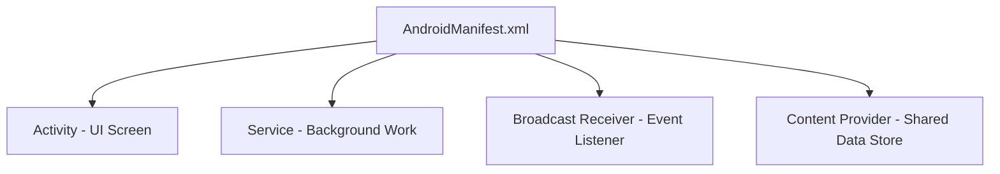

---

## 2.1 Activity & Launch Modes

### Definition
An **Activity** is an entry point representing a single screen with a User Interface (UI). It manages user interaction and handles system events.

### Activity Lifecycle Transitions
The lifecycle is defined by a state machine managed by the `ActivityThread` and monitored by the `ActivityTaskManagerService` (ATMS).

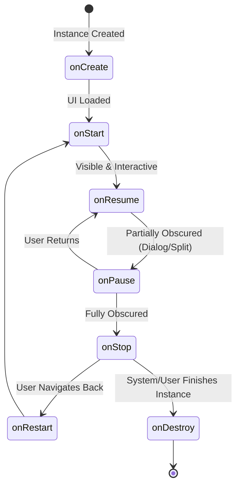

#### Transition Scenarios
1. **Activity A launches Activity B:**
   * `A.onPause()` $\rightarrow$ `B.onCreate()` $\rightarrow$ `B.onStart()` $\rightarrow$ `B.onResume()` $\rightarrow$ `A.onStop()`.
2. **Device rotated (Configuration Change):**
   * Active Activity is destroyed and recreated: `onPause()` $\rightarrow$ `onStop()` $\rightarrow$ `onDestroy()` $\rightarrow$ `onCreate()` $\rightarrow$ `onStart()` $\rightarrow$ `onResume()`.

### Launch Modes & Task Affinities
Declared using `android:launchMode` in the manifest or via Intent flags (`FLAG_ACTIVITY_NEW_TASK`, `FLAG_ACTIVITY_SINGLE_TOP`, `FLAG_ACTIVITY_CLEAR_TOP`).

1. **`standard` (Default):**
   * Creates a new instance of the Activity in the task from which it was started.
2. **`singleTop`:**
   * If an instance exists at the **top** of the target stack, Android routes the intent via `onNewIntent()` instead of creating a new instance.
3. **`singleTask`:**
   * Creates a new task and instantiates the Activity at the root of the task. If the activity already exists in another task, the system brings that task to the foreground and clears all activities above it (triggers `onNewIntent()`).
4. **`singleInstance`:**
   * Same as `singleTask`, but the system does not launch any other activities into the task holding this instance. It is always the single and unique member of its task.
5. **`singleInstancePerTask` (Android 12+):**
   * The activity can only be instantiated as the root activity of a task. It allows multiple instances in different tasks.

---

## 2.2 Services & Background Restrictions (Android 14/15)

### Definition
A **Service** is a component that performs long-running background operations without providing a user interface.

### Types of Services
* **Foreground Service:** Performs work noticeable to the user. It **must** show a non-dismissible status bar notification. In Android 14/15, you must explicitly declare a foreground service type (`android:foregroundServiceType`) in the manifest and request the corresponding permission.
* **Started Service (Background):** Initiated via `startService()`. Runs indefinitely until it stops itself (`stopSelf()`) or another component stops it (`stopService()`). Subject to background execution limits since Android 8.0.
* **Bound Service:** Initiated via `bindService()`. Provides a client-server interface using an `IBinder` implementation. It runs only as long as components are bound to it.

```kotlin
// Android 14/15 Foreground Service Example
class LocationTrackingService : Service() {
    private val binder = LocalBinder()

    inner class LocalBinder : Binder() {
        fun getService(): LocationTrackingService = this@LocationTrackingService
    }

    override fun onBind(intent: Intent): IBinder = binder

    override fun onStartCommand(intent: Intent?, flags: Int, startId: Int): Int {
        createNotificationChannel()
        val notification = NotificationCompat.Builder(this, CHANNEL_ID)
            .setContentTitle("Location Tracking Active")
            .setSmallIcon(R.drawable.ic_location)
            .setForegroundServiceBehavior(NotificationCompat.FOREGROUND_SERVICE_IMMEDIATE)
            .build()
        
        // Starting foreground service with type (Required Android 14+)
        ServiceCompat.startForeground(
            this,
            NOTIFICATION_ID,
            notification,
            if (Build.VERSION.SDK_INT >= Build.VERSION_CODES.UPSIDE_DOWN_CAKE) {
                ServiceInfo.FOREGROUND_SERVICE_TYPE_LOCATION
            } else 0
        )
        return START_STICKY
    }
}
```

---

## 2.3 Broadcast Receiver & Content Providers

### Broadcast Receiver
A component that listens for system-wide or application-level broadcast announcements.

* **Static Registration:** Declared in the manifest (`<receiver>`). Since Android 8.0, static registration is severely restricted for implicit broadcasts.
* **Dynamic Registration:** Registered programmatically using `Context.registerReceiver()`. Must be unregistered in lifecycle teardown methods to prevent context leaks.

```kotlin
// Dynamic Registration Example
class NetworkStateReceiver : BroadcastReceiver() {
    override fun onReceive(context: Context, intent: Intent) {
        val isAirplaneModeOn = intent.getBooleanExtra("state", false)
        Log.d("Receiver", "Airplane mode state changed: $isAirplaneModeOn")
    }
}

// Activity Usage
class MainActivity : AppCompatActivity() {
    private val receiver = NetworkStateReceiver()

    override fun onStart() {
        super.onStart()
        registerReceiver(
            receiver, 
            IntentFilter(Intent.ACTION_AIRPLANE_MODE_CHANGED),
            RECEIVER_EXPORTED // Android 14 requirement
        )
    }

    override fun onStop() {
        super.onStop()
        unregisterReceiver(receiver) // Prevent memory leaks
    }
}
```

### Content Providers
Encapsulates application data (usually an underlying SQLite database) and exposes it to other apps via a standard query interface (`content://` URIs).

* **Why it exists:** Enforces app sandboxing while providing secure, permission-controlled, transactional inter-process communication (IPC) for structured data.
* **Components:** Implements CRUD operations (`query()`, `insert()`, `update()`, `delete()`) and uses `UriMatcher` to parse incoming client URIs.

---

## 2.4 Binder IPC Architecture

### Definition
* **Simple:** Binder is the mechanism Android uses to let different applications or system services communicate and share data with each other safely.
* **Advanced:** Binder is a Linux kernel-based driver (`/dev/binder`) that provides inter-process communication (IPC) and remote procedure calls (RPC) using a client-server architecture, memory mapping, and AIDL-defined interfaces.

```mermaid
graph TD
    Client[Client App Process] -->|1. Marshals params into Parcel| Proxy[Proxy - Client Stub]
    Proxy -->|2. ioctl transaction| Driver[/dev/binder Driver]
    Driver -->|3. Single Copy mmap| Stub[Stub - Server Implementation]
    Stub -->|4. Unmarshals Parcel| Server[Server System Process]
```

### How it Works Internally
1. **Single-Copy Data Transfer (`mmap`):** Standard Linux IPC systems require copying data twice (User Space A &rarr; Kernel Space &rarr; User Space B). Binder maps a shared virtual memory region (using `mmap()`) between the kernel and the receiving process's address space. When a transaction occurs, the kernel copies data directly from the sender's user space into the receiver's mapped memory buffer once, saving CPU cycles.
2. **Transaction Buffer Limit (1MB):** The Binder transaction buffer is capped at **1MB** per process, shared across all ongoing transactions. If an application attempts to pass large files (like high-res bitmaps) or large data lists via Intents, Services, or Content Providers, it throws a `TransactionTooLargeException`.
3. **AIDL (Android Interface Definition Language):** Defines programming interfaces that client and server agree on. The AIDL compiler generates the `Proxy` class (used by the client to marshal data into a `Parcel` and execute `transact()`) and the `Stub` class (used by the server to execute `onTransact()` and unmarshal data).

---

## 2.5 Context Hierarchy & Window Tokens

### Definition
* **Simple:** Context represents the handle to Android system resources and services. Different types of contexts (like Application vs. Activity) have different capabilities.
* **Advanced:** Context is an abstract class implemented by `ContextImpl`. It is decorated by `ContextWrapper` subclasses (`Activity`, `Service`, `Application`) to delegate resource lookup and system operations.

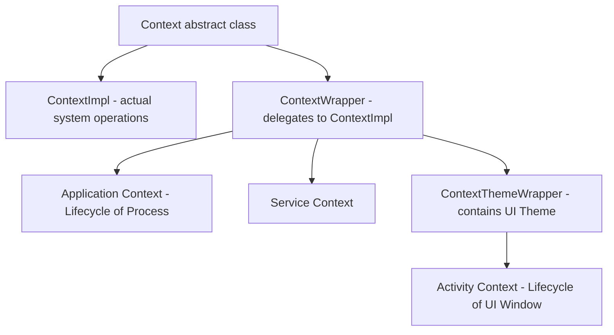

### Comparison: Context Capabilities

| Context Type | Can Start Activity? | Can Inflate Layout? | Can Show Dialogs? |
|---|---|---|---|
| **Application** | Yes (requires `FLAG_ACTIVITY_NEW_TASK`) | Yes (inherits system theme, not app theme) | No (throws `BadTokenException`) |
| **Activity** | Yes | Yes | Yes (owns valid Window Token) |
| **Service** | Yes (requires `FLAG_ACTIVITY_NEW_TASK`) | Yes | No |

### Window Tokens & BadTokenException
* **Window Token:** A unique binder token generated by the `WindowManagerService` (WMS) that authorizes a client to draw a window layer on the screen.
* **Why Application Context fails:** An `Application` context does not have a `WindowToken` associated with a physical screen layer. Attempting to display dialogs or popup windows using the Application Context causes the system to throw a `WindowManager.BadTokenException`.

---

## 2.6 Intents, Deep Links, and App Links

### Definition
* **Simple:** An Intent is a message object asking the system to start a component or perform an action. A deep link is a URL that opens a specific screen inside your app.
* **Advanced:** An `Intent` is a Parcelable message containing an action, data URI, category set, component name, flags, and an extras `Bundle`. The `PackageManagerService` resolves it against the intent filters declared by installed packages.

### Why It Is Used
Intents decouple callers from implementations: your app can say "share this text" without knowing which app handles it. Deep links let notifications, web pages, and other apps land users on an exact screen, which is a direct conversion and retention lever.

### How It Works Internally
1. **Explicit intent** — names a target `ComponentName`. Resolution skips the filter database and goes straight to the component. Always use this for internal navigation, because implicit resolution can be hijacked by another installed app.
2. **Implicit intent** — carries only action, data, and categories. `PackageManagerService` scans registered `<intent-filter>` entries; a filter matches only if the action matches, **every** category in the intent is present in the filter, and the data scheme/host/mimeType matches.
3. **Resolution outcome** — one match launches directly, multiple matches show the disambiguation chooser, and zero matches throws `ActivityNotFoundException`.

**Deep link vs. App Link.**

| | Custom-scheme deep link | Web deep link | Android App Link |
|---|---|---|---|
| **URI** | `myapp://profile/42` | `https://example.com/profile/42` | `https://example.com/profile/42` |
| **Verification** | None — any app can claim the scheme | None — shows a chooser | Cryptographic, via `assetlinks.json` |
| **User experience** | Chooser or hijack risk | Disambiguation dialog | Opens your app directly, no dialog |
| **Requires** | Nothing | Nothing | `android:autoVerify="true"` + hosted Digital Asset Links file |

### Code Example
```xml
<!-- Verified App Link: opens directly with no chooser dialog -->
<activity android:name=".MainActivity" android:exported="true">
    <intent-filter android:autoVerify="true">
        <action android:name="android.intent.action.VIEW" />
        <category android:name="android.intent.category.DEFAULT" />
        <category android:name="android.intent.category.BROWSABLE" />
        <data android:scheme="https" android:host="example.com" android:pathPrefix="/profile" />
    </intent-filter>
</activity>
```

```json
// Must be served at https://example.com/.well-known/assetlinks.json over HTTPS, no redirects
[{
  "relation": ["delegate_permission/common.handle_all_urls"],
  "target": {
    "namespace": "android_app",
    "package_name": "com.example.app",
    "sha256_cert_fingerprints": ["AB:CD:...:EF"]
  }
}]
```

```kotlin
// Handling the link on both cold start and warm re-delivery
class MainActivity : AppCompatActivity() {

    override fun onCreate(savedInstanceState: Bundle?) {
        super.onCreate(savedInstanceState)
        handleDeepLink(intent)                 // Cold start: link arrives in the launch Intent
    }

    // singleTop / singleTask activities receive later links here, NOT in onCreate
    override fun onNewIntent(intent: Intent) {
        super.onNewIntent(intent)
        setIntent(intent)                      // Keep getIntent() consistent for later reads
        handleDeepLink(intent)
    }

    private fun handleDeepLink(intent: Intent) {
        val userId = intent.data
            ?.takeIf { it.pathSegments.firstOrNull() == "profile" }
            ?.lastPathSegment
            ?.toLongOrNull() ?: return
        navigateToProfile(userId)
    }
}

// Safe implicit intent: always guard resolution
fun Context.shareText(text: String) {
    val send = Intent(Intent.ACTION_SEND).apply {
        type = "text/plain"
        putExtra(Intent.EXTRA_TEXT, text)
    }
    // createChooser never throws even when no handler exists
    startActivity(Intent.createChooser(send, "Share via"))
}
```

```bash
# Verify a deep link without leaving the terminal
adb shell am start -W -a android.intent.action.VIEW -d "https://example.com/profile/42" com.example.app
adb shell pm get-app-links com.example.app     # Shows verified / unverified domain state
```

### Common Pitfalls
* **Reading the link only in `onCreate`.** With `singleTop` or `singleTask`, a second link arrives in `onNewIntent()` and is otherwise silently ignored.
* **App Link verification failing quietly.** A redirect, a missing content type, or a fingerprint from the wrong signing key (upload key vs. Play app signing key) breaks verification with no user-visible error. With Play App Signing, publish the *app signing key* fingerprint.
* **Trusting deep-link parameters.** They are attacker-controlled input. Validate and authorize server-side before acting on them.

---

## 2.7 Permissions Model and Scoped Storage

### Definition
* **Simple:** Permissions are the user's yes/no answer to an app requesting access to sensitive data or hardware. Scoped storage limits an app to its own files unless the user explicitly picks something else.
* **Advanced:** Permissions are declared in the manifest and classified as install-time (normal/signature) or runtime (dangerous). Runtime permissions are granted per permission group and are revocable at any moment, including while the app is running.

### Why It Is Used
It moves the trust decision from install time to the moment of use, when the user has context. Scoped storage ends the era of apps freely reading the whole shared partition, which was the single largest privacy hole on the platform.

### How It Works Internally
1. `PackageManagerService` records granted permissions per package UID.
2. A dangerous permission grant applies to the whole group at the framework level, but you must still request each permission you use.
3. `shouldShowRequestPermissionRationale()` returns `true` only after one denial and before a permanent denial. The tri-state — never asked / denied once / denied permanently — has no direct API, so track "have we asked before" yourself.
4. Under scoped storage (API 29+, enforced at 30), each app writes freely into its own `getExternalFilesDir()`, and reaches shared collections only via `MediaStore` or the Storage Access Framework.

**Storage decision table.**

| Need | API to Use | Permission Required |
|---|---|---|
| App-private cache / files | `context.filesDir`, `context.cacheDir` | None |
| App-private on external volume | `context.getExternalFilesDir()` | None (API 19+) |
| Save a photo/video to the gallery | `MediaStore.Images` insert | None on API 29+ |
| Read the user's photos | Photo Picker (`PickVisualMedia`) | **None** — preferred |
| Read all media programmatically | `MediaStore` query | `READ_MEDIA_IMAGES` / `_VIDEO` / `_AUDIO` (API 33+) |
| Open an arbitrary user file | Storage Access Framework `OpenDocument` | None |
| Full filesystem access | `MANAGE_EXTERNAL_STORAGE` | Special access; Play restricts to file managers |

### Code Example
```kotlin
// Runtime permission with correct rationale handling
class CameraPermissionFlow(private val fragment: Fragment) {

    private val request = fragment.registerForActivityResult(
        ActivityResultContracts.RequestPermission()
    ) { granted ->
        when {
            granted -> openCamera()
            fragment.shouldShowRequestPermissionRationale(Manifest.permission.CAMERA) ->
                showRationaleDialog()          // Denied once; asking again is allowed
            else -> showSettingsRedirect()     // Permanently denied; only Settings can restore it
        }
    }

    fun start() {
        val ctx = fragment.requireContext()
        if (ContextCompat.checkSelfPermission(ctx, Manifest.permission.CAMERA)
            == PackageManager.PERMISSION_GRANTED
        ) openCamera() else request.launch(Manifest.permission.CAMERA)
    }
}

// Photo Picker: no permission at all, and it is the Play-recommended path
class GalleryPicker(activity: ComponentActivity) {
    val pick = activity.registerForActivityResult(
        ActivityResultContracts.PickVisualMedia()
    ) { uri: Uri? -> uri?.let { loadImage(it) } }

    fun open() = pick.launch(
        PickVisualMediaRequest(ActivityResultContracts.PickVisualMedia.ImageOnly)
    )
}

// Saving to the shared gallery under scoped storage — no permission needed on API 29+
suspend fun Context.saveToGallery(bytes: ByteArray, name: String): Uri? =
    withContext(Dispatchers.IO) {
        val values = ContentValues().apply {
            put(MediaStore.Images.Media.DISPLAY_NAME, name)
            put(MediaStore.Images.Media.MIME_TYPE, "image/jpeg")
            if (Build.VERSION.SDK_INT >= Build.VERSION_CODES.Q) {
                put(MediaStore.Images.Media.RELATIVE_PATH, Environment.DIRECTORY_PICTURES)
                put(MediaStore.Images.Media.IS_PENDING, 1)  // Hide until fully written
            }
        }
        val uri = contentResolver.insert(
            MediaStore.Images.Media.EXTERNAL_CONTENT_URI, values
        ) ?: return@withContext null

        contentResolver.openOutputStream(uri)?.use { it.write(bytes) }

        if (Build.VERSION.SDK_INT >= Build.VERSION_CODES.Q) {
            values.clear()
            values.put(MediaStore.Images.Media.IS_PENDING, 0)
            contentResolver.update(uri, values, null, null)
        }
        uri
    }
```

### Common Pitfalls
* **Requesting permission on app launch.** Denial rates spike. Ask at the point of use, after the value is clear.
* **Caching the grant result.** A user can revoke permission from Settings while your process is alive, or Android 11+ can auto-revoke it for unused apps. Re-check before every use.
* **Requesting `READ_EXTERNAL_STORAGE` on API 33+.** It is a no-op there. Use the granular media permissions, or better, the Photo Picker.
* **Passing a `file://` URI to another app** throws `FileUriExposedException`. Use `FileProvider` and grant `FLAG_GRANT_READ_URI_PERMISSION`.

---

## 2.8 Notifications, Channels, and PendingIntent

### Definition
* **Simple:** A notification is a message your app shows outside its own UI. A channel is a user-controllable category for those messages.
* **Advanced:** `NotificationManagerService` owns posted notifications. Since API 26, every notification must belong to a `NotificationChannel` whose importance, sound, and vibration are controlled by the user, not the app.

### Why It Is Used
Channels moved control of interruption from the developer to the user, which reduced blanket app-level notification blocks. `PendingIntent` gives another process (the system UI) permission to execute an intent **as your app**, which is what makes a notification tap able to open your activity.

### How It Works Internally
* **Channel immutability.** Importance, sound, and vibration set at creation can never be raised by the app afterward. Only the user can change them. To change defaults you must delete and recreate the channel with a **new ID**, which resets the user's preference and is user-hostile — so get the design right the first time.
* **`PendingIntent` identity.** It is keyed by `(requestCode, Intent action/data/component/categories)`. **Extras are not part of the key.** Two `PendingIntent`s that differ only in extras collide, and the second one silently reuses the first one's extras unless you pass `FLAG_UPDATE_CURRENT`.
* **Mutability (API 31+).** You must pass `FLAG_IMMUTABLE` or `FLAG_MUTABLE`. Immutable is the safe default; mutable is needed only for direct-reply actions and Bubbles.

### Code Example
```kotlin
object Notifier {
    private const val CHANNEL_SYNC = "sync_status_v1"

    // Create channels once, ideally in Application.onCreate — repeat calls are cheap no-ops
    fun createChannels(context: Context) {
        if (Build.VERSION.SDK_INT < Build.VERSION_CODES.O) return
        val channel = NotificationChannel(
            CHANNEL_SYNC,
            context.getString(R.string.channel_sync_name),   // Localized: shown in Settings
            NotificationManager.IMPORTANCE_DEFAULT
        ).apply {
            description = context.getString(R.string.channel_sync_desc)
            setShowBadge(false)
        }
        context.getSystemService(NotificationManager::class.java)
            .createNotificationChannel(channel)
    }

    fun showSyncComplete(context: Context, itemId: Long) {
        val deepLink = Intent(
            Intent.ACTION_VIEW,
            "https://example.com/item/$itemId".toUri(),
            context,
            MainActivity::class.java
        )

        // TaskStackBuilder synthesizes a correct back stack for the deep-linked screen
        val pending = TaskStackBuilder.create(context).run {
            addNextIntentWithParentStack(deepLink)
            getPendingIntent(
                itemId.toInt(),                                       // Unique per item: avoids collision
                PendingIntent.FLAG_UPDATE_CURRENT or PendingIntent.FLAG_IMMUTABLE
            )
        }

        val notification = NotificationCompat.Builder(context, CHANNEL_SYNC)
            .setSmallIcon(R.drawable.ic_sync)
            .setContentTitle(context.getString(R.string.sync_done_title))
            .setContentText(context.getString(R.string.sync_done_body))
            .setContentIntent(pending)
            .setAutoCancel(true)                                      // Dismiss on tap
            .setPriority(NotificationCompat.PRIORITY_DEFAULT)         // Honored on pre-26 only
            .build()

        // Guard: posting without POST_NOTIFICATIONS on API 33+ is silently dropped
        with(NotificationManagerCompat.from(context)) {
            if (areNotificationsEnabled()) notify(itemId.toInt(), notification)
        }
    }
}
```

### Common Pitfalls
* **Reusing notification ID `0` or a constant** for every item collapses all of them into one. Derive a stable per-item ID.
* **Assuming `notify()` throws when blocked.** It silently no-ops. Check `areNotificationsEnabled()` and surface an in-app prompt.
* **Setting priority instead of channel importance** on API 26+. `setPriority` is ignored; the channel wins.

---

## 2.9 Configuration Changes, Process Death, and State Restoration

### Definition
* **Simple:** A configuration change (rotation, dark mode, language, window resize) destroys and recreates your activity. Process death is the OS killing your app entirely while it sits in the background.
* **Advanced:** Configuration changes trigger an `Activity` relaunch through `ActivityThread.handleRelaunchActivity`, preserving `ViewModelStore` via `NonConfigurationInstances`. Process death destroys everything in memory; only the serialized `Bundle` written by `onSaveInstanceState` survives.

### Why It Is Used
These are two distinct failure modes that developers routinely conflate. A ViewModel survives rotation but **not** process death. `SavedStateHandle` survives both. Getting this wrong produces bugs that only appear after the app has been backgrounded for a while — exactly the class of bug interviewers probe for.

### How It Works Internally

| Scenario | Activity Instance | ViewModel | `SavedStateHandle` / `Bundle` | Static / Singleton |
|---|---|---|---|---|
| Rotation / config change | Destroyed, recreated | **Survives** | Survives | Survives |
| System-initiated process death | Destroyed | **Lost** | **Survives** | **Lost** |
| User swipes app from Recents | Destroyed | Lost | **Lost** | Lost |
| `finish()` / back out | Destroyed | Cleared (`onCleared`) | Lost | Survives |

**Bundle size limit.** `onSaveInstanceState` writes into a Binder transaction, subject to the ~1 MB per-process buffer. Storing a large list or a bitmap throws `TransactionTooLargeException`. Save IDs and scroll positions, never data payloads.

### Code Example
```kotlin
// SavedStateHandle: the only state holder that survives BOTH config change and process death
@HiltViewModel
class SearchViewModel @Inject constructor(
    private val savedState: SavedStateHandle,
    private val repo: SearchRepository
) : ViewModel() {

    // Backed by the saved-state Bundle; restored automatically after process death
    val query: StateFlow<String> = savedState.getStateFlow(KEY_QUERY, "")

    @OptIn(ExperimentalCoroutinesApi::class)
    val results: StateFlow<UiState> = query
        .debounce(300)
        .flatMapLatest { q -> if (q.isBlank()) flowOf(UiState.Idle) else repo.search(q) }
        .stateIn(viewModelScope, SharingStarted.WhileSubscribed(5_000), UiState.Idle)

    fun onQueryChange(value: String) { savedState[KEY_QUERY] = value }

    private companion object { const val KEY_QUERY = "query" }
}

// Reproducing process death in a test/QA pass — this is the only reliable way to catch these bugs
// 1. Put the app in the background (Home button, NOT swipe-away).
// 2. adb shell am kill com.example.app
// 3. Reopen from Recents; the system restores the saved Bundle.
```

```xml
<!-- Handling config changes yourself: valid only when you genuinely re-lay-out without recreating.
     Omitting a qualifier here (e.g. locale) means that change silently stops recreating the
     activity and your localized strings never refresh. -->
<activity
    android:name=".VideoPlayerActivity"
    android:configChanges="orientation|screenSize|smallestScreenSize|screenLayout|keyboardHidden" />
```

### Common Pitfalls
* **Using `android:configChanges` to "fix" rotation bugs.** It hides the bug instead of fixing it, and process death will still break the screen. Fix state ownership instead.
* **Storing UI state in a singleton or `object`.** It looks like it works until process death, then returns a stale default.
* **Testing rotation only.** Rotation exercises ViewModel retention, which is the *easy* path. Always also test `am kill`.
* **`onSaveInstanceState` is not guaranteed on `finish()`.** Do not use it as a persistence mechanism; use DataStore or Room for anything durable.

---
# 3. UI Layouts, Views, and Fragments

## 3.1 Layout Performance & ConstraintLayout

### View Tree Rendering Pipeline
When a layout is loaded, the system performs a three-pass traversal of the View hierarchy:

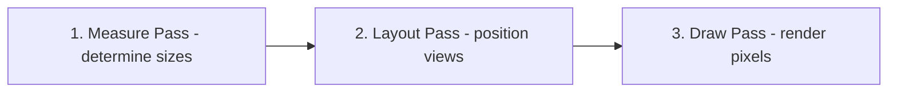

### Layout Comparison

| Layout Class | Hierarchy Type | Best Use Case | Performance Cost |
|---|---|---|---|
| **LinearLayout** | Linear (Vertical/Horizontal) | Simple, single-row/column items | Low (increases to High if nested with layout weights) |
| **RelativeLayout** | Relative (Sibling/Parent) | Simple relative positions | High (performs double measure passes on children) |
| **FrameLayout** | Stack (Overlapping views) | Single child holder, Fragment containers | Very Low |
| **ConstraintLayout** | Flat | Complex, responsive UI designs | Extremely Low (eliminates nested view hierarchies) |

---

## 3.2 RecyclerView Internals

### How RecyclerView Works Internally
`RecyclerView` optimizes scrolling lists by recycling view objects instead of inflating a new view for every data item. It uses the `Recycler` class, which holds several caching layers:

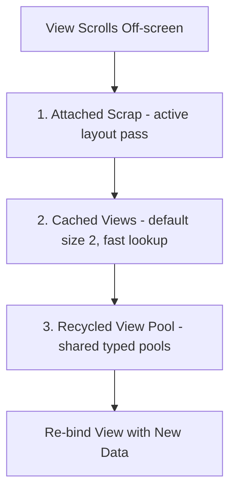

1. **Scrap Heap (Attached Scrap / Changed Scrap):** Temporarily detached views that are still active in the current layout pass.
2. **Cached Views (mCachedViews):** Contains views that were recently scrolled off. They can be re-added without re-binding data. (Default limit is 2).
3. **RecycledViewPool:** Contains views categorized by `viewType`. Views retrieved from the pool must undergo the `onBindViewHolder()` data binding phase.

### ListAdapter vs. RecyclerView.Adapter
* **`RecyclerView.Adapter`:** Requires manual data set mutation notifications (`notifyDataSetChanged()` or granular updates).
* **`ListAdapter`:** Built on top of `AsyncListDiffer`. It compares old and new lists on a background thread using the **DiffUtil** algorithm and dispatches minimal update commands to the RecyclerView, preventing redundant rendering.

```kotlin
class UserAdapter : ListAdapter<User, UserAdapter.UserViewHolder>(UserDiffCallback) {

    object UserDiffCallback : DiffUtil.ItemCallback<User>() {
        override fun areItemsTheSame(oldItem: User, newItem: User): Boolean = oldItem.id == newItem.id
        override fun areContentsTheSame(oldItem: User, newItem: User): Boolean = oldItem == newItem
    }

    override fun onCreateViewHolder(parent: ViewGroup, viewType: Int): UserViewHolder {
        val binding = ItemUserBinding.inflate(LayoutInflater.from(parent.context), parent, false)
        return UserViewHolder(binding)
    }

    override fun onBindViewHolder(holder: UserViewHolder, position: Int) {
        holder.bind(getItem(position))
    }

    class UserViewHolder(private val binding: ItemUserBinding) : RecyclerView.ViewHolder(binding.root) {
        fun bind(user: User) {
            binding.txtName.text = user.name
        }
    }
}
```

---

## 3.3 Fragment Lifecycle

A **Fragment** represents a modular, reusable portion of an Activity's user interface. Its lifecycle is tied to its host Activity but contains extra states for managing its View hierarchy.

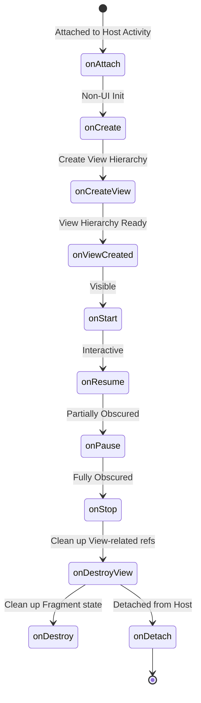

### Critical Fragment Lifecycle Gotcha
* **Memory Leaks in Fragments:** The Fragment instance and the Fragment's view hierarchy have different lifetimes. The View is destroyed when a Fragment goes into the backstack (`onDestroyView()`), but the Fragment instance persists.
* **Best Practice:** You must set UI bindings to `null` in `onDestroyView()` to release memory references to views, and observe LiveData/Flows using `viewLifecycleOwner` instead of `this`.

---

## 3.4 Custom Views: Measure, Layout, Draw

### Definition
* **Simple:** A custom view is a class extending `View` (or an existing widget) where you control the size, position, and pixels yourself.
* **Advanced:** A custom view participates in the three-pass traversal by overriding `onMeasure` (resolve size against `MeasureSpec` constraints), `onLayout` (position children, `ViewGroup` only), and `onDraw` (issue commands into a `Canvas` backed by a display list).

### Why It Is Used
When no combination of framework widgets produces the visual or interaction you need — a gauge, a custom chart, a signature pad — a single custom view replaces a deep nested hierarchy and measures once instead of many times.

### How It Works Internally
**`MeasureSpec` is a packed int**: 2 bits of mode plus 30 bits of size.

| Mode | Meaning | Produced By |
|---|---|---|
| `EXACTLY` | Parent has fixed this dimension | `match_parent`, or a fixed `dp` value |
| `AT_MOST` | Child may be any size up to the given bound | `wrap_content` |
| `UNSPECIFIED` | No constraint at all | `ScrollView` measuring its child, `RecyclerView` pre-measure |

**Invalidation cost.**

| Call | Triggers | Cost |
|---|---|---|
| `invalidate()` | Draw pass only | Cheap |
| `requestLayout()` | Measure + Layout + Draw, propagating **up** to the root | Expensive |

### Code Example
```kotlin
class RingProgressView @JvmOverloads constructor(
    context: Context,
    attrs: AttributeSet? = null,
    defStyleAttr: Int = 0
) : View(context, attrs, defStyleAttr) {

    // Allocate every object ONCE. onDraw runs up to 120x/second; allocation there causes GC jank.
    private val trackPaint = Paint(Paint.ANTI_ALIAS_FLAG).apply { style = Paint.Style.STROKE }
    private val progressPaint = Paint(Paint.ANTI_ALIAS_FLAG).apply {
        style = Paint.Style.STROKE
        strokeCap = Paint.Cap.ROUND
    }
    private val arcBounds = RectF()

    private var strokeWidthPx = 0f

    var progress: Float = 0f
        set(value) {
            val clamped = value.coerceIn(0f, 1f)
            if (field == clamped) return
            field = clamped
            invalidate()          // Size did not change, so only the draw pass is needed
        }

    init {
        // obtainStyledAttributes returns a pooled TypedArray; not recycling it leaks the pool slot
        context.obtainStyledAttributes(attrs, R.styleable.RingProgressView).use { a ->
            strokeWidthPx = a.getDimension(R.styleable.RingProgressView_ringStrokeWidth, 12f)
            trackPaint.color = a.getColor(R.styleable.RingProgressView_ringTrackColor, Color.LTGRAY)
            progressPaint.color = a.getColor(R.styleable.RingProgressView_ringColor, Color.BLUE)
        }
        trackPaint.strokeWidth = strokeWidthPx
        progressPaint.strokeWidth = strokeWidthPx
    }

    override fun onMeasure(widthMeasureSpec: Int, heightMeasureSpec: Int) {
        val desired = (96 * resources.displayMetrics.density).toInt()
        // resolveSize honors the parent's EXACTLY/AT_MOST constraint against our preferred size
        val w = resolveSize(desired + paddingLeft + paddingRight, widthMeasureSpec)
        val h = resolveSize(desired + paddingTop + paddingBottom, heightMeasureSpec)
        val side = minOf(w, h)                     // Keep the ring square
        setMeasuredDimension(side, side)
    }

    // Called on size change only — the right place for bounds math, not onDraw
    override fun onSizeChanged(w: Int, h: Int, oldw: Int, oldh: Int) {
        val inset = strokeWidthPx / 2f
        arcBounds.set(
            paddingLeft + inset,
            paddingTop + inset,
            w - paddingRight - inset,
            h - paddingBottom - inset
        )
    }

    override fun onDraw(canvas: Canvas) {
        canvas.drawOval(arcBounds, trackPaint)
        canvas.drawArc(arcBounds, -90f, 360f * progress, false, progressPaint)
    }

    // Custom views must save their own state; the framework only saves framework properties
    override fun onSaveInstanceState(): Parcelable = Bundle().apply {
        putParcelable(KEY_SUPER, super.onSaveInstanceState())
        putFloat(KEY_PROGRESS, progress)
    }

    override fun onRestoreInstanceState(state: Parcelable?) {
        val bundle = state as? Bundle ?: return super.onRestoreInstanceState(state)
        progress = bundle.getFloat(KEY_PROGRESS)
        super.onRestoreInstanceState(BundleCompat.getParcelable(bundle, KEY_SUPER, Parcelable::class.java))
    }

    private companion object {
        const val KEY_SUPER = "super"
        const val KEY_PROGRESS = "progress"
    }
}
```

### Common Pitfalls
* **Allocating in `onDraw`.** A `Paint`, `Path`, `Rect`, or even a string concatenation per frame triggers GC churn and visible stutter. Lint flags this as `DrawAllocation`.
* **Not recycling `TypedArray`.** Use Kotlin's `.use { }` extension, or call `recycle()` in a `finally`.
* **Calling `requestLayout()` when `invalidate()` suffices.** A layout pass walks the whole tree upward; a colour change never needs it.
* **Views with the same ID sharing saved state.** If several instances of the custom view share an XML `android:id`, the framework restores the same Bundle into all of them.

---

## 3.5 Touch Event Dispatch

### Definition
The path a `MotionEvent` takes from the window down the view tree and back up, decided by `dispatchTouchEvent`, `onInterceptTouchEvent`, and `onTouchEvent`.

### Why It Is Used
Every "my button inside a RecyclerView inside a ViewPager does not respond" bug is a dispatch bug. Understanding the three-method contract is the difference between guessing and fixing.

### How It Works Internally

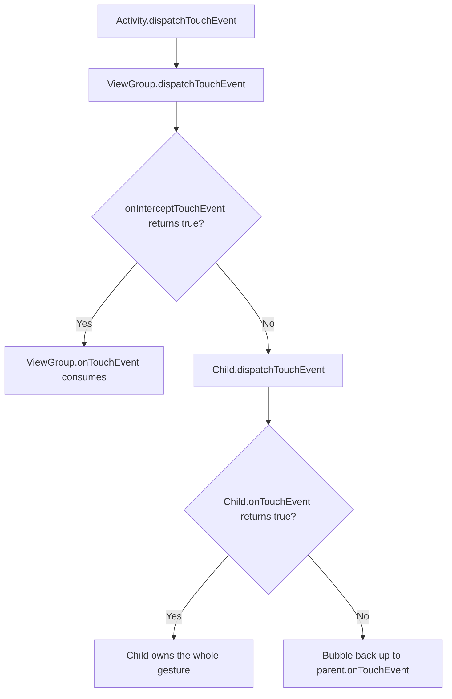

**The three rules that explain nearly every dispatch bug:**
1. **`ACTION_DOWN` decides ownership.** Whichever view returns `true` from `onTouchEvent` for the DOWN event receives every subsequent MOVE and UP in that gesture. Returning `false` for DOWN means the view never sees the rest.
2. **Interception is one-way.** Once a parent intercepts mid-gesture, the child receives `ACTION_CANCEL` and is out of the gesture for good.
3. **`requestDisallowInterceptTouchEvent(true)`** is the child's veto — it tells ancestors to stop calling `onInterceptTouchEvent` for the rest of the gesture. This is how a horizontal `RecyclerView` survives inside a vertical `ViewPager2`.

### Code Example
```kotlin
// A ViewGroup that steals vertical drags but leaves horizontal ones to its children
class VerticalSwipeContainer @JvmOverloads constructor(
    context: Context, attrs: AttributeSet? = null
) : FrameLayout(context, attrs) {

    private val touchSlop = ViewConfiguration.get(context).scaledTouchSlop
    private var downX = 0f
    private var downY = 0f

    override fun onInterceptTouchEvent(ev: MotionEvent): Boolean {
        when (ev.actionMasked) {
            MotionEvent.ACTION_DOWN -> {
                downX = ev.x; downY = ev.y
                return false                      // Never intercept DOWN: children must get a chance
            }
            MotionEvent.ACTION_MOVE -> {
                val dx = abs(ev.x - downX)
                val dy = abs(ev.y - downY)
                // Only claim the gesture once it is unambiguously vertical and past the slop
                return dy > touchSlop && dy > dx
            }
        }
        return false
    }

    override fun onTouchEvent(event: MotionEvent): Boolean {
        // Must return true for DOWN, or MOVE/UP will never be delivered here
        return when (event.actionMasked) {
            MotionEvent.ACTION_DOWN -> true
            MotionEvent.ACTION_MOVE -> { applyDrag(event.y - downY); true }
            else -> super.onTouchEvent(event)
        }
    }
}

// The child-side veto: a horizontal list inside a vertical pager
horizontalRecyclerView.addOnItemTouchListener(object : RecyclerView.SimpleOnItemTouchListener() {
    override fun onInterceptTouchEvent(rv: RecyclerView, e: MotionEvent): Boolean {
        if (e.actionMasked == MotionEvent.ACTION_DOWN) {
            rv.parent.requestDisallowInterceptTouchEvent(true)   // Lock ancestors out of this gesture
        }
        return false
    }
})
```

### Common Pitfalls
* **Intercepting `ACTION_DOWN`.** Children then never receive touches at all. Intercept from `ACTION_MOVE` once intent is clear.
* **Returning `false` from `onTouchEvent` for DOWN** and then wondering why MOVE never arrives.
* **Ignoring `ACTION_CANCEL`.** A view whose gesture was stolen must reset its pressed/drag state or it stays visually stuck.
* **Hardcoding a drag threshold.** Use `ViewConfiguration.get(context).scaledTouchSlop`, which respects device density and accessibility settings.

---

## 3.6 The Rendering Pipeline, Choreographer, and Jank

### Definition
* **Simple:** The system tries to produce one frame every 16.6 ms (60 Hz) or 8.3 ms (120 Hz). Missing that deadline is "jank" — visible stutter.
* **Advanced:** `Choreographer` receives a VSYNC pulse from `SurfaceFlinger` via `DisplayEventReceiver`, then runs callbacks in a fixed order: INPUT → ANIMATION → TRAVERSAL (measure/layout/draw) → COMMIT. Draw records a `DisplayList` into `RenderNode`s, which `RenderThread` replays on the GPU.

### Why It Is Used
Frame budget is the currency of Android performance. "Why is my list janky?" is answered by identifying which phase blows the budget, not by randomly optimizing.

### How It Works Internally

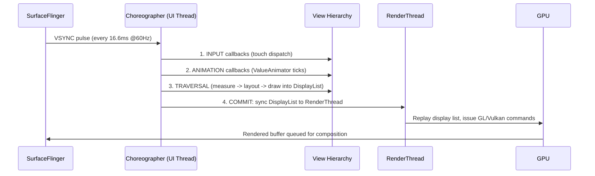

**Where frames are actually lost:**

| Symptom | Likely Phase | Diagnosis Tool |
|---|---|---|
| Stutter while scrolling a list | `onBindViewHolder` doing IO or heavy work | Systrace / Perfetto `RV OnBindView` slice |
| Stutter on first display of a screen | Layout inflation on the UI thread | `Choreographer` skipped-frames log, Perfetto `inflate` slice |
| Periodic hitches, no obvious cause | GC pauses from per-frame allocation | Memory Profiler allocation tracking |
| Slow overall but even | Overdraw — same pixel painted many times | Developer Options → Debug GPU Overdraw |
| Hitch only on the very first run | JIT compiling cold code | Macrobenchmark + Baseline Profiles |

### Code Example
```kotlin
// Measure real jank in a debug build using JankStats (androidx.metrics)
class JankReporter(activity: Activity) {
    init {
        JankStats.createAndTrack(activity.window) { frameData ->
            if (frameData.isJank) {
                // states carry the contextual name you attached, e.g. which screen was on-screen
                Log.w("Jank", "dropped frame ${frameData.frameDurationUiNanos / 1_000_000}ms " +
                        "states=${frameData.states}")
            }
        }
    }
}

// Attribute jank to a specific screen so reports are actionable
val holder = PerformanceMetricsState.getHolderForHierarchy(rootView)
holder.state?.putState("Screen", "ProductDetail")

// RecyclerView tuning that removes the most common causes of scroll jank
recyclerView.apply {
    setHasFixedSize(true)            // Skips full-hierarchy requestLayout when item count changes
    setItemViewCacheSize(8)          // Larger cache = fewer rebinds on short scroll-backs
    // Share the pool across pages of a ViewPager so nested lists do not re-inflate
    setRecycledViewPool(sharedPool)
}
```

```bash
# Objective frame-timing data from a real device, no instrumentation required
adb shell dumpsys gfxinfo com.example.app framestats
adb shell dumpsys gfxinfo com.example.app          # Janky-frame percentage + 50/90/95/99th percentiles
```

### Common Pitfalls
* **Optimizing by feel.** Always confirm the phase with Perfetto before changing code.
* **Assuming 60 Hz.** Modern devices run 90/120/144 Hz, cutting the budget to 8.3 ms or less. Read `Display.getRefreshRate()` rather than hardcoding.
* **Heavy work in `onBindViewHolder`.** It runs on the UI thread inside the frame. Date formatting, string building, and image decoding all belong off it.
* **Deep hierarchies.** Each nesting level multiplies measure passes, and `RelativeLayout`/weighted `LinearLayout` measure children twice.

---
# 4. Jetpack Architecture & State Management

## 4.1 Modern Architecture (MVVM / MVI)

* **MVVM (Model-View-ViewModel):** Exposes UI state from the ViewModel using observables (LiveData, Flow). The View binds to these states and updates automatically.
* **MVI (Model-View-Intent):** Enforces unidirectional data flow (UDF). The View sends UI "Intents" (actions) to a processor, which updates a single immutable State object, which is then emitted back to the View.

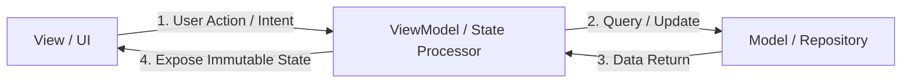

---

## 4.2 ViewModel & SavedStateHandle

### Definition
A **ViewModel** is a Jetpack Architecture Component designed to store and manage UI-related data in a lifecycle-conscious way.

### How ViewModel Works Internally
During configuration changes (e.g., screen rotation), the system destroys the Activity instance. However, the `ViewModelStore` holding the ViewModels is retained.

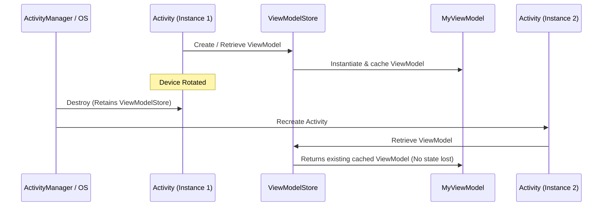

1. The `ViewModelProvider` retrieves ViewModels from a `ViewModelStore` associated with the activity or fragment (`ViewModelStoreOwner`).
2. When the activity is destroyed due to configuration changes, `Activity.onDestroy()` is called, but the `ViewModelStore` instance is preserved inside `NonConfigurationInstances`.
3. When the activity is recreated, the new activity instance attaches to the existing `ViewModelStore` and retrieves the identical ViewModel instance.
4. When the activity is closed permanently (finished), the system clears the `ViewModelStore` and calls `onCleared()` on the ViewModels to release resources.

### SavedStateHandle
When an application process is killed in the background by the OS to reclaim memory (Process Death), ViewModels are destroyed. `SavedStateHandle` allows saving and restoring state across process death using a key-value map.

---

## 4.3 State Holders: LiveData vs. StateFlow vs. SharedFlow

### Definitions
* **LiveData:** An active, lifecycle-aware observable data holder. It always updates observers on the main thread and only when they are in an active state (`STARTED` or `RESUMED`).
* **StateFlow:** A hot Flow from Kotlin Coroutines that represents a state-holding stream. It always holds a value, requires an initial value, and emits the latest state to new collectors (conflation).
* **SharedFlow:** A hot Flow that does not require an initial value and is optimized for emitting event streams (like toast messages, navigation events) to multiple collectors.

### Comparison Table

| Feature | LiveData | StateFlow | SharedFlow |
|---|---|---|---|
| **Lifecycle Aware** | Yes (Built-in) | No (Requires `repeatOnLifecycle`) | No (Requires `repeatOnLifecycle`) |
| **Initial Value** | Not required | Required | Not required |
| **Hot/Cold Stream** | Hot | Hot | Hot |
| **Threading** | Tied to Main Thread | Coroutine Dispatcher flexible | Coroutine Dispatcher flexible |
| **Conflation** | Yes (emits only latest value) | Yes (emits only latest value) | Optional (configurable replay buffer) |
| **Reactive Operators** | Limited | Rich (Kotlin Flow APIs) | Rich (Kotlin Flow APIs) |

### Modern Safe Flow Collection
To collect Flows safely in Android, use `repeatOnLifecycle` or `flowWithLifecycle` to prevent resource waste when the UI is in the background.

```kotlin
class UserActivity : AppCompatActivity() {
    private val viewModel: UserViewModel by viewModels()
    private lateinit var textView: TextView

    override fun onCreate(savedInstanceState: Bundle?) {
        super.onCreate(savedInstanceState)
        setContentView(R.layout.activity_main)

        // Safe Flow collection
        lifecycleScope.launch {
            repeatOnLifecycle(Lifecycle.State.STARTED) {
                viewModel.uiState.collect { state ->
                    textView.text = state.userName
                }
            }
        }
    }
}
```

---

## 4.4 Lifecycle-Aware Components

### Definition
* **Simple:** Classes that observe an Activity or Fragment lifecycle and start/stop themselves automatically, so you never forget to clean up.
* **Advanced:** `LifecycleOwner` exposes a `Lifecycle` state machine (`INITIALIZED → CREATED → STARTED → RESUMED → DESTROYED`). `LifecycleObserver`s registered on it receive state transitions and can move work into the correct window without the host writing manual callbacks.

### Why It Is Used
It inverts the dependency: instead of an Activity remembering to call `start()` and `stop()` on five collaborators, each collaborator owns its own lifecycle rules. This removes the single most common leak source in Android — forgotten teardown.

### How It Works Internally
* `LifecycleRegistry` holds the current state and dispatches events. `ComponentActivity` and `Fragment` install a `ReportFragment` (or direct callbacks on newer APIs) to feed it.
* `lifecycleScope` is a `CoroutineScope` bound to the registry; it is cancelled at `ON_DESTROY`.
* `repeatOnLifecycle(STARTED)` **suspends** until the state is reached, runs its block in a new coroutine, cancels that coroutine on the way below `STARTED`, and restarts it on the way back up. `flowWithLifecycle` is the single-flow shorthand.

**Critical distinction in Fragments:**

| Owner | Lifetime | Use For |
|---|---|---|
| `this` (the Fragment) | Fragment instance — survives back stack | Non-view work; **leaks views if used for UI collection** |
| `viewLifecycleOwner` | `onCreateView` → `onDestroyView` | **All UI observation and Flow collection** |

A Fragment on the back stack is destroyed as a view but alive as an instance. Collecting with `this` means the old, detached view keeps receiving updates and is retained — the classic Fragment leak.

### Code Example
```kotlin
// A self-managing component: no start/stop calls anywhere in the Activity
class LocationTracker(
    private val client: FusedLocationProviderClient,
    private val onLocation: (Location) -> Unit
) : DefaultLifecycleObserver {

    private val callback = object : LocationCallback() {
        override fun onLocationResult(result: LocationResult) {
            result.lastLocation?.let(onLocation)
        }
    }

    @SuppressLint("MissingPermission")
    override fun onStart(owner: LifecycleOwner) {
        client.requestLocationUpdates(request, callback, Looper.getMainLooper())
    }

    override fun onStop(owner: LifecycleOwner) {
        client.removeLocationUpdates(callback)   // Guaranteed cleanup, symmetric with onStart
    }
}

class MapActivity : AppCompatActivity() {
    override fun onCreate(savedInstanceState: Bundle?) {
        super.onCreate(savedInstanceState)
        // One line replaces two manual callbacks and the bug of forgetting one of them
        lifecycle.addObserver(LocationTracker(locationClient, ::renderMarker))
    }
}

// Correct Flow collection in a Fragment
class ProfileFragment : Fragment(R.layout.fragment_profile) {
    private val viewModel: ProfileViewModel by viewModels()
    private var binding: FragmentProfileBinding? = null

    override fun onViewCreated(view: View, savedInstanceState: Bundle?) {
        binding = FragmentProfileBinding.bind(view)

        // viewLifecycleOwner, NOT `this` — otherwise the back-stacked view leaks
        viewLifecycleOwner.lifecycleScope.launch {
            viewLifecycleOwner.repeatOnLifecycle(Lifecycle.State.STARTED) {
                // Multiple independent collectors each need their own launch
                launch { viewModel.uiState.collect(::render) }
                launch { viewModel.events.collect(::handleEvent) }
            }
        }
    }

    override fun onDestroyView() {
        super.onDestroyView()
        binding = null                     // Release the view reference the Fragment instance holds
    }
}

// Process-wide foreground/background detection (app-level, not per-Activity)
class App : Application() {
    override fun onCreate() {
        super.onCreate()
        ProcessLifecycleOwner.get().lifecycle.addObserver(object : DefaultLifecycleObserver {
            override fun onStart(owner: LifecycleOwner) = Analytics.appForegrounded()
            override fun onStop(owner: LifecycleOwner) = Analytics.appBackgrounded()
        })
    }
}
```

### Common Pitfalls
* **Collecting with `lifecycleScope.launch { flow.collect {} }` and no `repeatOnLifecycle`.** The collection keeps running while the app is backgrounded, wasting CPU and network and potentially touching a destroyed view.
* **Nesting `repeatOnLifecycle` blocks per flow.** One block, several inner `launch`es, is cheaper and clearer.
* **Using `this` instead of `viewLifecycleOwner`** in a Fragment — the leak this API exists to prevent.
* **Doing work in `ON_CREATE` that needs a window.** Insets and window size are not final until `ON_START` at the earliest.

---

## 4.5 Navigation Component and Type-Safe Arguments

### Definition
* **Simple:** A library that models your app's screens and the paths between them as a graph, and handles the back stack for you.
* **Advanced:** `NavController` owns a `NavBackStackEntry` stack, where each entry is itself a `LifecycleOwner`, `ViewModelStoreOwner`, and `SavedStateRegistryOwner`. Destinations are resolved from an inflated `NavGraph`.

### Why It Is Used
It centralizes back-stack rules, makes deep links declarative, enforces type-safe arguments at compile time, and gives each destination a scoped `ViewModelStore` — so a multi-screen flow can share one ViewModel that dies when the flow ends.

### How It Works Internally
* Each `NavBackStackEntry` gets its own `ViewModelStore`, cleared when that entry is popped. This is how graph-scoped ViewModels work.
* Safe Args (XML graphs) or Kotlin Serialization (Navigation 2.8+) generates argument classes at compile time, so a missing or mistyped argument fails the build rather than throwing at runtime.
* Results between destinations flow through the **previous** entry's `SavedStateHandle`, which is why the result survives process death.

### Code Example
```kotlin
// Navigation 2.8+ type-safe routes — no string route parsing at all
@Serializable data object ProductList
@Serializable data class ProductDetail(val productId: Long, val referrer: String? = null)

@Composable
fun AppNavHost(navController: NavHostController) {
    NavHost(navController, startDestination = ProductList) {
        composable<ProductList> {
            ProductListScreen(
                onProductClick = { id -> navController.navigate(ProductDetail(id, referrer = "list")) }
            )
        }
        composable<ProductDetail> { entry ->
            // Compile-time typed; a signature change breaks the build, not production
            val args: ProductDetail = entry.toRoute()
            ProductDetailScreen(productId = args.productId)
        }
    }
}

// ViewModel reads the same typed args straight from SavedStateHandle
@HiltViewModel
class ProductDetailViewModel @Inject constructor(
    savedState: SavedStateHandle,
    repo: ProductRepository
) : ViewModel() {
    private val args = savedState.toRoute<ProductDetail>()
    val product = repo.observeProduct(args.productId)
        .stateIn(viewModelScope, SharingStarted.WhileSubscribed(5_000), null)
}
```

```kotlin
// Back-stack control: pop up to a destination so the user cannot return to the login flow
navController.navigate(Home) {
    popUpTo(Login) { inclusive = true }
    launchSingleTop = true            // Avoid stacking duplicates of the same destination
}

// Returning a result to the previous screen (survives process death via SavedStateHandle)
// Producer:
navController.previousBackStackEntry
    ?.savedStateHandle?.set("selected_address_id", addressId)
navController.popBackStack()

// Consumer, observed on the current entry:
val id = navController.currentBackStackEntry
    ?.savedStateHandle
    ?.getStateFlow<Long?>("selected_address_id", null)
    ?.collectAsStateWithLifecycle()
```

### Common Pitfalls
* **Navigating twice on a fast double tap** throws or pushes a duplicate. Guard with `launchSingleTop`, or check `currentDestination?.id == expectedId` before navigating.
* **Passing large objects as arguments.** Arguments are serialized into a Bundle bounded by the Binder limit. Pass an ID and re-fetch.
* **Holding the `NavController` in a ViewModel.** It is a UI-scoped object; leaking it leaks the whole Activity. Emit navigation *events* from the ViewModel and let the UI act on them.
* **Navigating from a `LaunchedEffect` keyed on a state that recomposes.** The effect restarts and navigates repeatedly. Key it on a one-shot event, and consume the event after handling.

---

## 4.6 ViewBinding vs. DataBinding vs. findViewById

### Definition
* **ViewBinding:** Generates a binding class per XML layout containing typed, non-null references to every view with an ID.
* **DataBinding:** A superset that additionally parses `<layout>` expressions and binds data objects directly in XML, with optional two-way binding.
* **findViewById:** The legacy runtime lookup, returning a nullable, uncast `View`.

### Why It Is Used
`findViewById` fails at runtime for typos, wrong types, and views absent from the current configuration's layout. ViewBinding turns all three into compile errors at essentially zero cost.

### How It Works Internally
* ViewBinding runs at compile time as part of the resource pipeline. It walks each layout, emits a class with one field per ID, and marks a field nullable when the view exists only in some configuration variants of the layout.
* DataBinding additionally runs an annotation processor, generates expression-evaluation code, and installs listeners for `Observable` fields. This is why it materially increases build time.

| | findViewById | ViewBinding | DataBinding |
|---|---|---|---|
| **Null safety** | No | Yes | Yes |
| **Type safety** | No (manual cast) | Yes | Yes |
| **Build-time cost** | None | Negligible | Significant (kapt/KSP) |
| **Logic in XML** | No | No | Yes (a drawback for testability) |
| **Two-way binding** | No | No | Yes |
| **Google's current recommendation** | Avoid | **Use this** | Only for existing code |

### Code Example
```kotlin
// Activity: bind once, keep the reference for the Activity's lifetime
class MainActivity : AppCompatActivity() {
    private lateinit var binding: ActivityMainBinding

    override fun onCreate(savedInstanceState: Bundle?) {
        super.onCreate(savedInstanceState)
        binding = ActivityMainBinding.inflate(layoutInflater)
        setContentView(binding.root)
        binding.submitButton.setOnClickListener { viewModel.submit() }
    }
}

// Fragment: the binding must be nulled in onDestroyView or the view hierarchy leaks
class ProfileFragment : Fragment(R.layout.fragment_profile) {
    private var _binding: FragmentProfileBinding? = null
    private val binding get() = _binding!!     // Valid only between onCreateView and onDestroyView

    override fun onViewCreated(view: View, savedInstanceState: Bundle?) {
        _binding = FragmentProfileBinding.bind(view)
        binding.nameField.doAfterTextChanged { viewModel.onNameChanged(it.toString()) }
    }

    override fun onDestroyView() {
        super.onDestroyView()
        _binding = null
    }
}

// RecyclerView ViewHolder with ViewBinding
class UserViewHolder(private val binding: ItemUserBinding) : RecyclerView.ViewHolder(binding.root) {
    fun bind(user: User) {
        binding.name.text = user.name
        binding.avatar.load(user.avatarUrl)
    }
}
```

```gradle
android {
    buildFeatures {
        viewBinding = true      // Enable per module; costs nothing at runtime
    }
}
```

### Common Pitfalls
* **Leaking the Fragment binding** by holding it past `onDestroyView`. This is the single most common ViewBinding mistake. A `by viewBinding()` delegate that auto-clears is a worth-adopting pattern.
* **Assuming every field is non-null.** A view present only in `layout-land/` is generated as nullable; guard it.
* **Migrating to DataBinding for null safety alone.** ViewBinding gives that without the build cost or the untestable XML logic.

---
# 5. Threading, Concurrency & Reactive Streams

## 5.1 Kotlin Coroutines Internals

### Definition
Coroutines are light-weight execution threads that execute asynchronously and are non-blocking.

### Under the Hood: Suspension Points and State Machine
How does a coroutine pause execution without blocking the underlying thread?
* The Kotlin compiler transforms suspending functions into a **State Machine** using a **Continuation Passing Style (CPS)**.
* Every suspending function receives an extra parameter of type `Continuation<T>` at compile time.

```kotlin
// Source Code
suspend fun fetchUser(): User {
    val id = getUserId() // Suspending
    return apiService.getUserDetail(id) // Suspending
}

// Compiled Code (Simplified Concept)
fun fetchUser(completion: Continuation<Any?>): Any? {
    class FetchUserStateMachine : ContinuationImpl(completion) {
        var label = 0
        var result: Any? = null
        override fun invokeSuspend(result: Any?) {
            this.result = result
            this.label = this.label or Int.MIN_VALUE
            return fetchUser(this)
        }
    }
    
    val sm = completion as? FetchUserStateMachine ?: FetchUserStateMachine()
    switch(sm.label) {
        case 0:
            sm.label = 1
            val id = getUserId(sm) // Passes state machine as continuation
            if (id == COROUTINE_SUSPENDED) return COROUTINE_SUSPENDED
        case 1:
            sm.label = 2
            val user = apiService.getUserDetail(sm.result as String, sm)
            if (user == COROUTINE_SUSPENDED) return COROUTINE_SUSPENDED
            return user
    }
}
```
When a coroutine hits a suspension point, the function saves its local variables to the state machine, returns `COROUTINE_SUSPENDED`, and frees up the physical thread. Once the background process completes, the `Continuation` object calls `resumeWith()`, reloading the saved state and resuming execution at the correct label.

### Coroutine Scope and Dispatchers
* **`Dispatchers.Main`:** Executes on the main thread (uses Android Looper).
* **`Dispatchers.IO`:** Optimized for disk or network tasks (backed by a dynamic shared pool of threads).
* **`Dispatchers.Default`:** Optimized for CPU-intensive work (backed by a pool size equal to the CPU core count).

---

## 5.2 RxJava Reactive Streams

### Definition
RxJava is a library for composing asynchronous and event-based programs by using observable sequences.

* **Observable:** Emits a stream of data elements.
* **Observer:** Consumes emissions from the Observable.
* **Schedulers:** Controls concurrency (`Schedulers.io()`, `AndroidSchedulers.mainThread()`).
* **Disposable:** Represents the link between subscription and emissions. It must be cleared (`CompositeDisposable`) to prevent memory leaks when the UI is destroyed.

```kotlin
// RxJava Network Call Example
class UserRepository(private val apiService: ApiService) {
    private val disposables = CompositeDisposable()

    fun loadUserData() {
        disposables.add(
            apiService.getUserProfile()
                .subscribeOn(Schedulers.io()) // Run network request on IO thread
                .observeOn(AndroidSchedulers.mainThread()) // Receive on Main Thread
                .subscribe(
                    { profile -> updateUI(profile) },
                    { error -> handleError(error) }
                )
        )
    }

    fun clear() {
        disposables.clear() // Prevent memory leaks
    }
}
```

## 5.3 Handler, Looper, and MessageQueue Internals

### Definition
* **Simple:** Handlers and Loopers allow you to send messages between different threads, such as running a background task and sending the result back to update the main UI thread.
* **Advanced:** The Handler-Looper-MessageQueue framework is Android's native event-loop mechanism. It consists of a `MessageQueue` that stores serialized execution tasks, a `Looper` that continuously pulls tasks from the queue, and a `Handler` that posts or processes those tasks on the associated thread.

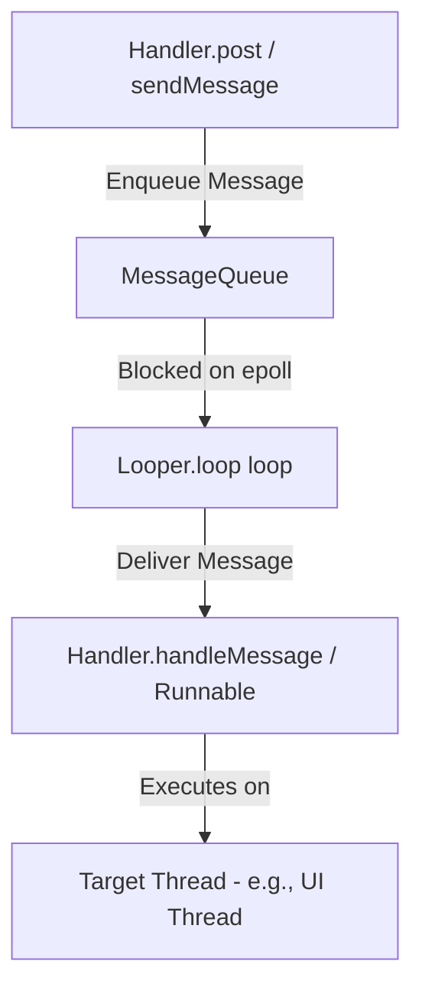

### How it Works Internally
1. **Thread Thread-Local Storage (TLS):** A thread must call `Looper.prepare()` (done automatically for the main thread by `ActivityThread`) to instantiate a `Looper` and bind it to the thread via `ThreadLocal`.
2. **The Event Loop (`Looper.loop()`):** Runs an infinite loop on the thread. It queries `MessageQueue.next()`.
3. **Linux epoll blocking:** To prevent the CPU from running at 100% load during idle states, `MessageQueue` blocks the thread using the Linux `epoll_wait` system call on a pipe file descriptor. The thread goes to sleep and is woken up by the kernel only when a new message is posted.
4. **Synchronization Barriers:** A synchronization barrier is a message with a null `target` (`msg.target == null`) injected into the queue. When the `MessageQueue` encounters a barrier, it suspends execution of all subsequent **synchronous** messages, but allows **asynchronous** messages (e.g., UI measurement and draw commands posted by the `Choreographer`) to pass through. This ensures layout traversals bypass background work, maintaining smooth UI rendering.

## 5.4 Advanced System Resource Management

### Binder Memory Mapping (mmap)
Binder enables Inter-Process Communication (IPC) by using `mmap()` to allocate a 1MB memory buffer in the receiving process's kernel address space. This allows data to be copied from the sender's process into the shared kernel buffer, which is then mapped into the recipient's virtual memory space, minimizing data copies between processes.

### LMK (Low Memory Killer) Score Allocation
The Android LMK uses `oom_adj` scores (now handled via `lmkd`) to decide which processes to kill. Processes are categorized by their importance:
* **Foreground:** High score, last to be killed.
* **Visible/Service/Background:** Lower scores, reclaimed when system pressure increases.
* **Empty:** Reclaimed first to free up memory for active tasks.

### ART Concurrent Copying (CC) GC
The ART (Android Runtime) uses a Concurrent Copying Garbage Collector. It moves objects during the "root scan" and "marking" phases while the application continues to run. By moving objects in the heap concurrently, it eliminates the need for a "Stop-the-World" pause, significantly reducing UI jank during GC cycles.

---

## 5.5 Structured Concurrency, Job Hierarchy, and Exception Handling

### Definition
* **Simple:** Every coroutine belongs to a parent scope. Cancelling the parent cancels all children, and no coroutine can outlive its scope.
* **Advanced:** Structured concurrency is enforced by the `Job` hierarchy in `CoroutineContext`. A child `Job` registers with its parent; cancellation propagates downward, and by default an uncaught failure propagates **upward**, cancelling siblings.

### Why It Is Used
It eliminates leaked background work. Without it, an Activity destroyed mid-request leaves a coroutine writing into a dead view. With it, `viewModelScope` cancellation is automatic and total.

### How It Works Internally

**Cancellation is cooperative.** `job.cancel()` only sets `isActive = false` and throws `CancellationException` at the next suspension point. A tight CPU loop with no suspension point ignores cancellation entirely — you must call `ensureActive()` or `yield()`.

**`Job` vs. `SupervisorJob`:**

| | `Job` (default) | `SupervisorJob` |
|---|---|---|
| Child fails | Cancels parent **and all siblings** | Only that child fails |
| Used by | `coroutineScope { }`, plain `launch` | `viewModelScope`, `lifecycleScope`, `supervisorScope { }` |
| Right for | All-or-nothing work (parallel decomposition) | Independent tasks (several screen sections loading) |

**Exception propagation differs by builder:**
* `launch` — throws immediately to the `CoroutineExceptionHandler`, or to the thread's default handler (crash) if none is installed.
* `async` — **stores** the exception in the `Deferred`. It surfaces only at `await()`. An `async` whose result is never awaited swallows its exception silently.
* `CoroutineExceptionHandler` works only on a **root** coroutine's context. Installing it on a child is a no-op; the exception has already gone up to the parent.

### Code Example
```kotlin
class DashboardViewModel(
    private val repo: Repository
) : ViewModel() {

    // Installed on the ROOT coroutine's context — a handler on a child would never fire
    private val handler = CoroutineExceptionHandler { _, throwable ->
        _state.update { it.copy(error = throwable.message) }
    }

    // Parallel decomposition: all three must succeed, so a plain coroutineScope is correct
    fun loadAll() = viewModelScope.launch(handler) {
        val page = coroutineScope {
            val user = async { repo.user() }
            val feed = async { repo.feed() }
            val ads  = async { repo.ads() }
            // If any fails, the other two are cancelled and the failure surfaces here
            DashboardPage(user.await(), feed.await(), ads.await())
        }
        _state.update { it.copy(page = page) }
    }

    // Independent sections: one failing must not blank the others
    fun loadIndependently() = viewModelScope.launch {
        supervisorScope {
            launch { runCatching { repo.user() }.onSuccess(::setUser).onFailure(::setUserError) }
            launch { runCatching { repo.feed() }.onSuccess(::setFeed).onFailure(::setFeedError) }
        }
    }

    // Cooperative cancellation in CPU-bound work
    suspend fun compress(frames: List<Frame>) = withContext(Dispatchers.Default) {
        frames.map { frame ->
            ensureActive()          // Throws CancellationException if the scope was cancelled
            encode(frame)           // Without this, cancellation is ignored until the loop ends
        }
    }

    // Cleanup that must survive cancellation
    suspend fun writeThenClose(data: ByteArray) {
        try {
            repo.upload(data)
        } finally {
            // A suspending call in `finally` after cancellation needs NonCancellable,
            // otherwise it throws CancellationException immediately and never runs.
            withContext(NonCancellable) { repo.releaseLock() }
        }
    }
}
```

### Common Pitfalls
* **Catching `Exception` around a suspending call.** `CancellationException` is an `Exception`; swallowing it breaks cancellation and can hang the scope. Rethrow it, or catch specific types, or use `runCatching` carefully (it also swallows it).
* **`GlobalScope.launch`.** No parent, never cancelled, leaks by construction. Use an injected scope with a `SupervisorJob` if you genuinely need app-lifetime work.
* **`async` without `await`.** The exception disappears. If you do not need the result, use `launch`.
* **`withContext(Dispatchers.IO)` inside a loop.** Each call is a context switch. Wrap the loop, not the body.

---

## 5.6 Kotlin Flow Operators in Practice

### Definition
A `Flow` is a cold asynchronous stream: nothing runs until a terminal operator collects it, and each collector gets its own independent execution.

### Why It Is Used
It replaces callback chains and RxJava for most Android work, integrates with structured concurrency (cancellation is free), and gives declarative operators for the debounce/retry/combine patterns that every real app needs.

### How It Works Internally
* **Cold vs. hot.** `flow { }` re-executes its builder per collector. `StateFlow`/`SharedFlow` are hot: they exist independently of collectors and share one emission stream.
* **Context preservation.** A `Flow` must emit in the context it was collected in. `withContext` inside `flow { }` violates this and throws; `flowOn` is the sanctioned way, and it affects only operators **upstream** of it.
* **`shareIn` / `stateIn`** convert a cold flow into a hot one. `SharingStarted.WhileSubscribed(5_000)` keeps the upstream alive for 5 seconds after the last collector leaves — long enough to survive a rotation, short enough not to waste resources.

**Operator selection table:**

| Need | Operator |
|---|---|
| Cancel the previous request when a new value arrives (search) | `flatMapLatest` |
| Run all requests concurrently, interleave results | `flatMapMerge` |
| Run requests strictly in order | `flatMapConcat` |
| Wait for typing to settle | `debounce` |
| Drop duplicate consecutive values | `distinctUntilChanged` |
| Merge two streams into one derived value | `combine` |
| Pair values one-to-one from two streams | `zip` |
| Retry with exponential backoff | `retryWhen` |
| Move upstream work to another dispatcher | `flowOn` |
| Emit a loading state before the data | `onStart` |
| Handle upstream errors without breaking the stream | `catch` |

### Code Example
```kotlin
class SearchViewModel(
    private val repo: SearchRepository,
    private val connectivity: ConnectivityObserver
) : ViewModel() {

    private val query = MutableStateFlow("")
    private val filters = MutableStateFlow(Filters.DEFAULT)

    @OptIn(ExperimentalCoroutinesApi::class, FlowPreview::class)
    val uiState: StateFlow<SearchUiState> =
        combine(query, filters) { q, f -> q to f }          // React to either input changing
            .debounce(300)                                   // Wait for typing to settle
            .distinctUntilChanged()                          // Ignore no-op re-emissions
            .flatMapLatest { (q, f) ->                       // Cancel the in-flight request
                if (q.length < 2) flowOf(SearchUiState.Idle)
                else repo.search(q, f)
                    .map { SearchUiState.Success(it) }
                    .onStart { emit(SearchUiState.Loading) }
                    .retryWhen { cause, attempt ->
                        // Retry transient IO failures up to 3 times with exponential backoff
                        val retryable = cause is IOException && attempt < 3
                        if (retryable) delay(1000L shl attempt.toInt())
                        retryable
                    }
                    .catch { emit(SearchUiState.Error(it.toUserMessage())) }
            }
            .flowOn(Dispatchers.IO)                          // Applies to everything UPSTREAM
            .stateIn(
                scope = viewModelScope,
                // Keeps the upstream alive across rotation, tears it down when truly gone
                started = SharingStarted.WhileSubscribed(5_000),
                initialValue = SearchUiState.Idle
            )

    fun onQueryChange(value: String) { query.value = value }
}

// Turning a callback API into a Flow, with guaranteed unregistration
fun ConnectivityManager.networkStatus(): Flow<Boolean> = callbackFlow {
    val callback = object : ConnectivityManager.NetworkCallback() {
        override fun onAvailable(network: Network) { trySend(true) }
        override fun onLost(network: Network) { trySend(false) }
    }
    registerDefaultNetworkCallback(callback)
    // awaitClose is MANDATORY in callbackFlow; omitting it throws at runtime
    awaitClose { unregisterNetworkCallback(callback) }
}.distinctUntilChanged()

// One-shot events (navigation, snackbars) must NOT be a StateFlow — replay would re-fire them
private val _events = Channel<UiEvent>(Channel.BUFFERED)
val events: Flow<UiEvent> = _events.receiveAsFlow()
```

### Common Pitfalls
* **Modelling one-shot events as `StateFlow`.** After a rotation the collector re-reads the current value and the navigation or snackbar fires again. Use a `Channel` + `receiveAsFlow`, or a state field the UI explicitly consumes.
* **`SharingStarted.Eagerly` on an expensive upstream.** It runs even with no collector, for the whole ViewModel lifetime.
* **`withContext` inside `flow { }`** throws `IllegalStateException: Flow invariant is violated`. Use `flowOn`.
* **`catch` placed after `stateIn`.** `catch` only sees exceptions from upstream; put it before the conversion.
* **`combine` firing on the very first emission of each source.** It waits for *all* sources to emit at least once, so a source with no initial value stalls the whole chain.

---

## 5.7 Java Concurrency Primitives on Android

### Definition
The JVM-level tools underneath coroutines: `Thread`, `ExecutorService`, `synchronized`, `volatile`, and the atomic classes.

### Why It Is Used
Coroutines run on thread pools built from these primitives. Interviewers ask about them because memory-visibility bugs are invisible in testing and catastrophic in production, and because legacy Android code and third-party SDKs still use them directly.

### How It Works Internally

**The Java Memory Model problem.** Each CPU core has its own cache. Without a synchronization action, a write by thread A may never become visible to thread B — the value can sit in a core's store buffer indefinitely. This is not theoretical; it reproduces reliably on ARM, which has a weaker memory model than x86.

| Primitive | Guarantees | Does NOT Guarantee |
|---|---|---|
| `volatile` | Visibility + ordering (happens-before on read/write) | **Atomicity** — `count++` is still a race |
| `synchronized` | Visibility + ordering + mutual exclusion | Fairness; also risks deadlock |
| `AtomicInteger` | Visibility + atomic read-modify-write via CAS | Atomicity across *multiple* variables |
| `@Volatile` + double-check | Correct lazy singleton | Anything on its own |

**Executor sizing:**

| Workload | Pool | Rationale |
|---|---|---|
| CPU-bound | `newFixedThreadPool(numCores)` | More threads only add context switches |
| IO-bound | Large or cached pool (coroutines: `Dispatchers.IO`, 64 threads) | Threads spend their time blocked, not computing |
| Sequential ordering required | `newSingleThreadExecutor()` | Implicit mutual exclusion, no locks needed |

### Code Example
```kotlin
// Thread-safe lazy singleton: @Volatile is required, not optional.
// Without it, another thread can observe a NON-NULL reference to a PARTIALLY constructed object,
// because the constructor's field writes may be reordered after the reference assignment.
class AnalyticsClient private constructor(context: Context) {
    companion object {
        @Volatile private var instance: AnalyticsClient? = null

        fun get(context: Context): AnalyticsClient =
            instance ?: synchronized(this) {
                instance ?: AnalyticsClient(context.applicationContext).also { instance = it }
            }
    }
}

// Kotlin's idiomatic equivalent — LazyThreadSafetyMode.SYNCHRONIZED is the default
val analytics: AnalyticsClient by lazy { AnalyticsClient(appContext) }

// volatile does NOT make compound operations atomic
class Counter {
    @Volatile var wrong = 0            // wrong++ is read-modify-write: still races
    private val right = AtomicInteger(0)

    fun incrementWrong() { wrong++ }                  // BUG: lost updates under contention
    fun incrementRight() { right.incrementAndGet() }  // Correct: single CAS instruction
}

// Executor with a named factory so thread names are readable in a stack trace / ANR log
val ioExecutor: ExecutorService = ThreadPoolExecutor(
    4, 16, 60L, TimeUnit.SECONDS,
    LinkedBlockingQueue(),
    ThreadFactory { r -> Thread(r, "app-io-${counter.getAndIncrement()}").apply { isDaemon = true } }
)

// Bridging a legacy callback API into coroutines
suspend fun LegacySdk.fetchToken(): String = suspendCancellableCoroutine { cont ->
    val call = requestToken(object : TokenCallback {
        override fun onSuccess(token: String) = cont.resume(token)
        override fun onError(e: Throwable) = cont.resumeWithException(e)
    })
    // Without this, cancelling the coroutine leaves the SDK call running
    cont.invokeOnCancellation { call.cancel() }
}
```

### Common Pitfalls
* **Assuming `volatile` makes `++` safe.** It does not. Use `AtomicInteger` or a lock.
* **Deadlock from nested locks acquired in different orders.** Establish a global lock ordering, or avoid holding two locks at once.
* **`synchronized` on the main thread.** If the lock is held by a slow background thread, the UI blocks and you get an ANR.
* **Unbounded thread creation.** Each thread costs ~1 MB of stack. A `Thread { }` per request exhausts memory under load.
* **Forgetting `invokeOnCancellation`** when wrapping a callback API — the coroutine cancels but the underlying work keeps running.

---
# 6. Data Storage & Networking

## 6.1 Room Database Architecture

Room is a Jetpack data storage component providing an abstraction layer over SQLite.

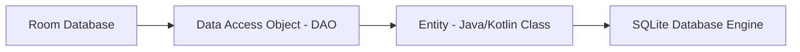

### Components
1. **Entity:** Represents a table within the database. Annotations like `@Entity` and `@PrimaryKey` map properties to columns.
2. **DAO (Data Access Object):** Contains methods used for querying, inserting, and deleting data. Room validates SQL queries in DAOs at compile time.
3. **RoomDatabase:** Serves as the database controller and main access point to the connection.

### Migration Mechanics
When you modify database tables, you must increment the database version and provide a `Migration` implementation to avoid app crashes.

```kotlin
val MIGRATION_1_2 = object : Migration(1, 2) {
    override fun migrate(db: SupportSQLiteDatabase) {
        // Execute SQL statement to modify schema
        db.execSQL("ALTER TABLE User ADD COLUMN age INTEGER NOT NULL DEFAULT 0")
    }
}

// Room Database Builder
Room.databaseBuilder(context, AppDatabase::class.java, "app-db")
    .addMigrations(MIGRATION_1_2)
    .build()
```

---

## 6.2 SharedPreferences vs. DataStore

### Comparison Table

| Feature | SharedPreferences | Jetpack DataStore (Preferences/Proto) |
|---|---|---|
| **API Style** | Synchronous (blocking calls) | Asynchronous API (uses Kotlin Coroutines & Flow) |
| **Thread Safety** | No (unsafe modifications from background) | Yes (safe to call from UI/background threads) |
| **Exception Handling** | Throws runtime exceptions on parser errors | Catchable input/output exceptions |
| **Transaction support** | No | Yes (transactional data updates via `DataStore`) |
| **Type Safety** | No | Yes (Proto DataStore) |

---

## 6.3 Networking Stack (Retrofit & OkHttp)

* **Retrofit:** A type-safe HTTP client library that maps HTTP API endpoints directly to Kotlin/Java interfaces.
* **OkHttp:** The underlying client engine that handles socket connections, requests execution, connection pooling, and payload compression.

### The Interceptor Pipeline
OkHttp passes outbound requests and inbound responses through a chain of interceptors:

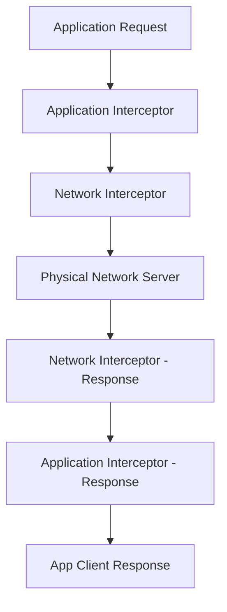

* **Application Interceptor:** Runs at the top level. Always called once, even if the response is served from the cache. Ideal for adding custom headers.
* **Network Interceptor:** Runs between OkHttp and the physical network. Allows monitoring redirects and raw headers traveling over the wire.

```kotlin
// Custom Auth Interceptor
class AuthInterceptor(private val tokenProvider: TokenProvider) : Interceptor {
    override fun intercept(chain: Interceptor.Chain): Response {
        val originalRequest = chain.request()
        val authenticatedRequest = originalRequest.newBuilder()
            .header("Authorization", "Bearer ${tokenProvider.getToken()}")
            .build()
        return chain.proceed(authenticatedRequest)
    }
}
```

---

## 6.4 JSON Serialization: kotlinx.serialization vs. Moshi vs. Gson

### Definition
Converting between network JSON and Kotlin objects. The three viable libraries differ in *when* they build their adapters — compile time or runtime — and in whether they understand Kotlin's type system.

### Why It Is Used
Gson predates Kotlin and uses `sun.misc.Unsafe` to bypass constructors entirely. It will happily hand you an object whose non-null `String` field is `null`, producing a `NullPointerException` far from the parse site. This is the single most common source of "impossible" crashes in Kotlin Android apps.

### How It Works Internally

| | kotlinx.serialization | Moshi (with codegen) | Gson |
|---|---|---|---|
| **Adapter generation** | Compiler plugin, compile time | KSP, compile time | Reflection, runtime |
| **Kotlin null safety** | Fully enforced | Fully enforced | **Broken** — bypasses constructors |
| **Default values honored** | Yes | Yes | No (fields left null) |
| **Reflection at runtime** | None | None (codegen mode) | Heavy |
| **Multiplatform** | Yes | No | No |
| **Verdict** | Default choice for new code | Excellent, JVM-only | Legacy only |

**Why Gson breaks null safety:** it allocates the instance via `Unsafe.allocateInstance`, skipping the Kotlin-generated constructor that performs null checks and applies defaults. A missing JSON field therefore leaves a `String` (not `String?`) holding `null`.

### Code Example
```kotlin
// kotlinx.serialization — the compiler plugin generates the serializer at build time
@Serializable
data class UserDto(
    val id: Long,
    @SerialName("full_name") val fullName: String,      // Map JSON snake_case to Kotlin camelCase
    val email: String? = null,                          // Explicitly optional
    val role: Role = Role.MEMBER,                       // Default applied when the field is absent
    @Transient val localOnly: Boolean = false           // Never serialized
)

@Serializable
enum class Role {
    @SerialName("admin") ADMIN,
    @SerialName("member") MEMBER
}

val json = Json {
    ignoreUnknownKeys = true      // ESSENTIAL: a new server field must not crash old clients
    explicitNulls = false         // Omit nulls when writing, rather than emitting "field": null
    coerceInputValues = true      // Fall back to the default when the server sends null for a non-null field
}
```

```kotlin
// Wiring it into Retrofit
val retrofit = Retrofit.Builder()
    .baseUrl(BASE_URL)
    .addConverterFactory(json.asConverterFactory("application/json".toMediaType()))
    .client(okHttpClient)
    .build()
```

```kotlin
// Polymorphic responses — a common real-world API shape
@Serializable
sealed interface Notification {
    @Serializable @SerialName("message")
    data class Message(val from: String, val body: String) : Notification

    @Serializable @SerialName("friend_request")
    data class FriendRequest(val userId: Long) : Notification
}
// Reads: { "type": "message", "from": "alice", "body": "hi" }
// The discriminator key defaults to "type"; override with Json { classDiscriminator = "kind" }
```

```kotlin
// DTO -> domain mapping keeps network shape changes out of the rest of the app
fun UserDto.toDomain(): User = User(
    id = id,
    name = fullName,
    email = email.orEmpty(),
    isAdmin = role == Role.ADMIN
)
```

### Common Pitfalls
* **Not setting `ignoreUnknownKeys = true`.** The first field the backend adds crashes every deployed client.
* **Using DTOs as domain models.** Every backend rename then ripples through the UI. Map at the repository boundary.
* **Keeping Gson while migrating to Kotlin** and blaming the resulting NPEs on "flaky data".
* **Forgetting R8 keep rules.** Reflection-based parsers need `-keep` rules for model classes; kotlinx.serialization ships its own rules but needs `@Serializable` on every model.

---

## 6.5 Image Loading: Coil and Glide

### Definition
Libraries that fetch, decode, downsample, cache, and bind images into views or composables, cancelling the work when the target is recycled.

### Why It Is Used
Naïvely decoding a 4000×3000 JPEG into a 300 dp `ImageView` allocates ~48 MB and reliably produces `OutOfMemoryError`. Image loaders downsample to the target's actual size, cache at two levels, and cancel in-flight requests when a `RecyclerView` row is recycled.

### How It Works Internally

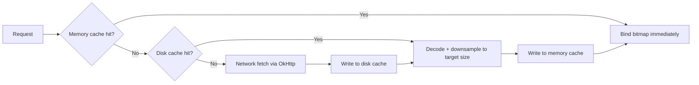

* **Memory cache** — an `LruCache` sized as a fraction of the app heap, holding decoded bitmaps.
* **Disk cache** — the compressed bytes, keyed by URL plus transformations, surviving process death.
* **Downsampling** — `BitmapFactory.Options.inSampleSize` is computed from the target view's measured size, so memory scales with display size, not source size.
* **Lifecycle cancellation** — Coil ties requests to the `LifecycleOwner` resolved from the context; Glide ties them to a `RequestManager` in a hidden retained Fragment.

| | Coil 3 | Glide |
|---|---|---|
| Language | Kotlin, coroutine-based | Java |
| Compose support | First-class (`AsyncImage`) | Via an accompanist-style wrapper |
| Multiplatform | Yes (Coil 3) | No |
| Size added to APK | ~250 KB | ~1 MB (with annotation processor) |

### Code Example
```kotlin
// Coil in Compose
@Composable
fun Avatar(url: String, modifier: Modifier = Modifier) {
    AsyncImage(
        model = ImageRequest.Builder(LocalContext.current)
            .data(url)
            .crossfade(true)
            .memoryCacheKey(url)                 // Explicit key when the URL carries volatile params
            .build(),
        contentDescription = null,               // null = decorative; set real text for meaningful images
        placeholder = painterResource(R.drawable.avatar_placeholder),
        error = painterResource(R.drawable.avatar_error),
        contentScale = ContentScale.Crop,
        modifier = modifier.size(48.dp).clip(CircleShape)
    )
}

// Coil in a RecyclerView — the extension cancels the previous request on the same view automatically
class UserViewHolder(private val binding: ItemUserBinding) : RecyclerView.ViewHolder(binding.root) {
    fun bind(user: User) {
        binding.avatar.load(user.avatarUrl) {
            placeholder(R.drawable.avatar_placeholder)
            transformations(CircleCropTransformation())
        }
    }
}

// Application-scoped loader sharing the app's OkHttpClient (one connection pool, one cache)
class App : Application(), SingletonImageLoader.Factory {
    override fun newImageLoader(context: PlatformContext): ImageLoader =
        ImageLoader.Builder(context)
            .memoryCache {
                MemoryCache.Builder()
                    .maxSizePercent(context, 0.25)   // 25% of the app heap
                    .build()
            }
            .diskCache {
                DiskCache.Builder()
                    .directory(context.cacheDir.resolve("image_cache"))
                    .maxSizeBytes(100L * 1024 * 1024)
                    .build()
            }
            .build()
}
```

### Common Pitfalls
* **Loading a full-resolution image into a small view** with a hand-rolled `BitmapFactory.decodeStream`. Always downsample.
* **Forgetting to cancel on recycle** in a hand-rolled loader — the wrong image flashes into a recycled row.
* **Caching images that contain personal data** in the shared cache directory without considering that other processes on a rooted device can read it.
* **Setting a `contentDescription` of `""` on a meaningful image.** Screen-reader users lose the content entirely.

---

## 6.6 Caching Strategy and Offline-First Architecture

### Definition
* **Simple:** Store data locally so the app works without a network and feels instant, then reconcile with the server.
* **Advanced:** Designate the local database as the **single source of truth**. The UI observes the database only; the network layer writes into the database and never into the UI.

### Why It Is Used
Network-first apps show spinners on every screen and break entirely offline. Offline-first apps render instantly from cache, degrade gracefully, and are dramatically easier to test because the UI has one input.

### How It Works Internally

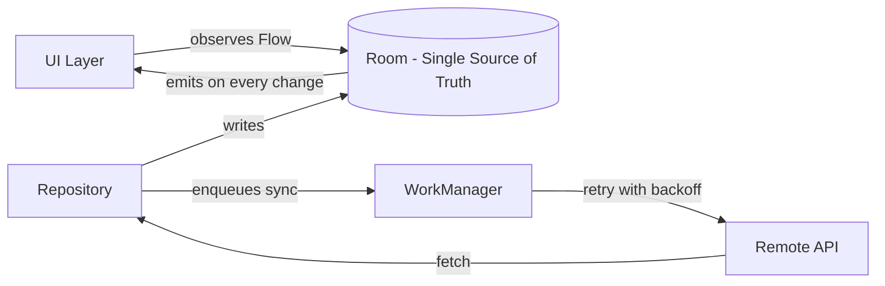

**HTTP cache layer (OkHttp).** Separate from your database cache, and controlled by response headers:

| Header | Effect |
|---|---|
| `Cache-Control: max-age=60` | Served from cache without a network call for 60 s |
| `Cache-Control: no-cache` | Cached, but revalidated with `If-None-Match` every time |
| `ETag` / `If-None-Match` | Server replies `304 Not Modified`, saving the body transfer |
| `Cache-Control: only-if-cached` | Forces a cache read; fails with `504` when absent — the offline path |

### Code Example
```kotlin
// Repository with the database as the single source of truth
class ArticleRepository @Inject constructor(
    private val dao: ArticleDao,
    private val api: ArticleApi,
    private val scope: CoroutineScope
) {
    // The UI observes ONLY this. It emits cached data instantly, then again after the refresh lands.
    fun observeArticles(): Flow<List<Article>> = dao.observeAll().map { it.map(ArticleEntity::toDomain) }

    // Explicit refresh returns a Result so the UI can show an error banner
    // WITHOUT clearing the content already on screen.
    suspend fun refresh(): Result<Unit> = runCatching {
        val remote = api.fetchArticles()
        dao.upsertAll(remote.map { it.toEntity() })     // Emission to the UI happens automatically
    }.onFailure { if (it is CancellationException) throw it }
}

// ViewModel: content and refresh state are independent, which is what makes offline-first feel good
class ArticleListViewModel @Inject constructor(
    private val repo: ArticleRepository
) : ViewModel() {
    private val refreshing = MutableStateFlow(false)
    private val errors = MutableStateFlow<String?>(null)

    val uiState: StateFlow<ArticleUiState> =
        combine(repo.observeArticles(), refreshing, errors) { items, isRefreshing, error ->
            ArticleUiState(items = items, isRefreshing = isRefreshing, error = error)
        }.stateIn(viewModelScope, SharingStarted.WhileSubscribed(5_000), ArticleUiState())

    fun refresh() = viewModelScope.launch {
        refreshing.value = true
        repo.refresh().onFailure { errors.value = it.toUserMessage() }
        refreshing.value = false
    }
}
```

```kotlin
// OkHttp cache + an interceptor that falls back to stale data when offline
val client = OkHttpClient.Builder()
    .cache(Cache(File(context.cacheDir, "http"), 20L * 1024 * 1024))
    .addInterceptor { chain ->
        val request = if (connectivity.isOnline()) chain.request()
        else chain.request().newBuilder()
            // Accept cached responses up to 7 days old rather than failing outright
            .cacheControl(CacheControl.Builder().onlyIfCached().maxStale(7, TimeUnit.DAYS).build())
            .build()
        chain.proceed(request)
    }
    .build()
```

```kotlin
// Outbox pattern: writes made offline are queued and replayed by WorkManager
@Entity
data class PendingAction(
    @PrimaryKey(autoGenerate = true) val id: Long = 0,
    val type: String,
    val payload: String,
    val createdAt: Long = System.currentTimeMillis()
)

class SyncWorker(ctx: Context, params: WorkerParameters) : CoroutineWorker(ctx, params) {
    override suspend fun doWork(): Result {
        val pending = dao.pendingActions()
        pending.forEach { action ->
            when (val outcome = api.execute(action)) {
                is Ok -> dao.delete(action)
                is Retryable -> return Result.retry()      // Backoff, preserve remaining queue order
                is Fatal -> dao.delete(action)             // Drop poison messages, log for triage
            }
        }
        return Result.success()
    }
}
```

### Common Pitfalls
* **Clearing the list while refreshing.** Offline-first means keeping stale content visible and showing the refresh state separately.
* **Two sources of truth.** If the UI reads sometimes from network and sometimes from cache, the screen flickers between versions.
* **Unbounded cache growth.** Add a retention policy — delete rows older than N days on each successful sync.
* **Assuming `isOnline()` means reachable.** Captive portals report connectivity while blocking all traffic. Treat network failure as normal, not exceptional.

---

## 6.7 Error Handling and Result Modelling

### Definition
Representing success and the specific ways an operation can fail as data, rather than as thrown exceptions caught somewhere far away.

### Why It Is Used
An exception thrown at the network layer and caught in the ViewModel loses all type information — you end up matching on exception classes and string messages. A sealed result type makes every failure the compiler's problem and makes the `when` exhaustive.

### How It Works Internally
A sealed hierarchy gives the compiler a closed set of subtypes, so an unhandled case is a compile error. Combined with `data class`, error payloads can carry structured context (retry-after, field validation errors) that an exception message cannot.

### Code Example
```kotlin
// Domain-level result: the UI never sees an IOException or an HTTP code
sealed interface DataResult<out T> {
    data class Success<T>(val data: T) : DataResult<T>
    data class Failure(val error: AppError) : DataResult<Nothing>
}

sealed interface AppError {
    data object Offline : AppError
    data object Unauthorized : AppError
    data class Server(val code: Int) : AppError
    data class Validation(val fieldErrors: Map<String, String>) : AppError
    data class Unknown(val cause: Throwable) : AppError
}

// One place translates transport failures into domain errors
suspend fun <T> safeApiCall(block: suspend () -> T): DataResult<T> = try {
    DataResult.Success(block())
} catch (e: CancellationException) {
    throw e                                            // NEVER swallow cancellation
} catch (e: HttpException) {
    DataResult.Failure(
        when (e.code()) {
            401, 403 -> AppError.Unauthorized
            422 -> AppError.Validation(e.parseFieldErrors())
            else -> AppError.Server(e.code())
        }
    )
} catch (e: IOException) {
    DataResult.Failure(AppError.Offline)               // Includes timeouts and DNS failures
} catch (e: Throwable) {
    DataResult.Failure(AppError.Unknown(e))
}

// The UI maps errors to messages and actions — exhaustive, so a new error type breaks the build
fun AppError.toUiMessage(res: Resources): UiMessage = when (this) {
    AppError.Offline -> UiMessage(res.getString(R.string.err_offline), action = UiAction.Retry)
    AppError.Unauthorized -> UiMessage(res.getString(R.string.err_session), action = UiAction.SignIn)
    is AppError.Server -> UiMessage(res.getString(R.string.err_server, code), action = UiAction.Retry)
    is AppError.Validation -> UiMessage(fieldErrors.values.first(), action = UiAction.None)
    is AppError.Unknown -> UiMessage(res.getString(R.string.err_generic), action = UiAction.Retry)
}
```

### Common Pitfalls
* **Catching `Throwable` without rethrowing `CancellationException`.** This silently breaks structured concurrency.
* **Exposing `Throwable` to the UI layer.** The UI then formats raw exception messages, which leak internals to users.
* **Using Kotlin's built-in `Result<T>` across module boundaries.** It is a value class with restrictions on being returned from suspending functions in some positions, and it carries no domain typing. A custom sealed type is clearer.
* **One generic "Something went wrong".** Users cannot distinguish "you are offline" from "your session expired", and neither can your support team.

---
# 7. Background Execution & Pagination

## 7.1 WorkManager Internals

### Definition
WorkManager is the recommended background scheduler for deferrable, guaranteed background tasks that must run even if the app closes or the device restarts.

### How it Works Internally
WorkManager chooses the most efficient scheduling mechanism depending on the OS version and system states.

```mermaid
graph TD
    Request[WorkRequest Enqueued] --> CheckOS{Device API Level?}
    CheckOS -->|API >= 23| JobScheduler[JobScheduler API]
    CheckOS -->|API < 23| AlarmManager[AlarmManager + BroadcastReceiver]
    CheckOS -->|Constraint Check| Execution[Task Execution]
```

* Under the hood, it stores task metadata in a Room database file to ensure tasks survive device restarts.
* It uses **JobScheduler** on API 23+, and falls back to a custom configuration of **AlarmManager** + **BroadcastReceiver** on older devices.
* It monitors system constraints (battery charging, active Wi-Fi, storage availability) and schedules execution windows when all conditions are satisfied.

```kotlin
// Example Coroutine Worker
class CacheSyncWorker(
    context: Context,
    params: WorkerParameters
) : CoroutineWorker(context, params) {

    override suspend fun doWork(): Result {
        return try {
            // Perform background sync operation
            syncCacheData()
            Result.success()
        } catch (e: Exception) {
            if (runAttemptCount < 3) {
                Result.retry() // Reschedule work based on backoff policy
            } else {
                Result.failure()
            }
        }
    }
}
```

---

## 7.2 Paging 3 Architecture

The Paging 3 library helps load data in blocks as the user scrolls, optimizing memory and network bandwidth.

```mermaid
graph LR
    PagingSource[1. PagingSource] --> Pager[2. Pager Config]
    Pager --> PagingData[3. Flow / PagingData]
    PagingData --> Adapter[4. PagingDataAdapter]
    Adapter --> RecyclerView[5. RecyclerView UI]
```

1. **PagingSource:** Fetches incremental pages of data from a raw source (like a REST API or SQLite).
2. **RemoteMediator:** Coordinates loading data from the network into the database cache for offline usage.
3. **Pager:** Configures the paging parameters (like `pageSize`, `prefetchDistance`) and generates the `Flow<PagingData<Value>>`.
4. **PagingDataAdapter:** Integrates with the RecyclerView, displaying data elements and handling loading state callbacks automatically.

---

## 7.3 Choosing a Scheduler: WorkManager vs. AlarmManager vs. Foreground Service

### Definition
Android offers several ways to run work outside the current screen. Picking the wrong one is the difference between work that runs reliably and work the OS silently drops.

### Why It Is Used
Since Android 6 (Doze) the platform has aggressively suppressed background execution to protect battery. Each API survives a different set of restrictions, so the choice is a correctness decision, not a style preference.

### How It Works Internally

| API | Guaranteed? | Survives Reboot | Exact Timing | Correct Use Case |
|---|---|---|---|---|
| **WorkManager** | Yes — persisted in its own Room DB | Yes | No (deferrable) | Sync, upload, periodic cleanup, log shipping |
| **Foreground Service** | Yes, while it runs | No | Immediate & continuous | Music playback, navigation, active workout tracking |
| **AlarmManager (`setExactAndAllowWhileIdle`)** | Yes, but rate-limited | Needs `BOOT_COMPLETED` receiver | Yes | Alarm clock, medication reminder, calendar event |
| **`Coroutine` in `viewModelScope`** | No | No | Immediate | Work tied to a visible screen only |
| **`JobScheduler`** | Yes | Yes | No | Legacy — WorkManager wraps it |

**Decision rule:** if the user would notice the work not happening *right now*, it needs a foreground service. If the user would notice it not happening *at a specific wall-clock time*, it needs an exact alarm. Everything else is WorkManager.

**Exact alarms are now a permission.** On Android 12+ `SCHEDULE_EXACT_ALARM` is required, and on Android 13+ it is no longer auto-granted for most apps. Play restricts the `USE_EXACT_ALARM` permission to alarm clocks and calendar apps.

### Code Example
```kotlin
// WorkManager: constrained, unique, with exponential backoff
val syncRequest = PeriodicWorkRequestBuilder<SyncWorker>(6, TimeUnit.HOURS)
    .setConstraints(
        Constraints.Builder()
            .setRequiredNetworkType(NetworkType.UNMETERED)   // Wi-Fi only
            .setRequiresBatteryNotLow(true)
            .build()
    )
    .setBackoffCriteria(BackoffPolicy.EXPONENTIAL, 30, TimeUnit.SECONDS)
    .addTag("periodic-sync")
    .build()

WorkManager.getInstance(context).enqueueUniquePeriodicWork(
    "periodic-sync",
    // KEEP preserves the existing schedule across app restarts; UPDATE would reset the interval
    ExistingPeriodicWorkPolicy.KEEP,
    syncRequest
)

// Chained work: each stage runs only if the previous succeeded, and output flows forward
WorkManager.getInstance(context)
    .beginUniqueWork("upload-flow", ExistingWorkPolicy.REPLACE, compressRequest)
    .then(uploadRequest)
    .then(cleanupRequest)
    .enqueue()

// Expedited work: for user-initiated work that must start immediately.
// setExpedited is a REQUEST, not a guarantee — the OS grants a limited daily quota.
val urgent = OneTimeWorkRequestBuilder<SendMessageWorker>()
    .setExpedited(OutOfQuotaPolicy.RUN_AS_NON_EXPEDITED_WORK_REQUEST)
    .setInputData(workDataOf("message_id" to id))
    .build()
```

```kotlin
// Exact alarm, correct for Android 12+
fun scheduleReminder(context: Context, triggerAtMillis: Long, reminderId: Int) {
    val alarmManager = context.getSystemService(AlarmManager::class.java)

    // On API 31+ the user can revoke this at any time; check before every schedule
    if (Build.VERSION.SDK_INT >= Build.VERSION_CODES.S && !alarmManager.canScheduleExactAlarms()) {
        context.startActivity(Intent(Settings.ACTION_REQUEST_SCHEDULE_EXACT_ALARM))
        return
    }

    val pending = PendingIntent.getBroadcast(
        context, reminderId,
        Intent(context, ReminderReceiver::class.java).putExtra("id", reminderId),
        PendingIntent.FLAG_UPDATE_CURRENT or PendingIntent.FLAG_IMMUTABLE
    )

    // ...AllowWhileIdle is what makes it fire during Doze
    alarmManager.setExactAndAllowWhileIdle(AlarmManager.RTC_WAKEUP, triggerAtMillis, pending)
}
```

```xml
<!-- Alarms do not survive reboot on their own; re-register them -->
<uses-permission android:name="android.permission.RECEIVE_BOOT_COMPLETED" />
<receiver android:name=".BootReceiver" android:exported="false">
    <intent-filter>
        <action android:name="android.intent.action.BOOT_COMPLETED" />
    </intent-filter>
</receiver>
```

### Common Pitfalls
* **Using `AlarmManager` for periodic sync.** It wakes the device unnecessarily and drains battery; WorkManager batches work across apps.
* **Assuming `PeriodicWorkRequest` intervals are precise.** The minimum interval is 15 minutes and the OS may delay execution substantially. Never build a clock on it.
* **Not making work idempotent.** WorkManager can re-run a worker after a process kill. Running it twice must be harmless.
* **Passing large data through `Data`.** The `Data` object is capped at ~10 KB. Pass an ID and read from the database.
* **Forgetting `BOOT_COMPLETED`.** All exact alarms are cleared on reboot.

---

## 7.4 Doze, App Standby Buckets, and Battery Restrictions

### Definition
* **Doze:** When a device is stationary, unplugged, and screen-off for a while, the system enters maintenance windows and suspends network access, alarms, jobs, and wakelocks for all apps between them.
* **App Standby Buckets:** A per-app classification (API 28+) based on usage recency and frequency that determines how much background work the app is allowed.

### Why It Is Used
"It works on my phone but not on the user's" is almost always a Doze or bucket issue. Understanding the buckets explains why background work degrades over time for infrequently-opened apps.

### How It Works Internally

| Bucket | Assigned When | Job Quota | Alarm Quota |
|---|---|---|---|
| **Active** | App is in use right now | Unlimited | Unlimited |
| **Working set** | Used regularly | ~Every 2 hours | ~Every 2 hours |
| **Frequent** | Used often but not daily | ~Every 8 hours | ~Every 8 hours |
| **Rare** | Used infrequently | ~Every 24 hours | ~Every 24 hours |
| **Restricted** (API 30+) | Heavy background use, or user-set | ~Once per day | ~Once per day |

**Doze restrictions between maintenance windows:** no network access, deferred `AlarmManager` alarms (except `...AllowWhileIdle`), suspended jobs and syncs, ignored wakelocks, no Wi-Fi scans. High-priority FCM messages are the sanctioned way to break through.

**App Standby Buckets are per-device and adaptive** — you cannot set your own bucket, and users who rarely open your app will see background work throttled to near-nothing. Design for that rather than fighting it.

### Code Example
```bash
# Reproduce Doze and bucket behavior on a real device — this is the only reliable way to test it
adb shell dumpsys battery unplug
adb shell dumpsys deviceidle force-idle          # Force full Doze immediately
adb shell dumpsys deviceidle step                # Advance one Doze stage at a time
adb shell dumpsys deviceidle unforce             # Back to normal
adb shell dumpsys battery reset

# Inspect and force App Standby buckets
adb shell am get-standby-bucket com.example.app
adb shell am set-standby-bucket com.example.app rare
adb shell dumpsys usagestats | grep com.example.app
```

```kotlin
// Detect whether the user has excluded the app from battery optimization.
// Requesting this exemption is heavily restricted by Play policy — only ask when
// the core feature (alarm clock, sleep tracking) genuinely cannot work without it.
fun isIgnoringBatteryOptimizations(context: Context): Boolean {
    val pm = context.getSystemService(PowerManager::class.java)
    return pm.isIgnoringBatteryOptimizations(context.packageName)
}

// Also surface the case where the user has put the app in the Restricted bucket,
// which silently kills nearly all background work.
fun isBackgroundRestricted(context: Context): Boolean {
    val am = context.getSystemService(ActivityManager::class.java)
    return Build.VERSION.SDK_INT >= Build.VERSION_CODES.P && am.isBackgroundRestricted
}
```

### Common Pitfalls
* **Requesting `REQUEST_IGNORE_BATTERY_OPTIMIZATIONS` casually.** Play rejects apps that ask without an approved use case.
* **Testing only with the screen on and the device plugged in.** Doze never triggers, so the bug never appears in QA.
* **Vendor-specific killers.** Xiaomi, Huawei, Oppo, and others add their own aggressive process killing beyond AOSP. Test on those devices; direct users to the OEM's autostart settings when a feature genuinely requires it.

---

## 7.5 Firebase Cloud Messaging (FCM)

### Definition
Google's push delivery service. A message goes from your server to Google's FCM backend, which routes it to the device over a persistent connection maintained by Google Play services.

### Why It Is Used
It is the only way to wake an app that is not running, and the only sanctioned way to bypass Doze for time-critical delivery. One system-level connection serves all apps, so battery cost is shared.

### How It Works Internally

```mermaid
sequenceDiagram
    participant App as Your App
    participant FCM as FCM Backend
    participant Server as Your Server
    participant GPS as Play Services (device)

    App->>FCM: Request registration token
    FCM-->>App: token
    App->>Server: Upload token (associate with user)
    Server->>FCM: Send message (token or topic)
    FCM->>GPS: Deliver over the shared persistent socket
    GPS->>App: onMessageReceived / system tray notification
```

**Two message types, and the distinction matters enormously:**

| | Notification message | Data message |
|---|---|---|
| Payload key | `notification` | `data` |
| App in **foreground** | `onMessageReceived` called | `onMessageReceived` called |
| App in **background** | **Shown by the system tray; your code never runs** | `onMessageReceived` called |
| Customizable | Limited | Fully |
| Recommendation | Avoid for anything that needs logic | **Use this** |

**Priority.** `normal` priority is batched and may be delayed indefinitely in Doze. `high` priority wakes the device and breaks through Doze — but Android tracks a per-app budget, and abusing high priority for non-urgent messages gets the app throttled.

### Code Example
```kotlin
class AppMessagingService : FirebaseMessagingService() {

    // Called on install, app restore, app clear-data, and periodic token rotation.
    // The token is NOT stable — always re-upload it.
    override fun onNewToken(token: String) {
        // Enqueue rather than calling the network directly; this can run with no connectivity
        WorkManager.getInstance(this).enqueue(
            OneTimeWorkRequestBuilder<TokenUploadWorker>()
                .setInputData(workDataOf("token" to token))
                .setConstraints(Constraints.Builder()
                    .setRequiredNetworkType(NetworkType.CONNECTED).build())
                .build()
        )
    }

    override fun onMessageReceived(message: RemoteMessage) {
        // Data messages reach here in ALL app states, which is why they are preferred
        val type = message.data["type"] ?: return

        // onMessageReceived runs on a background thread with roughly 10-20 seconds of budget.
        // Anything longer must be handed to WorkManager.
        when (type) {
            "chat" -> {
                val conversationId = message.data["conversation_id"]!!
                Notifier.showChatMessage(this, conversationId, message.data["body"].orEmpty())
            }
            "sync" -> WorkManager.getInstance(this)
                .enqueue(OneTimeWorkRequestBuilder<SyncWorker>().build())
        }
    }
}
```

```json
// Server payload: data-only, high priority, with the Android-specific block
{
  "message": {
    "token": "<device-token>",
    "data": { "type": "chat", "conversation_id": "1234", "body": "See you at 6" },
    "android": {
      "priority": "high",
      "ttl": "3600s"
    }
  }
}
```

```xml
<service android:name=".AppMessagingService" android:exported="false">
    <intent-filter>
        <action android:name="com.google.firebase.MESSAGING_EVENT" />
    </intent-filter>
</service>
```

### Common Pitfalls
* **Sending `notification` payloads and wondering why the tap handler never runs** when the app is backgrounded. The system tray handles it; your service is skipped.
* **Treating the token as permanent.** It rotates. Re-upload on every `onNewToken` and on every app start.
* **Doing long work in `onMessageReceived`.** The execution window is short; hand off to WorkManager.
* **Not deduplicating.** FCM guarantees at-least-once delivery, so the same message can arrive twice. Key notifications by a server-supplied message ID.
* **Forgetting `POST_NOTIFICATIONS` on Android 13+.** Messages arrive and are silently discarded.

---
# 8. Dependency Injection (DI)

## 8.1 Dagger 2 vs. Hilt vs. Koin

### Comparison Table

| Feature | Dagger 2 | Hilt | Koin |
|---|---|---|---|
| **Compilation vs. Runtime** | Compile-time validation | Compile-time validation | Runtime validation |
| **Reflection / Codegen** | Annotation processing (no reflection) | Annotation processing + Bytecode manipulation | Pure Kotlin DSL (no reflection/codegen) |
| **Boilerplate Code** | High (must define components & graphs) | Low (Google pre-defines standard components) | Extremely Low |
| **Android Integration** | Manual setup required | Direct annotations (`@AndroidEntryPoint`) | Simple extension functions (`by inject()`) |
| **Performance Impact** | Nil at runtime, increases build times | Nil at runtime, increases build times | Small runtime lookup overhead |

---

## 8.2 Hilt Implementation Reference

Hilt is a wrapper built around Dagger 2, standardizing dependency injection in Android apps.

```kotlin
// 1. Application setup
@HiltAndroidApp
class BaseApplication : Application()

// 2. Network Module
@Module
@InstallIn(SingletonComponent::class)
object NetworkModule {

    @Provides
    @Singleton
    fun provideOkHttpClient(): OkHttpClient {
        return OkHttpClient.Builder().build()
    }

    @Provides
    @Singleton
    fun provideRetrofit(okHttpClient: OkHttpClient): Retrofit {
        return Retrofit.Builder()
            .baseUrl("https://api.example.com/")
            .client(okHttpClient)
            .build()
    }
}

// 3. Injecting ViewModel
@HiltViewModel
class MainViewModel @Inject constructor(
    private val repository: UserRepository
) : ViewModel()

// 4. Injecting Activity
@AndroidEntryPoint
class MainActivity : AppCompatActivity() {
    private val viewModel: MainViewModel by viewModels()
}
```

---

## 8.3 Hilt Components, Scopes, and Bindings

### Definition
Hilt predefines a hierarchy of components matched to Android lifecycles. A `@InstallIn` annotation says which component a module belongs to, and a scope annotation says how long an instance lives inside it.

### Why It Is Used
Manual Dagger required you to define every component, its parent, and its lifecycle by hand. Hilt's fixed hierarchy removes that boilerplate and makes scope errors detectable at compile time.

### How It Works Internally
Components form a parent-child tree. A child can inject anything its ancestors provide; the reverse is impossible — that is exactly the compile error Hilt gives when a `SingletonComponent` binding depends on an `Activity`.

| Component | Scope Annotation | Created At | Destroyed At |
|---|---|---|---|
| `SingletonComponent` | `@Singleton` | `Application.onCreate` | Process death |
| `ActivityRetainedComponent` | `@ActivityRetainedScoped` | `Activity.onCreate` | `onDestroy` (**survives config change**) |
| `ViewModelComponent` | `@ViewModelScoped` | ViewModel created | `onCleared` |
| `ActivityComponent` | `@ActivityScoped` | `onCreate` | `onDestroy` (recreated on rotation) |
| `FragmentComponent` | `@FragmentScoped` | `onAttach` | `onDestroy` |
| `ViewComponent` | `@ViewScoped` | `View` constructed | View destroyed |
| `ServiceComponent` | `@ServiceScoped` | `Service.onCreate` | `onDestroy` |

**Unscoped is the default and usually correct.** An unscoped binding creates a new instance at every injection point. Scope it only when the instance is expensive (an `OkHttpClient`, a database) or must be shared (an in-memory cache).

### Code Example
```kotlin
// @Binds is more efficient than @Provides for interface-to-implementation:
// it generates no factory method body, just a graph edge.
@Module
@InstallIn(SingletonComponent::class)
abstract class RepositoryModule {

    @Binds
    @Singleton
    abstract fun bindUserRepository(impl: UserRepositoryImpl): UserRepository
}

// Qualifiers disambiguate two bindings of the same type
@Retention(AnnotationRetention.BINARY) @Qualifier annotation class AuthedClient
@Retention(AnnotationRetention.BINARY) @Qualifier annotation class PublicClient

@Module
@InstallIn(SingletonComponent::class)
object NetworkModule {

    @Provides @Singleton @AuthedClient
    fun authedClient(interceptor: AuthInterceptor): OkHttpClient =
        OkHttpClient.Builder().addInterceptor(interceptor).build()

    @Provides @Singleton @PublicClient
    fun publicClient(): OkHttpClient = OkHttpClient.Builder().build()

    // Injecting the application Context requires the built-in qualifier
    @Provides @Singleton
    fun database(@ApplicationContext context: Context): AppDatabase =
        Room.databaseBuilder(context, AppDatabase::class.java, "app.db").build()

    // DAOs come from the database, so they are trivial @Provides functions
    @Provides fun userDao(db: AppDatabase): UserDao = db.userDao()

    // Injecting a CoroutineScope for app-lifetime work, instead of GlobalScope
    @Provides @Singleton
    fun appScope(): CoroutineScope = CoroutineScope(SupervisorJob() + Dispatchers.Default)
}

// Dispatchers should be injected so tests can substitute a TestDispatcher
@Qualifier annotation class IoDispatcher
@Module @InstallIn(SingletonComponent::class)
object DispatcherModule {
    @Provides @IoDispatcher fun io(): CoroutineDispatcher = Dispatchers.IO
}
```

```kotlin
// Assisted injection: some constructor params come from the graph, one comes from the caller
class ProductDetailViewModel @AssistedInject constructor(
    private val repo: ProductRepository,          // From the graph
    @Assisted private val productId: Long         // From the caller at runtime
) : ViewModel() {

    @AssistedFactory
    interface Factory {
        fun create(productId: Long): ProductDetailViewModel
    }
}

// Note: with Navigation + SavedStateHandle, prefer reading the ID from SavedStateHandle.
// Assisted injection is for values that genuinely cannot come from navigation arguments.
```

```kotlin
// Multibinding: contribute to a Set without any single module knowing all contributors.
// This is how a plugin-style initializer list is built.
@Module @InstallIn(SingletonComponent::class)
abstract class InitializerModule {
    @Binds @IntoSet abstract fun crashlytics(i: CrashlyticsInitializer): AppInitializer
    @Binds @IntoSet abstract fun analytics(i: AnalyticsInitializer): AppInitializer
}

@HiltAndroidApp
class App : Application() {
    @Inject lateinit var initializers: Set<@JvmSuppressWildcards AppInitializer>
    override fun onCreate() {
        super.onCreate()
        initializers.forEach { it.initialize(this) }
    }
}
```

### Common Pitfalls
* **Scoping everything `@Singleton`.** Objects then live for the whole process; anything holding an `Activity` context becomes a permanent leak.
* **Injecting `@ActivityContext` into a `@Singleton`.** Hilt catches most of these at compile time, but a manually-passed context slips through and leaks the Activity.
* **`@ActivityScoped` for state that must survive rotation.** Use `@ActivityRetainedScoped`, or better, a ViewModel.
* **`field injection` into a class Hilt does not know about.** Only `@AndroidEntryPoint` classes support it; for others use constructor injection or an `EntryPoint`.
* **Forgetting `@JvmSuppressWildcards` on injected generic collections.** Kotlin generates `Set<? extends T>` and Dagger cannot match it.

---

## 8.4 Koin: Runtime DI in Kotlin

### Definition
A pure-Kotlin DI container using a DSL and a service locator underneath. No annotation processing, no code generation.

### Why It Is Used
Zero build-time cost, trivial setup, and full Kotlin Multiplatform support — which is why KMP projects overwhelmingly use Koin rather than Hilt (Hilt is Android-only).

### How It Works Internally
Koin registers factory lambdas in a map keyed by type plus optional qualifier. Resolution is a runtime map lookup, so a missing binding surfaces as a `NoBeanDefFoundException` **at first use**, not at compile time. Koin's `verify()` and `checkModules()` test helpers exist specifically to move that failure into the test suite.

| | Hilt | Koin |
|---|---|---|
| Validation | Compile time | Runtime (test-time with `verify()`) |
| Build-time cost | KSP/kapt round | None |
| Runtime cost | None | Small map lookup per resolution |
| Multiplatform | Android only | Yes |
| Learning curve | Steeper (Dagger concepts) | Shallow |

### Code Example
```kotlin
val networkModule = module {
    single { OkHttpClient.Builder().addInterceptor(get<AuthInterceptor>()).build() }
    single {
        Retrofit.Builder()
            .baseUrl(BuildConfig.BASE_URL)
            .client(get())
            .addConverterFactory(Json.asConverterFactory("application/json".toMediaType()))
            .build()
    }
    single { get<Retrofit>().create(UserApi::class.java) }
}

val dataModule = module {
    single { Room.databaseBuilder(androidContext(), AppDatabase::class.java, "app.db").build() }
    single { get<AppDatabase>().userDao() }
    // `single` = one shared instance; `factory` = new instance every resolution
    single<UserRepository> { UserRepositoryImpl(api = get(), dao = get()) }
}

val viewModelModule = module {
    viewModelOf(::UserListViewModel)               // Constructor reference, no manual get() calls
    viewModel { (userId: Long) -> UserDetailViewModel(get(), userId) }   // Parameterized
}

class App : Application() {
    override fun onCreate() {
        super.onCreate()
        startKoin {
            androidContext(this@App)
            androidLogger(if (BuildConfig.DEBUG) Level.ERROR else Level.NONE)
            modules(networkModule, dataModule, viewModelModule)
        }
    }
}

// Consumption
class UserListFragment : Fragment() {
    private val viewModel: UserListViewModel by viewModel()
    private val analytics: Analytics by inject()
}
```

```kotlin
// Move Koin's runtime failures into CI — this is what makes Koin safe to use at scale
class KoinModuleTest : KoinTest {
    @Test
    fun `all dependencies resolve`() {
        koinApplication {
            androidContext(ApplicationProvider.getApplicationContext())
            modules(networkModule, dataModule, viewModelModule)
        }.checkModules()
    }
}
```

### Common Pitfalls
* **No `checkModules()` test.** Without it, a missing binding is discovered by a user, in production, on the screen that uses it.
* **`single` where `factory` is meant.** A `single` holding per-screen state is shared across screens and leaks it.
* **Capturing an Activity context in a `single`.** Same leak as an over-scoped Hilt `@Singleton`.
* **Large graphs.** Runtime resolution cost is small per lookup but not zero; deeply nested graphs resolved in a scroll callback are measurable.

---
# 9. Performance, Security, and Diagnostics

## 9.1 Memory Leaks & Garbage Collection (ART)

### Definition
A **Memory Leak** occurs when an application retains references to objects that are no longer needed, preventing the Garbage Collector (GC) from reclaiming their memory.

### Low Memory Killer Daemon (LMKD)
When system memory is depleted, the kernel's `lmkd` daemon terminates cached processes to allocate resources to foreground applications.
* **`oom_score_adj`:** Each running process is assigned a score ranging from **-1000** (system process, never kill) to **1000** (cached background app, kill first).
* **Process Priority States:**
  1. **Foreground Process (oom_score_adj: 0):** Currently visible activity, executing foreground service, or active broadcast receiver.
  2. **Visible Process (oom_score_adj: 100-200):** Visible but not interactive (e.g., activity covered by a dialog).
  3. **Service Process (oom_score_adj: 500):** Service running in background (e.g., media playback or sync).
  4. **Cached/Empty Process (oom_score_adj: 900-1000):** App hosted in background backstack. Reclaimed immediately under memory pressure.

### ART Garbage Collection (GC) Internals
Modern Android Runtime (ART) uses a **Concurrent Copying (CC) GC** collector to reclaim memory.
1. **Concurrent Collection:** ART performs the GC pass concurrently with app execution using a **read barrier** mechanism. When the app thread reads an object pointer, the read barrier intercepts it and redirects it if the object is being relocated.
2. **Generational Collection:** Divides the heap into young and old generations. Young objects (new allocations) are garbage collected frequently (minor GC) using copying mechanisms. Surviving objects are promoted to the old generation.
3. **Heap Compaction:** Rather than leaving free memory fragmented, ART moves active objects to a contiguous memory region, eliminating memory fragmentation and reducing the likelihood of `OutOfMemoryError` (OOM) due to allocation mismatches.

### Common Memory Leak Scenarios
1. **Holding Context References:** Storing a static reference to an `Activity` or passing an Activity `Context` to a long-lived Singleton instance.
2. **Unregistered Listeners:** Forgetting to unregister BroadcastReceivers, location update listeners, or RxJava subscriptions in lifecycle teardown methods.
3. **Anonymous Inner Classes / Handlers:** Non-static inner classes hold an implicit reference to their outer class. A background task running inside an inner class can leak the entire activity.

```kotlin
// Memory Leak Example
class LeakyActivity : AppCompatActivity() {
    companion object {
        // Leaks the Activity context globally because static fields live as long as the App process
        lateinit var leakyContext: Context 
    }

    override fun onCreate(savedInstanceState: Bundle?) {
        super.onCreate(savedInstanceState)
        leakyContext = this
    }
}
```

### Diagnostics (LeakCanary)
`LeakCanary` runs inside your debug application, listening to activity and fragment lifecycle destructions. It keeps weak references to these instances. If they are not collected after 5 seconds, it forces a GC pass, dumps the heap (`.hprof` file), and parses it to trace the shortest path of strong references holding the object (the leak trace).

---

## 9.2 Application Not Responding (ANR)

### Definition
An **ANR (Application Not Responding)** error occurs when the main thread (UI thread) of an Android application is blocked for too long.

### ANR Thresholds
* **Input dispatching timeout:** A user event (e.g., screen touch) is not processed within **5 seconds**.
* **Broadcast Receiver timeout:** A BroadcastReceiver does not finish executing within **10 seconds** (for foreground receivers).
* **Service execution timeout:** A Service does not complete execution within **20 seconds** (for foreground services).

### Prevention
1. Never perform network operations, heavy computations, or disk read/write calls on the main thread.
2. Use Coroutines with appropriate Dispatchers (`Dispatchers.IO`) for background workloads.
3. Use profiling tools (Traceview, Android Profiler) to monitor layout passes and thread execution.

---

## 9.3 Security Best Practices

1. **Network Security Config:** Enforce HTTPS connections. Disallow cleartext HTTP traffic unless explicitly configured for testing.
2. **Android Keystore System:** Secure sensitive cryptographic keys by storing them in a dedicated hardware container (TEE/SE), making them extraction-resistant.
3. **EncryptedDataStore:** Encrypt preference values on disk using AES-GCM cryptography.
4. **Code Obfuscation (R8):** Shrink, optimize, and obfuscate your codebase to make reverse engineering difficult.

---

## 9.4 App Startup: Cold, Warm, Hot, and Baseline Profiles

### Definition
* **Cold start:** The process does not exist. Android forks Zygote, creates the `Application`, then the first `Activity`. The slowest and the one users judge you on.
* **Warm start:** The process is alive but the Activity was destroyed. Only the Activity is recreated.
* **Hot start:** Both process and Activity exist; the Activity is simply brought forward.

### Why It Is Used
Play Console Android Vitals flags cold starts over 5 seconds as "bad behavior", which affects store ranking. Startup is also the metric users perceive most directly.

### How It Works Internally

```mermaid
graph LR
    Launch[Launcher tap] --> Fork[Zygote fork: process created]
    Fork --> AppInit[Application.onCreate + ContentProvider init]
    AppInit --> ActCreate[Activity onCreate / setContentView]
    ActCreate --> Measure[First measure + layout + draw]
    Measure --> TTID[TTID: first frame rendered]
    TTID --> Data[Async data load completes]
    Data --> TTFD[TTFD: fully drawn]
```

| Metric | Meaning | Where It Comes From |
|---|---|---|
| **TTID** (Time To Initial Display) | First frame drawn, possibly a skeleton | `adb shell am start -W` `TotalTime` |
| **TTFD** (Time To Full Display) | Screen is meaningfully usable | `Activity.reportFullyDrawn()` |

**Baseline Profiles** are the highest-leverage startup fix. A profile file lists the classes and methods executed on the critical path; AOT-compiling them at install time removes JIT and interpretation from the first run. Typical improvement: **20–40% faster cold start**, plus reduced first-scroll jank — with no code change to the app's logic.

**The `ContentProvider` startup tax.** Many libraries (WorkManager, Firebase, older Coil) auto-initialize by declaring a `ContentProvider`, each of which the system instantiates before `Application.onCreate` returns. The App Startup library merges them into a single provider with declared ordering.

### Code Example
```kotlin
// Generate a Baseline Profile with a Macrobenchmark module
@RunWith(AndroidJUnit4::class)
class BaselineProfileGenerator {
    @get:Rule val rule = BaselineProfileRule()

    @Test
    fun generate() = rule.collect(packageName = "com.example.app") {
        pressHome()
        startActivityAndWait()
        // Exercise the real critical path: startup PLUS the first scroll users perform
        device.findObject(By.res("feed_list")).fling(Direction.DOWN)
        device.waitForIdle()
    }
}

// Measure the improvement objectively — never claim a startup win without this
@RunWith(AndroidJUnit4::class)
class StartupBenchmark {
    @get:Rule val rule = MacrobenchmarkRule()

    @Test
    fun coldStartup() = rule.measureRepeated(
        packageName = "com.example.app",
        metrics = listOf(StartupTimingMetric()),
        iterations = 10,
        startupMode = StartupMode.COLD
    ) {
        pressHome()
        startActivityAndWait()
    }
}
```

```kotlin
// App Startup: replace N auto-init ContentProviders with one, and control ordering
class AnalyticsInitializer : Initializer<AnalyticsClient> {
    override fun create(context: Context): AnalyticsClient =
        AnalyticsClient(context).also { it.start() }

    // Declares that WorkManager must be initialized first
    override fun dependencies(): List<Class<out Initializer<*>>> =
        listOf(WorkManagerInitializer::class.java)
}
```

```xml
<!-- Disable a library's own provider and route it through App Startup instead -->
<provider
    android:name="androidx.startup.InitializationProvider"
    android:authorities="${applicationId}.androidx-startup"
    android:exported="false"
    tools:node="merge">
    <meta-data android:name="com.example.AnalyticsInitializer" android:value="androidx.startup" />
</provider>
```

```kotlin
// Tell the system when the screen is actually usable, so TTFD is measured correctly
class FeedActivity : AppCompatActivity() {
    override fun onCreate(savedInstanceState: Bundle?) {
        super.onCreate(savedInstanceState)
        setContent { FeedScreen(onContentLoaded = { reportFullyDrawn() }) }
    }
}
```

```bash
# Baseline startup measurement, no tooling required
adb shell am force-stop com.example.app
adb shell am start -W -n com.example.app/.MainActivity   # Reports ThisTime / TotalTime / WaitTime
```

### Common Pitfalls
* **Doing work in `Application.onCreate`.** Every millisecond there is on every cold start. Move initialization to lazy, or to a background dispatcher, or behind App Startup.
* **Blocking the first frame on network or database.** Render a skeleton immediately, fill it asynchronously.
* **Benchmarking a debuggable build.** Debug builds disable AOT optimizations and produce numbers 2–5× worse and directionally misleading. Macrobenchmark requires a release-like build.
* **Shipping without a Baseline Profile.** It is nearly free and among the largest single wins available.

---

## 9.5 Profiling Tools: Perfetto, Android Profiler, StrictMode

### Definition
The instrumentation used to locate performance problems rather than guess at them.

### Why It Is Used
Optimization without measurement usually makes code more complex and no faster. Each tool answers a distinct question.

### How It Works Internally

| Question | Tool | What It Shows |
|---|---|---|
| Which method blows the frame budget? | **Perfetto / System Trace** | Per-thread timeline with named slices, GC events, binder calls |
| Where is memory going? | **Memory Profiler** heap dump | Retained size per class, GC-root reference chain |
| Is my code leaking? | **LeakCanary** | Automatic leak trace on every destroyed Activity/Fragment |
| Am I doing IO on the main thread? | **StrictMode** | Immediate log/crash at the offending call site |
| Did this change actually help? | **Macrobenchmark** | Statistically stable startup and frame metrics |
| Why is the APK so big? | **APK Analyzer** | Per-file and per-package size breakdown, DEX method counts |
| What is the network doing? | **Network Profiler / OkHttp logging** | Request timeline, payload sizes, connection reuse |

### Code Example
```kotlin
// StrictMode: catches main-thread IO and leaked resources during development.
// This single block finds more real bugs per line than any other 20 lines in an Android app.
class App : Application() {
    override fun onCreate() {
        super.onCreate()
        if (BuildConfig.DEBUG) {
            StrictMode.setThreadPolicy(
                StrictMode.ThreadPolicy.Builder()
                    .detectDiskReads()
                    .detectDiskWrites()
                    .detectNetwork()
                    .detectCustomSlowCalls()
                    .penaltyLog()
                    // penaltyDeath() is the honest setting, but enable it only once the
                    // existing violations are cleared, or the app cannot start.
                    .build()
            )
            StrictMode.setVmPolicy(
                StrictMode.VmPolicy.Builder()
                    .detectLeakedSqlLiteObjects()
                    .detectLeakedClosableObjects()
                    .detectActivityLeaks()
                    .detectFileUriExposure()
                    .penaltyLog()
                    .build()
            )
        }
        super.onCreate()
    }
}

// Custom trace sections make your own code visible in Perfetto alongside framework slices
fun loadFeed() {
    trace("FeedRepository.load") {          // androidx.tracing.trace
        val raw = api.fetchFeed()
        trace("FeedRepository.parse") { parse(raw) }
    }
}
```

```bash
# Capture a Perfetto trace from the command line
adb shell perfetto -o /data/misc/perfetto-traces/trace.pb -t 10s \
    sched freq idle am wm gfx view binder_driver hal dalvik
adb pull /data/misc/perfetto-traces/trace.pb        # Open at ui.perfetto.dev

# Heap dump for offline analysis
adb shell am dumpheap com.example.app /data/local/tmp/heap.hprof
adb pull /data/local/tmp/heap.hprof
```

### Common Pitfalls
* **Enabling `penaltyDeath` on an existing app.** It will crash on startup. Start with `penaltyLog`, fix, then tighten.
* **Profiling a debug build and drawing conclusions.** Debug builds are not representative; use a release build with `debuggable true` temporarily, or Macrobenchmark.
* **Reading "shallow size" instead of "retained size"** in a heap dump. Retained size is what actually gets freed.
* **Leaving `LeakCanary` in the release variant.** Keep it on `debugImplementation` only.

---

## 9.6 App Size Optimization

### Definition
Reducing download and install size, both of which correlate directly with install conversion rate.

### Why It Is Used
Google's own data shows install conversion drops measurably for each additional 6 MB of download size, and more sharply in markets with expensive data.

### How It Works Internally

| Technique | Typical Saving | Cost |
|---|---|---|
| **Ship AAB instead of APK** | 15–35% | None — required by Play anyway |
| **R8 full mode** | 10–25% of DEX | Needs correct keep rules |
| **`shrinkResources true`** | 5–15% | Must pair with `minifyEnabled` |
| **WebP / AVIF instead of PNG** | 25–50% of images | Minor tooling change |
| **Vector drawables for icons** | Large — one asset replaces 5 densities | Not suitable for complex art |
| **Play Feature Delivery** | Defers rarely-used features | Significant architectural work |
| **Removing unused dependencies** | Varies, often large | Audit effort |

### Code Example
```gradle
android {
    buildTypes {
        release {
            isMinifyEnabled = true
            isShrinkResources = true        // No-op unless minifyEnabled is also true
            proguardFiles(
                getDefaultProguardFile("proguard-android-optimize.txt"),
                "proguard-rules.pro"
            )
        }
    }
    // Do not ship every density of every raster asset
    defaultConfig {
        resourceConfigurations += listOf("en", "es", "hi")   // Only the locales you actually translate
    }
}
```

```proguard
# proguard-rules.pro — keep only what reflection genuinely needs

# Models read by reflection-based parsers
-keep class com.example.app.data.dto.** { *; }

# Custom views referenced only from XML: the (Context, AttributeSet) constructor is invoked reflectively
-keepclasseswithmembers class * extends android.view.View {
    public <init>(android.content.Context, android.util.AttributeSet);
}

# Strip verbose/debug logging entirely from release builds (assumenosideeffects lets R8 delete the calls)
-assumenosideeffects class android.util.Log {
    public static int v(...);
    public static int d(...);
}
```

```bash
# Find what is actually large before optimizing anything
apkanalyzer apk file-size app-release.apk
apkanalyzer files list --exclude-dirs app-release.apk | sort -k2 -h -r | head -30
apkanalyzer dex packages --defined-only app-release.apk | sort -k2 -n -r | head -20
./gradlew :app:dependencies --configuration releaseRuntimeClasspath   # Find unused transitive deps
```

### Common Pitfalls
* **Over-broad keep rules** such as `-keep class com.example.** { *; }`, which disables shrinking for the whole app.
* **`shrinkResources` without `minifyEnabled`.** It silently does nothing.
* **Not uploading the mapping file.** Release crash reports become unreadable stack traces of `a.b.c`.
* **Measuring the APK, not the delivered size.** Use the Play Console figure or `bundletool get-size total`.

---
# 10. Media, Camera, and Device APIs

## 10.1 CameraX

### Definition
* **Simple:** A Jetpack library that gives you a camera that works the same way across thousands of different devices.
* **Advanced:** CameraX is a lifecycle-aware abstraction over Camera2. It exposes composable *use cases* (Preview, ImageCapture, ImageAnalysis, VideoCapture) and applies a device-specific compatibility layer validated against a large automated test lab.

### Why It Is Used
Camera2 is powerful and brutally verbose — a working preview requires managing a `CameraDevice`, a `CaptureSession`, `Surface` targets, and threading, and then still behaves differently on each OEM. CameraX reduces the same result to roughly 30 lines and absorbs the device quirks.

### How It Works Internally
`ProcessCameraProvider.bindToLifecycle` ties the camera session to a `LifecycleOwner`: the camera opens at `ON_START` and closes at `ON_STOP` automatically. Use cases are bound together so CameraX can pick a single compatible stream configuration for all of them, which is the part that varies most across devices.

**Use case limits:** most devices support Preview + ImageCapture + ImageAnalysis simultaneously, but Preview + VideoCapture + ImageAnalysis is not universally supported. Bind only what you need.

### Code Example
```kotlin
class CameraFragment : Fragment(R.layout.fragment_camera) {

    private lateinit var imageCapture: ImageCapture
    private val analysisExecutor = Executors.newSingleThreadExecutor()

    override fun onViewCreated(view: View, savedInstanceState: Bundle?) {
        val previewView = view.findViewById<PreviewView>(R.id.preview)

        val providerFuture = ProcessCameraProvider.getInstance(requireContext())
        providerFuture.addListener({
            val provider = providerFuture.get()

            val preview = Preview.Builder().build().apply {
                surfaceProvider = previewView.surfaceProvider
            }

            imageCapture = ImageCapture.Builder()
                .setCaptureMode(ImageCapture.CAPTURE_MODE_MINIMIZE_LATENCY)
                .build()

            val analysis = ImageAnalysis.Builder()
                // KEEP_ONLY_LATEST drops frames instead of queueing them — essential, or the
                // analyzer falls behind and memory grows until the app is killed.
                .setBackpressureStrategy(ImageAnalysis.STRATEGY_KEEP_ONLY_LATEST)
                .build().apply {
                    setAnalyzer(analysisExecutor) { proxy ->
                        try {
                            detectBarcodes(proxy)
                        } finally {
                            proxy.close()   // MANDATORY: not closing stalls the pipeline permanently
                        }
                    }
                }

            provider.unbindAll()            // Rebinding without unbinding throws
            provider.bindToLifecycle(
                viewLifecycleOwner,         // Camera opens/closes with the view lifecycle
                CameraSelector.DEFAULT_BACK_CAMERA,
                preview, imageCapture, analysis
            )
        }, ContextCompat.getMainExecutor(requireContext()))
    }

    fun takePhoto() {
        // Writing straight into MediaStore requires no storage permission on API 29+
        val values = ContentValues().apply {
            put(MediaStore.MediaColumns.DISPLAY_NAME, "IMG_${System.currentTimeMillis()}.jpg")
            put(MediaStore.MediaColumns.MIME_TYPE, "image/jpeg")
            put(MediaStore.MediaColumns.RELATIVE_PATH, Environment.DIRECTORY_PICTURES)
        }
        val options = ImageCapture.OutputFileOptions.Builder(
            requireContext().contentResolver,
            MediaStore.Images.Media.EXTERNAL_CONTENT_URI,
            values
        ).build()

        imageCapture.takePicture(
            options,
            ContextCompat.getMainExecutor(requireContext()),
            object : ImageCapture.OnImageSavedCallback {
                override fun onImageSaved(output: ImageCapture.OutputFileResults) =
                    onSaved(output.savedUri)
                override fun onError(exc: ImageCaptureException) = showError(exc)
            }
        )
    }

    override fun onDestroyView() {
        super.onDestroyView()
        analysisExecutor.shutdown()
    }
}
```

### Common Pitfalls
* **Not closing the `ImageProxy`.** The pipeline has a small buffer; one unclosed frame freezes the analyzer forever.
* **Analyzing on the main thread.** Use a dedicated single-thread executor.
* **Binding too many use cases.** Exceeding a device's supported stream combination throws `IllegalArgumentException` at bind time, often only on specific OEMs.
* **Ignoring rotation.** Set `targetRotation` from the display, or captured images arrive sideways.

---

## 10.2 Media3 / ExoPlayer

### Definition
Media3 is the current Jetpack media stack; `ExoPlayer` is its `Player` implementation, supporting adaptive streaming (DASH, HLS, SmoothStreaming) that the platform `MediaPlayer` does not.

### Why It Is Used
`MediaPlayer` cannot do adaptive bitrate streaming, DRM, or gapless playback, and its behavior varies by OEM. Media3 also provides `MediaSession`, which is what makes playback controllable from the notification, lock screen, Bluetooth headset, Wear OS, and Android Auto.

### How It Works Internally
* **`MediaSource`** loads and parses the container, exposing `SampleStream`s.
* **`TrackSelector`** picks a video/audio/text track, and for adaptive streams continuously reselects bitrate based on measured bandwidth and buffer health.
* **`LoadControl`** decides when to buffer more and when playback may start.
* **`Renderer`s** decode via `MediaCodec` and push frames to a `Surface`/`AudioTrack`.
* **`MediaSession`** publishes playback state and metadata to the system, which builds the media notification for you.

### Code Example
```kotlin
// Playback must live in a foreground service, or it stops when the app is backgrounded
@AndroidEntryPoint
class PlaybackService : MediaSessionService() {

    private var mediaSession: MediaSession? = null

    override fun onCreate() {
        super.onCreate()
        val player = ExoPlayer.Builder(this)
            .setAudioAttributes(
                AudioAttributes.Builder()
                    .setContentType(C.AUDIO_CONTENT_TYPE_MUSIC)
                    .setUsage(C.USAGE_MEDIA)
                    .build(),
                /* handleAudioFocus = */ true      // Pause when another app takes focus
            )
            .setHandleAudioBecomingNoisy(true)     // Pause when headphones are unplugged
            .build()

        // Media3 builds and updates the media notification automatically from the session
        mediaSession = MediaSession.Builder(this, player).build()
    }

    override fun onGetSession(controllerInfo: MediaSession.ControllerInfo) = mediaSession

    override fun onDestroy() {
        mediaSession?.run { player.release(); release() }
        mediaSession = null
        super.onDestroy()
    }
}
```

```kotlin
// Compose surface for the player, with correct lifecycle handling
@Composable
fun VideoPlayer(uri: String, modifier: Modifier = Modifier) {
    val context = LocalContext.current
    val lifecycleOwner = LocalLifecycleOwner.current

    val player = remember {
        ExoPlayer.Builder(context).build().apply {
            setMediaItem(MediaItem.fromUri(uri))
            prepare()
        }
    }

    // Release on dispose, or the decoder and its surface leak
    DisposableEffect(lifecycleOwner) {
        val observer = LifecycleEventObserver { _, event ->
            when (event) {
                Lifecycle.Event.ON_STOP -> player.pause()
                else -> Unit
            }
        }
        lifecycleOwner.lifecycle.addObserver(observer)
        onDispose {
            lifecycleOwner.lifecycle.removeObserver(observer)
            player.release()
        }
    }

    AndroidView(
        factory = { PlayerView(it).apply { this.player = player } },
        modifier = modifier
    )
}
```

```xml
<uses-permission android:name="android.permission.FOREGROUND_SERVICE" />
<uses-permission android:name="android.permission.FOREGROUND_SERVICE_MEDIA_PLAYBACK" />
<service
    android:name=".PlaybackService"
    android:foregroundServiceType="mediaPlayback"
    android:exported="true">
    <intent-filter>
        <action android:name="androidx.media3.session.MediaSessionService" />
    </intent-filter>
</service>
```

### Common Pitfalls
* **Not calling `player.release()`.** Each `ExoPlayer` holds a `MediaCodec` instance; devices support only a handful, so leaked players eventually make all playback fail.
* **Playing audio without a foreground service.** Playback is killed once the app backgrounds.
* **Ignoring audio focus.** Your audio then plays over a phone call or another app's music.
* **Creating a new player per list item.** Reuse a single player and re-point it at a new `MediaItem`.

---

## 10.3 Location, Sensors, and Biometrics

### Definition
Device capability APIs: fused location, the sensor framework, and `BiometricPrompt` for fingerprint/face authentication.

### Why It Is Used
Each is permission-gated and battery-sensitive, and each has a "naive" approach that drains the battery or gets the app rejected.

### How It Works Internally

**Location permission tiers (post Android 10):**

| Permission | Grants | Notes |
|---|---|---|
| `ACCESS_COARSE_LOCATION` | ~3 km accuracy | Users can downgrade fine to coarse on Android 12+ |
| `ACCESS_FINE_LOCATION` | GPS-level accuracy | Must be requested **with** coarse |
| `ACCESS_BACKGROUND_LOCATION` | Location while the app is not visible | Separate request, a separate Settings screen, and Play requires a video justification |

Background location must be requested **after** foreground location is already granted, in a separate request. Requesting both at once causes the system to deny both.

**Biometrics.** `BiometricPrompt` renders a system dialog; your app never touches biometric data. Binding a `CryptoObject` ties an Android Keystore key to successful authentication, so the key is unusable without it — that is what makes it real security rather than a UI gate.

### Code Example
```kotlin
// Fused location as a Flow, with correct permission and cleanup handling
@SuppressLint("MissingPermission")
fun FusedLocationProviderClient.locationFlow(intervalMs: Long): Flow<Location> = callbackFlow {
    val request = LocationRequest.Builder(Priority.PRIORITY_BALANCED_POWER_ACCURACY, intervalMs)
        .setMinUpdateDistanceMeters(10f)      // Do not wake for sub-10 m movement
        .setWaitForAccurateLocation(false)
        .build()

    val callback = object : LocationCallback() {
        override fun onLocationResult(result: LocationResult) {
            result.lastLocation?.let { trySend(it) }
        }
    }
    requestLocationUpdates(request, callback, Looper.getMainLooper())
    awaitClose { removeLocationUpdates(callback) }   // Without this, GPS runs forever
}
```

```kotlin
// Biometric authentication bound to a Keystore key — the key cannot be used without a match
class BiometricGate(private val activity: FragmentActivity) {

    fun canAuthenticate(): Boolean =
        BiometricManager.from(activity).canAuthenticate(
            BiometricManager.Authenticators.BIOMETRIC_STRONG
        ) == BiometricManager.BIOMETRIC_SUCCESS

    fun authenticate(cipher: Cipher, onSuccess: (Cipher) -> Unit, onFail: (String) -> Unit) {
        val prompt = BiometricPrompt(
            activity,
            ContextCompat.getMainExecutor(activity),
            object : BiometricPrompt.AuthenticationCallback() {
                override fun onAuthenticationSucceeded(result: BiometricPrompt.AuthenticationResult) {
                    // The unlocked cipher is the proof of authentication, not the callback itself
                    result.cryptoObject?.cipher?.let(onSuccess)
                }
                override fun onAuthenticationError(code: Int, msg: CharSequence) = onFail(msg.toString())
            }
        )

        val info = BiometricPrompt.PromptInfo.Builder()
            .setTitle(activity.getString(R.string.unlock_title))
            .setSubtitle(activity.getString(R.string.unlock_subtitle))
            .setNegativeButtonText(activity.getString(R.string.cancel))
            // BIOMETRIC_STRONG only: BIOMETRIC_WEAK (some face unlocks) cannot back a CryptoObject
            .setAllowedAuthenticators(BiometricManager.Authenticators.BIOMETRIC_STRONG)
            .build()

        prompt.authenticate(info, BiometricPrompt.CryptoObject(cipher))
    }
}
```

```kotlin
// Sensors: register in onResume, unregister in onPause. A registered listener keeps the CPU awake.
class StepCounter(context: Context) : SensorEventListener {
    private val manager = context.getSystemService(SensorManager::class.java)
    private val sensor = manager.getDefaultSensor(Sensor.TYPE_STEP_COUNTER)

    fun start() = manager.registerListener(this, sensor, SensorManager.SENSOR_DELAY_NORMAL)
    fun stop() = manager.unregisterListener(this)      // Skipping this drains the battery silently

    override fun onSensorChanged(event: SensorEvent) { /* event.values[0] = steps since boot */ }
    override fun onAccuracyChanged(sensor: Sensor?, accuracy: Int) = Unit
}
```

### Common Pitfalls
* **Requesting background location in the same call as foreground.** Both are denied. Request foreground first, explain why, then request background separately.
* **`PRIORITY_HIGH_ACCURACY` with a 1-second interval** for a feature that needs a city-level fix. This is the classic battery-drain bug.
* **Treating the biometric success callback as authorization** without a `CryptoObject`. A rooted device can invoke that callback directly.
* **Never unregistering a `SensorEventListener`.** It holds a partial wakelock in effect and drains the battery even with the screen off.

---

# 11. Firebase and Google Play Services

## 11.1 Crashlytics, Analytics, and Remote Config

### Definition
* **Crashlytics:** Crash and non-fatal exception reporting with deobfuscated stack traces and grouping.
* **Analytics:** Event logging with automatic screen tracking and user properties.
* **Remote Config:** Server-controlled key/value parameters, fetched and cached on device, for feature flags and staged rollouts.

### Why It Is Used
Crashlytics converts "some users crash" into a ranked list with exact stack traces and device breakdowns. Remote Config lets you kill a broken feature in minutes rather than waiting days for a Play rollout.

### How It Works Internally
* **Crashlytics** installs an uncaught-exception handler plus a native signal handler, writes a minimal crash record to disk *during* the crash (when the process is unstable), and uploads it on the next launch. Deobfuscation requires uploading the R8 `mapping.txt` for each release build.
* **Remote Config** uses a three-layer resolution: **in-app defaults** → **fetched-and-activated values** → server. `fetch()` downloads but does not apply; `activate()` swaps values in. Splitting them lets you avoid values changing mid-session.

### Code Example
```kotlin
// Crashlytics: custom keys and breadcrumbs turn an unreproducible crash into a diagnosable one
class CrashReporter @Inject constructor() {

    fun setUser(userId: String, plan: String) {
        Firebase.crashlytics.apply {
            setUserId(userId)                // Never log an email or any PII here
            setCustomKey("plan", plan)
            setCustomKey("locale", Locale.getDefault().toLanguageTag())
        }
    }

    fun breadcrumb(message: String) = Firebase.crashlytics.log(message)

    // Non-fatals: errors you handled but still want to track, e.g. a failed sync
    fun recordHandled(t: Throwable, context: String) {
        Firebase.crashlytics.setCustomKey("failure_context", context)
        Firebase.crashlytics.recordException(t)
    }
}
```

```kotlin
// Remote Config as a typed feature-flag source, exposed as a Flow
class FeatureFlags @Inject constructor(private val config: FirebaseRemoteConfig) {

    init {
        config.setDefaultsAsync(
            mapOf(
                "checkout_v2_enabled" to false,
                "max_upload_mb" to 25L
            )
        )
        config.setConfigSettingsAsync(
            remoteConfigSettings {
                // 12 hours in production; a short interval in debug for fast iteration.
                // Fetching too often in release gets the client throttled by the backend.
                minimumFetchIntervalInSeconds = if (BuildConfig.DEBUG) 0 else 43_200
            }
        )
    }

    // fetchAndActivate on app start means new values apply from the NEXT session,
    // which avoids a flag flipping while a user is mid-flow.
    suspend fun refresh() = runCatching { config.fetchAndActivate().await() }

    val checkoutV2: Boolean get() = config.getBoolean("checkout_v2_enabled")
}
```

```gradle
// Ensure the mapping file reaches Crashlytics, or every release stack trace is unreadable
android {
    buildTypes {
        release {
            configure<CrashlyticsExtension> {
                mappingFileUploadEnabled = true
                nativeSymbolUploadEnabled = true   // Needed for NDK crashes
            }
        }
    }
}
```

### Common Pitfalls
* **Logging PII into Crashlytics keys or Analytics parameters.** This is a privacy incident and a Play policy violation.
* **Not uploading the mapping file.** Release traces show `a.b.c(Unknown Source)`.
* **Calling `activate()` mid-session.** UI reads flags at different times and behaves inconsistently. Activate at startup.
* **Treating Remote Config as a data API.** It is cached, eventually consistent, and rate-limited — it is not a substitute for your backend.

---

## 11.2 Play Integrity, In-App Updates, Review, and Billing

### Definition
Play Services APIs that cover app authenticity, update prompts, review prompts, and purchases.

### Why It Is Used
Play Integrity is the sanctioned replacement for SafetyNet Attestation (fully removed in 2025). In-app updates and reviews raise adoption and rating conversion without leaving the app. Billing is mandatory for digital goods.

### How It Works Internally

**Play Integrity** returns a signed verdict covering: the device (`MEETS_DEVICE_INTEGRITY`), the app (recognized, unmodified, Play-installed), and the account (licensed). The critical rule: **verify the token on your server**, never on device. A client-side check is trivially patched out by exactly the attacker it targets.

**In-app updates:**

| Mode | Behavior | Use When |
|---|---|---|
| **Flexible** | Downloads in the background; the user keeps using the app; you prompt to restart | Routine updates |
| **Immediate** | Blocking full-screen flow; the app is unusable until updated | Critical security fix or a breaking API change |

### Code Example
```kotlin
// Play Integrity: request on device, verify on server
class IntegrityChecker @Inject constructor(private val context: Context) {

    suspend fun token(nonceFromServer: String): String {
        val manager = IntegrityManagerFactory.createStandard(context)
        val request = StandardIntegrityManager.StandardIntegrityTokenRequest.builder()
            .setRequestHash(nonceFromServer)   // Server-generated, single-use: prevents replay
            .build()
        // The provider should be warmed up at app start; token requests are then fast
        return provider.request(request).await().token()
    }
}
// The server decodes the token with Google's API and decides. NEVER branch on this client-side.
```

```kotlin
// Flexible in-app update with correct completion handling
class UpdateManager(private val activity: ComponentActivity) {
    private val manager = AppUpdateManagerFactory.create(activity)

    private val launcher = activity.registerForActivityResult(
        ActivityResultContracts.StartIntentSenderForResult()
    ) { result -> if (result.resultCode != Activity.RESULT_OK) trackUpdateDeclined() }

    fun checkForUpdate() {
        manager.appUpdateInfo.addOnSuccessListener { info ->
            val staleEnough = (info.clientVersionStalenessDays() ?: 0) >= 7
            if (info.updateAvailability() == UpdateAvailability.UPDATE_AVAILABLE &&
                staleEnough &&
                info.isUpdateTypeAllowed(AppUpdateType.FLEXIBLE)
            ) {
                manager.startUpdateFlowForResult(
                    info,
                    launcher,
                    AppUpdateOptions.newBuilder(AppUpdateType.FLEXIBLE).build()
                )
            }
        }
        // A flexible update finishes downloading in the background; you must prompt for the restart
        manager.registerListener { state ->
            if (state.installStatus() == InstallStatus.DOWNLOADED) showRestartSnackbar()
        }
    }

    fun completeUpdate() = manager.completeUpdate()
}
```

```kotlin
// In-app review: the API decides whether to show anything at all. Quota is limited and opaque.
fun requestReview(activity: Activity) {
    val manager = ReviewManagerFactory.create(activity)
    manager.requestReviewFlow().addOnCompleteListener { task ->
        if (!task.isSuccessful) return@addOnCompleteListener
        // No callback tells you whether the dialog appeared or what the user did — by design.
        // Never gate a reward on leaving a review; that violates Play policy.
        manager.launchReviewFlow(activity, task.result)
    }
}
```

### Common Pitfalls
* **Verifying an integrity verdict on the device.** The attacker controls the device; this provides no security.
* **Prompting for review immediately on launch.** Play throttles the flow and the user is not in a position to judge. Trigger it after a genuine success moment.
* **Using immediate updates for routine releases.** It blocks users and increases uninstalls.
* **Not acknowledging a purchase within 3 days.** Play automatically refunds it.

---

# 12. Modern Platform UI: Edge-to-Edge, Predictive Back, and Adaptive Layouts

## 12.1 Edge-to-Edge and Window Insets

### Definition
* **Simple:** Your app draws behind the status bar and navigation bar, and you add padding so nothing important sits under them.
* **Advanced:** `WindowCompat.setDecorFitsSystemWindows(window, false)` stops the framework from auto-insetting the content view, handing you the raw `WindowInsets` to distribute yourself.

### Why It Is Used
On Android 15 (`targetSdk 35`) edge-to-edge is **enforced** — you no longer opt in, you only choose whether to handle insets correctly. Apps that ignore it ship with buttons under the navigation bar.

### How It Works Internally

| Inset Type | Covers |
|---|---|
| `systemBars()` | Status bar + navigation bar + caption bar |
| `ime()` | The on-screen keyboard |
| `displayCutout()` | Camera notch / punch hole |
| `safeDrawing()` | Union of everything unsafe to draw under — the usual choice |
| `safeContent()` | `safeDrawing` + `safeGestures` (gesture-navigation exclusion zones) |

### Code Example
```kotlin
// Views
class MainActivity : AppCompatActivity() {
    override fun onCreate(savedInstanceState: Bundle?) {
        // Must be called BEFORE setContentView
        WindowCompat.setDecorFitsSystemWindows(window, false)
        super.onCreate(savedInstanceState)
        setContentView(binding.root)

        ViewCompat.setOnApplyWindowInsetsListener(binding.root) { view, windowInsets ->
            val bars = windowInsets.getInsets(
                WindowInsetsCompat.Type.systemBars() or WindowInsetsCompat.Type.displayCutout()
            )
            view.updatePadding(left = bars.left, top = bars.top, right = bars.right, bottom = bars.bottom)
            WindowInsetsCompat.CONSUMED
        }
    }
}
```

```kotlin
// Compose
class MainActivity : ComponentActivity() {
    override fun onCreate(savedInstanceState: Bundle?) {
        enableEdgeToEdge()            // androidx.activity — handles the bar-style plumbing too
        super.onCreate(savedInstanceState)
        setContent {
            AppTheme {
                Scaffold(
                    // Scaffold provides innerPadding derived from the current insets
                    modifier = Modifier.fillMaxSize()
                ) { innerPadding ->
                    Content(Modifier.padding(innerPadding))
                }
            }
        }
    }
}

@Composable
fun ChatScreen() {
    Column(
        Modifier
            .fillMaxSize()
            .windowInsetsPadding(WindowInsets.safeDrawing)   // Bars + cutout in one call
            .imePadding()                                     // Input row rises with the keyboard
    ) {
        MessageList(Modifier.weight(1f))
        MessageInput()
    }
}
```

```kotlin
// Compose list: consume insets as CONTENT PADDING, not as a modifier, so items scroll
// under the bars instead of the whole list being clipped.
LazyColumn(
    contentPadding = WindowInsets.safeDrawing.asPaddingValues(),
    modifier = Modifier.fillMaxSize()
) { items(messages) { MessageRow(it) } }
```

### Common Pitfalls
* **Applying `windowInsetsPadding` to a scrolling container.** The list stops short of the bars instead of scrolling under them. Use `contentPadding`.
* **Consuming insets at the top of the tree** so nested composables receive zero and place content under the keyboard.
* **`adjustResize` assumptions.** In Compose, use `imePadding()` / `WindowInsets.ime` rather than relying on the legacy soft-input mode.
* **Testing only on gesture navigation.** Three-button navigation produces much larger bottom insets.

---

## 12.2 Predictive Back

### Definition
The Android 13+ gesture that shows a preview of where a back swipe will take the user, animating the current screen out and the destination in as the finger moves.

### Why It Is Used
It becomes mandatory behavior as `targetSdk` rises. More practically, the legacy `onBackPressed()` override is deprecated because it cannot support a *predictive* animation — the system needs to know in advance who will handle the gesture.

### How It Works Internally
The old model was reactive: the system called `onBackPressed()` after the gesture completed. The new model is a registration model: components register an `OnBackPressedCallback` with an `enabled` flag, so the system knows *before* the gesture starts whether the app will intercept it, and can therefore animate a preview.

### Code Example
```xml
<application android:enableOnBackInvokedCallback="true" ... >
```

```kotlin
// Views / Fragments: a lifecycle-scoped callback, enabled only while it should intercept
class EditorFragment : Fragment() {

    private val backCallback = object : OnBackPressedCallback(/* enabled = */ false) {
        override fun handleOnBackPressed() = showDiscardChangesDialog()
    }

    override fun onViewCreated(view: View, savedInstanceState: Bundle?) {
        requireActivity().onBackPressedDispatcher
            .addCallback(viewLifecycleOwner, backCallback)   // Auto-removed at onDestroyView

        viewLifecycleOwner.lifecycleScope.launch {
            viewLifecycleOwner.repeatOnLifecycle(Lifecycle.State.STARTED) {
                // Intercept back ONLY when there are unsaved changes
                viewModel.hasUnsavedChanges.collect { backCallback.isEnabled = it }
            }
        }
    }
}
```

```kotlin
// Compose: BackHandler is the equivalent, and its enabled flag drives the same mechanism
@Composable
fun EditorScreen(hasChanges: Boolean, onDiscard: () -> Unit) {
    BackHandler(enabled = hasChanges) { onDiscard() }
    // ...
}

// Animated predictive back in Compose: observe the in-progress gesture
@Composable
fun PredictiveSheet(visible: Boolean, onDismiss: () -> Unit) {
    PredictiveBackHandler(enabled = visible) { progress: Flow<BackEventCompat> ->
        try {
            progress.collect { event -> sheetOffset = event.progress }  // Follow the finger
            onDismiss()                                                 // Gesture completed
        } catch (e: CancellationException) {
            sheetOffset = 0f                                            // Gesture cancelled: snap back
        }
    }
}
```

### Common Pitfalls
* **Overriding `onBackPressed()`.** Deprecated, and it disables predictive back for the whole activity.
* **A permanently-enabled callback.** Back then never exits the screen; users get stuck. Drive `isEnabled` from state.
* **Registering on `this` instead of `viewLifecycleOwner`** in a Fragment — the callback survives into the back stack and intercepts on the wrong screen.

---

## 12.3 Adaptive Layouts, Foldables, and Window Size Classes

### Definition
`WindowSizeClass` buckets the current window into Compact / Medium / Expanded on each axis, so layout decisions depend on the **window**, not the device.

### Why It Is Used
Android 16 (`targetSdk 36`) ignores activity orientation and resize restrictions on large screens, so an app that assumes a phone-shaped portrait window will be stretched into a tablet or desktop window whether it is ready or not. Split-screen, foldables, and desktop windowing make window size independent of device size.

### How It Works Internally

| Width Class | Range | Typical Layout |
|---|---|---|
| **Compact** | < 600 dp | Phone portrait — single pane, bottom navigation |
| **Medium** | 600–840 dp | Tablet portrait, unfolded foldable — navigation rail, optional two panes |
| **Expanded** | ≥ 840 dp | Tablet landscape, desktop — navigation drawer, list-detail |

`WindowInfoTracker` additionally reports **folding features** — a hinge's position, orientation, and state (`FLAT` vs `HALF_OPENED`) — which is what enables tabletop-mode layouts.

### Code Example
```kotlin
@Composable
fun AdaptiveApp() {
    val windowSizeClass = calculateWindowSizeClass(LocalActivity.current!!)

    when (windowSizeClass.widthSizeClass) {
        WindowWidthSizeClass.Compact ->
            CompactLayout()                       // One pane + bottom bar
        WindowWidthSizeClass.Medium ->
            MediumLayout()                        // Navigation rail
        WindowWidthSizeClass.Expanded ->
            ListDetailLayout()                    // Permanent two-pane
    }
}

// Canonical list-detail with automatic adaptation
@Composable
fun ProductListDetail() {
    val navigator = rememberListDetailPaneScaffoldNavigator<Long>()

    // Back collapses the detail pane on compact, exits on expanded — handled for you
    BackHandler(navigator.canNavigateBack()) { navigator.navigateBack() }

    ListDetailPaneScaffold(
        directive = navigator.scaffoldDirective,
        value = navigator.scaffoldValue,
        listPane = {
            AnimatedPane {
                ProductList(onClick = { id ->
                    navigator.navigateTo(ListDetailPaneScaffoldRole.Detail, id)
                })
            }
        },
        detailPane = {
            AnimatedPane {
                navigator.currentDestination?.contentKey?.let { ProductDetail(it) }
            }
        }
    )
}
```

```kotlin
// Reacting to a fold: tabletop mode puts video above the hinge and controls below
@Composable
fun rememberFoldingFeature(): FoldingFeature? {
    val context = LocalContext.current
    val activity = context as Activity
    val layoutInfo by remember {
        WindowInfoTracker.getOrCreate(context).windowLayoutInfo(activity)
    }.collectAsStateWithLifecycle(null)

    return layoutInfo?.displayFeatures?.filterIsInstance<FoldingFeature>()?.firstOrNull()
}
```

### Common Pitfalls
* **Branching on `Configuration.screenWidthDp` directly** instead of size classes. It works until split-screen, where the window is far smaller than the screen.
* **Locking orientation in the manifest.** Ignored on large screens from Android 16, and it was always hostile to tablet users.
* **Using `sw600dp` resource qualifiers alone.** They describe the *smallest screen* dimension, not the current window, so they do not react to split-screen resizing.
* **Testing on emulators only.** The resizable emulator and foldable profiles are good, but hinge behavior is best verified on hardware.

---

# 13. Accessibility and Internationalization

## 13.1 Accessibility (a11y)

### Definition
Making the app usable with TalkBack, Switch Access, large font scales, and high-contrast modes.

### Why It Is Used
It is a legal requirement in many markets, it is a Play Store quality signal, and the same changes (larger touch targets, real content labels, sufficient contrast) measurably improve usability for everyone.

### How It Works Internally
Every `View` exposes an `AccessibilityNodeInfo`; Compose builds an equivalent semantics tree and bridges it to the same accessibility framework. TalkBack walks that tree and reads each node's label, role, and state.

**The non-negotiables:**

| Requirement | Threshold |
|---|---|
| Touch target size | ≥ 48 × 48 dp |
| Text contrast (normal) | ≥ 4.5:1 |
| Text contrast (large / bold) | ≥ 3:1 |
| Text scaling | Must survive 200% font scale without clipping |
| Content labels | Every actionable element needs one |

### Code Example
```kotlin
// Compose semantics
@Composable
fun LikeButton(liked: Boolean, count: Int, onToggle: () -> Unit) {
    IconButton(
        onClick = onToggle,
        modifier = Modifier
            .size(48.dp)                                   // Meets the minimum target size
            .semantics {
                // Describes the ACTION, not the icon; TalkBack already announces "button"
                contentDescription = if (liked) "Unlike, $count likes" else "Like, $count likes"
                role = Role.Button
                stateDescription = if (liked) "Liked" else "Not liked"
            }
    ) {
        Icon(
            imageVector = if (liked) Icons.Filled.Favorite else Icons.Outlined.FavoriteBorder,
            contentDescription = null                       // null: the parent already describes it
        )
    }
}

// Merge a composite row into ONE accessibility node instead of three separate stops
@Composable
fun ProductRow(product: Product, onClick: () -> Unit) {
    Row(
        Modifier
            .clickable(onClick = onClick)
            .semantics(mergeDescendants = true) {}          // One swipe stop, not three
            .padding(16.dp)
    ) {
        AsyncImage(model = product.imageUrl, contentDescription = null)
        Column {
            Text(product.name)
            Text(product.formattedPrice)
        }
    }
}

// Use sp for text so it scales; use dp for everything else so layouts stay stable
Text("Title", fontSize = 20.sp)          // Correct: respects the user's font scale
// Text("Title", fontSize = 20.dp.value.sp)   // Wrong: defeats font scaling
```

```xml
<!-- Views -->
<ImageButton
    android:id="@+id/share"
    android:layout_width="48dp"
    android:layout_height="48dp"
    android:contentDescription="@string/share_article"
    android:src="@drawable/ic_share" />

<!-- Decorative image: explicitly excluded from the accessibility tree -->
<ImageView
    android:importantForAccessibility="no"
    android:src="@drawable/decorative_divider" />
```

```bash
# Automated checks catch roughly half of real issues; the other half needs manual TalkBack testing
./gradlew :app:connectedDebugAndroidTest   # With AccessibilityChecks.enable() in the test setup
adb shell settings put secure enabled_accessibility_services \
    com.google.android.marvin.talkback/.TalkBackService
```

### Common Pitfalls
* **Describing the icon instead of the action.** "Heart icon" is useless; "Like, 42 likes" is not.
* **Appending the role to the label.** TalkBack already says "button"; "Share button" is read as "Share button, button".
* **Composite views as separate stops.** A product card that takes five swipes to traverse is exhausting. Merge it.
* **Fixed-height text containers.** They clip at 200% font scale. Test with Settings → Display → Font size at maximum.
* **`contentDescription = ""` on a meaningful image.** The content vanishes for screen-reader users; only use it for genuinely decorative graphics.

---

## 13.2 Internationalization and Localization

### Definition
* **i18n:** Building the app so it *can* be translated — no hardcoded strings, no assumptions about text direction, date format, or number format.
* **l10n:** Supplying the actual translations and locale-specific resources.

### Why It Is Used
Hardcoded strings and manual string concatenation are invisible in English and break completely in RTL languages or in locales where word order differs.

### How It Works Internally
`Resources` resolves the best-matching qualified directory for the current locale, falling back through a defined chain to the default `values/`. Per-app language (Android 13+) lets a user set a language for your app alone, stored by the system in `LocaleManager`.

### Code Example
```xml
<!-- res/values/strings.xml -->
<resources>
    <!-- Positional arguments so translators can reorder them freely -->
    <string name="greeting">Hello, %1$s! You have %2$d new messages.</string>

    <!-- Plurals: NEVER build these with if/else. Languages have up to 6 plural forms. -->
    <plurals name="item_count">
        <item quantity="one">%d item</item>
        <item quantity="other">%d items</item>
    </plurals>

    <!-- Mark strings that must not be translated -->
    <string name="api_host" translatable="false">api.example.com</string>
</resources>
```

```kotlin
// Correct string building
val greeting = getString(R.string.greeting, userName, messageCount)
val items = resources.getQuantityString(R.plurals.item_count, count, count)

// WRONG: breaks in every language with different word order, and in RTL
// val greeting = "Hello, " + userName + "! You have " + count + " new messages."

// Locale-aware formatting — never hand-format dates, numbers, or currency
val price = NumberFormat.getCurrencyInstance(Locale.getDefault())
    .apply { currency = Currency.getInstance("EUR") }
    .format(amount)

val date = DateTimeFormatter
    .ofLocalizedDate(FormatStyle.MEDIUM)
    .withLocale(Locale.getDefault())
    .format(instant.atZone(ZoneId.systemDefault()))

// Per-app language (Android 13+, with AppCompat back-compat)
AppCompatDelegate.setApplicationLocales(LocaleListCompat.forLanguageTags("es-ES"))
```

```xml
<!-- RTL support: use start/end, never left/right -->
<TextView
    android:layout_marginStart="16dp"
    android:paddingEnd="8dp"
    android:textAlignment="viewStart" />

<!-- Declare support once at the application level -->
<application android:supportsRtl="true" ... >
```

```kotlin
// Compose is RTL-aware by default when you use start/end-relative APIs
Row(Modifier.padding(start = 16.dp, end = 8.dp))   // Mirrors automatically in RTL

// Force RTL in a preview to catch layout bugs before QA does
@Preview(locale = "ar")
@Composable fun ArabicPreview() = AppTheme { ProductRow(sampleProduct, {}) }
```

### Common Pitfalls
* **Concatenating translated fragments.** Word order differs by language; the result is gibberish.
* **`if (count == 1) "item" else "items"`.** Arabic has six plural forms, Polish three. Use `plurals`.
* **`left`/`right` in layouts.** Breaks Arabic, Hebrew, Persian, and Urdu.
* **Assuming translated text is the same length.** German is routinely 30% longer than English. Never fix widths to fit the English string.
* **Formatting dates with `SimpleDateFormat("MM/dd/yyyy")`.** Most of the world reads that as day/month.

---

# 14. Interoperability: Java ↔ Kotlin and Views ↔ Compose

## 14.1 Java and Kotlin Interop

### Definition
The rules governing calls across the language boundary, which every real codebase hits because the Android framework itself is Java.

### Why It Is Used
Migration is incremental. Most 2–5 year roles involve a codebase with both languages, and the interop edges are where null-safety guarantees quietly break.

### How It Works Internally

**Platform types.** A Java method returning `String` has unknown nullability, so Kotlin gives it the platform type `String!` — it applies **no** null check. Assigning it to a non-null `String` compiles fine and throws at runtime, at the assignment. Annotating the Java side with `@Nullable`/`@NonNull` restores the compiler's protection.

| Kotlin Feature | What Java Sees | Annotation to Fix It |
|---|---|---|
| Top-level function in `Utils.kt` | `UtilsKt.foo()` | `@file:JvmName("Utils")` |
| `companion object` member | `Foo.Companion.bar()` | `@JvmStatic` |
| Default parameter values | Only the full-arity overload | `@JvmOverloads` |
| Property named `isX` | `isX()` / `setX()` | — |
| `suspend fun` | A method taking a `Continuation` | Expose a callback wrapper |
| Checked exceptions | None declared | `@Throws(IOException::class)` |

### Code Example
```kotlin
@file:JvmName("StringUtils")     // Java calls StringUtils.slugify(...), not StringUtilsKt
package com.example.util

fun slugify(input: String): String = input.lowercase().replace(Regex("[^a-z0-9]+"), "-")

class Analytics private constructor() {
    companion object {
        // Without @JvmStatic, Java must write Analytics.Companion.getInstance()
        @JvmStatic fun getInstance(): Analytics = INSTANCE
        private val INSTANCE = Analytics()
    }

    // Generates 3 Java overloads: (String), (String, Map), (String, Map, Boolean)
    @JvmOverloads
    fun track(event: String, params: Map<String, Any> = emptyMap(), immediate: Boolean = false) { }

    // Java callers can only catch this if it is declared
    @Throws(IOException::class)
    fun flush() { }
}
```

```java
// Java side: annotate for Kotlin's benefit
public class LegacyRepository {
    @Nullable  public User findUser(long id) { ... }   // Kotlin sees User?, forces a null check
    @NonNull   public List<User> allUsers()  { ... }   // Kotlin sees List<User>
}
```

```kotlin
// The platform-type trap
val user: User = legacyRepo.findUser(id)     // Compiles; throws NPE at runtime if unannotated
val safe: User? = legacyRepo.findUser(id)    // Correct: treat unannotated Java returns as nullable
```

### Common Pitfalls
* **Trusting unannotated Java return types.** Add `@Nullable`/`@NonNull` to the Java side, or type the Kotlin variable as nullable.
* **Kotlin `object` singletons from Java** require `Foo.INSTANCE.bar()` unless members are `@JvmStatic`.
* **`suspend` functions exposed to Java.** Unusable directly; wrap them in a callback or `CompletableFuture` API.
* **Kotlin `List<T>` is read-only, not immutable.** Java can still mutate the underlying `ArrayList` it was handed.

---

## 14.2 Views ↔ Compose Interop

### Definition
Two bridges: `ComposeView` hosts composables inside a View hierarchy, and `AndroidView` hosts a View inside a composition.

### Why It Is Used
No real app migrates in one release. Interop lets you adopt Compose screen by screen, or keep a View-only component (a map, a video surface, an ad SDK) inside an otherwise Compose screen.

### How It Works Internally
* **`ComposeView`** is a `View` that owns a `Composition`. It needs a `ViewCompositionStrategy` telling it when to dispose that composition — the default is wrong for Fragments, which is the single most common interop leak.
* **`AndroidView`** creates the View once in `factory`, then calls `update` on every recomposition where a read state changed. Anything constructed in `factory` must be released in `onRelease`.

### Code Example
```kotlin
// Compose inside a Fragment — the disposal strategy matters
class ProfileFragment : Fragment() {
    override fun onCreateView(
        inflater: LayoutInflater, container: ViewGroup?, savedInstanceState: Bundle?
    ): View = ComposeView(requireContext()).apply {
        // DEFAULT strategy disposes on window detach, which is WRONG for a fragment placed
        // on the back stack: the composition survives detached and leaks its state.
        setViewCompositionStrategy(ViewCompositionStrategy.DisposeOnViewTreeLifecycleDestroyed)
        setContent {
            AppTheme { ProfileScreen(viewModel = hiltViewModel()) }
        }
    }
}
```

```kotlin
// A View inside a composition
@Composable
fun MapView(location: LatLng, modifier: Modifier = Modifier) {
    AndroidView(
        // factory runs ONCE; expensive construction belongs here
        factory = { context ->
            MapView(context).apply { onCreate(null); getMapAsync { /* ... */ } }
        },
        // update runs on every recomposition where a state it reads has changed
        update = { view -> view.moveCamera(location) },
        // onRelease is the only place to release native resources held by the View
        onRelease = { view -> view.onDestroy() },
        modifier = modifier
    )
}

// Compose inside an XML layout
// <androidx.compose.ui.platform.ComposeView
//     android:id="@+id/compose_header"
//     android:layout_width="match_parent"
//     android:layout_height="wrap_content" />
binding.composeHeader.setContent { AppTheme { HeaderSection(state) } }
```

```kotlin
// Sharing a ViewModel across the boundary: both sides resolve the SAME instance
// because they share the Activity's ViewModelStoreOwner.
class HybridActivity : AppCompatActivity() {
    private val viewModel: SharedViewModel by viewModels()      // View side

    override fun onCreate(savedInstanceState: Bundle?) {
        super.onCreate(savedInstanceState)
        binding.composeSection.setContent {
            val vm: SharedViewModel = viewModel()               // Compose side, same instance
            SectionContent(vm.state.collectAsStateWithLifecycle().value)
        }
    }
}
```

### Common Pitfalls
* **Leaving the default `ViewCompositionStrategy` in a Fragment.** Use `DisposeOnViewTreeLifecycleDestroyed`.
* **Expensive work in `AndroidView`'s `update`.** It runs on every relevant recomposition; keep it to property assignment.
* **Forgetting `onRelease`.** Views holding a `Surface`, a `MediaCodec`, or a map session leak permanently.
* **Two theme systems drifting apart.** Bridge them — derive the Compose `MaterialTheme` colors from the XML theme attributes, or extract both from one source of truth.
* **A `ComposeView` inside a `RecyclerView` item** without a disposal strategy. Each recycled row leaks a composition.

---

# 15. Interview Questions

The full question bank has moved to its own package so it can be revised independently of the reference material:

**➡️ [`Android/interview_questions/`](./interview_questions/00_INDEX.md) — 370+ questions with answers, follow-ups, and code.**

Directly relevant files for this guide:

| File | Focus | Count |
|---|---|---|
| [`01_system_internals.md`](./interview_questions/01_system_internals.md) | ART, Zygote, Binder, R8, APK/AAB | 30 |
| [`02_components_manifest.md`](./interview_questions/02_components_manifest.md) | Activity, Service, Receiver, Provider, Intents | 30 |
| [`03_ui_views_xml.md`](./interview_questions/03_ui_views_xml.md) | Views, RecyclerView, Fragments, layouts | 30 |
| [`04_jetpack_architecture.md`](./interview_questions/04_jetpack_architecture.md) | ViewModel, Lifecycle, Navigation, MVVM/MVI | 30 |
| [`05_coroutines_concurrency.md`](./interview_questions/05_coroutines_concurrency.md) | Coroutines, Flow, threading | 30 |
| [`06_data_networking.md`](./interview_questions/06_data_networking.md) | Room, DataStore, Retrofit, OkHttp | 30 |
| [`07_background_work.md`](./interview_questions/07_background_work.md) | WorkManager, alarms, Doze, FCM | 20 |
| [`08_dependency_injection.md`](./interview_questions/08_dependency_injection.md) | Dagger, Hilt, Koin | 20 |
| [`10_performance_memory.md`](./interview_questions/10_performance_memory.md) | Leaks, GC, ANR, startup, profiling | 25 |
| [`13_build_release_gradle.md`](./interview_questions/13_build_release_gradle.md) | Gradle, variants, R8, signing, CI/CD | 20 |
| [`14_scenario_system_design.md`](./interview_questions/14_scenario_system_design.md) | Open-ended design and debugging scenarios | 20 |

---

## 📚 Related Guides in This Repository

| Guide | Covers |
|---|---|
| [`compose.md`](./compose.md) | Jetpack Compose: recomposition, state, effects, animation, performance |
| [`xml.md`](./xml.md) | XML layouts, resources, styles, drawables, Data Binding |
| [`architecture_patterns.md`](./architecture_patterns.md) | MVC/MVP/MVVM/MVI, Clean Architecture, modularization |
| [`gradle_build.md`](./gradle_build.md) | Gradle build system, variants, KSP, build performance |
| [`knowledge_points.md`](./knowledge_points.md) | Boot sequence, Zygote, class loaders, JNI, ML Kit |
| [`testing_security.md`](./testing_security.md) | Unit/UI testing, pentesting, OWASP MASVS |
| [`kmp_cmp.md`](./kmp_cmp.md) | Kotlin Multiplatform and Compose Multiplatform |
| [`CD_Setup_Guide.md`](./CD_Setup_Guide.md) | Concrete CI/CD pipeline setup walkthrough |
