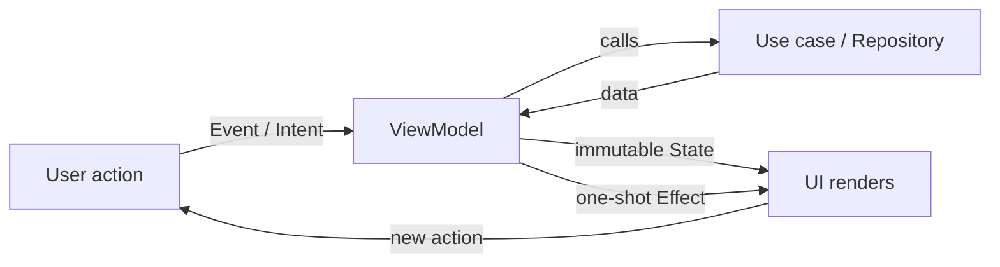
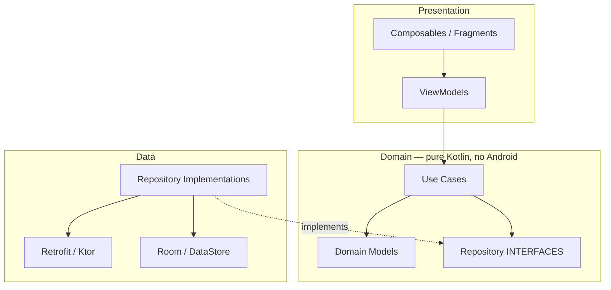

# 🏛️ Android Architecture Patterns — Complete Interview Preparation Guide

> **Authoritative Technical Reference**
> Every topic follows the same structure — **Definition → Why It Is Used → How It Works Internally → Code Example → Common Pitfalls**.
>
> Covers presentation patterns (MVC → MVP → MVVM → MVI), Clean Architecture, modularization, design patterns, SOLID, and offline-first data flow.
>
> **Architecture interview questions:** [`interview_questions/04_jetpack_architecture.md`](./interview_questions/04_jetpack_architecture.md) and [`interview_questions/14_scenario_system_design.md`](./interview_questions/14_scenario_system_design.md)

---

## 📑 Table of Contents

| # | Module | Key Topics |
|---|---|---|
| 1 | [Presentation Patterns](#1-presentation-patterns-mvc-mvp-mvvm-mvi) | MVC, MVP, MVVM, MVI compared with working code |
| 2 | [Unidirectional Data Flow](#2-unidirectional-data-flow-and-state-modelling) | State modelling, events vs state, error handling |
| 3 | [Clean Architecture](#3-clean-architecture-on-android) | Layers, dependency rule, use cases, when it is overkill |
| 4 | [Repository Pattern & Data Layer](#4-the-repository-pattern-and-the-data-layer) | Single source of truth, mappers, caching policy |
| 5 | [Modularization](#5-modularization) | Module types, dependency graph, build-time impact |
| 6 | [SOLID on Android](#6-solid-principles-applied-to-android) | Each principle with a real Android example |
| 7 | [Design Patterns in Practice](#7-design-patterns-in-android-practice) | Observer, Factory, Builder, Strategy, Adapter, Decorator |
| 8 | [Choosing an Architecture](#8-choosing-an-architecture-a-decision-guide) | Trade-offs by team size and app complexity |
| 9 | [Interview Questions](#9-interview-questions) | Pointer to the question bank |

---

# 1. Presentation Patterns: MVC, MVP, MVVM, MVI

## 1.1 The Evolution and What Each Solves

### Definition
Every presentation pattern answers the same question — *where does UI logic live, and how does the view learn about changes* — with different trade-offs in testability and coupling.

### Why It Is Used
Interviewers ask this not to hear definitions but to hear *why the industry moved*. Each pattern exists because the previous one had a specific, nameable failure.

### How It Works Internally

| Pattern | View knows | Logic holder knows View? | State | Testability | Failure mode it fixed |
|---|---|---|---|---|---|
| **MVC** | Controller | Yes | Scattered | Poor | — |
| **MVP** | Presenter (via interface) | Yes, via an interface | Scattered across the presenter | Good | MVC's Activity-as-everything |
| **MVVM** | ViewModel (observes) | **No** | Multiple observables | Very good | MVP's view interface boilerplate and lifecycle leaks |
| **MVI** | ViewModel (observes) | No | **One immutable state object** | Excellent | MVVM's inconsistent multi-observable state |

**The specific problem MVI fixes.** In MVVM it is common to expose `isLoading`, `items`, and `error` as three separate observables. Nothing prevents `isLoading = true` *and* `error != null` simultaneously — an impossible state that renders a spinner over an error message. MVI makes state one object, so impossible combinations are unrepresentable if you model it with a sealed hierarchy.

### Code Example
```kotlin
// ---------- MVP ----------
// The view is an interface, so the presenter is unit-testable — but every screen
// needs a hand-written contract, and the presenter must be told about lifecycle.
interface UserView {
    fun showLoading()
    fun showUsers(users: List<User>)
    fun showError(message: String)
}

class UserPresenter(private val repo: UserRepository) {
    private var view: UserView? = null
    private val scope = CoroutineScope(SupervisorJob() + Dispatchers.Main)

    fun attach(view: UserView) { this.view = view }
    fun detach() { this.view = null; scope.coroutineContext.cancelChildren() }  // Manual, easy to forget

    fun load() = scope.launch {
        view?.showLoading()
        runCatching { repo.users() }
            .onSuccess { view?.showUsers(it) }
            .onFailure { view?.showError(it.message.orEmpty()) }
    }
}
```

```kotlin
// ---------- MVVM ----------
// The ViewModel never references the View. Lifecycle is handled by the framework.
class UserViewModel(private val repo: UserRepository) : ViewModel() {

    private val _users = MutableStateFlow<List<User>>(emptyList())
    val users: StateFlow<List<User>> = _users.asStateFlow()

    private val _isLoading = MutableStateFlow(false)
    val isLoading: StateFlow<Boolean> = _isLoading.asStateFlow()

    private val _error = MutableStateFlow<String?>(null)
    val error: StateFlow<String?> = _error.asStateFlow()

    // The weakness: nothing stops isLoading == true AND error != null at the same time.
    fun load() = viewModelScope.launch {
        _isLoading.value = true
        runCatching { repo.users() }
            .onSuccess { _users.value = it }
            .onFailure { _error.value = it.message }
        _isLoading.value = false
    }
}
```

```kotlin
// ---------- MVI ----------
// One state object, one intent channel, one-way flow. Impossible states are unrepresentable.

// State: a sealed hierarchy makes "loading AND error" impossible by construction
sealed interface UserListState {
    data object Loading : UserListState
    data class Content(
        val users: List<User>,
        val isRefreshing: Boolean = false        // Refreshing is a property OF content, not a peer
    ) : UserListState
    data class Error(val message: String, val canRetry: Boolean) : UserListState
}

// Intents: everything the user can do, as data
sealed interface UserListIntent {
    data object Load : UserListIntent
    data object Refresh : UserListIntent
    data class UserClicked(val id: Long) : UserListIntent
}

// Effects: one-shot side effects that must NOT be part of state
sealed interface UserListEffect {
    data class NavigateToDetail(val id: Long) : UserListEffect
    data class ShowSnackbar(val message: String) : UserListEffect
}

class UserListViewModel(private val repo: UserRepository) : ViewModel() {

    private val _state = MutableStateFlow<UserListState>(UserListState.Loading)
    val state: StateFlow<UserListState> = _state.asStateFlow()

    // A Channel, not a StateFlow: an effect must fire exactly once, never replay on rotation
    private val _effects = Channel<UserListEffect>(Channel.BUFFERED)
    val effects: Flow<UserListEffect> = _effects.receiveAsFlow()

    // Single entry point: every user action funnels through here, which makes the
    // whole screen's behavior readable in one function and trivially loggable.
    fun onIntent(intent: UserListIntent) {
        when (intent) {
            UserListIntent.Load -> load(isRefresh = false)
            UserListIntent.Refresh -> load(isRefresh = true)
            is UserListIntent.UserClicked ->
                _effects.trySend(UserListEffect.NavigateToDetail(intent.id))
        }
    }

    private fun load(isRefresh: Boolean) = viewModelScope.launch {
        // Refreshing keeps existing content visible; a cold load shows the loading state
        _state.update { current ->
            if (isRefresh && current is UserListState.Content) current.copy(isRefreshing = true)
            else UserListState.Loading
        }

        repo.users()
            .onSuccess { users -> _state.value = UserListState.Content(users) }
            .onFailure { e ->
                val previous = _state.value
                if (previous is UserListState.Content) {
                    // Keep the stale content on screen; report the failure transiently
                    _state.value = previous.copy(isRefreshing = false)
                    _effects.trySend(UserListEffect.ShowSnackbar(e.toUserMessage()))
                } else {
                    _state.value = UserListState.Error(e.toUserMessage(), canRetry = true)
                }
            }
    }
}
```

```kotlin
// The UI: renders state, sends intents, consumes effects exactly once
@Composable
fun UserListScreen(
    viewModel: UserListViewModel,
    onNavigateToDetail: (Long) -> Unit
) {
    val state by viewModel.state.collectAsStateWithLifecycle()
    val snackbarHost = remember { SnackbarHostState() }

    // Effects are consumed here; because they come from a Channel, rotation does not replay them
    LaunchedEffect(Unit) {
        viewModel.effects.collect { effect ->
            when (effect) {
                is UserListEffect.NavigateToDetail -> onNavigateToDetail(effect.id)
                is UserListEffect.ShowSnackbar -> snackbarHost.showSnackbar(effect.message)
            }
        }
    }

    Scaffold(snackbarHost = { SnackbarHost(snackbarHost) }) { padding ->
        // Exhaustive when: adding a state variant breaks the build, not production
        when (val s = state) {
            UserListState.Loading -> LoadingIndicator(Modifier.padding(padding))
            is UserListState.Content -> UserList(
                users = s.users,
                isRefreshing = s.isRefreshing,
                onRefresh = { viewModel.onIntent(UserListIntent.Refresh) },
                onClick = { viewModel.onIntent(UserListIntent.UserClicked(it)) }
            )
            is UserListState.Error -> ErrorView(
                message = s.message,
                onRetry = { viewModel.onIntent(UserListIntent.Load) }.takeIf { s.canRetry }
            )
        }
    }
}
```

### Common Pitfalls
* **"MVI" that is just MVVM with a state data class.** The value is in the *sealed* state hierarchy plus the single intent entry point. A `data class UiState(val isLoading: Boolean, val error: String?, val items: List<T>)` still permits impossible combinations.
* **Modelling navigation as state.** After a rotation the state is re-read and the app navigates again. Use a `Channel`-backed effect stream.
* **A God ViewModel.** A screen with 15 intents and 20 state fields is a screen that should be several screens, or one whose logic belongs in use cases.
* **Leaking the presenter's view reference in MVP.** Forgetting `detach()` leaks the Activity — the specific failure MVVM was designed to make impossible.

---

# 2. Unidirectional Data Flow and State Modelling

## 2.1 Modelling State So Bugs Cannot Compile

### Definition
UDF means data flows in exactly one direction — state down, events up — and the UI is a pure function of state.

### Why It Is Used
When state can only change in one place and flows one way, "why is the screen showing this?" has exactly one answer. Bidirectional binding produces cycles where a UI change writes state that changes the UI.

### How It Works Internally


**The state-vs-effect distinction is the crux:**

| | State | Effect |
|---|---|---|
| Lifetime | Persists until changed | Consumed exactly once |
| On rotation | Re-read and re-rendered | Must **not** re-fire |
| Examples | list contents, loading, selected tab | navigation, snackbar, toast, dialog trigger, haptic |
| Mechanism | `StateFlow` | `Channel` → `receiveAsFlow()` |

### Code Example
```kotlin
// GOOD: illegal combinations cannot be constructed
sealed interface CheckoutState {
    data object LoadingCart : CheckoutState
    data class Ready(
        val items: List<CartItem>,
        val total: Money,
        val selectedPayment: PaymentMethod?,
        val submitting: Boolean = false
    ) : CheckoutState {
        // Derived state belongs here, not duplicated in the UI
        val canSubmit: Boolean get() = items.isNotEmpty() && selectedPayment != null && !submitting
    }
    data class Failed(val error: AppError) : CheckoutState
}

// BAD: 2^4 = 16 combinations, of which perhaps 4 are legal
// data class CheckoutState(
//     val isLoading: Boolean, val items: List<CartItem>,
//     val error: String?, val isSubmitting: Boolean
// )
```

```kotlin
// Combining independent sources into one state, so the UI has exactly one input
class DashboardViewModel(
    profileRepo: ProfileRepository,
    ordersRepo: OrderRepository,
    connectivity: ConnectivityObserver
) : ViewModel() {

    val state: StateFlow<DashboardState> = combine(
        profileRepo.observeProfile(),
        ordersRepo.observeRecentOrders(),
        connectivity.status
    ) { profile, orders, online ->
        DashboardState(
            profile = profile,
            orders = orders,
            isOffline = !online,
            // Stale-data banner is derived, not stored — it can never go out of sync
            showStaleBanner = !online && orders.isNotEmpty()
        )
    }.stateIn(
        scope = viewModelScope,
        started = SharingStarted.WhileSubscribed(5_000),
        initialValue = DashboardState()
    )
}
```

```kotlin
// Testing UDF is mechanical, because the ViewModel is a pure state machine
@Test
fun `submitting with no payment method keeps the button disabled`() = runTest {
    viewModel.state.test {
        viewModel.onIntent(CheckoutIntent.Load)
        awaitItem()                                     // LoadingCart
        val ready = awaitItem() as CheckoutState.Ready
        assertThat(ready.canSubmit).isFalse()

        viewModel.onIntent(CheckoutIntent.SelectPayment(card))
        assertThat((awaitItem() as CheckoutState.Ready).canSubmit).isTrue()
    }
}
```

### Common Pitfalls
* **Derived state stored as a field.** `canSubmit` as a stored boolean drifts out of sync with the values it derives from. Compute it.
* **The UI holding state the ViewModel also holds.** Two sources of truth is the same bug as no source of truth.
* **`MutableStateFlow` exposed publicly.** The UI can then write state directly, breaking the single-writer rule. Expose `asStateFlow()`.
* **Emitting a whole new state object on every keystroke of a large state.** Use `update { it.copy(...) }` so only the changed field differs, and rely on structural equality to skip redundant renders.

---

# 3. Clean Architecture on Android

## 3.1 Layers and the Dependency Rule

### Definition
Concentric layers where **source-code dependencies point only inward**: UI → Domain ← Data. The domain layer knows nothing about Android, the network, or the database.

### Why It Is Used
Business rules become pure Kotlin, testable in milliseconds with no framework. Swapping Retrofit for Ktor, or Room for SQLDelight, touches only the data layer.

### How It Works Internally



**Dependency inversion is the whole mechanism.** The repository *interface* lives in `domain`; the *implementation* lives in `data`. The arrow from `data` to `domain` points inward even though data flows outward at runtime. Without this, `domain` would depend on `data` and the layering would be decorative.

### Code Example
```kotlin
// ---------- domain module: pure Kotlin, zero Android dependencies ----------
data class Order(
    val id: OrderId,
    val items: List<OrderItem>,
    val status: OrderStatus,
    val placedAt: Instant
) {
    // Business rules live with the model they govern
    val isCancellable: Boolean
        get() = status == OrderStatus.PLACED && Clock.System.now() - placedAt < 1.hours
}

interface OrderRepository {
    fun observeOrders(): Flow<List<Order>>
    suspend fun cancel(id: OrderId): Result<Unit>
}

// A use case: one business operation, one public operator function
class CancelOrderUseCase(
    private val orders: OrderRepository,
    private val inventory: InventoryRepository
) {
    suspend operator fun invoke(id: OrderId): Result<Unit> {
        val order = orders.observeOrders().first().find { it.id == id }
            ?: return Result.failure(OrderNotFound(id))

        // The business rule is enforced here, not in the ViewModel and not on the server alone
        if (!order.isCancellable) return Result.failure(OrderNotCancellable(id, order.status))

        return orders.cancel(id).onSuccess { inventory.restock(order.items) }
    }
}
```

```kotlin
// ---------- data module: implements the domain's interface ----------
class OrderRepositoryImpl @Inject constructor(
    private val api: OrderApi,
    private val dao: OrderDao,
    @IoDispatcher private val io: CoroutineDispatcher
) : OrderRepository {

    // The database is the single source of truth; the network only writes into it
    override fun observeOrders(): Flow<List<Order>> =
        dao.observeAll()
            .map { entities -> entities.map(OrderEntity::toDomain) }   // Mapper at the boundary
            .flowOn(io)

    override suspend fun cancel(id: OrderId): Result<Unit> = withContext(io) {
        runCatching {
            api.cancelOrder(id.value)
            dao.updateStatus(id.value, OrderStatus.CANCELLED.name)
        }
    }
}

// Mappers keep the network's shape from leaking into the domain
private fun OrderEntity.toDomain() = Order(
    id = OrderId(id),
    items = items.map(OrderItemEntity::toDomain),
    status = OrderStatus.valueOf(status),
    placedAt = Instant.fromEpochMilliseconds(placedAtMillis)
)
```

```kotlin
// ---------- presentation module ----------
@HiltViewModel
class OrderListViewModel @Inject constructor(
    observeOrders: ObserveOrdersUseCase,
    private val cancelOrder: CancelOrderUseCase
) : ViewModel() {

    // The ViewModel orchestrates; it does not contain business rules
    val state = observeOrders()
        .map { OrderListState.Content(it) }
        .stateIn(viewModelScope, SharingStarted.WhileSubscribed(5_000), OrderListState.Loading)

    fun onCancel(id: OrderId) = viewModelScope.launch {
        cancelOrder(id).onFailure { _effects.trySend(ShowError(it.toUserMessage())) }
    }
}
```

### When Clean Architecture Is Overkill

| App shape | Recommendation |
|---|---|
| < 10 screens, one developer, CRUD over an API | ViewModel + Repository. Use cases add ceremony without payoff. |
| 10–40 screens, small team, real business rules | Add use cases **where logic is shared or non-trivial**, not universally |
| Large app, several teams, long lifetime | Full layering plus module boundaries that enforce it |

A use case that is a one-line delegate to the repository is pure overhead. Add them when they hold logic.

### Common Pitfalls
* **A use case per repository method.** `GetUserUseCase { repo.getUser() }` adds a file and no value.
* **Android types in the domain.** `Context`, `Uri`, `LiveData`, or `@Parcelize` in `domain` breaks the JVM-only testability that justifies the layer.
* **DTOs used as domain models.** Every backend rename then ripples through the UI. Map at the boundary.
* **Layering enforced only by convention.** Without separate Gradle modules, nothing stops `domain` from importing `data`. Modules make the rule compile-enforced.

---

# 4. The Repository Pattern and the Data Layer

## 4.1 Single Source of Truth

### Definition
The repository decides where data comes from and exposes one authoritative stream. Callers never know or care whether a value came from cache, database, or network.

### Why It Is Used
Without it, ViewModels contain caching logic, screens disagree about the current data, and offline behavior is inconsistent per screen.

### How It Works Internally

| Strategy | Behavior | Right For |
|---|---|---|
| **Network-only** | Always fetch, no cache | Real-time prices, one-shot search |
| **Cache-then-network** | Emit cache immediately, then fetch and re-emit | Feeds, lists, most screens |
| **Network-then-cache** | Fetch, write to DB, DB emits | Writes and syncs |
| **Cache-only** | Never fetch | Settings, local drafts |
| **Offline-first** | DB is the source of truth; network writes into it | Anything that must work offline |

### Code Example
```kotlin
class ArticleRepositoryImpl @Inject constructor(
    private val api: ArticleApi,
    private val dao: ArticleDao,
    private val syncScheduler: SyncScheduler,
    @IoDispatcher private val io: CoroutineDispatcher
) : ArticleRepository {

    // Callers observe this and nothing else. Cache emits immediately; the refresh
    // writes into the same database, which re-emits automatically.
    override fun observeArticles(category: Category): Flow<List<Article>> =
        dao.observeByCategory(category.id)
            .map { it.map(ArticleEntity::toDomain) }
            .onStart { refreshIfStale(category) }        // Fire-and-forget: does not block the emission
            .flowOn(io)

    private suspend fun refreshIfStale(category: Category) {
        val lastSync = dao.lastSyncTime(category.id) ?: 0L
        if (System.currentTimeMillis() - lastSync < CACHE_TTL_MS) return
        runCatching { fetchAndStore(category) }          // A failure leaves the cache intact
    }

    private suspend fun fetchAndStore(category: Category) {
        val remote = api.articles(category.slug)
        // One transaction: the UI never observes a half-written list
        dao.replaceCategory(
            categoryId = category.id,
            articles = remote.map(ArticleDto::toEntity),
            syncedAt = System.currentTimeMillis()
        )
    }

    // Writes go local-first for instant UI, then sync in the background
    override suspend fun bookmark(id: ArticleId) = withContext(io) {
        dao.setBookmarked(id.value, true)                       // Optimistic: UI updates now
        dao.enqueuePendingAction(PendingAction.Bookmark(id.value))
        syncScheduler.scheduleSync()                            // WorkManager retries with backoff
    }

    private companion object { const val CACHE_TTL_MS = 5 * 60 * 1000L }
}
```

```kotlin
// Testing a repository is straightforward because both sides are injectable
@Test
fun `emits cached data before the network responds`() = runTest {
    dao.insert(cachedArticles)
    api.delayNextResponse(2_000)

    repository.observeArticles(Tech).test {
        assertThat(awaitItem()).hasSize(cachedArticles.size)     // Immediate, from cache
        advanceTimeBy(2_001)
        assertThat(awaitItem()).hasSize(freshArticles.size)      // Then the refreshed data
    }
}
```

### Common Pitfalls
* **Returning `List<T>` instead of `Flow<List<T>>`.** The UI then has to poll or manually refresh, and loses the automatic update on write.
* **Two paths to the same data.** If a screen sometimes reads the API directly, screens disagree.
* **Swallowing refresh failures silently.** The user sees stale data with no indication. Surface the failure as an effect while keeping the content.
* **`suspend fun getX()` and `fun observeX()` both public** with different caching. Pick one contract per piece of data.

---

# 5. Modularization

## 5.1 Module Types and the Dependency Graph

### Definition
Splitting the codebase into Gradle modules with explicit dependencies, so boundaries are enforced by the compiler rather than by code review.

### Why It Is Used
* **Build speed** — Gradle rebuilds and re-tests only affected modules, and builds independent ones in parallel.
* **Enforced boundaries** — `:feature:checkout` simply cannot import from `:feature:profile` if it does not depend on it.
* **Team ownership** — modules map to owners and to CODEOWNERS rules.
* **Play Feature Delivery** — dynamic feature modules require this structure.

### How It Works Internally

| Module type | Contains | Depends on |
|---|---|---|
| `:app` | Application class, DI graph assembly, navigation host | Every feature |
| `:feature:x` | Screens, ViewModels for one feature | `:core:*`, `:domain` |
| `:domain` | Models, use cases, repository interfaces | Nothing (pure Kotlin) |
| `:data` | Repository implementations, API, DAOs | `:domain`, `:core:network`, `:core:database` |
| `:core:ui` | Design system, shared composables | `:core:model` |
| `:core:common` | Dispatchers, Result types, extensions | Nothing |

**The critical rule: features must not depend on each other.** Feature-to-feature navigation goes through an interface in `:core:navigation` implemented by `:app`, or through a route contract. Direct dependencies recreate the monolith with extra Gradle files.

**`api` vs `implementation` is the main build-speed lever.** `implementation` keeps a dependency off the consumer's compile classpath, so changing it does not recompile downstream modules. Use `api` only when a type genuinely appears in your public signatures.

### Code Example
```
project/
├── app/                              # Assembles everything; owns the DI graph and NavHost
├── core/
│   ├── common/                       # Dispatchers, Result, extensions — no Android
│   ├── model/                        # Domain models shared across features
│   ├── ui/                           # Design system: theme, buttons, cards
│   ├── network/                      # Ktor/Retrofit client configuration
│   ├── database/                     # Room database, DAOs
│   └── navigation/                   # Route contracts features publish/consume
├── domain/                           # Use cases, repository interfaces
├── data/                             # Repository implementations, mappers
└── feature/
    ├── home/
    ├── search/
    └── checkout/
```

```gradle
// feature/checkout/build.gradle.kts
plugins {
    id("myapp.android.feature")        // A convention plugin: one line instead of 40
}

dependencies {
    implementation(projects.domain)
    implementation(projects.core.ui)
    implementation(projects.core.navigation)
    // NOT projects.feature.home — features never depend on each other
}
```

```kotlin
// build-logic/convention/src/main/kotlin/AndroidFeatureConventionPlugin.kt
// Convention plugins remove per-module boilerplate and keep configuration consistent
class AndroidFeatureConventionPlugin : Plugin<Project> {
    override fun apply(target: Project) = with(target) {
        pluginManager.apply("myapp.android.library")
        pluginManager.apply("myapp.android.hilt")

        extensions.configure<LibraryExtension> {
            defaultConfig.testInstrumentationRunner = "com.example.HiltTestRunner"
        }

        dependencies {
            add("implementation", project(":core:ui"))
            add("implementation", project(":core:common"))
            add("implementation", libs.findLibrary("androidx.lifecycle.viewmodel").get())
        }
    }
}
```

```kotlin
// Cross-feature navigation without a cross-feature dependency.
// The contract lives in :core:navigation; :app supplies the implementation.
interface CheckoutNavigator {
    fun toOrderConfirmation(orderId: Long)
    fun toHome()
}

// :feature:checkout depends on the interface only
class CheckoutViewModel @Inject constructor(
    private val navigator: CheckoutNavigator
) : ViewModel()
```

### Common Pitfalls
* **Over-modularizing early.** 40 modules for a 12-screen app makes every change touch five build files. Split when a real pain appears (build time, ownership conflicts).
* **`api` everywhere.** It leaks transitive dependencies onto every consumer's compile classpath and destroys incremental build benefits.
* **A `:common` module that everything depends on and everyone edits.** Every change invalidates the whole graph — the "god module" antipattern.
* **Feature-to-feature dependencies.** They reintroduce the coupling modularization was meant to remove.
* **Duplicating build config in every module** instead of writing convention plugins.

---

# 6. SOLID Principles Applied to Android

### Definition
Five design principles that, applied to Android specifically, prevent the most common structural problems in app code.

### How It Works Internally, With Android Examples

**S — Single Responsibility.** A class has one reason to change.
```kotlin
// Violates: fetches, caches, formats, AND tracks analytics
class UserManager {
    fun getUser(id: Long): UserViewData { /* network + cache + formatting + analytics */ }
}

// Follows: each collaborator changes for one reason
class UserRepository(private val api: UserApi, private val dao: UserDao)   // Data access
class UserFormatter(private val res: ResourceProvider)                     // Presentation
class UserAnalytics(private val tracker: Tracker)                          // Instrumentation
```

**O — Open/Closed.** Open for extension, closed for modification.
```kotlin
// Violates: adding a payment method edits this when
fun process(type: String, amount: Money) = when (type) {
    "card" -> processCard(amount)
    "paypal" -> processPaypal(amount)
    else -> error("unknown")
}

// Follows: a new method is a new class, no existing code changes
interface PaymentProcessor {
    val method: PaymentMethod
    suspend fun process(amount: Money): Result<Receipt>
}

class PaymentRouter @Inject constructor(
    private val processors: Set<@JvmSuppressWildcards PaymentProcessor>   // Hilt multibinding
) {
    suspend fun process(method: PaymentMethod, amount: Money) =
        processors.first { it.method == method }.process(amount)
}
```

**L — Liskov Substitution.** A subtype must be usable wherever its supertype is.
```kotlin
// Violates: this "repository" throws for a method the interface promises
class ReadOnlyUserRepository : UserRepository {
    override suspend fun save(user: User) = throw UnsupportedOperationException()
}

// Follows: split the interface so the type only promises what it can do
interface UserReader { fun observeUsers(): Flow<List<User>> }
interface UserWriter { suspend fun save(user: User) }
```

**I — Interface Segregation.** Clients should not depend on methods they do not use.
```kotlin
// Violates: an analytics-only consumer is forced to know about crash reporting
interface Telemetry {
    fun track(event: String)
    fun recordCrash(t: Throwable)
    fun setUserProperty(k: String, v: String)
    fun startTrace(name: String): Trace
}

// Follows
interface EventTracker { fun track(event: String) }
interface CrashReporter { fun recordCrash(t: Throwable) }
interface PerformanceTracer { fun startTrace(name: String): Trace }
```

**D — Dependency Inversion.** Depend on abstractions, not concretions.
```kotlin
// Violates: the ViewModel is welded to Retrofit and cannot be unit-tested without a server
class ProfileViewModel : ViewModel() {
    private val api = Retrofit.Builder().baseUrl(URL).build().create(UserApi::class.java)
}

// Follows: the dependency is an interface owned by the domain, injected from outside
class ProfileViewModel @Inject constructor(
    private val repository: UserRepository        // A domain interface, not a Retrofit type
) : ViewModel()
```

### Common Pitfalls
* **Applying SOLID as a checklist.** An interface with exactly one implementation, created "for DIP", is indirection without benefit. Add the abstraction when a second implementation or a test double genuinely needs it.
* **SRP taken to absurdity.** One class per method is not single responsibility; it is scattered responsibility.
* **Interfaces for data classes.** Models do not need abstracting.

---

# 7. Design Patterns in Android Practice

### Definition
The classic patterns that appear constantly in the Android framework and in app code, with the concrete Android instance of each.

| Pattern | In the Framework | In App Code |
|---|---|---|
| **Observer** | `LiveData`, `Flow`, `BroadcastReceiver` | State exposure from ViewModels |
| **Factory** | `LayoutInflater.Factory`, `ViewModelProvider.Factory` | Creating ViewModels with runtime arguments |
| **Builder** | `AlertDialog.Builder`, `NotificationCompat.Builder`, `OkHttpClient.Builder` | Complex object construction |
| **Adapter** | `RecyclerView.Adapter` | Mapping DTOs to domain models |
| **Singleton** | `Context.getSystemService` results | DI-scoped instances (never a hand-rolled `object` holding Context) |
| **Strategy** | `LayoutManager`, `Interpolator` | Pluggable caching, sorting, payment processing |
| **Decorator** | OkHttp `Interceptor` chain | Adding retry/logging/auth without changing the client |
| **Facade** | `Retrofit` over OkHttp | A repository over several data sources |
| **Command** | `Runnable` posted to a `Handler` | MVI intents |

### Code Example
```kotlin
// Decorator via OkHttp interceptors: behavior added by composition, not by subclassing
val client = OkHttpClient.Builder()
    .addInterceptor(AuthInterceptor(tokenProvider))       // Adds the auth header
    .addInterceptor(RetryInterceptor(maxRetries = 3))     // Adds retry
    .addInterceptor(HttpLoggingInterceptor().apply {      // Adds logging, debug only
        level = if (BuildConfig.DEBUG) BODY else NONE
    })
    .build()

// Strategy: the caching policy is swappable per call site, not baked into the repository
interface CachePolicy { fun isStale(lastSync: Long): Boolean }

object AlwaysFresh : CachePolicy { override fun isStale(lastSync: Long) = true }
class TimeBased(private val ttlMs: Long) : CachePolicy {
    override fun isStale(lastSync: Long) = System.currentTimeMillis() - lastSync > ttlMs
}

class ArticleRepository(private val policy: CachePolicy) { /* ... */ }

// Factory: ViewModel construction with a runtime argument
class DetailViewModelFactory(
    private val productId: Long,
    private val repo: ProductRepository
) : ViewModelProvider.Factory {
    @Suppress("UNCHECKED_CAST")
    override fun <T : ViewModel> create(modelClass: Class<T>): T =
        DetailViewModel(productId, repo) as T
}
// In modern code, prefer SavedStateHandle or Hilt's @AssistedInject over hand-written factories.
```

### Common Pitfalls
* **Naming a pattern without needing it.** A `UserFactoryProviderStrategy` is not architecture.
* **Hand-rolled singletons holding a `Context`.** A permanent leak; let the DI framework own lifetime.
* **A Builder for a 2-parameter class.** Kotlin's named and default arguments already solve that.

---

# 8. Choosing an Architecture: A Decision Guide

### Definition
Architecture is a trade-off between ceremony and change-resilience. The right answer depends on team size, app lifetime, and rate of change.

### The Decision Table

| Context | Presentation | Layering | Modularization |
|---|---|---|---|
| Prototype / < 5 screens | ViewModel + `StateFlow` | Repository only | Single module |
| Small production app, 1–3 devs | MVVM with a state data class | Repository + selective use cases | `:app` + `:core` |
| Medium app, 3–10 devs | MVI with sealed state | Full domain layer | Feature modules |
| Large app, several teams | MVI, per-feature state machines | Full Clean Architecture | Feature + core module graph, convention plugins |

### What to Say in an Interview
State the trade-off, not the dogma. A strong answer sounds like:

> "We used MVVM with a sealed state hierarchy per screen — effectively MVI without the ceremony of a formal reducer. We added use cases only where logic was shared across screens or non-trivial, because a use case that delegates one line to the repository is a file with no reader. We modularized by feature once the build hit four minutes and two teams started colliding in the same package — not before."

That answer shows judgment. "We used Clean Architecture because it is best practice" does not.

### Common Pitfalls
* **Adopting an architecture wholesale from a blog post** without the problem it solves.
* **Refactoring architecture instead of shipping.** Architecture debt is real but rarely the top constraint on a small app.
* **Inconsistency across the codebase.** Three patterns in one app is worse than any single pattern, because no one can predict where logic lives.

---

# 9. Interview Questions

**➡️ [`interview_questions/04_jetpack_architecture.md`](./interview_questions/04_jetpack_architecture.md) — 30 questions on architecture, ViewModel, state, and Navigation.**
**➡️ [`interview_questions/14_scenario_system_design.md`](./interview_questions/14_scenario_system_design.md) — 20 open-ended design and debugging scenarios.**

---

## 📚 Related Guides

| Guide | Covers |
|---|---|
| [`android.md`](./android.md) | ViewModel internals, lifecycle, DI, error modelling |
| [`compose.md`](./compose.md) | UDF in Compose, state hoisting, effect APIs |
| [`gradle_build.md`](./gradle_build.md) | Convention plugins, module configuration, build performance |
| [`testing_security.md`](./testing_security.md) | Testing each architectural layer |
