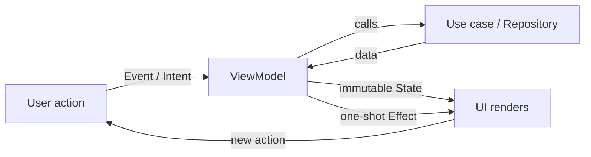
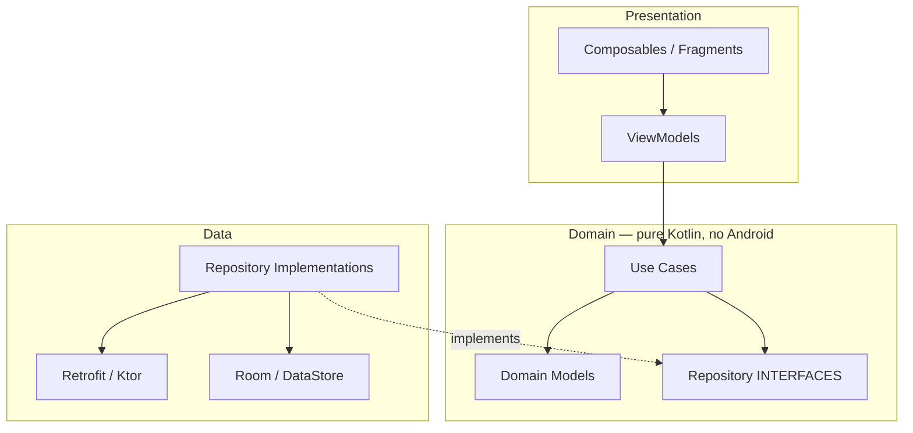

# 🏛️ Android Architecture Patterns — Complete Interview Preparation Guide

> **Authoritative Technical Reference**
> Every topic follows the same structure — **Definition → Why It Is Used → How It Works Internally → Code Example → Common Pitfalls**.
>
> Covers presentation patterns (MVC → MVP → MVVM → MVI), Clean Architecture, modularization, design patterns, SOLID, and offline-first data flow.
>
> **50 Architecture & System Design interview questions:** [Section 9](#9-architecture--system-design-interview-questions-50-questions)

---

## 📑 Table of Contents

| # | Module | Key Topics |
|---|---|---|
| 1 | [Presentation Patterns](#1-presentation-patterns-mvc-mvp-mvvm-mvi) | MVC, MVP, MVVM, MVI compared with working code |
| 2 | [Unidirectional Data Flow](#2-unidirectional-data-flow-and-state-modelling) | State modelling, events vs state, error handling |
| 3 | [Clean Architecture](#3-clean-architecture-on-android) | Layers, dependency rule, use cases, when it is overkill |
| 4 | [Repository Pattern & Data Layer](#4-the-repository-pattern-and-the-data-layer) | Single source of truth, mappers, caching policy |
| 5 | [Modularization](#5-modularization) | Module types, dependency graph, build-time impact |
| 6 | [SOLID on Android](#6-solid-principles-applied-to-android) | Each principle with a real Android example |
| 7 | [Design Patterns in Practice](#7-design-patterns-in-android-practice) | Observer, Factory, Builder, Strategy, Adapter, Decorator |
| 8 | [Choosing an Architecture](#8-choosing-an-architecture-a-decision-guide) | Trade-offs by team size and app complexity |
| 9 | [Interview Questions](#9-interview-questions) | Pointer to the question bank |

---

# 1. Presentation Patterns: MVC, MVP, MVVM, MVI

## 1.1 The Evolution and What Each Solves

### Definition
* **Presentation pattern** — a convention answering two questions: *where does UI logic live*, and *how does the view learn that something changed*.
* **MVC** — a controller mediates between model and view. On Android the Activity became both controller and view, which is the problem the later patterns exist to fix.
* **MVP** — logic moves into a Presenter that talks to the view through an **interface**, making it unit-testable. The cost is a hand-written contract per screen and manual lifecycle attach/detach.
* **MVVM** — the ViewModel exposes observable state and holds **no reference to the view**, so the view subscribes instead of being called. This removes both the interface boilerplate and the leak risk.
* **MVI** — a stricter MVVM: all actions enter through one **intent** channel and the screen is described by **one immutable state object**, so contradictory states cannot be represented.
* **The through-line** — each step reduces the coupling between logic and view, and narrows the set of states the UI can be in.

### Why It Is Used
Interviewers ask this not to hear definitions but to hear *why the industry moved*. Each pattern exists because the previous one had a specific, nameable failure.

### How It Works Internally

| Pattern | View knows | Logic holder knows View? | State | Testability | Failure mode it fixed |
|---|---|---|---|---|---|
| **MVC** | Controller | Yes | Scattered | Poor | — |
| **MVP** | Presenter (via interface) | Yes, via an interface | Scattered across the presenter | Good | MVC's Activity-as-everything |
| **MVVM** | ViewModel (observes) | **No** | Multiple observables | Very good | MVP's view interface boilerplate and lifecycle leaks |
| **MVI** | ViewModel (observes) | No | **One immutable state object** | Excellent | MVVM's inconsistent multi-observable state |

**The specific problem MVI fixes.** In MVVM it is common to expose `isLoading`, `items`, and `error` as three separate observables. Nothing prevents `isLoading = true` *and* `error != null` simultaneously — an impossible state that renders a spinner over an error message. MVI makes state one object, so impossible combinations are unrepresentable if you model it with a sealed hierarchy.

### Code Example
```kotlin
// ---------- MVP ----------
// The view is an interface, so the presenter is unit-testable — but every screen
// needs a hand-written contract, and the presenter must be told about lifecycle.
interface UserView {
    fun showLoading()
    fun showUsers(users: List<User>)
    fun showError(message: String)
}

class UserPresenter(private val repo: UserRepository) {
    private var view: UserView? = null
    private val scope = CoroutineScope(SupervisorJob() + Dispatchers.Main)

    fun attach(view: UserView) { this.view = view }
    fun detach() { this.view = null; scope.coroutineContext.cancelChildren() }  // Manual, easy to forget

    fun load() = scope.launch {
        view?.showLoading()
        runCatching { repo.users() }
            .onSuccess { view?.showUsers(it) }
            .onFailure { view?.showError(it.message.orEmpty()) }
    }
}
```

```kotlin
// ---------- MVVM ----------
// The ViewModel never references the View. Lifecycle is handled by the framework.
class UserViewModel(private val repo: UserRepository) : ViewModel() {

    private val _users = MutableStateFlow<List<User>>(emptyList())
    val users: StateFlow<List<User>> = _users.asStateFlow()

    private val _isLoading = MutableStateFlow(false)
    val isLoading: StateFlow<Boolean> = _isLoading.asStateFlow()

    private val _error = MutableStateFlow<String?>(null)
    val error: StateFlow<String?> = _error.asStateFlow()

    // The weakness: nothing stops isLoading == true AND error != null at the same time.
    fun load() = viewModelScope.launch {
        _isLoading.value = true
        runCatching { repo.users() }
            .onSuccess { _users.value = it }
            .onFailure { _error.value = it.message }
        _isLoading.value = false
    }
}
```

```kotlin
// ---------- MVI ----------
// One state object, one intent channel, one-way flow. Impossible states are unrepresentable.

// State: a sealed hierarchy makes "loading AND error" impossible by construction
sealed interface UserListState {
    data object Loading : UserListState
    data class Content(
        val users: List<User>,
        val isRefreshing: Boolean = false        // Refreshing is a property OF content, not a peer
    ) : UserListState
    data class Error(val message: String, val canRetry: Boolean) : UserListState
}

// Intents: everything the user can do, as data
sealed interface UserListIntent {
    data object Load : UserListIntent
    data object Refresh : UserListIntent
    data class UserClicked(val id: Long) : UserListIntent
}

// Effects: one-shot side effects that must NOT be part of state
sealed interface UserListEffect {
    data class NavigateToDetail(val id: Long) : UserListEffect
    data class ShowSnackbar(val message: String) : UserListEffect
}

class UserListViewModel(private val repo: UserRepository) : ViewModel() {

    private val _state = MutableStateFlow<UserListState>(UserListState.Loading)
    val state: StateFlow<UserListState> = _state.asStateFlow()

    // A Channel, not a StateFlow: an effect must fire exactly once, never replay on rotation
    private val _effects = Channel<UserListEffect>(Channel.BUFFERED)
    val effects: Flow<UserListEffect> = _effects.receiveAsFlow()

    // Single entry point: every user action funnels through here, which makes the
    // whole screen's behavior readable in one function and trivially loggable.
    fun onIntent(intent: UserListIntent) {
        when (intent) {
            UserListIntent.Load -> load(isRefresh = false)
            UserListIntent.Refresh -> load(isRefresh = true)
            is UserListIntent.UserClicked ->
                _effects.trySend(UserListEffect.NavigateToDetail(intent.id))
        }
    }

    private fun load(isRefresh: Boolean) = viewModelScope.launch {
        // Refreshing keeps existing content visible; a cold load shows the loading state
        _state.update { current ->
            if (isRefresh && current is UserListState.Content) current.copy(isRefreshing = true)
            else UserListState.Loading
        }

        repo.users()
            .onSuccess { users -> _state.value = UserListState.Content(users) }
            .onFailure { e ->
                val previous = _state.value
                if (previous is UserListState.Content) {
                    // Keep the stale content on screen; report the failure transiently
                    _state.value = previous.copy(isRefreshing = false)
                    _effects.trySend(UserListEffect.ShowSnackbar(e.toUserMessage()))
                } else {
                    _state.value = UserListState.Error(e.toUserMessage(), canRetry = true)
                }
            }
    }
}
```

```kotlin
// The UI: renders state, sends intents, consumes effects exactly once
@Composable
fun UserListScreen(
    viewModel: UserListViewModel,
    onNavigateToDetail: (Long) -> Unit
) {
    val state by viewModel.state.collectAsStateWithLifecycle()
    val snackbarHost = remember { SnackbarHostState() }

    // Effects are consumed here; because they come from a Channel, rotation does not replay them
    LaunchedEffect(Unit) {
        viewModel.effects.collect { effect ->
            when (effect) {
                is UserListEffect.NavigateToDetail -> onNavigateToDetail(effect.id)
                is UserListEffect.ShowSnackbar -> snackbarHost.showSnackbar(effect.message)
            }
        }
    }

    Scaffold(snackbarHost = { SnackbarHost(snackbarHost) }) { padding ->
        // Exhaustive when: adding a state variant breaks the build, not production
        when (val s = state) {
            UserListState.Loading -> LoadingIndicator(Modifier.padding(padding))
            is UserListState.Content -> UserList(
                users = s.users,
                isRefreshing = s.isRefreshing,
                onRefresh = { viewModel.onIntent(UserListIntent.Refresh) },
                onClick = { viewModel.onIntent(UserListIntent.UserClicked(it)) }
            )
            is UserListState.Error -> ErrorView(
                message = s.message,
                onRetry = { viewModel.onIntent(UserListIntent.Load) }.takeIf { s.canRetry }
            )
        }
    }
}
```

### Common Pitfalls
* **"MVI" that is just MVVM with a state data class.** The value is in the *sealed* state hierarchy plus the single intent entry point. A `data class UiState(val isLoading: Boolean, val error: String?, val items: List<T>)` still permits impossible combinations.
* **Modelling navigation as state.** After a rotation the state is re-read and the app navigates again. Use a `Channel`-backed effect stream.
* **A God ViewModel.** A screen with 15 intents and 20 state fields is a screen that should be several screens, or one whose logic belongs in use cases.
* **Leaking the presenter's view reference in MVP.** Forgetting `detach()` leaks the Activity — the specific failure MVVM was designed to make impossible.

---

# 2. Unidirectional Data Flow and State Modelling

## 2.1 Modelling State So Bugs Cannot Compile

### Definition
* **UI state** — the complete description of what a screen should show at a given moment, held in one place.
* **Unidirectional data flow (UDF)** — state flows **down** to the UI and events flow **up** from it, never both through the same channel, so "why is the screen showing this?" has exactly one answer.
* **Illegal state** — a combination of values that should be impossible but that the type still permits, such as `isLoading = true` alongside a non-null `error`.
* **Making illegal states unrepresentable** — choosing types so those combinations cannot be constructed. A sealed hierarchy achieves this; a flat data class of independent booleans does not.
* **Derived state** — a value computed from other state rather than stored alongside it, so it can never drift out of sync.
* **State vs effect** — state persists and is re-read after a configuration change; an **effect** (navigate, show a snackbar) must be consumed exactly once, which is why it cannot be stored as state.

### Why It Is Used
When state can only change in one place and flows one way, "why is the screen showing this?" has exactly one answer. Bidirectional binding produces cycles where a UI change writes state that changes the UI.

### How It Works Internally


**The state-vs-effect distinction is the crux:**

| | State | Effect |
|---|---|---|
| Lifetime | Persists until changed | Consumed exactly once |
| On rotation | Re-read and re-rendered | Must **not** re-fire |
| Examples | list contents, loading, selected tab | navigation, snackbar, toast, dialog trigger, haptic |
| Mechanism | `StateFlow` | `Channel` → `receiveAsFlow()` |

### Code Example
```kotlin
// GOOD: illegal combinations cannot be constructed
sealed interface CheckoutState {
    data object LoadingCart : CheckoutState
    data class Ready(
        val items: List<CartItem>,
        val total: Money,
        val selectedPayment: PaymentMethod?,
        val submitting: Boolean = false
    ) : CheckoutState {
        // Derived state belongs here, not duplicated in the UI
        val canSubmit: Boolean get() = items.isNotEmpty() && selectedPayment != null && !submitting
    }
    data class Failed(val error: AppError) : CheckoutState
}

// BAD: 2^4 = 16 combinations, of which perhaps 4 are legal
// data class CheckoutState(
//     val isLoading: Boolean, val items: List<CartItem>,
//     val error: String?, val isSubmitting: Boolean
// )
```

```kotlin
// Combining independent sources into one state, so the UI has exactly one input
class DashboardViewModel(
    profileRepo: ProfileRepository,
    ordersRepo: OrderRepository,
    connectivity: ConnectivityObserver
) : ViewModel() {

    val state: StateFlow<DashboardState> = combine(
        profileRepo.observeProfile(),
        ordersRepo.observeRecentOrders(),
        connectivity.status
    ) { profile, orders, online ->
        DashboardState(
            profile = profile,
            orders = orders,
            isOffline = !online,
            // Stale-data banner is derived, not stored — it can never go out of sync
            showStaleBanner = !online && orders.isNotEmpty()
        )
    }.stateIn(
        scope = viewModelScope,
        started = SharingStarted.WhileSubscribed(5_000),
        initialValue = DashboardState()
    )
}
```

```kotlin
// Testing UDF is mechanical, because the ViewModel is a pure state machine
@Test
fun `submitting with no payment method keeps the button disabled`() = runTest {
    viewModel.state.test {
        viewModel.onIntent(CheckoutIntent.Load)
        awaitItem()                                     // LoadingCart
        val ready = awaitItem() as CheckoutState.Ready
        assertThat(ready.canSubmit).isFalse()

        viewModel.onIntent(CheckoutIntent.SelectPayment(card))
        assertThat((awaitItem() as CheckoutState.Ready).canSubmit).isTrue()
    }
}
```

### Common Pitfalls
* **Derived state stored as a field.** `canSubmit` as a stored boolean drifts out of sync with the values it derives from. Compute it.
* **The UI holding state the ViewModel also holds.** Two sources of truth is the same bug as no source of truth.
* **`MutableStateFlow` exposed publicly.** The UI can then write state directly, breaking the single-writer rule. Expose `asStateFlow()`.
* **Emitting a whole new state object on every keystroke of a large state.** Use `update { it.copy(...) }` so only the changed field differs, and rely on structural equality to skip redundant renders.

---

# 3. Clean Architecture on Android

## 3.1 Layers and the Dependency Rule

### Definition
* **Layer** — a horizontal slice of the codebase with one responsibility: presentation renders, domain decides, data fetches and stores.
* **The dependency rule** — source-code dependencies point **inward only**: presentation → domain ← data. The domain layer imports nothing from Android, Retrofit, or Room.
* **Dependency inversion** — the mechanism that makes the rule possible: the repository **interface** lives in the domain, its **implementation** in the data layer. So `data` depends on `domain` even though data flows outward at runtime.
* **Use case (interactor)** — one business operation, especially one combining several repositories or enforcing a rule.
* **Domain model vs DTO vs UI model** — the same information shaped for business rules, for the wire, and for display, with mappers at each boundary so a change in one does not ripple through the others.
* **What the layering buys** — business rules become pure Kotlin, testable in milliseconds with no framework and no device.

### Why It Is Used
Business rules become pure Kotlin, testable in milliseconds with no framework. Swapping Retrofit for Ktor, or Room for SQLDelight, touches only the data layer.

### How It Works Internally



**Dependency inversion is the whole mechanism.** The repository *interface* lives in `domain`; the *implementation* lives in `data`. The arrow from `data` to `domain` points inward even though data flows outward at runtime. Without this, `domain` would depend on `data` and the layering would be decorative.

### Code Example
```kotlin
// ---------- domain module: pure Kotlin, zero Android dependencies ----------
data class Order(
    val id: OrderId,
    val items: List<OrderItem>,
    val status: OrderStatus,
    val placedAt: Instant
) {
    // Business rules live with the model they govern
    val isCancellable: Boolean
        get() = status == OrderStatus.PLACED && Clock.System.now() - placedAt < 1.hours
}

interface OrderRepository {
    fun observeOrders(): Flow<List<Order>>
    suspend fun cancel(id: OrderId): Result<Unit>
}

// A use case: one business operation, one public operator function
class CancelOrderUseCase(
    private val orders: OrderRepository,
    private val inventory: InventoryRepository
) {
    suspend operator fun invoke(id: OrderId): Result<Unit> {
        val order = orders.observeOrders().first().find { it.id == id }
            ?: return Result.failure(OrderNotFound(id))

        // The business rule is enforced here, not in the ViewModel and not on the server alone
        if (!order.isCancellable) return Result.failure(OrderNotCancellable(id, order.status))

        return orders.cancel(id).onSuccess { inventory.restock(order.items) }
    }
}
```

```kotlin
// ---------- data module: implements the domain's interface ----------
class OrderRepositoryImpl @Inject constructor(
    private val api: OrderApi,
    private val dao: OrderDao,
    @IoDispatcher private val io: CoroutineDispatcher
) : OrderRepository {

    // The database is the single source of truth; the network only writes into it
    override fun observeOrders(): Flow<List<Order>> =
        dao.observeAll()
            .map { entities -> entities.map(OrderEntity::toDomain) }   // Mapper at the boundary
            .flowOn(io)

    override suspend fun cancel(id: OrderId): Result<Unit> = withContext(io) {
        runCatching {
            api.cancelOrder(id.value)
            dao.updateStatus(id.value, OrderStatus.CANCELLED.name)
        }
    }
}

// Mappers keep the network's shape from leaking into the domain
private fun OrderEntity.toDomain() = Order(
    id = OrderId(id),
    items = items.map(OrderItemEntity::toDomain),
    status = OrderStatus.valueOf(status),
    placedAt = Instant.fromEpochMilliseconds(placedAtMillis)
)
```

```kotlin
// ---------- presentation module ----------
@HiltViewModel
class OrderListViewModel @Inject constructor(
    observeOrders: ObserveOrdersUseCase,
    private val cancelOrder: CancelOrderUseCase
) : ViewModel() {

    // The ViewModel orchestrates; it does not contain business rules
    val state = observeOrders()
        .map { OrderListState.Content(it) }
        .stateIn(viewModelScope, SharingStarted.WhileSubscribed(5_000), OrderListState.Loading)

    fun onCancel(id: OrderId) = viewModelScope.launch {
        cancelOrder(id).onFailure { _effects.trySend(ShowError(it.toUserMessage())) }
    }
}
```

### When Clean Architecture Is Overkill

| App shape | Recommendation |
|---|---|
| < 10 screens, one developer, CRUD over an API | ViewModel + Repository. Use cases add ceremony without payoff. |
| 10–40 screens, small team, real business rules | Add use cases **where logic is shared or non-trivial**, not universally |
| Large app, several teams, long lifetime | Full layering plus module boundaries that enforce it |

A use case that is a one-line delegate to the repository is pure overhead. Add them when they hold logic.

### Common Pitfalls
* **A use case per repository method.** `GetUserUseCase { repo.getUser() }` adds a file and no value.
* **Android types in the domain.** `Context`, `Uri`, `LiveData`, or `@Parcelize` in `domain` breaks the JVM-only testability that justifies the layer.
* **DTOs used as domain models.** Every backend rename then ripples through the UI. Map at the boundary.
* **Layering enforced only by convention.** Without separate Gradle modules, nothing stops `domain` from importing `data`. Modules make the rule compile-enforced.

---

# 4. The Repository Pattern and the Data Layer

## 4.1 Single Source of Truth

### Definition
* **Repository** — the component that decides *where data comes from* and presents one authoritative stream, so callers never know whether a value came from cache, database, or network.
* **Single source of truth** — the rule that exactly **one** place is authoritative for a given piece of data. In practice the database: the UI observes it, and the network writes into it rather than into the UI.
* **Why it matters** — with two paths to the same data, screens disagree and the UI flickers between versions. With one, offline behavior is automatic because the UI already renders from local storage.
* **Caching strategy** — the policy deciding when local data is stale: cache-then-network, network-only, offline-first.
* **Optimistic update** — writing the change locally at once so the UI responds instantly, then reconciling with the server in the background.
* **Outbox pattern** — persisting pending writes so they survive process death and can be retried, which is what makes offline writes reliable.

### Why It Is Used
Without it, ViewModels contain caching logic, screens disagree about the current data, and offline behavior is inconsistent per screen.

### How It Works Internally

| Strategy | Behavior | Right For |
|---|---|---|
| **Network-only** | Always fetch, no cache | Real-time prices, one-shot search |
| **Cache-then-network** | Emit cache immediately, then fetch and re-emit | Feeds, lists, most screens |
| **Network-then-cache** | Fetch, write to DB, DB emits | Writes and syncs |
| **Cache-only** | Never fetch | Settings, local drafts |
| **Offline-first** | DB is the source of truth; network writes into it | Anything that must work offline |

### Code Example
```kotlin
class ArticleRepositoryImpl @Inject constructor(
    private val api: ArticleApi,
    private val dao: ArticleDao,
    private val syncScheduler: SyncScheduler,
    @IoDispatcher private val io: CoroutineDispatcher
) : ArticleRepository {

    // Callers observe this and nothing else. Cache emits immediately; the refresh
    // writes into the same database, which re-emits automatically.
    override fun observeArticles(category: Category): Flow<List<Article>> =
        dao.observeByCategory(category.id)
            .map { it.map(ArticleEntity::toDomain) }
            .onStart { refreshIfStale(category) }        // Fire-and-forget: does not block the emission
            .flowOn(io)

    private suspend fun refreshIfStale(category: Category) {
        val lastSync = dao.lastSyncTime(category.id) ?: 0L
        if (System.currentTimeMillis() - lastSync < CACHE_TTL_MS) return
        runCatching { fetchAndStore(category) }          // A failure leaves the cache intact
    }

    private suspend fun fetchAndStore(category: Category) {
        val remote = api.articles(category.slug)
        // One transaction: the UI never observes a half-written list
        dao.replaceCategory(
            categoryId = category.id,
            articles = remote.map(ArticleDto::toEntity),
            syncedAt = System.currentTimeMillis()
        )
    }

    // Writes go local-first for instant UI, then sync in the background
    override suspend fun bookmark(id: ArticleId) = withContext(io) {
        dao.setBookmarked(id.value, true)                       // Optimistic: UI updates now
        dao.enqueuePendingAction(PendingAction.Bookmark(id.value))
        syncScheduler.scheduleSync()                            // WorkManager retries with backoff
    }

    private companion object { const val CACHE_TTL_MS = 5 * 60 * 1000L }
}
```

```kotlin
// Testing a repository is straightforward because both sides are injectable
@Test
fun `emits cached data before the network responds`() = runTest {
    dao.insert(cachedArticles)
    api.delayNextResponse(2_000)

    repository.observeArticles(Tech).test {
        assertThat(awaitItem()).hasSize(cachedArticles.size)     // Immediate, from cache
        advanceTimeBy(2_001)
        assertThat(awaitItem()).hasSize(freshArticles.size)      // Then the refreshed data
    }
}
```

### Common Pitfalls
* **Returning `List<T>` instead of `Flow<List<T>>`.** The UI then has to poll or manually refresh, and loses the automatic update on write.
* **Two paths to the same data.** If a screen sometimes reads the API directly, screens disagree.
* **Swallowing refresh failures silently.** The user sees stale data with no indication. Surface the failure as an effect while keeping the content.
* **`suspend fun getX()` and `fun observeX()` both public** with different caching. Pick one contract per piece of data.

---

# 5. Modularization

## 5.1 Module Types and the Dependency Graph

### Definition
* **Module** — a separately compiled unit (a Gradle module) with an explicitly declared set of dependencies.
* **Why split at all** — build speed (only affected modules rebuild, and independent ones build in parallel), **compiler-enforced boundaries**, clear ownership, and the prerequisite for Play Feature Delivery.
* **Module types** — `:app` assembles everything; `:feature:*` holds one feature's screens; `:core:*` holds shared infrastructure; `:domain` and `:data` hold business rules and their implementations.
* **The dependency graph** — the directed graph of those declarations. Its shape determines what rebuilds when something changes, which is why a module everyone depends on and everyone edits is the worst case.
* **The rule that prevents decay** — **features must not depend on each other**. Cross-feature navigation goes through an interface in a core module, implemented by `:app`.
* **`api` vs `implementation`** — `api` exposes a dependency to consumers and forces them to recompile when it changes; `implementation` does not, and is the default for that reason.

### Why It Is Used
* **Build speed** — Gradle rebuilds and re-tests only affected modules, and builds independent ones in parallel.
* **Enforced boundaries** — `:feature:checkout` simply cannot import from `:feature:profile` if it does not depend on it.
* **Team ownership** — modules map to owners and to CODEOWNERS rules.
* **Play Feature Delivery** — dynamic feature modules require this structure.

### How It Works Internally

| Module type | Contains | Depends on |
|---|---|---|
| `:app` | Application class, DI graph assembly, navigation host | Every feature |
| `:feature:x` | Screens, ViewModels for one feature | `:core:*`, `:domain` |
| `:domain` | Models, use cases, repository interfaces | Nothing (pure Kotlin) |
| `:data` | Repository implementations, API, DAOs | `:domain`, `:core:network`, `:core:database` |
| `:core:ui` | Design system, shared composables | `:core:model` |
| `:core:common` | Dispatchers, Result types, extensions | Nothing |

**The critical rule: features must not depend on each other.** Feature-to-feature navigation goes through an interface in `:core:navigation` implemented by `:app`, or through a route contract. Direct dependencies recreate the monolith with extra Gradle files.

**`api` vs `implementation` is the main build-speed lever.** `implementation` keeps a dependency off the consumer's compile classpath, so changing it does not recompile downstream modules. Use `api` only when a type genuinely appears in your public signatures.

### Code Example
```
project/
├── app/                              # Assembles everything; owns the DI graph and NavHost
├── core/
│   ├── common/                       # Dispatchers, Result, extensions — no Android
│   ├── model/                        # Domain models shared across features
│   ├── ui/                           # Design system: theme, buttons, cards
│   ├── network/                      # Ktor/Retrofit client configuration
│   ├── database/                     # Room database, DAOs
│   └── navigation/                   # Route contracts features publish/consume
├── domain/                           # Use cases, repository interfaces
├── data/                             # Repository implementations, mappers
└── feature/
    ├── home/
    ├── search/
    └── checkout/
```

```gradle
// feature/checkout/build.gradle.kts
plugins {
    id("myapp.android.feature")        // A convention plugin: one line instead of 40
}

dependencies {
    implementation(projects.domain)
    implementation(projects.core.ui)
    implementation(projects.core.navigation)
    // NOT projects.feature.home — features never depend on each other
}
```

```kotlin
// build-logic/convention/src/main/kotlin/AndroidFeatureConventionPlugin.kt
// Convention plugins remove per-module boilerplate and keep configuration consistent
class AndroidFeatureConventionPlugin : Plugin<Project> {
    override fun apply(target: Project) = with(target) {
        pluginManager.apply("myapp.android.library")
        pluginManager.apply("myapp.android.hilt")

        extensions.configure<LibraryExtension> {
            defaultConfig.testInstrumentationRunner = "com.example.HiltTestRunner"
        }

        dependencies {
            add("implementation", project(":core:ui"))
            add("implementation", project(":core:common"))
            add("implementation", libs.findLibrary("androidx.lifecycle.viewmodel").get())
        }
    }
}
```

```kotlin
// Cross-feature navigation without a cross-feature dependency.
// The contract lives in :core:navigation; :app supplies the implementation.
interface CheckoutNavigator {
    fun toOrderConfirmation(orderId: Long)
    fun toHome()
}

// :feature:checkout depends on the interface only
class CheckoutViewModel @Inject constructor(
    private val navigator: CheckoutNavigator
) : ViewModel()
```

### Common Pitfalls
* **Over-modularizing early.** 40 modules for a 12-screen app makes every change touch five build files. Split when a real pain appears (build time, ownership conflicts).
* **`api` everywhere.** It leaks transitive dependencies onto every consumer's compile classpath and destroys incremental build benefits.
* **A `:common` module that everything depends on and everyone edits.** Every change invalidates the whole graph — the "god module" antipattern.
* **Feature-to-feature dependencies.** They reintroduce the coupling modularization was meant to remove.
* **Duplicating build config in every module** instead of writing convention plugins.

---

# 6. SOLID Principles Applied to Android

### Definition
Five design principles that, applied to Android specifically, prevent the most common structural problems in app code.

### How It Works Internally, With Android Examples

**S — Single Responsibility.** A class has one reason to change.
```kotlin
// Violates: fetches, caches, formats, AND tracks analytics
class UserManager {
    fun getUser(id: Long): UserViewData { /* network + cache + formatting + analytics */ }
}

// Follows: each collaborator changes for one reason
class UserRepository(private val api: UserApi, private val dao: UserDao)   // Data access
class UserFormatter(private val res: ResourceProvider)                     // Presentation
class UserAnalytics(private val tracker: Tracker)                          // Instrumentation
```

**O — Open/Closed.** Open for extension, closed for modification.
```kotlin
// Violates: adding a payment method edits this when
fun process(type: String, amount: Money) = when (type) {
    "card" -> processCard(amount)
    "paypal" -> processPaypal(amount)
    else -> error("unknown")
}

// Follows: a new method is a new class, no existing code changes
interface PaymentProcessor {
    val method: PaymentMethod
    suspend fun process(amount: Money): Result<Receipt>
}

class PaymentRouter @Inject constructor(
    private val processors: Set<@JvmSuppressWildcards PaymentProcessor>   // Hilt multibinding
) {
    suspend fun process(method: PaymentMethod, amount: Money) =
        processors.first { it.method == method }.process(amount)
}
```

**L — Liskov Substitution.** A subtype must be usable wherever its supertype is.
```kotlin
// Violates: this "repository" throws for a method the interface promises
class ReadOnlyUserRepository : UserRepository {
    override suspend fun save(user: User) = throw UnsupportedOperationException()
}

// Follows: split the interface so the type only promises what it can do
interface UserReader { fun observeUsers(): Flow<List<User>> }
interface UserWriter { suspend fun save(user: User) }
```

**I — Interface Segregation.** Clients should not depend on methods they do not use.
```kotlin
// Violates: an analytics-only consumer is forced to know about crash reporting
interface Telemetry {
    fun track(event: String)
    fun recordCrash(t: Throwable)
    fun setUserProperty(k: String, v: String)
    fun startTrace(name: String): Trace
}

// Follows
interface EventTracker { fun track(event: String) }
interface CrashReporter { fun recordCrash(t: Throwable) }
interface PerformanceTracer { fun startTrace(name: String): Trace }
```

**D — Dependency Inversion.** Depend on abstractions, not concretions.
```kotlin
// Violates: the ViewModel is welded to Retrofit and cannot be unit-tested without a server
class ProfileViewModel : ViewModel() {
    private val api = Retrofit.Builder().baseUrl(URL).build().create(UserApi::class.java)
}

// Follows: the dependency is an interface owned by the domain, injected from outside
class ProfileViewModel @Inject constructor(
    private val repository: UserRepository        // A domain interface, not a Retrofit type
) : ViewModel()
```

### Common Pitfalls
* **Applying SOLID as a checklist.** An interface with exactly one implementation, created "for DIP", is indirection without benefit. Add the abstraction when a second implementation or a test double genuinely needs it.
* **SRP taken to absurdity.** One class per method is not single responsibility; it is scattered responsibility.
* **Interfaces for data classes.** Models do not need abstracting.

---

# 7. Design Patterns in Android Practice

### Definition
The classic patterns that appear constantly in the Android framework and in app code, with the concrete Android instance of each.

| Pattern | In the Framework | In App Code |
|---|---|---|
| **Observer** | `LiveData`, `Flow`, `BroadcastReceiver` | State exposure from ViewModels |
| **Factory** | `LayoutInflater.Factory`, `ViewModelProvider.Factory` | Creating ViewModels with runtime arguments |
| **Builder** | `AlertDialog.Builder`, `NotificationCompat.Builder`, `OkHttpClient.Builder` | Complex object construction |
| **Adapter** | `RecyclerView.Adapter` | Mapping DTOs to domain models |
| **Singleton** | `Context.getSystemService` results | DI-scoped instances (never a hand-rolled `object` holding Context) |
| **Strategy** | `LayoutManager`, `Interpolator` | Pluggable caching, sorting, payment processing |
| **Decorator** | OkHttp `Interceptor` chain | Adding retry/logging/auth without changing the client |
| **Facade** | `Retrofit` over OkHttp | A repository over several data sources |
| **Command** | `Runnable` posted to a `Handler` | MVI intents |

### Code Example
```kotlin
// Decorator via OkHttp interceptors: behavior added by composition, not by subclassing
val client = OkHttpClient.Builder()
    .addInterceptor(AuthInterceptor(tokenProvider))       // Adds the auth header
    .addInterceptor(RetryInterceptor(maxRetries = 3))     // Adds retry
    .addInterceptor(HttpLoggingInterceptor().apply {      // Adds logging, debug only
        level = if (BuildConfig.DEBUG) BODY else NONE
    })
    .build()

// Strategy: the caching policy is swappable per call site, not baked into the repository
interface CachePolicy { fun isStale(lastSync: Long): Boolean }

object AlwaysFresh : CachePolicy { override fun isStale(lastSync: Long) = true }
class TimeBased(private val ttlMs: Long) : CachePolicy {
    override fun isStale(lastSync: Long) = System.currentTimeMillis() - lastSync > ttlMs
}

class ArticleRepository(private val policy: CachePolicy) { /* ... */ }

// Factory: ViewModel construction with a runtime argument
class DetailViewModelFactory(
    private val productId: Long,
    private val repo: ProductRepository
) : ViewModelProvider.Factory {
    @Suppress("UNCHECKED_CAST")
    override fun <T : ViewModel> create(modelClass: Class<T>): T =
        DetailViewModel(productId, repo) as T
}
// In modern code, prefer SavedStateHandle or Hilt's @AssistedInject over hand-written factories.
```

### Common Pitfalls
* **Naming a pattern without needing it.** A `UserFactoryProviderStrategy` is not architecture.
* **Hand-rolled singletons holding a `Context`.** A permanent leak; let the DI framework own lifetime.
* **A Builder for a 2-parameter class.** Kotlin's named and default arguments already solve that.

---

# 8. Choosing an Architecture: A Decision Guide

### Definition
Architecture is a trade-off between ceremony and change-resilience. The right answer depends on team size, app lifetime, and rate of change.

### The Decision Table

| Context | Presentation | Layering | Modularization |
|---|---|---|---|
| Prototype / < 5 screens | ViewModel + `StateFlow` | Repository only | Single module |
| Small production app, 1–3 devs | MVVM with a state data class | Repository + selective use cases | `:app` + `:core` |
| Medium app, 3–10 devs | MVI with sealed state | Full domain layer | Feature modules |
| Large app, several teams | MVI, per-feature state machines | Full Clean Architecture | Feature + core module graph, convention plugins |

### What to Say in an Interview
State the trade-off, not the dogma. A strong answer sounds like:

> "We used MVVM with a sealed state hierarchy per screen — effectively MVI without the ceremony of a formal reducer. We added use cases only where logic was shared across screens or non-trivial, because a use case that delegates one line to the repository is a file with no reader. We modularized by feature once the build hit four minutes and two teams started colliding in the same package — not before."

That answer shows judgment. "We used Clean Architecture because it is best practice" does not.

### Common Pitfalls
* **Adopting an architecture wholesale from a blog post** without the problem it solves.
* **Refactoring architecture instead of shipping.** Architecture debt is real but rarely the top constraint on a small app.
* **Inconsistency across the codebase.** Three patterns in one app is worse than any single pattern, because no one can predict where logic lives.

---

# 9. Architecture & System Design Interview Questions (50 Questions)

## Part 1: Jetpack Architecture & State Management (30 Questions)
> Core topics: ViewModel internals, SavedStateHandle, LiveData vs StateFlow, Navigation, MVVM/MVI, Clean Architecture, and modularization.
> Difficulty: `[Junior]` `[Mid]` `[Senior]`

---

### Q1. How does a ViewModel survive a configuration change? `[Mid]`

**Answer**
`ViewModelProvider` retrieves ViewModels from a `ViewModelStore` owned by the `ViewModelStoreOwner`. On a configuration change, `ComponentActivity` puts the `ViewModelStore` into `NonConfigurationInstances`, which the framework hands to the recreated Activity. The new instance attaches to the same store and gets the identical ViewModel object.

When the Activity finishes for real (`isFinishing`), the store is cleared and `onCleared()` runs.

**Follow-up:** *So does a ViewModel survive process death?*
> No. It is an in-memory object; process death destroys it along with everything else. Only `SavedStateHandle` (backed by the saved-state Bundle) survives both.

---

### Q2. Why must a ViewModel never hold a reference to a View, Activity, or Context? `[Junior]`

**Answer**
Because the ViewModel outlives them. On rotation the Activity is destroyed but the ViewModel is not — a retained reference leaks the entire Activity and its view hierarchy, and any UI update through it touches a dead window.

If you genuinely need a Context (for resources), inject the **application** context via `AndroidViewModel` or DI, never the Activity context.

**Follow-up:** *You need a string resource inside the ViewModel to build an error message. What is the cleaner approach?*
> Do not resolve strings in the ViewModel. Emit a typed error (`AppError.Offline`) and let the UI map it to a resource. That keeps the ViewModel JVM-testable with no Android dependency and makes the message localizable at the point of display.

---

### Q3. LiveData vs StateFlow vs SharedFlow. `[Mid]`

**Answer**

| | LiveData | StateFlow | SharedFlow |
|---|---|---|---|
| Lifecycle-aware | Built in | No — needs `repeatOnLifecycle` | No |
| Initial value | Not required | **Required** | Not required |
| Conflation | Yes | Yes (and drops equal values) | Configurable replay |
| Operators | Very limited | Full Flow API | Full Flow API |
| Multiplatform | No | Yes | Yes |

**Follow-up:** *Why does `StateFlow` sometimes "miss" an emission?*
> It conflates and compares with `equals`. Emitting the same value twice produces one collection, and a fast producer can drop intermediate values a slow collector never sees. If every value matters, use `SharedFlow` with an appropriate buffer or a `Channel`.

---

### Q4. Why is `repeatOnLifecycle` necessary, and what is wrong with plain `lifecycleScope.launch { flow.collect { } }`? `[Mid]`

**Answer**
`lifecycleScope` is cancelled only at `ON_DESTROY`. A plain collect therefore keeps running while the app is in the background — consuming CPU, network, and battery, and potentially touching a destroyed view.

`repeatOnLifecycle(STARTED)` starts the block when the state is reached, **cancels** it when dropping below, and restarts it on return.

```kotlin
viewLifecycleOwner.lifecycleScope.launch {
    viewLifecycleOwner.repeatOnLifecycle(Lifecycle.State.STARTED) {
        launch { viewModel.state.collect(::render) }
        launch { viewModel.events.collect(::handleEvent) }
    }
}
```

**Follow-up:** *In Compose, what is the equivalent?*
> `collectAsStateWithLifecycle()`, which applies `repeatOnLifecycle` internally. Plain `collectAsState()` has the same background-collection problem.

---

### Q5. Why must one-shot events not be modelled as state? `[Mid]`

**Answer**
State is re-read on every recomposition and after every configuration change. A navigation command or a snackbar stored in state fires again after rotation, sending the user to the same screen twice or repeating a message.

```kotlin
private val _events = Channel<UiEvent>(Channel.BUFFERED)
val events: Flow<UiEvent> = _events.receiveAsFlow()   // Consumed exactly once
```

**Follow-up:** *What about the `Event` wrapper class with a `hasBeenHandled` flag?*
> It works but is error-prone — every collector must remember to check and mark it, and a second collector silently gets nothing. A `Channel` gives the same guarantee structurally, without a manual flag.

---

### Q6. What does `SharingStarted.WhileSubscribed(5_000)` mean and why 5 seconds? `[Mid]`

**Answer**
It keeps the upstream flow active for 5 seconds after the last collector disappears. A configuration change unsubscribes and resubscribes within milliseconds, so the upstream (a database query, a network stream) is not torn down and restarted — but genuinely leaving the screen does stop it.

`Eagerly` runs even with no collectors, wasting resources. `Lazily` never stops once started.

**Follow-up:** *Is 5 seconds magic?*
> No, it is a convention comfortably longer than a rotation and short enough not to matter. The important property is that it exists at all — `Eagerly` on an expensive upstream is the mistake it prevents.

---

### Q7. Explain MVVM vs MVI and what MVI actually fixes. `[Mid]`

**Answer**
Both keep the logic holder ignorant of the View. The difference is state shape.

In MVVM it is common to expose `isLoading`, `items`, and `error` separately — nothing prevents `isLoading = true` **and** `error != null` simultaneously, rendering a spinner over an error.

MVI collapses state into one object, ideally a **sealed hierarchy**, so impossible combinations cannot be constructed, and funnels all user actions through one `onIntent` entry point.

```kotlin
sealed interface UiState {
    data object Loading : UiState
    data class Content(val items: List<Item>, val isRefreshing: Boolean = false) : UiState
    data class Error(val message: String) : UiState
}
```

**Follow-up:** *Is a `data class UiState(val isLoading: Boolean, val error: String?, val items: List<T>)` MVI?*
> Not meaningfully. It still permits every illegal combination. The value of MVI is the sealed hierarchy plus the single intent channel; a flat data class is MVVM with extra naming.

---

### Q8. Where does business logic belong: ViewModel, use case, or repository? `[Senior]`

**Answer**
* **Repository** — data access policy: which source, caching, mapping DTO to domain. No business rules.
* **Use case** — a single business operation, especially one combining several repositories or enforcing a rule ("an order can be cancelled within one hour").
* **ViewModel** — orchestration and presentation: which use case to call, how to shape the result into UI state, and how to handle errors for display.

**Follow-up:** *When is a use case unnecessary?*
> When it is a one-line delegate. `class GetUserUseCase(repo) { operator fun invoke(id) = repo.getUser(id) }` is a file with no reader. Add use cases where logic exists or where several screens share the operation.

---

### Q9. Explain the dependency rule in Clean Architecture. `[Mid]`

**Answer**
Source-code dependencies point **inward only**: presentation → domain ← data. The domain layer knows nothing about Android, Retrofit, or Room.

This works through dependency inversion: the repository **interface** lives in `domain`, the **implementation** in `data`. Data therefore depends on domain, even though data flows outward at runtime.

**Follow-up:** *How do you enforce this so a teammate cannot break it?*
> Put the layers in separate Gradle modules. `domain` declares no dependency on `data`, so an import from `data` into `domain` fails to compile. Without modules the rule is only a convention, and conventions erode.

---

### Q10. What does "single source of truth" mean in the data layer? `[Mid]`

**Answer**
The UI observes exactly one stream — normally the database. The network never writes to the UI; it writes to the database, and the database emits.

```kotlin
override fun observeArticles(): Flow<List<Article>> =
    dao.observeAll().map { it.map(ArticleEntity::toDomain) }   // The ONLY path to the UI

suspend fun refresh(): Result<Unit> = runCatching {
    dao.upsertAll(api.fetch().map { it.toEntity() })           // Emission happens automatically
}
```

**Follow-up:** *Why does this make offline-first almost free?*
> The UI already renders from the database, so with no network it simply shows the last cached data. The only extra work is surfacing the refresh failure without clearing the content.

---

### Q11. How do you handle "show cached data immediately, then refresh, and report a refresh failure without clearing the screen"? `[Senior]`

**Answer**
Model content and refresh state independently, and report the failure as a transient effect.

```kotlin
val uiState = combine(repo.observeArticles(), refreshing, errors) { items, isRefreshing, error ->
    ArticleUiState(items = items, isRefreshing = isRefreshing, error = error)
}.stateIn(viewModelScope, WhileSubscribed(5_000), ArticleUiState())

fun refresh() = viewModelScope.launch {
    refreshing.value = true
    repo.refresh().onFailure { _events.trySend(ShowSnackbar(it.toUserMessage())) }
    refreshing.value = false
}
```
Content stays on screen; the user sees a snackbar rather than an empty state.

**Follow-up:** *What is the common mistake here?*
> Setting state to `Loading` on refresh, which blanks the list the user was reading. Loading is for a cold start with nothing to show; refresh is a property of existing content.

---

### Q12. Explain `Lifecycle` states and events. `[Junior]`

**Answer**
States: `INITIALIZED → CREATED → STARTED → RESUMED`, and `DESTROYED`. Events move between them: `ON_CREATE`, `ON_START`, `ON_RESUME`, `ON_PAUSE`, `ON_STOP`, `ON_DESTROY`.

A `LifecycleObserver` receives these, which lets a component manage its own start/stop instead of the Activity remembering to call it.

```kotlin
class LocationTracker : DefaultLifecycleObserver {
    override fun onStart(owner: LifecycleOwner) = client.requestUpdates(callback)
    override fun onStop(owner: LifecycleOwner) = client.removeUpdates(callback)
}
lifecycle.addObserver(LocationTracker())   // Cleanup is now structurally guaranteed
```

**Follow-up:** *What is `ProcessLifecycleOwner` for?*
> Process-wide foreground/background detection. Its `ON_START` fires when the first Activity starts and `ON_STOP` when the last stops — with a short debounce so a rotation does not register as backgrounding.

---

### Q13. `viewLifecycleOwner` vs `this` in a Fragment. `[Mid]`

**Answer**
The Fragment **instance** lives from `onAttach` to `onDestroy` and survives on the back stack. The Fragment **view** lives from `onCreateView` to `onDestroyView` and is destroyed when the Fragment is back-stacked.

Using `this` for UI observation means the observer outlives the view, holds it in memory, and delivers updates to a detached hierarchy. Always use `viewLifecycleOwner` for anything touching views.

**Follow-up:** *Is there any case where `this` is correct?*
> Yes — observing something that is not view-related and should keep running while back-stacked, such as a long-running upload's completion signal. It is rare; when in doubt, `viewLifecycleOwner`.

---

### Q14. What is type-safe Navigation in Navigation 2.8? `[Mid]`

**Answer**
Routes are `@Serializable` Kotlin types rather than strings, so arguments are checked at compile time and there is no manual URL parsing.

```kotlin
@Serializable data object ProductList
@Serializable data class ProductDetail(val productId: Long, val referrer: String? = null)

NavHost(navController, startDestination = ProductList) {
    composable<ProductList> { ProductListScreen(onClick = { navController.navigate(ProductDetail(it)) }) }
    composable<ProductDetail> { entry -> ProductDetailScreen(entry.toRoute<ProductDetail>().productId) }
}
```

**Follow-up:** *How does the ViewModel read those arguments?*
> `savedStateHandle.toRoute<ProductDetail>()`. Because they live in `SavedStateHandle`, they survive process death without any extra work.

---

### Q15. How do you scope a ViewModel to a multi-screen flow? `[Mid]`

**Answer**
Every `NavBackStackEntry` has its own `ViewModelStore`. Scoping to a nested graph's entry means the ViewModel is created when the flow starts and cleared when the flow is popped.

```kotlin
// Views
private val checkoutVm: CheckoutViewModel by navGraphViewModels(R.id.checkout_graph) {
    defaultViewModelProviderFactory
}

// Compose
val parentEntry = remember(entry) { navController.getBackStackEntry(CheckoutGraph) }
val checkoutVm: CheckoutViewModel = hiltViewModel(parentEntry)
```

**Follow-up:** *Why not just use `activityViewModels()`?*
> It lives for the whole Activity, so an abandoned checkout leaves stale state that reappears when the user starts a new one. Graph scoping gives correct lifetime for free.

---

### Q16. Why should a ViewModel never hold a `NavController`? `[Mid]`

**Answer**
`NavController` is bound to the Activity and its view hierarchy. A ViewModel outlives configuration changes, so holding one leaks the Activity and can navigate on a destroyed controller.

Emit navigation **events**; let the UI, which owns the controller, act on them.

**Follow-up:** *How do you unit-test navigation then?*
> Assert on the emitted event: `assertThat(awaitItem()).isEqualTo(NavigateToDetail(42))`. No Android framework needed, which is precisely the benefit.

---

### Q17. What is `SavedStateHandle` and how does it differ from a ViewModel field? `[Mid]`

**Answer**
A ViewModel field lives in memory and dies with the process. `SavedStateHandle` is backed by the saved-state `Bundle`, written during `onSaveInstanceState` and restored after process death.

It is bounded by the Binder transaction limit, so it holds IDs and small primitives — never lists of models.

**Follow-up:** *What is `getStateFlow` on `SavedStateHandle`?*
> It exposes a saved key as a `StateFlow`, so the value is simultaneously observable and process-death-safe. Writing through `saved["key"] = v` updates both the flow and the saved bundle.

---

### Q18. How do you test a ViewModel? `[Mid]`

**Answer**
Replace the main dispatcher, inject fakes, and assert on emitted state with Turbine.

```kotlin
@get:Rule val mainDispatcher = MainDispatcherRule()

@Test fun `debounce fires one request for three keystrokes`() = runTest {
    viewModel.uiState.test {
        assertThat(awaitItem()).isEqualTo(UiState.Idle)
        viewModel.onQueryChange("ko"); viewModel.onQueryChange("kot"); viewModel.onQueryChange("kotlin")
        advanceTimeBy(301)                              // Virtual time; no real waiting
        assertThat(awaitItem()).isEqualTo(UiState.Loading)
        assertThat(repo.searchCallCount).isEqualTo(1)
        cancelAndIgnoreRemainingEvents()
    }
}
```

**Follow-up:** *Why not just read `viewModel.uiState.value`?*
> It shows only the final value. Intermediate states — Loading, an error that was then replaced — are invisible, and those transitions are usually what the test is actually about.

---

### Q19. Fake vs mock — which for a repository? `[Mid]`

**Answer**
A **fake**, in most cases. A mock (`coEvery { repo.getUser(1) } returns user`) couples the test to how the ViewModel calls the repository; renaming a method or reordering calls breaks tests that should not care.

A fake implements the interface with real in-memory behavior, so it encodes the contract once and survives refactoring.

**Follow-up:** *When is a mock the right tool?*
> When the **interaction itself** is the behavior being tested — "we log this analytics event exactly once", "we do not call the API when offline". Then `verify` is asserting the thing that matters.

---

### Q20. Explain modularization and what actually motivates it. `[Senior]`

**Answer**
Splitting into Gradle modules with explicit dependencies gives:
* **Build speed** — only affected modules rebuild, and independent ones build in parallel.
* **Enforced boundaries** — `:feature:checkout` cannot import `:feature:profile` without declaring the dependency.
* **Ownership** — modules map to teams and CODEOWNERS.
* **Dynamic delivery** — a prerequisite for Play Feature Delivery.

**Follow-up:** *What is the rule that keeps modularization from degenerating?*
> Features must not depend on each other. Cross-feature navigation goes through an interface in `:core:navigation` implemented by `:app`. Direct feature-to-feature dependencies recreate the monolith with extra build files.

---

### Q21. `api` vs `implementation` in Gradle. `[Mid]`

**Answer**
`implementation` keeps the dependency off consumers' compile classpaths, so changing it does not recompile downstream modules. `api` exposes it, so every consumer recompiles.

Use `api` only when a type from that dependency appears in your module's **public** signatures.

**Follow-up:** *What is the practical cost of using `api` everywhere?*
> Every dependency change invalidates the whole downstream graph, so incremental builds degrade toward clean builds. It is one of the most common causes of a slow multi-module build.

---

### Q22. What is a convention plugin and why not `subprojects { }`? `[Senior]`

**Answer**
A convention plugin lives in a `build-logic` included build and encapsulates shared module configuration, applied as one line per module.

`subprojects { }` in the root build script couples every module's configuration together, forces them all to be configured on every build, and **breaks the configuration cache** — which is the largest single build-speed win available on a large project.

**Follow-up:** *What goes in a convention plugin?*
> `compileSdk`, `minSdk`, Java/Kotlin target, common test dependencies, and per-type extras (a `feature` plugin adding `:core:ui`, a `compose` plugin enabling the compiler). Split by concern rather than writing one monolithic plugin.

---

### Q23. Where do mappers belong and why? `[Mid]`

**Answer**
At the boundary — DTO→domain in the data layer, domain→UI model in the presentation layer. This keeps a backend field rename from propagating into the UI, and keeps `@Serializable`/`@Entity` annotations out of the domain.

```kotlin
fun UserDto.toDomain() = User(id = UserId(id), name = fullName, isAdmin = role == "admin")
```

**Follow-up:** *Is a separate UI model always worth it?*
> No. When the domain model is already exactly what the screen renders, an extra model is pure duplication. Introduce one when the screen needs formatting, derived fields, or a shape genuinely different from the domain's.

---

### Q24. What is the Paging 3 architecture? `[Mid]`

**Answer**
* **`PagingSource`** — loads one page from a single source, returning keys for the next and previous pages.
* **`RemoteMediator`** — coordinates network→database so the database can be paged offline.
* **`Pager`** — configuration (`pageSize`, `prefetchDistance`) producing a `Flow<PagingData<T>>`.
* **`PagingDataAdapter`** / `collectAsLazyPagingItems()` — consumes it, exposing `loadState` for headers and footers.

**Follow-up:** *Why does `PagingData` not survive a configuration change by default?*
> It is a stream of loading state, not a snapshot. Call `.cachedIn(viewModelScope)` to multicast it and keep loaded pages across rotation; without it the list reloads from page one.

---

### Q25. Explain the Fragment Result API and why it exists. `[Mid]`

**Answer**
`setFragmentResult(key, bundle)` / `setFragmentResultListener(key) { _, bundle -> }` passes a one-shot result between fragments without either knowing the other's type.

It exists because the alternatives were worse: `setTargetFragment` was deprecated (it holds a hard reference across configuration changes), and an interface implemented by the host Activity coupled both fragments to that host.

**Follow-up:** *Does the result survive process death?*
> Yes — it is stored in the Fragment manager's saved state. But it is delivered only when the receiving Fragment is at least `STARTED`, so a listener registered too late misses nothing but also fires later than you might expect.

---

### Q26. What is `WhileSubscribed` vs `cachedIn` — are they solving the same problem? `[Senior]`

**Answer**
No, though both relate to surviving rotation.
* `stateIn(..., WhileSubscribed(5_000), initial)` keeps an **upstream flow** alive briefly after the last collector, so it is not restarted.
* `cachedIn(viewModelScope)` multicasts a `PagingData` stream and **caches loaded pages**, so the list does not reload.

`WhileSubscribed` is about not restarting work; `cachedIn` is about retaining already-loaded data.

**Follow-up:** *Can you use `stateIn` on a `Flow<PagingData<T>>`?*
> No — `PagingData` is not a value you can hold as state; it is a stream of loading events tied to a collector. `cachedIn` is the correct and only mechanism.

---

### Q27. How would you structure a feature module? `[Senior]`

**Answer**
```
feature/checkout/
├── build.gradle.kts             # id("myapp.android.feature") — one line
└── src/main/kotlin/
    ├── CheckoutRoute.kt         # Public: navigation entry point only
    └── internal/                # Everything else is internal
        ├── CheckoutViewModel.kt
        ├── CheckoutScreen.kt
        └── components/
```
Dependencies: `:domain`, `:core:ui`, `:core:navigation`. Never another feature.

Marking implementation classes `internal` means the module's public surface is exactly its navigation entry point, so consumers cannot accidentally couple to internals.

**Follow-up:** *How does `:app` navigate into this feature without depending on its internals?*
> The feature exposes an extension on `NavGraphBuilder` (`fun NavGraphBuilder.checkoutGraph(onDone: () -> Unit)`) and a route type. `:app` calls that, supplying callbacks for anything that leaves the feature.

---

### Q28. A screen shows the wrong data after the user navigates away and back quickly. What are the likely causes? `[Senior]`

**Answer**
Most likely, in order:
1. **A shared ViewModel scoped too widely** (`activityViewModels`) retaining the previous screen's state.
2. **A `StateFlow` replaying a stale value** before the new load completes — the initial value is the old content rather than a loading state.
3. **A race between two loads**: the first request's response arrives after the second's. Fix with `flatMapLatest`, which cancels the in-flight request.
4. **A LazyColumn/RecyclerView without stable keys**, so remembered state attaches to the wrong rows.

**Follow-up:** *How does `flatMapLatest` prevent the race specifically?*
> When the upstream emits a new value, it cancels the coroutine collecting the previous inner flow before starting the new one. The stale response can never be emitted because its collection no longer exists.

---

### Q29. How do you decide between MVVM and MVI for a new project? `[Senior]`

**Answer**
Decide by screen complexity, not by ideology:
* **Simple screens** (a settings list, a static detail page) — a ViewModel exposing one `StateFlow` of a data class. MVI ceremony adds nothing.
* **Complex screens** (a multi-step form, a screen with many independent async sections, anything with a real state machine) — sealed state plus a single intent entry point pays for itself immediately.

A common and defensible answer: use a sealed `UiState` per screen and an `onEvent(event)` entry point everywhere, without a formal reducer — MVI's benefits with MVVM's ergonomics.

**Follow-up:** *What is the worst outcome?*
> Three patterns across one codebase. Inconsistency costs more than either pattern's weaknesses, because no one can predict where logic lives.

---

### Q30. Design the architecture for a chat app: real-time messages, offline send, read receipts, and pagination. `[Senior]`

**Answer**
**Data layer**
* Room as the single source of truth. `messages` table with a `status` column (`SENDING`, `SENT`, `DELIVERED`, `READ`, `FAILED`).
* WebSocket (or FCM) writes incoming messages into Room; the UI never reads the socket directly.
* **Outbox pattern** for sending: insert locally with `SENDING` and a client-generated UUID, enqueue a WorkManager job, update the row on success. The UI shows the message instantly and offline sending is free.
* Paging 3 with a `RemoteMediator` so history pages from the network into Room and reads back from Room.

**Domain layer**
* `SendMessageUseCase`, `MarkAsReadUseCase`, `ObserveConversationUseCase`.

**Presentation**
* `StateFlow<ConversationUiState>` combining the paged messages, connection status, and typing indicators.
* Read receipts debounced and batched — one API call per burst of visible messages, not one per message.

**Key decisions to state**
* Client-generated message IDs make the send idempotent, so a retry cannot duplicate.
* Room's `Flow` means an incoming socket message updates the UI with no extra plumbing.
* WorkManager, not a coroutine, for sending — it survives process death and retries with backoff.

**Follow-up:** *How do you handle the same message arriving from both the socket and a history page?*
> `@Insert(onConflict = REPLACE)` keyed on the server message ID, with the client UUID as a secondary unique key for reconciling the optimistic local row. The database deduplicates, so no layer above it needs to.

---

## Part 2: Scenarios & System Design (20 Questions)
> Open-ended architecture design, offline synchronization, image loading pipelines, real-time messaging, and debugging scenarios.
> Difficulty: `[Senior]`

---

### Q1. Design a chat application. `[Senior]`

**Answer**
**Data layer**
* Room is the single source of truth. `messages` has a `status` column (`SENDING`, `SENT`, `DELIVERED`, `READ`, `FAILED`) and a **client-generated UUID** as well as the server ID.
* A WebSocket (or high-priority FCM data messages when backgrounded) writes incoming messages into Room. The UI never reads the socket.
* Sending uses the **outbox pattern**: insert locally with `SENDING`, enqueue a WorkManager job, update on success. Offline sending works with no extra code.
* History pages via Paging 3 with a `RemoteMediator`, so the UI pages from Room.

**Presentation**
* One `StateFlow<ConversationUiState>` combining messages, connection status, and typing indicators.
* Read receipts debounced and batched — one call per burst of visible messages.

**Key decisions to justify**
* Client-generated IDs make sending idempotent, so retries cannot duplicate.
* Room's `Flow` means a socket message updates the UI with no extra plumbing.
* WorkManager rather than a coroutine, because the send must survive process death.

**Follow-up:** *The same message arrives from the socket and from a history fetch. How do you avoid duplicates?*
> `@Insert(onConflict = REPLACE)` on the server message ID, with the client UUID as a secondary key to reconcile the optimistic local row. The database deduplicates, so nothing above it needs to.

---

### Q2. Design an offline-first note-taking app with sync across devices. `[Senior]`

**Answer**
* **Local-first writes**: every edit is written to Room immediately with a `dirty` flag and a `lastModified` timestamp. The UI never waits on the network.
* **Sync**: a WorkManager job pushes dirty notes and pulls changes since a server cursor.
* **Conflict resolution** is the real design question. Options, in increasing order of quality:
  * **Last-write-wins** — simple, silently loses data. Acceptable only for low-value data.
  * **Server-side merge with a conflict copy** — like Dropbox; never loses data, but the user has to reconcile.
  * **CRDT / operational transform** — correct automatic merging for text, but substantial complexity.
* For notes, I would use per-field last-write-wins plus a conflict copy when both sides changed the body, and state that a CRDT is the right answer if collaborative editing is ever required.

**Follow-up:** *Why not just use timestamps for last-write-wins?*
> Device clocks are unreliable and can be wrong by hours. Use a server-assigned version or a logical clock (a vector clock or Lamport timestamp), so ordering does not depend on device time.

---

### Q3. The app is slow to start. Walk me through your investigation. `[Senior]`

**Answer**
1. **Quantify** — `adb shell am start -W`, and Vitals for field data at p90 segmented by device tier. Your device is not the population.
2. **Trace** — Perfetto on a cold start, looking at `Application.onCreate`, `ContentProvider` initialization, the first `inflate`/composition, and the first frame.
3. **Common findings**, in order of frequency:
   * Work in `Application.onCreate` — analytics, SDK initialization, DI graph construction.
   * Auto-initializing `ContentProvider`s from libraries, each instantiated before your first Activity line.
   * Blocking the first frame on network or database.
   * No Baseline Profile, so everything is interpreted or JIT-compiled on first run.
4. **Fix and verify** with Macrobenchmark `StartupTimingMetric` on a release build, 10+ iterations.

**Follow-up:** *If you could only do one thing?*
> Add a Baseline Profile. 20–40% typical improvement, hours of work, no logic change. It is the highest ratio of benefit to risk available.

---

### Q4. Users report the app crashes but you cannot reproduce it. `[Senior]`

**Answer**
1. **Crashlytics** — group by device model, Android version, and app version. A crash concentrated on one OEM or one API level is a strong signal.
2. **Custom keys** — attach device tier, data-set size, feature flags, and the current screen so future reports carry context.
3. **Breadcrumbs** — `Crashlytics.log()` on key transitions, so the trace shows what led there.
4. **`getHistoricalProcessExitReasons`** — distinguish crashes from low-memory kills, which are often reported as "the app closed".
5. **Check the obvious environmental causes**: data scale (a user with 10,000 rows), low-end hardware, slow networks, and process death (test with `adb shell am kill`).
6. **Verify the mapping file was uploaded** — an unreadable trace is often the actual blocker.

**Follow-up:** *The stack trace is entirely framework code with none of yours. What now?*
> That usually means a resource or lifecycle misuse rather than a logic bug — a bad `Bundle`, an inflation failure on a specific configuration, or an OEM-specific framework bug. Group by device and configuration, and look at what the app did just before, using breadcrumbs rather than the trace.

---

### Q5. Design an image-heavy feed like Instagram. `[Senior]`

**Answer**
* **Paging 3** with a `RemoteMediator` so the feed is offline-capable and pages from Room.
* **Coil** with a memory cache at ~25% of the heap and a bounded disk cache, requesting images sized to the actual view.
* **Server-side variants** — request a thumbnail size appropriate to the device, not the original. This matters more than any client optimization.
* **Prefetch** the next page and its images a few items before the end, so scrolling never blocks.
* **Stable keys and content types** in the list so recycled compositions match.
* **Placeholder with the correct aspect ratio** from server-provided dimensions, so the layout does not jump when images load.

**Follow-up:** *Scrolling still stutters on low-end devices. What is left?*
> Decode cost. Use a smaller server variant, consider `RGB_565` for opaque photos, cap concurrent decodes, and confirm with a trace that time is in decode rather than in bind. Also verify a Baseline Profile covers the scroll path.

---

### Q6. A screen occasionally shows stale data. How do you find the cause? `[Senior]`

**Answer**
The likely causes, in order:
1. **A race between two loads** — the first request's response arrives after the second's. `flatMapLatest` fixes it by cancelling the in-flight request.
2. **A ViewModel scoped too widely** (`activityViewModels`) retaining a previous screen's state.
3. **Two sources of truth** — the screen reads from the network on some paths and from cache on others.
4. **A cache with no invalidation** — a write updates the server but not the local store.
5. **`remember` without a key**, so a value derived from a changed parameter goes stale.

**Follow-up:** *How do you make this class of bug structurally impossible?*
> Single source of truth: the UI observes only the database, and every write goes through it. There is then no path by which two parts of the app can disagree.

---

### Q7. Design a video streaming app. `[Senior]`

**Answer**
* **Media3/ExoPlayer** with adaptive streaming (HLS or DASH), so bitrate adapts to bandwidth automatically.
* **Playback in a `MediaSessionService`** foreground service with `foregroundServiceType="mediaPlayback"`, so it survives backgrounding and integrates with the lock screen, Bluetooth, Auto, and Wear.
* **One player instance**, re-pointed at new `MediaItem`s — devices support only a handful of `MediaCodec` instances, so a player per list item eventually breaks all playback.
* **Downloads** via `DownloadManager` (Media3) with a WorkManager-driven queue, plus DRM licence handling for offline.
* **Audio focus** handled (`setAudioAttributes(..., handleAudioFocus = true)`) and `handleAudioBecomingNoisy` so unplugging headphones pauses.
* **Analytics** on startup time, rebuffer ratio, and bitrate — the metrics that define perceived quality.

**Follow-up:** *A user reports playback failing after browsing for a while. What is your first hypothesis?*
> Leaked players. Each holds a `MediaCodec`, and once the device's decoder instances are exhausted every subsequent playback fails. Check that `release()` is called in `onRelease`/`onDispose` for every player created.

---

### Q8. How would you migrate a large View-based app to Compose? `[Senior]`

**Answer**
Incrementally, never as a rewrite.
1. **New screens in Compose** first — no migration risk, and the team learns on greenfield code.
2. **Leaf components next** — a card, a row — hosted via `ComposeView` inside existing layouts.
3. **Whole screens** as they need substantial change anyway. Never migrate a stable screen just to migrate it.
4. **Shared theming** — derive the Compose `MaterialTheme` from the XML theme attributes, or extract both from one token source, so the two systems cannot drift.
5. **Navigation last** — mixing navigation systems is the most disruptive step; do it when most screens are already Compose.

**Non-obvious requirement:** set `ViewCompositionStrategy.DisposeOnViewTreeLifecycleDestroyed` on every `ComposeView` in a Fragment, or back-stacked compositions leak.

**Follow-up:** *How do you justify the migration to a sceptical manager?*
> Not as "Compose is better". Frame it as: new screens are faster to build, the two systems coexist safely, migration happens as a side effect of work already planned, and there is no big-bang risk. If the honest answer is that a stable screen has no reason to change, say so.

---

### Q9. The app's APK grew 8 MB in one release. How do you find out why? `[Mid]`

**Answer**
```bash
apkanalyzer apk compare old.apk new.apk                       # Exact per-entry delta
apkanalyzer files list --exclude-dirs new.apk | sort -k2 -h -r | head -30
apkanalyzer dex packages --defined-only new.apk | sort -k2 -nr | head -20
./gradlew :app:dependencies --configuration releaseRuntimeClasspath > new.txt
diff old.txt new.txt                                          # New transitive dependencies
```
Most common causes: a new dependency pulling a large transitive tree, uncompressed raster assets, a keep rule that disabled shrinking, or `minifyEnabled` accidentally off.

**Follow-up:** *How do you stop it happening again?*
> An APK size budget checked in CI that fails the build on growth beyond a threshold, and quoting the Play Console download size rather than the raw APK so the number reflects what users actually get.

---

### Q10. Design authentication with token refresh, biometrics, and session timeout. `[Senior]`

**Answer**
* **Token storage** — refresh token encrypted with a Keystore key requiring authentication; access token in memory only, so a device compromise while backgrounded yields less.
* **Refresh** — an OkHttp `Authenticator` triggered on 401, with a lock so concurrent 401s cause exactly one refresh, and a retry counter so a failing refresh logs out rather than looping.
* **Biometrics** — `BiometricPrompt` with a `CryptoObject` and `BIOMETRIC_STRONG`, so the key is unusable without authentication. Handle `KeyPermanentlyInvalidatedException` by clearing credentials and forcing re-login.
* **Session timeout** — track last-interaction time; on resume past the threshold, require re-authentication. Re-authenticate again for high-value actions regardless of session age.
* **Logout** — clear the Keystore entry, the database, and the HTTP cache; and revoke the refresh token server-side, since clearing it locally does not invalidate it.

**Follow-up:** *Why is the access token in memory only?*
> It is short-lived, so persisting it adds attack surface for little benefit. If the process dies, the refresh token — which is protected by biometrics — obtains a new one.

---

### Q11. How do you handle a breaking API change from the backend? `[Mid]`

**Answer**
The correct order:
1. **Prevention** — `ignoreUnknownKeys = true` so added fields never break clients, and API versioning so a breaking change ships as `/v2`.
2. **Detection** — contract tests against a recorded or mocked server, run in CI.
3. **Mitigation** — DTOs separate from domain models, so the change is absorbed in the mapper.
4. **Response** — a feature flag (Remote Config) that can disable the affected feature without a release, since a Play rollout takes days.

**Follow-up:** *The change already shipped and old clients are crashing. What do you do first?*
> Fix it server-side — accept the old shape, or version the endpoint by client version. A client fix reaches users over days or weeks; a server fix is immediate. Then ship the client fix and add the contract test that would have caught it.

---

### Q12. Design analytics for a large app. `[Senior]`

**Answer**
* **A typed event schema**, not string literals: a sealed hierarchy of events with typed parameters, so a rename is a compile error and event names cannot drift.
* **A single `Analytics` interface** injected everywhere, with implementations per backend, so switching or adding a provider touches one class.
* **Automatic screen tracking** via a navigation listener, rather than a manual call per screen that someone will forget.
* **Batching** — buffer locally and flush via WorkManager, so events survive process death and offline periods.
* **Privacy** — no PII in parameters, a consent gate before any collection, and a documented retention policy.
* **Validation** — a test asserting every event conforms to the schema, and a debug build that logs events so QA can verify them.

**Follow-up:** *Why is a typed event schema worth the ceremony?*
> String-literal event names diverge silently — `"purchase_complete"` and `"purchase_completed"` become two events in the dashboard and nobody notices for months. A sealed hierarchy makes that impossible, and it documents the schema in code.

---

### Q13. A feature works on your device but fails for 5% of users. How do you narrow it down? `[Senior]`

**Answer**
Segment the failures along every available axis:
* **Device model and OEM** — Chinese OEMs kill background work; some have framework bugs.
* **Android version** — a behavior change gated on `targetSdk` or API level.
* **Locale** — RTL layout bugs, decimal separators, date parsing.
* **Screen size and font scale** — clipped layouts, missed touch targets.
* **Network** — captive portals, IPv6-only carriers, corporate proxies.
* **Data scale** — a user with far more data than any test account.
* **App version** — an incomplete rollout or a migration that only affects upgraders.

Then reproduce on the narrowest matching configuration.

**Follow-up:** *Which axis is most often the answer and least often checked?*
> Data scale and locale. Both are trivially testable — seed 10,000 rows, run with `locale = "ar"` — and both are routinely skipped because the happy path with five English rows always works.

---

### Q14. Design a location-tracking fitness app. `[Senior]`

**Answer**
* **Foreground service** with `foregroundServiceType="location"` and `FOREGROUND_SERVICE_LOCATION`. This is genuinely continuous user-visible work; WorkManager cannot do it.
* **Permissions** — request foreground location first, explain the value, then request background location separately. Requesting both together gets both denied.
* **Batching** — buffer points in Room, flush via WorkManager. A network gap must not lose the run.
* **Battery** — `PRIORITY_BALANCED_POWER_ACCURACY` with `setMinUpdateDistanceMeters` for most activity; high accuracy only when the user is actively recording.
* **Robustness** — the service can still be killed on aggressive OEMs, so persist continuously and reconstruct on restart. Guide the user to the OEM autostart setting when the manufacturer is known to be aggressive.
* **Play policy** — background location requires a video justification and a clear in-app disclosure.

**Follow-up:** *A user's run is missing 20 minutes in the middle. What happened?*
> The process was killed — by the LMK or an OEM battery manager — and the service did not restart. Persist every point as it arrives (never buffer in memory only), use `START_STICKY`, and reconstruct state from the database on restart so a kill costs seconds, not minutes.

---

### Q15. How would you improve the reliability of a flaky test suite? `[Senior]`

**Answer**
1. **Measure** — track flake rate per test. A suite people do not trust provides no safety, so this is the first metric.
2. **Remove the network** — inject fakes with `@BindValue`. External dependencies are the single largest flake source.
3. **Disable animations** — they interact badly with Espresso's idle detection.
4. **Remove `Thread.sleep`** — replace with `waitUntil` or an `IdlingResource`.
5. **Isolate test state** — each test sets up and tears down its own data. Shared state produces order-dependent failures that only appear in CI.
6. **Move tests down the pyramid** — most instrumented tests are testing logic that belongs in a unit test.
7. **Quarantine with a deadline** — a quarantined test is a test that does not exist. Fix it or delete it.

**Follow-up:** *A test fails 1 in 50 runs. Is that acceptable?*
> No. With 200 tests at that rate, most full runs fail somewhere, so people start re-running until green — which means real failures are also re-run away. Flakiness is not a nuisance; it destroys the suite's purpose.

---

### Q16. Design a feature-flag system. `[Mid]`

**Answer**
* **Remote Config** as the source, with **in-app defaults** so the app works on first launch and offline.
* **Typed accessors**, not string lookups: a `FeatureFlags` class exposing `val checkoutV2: Boolean`, so a typo is a compile error.
* **`fetchAndActivate` at startup only**, so flags do not flip mid-session and produce inconsistent behavior across screens.
* **A debug override screen** so QA can force any flag without a server change.
* **Cleanup discipline** — a flag has an owner and a removal date. Permanent flags become permanent complexity, and every combination is a code path nobody tests.

**Follow-up:** *Why not activate flags mid-session?*
> Different screens read flags at different times, so the user can be halfway through a v1 checkout when v2 turns on. Activating only at startup makes behavior consistent for the whole session.

---

### Q17. The team wants to adopt KMP. How do you evaluate it? `[Senior]`

**Answer**
**Evaluate the organization, not just the technology** — KMP fails organizationally more often than technically.

Questions to answer:
* Do Android and iOS genuinely duplicate business logic today, and has it diverged? If not, the main benefit does not apply.
* Will iOS engineers accept reading and debugging Kotlin? If not, it will be resisted regardless of technical merit.
* Who owns the shared module? Without an answer, it becomes nobody's.
* Can you absorb the build-time cost, particularly the Kotlin/Native link step iOS developers feel on every build?

**If yes**, adopt incrementally: models → networking → business logic → storage → presentation. Each step ships independently. Do not start with shared UI.

**Follow-up:** *What would make you say no?*
> A strong existing SwiftUI investment with no logic duplication, a consumer app where iOS platform fidelity is a competitive factor, or an iOS team that has not agreed to it. Any one of those makes the cost exceed the benefit.

---

### Q18. Design the architecture for an app used offline for days at a time. `[Senior]`

**Answer**
* **Everything local-first.** Every screen reads from Room; the network is a background synchronizer, never a UI dependency.
* **An outbox table** for every mutation, with a client-generated idempotency key, ordered, and replayed by WorkManager on reconnect.
* **Conflict policy decided per entity**, not globally — some fields are last-write-wins, some need a server merge, some need user resolution. Say which and why.
* **A sync cursor** so reconnecting after days pulls a delta, not the whole dataset.
* **Bounded storage** — a retention policy deleting old records, and a size cap on cached media, or the device fills up.
* **Honest UI** — show sync state and pending-change counts. Users offline for days need to know what has not been sent.

**Follow-up:** *The user has 400 pending changes and reconnects on a slow network. What happens?*
> They must be sent in order (later changes may depend on earlier ones), in batches, with resumability. Show progress, allow it to continue in the background via WorkManager, and make each batch idempotent so an interrupted sync resumes rather than restarting.

---

### Q19. How do you decide whether to build a feature natively or with a WebView? `[Mid]`

**Answer**
**WebView is reasonable for:** content that genuinely changes faster than release cycles (terms, help centre, promotional pages), and complex third-party flows (some payment providers) that already ship a web SDK.

**Native for:** anything performance-sensitive, anything using device APIs, anything that must work offline, and anything central to the product's feel.

**The costs to state:** WebView is the app's largest security surface (see `addJavascriptInterface`, file access, navigation control), its performance is materially worse, offline support requires extra work, and the bridge between web and native becomes its own maintenance burden.

**Follow-up:** *The business wants the whole checkout in a WebView so it can be updated without a release. What do you say?*
> Name the trade-off rather than refusing: checkout is the highest-value, highest-security flow, so it gets the worst performance and the largest attack surface exactly where it matters most. Offer the alternative — native checkout with Remote Config for the parts that genuinely need to change quickly — which meets the actual requirement without the cost.

---

### Q20. You have inherited a legacy app: no tests, God Activities, no architecture. Where do you start? `[Senior]`

**Answer**
Not with a rewrite. Rewrites of working software fail more often than they succeed, and they stop delivery for months.

**Order of work:**
1. **Instrument first** — Crashlytics, Vitals, and basic analytics. You cannot improve what you cannot measure, and you need to know what actually breaks for users.
2. **Add a safety net where you will change things** — characterization tests around the areas you are about to touch, not a coverage push everywhere.
3. **Establish a pattern and apply it to new code only.** Every new screen uses the target architecture. The codebase improves as it grows.
4. **Refactor opportunistically** — when a screen needs substantial change anyway, migrate it. Never refactor a stable screen that nobody is touching.
5. **Fix the build** — a fast, cached, reliable build is a force multiplier for everything else, and it is usually low-risk work.
6. **Extract the data layer first** if you must pick one structural change. It is the highest-leverage boundary and the least visible to users.

**What to tell stakeholders:** improvements ship alongside features, not instead of them, and progress is measured in crash rate, ANR rate, startup time, and build time — not in "code quality".

**Follow-up:** *The team wants to rewrite it in Compose from scratch. How do you respond?*
> Ask what problem it solves that incremental migration does not. Usually the honest answer is developer experience, which is real but does not justify halting delivery and reintroducing every bug the old code has already fixed. Compose interop exists precisely so this can be incremental — and if after a year most screens are Compose, you have arrived at the same place without the risk.

---

## 📚 Related Guides

| Guide | Covers |
|---|---|
| [`android.md`](./android.md) | ViewModel internals, lifecycle, DI, error modelling |
| [`compose.md`](./compose.md) | UDF in Compose, state hoisting, effect APIs |
| [`gradle_build.md`](./gradle_build.md) | Convention plugins, module configuration, build performance |
| [`testing_security.md`](./testing_security.md) | Testing each architectural layer |
