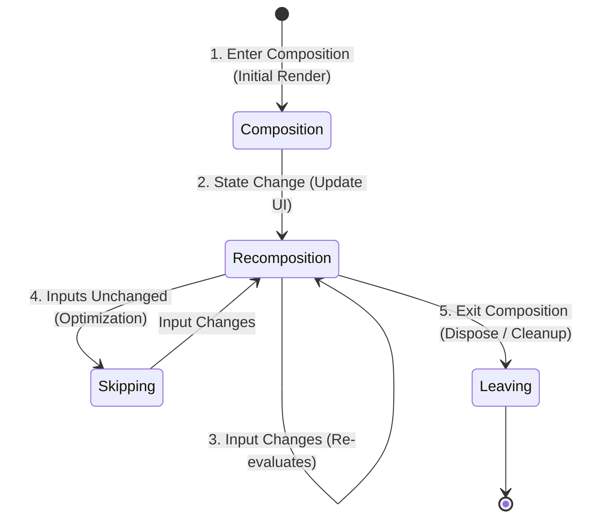
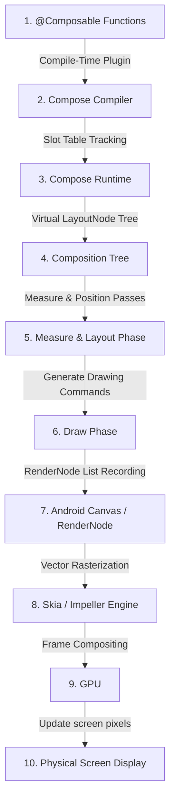
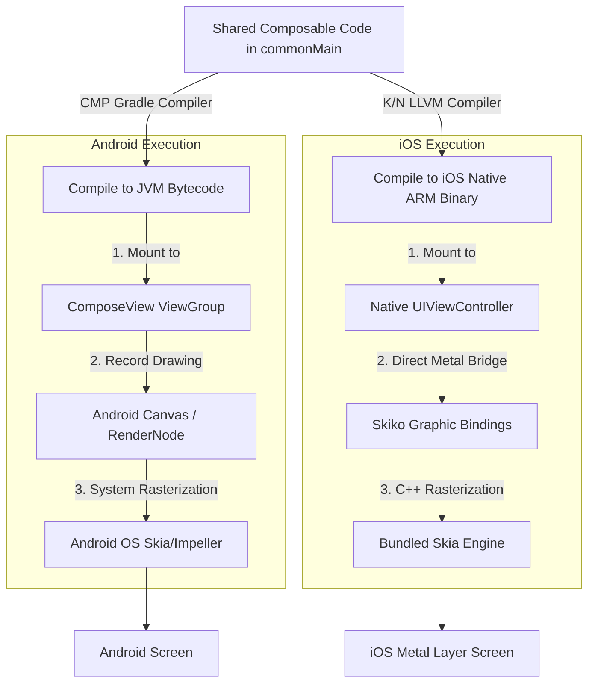
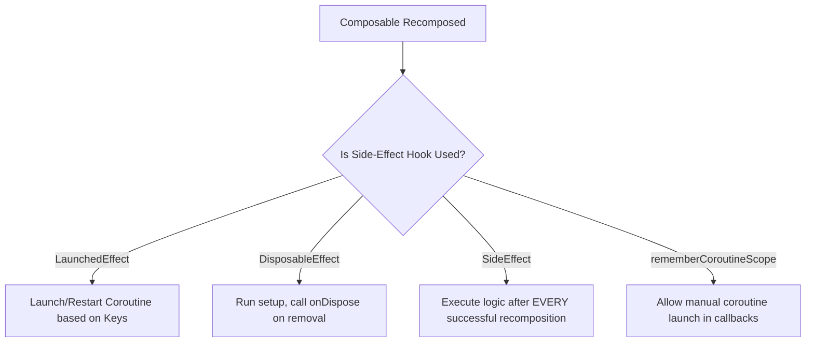
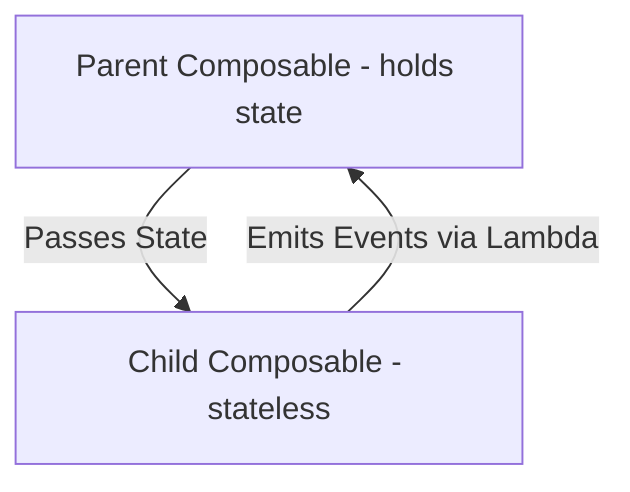
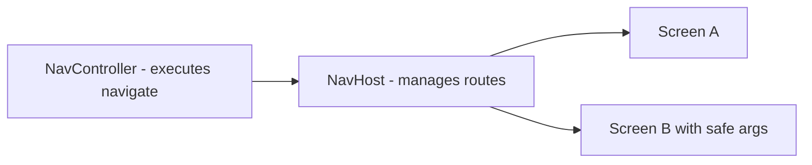
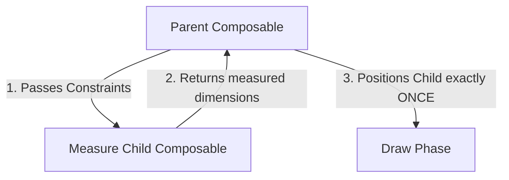
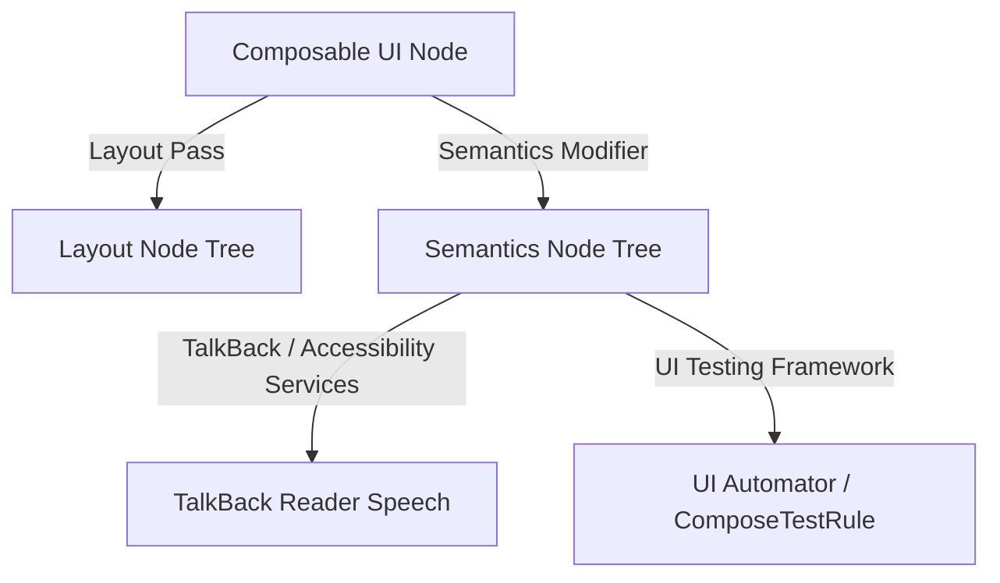

# 🎨 Jetpack Compose & Modern UI Architecture — Complete Interview Preparation Guide

> **Authoritative Technical Reference**
> Every topic follows the same structure — **Definition → Why It Is Used → How It Works Internally → Code Example → Common Pitfalls**.
>
> Updated for **Compose BOM 2025.x**, **Compose Compiler 2.x with strong skipping**, **Material 3**, **Navigation 2.8 type-safe routes**, and **Compose Multiplatform**.
>
> **40 Compose interview questions:** [Section 15](#15-jetpack-compose-interview-questions-40-questions)

---

## 📑 Table of Contents

| # | Module | Key Topics |
|---|---|---|
| 1 | [Composable Lifecycle & Recomposition](#1-composable-lifecycle--recomposition) | Composition phases, rendering pipeline, CMP rendering, compiler internals, slot table, stability |
| 2 | [Side-Effects & Effect APIs](#2-side-effects--effect-apis) | `LaunchedEffect`, `DisposableEffect`, `rememberUpdatedState`, `produceState`, `derivedStateOf`, `snapshotFlow` |
| 3 | [State Management, Restoring & Hoisting](#3-state-management-restoring--hoisting) | State declaration, hoisting, UDF, savers, the snapshot system |
| 4 | [Navigation in Compose](#4-navigation-in-compose) | Safe navigation, arguments, `SavedStateHandle` |
| 5 | [Layouts, Modifiers & Lists](#5-layouts-modifiers-and-list-pagers) | Modifier order, Pager, custom layouts, `SubcomposeLayout`, lazy list keys, `TextFieldState` |
| 6 | [UI Layer Architecture & UDF](#6-ui-layer-architecture--udf) | State holders, event flow, architectural patterns |
| 7 | [Background Processing in Compose](#7-reliable-background-processing-workmanager-in-compose) | WorkManager dispatch and observation |
| 8 | [Semantics & Accessibility Tree](#8-semantics--accessibility-tree) | Semantics properties, merging, invalidation |
| 9 | [Material 3 Theming](#9-material-3-theming-and-design-systems) | Color roles, dynamic color, custom `CompositionLocal` tokens |
| 10 | [Animation APIs](#10-animation-apis) | `animate*AsState`, `Transition`, `AnimatedContent`, `Animatable`, shared elements |
| 11 | [Gestures & Pointer Input](#11-gestures-and-pointer-input) | `pointerInput`, gesture detectors, consumption, nested scroll |
| 12 | [Canvas & Custom Modifiers](#12-canvas-custom-drawing-and-custom-modifiers) | `DrawScope`, `drawWithCache`, `Modifier.Node` |
| 13 | [Performance & Compiler Metrics](#13-compose-performance-and-compiler-metrics) | Stability reports, deferred reads, Macrobenchmark |
| 14 | [Testing Compose UI](#14-testing-compose-ui) | Semantics finders, clock control, screenshot tests, Robolectric |
| 15 | [Interview Questions](#15-interview-questions) | Pointer to the question bank |

---

# 1. Composable Lifecycle & Recomposition

## 1.1 Composable & Its Lifecycle

### Definition
* **Simple:** A `@Composable` function is the fundamental building block of Jetpack Compose. It translates data (state) into UI components. Its lifecycle describes how it enters the composition (creation), gets updated (recomposition), and exits the composition (destruction).
* **Advanced:** A Composable is a Kotlin function annotated with `@Composable` that gets processed by the Compose Compiler plugin. It modifies the runtime composition tree. Its lifecycle is represented by three main phases inside the **Composition**: entering the composition (initial compilation of nodes), repeating 0 or more recompositions (updating nodes on state changes), and leaving the composition (removing nodes and disposing associated resources).



### Why It Is Used
Unlike legacy Android XML views which are stateful objects retained in memory and manually modified via mutations, Composables are stateless execution blocks. This prevents sync errors between data models and UI rendering, drastically reducing memory leaks and UI bugs.

### How It Works Internally
The Compose runtime executes composable functions and records the output in a **Slot Table** (implemented as a **Gap Buffer**).
1. **Initial Composition:** The compiler runs the functions, records calls, parameters, and state variables, and inserts nodes into the Slot Table.
2. **Recomposition:** When a state variable changes, the Compose runtime locates the corresponding slots in the table and re-executes only the composable blocks that read that state.
3. **Leaving the Composition:** When conditions change (e.g., navigating away or hidden views), the node is removed from the Slot Table and any cleanup blocks (e.g., `onDispose`) are triggered.

---

## 1.2 Life Cycle Phases & Smart Recomposition

### Definition
* **Composition** — the tree Compose builds by running your composable functions. It is a description of the UI, not the UI objects themselves.
* **The three phases of a frame** — **Composition** (run composables to build/update the tree), **Layout** (measure and place each node), **Drawing** (render). Compose can skip earlier phases when only a later one is affected.
* **Recomposition** — re-running a composable because a state object it **read** changed. Compose tracks reads, so only the affected composables re-run.
* **Smart recomposition (skipping)** — Compose comparing a composable's parameters against the previous values and **skipping the call entirely** when nothing relevant changed.
* **Enter / leave the composition** — a composable appearing in or disappearing from the tree. This is what starts and cancels `LaunchedEffect` and runs `onDispose`.

### Detailed Breakdown
* **Initial Render (Composition):** The first time Compose builds the view tree.
* **Recomposition:** Triggered automatically when an observed `State` object is mutated. It only re-executes the affected functions.
* **Skipping:** An optimization step. If the arguments passed to a Composable are immutable or stable and have not changed since the last execution pass, the compiler skips running it, returning the cached slot result.
* **Leaving:** The clean-up step. Occurs when a composable is no longer part of the visual tree.

---

## 1.3 The Compose Graphics & Rendering Pipeline

### Definition
* **Rendering pipeline** — the path from your composable functions to pixels on the display.
* **`LayoutNode`** — the node Compose builds per UI element; the tree of them is what actually gets measured, placed, and drawn.
* **`RenderNode` / display list** — the recorded sequence of drawing commands the GPU replays, so a redraw does not require re-running your draw code.
* **`RenderThread`** — the separate thread that replays those commands on the GPU, keeping GPU work off the UI thread.
* **VSync and the frame budget** — the display refresh pulse that paces everything. The whole pipeline must complete within 16.6 ms at 60 Hz, or 8.3 ms at 120 Hz.

### Concept Overview
A common misconception is that Jetpack Compose compiles layout definitions into native Android `View` subclasses (like `LinearLayout`, `FrameLayout`, or `TextView`) at runtime. **This is incorrect.**
Instead, Compose bypasses the traditional Android View system. It processes state declarations, builds a virtual layout node tree, calculates layout sizes, and directly issues drawing commands to Android's low-level graphics pipeline (`Canvas`, `RenderNode`, and the hardware-accelerated `Skia` or `Impeller` engines).

### The Rendering Pipeline Flow



### Detailed Pipeline Mechanics

1. **`@Composable` Functions:**
   * The entry point. The developer writes declarative functions describing the UI state.
2. **Compose Compiler:**
   * During compilation, the Kotlin compiler plugin processes `@Composable` annotations. It injects a `Composer` instance into the function parameters and rewrites the method body to log calls and track state reads.
3. **Compose Runtime:**
   * At runtime, the runtime library manages the **Slot Table** (Gap Buffer). It tracks state reads. When a state changes (e.g., a `MutableState` value is modified), the runtime identifies the affected slots and schedules recomposition.
4. **Composition Tree:**
   * The output of the composition phase. A virtual tree structure made of **`LayoutNode`** objects representing the UI layout metadata, modifiers, and children.
5. **Measure & Layout:**
   * The runtime traverses the `LayoutNode` tree:
     * **Measure:** Parent nodes pass constraints (size boundaries) to child nodes. Child nodes calculate their desired sizes and return their dimensions.
     * **Layout:** Parent nodes position the child nodes relative to their coordinate space. This is executed in a **single pass** ($O(N)$ speed).
6. **Draw Phase:**
   * The `LayoutNode` tree is traversed again. Each node runs its draw modifier chain to record canvas drawing instructions.
7. **Android Canvas / RenderNode:**
   * Drawing commands are recorded into a native Android **`RenderNode`** using a hardware-accelerated **`Canvas`**. Using a `RenderNode` allows the OS to cache and recycle layout visual layers (e.g. scroll offsets, scaling, rotation) without re-executing composition or measurement passes.
8. **Skia / Impeller Graphics Engine:**
   * The native display lists are fed into the OS vector graphics engine (**Skia** on older systems, **Impeller** or Vulkan-based drivers on modern OSs). The engine rasterizes vector operations (shapes, fonts, paths) into pixel matrices.
   * *Note: On iOS/desktop, **Skiko** acts as the bridge connecting Kotlin code directly to this Skia engine.*
9. **GPU:**
   * The GPU receives the rasterized frames to execute blending, shading, and compositing before updating the hardware buffer.
10. **Physical Screen Display:**
    * The display controller outputs the frame buffer to the physical screen synced to VSync refresh cycles (60Hz/120Hz).

---

## 1.4 Compose Multiplatform (CMP) Rendering Architecture: Android vs. iOS

### Definition
* **Compose Multiplatform (CMP)** — running the **same Compose runtime, state system, and layout logic** on platforms other than Android. Only the drawing backend differs.
* **Skia** — the 2D graphics engine (also used by Chrome and Flutter) that CMP draws through on non-Android targets.
* **Skiko** — the Kotlin bindings that let Compose issue Skia commands.
* **The key architectural fact** — CMP does **not** map composables to platform widgets. On iOS it renders custom-drawn content into a single `CAMetalLayer`, so nothing is a `UIView`.
* **What that trades away** — platform behaviors that would otherwise be inherited for free (text selection callouts, system accessibility integration, automatic OS-version updates) must instead be implemented.

### Conceptual Diagram



### Key Differences in execution

| Architectural Dimension | Android Target Execution | iOS Target Execution |
|---|---|---|
| **Compilation Output** | Compiled to JVM Bytecode (`.class` / `.dex`) | Compiled to native ARM machine binaries via LLVM |
| **Window Host container** | Mounts to a native `ComposeView` (`ViewGroup` subclass) | Instantiates a native `UIViewController` controller shell |
| **Drawing Engine** | System-provided `android.graphics.Canvas` APIs | Embedded C++ **Skia** / **Impeller** graphics engine |
| **Framework Bridge** | Direct SDK call integration (native graphics drivers) | **Skiko** (Kotlin-to-C++ bindings for Skia runtime) |
| **Graphics API** | Executes via OS RenderNodes on Vulkan/OpenGL ES | Executes via Skiko directly onto Apple **Metal** layers |
| **Touch/Input Mapping** | Maps standard OS `MotionEvent` calls | Intercepts native UIKit `UITouch` events |

### How it Works Internally on Android
1. The app boots, and the Android compiler mounts the composables to a **`ComposeView`** container attached to the Window.
2. The runtime processes composition, layout measurements, and draw commands.
3. The layout calls compile into native Android drawing commands (`Canvas.drawRect`, `Canvas.drawPath`). These instructions are recorded inside standard system `RenderNode` display lists managed by the OS graphics compositor.

### How it Works Internally on iOS
1. At application launch, the iOS target creates a standard UIKit window hosting a custom **`UIViewController`**.
2. Within this controller, a single native view is created to act as a physical viewport canvas.
3. The Kotlin/Native runtime executes the measurement, layout, and compositing processes inside the LLVM compiled binary block.
4. When executing draw calls, **Skiko** passes drawing vectors to the bundled **Skia** engine, which translates them directly into hardware-accelerated **Metal** framework calls. This draws pixels directly onto the screen without ever interacting with UIKit widgets (like `UIButton` or `UILabel`).

---

## 1.5 Compose Compiler Internals: Composer, Slot Table, and Positional Memoization

### Definition
* **Simple:** The Compose compiler rewrites every `@Composable` function so it can remember what it produced last time and skip re-running when nothing it reads has changed.
* **Advanced:** The compiler plugin adds a `Composer` parameter and a `$changed` bitmask to every composable, and injects `startRestartGroup`/`endRestartGroup` calls. State is stored in a **slot table** — a flat gap-buffer indexed by call-site position, not by variable name.

### Why It Is Used
Without positional memoization, every recomposition would rebuild the entire UI tree. The slot table lets Compose recompose exactly the subtree whose inputs changed, at O(changed) rather than O(tree).

### How It Works Internally

**The compiler transform.** This source:
```kotlin
@Composable
fun Greeting(name: String) {
    Text("Hello $name")
}
```
becomes, conceptually:
```kotlin
fun Greeting(name: String, $composer: Composer, $changed: Int) {
    $composer.startRestartGroup(key = 0x7f3a1b)   // Stable key derived from the call site
    var dirty = $changed
    // Compare the incoming param against the slot-table value from the previous composition
    if ($changed and 0b1110 == 0) dirty = dirty or if ($composer.changed(name)) 0b0100 else 0b0010

    if (dirty and 0b1011 != 0b0010 || !$composer.skipping) {
        Text("Hello $name", $composer, 0)
    } else {
        $composer.skipToGroupEnd()               // SKIPPED — nothing changed, no work done
    }
    // The lambda re-invokes this function when an observed state object invalidates it
    $composer.endRestartGroup()?.updateScope { c, _ -> Greeting(name, c, $changed or 1) }
}
```

**The slot table** is a gap buffer of groups. Each group holds a key, the values `remember` stored, and the child groups. Because indices are *positional*, this is why the classic bug appears:

```kotlin
// BUG: adding an item at the top shifts every position, so every row's remembered
// state (scroll, animation, expansion) attaches to the WRONG item.
LazyColumn { items(users) { user -> UserRow(user) } }

// FIX: a stable key detaches identity from position
LazyColumn { items(users, key = { it.id }) { user -> UserRow(user) } }
```

**Stability determines skippability.** The compiler classifies each parameter type:

| Classification | Meaning | Examples |
|---|---|---|
| **Stable** | `equals` is reliable and public properties do not change without notifying composition | primitives, `String`, `data class` of stable types, `State<T>`, lambdas |
| **Unstable** | Compose cannot prove immutability, so it must assume any change | `List`/`Map`/`Set` interfaces, `var` in a class, types from a module without the Compose compiler |

A composable with any unstable parameter is **not skippable** and recomposes on every parent recomposition.

**Strong skipping mode** (default from Compose Compiler 2.0.20) changes this substantially: composables with unstable parameters become skippable using *instance equality* for unstable params, and lambdas are automatically remembered. It removes most of the manual `@Immutable`/`ImmutableList` work that older Compose code required — but it compares by reference, so a new list instance with identical contents still triggers recomposition.

### Code Example
```kotlin
// Making an unstable type stable — still worth doing under strong skipping,
// because it enables VALUE equality instead of reference equality.
@Immutable                                    // Promise: this never changes after construction
data class UiUser(val id: Long, val name: String, val tags: ImmutableList<String>)

// kotlinx.collections.immutable gives genuinely stable collection types
val tags: ImmutableList<String> = persistentListOf("new", "sale")

// Mark a third-party type stable without owning it, via a stability configuration file:
// compose_compiler_config.conf
//   com.thirdparty.model.*
//   java.time.LocalDate
```

```kotlin
// Deferred reads: the single most effective recomposition fix.
// Reading state in a lambda moves the read to a LATER phase, so only that phase re-runs.

// BAD — reads offset during COMPOSITION, so the whole composable recomposes every frame
@Composable
fun BadScroll(offset: Float) {
    Box(Modifier.offset(x = offset.dp))
}

// GOOD — the lambda is read during LAYOUT, so composition is skipped entirely
@Composable
fun GoodScroll(offsetProvider: () -> Float) {
    Box(Modifier.offset { IntOffset(offsetProvider().roundToInt(), 0) })
}

// Same idea for drawing: Modifier.drawBehind reads during the DRAW phase
Box(Modifier.drawBehind { drawRect(colorProvider()) })
```

### Common Pitfalls
* **Assuming `@Stable`/`@Immutable` are checked.** They are promises to the compiler. Lying about them produces stale UI that is extremely hard to debug.
* **Passing `List<T>` and blaming Compose for recomposition.** Under strong skipping it now skips on reference equality, but a fresh `map {}` each recomposition creates a new reference every time.
* **Unkeyed `LazyColumn` items.** State attaches to the wrong row on insert or reorder.
* **Reading state at the top of a composable when a lambda would do.** Every read subscribes that composable to that state.

---
# 2. Side-Effects & Effect APIs

## 2.1 Side-Effects

### Definition
* **Simple:** A Side-Effect is any work done inside or outside a Composable that affects the app state but is not directly related to drawing the UI (e.g., fetching a network API, writing to a database, displaying a toast/snackbar).
* **Advanced:** A Side-Effect is an operation that escapes the scope of a composable function. Because `@Composable` functions can execute multiple times per frame, on any thread, and can be cancelled mid-execution, side-effects must be wrapped in specialized lifecycle-aware APIs to ensure they execute predictably.



---

## 2.2 Complete Effect APIs Reference

### Definition
* **Side effect** — anything a composable does that is visible outside its own scope: starting a request, writing to a database, registering a listener, logging.
* **Why they need special APIs** — a composable can run many times per frame, in any order, on any thread, and can be cancelled and restarted. Calling a side effect directly in the body would execute it an unpredictable number of times.
* **Effect handler** — an API that runs a side effect at a **defined point** in the composition lifecycle, with defined cancellation.
* **Keys** — the values an effect watches. When a key changes the effect is cancelled and restarted; with a constant key it runs once for the composable's lifetime.
* **Cleanup** — releasing what the effect acquired when it leaves the composition, which `DisposableEffect` makes mandatory.

### 1. `LaunchedEffect`
* **Definition:** Launches a Coroutine scope when entering the composition. If any parameter key changes, it cancels the running coroutine and starts a new one. It automatically cancels execution when leaving the composition.
* **Use Case:** Triggering an API call when a page is opened, or starting a timer tied to a screen.
* **Code Example:**
  ```kotlin
  @Composable
  fun UserProfile(userId: String, viewModel: UserViewModel) {
      LaunchedEffect(userId) { // Cancels previous loading if userId changes
          viewModel.loadUserData(userId)
      }
  }
  ```

### 2. `rememberCoroutineScope`
* **Definition:** Returns a composition-bound CoroutineScope. Useful for launching coroutines in response to non-composable callbacks (like onClick events).
* **Use Case:** Triggering animations or database writes when a user clicks a button.
* **Code Example:**
  ```kotlin
  @Composable
  fun SaveButton(onSave: suspend () -> Unit) {
      val scope = rememberCoroutineScope()
      Button(onClick = {
          scope.launch { onSave() }
      }) {
          Text("Save Changes")
      }
  }
  ```

### 3. `rememberUpdatedState`
* **Definition:** References a value inside an effect without forcing the effect to restart.
* **Use Case:** Long-running operations where an input callback might change, but restarting the effect is expensive or undesirable.
* **Code Example:**
  ```kotlin
  @Composable
  fun TimeoutTimer(onTimeout: () -> Unit) {
      val currentOnTimeout by rememberUpdatedState(onTimeout)
      LaunchedEffect(Unit) {
          delay(5000)
          currentOnTimeout() // Uses the latest updated lambda without resetting delay
      }
  }
  ```

### 4. `DisposableEffect`
* **Definition:** Runs side-effects that require clean-up operations once the composable leaves the composition.
* **Use Case:** Registering and unregistering BroadcastReceivers or location listeners.
* **Code Example:**
  ```kotlin
  @Composable
  fun GPSObserver(sensorManager: SensorManager, listener: SensorEventListener) {
      DisposableEffect(sensorManager) {
          val sensor = sensorManager.getDefaultSensor(Sensor.TYPE_GYROSCOPE)
          sensorManager.registerListener(listener, sensor, SensorManager.SENSOR_DELAY_NORMAL)
          
          onDispose {
              sensorManager.unregisterListener(listener) // Prevent sensor memory leak
          }
      }
  }
  ```

### 5. `SideEffect`
* **Definition:** Executes its block after every successful recomposition. Useful for synchronizing state with non-Compose resources.
* **Use Case:** Logging UI state or passing state parameters to external analytics managers.

### 6. `produceState`
* **Definition:** Converts an external asynchronous data stream (like an RxJava stream or a callback API) into a Compose `State` object.
* **Use Case:** Creating state streams directly inside a composable from non-Flow sources.
* **Code Example:**
  ```kotlin
  @Composable
  fun NetworkState(repository: NetworkRepository): State<ConnectionStatus> {
      return produceState(initialValue = ConnectionStatus.Offline) {
          repository.observeStatus { status ->
              value = status // Automatically updates state
          }
      }
  }
  ```

### 7. `derivedStateOf`
* **Definition:** Computes a state based on other state values, emitting changes only when the calculation result changes.
* **Use Case:** Optimizing scrolling lists where you only want to recompose when a scroll threshold is crossed.

### 8. `snapshotFlow`
* **Definition:** Converts a Compose `State` object into a Kotlin Coroutines `Flow` stream.
* **Use Case:** Listening to state changes (like pager swipes) and executing Flow operators on them.
* **Code Example:**
  ```kotlin
  @Composable
  fun LogPageChanges(pagerState: PagerState) {
      LaunchedEffect(pagerState) {
          snapshotFlow { pagerState.currentPage }
              .collect { page -> Log.d("Pager", "Current Page: $page") }
      }
  }
  ```

### 9. `remember` & `rememberSaveable`
* **`remember`:** Caches a value during composition, survives recompositions, but is cleared on configuration changes.
* **`rememberSaveable`:** Caches a value and saves it into a Bundle, surviving both rotation and background process death.

---

# 3. State Management, Restoring & Hoisting

## 3.1 State in Compose

### Definition
* **Simple:** State is any data value that can change over time. When state changes, the UI updates automatically.
* **Advanced:** State represents the snapshot of UI inputs. Compose uses the observer pattern via `MutableState<T>` to hook state reads to recomposition targets.

### Different Ways to Declare State
```kotlin
// Option 1: Access state wrapper (Requires using state.value)
val state = remember { mutableStateOf(0) }

// Option 2: Delegate property (Use variable directly - Most Preferred)
var value by remember { mutableStateOf("") }

// Option 3: Destructuring (Returns state and setter function)
val (text, setText) = remember { mutableStateOf("") }
```

---

## 3.2 State Hoisting & Unidirectional Data Flow

### Definition
* **State Hoisting:** The process of moving a state variable to the parent composable. This turns a child composable into a stateless component.
* **Unidirectional Data Flow (UDF):** The design pattern where **State** flows down (parent to child) and **Events** flow up (child to parent).



### Benefits of State Hoisting
1. **Single Source of Truth:** Avoids state duplication bugs.
2. **Reusability:** Stateless composables can be rendered in different views with different datasets.
3. **Easy Testing:** You can test stateless composables easily by passing mock state values and asserting event triggers.

---

## 3.3 Saving and Restoring Complex State

### Definition
* **The two failure modes** — a **configuration change** destroys and recreates the Activity, and **process death** destroys everything in memory. `remember` survives neither.
* **`rememberSaveable`** — stores a value in the saved-state `Bundle`, so it survives both.
* **`Saver`** — the adapter telling `rememberSaveable` how to convert an arbitrary type into something a `Bundle` can hold, and back again.
* **`listSaver` / `mapSaver`** — ready-made savers that represent an object as a list or map of primitives.
* **`@Parcelize`** — the alternative: make the type `Parcelable` so no custom saver is needed.
* **The size limit** — the Bundle travels through a Binder transaction capped near 1 MB, so save identifiers and scroll positions, never data payloads.

When using `rememberSaveable`, simple data types (Strings, numbers) are saved automatically. For custom data objects, use these three options:

### 1. `@Parcelize`
Annotate the data class with `@Parcelize` (implements Android `Parcelable`).
```kotlin
@Parcelize
data class UserProfile(val name: String, val age: Int) : Parcelable

// Usage
val profile = rememberSaveable { mutableStateOf(UserProfile("Alice", 25)) }
```

### 2. `mapSaver`
Custom serializer that converts an object into a key-value Map.
```kotlin
data class Book(val title: String, val author: String)

val BookSaver = mapSaver(
    save = { mapOf("title" to it.title, "author" to it.author) },
    restore = { Book(it["title"] as String, it["author"] as String) }
)

// Usage
val book = rememberSaveable(stateSaver = BookSaver) { mutableStateOf(Book("1984", "Orwell")) }
```

### 3. `listSaver`
Converts an object into a list of values.
```kotlin
val BookListSaver = listSaver<Book, Any>(
    save = { listOf(it.title, it.author) },
    restore = { Book(it[0] as String, it[1] as String) }
)
```

---

## 3.4 The Snapshot System

### Definition
* **Simple:** Compose's state system works like a database transaction — each thread sees a consistent view of all state, and changes become visible atomically.
* **Advanced:** `Snapshot` implements multiversion concurrency control (MVCC) over `MutableState` objects. Each state holds a linked list of `StateRecord`s tagged with the snapshot ID that wrote them; a reader walks the list for the newest record visible to its own snapshot.

### Why It Is Used
It is what makes Compose safe to read state from any thread, allows composition to be interrupted and restarted without partially-applied changes, and lets Compose know precisely which composables read which state — the basis of targeted recomposition.

### How It Works Internally
1. **Read observation.** Composition runs inside a snapshot with a read observer. Every `State.value` read is recorded against the currently-composing scope, building the dependency map.
2. **Write observation.** A write creates a new `StateRecord`. The snapshot's write observer marks every scope that read that state as invalid.
3. **Apply.** `Snapshot.apply()` merges records into the global snapshot and notifies apply observers, which schedule a recomposition on the next frame.
4. **Nested/mutable snapshots.** `Snapshot.withMutableSnapshot { }` batches multiple writes so observers see them as a single atomic change, not as intermediate states.

**Why `mutableStateOf` needs a policy:**

| Policy | Triggers Recomposition When |
|---|---|
| `structuralEqualityPolicy()` (default) | `!old.equals(new)` |
| `referentialEqualityPolicy()` | `old !== new` |
| `neverEqualPolicy()` | Always — useful for a mutable object whose contents changed in place |

### Code Example
```kotlin
// Batching writes so observers never see a half-updated state
Snapshot.withMutableSnapshot {
    firstName = "Ada"
    lastName = "Lovelace"
    // Recomposition happens once, after both writes, not between them
}

// Bridging Compose state into a Flow — snapshotFlow reads inside a snapshot,
// so it emits only when the READ value actually changes.
val listState = rememberLazyListState()
LaunchedEffect(listState) {
    snapshotFlow { listState.firstVisibleItemIndex }
        .distinctUntilChanged()
        .filter { it > 5 }
        .collect { analytics.trackDeepScroll(it) }
}

// A mutable object as state needs an explicit policy, or in-place mutation is invisible
var buffer by remember {
    mutableStateOf(StringBuilder(), policy = neverEqualPolicy())
}
fun append(c: Char) {
    buffer.append(c)
    buffer = buffer          // Reassign to trigger the write observer
}

// mutableStateListOf / mutableStateMapOf are observable collections — mutating them
// directly notifies composition, unlike wrapping a plain List in mutableStateOf.
val selected = remember { mutableStateListOf<Long>() }
selected.add(id)             // Recomposes readers automatically
```

### Common Pitfalls
* **Mutating a `List` held in `mutableStateOf`.** The reference never changes, so nothing recomposes. Assign a new list, or use `mutableStateListOf`.
* **Reading state outside composition and expecting observation.** A read in a plain (non-composable, non-snapshot) function is not tracked.
* **Writing state during composition.** It invalidates the scope currently composing and can loop forever. Compose logs "Writing to state during composition"; move the write into an effect or an event handler.
* **`derivedStateOf` for a cheap calculation.** It adds a snapshot-observation layer; it pays off only when it *filters* recompositions (a frequently-changing input producing a rarely-changing output).

---
# 4. Navigation in Compose

## 4.1 Safe Navigation

### Definition
* **Navigation graph** — the declared set of destinations in an app and the connections between them, so routing lives in one reviewable place rather than scattered across screens.
* **`NavController`** — the object that performs navigation and owns the **back stack**.
* **`NavBackStackEntry`** — one entry on that stack. Each is its own `LifecycleOwner`, `ViewModelStoreOwner`, and `SavedStateRegistryOwner`, which is what makes ViewModels scoped to a destination or a flow possible.
* **Type-safe arguments** — arguments checked at **compile time**, so a missing or mistyped one fails the build rather than throwing at runtime.
* **Why arguments must stay small** — they are stored in a `Bundle` bounded by the Binder transaction limit, so you pass an ID and re-fetch.

Navigation in Jetpack Compose is managed by a `NavController` routing through a `NavHost`. Type-safety is achieved using Kotlin Serialization.



### Code Example: Navigation with Safe Arguments & SavedStateHandle
```kotlin
// Define routes as serializable structures
@Serializable
object HomeRoute

@Serializable
data class DetailRoute(val itemId: String)

// Host setup
@Composable
fun AppNavHost(navController: NavHostController = rememberNavController()) {
    NavHost(navController = navController, startDestination = HomeRoute) {
        composable<HomeRoute> {
            HomeScreen(onItemSelect = { id ->
                navController.navigate(DetailRoute(itemId = id))
            })
        }
        composable<DetailRoute> { backStackEntry ->
            // Extract type-safe arguments directly
            val routeArgs = backStackEntry.toRoute<DetailRoute>()
            DetailScreen(routeArgs.itemId)
        }
    }
}
```

### Retrieving Navigation Arguments in ViewModels
```kotlin
@HiltViewModel
class DetailViewModel @Inject constructor(
    savedStateHandle: SavedStateHandle
) : ViewModel() {
    // Automatically populated from DetailRoute serializable fields
    val itemId: String = savedStateHandle.toRoute<DetailRoute>().itemId
}
```

---

# 5. Layouts, Modifiers, and List Pagers

## 5.1 Basic Layouts & Modifiers

### Definition
* **Layout composable** — `Column`, `Row`, and `Box`: the building blocks that arrange children vertically, horizontally, or stacked.
* **`Modifier`** — an ordered, immutable chain describing everything about an element that is not its content: size, padding, background, click handling, semantics.
* **Order is semantics, not style** — each modifier wraps the result of the previous one, so `padding().background()` and `background().padding()` produce visibly different results.
* **Arrangement and Alignment** — `Arrangement` distributes children **along** the layout's main axis; `Alignment` positions them **across** the cross axis.
* **Constraints** — the minimum and maximum width and height a parent passes down, which the child must resolve within.

* **Column:** Arranges children vertically.
* **Row:** Arranges children horizontally.
* **Box:** Overlaps children, equivalent to a FrameLayout.
* **Modifiers:** Decorators that configure layout size, backgrounds, clicks, padding, and gestures.

### Critical Rule: Modifier Order Matters
Modifiers are evaluated sequentially from top to bottom. Swapping the order of padding and background changes the final layout rendering.

```kotlin
// Example 1: Padding is colored Red (background applies to outer bounding box)
Modifier
    .background(Color.Red)
    .padding(16.dp)

// Example 2: Padding is transparent (background only colors child content)
Modifier
    .padding(16.dp)
    .background(Color.Red)
```

---

## 5.2 Lists & Compose Pager (Horizontal/Vertical)

### Definition
* **Lazy layout** — a container that composes only the items currently visible plus a small prefetch buffer, discarding compositions for items scrolled away. A plain `Column` composes **every** child immediately.
* **`LazyColumn` / `LazyRow` / grids** — the lazy equivalents of the basic layouts.
* **`key`** — a stable identity for each item. Without it the slot table identifies items by **position**, so inserting at the top reattaches every item's remembered state to the wrong data.
* **`contentType`** — a hint telling the reuse pool which item compositions are interchangeable, so a header composition is not reused for a body row.
* **Pager** — a horizontally or vertically paging container, where each page snaps into place; `PagerState` exposes the current page and scroll offset.

`LazyColumn` and `LazyRow` are scrolling lists, replacing `RecyclerView`. They only compose visible children.

### HorizontalPager & VerticalPager (Android 15+)
Equivalent to `ViewPager` in Views, these components support swipe-based page navigation.

```kotlin
@Composable
fun MainCarousel() {
    val pagerState = rememberPagerState(pageCount = { 5 })
    
    Column {
        HorizontalPager(
            state = pagerState,
            beyondBoundsPageCount = 1, // Preloads adjacent pages for smooth swipes
            contentPadding = PaddingValues(horizontal = 16.dp),
            modifier = Modifier.fillMaxWidth()
        ) { pageIndex ->
            Card(modifier = Modifier.fillMaxWidth().height(200.di)) {
                Text(text = "Carousel Page $pageIndex", modifier = Modifier.wrapContentSize())
            }
        }
        
        // Simple Page Indicator
        Row(Modifier.align(Alignment.CenterHorizontally).padding(8.dp)) {
            repeat(5) { index ->
                val color = if (pagerState.currentPage == index) Color.DarkGray else Color.LightGray
                Box(Modifier.size(8.dp).background(color, CircleShape).padding(4.dp))
            }
        }
    }
}
```

---

## 5.3 Custom Layouts, SubcomposeLayout & Intrinsics

### Definition
* **Simple:** Custom layouts let you arrange UI elements in ways that standard Column or Row cannot. Intrinsics let Compose query how big a view wants to be before actually placing it.
* **Advanced:** Jetpack Compose implements a single-pass layout system where a child node can only be measured once. Custom layouts are written using the `Layout` composable. `SubcomposeLayout` allows you to defer the composition of some children until the measurement of other children is complete.



### The Single-Pass Measurement Guarantee & Intrinsics
In the legacy View framework, nested layouts with layout weights required multiple measurement passes, leading to an exponential complexity ($O(2^N)$) that drops frames.
To prevent this, Compose enforces **Single-Pass Measurement**: children can only be measured once.
* **Intrinsic Measurements:** If a parent needs to determine its size based on children's constraints before measuring them, it queries their intrinsic properties (e.g. `minIntrinsicWidth`, `maxIntrinsicHeight`). This allows parents to query children's sizing desires without running a full second measurement pass.

### SubcomposeLayout
Standard layouts compose first, then measure, then place. `SubcomposeLayout` breaks this rigid lifecycle by allowing the layout phase to trigger composition of child items dynamically.
* **Use Case:** `LazyColumn` uses `SubcomposeLayout` because it does not know how many items to compose until it measures the viewport size at the layout phase. It then subcomposes only the items that fit.
* **Performance warning:** Subcomposition is more expensive than standard layout composition because it defers composition to the layout phase, bypassing compile-time optimizations. Use it only when child composition depends on parent bounds.

### CompositionLocal Invalidation Scope
* **`staticCompositionLocalOf`:** Creates a `CompositionLocal` that does not track reads. If the value provided changes, the *entire* subtree content inside the provider is recomposed from scratch. Use this for values that rarely change (like context, themes, density wrappers).
* **`compositionLocalOf`:** Creates a `CompositionLocal` that tracks reads. If the value changes, only the specific composables that read the value are invalidated. Use this for values that can change frequently.

---

## 5.4 Lazy Lists: Keys, Content Types, and Performance

### Definition
* **Lazy list** — a scrolling container that composes only the visible window plus a prefetch buffer, so list cost is proportional to what is on screen rather than to the data set.
* **Slot table identity** — Compose remembers state by **call-site position** by default. In a list, that means position *is* identity unless you say otherwise.
* **`key`** — the stable identifier that decouples an item's remembered state from its position, so inserts, removals, and reorders keep state attached to the right item.
* **`contentType`** — declares which item compositions can be reused for one another, letting the pool match like-for-like rather than forcing a full recomposition.
* **`animateItem()`** — the built-in insert, removal, and reorder animation, which relies entirely on `key` to know what moved where.

### Why It Is Used
A `Column` inside a `verticalScroll` composes **every** child immediately. With 1,000 items that is 1,000 compositions before the first frame. Lazy layouts compose roughly the visible window instead.

### How It Works Internally
* **`LazyLayout`** measures only the items intersecting the viewport, plus a prefetch window. Item compositions are stored in a `SubcomposeLayoutState` reuse pool.
* **`key`** gives each item a stable identity in the slot table. Without it, position is identity, so inserting at the top reassociates every item's remembered state with the wrong data.
* **`contentType`** tells the reuse pool which compositions are interchangeable. Reusing a "header" composition for an "item" slot forces a full re-composition instead of a cheap update; declaring content types makes the pool match like-for-like.

### Code Example
```kotlin
@Composable
fun Feed(items: List<FeedEntry>, onClick: (Long) -> Unit) {
    val listState = rememberLazyListState()

    LazyColumn(
        state = listState,
        contentPadding = PaddingValues(vertical = 8.dp),
        verticalArrangement = Arrangement.spacedBy(8.dp)
    ) {
        items(
            items = items,
            key = { it.id },                                    // Stable identity: required
            contentType = { it::class }                         // Reuse like-for-like compositions
        ) { entry ->
            when (entry) {
                is FeedEntry.Article -> ArticleCard(
                    entry,
                    // Pass a lambda, not a captured value, so the row is not re-created per scroll
                    onClick = remember(entry.id) { { onClick(entry.id) } },
                    // animateItem gives free reorder/insert/remove animation, keyed by `key`
                    modifier = Modifier.animateItem()
                )
                is FeedEntry.Ad -> AdSlot(entry)
            }
        }

        // Paging footer
        item(key = "loader", contentType = "loader") {
            if (items.isNotEmpty()) LoadingRow()
        }
    }

    // Endless scroll driven off snapshotFlow, so it does not recompose the list
    LaunchedEffect(listState) {
        snapshotFlow {
            val layout = listState.layoutInfo
            (layout.visibleItemsInfo.lastOrNull()?.index ?: 0) to layout.totalItemsCount
        }
            .distinctUntilChanged()
            .filter { (last, total) -> total > 0 && last >= total - 5 }
            .collect { onLoadMore() }
    }
}
```

```kotlin
// Paging 3 in Compose
@Composable
fun PagedFeed(viewModel: FeedViewModel) {
    val items = viewModel.pagedFlow.collectAsLazyPagingItems()

    LazyColumn {
        items(
            count = items.itemCount,
            key = items.itemKey { it.id },                       // Paging-aware key helper
            contentType = items.itemContentType { "feed" }
        ) { index ->
            // A null item is a placeholder that has not loaded yet
            items[index]?.let { ArticleCard(it) } ?: PlaceholderCard()
        }

        when (val append = items.loadState.append) {
            is LoadState.Loading -> item { LoadingRow() }
            is LoadState.Error -> item { ErrorRow(append.error) { items.retry() } }
            else -> Unit
        }
    }
}
```

### Common Pitfalls
* **Nesting a `LazyColumn` inside another `LazyColumn`** with the same scroll axis throws — the inner one has infinite height constraints. Flatten into one list using multiple `item`/`items` blocks.
* **Fixing the item height with `Modifier.height`** to work around measurement problems, breaking font scaling.
* **Using the index as `key`.** That is identical to having no key at all.
* **Creating a new lambda per item per recomposition.** Under strong skipping lambdas are auto-remembered, but a lambda capturing a changing value still allocates. Hoist it.
* **`Modifier.animateItem()` without a stable `key`.** Animation targets the wrong rows.

---

## 5.5 Text and TextField State

### Definition
* **The problem with the value/callback API** — with `TextField(value, onValueChange)` every keystroke round-trips through your state. Any latency in that path (a slow ViewModel, a debounce, async validation) makes the cursor jump or characters drop.
* **`TextFieldState`** — an object that owns the text, the selection, and the composition region directly, so edits apply to the field immediately and you **observe** changes rather than mediating them.
* **`InputTransformation`** — a filter applied **before** an edit is accepted, used to reject characters or cap length.
* **`OutputTransformation`** — changes only what is **displayed** (formatting a phone number) while the stored value remains unformatted.

### Why It Is Used
The old `TextField(value, onValueChange)` API had a structural problem: the value round-trips through your state on every keystroke, so any latency (a slow ViewModel, a debounce, an async validation) makes the cursor jump or characters drop. `TextFieldState` keeps the edit buffer in the field, eliminating the race entirely.

### How It Works Internally
`TextFieldState` owns the text, selection, and composition region as snapshot state. Edits apply directly to it; you observe changes rather than mediating them. `InputTransformation` filters keystrokes before they are applied, and `OutputTransformation` changes only what is displayed (formatting) without touching the stored value.

### Code Example
```kotlin
@Composable
fun PhoneNumberField(state: TextFieldState) {
    BasicTextField(
        state = state,
        // Reject non-digits and cap the length BEFORE the edit is applied
        inputTransformation = InputTransformation
            .maxLength(10)
            .then { if (!asCharSequence().all(Char::isDigit)) revertAllChanges() },
        // Display formatting only; state.text remains "5551234567"
        outputTransformation = {
            if (length >= 3) insert(3, "-")
            if (length >= 7) insert(7, "-")
        },
        keyboardOptions = KeyboardOptions(keyboardType = KeyboardType.Phone),
        lineLimits = TextFieldLineLimits.SingleLine
    )
}

// The ViewModel owns the state object; no per-keystroke round trip
class SignUpViewModel : ViewModel() {
    val email = TextFieldState()
    val password = TextFieldState()

    // React to edits without mediating them
    val emailError: StateFlow<String?> = snapshotFlow { email.text.toString() }
        .debounce(300)
        .map { if (it.isEmpty() || Patterns.EMAIL_ADDRESS.matcher(it).matches()) null else "Invalid email" }
        .stateIn(viewModelScope, SharingStarted.WhileSubscribed(5_000), null)

    fun submit() = viewModelScope.launch {
        repo.signUp(email.text.toString(), password.text.toString())
    }
}

// Survives config change and process death
val notes = rememberTextFieldState()          // rememberSaveable semantics built in
```

```kotlin
// Rich text with inline annotations and click handling
@Composable
fun TermsText(onLinkClick: (String) -> Unit) {
    val text = buildAnnotatedString {
        append("I agree to the ")
        withLink(
            LinkAnnotation.Clickable("terms", linkInteractionListener = { onLinkClick("terms") })
        ) {
            withStyle(SpanStyle(color = MaterialTheme.colorScheme.primary,
                                textDecoration = TextDecoration.Underline)) {
                append("Terms of Service")
            }
        }
    }
    Text(text)
}
```

### Common Pitfalls
* **Hoisting `TextField` value into a ViewModel `StateFlow` with the old API.** Any asynchrony causes cursor jumps and dropped characters. Use `TextFieldState`, or keep the value in local `remember` state with the old API.
* **Validating on every keystroke and showing the error immediately.** Debounce, and show errors on blur or submit.
* **Forgetting `imePadding()`.** The keyboard covers the field being typed into.
* **Hardcoding `KeyboardType`.** Getting `Password`, `Email`, and `Number` right materially improves the experience.

---
# 6. UI Layer Architecture & UDF

The UI Layer comprises two main sections:
1. **UI State:** The immutable state structure rendering the screen.
2. **UI Elements:** The Composable functions displaying state.


### Architectural Code Pattern
```kotlin
// 1. Immutable State Definition
data class TasksUiState(
    val isLoading: Boolean = false,
    val tasksList: List<String> = emptyList(),
    val errorMessage: String? = null
)

// 2. ViewModel State Holder
class TasksViewModel(private val repository: TaskRepository) : ViewModel() {
    private val _uiState = MutableStateFlow(TasksUiState())
    val uiState = _uiState.asStateFlow()

    fun loadTasks() {
        _uiState.update { it.copy(isLoading = true) }
        viewModelScope.launch {
            try {
                val list = repository.getTasks()
                _uiState.update { it.copy(isLoading = false, tasksList = list) }
            } catch (e: Exception) {
                _uiState.update { it.copy(isLoading = false, errorMessage = e.localizedMessage) }
            }
        }
    }
}
```

---

# 7. Reliable Background Processing (WorkManager in Compose)

## 7.1 Integrating WorkManager with Compose

While Compose manages the UI layer, background tasks must be reliable. We can trigger persistent background tasks (e.g. syncing, log uploads) from Compose using side-effects or state interactions.

### Code Example: Dispatching and Observing WorkManager in Compose
```kotlin
@Composable
fun SyncDashboard(context: Context) {
    val workManager = remember { WorkManager.getInstance(context) }
    
    // Live stream observation of WorkInfo inside Compose
    val workInfos by workManager
        .getWorkInfosForUniqueWorkLiveData("DataSyncUniqueWork")
        .observeAsState(initial = emptyList())
        
    val syncState = workInfos.firstOrNull()?.state

    Column(Modifier.padding(16.dp)) {
        Text("Sync Status: ${syncState ?: "Not Started"}")
        
        Button(onClick = {
            val constraints = Constraints.Builder()
                .setRequiredNetworkType(NetworkType.CONNECTED)
                .build()
                
            val syncRequest = OneTimeWorkRequestBuilder<SyncWorker>()
                .setConstraints(constraints)
                .build()
                
            workManager.enqueueUniqueWork(
                "DataSyncUniqueWork",
                ExistingWorkPolicy.REPLACE,
                syncRequest
            )
        }) {
            Text("Trigger Data Sync")
        }
    }
}
```

---

# 8. Semantics & Accessibility Tree

### Definition
* **Simple:** The Semantics tree contains metadata about your UI components so that screen readers (like TalkBack) can read screen content to visually impaired users.
* **Advanced:** The Semantics tree runs parallel to the layout node tree in the Compose runtime. It contains semantic representations of the UI components (e.g., properties like `contentDescription`, `role`, `heading`, or actions like `onClick`) used by accessibility services and the testing framework (UI Automator).



### Why It Is Used
Composables do not map directly to standard Android OS `View` objects, meaning accessibility services cannot read them naturally. Compose generates the Semantics tree to communicate state and metadata to the OS accessibility framework.

### Invalidation & Custom Semantics
You can manipulate semantic properties using `Modifier.semantics` or `Modifier.clearAndSetSemantics` (which clears children's semantics and treats the parent as a single accessible node).

---

# 9. Material 3 Theming and Design Systems

## 9.1 MaterialTheme, Color Schemes, and Dynamic Color

### Definition
* **Simple:** `MaterialTheme` supplies colors, typography, and shapes to everything inside it, so a component never hardcodes a color.
* **Advanced:** `MaterialTheme` is a composable that provides three `CompositionLocal`s — `LocalColorScheme`, `LocalTypography`, `LocalShapes` — read by every Material component.

### Why It Is Used
Theming through `CompositionLocal` means a single provider swap changes the whole app's appearance: dark mode, dynamic color from the wallpaper, or a white-label brand variant, with no component changes.

### How It Works Internally
Material 3 defines semantic **color roles** rather than raw colors. Each role has an "on" counterpart guaranteed to meet contrast requirements against it — `primary`/`onPrimary`, `surface`/`onSurface`. Using roles is what makes dark mode and dynamic color work automatically.

| Role | Use For |
|---|---|
| `primary` / `onPrimary` | Main actions, FAB, selected states |
| `secondary` / `onSecondary` | Less prominent accents, filter chips |
| `surface` / `onSurface` | Card and sheet backgrounds, body text |
| `surfaceContainer*` | The M3 elevation system (low/high tint levels) |
| `error` / `onError` | Validation and destructive actions |
| `outline` | Borders and dividers |

**Dynamic color** (Android 12+) derives a full tonal palette from the user's wallpaper via `dynamicLightColorScheme()`. It must fall back to your brand scheme on older APIs.

### Code Example
```kotlin
private val BrandLight = lightColorScheme(
    primary = Color(0xFF6750A4),
    onPrimary = Color.White,
    surface = Color(0xFFFFFBFE),
    onSurface = Color(0xFF1C1B1F),
    error = Color(0xFFB3261E)
)
private val BrandDark = darkColorScheme(
    primary = Color(0xFFD0BCFF),
    onPrimary = Color(0xFF381E72),
    surface = Color(0xFF1C1B1F),
    onSurface = Color(0xFFE6E1E5)
)

@Composable
fun AppTheme(
    darkTheme: Boolean = isSystemInDarkTheme(),
    dynamicColor: Boolean = true,
    content: @Composable () -> Unit
) {
    val colorScheme = when {
        dynamicColor && Build.VERSION.SDK_INT >= Build.VERSION_CODES.S -> {
            val ctx = LocalContext.current
            if (darkTheme) dynamicDarkColorScheme(ctx) else dynamicLightColorScheme(ctx)
        }
        darkTheme -> BrandDark
        else -> BrandLight
    }

    MaterialTheme(
        colorScheme = colorScheme,
        typography = AppTypography,
        shapes = AppShapes,
        content = content
    )
}
```

```kotlin
// Extending the theme with tokens Material does not define.
// A CompositionLocal is the correct mechanism — never a global object.
@Immutable
data class AppExtraColors(val success: Color, val warning: Color, val brandGradient: Brush)

val LocalExtraColors = staticCompositionLocalOf {
    error("AppExtraColors not provided — wrap the tree in AppTheme")
}

@Composable
fun AppTheme(darkTheme: Boolean = isSystemInDarkTheme(), content: @Composable () -> Unit) {
    val extras = if (darkTheme) DarkExtras else LightExtras
    CompositionLocalProvider(LocalExtraColors provides extras) {
        MaterialTheme(colorScheme = if (darkTheme) BrandDark else BrandLight, content = content)
    }
}

// Usage — reads like a first-class part of the theme
Text("Saved", color = LocalExtraColors.current.success)
```

```kotlin
// Correct vs incorrect color usage
Surface(color = MaterialTheme.colorScheme.surface) {
    Text("Body", color = MaterialTheme.colorScheme.onSurface)   // Contrast guaranteed
}
// Text("Body", color = Color(0xFF000000))    // WRONG: invisible in dark mode
```

### Common Pitfalls
* **Hardcoding hex colors in components.** They break dark mode and dynamic color, and cannot be white-labelled.
* **`staticCompositionLocalOf` for frequently-changing values.** It does not track reads, so changing it recomposes the entire subtree. Use `compositionLocalOf` for values that change at runtime and `staticCompositionLocalOf` for values that effectively never change.
* **Shipping dynamic color without checking contrast on real wallpapers.** Some derived palettes are legal but visually poor for brand-critical surfaces.
* **Mixing Material 2 and Material 3 imports.** They provide different `CompositionLocal`s and produce runtime crashes about a missing theme.

---

# 10. Animation APIs

## 10.1 Choosing the Right Animation API

### Definition
* **Animation** — interpolating a value over time and driving it from the frame clock, so the UI moves continuously rather than jumping between states.
* **The ladder** — Compose offers several APIs from one-line value animation to fully manual control. Choosing the lowest one that does the job keeps the code short and correct.
* **`AnimationSpec`** — the *character* of the motion: `tween` (a fixed duration and easing curve), `spring` (physics-based, defined by stiffness and damping), `keyframes` (explicit values at points in time).
* **Interruptibility** — whether an in-flight animation can change target smoothly. It is the property that separates `animate*AsState` from `Animatable`, and it is what gesture-driven motion requires.
* **`label`** — a name that makes an animation identifiable in the Animation Inspector.

### Why It Is Used
Picking the lowest-level API that does the job keeps animation code short and correct. Reaching for `Animatable` when `animateFloatAsState` would do produces state-management bugs; the reverse produces animations that cannot be interrupted properly.

### How It Works Internally
All of them run on the Compose frame clock (`withFrameNanos`), driven by `Choreographer`. They write into snapshot state, so a running animation continuously invalidates whatever reads it — which is why reading an animated value inside a lambda (deferred read) instead of at composition time is so much cheaper.

| API | Use For |
|---|---|
| `animate*AsState` | A single value moving to a new target |
| `updateTransition` | Several values driven by one state change, kept in sync |
| `AnimatedVisibility` | Enter/exit of a whole composable |
| `AnimatedContent` | Swapping between two different contents |
| `Crossfade` | Simple fade between contents |
| `rememberInfiniteTransition` | Loading shimmers, pulsing indicators |
| `Animatable` | Gesture-driven, interruptible, needs `snapTo`/`animateTo` control |
| `Modifier.animateContentSize` | Automatic size change animation |
| `Modifier.animateItem` | Lazy list insert/remove/reorder |

### Code Example
```kotlin
// 1. Single value
@Composable
fun ExpandButton(expanded: Boolean) {
    val rotation by animateFloatAsState(
        targetValue = if (expanded) 180f else 0f,
        animationSpec = spring(dampingRatio = Spring.DampingRatioMediumBouncy),
        label = "chevron"                       // Required for the animation inspector
    )
    Icon(Icons.Default.ExpandMore, null, Modifier.graphicsLayer { rotationZ = rotation })
}

// 2. Several values from one state — Transition keeps them perfectly in sync
@Composable
fun SelectableCard(selected: Boolean, content: @Composable () -> Unit) {
    val transition = updateTransition(selected, label = "selection")

    val borderWidth by transition.animateDp(label = "border") { if (it) 2.dp else 0.dp }
    val elevation by transition.animateDp(label = "elevation") { if (it) 8.dp else 1.dp }
    val color by transition.animateColor(label = "bg") {
        if (it) MaterialTheme.colorScheme.primaryContainer else MaterialTheme.colorScheme.surface
    }

    Card(
        border = BorderStroke(borderWidth, MaterialTheme.colorScheme.primary),
        elevation = CardDefaults.cardElevation(elevation),
        colors = CardDefaults.cardColors(containerColor = color),
        content = { content() }
    )
}

// 3. Enter/exit
AnimatedVisibility(
    visible = showBanner,
    enter = slideInVertically { -it } + fadeIn(),
    exit = slideOutVertically { -it } + fadeOut()
) { OfferBanner() }

// 4. Content swap with direction-aware transitions
AnimatedContent(
    targetState = step,
    transitionSpec = {
        if (targetState > initialState) {
            slideInHorizontally { it } togetherWith slideOutHorizontally { -it }
        } else {
            slideInHorizontally { -it } togetherWith slideOutHorizontally { it }
        }.using(SizeTransform(clip = false))
    },
    label = "wizard"
) { current -> WizardStep(current) }

// 5. Infinite shimmer
@Composable
fun ShimmerBox(modifier: Modifier = Modifier) {
    val transition = rememberInfiniteTransition(label = "shimmer")
    val x by transition.animateFloat(
        initialValue = -300f, targetValue = 300f,
        animationSpec = infiniteRepeatable(tween(1200, easing = LinearEasing)),
        label = "x"
    )
    Box(
        modifier.drawWithCache {         // drawWithCache: brush rebuilt only on size change
            val brush = Brush.linearGradient(
                listOf(Color.LightGray, Color.White, Color.LightGray),
                start = Offset(x, 0f), end = Offset(x + 200f, 0f)
            )
            onDrawBehind { drawRect(brush) }
        }
    )
}

// 6. Gesture-driven, interruptible
@Composable
fun DraggableSheet() {
    val offsetY = remember { Animatable(0f) }
    val scope = rememberCoroutineScope()

    Box(
        Modifier
            .offset { IntOffset(0, offsetY.value.roundToInt()) }   // Deferred read: layout phase only
            .pointerInput(Unit) {
                detectVerticalDragGestures(
                    onVerticalDrag = { _, delta ->
                        // snapTo cancels any running animation and follows the finger exactly
                        scope.launch { offsetY.snapTo(offsetY.value + delta) }
                    },
                    onDragEnd = {
                        scope.launch {
                            // Animatable preserves velocity across the handoff, so the fling feels natural
                            offsetY.animateTo(0f, spring(stiffness = Spring.StiffnessLow))
                        }
                    }
                )
            }
    )
}
```

```kotlin
// Shared element transitions (Compose 1.7+): one element visually persists across screens
@OptIn(ExperimentalSharedTransitionApi::class)
@Composable
fun SharedNav() {
    SharedTransitionLayout {
        NavHost(navController, startDestination = List) {
            composable<List> {
                ProductGrid(
                    imageModifier = { id ->
                        Modifier.sharedElement(
                            rememberSharedContentState(key = "image-$id"),
                            animatedVisibilityScope = this@composable
                        )
                    }
                )
            }
            composable<Detail> { entry ->
                val id = entry.toRoute<Detail>().id
                ProductDetail(
                    imageModifier = Modifier.sharedElement(
                        rememberSharedContentState(key = "image-$id"),   // Same key = same element
                        animatedVisibilityScope = this@composable
                    )
                )
            }
        }
    }
}
```

### Common Pitfalls
* **Reading an animated value at composition time** (`Modifier.offset(x = value.dp)`) instead of in a lambda (`Modifier.offset { }`). The first recomposes every frame; the second only re-lays-out.
* **Omitting `label`.** The Animation Inspector shows unnamed animations, making them impossible to debug.
* **Animating layout properties when a `graphicsLayer` would do.** `graphicsLayer` changes only draw, skipping measure and layout entirely.
* **`Animatable` recreated on recomposition.** Wrap it in `remember`, or the animation restarts constantly.
* **Not respecting reduced-motion preferences.** Check `Settings.Global.ANIMATOR_DURATION_SCALE` for accessibility.

---

# 11. Gestures and Pointer Input

## 11.1 The Pointer Input Pipeline

### Definition
* **Pointer event** — one report of a finger or stylus: its position, and whether it went down, moved, or lifted.
* **`Modifier.pointerInput`** — gives a composable a **coroutine scope** that receives those events, so a multi-stage gesture reads as sequential code instead of a state machine.
* **Gesture detector** — a higher-level helper built on that scope: `detectTapGestures`, `detectDragGestures`, `detectTransformGestures`.
* **Passes** — events travel in three rounds: **Initial** (parent first, the chance to intercept), **Main** (child first, normal handling), **Final** (parent first, cleanup).
* **Consumption** — `change.consume()` marks an event handled so ancestors skip it. It is Compose's replacement for `requestDisallowInterceptTouchEvent`.
* **The key restart** — `pointerInput(key)` cancels and restarts its block when the key changes, which is why an unstable key breaks a drag in progress.

### Why It Is Used
Compose replaces the View system's three-method dispatch with a coroutine model: you `await` events in sequence, which makes multi-stage gestures (long-press then drag, tap then double-tap) read as straight-line code instead of a state machine.

### How It Works Internally
* Events flow down the modifier chain in three passes: **Initial** (parent first — the interception opportunity), **Main** (child first — normal handling), **Final** (parent first — cleanup).
* `PointerInputChange.consume()` marks an event as handled so ancestors skip it. This replaces `requestDisallowInterceptTouchEvent`.
* `pointerInput(key)` restarts its block when the key changes. Passing a value that changes every recomposition cancels the in-progress gesture — the most common Compose gesture bug.

| Detector | Handles |
|---|---|
| `detectTapGestures` | tap, double tap, long press, press |
| `detectDragGestures` | free drag in any direction |
| `detectVerticalDragGestures` / `Horizontal` | axis-locked drag |
| `detectTransformGestures` | pan + zoom + rotate together |
| `Modifier.draggable` | one-axis drag with a `DraggableState` |
| `Modifier.scrollable` | scroll with fling physics |
| `Modifier.nestedScroll` | cooperation between nested scrollables |

### Code Example
```kotlin
// Pinch-zoom + pan + rotate on an image
@Composable
fun ZoomableImage(painter: Painter) {
    var scale by remember { mutableFloatStateOf(1f) }
    var offset by remember { mutableStateOf(Offset.Zero) }
    var rotation by remember { mutableFloatStateOf(0f) }

    Image(
        painter = painter,
        contentDescription = null,
        modifier = Modifier
            .fillMaxSize()
            // graphicsLayer applies the transform at DRAW time: no relayout, no recomposition
            .graphicsLayer {
                scaleX = scale; scaleY = scale
                translationX = offset.x; translationY = offset.y
                rotationZ = rotation
            }
            // Unit key: the gesture handler is installed once and never restarts
            .pointerInput(Unit) {
                detectTransformGestures { _, pan, zoom, rot ->
                    scale = (scale * zoom).coerceIn(1f, 5f)
                    offset += pan
                    rotation += rot
                }
            }
    )
}

// Multi-stage gesture: long-press to enter reorder mode, then drag
@Composable
fun ReorderableRow(onReorder: (Int, Int) -> Unit, index: Int) {
    var dragging by remember { mutableStateOf(false) }

    Box(
        Modifier.pointerInput(index) {
            awaitEachGesture {
                val down = awaitFirstDown(requireUnconsumed = false)
                val longPress = awaitLongPressOrCancellation(down.id) ?: return@awaitEachGesture
                dragging = true
                longPress.consume()              // Claim the gesture from ancestors

                // Now drive the drag until the finger lifts
                drag(longPress.id) { change ->
                    onDragBy(change.positionChange())
                    change.consume()
                }
                dragging = false
            }
        }
    )
}

// Nested scroll: a collapsing toolbar consumes scroll before the list does
@Composable
fun CollapsingHeaderScreen() {
    var headerHeight by remember { mutableFloatStateOf(MAX_HEADER) }

    val connection = remember {
        object : NestedScrollConnection {
            // onPreScroll runs BEFORE the child scrolls, so the header collapses first
            override fun onPreScroll(available: Offset, source: NestedScrollSource): Offset {
                val delta = available.y
                val newHeight = (headerHeight + delta).coerceIn(MIN_HEADER, MAX_HEADER)
                val consumed = newHeight - headerHeight
                headerHeight = newHeight
                return Offset(0f, consumed)      // Report what we took; the list gets the remainder
            }
        }
    }

    Box(Modifier.nestedScroll(connection)) {
        LazyColumn(contentPadding = PaddingValues(top = headerHeight.dp)) { /* ... */ }
        Header(Modifier.height(headerHeight.dp))
    }
}
```

### Common Pitfalls
* **An unstable `pointerInput` key.** `pointerInput(someChangingState)` cancels and restarts the gesture mid-drag. Use `Unit` and read the changing value from state inside the block, or key on something genuinely stable.
* **Forgetting `change.consume()`.** Parents also handle the event, producing double-handled gestures.
* **`clickable` on a large container swallowing child taps.** Put the click on the smallest element that needs it.
* **Animating position via `offset(x = state.dp)` during a drag.** Use `graphicsLayer` or the lambda `offset {}` overload to stay off the composition path.
* **Ignoring `ViewConfiguration.touchSlop`.** Hardcoded thresholds feel wrong on different densities.

---

# 12. Canvas, Custom Drawing, and Custom Modifiers

## 12.1 Canvas and the Draw Scope

### Definition
* **Canvas** — a surface for issuing drawing commands directly, rather than composing existing UI elements.
* **`DrawScope`** — the receiver inside a draw block, providing `drawRect`, `drawPath`, `drawArc`, and the element's `size`. It works in **pixels**, so `dp` values must be converted with `toPx()`.
* **Why draw instead of compose** — a chart or progress indicator built from composables costs composition and layout for every element; drawn directly it is a single node with no layout children.
* **`drawBehind` vs `drawWithContent` vs `drawWithCache`** — behind the content, around the content (you call `drawContent()` where you want it), or a cached setup block plus a draw block.
* **Why caching matters** — the draw lambda runs on **every frame**, so any `Path` or `Brush` allocated inside it is allocated per frame.

### Why It Is Used
Charts, progress indicators, signature pads, and decorative effects are far cheaper as a single draw call than as a hierarchy of composables — and they skip composition and layout entirely.

### How It Works Internally
`DrawScope` records into the same display list the rest of Compose uses, so drawing participates in the normal render pipeline. `drawWithCache` gives a build-once/draw-many split: expensive objects (a `Brush`, a `Path`) are constructed in the cache block, which re-runs only when size or a captured key changes.

| API | Draws | When to Use |
|---|---|---|
| `Canvas(modifier)` | Only your content | The whole composable is custom drawing |
| `Modifier.drawBehind { }` | Behind the composable's content | Backgrounds, highlights |
| `Modifier.drawWithContent { }` | Around content (`drawContent()`) | Overlays, scrims, masks |
| `Modifier.drawWithCache { }` | Cached setup + draw | Anything allocating a Brush/Path |

### Code Example
```kotlin
@Composable
fun SparklineChart(points: List<Float>, modifier: Modifier = Modifier) {
    val lineColor = MaterialTheme.colorScheme.primary
    val fillBrush = remember(lineColor) {
        Brush.verticalGradient(listOf(lineColor.copy(alpha = 0.3f), Color.Transparent))
    }

    Canvas(modifier) {
        if (points.size < 2) return@Canvas

        val max = points.max()
        val min = points.min()
        val range = (max - min).takeIf { it > 0f } ?: 1f
        val stepX = size.width / (points.size - 1)

        val path = Path().apply {
            points.forEachIndexed { i, value ->
                val x = i * stepX
                val y = size.height - ((value - min) / range) * size.height
                if (i == 0) moveTo(x, y) else lineTo(x, y)
            }
        }

        // Filled area under the line
        val fillPath = Path().apply {
            addPath(path)
            lineTo(size.width, size.height)
            lineTo(0f, size.height)
            close()
        }
        drawPath(fillPath, fillBrush)
        drawPath(path, lineColor, style = Stroke(width = 2.dp.toPx(), cap = StrokeCap.Round))
    }
}

// drawWithCache: the Path is rebuilt only when the size changes, not on every frame
@Composable
fun TicketShape(content: @Composable () -> Unit) {
    Box(
        Modifier.drawWithCache {
            val notchRadius = 12.dp.toPx()
            val path = Path().apply {
                addRoundRect(RoundRect(size.toRect(), CornerRadius(16.dp.toPx())))
                addOval(Rect(Offset(0f, size.height / 2), notchRadius))
            }
            onDrawBehind { drawPath(path, Color.White) }
        }
    ) { content() }
}

// Text measurement inside a Canvas
@Composable
fun LabelledArc(label: String) {
    val measurer = rememberTextMeasurer()
    val style = MaterialTheme.typography.labelMedium
    Canvas(Modifier.size(120.dp)) {
        val layout = measurer.measure(label, style)
        drawText(layout, topLeft = Offset(
            (size.width - layout.size.width) / 2,
            (size.height - layout.size.height) / 2
        ))
    }
}
```

### Common Pitfalls
* **Allocating a `Path` or `Brush` inside the draw lambda.** It runs every frame. Use `drawWithCache` or `remember`.
* **Reading `MaterialTheme` inside `DrawScope`.** `DrawScope` is not a composable scope; capture theme values outside the lambda.
* **Forgetting to convert dp.** `DrawScope` works in pixels; use `4.dp.toPx()`.
* **Drawing a chart with hundreds of `drawLine` calls** where one `Path` would do.
* **No `contentDescription`.** A custom-drawn chart is invisible to screen readers; add `Modifier.semantics { contentDescription = "..." }`.

---

## 12.2 Custom Modifiers with Modifier.Node

### Definition
* **Custom modifier** — extending the modifier chain with your own behavior, so it composes with built-in modifiers and respects ordering.
* **`Modifier.Node`** — the long-lived object holding that behavior and any state it needs. It participates in the measure, draw, pointer, or semantics phases by implementing the matching interface.
* **`ModifierNodeElement`** — the immutable, `equals`-comparable description of the modifier. Compose compares the new element against the previous one to decide whether to **update** the existing node or create a new one.
* **`create()` vs `update()`** — `create` runs once; `update` applies changed parameters **in place**, which is what lets a running animation survive a recomposition.
* **Why not `composed { }`** — the older approach creates a **composition per modifier instance**, defeating comparison and reuse. `Modifier.Node` participates in no composition at all.

### Why It Is Used
`composed { }` creates a composable per modifier instance, defeating modifier reuse and comparison, and adding a composition for every element the modifier is applied to. `Modifier.Node` is a plain object with an explicit lifecycle — measurably cheaper, and it does not participate in composition at all.

### How It Works Internally
A modifier is split into two parts:
* **`ModifierNodeElement`** — an immutable, `equals`-comparable data holder. Compose compares it against the previous one to decide whether anything changed.
* **`Modifier.Node`** — the long-lived instance, `create()`d once and `update()`d in place. It implements the phase interfaces it needs: `DrawModifierNode`, `LayoutModifierNode`, `PointerInputModifierNode`, `SemanticsModifierNode`.

### Code Example
```kotlin
// A shimmer modifier that owns an animation without adding a composition per usage
private class ShimmerNode(var color: Color) : Modifier.Node(), DrawModifierNode {

    private val progress = Animatable(0f)

    // Called when the node is attached to the tree; coroutineScope is cancelled on detach
    override fun onAttach() {
        coroutineScope.launch {
            progress.animateTo(
                1f,
                infiniteRepeatable(tween(1200, easing = LinearEasing))
            )
        }
    }

    override fun ContentDrawScope.draw() {
        drawContent()
        val x = size.width * (progress.value * 2 - 0.5f)
        drawRect(
            Brush.linearGradient(
                listOf(Color.Transparent, color, Color.Transparent),
                start = Offset(x - 100f, 0f),
                end = Offset(x + 100f, 0f)
            )
        )
    }
}

private data class ShimmerElement(val color: Color) : ModifierNodeElement<ShimmerNode>() {
    override fun create() = ShimmerNode(color)

    // Called instead of recreating when only the parameters changed
    override fun update(node: ShimmerNode) { node.color = color }

    override fun InspectorInfo.inspectableProperties() {
        name = "shimmer"; properties["color"] = color      // Shows up in the Layout Inspector
    }
}

fun Modifier.shimmer(color: Color = Color.White.copy(alpha = 0.4f)): Modifier =
    this then ShimmerElement(color)
```

```kotlin
// A layout modifier: measure the child, then position it with custom logic
private class AspectRatioNode(var ratio: Float) : Modifier.Node(), LayoutModifierNode {
    override fun MeasureScope.measure(
        measurable: Measurable, constraints: Constraints
    ): MeasureResult {
        val width = constraints.maxWidth
        val height = (width / ratio).roundToInt()
        val placeable = measurable.measure(Constraints.fixed(width, height))
        return layout(placeable.width, placeable.height) { placeable.place(0, 0) }
    }
}
```

### Common Pitfalls
* **Still writing `composed { }`.** It is discouraged and costs a composition per element; Lint flags it as `ComposableModifierFactory`.
* **A `ModifierNodeElement` that is not a `data class`.** Without correct `equals`/`hashCode`, Compose recreates the node on every recomposition.
* **Recreating instead of updating.** Implement `update()` so state (an in-flight animation) survives parameter changes.
* **Modifier order.** `Modifier.padding(8.dp).background(Red)` and `Modifier.background(Red).padding(8.dp)` produce visibly different results — the second paints the padding.

---
# 13. Compose Performance and Compiler Metrics

## 13.1 Diagnosing and Fixing Recomposition

### Definition
* **The performance problem in Compose** — it is almost always **excessive recomposition**: composables re-running when their output could not have changed.
* **Skippable** — a composable Compose can skip when its parameters are unchanged. A composable that is *restartable but not skippable* re-runs whenever its parent does.
* **Stability** — the compiler's judgement about whether a parameter type's changes are observable. An **unstable** parameter makes the composable unskippable.
* **Compiler metrics** — build reports listing every composable with its skippability and each parameter's stability, so the diagnosis is data rather than guesswork.
* **Recomposition counts** — the Layout Inspector's live per-composable count of recompositions and skips.
* **The measurement rule** — always profile a **release** build; debug Compose is dramatically slower and directionally misleading.

### Why It Is Used
Compose performance problems are almost always excessive recomposition, and the cause is almost never where it feels like it is. The compiler can tell you exactly which composables are skippable and which parameters are unstable.

### How It Works Internally

**Compiler metrics** produce two reports per module:
* `<module>-composables.txt` — every composable, with `restartable`, `skippable`, and per-parameter stability.
* `<module>-classes.txt` — every class the compiler inferred stability for, and why it decided as it did.

A composable marked `restartable scheme("[androidx.compose.ui.UiComposable]")` **without** `skippable` recomposes whenever its parent does. That is the signal to look for.

**The Layout Inspector's recomposition counts** show live counts and skip counts per composable while you interact with the app — the fastest way to find the hot spot.

### Code Example
```gradle
// build.gradle.kts — enable compiler reports
composeCompiler {
    reportsDestination = layout.buildDirectory.dir("compose_compiler")
    metricsDestination = layout.buildDirectory.dir("compose_compiler")
    // Declare third-party types you know are immutable but that the compiler cannot see
    stabilityConfigurationFile = rootProject.file("compose_stability.conf")
}
```

```bash
./gradlew :app:assembleRelease
cat app/build/compose_compiler/app_release-composables.txt | grep -v "skippable" | head -30
```

```
# Example report output — the annotations are the whole point
restartable skippable scheme("[androidx.compose.ui.UiComposable]") fun ProductCard(
  stable product: UiProduct                # Good
  stable onClick: Function0<Unit>
)

restartable fun FeedList(                  # NOT skippable — this is the problem
  unstable items: List<FeedEntry>          # List<T> interface is unstable
  stable onClick: Function1<Long, Unit>
)
```

```kotlin
// Fixes, in order of preference

// 1. Use an immutable collection type
fun FeedList(items: ImmutableList<FeedEntry>, ...)

// 2. Mark your own type
@Immutable data class FeedEntry(val id: Long, val title: String)

// 3. Declare an external type stable via compose_stability.conf
//    java.time.LocalDate
//    com.thirdparty.model.*

// 4. Narrow the parameter — pass only what is read
//    Instead of: fun Header(user: User)          // recomposes on ANY user field change
//    Prefer:     fun Header(name: String, avatarUrl: String)
```

```kotlin
// Debug helper: log every recomposition of a composable during development
@Composable
fun RecompositionCounter(tag: String) {
    val count = remember { Ref(0) }
    SideEffect { Log.d("Recompose", "$tag = ${++count.value}") }
}
```

```kotlin
// Measure real frame timing in CI with Macrobenchmark, not by eye
@Test
fun scrollPerformance() = benchmarkRule.measureRepeated(
    packageName = "com.example.app",
    metrics = listOf(FrameTimingMetric()),
    compilationMode = CompilationMode.Partial(),     // With Baseline Profiles applied
    iterations = 10,
    setupBlock = { startActivityAndWait() }
) {
    device.findObject(By.res("feed")).fling(Direction.DOWN)
}
```

### Common Pitfalls
* **Profiling a debug build.** Compose debug builds are dramatically slower and the results are directionally misleading. Always measure a release build.
* **Optimizing stability before measuring.** Under strong skipping most stability problems are already handled; verify with the report first.
* **Passing a whole object where two fields are read.** The composable then recomposes on unrelated field changes.
* **`remember` with no keys around a value derived from parameters.** It goes stale when the parameter changes.
* **Hoisting state too high.** State at the top of the tree invalidates everything below it. Keep state as close to its reader as possible.

---

# 14. Testing Compose UI

## 14.1 The Compose Test API

### Definition
* **Semantics tree** — the parallel tree describing each element's meaning: its text, role, state, and actions. It is what accessibility services read, and what Compose tests query.
* **Why that matters** — tests match on **meaning** rather than on view hierarchy, which makes them far more stable than Espresso's view matchers, and means writing testable Compose and accessible Compose are the same activity.
* **Finder / assertion / action** — the three test primitives: locate a node (`onNodeWithText`), assert something about it (`assertIsDisplayed`), or act on it (`performClick`).
* **`testTag`** — an identifier attached purely for tests, used when no user-visible text identifies an element.
* **Automatic synchronization** — the test rule waits until the composition is idle before each assertion, so no `sleep` is needed.
* **The test clock** — the animation clock, which can be taken off automatic advance so animation states are asserted deterministically.

### Why It Is Used
Compose tests match on semantics, not view hierarchy, so they are far more stable than Espresso's view matchers. They also run with a controlled clock, which removes the flakiness that animations cause in traditional UI tests.

### How It Works Internally
* The rule installs an `IdlingResource` for the composition, so `waitForIdle` is automatic before every assertion.
* The clock is **paused by default** (`mainClock.autoAdvance = true` advances it between actions). Taking manual control lets you assert on an animation's mid-state deterministically.
* Finders query the same semantics tree TalkBack reads — which means writing testable Compose and writing accessible Compose are the same activity.

### Code Example
```kotlin
class ProductListTest {

    @get:Rule val compose = createAndroidComposeRule<MainActivity>()

    @Test
    fun clicking_product_opens_detail() {
        compose.setContent {
            AppTheme { ProductList(products = sampleProducts, onClick = { clicked = it }) }
        }

        // Prefer testTag for structure, text/contentDescription for user-visible assertions
        compose.onNodeWithText("Wireless Mouse")
            .assertIsDisplayed()
            .performClick()

        assertThat(clicked).isEqualTo(sampleProducts[0].id)
    }

    @Test
    fun empty_state_shows_when_list_is_empty() {
        compose.setContent { AppTheme { ProductList(products = emptyList(), onClick = {}) } }

        compose.onNodeWithTag("empty_state").assertIsDisplayed()
        compose.onAllNodesWithTag("product_row").assertCountEquals(0)
    }

    @Test
    fun scrolls_to_item_far_down_the_list() {
        compose.setContent { AppTheme { ProductList(products = manyProducts, onClick = {}) } }

        compose.onNode(hasTestTag("product_list"))
            .performScrollToNode(hasText("Item 95"))
        compose.onNodeWithText("Item 95").assertIsDisplayed()
    }

    @Test
    fun loading_indicator_is_deterministic_with_manual_clock() {
        compose.mainClock.autoAdvance = false          // Take control of the animation clock

        compose.setContent { AppTheme { LoadingScreen() } }

        compose.mainClock.advanceTimeBy(500)
        compose.onNodeWithTag("spinner").assertIsDisplayed()

        compose.mainClock.advanceTimeBy(2_000)
        compose.onNodeWithTag("timeout_message").assertIsDisplayed()
    }
}
```

```kotlin
// Making a composable testable: expose semantics deliberately
@Composable
fun ProductRow(product: Product, onClick: () -> Unit) {
    Row(
        Modifier
            .testTag("product_row")                    // Stripped from release builds by R8
            .clickable(onClickLabel = "Open ${product.name}", onClick = onClick)
            .semantics { stateDescription = if (product.inStock) "In stock" else "Out of stock" }
    ) { /* ... */ }
}
```

```kotlin
// Screenshot testing catches visual regressions that assertions cannot
@Test
fun productCard_darkTheme_matchesSnapshot() {
    paparazzi.snapshot {
        AppTheme(darkTheme = true) { ProductCard(sampleProduct) }
    }
}

// Robolectric runs Compose tests on the JVM — seconds instead of minutes, no device required
@RunWith(RobolectricTestRunner::class)
@Config(sdk = [34])
class FastComposeTest {
    @get:Rule val compose = createComposeRule()
    // ... identical test body, no emulator
}
```

```kotlin
// Semantics assertions double as accessibility tests
compose.onNodeWithContentDescription("Like, 42 likes")
    .assertHasClickAction()
    .assertIsEnabled()

// Enable the automated accessibility checker across the suite
@Before fun enableA11yChecks() {
    AccessibilityChecks.enable().setRunChecksFromRootView(true)
}
```

### Common Pitfalls
* **`Thread.sleep` in a Compose test.** The rule already synchronizes; sleeping is both slow and still flaky. Use `waitUntil { }` with a condition.
* **`waitForIdle` with an infinite animation.** The composition never becomes idle and the test hangs. Turn off `autoAdvance` and drive the clock manually.
* **Testing implementation via test tags only.** Tags are invisible to users; assert on user-visible text and content descriptions where you can.
* **Not testing dark theme and large font scale.** Both break layouts routinely and both are one parameter away in a test.
* **Instrumented tests for pure UI logic.** Robolectric plus `createComposeRule` runs the same test on the JVM an order of magnitude faster.

---

# 15. Jetpack Compose Interview Questions (40 Questions)

> Core topics: Composable lifecycle, recomposition, stability, effects, state hoisting, layout, animation, gestures, performance, testing, and interop.
> Difficulty: `[Junior]` `[Mid]` `[Senior]`

---

### Q1. What are the three phases of a Compose frame? `[Junior]`

**Answer**
1. **Composition** — run composables to build/update the UI tree.
2. **Layout** — measure and place each node.
3. **Drawing** — render into the canvas.

Compose can skip earlier phases: a state read only in the draw phase re-runs only drawing.

**Follow-up:** *Why does that make `Modifier.offset { }` cheaper than `Modifier.offset(x.dp)`?*
> The lambda overload reads the value during **layout**, so composition is skipped entirely. The value overload reads it during **composition**, so the whole composable recomposes on every change.

---

### Q2. What is recomposition and what triggers it? `[Junior]`

**Answer**
Re-running a composable to update the UI. It is triggered when a **snapshot state object that the composable read** changes. Compose records reads during composition, so only the composables that actually read the changed state are invalidated.

**Follow-up:** *Why must a composable be side-effect free?*
> It can run many times per frame, in any order, on any thread, and can be cancelled and restarted. Any side effect (a network call, a log, a counter increment) would execute an unpredictable number of times.

---

### Q3. What does the Compose compiler actually do to a composable function? `[Senior]`

**Answer**
It adds a `Composer` parameter and a `$changed` bitmask, and wraps the body in `startRestartGroup`/`endRestartGroup`. Inside, it compares each parameter against the value stored in the **slot table** from the previous composition, and if nothing changed and the composable is skippable, calls `skipToGroupEnd()` and does no work.

`endRestartGroup()?.updateScope { ... }` registers the lambda that re-invokes the function when an observed state invalidates it.

**Follow-up:** *What is the slot table?*
> A flat gap buffer of groups keyed by **call-site position**. It stores what `remember` saved and the structure of child groups. Because identity is positional, inserting an item at the top of an unkeyed list reassociates every item's remembered state with the wrong data.

---

### Q4. What is stability and why does it matter? `[Mid]`

**Answer**
The compiler classifies each parameter type as stable (reliable `equals`, no unnotified mutation) or unstable. A composable with any unstable parameter is **not skippable** and recomposes whenever its parent does.

`List`, `Map`, and `Set` interfaces are unstable, as is any class with a `var`, or any type from a module not compiled with the Compose compiler.

**Follow-up:** *How did strong skipping change this?*
> From Compose Compiler 2.0.20, composables with unstable parameters became skippable using **instance equality** for those parameters, and lambdas are auto-remembered. Most manual `@Immutable`/`ImmutableList` work is no longer needed — but a fresh `map {}` still produces a new reference every recomposition, so it still recomposes.

---

### Q5. `@Stable` vs `@Immutable`. `[Mid]`

**Answer**
* `@Immutable` — a promise that the object's public properties **never change** after construction.
* `@Stable` — the object may change, but it **notifies** composition when it does (through snapshot state), and its `equals` is consistent.

Both are promises the compiler trusts without verification. Lying about them produces stale UI that is extremely hard to debug.

**Follow-up:** *How do you mark a third-party type stable without owning it?*
> A stability configuration file passed via `composeCompiler { stabilityConfigurationFile = ... }`, listing types or package patterns (`java.time.LocalDate`, `com.thirdparty.model.*`).

---

### Q6. `remember` vs `rememberSaveable`. `[Junior]`

**Answer**
`remember` survives recomposition but dies with the composition — so it is lost on configuration change and process death. `rememberSaveable` additionally stores its value in the saved-state Bundle, surviving both.

`rememberSaveable` requires a `Saver` for non-primitive types (`@Parcelize`, `mapSaver`, or `listSaver`).

**Follow-up:** *What are its limits?*
> The Bundle goes through a Binder transaction, so it is bounded by the ~1 MB buffer. Store scroll positions and IDs; never a list of models.

---

### Q7. What does `remember(key)` do when the key changes? `[Junior]`

**Answer**
It discards the remembered value and recomputes it. With no key, the value is computed once and never again for that call site.

```kotlin
// Recomputed whenever userId changes; without the key it would go stale
val formatter = remember(locale) { NumberFormat.getCurrencyInstance(locale) }
```

**Follow-up:** *What is the most common `remember` bug?*
> Forgetting a key when the computation depends on a parameter, so the value goes stale silently. The UI shows data derived from an old parameter with no error.

---

### Q8. `derivedStateOf` — when does it earn its cost? `[Mid]`

**Answer**
When a **frequently-changing** input produces a **rarely-changing** output. It observes the inputs and only invalidates readers when the computed result actually changes.

```kotlin
// scrollState.firstVisibleItemIndex changes constantly; showButton flips rarely
val showButton by remember { derivedStateOf { listState.firstVisibleItemIndex > 5 } }
```

**Follow-up:** *When is it wrong to use?*
> When input and output change at the same rate. `derivedStateOf { user.name.uppercase() }` adds a snapshot-observation layer for no filtering benefit — just compute it inline.

---

### Q9. `LaunchedEffect` — what are its semantics? `[Mid]`

**Answer**
It launches a coroutine when it enters the composition, cancels it when it leaves, and **cancels and relaunches** when any key changes.

```kotlin
LaunchedEffect(userId) {          // Restarts when userId changes
    viewModel.load(userId)
}
LaunchedEffect(Unit) { }          // Runs once for the composable's lifetime
```

**Follow-up:** *You pass a lambda as a key and the effect restarts every recomposition. Why?*
> A lambda literal is a new instance each composition unless remembered. Key on stable values, and use `rememberUpdatedState` to read a changing lambda inside a long-running effect without restarting it.

---

### Q10. What is `rememberUpdatedState` for? `[Senior]`

**Answer**
Reading the **latest** value of something inside a long-running effect without restarting the effect.

```kotlin
@Composable
fun AutoDismiss(onTimeout: () -> Unit) {
    val currentOnTimeout by rememberUpdatedState(onTimeout)
    LaunchedEffect(Unit) {                 // Must NOT restart when onTimeout changes
        delay(5_000)
        currentOnTimeout()                 // Calls the newest lambda, not the captured one
    }
}
```

**Follow-up:** *What happens without it?*
> Either the effect keys on `onTimeout` and restarts the 5-second timer on every recomposition (so it never fires), or it captures the original lambda and calls a stale callback pointing at old state.

---

### Q11. `DisposableEffect` vs `LaunchedEffect`. `[Mid]`

**Answer**
`LaunchedEffect` runs a coroutine. `DisposableEffect` runs non-suspending setup and **requires** an `onDispose` block for cleanup — the right tool for registering and unregistering listeners.

```kotlin
DisposableEffect(lifecycleOwner) {
    val observer = LifecycleEventObserver { _, e -> if (e == ON_RESUME) refresh() }
    lifecycleOwner.lifecycle.addObserver(observer)
    onDispose { lifecycleOwner.lifecycle.removeObserver(observer) }
}
```

**Follow-up:** *What is `SideEffect` for?*
> Publishing Compose state to a non-Compose object **after every successful composition**. It is not cancelled or keyed — use it for things like updating an analytics screen name or a legacy view's property, never for launching work.

---

### Q12. What is `produceState`? `[Mid]`

**Answer**
It converts non-Compose state into Compose `State`, running a coroutine that sets `value` over time.

```kotlin
@Composable
fun userState(id: Long): State<Result<User>> = produceState<Result<User>>(Loading, id) {
    value = runCatching { repo.getUser(id) }.fold(::Success, ::Error)
}
```

**Follow-up:** *When would you use `collectAsStateWithLifecycle` instead?*
> Whenever the source is already a Flow — it handles lifecycle-aware collection correctly. `produceState` is for non-Flow sources, or where you need custom production logic.

---

### Q13. `collectAsState` vs `collectAsStateWithLifecycle`. `[Mid]`

**Answer**
`collectAsState` collects for the composition's lifetime, including while the app is in the background — wasting CPU, network, and battery. `collectAsStateWithLifecycle` applies `repeatOnLifecycle(STARTED)`, suspending collection when the app is not visible.

Always use the lifecycle-aware variant on Android.

**Follow-up:** *Is there a case where `collectAsState` is correct?*
> On non-Android Compose targets (desktop, web) where there is no Android lifecycle, and for flows that must keep running regardless — rare, and usually a sign the collection belongs in the ViewModel instead.

---

### Q14. What is state hoisting? `[Junior]`

**Answer**
Moving state up to the lowest common ancestor that needs it, so the composable becomes stateless and takes `value` + `onValueChange`.

```kotlin
@Composable
fun Counter(count: Int, onIncrement: () -> Unit) {   // Stateless: testable, previewable, reusable
    Button(onClick = onIncrement) { Text("$count") }
}
```

**Follow-up:** *What is the cost of hoisting too far?*
> State at the top of the tree invalidates everything below it. Hoist to the lowest common ancestor that actually needs it — not to the root by default.

---

### Q15. Why does mutating a `List` inside `mutableStateOf` not recompose? `[Mid]`

**Answer**
The state holds a **reference**. Mutating the list in place does not change the reference, so the write observer never fires.

```kotlin
var items by remember { mutableStateOf(listOf<Item>()) }
items.toMutableList().add(x)      // Nothing happens
items = items + x                 // Correct: new reference

val items = remember { mutableStateListOf<Item>() }
items.add(x)                      // Also correct: observable collection
```

**Follow-up:** *When do you use `mutableStateListOf` over reassignment?*
> For frequently-mutated collections where copying is expensive. It also gives finer-grained invalidation. For small lists in a ViewModel, an immutable `StateFlow<List<T>>` is usually cleaner and matches UDF better.

---

### Q16. Explain the snapshot system. `[Senior]`

**Answer**
Compose state uses multiversion concurrency control. Each `MutableState` holds a chain of `StateRecord`s tagged with the snapshot that wrote them; a reader walks the chain for the newest record visible to its own snapshot.

Composition runs inside a snapshot with a **read observer** (building the dependency map) and writes go through a **write observer** (invalidating scopes that read that state). `Snapshot.apply()` merges records atomically.

**Follow-up:** *Why can you read Compose state from a background thread safely?*
> Because each snapshot sees a consistent, isolated view. A background reader never observes a half-applied set of writes — the same guarantee a database transaction gives.

---

### Q17. What does `snapshotFlow` do? `[Mid]`

**Answer**
It converts Compose state reads into a Flow, emitting when the **read values** change.

```kotlin
LaunchedEffect(listState) {
    snapshotFlow { listState.firstVisibleItemIndex }
        .distinctUntilChanged()
        .filter { it > 5 }
        .collect { analytics.trackDeepScroll(it) }
}
```

**Follow-up:** *Why not just read the state directly in the composable?*
> Reading it in the composable subscribes that composable to it, so it recomposes on every scroll pixel. `snapshotFlow` reads it inside an effect, so the reaction happens without any recomposition.

---

### Q18. Why does modifier order matter? `[Junior]`

**Answer**
Modifiers wrap each other in order, so each one operates on the result of the previous.

```kotlin
Modifier.padding(8.dp).background(Red)   // Red does NOT cover the padding
Modifier.background(Red).padding(8.dp)   // Red covers the padding
Modifier.clickable { }.padding(16.dp)    // Padding is OUTSIDE the touch target
Modifier.padding(16.dp).clickable { }    // Padding is INSIDE — larger touch target
```

**Follow-up:** *Which ordering do you want for a clickable row, and why?*
> `padding` before `clickable`, so the padding is part of the touch target. Otherwise the user tapping near the edge of a row hits nothing — a real accessibility problem given the 48 dp minimum target size.

---

### Q19. Why do `LazyColumn` items need keys? `[Mid]`

**Answer**
Without a key, the slot table identifies items by **position**. Inserting at the top shifts every position, so every item's remembered state — scroll offset, expansion, animation — attaches to the wrong data.

```kotlin
LazyColumn { items(users, key = { it.id }) { UserRow(it) } }
```

**Follow-up:** *What does `contentType` add?*
> It tells the reuse pool which compositions are interchangeable. Reusing a "header" composition for an "item" slot forces a full recomposition instead of a cheap update; declaring content types makes the pool match like-for-like.

---

### Q20. Why can you not nest a `LazyColumn` inside a `LazyColumn`? `[Mid]`

**Answer**
The inner one receives infinite height constraints and throws. Lazy layouts need a bounded constraint on their scroll axis to know what to compose.

Fix by flattening into one list with multiple `item`/`items` blocks, which is also better for performance since there is one reuse pool.

**Follow-up:** *What if you genuinely need a horizontal list inside a vertical one?*
> That is fine — the axes differ, so the inner `LazyRow` has a bounded height. Give it an explicit height and share a reuse pool across rows if there are many.

---

### Q21. What is `SubcomposeLayout` and what does it cost? `[Senior]`

**Answer**
It allows composing children **during** the layout phase, so a child's content can depend on the parent's measurement. `BoxWithConstraints`, `LazyColumn`, and `Scaffold` use it.

The cost is that composition happens inside layout, so it cannot be batched with the main composition pass and is measurably slower. Avoid it in frequently-measured or deeply nested places.

**Follow-up:** *What is the cheaper alternative to `BoxWithConstraints` for adaptive layouts?*
> `WindowSizeClass` from the Activity, or a custom `Layout` that reads constraints without subcomposing. `BoxWithConstraints` is convenient but pays the subcomposition cost on every measure.

---

### Q22. Explain the single-pass measurement guarantee. `[Senior]`

**Answer**
A Compose layout may measure each child **exactly once**. This makes layout O(n) rather than the O(n²) that nested double-measuring `RelativeLayout`s produce in the View system.

Where a parent genuinely needs to know a child's size before deciding, **intrinsics** (`minIntrinsicHeight`, `maxIntrinsicWidth`) provide a query that does not count as a measure.

**Follow-up:** *You need two columns to have the same height as the taller one. How?*
> `Modifier.height(IntrinsicSize.Min)` on the `Row`, which queries intrinsics rather than measuring twice. Without intrinsics you would need `SubcomposeLayout`, which is far more expensive.

---

### Q23. What is `CompositionLocal` and when should you use it? `[Mid]`

**Answer**
Implicit data passed down the tree without threading it through every parameter — used by `MaterialTheme`, `LocalContext`, `LocalDensity`.

Use it for genuinely ambient, tree-wide concerns: theme, density, layout direction. Do **not** use it for data a composable actually depends on — that makes the dependency invisible and the composable impossible to preview or test in isolation.

**Follow-up:** *`compositionLocalOf` vs `staticCompositionLocalOf`?*
> `compositionLocalOf` tracks reads, so changing it recomposes only readers. `staticCompositionLocalOf` does not track, so changing it recomposes the **entire subtree** — but reads are cheaper. Use static for values that effectively never change (a `Context`), dynamic for values that do (a theme toggle).

---

### Q24. How do you write a custom modifier correctly today? `[Senior]`

**Answer**
`Modifier.Node`, not `composed { }`. `composed` creates a composition per modifier instance, defeating modifier comparison and reuse.

```kotlin
private class ShimmerNode(var color: Color) : Modifier.Node(), DrawModifierNode {
    override fun ContentDrawScope.draw() { drawContent(); /* ... */ }
}

private data class ShimmerElement(val color: Color) : ModifierNodeElement<ShimmerNode>() {
    override fun create() = ShimmerNode(color)
    override fun update(node: ShimmerNode) { node.color = color }   // Update, do not recreate
}

fun Modifier.shimmer(color: Color) = this then ShimmerElement(color)
```

**Follow-up:** *Why must the element be a `data class`?*
> Compose compares the new element with the previous one using `equals` to decide whether to update or recreate the node. Without correct `equals`/`hashCode`, the node is recreated on every recomposition and any state it holds (a running animation) restarts.

---

### Q25. Which animation API for which job? `[Mid]`

**Answer**

| Need | API |
|---|---|
| One value to a new target | `animate*AsState` |
| Several values from one state change | `updateTransition` |
| Enter/exit of a composable | `AnimatedVisibility` |
| Swap between contents | `AnimatedContent` |
| Loading shimmer, pulse | `rememberInfiniteTransition` |
| Gesture-driven, interruptible | `Animatable` |
| Automatic size change | `Modifier.animateContentSize` |
| List insert/remove/reorder | `Modifier.animateItem` |

**Follow-up:** *Why does every animation API take a `label`?*
> The Animation Inspector in Android Studio identifies animations by label. Without one, a screen with several animations shows a list of indistinguishable entries.

---

### Q26. Why use `Animatable` rather than `animateFloatAsState` for a drag? `[Senior]`

**Answer**
`animateFloatAsState` animates toward a target and cannot be interrupted mid-flight to follow a finger. `Animatable` gives `snapTo` (instant, cancels any running animation) and `animateTo` (preserving velocity from the gesture), which is what makes a drag-and-fling feel natural.

```kotlin
val offsetY = remember { Animatable(0f) }
// During drag: scope.launch { offsetY.snapTo(offsetY.value + delta) }
// On release:  scope.launch { offsetY.animateTo(0f, spring()) }
```

**Follow-up:** *Why must `Animatable` be inside `remember`?*
> Otherwise a new instance is created on every recomposition, resetting the animation continuously.

---

### Q27. What is a shared element transition? `[Mid]`

**Answer**
An element that visually persists across a navigation, animating from its position on one screen to its position on the next. In Compose 1.7+, wrap the nav host in `SharedTransitionLayout` and mark matching elements with the same `rememberSharedContentState(key)`.

**Follow-up:** *What is the most common mistake?*
> Keys that are not unique per item. Using `"image"` rather than `"image-$id"` means every list item matches the same shared element, so the animation targets the wrong one in a list.

---

### Q28. How does `pointerInput` work and what is the key trap? `[Senior]`

**Answer**
`pointerInput(key)` gives a coroutine scope receiving pointer events; gesture detectors (`detectTapGestures`, `detectDragGestures`, `detectTransformGestures`) are built on it.

The trap: the block **restarts** when the key changes. `pointerInput(someChangingState)` cancels the gesture mid-drag. Use `Unit` and read changing values from state inside the block.

```kotlin
Modifier.pointerInput(Unit) {          // Installed once
    detectTransformGestures { _, pan, zoom, _ -> scale *= zoom; offset += pan }
}
```

**Follow-up:** *How does event consumption work?*
> `change.consume()` marks the event handled so ancestors skip it — Compose's replacement for `requestDisallowInterceptTouchEvent`. Events flow in three passes: Initial (parent first), Main (child first), Final (parent first).

---

### Q29. How do you implement a collapsing toolbar in Compose? `[Senior]`

**Answer**
A `NestedScrollConnection` that consumes scroll in `onPreScroll` before the list gets it.

```kotlin
val connection = remember {
    object : NestedScrollConnection {
        override fun onPreScroll(available: Offset, source: NestedScrollSource): Offset {
            val new = (headerHeight + available.y).coerceIn(MIN, MAX)
            val consumed = new - headerHeight
            headerHeight = new
            return Offset(0f, consumed)     // Report what we took; the list gets the rest
        }
    }
}
Box(Modifier.nestedScroll(connection)) { /* header + LazyColumn */ }
```

**Follow-up:** *Why `onPreScroll` rather than `onPostScroll`?*
> The header should collapse **before** the list scrolls, matching user expectation. `onPostScroll` receives only what the list did not consume, so the header would only move once the list hit its end.

---

### Q30. `Canvas` vs `drawBehind` vs `drawWithCache`. `[Mid]`

**Answer**
* `Canvas(modifier)` — the composable's entire content is custom drawing.
* `Modifier.drawBehind { }` — draws behind existing content.
* `Modifier.drawWithContent { }` — draws around content, calling `drawContent()` where you want it.
* `Modifier.drawWithCache { }` — a cached setup block plus a draw block; the setup re-runs only on size or key change.

**Follow-up:** *When do you need `drawWithCache`?*
> Whenever the drawing allocates — a `Brush`, a `Path`, an `ImageBitmap`. Allocating in the draw lambda happens every frame; `drawWithCache` builds it once per size change.

---

### Q31. How do you make Compose UI accessible? `[Mid]`

**Answer**
* Describe the **action**, not the icon: `"Like, 42 likes"`, not `"heart icon"`.
* Never append the role — TalkBack already says "button".
* Merge composite rows with `semantics(mergeDescendants = true) {}` so a card is one swipe stop, not five.
* Minimum 48 dp touch targets.
* `contentDescription = null` for images already described by a parent.
* Use `sp` for text so it scales, `dp` for everything else.

**Follow-up:** *Why is writing accessible Compose the same activity as writing testable Compose?*
> Compose tests query the **semantics tree** — the same tree TalkBack reads. A screen with good semantics is automatically easy to test with `onNodeWithText` and `onNodeWithContentDescription`.

---

### Q32. How do you find the cause of excessive recomposition? `[Senior]`

**Answer**
1. **Layout Inspector** recomposition counts — live counts and skip counts per composable, the fastest way to find the hot spot.
2. **Compiler metrics** — enable `reportsDestination`, then read `<module>-composables.txt` for composables marked `restartable` without `skippable`, and which parameter is `unstable`.
3. **Macrobenchmark `FrameTimingMetric`** to confirm the fix in numbers.

```bash
./gradlew :app:assembleRelease
grep -v "skippable" app/build/compose_compiler/app_release-composables.txt
```

**Follow-up:** *What is the fix once you find an unstable parameter?*
> In order: use an immutable collection type; annotate your own type `@Immutable`; declare an external type stable in the configuration file; or narrow the parameter so the composable takes only the fields it reads.

---

### Q33. What is a deferred read and why is it the most effective performance fix? `[Senior]`

**Answer**
Reading state inside a lambda moves the read from the **composition** phase to the **layout** or **draw** phase, so only that phase re-runs.

```kotlin
// Recomposes every frame while scrolling
Box(Modifier.offset(x = offset.dp))

// Only re-lays-out — composition is skipped entirely
Box(Modifier.offset { IntOffset(offsetProvider().roundToInt(), 0) })

// Only redraws
Box(Modifier.drawBehind { drawRect(colorProvider()) })
```

**Follow-up:** *Why is `graphicsLayer` even cheaper than `offset {}`?*
> `graphicsLayer` applies the transform at draw time on the render node, so neither composition nor layout re-runs — the GPU just applies a different matrix to already-recorded content.

---

### Q34. How do you test a Compose screen? `[Mid]`

**Answer**
```kotlin
@get:Rule val compose = createAndroidComposeRule<MainActivity>()

@Test fun clicking_product_opens_detail() {
    compose.setContent { AppTheme { ProductList(sampleProducts, onClick = { clicked = it }) } }
    compose.onNodeWithText("Wireless Mouse").assertIsDisplayed().performClick()
    assertThat(clicked).isEqualTo(sampleProducts[0].id)
}
```
The rule synchronizes automatically — no `Thread.sleep` needed.

**Follow-up:** *A test with an infinite animation hangs. Why, and what do you do?*
> `waitForIdle` never returns because the composition is never idle. Set `compose.mainClock.autoAdvance = false` and drive time explicitly with `advanceTimeBy`, which also makes animation assertions deterministic.

---

### Q35. Can you run Compose tests on the JVM? `[Mid]`

**Answer**
Yes — Robolectric plus `createComposeRule()` runs them without an emulator, typically an order of magnitude faster.

```kotlin
@RunWith(RobolectricTestRunner::class)
@Config(sdk = [34])
class FastComposeTest {
    @get:Rule val compose = createComposeRule()
}
```
Screenshot testing (Paparazzi, Roborazzi) also runs on the JVM and catches visual regressions assertions cannot.

**Follow-up:** *What still requires a real device?*
> Anything touching real hardware or the system UI — permission dialogs, camera, biometric prompts — and final verification of GPU-dependent rendering. Keep those tests few.

---

### Q36. How do you host Compose inside a Fragment correctly? `[Senior]`

**Answer**
```kotlin
override fun onCreateView(...): View = ComposeView(requireContext()).apply {
    // The DEFAULT strategy disposes on window detach, which is WRONG for a back-stacked
    // fragment: the composition survives detached and leaks its state.
    setViewCompositionStrategy(ViewCompositionStrategy.DisposeOnViewTreeLifecycleDestroyed)
    setContent { AppTheme { ProfileScreen(hiltViewModel()) } }
}
```

**Follow-up:** *What about a `ComposeView` inside a RecyclerView item?*
> Each recycled row leaks a composition without a disposal strategy. Use `DisposeOnViewTreeLifecycleDestroyed`, or better, use a `LazyColumn` instead of a RecyclerView hosting ComposeViews.

---

### Q37. How do you host a View inside Compose? `[Mid]`

**Answer**
```kotlin
AndroidView(
    factory = { ctx -> MapView(ctx).apply { onCreate(null) } },   // Runs ONCE
    update = { view -> view.moveCamera(location) },               // Every relevant recomposition
    onRelease = { view -> view.onDestroy() },                     // MANDATORY for native resources
    modifier = modifier
)
```

**Follow-up:** *What goes wrong if you skip `onRelease`?*
> Views holding a `Surface`, a `MediaCodec`, or a map session leak permanently — and devices support only a handful of codec instances, so eventually all video playback fails.

---

### Q38. How do you handle edge-to-edge and the keyboard in Compose? `[Mid]`

**Answer**
```kotlin
enableEdgeToEdge()                    // In the Activity, before setContent

Column(
    Modifier.fillMaxSize()
        .windowInsetsPadding(WindowInsets.safeDrawing)   // Bars + cutout
        .imePadding()                                     // Rises with the keyboard
)

// For a scrolling list, insets go in contentPadding so items scroll UNDER the bars
LazyColumn(contentPadding = WindowInsets.safeDrawing.asPaddingValues())
```

**Follow-up:** *Why is `windowInsetsPadding` wrong on a `LazyColumn`?*
> It pads the whole list, so the list stops short of the bars instead of scrolling under them — visually wrong for edge-to-edge, which is enforced by default on Android 15.

---

### Q39. How does `BackHandler` relate to predictive back? `[Mid]`

**Answer**
`BackHandler(enabled) { }` registers an `OnBackPressedCallback`. The `enabled` flag is what makes predictive back possible: the system needs to know **before** the gesture starts whether the app will intercept it, so it can animate a preview.

For an animated predictive back, `PredictiveBackHandler` exposes the in-progress gesture as a `Flow<BackEventCompat>`.

**Follow-up:** *What is the most common bug?*
> A permanently-enabled `BackHandler`, so back never exits the screen and users get stuck. Drive `enabled` from state — for example, only intercept when there are unsaved changes.

---

### Q40. A Compose list scrolls poorly. Walk through your diagnosis. `[Senior]`

**Answer**
Measure first, on a **release** build — debug Compose is dramatically slower and directionally misleading.

1. **Layout Inspector recomposition counts** while scrolling. High counts on item composables point at stability or unkeyed items.
2. **Compiler metrics** — find item composables that are `restartable` but not `skippable`, and which parameter is unstable.
3. **Perfetto / Macrobenchmark `FrameTimingMetric`** to see whether time is in composition, layout, or draw.

Then, in order of expected payoff:
* Add `key` and `contentType` to `items`.
* Fix unstable parameters, or narrow them to the fields actually read.
* Move animated/scroll-derived reads into lambdas (`offset {}`, `graphicsLayer`, `drawBehind`).
* Replace per-item `derivedStateOf`/heavy computation with values precomputed in the ViewModel.
* Ensure images are loaded through Coil with correct sizing, not decoded inline.
* Add a **Baseline Profile** covering the first scroll — often the largest single win, and it requires no code change.

**Follow-up:** *Everything is skippable and the profile is in place, but the first scroll still hitches. What is left?*
> Item content that is genuinely expensive to compose the first time — deeply nested layouts, `SubcomposeLayout` per item, or synchronous image decoding. Flatten the item, avoid `BoxWithConstraints` per row, and make sure the image loader has a memory cache hit path.

---

## 📚 Related Guides

| Guide | Covers |
|---|---|
| [`android.md`](./android.md) | Platform fundamentals, components, lifecycle, insets, interop |
| [`xml.md`](./xml.md) | The View system Compose replaces — useful for interop and migration questions |
| [`architecture_patterns.md`](./architecture_patterns.md) | UDF, MVI, Clean Architecture, modularization |
| [`kmp_cmp.md`](./kmp_cmp.md) | Compose Multiplatform: the same Compose runtime on iOS, desktop, and web |
