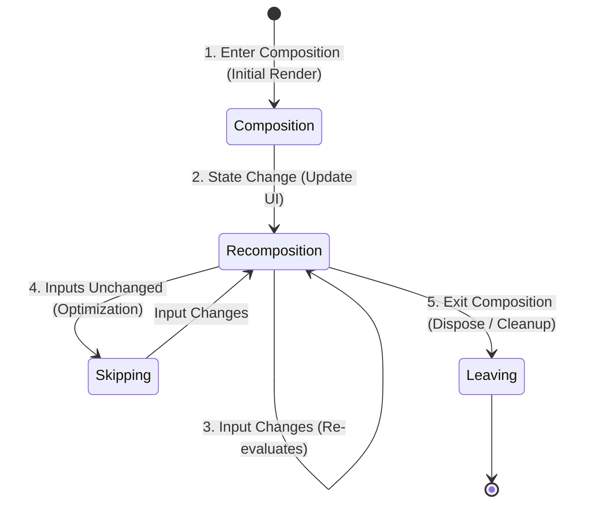
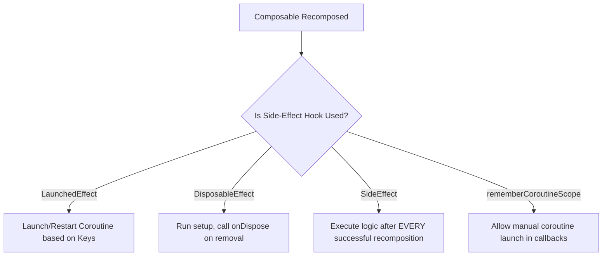
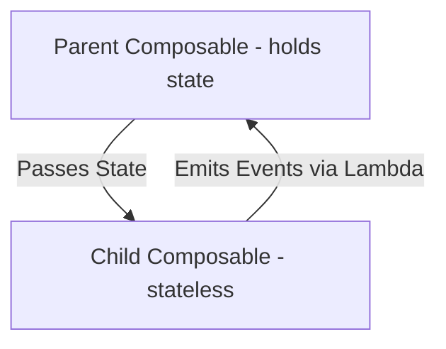
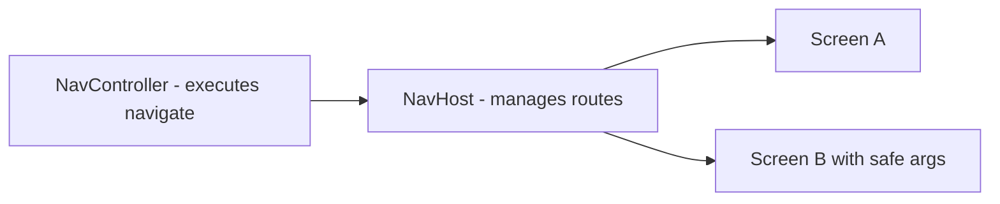
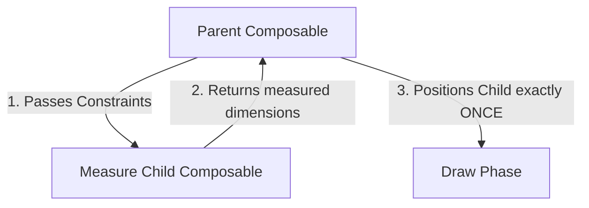
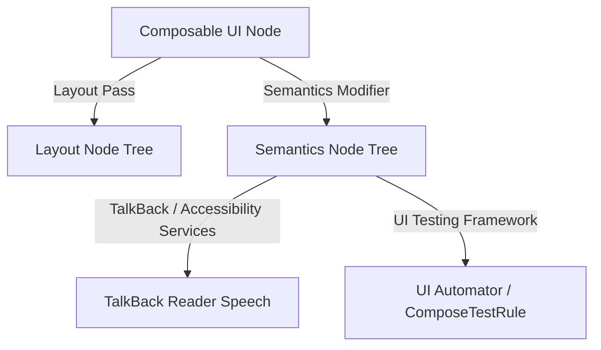

# 🎨 Jetpack Compose & Modern UI Architecture — Complete Interview Preparation Guide

> **Authoritative Technical Reference**  
> Designed for Android Developers with 2–5 years of experience. This guide provides deep architectural insights, internal mechanism breakdowns, comparison structures, side-effects execution flow, and optimization strategies for **Jetpack Compose** in **Android 15** and Modern Android UI Architecture.

---

## 📑 Table of Contents

1. [Module 1: Composable Lifecycle & Recomposition](#1-composable-lifecycle--recomposition)
2. [Module 2: Side-Effects & Effect APIs](#2-side-effects--effect-apis)
3. [Module 3: State Management, Restoring & Hoisting](#3-state-management-restoring--hoisting)
4. [Module 4: Navigation in Compose](#4-navigation-in-compose)
5. [Module 5: Layouts, Modifiers, and List Pagers](#5-layouts-modifiers-and-list-pagers)
6. [Module 6: UI Layer Architecture & UDF](#6-ui-layer-architecture--udf)
7. [Module 7: Reliable Background Processing (WorkManager in Compose)](#7-reliable-background-processing-workmanager-in-compose)

---

# 1. Composable Lifecycle & Recomposition

## 1.1 Composable & Its Lifecycle

### Definition
* **Simple:** A `@Composable` function is the fundamental building block of Jetpack Compose. It translates data (state) into UI components. Its lifecycle describes how it enters the composition (creation), gets updated (recomposition), and exits the composition (destruction).
* **Advanced:** A Composable is a Kotlin function annotated with `@Composable` that gets processed by the Compose Compiler plugin. It modifies the runtime composition tree. Its lifecycle is represented by three main phases inside the **Composition**: entering the composition (initial compilation of nodes), repeating 0 or more recompositions (updating nodes on state changes), and leaving the composition (removing nodes and disposing associated resources).



### Why it is Used
Unlike legacy Android XML views which are stateful objects retained in memory and manually modified via mutations, Composables are stateless execution blocks. This prevents sync errors between data models and UI rendering, drastically reducing memory leaks and UI bugs.

### How it Works Internally
The Compose runtime executes composable functions and records the output in a **Slot Table** (implemented as a **Gap Buffer**).
1. **Initial Composition:** The compiler runs the functions, records calls, parameters, and state variables, and inserts nodes into the Slot Table.
2. **Recomposition:** When a state variable changes, the Compose runtime locates the corresponding slots in the table and re-executes only the composable blocks that read that state.
3. **Leaving the Composition:** When conditions change (e.g., navigating away or hidden views), the node is removed from the Slot Table and any cleanup blocks (e.g., `onDispose`) are triggered.

---

## 1.2 Life Cycle Phases & Smart Recomposition

### Detailed Breakdown
* **Initial Render (Composition):** The first time Compose builds the view tree.
* **Recomposition:** Triggered automatically when an observed `State` object is mutated. It only re-executes the affected functions.
* **Skipping:** An optimization step. If the arguments passed to a Composable are immutable or stable and have not changed since the last execution pass, the compiler skips running it, returning the cached slot result.
* **Leaving:** The clean-up step. Occurs when a composable is no longer part of the visual tree.

---

# 2. Side-Effects & Effect APIs

## 2.1 Side-Effects

### Definition
* **Simple:** A Side-Effect is any work done inside or outside a Composable that affects the app state but is not directly related to drawing the UI (e.g., fetching a network API, writing to a database, displaying a toast/snackbar).
* **Advanced:** A Side-Effect is an operation that escapes the scope of a composable function. Because `@Composable` functions can execute multiple times per frame, on any thread, and can be cancelled mid-execution, side-effects must be wrapped in specialized lifecycle-aware APIs to ensure they execute predictably.



---

## 2.2 Complete Effect APIs Reference

### 1. `LaunchedEffect`
* **Definition:** Launches a Coroutine scope when entering the composition. If any parameter key changes, it cancels the running coroutine and starts a new one. It automatically cancels execution when leaving the composition.
* **Use Case:** Triggering an API call when a page is opened, or starting a timer tied to a screen.
* **Code Example:**
  ```kotlin
  @Composable
  fun UserProfile(userId: String, viewModel: UserViewModel) {
      LaunchedEffect(userId) { // Cancels previous loading if userId changes
          viewModel.loadUserData(userId)
      }
  }
  ```

### 2. `rememberCoroutineScope`
* **Definition:** Returns a composition-bound CoroutineScope. Useful for launching coroutines in response to non-composable callbacks (like onClick events).
* **Use Case:** Triggering animations or database writes when a user clicks a button.
* **Code Example:**
  ```kotlin
  @Composable
  fun SaveButton(onSave: suspend () -> Unit) {
      val scope = rememberCoroutineScope()
      Button(onClick = {
          scope.launch { onSave() }
      }) {
          Text("Save Changes")
      }
  }
  ```

### 3. `rememberUpdatedState`
* **Definition:** References a value inside an effect without forcing the effect to restart.
* **Use Case:** Long-running operations where an input callback might change, but restarting the effect is expensive or undesirable.
* **Code Example:**
  ```kotlin
  @Composable
  fun TimeoutTimer(onTimeout: () -> Unit) {
      val currentOnTimeout by rememberUpdatedState(onTimeout)
      LaunchedEffect(Unit) {
          delay(5000)
          currentOnTimeout() // Uses the latest updated lambda without resetting delay
      }
  }
  ```

### 4. `DisposableEffect`
* **Definition:** Runs side-effects that require clean-up operations once the composable leaves the composition.
* **Use Case:** Registering and unregistering BroadcastReceivers or location listeners.
* **Code Example:**
  ```kotlin
  @Composable
  fun GPSObserver(sensorManager: SensorManager, listener: SensorEventListener) {
      DisposableEffect(sensorManager) {
          val sensor = sensorManager.getDefaultSensor(Sensor.TYPE_GYROSCOPE)
          sensorManager.registerListener(listener, sensor, SensorManager.SENSOR_DELAY_NORMAL)
          
          onDispose {
              sensorManager.unregisterListener(listener) // Prevent sensor memory leak
          }
      }
  }
  ```

### 5. `SideEffect`
* **Definition:** Executes its block after every successful recomposition. Useful for synchronizing state with non-Compose resources.
* **Use Case:** Logging UI state or passing state parameters to external analytics managers.

### 6. `produceState`
* **Definition:** Converts an external asynchronous data stream (like an RxJava stream or a callback API) into a Compose `State` object.
* **Use Case:** Creating state streams directly inside a composable from non-Flow sources.
* **Code Example:**
  ```kotlin
  @Composable
  fun NetworkState(repository: NetworkRepository): State<ConnectionStatus> {
      return produceState(initialValue = ConnectionStatus.Offline) {
          repository.observeStatus { status ->
              value = status // Automatically updates state
          }
      }
  }
  ```

### 7. `derivedStateOf`
* **Definition:** Computes a state based on other state values, emitting changes only when the calculation result changes.
* **Use Case:** Optimizing scrolling lists where you only want to recompose when a scroll threshold is crossed.

### 8. `snapshotFlow`
* **Definition:** Converts a Compose `State` object into a Kotlin Coroutines `Flow` stream.
* **Use Case:** Listening to state changes (like pager swipes) and executing Flow operators on them.
* **Code Example:**
  ```kotlin
  @Composable
  fun LogPageChanges(pagerState: PagerState) {
      LaunchedEffect(pagerState) {
          snapshotFlow { pagerState.currentPage }
              .collect { page -> Log.d("Pager", "Current Page: $page") }
      }
  }
  ```

### 9. `remember` & `rememberSaveable`
* **`remember`:** Caches a value during composition, survives recompositions, but is cleared on configuration changes.
* **`rememberSaveable`:** Caches a value and saves it into a Bundle, surviving both rotation and background process death.

---

# 3. State Management, Restoring & Hoisting

## 3.1 State in Compose

### Definition
* **Simple:** State is any data value that can change over time. When state changes, the UI updates automatically.
* **Advanced:** State represents the snapshot of UI inputs. Compose uses the observer pattern via `MutableState<T>` to hook state reads to recomposition targets.

### Different Ways to Declare State
```kotlin
// Option 1: Access state wrapper (Requires using state.value)
val state = remember { mutableStateOf(0) }

// Option 2: Delegate property (Use variable directly - Most Preferred)
var value by remember { mutableStateOf("") }

// Option 3: Destructuring (Returns state and setter function)
val (text, setText) = remember { mutableStateOf("") }
```

---

## 3.2 State Hoisting & Unidirectional Data Flow

### Definition
* **State Hoisting:** The process of moving a state variable to the parent composable. This turns a child composable into a stateless component.
* **Unidirectional Data Flow (UDF):** The design pattern where **State** flows down (parent to child) and **Events** flow up (child to parent).



### Benefits of State Hoisting
1. **Single Source of Truth:** Avoids state duplication bugs.
2. **Reusability:** Stateless composables can be rendered in different views with different datasets.
3. **Easy Testing:** You can test stateless composables easily by passing mock state values and asserting event triggers.

---

## 3.3 Saving and Restoring Complex State

When using `rememberSaveable`, simple data types (Strings, numbers) are saved automatically. For custom data objects, use these three options:

### 1. `@Parcelize`
Annotate the data class with `@Parcelize` (implements Android `Parcelable`).
```kotlin
@Parcelize
data class UserProfile(val name: String, val age: Int) : Parcelable

// Usage
val profile = rememberSaveable { mutableStateOf(UserProfile("Alice", 25)) }
```

### 2. `mapSaver`
Custom serializer that converts an object into a key-value Map.
```kotlin
data class Book(val title: String, val author: String)

val BookSaver = mapSaver(
    save = { mapOf("title" to it.title, "author" to it.author) },
    restore = { Book(it["title"] as String, it["author"] as String) }
)

// Usage
val book = rememberSaveable(stateSaver = BookSaver) { mutableStateOf(Book("1984", "Orwell")) }
```

### 3. `listSaver`
Converts an object into a list of values.
```kotlin
val BookListSaver = listSaver<Book, Any>(
    save = { listOf(it.title, it.author) },
    restore = { Book(it[0] as String, it[1] as String) }
)
```

---

# 4. Navigation in Compose

## 4.1 Safe Navigation

Navigation in Jetpack Compose is managed by a `NavController` routing through a `NavHost`. Type-safety is achieved using Kotlin Serialization.



### Code Example: Navigation with Safe Arguments & SavedStateHandle
```kotlin
// Define routes as serializable structures
@Serializable
object HomeRoute

@Serializable
data class DetailRoute(val itemId: String)

// Host setup
@Composable
fun AppNavHost(navController: NavHostController = rememberNavController()) {
    NavHost(navController = navController, startDestination = HomeRoute) {
        composable<HomeRoute> {
            HomeScreen(onItemSelect = { id ->
                navController.navigate(DetailRoute(itemId = id))
            })
        }
        composable<DetailRoute> { backStackEntry ->
            // Extract type-safe arguments directly
            val routeArgs = backStackEntry.toRoute<DetailRoute>()
            DetailScreen(routeArgs.itemId)
        }
    }
}
```

### Retrieving Navigation Arguments in ViewModels
```kotlin
@HiltViewModel
class DetailViewModel @Inject constructor(
    savedStateHandle: SavedStateHandle
) : ViewModel() {
    // Automatically populated from DetailRoute serializable fields
    val itemId: String = savedStateHandle.toRoute<DetailRoute>().itemId
}
```

---

# 5. Layouts, Modifiers, and List Pagers

## 5.1 Basic Layouts & Modifiers

* **Column:** Arranges children vertically.
* **Row:** Arranges children horizontally.
* **Box:** Overlaps children, equivalent to a FrameLayout.
* **Modifiers:** Decorators that configure layout size, backgrounds, clicks, padding, and gestures.

### Critical Rule: Modifier Order Matters
Modifiers are evaluated sequentially from top to bottom. Swapping the order of padding and background changes the final layout rendering.

```kotlin
// Example 1: Padding is colored Red (background applies to outer bounding box)
Modifier
    .background(Color.Red)
    .padding(16.dp)

// Example 2: Padding is transparent (background only colors child content)
Modifier
    .padding(16.dp)
    .background(Color.Red)
```

---

## 5.2 Lists & Compose Pager (Horizontal/Vertical)

`LazyColumn` and `LazyRow` are scrolling lists, replacing `RecyclerView`. They only compose visible children.

### HorizontalPager & VerticalPager (Android 15+)
Equivalent to `ViewPager` in Views, these components support swipe-based page navigation.

```kotlin
@Composable
fun MainCarousel() {
    val pagerState = rememberPagerState(pageCount = { 5 })
    
    Column {
        HorizontalPager(
            state = pagerState,
            beyondBoundsPageCount = 1, // Preloads adjacent pages for smooth swipes
            contentPadding = PaddingValues(horizontal = 16.dp),
            modifier = Modifier.fillMaxWidth()
        ) { pageIndex ->
            Card(modifier = Modifier.fillMaxWidth().height(200.di)) {
                Text(text = "Carousel Page $pageIndex", modifier = Modifier.wrapContentSize())
            }
        }
        
        // Simple Page Indicator
        Row(Modifier.align(Alignment.CenterHorizontally).padding(8.dp)) {
            repeat(5) { index ->
                val color = if (pagerState.currentPage == index) Color.DarkGray else Color.LightGray
                Box(Modifier.size(8.dp).background(color, CircleShape).padding(4.dp))
            }
        }
    }
}
```

---

## 5.3 Custom Layouts, SubcomposeLayout & Intrinsics

### Definition
* **Simple:** Custom layouts let you arrange UI elements in ways that standard Column or Row cannot. Intrinsics let Compose query how big a view wants to be before actually placing it.
* **Advanced:** Jetpack Compose implements a single-pass layout system where a child node can only be measured once. Custom layouts are written using the `Layout` composable. `SubcomposeLayout` allows you to defer the composition of some children until the measurement of other children is complete.



### The Single-Pass Measurement Guarantee & Intrinsics
In the legacy View framework, nested layouts with layout weights required multiple measurement passes, leading to an exponential complexity ($O(2^N)$) that drops frames.
To prevent this, Compose enforces **Single-Pass Measurement**: children can only be measured once.
* **Intrinsic Measurements:** If a parent needs to determine its size based on children's constraints before measuring them, it queries their intrinsic properties (e.g. `minIntrinsicWidth`, `maxIntrinsicHeight`). This allows parents to query children's sizing desires without running a full second measurement pass.

### SubcomposeLayout
Standard layouts compose first, then measure, then place. `SubcomposeLayout` breaks this rigid lifecycle by allowing the layout phase to trigger composition of child items dynamically.
* **Use Case:** `LazyColumn` uses `SubcomposeLayout` because it does not know how many items to compose until it measures the viewport size at the layout phase. It then subcomposes only the items that fit.
* **Performance warning:** Subcomposition is more expensive than standard layout composition because it defers composition to the layout phase, bypassing compile-time optimizations. Use it only when child composition depends on parent bounds.

### CompositionLocal Invalidation Scope
* **`staticCompositionLocalOf`:** Creates a `CompositionLocal` that does not track reads. If the value provided changes, the *entire* subtree content inside the provider is recomposed from scratch. Use this for values that rarely change (like context, themes, density wrappers).
* **`compositionLocalOf`:** Creates a `CompositionLocal` that tracks reads. If the value changes, only the specific composables that read the value are invalidated. Use this for values that can change frequently.

---

# 6. UI Layer Architecture & UDF

The UI Layer comprises two main sections:
1. **UI State:** The immutable state structure rendering the screen.
2. **UI Elements:** The Composable functions displaying state.


### Architectural Code Pattern
```kotlin
// 1. Immutable State Definition
data class TasksUiState(
    val isLoading: Boolean = false,
    val tasksList: List<String> = emptyList(),
    val errorMessage: String? = null
)

// 2. ViewModel State Holder
class TasksViewModel(private val repository: TaskRepository) : ViewModel() {
    private val _uiState = MutableStateFlow(TasksUiState())
    val uiState = _uiState.asStateFlow()

    fun loadTasks() {
        _uiState.update { it.copy(isLoading = true) }
        viewModelScope.launch {
            try {
                val list = repository.getTasks()
                _uiState.update { it.copy(isLoading = false, tasksList = list) }
            } catch (e: Exception) {
                _uiState.update { it.copy(isLoading = false, errorMessage = e.localizedMessage) }
            }
        }
    }
}
```

---

# 7. Reliable Background Processing (WorkManager in Compose)

## 7.1 Integrating WorkManager with Compose

While Compose manages the UI layer, background tasks must be reliable. We can trigger persistent background tasks (e.g. syncing, log uploads) from Compose using side-effects or state interactions.

### Code Example: Dispatching and Observing WorkManager in Compose
```kotlin
@Composable
fun SyncDashboard(context: Context) {
    val workManager = remember { WorkManager.getInstance(context) }
    
    // Live stream observation of WorkInfo inside Compose
    val workInfos by workManager
        .getWorkInfosForUniqueWorkLiveData("DataSyncUniqueWork")
        .observeAsState(initial = emptyList())
        
    val syncState = workInfos.firstOrNull()?.state

    Column(Modifier.padding(16.dp)) {
        Text("Sync Status: ${syncState ?: "Not Started"}")
        
        Button(onClick = {
            val constraints = Constraints.Builder()
                .setRequiredNetworkType(NetworkType.CONNECTED)
                .build()
                
            val syncRequest = OneTimeWorkRequestBuilder<SyncWorker>()
                .setConstraints(constraints)
                .build()
                
            workManager.enqueueUniqueWork(
                "DataSyncUniqueWork",
                ExistingWorkPolicy.REPLACE,
                syncRequest
            )
        }) {
            Text("Trigger Data Sync")
        }
    }
}
```

---

# 8. Semantics & Accessibility Tree

### Definition
* **Simple:** The Semantics tree contains metadata about your UI components so that screen readers (like TalkBack) can read screen content to visually impaired users.
* **Advanced:** The Semantics tree runs parallel to the layout node tree in the Compose runtime. It contains semantic representations of the UI components (e.g., properties like `contentDescription`, `role`, `heading`, or actions like `onClick`) used by accessibility services and the testing framework (UI Automator).



### Why it is Used
Composables do not map directly to standard Android OS `View` objects, meaning accessibility services cannot read them naturally. Compose generates the Semantics tree to communicate state and metadata to the OS accessibility framework.

### Invalidation & Custom Semantics
You can manipulate semantic properties using `Modifier.semantics` or `Modifier.clearAndSetSemantics` (which clears children's semantics and treats the parent as a single accessible node).

---

# 9. Core Interview Questions & Answers

### Q. What is the difference between `remember` and `derivedStateOf`?
* **Answer:** 
  * `remember` stores an object in the Slot Table across recompositions. It only recalculates if the defined `keys` passed to the remember block change.
  * `derivedStateOf` is used to create a state object derived from other states. It ensures that calculations based on frequently changing inputs (like lists scroll pixels) only trigger recompositions when the final evaluation output matches a new value, filtering out unnecessary UI redraw passes.

### Q. Explain the concept of stability in Compose and how it impacts performance.
* **Answer:** The Compose Compiler classifies parameters of `@Composable` functions as stable or unstable. 
  * If a parameter is stable (immutable data classes or primitive types), Compose can skip recomposing it if the new value is equal to the old value.
  * If a parameter is unstable (e.g., standard collections like `List`, `Map` or mutable `var` classes), Compose cannot guarantee that the object has not changed internally, so it always recomposes the view on every parent recomposition, causing performance lag in list hierarchies. We fix this by utilizing `@Immutable` or `@Stable` annotations, or Kotlin's Immutable Collections library.

### Q. What is the danger of executing database operations directly inside a Composable function?
* **Answer:** Composables can execute on any thread, run multiple times per frame, and be aborted or restarted. Running blocking database reads directly in the function body would block the UI thread (causing frame drops and ANRs), and running writes would trigger multiple duplicate insertions on every recomposition loop. Such tasks must always be isolated inside `LaunchedEffect` or run asynchronously in ViewModels.
