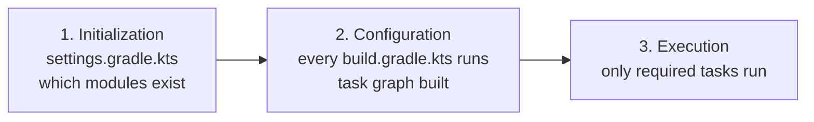
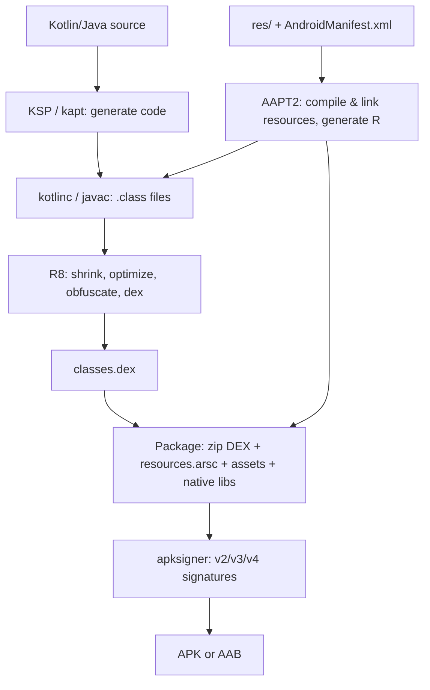
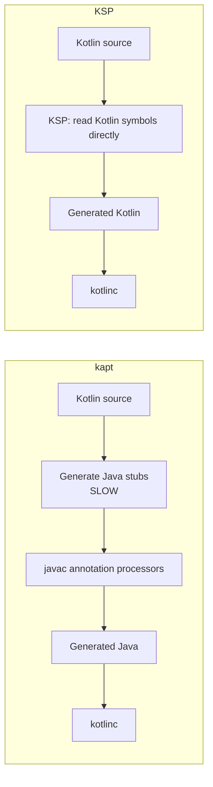

# ⚙️ Gradle & the Android Build System — Complete Interview Preparation Guide

> **Authoritative Technical Reference**
> Every topic follows the same structure — **Definition → Why It Is Used → How It Works Internally → Code Example → Common Pitfalls**.
>
> Covers the Gradle lifecycle, AGP, build variants, version catalogs, KSP vs kapt, convention plugins, R8, signing, build performance, and CI/CD.
>
> **20 build & release interview questions:** [`interview_questions/13_build_release_gradle.md`](./interview_questions/13_build_release_gradle.md)

---

## 📑 Table of Contents

| # | Module | Key Topics |
|---|---|---|
| 1 | [Gradle Fundamentals](#1-gradle-fundamentals) | Three-phase lifecycle, tasks, configuration cache |
| 2 | [The Android Build Pipeline](#2-the-android-build-pipeline) | AGP tasks from source to APK/AAB |
| 3 | [Build Variants](#3-build-variants-types-flavors-and-source-sets) | Build types, product flavors, dimensions, source sets |
| 4 | [Dependency Management](#4-dependency-management-and-version-catalogs) | Version catalogs, configurations, resolution, BOMs |
| 5 | [Annotation Processing](#5-annotation-processing-kapt-vs-ksp) | Why kapt is slow, migrating to KSP |
| 6 | [Convention Plugins](#6-convention-plugins-and-build-logic) | `build-logic`, removing per-module boilerplate |
| 7 | [R8 and Release Optimization](#7-r8-shrinking-and-release-optimization) | Full mode, keep rules, mapping files |
| 8 | [Signing & Distribution](#8-signing-and-distribution) | Keystores, Play App Signing, AAB, bundletool |
| 9 | [Build Performance](#9-build-performance) | Caching, parallelism, profiling a slow build |
| 10 | [CI/CD](#10-cicd-for-android) | Pipeline stages, caching, secrets, release automation |
| 11 | [Interview Questions](#11-interview-questions) | Pointer to the question bank |

---

# 1. Gradle Fundamentals

## 1.1 The Three-Phase Lifecycle

### Definition
* **Simple:** Gradle first decides which projects exist, then builds a graph of tasks, then runs the tasks it needs.
* **Advanced:** Every build runs **Initialization** (evaluate `settings.gradle.kts`, create `Project` objects), **Configuration** (execute every build script to build the task graph), and **Execution** (run the required tasks in dependency order).

### Why It Is Used
Almost every "my build is slow" problem is a configuration-phase problem, and almost every "it works locally but not in CI" problem is a phase-confusion problem. Knowing which phase your code runs in is the single most useful Gradle fact.

### How It Works Internally



**The critical insight:** the body of `build.gradle.kts` runs during **configuration**, on *every* build, for *every* module — even `./gradlew help`. Code inside a task's `doLast { }` or a lazily-registered task runs during **execution**, only when that task is needed.

```kotlin
// Runs on EVERY build, in EVERY module — this is how build scripts get slow
val gitSha = "git rev-parse HEAD".runCommand()          // Configuration phase: a process fork, always

// Runs only when the task actually executes
tasks.register("printSha") {
    doLast { println("git rev-parse HEAD".runCommand()) }   // Execution phase: only on demand
}
```

**`register` vs `create`.** `tasks.register` is lazy — the task is configured only if it will run. `tasks.create` is eager and configures on every build. Always prefer `register`.

### Code Example
```kotlin
// settings.gradle.kts — initialization phase
pluginManagement {
    repositories { google(); mavenCentral(); gradlePluginPortal() }
}
dependencyResolutionManagement {
    // FAIL_ON_PROJECT_REPOS forbids per-module repositories, keeping resolution predictable
    repositoriesMode.set(RepositoriesMode.FAIL_ON_PROJECT_REPOS)
    repositories { google(); mavenCentral() }
}

rootProject.name = "MyApp"
include(":app", ":core:ui", ":core:network", ":domain", ":data", ":feature:home")
```

```properties
# gradle.properties — the settings that matter most for speed
org.gradle.jvmargs=-Xmx4g -XX:MaxMetaspaceSize=1g -XX:+UseParallelGC
org.gradle.parallel=true
org.gradle.caching=true
org.gradle.configuration-cache=true
org.gradle.configureondemand=false

android.useAndroidX=true
android.nonTransitiveRClass=true       # Each module gets its own R class: far better incremental builds
android.enableR8.fullMode=true

kotlin.code.style=official
ksp.incremental=true
```

```bash
# Which phase is slow? Build scans answer this definitively.
./gradlew assembleDebug --scan
./gradlew assembleDebug --profile        # Writes an HTML report under build/reports/profile
./gradlew help                           # Times ONLY the configuration phase
```

### Common Pitfalls
* **Running processes or reading files at configuration time.** `git rev-parse`, network calls, and file reads execute on every build in every module.
* **`tasks.create` instead of `tasks.register`.** Eager configuration defeats Gradle's laziness.
* **Cross-project configuration (`subprojects { }` in the root).** It couples every module and breaks configuration cache. Use convention plugins.
* **Reading `System.getenv` at configuration time** without declaring it as a build input, which silently breaks build caching.

---

# 2. The Android Build Pipeline

## 2.1 From Source to APK

### Definition
The Android Gradle Plugin (AGP) contributes several hundred tasks that transform source, resources, and dependencies into a signed artifact.

### Why It Is Used
Understanding the pipeline is what lets you read a build error correctly. `Duplicate class` is a dependency-resolution problem; `Manifest merger failed` is a merge problem; `Cannot fit requested classes` is a DEX problem. Each is fixed at a different stage.

### How It Works Internally



| Stage | Task (roughly) | Common Failure |
|---|---|---|
| Manifest merge | `processDebugMainManifest` | `Manifest merger failed`: conflicting attributes between library and app |
| Resource compile/link | `mergeDebugResources`, `processDebugResources` | Duplicate resource names across modules |
| Annotation processing | `kspDebugKotlin` / `kaptDebugKotlin` | Hilt/Room codegen errors |
| Kotlin compile | `compileDebugKotlin` | Type errors |
| Shrink + dex | `minifyReleaseWithR8` | `Cannot fit requested classes in a single dex file`; missing keep rules |
| Package | `packageRelease` | Duplicate native library entries |
| Sign | `packageRelease` (via apksigner) | Missing or invalid signing config |

**Manifest merger priority (highest wins):** build-variant manifest → main manifest → library manifests, in dependency order. `tools:replace` and `tools:node` resolve conflicts explicitly.

### Code Example
```xml
<!-- Resolving a manifest merge conflict from a library -->
<application
    android:allowBackup="false"
    tools:replace="android:allowBackup">        <!-- Explicitly override the library's value -->

    <!-- Remove a component a library declared that you do not want -->
    <provider
        android:name="com.thirdparty.InitProvider"
        android:authorities="${applicationId}.thirdparty-init"
        tools:node="remove" />
</application>
```

```bash
# See exactly what the merger produced and why
./gradlew :app:processDebugMainManifest
cat app/build/intermediates/merged_manifest/debug/AndroidManifest.xml
cat app/build/outputs/logs/manifest-merger-debug-report.txt   # Line-by-line merge decisions

# Trace a duplicate-class error to the responsible dependency
./gradlew :app:dependencies --configuration debugRuntimeClasspath
./gradlew :app:dependencyInsight --dependency okhttp --configuration debugRuntimeClasspath
```

### Common Pitfalls
* **Ignoring the manifest merger report.** It states exactly which library injected the conflicting attribute.
* **`tools:replace` used as a blanket fix.** Understand what the library wanted before overriding it.
* **Two libraries bundling the same class** (a classic with old support-library forks). Exclude the transitive dependency rather than suppressing the error.

---

# 3. Build Variants: Types, Flavors, and Source Sets

### Definition
* **Build type** — how it is built (debug vs release: debuggable, minified, signed).
* **Product flavor** — what is built (free vs paid, staging vs production).
* **Variant** — the cross product: `freeDebug`, `paidRelease`, and so on.

### Why It Is Used
One codebase, many artifacts: a staging build pointing at a test backend, a demo build with fake data, a paid build with extra features — without runtime `if` branches that ship dead code to every user.

### How It Works Internally
Each variant merges source sets in a defined priority: **variant** (`src/freeDebug/`) → **flavor** (`src/free/`) → **build type** (`src/debug/`) → **main** (`src/main/`). Java/Kotlin sources are **additive** (a class may exist in only one set), while resources and manifests are **overriding** (a more specific set replaces the same-named resource).

### Code Example
```kotlin
android {
    buildTypes {
        debug {
            applicationIdSuffix = ".debug"        // Debug and release install side by side
            versionNameSuffix = "-debug"
            isMinifyEnabled = false
            buildConfigField("boolean", "ENABLE_LOGGING", "true")
        }
        release {
            isMinifyEnabled = true
            isShrinkResources = true
            proguardFiles(
                getDefaultProguardFile("proguard-android-optimize.txt"),
                "proguard-rules.pro"
            )
            signingConfig = signingConfigs.getByName("release")
            buildConfigField("boolean", "ENABLE_LOGGING", "false")
        }
        // A release-like build that is still profileable — required for Macrobenchmark
        create("benchmark") {
            initWith(getByName("release"))
            signingConfig = signingConfigs.getByName("debug")
            matchingFallbacks += listOf("release")
            isDebuggable = false
            proguardFiles("benchmark-rules.pro")
        }
    }

    flavorDimensions += listOf("tier", "environment")

    productFlavors {
        create("free")  { dimension = "tier"; buildConfigField("boolean", "IS_PRO", "false") }
        create("pro")   { dimension = "tier"; buildConfigField("boolean", "IS_PRO", "true") }

        create("staging") {
            dimension = "environment"
            applicationIdSuffix = ".staging"
            buildConfigField("String", "BASE_URL", "\"https://staging.example.com/\"")
        }
        create("production") {
            dimension = "environment"
            buildConfigField("String", "BASE_URL", "\"https://api.example.com/\"")
        }
    }

    // 2 tiers x 2 environments x 3 build types = 12 variants. Prune the ones nobody builds.
    androidComponents {
        beforeVariants { variant ->
            variant.enable = !(variant.productFlavors.any { it.second == "free" } &&
                               variant.buildType == "benchmark")
        }
    }
}
```

```
app/src/
├── main/            # Shared by every variant
├── debug/           # Debug-only: a LeakCanary initializer, a debug menu
├── release/
├── free/            # Free-tier implementations
├── pro/             # Pro-tier implementations of the SAME class names
├── staging/res/     # A different app icon so testers can tell builds apart
└── freeDebug/       # Most specific: wins over all of the above
```

```kotlin
// A class that exists once per flavor — no runtime branching, and the free build
// does not even contain the pro code.
// src/free/kotlin/com/example/FeatureGate.kt
object FeatureGate { val hasAdvancedExport = false }

// src/pro/kotlin/com/example/FeatureGate.kt
object FeatureGate { val hasAdvancedExport = true }
```

### Common Pitfalls
* **Variant explosion.** Three dimensions with three flavors each is 27 variants before build types. Prune with `beforeVariants`.
* **The same class in both `main/` and a flavor.** Duplicate-class error: a flavor-specific class must exist in *every* flavor of that dimension, and not in `main`.
* **Secrets in `buildConfigField`.** They are plain strings in the DEX. Use them for endpoints, not for keys.
* **Forgetting `matchingFallbacks`** on a custom build type, so library modules cannot resolve a matching variant.

---

# 4. Dependency Management and Version Catalogs

### Definition
A version catalog (`gradle/libs.versions.toml`) is a typed, centralized declaration of dependency coordinates and versions, referenced as `libs.androidx.core.ktx` from any module.

### Why It Is Used
Without it, versions are duplicated across modules and drift. With it, upgrades happen in one file, the IDE autocompletes dependency names, and typos become compile errors.

### How It Works Internally
Gradle generates a type-safe accessor class from the TOML at configuration time. **Bundles** group related dependencies; **BOMs** (`platform()`) constrain the versions of an entire family so you never pin individual Compose or Firebase artifacts.

**Configuration semantics:**

| Configuration | On consumer's compile classpath? | Use For |
|---|---|---|
| `implementation` | **No** | Almost everything — keeps builds fast |
| `api` | Yes | Only types that appear in your public signatures |
| `compileOnly` | Yes, not packaged | Annotations, provided-at-runtime libraries |
| `runtimeOnly` | No, packaged | Drivers, SLF4J bindings |
| `ksp` / `kapt` | Processor path | Annotation processors |

### Code Example
```toml
# gradle/libs.versions.toml
[versions]
agp = "8.7.0"
kotlin = "2.0.21"
composeBom = "2024.10.00"
hilt = "2.52"
ksp = "2.0.21-1.0.25"          # KSP versions are pinned to a Kotlin version — they must match

[libraries]
androidx-core-ktx = { module = "androidx.core:core-ktx", version = "1.13.1" }
compose-bom = { module = "androidx.compose:compose-bom", version.ref = "composeBom" }
compose-ui = { module = "androidx.compose.ui:ui" }                # Version comes from the BOM
compose-material3 = { module = "androidx.compose.material3:material3" }
hilt-android = { module = "com.google.dagger:hilt-android", version.ref = "hilt" }
hilt-compiler = { module = "com.google.dagger:hilt-compiler", version.ref = "hilt" }

[bundles]
compose = ["compose-ui", "compose-material3", "compose-ui-tooling-preview"]

[plugins]
android-application = { id = "com.android.application", version.ref = "agp" }
kotlin-android = { id = "org.jetbrains.kotlin.android", version.ref = "kotlin" }
ksp = { id = "com.google.devtools.ksp", version.ref = "ksp" }
```

```kotlin
// Any module's build.gradle.kts
plugins {
    alias(libs.plugins.android.application)
    alias(libs.plugins.kotlin.android)
    alias(libs.plugins.ksp)
}

dependencies {
    implementation(platform(libs.compose.bom))   // The BOM constrains every Compose artifact
    implementation(libs.bundles.compose)
    implementation(libs.androidx.core.ktx)

    implementation(libs.hilt.android)
    ksp(libs.hilt.compiler)
}
```

```kotlin
// Resolving a version conflict deliberately, rather than accepting Gradle's "highest wins"
configurations.all {
    resolutionStrategy {
        // Force a version when two libraries disagree and the higher one is broken
        force("com.squareup.okhttp3:okhttp:4.12.0")
        // Fail loudly rather than silently upgrading — good for reproducibility
        failOnVersionConflict()
    }
}

// Excluding a transitive dependency you replace yourself
implementation(libs.some.library) {
    exclude(group = "com.google.guava", module = "listenablefuture")
}
```

```bash
./gradlew :app:dependencies --configuration releaseRuntimeClasspath
./gradlew :app:dependencyInsight --dependency kotlinx-coroutines-core \
    --configuration releaseRuntimeClasspath      # WHY is this version selected?
./gradlew dependencyUpdates                      # With the ben-manes versions plugin
```

### Common Pitfalls
* **`api` by default.** Every consumer recompiles when that dependency changes, killing incremental builds.
* **Pinning individual Compose artifact versions** instead of using the BOM, producing incompatible combinations.
* **KSP and Kotlin versions out of sync.** KSP fails with a version-mismatch error; its version string embeds the Kotlin version for exactly this reason.
* **Dynamic versions (`1.+` or `latest.release`).** Builds become non-reproducible and can break without any commit.

---

# 5. Annotation Processing: kapt vs KSP

### Definition
* **kapt** — Kotlin Annotation Processing Tool. Runs Java annotation processors against Kotlin code by generating Java stubs first.
* **KSP** — Kotlin Symbol Processing. Reads Kotlin code directly through a Kotlin-aware API.

### Why It Is Used
kapt's stub-generation step means every Kotlin file is compiled to a Java stub before processing, then the real compilation runs. This is typically **2× the annotation-processing time** of KSP, and it is often the single largest item in a slow Android build.

### How It Works Internally



| Library | KSP support |
|---|---|
| Room | Yes |
| Hilt / Dagger | Yes (Dagger 2.48+) |
| Moshi | Yes |
| Glide | Yes |
| Kotlinx Serialization | N/A — uses a compiler plugin, faster than both |
| Some older libraries | kapt only — the reason kapt still exists in many builds |

### Code Example
```kotlin
plugins {
    alias(libs.plugins.ksp)
    // Remove kapt entirely once every processor supports KSP:
    // alias(libs.plugins.kotlin.kapt)
}

dependencies {
    implementation(libs.room.runtime)
    implementation(libs.room.ktx)
    ksp(libs.room.compiler)             // was: kapt(libs.room.compiler)

    implementation(libs.hilt.android)
    ksp(libs.hilt.compiler)             // was: kapt(libs.hilt.compiler)
}

// KSP arguments use a different syntax from kapt's
ksp {
    arg("room.schemaLocation", "$projectDir/schemas")   // Export schemas for migration tests
    arg("room.incremental", "true")
}
```

```bash
# Measure the actual saving on your own project
./gradlew clean :app:assembleDebug --profile
# Compare the kaptDebugKotlin / kspDebugKotlin task durations in the generated report
```

### Common Pitfalls
* **A partial migration that leaves kapt enabled.** The stub-generation cost is paid as soon as *any* processor uses kapt, so the saving only materializes when the last one is gone.
* **Forgetting `room.schemaLocation`.** Without exported schemas you cannot write migration tests, and Room warns on every build.
* **Not enabling `ksp.incremental=true`.** Full reprocessing on every change.
* **Assuming KSP is a drop-in for every processor.** Check support before migrating; a few still require kapt.

---

# 6. Convention Plugins and build-logic

### Definition
A `build-logic` included build containing plugins that encapsulate shared module configuration, applied as one line per module.

### Why It Is Used
Without them, every module repeats 40 lines of `compileSdk`, `compileOptions`, `kotlinOptions`, and common dependencies. Changing the Java target then means editing 20 files. `subprojects { }` in the root build script is the old workaround, and it breaks the configuration cache and couples all modules.

### How It Works Internally
`build-logic` is a separate included build compiled before the main build. Its plugins are ordinary Gradle plugins written in Kotlin with full type safety, IDE completion, and their own tests.

### Code Example
```kotlin
// settings.gradle.kts
pluginManagement {
    includeBuild("build-logic")
    repositories { google(); mavenCentral(); gradlePluginPortal() }
}
```

```kotlin
// build-logic/convention/src/main/kotlin/AndroidLibraryConventionPlugin.kt
class AndroidLibraryConventionPlugin : Plugin<Project> {
    override fun apply(target: Project) = with(target) {
        with(pluginManager) {
            apply("com.android.library")
            apply("org.jetbrains.kotlin.android")
        }

        extensions.configure<LibraryExtension> {
            compileSdk = 36
            defaultConfig {
                minSdk = 24
                testInstrumentationRunner = "androidx.test.runner.AndroidJUnitRunner"
            }
            compileOptions {
                sourceCompatibility = JavaVersion.VERSION_17
                targetCompatibility = JavaVersion.VERSION_17
            }
            buildFeatures { buildConfig = false }   // Off by default: it is a build-speed cost
        }

        extensions.configure<KotlinAndroidProjectExtension> {
            compilerOptions {
                jvmTarget.set(JvmTarget.JVM_17)
                // Fail the build on warnings in CI, but not locally
                allWarningsAsErrors.set(providers.gradleProperty("warningsAsErrors").isPresent)
            }
        }

        dependencies {
            add("implementation", libs.findLibrary("kotlinx-coroutines-core").get())
            add("testImplementation", libs.findLibrary("junit").get())
        }
    }
}
```

```kotlin
// build-logic/convention/build.gradle.kts — register the plugin ids
gradlePlugin {
    plugins {
        register("androidLibrary") {
            id = "myapp.android.library"
            implementationClass = "AndroidLibraryConventionPlugin"
        }
        register("androidFeature") {
            id = "myapp.android.feature"
            implementationClass = "AndroidFeatureConventionPlugin"
        }
    }
}
```

```kotlin
// Every feature module is now three lines instead of forty
plugins {
    id("myapp.android.feature")
    id("myapp.android.compose")
}
dependencies {
    implementation(projects.domain)
}
```

### Common Pitfalls
* **`subprojects { }` in the root build file.** It breaks the configuration cache and forces every module to be configured together.
* **One giant convention plugin.** Split by concern — library, feature, compose, hilt, test — so a module applies only what it needs.
* **Convention plugins not kept in a separate included build.** They then participate in the main build's classpath and cause cyclic configuration.

---

# 7. R8: Shrinking and Release Optimization

### Definition
R8 performs code shrinking, optimization, obfuscation, and DEX generation in one pass, replacing ProGuard and D8.

### Why It Is Used
It typically removes 20–50% of an app's method count, which reduces APK size, improves cold start (less DEX to load), and makes decompiled output substantially harder to read.

### How It Works Internally
R8 builds a reachability graph from **entry points** — manifest components, `@Keep`-annotated members, and anything named in a keep rule — and deletes everything not reachable. The consequence: anything reached only via **reflection** is invisible to R8 and gets deleted or renamed.

**Full mode** (`android.enableR8.fullMode=true`, default since AGP 8) is more aggressive: it assumes classes without keep rules are not reflected on, and it optimizes across the whole program. Some libraries need extra rules under full mode.

**Reflection sources needing keep rules:** JSON model classes, custom views inflated from XML, `Class.forName` lookups, JNI-called methods, `Enum.valueOf`, and Parcelable `CREATOR` fields.

### Code Example
```proguard
# proguard-rules.pro

# --- Models parsed reflectively ---
-keep class com.example.app.data.dto.** { *; }

# --- Custom views inflated from XML use the (Context, AttributeSet) constructor reflectively ---
-keepclasseswithmembers class * extends android.view.View {
    public <init>(android.content.Context, android.util.AttributeSet);
    public <init>(android.content.Context, android.util.AttributeSet, int);
}

# --- Parcelable CREATOR is looked up by name ---
-keepclassmembers class * implements android.os.Parcelable {
    public static final ** CREATOR;
}

# --- Enums used by name (valueOf / serialization) ---
-keepclassmembers enum * {
    public static **[] values();
    public static ** valueOf(java.lang.String);
}

# --- Methods called from native code ---
-keepclasseswithmembernames class * {
    native <methods>;
}

# --- Strip debug/verbose logging entirely from release ---
-assumenosideeffects class android.util.Log {
    public static int v(...);
    public static int d(...);
}

# --- Keep line numbers so crash traces are usable, but hide the source file name ---
-keepattributes SourceFile,LineNumberTable
-renamesourcefileattribute SourceFile

# --- Harden against static analysis ---
-repackageclasses ''
-allowaccessmodification
```

```gradle
android {
    buildTypes {
        release {
            isMinifyEnabled = true
            isShrinkResources = true       // Does NOTHING without minifyEnabled
            proguardFiles(
                getDefaultProguardFile("proguard-android-optimize.txt"),
                "proguard-rules.pro"
            )
        }
    }
}
```

```bash
# What did R8 actually remove and rename?
cat app/build/outputs/mapping/release/mapping.txt   # Obfuscation map — UPLOAD THIS to Crashlytics
cat app/build/outputs/mapping/release/usage.txt     # Everything R8 deleted
cat app/build/outputs/mapping/release/seeds.txt     # Everything kept, and why

# Deobfuscate a stack trace by hand
retrace mapping.txt obfuscated_stacktrace.txt
```

```kotlin
// A library ships its own rules so consumers do not have to write them.
// consumer-rules.pro in a library module is merged into every consuming app.
android {
    defaultConfig {
        consumerProguardFiles("consumer-rules.pro")
    }
}
```

### Common Pitfalls
* **`-keep class com.example.** { *; }`.** This disables shrinking and obfuscation for the entire app while looking like a targeted fix.
* **Never testing the release build.** R8 problems appear only in release, and often only on a screen exercised late. Run the instrumented suite against a minified build.
* **Not uploading `mapping.txt`.** Every production crash becomes an unreadable trace of `a.b.c`.
* **`shrinkResources` without `minifyEnabled`.** Silently does nothing.
* **Assuming obfuscation is security.** `jadx` still produces readable logic; it raises cost, it does not prevent analysis.

---

# 8. Signing and Distribution

### Definition
Signing binds an artifact to a private key. Play App Signing splits this into an *upload key* you hold and an *app signing key* Google holds.

### Why It Is Used
Android's update model requires that an update be signed by the same key as the installed app. Historically, losing that key meant the app could never be updated again. Play App Signing removes that failure mode.

### How It Works Internally
You sign the AAB with your **upload key**. Play verifies it, strips it, and re-signs the generated APKs with the **app signing key**. Consequences worth knowing:
* Certificate fingerprints for Google Sign-In, Maps, and App Links must use the **app signing key**, not the upload key — a very common source of "it works in debug, not in production".
* A lost upload key can be reset by Play support; the app signing key never leaves Google.

### Code Example
```kotlin
// Never commit keystore credentials. Read them from the environment or a gitignored file.
val keystorePropsFile = rootProject.file("keystore.properties")
val keystoreProps = Properties().apply {
    if (keystorePropsFile.exists()) load(keystorePropsFile.inputStream())
}

android {
    signingConfigs {
        create("release") {
            storeFile = file(System.getenv("KEYSTORE_PATH") ?: keystoreProps["storeFile"] as? String ?: "")
            storePassword = System.getenv("KEYSTORE_PASSWORD") ?: keystoreProps["storePassword"] as? String
            keyAlias = System.getenv("KEY_ALIAS") ?: keystoreProps["keyAlias"] as? String
            keyPassword = System.getenv("KEY_PASSWORD") ?: keystoreProps["keyPassword"] as? String
            enableV1Signing = false          // Drop v1 when minSdk >= 24
            enableV2Signing = true
            enableV3Signing = true
        }
    }

    buildTypes {
        release {
            signingConfig = signingConfigs.getByName("release")
        }
    }
}

// Fail fast rather than shipping a debug-signed release
tasks.named("bundleRelease") {
    doFirst {
        require(System.getenv("KEYSTORE_PASSWORD") != null) {
            "Release signing is not configured — refusing to build an unsigned release."
        }
    }
}
```

```bash
# Generate an upload key
keytool -genkeypair -v -keystore upload.jks -keyalg RSA -keysize 4096 -validity 10000 -alias upload

# Verify what a built artifact is actually signed with
apksigner verify --print-certs --verbose app-release.apk

# Reproduce Play's APK splitting locally, and measure the real download size
bundletool build-apks --bundle=app-release.aab --output=app.apks \
  --ks=upload.jks --ks-key-alias=upload
bundletool get-size total --apks=app.apks

# Install the exact APK a specific device would receive
bundletool install-apks --apks=app.apks
```

```yaml
# Storing the keystore in CI: base64-encode it into a secret, decode at build time
- name: Decode keystore
  run: echo "${{ secrets.KEYSTORE_BASE64 }}" | base64 --decode > upload.jks
- name: Build release bundle
  env:
    KEYSTORE_PATH: upload.jks
    KEYSTORE_PASSWORD: ${{ secrets.KEYSTORE_PASSWORD }}
    KEY_ALIAS: ${{ secrets.KEY_ALIAS }}
    KEY_PASSWORD: ${{ secrets.KEY_PASSWORD }}
  run: ./gradlew bundleRelease
```

### Common Pitfalls
* **Committing the keystore or `keystore.properties`.** Anyone with the repo can then sign as you.
* **Registering the upload-key fingerprint** for Google Sign-In or App Links when Play App Signing is enabled. Use the app signing key's SHA-256 from the Play Console.
* **Building APKs instead of AABs.** Play requires AAB for new apps, and APK forfeits the split-delivery size saving.
* **No `versionCode` strategy.** It must increase monotonically; deriving it from CI run number or commit count is common.

---

# 9. Build Performance

### Definition
Reducing wall-clock build time, which is the developer-productivity metric most directly under your control.

### Why It Is Used
A 4-minute incremental build with 20 builds a day costs each developer over an hour daily. It is usually the highest-ROI engineering work available.

### How It Works Internally

| Mechanism | What It Does | Enable With |
|---|---|---|
| **Incremental build** | Reruns only out-of-date tasks | Default |
| **Build cache** | Reuses task outputs across builds and machines | `org.gradle.caching=true` |
| **Configuration cache** | Skips the configuration phase entirely on repeat builds | `org.gradle.configuration-cache=true` |
| **Parallel execution** | Builds independent modules concurrently | `org.gradle.parallel=true` |
| **Non-transitive R classes** | Each module gets only its own resources | `android.nonTransitiveRClass=true` |
| **KSP over kapt** | Removes Java stub generation | Migrate processors |
| **Remote build cache** | CI populates a cache developers pull from | `buildCache { remote(HttpBuildCache) }` |

**Configuration cache is the biggest single win** on a large project — it serializes the task graph so repeat builds skip configuration entirely, often saving 10–30 seconds per build. It requires that build logic not read mutable state at execution time, which is why `subprojects { }` and configuration-time `System.getenv` break it.

### Code Example
```properties
# gradle.properties
org.gradle.jvmargs=-Xmx6g -XX:MaxMetaspaceSize=1g -XX:+UseParallelGC
org.gradle.parallel=true
org.gradle.caching=true
org.gradle.configuration-cache=true
org.gradle.configuration-cache.problems=warn      # Migrate incrementally

android.nonTransitiveRClass=true
android.enableR8.fullMode=true
android.defaults.buildfeatures.buildconfig=false  # Off unless a module needs it
android.defaults.buildfeatures.resvalues=false
android.defaults.buildfeatures.shaders=false

kotlin.incremental=true
ksp.incremental=true
```

```kotlin
// settings.gradle.kts — a remote cache CI populates and developers read
buildCache {
    local { isEnabled = true }
    remote<HttpBuildCache> {
        url = uri("https://cache.example.com/cache/")
        isPush = System.getenv("CI") == "true"     // Only CI writes; developers only read
        credentials {
            username = System.getenv("CACHE_USER")
            password = System.getenv("CACHE_PASSWORD")
        }
    }
}
```

```bash
# Find where the time actually goes — never optimize a build by guessing
./gradlew assembleDebug --scan                   # Best single tool: full task timeline
./gradlew assembleDebug --profile                # Local HTML report
./gradlew assembleDebug --configuration-cache    # Verify the config cache works

# Isolate configuration-phase cost
./gradlew help                                   # Times configuration only

# Confirm what is NOT cacheable
./gradlew assembleDebug --build-cache -i | grep "Build cache key"
```

### Common Pitfalls
* **Increasing heap without measuring.** More memory does not fix a slow configuration phase.
* **`buildConfig = true` in every module.** Every module then regenerates a `BuildConfig` class on every build.
* **Non-deterministic task inputs** (timestamps, git SHA read at configuration time) making everything cache-miss.
* **Antivirus scanning the build directory.** On Windows and macOS this frequently doubles build time; exclude the project directory.
* **Optimizing clean-build time.** Developers almost always run incremental builds. Optimize that.

---

# 10. CI/CD for Android

### Definition
Automated pipelines that build, test, and release the app on every change.

### Why It Is Used
It catches regressions before merge, produces reproducible release artifacts, and removes manual release steps — which are where release mistakes come from.

### How It Works Internally

**A sensible pipeline shape:**

| Stage | Runs on | Duration budget |
|---|---|---|
| Lint + detekt | Every push | < 2 min |
| Unit tests | Every push | < 5 min |
| Assemble debug | Every push | < 5 min |
| Instrumented tests | Pull requests | < 20 min |
| Screenshot tests | Pull requests | < 10 min |
| Build + upload AAB | `main` merge / tag | < 15 min |
| Play internal track deploy | Tag | — |

### Code Example
```yaml
name: Android CI

on:
  push: { branches: [main] }
  pull_request:

concurrency:
  # Cancel superseded runs on the same branch — saves large amounts of CI time
  group: ${{ github.workflow }}-${{ github.ref }}
  cancel-in-progress: true

jobs:
  static-analysis:
    runs-on: ubuntu-latest
    steps:
      - uses: actions/checkout@v4
      - uses: actions/setup-java@v4
        with: { distribution: temurin, java-version: '17' }
      - uses: gradle/actions/setup-gradle@v4
        with: { cache-read-only: ${{ github.ref != 'refs/heads/main' }} }
      - run: ./gradlew lintDebug detekt

  unit-tests:
    runs-on: ubuntu-latest
    steps:
      - uses: actions/checkout@v4
      - uses: actions/setup-java@v4
        with: { distribution: temurin, java-version: '17' }
      - uses: gradle/actions/setup-gradle@v4
      - run: ./gradlew testDebugUnitTest
      - uses: actions/upload-artifact@v4
        if: failure()
        with: { name: test-reports, path: '**/build/reports/tests/' }

  instrumented-tests:
    runs-on: ubuntu-latest
    if: github.event_name == 'pull_request'
    steps:
      - uses: actions/checkout@v4
      - uses: actions/setup-java@v4
        with: { distribution: temurin, java-version: '17' }
      # KVM must be enabled or the emulator runs unusably slowly
      - name: Enable KVM
        run: |
          echo 'KERNEL=="kvm", GROUP="kvm", MODE="0666"' | sudo tee /etc/udev/rules.d/99-kvm4all.rules
          sudo udevadm control --reload-rules && sudo udevadm trigger --name-match=kvm
      - uses: reactivecircus/android-emulator-runner@v2
        with:
          api-level: 34
          arch: x86_64
          disable-animations: true       # The main cause of flaky UI tests in CI
          script: ./gradlew connectedDebugAndroidTest

  release:
    runs-on: ubuntu-latest
    if: startsWith(github.ref, 'refs/tags/v')
    needs: [static-analysis, unit-tests]
    steps:
      - uses: actions/checkout@v4
      - uses: actions/setup-java@v4
        with: { distribution: temurin, java-version: '17' }
      - name: Decode keystore
        run: echo "${{ secrets.KEYSTORE_BASE64 }}" | base64 --decode > upload.jks
      - name: Build AAB
        env:
          KEYSTORE_PATH: upload.jks
          KEYSTORE_PASSWORD: ${{ secrets.KEYSTORE_PASSWORD }}
          KEY_ALIAS: ${{ secrets.KEY_ALIAS }}
          KEY_PASSWORD: ${{ secrets.KEY_PASSWORD }}
        run: ./gradlew bundleRelease
      - name: Upload to Play internal track
        uses: r0adkll/upload-google-play@v1
        with:
          serviceAccountJsonPlainText: ${{ secrets.PLAY_SERVICE_ACCOUNT_JSON }}
          packageName: com.example.app
          releaseFiles: app/build/outputs/bundle/release/app-release.aab
          track: internal
          # Staged rollout: start small, watch Vitals, then increase
          status: inProgress
          userFraction: 0.1
          mappingFile: app/build/outputs/mapping/release/mapping.txt
```

### Common Pitfalls
* **No Gradle cache in CI.** Every run rebuilds from scratch.
* **Secrets in the repository or echoed into logs.** Use the CI secret store and never `echo` a secret.
* **Instrumented tests on every push.** They are slow; run them on pull requests and merges.
* **Not uploading the mapping file with the release.** Production traces become unreadable.
* **100% rollout on the first release.** Staged rollout with Vitals monitoring lets you halt a bad release before it reaches everyone.
* **Ignoring flaky tests.** A suite people ignore provides no safety at all.

---

# 11. Interview Questions

**➡️ [`interview_questions/13_build_release_gradle.md`](./interview_questions/13_build_release_gradle.md) — 20 questions on Gradle, variants, R8, signing, and CI/CD.**

---

## 📚 Related Guides

| Guide | Covers |
|---|---|
| [`CD_Setup_Guide.md`](./CD_Setup_Guide.md) | A concrete, step-by-step pipeline setup with Firebase, SonarCloud, and Play |
| [`android.md`](./android.md) | R8 internals, APK/AAB anatomy, app size, Baseline Profiles |
| [`architecture_patterns.md`](./architecture_patterns.md) | Modularization and convention plugins in an architectural context |
| [`testing_security.md`](./testing_security.md) | The test suites this pipeline runs |
