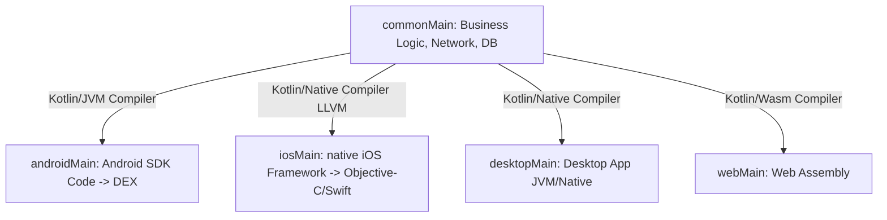
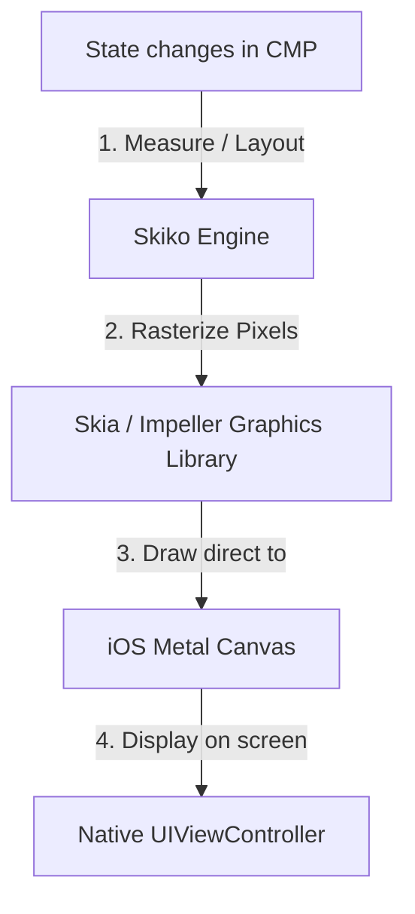
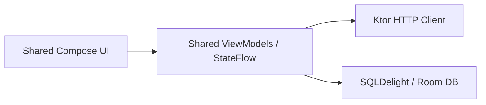
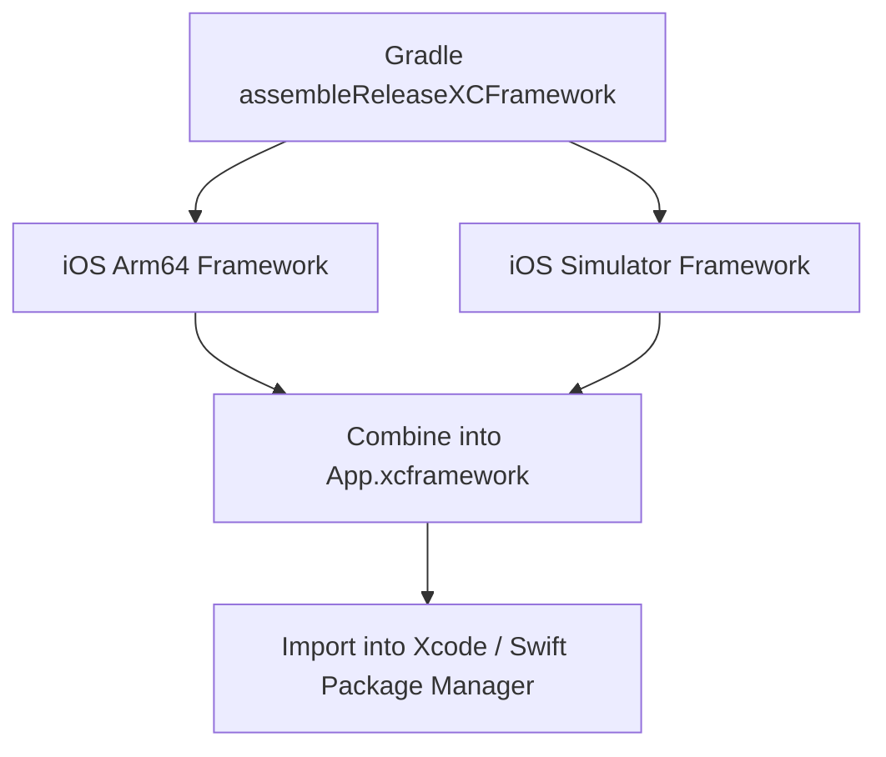

# 🚀 Kotlin Multiplatform (KMP) & Compose Multiplatform (CMP) — Complete Interview Preparation Guide

> **Authoritative Technical Reference**
> Every topic follows the same structure — **Definition → Why It Is Used → How It Works Internally → Code Example → Common Pitfalls**.
>
> Covers KMP architecture, `expect`/`actual`, Skiko/Skia rendering, shared libraries, Swift interop, testing, and adoption strategy.
>
> **20 KMP/CMP interview questions:** [Section 9](#9-kotlin-multiplatform--compose-multiplatform-interview-questions-20-questions)

---

## 📑 Table of Contents

| # | Module | Key Topics |
|---|---|---|
| 1 | [KMP & CMP Fundamentals](#1-kmp--cmp-fundamentals) | What KMP is, KMP vs CMP, when to use each |
| 2 | [Project Architecture & expect/actual](#2-kmp-project-architecture--expectactual) | Source sets, hierarchy, native API access |
| 3 | [CMP Rendering Engine](#3-compose-multiplatform-cmp-rendering-engine) | Skiko/Skia, iOS rendering, display-link sync |
| 4 | [Shared Libraries](#4-shared-architecture-libraries-network--storage) | Ktor, SQLDelight/Room, resources, lifecycle, Koin DI, serialization, DataStore |
| 5 | [Kotlin/Native & Swift Interop](#5-kotlinnative--swift-interoperability) | Interop constraints, memory model, reference cycles |
| 6 | [Delivery & Build Formats](#6-kmp-delivery--build-formats-xcframeworks) | XCFrameworks, CocoaPods, SPM |
| 7 | [Testing in KMP](#7-testing-in-kotlin-multiplatform) | `commonTest`, MockEngine, platform test targets |
| 8 | [Adoption Strategy](#8-adoption-strategy-and-team-trade-offs) | What to share and in what order, team trade-offs |
| 9 | [Interview Questions](#9-interview-questions) | Pointer to the question bank |

---

# 1. KMP & CMP Fundamentals

## 1.1 What is Kotlin Multiplatform (KMP)?

### Definition
* **Simple:** Kotlin Multiplatform (KMP) is a technology developed by JetBrains that allows you to write your business logic (like networking, databases, and validation rules) once in Kotlin and share it across Android, iOS, Desktop, and Web apps, while still keeping native UI.
* **Advanced:** KMP is a code-sharing framework that compiles Kotlin code to platform-specific target formats. It uses Kotlin/JVM for Android, Kotlin/Native (via LLVM) to build native binary frameworks for iOS/macOS, and Kotlin/JS or Kotlin/Wasm for web targets.



### Why It Is Used
Unlike other cross-platform options (like React Native or Flutter) that enforce a non-native UI engine or single-language stack for both UI and logic, KMP lets developers **share business logic while retaining native UI rendering**. This allows teams to share up to 70% of their codebase without compromising platform-specific user experiences.

---

## 1.2 KMP vs. Compose Multiplatform (CMP)

### Definition
* **Kotlin Multiplatform (KMP)** — sharing **logic**: models, networking, business rules, storage. Each platform keeps its own native UI.
* **Compose Multiplatform (CMP)** — an optional layer on top that also shares the **UI**, by running the Compose runtime on other platforms.
* **Why the distinction matters most in this topic** — they are separate decisions with very different risk profiles. KMP's data-layer benefit is unambiguous; sharing UI trades away platform fidelity and is adopted separately, if at all.
* **Incremental adoption** — the property that makes KMP practical: a shared module compiles to a normal framework the native app consumes, so it can start with one layer and grow.

### Comparison Table

| Feature | Kotlin Multiplatform (KMP) | Compose Multiplatform (CMP) |
|---|---|---|
| **Primary Goal** | Share business logic (data, network, domain models) | Share both business logic and user interface (UI) |
| **UI Implementation** | Platforms use native UI tools (Compose for Android, SwiftUI for iOS) | Write declarative UI once using Jetpack Compose APIs |
| **Framework Developer** | JetBrains & Google (Kotlin Language) | JetBrains (built on Google's Jetpack Compose) |
| **iOS Integration** | Kotlin compiled to Cocoa/Swift framework | UI drawn onto a native canvas using the Skia graphics engine |
| **Adoption Strategy** | Low-risk (add to existing apps easily) | Medium-risk (replaces native Swift UI layer) |

---

# 2. KMP Project Architecture & expect/actual

## 2.1 Directory Structure

### Definition
* **Source set** — a directory of code compiled for a particular set of targets. It is the unit that decides *what code sees what APIs*.
* **`commonMain`** — code compiled for **every** target, so it may use only the Kotlin standard library and multiplatform dependencies.
* **Platform source set** (`androidMain`, `iosMain`) — code compiled only for that target, where the platform SDK is available.
* **Intermediate source set** — a set shared by several related targets (`iosMain` covering device and both simulators), so code need not be duplicated per architecture.
* **Target** — a specific compilation output: `androidTarget`, `iosArm64`, `iosSimulatorArm64`, `jvm`, `js`.

A KMP project organizes code into target source sets. The entry point is the `commonMain` directory, which only allows pure Kotlin dependencies (no `android.*` or `Foundation` iOS frameworks).

```text
shared/
├── src/
│   ├── commonMain/              # Pure Kotlin code (Ktor, SQLDelight, Serialization)
│   ├── androidMain/             # Android-specific code (accesses android.content.Context)
│   └── iosMain/                 # iOS-specific code (accesses Foundation, UIKit, CoreData)
└── build.gradle.kts             # Configures targets (android(), iosArm64(), iosSimulatorArm64())
```

---

## 2.2 Accessing Native APIs (`expect` / `actual`)

### Definition
* **The problem** — `commonMain` cannot reference platform APIs, yet shared code often needs something only the platform can provide (a file path, secure storage, a UUID).
* **`expect`** — a declaration in `commonMain` with **no body**, stating that an implementation will exist. Common code compiles against it.
* **`actual`** — the implementation supplied by each platform source set. The compiler **enforces** that every target provides one, so a missing implementation is a build error.
* **Applicability** — it works for functions, properties, classes, objects, and type aliases.
* **When an interface is better** — `expect`/`actual` is a compile-time 1:1 mapping and cannot be faked in tests. An interface with dependency injection allows several implementations and test doubles, so it is preferable for anything non-trivial.

When writing shared code in `commonMain`, you often need to access system services (like UUID generators, local file systems, or device sensors). KMP solves this using the `expect`/`actual` keywords.

### How It Works Internally
* **`expect`:** Declared in `commonMain` as a header definition (an interface, class, or function).
* **`actual`:** Implemented in platform-specific modules (`androidMain`, `iosMain`). The compiler enforces that every `expect` declaration has a matching `actual` implementation per configured target, failing the build at compile time if a platform is missing an implementation.

```kotlin
// 1. commonMain - Header definition
expect class PlatformDevice {
    val osName: String
    val deviceId: String
}

// 2. androidMain - Android Actual Implementation
import android.os.Build
import java.util.UUID

actual class PlatformDevice {
    actual val osName: String = "Android ${Build.VERSION.RELEASE}"
    actual val deviceId: String = UUID.randomUUID().toString()
}

// 3. iosMain - iOS Actual Implementation (Accesses Apple Objective-C APIs directly)
import platform.UIKit.UIDevice

actual class PlatformDevice {
    actual val osName: String = UIDevice.currentDevice.systemName + " " + UIDevice.currentDevice.systemVersion
    actual val deviceId: String = UIDevice.currentDevice.identifierForVendor?.UUIDString ?: "unknown"
}
```

---

# 3. Compose Multiplatform (CMP) Rendering Engine

## 3.1 Under the Hood: Skiko and Skia

### Definition
* **Skia** — the mature 2D graphics engine that renders Chrome and Flutter, providing paths, text, and image compositing on top of a GPU backend.
* **Skiko** — "Skia for Kotlin": the bindings that let Kotlin code issue Skia drawing commands, plus the platform window and surface integration.
* **The architectural consequence** — Compose composables are **not** translated into platform widgets. The Compose runtime and layout logic are identical everywhere, and only the final drawing backend differs.
* **On iOS specifically** — the whole Compose UI is drawn into a single `CAMetalLayer` backed by Metal, so the hierarchy contains no `UIView` per element.

### How CMP Draws UI on iOS
Unlike Android where Compose uses native Android system canvases, iOS has no built-in support for Compose's rendering nodes. 
* On iOS, CMP uses **Skiko** (Kotlin bindings for the **Skia** / **Impeller** graphics library) to draw layout components.
* During initialization, CMP wraps its root view inside a native iOS `UIViewController` subclass.
* As states change, CMP measures, lays out, and draws the composable pixels directly onto a native Metal/OpenGL graphics canvas inside this view controller, completely bypassing Apple's UIKit view objects.



### Advantages & Disadvantages of Sharing UI on iOS

* **Advantages:**
  * Write UI code once, reducing UI development times by 50%.
  * Visual consistency: the layout renders identically on both iOS and Android.
  * No bridge serialization overhead (as seen in React Native).
* **Disadvantages:**
  * Bypasses iOS UIKit native behaviors: default scroll physics, text selection cursors, accessibility tree mappings, and text rendering may feel slightly un-native.
  * Increased binary size due to packing the Skia engine inside the iOS framework.

## 3.2 Display Link Frame Synchronization (VSync & CADisplayLink)

### Definition
* **VSync** — the display's refresh pulse. Rendering must complete between pulses or the previous frame is shown again, which the user sees as stutter.
* **Frame budget** — the time available per frame: 16.6 ms at 60 Hz, 8.3 ms at 120 Hz.
* **`CADisplayLink`** — the iOS timer synchronized to that refresh, which is what drives Compose Multiplatform's frame loop on Apple platforms.
* **`Choreographer`** — the Android equivalent, receiving VSync from `SurfaceFlinger`.
* **Why it matters here** — both platforms drive the *same* Compose frame clock, so animation and recomposition timing behave consistently even though the underlying mechanism differs.

To achieve smooth 60Hz/120Hz (ProMotion) animations on iOS devices, Compose Multiplatform must synchronize its rendering loop with the iOS screen refresh rate.
* **CADisplayLink:** On iOS, CMP uses Apple's native `CADisplayLink` (VSync timer). The display link binds a callback function to the hardware screen's refresh cycle.
* When the display link ticks, it calls CMP's internal rendering loop inside Skiko. CMP calculates state updates (Composition), runs layout measurements, and triggers a GPU draw call on the Metal layer within the active VSync window. This prevents screen tearing and rendering stutter.

---

# 4. Shared Architecture Libraries (Network & Storage)

To build a shared architecture, KMP utilizes multiplatform libraries that abstract platform-specific framework requirements.



## 4.1 Networking (Ktor)

### Definition
* **Ktor Client** — a multiplatform HTTP client. Retrofit and OkHttp are JVM-only, so shared networking code cannot use them.
* **Engine** — the platform-specific transport underneath: OkHttp on Android, Darwin (`NSURLSession`) on iOS, CIO or JS elsewhere. The engine is supplied per platform while the configuration stays common.
* **Plugin (feature)** — an installable behavior: `ContentNegotiation` for serialization, `Logging`, `HttpTimeout`, `HttpRequestRetry`, `Auth`.
* **`HttpClient` configuration block** — where those plugins and defaults are declared once in `commonMain` and reused by every target.

**Ktor** is JetBrains' Kotlin-native asynchronous HTTP client. It uses Coroutines for async requests and maps engine providers at runtime (e.g. OkHttp on Android, NSURLSession on iOS).

## 4.2 Storage (SQLDelight & Room Multiplatform)

### Definition
* **The portability problem** — SQLite exists on every target, but the API for opening a database does not, so the **driver** must be platform-specific while the schema and queries stay shared.
* **SQLDelight** — a SQL-first library: you write `.sq` files and it **generates typed Kotlin APIs** from them, verifying the SQL at build time.
* **Driver** — the platform binding: `AndroidSqliteDriver`, `NativeSqliteDriver` on iOS.
* **Room Multiplatform** — the newer alternative, keeping Room's familiar annotations for teams migrating an existing Android codebase.
* **The threading rule** — query results must be mapped on a background dispatcher; unlike Android, iOS has no StrictMode to warn you about blocking its main thread.

* **SQLDelight:** Generates type-safe Kotlin databases from raw SQL files. It uses platform-specific drivers (`AndroidSqliteDriver` on Android, `NativeSqliteDriver` on iOS).
* **Room Multiplatform (Android 15 / Room 2.7+):** Google now officially supports Room in KMP projects, allowing databases to be defined in `commonMain` and run natively on Android, iOS, and JVM targets.

## 4.3 Compose Multiplatform Resources (Res Class)

### Definition
* **The problem** — Android's `R` class is an Android build artifact, so shared code cannot use it to reach strings, images, or fonts.
* **`Res` class** — the generated, **type-safe** accessor for resources declared under `composeResources/`, available from `commonMain` on every target.
* **Qualifier directories** — the same idea as Android's: `values-es` for a locale, density-specific drawables, so one call resolves per the platform's current configuration.
* **Composable accessors** — `stringResource(Res.string.x)` and `painterResource(Res.drawable.y)`, which read the current locale and density from the composition.

Compose Multiplatform 1.6+ provides a unified, type-safe API for accessing shared resources (strings, drawables, fonts, and raw files) located in the `commonMain/composeResources/` directory.
* **The `Res` Class:** The Compose gradle plugin automatically parses resources at compile time, generating a Kotlin object pointer class named `Res` (similar to Android's `R` class).
* **Accessing Assets:**
  ```kotlin
  // Kotlin KMP Resource Access
  val greeting = Res.string.welcome_message
  val icon = Res.drawable.ic_app_logo
  ```
* **Packaging:** During the build process, the plugin compiles resources into Android assets for Android targets, and automatically packages them into the Cocoa Framework bundle resources for iOS targets.

## 4.4 Shared Jetpack Lifecycle & ViewModels

### Definition
* **The opportunity** — `androidx.lifecycle`, including `ViewModel` and `viewModelScope`, is now published as a **multiplatform** artifact, so presentation logic can move into shared code.
* **Shared ViewModel** — one implementation of a screen's state and event handling, exposed as a `StateFlow` that each platform's UI binds to.
* **The asymmetry to plan for** — on Android the framework clears the ViewModel automatically; on iOS **nothing does**, so the Swift side must call `clear()` when its view disappears or the ViewModel and its collections live on.
* **Bridging** — the Swift-side adapter turning a Kotlin `StateFlow` into something SwiftUI observes, which is what SKIE or KMP-NativeCoroutines generates.

Google officially supports Jetpack Lifecycle components in Kotlin Multiplatform.
* **`androidx.lifecycle.ViewModel`:** You can define ViewModels directly in `commonMain` to hold screen state and manage coroutine scopes via `viewModelScope`.
* **iOS Integration:** The lifecycle of the shared ViewModel is linked to the hosting UIViewController lifecycle. When the iOS view controller is popped from the UINavigationController backstack, it triggers the ViewModel's `onCleared()` callback, canceling active coroutines and freeing native memory.

---

## 4.4 Dependency Injection in KMP (Koin)

### Definition
* **The constraint** — Hilt and Dagger depend on Android component lifecycles and JVM annotation processing, so they **cannot compile** for `commonMain` or an iOS target.
* **Koin** — a pure-Kotlin container using a DSL and a runtime lookup, with no code generation, which is why it works on every KMP target.
* **Module** — a DSL block declaring how to construct each type.
* **`expect fun platformModule()`** — the bridge: common code declares that each platform will contribute its own bindings (the HTTP engine, the SQLite driver, the Android `Context`).
* **The trade-off to state** — resolution happens at runtime, so a missing binding surfaces on first use rather than at compile time. `checkModules()` in a test is what moves that failure into CI.

### Why It Is Used
The shared module needs a way to wire repositories, API clients, and databases without knowing which platform it runs on. Koin's DSL lives in `commonMain`, and platform-specific bindings are supplied through `expect`/`actual` modules.

### How It Works Internally
A shared `commonMain` module declares platform-agnostic bindings. Each platform contributes a `platformModule()` declared as `expect fun` and implemented per target — this is where the Android `Context`, the iOS `NSUserDefaults`, and the platform HTTP engine come from.

### Code Example
```kotlin
// commonMain/di/Modules.kt
val sharedModule = module {
    single { createHttpClient(get()) }                    // engine comes from platformModule
    single<UserRepository> { UserRepositoryImpl(get(), get()) }
    factory { GetUserProfileUseCase(get()) }
}

// The platform contributes what commonMain cannot construct
expect fun platformModule(): Module

// One entry point both platforms call
fun initKoin(extra: Module = module { }): KoinApplication = startKoin {
    modules(sharedModule, platformModule(), extra)
}
```

```kotlin
// androidMain
actual fun platformModule(): Module = module {
    single<HttpClientEngine> { OkHttp.create() }
    single { AppDatabase(AndroidSqliteDriver(Schema, get(), "app.db")) }
    single<Settings> { SharedPreferencesSettings(get<Context>().getSharedPreferences("app", 0)) }
}

// Android app calls it once
class App : Application() {
    override fun onCreate() {
        super.onCreate()
        initKoin(module { single<Context> { this@App } })
    }
}
```

```kotlin
// iosMain
actual fun platformModule(): Module = module {
    single<HttpClientEngine> { Darwin.create() }
    single { AppDatabase(NativeSqliteDriver(Schema, "app.db")) }
    single<Settings> { NSUserDefaultsSettings(NSUserDefaults.standardUserDefaults) }
}

// A helper Swift can call, because Swift cannot use Kotlin default arguments
fun initKoinIos() = initKoin()

// A Swift-friendly resolver: Swift cannot use Koin's reified inject() extensions
object KoinHelper : KoinComponent {
    fun userRepository(): UserRepository = get()
}
```

```swift
// iOSApp.swift
@main
struct iOSApp: App {
    init() { SharedKt.doInitKoinIos() }     // "do" prefix: Kotlin's init clashes with Swift's
    var body: some Scene { WindowGroup { ContentView() } }
}
```

### Common Pitfalls
* **Trying to use Hilt in `commonMain`.** It is Android-only; the shared module will not compile for iOS.
* **`by inject()` from Swift.** Reified inline extensions do not export to Objective-C. Expose plain functions instead.
* **Calling `startKoin` twice.** Throws `KoinAppAlreadyStartedException`; on iOS the app may re-initialize on state restoration.
* **Skipping `checkModules()`.** Koin resolves at runtime, so a missing binding surfaces on the iOS device rather than in the build.

---

## 4.5 Serialization and Shared Data Models

### Definition
* **The constraint** — Gson and Moshi rely on **JVM reflection**, and Kotlin/Native has none. Shared models therefore cannot use them.
* **kotlinx.serialization** — a **compiler-plugin** based library that generates a serializer for each `@Serializable` class at build time, so it needs no reflection and works on every target.
* **`@Serializable`** — marks a class for serializer generation.
* **`@SerialName`** — maps a JSON field name to a differently-named Kotlin property.
* **`KSerializer`** — the generated (or hand-written) object that performs the conversion, which you supply manually for types the plugin does not know.
* **`ignoreUnknownKeys`** — the configuration that lets an already-shipped client survive the backend adding a field. Without it the first new field breaks every installed app.

### Why It Is Used
Gson and Moshi are JVM-only. Any shared DTO must use `kotlinx.serialization`, which is also what Ktor's content negotiation expects.

### Code Example
```kotlin
// commonMain — one model definition serves Android, iOS, desktop, and web
@Serializable
data class UserDto(
    val id: Long,
    @SerialName("full_name") val fullName: String,
    val email: String? = null,
    @Serializable(with = InstantSerializer::class) val createdAt: Instant
)

// Custom serializer for a type with no built-in support
object InstantSerializer : KSerializer<Instant> {
    override val descriptor = PrimitiveSerialDescriptor("Instant", PrimitiveKind.STRING)
    override fun serialize(encoder: Encoder, value: Instant) = encoder.encodeString(value.toString())
    override fun deserialize(decoder: Decoder): Instant = Instant.parse(decoder.decodeString())
}

val json = Json {
    ignoreUnknownKeys = true        // Old clients must survive new server fields
    isLenient = false
    explicitNulls = false
}
```

```kotlin
// Ktor client with content negotiation, shared across every platform
fun createHttpClient(engine: HttpClientEngine) = HttpClient(engine) {
    install(ContentNegotiation) { json(json) }
    install(Logging) { level = LogLevel.INFO }
    install(HttpTimeout) {
        requestTimeoutMillis = 30_000
        connectTimeoutMillis = 15_000
    }
    install(HttpRequestRetry) {
        retryOnServerErrors(maxRetries = 3)
        exponentialDelay()
    }
    defaultRequest {
        url(BASE_URL)
        header(HttpHeaders.ContentType, ContentType.Application.Json)
    }
}
```

### Common Pitfalls
* **Reaching for Gson in shared code.** It does not compile for Native targets.
* **`ignoreUnknownKeys` left at its default of `false`.** The first new backend field crashes every client.
* **Using `kotlinx.datetime` types without a serializer.** Add the `kotlinx-datetime` serializers module or a custom `KSerializer`.

---

## 4.6 Multiplatform Key-Value and Preferences Storage

### Definition
* **The portability problem** — every platform has a key-value store, but they are entirely different APIs: `SharedPreferences` on Android, `NSUserDefaults` on iOS.
* **DataStore Preferences** — the official Jetpack store, now multiplatform, exposing an asynchronous `Flow`-based API backed by a file whose **path** is the only platform-specific part.
* **multiplatform-settings** — a third-party wrapper that delegates to each platform's native store, with a simpler synchronous API.
* **SQLDelight / Room** — the right choice once the data is relational rather than a handful of keys.
* **The security note** — none of these encrypt anything. `NSUserDefaults` and `SharedPreferences` are plaintext, so secrets belong in the iOS Keychain and the Android Keystore behind an `expect`/`actual` abstraction.

### How It Works Internally

| Library | Android | iOS | Notes |
|---|---|---|---|
| **DataStore Preferences** | Same as Android | Okio-backed file | Official, coroutine/Flow API, transactional |
| **multiplatform-settings** | `SharedPreferences` | `NSUserDefaults` | Thin wrapper, synchronous by default |
| **SQLDelight** | SQLite | SQLite | Full relational storage, typed queries |
| **Room KMP** | SQLite | SQLite | Official, familiar annotations, newer on iOS |

### Code Example
```kotlin
// commonMain — one DataStore construction shared across platforms
fun createDataStore(producePath: () -> String): DataStore<Preferences> =
    PreferenceDataStoreFactory.createWithPath(produceFile = { producePath().toPath() })

internal const val DATA_STORE_FILE = "app.preferences_pb"
```

```kotlin
// androidMain
fun createDataStore(context: Context): DataStore<Preferences> =
    createDataStore { context.filesDir.resolve(DATA_STORE_FILE).absolutePath }

// iosMain
fun createDataStore(): DataStore<Preferences> = createDataStore {
    val dir = NSFileManager.defaultManager.URLForDirectory(
        directory = NSDocumentDirectory,
        inDomain = NSUserDomainMask,
        appropriateForURL = null, create = false, error = null
    )
    requireNotNull(dir).path + "/$DATA_STORE_FILE"
}
```

```kotlin
// SQLDelight: typed queries generated from .sq files, shared across platforms
// shared/src/commonMain/sqldelight/com/example/db/User.sq
//   CREATE TABLE user (id INTEGER PRIMARY KEY, name TEXT NOT NULL, email TEXT);
//   selectAll: SELECT * FROM user;
//   insert:    INSERT OR REPLACE INTO user(id, name, email) VALUES (?, ?, ?);

class UserLocalSource(private val db: AppDatabase) {
    // Query results as a Flow, mapped off the main thread
    fun observeAll(): Flow<List<User>> = db.userQueries.selectAll()
        .asFlow()
        .mapToList(Dispatchers.IO)
}
```

### Common Pitfalls
* **Assuming `NSUserDefaults` is secure.** It is plaintext; secrets belong in the iOS Keychain and the Android Keystore, behind an `expect`/`actual` abstraction.
* **Different file paths per platform diverging silently.** Centralize the filename in `commonMain`.
* **Blocking reads on the main thread on iOS.** SQLDelight queries must be mapped on a background dispatcher.

---
# 5. Kotlin/Native & Swift Interoperability

## 5.1 Swift Interop Constraints

### Definition
* **The path Kotlin takes to Swift** — Kotlin/Native exports an **Objective-C** header, and Swift consumes that. Anything Objective-C cannot express is therefore lost in between.
* **What is lost** — generics are largely erased (`List<User>` becomes `NSArray`), `sealed` hierarchies arrive as plain classes so Swift `switch` is not exhaustive, default arguments disappear, and `suspend` functions become completion-handler methods.
* **Name mangling** — Kotlin names that clash with Objective-C conventions are renamed; `init` becomes `doInit`, and overloads gain suffixes.
* **SKIE** — a compiler plugin that generates an idiomatic **Swift** layer on top of that header, restoring exhaustive enums, `async` functions, and `Flow` as `AsyncSequence`.

When compiling a Kotlin framework for iOS, Kotlin types are mapped to Objective-C / Swift structures. This leads to several constraints:

1. **Coroutines and Suspend Functions:**
   * A `suspend` function in Kotlin is compiled into a function that accepts a completion callback (`completionHandler`) in Swift/Objective-C.
   * Swift handles this as an `async/await` function, but exception cancellation flows do not propagate back to Kotlin naturally.
2. **Generics Erasure:**
   * Kotlin generics compile to Objective-C generics, which do not support the same covariance or contravariance constraints as Swift, occasionally erasing type definitions to `Any`.
3. **Value Classes:**
   * Kotlin `value class` inline optimizations are not visible to Objective-C/Swift. They are exposed as raw wrapper classes, losing their memory efficiency benefits.

## 5.2 Reference Counting & Garbage Collection (Memory Cycles & Leaks)

### Definition
* **Two memory managers, one object graph** — the root cause of every issue in this topic. Kotlin objects are managed by a **tracing garbage collector**; Objective-C and Swift objects are managed by **ARC** reference counting.
* **Tracing GC** — periodically determines which objects are still reachable and frees the rest, so it can collect a cycle.
* **ARC** — frees an object the moment its reference count reaches zero, so it **cannot** collect a cycle on its own.
* **Cross-boundary cycle** — a Kotlin object holding a Swift closure that captures back into Kotlin. Neither manager sees the whole loop, so neither frees it.
* **The new memory manager** — the current Kotlin/Native model, which removed the old object-freezing rules and made concurrency behave as it does on the JVM.

A key architectural challenge for senior developers is managing memory across the Swift/Kotlin boundary.
* **Objective-C ARC:** iOS uses Automatic Reference Counting (ARC) to manage memory by tracking reference counts at compile time.
* **Kotlin/Native GC:** Kotlin/Native uses a tracing Garbage Collector that manages memory concurrently at runtime.
* **Memory Lifecycle Bridge:** When a Kotlin object is passed to Swift, Kotlin/Native wraps it in a proxy Objective-C object (`KotlinObjCProto`). Swift ARC tracks references to this proxy wrapper.
* **Memory Cycle Leak Danger:** If a Swift object holds a strong reference to a Kotlin object proxy, and that Kotlin object holds a strong reference back to the Swift object (a typical delegate pattern or callback structure), the cycle cannot be resolved by either Swift's ARC or Kotlin's GC. This causes permanent memory leaks.
* **Solution:** Break the cycle by using Kotlin **WeakReferences** or defining Swift delegates as `weak` references when bridging to Kotlin.

---

# 6. KMP Delivery & Build Formats (XCFrameworks)

To import KMP code into an iOS Swift project, the shared module compiles into an **XCFramework**.



1. **XCFramework:** A packaging format designed by Apple that groups frameworks built for different architectures (e.g., native ARM64 for devices and x86_64/ARM64 for simulator targets) into a single bundle.
2. **Swift Package Manager (SPM) / CocoaPods:** Developers configure Gradle to build the XCFramework, which is then referenced as a local or remote dependency inside Xcode projects, allowing Swift developers to call Kotlin methods directly.

---

# 7. Testing in Kotlin Multiplatform

## 7.1 Common Tests and Platform Test Targets

### Definition
* **`commonTest`** — tests compiled and executed for **every** configured target, so the same assertions verify that shared logic behaves identically on the JVM and on the iOS simulator.
* **Platform test source set** (`androidUnitTest`, `iosTest`) — tests for behavior that genuinely differs per platform.
* **`kotlin.test`** — the multiplatform assertion API, mapping to JUnit on the JVM and to XCTest on Apple targets.
* **`MockEngine`** — Ktor's test transport, which returns canned responses so network tests need no server and behave identically everywhere.
* **Why JVM-only tooling is unavailable** — MockK and Robolectric depend on JVM bytecode manipulation and class loading, so `commonTest` relies on hand-written fakes instead.
* **Why running only `jvmTest` is insufficient** — Kotlin/Native has different memory and concurrency semantics, so bugs can exist only there.

### Why It Is Used
A test written once in `commonTest` runs on the JVM, on the iOS simulator, and on any other configured target — which is how you verify that shared logic genuinely behaves identically everywhere, rather than assuming it does.

### How It Works Internally
* `kotlin.test` provides the assertion API that maps to JUnit on the JVM and to XCTest on Apple targets.
* `kotlinx-coroutines-test` `runTest` works in `commonTest`, so coroutine tests are shareable.
* Ktor's `MockEngine` replaces the HTTP engine in tests, so network tests need no server and run identically everywhere.
* iOS tests execute on a simulator via Gradle (`./gradlew iosSimulatorArm64Test`), so they are slower than JVM tests but still fully automated.

### Code Example
```kotlin
// commonTest — runs on JVM, iOS simulator, and every other configured target
class UserRepositoryTest {

    private fun repo(engine: MockEngine) = UserRepositoryImpl(
        client = createHttpClient(engine),
        local = InMemoryUserSource()
    )

    @Test
    fun `parses a user response identically on every platform`() = runTest {
        val engine = MockEngine { request ->
            assertEquals("/users/1", request.url.encodedPath)
            respond(
                content = """{"id":1,"full_name":"Ada","created_at":"2024-01-01T00:00:00Z"}""",
                status = HttpStatusCode.OK,
                headers = headersOf(HttpHeaders.ContentType, "application/json")
            )
        }

        val user = repo(engine).getUser(1)

        assertEquals("Ada", user.name)
    }

    @Test
    fun `server error maps to a domain failure`() = runTest {
        val engine = MockEngine { respond("", HttpStatusCode.InternalServerError) }
        val result = repo(engine).getUserResult(1)
        assertTrue(result is DataResult.Failure)
    }
}
```

```kotlin
// Platform-specific behavior needs a platform test
// androidUnitTest
class AndroidPlatformTest {
    @Test fun `platform name reports Android`() {
        assertTrue(getPlatform().name.startsWith("Android"))
    }
}

// iosTest
class IosPlatformTest {
    @Test fun `platform name reports iOS`() {
        assertTrue(getPlatform().name.contains("iOS"))
    }
}
```

```gradle
kotlin {
    sourceSets {
        commonTest.dependencies {
            implementation(kotlin("test"))
            implementation(libs.kotlinx.coroutines.test)
            implementation(libs.ktor.client.mock)
            implementation(libs.turbine)
        }
    }
}
```

```bash
./gradlew :shared:allTests                    # Every target
./gradlew :shared:jvmTest                     # Fast feedback loop during development
./gradlew :shared:iosSimulatorArm64Test       # Verify the Native compilation path
```

### Common Pitfalls
* **Only running `jvmTest`.** Kotlin/Native has different memory and concurrency semantics; a bug can exist only there. Run `allTests` in CI.
* **JVM-only libraries in `commonTest`.** MockK and Robolectric do not work on Native. Use hand-written fakes and Ktor's `MockEngine`.
* **`Dispatchers.Main` in `commonTest` without a test dispatcher.** There is no main looper in a Native test binary.
* **Slow iOS simulator tests running on every push.** Run JVM tests on push and the full matrix on merge.

---

# 8. Adoption Strategy and Team Trade-offs

## 8.1 What to Share, and in What Order

### Definition
* **Incremental adoption** — the defining property of KMP: the shared module compiles to an ordinary framework the native app consumes, so you choose *which layers* move and migrate one at a time.
* **The value curve** — sharing pays off most at the **bottom** of the stack and flattens sharply toward the UI. Models and business rules are pure logic with no platform surface; UI is where platform expectations are strongest.
* **Divergence risk** — the real cost of *not* sharing: the same rule implemented twice drifts, and the two platforms slowly disagree about what the product does. This is what the shared layer buys, more than lines of code saved.
* **Platform-intrinsic code** — navigation, notifications, camera, biometrics, widgets. These stay native and are reached through thin `expect`/`actual` or interface boundaries.
* **The sequencing principle** — each step must be **independently shippable**, so the migration never blocks feature work and can be stopped at any layer that stops paying for itself.

### Why It Is Used
Attempting to share everything at once — including UI — is the most common way KMP adoption fails. The value curve is steepest at the bottom of the stack and flattens sharply toward the UI.

### How It Works Internally

| Layer | Share? | Rationale |
|---|---|---|
| **Data models / DTOs** | Always | Pure Kotlin, zero platform surface, immediate duplication removed |
| **Networking (Ktor)** | Always | Endpoint definitions and error mapping are identical by nature |
| **Business logic / use cases** | Always | The highest-value, highest-risk-of-divergence code |
| **Local storage (SQLDelight/Room)** | Usually | Schema and queries are identical; the driver is platform-specific |
| **ViewModels / presentation** | Often | `androidx.lifecycle.ViewModel` is multiplatform; Flow needs a Swift bridge |
| **UI (Compose Multiplatform)** | Sometimes | Big win for internal or content-heavy apps; a real cost in iOS platform fidelity |
| **Platform APIs (camera, biometrics, notifications)** | Rarely | Thin `expect`/`actual` interfaces over native implementations |

**The recommended order:** models → networking → business logic → storage → presentation → (optionally) UI. Each step is independently shippable, so the project keeps delivering while it migrates.

### Code Example
```kotlin
// commonMain: a shared ViewModel using the multiplatform lifecycle artifact
class ProductListViewModel(
    private val repo: ProductRepository
) : ViewModel() {                                  // androidx.lifecycle.ViewModel, multiplatform

    private val _state = MutableStateFlow(ProductListState())
    val state: StateFlow<ProductListState> = _state.asStateFlow()

    fun load() = viewModelScope.launch {
        _state.update { it.copy(loading = true) }
        repo.products()
            .onSuccess { items -> _state.update { it.copy(loading = false, items = items) } }
            .onFailure { e -> _state.update { it.copy(loading = false, error = e.message) } }
    }
}
```

```swift
// iOS: bridging a Kotlin StateFlow into SwiftUI.
// SKIE or KMP-NativeCoroutines generates this bridge; hand-rolling it is possible but tedious.
@MainActor
class ProductListObservable: ObservableObject {
    @Published var state = ProductListState(loading: false, items: [], error: nil)

    private let viewModel = ProductListViewModel(repo: KoinHelper.shared.productRepository())
    private var task: Task<Void, Never>?

    func start() {
        // With SKIE, a Kotlin Flow becomes a Swift AsyncSequence
        task = Task {
            for await value in viewModel.state {
                self.state = value
            }
        }
    }

    // Cancelling is MANDATORY: a Kotlin Flow collection leaks if the Swift side never stops it
    func stop() { task?.cancel() }
}
```

### Trade-offs to State in an Interview

| Benefit | Cost |
|---|---|
| One implementation of business logic, so platforms cannot diverge | iOS developers must read (and sometimes write) Kotlin |
| Bugs fixed once | Xcode debugging of Kotlin frames is poor; crashes need symbolication |
| Faster feature parity across platforms | Longer build times; the iOS framework link step is slow |
| Shared tests raise confidence | A smaller hiring pool and a less mature ecosystem than either native stack |
| Incremental — adoptable per module | Some libraries have no multiplatform equivalent |

### Common Pitfalls
* **Starting with shared UI.** It is the highest-risk, highest-visibility layer. Start with the data layer, where the win is unambiguous.
* **Not involving the iOS team.** KMP fails organizationally more often than technically. If iOS engineers cannot debug the shared module, they will resist it.
* **Exposing Kotlin `sealed class` hierarchies directly to Swift.** They arrive as unexhaustive Objective-C classes; SKIE fixes this by generating real Swift enums.
* **Ignoring framework size.** A Kotlin/Native framework adds meaningful binary size to the iOS app; measure it before committing.

---

# 9. Kotlin Multiplatform & Compose Multiplatform Interview Questions (20 Questions)

> Core topics: KMP architecture, source sets, expect/actual mechanism, Skiko/Skia rendering, Swift interop, Kotlin/Native memory model, testing strategies, and incremental adoption.
> Difficulty: `[Junior]` `[Mid]` `[Senior]`

---

### Q1. What is KMP and what does it actually share? `[Junior]`

**Answer**
Kotlin Multiplatform compiles one Kotlin codebase to several targets — JVM/Android bytecode, native binaries for iOS via Kotlin/Native, JS/Wasm for web. It shares **logic**, not UI: models, networking, business rules, storage.

Compose Multiplatform is a separate, optional layer that also shares the UI.

**Follow-up:** *How is this different from React Native or Flutter?*
> Those replace the entire UI layer with their own runtime and rendering. KMP compiles to a real native framework that Swift/SwiftUI calls like any other library, so the iOS app stays fully native and adoption is incremental — you can share one repository and nothing else.

---

### Q2. Explain `expect`/`actual`. `[Mid]`

**Answer**
`expect` declares an API in `commonMain` with no body; each target provides an `actual` implementation. The compiler enforces that every target has one.

```kotlin
// commonMain
expect class PlatformStorage() { fun save(key: String, value: String) }

// androidMain
actual class PlatformStorage actual constructor() {
    actual fun save(key: String, value: String) { /* SharedPreferences */ }
}

// iosMain
actual class PlatformStorage actual constructor() {
    actual fun save(key: String, value: String) { NSUserDefaults.standardUserDefaults.setObject(value, key) }
}
```

**Follow-up:** *When is an interface plus DI better than `expect`/`actual`?*
> Almost always, for anything non-trivial. An interface can have several implementations, can be faked in tests, and does not require a compiler-enforced 1:1 mapping. Reserve `expect`/`actual` for genuinely platform-intrinsic things — a UUID generator, a platform name, a file path.

---

### Q3. Describe the KMP source-set hierarchy. `[Mid]`

**Answer**
```
commonMain              # Shared by everything
├── androidMain         # Android; can use the JVM and Android SDK
├── iosMain             # Shared by all iOS targets
│   ├── iosArm64Main    # Device
│   ├── iosX64Main      # Intel simulator
│   └── iosSimulatorArm64Main
└── desktopMain
```
Intermediate source sets (`iosMain`) let several targets share code without duplicating it per architecture.

**Follow-up:** *Why do you need three iOS targets?*
> Device (arm64), Intel simulator (x64), and Apple Silicon simulator (simulatorArm64) are distinct architectures. All three are packed into an XCFramework so Xcode picks the right slice automatically.

---

### Q4. How does Compose Multiplatform render on iOS? `[Senior]`

**Answer**
It does **not** map to UIKit views. The Compose runtime and layout logic are identical to Android; only the drawing backend differs. On iOS, Compose draws through **Skiko** (Kotlin bindings for Skia) into a `CAMetalLayer` backed by Metal.

The whole Compose UI is therefore one native view containing custom-drawn content, synchronized to `CADisplayLink` for VSync.

**Follow-up:** *What are the consequences of not using UIKit views?*
> Platform fidelity is approximated rather than inherited — iOS-specific behaviors like text selection callouts, accessibility integration, and system keyboard interactions must be implemented rather than coming for free. It also means UI updates do not automatically match iOS version changes.

---

### Q5. What is Ktor and why is it used instead of Retrofit? `[Junior]`

**Answer**
Retrofit is JVM-only. Ktor Client is multiplatform, with a pluggable engine per target — OkHttp on Android, Darwin (NSURLSession) on iOS, CIO or Js elsewhere.

```kotlin
fun createClient(engine: HttpClientEngine) = HttpClient(engine) {
    install(ContentNegotiation) { json(json) }
    install(HttpTimeout) { requestTimeoutMillis = 30_000 }
    install(HttpRequestRetry) { retryOnServerErrors(3); exponentialDelay() }
}
```

**Follow-up:** *Why must serialization be kotlinx.serialization?*
> Gson and Moshi rely on JVM reflection, which Kotlin/Native does not have. kotlinx.serialization is compiler-plugin based, generating serializers at build time, so it works on every target.

---

### Q6. SQLDelight vs Room for KMP. `[Mid]`

**Answer**
Both work multiplatform now. SQLDelight is SQL-first: you write `.sq` files and it generates typed Kotlin APIs, with the driver differing per platform (`AndroidSqliteDriver`, `NativeSqliteDriver`). Room's multiplatform support is newer, and is attractive when an existing Android codebase already uses it.

SQLDelight's advantage is that the SQL is explicit and verified; Room's is familiarity and the existing migration path.

**Follow-up:** *What is the threading gotcha on iOS?*
> SQLDelight queries must be mapped on a background dispatcher — `.asFlow().mapToList(Dispatchers.IO)`. Doing it on the main dispatcher blocks the iOS UI thread, and unlike Android there is no StrictMode to warn you.

---

### Q7. Why is Koin used for DI in KMP rather than Hilt? `[Mid]`

**Answer**
Hilt depends on Android component lifecycles and annotation processing over Android types — it cannot compile for `commonMain` or iOS. Koin is pure Kotlin with no codegen, so its DSL lives in `commonMain` and platform bindings come from an `expect fun platformModule(): Module`.

**Follow-up:** *How does Swift resolve a dependency from Koin?*
> Not through `by inject()` — reified inline extensions do not export to Objective-C. Expose plain functions from a `KoinComponent` object: `object KoinHelper : KoinComponent { fun repo(): UserRepository = get() }`.

---

### Q8. What are the main Kotlin→Swift interop constraints? `[Senior]`

**Answer**
Kotlin exports to Objective-C, and Swift consumes that, so anything Objective-C cannot express is lost:
* **Generics** are largely erased — `List<User>` arrives as `NSArray`.
* **Sealed classes** become plain classes, so Swift `switch` is not exhaustive.
* **Default arguments** do not exist; every call must pass all parameters.
* **`suspend` functions** become completion-handler methods.
* **Flows** are not directly consumable.
* Name mangling: `init` becomes `doInit`, and clashes get prefixes.

**Follow-up:** *What does SKIE do about this?*
> It generates a Swift layer on top: sealed classes become real Swift enums with exhaustive `switch`, `Flow` becomes `AsyncSequence`, default arguments are preserved, and suspend functions become `async` throwing functions. It substantially improves the iOS developer experience and is close to standard in serious KMP projects.

---

### Q9. How do you consume a Kotlin `Flow` from Swift? `[Senior]`

**Answer**
With SKIE it becomes a Swift `AsyncSequence`:

```swift
@MainActor
class ProductObservable: ObservableObject {
    @Published var state = ProductListState.companion.initial
    private let viewModel = ProductListViewModel()
    private var task: Task<Void, Never>?

    func start() {
        task = Task { for await value in viewModel.state { self.state = value } }
    }
    // Cancelling is MANDATORY — otherwise the Kotlin collection leaks
    func stop() { task?.cancel() }
}
```
Without SKIE, use KMP-NativeCoroutines or hand-write a wrapper exposing a cancellable callback subscription.

**Follow-up:** *What happens if the Swift side never cancels?*
> The Kotlin coroutine keeps collecting forever, holding the ViewModel and everything upstream. There is no Android-style lifecycle to save you — cancellation is entirely the Swift caller's responsibility.

---

### Q10. Explain Kotlin/Native's memory model. `[Senior]`

**Answer**
The current (new) memory manager removes the old freezing/immutability restrictions: objects can be shared across threads freely and concurrency works like the JVM's.

Memory is managed by a **tracing GC** on the Kotlin side, but objects crossing into Objective-C participate in **ARC** reference counting. The consequence is that a reference cycle spanning both worlds — a Kotlin object holding a Swift closure that captures back into Kotlin — is collected by neither.

**Follow-up:** *How do you avoid those cycles?*
> `[weak self]` in Swift closures passed to Kotlin, and explicitly clearing Kotlin-side callback references when the Swift owner deinitializes. Xcode Instruments' leak tooling sees the ARC side; the Kotlin side needs explicit teardown.

---

### Q11. What is an XCFramework and why is it the distribution format? `[Mid]`

**Answer**
An XCFramework is a bundle containing compiled binaries for **multiple architectures and platforms** (device arm64, simulator x64, simulator arm64), so Xcode selects the correct slice automatically.

The older fat-framework approach could not contain both device arm64 and simulator arm64, because they are the same architecture for different platforms.

```kotlin
kotlin {
    val xcf = XCFramework()
    listOf(iosX64(), iosArm64(), iosSimulatorArm64()).forEach {
        it.binaries.framework { baseName = "Shared"; xcf.add(this) }
    }
}
```

**Follow-up:** *CocoaPods or SPM for integration?*
> SPM is Apple's direction and needs no Ruby toolchain, but requires publishing the XCFramework somewhere resolvable. CocoaPods integrates more smoothly with a local Gradle build during development. Many teams use CocoaPods locally and SPM for consuming published releases.

---

### Q12. How do you write tests that run on every KMP target? `[Mid]`

**Answer**
Put them in `commonTest` using `kotlin.test`, `kotlinx-coroutines-test`, and Ktor's `MockEngine`.

```kotlin
class UserRepositoryTest {
    @Test fun `parses a user identically on every platform`() = runTest {
        val engine = MockEngine { respond("""{"id":1,"full_name":"Ada"}""",
            headers = headersOf(HttpHeaders.ContentType, "application/json")) }
        assertEquals("Ada", UserRepositoryImpl(createClient(engine)).getUser(1).name)
    }
}
```
```bash
./gradlew :shared:jvmTest                  # Fast local loop
./gradlew :shared:allTests                 # Full matrix, in CI
```

**Follow-up:** *Why is running only `jvmTest` insufficient?*
> Kotlin/Native has different concurrency and memory semantics, and some library behavior differs by engine. Bugs that exist only on iOS are real and only `iosSimulatorArm64Test` finds them.

---

### Q13. Why do MockK and Robolectric not work in `commonTest`? `[Mid]`

**Answer**
Both depend on JVM facilities — bytecode manipulation and the JVM class loader — which Kotlin/Native does not have. `commonTest` must use hand-written fakes and library-provided test doubles like Ktor's `MockEngine`.

**Follow-up:** *Is that actually a problem?*
> It is a mild constraint that tends to improve the tests. Hand-written fakes couple to the contract rather than to the call sequence, so they survive refactoring better than mocks do.

---

### Q14. Can you share ViewModels across platforms? `[Mid]`

**Answer**
Yes — `androidx.lifecycle.ViewModel` and `viewModelScope` are multiplatform artifacts. The shared ViewModel exposes a `StateFlow`, and each platform binds it: `collectAsStateWithLifecycle` on Android, an `ObservableObject` bridge on iOS.

**Follow-up:** *What does iOS lose compared with Android?*
> Automatic lifecycle-scoped cancellation. On Android `viewModelScope` is cleared by the framework; on iOS the Swift side must call `onCleared()` (or `clear()`) itself when the SwiftUI view disappears, or the ViewModel and its collections live on.

---

### Q15. What should you share first, and what last? `[Senior]`

**Answer**
In order of value-to-risk:
1. **Models and DTOs** — pure Kotlin, immediate duplication removed.
2. **Networking** — endpoint definitions and error mapping are identical by nature.
3. **Business logic / use cases** — the highest-value layer, where divergence is most damaging.
4. **Local storage** — schema and queries identical, driver platform-specific.
5. **Presentation / ViewModels** — good value, needs a Swift bridge.
6. **UI (Compose Multiplatform)** — last, and optional.

**Follow-up:** *Why is starting with shared UI the classic mistake?*
> It is the highest-risk, highest-visibility layer, so any rough edge is immediately attributed to KMP by the whole team — and it is exactly the layer where iOS users notice non-native behavior. Starting with the data layer produces an unambiguous win that builds trust.

---

### Q16. When is Compose Multiplatform for iOS a good choice, and when not? `[Senior]`

**Answer**
**Good:** internal and enterprise apps, content-heavy apps with custom design systems, apps where a brand-specific UI already diverges from platform conventions, and small teams where a single UI implementation is the difference between shipping and not.

**Poor:** consumer apps where iOS platform fidelity is a competitive factor, apps depending heavily on native iOS integrations (widgets, Live Activities, deep system UI), and teams with a strong existing SwiftUI investment.

**Follow-up:** *What are the concrete costs to state?*
> Framework binary size, weaker accessibility integration than native SwiftUI, text input and selection behaviors that need extra work, and a smaller ecosystem for iOS-specific UI problems.

---

### Q17. How do you handle platform-specific UI inside CMP? `[Mid]`

**Answer**
`expect`/`actual` composables, so shared screens delegate the platform-specific piece.

```kotlin
// commonMain
@Composable expect fun PlatformDatePicker(onDate: (LocalDate) -> Unit)

// androidMain — Material3
// iosMain — a UIKit interop wrapper around UIDatePicker via UIKitView
```

**Follow-up:** *How does CMP embed a native iOS view?*
> `UIKitView` / `UIKitViewController` composables, which host a native view inside the Compose hierarchy — the iOS equivalent of `AndroidView`. Useful for maps, camera previews, and platform pickers.

---

### Q18. How do you manage resources in CMP? `[Mid]`

**Answer**
`compose.components.resources` generates a typed `Res` object from `composeResources/`, giving compile-checked access to strings, drawables, and fonts across all targets.

```kotlin
Image(painterResource(Res.drawable.logo), contentDescription = null)
Text(stringResource(Res.string.welcome_message, userName))
```

**Follow-up:** *How does localization work compared with Android?*
> The same qualifier idea: `composeResources/values-es/strings.xml`. The generated `Res` resolves per the platform's current locale, so one mechanism covers Android, iOS, and desktop.

---

### Q19. What are the main organizational risks of adopting KMP? `[Senior]`

**Answer**
KMP fails organizationally more often than technically:
* **iOS developers cannot debug the shared module.** Xcode shows Kotlin frames poorly and crashes need symbolication. If the iOS team cannot investigate a bug, they will resist the whole approach.
* **Ownership ambiguity** — who owns `shared`? Without a clear answer it becomes nobody's.
* **Build times** — the Kotlin/Native link step is slow, and iOS developers feel it on every build.
* **Hiring** — a smaller pool than either native stack.

**Follow-up:** *How do you mitigate the debugging problem?*
> Xcode Kotlin debugging support plus a strict rule that shared code has good `commonTest` coverage and clear error types, so most failures are diagnosable from a stack trace and a log rather than from stepping through Kotlin in Xcode.

---

### Q20. Design a KMP architecture for an app with existing Android and iOS codebases. `[Senior]`

**Answer**
**Module structure**
```
shared/
├── commonMain/     models, Ktor client, repositories, use cases, ViewModels
├── androidMain/    OkHttp engine, AndroidSqliteDriver, Android Context bindings
└── iosMain/        Darwin engine, NativeSqliteDriver, NSUserDefaults bindings
androidApp/         Compose UI, Hilt or Koin, Android-specific features
iosApp/             SwiftUI, SKIE-generated bridges
```

**Technology choices to state**
* **Ktor** + **kotlinx.serialization** — the only multiplatform option.
* **SQLDelight** — mature on both platforms.
* **Koin** — Hilt cannot compile for iOS.
* **SKIE** — makes sealed classes exhaustive and Flows into `AsyncSequence` in Swift, which is the difference between a pleasant and a painful iOS experience.
* **`androidx.lifecycle.ViewModel`** shared, bound per platform.

**Adoption sequence**
1. Extract models and DTOs; ship. Both apps still have their own everything else.
2. Move networking; ship.
3. Move business logic and repositories; ship.
4. Move ViewModels behind a SKIE bridge; ship.
5. Consider CMP for new screens only, never as a rewrite.

Each step is independently shippable, so the migration never blocks feature work.

**Non-negotiables**
* `commonTest` coverage before moving any logic, so a regression is caught in the shared layer.
* `allTests` in CI, not just `jvmTest`.
* Clear ownership of `shared`, with both platform teams able to contribute.

**Follow-up:** *After all that, what stays native?*
> Everything platform-intrinsic: navigation, widgets, notifications, biometrics, camera, and — in this plan — the UI itself. That is the point of KMP rather than a cross-platform framework: you share what benefits from being shared and keep native where native wins.

---

## 📚 Related Guides

| Guide | Covers |
|---|---|
| [`compose.md`](./compose.md) | The Compose runtime, state, and effects that CMP reuses unchanged |
| [`android.md`](./android.md) | The Android platform side of an `expect`/`actual` implementation |
| [`../Languages/Kotlin.md`](../Languages/Kotlin.md) | Kotlin language features KMP relies on |
