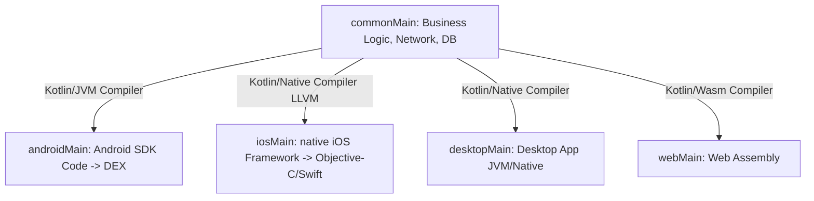
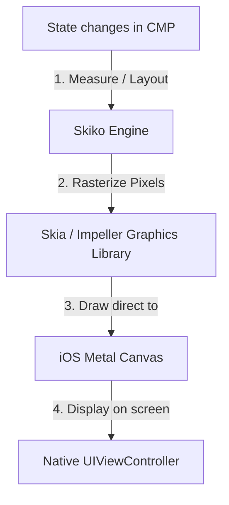
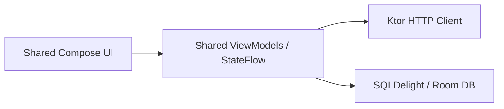
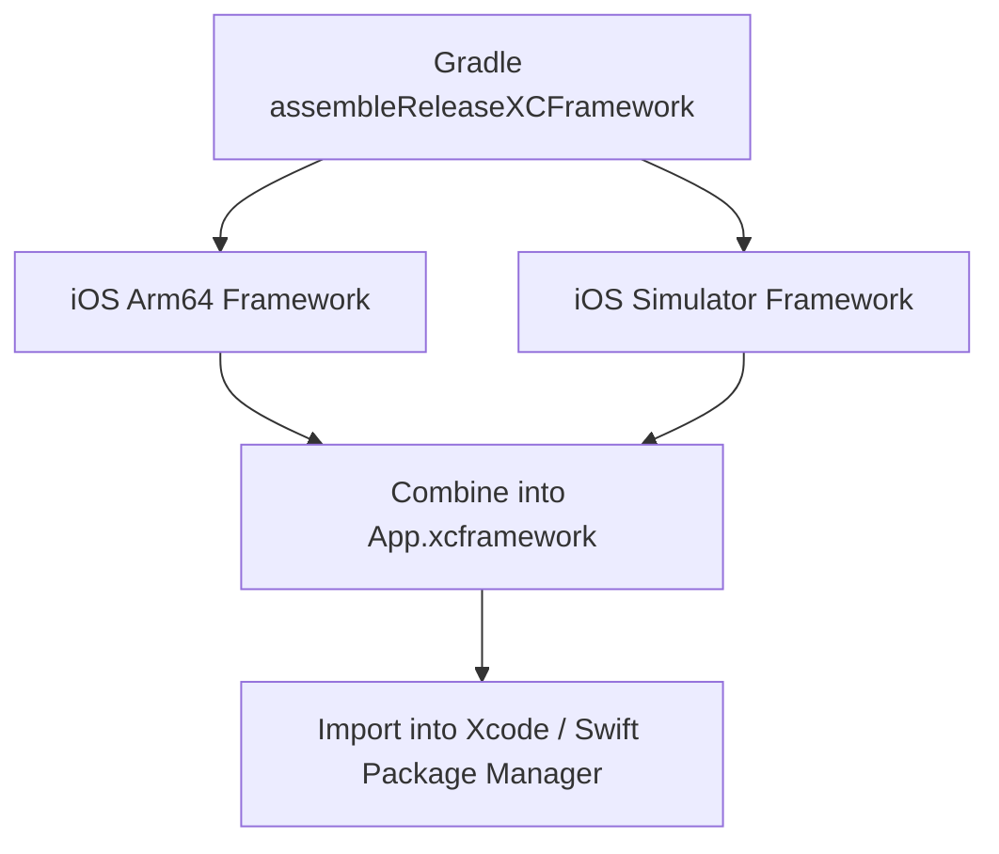

# 🚀 Kotlin Multiplatform (KMP) & Compose Multiplatform (CMP) — Complete Interview Preparation Guide

> **Authoritative Technical Reference**  
> Designed for Mobile Developers with 2–5 years of experience. This guide covers Kotlin Multiplatform (KMP) architecture, Compose Multiplatform (CMP) rendering mechanics, code sharing models, platform-specific integrations (expect/actual, Ktor, SQLDelight, Room), Swift interop, and performance optimizations.

---

## 📑 Table of Contents

1. [Module 1: KMP & CMP Fundamentals](#1-kmp--cmp-fundamentals)
2. [Module 2: KMP Project Architecture & expect/actual](#2-kmp-project-architecture--expectactual)
3. [Module 3: Compose Multiplatform (CMP) Rendering Engine](#3-compose-multiplatform-cmp-rendering-engine)
4. [Module 4: Shared Architecture Libraries (Network & Storage)](#4-shared-architecture-libraries-network--storage)
5. [Module 5: Kotlin/Native & Swift Interoperability](#5-kotlinnative--swift-interoperability)
6. [Module 6: KMP Delivery & Build Formats (XCFrameworks)](#6-kmp-delivery--build-formats-xcframeworks)

---

# 1. KMP & CMP Fundamentals

## 1.1 What is Kotlin Multiplatform (KMP)?

### Definition
* **Simple:** Kotlin Multiplatform (KMP) is a technology developed by JetBrains that allows you to write your business logic (like networking, databases, and validation rules) once in Kotlin and share it across Android, iOS, Desktop, and Web apps, while still keeping native UI.
* **Advanced:** KMP is a code-sharing framework that compiles Kotlin code to platform-specific target formats. It uses Kotlin/JVM for Android, Kotlin/Native (via LLVM) to build native binary frameworks for iOS/macOS, and Kotlin/JS or Kotlin/Wasm for web targets.



### Why it is Used
Unlike other cross-platform options (like React Native or Flutter) that enforce a non-native UI engine or single-language stack for both UI and logic, KMP lets developers **share business logic while retaining native UI rendering**. This allows teams to share up to 70% of their codebase without compromising platform-specific user experiences.

---

## 1.2 KMP vs. Compose Multiplatform (CMP)

### Comparison Table

| Feature | Kotlin Multiplatform (KMP) | Compose Multiplatform (CMP) |
|---|---|---|
| **Primary Goal** | Share business logic (data, network, domain models) | Share both business logic and user interface (UI) |
| **UI Implementation** | Platforms use native UI tools (Compose for Android, SwiftUI for iOS) | Write declarative UI once using Jetpack Compose APIs |
| **Framework Developer** | JetBrains & Google (Kotlin Language) | JetBrains (built on Google's Jetpack Compose) |
| **iOS Integration** | Kotlin compiled to Cocoa/Swift framework | UI drawn onto a native canvas using the Skia graphics engine |
| **Adoption Strategy** | Low-risk (add to existing apps easily) | Medium-risk (replaces native Swift UI layer) |

---

# 2. KMP Project Architecture & expect/actual

## 2.1 Directory Structure

A KMP project organizes code into target source sets. The entry point is the `commonMain` directory, which only allows pure Kotlin dependencies (no `android.*` or `Foundation` iOS frameworks).

```text
shared/
├── src/
│   ├── commonMain/              # Pure Kotlin code (Ktor, SQLDelight, Serialization)
│   ├── androidMain/             # Android-specific code (accesses android.content.Context)
│   └── iosMain/                 # iOS-specific code (accesses Foundation, UIKit, CoreData)
└── build.gradle.kts             # Configures targets (android(), iosArm64(), iosSimulatorArm64())
```

---

## 2.2 Accessing Native APIs (`expect` / `actual`)

When writing shared code in `commonMain`, you often need to access system services (like UUID generators, local file systems, or device sensors). KMP solves this using the `expect`/`actual` keywords.

### How it Works Internally
* **`expect`:** Declared in `commonMain` as a header definition (an interface, class, or function).
* **`actual`:** Implemented in platform-specific modules (`androidMain`, `iosMain`). The compiler enforces that every `expect` declaration has a matching `actual` implementation per configured target, failing the build at compile time if a platform is missing an implementation.

```kotlin
// 1. commonMain - Header definition
expect class PlatformDevice {
    val osName: String
    val deviceId: String
}

// 2. androidMain - Android Actual Implementation
import android.os.Build
import java.util.UUID

actual class PlatformDevice {
    actual val osName: String = "Android ${Build.VERSION.RELEASE}"
    actual val deviceId: String = UUID.randomUUID().toString()
}

// 3. iosMain - iOS Actual Implementation (Accesses Apple Objective-C APIs directly)
import platform.UIKit.UIDevice

actual class PlatformDevice {
    actual val osName: String = UIDevice.currentDevice.systemName + " " + UIDevice.currentDevice.systemVersion
    actual val deviceId: String = UIDevice.currentDevice.identifierForVendor?.UUIDString ?: "unknown"
}
```

---

# 3. Compose Multiplatform (CMP) Rendering Engine

## 3.1 Under the Hood: Skiko and Skia

### How CMP Draws UI on iOS
Unlike Android where Compose uses native Android system canvases, iOS has no built-in support for Compose's rendering nodes. 
* On iOS, CMP uses **Skiko** (Kotlin bindings for the **Skia** / **Impeller** graphics library) to draw layout components.
* During initialization, CMP wraps its root view inside a native iOS `UIViewController` subclass.
* As states change, CMP measures, lays out, and draws the composable pixels directly onto a native Metal/OpenGL graphics canvas inside this view controller, completely bypassing Apple's UIKit view objects.



### Advantages & Disadvantages of Sharing UI on iOS

* **Advantages:**
  * Write UI code once, reducing UI development times by 50%.
  * Visual consistency: the layout renders identically on both iOS and Android.
  * No bridge serialization overhead (as seen in React Native).
* **Disadvantages:**
  * Bypasses iOS UIKit native behaviors: default scroll physics, text selection cursors, accessibility tree mappings, and text rendering may feel slightly un-native.
  * Increased binary size due to packing the Skia engine inside the iOS framework.

## 3.2 Display Link Frame Synchronization (VSync & CADisplayLink)

To achieve smooth 60Hz/120Hz (ProMotion) animations on iOS devices, Compose Multiplatform must synchronize its rendering loop with the iOS screen refresh rate.
* **CADisplayLink:** On iOS, CMP uses Apple's native `CADisplayLink` (VSync timer). The display link binds a callback function to the hardware screen's refresh cycle.
* When the display link ticks, it calls CMP's internal rendering loop inside Skiko. CMP calculates state updates (Composition), runs layout measurements, and triggers a GPU draw call on the Metal layer within the active VSync window. This prevents screen tearing and rendering stutter.

---

# 4. Shared Architecture Libraries (Network & Storage)

To build a shared architecture, KMP utilizes multiplatform libraries that abstract platform-specific framework requirements.



## 4.1 Networking (Ktor)
**Ktor** is JetBrains' Kotlin-native asynchronous HTTP client. It uses Coroutines for async requests and maps engine providers at runtime (e.g. OkHttp on Android, NSURLSession on iOS).

## 4.2 Storage (SQLDelight & Room Multiplatform)
* **SQLDelight:** Generates type-safe Kotlin databases from raw SQL files. It uses platform-specific drivers (`AndroidSqliteDriver` on Android, `NativeSqliteDriver` on iOS).
* **Room Multiplatform (Android 15 / Room 2.7+):** Google now officially supports Room in KMP projects, allowing databases to be defined in `commonMain` and run natively on Android, iOS, and JVM targets.

## 4.3 Compose Multiplatform Resources (Res Class)
Compose Multiplatform 1.6+ provides a unified, type-safe API for accessing shared resources (strings, drawables, fonts, and raw files) located in the `commonMain/composeResources/` directory.
* **The `Res` Class:** The Compose gradle plugin automatically parses resources at compile time, generating a Kotlin object pointer class named `Res` (similar to Android's `R` class).
* **Accessing Assets:**
  ```kotlin
  // Kotlin KMP Resource Access
  val greeting = Res.string.welcome_message
  val icon = Res.drawable.ic_app_logo
  ```
* **Packaging:** During the build process, the plugin compiles resources into Android assets for Android targets, and automatically packages them into the Cocoa Framework bundle resources for iOS targets.

## 4.4 Shared Jetpack Lifecycle & ViewModels
Google officially supports Jetpack Lifecycle components in Kotlin Multiplatform.
* **`androidx.lifecycle.ViewModel`:** You can define ViewModels directly in `commonMain` to hold screen state and manage coroutine scopes via `viewModelScope`.
* **iOS Integration:** The lifecycle of the shared ViewModel is linked to the hosting UIViewController lifecycle. When the iOS view controller is popped from the UINavigationController backstack, it triggers the ViewModel's `onCleared()` callback, canceling active coroutines and freeing native memory.

---

# 5. Kotlin/Native & Swift Interoperability

## 5.1 Swift Interop Constraints

When compiling a Kotlin framework for iOS, Kotlin types are mapped to Objective-C / Swift structures. This leads to several constraints:

1. **Coroutines and Suspend Functions:**
   * A `suspend` function in Kotlin is compiled into a function that accepts a completion callback (`completionHandler`) in Swift/Objective-C.
   * Swift handles this as an `async/await` function, but exception cancellation flows do not propagate back to Kotlin naturally.
2. **Generics Erasure:**
   * Kotlin generics compile to Objective-C generics, which do not support the same covariance or contravariance constraints as Swift, occasionally erasing type definitions to `Any`.
3. **Value Classes:**
   * Kotlin `value class` inline optimizations are not visible to Objective-C/Swift. They are exposed as raw wrapper classes, losing their memory efficiency benefits.

## 5.2 Reference Counting & Garbage Collection (Memory Cycles & Leaks)

A key architectural challenge for senior developers is managing memory across the Swift/Kotlin boundary.
* **Objective-C ARC:** iOS uses Automatic Reference Counting (ARC) to manage memory by tracking reference counts at compile time.
* **Kotlin/Native GC:** Kotlin/Native uses a tracing Garbage Collector that manages memory concurrently at runtime.
* **Memory Lifecycle Bridge:** When a Kotlin object is passed to Swift, Kotlin/Native wraps it in a proxy Objective-C object (`KotlinObjCProto`). Swift ARC tracks references to this proxy wrapper.
* **Memory Cycle Leak Danger:** If a Swift object holds a strong reference to a Kotlin object proxy, and that Kotlin object holds a strong reference back to the Swift object (a typical delegate pattern or callback structure), the cycle cannot be resolved by either Swift's ARC or Kotlin's GC. This causes permanent memory leaks.
* **Solution:** Break the cycle by using Kotlin **WeakReferences** or defining Swift delegates as `weak` references when bridging to Kotlin.

---

# 6. KMP Delivery & Build Formats (XCFrameworks)

To import KMP code into an iOS Swift project, the shared module compiles into an **XCFramework**.



1. **XCFramework:** A packaging format designed by Apple that groups frameworks built for different architectures (e.g., native ARM64 for devices and x86_64/ARM64 for simulator targets) into a single bundle.
2. **Swift Package Manager (SPM) / CocoaPods:** Developers configure Gradle to build the XCFramework, which is then referenced as a local or remote dependency inside Xcode projects, allowing Swift developers to call Kotlin methods directly.

---

# 7. Core Interview Questions & Answers

### Q. What is the expect/actual mechanism in KMP, and how does it compare to standard interfaces?
* **Answer:** The `expect`/`actual` mechanism is a KMP compiler feature. It allows you to declare platform-dependent declarations in `commonMain` (`expect`) and provide concrete target implementations in platform-specific modules (`actual`).
  * **Comparison to Interfaces:** Interfaces are resolved at runtime (polymorphism). The `expect`/`actual` mechanism is resolved at **compile time**. The compiler matches declarations, replacing `expect` signatures with native `actual` target binaries, enabling zero runtime overhead and direct access to native platform types without type casting.

### Q. Explain how Compose Multiplatform renders UI on iOS devices.
* **Answer:** Compose Multiplatform does not convert composable elements into native iOS UIKit widgets (like UIButton or UITableView). Instead, it draws pixels directly onto a single native view controller container. It uses **Skiko** (Kotlin bindings to the **Skia** / **Impeller** graphics engine) to measure, position, and draw every layout component on a Metal graphics canvas, ensuring identical rendering outputs across platforms.

### Q. How do you handle Kotlin Coroutines and Flow collections safely in Swift?
* **Answer:** Kotlin Coroutines `Flow` streams cannot be collected directly in Swift because Swift lacks native coroutine suspension builders. Pentesters and developers solve this by:
  1. Wrapping Flow collections inside helper classes in `iosMain` that expose callback-based subscription methods (`watch` patterns).
  2. Utilizing libraries like **KMP-NativeCoroutines** which automatically generate Swift-friendly structures (like `Publisher` or Swift `AsyncSequence`) from Kotlin flows during compilation.
