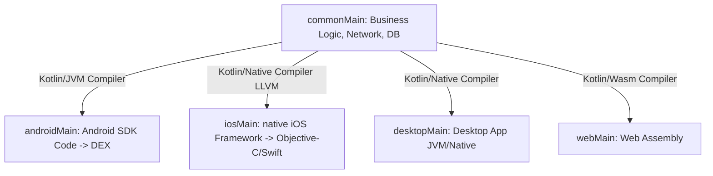
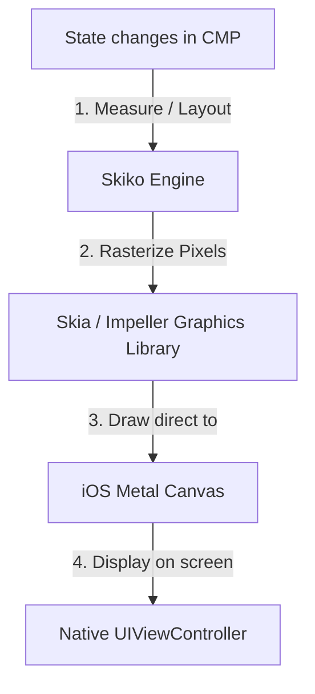
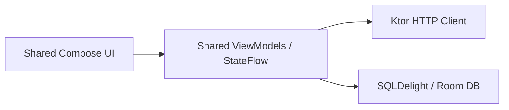
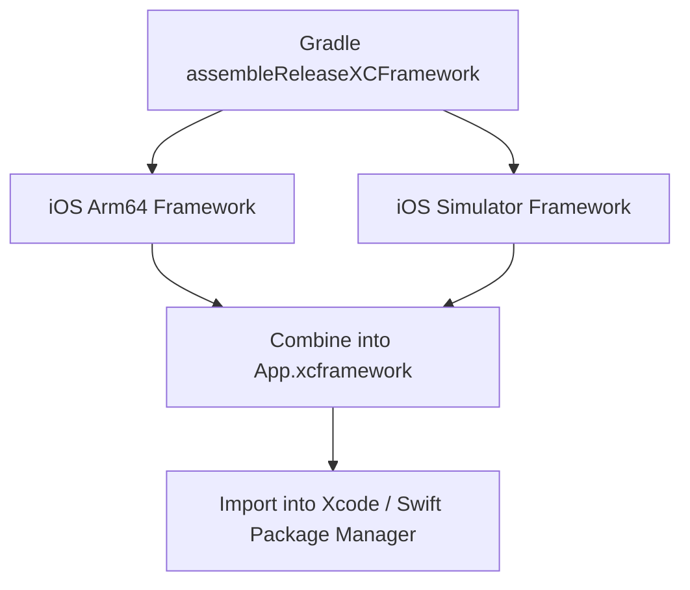

# 🚀 Kotlin Multiplatform (KMP) & Compose Multiplatform (CMP) — Complete Interview Preparation Guide

> **Authoritative Technical Reference**
> Every topic follows the same structure — **Definition → Why It Is Used → How It Works Internally → Code Example → Common Pitfalls**.
>
> Covers KMP architecture, `expect`/`actual`, Skiko/Skia rendering, shared libraries, Swift interop, testing, and adoption strategy.
>
> **20 KMP/CMP interview questions:** [`interview_questions/12_kmp_cmp.md`](./interview_questions/12_kmp_cmp.md)

---

## 📑 Table of Contents

| # | Module | Key Topics |
|---|---|---|
| 1 | [KMP & CMP Fundamentals](#1-kmp--cmp-fundamentals) | What KMP is, KMP vs CMP, when to use each |
| 2 | [Project Architecture & expect/actual](#2-kmp-project-architecture--expectactual) | Source sets, hierarchy, native API access |
| 3 | [CMP Rendering Engine](#3-compose-multiplatform-cmp-rendering-engine) | Skiko/Skia, iOS rendering, display-link sync |
| 4 | [Shared Libraries](#4-shared-architecture-libraries-network--storage) | Ktor, SQLDelight/Room, resources, lifecycle, Koin DI, serialization, DataStore |
| 5 | [Kotlin/Native & Swift Interop](#5-kotlinnative--swift-interoperability) | Interop constraints, memory model, reference cycles |
| 6 | [Delivery & Build Formats](#6-kmp-delivery--build-formats-xcframeworks) | XCFrameworks, CocoaPods, SPM |
| 7 | [Testing in KMP](#7-testing-in-kotlin-multiplatform) | `commonTest`, MockEngine, platform test targets |
| 8 | [Adoption Strategy](#8-adoption-strategy-and-team-trade-offs) | What to share and in what order, team trade-offs |
| 9 | [Interview Questions](#9-interview-questions) | Pointer to the question bank |

---

# 1. KMP & CMP Fundamentals

## 1.1 What is Kotlin Multiplatform (KMP)?

### Definition
* **Simple:** Kotlin Multiplatform (KMP) is a technology developed by JetBrains that allows you to write your business logic (like networking, databases, and validation rules) once in Kotlin and share it across Android, iOS, Desktop, and Web apps, while still keeping native UI.
* **Advanced:** KMP is a code-sharing framework that compiles Kotlin code to platform-specific target formats. It uses Kotlin/JVM for Android, Kotlin/Native (via LLVM) to build native binary frameworks for iOS/macOS, and Kotlin/JS or Kotlin/Wasm for web targets.



### Why it is Used
Unlike other cross-platform options (like React Native or Flutter) that enforce a non-native UI engine or single-language stack for both UI and logic, KMP lets developers **share business logic while retaining native UI rendering**. This allows teams to share up to 70% of their codebase without compromising platform-specific user experiences.

---

## 1.2 KMP vs. Compose Multiplatform (CMP)

### Comparison Table

| Feature | Kotlin Multiplatform (KMP) | Compose Multiplatform (CMP) |
|---|---|---|
| **Primary Goal** | Share business logic (data, network, domain models) | Share both business logic and user interface (UI) |
| **UI Implementation** | Platforms use native UI tools (Compose for Android, SwiftUI for iOS) | Write declarative UI once using Jetpack Compose APIs |
| **Framework Developer** | JetBrains & Google (Kotlin Language) | JetBrains (built on Google's Jetpack Compose) |
| **iOS Integration** | Kotlin compiled to Cocoa/Swift framework | UI drawn onto a native canvas using the Skia graphics engine |
| **Adoption Strategy** | Low-risk (add to existing apps easily) | Medium-risk (replaces native Swift UI layer) |

---

# 2. KMP Project Architecture & expect/actual

## 2.1 Directory Structure

A KMP project organizes code into target source sets. The entry point is the `commonMain` directory, which only allows pure Kotlin dependencies (no `android.*` or `Foundation` iOS frameworks).

```text
shared/
├── src/
│   ├── commonMain/              # Pure Kotlin code (Ktor, SQLDelight, Serialization)
│   ├── androidMain/             # Android-specific code (accesses android.content.Context)
│   └── iosMain/                 # iOS-specific code (accesses Foundation, UIKit, CoreData)
└── build.gradle.kts             # Configures targets (android(), iosArm64(), iosSimulatorArm64())
```

---

## 2.2 Accessing Native APIs (`expect` / `actual`)

When writing shared code in `commonMain`, you often need to access system services (like UUID generators, local file systems, or device sensors). KMP solves this using the `expect`/`actual` keywords.

### How it Works Internally
* **`expect`:** Declared in `commonMain` as a header definition (an interface, class, or function).
* **`actual`:** Implemented in platform-specific modules (`androidMain`, `iosMain`). The compiler enforces that every `expect` declaration has a matching `actual` implementation per configured target, failing the build at compile time if a platform is missing an implementation.

```kotlin
// 1. commonMain - Header definition
expect class PlatformDevice {
    val osName: String
    val deviceId: String
}

// 2. androidMain - Android Actual Implementation
import android.os.Build
import java.util.UUID

actual class PlatformDevice {
    actual val osName: String = "Android ${Build.VERSION.RELEASE}"
    actual val deviceId: String = UUID.randomUUID().toString()
}

// 3. iosMain - iOS Actual Implementation (Accesses Apple Objective-C APIs directly)
import platform.UIKit.UIDevice

actual class PlatformDevice {
    actual val osName: String = UIDevice.currentDevice.systemName + " " + UIDevice.currentDevice.systemVersion
    actual val deviceId: String = UIDevice.currentDevice.identifierForVendor?.UUIDString ?: "unknown"
}
```

---

# 3. Compose Multiplatform (CMP) Rendering Engine

## 3.1 Under the Hood: Skiko and Skia

### How CMP Draws UI on iOS
Unlike Android where Compose uses native Android system canvases, iOS has no built-in support for Compose's rendering nodes. 
* On iOS, CMP uses **Skiko** (Kotlin bindings for the **Skia** / **Impeller** graphics library) to draw layout components.
* During initialization, CMP wraps its root view inside a native iOS `UIViewController` subclass.
* As states change, CMP measures, lays out, and draws the composable pixels directly onto a native Metal/OpenGL graphics canvas inside this view controller, completely bypassing Apple's UIKit view objects.



### Advantages & Disadvantages of Sharing UI on iOS

* **Advantages:**
  * Write UI code once, reducing UI development times by 50%.
  * Visual consistency: the layout renders identically on both iOS and Android.
  * No bridge serialization overhead (as seen in React Native).
* **Disadvantages:**
  * Bypasses iOS UIKit native behaviors: default scroll physics, text selection cursors, accessibility tree mappings, and text rendering may feel slightly un-native.
  * Increased binary size due to packing the Skia engine inside the iOS framework.

## 3.2 Display Link Frame Synchronization (VSync & CADisplayLink)

To achieve smooth 60Hz/120Hz (ProMotion) animations on iOS devices, Compose Multiplatform must synchronize its rendering loop with the iOS screen refresh rate.
* **CADisplayLink:** On iOS, CMP uses Apple's native `CADisplayLink` (VSync timer). The display link binds a callback function to the hardware screen's refresh cycle.
* When the display link ticks, it calls CMP's internal rendering loop inside Skiko. CMP calculates state updates (Composition), runs layout measurements, and triggers a GPU draw call on the Metal layer within the active VSync window. This prevents screen tearing and rendering stutter.

---

# 4. Shared Architecture Libraries (Network & Storage)

To build a shared architecture, KMP utilizes multiplatform libraries that abstract platform-specific framework requirements.



## 4.1 Networking (Ktor)
**Ktor** is JetBrains' Kotlin-native asynchronous HTTP client. It uses Coroutines for async requests and maps engine providers at runtime (e.g. OkHttp on Android, NSURLSession on iOS).

## 4.2 Storage (SQLDelight & Room Multiplatform)
* **SQLDelight:** Generates type-safe Kotlin databases from raw SQL files. It uses platform-specific drivers (`AndroidSqliteDriver` on Android, `NativeSqliteDriver` on iOS).
* **Room Multiplatform (Android 15 / Room 2.7+):** Google now officially supports Room in KMP projects, allowing databases to be defined in `commonMain` and run natively on Android, iOS, and JVM targets.

## 4.3 Compose Multiplatform Resources (Res Class)
Compose Multiplatform 1.6+ provides a unified, type-safe API for accessing shared resources (strings, drawables, fonts, and raw files) located in the `commonMain/composeResources/` directory.
* **The `Res` Class:** The Compose gradle plugin automatically parses resources at compile time, generating a Kotlin object pointer class named `Res` (similar to Android's `R` class).
* **Accessing Assets:**
  ```kotlin
  // Kotlin KMP Resource Access
  val greeting = Res.string.welcome_message
  val icon = Res.drawable.ic_app_logo
  ```
* **Packaging:** During the build process, the plugin compiles resources into Android assets for Android targets, and automatically packages them into the Cocoa Framework bundle resources for iOS targets.

## 4.4 Shared Jetpack Lifecycle & ViewModels
Google officially supports Jetpack Lifecycle components in Kotlin Multiplatform.
* **`androidx.lifecycle.ViewModel`:** You can define ViewModels directly in `commonMain` to hold screen state and manage coroutine scopes via `viewModelScope`.
* **iOS Integration:** The lifecycle of the shared ViewModel is linked to the hosting UIViewController lifecycle. When the iOS view controller is popped from the UINavigationController backstack, it triggers the ViewModel's `onCleared()` callback, canceling active coroutines and freeing native memory.

---

## 4.4 Dependency Injection in KMP (Koin)

### Definition
Koin is the de-facto DI container for Kotlin Multiplatform because it is pure Kotlin with no annotation processing — Hilt and Dagger are JVM/Android-only and cannot run in `commonMain`.

### Why It Is Used
The shared module needs a way to wire repositories, API clients, and databases without knowing which platform it runs on. Koin's DSL lives in `commonMain`, and platform-specific bindings are supplied through `expect`/`actual` modules.

### How It Works Internally
A shared `commonMain` module declares platform-agnostic bindings. Each platform contributes a `platformModule()` declared as `expect fun` and implemented per target — this is where the Android `Context`, the iOS `NSUserDefaults`, and the platform HTTP engine come from.

### Code Example
```kotlin
// commonMain/di/Modules.kt
val sharedModule = module {
    single { createHttpClient(get()) }                    // engine comes from platformModule
    single<UserRepository> { UserRepositoryImpl(get(), get()) }
    factory { GetUserProfileUseCase(get()) }
}

// The platform contributes what commonMain cannot construct
expect fun platformModule(): Module

// One entry point both platforms call
fun initKoin(extra: Module = module { }): KoinApplication = startKoin {
    modules(sharedModule, platformModule(), extra)
}
```

```kotlin
// androidMain
actual fun platformModule(): Module = module {
    single<HttpClientEngine> { OkHttp.create() }
    single { AppDatabase(AndroidSqliteDriver(Schema, get(), "app.db")) }
    single<Settings> { SharedPreferencesSettings(get<Context>().getSharedPreferences("app", 0)) }
}

// Android app calls it once
class App : Application() {
    override fun onCreate() {
        super.onCreate()
        initKoin(module { single<Context> { this@App } })
    }
}
```

```kotlin
// iosMain
actual fun platformModule(): Module = module {
    single<HttpClientEngine> { Darwin.create() }
    single { AppDatabase(NativeSqliteDriver(Schema, "app.db")) }
    single<Settings> { NSUserDefaultsSettings(NSUserDefaults.standardUserDefaults) }
}

// A helper Swift can call, because Swift cannot use Kotlin default arguments
fun initKoinIos() = initKoin()

// A Swift-friendly resolver: Swift cannot use Koin's reified inject() extensions
object KoinHelper : KoinComponent {
    fun userRepository(): UserRepository = get()
}
```

```swift
// iOSApp.swift
@main
struct iOSApp: App {
    init() { SharedKt.doInitKoinIos() }     // "do" prefix: Kotlin's init clashes with Swift's
    var body: some Scene { WindowGroup { ContentView() } }
}
```

### Common Pitfalls
* **Trying to use Hilt in `commonMain`.** It is Android-only; the shared module will not compile for iOS.
* **`by inject()` from Swift.** Reified inline extensions do not export to Objective-C. Expose plain functions instead.
* **Calling `startKoin` twice.** Throws `KoinAppAlreadyStartedException`; on iOS the app may re-initialize on state restoration.
* **Skipping `checkModules()`.** Koin resolves at runtime, so a missing binding surfaces on the iOS device rather than in the build.

---

## 4.5 Serialization and Shared Data Models

### Definition
`kotlinx.serialization` is the only serialization library that works across all KMP targets, because it is compiler-plugin based rather than reflection based (Kotlin/Native has no reflection).

### Why It Is Used
Gson and Moshi are JVM-only. Any shared DTO must use `kotlinx.serialization`, which is also what Ktor's content negotiation expects.

### Code Example
```kotlin
// commonMain — one model definition serves Android, iOS, desktop, and web
@Serializable
data class UserDto(
    val id: Long,
    @SerialName("full_name") val fullName: String,
    val email: String? = null,
    @Serializable(with = InstantSerializer::class) val createdAt: Instant
)

// Custom serializer for a type with no built-in support
object InstantSerializer : KSerializer<Instant> {
    override val descriptor = PrimitiveSerialDescriptor("Instant", PrimitiveKind.STRING)
    override fun serialize(encoder: Encoder, value: Instant) = encoder.encodeString(value.toString())
    override fun deserialize(decoder: Decoder): Instant = Instant.parse(decoder.decodeString())
}

val json = Json {
    ignoreUnknownKeys = true        // Old clients must survive new server fields
    isLenient = false
    explicitNulls = false
}
```

```kotlin
// Ktor client with content negotiation, shared across every platform
fun createHttpClient(engine: HttpClientEngine) = HttpClient(engine) {
    install(ContentNegotiation) { json(json) }
    install(Logging) { level = LogLevel.INFO }
    install(HttpTimeout) {
        requestTimeoutMillis = 30_000
        connectTimeoutMillis = 15_000
    }
    install(HttpRequestRetry) {
        retryOnServerErrors(maxRetries = 3)
        exponentialDelay()
    }
    defaultRequest {
        url(BASE_URL)
        header(HttpHeaders.ContentType, ContentType.Application.Json)
    }
}
```

### Common Pitfalls
* **Reaching for Gson in shared code.** It does not compile for Native targets.
* **`ignoreUnknownKeys` left at its default of `false`.** The first new backend field crashes every client.
* **Using `kotlinx.datetime` types without a serializer.** Add the `kotlinx-datetime` serializers module or a custom `KSerializer`.

---

## 4.6 Multiplatform Key-Value and Preferences Storage

### Definition
DataStore Preferences is multiplatform from AndroidX 1.1, and the third-party `multiplatform-settings` library wraps each platform's native store.

### How It Works Internally

| Library | Android | iOS | Notes |
|---|---|---|---|
| **DataStore Preferences** | Same as Android | Okio-backed file | Official, coroutine/Flow API, transactional |
| **multiplatform-settings** | `SharedPreferences` | `NSUserDefaults` | Thin wrapper, synchronous by default |
| **SQLDelight** | SQLite | SQLite | Full relational storage, typed queries |
| **Room KMP** | SQLite | SQLite | Official, familiar annotations, newer on iOS |

### Code Example
```kotlin
// commonMain — one DataStore construction shared across platforms
fun createDataStore(producePath: () -> String): DataStore<Preferences> =
    PreferenceDataStoreFactory.createWithPath(produceFile = { producePath().toPath() })

internal const val DATA_STORE_FILE = "app.preferences_pb"
```

```kotlin
// androidMain
fun createDataStore(context: Context): DataStore<Preferences> =
    createDataStore { context.filesDir.resolve(DATA_STORE_FILE).absolutePath }

// iosMain
fun createDataStore(): DataStore<Preferences> = createDataStore {
    val dir = NSFileManager.defaultManager.URLForDirectory(
        directory = NSDocumentDirectory,
        inDomain = NSUserDomainMask,
        appropriateForURL = null, create = false, error = null
    )
    requireNotNull(dir).path + "/$DATA_STORE_FILE"
}
```

```kotlin
// SQLDelight: typed queries generated from .sq files, shared across platforms
// shared/src/commonMain/sqldelight/com/example/db/User.sq
//   CREATE TABLE user (id INTEGER PRIMARY KEY, name TEXT NOT NULL, email TEXT);
//   selectAll: SELECT * FROM user;
//   insert:    INSERT OR REPLACE INTO user(id, name, email) VALUES (?, ?, ?);

class UserLocalSource(private val db: AppDatabase) {
    // Query results as a Flow, mapped off the main thread
    fun observeAll(): Flow<List<User>> = db.userQueries.selectAll()
        .asFlow()
        .mapToList(Dispatchers.IO)
}
```

### Common Pitfalls
* **Assuming `NSUserDefaults` is secure.** It is plaintext; secrets belong in the iOS Keychain and the Android Keystore, behind an `expect`/`actual` abstraction.
* **Different file paths per platform diverging silently.** Centralize the filename in `commonMain`.
* **Blocking reads on the main thread on iOS.** SQLDelight queries must be mapped on a background dispatcher.

---
# 5. Kotlin/Native & Swift Interoperability

## 5.1 Swift Interop Constraints

When compiling a Kotlin framework for iOS, Kotlin types are mapped to Objective-C / Swift structures. This leads to several constraints:

1. **Coroutines and Suspend Functions:**
   * A `suspend` function in Kotlin is compiled into a function that accepts a completion callback (`completionHandler`) in Swift/Objective-C.
   * Swift handles this as an `async/await` function, but exception cancellation flows do not propagate back to Kotlin naturally.
2. **Generics Erasure:**
   * Kotlin generics compile to Objective-C generics, which do not support the same covariance or contravariance constraints as Swift, occasionally erasing type definitions to `Any`.
3. **Value Classes:**
   * Kotlin `value class` inline optimizations are not visible to Objective-C/Swift. They are exposed as raw wrapper classes, losing their memory efficiency benefits.

## 5.2 Reference Counting & Garbage Collection (Memory Cycles & Leaks)

A key architectural challenge for senior developers is managing memory across the Swift/Kotlin boundary.
* **Objective-C ARC:** iOS uses Automatic Reference Counting (ARC) to manage memory by tracking reference counts at compile time.
* **Kotlin/Native GC:** Kotlin/Native uses a tracing Garbage Collector that manages memory concurrently at runtime.
* **Memory Lifecycle Bridge:** When a Kotlin object is passed to Swift, Kotlin/Native wraps it in a proxy Objective-C object (`KotlinObjCProto`). Swift ARC tracks references to this proxy wrapper.
* **Memory Cycle Leak Danger:** If a Swift object holds a strong reference to a Kotlin object proxy, and that Kotlin object holds a strong reference back to the Swift object (a typical delegate pattern or callback structure), the cycle cannot be resolved by either Swift's ARC or Kotlin's GC. This causes permanent memory leaks.
* **Solution:** Break the cycle by using Kotlin **WeakReferences** or defining Swift delegates as `weak` references when bridging to Kotlin.

---

# 6. KMP Delivery & Build Formats (XCFrameworks)

To import KMP code into an iOS Swift project, the shared module compiles into an **XCFramework**.



1. **XCFramework:** A packaging format designed by Apple that groups frameworks built for different architectures (e.g., native ARM64 for devices and x86_64/ARM64 for simulator targets) into a single bundle.
2. **Swift Package Manager (SPM) / CocoaPods:** Developers configure Gradle to build the XCFramework, which is then referenced as a local or remote dependency inside Xcode projects, allowing Swift developers to call Kotlin methods directly.

---

# 7. Testing in Kotlin Multiplatform

## 7.1 Common Tests and Platform Test Targets

### Definition
`commonTest` holds tests that run on **every** target. `androidUnitTest`, `iosTest`, and friends hold platform-specific tests, each executed by that platform's test runner.

### Why It Is Used
A test written once in `commonTest` runs on the JVM, on the iOS simulator, and on any other configured target — which is how you verify that shared logic genuinely behaves identically everywhere, rather than assuming it does.

### How It Works Internally
* `kotlin.test` provides the assertion API that maps to JUnit on the JVM and to XCTest on Apple targets.
* `kotlinx-coroutines-test` `runTest` works in `commonTest`, so coroutine tests are shareable.
* Ktor's `MockEngine` replaces the HTTP engine in tests, so network tests need no server and run identically everywhere.
* iOS tests execute on a simulator via Gradle (`./gradlew iosSimulatorArm64Test`), so they are slower than JVM tests but still fully automated.

### Code Example
```kotlin
// commonTest — runs on JVM, iOS simulator, and every other configured target
class UserRepositoryTest {

    private fun repo(engine: MockEngine) = UserRepositoryImpl(
        client = createHttpClient(engine),
        local = InMemoryUserSource()
    )

    @Test
    fun `parses a user response identically on every platform`() = runTest {
        val engine = MockEngine { request ->
            assertEquals("/users/1", request.url.encodedPath)
            respond(
                content = """{"id":1,"full_name":"Ada","created_at":"2024-01-01T00:00:00Z"}""",
                status = HttpStatusCode.OK,
                headers = headersOf(HttpHeaders.ContentType, "application/json")
            )
        }

        val user = repo(engine).getUser(1)

        assertEquals("Ada", user.name)
    }

    @Test
    fun `server error maps to a domain failure`() = runTest {
        val engine = MockEngine { respond("", HttpStatusCode.InternalServerError) }
        val result = repo(engine).getUserResult(1)
        assertTrue(result is DataResult.Failure)
    }
}
```

```kotlin
// Platform-specific behavior needs a platform test
// androidUnitTest
class AndroidPlatformTest {
    @Test fun `platform name reports Android`() {
        assertTrue(getPlatform().name.startsWith("Android"))
    }
}

// iosTest
class IosPlatformTest {
    @Test fun `platform name reports iOS`() {
        assertTrue(getPlatform().name.contains("iOS"))
    }
}
```

```gradle
kotlin {
    sourceSets {
        commonTest.dependencies {
            implementation(kotlin("test"))
            implementation(libs.kotlinx.coroutines.test)
            implementation(libs.ktor.client.mock)
            implementation(libs.turbine)
        }
    }
}
```

```bash
./gradlew :shared:allTests                    # Every target
./gradlew :shared:jvmTest                     # Fast feedback loop during development
./gradlew :shared:iosSimulatorArm64Test       # Verify the Native compilation path
```

### Common Pitfalls
* **Only running `jvmTest`.** Kotlin/Native has different memory and concurrency semantics; a bug can exist only there. Run `allTests` in CI.
* **JVM-only libraries in `commonTest`.** MockK and Robolectric do not work on Native. Use hand-written fakes and Ktor's `MockEngine`.
* **`Dispatchers.Main` in `commonTest` without a test dispatcher.** There is no main looper in a Native test binary.
* **Slow iOS simulator tests running on every push.** Run JVM tests on push and the full matrix on merge.

---

# 8. Adoption Strategy and Team Trade-offs

## 8.1 What to Share, and in What Order

### Definition
KMP adoption is incremental by design: you choose which layers move to shared code and which stay native.

### Why It Is Used
Attempting to share everything at once — including UI — is the most common way KMP adoption fails. The value curve is steepest at the bottom of the stack and flattens sharply toward the UI.

### How It Works Internally

| Layer | Share? | Rationale |
|---|---|---|
| **Data models / DTOs** | Always | Pure Kotlin, zero platform surface, immediate duplication removed |
| **Networking (Ktor)** | Always | Endpoint definitions and error mapping are identical by nature |
| **Business logic / use cases** | Always | The highest-value, highest-risk-of-divergence code |
| **Local storage (SQLDelight/Room)** | Usually | Schema and queries are identical; the driver is platform-specific |
| **ViewModels / presentation** | Often | `androidx.lifecycle.ViewModel` is multiplatform; Flow needs a Swift bridge |
| **UI (Compose Multiplatform)** | Sometimes | Big win for internal or content-heavy apps; a real cost in iOS platform fidelity |
| **Platform APIs (camera, biometrics, notifications)** | Rarely | Thin `expect`/`actual` interfaces over native implementations |

**The recommended order:** models → networking → business logic → storage → presentation → (optionally) UI. Each step is independently shippable, so the project keeps delivering while it migrates.

### Code Example
```kotlin
// commonMain: a shared ViewModel using the multiplatform lifecycle artifact
class ProductListViewModel(
    private val repo: ProductRepository
) : ViewModel() {                                  // androidx.lifecycle.ViewModel, multiplatform

    private val _state = MutableStateFlow(ProductListState())
    val state: StateFlow<ProductListState> = _state.asStateFlow()

    fun load() = viewModelScope.launch {
        _state.update { it.copy(loading = true) }
        repo.products()
            .onSuccess { items -> _state.update { it.copy(loading = false, items = items) } }
            .onFailure { e -> _state.update { it.copy(loading = false, error = e.message) } }
    }
}
```

```swift
// iOS: bridging a Kotlin StateFlow into SwiftUI.
// SKIE or KMP-NativeCoroutines generates this bridge; hand-rolling it is possible but tedious.
@MainActor
class ProductListObservable: ObservableObject {
    @Published var state = ProductListState(loading: false, items: [], error: nil)

    private let viewModel = ProductListViewModel(repo: KoinHelper.shared.productRepository())
    private var task: Task<Void, Never>?

    func start() {
        // With SKIE, a Kotlin Flow becomes a Swift AsyncSequence
        task = Task {
            for await value in viewModel.state {
                self.state = value
            }
        }
    }

    // Cancelling is MANDATORY: a Kotlin Flow collection leaks if the Swift side never stops it
    func stop() { task?.cancel() }
}
```

### Trade-offs to State in an Interview

| Benefit | Cost |
|---|---|
| One implementation of business logic, so platforms cannot diverge | iOS developers must read (and sometimes write) Kotlin |
| Bugs fixed once | Xcode debugging of Kotlin frames is poor; crashes need symbolication |
| Faster feature parity across platforms | Longer build times; the iOS framework link step is slow |
| Shared tests raise confidence | A smaller hiring pool and a less mature ecosystem than either native stack |
| Incremental — adoptable per module | Some libraries have no multiplatform equivalent |

### Common Pitfalls
* **Starting with shared UI.** It is the highest-risk, highest-visibility layer. Start with the data layer, where the win is unambiguous.
* **Not involving the iOS team.** KMP fails organizationally more often than technically. If iOS engineers cannot debug the shared module, they will resist it.
* **Exposing Kotlin `sealed class` hierarchies directly to Swift.** They arrive as unexhaustive Objective-C classes; SKIE fixes this by generating real Swift enums.
* **Ignoring framework size.** A Kotlin/Native framework adds meaningful binary size to the iOS app; measure it before committing.

---

# 9. Interview Questions

**➡️ [`interview_questions/12_kmp_cmp.md`](./interview_questions/12_kmp_cmp.md) — 20 questions on Kotlin Multiplatform and Compose Multiplatform.**

See also:
* [`interview_questions/05_coroutines_concurrency.md`](./interview_questions/05_coroutines_concurrency.md) — coroutines and Flow, which KMP depends on heavily
* [`interview_questions/00_INDEX.md`](./interview_questions/00_INDEX.md) — full index

---

## 📚 Related Guides

| Guide | Covers |
|---|---|
| [`compose.md`](./compose.md) | The Compose runtime, state, and effects that CMP reuses unchanged |
| [`android.md`](./android.md) | The Android platform side of an `expect`/`actual` implementation |
| [`../Languages/Kotlin.md`](../Languages/Kotlin.md) | Kotlin language features KMP relies on |
