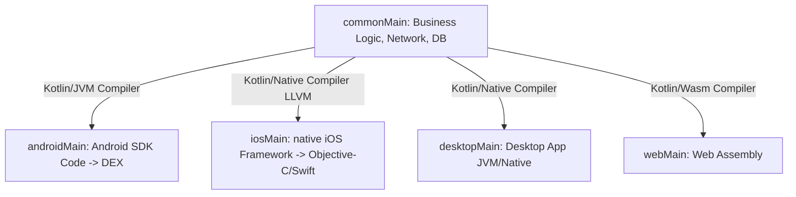
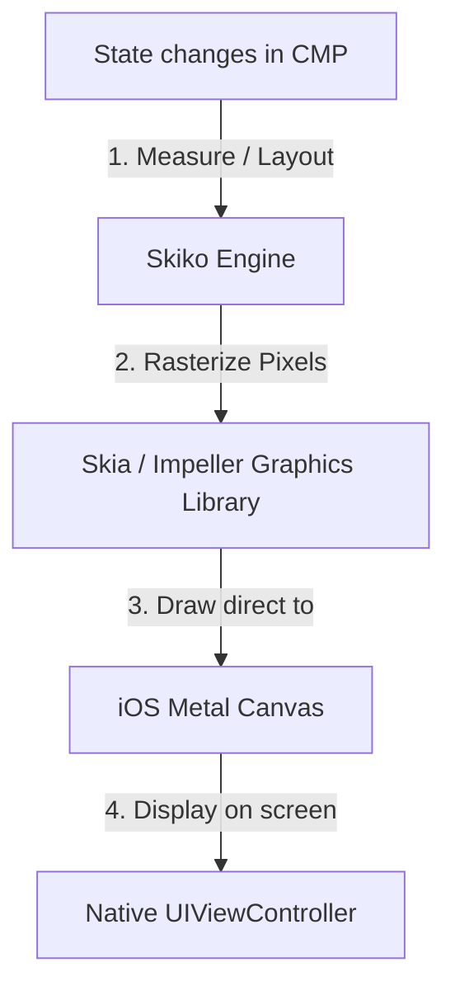
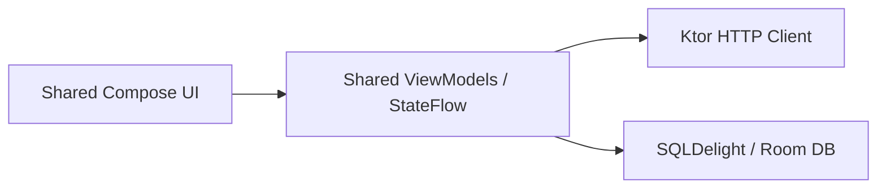
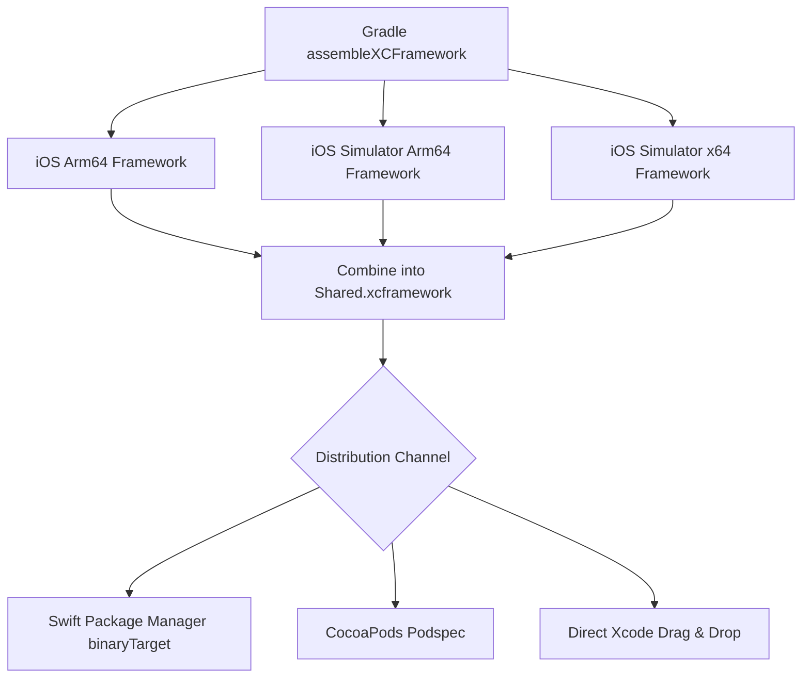

# 🚀 Kotlin Multiplatform (KMP) & Compose Multiplatform (CMP) — Complete Interview Preparation Guide

> **Authoritative Technical Reference**
> Every topic follows the same structure — **Definition → Why It Is Used → How It Works Internally → Code Example → Common Pitfalls**.
>
> Covers KMP architecture, `expect`/`actual`, Skiko/Skia rendering, shared libraries, Swift interop, testing, and adoption strategy.
>
> **20 KMP/CMP interview questions:** [Section 9](#9-kotlin-multiplatform--compose-multiplatform-interview-questions-20-questions)

---

## 📑 Table of Contents

| # | Module | Key Topics |
|---|---|---|
| 1 | [KMP & CMP Fundamentals](#1-kmp--cmp-fundamentals) | What KMP is, KMP vs CMP, when to use each |
| 2 | [Project Architecture & expect/actual](#2-kmp-project-architecture--expectactual) | Source sets, hierarchy, native API access |
| 3 | [CMP Rendering Engine](#3-compose-multiplatform-cmp-rendering-engine) | Skiko/Skia, iOS rendering, display-link sync |
| 4 | [Shared Libraries](#4-shared-architecture-libraries-network--storage) | Ktor, SQLDelight/Room, resources, lifecycle, Koin DI, serialization, DataStore |
| 5 | [Kotlin/Native & Swift Interop](#5-kotlinnative--swift-interoperability) | Interop constraints, memory model, reference cycles |
| 6 | [Delivery & Build Formats](#6-kmp-delivery--build-formats-xcframeworks) | XCFrameworks, CocoaPods, SPM |
| 7 | [Testing in KMP](#7-testing-in-kotlin-multiplatform) | `commonTest`, MockEngine, platform test targets |
| 8 | [Adoption Strategy](#8-adoption-strategy-and-team-trade-offs) | What to share and in what order, team trade-offs |
| 9 | [Interview Questions](#9-kotlin-multiplatform--compose-multiplatform-interview-questions-20-questions) | 20 KMP/CMP core & senior interview questions with follow-ups |

---

# 1. KMP & CMP Fundamentals

## 1.1 What is Kotlin Multiplatform (KMP)?

### Definition
* **Simple:** Kotlin Multiplatform (KMP) is a technology developed by JetBrains that allows you to write your business logic (like networking, databases, and validation rules) once in Kotlin and share it across Android, iOS, Desktop, and Web apps, while still keeping native UI.
* **Advanced:** KMP is a code-sharing framework that compiles Kotlin code to platform-specific target formats. It uses Kotlin/JVM for Android, Kotlin/Native (via LLVM) to build native binary frameworks for iOS/macOS, and Kotlin/JS or Kotlin/Wasm for web targets.


```mermaid
graph TD
    Common[commonMain: Business Logic, Network, DB] -->|Kotlin/JVM Compiler| Android[androidMain: Android SDK Code -> DEX]
    Common -->|Kotlin/Native Compiler LLVM| iOS[iosMain: native iOS Framework -> Objective-C/Swift]
    Common -->|Kotlin/Native Compiler| Desktop[desktopMain: Desktop App JVM/Native]
    Common -->|Kotlin/Wasm Compiler| Web[webMain: Web Assembly]
```

### Why It Is Used
Unlike other cross-platform options (like React Native or Flutter) that enforce a non-native UI engine or single-language stack for both UI and logic, KMP lets developers **share business logic while retaining native UI rendering**. This allows teams to share up to 70% of their codebase without compromising platform-specific user experiences.

---

## 1.2 KMP vs. Compose Multiplatform (CMP)

### Definition
* **Kotlin Multiplatform (KMP)** — sharing **logic**: models, networking, business rules, storage. Each platform keeps its own native UI.
* **Compose Multiplatform (CMP)** — an optional layer on top that also shares the **UI**, by running the Compose runtime on other platforms.
* **Why the distinction matters most in this topic** — they are separate decisions with very different risk profiles. KMP's data-layer benefit is unambiguous; sharing UI trades away platform fidelity and is adopted separately, if at all.
* **Incremental adoption** — the property that makes KMP practical: a shared module compiles to a normal framework the native app consumes, so it can start with one layer and grow.

### Comparison Table

| Feature | Kotlin Multiplatform (KMP) | Compose Multiplatform (CMP) |
|---|---|---|
| **Primary Goal** | Share business logic (data, network, domain models) | Share both business logic and user interface (UI) |
| **UI Implementation** | Platforms use native UI tools (Compose for Android, SwiftUI for iOS) | Write declarative UI once using Jetpack Compose APIs |
| **Framework Developer** | JetBrains & Google (Kotlin Language) | JetBrains (built on Google's Jetpack Compose) |
| **iOS Integration** | Kotlin compiled to Cocoa/Swift framework | UI drawn onto a native canvas using the Skia graphics engine |
| **Adoption Strategy** | Low-risk (add to existing apps easily) | Medium-risk (replaces native Swift UI layer) |

---

# 2. KMP Project Architecture & expect/actual

## 2.1 Directory Structure

### Definition
* **Source set** — a directory of code compiled for a particular set of targets. It is the unit that decides *what code sees what APIs*.
* **`commonMain`** — code compiled for **every** target, so it may use only the Kotlin standard library and multiplatform dependencies.
* **Platform source set** (`androidMain`, `iosMain`) — code compiled only for that target, where the platform SDK is available.
* **Intermediate source set** — a set shared by several related targets (`iosMain` covering device and both simulators), so code need not be duplicated per architecture.
* **Target** — a specific compilation output: `androidTarget`, `iosArm64`, `iosSimulatorArm64`, `jvm`, `js`.

A KMP project organizes code into target source sets. The entry point is the `commonMain` directory, which only allows pure Kotlin dependencies (no `android.*` or `Foundation` iOS frameworks).

```text
shared/
├── src/
│   ├── commonMain/              # Pure Kotlin code (Ktor, SQLDelight, Serialization)
│   ├── androidMain/             # Android-specific code (accesses android.content.Context)
│   └── iosMain/                 # iOS-specific code (accesses Foundation, UIKit, CoreData)
└── build.gradle.kts             # Configures targets (android(), iosArm64(), iosSimulatorArm64())
```

---

## 2.2 Accessing Native APIs (`expect` / `actual`)

### Definition
* **The problem** — `commonMain` cannot reference platform APIs, yet shared code often needs something only the platform can provide (a file path, secure storage, a UUID).
* **`expect`** — a declaration in `commonMain` with **no body**, stating that an implementation will exist. Common code compiles against it.
* **`actual`** — the implementation supplied by each platform source set. The compiler **enforces** that every target provides one, so a missing implementation is a build error.
* **Applicability** — it works for functions, properties, classes, objects, and type aliases.
* **When an interface is better** — `expect`/`actual` is a compile-time 1:1 mapping and cannot be faked in tests. An interface with dependency injection allows several implementations and test doubles, so it is preferable for anything non-trivial.

When writing shared code in `commonMain`, you often need to access system services (like UUID generators, local file systems, or device sensors). KMP solves this using the `expect`/`actual` keywords.

### How It Works Internally
* **`expect`:** Declared in `commonMain` as a header definition (an interface, class, or function).
* **`actual`:** Implemented in platform-specific modules (`androidMain`, `iosMain`). The compiler enforces that every `expect` declaration has a matching `actual` implementation per configured target, failing the build at compile time if a platform is missing an implementation.

```kotlin
// 1. commonMain - Header definition
expect class PlatformDevice {
    val osName: String
    val deviceId: String
}

// 2. androidMain - Android Actual Implementation
import android.os.Build
import java.util.UUID

actual class PlatformDevice {
    actual val osName: String = "Android ${Build.VERSION.RELEASE}"
    actual val deviceId: String = UUID.randomUUID().toString()
}

// 3. iosMain - iOS Actual Implementation (Accesses Apple Objective-C APIs directly)
import platform.UIKit.UIDevice

actual class PlatformDevice {
    actual val osName: String = UIDevice.currentDevice.systemName + " " + UIDevice.currentDevice.systemVersion
    actual val deviceId: String = UIDevice.currentDevice.identifierForVendor?.UUIDString ?: "unknown"
}
```

---

# 3. Compose Multiplatform (CMP) Rendering Engine

## 3.1 Under the Hood: Skiko and Skia

### Definition
* **Simple:** Compose Multiplatform (CMP) renders user interfaces by drawing custom pixels directly onto a hardware canvas using a 2D graphics engine (Skia), rather than converting Compose code into native platform UI widgets (like iOS `UIView`s).
* **Advanced:** CMP decouples the declarative Compose UI compiler and layout runtime from the host operating system. While the runtime calculates measurements, composition trees, and state changes identically across platforms, rendering on non-Android platforms is handled by **Skiko** (Kotlin bindings for the Skia/Impeller 2D graphics engine). On iOS, Skiko issues direct GPU drawing commands onto an Apple `CAMetalLayer` housed inside a single root `UIViewController`, completely bypassing UIKit view hierarchies.
* **Key Components:**
  * **Skia / Impeller:** The low-level 2D graphics engine (also powering Google Chrome and Flutter) responsible for path rendering, typography rasterization, and GPU shader operations.
  * **Skiko ("Skia for Kotlin"):** JetBrains' Kotlin library providing Cinterop bindings to Skia, plus window management, gesture/touch dispatch, and graphics surface integration across iOS, macOS, Windows, Linux, and WebAssembly.
  * **Canvas-Level Rendering:** On Android, Compose renders onto native Android `Canvas`es. On iOS, the entire UI is painted into a single Metal graphics layer; there are no individual native `UIButton` or `UILabel` views in the iOS view hierarchy.

### Why It Is Used
Sharing UI with CMP eliminates the need to maintain two separate declarative UI codebases (Jetpack Compose on Android and SwiftUI on iOS). Because layout calculations and drawing instructions are shared, applications achieve 100% pixel-perfect visual consistency across Android, iOS, Desktop, and Web while cutting UI development effort by roughly half.

### How It Works Internally
Unlike Android where Compose uses native Android system canvases, iOS has no built-in support for Compose's rendering nodes:
* On iOS, CMP uses **Skiko** (Kotlin bindings for the **Skia** / **Impeller** graphics library) to draw layout components.
* During initialization, CMP wraps its root view inside a native iOS `UIViewController` subclass (`ComposeUIViewController`).
* As states change, CMP measures, lays out, and draws the composable pixels directly onto a native Metal graphics canvas inside this view controller, completely bypassing Apple's UIKit view objects.


```mermaid
graph TD
    State[State changes in CMP] -->|1. Measure / Layout| Skiko[Skiko Engine]
    Skiko -->|2. Rasterize Pixels| Skia[Skia / Impeller Graphics Library]
    Skia -->|3. Draw direct to| Metal[iOS Metal Canvas]
    Metal -->|4. Display on screen| UIKit[Native UIViewController]
```

### Advantages & Disadvantages of Sharing UI on iOS

* **Advantages:**
  * **Single Codebase for UI:** Write UI once in Kotlin, reducing feature development time by up to 50%.
  * **Pixel Consistency:** Exact visual uniformity between iOS and Android without cross-platform styling discrepancies.
  * **Zero Bridge Serialization Overhead:** Unlike React Native, there is no JSON serialization bridge between JavaScript and native threads.
* **Disadvantages:**
  * **Non-Native Micro-Interactions:** Bypasses native UIKit behaviors; platform-specific scroll physics, text selection handles, magnifier loupe, and dynamic font scaling must be emulated.
  * **Accessibility & Screen Readers:** Apple VoiceOver semantics must be translated from Compose semantics nodes to UIKit accessibility elements, which can lag behind new iOS features.
  * **Binary Size Footprint:** Packing the Skia rendering engine and Metal bindings adds ~5–10 MB to the compiled iOS binary.

### Code Example
```kotlin
// commonMain: A shared CMP Composable that renders identically on Android and iOS
@Composable
fun AppContent() {
    MaterialTheme {
        Column(
            modifier = Modifier.fillMaxSize().padding(16.dp),
            horizontalAlignment = Alignment.CenterHorizontally
        ) {
            Text(
                text = "Compose Multiplatform on iOS & Android",
                style = MaterialTheme.typography.headlineMedium
            )
            Spacer(modifier = Modifier.height(16.dp))
            Button(onClick = { /* shared click handler */ }) {
                Text("Shared Button")
            }
        }
    }
}

// iosMain: Entry point that exposes a UIViewController to Swift
fun MainViewController(): UIViewController = ComposeUIViewController {
    AppContent()
}
```

```swift
// iOS Swift: Embedding the Compose screen inside a native SwiftUI / UIKit app
import SwiftUI
import Shared

struct ContentView: View {
    var body: some View {
        ComposeView()
            .ignoresSafeArea(.keyboard)
    }
}

struct ComposeView: UIViewControllerRepresentable {
    func makeUIViewController(context: Context) -> UIViewController {
        MainViewControllerKt.MainViewController()
    }
    func updateUIViewController(_ uiViewController: UIViewController, context: Context) {}
}
```

### Common Pitfalls
* **Expecting Native UIKit Views in View Hierarchy Debugger:** In Xcode's View Hierarchy debugger, Compose appears as a single monolithic view (`ComposeView` / `CAMetalLayer`); individual composables cannot be inspected via Xcode.
* **Ignoring Platform Text Input Behavior:** Software keyboards, autocorrect suggestions, and autofill require explicit Compose Multiplatform focus and keyboard options to match iOS user expectations.
* **Large Framework Binary Overhead:** Failing to enable dead-code stripping or R8/LLVM optimizations leads to unnecessarily large iOS IPA bundles.

---

## 3.2 Display Link Frame Synchronization (VSync & CADisplayLink)

### Definition
* **Simple:** Display frame synchronization is the technique that coordinates Compose Multiplatform's rendering loop with the physical screen's refresh rate (e.g., 60Hz or 120Hz ProMotion), preventing screen tearing and visual stutter.
* **Advanced:** CMP synchronizes its frame clock with the operating system's vertical blanking interval (VSync). On iOS, it registers callbacks with Apple's native `CADisplayLink`. Whenever the hardware signals an upcoming frame, the display link triggers Compose's `MonotonicFrameClock`, which executes snapshot recompositions, evaluates animated transitions, measures layout changes, and issues Skiko GPU draw commands directly within the strict frame deadline (16.6ms for 60Hz, 8.3ms for 120Hz).
* **Key Components:**
  * **VSync (Vertical Synchronization):** The hardware refresh pulse generated by the display controller to synchronize the graphics pipeline with physical screen updates.
  * **`CADisplayLink` (iOS):** A high-precision Core Animation timer that coordinates drawing with the refresh rate of the physical display (including ProMotion variable rates from 10Hz to 120Hz).
  * **`Choreographer` (Android):** The Android system subsystem that receives VSync pulses from `SurfaceFlinger` and orchestrates animation frames, input callbacks, and view traversal.
  * **`MonotonicFrameClock`:** Compose's unified internal clock interface that paces state updates and coroutine-based animations across all platforms.
  * **Frame Budget:** The fixed time window to process a complete frame: ~16.6ms at 60 FPS or ~8.3ms at 120 FPS. Exceeding this budget causes dropped frames (jank).

### Why It Is Used
Without hardware-aligned synchronization, rendering loops either produce screen tearing (when a frame is written to the framebuffer mid-scanout) or dropped frames (when heavy state calculations miss the display refresh deadline). Syncing with `CADisplayLink` ensures smooth 60fps/120fps animations on Apple hardware.

### How It Works Internally
To achieve smooth 60Hz/120Hz (ProMotion) animations on iOS devices, Compose Multiplatform synchronizes its rendering loop with the iOS screen refresh rate:
* **CADisplayLink:** On iOS, CMP uses Apple's native `CADisplayLink` (VSync timer). The display link binds a callback function to the hardware screen's refresh cycle.
* When the display link ticks, it calls CMP's internal rendering loop inside Skiko. CMP calculates state updates (Composition), runs layout measurements, and triggers a GPU draw call on the Metal layer within the active VSync window. This prevents screen tearing and rendering stutter.

### Code Example
```kotlin
// commonMain: Standard Compose animation using the unified MonotonicFrameClock
@Composable
fun PulsingLogo() {
    val infiniteTransition = rememberInfiniteTransition(label = "pulse")
    val scale by infiniteTransition.animateFloat(
        initialValue = 0.8f,
        targetValue = 1.2f,
        animationSpec = infiniteRepeatable(
            animation = tween(1000, easing = FastOutSlowInEasing),
            repeatMode = RepeatMode.Reverse
        ),
        label = "scale"
    )

    Box(
        modifier = Modifier
            .size(100.dp)
            .graphicsLayer {
                scaleX = scale
                scaleY = scale
            }
            .background(Color.Blue, shape = CircleShape)
    )
}
```

### Common Pitfalls
* **Blocking the Main Thread During Recomposition:** Performing disk or network I/O on the main dispatcher blocks the `CADisplayLink` callback, causing frame drops and visible jank on iOS.
* **ProMotion (120Hz) High Power Consumption:** Continuous unthrottled animations or unnecessary recompositions keep `CADisplayLink` ticking at 120Hz, draining the device battery quickly.
* **Unbounded Recomposition Loops:** Recomposition loops that re-trigger state changes during composition will saturate the frame budget, dropping the frame rate to sub-30 FPS.

---

# 4. Shared Architecture Libraries (Network & Storage)

To build a shared architecture, KMP utilizes multiplatform libraries that abstract platform-specific framework requirements.


```mermaid
graph LR
    CommonUI[Shared Compose UI] --> CommonVM[Shared ViewModels / StateFlow]
    CommonVM --> Ktor[Ktor HTTP Client]
    CommonVM --> SQLDelight[SQLDelight / Room DB]
```

## 4.1 Networking (Ktor)

### Definition
* **Simple:** Ktor is an asynchronous multiplatform networking library created by JetBrains that lets you write shared HTTP network requests once in Kotlin, running on Android, iOS, Desktop, and Web.
* **Advanced:** Ktor Client decouples request definition, serialization, and pipeline interceptors in `commonMain` from the underlying platform transport. It routes requests through swappable platform network engines—such as OkHttp on Android, Darwin (`NSURLSession`) on iOS, and WinHttp/CIO on desktop—while exposing a unified, non-blocking coroutine-based API.
* **Key Components:**
  * **Multiplatform Client (`HttpClient`):** The common Kotlin entry point managing request lifecycle, coroutine dispatchers, and response decoding.
  * **Platform Engines:** Target-specific HTTP drivers (e.g., `OkHttp` for Android JVM, `Darwin` wrapping Apple's `NSURLSession` on iOS, `Js` on Web) injected into the client.
  * **Plugins:** Pluggable features installed onto the request/response pipeline (`ContentNegotiation` for JSON serialization, `Logging`, `HttpTimeout`, `HttpRequestRetry`, and `Auth`).
  * **Why Not Retrofit / OkHttp:** Retrofit and OkHttp depend on JVM reflection and Android/Java standard libraries, making them impossible to compile for Kotlin/Native on iOS.

### Why It Is Used
Shared apps require a single source of truth for API endpoints, query parameters, auth headers, token refresh logic, and error handling. Ktor provides 100% shareable networking code across all platforms without duplicating network logic in Swift.

### How It Works Internally
Ktor uses Kotlin Coroutines for async execution. In `commonMain`, you instantiate an `HttpClient` with a generic or injected engine. At build time or runtime:
* On Android, it delegates network sockets, connection pooling, and HTTP/2 multiplexing to `OkHttpEngine`.
* On iOS, it routes requests through Apple's native `NSURLSession` via `DarwinEngine`, automatically inheriting system proxy settings, cellular data policies, and Apple network diagnostics.

### Code Example
```kotlin
// commonMain: Shared Ktor client configuration with standard plugins
fun createHttpClient(engine: HttpClientEngine): HttpClient = HttpClient(engine) {
    install(ContentNegotiation) {
        json(Json {
            ignoreUnknownKeys = true
            isLenient = true
            prettyPrint = false
        })
    }
    install(Logging) {
        level = LogLevel.INFO
    }
    install(HttpTimeout) {
        requestTimeoutMillis = 30_000
        connectTimeoutMillis = 15_000
    }
    install(HttpRequestRetry) {
        retryOnServerErrors(maxRetries = 3)
        exponentialDelay()
    }
    defaultRequest {
        url("https://api.example.com/")
        header(HttpHeaders.ContentType, ContentType.Application.Json)
    }
}

// commonMain: Making an asynchronous network request
class UserApiClient(private val httpClient: HttpClient) {
    suspend fun fetchUserProfile(userId: String): UserDto =
        httpClient.get("users/$userId").body()
}
```

### Common Pitfalls
* **Hardcoding JVM Engines in `commonMain`:** Specifying `HttpClient(OkHttp)` directly in `commonMain` will fail compilation for iOS targets; always pass the engine via DI or `expect`/`actual`.
* **Missing `NSURLSession` Configuration on iOS:** Failing to configure `DarwinEngine` for certificate pinning or background sessions when required by Apple enterprise policies.
* **Forgetting to Install `ContentNegotiation`:** Attempting to deserialize responses via `.body<T>()` without installing `ContentNegotiation` throws `NoTransformationFoundException`.

---

## 4.2 Storage (SQLDelight & Room Multiplatform)

### Definition
* **Simple:** Multiplatform storage libraries (SQLDelight and Room KMP) allow you to write database schemas and queries once in shared code while running on each device's native SQLite engine.
* **Advanced:** Because native SQLite binaries exist across iOS, Android, and desktop, KMP storage solutions separate schema definition and query generation from the low-level SQLite database driver. SQLDelight generates type-safe Kotlin APIs from raw `.sq` files, while Room Multiplatform (Room 2.7+) uses Kotlin Symbol Processing (KSP) to generate SQLite implementations using familiar Room annotations across JVM and Native targets.
* **Key Components:**
  * **SQLDelight:** A SQL-first database tool where developers write native SQL queries that are validated at compile time into typed Kotlin models and Flow accessors.
  * **Room Multiplatform:** Google's official persistence library ported to KMP, allowing Android developers to reuse existing `@Entity`, `@Dao`, and `@Database` abstractions across Android and iOS.
  * **Platform SQLite Drivers:** Platform-specific implementations (e.g., `AndroidSqliteDriver` for Android `SQLiteDatabase`, `NativeSqliteDriver` wrapping iOS native SQLite3) that provide the actual database connection.
  * **Threading Considerations:** Database operations must always be dispatched onto background threads (`Dispatchers.IO`), as blocking the main thread on iOS causes app freezes without Android-style `StrictMode` warnings.

### Why It Is Used
Local databases contain complex business models, relational integrity constraints, caching policies, and migrations. Rewriting them separately in Swift (CoreData/SwiftData) and Android (Room) leads to schema divergence and duplicate testing effort. Multiplatform databases ensure 100% shared local data architecture.

### How It Works Internally
* **SQLDelight:** Compiles `.sq` files into type-safe Kotlin interfaces and query execution wrappers during the Gradle build. It links to `AndroidSqliteDriver` on Android and `NativeSqliteDriver` on iOS.
* **Room Multiplatform (Room 2.7+):** Uses KSP to generate database access code at compile time, connecting to a `SQLiteDriver` implementation (like `BundledSQLiteDriver`) that links with the platform's native SQLite C library.

### Code Example
```kotlin
// commonMain: SQLDelight definition & query observation
// src/commonMain/sqldelight/com/example/db/User.sq
// CREATE TABLE user (id INTEGER PRIMARY KEY, name TEXT NOT NULL, email TEXT);
// selectAll: SELECT * FROM user;
// insertUser: INSERT OR REPLACE INTO user(id, name, email) VALUES (?, ?, ?);

class UserLocalDataSource(private val database: AppDatabase) {
    fun observeUsers(): Flow<List<User>> =
        database.userQueries.selectAll()
            .asFlow()
            .mapToList(Dispatchers.IO)

    suspend fun insertUser(id: Long, name: String, email: String?) = withContext(Dispatchers.IO) {
        database.userQueries.insertUser(id, name, email)
    }
}
```

### Common Pitfalls
* **Blocking the iOS Main Thread with Database Reads:** Unlike Android, iOS lacks `StrictMode` to warn about main-thread disk access; executing un-dispatched queries freezes the iOS UI.
* **Database Driver Initialization Order:** On Android, SQLite requires an `android.content.Context` to initialize the database path; on iOS, the path must point to the app's `NSDocumentDirectory`.
* **Database Migrations Mismatch:** Failing to write cross-platform schema migration scripts causes crashes upon app update across both platforms.

---

## 4.3 Compose Multiplatform Resources (Res Class)

### Definition
* **Simple:** The `Res` class is Compose Multiplatform's type-safe replacement for Android's `R` class, letting you access shared strings, images, icons, and fonts across Android, iOS, Desktop, and Web from `commonMain`.
* **Advanced:** The Compose Gradle Plugin compiles static assets located in `commonMain/composeResources/` into a generated Kotlin accessor object (`Res`). At build time, resources are packaged into Android APK asset directories for Android and Cocoa Framework resource bundles for iOS, providing compile-time type safety, density qualification (mdpi, hdpi, xhdpi), and automatic locale-based string resolution.
* **Key Components:**
  * **`Res` Object:** Auto-generated Kotlin singleton exposing strongly-typed fields (e.g., `Res.string`, `Res.drawable`, `Res.font`).
  * **Resource Qualifiers:** Android-style folder conventions (e.g., `values-es/strings.xml`, `drawable-xxhdpi/`) that dynamically resolve the appropriate asset based on the runtime device configuration (locale, screen density, theme).
  * **Composable Accessors:** Built-in composable helpers (`stringResource`, `painterResource`, `vectorResource`) that reactively observe configuration changes and update UI elements automatically.

### Why It Is Used
Android's `R` class is a JVM/Android-specific build artifact that cannot be referenced in multiplatform code. Without CMP Resources, shared UI code would have to pass all strings and images from platform-specific layers via `expect`/`actual` or constructor parameters.

### How It Works Internally
The Compose Gradle plugin parses the `composeResources/` folder at compile time:
* It generates a typed Kotlin file containing `Res` accessors.
* For Android targets, assets are copied into the standard `res/` or `assets/` directories.
* For iOS targets, assets are packaged directly into the Cocoa Framework bundle (`App.framework/compose-resources/`) and read at runtime using Apple's `NSBundle` APIs.

### Code Example
```kotlin
// commonMain: Using type-safe resources in shared Composables
@Composable
fun ProfileHeader(userName: String) {
    Column(horizontalAlignment = Alignment.CenterHorizontally) {
        Image(
            painter = painterResource(Res.drawable.ic_user_avatar),
            contentDescription = stringResource(Res.string.profile_avatar_cd)
        )
        Text(
            text = stringResource(Res.string.welcome_user, userName),
            style = MaterialTheme.typography.titleLarge
        )
    }
}
```

### Common Pitfalls
* **Using Android's `R` Class in `commonMain`:** Referencing `com.example.app.R` in shared code fails compilation on iOS; use `Res` instead.
* **Missing Framework Resource Bundle on iOS:** When embedding the shared framework in Xcode manually (without SPM or CocoaPods plugin), forgetting to link `compose-resources` causes runtime asset missing crashes.
* **Locale Not Updating on System Language Switch:** Failing to observe composition locals causes strings to retain the launch locale instead of updating dynamically.

---

## 4.4 Shared Jetpack Lifecycle & ViewModels

### Definition
* **Simple:** Shared ViewModels allow you to write screen presentation logic, UI state management, and async operations once in `commonMain` using Google's official `androidx.lifecycle:lifecycle-viewmodel` library for both Android and iOS.
* **Advanced:** Google publishes official multiplatform artifacts for Jetpack Lifecycle components. A shared `ViewModel` manages reactive state using Kotlin `StateFlow` and handles background coroutines via `viewModelScope`. On Android, lifecycle clearance is automatic through the Activity/Fragment lifecycle, whereas on iOS, the lifecycle must be bound to the host `UIViewController` or SwiftUI view lifecycle to invoke `viewModelScope.cancel()` / `onCleared()`.
* **Key Components:**
  * **`androidx.lifecycle.ViewModel`:** Multiplatform base class providing lifecycle-aware state persistence and coroutine scope management.
  * **`viewModelScope`:** A `CoroutineScope` tied to the ViewModel's lifetime; any running coroutines are automatically canceled when the ViewModel is cleared.
  * **Swift/SwiftUI Bridging:** Because Swift cannot directly observe Kotlin coroutine Flows natively, bridges like **SKIE** or **KMP-NativeCoroutines** wrap Kotlin `StateFlow` into Swift's `ObservableObject` or `AsyncSequence`.
  * **Lifecycle Asymmetry:** Android manages ViewModel teardown automatically on backstack pop/configuration change; iOS requires manual disposal or navigation wrapper binding to avoid memory leaks.

### Why It Is Used
UI screens change, but presentation rules—loading states, pagination triggers, form validation, error dialog state—are identical across platforms. Sharing ViewModels allows native Android (Compose) and native iOS (SwiftUI) to bind to the exact same state machine.

### How It Works Internally
* In `commonMain`, `ViewModel` extends `androidx.lifecycle.ViewModel`. Coroutines launched in `viewModelScope` run on the shared Kotlin coroutine dispatcher.
* On Android, Jetpack's `ViewModelProvider` retains instances across configuration changes and calls `onCleared()` when the Activity finishes.
* On iOS, the lifecycle of the shared ViewModel is linked to the hosting `UIViewController` or SwiftUI lifecycle. When the iOS view is popped or dismissed, calling `clear()` cancels active coroutines and frees native memory.

### Code Example
```kotlin
// commonMain: Shared ViewModel exposing UI state via StateFlow
class ProductListViewModel(
    private val repository: ProductRepository
) : ViewModel() {

    private val _state = MutableStateFlow<ProductListState>(ProductListState.Loading)
    val state: StateFlow<ProductListState> = _state.asStateFlow()

    init {
        loadProducts()
    }

    fun loadProducts() {
        viewModelScope.launch {
            _state.value = ProductListState.Loading
            runCatching { repository.getProducts() }
                .onSuccess { items -> _state.value = ProductListState.Success(items) }
                .onFailure { error -> _state.value = ProductListState.Error(error.message ?: "Unknown error") }
        }
    }
}
```

### Common Pitfalls
* **Failing to Clear ViewModels on iOS:** Android clears ViewModels automatically; if iOS developers instantiate a ViewModel without cancelling or calling `clear()`, coroutines continue collecting and leak memory.
* **Directly Exposing Kotlin `StateFlow` to SwiftUI Without a Bridge:** Swift cannot observe `StateFlow` natively; without SKIE or KMP-NativeCoroutines, SwiftUI views cannot re-render on state changes.
* **Putting Android-Specific Types in ViewModel State:** Exposing Android `Context`, `Bitmap`, or `Uri` in shared ViewModel state breaks iOS target compilation.

---

## 4.5 Dependency Injection in KMP (Koin)

### Definition
* **Simple:** Koin is a lightweight, pure-Kotlin dependency injection framework that works seamlessly in KMP because it doesn't rely on Android-specific features, JVM reflection, or code generation.
* **Advanced:** Unlike Dagger or Hilt (which require JVM annotation processors and tie directly to Android lifecycle classes), Koin uses a functional Kotlin Domain-Specific Language (DSL) to register and resolve dependencies at runtime via service locator semantics. Common code defines platform-agnostic dependencies, while platform-specific modules (providing Android `Context`, Apple `NSUserDefaults`, etc.) are injected through `expect`/`actual` functions.
* **Key Components:**
  * **Koin DSL (`module`, `single`, `factory`):** Kotlin-native declarations defining how instances are instantiated (singletons vs new instances per call) in `commonMain`.
  * **`expect fun platformModule(): Module`:** Architectural pattern allowing `commonMain` to declare dependencies that each target platform (`androidMain`, `iosMain`) fulfills with platform-specific implementations.
  * **Runtime vs Compile-Time Safety:** Koin resolves dependencies dynamically at runtime rather than generating compile-time dependency graphs like Dagger. Teams use Koin's `checkModules()` API in unit tests to catch missing dependencies in CI builds.
  * **Why Hilt/Dagger Cannot Be Used in `commonMain`:** Hilt and Dagger rely on JVM kapt/ksp code generation and JVM reflection, making them incompatible with Kotlin/Native (iOS).

### Why It Is Used
The shared module needs a way to wire repositories, API clients, and databases without knowing which platform it runs on. Koin's DSL lives in `commonMain`, and platform-specific bindings are supplied through `expect`/`actual` modules.

### How It Works Internally
A shared `commonMain` module declares platform-agnostic bindings. Each platform contributes a `platformModule()` declared as `expect fun` and implemented per target — this is where the Android `Context`, the iOS `NSUserDefaults`, and the platform HTTP engine come from.

### Code Example
```kotlin
// commonMain/di/Modules.kt
val sharedModule = module {
    single { createHttpClient(get()) }                    // engine comes from platformModule
    single<UserRepository> { UserRepositoryImpl(get(), get()) }
    factory { GetUserProfileUseCase(get()) }
}

// The platform contributes what commonMain cannot construct
expect fun platformModule(): Module

// One entry point both platforms call
fun initKoin(extra: Module = module { }): KoinApplication = startKoin {
    modules(sharedModule, platformModule(), extra)
}
```

```kotlin
// androidMain
actual fun platformModule(): Module = module {
    single<HttpClientEngine> { OkHttp.create() }
    single { AppDatabase(AndroidSqliteDriver(Schema, get(), "app.db")) }
    single<Settings> { SharedPreferencesSettings(get<Context>().getSharedPreferences("app", 0)) }
}

// Android app calls it once
class App : Application() {
    override fun onCreate() {
        super.onCreate()
        initKoin(module { single<Context> { this@App } })
    }
}
```

```kotlin
// iosMain
actual fun platformModule(): Module = module {
    single<HttpClientEngine> { Darwin.create() }
    single { AppDatabase(NativeSqliteDriver(Schema, "app.db")) }
    single<Settings> { NSUserDefaultsSettings(NSUserDefaults.standardUserDefaults) }
}

// A helper Swift can call, because Swift cannot use Kotlin default arguments
fun initKoinIos() = initKoin()

// A Swift-friendly resolver: Swift cannot use Koin's reified inject() extensions
object KoinHelper : KoinComponent {
    fun userRepository(): UserRepository = get()
}
```

```swift
// iOSApp.swift
@main
struct iOSApp: App {
    init() { SharedKt.doInitKoinIos() }     // "do" prefix: Kotlin's init clashes with Swift's
    var body: some Scene { WindowGroup { ContentView() } }
}
```

### Common Pitfalls
* **Trying to use Hilt in `commonMain`.** It is Android-only; the shared module will not compile for iOS.
* **`by inject()` from Swift.** Reified inline extensions do not export to Objective-C. Expose plain functions instead.
* **Calling `startKoin` twice.** Throws `KoinAppAlreadyStartedException`; on iOS the app may re-initialize on state restoration.
* **Skipping `checkModules()`.** Koin resolves at runtime, so a missing binding surfaces on the iOS device rather than in the build.

---

## 4.6 Serialization and Shared Data Models

### Definition
* **Simple:** `kotlinx.serialization` is Kotlin's official JSON/data serialization library designed to convert Kotlin data classes to and from JSON (or other formats) on all platforms without using reflection.
* **Advanced:** Because Kotlin/Native (iOS) does not have a JVM reflection runtime, traditional Android parsers like Gson and Moshi cannot execute on iOS. `kotlinx.serialization` works as a Kotlin compiler plugin that analyzes data classes annotated with `@Serializable` during compilation and automatically generates reflection-free binary serializer classes (`KSerializer`) for every platform target.
* **Key Components:**
  * **`@Serializable`:** Annotation triggering the compiler plugin to generate a companion serializer without any reflection overhead.
  * **`@SerialName`:** Annotation mapping JSON key names (e.g., snake_case) to idiomatic Kotlin property names (camelCase).
  * **`KSerializer<T>`:** Custom serialization interface implemented when handling third-party types (like `Instant` or platform UUIDs) that cannot be directly annotated.
  * **`ignoreUnknownKeys = true`:** Critical configuration setting that prevents client crashes when backend APIs introduce new schema fields before the app is updated.
  * **Reflection-Free Compilation:** By avoiding reflection, serialization is both high-performance and fully compatible with Kotlin/Native LLVM compilation and R8/ProGuard obfuscation.

### Why It Is Used
Gson and Moshi are JVM-only. Any shared DTO must use `kotlinx.serialization`, which is also what Ktor's content negotiation expects.

### Code Example
```kotlin
// commonMain — one model definition serves Android, iOS, desktop, and web
@Serializable
data class UserDto(
    val id: Long,
    @SerialName("full_name") val fullName: String,
    val email: String? = null,
    @Serializable(with = InstantSerializer::class) val createdAt: Instant
)

// Custom serializer for a type with no built-in support
object InstantSerializer : KSerializer<Instant> {
    override val descriptor = PrimitiveSerialDescriptor("Instant", PrimitiveKind.STRING)
    override fun serialize(encoder: Encoder, value: Instant) = encoder.encodeString(value.toString())
    override fun deserialize(decoder: Decoder): Instant = Instant.parse(decoder.decodeString())
}

val json = Json {
    ignoreUnknownKeys = true        // Old clients must survive new server fields
    isLenient = false
    explicitNulls = false
}
```

```kotlin
// Ktor client with content negotiation, shared across every platform
fun createHttpClient(engine: HttpClientEngine) = HttpClient(engine) {
    install(ContentNegotiation) { json(json) }
    install(Logging) { level = LogLevel.INFO }
    install(HttpTimeout) {
        requestTimeoutMillis = 30_000
        connectTimeoutMillis = 15_000
    }
    install(HttpRequestRetry) {
        retryOnServerErrors(maxRetries = 3)
        exponentialDelay()
    }
    defaultRequest {
        url(BASE_URL)
        header(HttpHeaders.ContentType, ContentType.Application.Json)
    }
}
```

### Common Pitfalls
* **Reaching for Gson in shared code.** It does not compile for Native targets.
* **`ignoreUnknownKeys` left at its default of `false`.** The first new backend field crashes every client.
* **Using `kotlinx.datetime` types without a serializer.** Add the `kotlinx-datetime` serializers module or a custom `KSerializer`.

---

## 4.7 Multiplatform Key-Value and Preferences Storage

### Definition
* **Simple:** Multiplatform Key-Value Storage allows you to save simple data (like user preferences, auth tokens, or feature flags) across Android and iOS using a single shared API instead of writing separate platform code.
* **Advanced:** While Android offers `SharedPreferences` / `DataStore` and iOS provides `NSUserDefaults`, their native APIs are completely disjoint. In KMP, developers either use Google's official **Jetpack DataStore Preferences** (which shares file-based atomic persistence logic and exposes asynchronous Kotlin `Flow`s across all targets) or lightweight wrappers like **multiplatform-settings** that map directly to native storage mechanisms under the hood.
* **Key Components:**
  * **Jetpack DataStore Multiplatform:** Google's official preference library powered by Okio file storage; handles transactional reads/writes asynchronously via Coroutines and Kotlin `Flow`.
  * **Multiplatform-Settings (Russell Wolf):** Popular community library providing synchronous and asynchronous key-value storage delegated directly to Android `SharedPreferences` and Apple `NSUserDefaults`.
  * **Security Distinction:** Neither `DataStore` nor `NSUserDefaults`/`SharedPreferences` encrypt data by default. Sensitive credentials (tokens, private keys) must be stored in Apple Keychain and Android EncryptedSharedPreferences / Keystore via an `expect`/`actual` abstraction.

### How It Works Internally

| Library | Android | iOS | Notes |
|---|---|---|---|
| **DataStore Preferences** | Same as Android | Okio-backed file | Official, coroutine/Flow API, transactional |
| **multiplatform-settings** | `SharedPreferences` | `NSUserDefaults` | Thin wrapper, synchronous by default |
| **SQLDelight** | SQLite | SQLite | Full relational storage, typed queries |
| **Room KMP** | SQLite | SQLite | Official, familiar annotations, newer on iOS |

### Code Example
```kotlin
// commonMain — one DataStore construction shared across platforms
fun createDataStore(producePath: () -> String): DataStore<Preferences> =
    PreferenceDataStoreFactory.createWithPath(produceFile = { producePath().toPath() })

internal const val DATA_STORE_FILE = "app.preferences_pb"
```

```kotlin
// androidMain
fun createDataStore(context: Context): DataStore<Preferences> =
    createDataStore { context.filesDir.resolve(DATA_STORE_FILE).absolutePath }

// iosMain
fun createDataStore(): DataStore<Preferences> = createDataStore {
    val dir = NSFileManager.defaultManager.URLForDirectory(
        directory = NSDocumentDirectory,
        inDomain = NSUserDomainMask,
        appropriateForURL = null, create = false, error = null
    )
    requireNotNull(dir).path + "/$DATA_STORE_FILE"
}
```

```kotlin
// SQLDelight: typed queries generated from .sq files, shared across platforms
// shared/src/commonMain/sqldelight/com/example/db/User.sq
//   CREATE TABLE user (id INTEGER PRIMARY KEY, name TEXT NOT NULL, email TEXT);
//   selectAll: SELECT * FROM user;
//   insert:    INSERT OR REPLACE INTO user(id, name, email) VALUES (?, ?, ?);

class UserLocalSource(private val db: AppDatabase) {
    // Query results as a Flow, mapped off the main thread
    fun observeAll(): Flow<List<User>> = db.userQueries.selectAll()
        .asFlow()
        .mapToList(Dispatchers.IO)
}
```

### Common Pitfalls
* **Assuming `NSUserDefaults` is secure.** It is plaintext; secrets belong in the iOS Keychain and the Android Keystore, behind an `expect`/`actual` abstraction.
* **Different file paths per platform diverging silently.** Centralize the filename in `commonMain`.
* **Blocking reads on the main thread on iOS.** SQLDelight queries must be mapped on a background dispatcher.

---

# 5. Kotlin/Native & Swift Interoperability

## 5.1 Swift Interop Constraints

### Definition
* **Simple:** Swift Interop Constraints refer to the language differences and limitations encountered when calling Kotlin code from iOS Swift, because Kotlin/Native exports its API through an Objective-C compatibility bridge.
* **Advanced:** Kotlin/Native compiles shared Kotlin code into native Apple binaries accompanied by an **Objective-C header (`.h`) file**. Because Swift consumes this Objective-C bridge rather than raw Kotlin ASTs, modern Kotlin language features that cannot be expressed in Objective-C (advanced generic variance, sealed class hierarchies, default parameters, coroutines, and inline value classes) are degraded or erased unless bridged with modern tooling like SKIE.
* **Key Components & Constraints:**
  * **The Objective-C Bridge:** The intermediate translation layer that forces Kotlin language constructs into Objective-C semantics before Swift can access them.
  * **Type & Generics Erasure:** Complex Kotlin generic constraints and collections degrade into untyped or loosely typed Objective-C collections (e.g., `NSArray` / `NSDictionary` or `id`).
  * **Sealed Classes Degradation:** Kotlin sealed classes compile to flat class hierarchies in Objective-C; Swift `switch` statements cannot prove exhaustiveness and require a fallback default case.
  * **Coroutines to Callbacks:** Kotlin `suspend` functions compile to Objective-C completion-handler callbacks (`(Result?, Error?) -> Void`), stripping native structured concurrency and cancellation propagation.
  * **SKIE (Swift-Kotlin Interface Enhancer):** A critical compiler plugin by Touchlab that generates an idiomatic Swift layer on top of the framework, restoring exhaustive Swift enums for sealed classes, native `async/await` for coroutines, and Swift `AsyncSequence` for Kotlin `Flow`s.

### Why It Is Used
Understanding interop constraints allows developers to design clean, Swift-friendly Kotlin APIs in `commonMain` so iOS team members can consume shared repositories and ViewModels seamlessly without boilerplate or confusion.

### How It Works Internally
When compiling a Kotlin framework for iOS, Kotlin types are mapped to Objective-C / Swift structures:

1. **Coroutines and Suspend Functions:**
   * A `suspend` function in Kotlin compiles into a function that accepts a completion callback (`completionHandler`) in Swift/Objective-C.
   * Swift handles this as an `async/await` function, but exception cancellation flows do not propagate back to Kotlin naturally.
2. **Generics Erasure:**
   * Kotlin generics compile to Objective-C generics, which do not support the same covariance or contravariance constraints as Swift, occasionally erasing type definitions to `Any`.
3. **Value Classes:**
   * Kotlin `value class` inline optimizations are not visible to Objective-C/Swift. They are exposed as raw wrapper classes, losing their memory efficiency benefits.

### Code Example
```kotlin
// commonMain: Exposing a sealed class and suspend function to iOS
sealed class AuthState {
    object Unauthenticated : AuthState()
    data class Authenticated(val userId: String) : AuthState()
    data class Error(val message: String) : AuthState()
}

class AuthService {
    suspend fun login(token: String): AuthState {
        // network login logic
        return AuthState.Authenticated("user_123")
    }
}
```

```swift
// Swift without SKIE (Objective-C Bridge)
// Sealed classes require runtime type checks and a default case
authService.login(token: "xyz") { state, error in
    if let authenticated = state as? AuthStateAuthenticated {
        print("Logged in: \(authenticated.userId)")
    } else if state is AuthStateUnauthenticated {
        print("Logged out")
    } else {
        print("Unknown / Error") // Compiler cannot enforce exhaustiveness
    }
}

// Swift with SKIE (Idiomatic Swift generated layer)
// Sealed classes become real Swift enums; suspend functions become async/await
let state = try await authService.login(token: "xyz")
switch state {
case .unauthenticated:
    print("Logged out")
case .authenticated(let auth):
    print("Logged in: \(auth.userId)")
case .error(let err):
    print("Error: \(err.message)")
    // Exhaustive! No default case needed
}
```

### Common Pitfalls
* **Calling Kotlin `suspend` from Swift Without Cancellation Propagation:** If the Swift caller cancels an `async` Task, the underlying Kotlin coroutine may continue running unless handled via SKIE or explicit job tracking.
* **Relying on Default Arguments from Swift:** Kotlin default arguments are not exported to Objective-C; Swift callers must provide values for all parameters unless overloads are manually defined.
* **Name Clashes with Swift Keywords:** Function names like `default()`, `init()`, or `internal()` get mangled in Swift (e.g., `doInit()`).

---

## 5.2 Reference Counting & Garbage Collection (Memory Cycles & Leaks)

### Definition
* **Simple:** Memory management in KMP on iOS involves two completely different memory systems running side by side: Swift's Automatic Reference Counting (ARC) and Kotlin/Native's Tracing Garbage Collector (GC). If they strongly reference each other in a circle, a permanent memory leak occurs.
* **Advanced:** When Kotlin objects cross into Swift, Kotlin/Native wraps them in Objective-C proxy references tracked by Apple's compile-time ARC. Concurrently, Kotlin/Native manages internal objects using a concurrent tracing Garbage Collector. Because neither system has full visibility into the other's object graph, cross-boundary retain cycles (e.g., Swift closures capturing Kotlin objects that hold strong references back to Swift) cannot be reclaimed by either collector, causing persistent memory leaks.
* **Key Components:**
  * **ARC (Automatic Reference Counting):** Apple's memory manager that increments/decrements reference counts at compile time and deallocates memory immediately when count reaches zero, but cannot automatically break cyclic references.
  * **Tracing Garbage Collector (Kotlin/Native):** Kotlin's runtime engine that periodically traverses object graphs from root pointers to collect unreferenced memory cycles within Kotlin heap space.
  * **Cross-Boundary Retain Cycle:** A leak where a Swift object holds a strong reference to a Kotlin proxy object, while that Kotlin object holds a callback or delegate reference back to the Swift object.
  * **Mitigation Strategies:** Using Swift `weak` references (`[weak self]`), Kotlin `WeakReference` wrappers, and explicitly nullifying listener/observer references during screen teardown (`onCleared()`).

### Why It Is Used
Understanding cross-boundary memory behavior is critical for senior developers to diagnose and prevent memory leaks that can quietly exhaust device RAM and degrade app performance on iOS devices.

### How It Works Internally
A key architectural challenge for senior developers is managing memory across the Swift/Kotlin boundary:
* **Objective-C ARC:** iOS uses Automatic Reference Counting (ARC) to manage memory by tracking reference counts at compile time.
* **Kotlin/Native GC:** Kotlin/Native uses a tracing Garbage Collector that manages memory concurrently at runtime.
* **Memory Lifecycle Bridge:** When a Kotlin object is passed to Swift, Kotlin/Native wraps it in a proxy Objective-C object (`KotlinObjCProto`). Swift ARC tracks references to this proxy wrapper.
* **Memory Cycle Leak Danger:** If a Swift object holds a strong reference to a Kotlin object proxy, and that Kotlin object holds a strong reference back to the Swift object (a typical delegate pattern or callback structure), the cycle cannot be resolved by either Swift's ARC or Kotlin's GC. This causes permanent memory leaks.
* **Solution:** Break the cycle by using Kotlin `WeakReference`s or defining Swift delegates as `weak` references when bridging to Kotlin.

### Code Example
```kotlin
// commonMain: Avoiding strong cross-boundary retain cycles
class ProfilePresenter {
    // Retain callback as nullable to allow explicit clearing
    private var onProfileLoaded: ((String) -> Unit)? = null

    fun attachCallback(callback: (String) -> Unit) {
        this.onProfileLoaded = callback
    }

    fun detachCallback() {
        this.onProfileLoaded = null // Breaks retain cycle when screen dismissed
    }
}
```

```swift
// Swift: Preventing retain cycle with [weak self]
class ProfileViewController: UIViewController {
    let presenter = ProfilePresenter()

    override func viewDidLoad() {
        super.viewDidLoad()
        // MUST use [weak self] to prevent retain cycle across ARC / GC boundary
        presenter.attachCallback { [weak self] profileName in
            self?.updateUI(name: profileName)
        }
    }

    deinit {
        presenter.detachCallback()
    }

    private func updateUI(name: String) { /* update views */ }
}
```

### Common Pitfalls
* **Omitting `[weak self]` in Closures Passed to Kotlin:** Closures passed into Kotlin objects will retain `self` in Swift ARC memory indefinitely if the Kotlin object is retained.
* **Relying on ARC to Clean Up Kotlin Objects Immediately:** Kotlin/Native uses a concurrent tracing GC, meaning Kotlin objects are cleaned up asynchronously during GC cycles, not instantaneously when Swift ARC releases its wrapper.
* **Ignoring Xcode Leaks / Instruments Diagnostics:** Because Xcode Instruments only directly inspects ARC references, cross-boundary retain cycles require testing screen deallocation explicitly.

---

# 6. KMP Delivery & Build Formats (XCFrameworks)

## 6.1 XCFrameworks & Distribution Formats (CocoaPods & SPM)

### Definition
* **Simple:** An XCFramework is Apple's binary packaging format that bundles multiple architecture versions of a framework (such as physical iPhone ARM64 and simulator ARM64/x86_64) into a single container that Xcode and Swift can easily consume.
* **Advanced:** Apple created the XCFramework format to replace legacy "fat" universal binaries (which could not combine two architectures with identical instruction sets, like ARM64 for real devices and ARM64 for M-series Apple Silicon simulators). In KMP, Gradle compiles Kotlin/Native targets into platform-specific framework slices, which are bundled together into an `.xcframework` directory containing a manifest (`Info.plist`) that allows Xcode, CocoaPods, or Swift Package Manager (SPM) to automatically resolve the correct binary slice at build time.
* **Key Components:**
  * **XCFramework (`.xcframework`):** A multi-platform binary container holding separate framework slices for device and simulator architectures.
  * **Slices & Architectures:**
    * `iosArm64`: Physical 64-bit iOS devices.
    * `iosSimulatorArm64`: Apple Silicon Mac iOS simulator.
    * `iosX64`: Intel-based Mac iOS simulator.
  * **Swift Package Manager (SPM):** Apple's native dependency manager; shared XCFrameworks can be imported as local path packages or distributed via git repositories with checksums.
  * **CocoaPods:** Traditional dependency manager supported via the `kotlin("native.cocoapods")` Gradle plugin for automated bi-directional builds between Xcode and Gradle.

### Why It Is Used
iOS development teams need to consume the shared KMP module as a first-class iOS dependency without having to install Android Studio or configure Gradle on their local machines. Distributing pre-compiled XCFrameworks via SPM or CocoaPods provides clean separation of concerns and faster iOS build times.

### How It Works Internally

```mermaid
graph TD
    Compile[Gradle assembleXCFramework] --> Arm64[iOS Arm64 Framework]
    Compile --> SimArm[iOS Simulator Arm64 Framework]
    Compile --> SimX64[iOS Simulator x64 Framework]
    Arm64 & SimArm & SimX64 --> Package[Combine into Shared.xcframework]
    Package --> Distribution{Distribution Channel}
    Distribution --> SPM[Swift Package Manager binaryTarget]
    Distribution --> CocoaPods[CocoaPods Podspec]
    Distribution --> Direct[Direct Xcode Drag & Drop]
```
During the build, Gradle invokes the Kotlin/Native LLVM compiler for each configured iOS target, creating separate frameworks with dSYM debug symbols. It then uses Apple's `xcodebuild -create-xcframework` utility to assemble them into a unified `.xcframework` bundle.

### Code Example
```kotlin
// shared/build.gradle.kts: Configuring an XCFramework in Gradle
plugins {
    alias(libs.plugins.kotlinMultiplatform)
}

kotlin {
    val xcf = XCFramework("SharedKit")

    listOf(
        iosArm64(),
        iosSimulatorArm64(),
        iosX64()
    ).forEach { iosTarget ->
        iosTarget.binaries.framework {
            baseName = "SharedKit"
            xcf.add(this)
        }
    }
}
```

```swift
// Package.swift: Distributing the XCFramework via Swift Package Manager
// swift-tools-version:5.9
import PackageDescription

let package = Package(
    name: "SharedKit",
    platforms: [.iOS(.v15)],
    products: [
        .library(name: "SharedKit", targets: ["SharedKit"])
    ],
    targets: [
        .binaryTarget(
            name: "SharedKit",
            path: "./build/XCFrameworks/release/SharedKit.xcframework"
        )
    ]
)
```

### Common Pitfalls
* **Missing Apple Silicon Simulator Slice (`iosSimulatorArm64`):** Building only `iosArm64` and `iosX64` causes linking errors when running on modern M1/M2/M3/M4 Macs.
* **Large Git Repository Bloat:** Committing large binary XCFrameworks directly to Git repositories causes repository bloat; publish zip releases with checksums or use git-lfs.
* **Missing dSYM Files for Crash Reporting:** Distributing XCFrameworks without corresponding dSYM symbol files prevents Crashlytics from symbolication of Kotlin crashes on iOS.

---

# 7. Testing in Kotlin Multiplatform

## 7.1 Common Tests and Platform Test Targets

### Definition
* **Simple:** Testing in KMP allows you to write unit tests once in `commonTest` and execute them across all target platforms (Android JVM, iOS simulator, Desktop) to verify that shared business logic behaves identically everywhere.
* **Advanced:** The KMP test architecture splits test suites into shared (`commonTest`) and target-specific source sets (`androidUnitTest`, `iosTest`). Common tests compile against `kotlin.test` (which delegates to JUnit on the JVM and Apple's XCTest on iOS) and `kotlinx-coroutines-test`. Because Kotlin/Native lacks JVM bytecode manipulation, reflection-based mocking frameworks (MockK, Mockito, Robolectric) cannot run in `commonTest`, requiring the use of manual fakes and transport-level test doubles like Ktor's `MockEngine`.
* **Key Components:**
  * **`commonTest`:** Source set containing platform-agnostic unit tests executed across all configured compilation targets.
  * **Platform Test Source Sets (`androidUnitTest`, `iosTest`):** Dedicated test sets for platform-specific implementations, checking Android `Context` behavior or Apple Foundation APIs.
  * **`kotlin.test`:** Unified multiplatform assertion library providing standard test annotations (`@Test`, `@BeforeTest`, `@AfterTest`) and assertions (`assertEquals`, `assertTrue`).
  * **`MockEngine`:** Ktor's built-in client engine replacement that simulates HTTP responses locally without initiating real network calls or spinning up a local server.
  * **Fakes vs Mocks:** In KMP, unit tests rely on hand-written fakes and state stubs rather than dynamic bytecode mocks (like MockK), ensuring full compatibility with Native LLVM targets.

### Why It Is Used
A test written once in `commonTest` runs on the JVM, on the iOS simulator, and on any other configured target — which is how you verify that shared logic genuinely behaves identically everywhere, rather than assuming it does.

### How It Works Internally
* `kotlin.test` provides the assertion API that maps to JUnit on the JVM and to XCTest on Apple targets.
* `kotlinx-coroutines-test` `runTest` works in `commonTest`, so coroutine tests are shareable.
* Ktor's `MockEngine` replaces the HTTP engine in tests, so network tests need no server and run identically everywhere.
* iOS tests execute on a simulator via Gradle (`./gradlew iosSimulatorArm64Test`), so they are slower than JVM tests but still fully automated.

### Code Example
```kotlin
// commonTest — runs on JVM, iOS simulator, and every other configured target
class UserRepositoryTest {

    private fun repo(engine: MockEngine) = UserRepositoryImpl(
        client = createHttpClient(engine),
        local = InMemoryUserSource()
    )

    @Test
    fun `parses a user response identically on every platform`() = runTest {
        val engine = MockEngine { request ->
            assertEquals("/users/1", request.url.encodedPath)
            respond(
                content = """{"id":1,"full_name":"Ada","created_at":"2024-01-01T00:00:00Z"}""",
                status = HttpStatusCode.OK,
                headers = headersOf(HttpHeaders.ContentType, "application/json")
            )
        }

        val user = repo(engine).getUser(1)

        assertEquals("Ada", user.name)
    }

    @Test
    fun `server error maps to a domain failure`() = runTest {
        val engine = MockEngine { respond("", HttpStatusCode.InternalServerError) }
        val result = repo(engine).getUserResult(1)
        assertTrue(result is DataResult.Failure)
    }
}
```

```kotlin
// Platform-specific behavior needs a platform test
// androidUnitTest
class AndroidPlatformTest {
    @Test fun `platform name reports Android`() {
        assertTrue(getPlatform().name.startsWith("Android"))
    }
}

// iosTest
class IosPlatformTest {
    @Test fun `platform name reports iOS`() {
        assertTrue(getPlatform().name.contains("iOS"))
    }
}
```

```gradle
kotlin {
    sourceSets {
        commonTest.dependencies {
            implementation(kotlin("test"))
            implementation(libs.kotlinx.coroutines.test)
            implementation(libs.ktor.client.mock)
            implementation(libs.turbine)
        }
    }
}
```

```bash
./gradlew :shared:allTests                    # Every target
./gradlew :shared:jvmTest                     # Fast feedback loop during development
./gradlew :shared:iosSimulatorArm64Test       # Verify the Native compilation path
```

### Common Pitfalls
* **Only running `jvmTest`.** Kotlin/Native has different memory and concurrency semantics; a bug can exist only there. Run `allTests` in CI.
* **JVM-only libraries in `commonTest`.** MockK and Robolectric do not work on Native. Use hand-written fakes and Ktor's `MockEngine`.
* **`Dispatchers.Main` in `commonTest` without a test dispatcher.** There is no main looper in a Native test binary.
* **Slow iOS simulator tests running on every push.** Run JVM tests on push and the full matrix on merge.

---

# 8. Adoption Strategy and Team Trade-offs

## 8.1 What to Share, and in What Order

### Definition
* **Simple:** Adoption strategy in KMP is an incremental, layer-by-layer roadmap that defines which parts of an application to share (starting from data models and network logic up to UI) to maximize code reuse while minimizing architectural risk.
* **Advanced:** KMP's modular design allows teams to adopt cross-platform code incrementally without rewriting existing applications. Code sharing follows an inverse risk-to-value curve: pure data models and business rules offer high architectural consistency and zero UI risk, whereas sharing the UI layer (CMP) introduces platform fidelity tradeoffs, increased binary size, and iOS developer friction. A phased rollout ensures that each layer is independently tested, compiled, and deployed to production.
* **Key Concepts:**
  * **Incremental Adoption:** The ability to introduce KMP into an existing Android and iOS codebase module by module, starting with a single repository or helper function.
  * **The Value vs Risk Curve:** Code sharing is most effective at the lower levels of the architecture (DTOs, networking, business logic) and carries higher risk at the presentation/UI layer.
  * **Logic Divergence Prevention:** The primary architectural benefit of KMP is ensuring business rules, edge-case validations, and error mappings execute identically across platforms, eliminating silent cross-platform feature drift.
  * **Platform-Intrinsic Boundaries:** Device-specific features (push notifications, biometrics, home screen widgets, camera) remain native and connect to shared logic via thin abstractions.
  * **Recommended Migration Sequence:** Data Models & DTOs → Networking (Ktor) → Business Logic & Use Cases → Local Storage (SQLDelight/Room) → Presentation (ViewModels & StateFlow) → Shared UI (CMP, optional).

### Why It Is Used
Attempting to share everything at once — including UI — is the most common way KMP adoption fails. The value curve is steepest at the bottom of the stack and flattens sharply toward the UI.

### How It Works Internally

| Layer | Share? | Rationale |
|---|---|---|
| **Data models / DTOs** | Always | Pure Kotlin, zero platform surface, immediate duplication removed |
| **Networking (Ktor)** | Always | Endpoint definitions and error mapping are identical by nature |
| **Business logic / use cases** | Always | The highest-value, highest-risk-of-divergence code |
| **Local storage (SQLDelight/Room)** | Usually | Schema and queries are identical; the driver is platform-specific |
| **ViewModels / presentation** | Often | `androidx.lifecycle.ViewModel` is multiplatform; Flow needs a Swift bridge |
| **UI (Compose Multiplatform)** | Sometimes | Big win for internal or content-heavy apps; a real cost in iOS platform fidelity |
| **Platform APIs (camera, biometrics, notifications)** | Rarely | Thin `expect`/`actual` interfaces over native implementations |

**The recommended order:** models → networking → business logic → storage → presentation → (optionally) UI. Each step is independently shippable, so the project keeps delivering while it migrates.

### Code Example
```kotlin
// commonMain: a shared ViewModel using the multiplatform lifecycle artifact
class ProductListViewModel(
    private val repo: ProductRepository
) : ViewModel() {                                  // androidx.lifecycle.ViewModel, multiplatform

    private val _state = MutableStateFlow(ProductListState())
    val state: StateFlow<ProductListState> = _state.asStateFlow()

    fun load() = viewModelScope.launch {
        _state.update { it.copy(loading = true) }
        repo.products()
            .onSuccess { items -> _state.update { it.copy(loading = false, items = items) } }
            .onFailure { e -> _state.update { it.copy(loading = false, error = e.message) } }
    }
}
```

```swift
// iOS: bridging a Kotlin StateFlow into SwiftUI.
// SKIE or KMP-NativeCoroutines generates this bridge; hand-rolling it is possible but tedious.
@MainActor
class ProductListObservable: ObservableObject {
    @Published var state = ProductListState(loading: false, items: [], error: nil)

    private let viewModel = ProductListViewModel(repo: KoinHelper.shared.productRepository())
    private var task: Task<Void, Never>?

    func start() {
        // With SKIE, a Kotlin Flow becomes a Swift AsyncSequence
        task = Task {
            for await value in viewModel.state {
                self.state = value
            }
        }
    }

    // Cancelling is MANDATORY: a Kotlin Flow collection leaks if the Swift side never stops it
    func stop() { task?.cancel() }
}
```

### Trade-offs to State in an Interview

| Benefit | Cost |
|---|---|
| One implementation of business logic, so platforms cannot diverge | iOS developers must read (and sometimes write) Kotlin |
| Bugs fixed once | Xcode debugging of Kotlin frames is poor; crashes need symbolication |
| Faster feature parity across platforms | Longer build times; the iOS framework link step is slow |
| Shared tests raise confidence | A smaller hiring pool and a less mature ecosystem than either native stack |
| Incremental — adoptable per module | Some libraries have no multiplatform equivalent |

### Common Pitfalls
* **Starting with shared UI.** It is the highest-risk, highest-visibility layer. Start with the data layer, where the win is unambiguous.
* **Not involving the iOS team.** KMP fails organizationally more often than technically. If iOS engineers cannot debug the shared module, they will resist it.
* **Exposing Kotlin `sealed class` hierarchies directly to Swift.** They arrive as unexhaustive Objective-C classes; SKIE fixes this by generating real Swift enums.
* **Ignoring framework size.** A Kotlin/Native framework adds meaningful binary size to the iOS app; measure it before committing.

---

# 9. Kotlin Multiplatform & Compose Multiplatform Interview Questions (20 Questions)

> Core topics: KMP architecture, source sets, expect/actual mechanism, Skiko/Skia rendering, Swift interop, Kotlin/Native memory model, testing strategies, and incremental adoption.
> Difficulty: `[Junior]` `[Mid]` `[Senior]`

---

### Q1. What is KMP and what does it actually share? `[Junior]`

**Answer**
Kotlin Multiplatform compiles one Kotlin codebase to several targets — JVM/Android bytecode, native binaries for iOS via Kotlin/Native, JS/Wasm for web. It shares **logic**, not UI: models, networking, business rules, storage.

Compose Multiplatform is a separate, optional layer that also shares the UI.

**Follow-up:** *How is this different from React Native or Flutter?*
> Those replace the entire UI layer with their own runtime and rendering. KMP compiles to a real native framework that Swift/SwiftUI calls like any other library, so the iOS app stays fully native and adoption is incremental — you can share one repository and nothing else.

---

### Q2. Explain `expect`/`actual`. `[Mid]`

**Answer**
`expect` declares an API in `commonMain` with no body; each target provides an `actual` implementation. The compiler enforces that every target has one.

```kotlin
// commonMain
expect class PlatformStorage() { fun save(key: String, value: String) }

// androidMain
actual class PlatformStorage actual constructor() {
    actual fun save(key: String, value: String) { /* SharedPreferences */ }
}

// iosMain
actual class PlatformStorage actual constructor() {
    actual fun save(key: String, value: String) { NSUserDefaults.standardUserDefaults.setObject(value, key) }
}
```

**Follow-up:** *When is an interface plus DI better than `expect`/`actual`?*
> Almost always, for anything non-trivial. An interface can have several implementations, can be faked in tests, and does not require a compiler-enforced 1:1 mapping. Reserve `expect`/`actual` for genuinely platform-intrinsic things — a UUID generator, a platform name, a file path.

---

### Q3. Describe the KMP source-set hierarchy. `[Mid]`

**Answer**
```
commonMain              # Shared by everything
├── androidMain         # Android; can use the JVM and Android SDK
├── iosMain             # Shared by all iOS targets
│   ├── iosArm64Main    # Device
│   ├── iosX64Main      # Intel simulator
│   └── iosSimulatorArm64Main
└── desktopMain
```
Intermediate source sets (`iosMain`) let several targets share code without duplicating it per architecture.

**Follow-up:** *Why do you need three iOS targets?*
> Device (arm64), Intel simulator (x64), and Apple Silicon simulator (simulatorArm64) are distinct architectures. All three are packed into an XCFramework so Xcode picks the right slice automatically.

---

### Q4. How does Compose Multiplatform render on iOS? `[Senior]`

**Answer**
It does **not** map to UIKit views. The Compose runtime and layout logic are identical to Android; only the drawing backend differs. On iOS, Compose draws through **Skiko** (Kotlin bindings for Skia) into a `CAMetalLayer` backed by Metal.

The whole Compose UI is therefore one native view containing custom-drawn content, synchronized to `CADisplayLink` for VSync.

**Follow-up:** *What are the consequences of not using UIKit views?*
> Platform fidelity is approximated rather than inherited — iOS-specific behaviors like text selection callouts, accessibility integration, and system keyboard interactions must be implemented rather than coming for free. It also means UI updates do not automatically match iOS version changes.

---

### Q5. What is Ktor and why is it used instead of Retrofit? `[Junior]`

**Answer**
Retrofit is JVM-only. Ktor Client is multiplatform, with a pluggable engine per target — OkHttp on Android, Darwin (NSURLSession) on iOS, CIO or Js elsewhere.

```kotlin
fun createClient(engine: HttpClientEngine) = HttpClient(engine) {
    install(ContentNegotiation) { json(json) }
    install(HttpTimeout) { requestTimeoutMillis = 30_000 }
    install(HttpRequestRetry) { retryOnServerErrors(3); exponentialDelay() }
}
```

**Follow-up:** *Why must serialization be kotlinx.serialization?*
> Gson and Moshi rely on JVM reflection, which Kotlin/Native does not have. kotlinx.serialization is compiler-plugin based, generating serializers at build time, so it works on every target.

---

### Q6. SQLDelight vs Room for KMP. `[Mid]`

**Answer**
Both work multiplatform now. SQLDelight is SQL-first: you write `.sq` files and it generates typed Kotlin APIs, with the driver differing per platform (`AndroidSqliteDriver`, `NativeSqliteDriver`). Room's multiplatform support is newer, and is attractive when an existing Android codebase already uses it.

SQLDelight's advantage is that the SQL is explicit and verified; Room's is familiarity and the existing migration path.

**Follow-up:** *What is the threading gotcha on iOS?*
> SQLDelight queries must be mapped on a background dispatcher — `.asFlow().mapToList(Dispatchers.IO)`. Doing it on the main dispatcher blocks the iOS UI thread, and unlike Android there is no StrictMode to warn you.

---

### Q7. Why is Koin used for DI in KMP rather than Hilt? `[Mid]`

**Answer**
Hilt depends on Android component lifecycles and annotation processing over Android types — it cannot compile for `commonMain` or iOS. Koin is pure Kotlin with no codegen, so its DSL lives in `commonMain` and platform bindings come from an `expect fun platformModule(): Module`.

**Follow-up:** *How does Swift resolve a dependency from Koin?*
> Not through `by inject()` — reified inline extensions do not export to Objective-C. Expose plain functions from a `KoinComponent` object: `object KoinHelper : KoinComponent { fun repo(): UserRepository = get() }`.

---

### Q8. What are the main Kotlin→Swift interop constraints? `[Senior]`

**Answer**
Kotlin exports to Objective-C, and Swift consumes that, so anything Objective-C cannot express is lost:
* **Generics** are largely erased — `List<User>` arrives as `NSArray`.
* **Sealed classes** become plain classes, so Swift `switch` is not exhaustive.
* **Default arguments** do not exist; every call must pass all parameters.
* **`suspend` functions** become completion-handler methods.
* **Flows** are not directly consumable.
* Name mangling: `init` becomes `doInit`, and clashes get prefixes.

**Follow-up:** *What does SKIE do about this?*
> It generates a Swift layer on top: sealed classes become real Swift enums with exhaustive `switch`, `Flow` becomes `AsyncSequence`, default arguments are preserved, and suspend functions become `async` throwing functions. It substantially improves the iOS developer experience and is close to standard in serious KMP projects.

---

### Q9. How do you consume a Kotlin `Flow` from Swift? `[Senior]`

**Answer**
With SKIE it becomes a Swift `AsyncSequence`:

```swift
@MainActor
class ProductObservable: ObservableObject {
    @Published var state = ProductListState.companion.initial
    private let viewModel = ProductListViewModel()
    private var task: Task<Void, Never>?

    func start() {
        task = Task { for await value in viewModel.state { self.state = value } }
    }
    // Cancelling is MANDATORY — otherwise the Kotlin collection leaks
    func stop() { task?.cancel() }
}
```
Without SKIE, use KMP-NativeCoroutines or hand-write a wrapper exposing a cancellable callback subscription.

**Follow-up:** *What happens if the Swift side never cancels?*
> The Kotlin coroutine keeps collecting forever, holding the ViewModel and everything upstream. There is no Android-style lifecycle to save you — cancellation is entirely the Swift caller's responsibility.

---

### Q10. Explain Kotlin/Native's memory model. `[Senior]`

**Answer**
The current (new) memory manager removes the old freezing/immutability restrictions: objects can be shared across threads freely and concurrency works like the JVM's.

Memory is managed by a **tracing GC** on the Kotlin side, but objects crossing into Objective-C participate in **ARC** reference counting. The consequence is that a reference cycle spanning both worlds — a Kotlin object holding a Swift closure that captures back into Kotlin — is collected by neither.

**Follow-up:** *How do you avoid those cycles?*
> `[weak self]` in Swift closures passed to Kotlin, and explicitly clearing Kotlin-side callback references when the Swift owner deinitializes. Xcode Instruments' leak tooling sees the ARC side; the Kotlin side needs explicit teardown.

---

### Q11. What is an XCFramework and why is it the distribution format? `[Mid]`

**Answer**
An XCFramework is a bundle containing compiled binaries for **multiple architectures and platforms** (device arm64, simulator x64, simulator arm64), so Xcode selects the correct slice automatically.

The older fat-framework approach could not contain both device arm64 and simulator arm64, because they are the same architecture for different platforms.

```kotlin
kotlin {
    val xcf = XCFramework()
    listOf(iosX64(), iosArm64(), iosSimulatorArm64()).forEach {
        it.binaries.framework { baseName = "Shared"; xcf.add(this) }
    }
}
```

**Follow-up:** *CocoaPods or SPM for integration?*
> SPM is Apple's direction and needs no Ruby toolchain, but requires publishing the XCFramework somewhere resolvable. CocoaPods integrates more smoothly with a local Gradle build during development. Many teams use CocoaPods locally and SPM for consuming published releases.

---

### Q12. How do you write tests that run on every KMP target? `[Mid]`

**Answer**
Put them in `commonTest` using `kotlin.test`, `kotlinx-coroutines-test`, and Ktor's `MockEngine`.

```kotlin
class UserRepositoryTest {
    @Test fun `parses a user identically on every platform`() = runTest {
        val engine = MockEngine { respond("""{"id":1,"full_name":"Ada"}""",
            headers = headersOf(HttpHeaders.ContentType, "application/json")) }
        assertEquals("Ada", UserRepositoryImpl(createClient(engine)).getUser(1).name)
    }
}
```
```bash
./gradlew :shared:jvmTest                  # Fast local loop
./gradlew :shared:allTests                 # Full matrix, in CI
```

**Follow-up:** *Why is running only `jvmTest` insufficient?*
> Kotlin/Native has different concurrency and memory semantics, and some library behavior differs by engine. Bugs that exist only on iOS are real and only `iosSimulatorArm64Test` finds them.

---

### Q13. Why do MockK and Robolectric not work in `commonTest`? `[Mid]`

**Answer**
Both depend on JVM facilities — bytecode manipulation and the JVM class loader — which Kotlin/Native does not have. `commonTest` must use hand-written fakes and library-provided test doubles like Ktor's `MockEngine`.

**Follow-up:** *Is that actually a problem?*
> It is a mild constraint that tends to improve the tests. Hand-written fakes couple to the contract rather than to the call sequence, so they survive refactoring better than mocks do.

---

### Q14. Can you share ViewModels across platforms? `[Mid]`

**Answer**
Yes — `androidx.lifecycle.ViewModel` and `viewModelScope` are multiplatform artifacts. The shared ViewModel exposes a `StateFlow`, and each platform binds it: `collectAsStateWithLifecycle` on Android, an `ObservableObject` bridge on iOS.

**Follow-up:** *What does iOS lose compared with Android?*
> Automatic lifecycle-scoped cancellation. On Android `viewModelScope` is cleared by the framework; on iOS the Swift side must call `onCleared()` (or `clear()`) itself when the SwiftUI view disappears, or the ViewModel and its collections live on.

---

### Q15. What should you share first, and what last? `[Senior]`

**Answer**
In order of value-to-risk:
1. **Models and DTOs** — pure Kotlin, immediate duplication removed.
2. **Networking** — endpoint definitions and error mapping are identical by nature.
3. **Business logic / use cases** — the highest-value layer, where divergence is most damaging.
4. **Local storage** — schema and queries identical, driver platform-specific.
5. **Presentation / ViewModels** — good value, needs a Swift bridge.
6. **UI (Compose Multiplatform)** — last, and optional.

**Follow-up:** *Why is starting with shared UI the classic mistake?*
> It is the highest-risk, highest-visibility layer, so any rough edge is immediately attributed to KMP by the whole team — and it is exactly the layer where iOS users notice non-native behavior. Starting with the data layer produces an unambiguous win that builds trust.

---

### Q16. When is Compose Multiplatform for iOS a good choice, and when not? `[Senior]`

**Answer**
**Good:** internal and enterprise apps, content-heavy apps with custom design systems, apps where a brand-specific UI already diverges from platform conventions, and small teams where a single UI implementation is the difference between shipping and not.

**Poor:** consumer apps where iOS platform fidelity is a competitive factor, apps depending heavily on native iOS integrations (widgets, Live Activities, deep system UI), and teams with a strong existing SwiftUI investment.

**Follow-up:** *What are the concrete costs to state?*
> Framework binary size, weaker accessibility integration than native SwiftUI, text input and selection behaviors that need extra work, and a smaller ecosystem for iOS-specific UI problems.

---

### Q17. How do you handle platform-specific UI inside CMP? `[Mid]`

**Answer**
`expect`/`actual` composables, so shared screens delegate the platform-specific piece.

```kotlin
// commonMain
@Composable expect fun PlatformDatePicker(onDate: (LocalDate) -> Unit)

// androidMain — Material3
// iosMain — a UIKit interop wrapper around UIDatePicker via UIKitView
```

**Follow-up:** *How does CMP embed a native iOS view?*
> `UIKitView` / `UIKitViewController` composables, which host a native view inside the Compose hierarchy — the iOS equivalent of `AndroidView`. Useful for maps, camera previews, and platform pickers.

---

### Q18. How do you manage resources in CMP? `[Mid]`

**Answer**
`compose.components.resources` generates a typed `Res` object from `composeResources/`, giving compile-checked access to strings, drawables, and fonts across all targets.

```kotlin
Image(painterResource(Res.drawable.logo), contentDescription = null)
Text(stringResource(Res.string.welcome_message, userName))
```

**Follow-up:** *How does localization work compared with Android?*
> The same qualifier idea: `composeResources/values-es/strings.xml`. The generated `Res` resolves per the platform's current locale, so one mechanism covers Android, iOS, and desktop.

---

### Q19. What are the main organizational risks of adopting KMP? `[Senior]`

**Answer**
KMP fails organizationally more often than technically:
* **iOS developers cannot debug the shared module.** Xcode shows Kotlin frames poorly and crashes need symbolication. If the iOS team cannot investigate a bug, they will resist the whole approach.
* **Ownership ambiguity** — who owns `shared`? Without a clear answer it becomes nobody's.
* **Build times** — the Kotlin/Native link step is slow, and iOS developers feel it on every build.
* **Hiring** — a smaller pool than either native stack.

**Follow-up:** *How do you mitigate the debugging problem?*
> Xcode Kotlin debugging support plus a strict rule that shared code has good `commonTest` coverage and clear error types, so most failures are diagnosable from a stack trace and a log rather than from stepping through Kotlin in Xcode.

---

### Q20. Design a KMP architecture for an app with existing Android and iOS codebases. `[Senior]`

**Answer**
**Module structure**
```
shared/
├── commonMain/     models, Ktor client, repositories, use cases, ViewModels
├── androidMain/    OkHttp engine, AndroidSqliteDriver, Android Context bindings
└── iosMain/        Darwin engine, NativeSqliteDriver, NSUserDefaults bindings
androidApp/         Compose UI, Hilt or Koin, Android-specific features
iosApp/             SwiftUI, SKIE-generated bridges
```

**Technology choices to state**
* **Ktor** + **kotlinx.serialization** — the only multiplatform option.
* **SQLDelight** — mature on both platforms.
* **Koin** — Hilt cannot compile for iOS.
* **SKIE** — makes sealed classes exhaustive and Flows into `AsyncSequence` in Swift, which is the difference between a pleasant and a painful iOS experience.
* **`androidx.lifecycle.ViewModel`** shared, bound per platform.

**Adoption sequence**
1. Extract models and DTOs; ship. Both apps still have their own everything else.
2. Move networking; ship.
3. Move business logic and repositories; ship.
4. Move ViewModels behind a SKIE bridge; ship.
5. Consider CMP for new screens only, never as a rewrite.

Each step is independently shippable, so the migration never blocks feature work.

**Non-negotiables**
* `commonTest` coverage before moving any logic, so a regression is caught in the shared layer.
* `allTests` in CI, not just `jvmTest`.
* Clear ownership of `shared`, with both platform teams able to contribute.

**Follow-up:** *After all that, what stays native?*
> Everything platform-intrinsic: navigation, widgets, notifications, biometrics, camera, and — in this plan — the UI itself. That is the point of KMP rather than a cross-platform framework: you share what benefits from being shared and keep native where native wins.

---

## 📚 Related Guides

| Guide | Covers |
|---|---|
| [`compose.md`](./compose.md) | The Compose runtime, state, and effects that CMP reuses unchanged |
| [`android.md`](./android.md) | The Android platform side of an `expect`/`actual` implementation |
| [`../Languages/Kotlin.md`](../Languages/Kotlin.md) | Kotlin language features KMP relies on |
