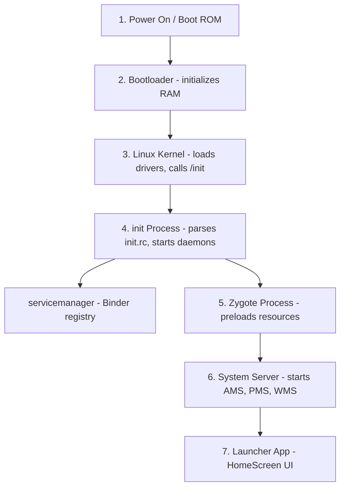
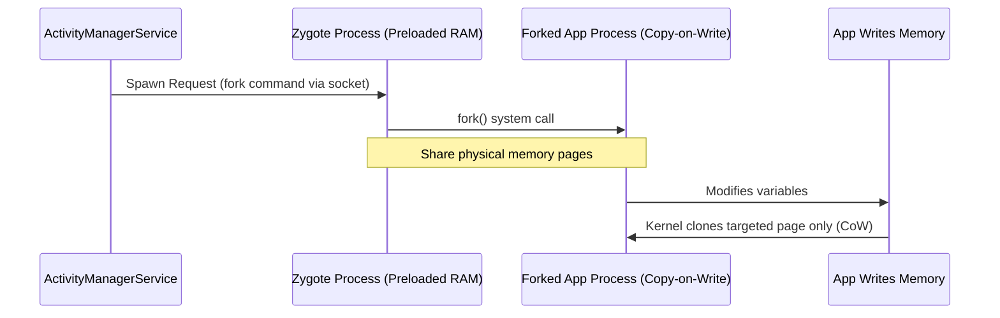
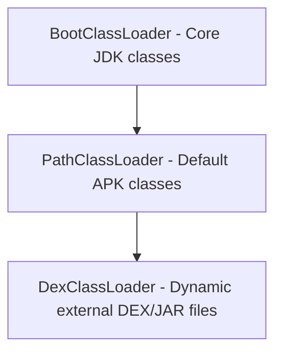
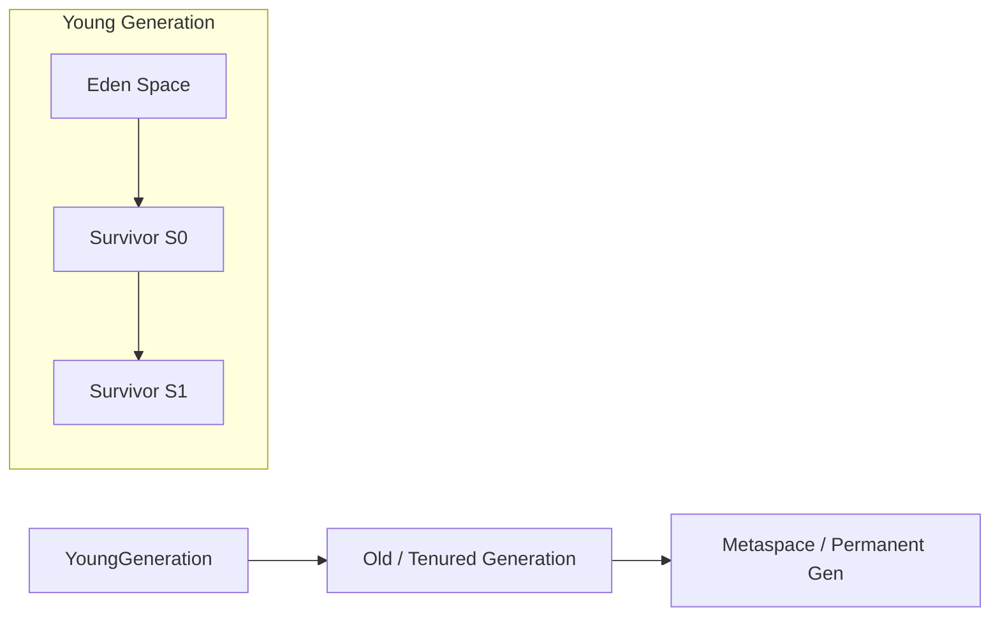
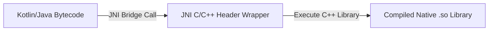
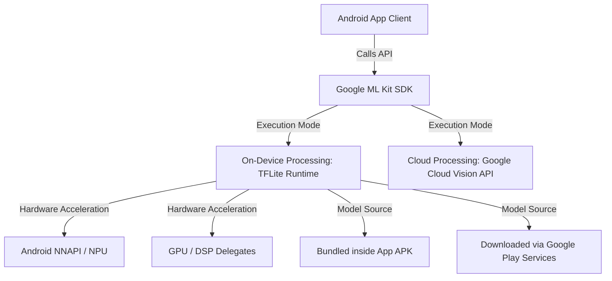
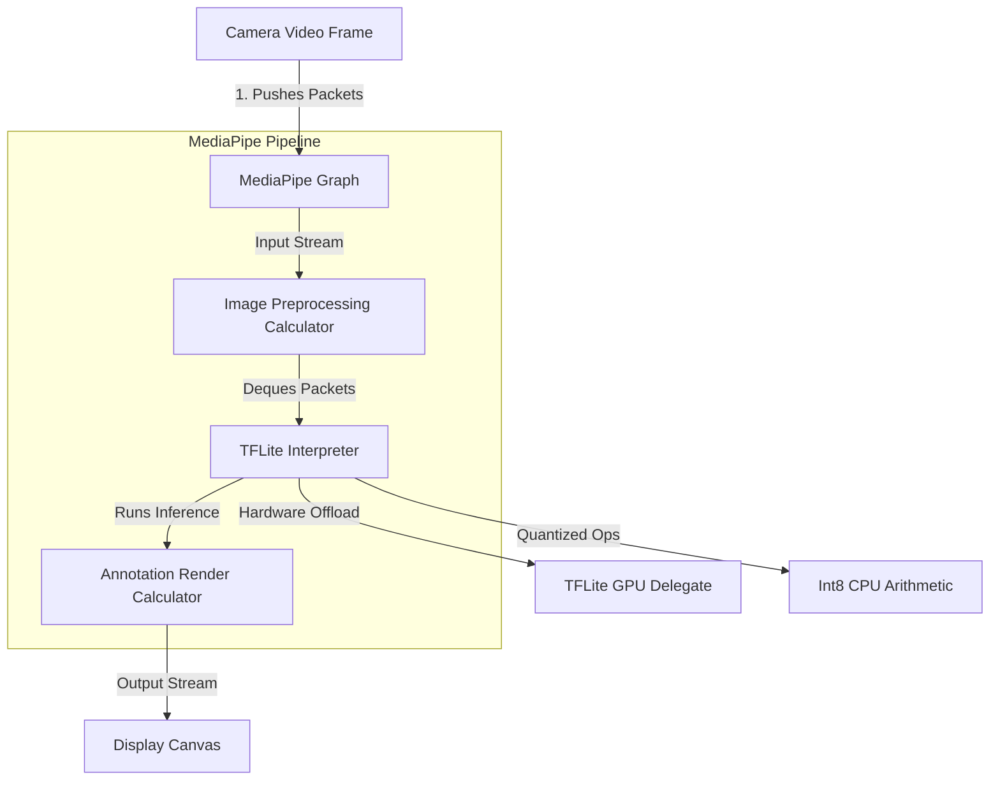
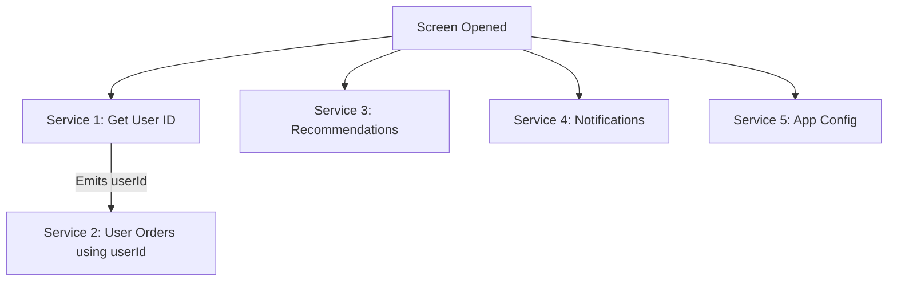

# 🧠 Android Core Knowledge Points — Technical Interview Reference

> **Authoritative Technical Reference**
> The platform internals interviewers use to separate "uses the SDK" from "understands the system".
>
> **68 platform internals & architecture interview questions:** [Section 15 (Internals)](#15-android-system-internals-interview-questions-30-questions) & [Section 16 (Multi-Service Architecture)](#16-dashboard-with-multiple-services--interview-questions--definitions-38-questions)

---

## 📑 Table of Contents

| # | Topic | Key Points |
|---|---|---|
| 1 | [Android Boot Sequence](#1-android-system-boot-sequence) | Bootloader → kernel → init → Zygote → SystemServer |
| 2 | [Zygote & Copy-On-Write](#2-zygote-process--copy-on-write-cow) | Process forking, preloaded classes, shared memory pages |
| 3 | [Class Loaders](#3-class-loaders-in-android) | `PathClassLoader`, `DexClassLoader`, delegation model |
| 4 | [Reference Types & Heap](#4-reference-types--jvmart-heap-structure) | Strong/soft/weak/phantom, generational heap layout |
| 5 | [Serialization](#5-serialization-serializable-vs-parcelable) | `Serializable` vs `Parcelable`, reflection cost |
| 6 | [Intent Flags & Back Stack](#6-intent-flags--back-stack-manipulations) | Task affinity, `CLEAR_TOP`, `NEW_TASK`, `SINGLE_TOP` |
| 7 | [NDK & JNI](#7-android-ndk--jni-boundaries) | JNI boundary cost, when native code pays off |
| 8 | [Open Source Licenses](#8-open-source-software-licenses) | Permissive vs copyleft, obligations for shipped apps |
| 9 | [Google ML Kit](#9-google-ml-kit-architecture--apis) | On-device vs cloud models, delegate acceleration |
| 10 | [MediaPipe & TFLite](#10-mediapipe--tensorflow-lite-tflite-architecture) | Graph runtime, quantization, pruning |
| 11 | [AIDL & IPC](#11-aidl-messenger-and-cross-process-communication) | AIDL vs Messenger, Binder threading, death recipients |
| 12 | [Multi-Process Apps](#12-multi-process-apps-transactiontoolargeexception-and-process-isolation) | `android:process`, per-process state, Binder buffer limits |
| 13 | [APK Anatomy & Signing](#13-apk-anatomy-multidex-and-signing-schemes) | DEX mmap, 64K limit, multidex, v1–v4 signatures |
| 14 | [ANR Traces & Triage](#14-anr-traces-and-crash-triage) | Reading thread dumps, lock contention, common causes |
| 15 | [System Internals Questions (30 Qs)](#15-android-system-internals-interview-questions-30-questions) | 30 Core Android system internals Q&As |
| 16 | [Multi-Service Dashboard Architecture (38 Qs)](#16-dashboard-with-multiple-services--interview-questions--definitions-38-questions) | Concurrency vs parallelism, coroutines, async/await, partial failure, StateFlow, BFF, timeouts, retries, cancellation, caching |

---

# 1. Android System Boot Sequence

The Android startup sequence initializes the hardware, launches the Linux kernel, starts system daemons, and prepares the runtime environment.



### Steps Breakdown
1. **Power On & Boot ROM:** The CPU executes code pre-flashed in the Boot ROM, locating and loading the Bootloader into RAM.
2. **Bootloader:** Initializes hardware registers, checks partitions, and loads the Linux Kernel.
3. **Linux Kernel:** Configures virtual memory, loads device drivers, and mounts root directories, completing setup by launching the first user-space process: `/init`.
4. **`init` Process:** Parses the `init.rc` configuration script, mounting partitions and starting system daemons like `servicemanager` (Binder directory) and `lmkd` (Low Memory Killer).
5. **Zygote Process:** Launched as a Java-based daemon. It pre-loads core libraries, resource drawables, and classes into memory to establish the shared runtime environment.
6. **System Server:** Forked directly by Zygote. It starts critical system managers including the `ActivityManagerService` (AMS), `PackageManagerService` (PMS), and `WindowManagerService` (WMS).
7. **Launcher App:** Once system services are running, the AMS sends an intent to start the Home Launcher screen.

---

# 2. Zygote Process & Copy-On-Write (CoW)

## 2.1 Zygote Process

### Definition
* **Simple:** Zygote is the template process that Android copies to start every application quickly.
* **Advanced:** Zygote is a warm-started Java daemon process initialized by the `app_process` native binary. It pre-loads common system resources, Java runtime classes, and shared libraries into virtual memory, serving as the parent template from which all application processes are forked.



### Why It Is Used
If every Android application had to boot the virtual machine, load core Java libraries, and inflate standard system UI assets from scratch, app cold-start times would be measured in seconds, and device RAM would be exhausted by duplicate resources. Zygote eliminates this latency and memory overhead.

### How it Works (Copy-on-Write)
When a user launches an application, the system calls `fork()` on the Zygote process:
* The OS creates a new process that inherits the exact file descriptors and memory space mappings of the Zygote parent.
* **Copy-on-Write (CoW):** Initially, the parent (Zygote) and child (App) share the same physical memory pages. Physical pages are only duplicated by the kernel if the child process attempts to write/modify a page.
* Read-only system assets (like fonts, layouts, and libraries) remain shared, saving system memory.

---

# 3. Class Loaders in Android

## 3.1 Class Loader Hierarchy

### Definition
* **Simple:** Class loaders are Java components that locate and load compiled `.class` or `.dex` files into memory when the program runs.
* **Advanced:** Class loaders translate compiled bytecode files into JVM/ART runtime `Class` objects using the **Parent-Delegation Model**.



### Android Class Loader Types
1. **`BootClassLoader`:** A singleton instance implemented in Java. It loads core Android framework and JDK runtime classes.
2. **`PathClassLoader`:** The default class loader used by the Android system to load classes from the application's installed APK directory (`/data/app/`). It only supports loading files from local, read-only system paths.
3. **`DexClassLoader`:** A subclass of `BaseDexClassLoader` that can load classes from external, writable directories containing `.dex`, `.jar`, or `.apk` archive files. This is used to implement **Dynamic Feature Loading** and hot-fix plugin architectures.

---

# 4. Reference Types & JVM/ART Heap Structure

## 4.1 Reference Types

### Definition
* **Reachability** — the property that decides an object's fate. An object survives collection while a chain of references leads to it from a **GC root** (a static field, a live thread's stack, a JNI reference).
* **Strong reference** — the ordinary kind. It always prevents collection, and an unwanted one is exactly what a memory leak is.
* **Soft reference** — collected only when the JVM needs memory. Intended for caches, but ART clears them unpredictably, so `LruCache` is the better tool on Android.
* **Weak reference** — does not prevent collection; cleared at the next GC. Used to hold a back-reference (a listener to an Activity) without keeping it alive.
* **Phantom reference** — cleared before collection and used purely to schedule cleanup of a non-heap resource, never to access the object.

Java and Kotlin provide four reference types that dictate how the Garbage Collector (GC) treats objects in heap memory.


1. **Strong Reference:** The default reference type. As long as an object has a path of strong references back to a GC root (e.g. static variable, active thread local), it will never be collected.
2. **Soft Reference:** The GC reclaims soft references only when the system runs low on memory (right before throwing an `OutOfMemoryError`).
3. **Weak Reference:** The GC reclaims weak references immediately during its next collection pass, regardless of memory availability. Essential for resolving memory leaks in listener/callback interfaces.
4. **Phantom Reference:** Cannot be dereferenced directly to access the object. It is queued in a `ReferenceQueue` when the object is finalized, notifying developers that the memory is ready to be reclaimed.

---

## 4.2 JVM/ART Heap Structure

### Definition
* **Heap** — the region where all objects are allocated, and the region the garbage collector manages.
* **Stack vs heap** — each thread has its own stack holding frames, local primitives, and **references**; the objects those references point to live on the shared heap.
* **Generational hypothesis** — the observation that most objects die young. Collectors exploit it by splitting the heap into a **young** generation collected frequently and cheaply, and an **old** generation collected rarely.
* **Promotion** — moving an object that has survived several young collections into the old generation.
* **Compaction** — relocating live objects into a contiguous region so free memory is not fragmented, which is what prevents a large allocation failing while plenty of total memory is free.
* **`OutOfMemoryError`** — thrown when an allocation cannot be satisfied, either because the heap limit is reached or because no contiguous block is large enough.

The application runtime memory (Heap) is structured into distinct generations to optimize GC passes:



* **Young Generation (Eden, S0, S1):** Newly allocated objects are placed in the **Eden** space. During minor GC passes, surviving objects are copied between the **Survivor** spaces (`S0` and `S1`) and their generation counter is incremented.
* **Old Generation (Tenured):** Long-lived objects that survive multiple minor GC passes are promoted (tenured) to the **Old Generation** space.
* **Metaspace (Permanent Generation):** Stores class definitions, method metadata, and string constant pools.

---

# 5. Serialization: Serializable vs. Parcelable

## 5.1 Comparison Table

### Definition
* **Serialization** — converting an object into a byte stream that can be stored or sent between processes, and reconstructed afterwards.
* **`Serializable`** — a Java marker interface. The runtime walks the object's fields by **reflection**, which requires no code from you but is slow and allocates heavily.
* **`Parcelable`** — an Android interface where **you** declare how to write and read each field, so no reflection is involved. It is what the framework uses for IPC.
* **`@Parcelize`** — the Kotlin plugin that generates that boilerplate at compile time, giving `Parcelable` performance with `Serializable` ergonomics.
* **The critical caveat** — `Parcel` is an in-memory IPC format whose layout can change between Android versions, so it must **never** be written to disk or a network.

| Feature | `java.io.Serializable` | `android.os.Parcelable` |
|---|---|---|
| **Underlying Mechanism** | Java Reflection API | Direct byte-buffer writing (manual or codegen) |
| **Performance Speed** | Extremely Slow (high overhead) | Extremely Fast (reflection-free IPC optimization) |
| **Memory Allocations** | High (creates numerous temporary objects) | Low |
| **Implementation Complexity** | Low (marker interface only) | High (requires writing marshalling code / `@Parcelize`) |
| **IPC Suitability** | Poor | Excellent (ideal for Binder transactions) |

---

# 6. Intent Flags & Back Stack Manipulations

Intent flags are used to modify the launch behavior of activities dynamically during runtime.

### Key Intent Flags
1. **`FLAG_ACTIVITY_NEW_TASK`:**
   * Starts the activity in a new task. If a task already exists for the activity, that task is brought to the foreground, resuming its last state.
2. **`FLAG_ACTIVITY_CLEAR_TASK`:**
   * Clears the target task stack completely before launching the activity. Must be used in conjunction with `FLAG_ACTIVITY_NEW_TASK`. Commonly used when logging out users.
3. **`FLAG_ACTIVITY_CLEAR_TOP`:**
   * If the activity exists in the stack, all activities above it are destroyed. Instead of creating a new instance, the system delivers the intent to the existing instance via `onNewIntent()`.
4. **`FLAG_ACTIVITY_SINGLE_TOP`:**
   * Behaves like the `singleTop` launch mode. If the target activity is at the top of the stack, it intercepts the intent in `onNewIntent()` without creating a new instance.

---

# 7. Android NDK & JNI Boundaries

## 7.1 Native Development Kit (NDK) & JNI

### Definition
* **Simple:** NDK is a toolkit that lets you write C/C++ code for Android apps. JNI is the bridge that lets Kotlin/Java and C/C++ code communicate.
* **Advanced:** The **NDK** is a set of compilation tools used to build native C/C++ binaries (`.so` shared libraries) optimized for specific CPU architectures (ABIs). **JNI (Java Native Interface)** is the execution bridge that marshals parameters and execution threads between the ART runtime environment and native machine code compilation layers.



### Why It Is Used
NDK is used to compile high-performance libraries (like physical simulation engines, custom audio processors, image/video renderers, or cryptographic utilities) that require direct execution on CPU registers without virtual machine translation layers.

### JNI Performance Overhead
Calling native methods via JNI involves overhead:
* **Thread Context Switches:** The thread must transition from JVM execution states to Native execution states, modifying garbage collection safety safepoints.
* **Parameter Marshalling:** Primitive values are copied directly, but complex objects (like Strings or custom arrays) must be serialized, converted to pointers, and unmarshaled, which can block threads if done frequently.

---

# 8. Open Source Software Licenses

In software architecture and publishing, choosing the correct open-source license determines how other developers and companies can use, modify, and distribute your codebase.

```mermaid
graph TD
    Lic[Software Licenses] --> Permissive[Permissive Licenses: MIT, Apache 2.0, BSD]
    Lic --> Copyleft[Copyleft Licenses: GPL, LGPL, AGPL]
    Permissive --> MIT[MIT: Use/modify freely, keep copyright notice]
    Permissive --> Apache[Apache 2.0: Adds patent grant, trademark protection]
    Copyleft --> GPL[GPL: Derivative works must be open-sourced (Viral)]
    Copyleft --> LGPL[LGPL: Permits linking without open-sourcing host app]
    Copyleft --> AGPL[AGPL: Requires open-source source code for SaaS/network use]
```

### 8.1 Permissive Licenses
Permissive licenses place minimal restrictions on how the software can be used, modified, and redistributed, allowing commercial, closed-source usage.
1. **MIT License:**
   * **Scope:** Extremely simple. Users can do anything with the code (modify, distribute, sell, sublicense) as long as the original copyright notice and license notice are included in all copies or substantial portions of the software.
2. **Apache License 2.0:**
   * **Scope:** Similar to MIT but includes an explicit **patent grant** from contributors to users (protecting users from patent infringement lawsuits). It also prevents users from using the project's trademarks and requires modified files to carry prominent notices stating they were changed (provenance tracking).
3. **BSD Licenses (2-Clause / 3-Clause):**
   * **Scope:** Permissive. The 3-Clause version adds a specific restriction stating that the names of the project's authors or contributors cannot be used to endorse or promote derived products without prior written consent.

### 8.2 Copyleft (Share-Alike) Licenses
Copyleft licenses require that anyone who redistributes the software (with or without changes) must pass along the freedom to further copy and modify it, meaning any derivative work must also be open-sourced under the same license terms.
1. **GPL (GNU General Public License, e.g., GPLv3):**
   * **Scope:** Strong copyleft (often called "viral"). If your application links to or incorporates any GPL-licensed code, your entire application must be open-sourced under the GPL license when distributed to users.
2. **LGPL (GNU Lesser General Public License):**
   * **Scope:** Weak copyleft. It allows developers to link to the library (often dynamic linking of shared libraries like `.so` or `.dll` files) within a closed-source/commercial application without being forced to open-source the application code. However, any direct modifications to the LGPL library itself must be released under LGPL.
3. **AGPL (GNU Affero General Public License):**
   * **Scope:** Network-triggered copyleft. Created to close the "SaaS loophole" in standard GPL. If an AGPL-licensed module runs on a remote server providing services over a network (e.g. cloud services or web backends), you must make the complete source code of the running service available to the users interacting with it.

---

# 9. Google ML Kit Architecture & APIs

Google ML Kit is a mobile SDK that brings Google's machine learning technologies to Android and iOS applications.



### 9.1 Key Features & Capabilities
ML Kit divides its APIs into vision-based and text-based machine learning domains:
1. **Barcode Scanning:** Identifies and decodes linear and 2D barcodes (QR code, Data Matrix, PDF417).
2. **Text Recognition (OCR):** Recognizes and extracts text from images in real-time. Supports Latin script natively, plus Chinese, Devanagari, Japanese, and Korean.
3. **Face Detection:** Recognizes faces, detects facial landmarks (eyes, ears, nose, mouth), and tracks facial contours for AR filters.
4. **Image Labeling:** Identifies objects, locations, activities, and animal species in images.
5. **Translation & Smart Reply:** Provides offline text translation of 50+ languages using small translation models, and generates context-aware reply suggestions in messaging environments.

### 9.2 Architecture & Model Loading Models
ML Kit offers two implementation modes for loading machine learning models:
* **Bundled Model:** The ML model is compiled and packaged directly inside the application's `.apk` binary.
  * *Pros:* Runs immediately upon app installation without internet connections.
  * *Cons:* Increases app download size significantly (e.g. adding 10-20MB per model).
* **Dynamic Model (via Google Play Services):** The model is omitted from the APK download. When the app initializes the ML API, the SDK downloads the model dynamically from Google Play Services.
  * *Pros:* Minimizes APK size.
  * *Cons:* Requires Google Play Services to be present on the device, and first-time usage requires a network connection to download the model assets.

### 9.3 Hardware Acceleration Internals
Under the hood, ML Kit is built on top of **TensorFlow Lite (TFLite)**. To run neural network inferences with sub-millisecond latency, the runtime:
1. Utilizes the **Android Neural Networks API (NNAPI)** to delegate compute tasks to hardware-specific coprocessors (NPUs - Neural Processing Units).
2. Integrates **GPU Delegates** to offload floating-point matrix multiplications to the device GPU, preventing CPU starvation and saving battery consumption.

---

# 10. MediaPipe & TensorFlow Lite (TFLite) Architecture

Google's on-device AI ecosystem leverages MediaPipe for sensory pipeline stream management and TensorFlow Lite (TFLite) for raw model inference.



### 10.1 MediaPipe Framework Architecture
MediaPipe is a cross-platform framework for building perceptual pipelines that process streaming data (video, audio, sensors).
* **Graph-Based Processing:** MediaPipe models the pipeline as a **Directed Acyclic Graph (DAG)** of nodes called **Calculators** connected by **Data Streams**.
* **Calculators:** Specialized processing nodes (written in C++ or Java/Kotlin). Example: a calculator that crops images, another that runs TFLite inference, and another that draws landmark overlays.
* **Streams & Packets:** Calculators communicate by sending data packets (e.g. image frames, coordinate lists) timestamped to ensure thread-safe, synchronized, parallel execution.
* **Core APIs:** Face Mesh (468 landmarks), Hands (21 landmarks), Pose (33 body landmarks), and Objectron (3D object detection).

### 10.2 TensorFlow Lite (TFLite) Compiler & Runtime
TFLite is a lightweight runtime engine that executes machine learning models directly on Android and iOS devices.
1. **The Converter:** Converts standard TensorFlow models (SavedModel format) into a compact flatbuffer structure (`.tflite` files), reducing model footprint.
2. **The Interpreter:** The core virtual machine execution engine that reads `.tflite` code, manages execution memory buffers, and schedules operator processing.
3. **Hardware Delegates:** Abstracts hardware offloading:
   * **GPU Delegate:** Runs float16 operations on the device GPU via OpenGL ES or Vulkan, avoiding CPU throttling.
   * **NNAPI / NPU Delegate:** Integrates with Android Neural Networks API to process model sub-graphs on dedicated NPUs.

### 10.3 Model Optimization: Quantization & Pruning
To run models on memory-constrained mobile devices, engineers optimize TFLite models using:
* **Quantization:** Replaces 32-bit floating-point parameters (`float32` weights) with 8-bit integers (`int8`). 
  * *Impact:* Reduces model size by **75%** (from 40MB to 10MB) and dramatically increases execution speeds by replacing floating-point arithmetic with faster integer-based matrix operations, with minimal loss in model accuracy.
* **Pruning:** During training, weights with low impact on output results are systematically set to zero. This creates "sparse" model structures that compress highly efficiently.

---

# 11. AIDL, Messenger, and Cross-Process Communication

### Definition
* **AIDL (Android Interface Definition Language):** A language for declaring an interface that two processes agree on. The AIDL compiler generates the `Stub` (server) and `Proxy` (client) classes that marshal calls across Binder.
* **Messenger:** A lightweight IPC wrapper that serializes calls onto a single `Handler`, so requests are processed sequentially rather than concurrently.

### Why It Is Used
Most apps never need AIDL — but IPC is unavoidable when writing a bound service consumed by another app, integrating a system-level SDK, or running your own app across multiple processes to isolate a crash-prone component.

### How It Works Internally

| Mechanism | Concurrency | Complexity | Use When |
|---|---|---|---|
| **`Messenger`** | Serialized on one Handler thread | Low | Simple request/response, ordering matters |
| **AIDL** | Concurrent — multiple Binder threads | High | Multiple simultaneous callers, throughput matters |
| **`ContentProvider`** | Concurrent | Medium | Structured, queryable, permission-controlled data |
| **Broadcast** | Asynchronous, one-way | Low | Fan-out notification, no return value |

**The threading trap.** AIDL methods are invoked on a thread from the Binder thread pool, **not** on the main thread. Touching UI from an AIDL implementation crashes; conversely, blocking in an AIDL method blocks a pool thread, and the pool is finite (16 threads).

### Code Example
```java
// IUserService.aidl — the contract both processes compile against
package com.example.app;

import com.example.app.UserParcel;
import com.example.app.IUserCallback;

interface IUserService {
    UserParcel getUser(long id);
    // oneway makes the call asynchronous: it returns immediately and cannot return a value
    oneway void subscribe(IUserCallback callback);
}
```

```kotlin
// Service implementation. onTransact runs on a Binder POOL thread, not the main thread.
class UserService : Service() {

    private val callbacks = RemoteCallbackList<IUserCallback>()

    private val binder = object : IUserService.Stub() {
        override fun getUser(id: Long): UserParcel {
            // Enforce permission per call: the caller is another process and is untrusted
            enforceCallingPermission("com.example.app.permission.READ_USERS", null)
            return repository.getUserBlocking(id).toParcel()
        }

        override fun subscribe(callback: IUserCallback) {
            // RemoteCallbackList handles death recipients automatically, so a crashed
            // client is removed instead of leaking a dead Binder reference forever.
            callbacks.register(callback)
        }
    }

    override fun onBind(intent: Intent): IBinder = binder

    private fun notifyAll(user: UserParcel) {
        val n = callbacks.beginBroadcast()
        repeat(n) { i ->
            // A remote process can die between the check and the call
            runCatching { callbacks.getBroadcastItem(i).onUserChanged(user) }
        }
        callbacks.finishBroadcast()
    }
}
```

```kotlin
// Client side: bind, then survive the service process dying
class UserServiceClient(private val context: Context) {
    private var service: IUserService? = null

    private val deathRecipient = IBinder.DeathRecipient {
        service = null
        rebindWithBackoff()          // The remote process died; reconnect
    }

    private val connection = object : ServiceConnection {
        override fun onServiceConnected(name: ComponentName, binder: IBinder) {
            service = IUserService.Stub.asInterface(binder)
            binder.linkToDeath(deathRecipient, 0)
        }
        override fun onServiceDisconnected(name: ComponentName) { service = null }
    }

    fun bind() {
        val intent = Intent("com.example.app.USER_SERVICE").apply {
            setPackage("com.example.app")   // MANDATORY: an implicit service intent is illegal
        }
        context.bindService(intent, connection, Context.BIND_AUTO_CREATE)
    }

    // Every remote call can throw when the other process dies mid-call
    fun getUser(id: Long): UserParcel? = try {
        service?.getUser(id)
    } catch (e: DeadObjectException) {
        service = null; null
    } catch (e: RemoteException) {
        null
    }
}
```

### Common Pitfalls
* **Touching UI from an AIDL method.** It runs on a Binder pool thread. Post to the main thread.
* **Not handling `DeadObjectException`.** The other process can be killed at any time by the LMK.
* **Passing large data.** The 1 MB Binder transaction buffer is shared per process; a large `Parcel` throws `TransactionTooLargeException`.
* **An exported service with no permission.** Any app on the device can bind and call it.
* **Blocking inside an AIDL method.** It occupies a finite pool thread; a few slow calls starve every other transaction.

---

# 12. Multi-Process Apps, TransactionTooLargeException, and Process Isolation

### Definition
`android:process` in the manifest runs a component in a separate OS process with its own heap, its own `Application` instance, and its own static state.

### Why It Is Used
Isolation: a native crash in a WebView or a video decoder kills only that process. Memory: a memory-hungry component gets its own heap limit rather than pushing the main process toward OOM.

### How It Works Internally
Each process is forked from Zygote separately, so `Application.onCreate` runs **once per process**. Every singleton, every static field, and every in-memory cache exists independently per process — the source of the most confusing multi-process bugs.

**`TransactionTooLargeException` mechanics.** The Binder transaction buffer is **1 MB per process, shared across all in-flight transactions**. This means the practical limit for any single transaction is well under 1 MB, and it depends on what else is happening concurrently — which is why the bug reproduces only sometimes.

Common triggers:
* A large `Bundle` in `onSaveInstanceState` (bitmaps, big lists).
* A big list passed as an Intent extra.
* A `ContentProvider` query returning too many rows in one `CursorWindow`.
* Many pending `Parcelable`s in a fragment back stack save.

### Code Example
```xml
<!-- The WebView runs in its own process: a renderer crash cannot take down the app -->
<activity
    android:name=".WebContainerActivity"
    android:process=":web" />

<!-- A leading ':' makes it private to this app. A fully-qualified name makes it shareable
     between apps signed with the same key. -->
<service
    android:name=".sync.SyncService"
    android:process=":sync" />
```

```kotlin
// Application.onCreate runs in EVERY process — initialize selectively or waste memory
class App : Application() {
    override fun onCreate() {
        super.onCreate()
        when (currentProcessName()) {
            packageName -> {
                // Main process only: UI-related initialization
                initImageLoader()
                initAnalytics()
            }
            "$packageName:sync" -> initSyncOnly()
            "$packageName:web" -> Unit          // Keep the web process minimal
        }
    }

    private fun currentProcessName(): String =
        if (Build.VERSION.SDK_INT >= Build.VERSION_CODES.P) getProcessName()
        else getSystemService(ActivityManager::class.java)
            .runningAppProcesses
            ?.firstOrNull { it.pid == Process.myPid() }?.processName
            ?: packageName
}
```

```kotlin
// Avoiding TransactionTooLargeException: save identity, not data
class GalleryFragment : Fragment() {

    override fun onSaveInstanceState(outState: Bundle) {
        super.onSaveInstanceState(outState)
        // WRONG: outState.putParcelableArrayList("photos", photos)  // MBs of data
        // RIGHT: save what lets you rebuild the state
        outState.putLong("album_id", albumId)
        outState.putInt("scroll_position", layoutManager.findFirstVisibleItemPosition())
    }
}

// Diagnosing it: log the actual bundle size before it throws
fun Bundle.sizeInBytes(): Int = Parcel.obtain().use { parcel ->
    parcel.writeBundle(this)
    parcel.dataSize()
}
```

```kotlin
// Cross-process state sharing: static fields DO NOT work.
// Use a ContentProvider, a bound service, or a file-backed store.
class SettingsProvider : ContentProvider() {
    // Reads/writes here are visible to every process, unlike a singleton
}
```

### Common Pitfalls
* **Assuming a singleton is shared across processes.** Each process has its own instance, silently.
* **Initializing everything in `Application.onCreate`.** Every process pays the cost and the memory.
* **Room or SQLite accessed from multiple processes** without `enableMultiInstanceInvalidation()`. Change notifications do not cross the process boundary.
* **Debugging only the main process.** Attach the debugger to the specific process, and note that `Log` output interleaves from all of them.

---

# 13. APK Anatomy, Multidex, and Signing Schemes

### Definition
The internal structure of an installable artifact and the mechanisms that make it verifiable and loadable.

### Why It Is Used
Build failures (`Cannot fit requested classes in a single dex file`), install failures (`INSTALL_PARSE_FAILED_NO_CERTIFICATES`), and update failures (signature mismatch) are all explained by these mechanics.

### How It Works Internally

**DEX loading.** `PathClassLoader` memory-maps `classes.dex` from inside the APK — the file is stored uncompressed and page-aligned precisely so it can be `mmap`'d rather than extracted. This is why DEX files are not compressed in a modern APK even though the APK is a ZIP.

**The 64K limit.** The DEX format's `method_id` index is 16-bit, so a single DEX file can reference at most 65,536 methods. Note this counts **referenced** methods, including every framework and library method your code calls — not just methods you wrote.

| minSdk | Multidex Behavior |
|---|---|
| **< 21** | Legacy multidex: secondary DEX files are extracted and dex-opted at first launch, adding seconds to cold start and risking ANR |
| **≥ 21** | Native multidex: ART loads all `classes*.dex` directly, no runtime cost, no configuration |

**Signature scheme summary:**

| Scheme | Since | Protects | Notes |
|---|---|---|---|
| v1 (JAR) | Always | Per-file digests in `META-INF` | Does not protect ZIP metadata; slow to verify |
| v2 | API 24 | The whole APK as bytes | Fast, detects any modification |
| v3 | API 28 | v2 + a key-rotation lineage | Rotate the signing key without losing update rights |
| v4 | API 30 | A Merkle tree in a sidecar file | Enables ADB incremental install |

### Code Example
```bash
# What is actually in the artifact
unzip -l app-release.apk
apkanalyzer apk summary app-release.apk
apkanalyzer dex references app-release.apk        # Total method reference count vs the 64K limit
apkanalyzer dex packages --defined-only app-release.apk | sort -k2 -nr | head -20

# Which signature schemes are present, and with which certificate
apksigner verify --verbose --print-certs app-release.apk

# Why the DEX is not compressed: it is mmap'd directly out of the APK
unzip -v app-release.apk | grep classes.dex        # Method column shows "Stored"
```

```gradle
android {
    defaultConfig {
        // Only needed below API 21; above that, multidex is native and automatic
        multiDexEnabled = true
    }
}

dependencies {
    // Legacy support library, only for minSdk < 21
    implementation("androidx.multidex:multidex:2.0.1")
}
```

```kotlin
// Legacy multidex requires either extending MultiDexApplication or installing manually
class App : Application() {
    override fun attachBaseContext(base: Context) {
        super.attachBaseContext(base)
        MultiDex.install(this)     // Must run before any secondary-DEX class is touched
    }
}
```

### Common Pitfalls
* **Enabling multidex to "fix" the 64K limit** instead of enabling R8. Shrinking usually removes the problem entirely and produces a smaller app.
* **Signature mismatch on update.** A different signing key means the update is rejected with `INSTALL_FAILED_UPDATE_INCOMPATIBLE`; the only remedy without Play App Signing key rotation is a new package name.
* **Disabling v2/v3 signing** to support very old devices, losing fast verification and tamper detection.
* **Counting only your own methods** against the 64K limit. Library method references dominate.

---

# 14. ANR Traces and Crash Triage

### Definition
Reading `/data/anr/traces.txt` (or the Play Console's ANR cluster) to identify why the main thread was blocked.

### Why It Is Used
An ANR report is not a stack trace of a crash — it is a snapshot of every thread at the moment the system gave up. Reading it correctly is a distinguishing skill, because the useful information is usually in a *different* thread from the one that is stuck.

### How It Works Internally
When an ANR is declared, the system dumps the state of every thread in the process (and often in related processes). The main thread's stack shows *where it is blocked*; the cause is whoever holds the resource it is waiting for.

**The three shapes you will actually see:**

| Main-thread state | Meaning | Where the cause is |
|---|---|---|
| `Blocked` on a monitor, with `held by tid=N` | Lock contention | Thread N's stack |
| `Native` in `epoll_wait` / `Runnable` in your own code | Slow main-thread work | The main thread's own stack |
| `Waiting` on a `CountDownLatch` / `Object.wait` | Synchronous wait for background work | The background thread that never signalled |

### Code Example
```
"main" prio=5 tid=1 Blocked
  | group="main" sCount=1 dsCount=0 flags=1 obj=0x72a985d0 self=0xb400007
  | sysTid=8462 nice=-10 cgrp=top-app sched=0/0 handle=0x7b1e4b34f8
  at com.example.app.data.CacheManager.get(CacheManager.kt:42)
  - waiting to lock <0x0a3f1c22> (a java.lang.Object) held by thread 14      <-- the pointer
  at com.example.app.ui.FeedAdapter.onBindViewHolder(FeedAdapter.kt:88)
  ...

"pool-3-thread-2" prio=5 tid=14 Runnable
  at java.io.FileInputStream.read(FileInputStream.java)
  at com.example.app.data.CacheManager.loadFromDisk(CacheManager.kt:97)
  - locked <0x0a3f1c22> (a java.lang.Object)                                <-- the culprit
```
The main thread is blocked on a lock that a background thread holds while doing disk IO. The fix is not on the main thread at all — it is to stop holding the lock across an IO call.

```kotlin
// The bug
class CacheManager {
    private val lock = Any()
    private val cache = mutableMapOf<String, Bitmap>()

    fun get(key: String): Bitmap? = synchronized(lock) {
        cache[key] ?: loadFromDisk(key)?.also { cache[key] = it }   // Disk IO INSIDE the lock
    }
}

// The fix: never hold a lock across IO; and never let the UI thread wait on it at all
class CacheManager(private val scope: CoroutineScope) {
    private val cache = ConcurrentHashMap<String, Deferred<Bitmap?>>()

    // Callers await; the lock is never held across the IO, and duplicate loads are shared
    suspend fun get(key: String): Bitmap? =
        cache.computeIfAbsent(key) {
            scope.async(Dispatchers.IO) { loadFromDisk(key) }
        }.await()
}
```

```bash
# Pull ANR traces from a device
adb shell ls /data/anr/
adb pull /data/anr/anr_2026-09-09-10-42-11-000

# Reproduce main-thread blocking during development instead of finding it in production
# (StrictMode with penaltyLog is the cheapest ANR-prevention tool that exists)
adb shell am broadcast -a com.android.internal.intent.action.ANR   # Some builds only
```

### Common Pitfalls
* **Reading only the main thread's stack.** For lock contention the answer is in the holder's stack; follow `held by thread N`.
* **Blaming the topmost frame.** `Object.wait` is where it stopped, not why.
* **Ignoring "no focused window" ANRs.** These usually mean the Activity never finished starting — look at `Application.onCreate` and startup work.
* **Treating a low ANR rate as fine.** Play Vitals thresholds are per-device-model; a single bad OEM can breach the bad-behavior threshold on its own.
* **No StrictMode in debug.** Main-thread IO is the most common ANR cause and StrictMode catches it in seconds.

---

# 15. Android System Internals Interview Questions (30 Questions)

> Core topics: Boot sequence, Zygote, ART vs Dalvik compilation, class loaders, Binder IPC, DEX limits & multidex, R8 optimization, and APK/AAB anatomy & signature schemes.
> Difficulty: `[Junior]` `[Mid]` `[Senior]`

---

### Q1. Describe the Android boot sequence from power-on to the launcher. `[Mid]`

**Answer**
1. **Boot ROM** loads the bootloader from a fixed address.
2. **Bootloader** initializes memory and loads the Linux kernel.
3. **Kernel** sets up drivers, memory management, and mounts the root filesystem, then starts `init` as PID 1.
4. **`init`** parses `init.rc`, mounts partitions, and starts native daemons (`servicemanager`, `lmkd`, `surfaceflinger`, `vold`).
5. **Zygote** starts, initializes a Dalvik/ART VM, preloads framework classes and resources, then listens on a socket.
6. **SystemServer** is forked from Zygote and starts ~100 system services — `ActivityManagerService`, `PackageManagerService`, `WindowManagerService`.
7. `ActivityManagerService` broadcasts `ACTION_BOOT_COMPLETED` and launches the **Launcher** via a `HOME` intent.

**Follow-up:** *Why is `servicemanager` started before Zygote?*
> Every Binder service registers itself with `servicemanager` and every client looks services up through it. It is the Binder name registry, so it must exist before any process that publishes or consumes a system service.

---

### Q2. What is Zygote and why does it exist? `[Mid]`

**Answer**
Zygote is a process started at boot that initializes a VM and preloads ~2,000 framework classes and shared resources. Every app process is `fork()`ed from it rather than started from scratch.

Two benefits:
* **Startup speed** — the framework is already loaded and, on modern ART, already JIT/AOT-warmed.
* **Memory** — forked processes share the preloaded pages via copy-on-write, so N apps do not each hold their own copy of the framework.

**Follow-up:** *What happens to those shared pages when an app writes to a preloaded object?*
> The kernel traps the write, copies just that 4 KB page into the child's private memory, and redirects the mapping. Only modified pages are duplicated, which is why the framework stays mostly shared across every running app.

---

### Q3. Explain Copy-on-Write and how the ART heap is laid out to maximize sharing. `[Senior]`

**Answer**
`fork()` gives the child an identical virtual address space where all pages are marked read-only and shared. A write triggers a page fault; the kernel copies that single page for the writer.

ART is designed around this: preloaded classes go into a **boot image** (`boot.art`/`boot.oat`) which is memory-mapped read-only and shared across every process on the device. The heap is also arranged so that write-heavy objects are separated from read-mostly ones, keeping more pages shareable.

**Follow-up:** *Why must you never modify a preloaded framework object's static state?*
> It dirties a shared page for that process, costing memory, and on some framework classes the mutation is visible only in your process, producing behavior that differs from every other app.

---

### Q4. Compare Dalvik and ART. `[Junior]`

**Answer**

| | Dalvik | ART |
|---|---|---|
| Compilation | JIT only | Hybrid AOT + JIT, profile-guided |
| Startup | Slower — compiles as it runs | Faster — runs pre-compiled native code |
| Install time | Fast | Slower originally; modern ART compiles during idle instead |
| Storage | Bytecode only | Bytecode + `.oat` native code |
| GC | Stop-the-world | Concurrent copying, mostly pause-free |

**Follow-up:** *ART originally compiled everything at install. Why did Google move away from that?*
> Install times became unacceptable (minutes for large apps), and most compiled code was never executed. Profile-guided compilation compiles only what the user actually runs, during idle-and-charging windows.

---

### Q5. What is a Baseline Profile and how does it improve startup? `[Mid]`

**Answer**
A Baseline Profile is a text file listing the classes and methods on the app's critical path. It ships in the APK/AAB, and at install time ART AOT-compiles exactly those methods. The first run therefore executes native code instead of interpreting and JIT-compiling.

Typical result: **20–40% faster cold start** and noticeably less jank on the first scroll.

```kotlin
@RunWith(AndroidJUnit4::class)
class BaselineProfileGenerator {
    @get:Rule val rule = BaselineProfileRule()

    @Test fun generate() = rule.collect(packageName = "com.example.app") {
        pressHome()
        startActivityAndWait()
        device.findObject(By.res("feed")).fling(Direction.DOWN)  // Cover the first scroll too
    }
}
```

**Follow-up:** *How is a Baseline Profile different from a Cloud Profile?*
> Baseline Profiles ship with the app and apply from the very first launch. Cloud Profiles are aggregated by Play from real users of previous versions and delivered later; they complement, not replace, a Baseline Profile — which is the only one available on day one of a release.

---

### Q6. Explain the class loader hierarchy in Android. `[Mid]`

**Answer**
Android uses the standard parent-delegation model with Android-specific loaders:
* **`BootClassLoader`** — framework classes from the boot image.
* **`PathClassLoader`** — your app's `classes*.dex` from the installed APK. Cannot load DEX from an arbitrary path.
* **`DexClassLoader`** — can load DEX/JAR/APK from any readable path, which is what makes plugin architectures and hot-fix frameworks possible.
* **`InMemoryDexClassLoader`** — loads DEX from a `ByteBuffer` with no file on disk.

Delegation: a loader asks its parent first, and only loads the class itself if the parent cannot.

**Follow-up:** *Why is parent delegation a security property, not just an organizational one?*
> It makes it impossible for app code to substitute its own `java.lang.String` or `android.app.Activity` — the boot loader always wins, so core classes cannot be shadowed by an attacker-supplied DEX.

---

### Q7. What is Binder and why does Android use it instead of standard Linux IPC? `[Senior]`

**Answer**
Binder is a kernel driver (`/dev/binder`) providing object-oriented RPC between processes.

Advantages over pipes/sockets/SysV IPC:
* **One copy instead of two.** Standard IPC copies user→kernel→user. Binder `mmap`s a buffer into the receiver's address space, so the kernel copies once.
* **Identity.** Every transaction carries the caller's verified UID and PID, so a service can authorize the caller (`Binder.getCallingUid()`) without trusting anything the caller claims.
* **Object references.** A Binder handle can be passed between processes and the kernel maintains the mapping, enabling capability-style access control.
* **Death notification.** `linkToDeath` tells a client when the remote process dies.

**Follow-up:** *What is the transaction size limit and why does it produce intermittent failures?*
> The buffer is **1 MB per process, shared across all in-flight transactions**. Whether a given 400 KB payload succeeds depends on what else is transacting at that instant, which is why `TransactionTooLargeException` reproduces inconsistently.

---

### Q8. What does the D8 compiler do, and how does R8 differ? `[Junior]`

**Answer**
**D8** converts Java bytecode (`.class`) into Dalvik bytecode (`.dex`). **R8** does the same job *plus* shrinking, optimization, and obfuscation in a single pass. R8 replaced ProGuard, which ran as a separate step before dexing.

**Follow-up:** *What is R8 "full mode" and what breaks in it?*
> Full mode (default since AGP 8) makes stronger assumptions — notably that classes without keep rules are not reflected on — enabling more aggressive optimization. Libraries relying on reflection without shipping consumer rules can break, showing up as `ClassNotFoundException` or a null field only in release builds.

---

### Q9. Name the four things R8 does and give an example of what each removes. `[Mid]`

**Answer**
1. **Shrinking (tree shaking)** — walks reachability from entry points (manifest components, keep rules) and deletes anything unreachable. Removes 80% of a large utility library you use one function from.
2. **Optimization** — inlines small methods, removes unused parameters, merges class hierarchies, and does dead-code elimination.
3. **Obfuscation** — renames `UserRepository.fetchProfile` to `a.b`, shrinking the string pool and hindering analysis.
4. **Resource shrinking** — removes unreferenced drawables and strings (requires `shrinkResources` alongside `minifyEnabled`).

**Follow-up:** *Which of these can break your app, and how do you find out before users do?*
> All except resource shrinking commonly break reflection-based code. Run the full instrumented test suite against a minified build, and read `build/outputs/mapping/release/usage.txt` to see exactly what was deleted.

---

### Q10. What is inside an APK? `[Junior]`

**Answer**
```
app.apk (a ZIP)
├── AndroidManifest.xml    # Binary XML, parsed by PackageParser
├── classes.dex            # Dalvik bytecode; classes2.dex... when multidexed
├── resources.arsc         # Flat resource table, stored uncompressed so it can be mmap'd
├── res/                   # Compiled layouts and drawables
├── assets/                # Raw files, read via AssetManager
├── lib/<abi>/*.so         # Native libraries per ABI
└── META-INF/              # v1 signature manifests and certificates
```

**Follow-up:** *Why are `classes.dex` and `resources.arsc` stored uncompressed?*
> So the runtime can memory-map them directly out of the APK instead of extracting and decompressing them. That is why they must also be page-aligned (`zipalign`), and why an APK's on-disk size is larger than a fully-compressed ZIP would be.

---

### Q11. APK vs AAB — what changes for the developer and for the user? `[Junior]`

**Answer**
An **APK** is installable. An **AAB** is a publishing format: Play uses it to generate device-specific APKs containing only the ABI, density, and language that device needs.

* **User:** typically 15–35% smaller download.
* **Developer:** Play holds the app signing key (Play App Signing), and you can no longer directly produce the exact artifact a user installs — use `bundletool` to reproduce it locally.

**Follow-up:** *You have a crash reported only on one device model. How do you get the exact APK it received?*
> `bundletool build-apks --bundle=app.aab --output=app.apks --device-spec=device.json`, where `device.json` comes from `bundletool get-device-spec` on that device (or is hand-written from the model's ABI/density/locale).

---

### Q12. Explain the 64K method limit. `[Mid]`

**Answer**
The DEX format addresses methods with a 16-bit `method_id` index, capping a single DEX at 65,536 **referenced** methods — which includes every framework and library method your code calls, not just methods you wrote.

* **minSdk ≥ 21:** ART loads `classes2.dex`, `classes3.dex`… natively with no cost or configuration.
* **minSdk < 21:** legacy multidex extracts and optimizes secondary DEX files at first launch, adding seconds to cold start.

**Follow-up:** *Your build just crossed the limit. What is the first thing you do?*
> Enable R8, not multidex. Shrinking usually drops the count well below the limit and makes the app smaller and faster, whereas multidex just accommodates the bloat.

---

### Q13. Compare the four APK signature schemes. `[Mid]`

**Answer**

| Scheme | Since | Signs | Key property |
|---|---|---|---|
| v1 (JAR) | Always | Individual files via `META-INF` | Slow; ZIP metadata unprotected |
| v2 | API 24 | The whole APK byte-for-byte | Fast; detects any modification |
| v3 | API 28 | v2 + key-rotation lineage | Rotate the signing key without losing update rights |
| v4 | API 30 | Merkle tree in a sidecar `.idsig` | Enables ADB incremental install |

**Follow-up:** *You lost your app signing key and are not on Play App Signing. What are your options?*
> None that preserve the app. Android refuses an update signed by a different key. You must publish under a new package name and migrate users manually — which is exactly the failure mode Play App Signing exists to prevent.

---

### Q14. What is `oom_score_adj` and how does the Low Memory Killer use it? `[Senior]`

**Answer**
Every process has an `oom_score_adj` from −1000 (never kill) to 1000 (kill first). `lmkd` (the userspace low-memory-killer daemon) watches memory pressure via PSI and kills the highest-scoring processes first.

| Process state | Approx. score | Killed |
|---|---|---|
| Foreground (visible Activity) | 0 | Last |
| Visible (behind a dialog) | 100–200 | Rarely |
| Service (running background service) | 500 | Under pressure |
| Cached / empty | 900–1000 | First |

**Follow-up:** *Your app is killed within seconds of backgrounding on a low-end device. What can you actually do?*
> Nothing to change the score directly — you make the app cheap to kill and cheap to restore: shrink the retained heap, persist state via `SavedStateHandle` and a database, and test with `adb shell am kill` so restoration is correct rather than fighting the kill.

---

### Q15. Explain ART's Concurrent Copying garbage collector. `[Senior]`

**Answer**
CC GC relocates live objects into a fresh region while the app keeps running:
* **Read barriers** — every object-reference read goes through a barrier that redirects to the new location if the object has been moved. This is what removes the stop-the-world pause.
* **Generational** — new allocations go into a young region collected frequently and cheaply; survivors are promoted.
* **Compaction** — moving objects into contiguous regions eliminates fragmentation, so a large allocation is less likely to fail even when total free memory is sufficient.

**Follow-up:** *If GC is concurrent, why do allocations still cause jank?*
> The barriers have a small per-read cost, allocation itself can trigger a blocking allocation-failure GC when the heap is exhausted, and high allocation rates force more frequent collections. Allocating in `onDraw` or `onBindViewHolder` still costs frames.

---

### Q16. Strong, soft, weak, and phantom references — when do you use each? `[Mid]`

**Answer**

| Type | Collected when | Android use |
|---|---|---|
| **Strong** | Never while reachable | Normal references |
| **Soft** | Only under memory pressure | Memory caches (but prefer `LruCache`) |
| **Weak** | At the next GC | Breaking a leak: a listener or a `Handler` holding an Activity |
| **Phantom** | After finalization, for cleanup notification | Native resource cleanup; rarely used in apps |

```kotlin
// A static Handler leaks the Activity through its implicit outer reference.
// A WeakReference breaks the chain.
class SafeHandler(activity: MainActivity) : Handler(Looper.getMainLooper()) {
    private val ref = WeakReference(activity)
    override fun handleMessage(msg: Message) {
        ref.get()?.updateUi(msg)      // Null if the Activity was collected
    }
}
```

**Follow-up:** *Why is `SoftReference` discouraged for caching on Android?*
> ART's collector treats soft references aggressively and unpredictably, so the cache can be cleared long before memory is actually tight. `LruCache` with an explicit size budget is predictable and is what the framework recommends.

---

### Q17. `Serializable` vs `Parcelable` — and does the answer change with `@Parcelize`? `[Mid]`

**Answer**
`Serializable` is a JVM marker interface; the runtime uses **reflection** to walk fields, which is slow and allocates heavily. `Parcelable` requires you to write explicit marshalling, which is roughly an order of magnitude faster and is what the framework uses for IPC.

`@Parcelize` (kotlin-parcelize) generates the `writeToParcel`/`CREATOR` boilerplate at compile time, so you get `Parcelable` performance with `Serializable`-level ergonomics. There is no longer a good reason to choose `Serializable` for Android IPC.

```kotlin
@Parcelize
data class User(val id: Long, val name: String, val tags: List<String>) : Parcelable
```

**Follow-up:** *Is a `Parcel` a valid format for persisting data to disk?*
> No. `Parcel` is explicitly not a stable serialization format — its layout can change between Android versions, so data written by one release may be unreadable by the next. Use JSON, Proto, or a database.

---

### Q18. What is JNI and what does it cost? `[Mid]`

**Answer**
JNI is the bridge between managed (Kotlin/Java) and native (C/C++) code. Costs:
* **Transition overhead** — each call crosses a managed/native boundary; a call in a tight loop is dominated by that cost.
* **Manual reference management** — local references must be freed or the local reference table overflows; global references leak if not deleted.
* **No GC visibility** — native memory is invisible to ART, so heap profiling misses it entirely.
* **Crash severity** — a native crash is a SIGSEGV that kills the process with no catchable exception.

**Follow-up:** *When is the NDK actually worth it?*
> Compute-heavy work where the boundary is crossed rarely and a lot happens inside: image and video processing, audio DSP, cryptography, physics, ML inference, and reusing an existing large C/C++ library. Not for business logic.

---

### Q19. Explain the Handler / Looper / MessageQueue mechanism. `[Mid]`

**Answer**
* **`Looper`** — an infinite loop bound to a thread via `ThreadLocal`, pulling messages off a queue. The main thread's is created by `ActivityThread`.
* **`MessageQueue`** — a time-ordered linked list of `Message`s. When empty it blocks on `epoll_wait` on a pipe FD, so an idle thread uses zero CPU.
* **`Handler`** — posts into a queue and processes the messages it posted.

```kotlin
val mainHandler = Handler(Looper.getMainLooper())
mainHandler.post { textView.text = "done" }
```

**Follow-up:** *What is a synchronization barrier?*
> A message with a `null` target inserted into the queue. While it is present, synchronous messages are blocked but **asynchronous** ones still run. `Choreographer` uses this so that measure/layout/draw traversals jump ahead of queued background work, protecting frame timing.

---

### Q20. Why is `Looper.loop()` an infinite loop that does not ANR? `[Senior]`

**Answer**
An ANR is triggered by an input event or a broadcast not being *processed* within a timeout — not by the main thread being busy in general. `Looper.loop()` spends its idle time blocked in `epoll_wait`, which is a sleeping state consuming no CPU; the kernel wakes it when a message arrives. The loop is therefore always available to process the next message immediately.

The ANR happens when a *single* message handler takes too long, blocking the loop from reaching the next message.

**Follow-up:** *So what exactly does the 5-second input-dispatch ANR measure?*
> The time from an input event being delivered to the app's window until the app finishes processing it. If the main thread is stuck inside a previous message's handler, the input event sits unprocessed and the timer expires.

---

### Q21. What are the ANR thresholds and how do you diagnose one from a trace? `[Mid]`

**Answer**
* Input dispatch: **5 s**
* Broadcast receiver: **10 s** (foreground), 60 s (background)
* Service start: **20 s** (foreground), 200 s (background)
* `ContentProvider`: **10 s**

Diagnosis: the main thread's state names the shape of the problem.
* `Blocked` with `held by thread N` → lock contention; read **thread N's** stack.
* `Runnable` in your own code → slow main-thread work; the stack is the answer.
* `Waiting` on a latch → a background thread never signalled.

**Follow-up:** *The main thread shows `Blocked` waiting on a lock held by a thread doing disk IO. What is the fix?*
> Stop holding the lock across the IO. Compute or load outside the critical section and only take the lock to publish the result — or restructure so the main thread never waits on that lock at all.

---

### Q22. Explain `TransactionTooLargeException` and how to prevent it. `[Mid]`

**Answer**
It is thrown when a Binder transaction exceeds the available portion of the 1 MB per-process buffer. Common causes: a big `Bundle` in `onSaveInstanceState`, a large list in an Intent extra, or a `ContentProvider` returning too many rows.

Prevention: save **identity**, not data.
```kotlin
override fun onSaveInstanceState(outState: Bundle) {
    super.onSaveInstanceState(outState)
    // outState.putParcelableArrayList("photos", photos)   // Megabytes: throws
    outState.putLong("album_id", albumId)                  // Rebuild from the DB instead
    outState.putInt("scroll", layoutManager.findFirstVisibleItemPosition())
}
```

**Follow-up:** *Why does it only crash sometimes?*
> The 1 MB buffer is shared across all concurrent transactions in the process. Whether a given payload fits depends on what else is in flight at that moment, which makes it look non-deterministic.

---

### Q23. `PathClassLoader` vs `DexClassLoader` — and what is each used for? `[Senior]`

**Answer**
`PathClassLoader` loads DEX only from the installed APK path; it is what the framework creates for your app. `DexClassLoader` accepts an arbitrary readable path, which allows loading code that was not part of the installed package.

`DexClassLoader` powers plugin frameworks, hot-fix systems, and dynamic feature loading — and is also the mechanism malware uses to fetch a payload after passing store review.

**Follow-up:** *What is the security concern with `DexClassLoader`?*
> If the DEX comes from a writable location or an unauthenticated network source, an attacker who can write there achieves arbitrary code execution inside your app's UID. Any dynamically loaded code must be signature-verified and read from app-private storage.

---

### Q24. What is AIDL and on which thread do AIDL methods execute? `[Senior]`

**Answer**
AIDL declares a cross-process interface; the compiler generates a client `Proxy` (marshals into a `Parcel`, calls `transact`) and a server `Stub` (`onTransact`, unmarshals, dispatches).

AIDL methods execute on a thread from the **Binder thread pool** — never the main thread. Touching UI from one crashes; blocking in one occupies a finite pool thread (16 by default).

**Follow-up:** *When would you use `Messenger` instead?*
> When you want requests serialized. `Messenger` funnels every call onto a single `Handler`, so you get ordering and implicit mutual exclusion with no locks — at the cost of throughput. AIDL is for concurrent callers.

---

### Q25. What happens when you run an app in a separate process with `android:process`? `[Senior]`

**Answer**
It becomes a distinct OS process, forked separately from Zygote. Consequences:
* `Application.onCreate` runs **once per process**.
* Every singleton, static field, and in-memory cache exists **independently** per process.
* Crashes are isolated — a native crash in `:web` does not kill the main process.
* Communication requires IPC; static fields do not cross the boundary.

```kotlin
override fun onCreate() {
    super.onCreate()
    when (getProcessName()) {
        packageName -> initUiStack()        // Main process only
        "$packageName:web" -> Unit          // Keep it minimal
    }
}
```

**Follow-up:** *You use Room from two processes and updates in one are invisible to the other. Why?*
> Room's invalidation tracker uses in-process observers. Enable `enableMultiInstanceInvalidation()` on the builder, which uses a `ContentProvider`-based mechanism to propagate invalidation across processes.

---

### Q26. What is the Android security sandbox? `[Junior]`

**Answer**
Each app is assigned a unique Linux **UID** at install. Its files are owned by that UID with no world access, and its process runs as that UID. Standard Linux DAC therefore prevents one app from reading another's data or memory. SELinux (enforcing since Android 5) adds mandatory access control on top, restricting even root-owned processes to their declared domain.

**Follow-up:** *How can two apps share a UID, and why is it discouraged now?*
> `android:sharedUserId` with identical signing keys. It is deprecated because it is irreversible — you cannot later split apps that share a UID without data loss — and it collapses the security boundary between them.

---

### Q27. How does `PackageManagerService` resolve an implicit intent? `[Mid]`

**Answer**
It matches the intent against every registered `<intent-filter>`. A filter matches only if **all three** hold:
1. The **action** matches one listed in the filter.
2. **Every** category in the intent is present in the filter (`DEFAULT` is added automatically for `startActivity`).
3. The **data** matches: scheme, host, port, path, and MIME type as declared.

One match launches directly; several show the chooser; zero throws `ActivityNotFoundException`.

**Follow-up:** *Why does Android 14 block some implicit intents that previously worked?*
> Targeting API 34, an implicit intent can no longer be delivered to a **non-exported** component of your own app. Internal navigation that relied on implicit resolution must be made explicit.

---

### Q28. What is a `WindowToken` and why does `Application` context fail to show a dialog? `[Mid]`

**Answer**
A `WindowToken` is a Binder token issued by `WindowManagerService` authorizing a client to add a window layer at a given position in the z-order. An `Activity` has one; an `Application` does not, because it corresponds to no on-screen window.

Showing a dialog with the application context therefore throws `WindowManager$BadTokenException: Unable to add window — token null is not valid`.

**Follow-up:** *What legitimately uses the application context then?*
> Anything that must outlive an Activity: singletons, WorkManager, Room, DI-provided clients, and `registerReceiver` for process-lifetime listeners. The rule of thumb is that anything drawing UI needs the Activity context; anything else should take the application context to avoid leaks.

---

### Q29. Walk through what happens between `startActivity()` and `onCreate()`. `[Senior]`

**Answer**
1. `Activity.startActivity` → `Instrumentation.execStartActivity` → Binder call to **`ActivityTaskManagerService`** in `system_server`.
2. ATMS resolves the intent via `PackageManagerService`, checks permissions, and determines the target task and launch mode.
3. If the target process does not exist, ATMS asks Zygote to fork it; the new process's `ActivityThread.main()` runs and attaches back to ATMS.
4. ATMS sends a launch transaction back over Binder to the app's `ApplicationThread`.
5. `ActivityThread` posts it to the main `Handler`; `performLaunchActivity` instantiates the Activity, attaches the `ContextImpl`, and calls `onCreate`.
6. `onStart`, `onResume`, then `WindowManager.addView` makes the window visible.

**Follow-up:** *Where in that sequence does the "cold start" cost actually go?*
> Step 3 dominates: process fork plus `Application.onCreate` plus every auto-initializing `ContentProvider` runs before your first Activity line executes. That is why moving work out of `Application.onCreate` is the highest-leverage startup fix.

---

### Q30. What is `mmap` and where does Android rely on it? `[Senior]`

**Answer**
`mmap` maps a file (or anonymous memory) into a process's virtual address space, so the file is accessed as memory with the kernel paging it in on demand, avoiding an explicit read-into-buffer copy.

Android uses it for:
* **DEX and `.oat` loading** — pages are shared across processes and loaded lazily, which is why DEX is stored uncompressed.
* **`resources.arsc`** — mapped directly rather than parsed into the heap.
* **Binder** — the receiver's buffer is mapped into the kernel, enabling the single-copy transfer.
* **The ART boot image** — one physical copy shared by every app on the device.

**Follow-up:** *Why does an mmap'd file not count toward your app's Java heap limit?*
> It is not on the managed heap at all; it lives in the process's virtual address space and is backed by the page cache. This is why `Runtime.maxMemory()` can look healthy while the process is still killed for exceeding its total memory footprint (PSS).

---

# 16. Dashboard with Multiple Services — Interview Questions & Definitions (38 Questions)

> **Architectural & Concurrency Deep Dive**  
> Interviewers frequently use the *"display data from 5 independent services on one screen"* prompt to test senior engineering capabilities across **concurrency, coroutines, error isolation, partial rendering, state modeling, networking, resilience, and system design**.

---

### Q1. How would you display data from 5 different services on one dashboard? `[Mid]`

**Definition:**  
When a dashboard depends on multiple independent services, the application must **coordinate multiple data sources, fetch their data concurrently and efficiently, isolate failures independently, and expose a unified, reactive UI state to the UI layer**.

**Architectural Approach:**

```text
Dashboard UI (Activity / Compose Screen)
     ↓ (observes StateFlow<DashboardUiState>)
ViewModel (State Hoisting & Screen Lifecycle)
     ↓ (executes)
GetDashboardUseCase (Business Orchestration)
     ↓
 ┌───┼────┬────┬────┐
 ↓   ↓    ↓    ↓    ↓
S1  S2   S3   S4   S5 (Repositories / Data Sources)
```

For independent services, execute requests **concurrently** rather than sequentially to optimize time-to-first-content.

---

### Q2. Why should we call the 5 services concurrently? `[Junior]`

**Definition:**  
**Concurrent execution** allows multiple independent operations to make progress during overlapping periods instead of waiting for each operation to complete before initiating the next.

#### Sequential Execution:
```text
S1 ───> S2 ───> S3 ───> S4 ───> S5
```
$$\text{Total Duration} \approx T_1 + T_2 + T_3 + T_4 + T_5$$

#### Concurrent Execution:
```text
S1 ───────>
S2 ────>
S3 ──────────>
S4 ─────>
S5 ───────>
```
$$\text{Total Duration} \approx \max(T_1, T_2, T_3, T_4, T_5)$$

Concurrent execution dramatically slashes perceived latency and dashboard load times when network calls are independent.

---

### Q3. What is concurrency? `[Mid]`

**Definition:**  
**Concurrency** is the composition and management of multiple independent tasks executing during overlapping time windows. It is about **structure**, not necessarily simultaneous hardware execution.

In Android, Kotlin coroutines achieve concurrency via cooperative multitasking and non-blocking suspension:
```kotlin
val service1Deferred = async { repository1.getData() }
val service2Deferred = async { repository2.getData() }
```
Both operations make progress concurrently on the same or pooled threads without blocking the underlying OS thread.

---

### Q4. What is parallelism? `[Mid]`

**Definition:**  
**Parallelism** is the physical execution of multiple computations at the exact same instant, requiring multiple hardware execution units (CPU cores, GPUs).

| Dimension | Concurrency | Parallelism |
|---|---|---|
| **Core Concept** | Managing multiple tasks at once | Executing multiple tasks simultaneously |
| **Hardware Requirement** | Operates on a single CPU core via interleaving/suspension | Strictly requires multiple CPU cores |
| **Focus** | System structure and responsiveness | Raw execution throughput |
| **Android Context** | Kotlin Coroutines suspending on I/O | Multi-threaded computations on `Dispatchers.Default` |

> [!NOTE]  
> For network requests, the bottleneck is **I/O wait time**, not CPU computation. Concurrency (handling multiple in-flight sockets) is what matters.

---

### Q5. How would you implement this using Kotlin Coroutines? `[Mid]`

Use `coroutineScope` and `async`/`await`:

```kotlin
suspend fun loadDashboard(): DashboardData = coroutineScope {
    val service1 = async { repository1.getData() }
    val service2 = async { repository2.getData() }
    val service3 = async { repository3.getData() }
    val service4 = async { repository4.getData() }
    val service5 = async { repository5.getData() }

    DashboardData(
        s1 = service1.await(),
        s2 = service2.await(),
        s3 = service3.await(),
        s4 = service4.await(),
        s5 = service5.await()
    )
}
```

*Mechanism:* `async` launches a coroutine returning a `Deferred<T>`. Calling `await()` suspends until the deferred value is computed. Starting all 5 `async` jobs before awaiting guarantees concurrent socket dispatch.

---

### Q6. What is `async/await`? `[Junior]`

**Definition:**  
* `async`: A coroutine builder that initiates an asynchronous task producing a future result, returning a `Deferred<T>` handle.
* `await()`: A suspending function on `Deferred<T>` that non-blockingly waits for the deferred value to be computed and returns it (or rethrows any encountered exception).

```kotlin
val userDeferred = async { getUser() }
val ordersDeferred = async { getOrders() }

// Both network calls are already flying in parallel across the wire
val user = userDeferred.await()
val orders = ordersDeferred.await()
```

---

### Q7. What happens if one service fails? `[Senior]`

This is the primary differentiator between mid and senior answers:
* **The Naive Failure:** If service 3 throws an HTTP 500 inside a standard `coroutineScope`, an unhandled exception cancels the parent scope, cancelling services 1, 2, 4, and 5 and displaying an empty screen or global crash.
* **The Senior Approach:** Isolate failure domains. Failure of non-critical sections (e.g., *Recommendations*) must never abort critical sections (e.g., *Account Balance*).

```text
Service 1 (User Profile)   ──> Success(profile)
Service 2 (Account Balance)──> Success(balance)
Service 3 (Recommendations)──> Error(HTTP 500 - isolated fallback)
Service 4 (Recent Orders)  ──> Success(orders)
Service 5 (Notifications)  ──> Success(alerts)
```

---

### Q8. What is partial failure? `[Senior]`

**Definition:**  
**Partial failure** is a fundamental characteristic of distributed systems where one or more sub-components fail while the rest of the system continues to operate correctly.

In mobile dashboards:
* Critical components (e.g., User Authentication, Wallet Balance) require strict validation.
* Secondary components (e.g., Promo Banners, Dynamic Suggestions) should fail gracefully into empty states or retry buttons without impairing the core screen usability.

---

### Q9. How would you represent this in Android UI state? `[Senior]`

Model each section with independent state wrappers:

```kotlin
sealed interface SectionUiState<out T> {
    data object Loading : SectionUiState<Nothing>
    data class Success<T>(val data: T) : SectionUiState<T>
    data class Error(val message: String, val canRetry: Boolean) : SectionUiState<Nothing>
}

data class DashboardUiState(
    val profile: SectionUiState<UserProfile> = SectionUiState.Loading,
    val balance: SectionUiState<AccountBalance> = SectionUiState.Loading,
    val recommendations: SectionUiState<List<Item>> = SectionUiState.Loading,
    val recentOrders: SectionUiState<List<Order>> = SectionUiState.Loading,
    val notifications: SectionUiState<List<Alert>> = SectionUiState.Loading
)
```

This structure enables the UI to render a shimmer placeholder for Service 2, an error retry button for Service 3, and rich content for Services 1, 4, and 5 simultaneously.

---

### Q10. Why would you use `StateFlow`? `[Mid]`

**Definition:**  
`StateFlow` is a lifecycle-aware, hot, state-holding observable Flow that preserves the **current state value** and conflates repeated identical emissions.

```kotlin
class DashboardViewModel(
    private val getDashboardUseCase: GetDashboardUseCase
) : ViewModel() {

    private val _uiState = MutableStateFlow(DashboardUiState())
    val uiState: StateFlow<DashboardUiState> = _uiState.asStateFlow()

    init {
        loadDashboard()
    }
}
```

*Key Benefits:*
1. **Always Holds Value:** View layers immediately receive the latest state upon subscription.
2. **Replay & Conflation:** Multiple rapid updates conflate so the UI only renders the latest valid snapshot.
3. **Configuration Survivals:** Works seamlessly with `SharingStarted.WhileSubscribed(5000)` to survive screen rotation without restarting API calls.

---

### Q11. Why shouldn't the UI directly call all 5 APIs? `[Junior]`

**Definition:**  
Violates the **Single Responsibility Principle (SRP)** and creates tight coupling.

* **Consequences of UI-Direct Calls:**
  * Activity/Composable becomes bloated with networking, serialization, error mapping, and threading logic.
  * Screen rotation or configuration changes cancel or re-trigger 5 duplicate network calls.
  * Unit testing UI rendering in isolation becomes impossible without mocking network sockets.
* **Separation of Concerns:**
  $$\text{UI Layer (Rendering)} \to \text{ViewModel (State)} \to \text{Use Case (Coordination)} \to \text{Repository (Data)}$$

---

### Q12. Why do we need a Use Case here? `[Mid]`

**Definition:**  
A **Use Case** (or Interactor) encapsulates a single, reusable unit of business logic.

```kotlin
class GetDashboardUseCase @Inject constructor(
    private val profileRepo: ProfileRepository,
    private val balanceRepo: BalanceRepository,
    private val recommendationRepo: RecommendationRepository,
    private val orderRepo: OrderRepository,
    private val notificationRepo: NotificationRepository
) {
    operator fun invoke(): Flow<DashboardUiState> = channelFlow {
        // Concurrently orchestrate all 5 repositories and emit incremental state updates
    }
}
```

*Advantage:* Keeps the ViewModel lightweight and focused purely on UI state hoisting, while business rules for combining and prioritizing services live in pure Kotlin code testable without Android framework dependencies.

---

### Q13. Why do we need separate repositories? `[Mid]`

**Definition:**  
A **Repository** mediates between domain use cases and concrete data sources (REST API, Room database, DataStore, In-memory cache).

Separate repositories (`ProfileRepository`, `OrdersRepository`):
* Enforce domain boundary isolation (Orders logic does not pollute Profile logic).
* Allow independent caching strategies (e.g. Profile cached for 24 hours in Room; Notifications fetched fresh from network every time).
* Enable independent unit testing and mocking.

---

### Q14. What if all 5 services are owned by our backend? `[Senior]`

When all 5 services belong to the internal engineering infrastructure, moving the aggregation burden from mobile clients to the backend becomes the premier architectural option:

```text
Mobile Client (Android / iOS)
       ↓ (Single HTTPS Request)
Dashboard BFF / Aggregation API
 ┌─────┼─────┬─────┬─────┐
 ↓     ↓     ↓     ↓     ↓
S1    S2    S3    S4    S5 (Internal High-Speed Microservices Network)
```

The backend aggregates all 5 calls over high-speed datacenter backbones ($<2\text{ms}$ inter-service latency) and emits a single, optimized JSON payload to the device.

---

### Q15. What is a BFF (Backend For Frontend)? `[Senior]`

**Definition:**  
A **Backend For Frontend (BFF)** is an architectural pattern where a dedicated server-side layer is built specifically to satisfy the user-experience requirements of a specific client platform (Android, iOS, or Web).

```text
                    ┌──> Android BFF ──> Android App
Internal Services ──┼──> iOS BFF     ──> iOS App
                    └──> Web BFF     ──> Web App
```

Instead of a generic one-size-fits-all API, the Android BFF crafts responses formatted precisely for mobile screen constraints.

---

### Q16. What are the advantages of a BFF for this dashboard? `[Senior]`

| Advantage | Mobile-Side Impact |
|---|---|
| **Reduced Radio Up-Time** | 1 HTTP request replaces 5 independent socket connections, conserving battery. |
| **Bandwidth Reduction** | Strips out unused fields before sending data over cellular networks. |
| **Datacenter Concurrency** | Microservices communicate over 10 Gbps low-latency optical links instead of 4G/5G mobile links. |
| **Centralized Resilience** | Server-side circuit breakers, fallback caches, and timeouts shield the mobile client from upstream service churn. |
| **Decoupled Evolution** | Backend teams can alter internal microservices without requiring Play Store client updates. |

---

### Q17. What if one service is slow? `[Senior]`

Suppose $S_1 = 100\text{ms}$, $S_2 = 120\text{ms}$, $S_3 = 90\text{ms}$, $S_4 = 4800\text{ms}$, $S_5 = 150\text{ms}$.  
Waiting for all 5 before displaying content freezes the dashboard for nearly 5 seconds.

**Solutions:**
1. **Incremental Stream Rendering:** Emit fast services immediately via Kotlin `Flow` / `channelFlow`; emit slow services when they resolve.
2. **Aggressive Timeouts:** Bound slow secondary calls (e.g., timeout $S_4$ after $1500\text{ms}$ and fall back to local disk cache).
3. **Lazy / On-Demand Loading:** Load $S_1–S_3$ above the fold; trigger $S_4$ only when the user scrolls it into viewport.

---

### Q18. What is a timeout? `[Junior]`

**Definition:**  
A **timeout** establishes the maximum permissible elapsed duration a client waits for a socket connection, TLS handshake, or HTTP response before aborting the request.

```kotlin
// In OkHttpClient setup
val okHttpClient = OkHttpClient.Builder()
    .connectTimeout(5, TimeUnit.SECONDS)
    .readTimeout(5, TimeUnit.SECONDS)
    .writeTimeout(5, TimeUnit.SECONDS)
    .build()

// In Coroutines
withTimeout(3000L) {
    repository.fetchSlowRecommendations()
}
```

Without timeouts, dead connections hang thread resources indefinitely on mobile networks.

---

### Q19. What is a retry? `[Junior]`

**Definition:**  
A **retry** is the automatic re-execution of an operation following an initial failure, designed to recover from transient faults (packet drops, temporary DNS blips, short server load spikes).

Key components of a robust retry strategy:
* **Max Attempts:** Capped at 2 or 3 attempts to prevent battery drain.
* **Backoff Policy:** Exponential delays between attempts.
* **Error Classification:** Only retry idempotent HTTP codes (502, 503, 504) and network timeouts; never client errors (400, 401, 403, 404).

---

### Q20. What is exponential backoff? `[Mid]`

**Definition:**  
**Exponential backoff** progressively doubles the delay interval between successive retry attempts:
$$\text{Delay} = \text{Base Delay} \times 2^{\text{attempt}} + \text{Jitter}$$

```text
Attempt 1 ──> Immediate execution (Failure)
Attempt 2 ──> Wait 1000ms + Jitter
Attempt 3 ──> Wait 2000ms + Jitter
Attempt 4 ──> Wait 4000ms + Jitter ──> Max attempts reached (Abort)
```

*Purpose of Jitter:* Adding random variance prevents thousands of mobile clients from retrying at the exact same millisecond (**Thundering Herd Problem**).

---

### Q21. Should we retry every API failure? `[Senior]`

**Strictly NO.**

```text
API Error Received
       │
   Is it Transient?
   ├── YES (500, 502, 503, 504, SocketTimeoutException) ──> Safe to Retry with Backoff
   │
   └── NO (Client Error / Permanent)
       ├── 401 Unauthorized ──> Trigger Token Refresh; replay once with fresh JWT
       ├── 400 Bad Request   ──> Fatal Client Bug; abort immediately
       ├── 403 Forbidden     ──> Missing Permission; display security alert
       └── 404 Not Found     ──> Resource does not exist; display empty state
```

---

### Q22. What happens when the user leaves the dashboard? `[Mid]`

**Coroutine Cancellation:**  
If requests are running when the user presses Back, continuing to parse JSON and download payloads wastes device battery, CPU, and cellular data.

* **Lifecycle Binding:** Launching requests within `viewModelScope` ensures that when the user leaves the screen and the ViewModel clears (`onCleared()`), the root `Job` cancels automatically.
* **Cancellation Propagation:** Child coroutines cancel cooperatively, closing active OkHttp network calls and aborting JSON parsing.

---

### Q23. What is structured concurrency? `[Senior]`

**Definition:**  
**Structured concurrency** guarantees that concurrent tasks are bound to explicit hierarchical scopes where:
1. Child coroutines are strictly owned by their parent scope.
2. A parent scope cannot complete until all its child coroutines complete.
3. Cancellation propagates top-down: cancelling the parent immediately cancels all active children.
4. Failure propagates bottom-up: an unhandled exception in a child cancels the parent and siblings (in standard scopes).

This prevents orphaned, leaking background threads.

---

### Q24. What is the difference between `coroutineScope` and `supervisorScope`? `[Senior]`

```text
       coroutineScope (Default)                  supervisorScope (Supervised)
               Parent                                       Parent
              /   |   \                                    /   |   \
             A    B    C                                  A    B    C
                  X (Throws)                                   X (Throws)
                  ↓                                            ↓
        Siblings A & C CANCELLED                     Siblings A & C CONTINUE
```

* `coroutineScope`: Failure in any one child cancels all other siblings. If service 3 fails, services 1, 2, 4, 5 are killed.
* `supervisorScope`: Isolates child failures. If service 3 throws, services 1, 2, 4, 5 continue running unhindered. **Crucial for multi-service dashboards with independent sections.**

```kotlin
suspend fun loadDashboardResilient(): DashboardData = supervisorScope {
    val s1 = async { runCatching { repo1.getData() } }
    val s2 = async { runCatching { repo2.getData() } }
    val s3 = async { runCatching { repo3.getData() } }

    DashboardData(
        s1 = s1.await().getOrNull(),
        s2 = s2.await().getOrNull(),
        s3 = s3.await().getOrNull()
    )
}
```

---

### Q25. How would you handle caching? `[Mid]`

Multi-tiered caching strategy:

```
UI Layer ──> In-Memory Memory Cache (StateFlow / LruCache - <5ms)
                   │ Miss
                   ▼
             Persistent Local Storage (Room SQLite / DataStore - <50ms)
                   │ Miss / Stale
                   ▼
             HTTP Response Cache (OkHttp Cache Header Validation - <200ms)
                   │ Miss
                   ▼
             Remote Network Server (Full Network Round Trip - 200ms - 2000ms)
```

Cache policies must be tailored per service:
* User Profile: Cached in Room for 24 hours.
* Stock Prices / Alerts: In-memory only; cache expires in 30 seconds.

---

### Q26. What is Stale-While-Revalidate? `[Mid]`

**Definition:**  
An HTTP and architectural caching pattern where the client **displays stale cached data immediately** on the UI, while simultaneously launching an asynchronous background request to revalidate and update with fresh data.

```kotlin
fun getDashboardStream(): Flow<DashboardUiState> = channelFlow {
    // 1. Emit cached snapshot instantly (<20ms)
    val cachedData = localDatabase.getCachedDashboard()
    if (cachedData != null) {
        send(DashboardUiState.Success(cachedData, isStale = true))
    }
    // 2. Fetch fresh network payload in background
    try {
        val freshData = networkApi.fetchDashboard()
        localDatabase.save(freshData)
        send(DashboardUiState.Success(freshData, isStale = false))
    } catch (e: Exception) {
        if (cachedData == null) send(DashboardUiState.Error(e.message))
    }
}
```

*Impact:* Eliminates loading spinners on screen open for returning users.

---

### Q27. Should all 5 services load at the same time? `[Senior]`

**No. Use Critical Path Prioritization:**
1. **Tier 1 (Critical - Above the Fold):** User Name, Account Balance, Critical Alerts. Loaded concurrently on launch.
2. **Tier 2 (Secondary - Below the Fold):** Recommended items, Promotional Banners. Loaded lazily when scrolled into view or deferred until Tier 1 renders.

Prioritizing Tier 1 slashes **Time To Initial Display (TTID)** and prevents socket congestion on constrained modems.

---

### Q28. What if the dashboard has 20 or 50 services? `[Staff]`

Directly launching 50 concurrent HTTP requests from a mobile device causes:
* **Socket Starvation:** Exceeds HTTP client maximum connection limits (`maxRequestsPerHost` defaults to 5 in OkHttp).
* **Battery Drain:** CPU saturation from thread scheduling and JSON parsing.
* **Server Throttling:** Spikes rate-limiting (HTTP 429 Too Many Requests).

**Production Architecture at Scale:**
1. **Mandatory BFF / API Gateway:** Aggregate into 1 or 2 batch endpoints.
2. **GraphQL:** Allows the mobile client to query exactly the 50 fields required in a single request.
3. **Paging & Virtualization:** Fetch only visible modules; stream the rest dynamically.

---

### Q29. What is API aggregation? `[Junior]`

**Definition:**  
**API Aggregation** is a server-side architectural pattern where an intermediate service receives a single client request, fans out concurrent queries to multiple internal microservices, aggregates their payloads, and returns a unified composite JSON response to the client.

---

### Q30. What is the difference between an API Gateway and a BFF? `[Senior]`

| Dimension | API Gateway | Backend For Frontend (BFF) |
|---|---|---|
| **Scope** | Enterprise-wide central entry point for all clients | Dedicated to a single client platform (e.g. Android) |
| **Primary Responsibilities** | Routing, rate-limiting, SSL termination, DDoS protection | Payload shaping, mobile-specific caching, UI orchestration |
| **Ownership** | DevOps / Infrastructure Engineering team | Mobile Feature Engineering team |
| **Coupling** | Loosely coupled to client UI workflows | Highly tailored to match client UI hierarchy |

---

### Q31. How would you prevent unnecessary API calls? `[Mid]`

1. **Request Deduplication:** Coalesce in-flight requests.
2. **HTTP ETags & Conditional Headers:** Server returns `304 Not Modified` with zero body payload.
3. **Lifecycle-Aware Collection:** Use `repeatOnLifecycle(Lifecycle.State.STARTED)` in Compose/Activities to halt collection when the app is in the background.
4. **Debouncing:** Debounce rapid user pull-to-refresh gestures.

---

### Q32. What is request deduplication? `[Senior]`

**Definition:**  
A mechanism that intercepts duplicate requests for the same resource while an identical request is already in-flight, joining subsequent callers to the existing deferred result rather than opening duplicate sockets.

```kotlin
class DeduplicatingRepository(private val api: ApiService) {
    private val inFlightRequests = ConcurrentHashMap<String, Deferred<DashboardData>>()

    suspend fun getDashboardData(): DashboardData = coroutineScope {
        val deferred = inFlightRequests.computeIfAbsent("dashboard") {
            async { api.fetchDashboard() }
        }
        try {
            deferred.await()
        } finally {
            inFlightRequests.remove("dashboard")
        }
    }
}
```

---

### Q33. How would you handle authentication for all 5 services? `[Senior]`

* **Unified OAuth2 / JWT Flow:** Store access tokens and refresh tokens securely in Android Keystore / EncryptedSharedPreferences.
* **OkHttp `Authenticator`:** When any service returns `HTTP 401 Unauthorized`, the Authenticator intercepts the event, pauses queued requests, refreshes the token synchronously via a mutex lock, updates stored tokens, and retries the original requests with the fresh token.

---

### Q34. What if all 5 APIs require the same authentication token? `[Mid]`

Attach the token automatically using an OkHttp `Interceptor`:

```kotlin
class AuthInterceptor(private val tokenProvider: TokenProvider) : Interceptor {
    override fun intercept(chain: Interceptor.Chain): Response {
        val original = chain.request()
        val token = tokenProvider.getAccessToken()
        val request = original.newBuilder()
            .header("Authorization", "Bearer $token")
            .build()
        return chain.proceed(request)
    }
}
```
Repositories remain completely decoupled from token management.

---

### Q35. How would you test this multi-service dashboard? `[Senior]`

Explain concrete test matrices rather than generic statements:

1. **Unit Tests (Use Case & ViewModel):**
   * *Happy Path:* All 5 repositories return success $\to$ UI state reflects complete data.
   * *Isolated Failure:* S3 throws `IOException` $\to$ S1, S2, S4, S5 state is `Success`, S3 is `Error(canRetry = true)`.
   * *Cancellation:* ViewModel scope cancelled $\to$ repository jobs abort.
2. **Turbine Flow Testing:** Test intermediate StateFlow emissions using Turbine:
```kotlin
viewModel.uiState.test {
    assertEquals(SectionUiState.Loading, awaitItem().profile)
    assertEquals(SectionUiState.Success(mockProfile), awaitItem().profile)
}
```
3. **MockWebServer:** Simulate HTTP 503, slow socket delays, and malformed JSON payloads.

---

### Q36. What production metrics would you monitor? `[Staff]`

* **Per-Service Latency (p50, p90, p99):** Identify the exact microservice causing screen lag.
* **Time To Initial Display (TTID) & Time To Full Display (TTFD):** Tracked via Android Vitals.
* **Partial Failure Rates:** Ratio of full dashboard success vs partial section failure.
* **HTTP 429 & 5xx Errors:** Monitor API gateway load spikes.
* **Network Data Consumption:** Byte size transferred per dashboard session.

---

### Q37. What if the services have dependencies? `[Staff]`

**Scenario:** Service 1 returns `userId`. Service 2 requires `userId`. Services 3, 4, 5 are independent.



**Implementation Pattern:**
```kotlin
suspend fun loadDependentDashboard() = supervisorScope {
    // 1. Launch independent services concurrently
    val s3 = async { repo3.getData() }
    val s4 = async { repo4.getData() }
    val s5 = async { repo5.getData() }

    // 2. Execute dependent pipeline sequentially
    val s1Data = repo1.getUserId()
    val s2Data = repo2.getOrders(s1Data.userId)

    DashboardData(
        user = s1Data,
        orders = s2Data,
        s3 = s3.await(),
        s4 = s4.await(),
        s5 = s5.await()
    )
}
```
> **Rule:** *Execute independent tasks concurrently; execute dependent tasks according to their directed acyclic graph (DAG).*

---

### Q38. What is the single biggest mistake in this interview question? `[Staff]`

**Mistake:** Answering with a purely technical, one-dimensional response: *"I'll just make 5 Retrofit calls using `async`."*

**The Staff Engineer Answer:**  
A Staff/Lead engineer treats this as a **Distributed Systems & Product Orchestration Problem**:
1. Clarify dependency graphs (independent vs. sequential).
2. Establish failure isolation policies (partial rendering vs. fail-fast).
3. Evaluate client-side orchestration vs. Backend For Frontend (BFF).
4. Define caching, revalidation, timeouts, and backoff retry semantics.
5. Structure UI state for independent loading and error states.
6. Plan production observability and rate-limiting safeguards.

---

## 🧠 The Complete Multi-Service Interview Thought Process

```
                         5 Services Required
                                  │
                       Are they independent?
                         /              \
                       YES               NO
                        │                 │
                   Concurrent         Construct DAG
                   Dispatches       (Sequential Pipeline)
                        │                 │
                        └────────┬────────┘
                                 ↓
                         Failure Isolation
                   (supervisorScope / Result<T>)
                                 ↓
                         Network Policies
                   (Timeouts, Backoff, Deduplication)
                                 ↓
                         Caching Strategy
                   (Stale-While-Revalidate / Room)
                                 ↓
                         UI State Modeling
                   (Independent SectionUiState in StateFlow)
                                 ↓
                       Architecture Strategy:
                    Client-Side vs Backend BFF?
                     /                       \
             Multiple Diverse API            Owned Internal
             Public Microservices              Datacenter
                     │                             │
             Client Orchestration              BFF Pattern
                     │                             │
                     └───────────┬─────────────────┘
                                 ↓
                       Production Telemetry
                    (p90 Latency, Partial Error Rates)
```

> [!TIP]
> **Core Takeaway:**  
> A multi-service dashboard is fundamentally a **data-orchestration and state-modeling challenge**. Senior interviewers evaluate your ability to protect the user experience from network unpredictability through concurrent execution, failure containment, and architectural trade-offs.

---

## 📚 Related Guides

| Guide | Covers |
|---|---|
| [`android.md`](./android.md) | Application-level use of everything described here |
| [`testing_security.md`](./testing_security.md) | Attacking and defending these mechanisms |
| [`../Languages/java.md`](../Languages/java.md) | JVM memory model, references, class loading |
