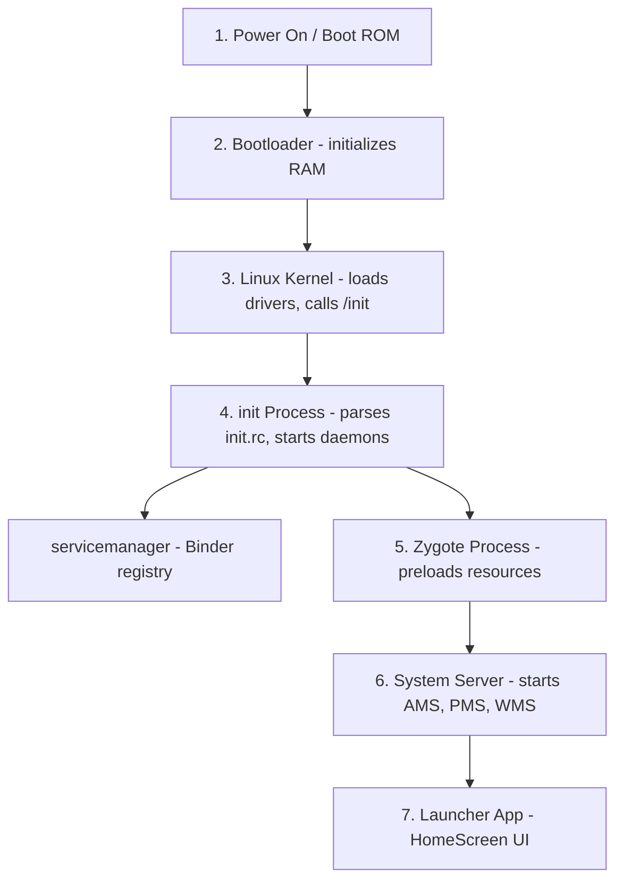
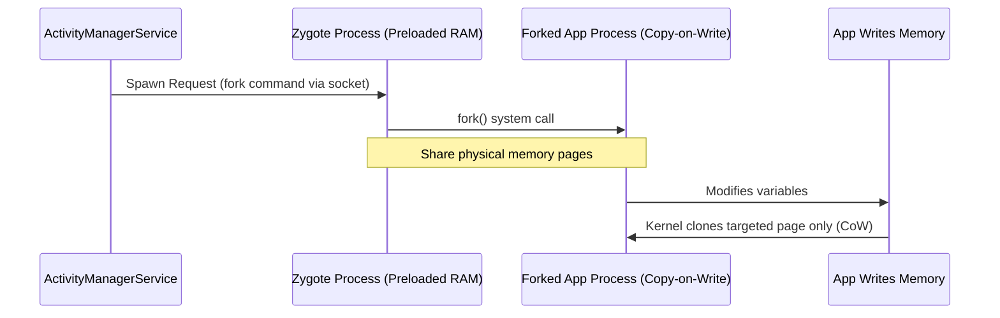
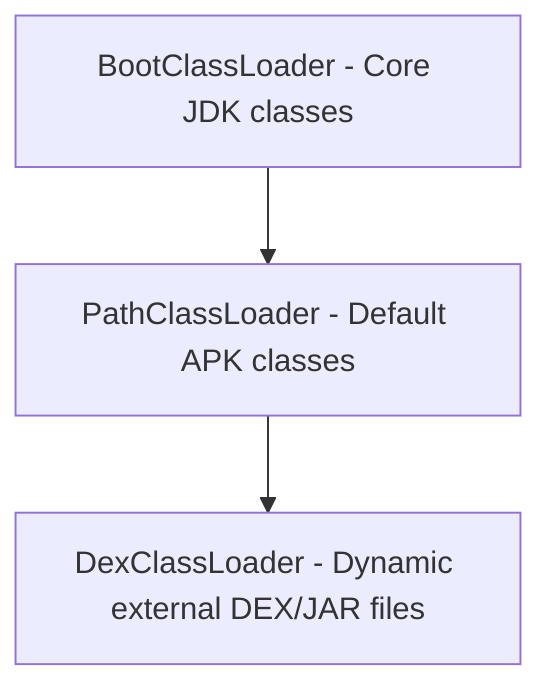
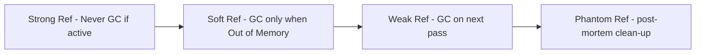
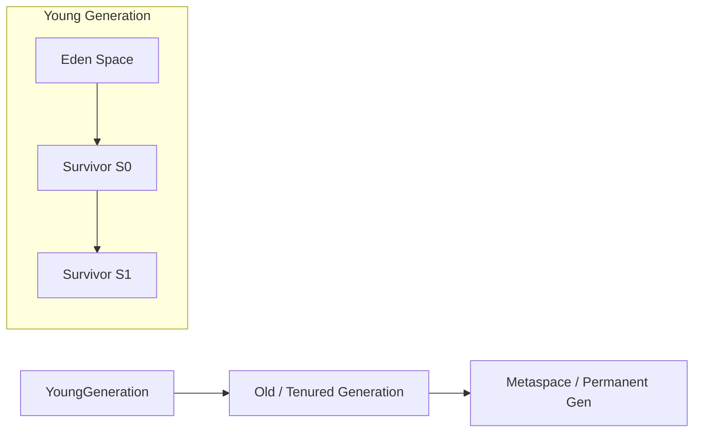
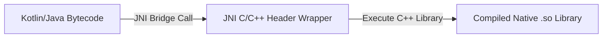
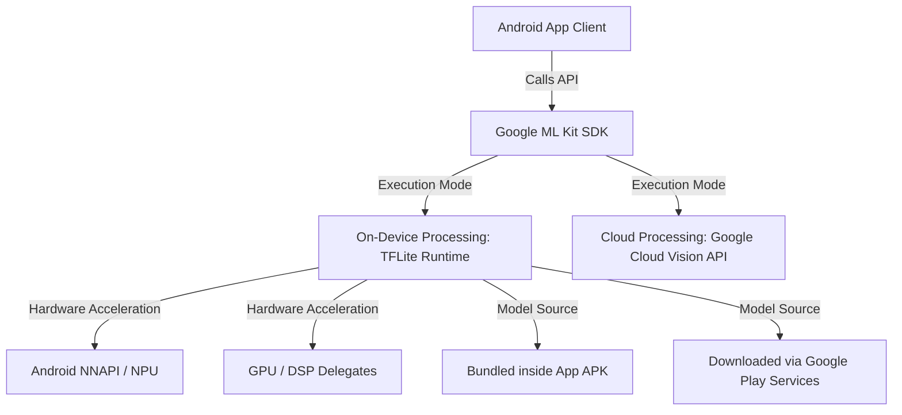
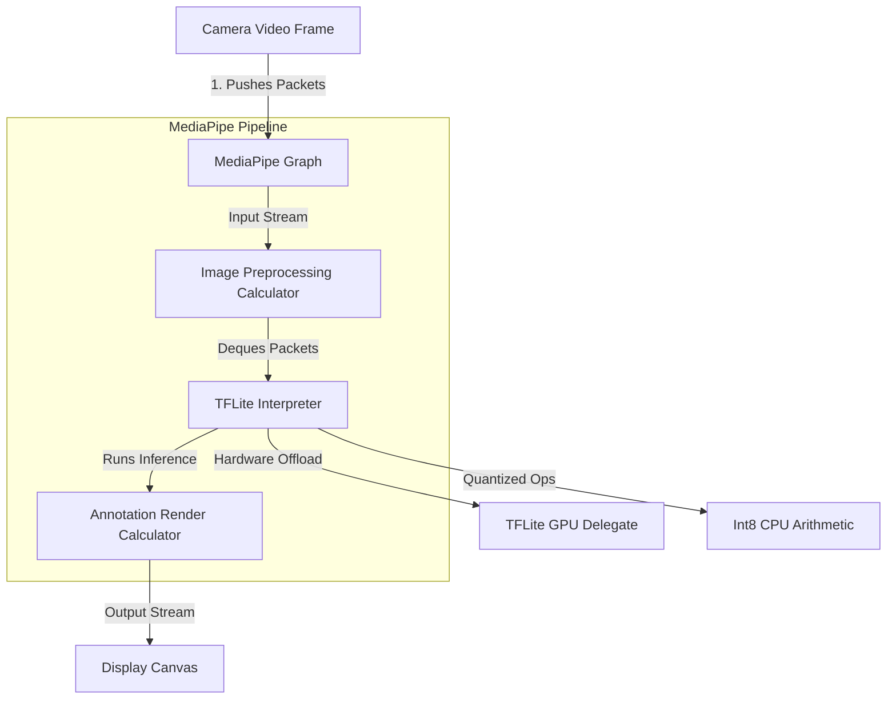

# 🧠 Android Core Knowledge Points — Technical Interview Reference

> **Authoritative Technical Reference**
> The platform internals interviewers use to separate "uses the SDK" from "understands the system".
>
> **30 internals interview questions:** [`interview_questions/01_system_internals.md`](./interview_questions/01_system_internals.md)

---

## 📑 Table of Contents

| # | Topic | Key Points |
|---|---|---|
| 1 | [Android Boot Sequence](#1-android-system-boot-sequence) | Bootloader → kernel → init → Zygote → SystemServer |
| 2 | [Zygote & Copy-On-Write](#2-zygote-process--copy-on-write-cow) | Process forking, preloaded classes, shared memory pages |
| 3 | [Class Loaders](#3-class-loaders-in-android) | `PathClassLoader`, `DexClassLoader`, delegation model |
| 4 | [Reference Types & Heap](#4-reference-types--jvmart-heap-structure) | Strong/soft/weak/phantom, generational heap layout |
| 5 | [Serialization](#5-serialization-serializable-vs-parcelable) | `Serializable` vs `Parcelable`, reflection cost |
| 6 | [Intent Flags & Back Stack](#6-intent-flags--back-stack-manipulations) | Task affinity, `CLEAR_TOP`, `NEW_TASK`, `SINGLE_TOP` |
| 7 | [NDK & JNI](#7-android-ndk--jni-boundaries) | JNI boundary cost, when native code pays off |
| 8 | [Open Source Licenses](#8-open-source-software-licenses) | Permissive vs copyleft, obligations for shipped apps |
| 9 | [Google ML Kit](#9-google-ml-kit-architecture--apis) | On-device vs cloud models, delegate acceleration |
| 10 | [MediaPipe & TFLite](#10-mediapipe--tensorflow-lite-tflite-architecture) | Graph runtime, quantization, pruning |
| 11 | [AIDL & IPC](#11-aidl-messenger-and-cross-process-communication) | AIDL vs Messenger, Binder threading, death recipients |
| 12 | [Multi-Process Apps](#12-multi-process-apps-transactiontoolargeexception-and-process-isolation) | `android:process`, per-process state, Binder buffer limits |
| 13 | [APK Anatomy & Signing](#13-apk-anatomy-multidex-and-signing-schemes) | DEX mmap, 64K limit, multidex, v1–v4 signatures |
| 14 | [ANR Traces & Triage](#14-anr-traces-and-crash-triage) | Reading thread dumps, lock contention, common causes |
| 15 | [Interview Questions](#15-interview-questions) | Pointer to the question bank |

---

# 1. Android System Boot Sequence

The Android startup sequence initializes the hardware, launches the Linux kernel, starts system daemons, and prepares the runtime environment.



### Steps Breakdown
1. **Power On & Boot ROM:** The CPU executes code pre-flashed in the Boot ROM, locating and loading the Bootloader into RAM.
2. **Bootloader:** Initializes hardware registers, checks partitions, and loads the Linux Kernel.
3. **Linux Kernel:** Configures virtual memory, loads device drivers, and mounts root directories, completing setup by launching the first user-space process: `/init`.
4. **`init` Process:** Parses the `init.rc` configuration script, mounting partitions and starting system daemons like `servicemanager` (Binder directory) and `lmkd` (Low Memory Killer).
5. **Zygote Process:** Launched as a Java-based daemon. It pre-loads core libraries, resource drawables, and classes into memory to establish the shared runtime environment.
6. **System Server:** Forked directly by Zygote. It starts critical system managers including the `ActivityManagerService` (AMS), `PackageManagerService` (PMS), and `WindowManagerService` (WMS).
7. **Launcher App:** Once system services are running, the AMS sends an intent to start the Home Launcher screen.

---

# 2. Zygote Process & Copy-On-Write (CoW)

## 2.1 Zygote Process

### Definition
* **Simple:** Zygote is the template process that Android copies to start every application quickly.
* **Advanced:** Zygote is a warm-started Java daemon process initialized by the `app_process` native binary. It pre-loads common system resources, Java runtime classes, and shared libraries into virtual memory, serving as the parent template from which all application processes are forked.



### Why it is Used
If every Android application had to boot the virtual machine, load core Java libraries, and inflate standard system UI assets from scratch, app cold-start times would be measured in seconds, and device RAM would be exhausted by duplicate resources. Zygote eliminates this latency and memory overhead.

### How it Works (Copy-on-Write)
When a user launches an application, the system calls `fork()` on the Zygote process:
* The OS creates a new process that inherits the exact file descriptors and memory space mappings of the Zygote parent.
* **Copy-on-Write (CoW):** Initially, the parent (Zygote) and child (App) share the same physical memory pages. Physical pages are only duplicated by the kernel if the child process attempts to write/modify a page.
* Read-only system assets (like fonts, layouts, and libraries) remain shared, saving system memory.

---

# 3. Class Loaders in Android

## 3.1 Class Loader Hierarchy

### Definition
* **Simple:** Class loaders are Java components that locate and load compiled `.class` or `.dex` files into memory when the program runs.
* **Advanced:** Class loaders translate compiled bytecode files into JVM/ART runtime `Class` objects using the **Parent-Delegation Model**.



### Android Class Loader Types
1. **`BootClassLoader`:** A singleton instance implemented in Java. It loads core Android framework and JDK runtime classes.
2. **`PathClassLoader`:** The default class loader used by the Android system to load classes from the application's installed APK directory (`/data/app/`). It only supports loading files from local, read-only system paths.
3. **`DexClassLoader`:** A subclass of `BaseDexClassLoader` that can load classes from external, writable directories containing `.dex`, `.jar`, or `.apk` archive files. This is used to implement **Dynamic Feature Loading** and hot-fix plugin architectures.

---

# 4. Reference Types & JVM/ART Heap Structure

## 4.1 Reference Types

Java and Kotlin provide four reference types that dictate how the Garbage Collector (GC) treats objects in heap memory.



1. **Strong Reference:** The default reference type. As long as an object has a path of strong references back to a GC root (e.g. static variable, active thread local), it will never be collected.
2. **Soft Reference:** The GC reclaims soft references only when the system runs low on memory (right before throwing an `OutOfMemoryError`).
3. **Weak Reference:** The GC reclaims weak references immediately during its next collection pass, regardless of memory availability. Essential for resolving memory leaks in listener/callback interfaces.
4. **Phantom Reference:** Cannot be dereferenced directly to access the object. It is queued in a `ReferenceQueue` when the object is finalized, notifying developers that the memory is ready to be reclaimed.

---

## 4.2 JVM/ART Heap Structure

The application runtime memory (Heap) is structured into distinct generations to optimize GC passes:



* **Young Generation (Eden, S0, S1):** Newly allocated objects are placed in the **Eden** space. During minor GC passes, surviving objects are copied between the **Survivor** spaces (`S0` and `S1`) and their generation counter is incremented.
* **Old Generation (Tenured):** Long-lived objects that survive multiple minor GC passes are promoted (tenured) to the **Old Generation** space.
* **Metaspace (Permanent Generation):** Stores class definitions, method metadata, and string constant pools.

---

# 5. Serialization: Serializable vs. Parcelable

## 5.1 Comparison Table

| Feature | `java.io.Serializable` | `android.os.Parcelable` |
|---|---|---|
| **Underlying Mechanism** | Java Reflection API | Direct byte-buffer writing (manual or codegen) |
| **Performance Speed** | Extremely Slow (high overhead) | Extremely Fast (reflection-free IPC optimization) |
| **Memory Allocations** | High (creates numerous temporary objects) | Low |
| **Implementation Complexity** | Low (marker interface only) | High (requires writing marshalling code / `@Parcelize`) |
| **IPC Suitability** | Poor | Excellent (ideal for Binder transactions) |

---

# 6. Intent Flags & Back Stack Manipulations

Intent flags are used to modify the launch behavior of activities dynamically during runtime.

### Key Intent Flags
1. **`FLAG_ACTIVITY_NEW_TASK`:**
   * Starts the activity in a new task. If a task already exists for the activity, that task is brought to the foreground, resuming its last state.
2. **`FLAG_ACTIVITY_CLEAR_TASK`:**
   * Clears the target task stack completely before launching the activity. Must be used in conjunction with `FLAG_ACTIVITY_NEW_TASK`. Commonly used when logging out users.
3. **`FLAG_ACTIVITY_CLEAR_TOP`:**
   * If the activity exists in the stack, all activities above it are destroyed. Instead of creating a new instance, the system delivers the intent to the existing instance via `onNewIntent()`.
4. **`FLAG_ACTIVITY_SINGLE_TOP`:**
   * Behaves like the `singleTop` launch mode. If the target activity is at the top of the stack, it intercepts the intent in `onNewIntent()` without creating a new instance.

---

# 7. Android NDK & JNI Boundaries

## 7.1 Native Development Kit (NDK) & JNI

### Definition
* **Simple:** NDK is a toolkit that lets you write C/C++ code for Android apps. JNI is the bridge that lets Kotlin/Java and C/C++ code communicate.
* **Advanced:** The **NDK** is a set of compilation tools used to build native C/C++ binaries (`.so` shared libraries) optimized for specific CPU architectures (ABIs). **JNI (Java Native Interface)** is the execution bridge that marshals parameters and execution threads between the ART runtime environment and native machine code compilation layers.



### Why it is Used
NDK is used to compile high-performance libraries (like physical simulation engines, custom audio processors, image/video renderers, or cryptographic utilities) that require direct execution on CPU registers without virtual machine translation layers.

### JNI Performance Overhead
Calling native methods via JNI involves overhead:
* **Thread Context Switches:** The thread must transition from JVM execution states to Native execution states, modifying garbage collection safety safepoints.
* **Parameter Marshalling:** Primitive values are copied directly, but complex objects (like Strings or custom arrays) must be serialized, converted to pointers, and unmarshaled, which can block threads if done frequently.

---

# 8. Open Source Software Licenses

In software architecture and publishing, choosing the correct open-source license determines how other developers and companies can use, modify, and distribute your codebase.

```mermaid
graph TD
    Lic[Software Licenses] --> Permissive[Permissive Licenses: MIT, Apache 2.0, BSD]
    Lic --> Copyleft[Copyleft Licenses: GPL, LGPL, AGPL]
    Permissive --> MIT[MIT: Use/modify freely, keep copyright notice]
    Permissive --> Apache[Apache 2.0: Adds patent grant, trademark protection]
    Copyleft --> GPL[GPL: Derivative works must be open-sourced (Viral)]
    Copyleft --> LGPL[LGPL: Permits linking without open-sourcing host app]
    Copyleft --> AGPL[AGPL: Requires open-source source code for SaaS/network use]
```

### 8.1 Permissive Licenses
Permissive licenses place minimal restrictions on how the software can be used, modified, and redistributed, allowing commercial, closed-source usage.
1. **MIT License:**
   * **Scope:** Extremely simple. Users can do anything with the code (modify, distribute, sell, sublicense) as long as the original copyright notice and license notice are included in all copies or substantial portions of the software.
2. **Apache License 2.0:**
   * **Scope:** Similar to MIT but includes an explicit **patent grant** from contributors to users (protecting users from patent infringement lawsuits). It also prevents users from using the project's trademarks and requires modified files to carry prominent notices stating they were changed (provenance tracking).
3. **BSD Licenses (2-Clause / 3-Clause):**
   * **Scope:** Permissive. The 3-Clause version adds a specific restriction stating that the names of the project's authors or contributors cannot be used to endorse or promote derived products without prior written consent.

### 8.2 Copyleft (Share-Alike) Licenses
Copyleft licenses require that anyone who redistributes the software (with or without changes) must pass along the freedom to further copy and modify it, meaning any derivative work must also be open-sourced under the same license terms.
1. **GPL (GNU General Public License, e.g., GPLv3):**
   * **Scope:** Strong copyleft (often called "viral"). If your application links to or incorporates any GPL-licensed code, your entire application must be open-sourced under the GPL license when distributed to users.
2. **LGPL (GNU Lesser General Public License):**
   * **Scope:** Weak copyleft. It allows developers to link to the library (often dynamic linking of shared libraries like `.so` or `.dll` files) within a closed-source/commercial application without being forced to open-source the application code. However, any direct modifications to the LGPL library itself must be released under LGPL.
3. **AGPL (GNU Affero General Public License):**
   * **Scope:** Network-triggered copyleft. Created to close the "SaaS loophole" in standard GPL. If an AGPL-licensed module runs on a remote server providing services over a network (e.g. cloud services or web backends), you must make the complete source code of the running service available to the users interacting with it.

---

# 9. Google ML Kit Architecture & APIs

Google ML Kit is a mobile SDK that brings Google's machine learning technologies to Android and iOS applications.



### 9.1 Key Features & Capabilities
ML Kit divides its APIs into vision-based and text-based machine learning domains:
1. **Barcode Scanning:** Identifies and decodes linear and 2D barcodes (QR code, Data Matrix, PDF417).
2. **Text Recognition (OCR):** Recognizes and extracts text from images in real-time. Supports Latin script natively, plus Chinese, Devanagari, Japanese, and Korean.
3. **Face Detection:** Recognizes faces, detects facial landmarks (eyes, ears, nose, mouth), and tracks facial contours for AR filters.
4. **Image Labeling:** Identifies objects, locations, activities, and animal species in images.
5. **Translation & Smart Reply:** Provides offline text translation of 50+ languages using small translation models, and generates context-aware reply suggestions in messaging environments.

### 9.2 Architecture & Model Loading Models
ML Kit offers two implementation modes for loading machine learning models:
* **Bundled Model:** The ML model is compiled and packaged directly inside the application's `.apk` binary.
  * *Pros:* Runs immediately upon app installation without internet connections.
  * *Cons:* Increases app download size significantly (e.g. adding 10-20MB per model).
* **Dynamic Model (via Google Play Services):** The model is omitted from the APK download. When the app initializes the ML API, the SDK downloads the model dynamically from Google Play Services.
  * *Pros:* Minimizes APK size.
  * *Cons:* Requires Google Play Services to be present on the device, and first-time usage requires a network connection to download the model assets.

### 9.3 Hardware Acceleration Internals
Under the hood, ML Kit is built on top of **TensorFlow Lite (TFLite)**. To run neural network inferences with sub-millisecond latency, the runtime:
1. Utilizes the **Android Neural Networks API (NNAPI)** to delegate compute tasks to hardware-specific coprocessors (NPUs - Neural Processing Units).
2. Integrates **GPU Delegates** to offload floating-point matrix multiplications to the device GPU, preventing CPU starvation and saving battery consumption.

---

# 10. MediaPipe & TensorFlow Lite (TFLite) Architecture

Google's on-device AI ecosystem leverages MediaPipe for sensory pipeline stream management and TensorFlow Lite (TFLite) for raw model inference.



### 10.1 MediaPipe Framework Architecture
MediaPipe is a cross-platform framework for building perceptual pipelines that process streaming data (video, audio, sensors).
* **Graph-Based Processing:** MediaPipe models the pipeline as a **Directed Acyclic Graph (DAG)** of nodes called **Calculators** connected by **Data Streams**.
* **Calculators:** Specialized processing nodes (written in C++ or Java/Kotlin). Example: a calculator that crops images, another that runs TFLite inference, and another that draws landmark overlays.
* **Streams & Packets:** Calculators communicate by sending data packets (e.g. image frames, coordinate lists) timestamped to ensure thread-safe, synchronized, parallel execution.
* **Core APIs:** Face Mesh (468 landmarks), Hands (21 landmarks), Pose (33 body landmarks), and Objectron (3D object detection).

### 10.2 TensorFlow Lite (TFLite) Compiler & Runtime
TFLite is a lightweight runtime engine that executes machine learning models directly on Android and iOS devices.
1. **The Converter:** Converts standard TensorFlow models (SavedModel format) into a compact flatbuffer structure (`.tflite` files), reducing model footprint.
2. **The Interpreter:** The core virtual machine execution engine that reads `.tflite` code, manages execution memory buffers, and schedules operator processing.
3. **Hardware Delegates:** Abstracts hardware offloading:
   * **GPU Delegate:** Runs float16 operations on the device GPU via OpenGL ES or Vulkan, avoiding CPU throttling.
   * **NNAPI / NPU Delegate:** Integrates with Android Neural Networks API to process model sub-graphs on dedicated NPUs.

### 10.3 Model Optimization: Quantization & Pruning
To run models on memory-constrained mobile devices, engineers optimize TFLite models using:
* **Quantization:** Replaces 32-bit floating-point parameters (`float32` weights) with 8-bit integers (`int8`). 
  * *Impact:* Reduces model size by **75%** (from 40MB to 10MB) and dramatically increases execution speeds by replacing floating-point arithmetic with faster integer-based matrix operations, with minimal loss in model accuracy.
* **Pruning:** During training, weights with low impact on output results are systematically set to zero. This creates "sparse" model structures that compress highly efficiently.

---

# 11. AIDL, Messenger, and Cross-Process Communication

### Definition
* **AIDL (Android Interface Definition Language):** A language for declaring an interface that two processes agree on. The AIDL compiler generates the `Stub` (server) and `Proxy` (client) classes that marshal calls across Binder.
* **Messenger:** A lightweight IPC wrapper that serializes calls onto a single `Handler`, so requests are processed sequentially rather than concurrently.

### Why It Is Used
Most apps never need AIDL — but IPC is unavoidable when writing a bound service consumed by another app, integrating a system-level SDK, or running your own app across multiple processes to isolate a crash-prone component.

### How It Works Internally

| Mechanism | Concurrency | Complexity | Use When |
|---|---|---|---|
| **`Messenger`** | Serialized on one Handler thread | Low | Simple request/response, ordering matters |
| **AIDL** | Concurrent — multiple Binder threads | High | Multiple simultaneous callers, throughput matters |
| **`ContentProvider`** | Concurrent | Medium | Structured, queryable, permission-controlled data |
| **Broadcast** | Asynchronous, one-way | Low | Fan-out notification, no return value |

**The threading trap.** AIDL methods are invoked on a thread from the Binder thread pool, **not** on the main thread. Touching UI from an AIDL implementation crashes; conversely, blocking in an AIDL method blocks a pool thread, and the pool is finite (16 threads).

### Code Example
```java
// IUserService.aidl — the contract both processes compile against
package com.example.app;

import com.example.app.UserParcel;
import com.example.app.IUserCallback;

interface IUserService {
    UserParcel getUser(long id);
    // oneway makes the call asynchronous: it returns immediately and cannot return a value
    oneway void subscribe(IUserCallback callback);
}
```

```kotlin
// Service implementation. onTransact runs on a Binder POOL thread, not the main thread.
class UserService : Service() {

    private val callbacks = RemoteCallbackList<IUserCallback>()

    private val binder = object : IUserService.Stub() {
        override fun getUser(id: Long): UserParcel {
            // Enforce permission per call: the caller is another process and is untrusted
            enforceCallingPermission("com.example.app.permission.READ_USERS", null)
            return repository.getUserBlocking(id).toParcel()
        }

        override fun subscribe(callback: IUserCallback) {
            // RemoteCallbackList handles death recipients automatically, so a crashed
            // client is removed instead of leaking a dead Binder reference forever.
            callbacks.register(callback)
        }
    }

    override fun onBind(intent: Intent): IBinder = binder

    private fun notifyAll(user: UserParcel) {
        val n = callbacks.beginBroadcast()
        repeat(n) { i ->
            // A remote process can die between the check and the call
            runCatching { callbacks.getBroadcastItem(i).onUserChanged(user) }
        }
        callbacks.finishBroadcast()
    }
}
```

```kotlin
// Client side: bind, then survive the service process dying
class UserServiceClient(private val context: Context) {
    private var service: IUserService? = null

    private val deathRecipient = IBinder.DeathRecipient {
        service = null
        rebindWithBackoff()          // The remote process died; reconnect
    }

    private val connection = object : ServiceConnection {
        override fun onServiceConnected(name: ComponentName, binder: IBinder) {
            service = IUserService.Stub.asInterface(binder)
            binder.linkToDeath(deathRecipient, 0)
        }
        override fun onServiceDisconnected(name: ComponentName) { service = null }
    }

    fun bind() {
        val intent = Intent("com.example.app.USER_SERVICE").apply {
            setPackage("com.example.app")   // MANDATORY: an implicit service intent is illegal
        }
        context.bindService(intent, connection, Context.BIND_AUTO_CREATE)
    }

    // Every remote call can throw when the other process dies mid-call
    fun getUser(id: Long): UserParcel? = try {
        service?.getUser(id)
    } catch (e: DeadObjectException) {
        service = null; null
    } catch (e: RemoteException) {
        null
    }
}
```

### Common Pitfalls
* **Touching UI from an AIDL method.** It runs on a Binder pool thread. Post to the main thread.
* **Not handling `DeadObjectException`.** The other process can be killed at any time by the LMK.
* **Passing large data.** The 1 MB Binder transaction buffer is shared per process; a large `Parcel` throws `TransactionTooLargeException`.
* **An exported service with no permission.** Any app on the device can bind and call it.
* **Blocking inside an AIDL method.** It occupies a finite pool thread; a few slow calls starve every other transaction.

---

# 12. Multi-Process Apps, TransactionTooLargeException, and Process Isolation

### Definition
`android:process` in the manifest runs a component in a separate OS process with its own heap, its own `Application` instance, and its own static state.

### Why It Is Used
Isolation: a native crash in a WebView or a video decoder kills only that process. Memory: a memory-hungry component gets its own heap limit rather than pushing the main process toward OOM.

### How It Works Internally
Each process is forked from Zygote separately, so `Application.onCreate` runs **once per process**. Every singleton, every static field, and every in-memory cache exists independently per process — the source of the most confusing multi-process bugs.

**`TransactionTooLargeException` mechanics.** The Binder transaction buffer is **1 MB per process, shared across all in-flight transactions**. This means the practical limit for any single transaction is well under 1 MB, and it depends on what else is happening concurrently — which is why the bug reproduces only sometimes.

Common triggers:
* A large `Bundle` in `onSaveInstanceState` (bitmaps, big lists).
* A big list passed as an Intent extra.
* A `ContentProvider` query returning too many rows in one `CursorWindow`.
* Many pending `Parcelable`s in a fragment back stack save.

### Code Example
```xml
<!-- The WebView runs in its own process: a renderer crash cannot take down the app -->
<activity
    android:name=".WebContainerActivity"
    android:process=":web" />

<!-- A leading ':' makes it private to this app. A fully-qualified name makes it shareable
     between apps signed with the same key. -->
<service
    android:name=".sync.SyncService"
    android:process=":sync" />
```

```kotlin
// Application.onCreate runs in EVERY process — initialize selectively or waste memory
class App : Application() {
    override fun onCreate() {
        super.onCreate()
        when (currentProcessName()) {
            packageName -> {
                // Main process only: UI-related initialization
                initImageLoader()
                initAnalytics()
            }
            "$packageName:sync" -> initSyncOnly()
            "$packageName:web" -> Unit          // Keep the web process minimal
        }
    }

    private fun currentProcessName(): String =
        if (Build.VERSION.SDK_INT >= Build.VERSION_CODES.P) getProcessName()
        else getSystemService(ActivityManager::class.java)
            .runningAppProcesses
            ?.firstOrNull { it.pid == Process.myPid() }?.processName
            ?: packageName
}
```

```kotlin
// Avoiding TransactionTooLargeException: save identity, not data
class GalleryFragment : Fragment() {

    override fun onSaveInstanceState(outState: Bundle) {
        super.onSaveInstanceState(outState)
        // WRONG: outState.putParcelableArrayList("photos", photos)  // MBs of data
        // RIGHT: save what lets you rebuild the state
        outState.putLong("album_id", albumId)
        outState.putInt("scroll_position", layoutManager.findFirstVisibleItemPosition())
    }
}

// Diagnosing it: log the actual bundle size before it throws
fun Bundle.sizeInBytes(): Int = Parcel.obtain().use { parcel ->
    parcel.writeBundle(this)
    parcel.dataSize()
}
```

```kotlin
// Cross-process state sharing: static fields DO NOT work.
// Use a ContentProvider, a bound service, or a file-backed store.
class SettingsProvider : ContentProvider() {
    // Reads/writes here are visible to every process, unlike a singleton
}
```

### Common Pitfalls
* **Assuming a singleton is shared across processes.** Each process has its own instance, silently.
* **Initializing everything in `Application.onCreate`.** Every process pays the cost and the memory.
* **Room or SQLite accessed from multiple processes** without `enableMultiInstanceInvalidation()`. Change notifications do not cross the process boundary.
* **Debugging only the main process.** Attach the debugger to the specific process, and note that `Log` output interleaves from all of them.

---

# 13. APK Anatomy, Multidex, and Signing Schemes

### Definition
The internal structure of an installable artifact and the mechanisms that make it verifiable and loadable.

### Why It Is Used
Build failures (`Cannot fit requested classes in a single dex file`), install failures (`INSTALL_PARSE_FAILED_NO_CERTIFICATES`), and update failures (signature mismatch) are all explained by these mechanics.

### How It Works Internally

**DEX loading.** `PathClassLoader` memory-maps `classes.dex` from inside the APK — the file is stored uncompressed and page-aligned precisely so it can be `mmap`'d rather than extracted. This is why DEX files are not compressed in a modern APK even though the APK is a ZIP.

**The 64K limit.** The DEX format's `method_id` index is 16-bit, so a single DEX file can reference at most 65,536 methods. Note this counts **referenced** methods, including every framework and library method your code calls — not just methods you wrote.

| minSdk | Multidex Behavior |
|---|---|
| **< 21** | Legacy multidex: secondary DEX files are extracted and dex-opted at first launch, adding seconds to cold start and risking ANR |
| **≥ 21** | Native multidex: ART loads all `classes*.dex` directly, no runtime cost, no configuration |

**Signature scheme summary:**

| Scheme | Since | Protects | Notes |
|---|---|---|---|
| v1 (JAR) | Always | Per-file digests in `META-INF` | Does not protect ZIP metadata; slow to verify |
| v2 | API 24 | The whole APK as bytes | Fast, detects any modification |
| v3 | API 28 | v2 + a key-rotation lineage | Rotate the signing key without losing update rights |
| v4 | API 30 | A Merkle tree in a sidecar file | Enables ADB incremental install |

### Code Example
```bash
# What is actually in the artifact
unzip -l app-release.apk
apkanalyzer apk summary app-release.apk
apkanalyzer dex references app-release.apk        # Total method reference count vs the 64K limit
apkanalyzer dex packages --defined-only app-release.apk | sort -k2 -nr | head -20

# Which signature schemes are present, and with which certificate
apksigner verify --verbose --print-certs app-release.apk

# Why the DEX is not compressed: it is mmap'd directly out of the APK
unzip -v app-release.apk | grep classes.dex        # Method column shows "Stored"
```

```gradle
android {
    defaultConfig {
        // Only needed below API 21; above that, multidex is native and automatic
        multiDexEnabled = true
    }
}

dependencies {
    // Legacy support library, only for minSdk < 21
    implementation("androidx.multidex:multidex:2.0.1")
}
```

```kotlin
// Legacy multidex requires either extending MultiDexApplication or installing manually
class App : Application() {
    override fun attachBaseContext(base: Context) {
        super.attachBaseContext(base)
        MultiDex.install(this)     // Must run before any secondary-DEX class is touched
    }
}
```

### Common Pitfalls
* **Enabling multidex to "fix" the 64K limit** instead of enabling R8. Shrinking usually removes the problem entirely and produces a smaller app.
* **Signature mismatch on update.** A different signing key means the update is rejected with `INSTALL_FAILED_UPDATE_INCOMPATIBLE`; the only remedy without Play App Signing key rotation is a new package name.
* **Disabling v2/v3 signing** to support very old devices, losing fast verification and tamper detection.
* **Counting only your own methods** against the 64K limit. Library method references dominate.

---

# 14. ANR Traces and Crash Triage

### Definition
Reading `/data/anr/traces.txt` (or the Play Console's ANR cluster) to identify why the main thread was blocked.

### Why It Is Used
An ANR report is not a stack trace of a crash — it is a snapshot of every thread at the moment the system gave up. Reading it correctly is a distinguishing skill, because the useful information is usually in a *different* thread from the one that is stuck.

### How It Works Internally
When an ANR is declared, the system dumps the state of every thread in the process (and often in related processes). The main thread's stack shows *where it is blocked*; the cause is whoever holds the resource it is waiting for.

**The three shapes you will actually see:**

| Main-thread state | Meaning | Where the cause is |
|---|---|---|
| `Blocked` on a monitor, with `held by tid=N` | Lock contention | Thread N's stack |
| `Native` in `epoll_wait` / `Runnable` in your own code | Slow main-thread work | The main thread's own stack |
| `Waiting` on a `CountDownLatch` / `Object.wait` | Synchronous wait for background work | The background thread that never signalled |

### Code Example
```
"main" prio=5 tid=1 Blocked
  | group="main" sCount=1 dsCount=0 flags=1 obj=0x72a985d0 self=0xb400007
  | sysTid=8462 nice=-10 cgrp=top-app sched=0/0 handle=0x7b1e4b34f8
  at com.example.app.data.CacheManager.get(CacheManager.kt:42)
  - waiting to lock <0x0a3f1c22> (a java.lang.Object) held by thread 14      <-- the pointer
  at com.example.app.ui.FeedAdapter.onBindViewHolder(FeedAdapter.kt:88)
  ...

"pool-3-thread-2" prio=5 tid=14 Runnable
  at java.io.FileInputStream.read(FileInputStream.java)
  at com.example.app.data.CacheManager.loadFromDisk(CacheManager.kt:97)
  - locked <0x0a3f1c22> (a java.lang.Object)                                <-- the culprit
```
The main thread is blocked on a lock that a background thread holds while doing disk IO. The fix is not on the main thread at all — it is to stop holding the lock across an IO call.

```kotlin
// The bug
class CacheManager {
    private val lock = Any()
    private val cache = mutableMapOf<String, Bitmap>()

    fun get(key: String): Bitmap? = synchronized(lock) {
        cache[key] ?: loadFromDisk(key)?.also { cache[key] = it }   // Disk IO INSIDE the lock
    }
}

// The fix: never hold a lock across IO; and never let the UI thread wait on it at all
class CacheManager(private val scope: CoroutineScope) {
    private val cache = ConcurrentHashMap<String, Deferred<Bitmap?>>()

    // Callers await; the lock is never held across the IO, and duplicate loads are shared
    suspend fun get(key: String): Bitmap? =
        cache.computeIfAbsent(key) {
            scope.async(Dispatchers.IO) { loadFromDisk(key) }
        }.await()
}
```

```bash
# Pull ANR traces from a device
adb shell ls /data/anr/
adb pull /data/anr/anr_2026-09-09-10-42-11-000

# Reproduce main-thread blocking during development instead of finding it in production
# (StrictMode with penaltyLog is the cheapest ANR-prevention tool that exists)
adb shell am broadcast -a com.android.internal.intent.action.ANR   # Some builds only
```

### Common Pitfalls
* **Reading only the main thread's stack.** For lock contention the answer is in the holder's stack; follow `held by thread N`.
* **Blaming the topmost frame.** `Object.wait` is where it stopped, not why.
* **Ignoring "no focused window" ANRs.** These usually mean the Activity never finished starting — look at `Application.onCreate` and startup work.
* **Treating a low ANR rate as fine.** Play Vitals thresholds are per-device-model; a single bad OEM can breach the bad-behavior threshold on its own.
* **No StrictMode in debug.** Main-thread IO is the most common ANR cause and StrictMode catches it in seconds.

---

# 15. Interview Questions

**➡️ [`interview_questions/01_system_internals.md`](./interview_questions/01_system_internals.md) — 30 questions on Android internals: boot, Zygote, ART, class loaders, Binder, DEX.**

See also:
* [`interview_questions/10_performance_memory.md`](./interview_questions/10_performance_memory.md) — GC, leaks, ANR triage
* [`interview_questions/02_components_manifest.md`](./interview_questions/02_components_manifest.md) — IPC, providers, services
* [`interview_questions/00_INDEX.md`](./interview_questions/00_INDEX.md) — full index

---

## 📚 Related Guides

| Guide | Covers |
|---|---|
| [`android.md`](./android.md) | Application-level use of everything described here |
| [`testing_security.md`](./testing_security.md) | Attacking and defending these mechanisms |
| [`../Languages/java.md`](../Languages/java.md) | JVM memory model, references, class loading |
