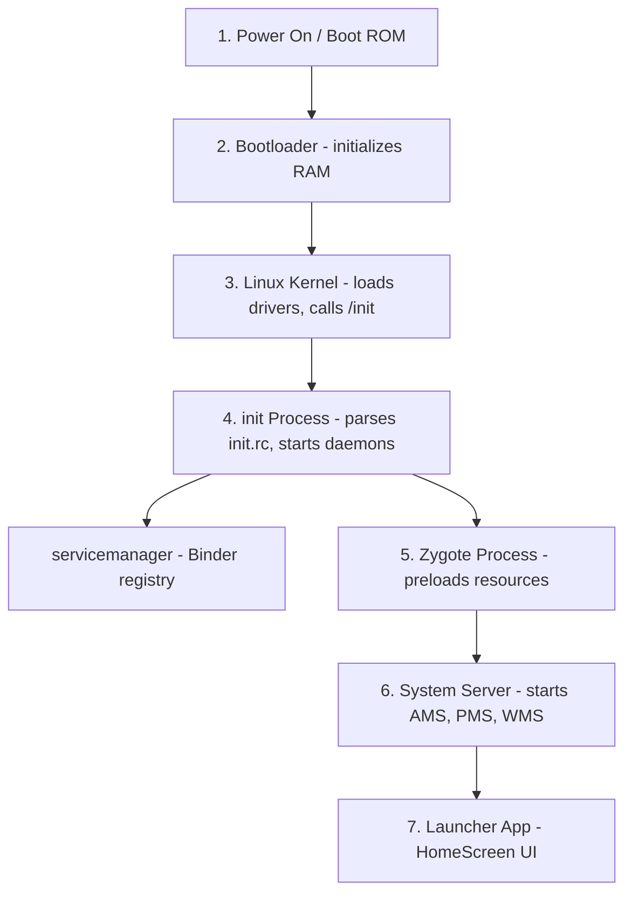
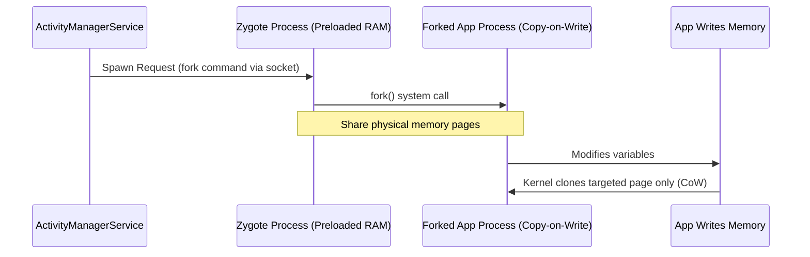
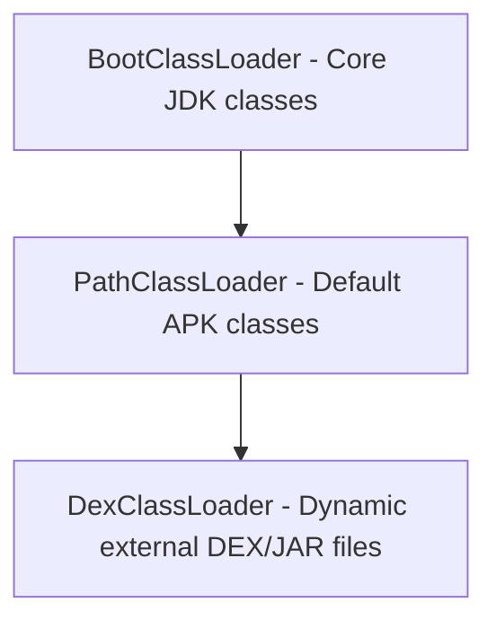
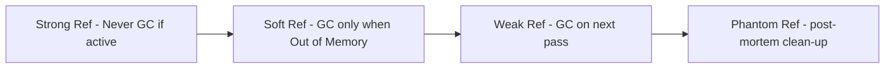
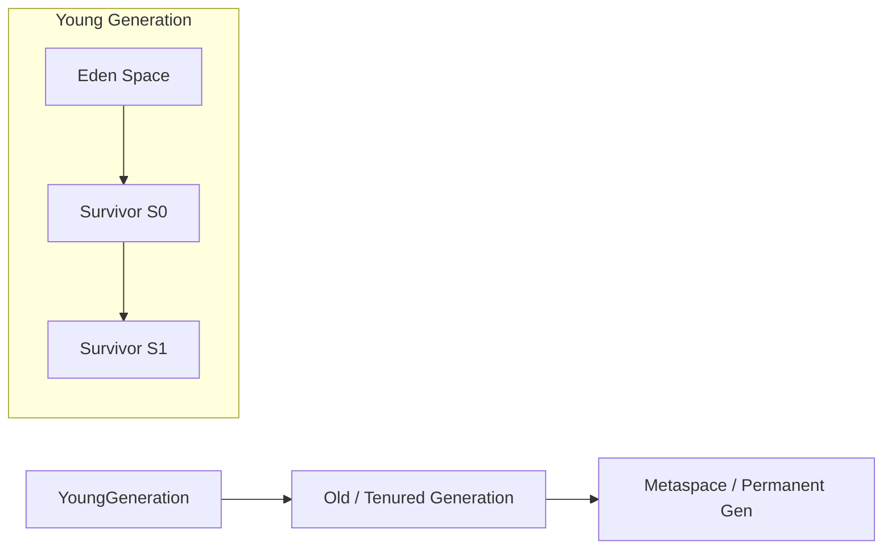
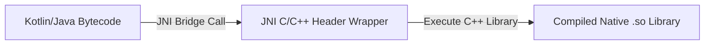
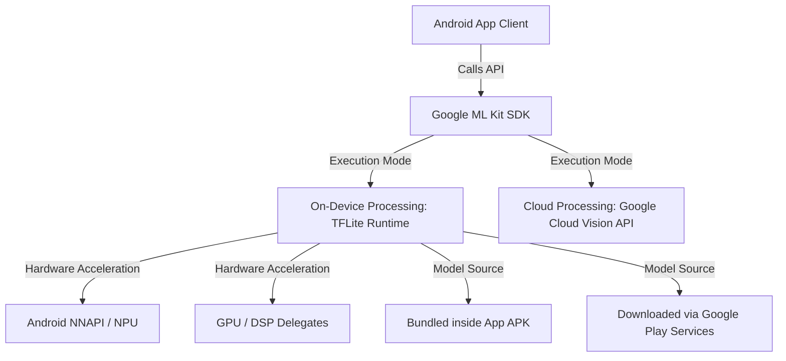
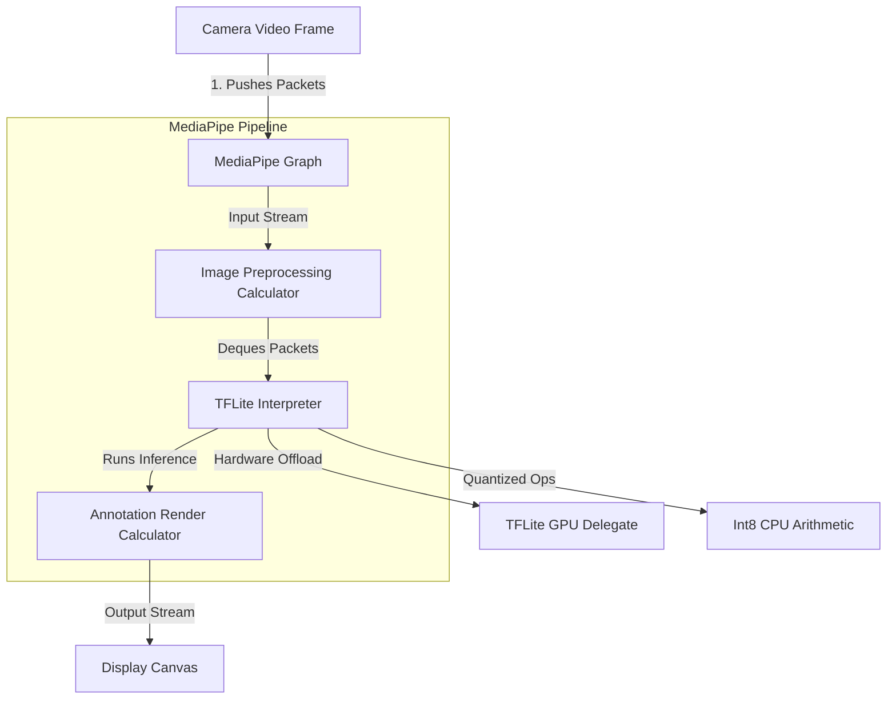

# 🧠 Android Core Knowledge Points — Technical Interview Reference

> **Authoritative Technical Reference**  
> Designed for Android Developers with 2–5 years of experience. This document covers miscellaneous advanced Android core knowledge points, boot sequences, low-level process behaviors, memory references, serialization, task flags, and native integrations (NDK/JNI).

---

## 📑 Table of Contents

1. [Module 1: Android System Boot Sequence](#1-android-system-boot-sequence)
2. [Module 2: Zygote Process & Copy-On-Write (CoW)](#2-zygote-process--copy-on-write-cow)
3. [Module 3: Class Loaders in Android](#3-class-loaders-in-android)
4. [Module 4: Reference Types & JVM/ART Heap Structure](#4-reference-types--jvmart-heap-structure)
5. [Module 5: Serialization: Serializable vs. Parcelable](#5-serialization-serializable-vs-parcelable)
6. [Module 6: Intent Flags & Back Stack Manipulations](#6-intent-flags--back-stack-manipulations)
7. [Module 7: Android NDK & JNI Boundaries](#7-android-ndk--jni-boundaries)
8. [Module 8: Open Source Software Licenses](#8-open-source-software-licenses)
9. [Module 9: Google ML Kit Architecture & APIs](#9-google-ml-kit-architecture--apis)
10. [Module 10: MediaPipe & TensorFlow Lite (TFLite) Architecture](#10-mediapipe--tensorflow-lite-tflite-architecture)

---

# 1. Android System Boot Sequence

The Android startup sequence initializes the hardware, launches the Linux kernel, starts system daemons, and prepares the runtime environment.



### Steps Breakdown
1. **Power On & Boot ROM:** The CPU executes code pre-flashed in the Boot ROM, locating and loading the Bootloader into RAM.
2. **Bootloader:** Initializes hardware registers, checks partitions, and loads the Linux Kernel.
3. **Linux Kernel:** Configures virtual memory, loads device drivers, and mounts root directories, completing setup by launching the first user-space process: `/init`.
4. **`init` Process:** Parses the `init.rc` configuration script, mounting partitions and starting system daemons like `servicemanager` (Binder directory) and `lmkd` (Low Memory Killer).
5. **Zygote Process:** Launched as a Java-based daemon. It pre-loads core libraries, resource drawables, and classes into memory to establish the shared runtime environment.
6. **System Server:** Forked directly by Zygote. It starts critical system managers including the `ActivityManagerService` (AMS), `PackageManagerService` (PMS), and `WindowManagerService` (WMS).
7. **Launcher App:** Once system services are running, the AMS sends an intent to start the Home Launcher screen.

---

# 2. Zygote Process & Copy-On-Write (CoW)

## 2.1 Zygote Process

### Definition
* **Simple:** Zygote is the template process that Android copies to start every application quickly.
* **Advanced:** Zygote is a warm-started Java daemon process initialized by the `app_process` native binary. It pre-loads common system resources, Java runtime classes, and shared libraries into virtual memory, serving as the parent template from which all application processes are forked.



### Why it is Used
If every Android application had to boot the virtual machine, load core Java libraries, and inflate standard system UI assets from scratch, app cold-start times would be measured in seconds, and device RAM would be exhausted by duplicate resources. Zygote eliminates this latency and memory overhead.

### How it Works (Copy-on-Write)
When a user launches an application, the system calls `fork()` on the Zygote process:
* The OS creates a new process that inherits the exact file descriptors and memory space mappings of the Zygote parent.
* **Copy-on-Write (CoW):** Initially, the parent (Zygote) and child (App) share the same physical memory pages. Physical pages are only duplicated by the kernel if the child process attempts to write/modify a page.
* Read-only system assets (like fonts, layouts, and libraries) remain shared, saving system memory.

---

# 3. Class Loaders in Android

## 3.1 Class Loader Hierarchy

### Definition
* **Simple:** Class loaders are Java components that locate and load compiled `.class` or `.dex` files into memory when the program runs.
* **Advanced:** Class loaders translate compiled bytecode files into JVM/ART runtime `Class` objects using the **Parent-Delegation Model**.



### Android Class Loader Types
1. **`BootClassLoader`:** A singleton instance implemented in Java. It loads core Android framework and JDK runtime classes.
2. **`PathClassLoader`:** The default class loader used by the Android system to load classes from the application's installed APK directory (`/data/app/`). It only supports loading files from local, read-only system paths.
3. **`DexClassLoader`:** A subclass of `BaseDexClassLoader` that can load classes from external, writable directories containing `.dex`, `.jar`, or `.apk` archive files. This is used to implement **Dynamic Feature Loading** and hot-fix plugin architectures.

---

# 4. Reference Types & JVM/ART Heap Structure

## 4.1 Reference Types

Java and Kotlin provide four reference types that dictate how the Garbage Collector (GC) treats objects in heap memory.



1. **Strong Reference:** The default reference type. As long as an object has a path of strong references back to a GC root (e.g. static variable, active thread local), it will never be collected.
2. **Soft Reference:** The GC reclaims soft references only when the system runs low on memory (right before throwing an `OutOfMemoryError`).
3. **Weak Reference:** The GC reclaims weak references immediately during its next collection pass, regardless of memory availability. Essential for resolving memory leaks in listener/callback interfaces.
4. **Phantom Reference:** Cannot be dereferenced directly to access the object. It is queued in a `ReferenceQueue` when the object is finalized, notifying developers that the memory is ready to be reclaimed.

---

## 4.2 JVM/ART Heap Structure

The application runtime memory (Heap) is structured into distinct generations to optimize GC passes:



* **Young Generation (Eden, S0, S1):** Newly allocated objects are placed in the **Eden** space. During minor GC passes, surviving objects are copied between the **Survivor** spaces (`S0` and `S1`) and their generation counter is incremented.
* **Old Generation (Tenured):** Long-lived objects that survive multiple minor GC passes are promoted (tenured) to the **Old Generation** space.
* **Metaspace (Permanent Generation):** Stores class definitions, method metadata, and string constant pools.

---

# 5. Serialization: Serializable vs. Parcelable

## 5.1 Comparison Table

| Feature | `java.io.Serializable` | `android.os.Parcelable` |
|---|---|---|
| **Underlying Mechanism** | Java Reflection API | Direct byte-buffer writing (manual or codegen) |
| **Performance Speed** | Extremely Slow (high overhead) | Extremely Fast (reflection-free IPC optimization) |
| **Memory Allocations** | High (creates numerous temporary objects) | Low |
| **Implementation Complexity** | Low (marker interface only) | High (requires writing marshalling code / `@Parcelize`) |
| **IPC Suitability** | Poor | Excellent (ideal for Binder transactions) |

---

# 6. Intent Flags & Back Stack Manipulations

Intent flags are used to modify the launch behavior of activities dynamically during runtime.

### Key Intent Flags
1. **`FLAG_ACTIVITY_NEW_TASK`:**
   * Starts the activity in a new task. If a task already exists for the activity, that task is brought to the foreground, resuming its last state.
2. **`FLAG_ACTIVITY_CLEAR_TASK`:**
   * Clears the target task stack completely before launching the activity. Must be used in conjunction with `FLAG_ACTIVITY_NEW_TASK`. Commonly used when logging out users.
3. **`FLAG_ACTIVITY_CLEAR_TOP`:**
   * If the activity exists in the stack, all activities above it are destroyed. Instead of creating a new instance, the system delivers the intent to the existing instance via `onNewIntent()`.
4. **`FLAG_ACTIVITY_SINGLE_TOP`:**
   * Behaves like the `singleTop` launch mode. If the target activity is at the top of the stack, it intercepts the intent in `onNewIntent()` without creating a new instance.

---

# 7. Android NDK & JNI Boundaries

## 7.1 Native Development Kit (NDK) & JNI

### Definition
* **Simple:** NDK is a toolkit that lets you write C/C++ code for Android apps. JNI is the bridge that lets Kotlin/Java and C/C++ code communicate.
* **Advanced:** The **NDK** is a set of compilation tools used to build native C/C++ binaries (`.so` shared libraries) optimized for specific CPU architectures (ABIs). **JNI (Java Native Interface)** is the execution bridge that marshals parameters and execution threads between the ART runtime environment and native machine code compilation layers.



### Why it is Used
NDK is used to compile high-performance libraries (like physical simulation engines, custom audio processors, image/video renderers, or cryptographic utilities) that require direct execution on CPU registers without virtual machine translation layers.

### JNI Performance Overhead
Calling native methods via JNI involves overhead:
* **Thread Context Switches:** The thread must transition from JVM execution states to Native execution states, modifying garbage collection safety safepoints.
* **Parameter Marshalling:** Primitive values are copied directly, but complex objects (like Strings or custom arrays) must be serialized, converted to pointers, and unmarshaled, which can block threads if done frequently.

---

# 8. Open Source Software Licenses

In software architecture and publishing, choosing the correct open-source license determines how other developers and companies can use, modify, and distribute your codebase.

```mermaid
graph TD
    Lic[Software Licenses] --> Permissive[Permissive Licenses: MIT, Apache 2.0, BSD]
    Lic --> Copyleft[Copyleft Licenses: GPL, LGPL, AGPL]
    Permissive --> MIT[MIT: Use/modify freely, keep copyright notice]
    Permissive --> Apache[Apache 2.0: Adds patent grant, trademark protection]
    Copyleft --> GPL[GPL: Derivative works must be open-sourced (Viral)]
    Copyleft --> LGPL[LGPL: Permits linking without open-sourcing host app]
    Copyleft --> AGPL[AGPL: Requires open-source source code for SaaS/network use]
```

### 8.1 Permissive Licenses
Permissive licenses place minimal restrictions on how the software can be used, modified, and redistributed, allowing commercial, closed-source usage.
1. **MIT License:**
   * **Scope:** Extremely simple. Users can do anything with the code (modify, distribute, sell, sublicense) as long as the original copyright notice and license notice are included in all copies or substantial portions of the software.
2. **Apache License 2.0:**
   * **Scope:** Similar to MIT but includes an explicit **patent grant** from contributors to users (protecting users from patent infringement lawsuits). It also prevents users from using the project's trademarks and requires modified files to carry prominent notices stating they were changed (provenance tracking).
3. **BSD Licenses (2-Clause / 3-Clause):**
   * **Scope:** Permissive. The 3-Clause version adds a specific restriction stating that the names of the project's authors or contributors cannot be used to endorse or promote derived products without prior written consent.

### 8.2 Copyleft (Share-Alike) Licenses
Copyleft licenses require that anyone who redistributes the software (with or without changes) must pass along the freedom to further copy and modify it, meaning any derivative work must also be open-sourced under the same license terms.
1. **GPL (GNU General Public License, e.g., GPLv3):**
   * **Scope:** Strong copyleft (often called "viral"). If your application links to or incorporates any GPL-licensed code, your entire application must be open-sourced under the GPL license when distributed to users.
2. **LGPL (GNU Lesser General Public License):**
   * **Scope:** Weak copyleft. It allows developers to link to the library (often dynamic linking of shared libraries like `.so` or `.dll` files) within a closed-source/commercial application without being forced to open-source the application code. However, any direct modifications to the LGPL library itself must be released under LGPL.
3. **AGPL (GNU Affero General Public License):**
   * **Scope:** Network-triggered copyleft. Created to close the "SaaS loophole" in standard GPL. If an AGPL-licensed module runs on a remote server providing services over a network (e.g. cloud services or web backends), you must make the complete source code of the running service available to the users interacting with it.

---

# 9. Google ML Kit Architecture & APIs

Google ML Kit is a mobile SDK that brings Google's machine learning technologies to Android and iOS applications.



### 9.1 Key Features & Capabilities
ML Kit divides its APIs into vision-based and text-based machine learning domains:
1. **Barcode Scanning:** Identifies and decodes linear and 2D barcodes (QR code, Data Matrix, PDF417).
2. **Text Recognition (OCR):** Recognizes and extracts text from images in real-time. Supports Latin script natively, plus Chinese, Devanagari, Japanese, and Korean.
3. **Face Detection:** Recognizes faces, detects facial landmarks (eyes, ears, nose, mouth), and tracks facial contours for AR filters.
4. **Image Labeling:** Identifies objects, locations, activities, and animal species in images.
5. **Translation & Smart Reply:** Provides offline text translation of 50+ languages using small translation models, and generates context-aware reply suggestions in messaging environments.

### 9.2 Architecture & Model Loading Models
ML Kit offers two implementation modes for loading machine learning models:
* **Bundled Model:** The ML model is compiled and packaged directly inside the application's `.apk` binary.
  * *Pros:* Runs immediately upon app installation without internet connections.
  * *Cons:* Increases app download size significantly (e.g. adding 10-20MB per model).
* **Dynamic Model (via Google Play Services):** The model is omitted from the APK download. When the app initializes the ML API, the SDK downloads the model dynamically from Google Play Services.
  * *Pros:* Minimizes APK size.
  * *Cons:* Requires Google Play Services to be present on the device, and first-time usage requires a network connection to download the model assets.

### 9.3 Hardware Acceleration Internals
Under the hood, ML Kit is built on top of **TensorFlow Lite (TFLite)**. To run neural network inferences with sub-millisecond latency, the runtime:
1. Utilizes the **Android Neural Networks API (NNAPI)** to delegate compute tasks to hardware-specific coprocessors (NPUs - Neural Processing Units).
2. Integrates **GPU Delegates** to offload floating-point matrix multiplications to the device GPU, preventing CPU starvation and saving battery consumption.

---

# 10. MediaPipe & TensorFlow Lite (TFLite) Architecture

Google's on-device AI ecosystem leverages MediaPipe for sensory pipeline stream management and TensorFlow Lite (TFLite) for raw model inference.



### 10.1 MediaPipe Framework Architecture
MediaPipe is a cross-platform framework for building perceptual pipelines that process streaming data (video, audio, sensors).
* **Graph-Based Processing:** MediaPipe models the pipeline as a **Directed Acyclic Graph (DAG)** of nodes called **Calculators** connected by **Data Streams**.
* **Calculators:** Specialized processing nodes (written in C++ or Java/Kotlin). Example: a calculator that crops images, another that runs TFLite inference, and another that draws landmark overlays.
* **Streams & Packets:** Calculators communicate by sending data packets (e.g. image frames, coordinate lists) timestamped to ensure thread-safe, synchronized, parallel execution.
* **Core APIs:** Face Mesh (468 landmarks), Hands (21 landmarks), Pose (33 body landmarks), and Objectron (3D object detection).

### 10.2 TensorFlow Lite (TFLite) Compiler & Runtime
TFLite is a lightweight runtime engine that executes machine learning models directly on Android and iOS devices.
1. **The Converter:** Converts standard TensorFlow models (SavedModel format) into a compact flatbuffer structure (`.tflite` files), reducing model footprint.
2. **The Interpreter:** The core virtual machine execution engine that reads `.tflite` code, manages execution memory buffers, and schedules operator processing.
3. **Hardware Delegates:** Abstracts hardware offloading:
   * **GPU Delegate:** Runs float16 operations on the device GPU via OpenGL ES or Vulkan, avoiding CPU throttling.
   * **NNAPI / NPU Delegate:** Integrates with Android Neural Networks API to process model sub-graphs on dedicated NPUs.

### 10.3 Model Optimization: Quantization & Pruning
To run models on memory-constrained mobile devices, engineers optimize TFLite models using:
* **Quantization:** Replaces 32-bit floating-point parameters (`float32` weights) with 8-bit integers (`int8`). 
  * *Impact:* Reduces model size by **75%** (from 40MB to 10MB) and dramatically increases execution speeds by replacing floating-point arithmetic with faster integer-based matrix operations, with minimal loss in model accuracy.
* **Pruning:** During training, weights with low impact on output results are systematically set to zero. This creates "sparse" model structures that compress highly efficiently.

---

# 11. Core Interview Questions & Answers

### Q. Explain the Copy-on-Write (CoW) optimization used by the Zygote process.
* **Answer:** When Zygote forks a new application process using the `fork()` system call, the operating system doesn't duplicate the parent's physical RAM memory pages. Instead, both the parent and child processes share the same physical memory addresses. Memory pages are only copied when one of the processes attempts to write to or modify a shared page. This prevents duplicate loading of read-only framework resources, significantly reducing RAM usage across the operating system.

### Q. What is the difference between `PathClassLoader` and `DexClassLoader`?
* **Answer:** Both inherit from `BaseDexClassLoader`, but they serve different distribution paths.
  * `PathClassLoader` is configured to only load compiled classes from local, read-only system paths (such as the `/data/app/` installed application package directory).
  * `DexClassLoader` is designed to load compiled classes from external, writable paths (like local SD card folders or application cache folders). This enables dynamic class loading, allowing apps to fetch and run remote dex files at runtime for plugin updates or dynamic feature delivery.

### Q. Why is `Parcelable` preferred over `Serializable` for Android IPC?
* **Answer:** `Serializable` is a marker interface that relies on Java's reflection mechanism. When serializing objects, it parses fields dynamically at runtime and creates a large number of temporary garbage collection objects, which slows down execution. `Parcelable` requires explicit definition of how fields are written to a flat byte-buffer (`Parcel`). It avoids runtime reflection, executing data serialization in native code at near-zero execution cost, making it highly optimized for Binder IPC transitions.
