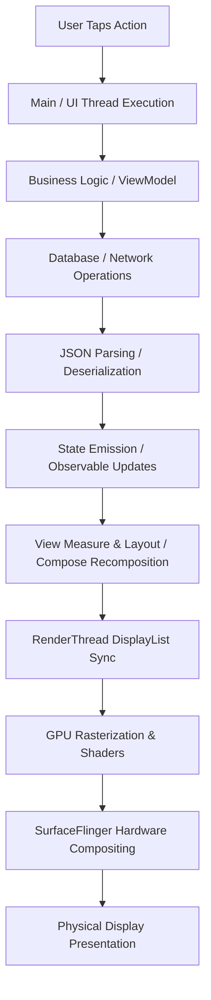
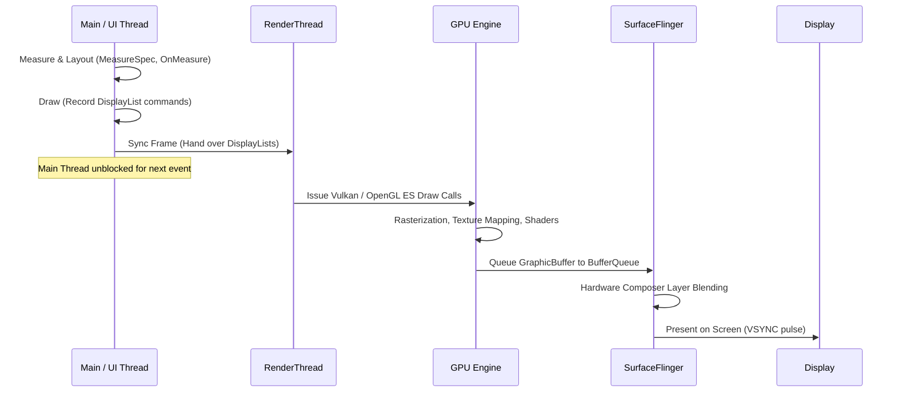
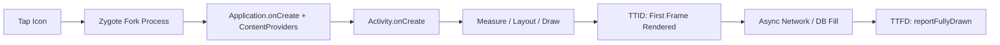
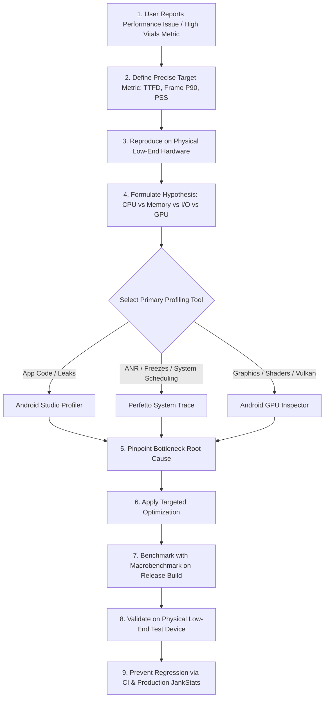

# ⚡ Android Performance on Low-End Devices
## 10-Year-Level Interview & Engineering Documentation

> **Authoritative Technical Reference**  
> Written for Staff / Principal Android Engineers and candidates preparing for 10-year-level Android engineering interviews.  
> Covers low-end hardware constraints, the full Android performance model, memory management, CPU/GPU profiling, ART GC internals, **Android Studio Profiler**, **Perfetto**, **Android GPU Inspector (AGI)**, and a **25-question senior interview question bank with scenarios**.

---

## 📑 Table of Contents

| # | Section | Key Topics |
|---|---|---|
| 1 | [What "Low-End Device" Actually Means](#1-what-low-end-android-device-actually-means) | RAM, CPU, GPU, storage, thermal, resource pipeline |
| 2 | [Application Performance Model](#2-the-android-application-performance-model) | App layer, framework layer, hardware layer, mental model |
| 3 | [Main Android Performance Areas](#3-main-android-performance-areas) | UI, CPU, memory, startup, I/O, network, battery, app size |
| 4 | [RAM-Constrained Devices & LMKD](#4-ram-constrained-android-devices--lmkd) | Memory pressure, `oom_score_adj`, LMKD mechanics, Perfetto signals |
| 5 | [Types of Memory on Android](#5-types-of-memory-an-android-engineer-must-understand) | Java heap, native heap, graphics, mapped files, PSS vs RSS vs USS |
| 6 | [Java/Kotlin Heap & Allocations](#6-javakotlin-heap) | Object allocations, collections, temporary objects in hot paths |
| 7 | [Object Allocation & ART GC Internals](#7-object-allocation-and-gc) | Concurrent Copying GC, read barriers, generational collection, compaction |
| 8 | [Memory Leaks & Diagnostics](#8-memory-leaks) | GC roots, reachability, common leak vectors, LeakCanary internals |
| 9 | [Bitmap Memory Management](#9-bitmap-memory) | ARGB_8888 calculation, downsampling, hardware bitmaps, Glide/Coil |
| 10 | [CPU-Constrained Devices](#10-cpu-constrained-devices) | Heavy workloads, thread offloading, JSON/crypto/ML bottlenecks |
| 11 | [Main / UI Thread](#11-main-thread) | Event loop, Choreographer, VSYNC, frame dispatching |
| 12 | [Application Not Responding (ANR)](#12-anr-application-not-responding) | 5s/10s/20s thresholds, root causes, reading `/data/anr/` traces |
| 13 | [UI Rendering Pipeline](#13-ui-rendering) | Measure → Layout → Draw → RenderThread → GPU → SurfaceFlinger |
| 14 | [Frame Budget & Refresh Rates](#14-frame-budget) | 60Hz (16.6ms), 90Hz (11.1ms), 120Hz (8.3ms), slow vs frozen frames |
| 15 | [What is Jank?](#15-what-is-jank) | Dropped VSYNC pulses, JankStats, irregular frame delivery |
| 16 | [Weak GPUs & Graphics Bottlenecks](#16-weak-gpu) | Fill rate, shader throughput, texture bandwidth, compositing |
| 17 | [CPU-Bound vs. GPU-Bound](#17-cpu-bound-vs-gpu-bound) | Diagnostic differences, identifying the limiting factor |
| 18 | [Overdraw](#18-overdraw) | Pixel re-draw cost, Debug GPU Overdraw visualizer, eliminating window backgrounds |
| 19 | [Hardware Acceleration](#19-hardware-acceleration) | 2D rendering pipeline, DisplayLists, RenderNode, limitations |
| 20 | [RecyclerView Performance](#20-recyclerview-performance) | ViewHolder reuse, DiffUtil, ListAdapter, avoiding bind calculations |
| 21 | [Jetpack Compose Performance](#21-jetpack-compose-performance) | Recomposition skipping, `@Stable`/`@Immutable`, state placement |
| 22 | [Compose Recomposition Internals](#22-compose-recomposition) | Scope invalidation, smart skipping, evaluating recomposition cost |
| 23 | [LazyColumn vs. Column](#23-lazycolumn-vs-column) | Eager instantiation vs. viewport virtualization |
| 24 | [Application Startup Architecture](#24-android-application-startup) | Cold, warm, and hot starts; Zygote fork; TTID vs TTFD |
| 25 | [Startup Optimization Strategies](#25-startup-optimization) | Deferral, lazy initialization, App Startup library |
| 26 | [Dependency Injection & Performance](#26-dependency-injection-and-performance) | Graph resolution costs, Hilt/Koin startup trade-offs, lazy injection |
| 27 | [Database Performance (Room / SQLite)](#27-database-performance) | Missing indexes, `SELECT *`, N+1 queries, Paging 3 integration |
| 28 | [Network Performance on Weak Networks](#28-network-performance) | Payload sizing, HTTP/2 connection pooling, gzip/brotli, caching |
| 29 | [Background Work & Thread Management](#29-background-work) | WorkManager vs Coroutines vs Services, thread explosion risks |
| 30 | [Thread Contention & Synchronization](#30-thread-contention) | Lock contention, priority inversion, thread scheduling states |
| 31 | [Binder Calls & IPC Overhead](#31-binder-calls) | Synchronous Binder latency, caching system service lookups |
| 32 | [Android Studio Profiler Overview](#32-android-studio-profiler) | CPU, Memory, Network, Energy profiling capabilities |
| 33 | [When to Use Android Studio Profiler](#33-when-should-i-use-android-studio-profiler) | Application-level diagnostic workflows and triggers |
| 34 | [Studio Memory Profiler Deep Dive](#34-android-studio-memory-profiler) | Allocations, retained vs shallow size, heap dump analysis |
| 35 | [Memory Investigation Methodology](#35-important-memory-investigation-distinction) | The 5-step leak verification procedure |
| 36 | [Studio CPU Profiler Deep Dive](#36-cpu-profiler) | Hotspot detection, thread execution breakdown |
| 37 | [Sampling vs. Instrumentation](#37-sampling-vs-instrumentation) | Statistical sampling vs method tracing, overhead trade-offs |
| 38 | [Perfetto: System-Wide Tracing](#38-perfetto) | `ftrace`, `atrace`, `heapprofd`, kernel scheduler events |
| 39 | [Studio Profiler vs. Perfetto](#39-android-studio-profiler-vs-perfetto) | Comprehensive comparison matrix: application vs system level |
| 40 | [Perfetto Real-World Investigation](#40-perfetto-example) | Tracing a 500ms freeze through MainThread, Binder, and RenderThread |
| 41 | [Custom Trace Events](#41-perfetto-custom-trace-events) | `androidx.tracing.trace`, named slices in system traces |
| 42 | [PerfettoSQL](#42-perfetto-sql) | Querying slices, threads, and Binder latency via SQL |
| 43 | [Android GPU Inspector (AGI)](#43-gpu-inspector--agi) | GPU hardware counters, Vulkan/OpenGL ES frame analysis |
| 44 | [When to Use GPU Inspector](#44-when-should-i-use-gpu-inspector) | 3D rendering, shader bottlenecks, graphics frame analysis |
| 45 | [Perfetto vs. GPU Inspector](#45-perfetto-vs-gpu-inspector) | Diagnostic comparison matrix for system vs graphics issues |
| 46 | [Complete Debugging Workflow](#46-the-complete-performance-debugging-workflow) | Senior engineer 9-step hypothesis-driven triage flowchart |
| 47 | [Hypothesis-Driven Profiling](#47-dont-profile-randomly) | Formulating problem statements vs blind tool usage |
| 48 | [Essential Performance Metrics Reference](#48-performance-metrics-you-should-know) | Startup, UI, memory, CPU, GPU, network, battery KPIs |
| 49 | [Low-End Device Optimization Checklist](#49-low-end-device-optimization-checklist) | Comprehensive audit checklist across all 6 core sub-systems |
| 50 | [Architectural Principles for Performance](#50-the-most-important-architectural-principle) | Unidirectional data flow, clean caching tiers, pagination |
| 51 | [The Senior Definition of Performance](#51-performance-is-not-just-making-code-faster) | Correctness + Responsiveness + Memory + Battery + Scalability |
| 52 | [10-Year-Level Interview Questions (25 Q&As)](#52-10-year-level-android-interview-questions) | In-depth answers with follow-ups for staff/principal roles |
| 53 | [Senior Scenario Questions](#53-senior-level-scenario-questions) | 4 Real-world production crisis investigations |
| 54 | [Practical Tool-Selection Cheat Sheet](#54-a-practical-tool-selection-cheat-sheet) | Symptom → Start With → Deep Investigation matrix |
| 55 | [The 9-Step Performance Resolution Framework](#55-the-interview-answer-framework-to-memorize) | Structured interview answering template |
| 56 | [Final Mental Model & Reference Architecture](#56-final-mental-model) | Holistic Android system diagram and tooling alignment |

---

# 1. What "Low-End Android Device" Actually Means

A low-end device is never constrained along a single dimension. It suffers from a **compound resource deficit** across hardware and software subsystems:

| Resource Subsystem | Hardware / OS Constraint | Real-World Failure Mode |
|---|---|---|
| **RAM** | 1 GB – 3 GB total physical RAM; 128 MB – 192 MB Dalvik/ART heap limit | Rapid LMK kills in background; high GC frequency; OOM on decoding camera photos |
| **CPU** | 4–8 low-frequency Cortex-A53 / Cortex-A55 cores; slow single-core IPC | Long main-thread stalls during JSON parsing, layout measurement, and dependency injection |
| **GPU** | Outdated Mali / Adreno GPUs with low fragment/vertex throughput and fill-rate limits | Dropped frames on complex shaders, rounded corners, multiple translucent layers, and overdraw |
| **Storage (eMMC)** | High-latency, low IOPS sequential and random flash storage | Main-thread disk reads block SQLite and `SharedPreferences`, causing multi-second freezes |
| **Network Modems** | 3G / 4G Cat-4 with poor antenna diversity, packet drops, high RTT | API timeouts, connection renegotiation churn, battery-draining radio wakeups |
| **Battery & Power** | Sub-3000 mAh batteries with aggressive OEM power-management daemons | WorkManager jobs delayed; background sync killed; aggressive process freezing |
| **Display** | 60 Hz LCD with high response time; irregular VSYNC clocking | Visible ghosting; missed 16.6ms deadlines; severe jank perception |
| **OS Version** | Android 9 (API 28) – Android 11 (API 30) Go Edition | Missing modern platform optimizations (e.g. ART modern CC GC improvements, modern memory compaction) |
| **Thermal Budget** | Passive plastic chassis without vapor chambers; rapid thermal saturation | Thermal throttling slashes CPU/GPU frequencies by 40–60% within 2 minutes of sustained load |



> [!IMPORTANT]
> **Core Principle:** Never optimize for RAM in isolation. A naive cache reduction to save 15 MB of RAM can spike disk I/O by 400%, creating severe main-thread ANR risk on slow eMMC storage. Optimize the complete resource pipeline.

---

# 2. The Android Application Performance Model

A senior engineer visualizes the system as three interconnected tiers:

```
┌─────────────────────────────────────────────────────────────────┐
│                       ANDROID APPLICATION                       │
│  ┌──────────────────────┬─────────────────┬──────────────────┐  │
│  │        MEMORY        │       CPU       │       GPU        │  │
│  │  • Java/Kotlin Heap  │  • Main Thread  │  • RenderThread  │  │
│  │  • Native Heap       │  • Workers      │  • Bitmaps       │  │
│  │  • Graphic Buffers   │  • Schedulers   │  • Textures      │  │
│  │  • Allocations & GC  │  • JIT / AOT    │  • Shaders       │  │
│  └──────────────────────┴─────────────────┴──────────────────┘  │
└────────────────────────────────┬────────────────────────────────┘
                                 │ System Calls / IPC / Hardware Buffers
┌────────────────────────────────┴────────────────────────────────┐
│                        ANDROID FRAMEWORK                        │
│  ┌──────────────────────┬─────────────────┬──────────────────┐  │
│  │    BINDER DRIVER     │ SURFACEFLINGER  │  LINUX KERNEL    │  │
│  │  • IPC Transactions  │ • Layer Buffers │  • CFS Scheduler │  │
│  │  • System Services   │ • HWC (Overlay) │  • LMKD Daemon   │  │
│  │  • Lock Contention   │ • VSYNC Pacing  │  • cgroups / oom │  │
│  └──────────────────────┴─────────────────┴──────────────────┘  │
└────────────────────────────────┬────────────────────────────────┘
                                 │ Hardware Control
┌────────────────────────────────┴────────────────────────────────┐
│                       DEVICE HARDWARE                           │
│     CPU Cores (Big/LITTLE)  │  GPU Engine  │  LPDDR RAM  │  eMMC Flash │
└─────────────────────────────────────────────────────────────────┘
```

> [!TIP]
> **Senior Interview Framing:** When an interviewer asks *"Why is this screen slow?"*, never answer with a single culprit. State:  
> *"I identify whether the limiting constraint is CPU saturation, main-thread scheduling stalls, memory pressure triggering GC/LMKD, GPU fill-rate limits, synchronous Binder IPC, or flash storage I/O, then select the appropriate profiling tool."*

---

# 3. Main Android Performance Areas

| Performance Area | Critical Execution Factors | Primary Risk on Low-End Devices |
|---|---|---|
| **3.1 UI Rendering** | Measure/Layout passes, View hierarchy depth, Compose recomposition scopes, RenderThread sync, frame pacing. | Dropped VSYNC pulses, visual jank, layout thrashing. |
| **3.2 CPU Utilization** | Main-thread work, thread synchronization, thread pool explosion, JSON deserialization, cryptographic hashing. | Core saturation on slow Cortex-A53 cores, UI freezes. |
| **3.3 Memory Footprint** | Java/Kotlin heap, native memory, GraphicBuffers, object allocation churn, reference cycles. | ART GC pauses, Low Memory Killer (LMKD) process death. |
| **3.4 Application Startup** | `Application.onCreate`, ContentProvider initialization, DI graph assembly, early I/O, TTID vs TTFD. | Cold start exceeding 5s Play Vitals "bad behavior" threshold. |
| **3.5 Storage I/O** | SQLite queries, DataStore file operations, log flushing, asset extraction. | High eMMC wait times blocking main thread; SQLite lock contention. |
| **3.6 Network Efficiency** | Payload size, TLS handshakes, HTTP/2 multiplexing, connection reuse, cache-control. | High radio active-time draining battery; thread starvation. |
| **3.7 Battery & Power** | Partial wake locks, GPS location polling, un-batched network transfers, background sync. | Device overheating, thermal throttling, aggressive OS killing. |
| **3.8 App Binary Size** | DEX method counts, uncompressed assets, ABI-specific `.so` libraries, resource duplication. | Play Store download abandonment; storage eviction by user. |

---

# 4. RAM-Constrained Android Devices & LMKD

### What Happens When RAM is Depleted?

Consider a budget Android device with **2 GB physical RAM**:
* **Kernel & Hardware Reservations (Baseband, GPU):** ~700 MB
* **Android OS & System Services (`system_server`, SystemUI):** ~800 MB
* **Cached Background Apps:** ~300 MB
* **Available for Your App:** **~200 MB**

Your application cannot expand memory indefinitely. When available RAM drops below system watermarks, the kernel **Low Memory Killer Daemon (LMKD)** terminates processes based on their `oom_score_adj`.

### Process Priority & `oom_score_adj` Scale

| Process Priority Category | `oom_score_adj` Range | Meaning & LMKD Behavior |
|---|---|---|
| **System Process** | `-1000` | Native OS / `system_server`. Never killed. |
| **Persistent Service** | `-800` to `-700` | Critical system services (telephony, Bluetooth). |
| **Foreground App** | `0` | The app currently in the user's active window. Killed only as an absolute last resort. |
| **Perceptible Process** | `100` – `200` | App hosting a Foreground Service (music playback) or overlay dialog. |
| **Service Process** | `500` | Background services (background sync, data processing). |
| **Cached / Empty Process** | `900` – `1000` | Apps in the recent apps backstack. Killed immediately under memory pressure. |

```bash
# Check your app's live oom_score_adj on device
adb shell cat /proc/$(adb shell pidof com.example.app)/oom_score_adj
```

---

# 5. Types of Memory an Android Engineer Must Understand

```
PROCESS PHYSICAL MEMORY (PSS)
├── Java / Kotlin Heap     --> Managed by ART GC (Objects, Collections, View models)
├── Native Heap (malloc)   --> C/C++ memory (Skia fonts, WebRTC, SQLite native buffers)
├── Graphics / GPU Memory  --> GraphicBuffers, EGL surfaces, Hardware Bitmaps (since API 26+)
├── File-Backed Pages      --> APK DEX code, mmap'd assets, shared libraries (.so)
└── Anonymous Pages (dirty)--> App-allocated pages modified in RAM (cannot be dropped without swap/zRAM)
```

### Memory Metrics Compared

* **VSS (Virtual Set Size):** Total virtual address space accessed by the process (includes unallocated pages; irrelevant for optimization).
* **RSS (Resident Set Size):** Total physical RAM pages in use (includes shared library pages loaded by multiple processes, distorting true usage).
* **PSS (Proportional Set Size):** Physical RAM used solely by the app **plus** its fractional share of shared libraries. **This is the primary metric used by Android OS and LMKD.**
* **USS (Unique Set Size):** Physical RAM used exclusively by your app. This is the exact amount of RAM returned to the system if your app is terminated.

---

# 6. Java/Kotlin Heap

The Java/Kotlin heap stores all object allocations:
```kotlin
val users = mutableListOf<User>()
val bitmap = BitmapFactory.decodeResource(resources, R.drawable.banner)
```

On a low-end device with a 128 MB heap limit (`getMemoryClass()`), holding 10,000 un-paginated database entities in memory along with decoded Bitmaps can push the heap directly into `java.lang.OutOfMemoryError`.

---

# 7. Object Allocation and GC

### The High-Frequency Allocation Danger
```kotlin
// HIGH GC PRESSURE ANTI-PATTERN: Allocating in tight loops or onDraw()
override fun onDraw(canvas: Canvas) {
    super.onDraw(canvas)
    val paint = Paint() // CRITICAL: Allocates 60 times/second during animation
    val rect = RectF(0f, 0f, width.toFloat(), height.toFloat())
    canvas.drawRoundRect(rect, 16f, 16f, paint)
}
```

### Modern ART GC Internals: Concurrent Copying (CC)
ART uses a **Concurrent Copying (CC) Collector**:
1. **Generational Collection:** Divides heap into young (nursery) and old generations. Minor GCs collect young allocations rapidly using bump-pointer allocation.
2. **Concurrent Phase with Read Barriers:** ART moves live objects concurrently while the app executes. A hardware/software **read barrier** intercepts pointer reads: if an object has moved, the read barrier returns the forwarding address without pausing app threads.
3. **Heap Compaction:** Eliminates memory fragmentation by compacting live objects into contiguous blocks.

> [!WARNING]
> While ART CC GC minimizes stop-the-world pauses, high allocation rates still induce CPU overhead through read barriers, cache misses, and eventual blocking allocation pauses when the nursery fills faster than GC can collect.

---

# 8. Memory Leaks

A memory leak occurs when an object is **logically dead** (no longer needed by the app) but remains **physically reachable** from a Garbage Collection Root (**GC Root**).

```
[GC Root: Static Field / Thread Stack / Native Global]
                      │ (strong reference)
                      ▼
            [Singleton / Worker]
                      │ (strong reference)
                      ▼
             [Listener / Callback]
                      │ (implicit outer reference)
                      ▼
              [Leaked Activity]
                      │
            ┌─────────┴─────────┐
            ▼                   ▼
    [View Hierarchy]      [Bitmaps / Context] (Multi-Megabyte Retained Size)
```

### Classic Leak Vectors on Android:
1. **Static Fields holding Context:** `companion object { lateinit var context: Context }`.
2. **Unregistered Listeners / BroadcastReceivers:** Failing to unregister in `onStop()` / `onDestroy()`.
3. **Non-Static Inner Classes & Handlers:** Implicit reference from `Handler` message queue entries.
4. **Un-cancelled Coroutine Scopes:** Launching in `GlobalScope` instead of `lifecycleScope` / `viewModelScope`.
5. **Fragment ViewBinding:** Forgetting to null out `_binding` in `onDestroyView()`.

### How LeakCanary Works Under the Hood
1. Observes `Activity.onDestroy()` and `Fragment.onDestroyView()` via `Application.ActivityLifecycleCallbacks`.
2. Passes the destroyed instance to an `ObjectWatcher` wrapped in a `WeakReference` keyed with a `ReferenceQueue`.
3. Waits **5 seconds** and triggers an explicit GC pass.
4. If the `WeakReference` has not cleared, the object is marked retained.
5. Dumps the heap (`.hprof`), parses the object graph using Shark, and calculates the **shortest strong reference path from a GC root** to the leaked target.

---

# 9. Bitmap Memory

Uncompressed memory calculation for an image in Android:
$$\text{Memory (bytes)} = \text{Width} \times \text{Height} \times \text{Bytes Per Pixel}$$

For a standard 12 MP camera photo ($4000 \times 3000$) in `ARGB_8888` (4 bytes per pixel):
$$4000 \times 3000 \times 4 = 48,000,000\text{ bytes} \approx 45.77\text{ MiB}$$

Loading just three such images concurrently will exhaust the entire heap of a 128 MB low-end device.

### Production Bitmap Optimization
```kotlin
// Production downsampling using BitmapFactory.Options
fun decodeSampledBitmapFromResource(
    res: Resources, 
    resId: Int, 
    reqWidth: Int, 
    reqHeight: Int
): Bitmap {
    return BitmapFactory.Options().run {
        inJustDecodeBounds = true
        BitmapFactory.decodeResource(res, resId, this)

        // Calculate raw inSampleSize ratio (powers of 2: 1, 2, 4, 8...)
        inSampleSize = calculateInSampleSize(this, reqWidth, reqHeight)
        
        // Decode with inPreferredConfig = HARDWARE (stored directly in GraphicBuffer)
        inJustDecodeBounds = false
        inPreferredConfig = if (Build.VERSION.SDK_INT >= Build.VERSION_CODES.O) {
            Bitmap.Config.HARDWARE
        } else {
            Bitmap.Config.RGB_565
        }
        BitmapFactory.decodeResource(res, resId, this)
    }
}
```

---

# 10. CPU-Constrained Devices

On low-tier devices with 4x Cortex-A53 cores clocked at 1.4 GHz, heavy workloads take 4–6x longer than on flagship chipsets.

### Typical CPU Bottlenecks:
* Reflection-heavy JSON serialization (Gson, Jackson) vs code-generated serialization (Moshi KSP, kotlinx.serialization).
* In-app cryptographic key generation and AES encryption.
* High-frequency regex parsing on large text strings.
* Database sorting of thousands of un-indexed rows.
* Un-throttled sensor reading transformations.

---

# 11. Main Thread

The Android Main Thread (UI Thread) executes an infinite loop driven by `Looper.loop()`:
```
MessageQueue ──> Looper.loop() ──> Handler.dispatchMessage() ──> Choreographer VSYNC ──> Measure/Layout/Draw
```

If any single message takes more than **16.6ms** (at 60Hz), the Choreographer drops the frame. If it takes more than **5 seconds** during an input event, the system triggers an ANR.

---

# 12. ANR (Application Not Responding)

### Strict ANR Thresholds by Component:
* **Input Dispatching Timeout:** User event (touch, key) not handled within **5 seconds**.
* **BroadcastReceiver Timeout:** `onReceive()` execution exceeds **10 seconds** (foreground) or **60 seconds** (background).
* **Service Execution Timeout:** `onCreate()` / `onStartCommand()` exceeds **20 seconds** (foreground) or **200 seconds** (background).
* **ContentProvider Timeout:** Query does not complete within **10 seconds**.

### Root Causes & Diagnosis
When an ANR occurs, the OS freezes the process and writes all thread traces to `/data/anr/traces.txt`.
```bash
# Pull the latest ANR trace
adb pull /data/anr/traces.txt .
```
Common stack trace patterns:
1. `state=BLOCKED held by thread 14`: Lock contention.
2. `state=WAITING in BinderProxy.transact`: Blocking synchronous IPC call to another process or service.
3. `state=RUNNABLE in android.database.sqlite`: Synchronous disk query running on the main thread.

---

# 13. UI Rendering



---

# 14. Frame Budget

Displays refresh at fixed intervals driven by hardware VSYNC pulses:
* **60 Hz Display:** $\frac{1000\text{ ms}}{60} \approx \mathbf{16.67\text{ ms}}$ per frame
* **90 Hz Display:** $\frac{1000\text{ ms}}{90} \approx \mathbf{11.11\text{ ms}}$ per frame
* **120 Hz Display:** $\frac{1000\text{ ms}}{120} \approx \mathbf{8.33\text{ ms}}$ per frame

### Android Vitals Classifications:
* **Slow Frame:** Any frame taking $> 16.6\text{ ms}$ on a 60 Hz display.
* **Frozen Frame:** Any frame taking $> 700\text{ ms}$ (causes visible app lockup).
* **ANR:** Unresponsive to input for $> 5000\text{ ms}$.

---

# 15. What is Jank?

Jank is visible stutter caused by missed frame deadlines:
```
Expected:   |── 16.6ms ──|── 16.6ms ──|── 16.6ms ──|── 16.6ms ──|
Actual:     |── 16.6ms ──|─────── 48.0ms ───────|── 16.6ms ──|
                               (2 Dropped Frames)
```

### Tracking Jank with `JankStats`
```kotlin
// Production Jank tracking with context attribution
val jankStats = JankStats.createAndTrack(window) { frameData ->
    if (frameData.isJank) {
        val durationNs = frameData.frameDurationUiNanos
        Log.w("Performance", "Jank detected (${durationNs / 1_000_000}ms): ${frameData.states}")
    }
}
// Attach UI screen state to correlate jank with specific features
PerformanceMetricsState.getHolderForHierarchy(rootView).state?.putState("Screen", "FeedList")
```

---

# 16. Weak GPU

Low-end GPUs suffer from:
1. **Low Fill-Rate:** Number of pixels the GPU can write to frame buffers per second.
2. **Small Tile Buffers:** Mobile GPUs use Tile-Based Deferred Rendering (TBDR). Excessive draw calls cause tile buffer overflow and memory spilling.
3. **Expensive Alpha Blending:** Drawing overlapping translucent views forces the GPU to read existing pixels, blend with new pixels, and write back (read-modify-write).

---

# 17. CPU-Bound vs. GPU-Bound

| Characteristic | CPU-Bound Pipeline | GPU-Bound Pipeline |
|---|---|---|
| **Primary Symptom** | Main Thread or RenderThread takes $>16\text{ ms}$; GPU idle time is high. | Main Thread finishes DisplayLists fast ($<5\text{ ms}$); RenderThread stalls waiting for GPU fence. |
| **Typical Causes** | Deep View hierarchies, complex layouts, JSON parsing, GC pauses. | Large uncompressed textures, full-screen overdraw, complex custom shaders, box blurs. |
| **Verification Tool** | **Perfetto / Android Studio CPU Profiler** | **Android GPU Inspector (AGI) / Systrace GPU Counter** |
| **Resolution** | Flatten layouts, offload threads, avoid allocations in `onDraw`. | Remove redundant backgrounds, downscale textures, disable hardware layers. |

---

# 18. Overdraw

Overdraw occurs when the GPU paints the same physical screen pixel multiple times within a single frame.

```
[Window Background] (Drawn 1x)
       ▼
 [CardView Background] (Drawn 2x)
       ▼
  [Item Container Layout] (Drawn 3x)
       ▼
   [ImageView / Text] (Drawn 4x -> Severe Overdraw)
```

### Eliminating Overdraw
1. Remove redundant window backgrounds in themes:
```xml
<!-- In res/values/styles.xml -->
<style name="AppTheme" parent="Theme.Material3.DayNight.NoActionBar">
    <item name="android:windowBackground">@null</item>
</style>
```
2. Enable **Debug GPU Overdraw** in Developer Options:
   * **True Color:** 0x overdraw (no extra cost).
   * **Blue:** 1x overdraw (acceptable).
   * **Green:** 2x overdraw.
   * **Light Red:** 3x overdraw (problematic).
   * **Dark Red:** 4x+ overdraw (severe fill-rate bottleneck).

---

# 19. Hardware Acceleration

Since Android 3.0, 2D rendering is hardware-accelerated by default.
* The CPU records drawing commands into **DisplayLists**.
* The **RenderThread** translates DisplayLists into Vulkan / OpenGL ES commands.
* The **GPU** renders them to hardware surfaces.

*Caveat:* Certain Canvas operations (e.g. `canvas.clipPath(path)` without antialiasing flags, or software-only color filters) drop out of hardware acceleration and force software fallback to CPU Skia rendering, causing massive frame spikes.

---

# 20. RecyclerView Performance

A poorly tuned `RecyclerView` is the #1 cause of scrolling jank on low-end hardware.

### High-Performance RecyclerView Rules:
1. **Never allocate inside `onBindViewHolder()`:** Avoid creating `OnClickListener`, formatting dates, or instantiating objects during bind.
2. **Pre-compute Text Layouts:** Use `PrecomputedTextCompat` for long text paragraphs.
3. **Set `setHasFixedSize(true)`:** If adapter contents do not alter RecyclerView dimensions, skips full hierarchy re-layout.
4. **Use Shared ViewPool:** For nested horizontal carousels inside vertical lists, share a single `RecyclerView.RecycledViewPool`.
5. **Use `DiffUtil` with `ListAdapter`:** Computes minimal diffs on a background thread (`AsyncListDiffer`).

```kotlin
class OptimizedAdapter : ListAdapter<FeedItem, OptimizedViewHolder>(DIFF_CALLBACK) {
    override fun onCreateViewHolder(parent: ViewGroup, viewType: Int): OptimizedViewHolder {
        val view = LayoutInflater.from(parent.context).inflate(R.layout.item_feed, parent, false)
        return OptimizedViewHolder(view).apply {
            // Attach single click listener once during creation, NOT during bind
            itemView.setOnClickListener { 
                val pos = bindingAdapterPosition
                if (pos != RecyclerView.NO_POSITION) onItemClick(getItem(pos))
            }
        }
    }

    override fun onBindViewHolder(holder: OptimizedViewHolder, position: Int) {
        val item = getItem(position)
        holder.titleView.text = item.title // Minimal field assignment
    }
}
```

---

# 21. Jetpack Compose Performance

In Compose, poor state management leads to unnecessary recompositions that crush weak CPUs.

### Key Rules for Low-End Device Compose Performance:
1. **Model Stability:** Ensure data classes are marked `@Immutable` or use `@Stable` interfaces. Unstable types (e.g. `List<T>`, untagged third-party models) force Compose to re-run composables even if values have not changed.
2. **Defer State Reads to Layout/Draw:** Read changing state (e.g., scroll offset) inside lambda modifiers:
```kotlin
// BAD: Recomposes the entire composable on every 1-pixel scroll
Modifier.offset(y = scrollState.value.dp)

// GOOD: Bypasses recomposition completely; executes directly in layout phase
Modifier.offset { IntOffset(x = 0, y = scrollState.value) }
```
3. **Use `derivedStateOf`:** Buffer high-frequency state updates (e.g., `lazyListState.firstVisibleItemIndex > 0`).

---

# 22. Compose Recomposition

Recomposition is not inherently broken; **expensive work inside recomposition is**.
* **Smart Skipping:** The Compose compiler skips executing a Composable function if all its input arguments have not changed according to `equals()`.
* **Stability Invalidation:** If a single parameter is considered unstable by the compiler, smart skipping is disabled for that entire Composable subtree.

---

# 23. LazyColumn vs. Column

* **`Column`:** Instantiates and measures **100%** of children immediately. Rendering 200 items in a `Column` allocates all 200 views/composables simultaneously, triggering immediate OOM or multi-second freezing.
* **`LazyColumn`:** Instantiates and composes **only visible items** plus a small prefetch window.
* **Always provide stable keys:**
```kotlin
LazyColumn {
    items(
        items = users,
        key = { user -> user.id } // CRITICAL: Prevents state loss and full list recreation on updates
    ) { user ->
        UserItem(user)
    }
}
```

---

# 24. Android Application Startup



* **Cold Start:** Process does not exist. Zygote forks, classloaders load DEX code, `Application` creates, Activity creates. (Target: $<1.5\text{s}$; Alert: $>5\text{s}$).
* **Warm Start:** Process is alive in memory; Activity was destroyed and is recreated.
* **Hot Start:** Process and Activity exist in background; brought directly to foreground (fastest).

---

# 25. Startup Optimization

1. **Defer SDK Initialization:** Remove auto-initializing `ContentProvider`s using `tools:node="remove"`.
2. **Use App Startup (`androidx.startup`):** Consolidate multiple library initializers into a single `ContentProvider` to reduce IPC and provider instantiation overhead.
3. **Adopt Baseline Profiles:** Pre-compile startup execution paths at install time via AOT (Ahead-of-Time compilation), cutting cold startup time by **20–40%** on low-end devices.

---

# 26. Dependency Injection and Performance

DI frameworks do not execute for free:
* **Hilt / Dagger:** Generates compile-time factories. Zero reflection runtime cost. However, **eager dependency graphs** assembled in `Application.onCreate()` force immediate instantiation of Network clients, Room databases, and repositories.
* **Fix: Lazy Injection:**
```kotlin
@Inject lateinit var analyticsClient: Lazy<AnalyticsClient>

fun onUserAction() {
    // Instantiated only on first access, NOT during app cold startup
    analyticsClient.get().trackEvent("click")
}
```

---

# 27. Database Performance

### High-Impact Room Optimizations:
1. **Always Index Query Filters:** Un-indexed columns force SQLite into full table scans on slow flash storage.
```kotlin
@Entity(tableName = "users", indices = [Index(value = ["email"], unique = true)])
data class UserEntity(@PrimaryKey val id: Long, val email: String)
```
2. **Never Query with `SELECT *`:** Only query required columns. Projecting 30 unused text columns wastes native SQLite memory and cursor transfer time.
3. **Use Paging 3:** Stream database rows directly to UI via `PagingSource` without loading the full table into memory.

---

# 28. Network Performance on Weak Networks

1. **Gzip / Brotli Payload Compression:** Reduces payload size by up to 70%.
2. **HTTP/2 Connection Pooling:** Eliminates repeated 3-way TCP and TLS handshakes.
3. **Proactive Pagination:** Request small page sizes ($15–20$ items) to keep JSON parsing under 5ms on slow CPUs.

---

# 29. Background Work

* **Never spawn raw threads unboundedly:** `repeat(100) { thread { ... } }` triggers kernel thread explosion, thrashing the Linux CFS scheduler.
* **Use Structured Concurrency:**
```kotlin
// Bound background work to IO dispatcher pool (capped at 64 threads or core count)
withContext(Dispatchers.IO) {
    processData()
}
```
* **Use WorkManager for Persistent Jobs:** Guarantees execution with OS battery constraints (e.g. `setRequiresBatteryNotLow(true)`).

---

# 30. Thread Contention

When multiple threads contend for the same synchronization lock, higher-priority threads stall behind lower-priority threads (**Priority Inversion**).
* **Identification:** Perfetto shows the Main Thread in `Blocked` state (`Waiting on mutex`).
* **Fix:** Replace coarse-grained `@Synchronized` methods with lock-free structures (`AtomicReference`, Kotlin `Mutex`) or isolate data mutations onto a single dedicated coroutine dispatcher.

---

# 31. Binder Calls

Binder is Android's synchronous Inter-Process Communication (IPC) mechanism.
* Framework calls like `telephonyManager.getNetworkType()` or `packageManager.getApplicationInfo()` make synchronous Binder calls to `system_server`.
* If `system_server` is experiencing lock contention, your Main Thread will lock up, leading directly to an ANR.
* **Rule:** Never execute Binder transactions inside scroll listeners or animation frames. Cache results locally.

---

# 32. Android Studio Profiler

Android Studio Profiler provides real-time, application-level monitoring:
* **CPU Profiler:** Identifies active threads, execution call charts, flame charts, and method traces.
* **Memory Profiler:** Tracks heap size, object counts, allocation call stacks, and captures `.hprof` heap dumps.
* **Network Profiler:** Inspects HTTP request/response payloads, headers, timings, and connection reuse.
* **Energy Profiler:** Tracks battery usage from wake locks, location sensors, and alarms.

---

# 33. When Should I Use Android Studio Profiler?

Use Studio Profiler as your **first-line diagnostic tool** to answer:
* *"Which specific Kotlin/Java method consumed 60% of CPU during screen transition?"*
* *"Is my memory footprint growing linearly over 10 consecutive screen opens?"*
* *"What is the exact HTTP payload size returned by this endpoint?"*

---

# 34. Android Studio Memory Profiler

### Diagnosing Memory Retention:
1. Open the target screen, perform actions, and close it.
2. Click **Initiate GC** (trash can icon) to force an ART collection pass.
3. Capture a **Heap Dump**.
4. In the Class List, filter by your app's package name and sort by **Retained Size**.
5. Inspect the **Reference Tree** for retained `Activity` or `Fragment` instances. Identify the GC root holding the reference.

---

# 35. Important Memory Investigation Distinction

> [!CAUTION]
> **Do not mistake allocation spikes for leaks.**  
> A memory spike during image processing is completely normal if reclaimed by the subsequent GC pass. A memory leak is verified **only if retained memory continues to climb monotonically after forced GC across repeated lifecycle operations**.

### The 5-Step Leak Verification Protocol:
1. Open Screen $\to$ Measure baseline memory.
2. Perform user action 5 times $\to$ Close Screen.
3. Force ART Garbage Collection.
4. If retained memory $> \text{baseline} + \text{threshold}$, dump heap (`.hprof`).
5. Verify if destroyed `Activity` or `View` instances are retained by a GC Root.

---

# 36. CPU Profiler

### Visualizing Execution:
* **Flame Chart:** Aggregates identical call stacks to instantly reveal which leaf function consumed the most CPU time.
* **Top Down Tree:** Displays call hierarchy starting from root callers (`main()`, `Looper.loop()`).
* **Bottom Up Tree:** Displays list of functions that consumed the most time directly, sorted by self-time.

---

# 37. Sampling vs. Instrumentation

| Profiling Mode | Mechanism | Advantages | Disadvantages |
|---|---|---|---|
| **Call Stack Sampling** | Periodically interrupts CPU (e.g. every 1ms) to record thread stack frames. | Low runtime overhead ($<3\%$). Does not significantly distort app timings. | May completely miss short, high-frequency method calls ($<1\text{ms}$). |
| **Trace / Instrumentation** | Hooks method entry and exit to record exact timestamps. | Records 100% of method calls and exact call counts. | Massive overhead ($200\%–500\%$). Distorts timings so severely that fast code looks slow. |

---

# 38. Perfetto

**Perfetto** is the production-grade, system-wide performance instrumentation platform for Android:
* Intercepts Linux kernel events via `ftrace` (CPU frequency, scheduling switches, disk I/O).
* Captures Android framework events via `atrace` (Choreographer VSYNC, SurfaceFlinger, WindowManager).
* Records memory allocations via `heapprofd`.
* Captures user-defined code slices via `androidx.tracing`.

```bash
# Capture a 10-second system trace with Perfetto CLI
adb shell perfetto \
  -c - --txt \
  -o /data/misc/perfetto-traces/trace.perfetto-trace <<EOF
buffers: { size_kb: 65536 }
data_sources: {
    config {
        name: "linux.ftrace"
        ftrace_config {
            ftrace_events: "sched_switch"
            ftrace_events: "power/cpu_frequency"
            ftrace_events: "binder/*"
            ftrace_events: "kmem/*"
        }
    }
}
data_sources: {
    config {
        name: "android.packages_list"
    }
}
EOF
adb pull /data/misc/perfetto-traces/trace.perfetto-trace .
```

---

# 39. Android Studio Profiler vs. Perfetto

| Dimension | Android Studio Profiler | Perfetto |
|---|---|---|
| **Scope** | Application process only | Entire Android OS + Kernel + All Processes |
| **Data Sources** | JVM bytecode, ART runtime, app network stack | Linux `ftrace`, `atrace`, SurfaceFlinger, hardware counters |
| **Scheduler Visibility** | Shows thread state as generic "Running/Blocked" | Shows exact CPU core ID, CFS scheduling latency, preemption |
| **Binder Visibility** | Limited | Complete transaction caller $\to$ callee latency breakdown |
| **Overhead** | Medium to High (especially with tracing) | Extremely low (kernel-buffered; safe for production) |
| **Best Used For** | Rapid debugging of method hotspots and memory leaks | Deep diagnosis of ANRs, dropped frames, and system contention |

---

# 40. Perfetto Real-World Investigation

**Problem:** User reports a 500ms freeze when scrolling a feed on a budget device.

### Investigation Steps in [ui.perfetto.dev](https://ui.perfetto.dev):
1. Locate your app's **Main Thread** track.
2. Observe a single wide slice spanning **520 ms**.
3. Zoom into the slice:
   * Thread state shows `Sleeping` for 450 ms.
   * Directly beneath it is a `binder transaction` slice to `PackageManagerService`.
4. Click the Binder slice to find the target process (`system_server`).
5. In `system_server`, the corresponding Binder thread is blocked waiting for an internal lock held by an ongoing package installation.
6. **Verdict:** The app freeze was not caused by UI code or GC, but by a synchronous Binder call on the main thread during a system update.

---

# 41. Perfetto Custom Trace Events

Wrap critical execution blocks with `androidx.tracing`:
```kotlin
import androidx.tracing.trace

fun loadDashboardFeed() {
    trace("DashboardFeed.Load") {
        val rawData = trace("DashboardFeed.FetchFromDisk") { 
            database.getCachedFeed() 
        }
        trace("DashboardFeed.Transform") { 
            parseAndFilter(rawData) 
        }
    }
}
```
These slices will appear with exact nanosecond timestamps in both Android Studio Profiler and Perfetto.

---

# 42. PerfettoSQL

Perfetto traces are queryable SQLite databases. Open your trace in [ui.perfetto.dev](https://ui.perfetto.dev) and query:

```sql
-- Find the 10 longest main-thread slices in the application
SELECT 
    name, 
    dur / 1e6 AS duration_ms, 
    ts 
FROM slice 
WHERE track_id IN (
    SELECT id FROM track WHERE name = 'main'
) 
ORDER BY dur DESC 
LIMIT 10;
```

```sql
-- Identify all Binder transactions exceeding 16ms
SELECT 
    name, 
    dur / 1e6 AS duration_ms 
FROM slice 
WHERE name LIKE 'binder transaction%' AND dur > 16000000 
ORDER BY dur DESC;
```

---

# 43. GPU Inspector / AGI

**Android GPU Inspector (AGI)** provides low-level graphics profiling on supported GPUs (Qualcomm Adreno, ARM Mali, Imagination PowerVR).
* Captures complete Vulkan and OpenGL ES frame replays.
* Inspects GPU hardware performance counters:
  * **GPU % Utilization**
  * **Fragment / Vertex Shading Time**
  * **Texture Memory Read/Write Bandwidth**
  * **Non-photorealistic shader cycles**

---

# 44. When Should I Use GPU Inspector?

* 3D graphics, games, and high-performance custom Canvas/Vulkan apps.
* When Perfetto indicates the CPU is idle but frames are consistently missing deadlines at the GPU stage.
* To optimize heavy custom fragment shaders or diagnose texture cache misses.

---

# 45. Perfetto vs. GPU Inspector

| Diagnostic Capability | Perfetto | Android GPU Inspector (AGI) |
|---|---|---|
| **CPU Scheduling & Thread State** | ✅ Full visibility | ❌ Not available |
| **Binder & System IPC** | ✅ Complete traces | ❌ Not available |
| **Memory Allocation Tracking** | ✅ `heapprofd` / RSS | ❌ Not available |
| **GPU Hardware Counters (Clocks, ALU)** | ⚠️ Basic counters | ✅ Deep per-pass hardware metrics |
| **Vulkan / OpenGL API Replay** | ❌ Not supported | ✅ Frame-by-frame draw call replay |
| **Texture & Shader Inspection** | ❌ Not supported | ✅ Full shader disassemble & inspection |

---

# 46. The Complete Performance Debugging Workflow



---

# 47. Don't Profile Randomly

> [!IMPORTANT]
> **Staff Engineer Tenet:** Profiling without a hypothesis is guessing.  
> * **Bad:** *"I'll open Profiler and poke around."*  
> * **Senior:** *"Users report a 300ms scroll freeze when expanding the comment section. I hypothesize that inflating nested comment view hierarchies on the main thread is blocking Choreographer. I will run a Call Stack Sample during expansion, isolate inflation time, and measure against a pre-flattened layout."*

---

# 48. Essential Performance Metrics Reference

| Category | KPI Metric | Ideal Target | Danger Threshold | Measurement Tool |
|---|---|---|---|---|
| **Startup** | TTID (Initial Display) | $< 1000\text{ ms}$ | $> 2500\text{ ms}$ | `am start -W` |
| **Startup** | TTFD (Full Usability) | $< 1800\text{ ms}$ | $> 5000\text{ ms}$ | `reportFullyDrawn()` |
| **UI** | Frame Duration (60Hz) | $< 16.6\text{ ms}$ | $> 16.6\text{ ms}$ | `dumpsys gfxinfo` |
| **UI** | Frozen Frames ($>700\text{ms}$) | $0.0\%$ | $> 0.1\%$ | Play Console Vitals |
| **Memory** | Heap Growth across loops | Flat ($0\text{ MB}$) | Monotonic increase | Studio Memory Profiler |
| **Memory** | Total PSS Footprint | $< 120\text{ MB}$ | $> 250\text{ MB}$ | `dumpsys meminfo` |
| **System** | ANR Rate | $< 0.05\%$ | $> 0.47\%$ | Play Console Vitals |
| **App Size** | Download Size (AAB) | $< 25\text{ MB}$ | $> 50\text{ MB}$ | Play Console / `bundletool` |

---

# 49. Low-End Device Optimization Checklist

### Memory
- [ ] No `Activity` or `Context` references held in static fields or Singletons.
- [ ] Large images downsampled with `BitmapFactory.Options.inSampleSize`.
- [ ] Hardware Bitmaps (`Bitmap.Config.HARDWARE`) enabled for non-mutated images.
- [ ] Caches bound by byte size using `LruCache`, not unbounded collections.
- [ ] Fragment ViewBinding references explicitly nulled in `onDestroyView()`.
- [ ] Heap dump verified clean via LeakCanary in debug builds.

### CPU & UI
- [ ] Zero disk reads, disk writes, or database queries on the Main Thread (enforced by `StrictMode`).
- [ ] Zero synchronous Binder IPC transactions during animation or scrolling passes.
- [ ] Heavy JSON serialization migrated to code-generated parsers (Moshi / Kotlinx Serialization).
- [ ] Layout hierarchies flattened; zero deep layout nesting ($>5$ levels).
- [ ] `android:windowBackground` set to `@null` where views paint an opaque root background.
- [ ] Compose models marked with `@Immutable` or `@Stable`.
- [ ] State reads deferred to layout/draw phase using lambda modifiers.

### Database & Storage
- [ ] All database queries executing on `Dispatchers.IO`.
- [ ] Columns used in `WHERE`, `JOIN`, and `ORDER BY` covered by indices.
- [ ] Queries fetch only required columns (no `SELECT *` on wide tables).
- [ ] Large list screens powered by Paging 3.

### Startup & App Binary
- [ ] Baseline Profile generated using Macrobenchmark and packaged in release AAB.
- [ ] `Application.onCreate()` free of synchronous SDK initializations.
- [ ] Unused transitive libraries pruned; R8 full mode enabled with `shrinkResources true`.
- [ ] Images converted to WebP / AVIF format.

---

# 50. The Most Important Architectural Principle

Clean Architecture directly protects performance on resource-constrained devices:

```
UI Layer (Stateless, Disposable)
       │ Observes State
       ▼
ViewModel (State Hoisting, Survives Config Changes)
       │ Calls Use Cases
       ▼
Domain / Use Case (Pure Business Logic)
       │ Orchestrates Data
       ▼
Repository (Single Source of Truth, Caching Policy)
       ┌───────────┴───────────┐
       ▼                       ▼
Local Data Source       Remote Data Source
(Room / DataStore)      (Retrofit / OkHttp)
```

By enforcing a Repository pattern with distinct local and remote caching tiers:
* Network requests are minimized on slow modems.
* Data is fetched lazily and paged incrementally.
* Threads are strictly scoped, preventing thread contention on weak CPUs.

---

# 51. Performance is Not Just "Making Code Faster"

> [!IMPORTANT]
> **Engineering Reality:** True performance engineering is:  
> $$\mathbf{Performance} = \mathbf{Correctness} + \mathbf{Responsiveness} + \mathbf{Memory\ Efficiency} + \mathbf{Battery\ Life} + \mathbf{Observability}$$  
> An optimization that cuts CPU time by 15% but spikes memory consumption by 200 MB will cause catastrophic LMKD process kills on a 2 GB RAM phone.

---

# 52. 10-Year-Level Android Interview Questions

### Q1. How do you optimize an Android application for a device with 2 GB RAM? `[Staff]`
**Answer:**
1. **Measure First:** Audit the process memory footprint using `dumpsys meminfo` to understand the distribution between Java Heap, Native Heap, Graphics, and Code (`.so`/DEX).
2. **Eliminate Bitmap Overhead:** Ensure all images are downsampled to target view dimensions using `inSampleSize`, and use `Bitmap.Config.HARDWARE` to store pixel data directly in GPU memory.
3. **Tune Cache Limits:** Configure image and data caches dynamically based on available system memory using `ActivityManager.getMemoryClass()`.
4. **Prune Lifecycle Leaks:** Ensure no destroyed Activity, Fragment, or Context instances remain retained across configuration changes or backstack navigation.
5. **System-Level Memory Analysis:** Use Perfetto to observe LMKD kills, kernel memory pressure, and page reclaim behavior during stress scenarios.

---

### Q2. How do you definitively identify and prove a memory leak? `[Senior]`
**Answer:**
A memory increase alone does not prove a leak. To prove a leak:
1. Identify the suspicious component (e.g. `PaymentActivity`).
2. Repeat the entry and exit lifecycle 10 times (`Enter -> Exit -> Enter -> Exit`).
3. Trigger an explicit GC pass in the Memory Profiler.
4. Capture a heap dump (`.hprof`).
5. Filter by the class name: if multiple instances of `PaymentActivity` remain in memory, inspect their shortest path to GC Roots. If the retaining reference is a static field, long-lived callback, or background coroutine, a memory leak is mathematically proven.

---

### Q3. How do you investigate a random 500 ms UI freeze reported by users? `[Staff]`
**Answer:**
1. **Formulate Hypotheses:** A 500 ms freeze is typically caused by main-thread disk I/O, synchronous Binder transactions, lock contention, or a heavy GC pause.
2. **Reproduce & Trace:** Capture a **Perfetto System Trace** while reproducing the freeze.
3. **Inspect the Main Thread Slice:**
   * If state is `Running`: Inspect the call stack to find heavy CPU calculation (e.g. JSON parsing, layout thrashing).
   * If state is `Blocked / Sleeping`: Check the underlying kernel event. If it is waiting on a futex/mutex, find the owning thread to resolve lock contention. If it is a Binder call, trace the target system service.
   * If state is `Uninterruptible Sleep (D State)`: The thread is waiting on kernel disk I/O on slow flash storage.

---

### Q4. What is the fundamental difference between Jank and ANR? `[Mid]`
**Answer:**
* **Jank:** A missed rendering deadline (e.g. taking $>16.6\text{ms}$ at 60 Hz). The display drops one or more frames, resulting in visual stutter, but the app remains interactive.
* **ANR:** An event processing failure where the main thread is completely blocked from responding to input events for $\ge 5\text{ seconds}$, or broadcast/service timeouts occur. The OS presents a system dialog offering to kill the app.

---

### Q5. Why is relying on the "16 ms rule" outdated in modern Android development? `[Senior]`
**Answer:**
The 16.67 ms threshold applies strictly to 60 Hz displays. Modern Android devices (including budget phones) increasingly feature 90 Hz, 120 Hz, or 144 Hz displays. At 120 Hz, the frame budget drops to **8.33 ms**. Hardcoding or assuming 16 ms will allow severe jank on high-refresh displays. Frame-critical work must be measured against the dynamic display refresh rate obtained from `Display.getRefreshRate()`.

---

### Q6. How do you determine whether a rendering bottleneck is CPU-bound or GPU-bound? `[Senior]`
**Answer:**
Correlate Main Thread / RenderThread timelines with GPU execution in Perfetto or Android GPU Inspector:
* **CPU-Bound:** The Main Thread or RenderThread takes $>16\text{ms}$ building DisplayLists, while the GPU sits idle waiting for draw calls.
* **GPU-Bound:** Main Thread and RenderThread finish DisplayLists rapidly ($<5\text{ms}$), but the RenderThread stalls on a GPU fence sync (`eglSwapBuffersWithDamageKHR`), indicating the GPU hardware is saturated by complex shaders, textures, or overdraw.

---

### Q7. Explain overdraw and how you systematically eliminate it. `[Mid]`
**Answer:**
Overdraw occurs when a single physical pixel is written to the framebuffer multiple times in one frame.
* **Elimination:**
  1. Audit screens with **Debug GPU Overdraw**.
  2. Set `android:windowBackground="@null"` on activities where the root view has an opaque background.
  3. Remove redundant background drawables from parent container layouts when child items paint their own backgrounds.
  4. Use `Canvas.clipRect()` in custom views to prevent rendering obscured regions.

---

### Q8. What is the role of `RenderThread` in Android? `[Senior]`
**Answer:**
Introduced in Android 5.0, `RenderThread` decouples the generation of drawing commands from their GPU execution. The Main Thread records high-level drawing operations into `DisplayList`s. The `RenderThread` takes ownership of these `DisplayList`s, performs texture uploads, executes optimizations, and sends low-level OpenGL ES / Vulkan commands to the GPU. This allows animations (e.g., `RippleEffect`, `CircularReveal`) to continue running smoothly even if the Main Thread is temporarily busy.

---

### Q9. What is SurfaceFlinger and how does it relate to app performance? `[Senior]`
**Answer:**
SurfaceFlinger is the Android system-level compositor service. Every application window, status bar, and navigation bar renders into an offscreen `GraphicBuffer` (Surface). SurfaceFlinger consumes these surfaces and interfaces with the Hardware Composer (HWC) HAL to blend them into the final image presented to the physical screen. If your app misses frame deadlines, SurfaceFlinger re-composites the previous buffer, registering a dropped frame in `dumpsys gfxinfo`.

---

### Q10. Compare Android Studio Profiler vs. Perfetto. When do you use each? `[Senior]`
**Answer:**
* **Studio Profiler:** Application-level lens. Best for rapid method profiling (CPU Flame charts), live heap allocation tracking, and inspecting network requests.
* **Perfetto:** System-level lens. Best for cross-process tracing, analyzing CFS thread scheduling, Binder transaction latency, system service contention, and LMKD memory events.

---

### Q11. When is Android GPU Inspector (AGI) strictly required over Perfetto? `[Staff]`
**Answer:**
When investigating GPU hardware saturation, game performance, or Vulkan/OpenGL ES API bottlenecks. Perfetto only tracks GPU frequency and overall GPU utilization. AGI inspects low-level GPU hardware counters (ALU instructions, texture cache misses, primitive counts) and allows frame-by-frame draw call replay.

---

### Q12. Why is low aggregate CPU usage (e.g. 20%) misleading when diagnosing jank? `[Senior]`
**Answer:**
CPU usage is aggregated across all cores. On an 8-core device, 20% total CPU usage can mean that **one core is 100% saturated** (e.g., the Main Thread pinned on a slow Cortex-A53 core), while the other 7 cores remain idle. The app suffers severe frame drops despite low total CPU consumption.

---

### Q13. How do you analyze system-wide memory pressure with Perfetto? `[Staff]`
**Answer:**
In Perfetto, query kernel memory counters:
1. **`mem.rss` and `mem.swap`:** Monitor physical and swap memory allocation over time.
2. **`kmem_cache` and reclaim events:** Look for spikes in `kswapd` or direct reclaim slices, indicating the kernel is furiously scanning and dropping file pages to satisfy memory allocations.
3. **LMKD events:** Look for `lmkd` kill events to determine which cached processes were terminated to free RAM.

---

### Q14. Explain ART's Concurrent Copying (CC) GC and why allocations still cost performance. `[Staff]`
**Answer:**
ART CC GC relocates live objects concurrently while app threads run, utilizing read barriers to redirect object references without long stop-the-world pauses.  
However, allocations still incur cost:
1. Read barriers add a small overhead to every object reference read.
2. High allocation frequency burns CPU cycles allocating memory and thrashing the young generation nursery.
3. If allocation rate exceeds collection rate, ART forces a **blocking allocation-failure GC**, freezing the allocating thread until memory is freed.

---

### Q15. Why is excessive object creation particularly devastating on low-end CPUs? `[Mid]`
**Answer:**
Budget devices have weak memory bandwidth and small CPU caches (L1/L2). High-frequency object allocation forces cache evictions, increases memory bus contention, and accelerates ART GC passes, stealing CPU time from UI rendering.

---

### Q16. How do you optimize RecyclerView scrolling on weak hardware? `[Senior]`
**Answer:**
1. Zero object allocations in `onBindViewHolder()`.
2. Move data transformations, date formatting, and text calculations to background threads before submitting to the adapter.
3. Use `ListAdapter` with `DiffUtil` running on background dispatchers.
4. Flatten view hierarchies using `ConstraintLayout` or custom lightweight `ViewGroup`s.
5. Use a shared `RecyclerView.RecycledViewPool` for nested horizontal carousels.

---

### Q17. How do you diagnose and fix performance bottlenecks in Jetpack Compose? `[Senior]`
**Answer:**
1. **Analyze Recompositions:** Use Layout Inspector to count recomposition and skip counts.
2. **Enforce Stability:** Annotate data models with `@Immutable` or `@Stable`.
3. **Defer State Reads:** Use lambda modifiers (`Modifier.offset { ... }`) to skip the recomposition phase and read state directly in the layout/draw phase.
4. **Virtualize Lists:** Use `LazyColumn` with explicit, stable keys (`key = { it.id }`).
5. **Buffer State:** Use `derivedStateOf` to collapse high-frequency state updates.

---

### Q18. Is recomposition itself a performance bug? `[Mid]`
**Answer:**
No. Recomposition is the core mechanism by which Compose updates UI. It becomes a bug only when:
* It occurs with excessive frequency (e.g. on every scroll pixel).
* It invalidates large subtrees because unstable arguments disable smart skipping.
* Heavy computational work is executed directly inside the composable body without `remember`.

---

### Q19. Walk through the exact pipeline of how a synchronous database call causes UI jank. `[Senior]`
**Answer:**
`User Scroll -> Main Thread -> SQLite Query -> Kernel VFS -> eMMC Controller (I/O Wait)`.  
While the flash storage read is in progress, the Main Thread enters `Uninterruptible Sleep (D state)`. The Choreographer VSYNC pulse arrives, but the Main Thread cannot execute `doFrame()`. The frame deadline is missed, the display repeats the previous frame, and the user experiences severe jank.

---

### Q20. What is your strategy for optimizing application cold startup? `[Staff]`
**Answer:**
1. **Benchmark Baseline:** Measure cold startup with Macrobenchmark using `StartupTimingMetric` on a non-debuggable release build.
2. **Defer Application.onCreate():** Move all non-critical initializations to background coroutines or idle handlers.
3. **Consolidate ContentProviders:** Use the `androidx.startup` library.
4. **Generate Baseline Profiles:** Pre-compile critical startup code paths into machine code at installation time.
5. **Instrument TTFD:** Call `reportFullyDrawn()` when the screen is genuinely interactive, ensuring accurate field observability.

---

### Q21. Why is performing heavy work in `Application.onCreate()` a major architectural failure? `[Junior]`
**Answer:**
`Application.onCreate()` executes synchronously on the Main Thread during every cold start before any UI can be displayed. Any millisecond spent here directly delays the first frame, driving up Play Store bad-behavior vitals and frustrating users.

---

### Q22. Explain the conceptual difference between Tracing and Profiling. `[Senior]`
**Answer:**
* **Profiling:** Resource consumption aggregation. Answers: *"What percentage of total CPU time or memory was spent by function X?"* (Static aggregate view).
* **Tracing:** Timeline event recording. Answers: *"What was happening on thread A at millisecond 142? Which thread held the lock thread A was waiting on?"* (Temporal timeline view).

---

### Q23. What exactly is captured inside an Android System Trace? `[Senior]`
**Answer:**
A system trace captures:
1. Kernel scheduler events (`sched_switch`, CPU core allocation, runnable vs running states).
2. CPU frequency scaling and thermal throttling states.
3. Android framework slices (`Choreographer`, `traversal`, `measure`, `layout`, `draw`).
4. System service slices (`SurfaceFlinger`, `InputDispatcher`).
5. IPC Binder transactions.
6. User-defined `Trace.beginSection()` slices.

---

### Q24. How do you troubleshoot an app that is butter-smooth on a Pixel flagship but stutters badly on a $100 phone? `[Staff]`
**Answer:**
1. Never optimize blindly against the flagship. Procure a physical representative low-end test device.
2. Capture matching Perfetto traces on both devices executing the identical user journey.
3. Compare:
   * **CPU Single-Core Latency:** Are JSON deserialization or layout passes taking 5x longer on slow A53 cores?
   * **I/O Latency:** Is slow eMMC storage extending database queries?
   * **GPU Fill Rate & Overdraw:** Is the budget GPU struggling with transparent layers and shadows that the flagship GPU chewed through effortlessly?
   * **Memory & GC:** Is ART GC running constantly due to the small heap?
4. Optimize specifically for the bottleneck exposed on the constrained device.

---

### Q25. What is the single biggest mistake engineers make when optimizing performance? `[Staff]`
**Answer:**
**Optimizing based on intuition without measurement.**  
Refactoring code, deleting libraries, or rewriting algorithms without first profiling creates architectural complexity without guaranteeing that the measured metric improves. Always follow: **Measure $\to$ Formulate Hypothesis $\to$ Optimize $\to$ Re-measure $\to$ Verify on Hardware**.

---

# 53. Senior-Level Scenario Questions

### Scenario 1: The app consumes 300 MB RAM immediately upon opening a single screen.
* **Triage:**
  1. Capture a Heap Dump in Android Studio Memory Profiler.
  2. Inspect the **Native** vs **Java Heap** split.
  3. If Native is high: Inspect `Bitmap` allocations and native third-party libraries (e.g., C++ image filters, map engines).
  4. If Java Heap is high: Sort by **Retained Size**. Look for unbounded collections, un-paginated DB query results, or in-memory file buffers.
  5. Check `Bitmap` dimensions: A full-resolution camera image loaded into an `ImageView` without downsampling is the cause 90% of the time.

### Scenario 2: Total CPU utilization is only 20%, but scrolling is stuttering severely.
* **Triage:**
  1. Inspect individual thread states in Perfetto.
  2. Check the **Main Thread**: Is it pinned at 100% on a single low-power core while other cores idle?
  3. Check for **Lock Contention**: Is the Main Thread `Blocked` waiting for a worker thread to release a database lock?
  4. Check for **GPU Stalls**: Is the Main Thread waiting on `RenderThread` / GPU buffer sync?
  5. Check for **I/O Wait**: Is the Main Thread in `D state` (disk wait)?

### Scenario 3: Memory monotonically climbs every time the user enters and leaves a screen.
* **Triage:**
  1. This is a classic **lifecycle memory leak**.
  2. Perform 5 consecutive screen navigation cycles.
  3. Force GC and dump heap.
  4. Search for the Activity/Fragment class: You will find 5 retained instances.
  5. Inspect the shortest path to GC roots:
     * Retained by a Singleton listener?
     * Retained by a background Coroutine or Handler?
     * Retained by a static view reference?
  6. Break the strong reference in `onDestroy()` / `onDestroyView()`.

### Scenario 4: An API returns in 100 ms, but the screen takes 1.2 seconds to render.
* **Triage:**
  1. Add custom trace sections around the post-network processing pipeline.
  2. Audit JSON Deserialization: Is reflection-based parsing taking 250 ms on a 2 MB JSON response?
  3. Audit Database Writes: Is saving the response to Room executing on the Main Thread?
  4. Audit UI Inflation: Is the recycler view inflating deeply nested layouts?
  5. Audit Image Decoding: Are list images being decoded synchronously?
  6. Correlate with Perfetto to identify the exact phase consuming the remaining 1100 ms.

---

# 54. A Practical Tool-Selection Cheat Sheet

| Symptom / Problem | Start With | Deep Investigation Tool | Key Signals to Inspect |
|---|---|---|---|
| **App uses too much memory** | Studio Memory Profiler | Perfetto (`heapprofd`, `kmem`) | PSS, Native Heap, Retained Size |
| **Suspected Memory Leak** | LeakCanary | Studio Memory Profiler | Shortest path to GC Root, Retained instances |
| **CPU Hotspot / Slow Method** | Studio CPU Profiler | Perfetto | Flame Chart, Call Stack Samples |
| **UI Jank / Dropped Frames** | `dumpsys gfxinfo` | Perfetto System Trace | Choreographer VSYNC, RenderThread sync |
| **Main Thread Blocked** | Studio CPU Profiler | Perfetto | Thread State: `Blocked`, `D State`, Mutex |
| **Thread Contention** | Perfetto | PerfettoSQL | `futex_wait`, lock ownership |
| **Binder IPC Latency** | Perfetto | PerfettoSQL | `binder transaction` duration, target thread |
| **Slow Cold Startup** | Macrobenchmark | Perfetto System Trace | TTID, TTFD, `Application.onCreate` |
| **GPU / Shader Bottlenecks** | Debug GPU Overdraw | Android GPU Inspector (AGI) | ALU % utilization, Texture read bandwidth |
| **Vulkan / OpenGL ES Issues** | Android GPU Inspector | AGI Frame Replay | Draw call pipeline, shader compilation |
| **Battery Drain** | Battery Historian | Perfetto Power Rails | Partial wake locks, radio wakeups |
| **ANR Crash** | `/data/anr/traces.txt` | Perfetto System Trace | Main thread state at time of freeze |

---

# 55. The Interview Answer Framework to Memorize

When asked *"How do you diagnose and fix a performance problem?"*, always structure your response using this 9-step framework:

```
1. Reproduce      ──> On a physical, low-end device under real-world conditions
2. Define Metric  ──> TTFD, Frame P90/P99, Retained Heap PSS, ANR rate
3. Measure        ──> Capture baseline data using non-debuggable release builds
4. Bottleneck     ──> Formulate hypothesis (CPU vs GPU vs Memory vs I/O vs Binder)
5. Tool Selection ──> Studio Profiler (App) vs Perfetto (System) vs AGI (Graphics)
6. Optimize       ──> Apply targeted, minimal architectural/code fix
7. Benchmark      ──> Statistically prove improvement via Macrobenchmark / Profiler
8. Low-End Check  ──> Validate that fix does not regress other subsystems on budget hardware
9. Regress Guard  ──> Enforce in CI (Macrobenchmark) and production telemetry (JankStats)
```

---

# 56. Final Mental Model

```
╔═══════════════════════════════════════════════════════════════════════════════╗
║                             ANDROID APPLICATION                               ║
║   ┌───────────────────────┬────────────────────────┬──────────────────────┐   ║
║   │        MEMORY         │          CPU           │         GPU          │   ║
║   │  • Heap & Native      │  • Main Thread         │  • RenderThread      │   ║
║   │  • Bitmaps & Caches   │  • Worker Dispatchers  │  • Textures & Shaders│   ║
║   │  • Allocation Churn   │  • Serialization / I/O │  • Overdraw Control  │   ║
║   └───────────────────────┴────────────────────────┴──────────────────────┘   ║
║                                  ▲                                            ║
║            Tool: Android Studio Profiler (App-Focused Diagnostics)            ║
╚══════════════════════════════════╤════════════════════════════════════════════╝
                                   │ System Calls / Binder IPC / VSYNC
╔══════════════════════════════════╧════════════════════════════════════════════╗
║                          ANDROID SYSTEM & OS KERNEL                           ║
║   ┌───────────────────────┬────────────────────────┬──────────────────────┐   ║
║   │     LINUX KERNEL      │     SURFACEFLINGER     │    SYSTEM SERVICES   │   ║
║   │  • CFS CPU Scheduler  │  • Layer Compositor    │  • ActivityManager   │   ║
║   │  • LMKD & Memory Pres │  • VSYNC Pulse Pacing  │  • PackageManager    │   ║
║   │  • eMMC Flash Storage │  • Hardware Composer   │  • WindowManager     │   ║
║   └───────────────────────┴────────────────────────┴──────────────────────┘   ║
║                                  ▲                                            ║
║            Tool: Perfetto (System-Wide Tracing & Kernel Diagnostics)          ║
╚══════════════════════════════════╤════════════════════════════════════════════╝
                                   │ Hardware Command Streams / Vulkan / EGL
╔══════════════════════════════════╧════════════════════════════════════════════╗
║                              DEVICE HARDWARE                                  ║
║   ┌───────────────────────┬────────────────────────┬──────────────────────┐   ║
║   │     CPU CORES         │       GPU ENGINE       │   MEMORY & STORAGE   │   ║
║   │  • Big / LITTLE IPC   │  • Vertex / Fragment   │  • LPDDR Bus Bandw.  │   ║
║   │  • Thermal Throttling │  • Tile Buffer Spill   │  • eMMC Random IOPS  │   ║
║   └───────────────────────┴────────────────────────┴──────────────────────┘   ║
║                                  ▲                                            ║
║            Tool: Android GPU Inspector (AGI - Low-Level GPU Profiling)        ║
╚═══════════════════════════════════════════════════════════════════════════════╝
```

### Official References
* [Android Performance Overview](https://developer.android.com/topic/performance)
* [System-Wide Memory Tracing with Perfetto](https://developer.android.com/topic/performance/memory/guide/system-wide-memory)
* [Inspect Rendering Performance](https://developer.android.com/topic/performance/issues/render)
* [Perfetto System Profiling](https://developer.android.com/tools/perfetto)
* [Android GPU Inspector](https://developer.android.com/agi)
