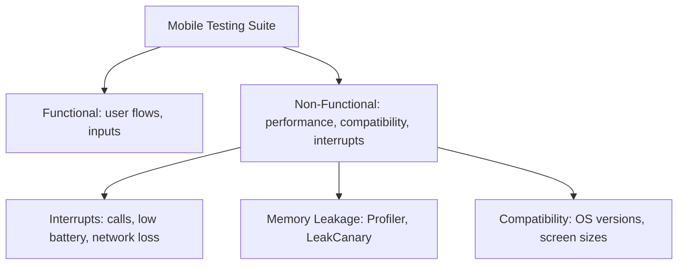
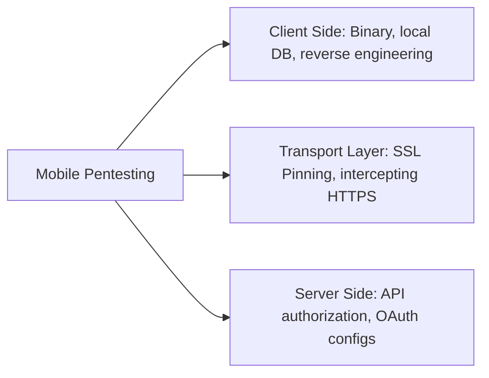
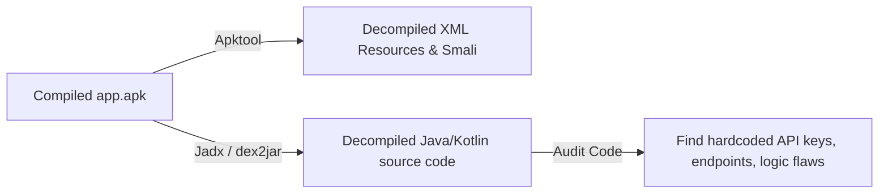
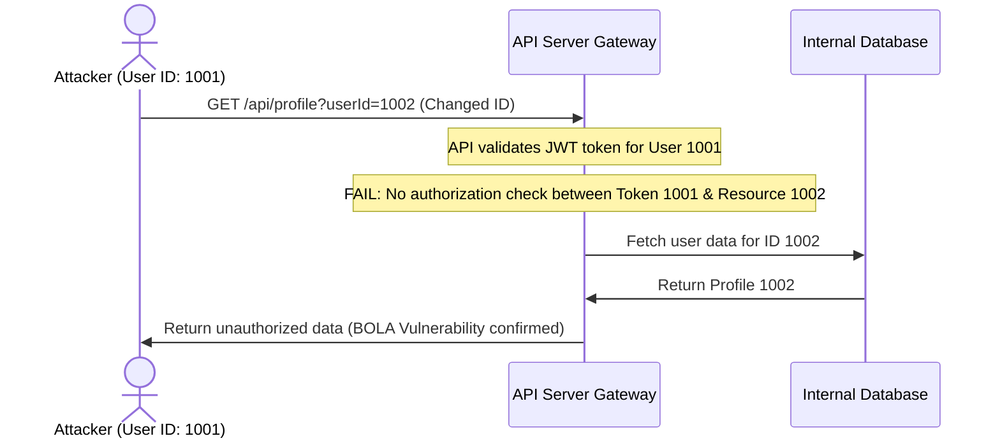
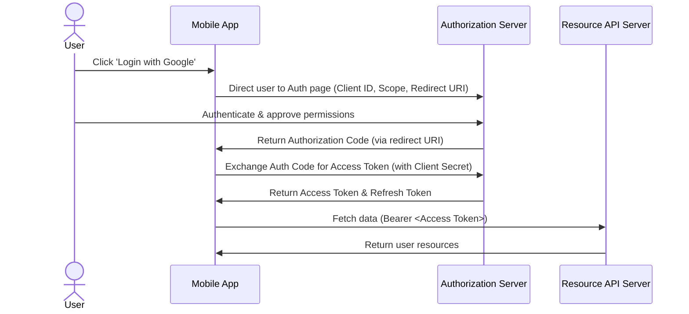

# 🛡️ Mobile Testing, Security, and Penetration Testing — Complete Interview Preparation Guide

> **Authoritative Technical Reference**
> Every topic follows the same structure — **Definition → Why It Is Used → How It Works Internally → Code Example → Common Pitfalls**.
>
> Covers both sides: the **testing stack** an Android engineer is expected to build, and the **security posture** a pentester will probe.
>
> **25 testing & security interview questions:** [`interview_questions/11_testing_security.md`](./interview_questions/11_testing_security.md)

---

## 📑 Table of Contents

| # | Module | Key Topics |
|---|---|---|
| 1 | [Mobile QA & Automation Testing](#1-mobile-application-qa--automation-testing) | Testing types, native vs hybrid, emulators vs simulators |
| 2 | [The Android Testing Stack](#2-the-android-testing-stack) | Testing pyramid, JUnit/MockK/Turbine, Robolectric, Espresso, UI Automator, coverage, CI |
| 3 | [Bug Severity & Classification](#3-bug-severity-priority-and-classification) | Severity vs priority, bug taxonomy |
| 4 | [Mobile Penetration Testing](#4-mobile-application-penetration-testing-pentesting) | Mobile vs web pentesting, traffic interception, pinning bypass |
| 5 | [Insecure Storage & Reverse Engineering](#5-insecure-local-storage--reverse-engineering) | Local storage attacks, decompilation toolchain |
| 6 | [API Security, BOLA & Rate Limiting](#6-mobile-api-security-bola-and-rate-limiting) | Object-level authorization, abuse prevention |
| 7 | [OAuth & Authentication Testing](#7-oauth--authentication-security-testing) | Authorization flow, PKCE, common vulnerabilities |
| 8 | [Secure Storage & Keystore](#8-secure-storage-android-keystore-and-encrypted-data) | Keystore, StrongBox, encrypted DataStore, SQLCipher, backup rules |
| 9 | [Network Security](#9-network-security-tls-pinning-and-network-security-config) | Network Security Config, pinning, TLS hardening |
| 10 | [App Hardening](#10-app-hardening-root-detection-tamper-detection-and-anti-reversing) | Root/tamper/Frida detection, R8 hardening, Play Integrity |
| 11 | [OWASP MASVS & Mobile Top 10](#11-owasp-masvs-and-the-mobile-top-10) | MASVS control groups, Top 10 with Android specifics |
| 12 | [Interview Questions](#12-interview-questions) | Pointer to the question bank |

---

# 1. Mobile Application QA & Automation Testing

## 1.1 Mobile Testing Types

### Definition
* **Simple:** Mobile app testing is the process of checking a mobile app to make sure it functions correctly, performs well, is secure, and works on different devices.
* **Advanced:** Mobile testing involves running a suite of functional and non-functional verifications (such as interrupt checking, memory analysis, compatibility matrices, and security audits) specifically optimized for the constraints of mobile operating systems.



### Core Testing Categories
1. **Functional Testing:** Verifies that all features of the application perform as specified in the business requirements.
2. **Performance Testing:** Analyzes resource consumption (CPU spikes, memory allocation, render speeds) under heavy user loads.
3. **Memory Leakage Testing:** Monitors heap memory allocations to identify unreleased objects.
4. **Interrupt Testing:** Checks how the application handles sudden interruptions (e.g., incoming phone calls, SMS notifications, battery low warnings, or network drops) and resumes its previous state safely.
5. **Compatibility Testing:** Verifies that the app functions across diverse screen resolutions, hardware architectures (ARM vs. x86), and OS versions (Android 5.0 to 15).

---

## 1.2 Native, Web, and Hybrid Applications

### Comparison Table

| Feature | Native Applications | Mobile Web Applications | Hybrid Applications |
|---|---|---|---|
| **Development Platform** | Platforms-specific (Kotlin/Swift) | HTML5, CSS3, JavaScript | Wrapper containers (Ionic, React Native, Flutter) |
| **Execution Speed** | Extremely High (Compiled native code) | Medium (Runs inside browser sandbox) | High (Native rendering bridge) |
| **Hardware Access** | Complete (Direct API calls) | Limited (Depends on browser capabilities) | Good (Accesses sensors via JavaScript bridges) |
| **Distribution** | App Stores | Direct URL | App Stores |
| **Update Process** | User must download updates | Instant updates on host server | Mix (Instant JS bundle push vs. Store updates) |

---

## 1.3 Emulators vs. Simulators

* **Emulator (Android Emulator):** A software program that virtualizes the **hardware architecture** of the target system (e.g., emulating an ARM processor on an x86 computer via QEMU). It runs the actual Android operating system kernel and libraries, providing a high-fidelity test environment close to a real device.
* **Simulator (iOS Simulator):** A software tool that copies the **software behaviors** of the target device onto the host operating system, executing compiled code directly on the host CPU without hardware translation. It does not run the actual device kernel, making it faster but less accurate for hardware-specific tests.

---

# 2. The Android Testing Stack

## 2.1 The Testing Pyramid on Android

### Definition
* **Unit tests** — pure JVM, no Android framework, milliseconds each.
* **Integration / Robolectric tests** — JVM, with a simulated Android framework, tens of milliseconds each.
* **Instrumented UI tests** — real device or emulator, seconds to minutes each.

### Why It Is Used
Instrumented tests are 100–1000× slower than JVM tests and far more flaky. A pyramid shape — many unit tests, fewer integration tests, a thin layer of end-to-end tests — keeps the suite fast enough that developers actually run it.

### How It Works Internally

| Layer | Location | Runs On | Typical Count |
|---|---|---|---|
| Unit | `src/test/` | JVM | Hundreds to thousands |
| Robolectric | `src/test/` | JVM with shadowed framework | Tens to hundreds |
| Instrumented | `src/androidTest/` | Device / emulator | Tens |
| Screenshot | `src/test/` (Paparazzi) or device | Either | Tens |

**What belongs where:** ViewModels, repositories, mappers, and use cases are pure Kotlin and belong in `src/test/`. Anything needing `Context`, `Resources`, or a real `Looper` can run under Robolectric on the JVM. Only genuine end-to-end user journeys justify an instrumented test.

### Code Example
```gradle
dependencies {
    testImplementation("junit:junit:4.13.2")
    testImplementation("io.mockk:mockk:1.13.x")
    testImplementation("org.jetbrains.kotlinx:kotlinx-coroutines-test:1.9.x")
    testImplementation("app.cash.turbine:turbine:1.x")
    testImplementation("com.google.truth:truth:1.4.x")
    testImplementation("org.robolectric:robolectric:4.x")
    testImplementation("androidx.test.ext:junit:1.2.x")

    androidTestImplementation("androidx.test.espresso:espresso-core:3.6.x")
    androidTestImplementation("androidx.compose.ui:ui-test-junit4")
    androidTestImplementation("androidx.test.uiautomator:uiautomator:2.3.x")
    debugImplementation("androidx.compose.ui:ui-test-manifest")
}

android {
    testOptions {
        unitTests {
            isIncludeAndroidResources = true    // Required for Robolectric
            isReturnDefaultValues = true        // Stub android.jar methods return defaults, not throw
        }
    }
}
```

---

## 2.2 Unit Testing ViewModels, Coroutines, and Flow

### Definition
Testing a ViewModel means driving it with fake collaborators, controlling its dispatcher, and asserting on the state it emits.

### Why It Is Used
A ViewModel holds the screen's entire decision logic. Testing it directly gives near-complete behavioral coverage at unit-test speed, without an emulator.

### How It Works Internally
* **`StandardTestDispatcher`** queues coroutines; nothing runs until `advanceUntilIdle()` or `runCurrent()`. This gives deterministic control over timing, including `delay`, which is skipped virtually rather than actually waited on.
* **`UnconfinedTestDispatcher`** runs coroutines eagerly — convenient for simple cases, but it hides ordering bugs.
* **`Dispatchers.setMain`** replaces the main dispatcher, which `viewModelScope` uses. Without it, every ViewModel test throws "Module with the Main dispatcher had failed to initialize".
* **Turbine** collects a `Flow` into a queue with `awaitItem()`/`awaitComplete()`, and fails the test if an emission is unconsumed — which catches the "extra emission" bugs plain `toList()` misses.

### Code Example
```kotlin
// Reusable rule: swaps the Main dispatcher for every test in the class
class MainDispatcherRule(
    private val dispatcher: TestDispatcher = StandardTestDispatcher()
) : TestWatcher() {
    override fun starting(description: Description) = Dispatchers.setMain(dispatcher)
    override fun finished(description: Description) = Dispatchers.resetMain()
}

class SearchViewModelTest {

    @get:Rule val mainDispatcher = MainDispatcherRule()

    // A hand-written fake is usually clearer and more robust than a mock,
    // because it encodes the collaborator's real contract once.
    private val repo = FakeSearchRepository()
    private lateinit var viewModel: SearchViewModel

    @Before fun setUp() { viewModel = SearchViewModel(repo, SavedStateHandle()) }

    @Test
    fun `debounces input and emits results`() = runTest {
        viewModel.uiState.test {                         // Turbine
            assertThat(awaitItem()).isEqualTo(SearchUiState.Idle)

            viewModel.onQueryChange("ka")
            viewModel.onQueryChange("kot")
            viewModel.onQueryChange("kotlin")

            // Virtual time: the 300 ms debounce elapses instantly
            advanceTimeBy(301)

            assertThat(awaitItem()).isEqualTo(SearchUiState.Loading)
            val success = awaitItem() as SearchUiState.Success
            assertThat(success.results).hasSize(3)

            // Only ONE request fired despite three keystrokes — the debounce assertion
            assertThat(repo.searchCallCount).isEqualTo(1)

            cancelAndIgnoreRemainingEvents()
        }
    }

    @Test
    fun `network failure surfaces an offline error and keeps prior results`() = runTest {
        repo.failNext(IOException())

        viewModel.onQueryChange("kotlin")
        advanceUntilIdle()                               // Run every queued coroutine to completion

        assertThat(viewModel.uiState.value)
            .isInstanceOf(SearchUiState.Error::class.java)
    }
}

// A fake, not a mock: real behavior, controllable, no verify() brittleness
class FakeSearchRepository : SearchRepository {
    var searchCallCount = 0; private set
    private var nextFailure: Throwable? = null

    fun failNext(t: Throwable) { nextFailure = t }

    override fun search(query: String, filters: Filters): Flow<List<Result>> = flow {
        searchCallCount++
        nextFailure?.let { nextFailure = null; throw it }
        emit(List(3) { Result(id = it.toLong(), title = "$query $it") })
    }
}
```

```kotlin
// Room DAO tests run fast on the JVM with an in-memory database under Robolectric
@RunWith(RobolectricTestRunner::class)
class UserDaoTest {
    private lateinit var db: AppDatabase
    private lateinit var dao: UserDao

    @Before fun create() {
        db = Room.inMemoryDatabaseBuilder(
            ApplicationProvider.getApplicationContext(), AppDatabase::class.java
        ).allowMainThreadQueries().build()
        dao = db.userDao()
    }

    @After fun close() = db.close()

    @Test
    fun `upsert replaces an existing row and emits once`() = runTest {
        dao.upsert(UserEntity(1, "Ada"))
        dao.upsert(UserEntity(1, "Ada Lovelace"))

        dao.observeAll().test {
            assertThat(awaitItem().single().name).isEqualTo("Ada Lovelace")
        }
    }
}

// Retrofit tests against MockWebServer: real HTTP, real parsing, no network
class UserApiTest {
    private val server = MockWebServer()
    private val api = Retrofit.Builder()
        .baseUrl(server.url("/"))
        .addConverterFactory(Json.asConverterFactory("application/json".toMediaType()))
        .build().create(UserApi::class.java)

    @Test
    fun `unknown JSON fields do not break parsing`() = runTest {
        server.enqueue(MockResponse().setBody("""{"id":1,"full_name":"Ada","new_field":"x"}"""))
        val user = api.getUser(1)
        assertThat(user.fullName).isEqualTo("Ada")
    }

    @Test
    fun `500 maps to a server error`() = runTest {
        server.enqueue(MockResponse().setResponseCode(500))
        val result = safeApiCall { api.getUser(1) }
        assertThat(result).isEqualTo(DataResult.Failure(AppError.Server(500)))
    }
}
```

### Common Pitfalls
* **Forgetting `Dispatchers.setMain`.** Every `viewModelScope` test fails at construction.
* **`Thread.sleep` in a coroutine test.** `runTest` uses virtual time; sleeping wastes real time and does not advance the scheduler. Use `advanceTimeBy` / `advanceUntilIdle`.
* **Over-mocking.** `verify(exactly = 1) { repo.search(any()) }` couples the test to the implementation. Assert on observable state instead.
* **`UnconfinedTestDispatcher` everywhere.** It hides ordering bugs that `StandardTestDispatcher` would surface.
* **Testing `StateFlow` with `.value` only.** Intermediate emissions (Loading) are missed. Use Turbine.

---

## 2.3 Instrumented UI Testing: Espresso, UI Automator, Compose

### Definition
* **Espresso** — in-process View testing with automatic synchronization against the main-thread message queue.
* **UI Automator** — cross-process testing that can drive system UI, notifications, and other apps.
* **Compose test rule** — semantics-tree testing for Compose UI.

### Why It Is Used
They verify the wiring that unit tests cannot: does tapping this actually navigate, does the permission dialog flow work, does the notification open the right screen.

### How It Works Internally
Espresso's synchronization is its defining feature: before each interaction it waits until the message queue is empty and all registered `IdlingResource`s are idle. This eliminates the `sleep`-and-hope pattern — but only for work Espresso can see. Background coroutines and OkHttp calls are invisible to it unless you register an idling resource or, better, inject test doubles.

| Tool | Scope | Use For |
|---|---|---|
| Espresso | Your app's Views, in-process | View-based screens |
| Compose rule | Your app's semantics tree | Compose screens |
| UI Automator | Whole device, cross-process | Permission dialogs, notifications, multi-app flows |

### Code Example
```kotlin
@HiltAndroidTest
@RunWith(AndroidJUnit4::class)
class LoginFlowTest {

    @get:Rule(order = 0) val hilt = HiltAndroidRule(this)
    @get:Rule(order = 1) val compose = createAndroidComposeRule<MainActivity>()

    // Replace the real network module with a fake for the whole test run.
    // This removes the largest source of UI-test flakiness: the network.
    @BindValue @JvmField val repository: AuthRepository = FakeAuthRepository()

    @Test
    fun successful_login_navigates_to_home() {
        compose.onNodeWithTag("email").performTextInput("ada@example.com")
        compose.onNodeWithTag("password").performTextInput("correct-horse")
        compose.onNodeWithText("Sign in").performClick()

        // waitUntil polls with a timeout — correct; Thread.sleep is not
        compose.waitUntil(timeoutMillis = 5_000) {
            compose.onAllNodesWithTag("home_screen").fetchSemanticsNodes().isNotEmpty()
        }
        compose.onNodeWithTag("home_screen").assertIsDisplayed()
    }
}
```

```kotlin
// Espresso for a View-based screen
@Test
fun submitting_empty_form_shows_validation_errors() {
    onView(withId(R.id.submit)).perform(click())
    onView(withId(R.id.email_layout))
        .check(matches(hasDescendant(withText(R.string.error_email_required))))
}

// RecyclerView interactions need the contrib actions
onView(withId(R.id.list))
    .perform(RecyclerViewActions.actionOnItemAtPosition<UserViewHolder>(5, click()))
```

```kotlin
// UI Automator: system dialogs Espresso cannot reach
@Test
fun granting_camera_permission_opens_the_viewfinder() {
    val device = UiDevice.getInstance(InstrumentationRegistry.getInstrumentation())

    onView(withId(R.id.take_photo)).perform(click())

    // The permission dialog belongs to the system package, not to your app
    val allow = device.findObject(
        UiSelector().textMatches("(?i)allow|while using the app")
    )
    if (allow.exists()) allow.click()

    onView(withId(R.id.viewfinder)).check(matches(isDisplayed()))
}
```

```kotlin
// Deterministic tests: disable animations, or Espresso's synchronization fights them
// In the Gradle config:
//   testOptions { animationsDisabled = true }
// Or on the device:
//   adb shell settings put global window_animation_scale 0
//   adb shell settings put global transition_animation_scale 0
//   adb shell settings put global animator_duration_scale 0
```

### Common Pitfalls
* **Hitting the real network in UI tests.** Every test then depends on staging availability. Inject fakes with `@BindValue` or a test Hilt module.
* **`Thread.sleep` to "fix" flakiness.** It makes the suite slow and still flaky. Use `waitUntil` or an `IdlingResource`.
* **Animations left enabled.** Espresso's idle detection interacts badly with running animations.
* **Tests that depend on each other's order.** Every test must set up and tear down its own state; shared state produces failures that only appear in CI.
* **Asserting on test tags only.** They prove structure, not that a user could complete the task.

---

## 2.4 Test Doubles, Coverage, and CI

### Definition
* **Stub** — returns canned data.
* **Fake** — a working lightweight implementation (in-memory repository).
* **Mock** — records interactions so you can verify them.
* **Spy** — a real object with some methods overridden.

### Why It Is Used
Choosing the wrong double is the main cause of brittle tests. Mocks couple the test to *how* the code works; fakes couple it only to *what* the collaborator promises, so a refactor that preserves behavior does not break the suite.

### How It Works Internally
MockK generates a proxy class at runtime and records calls. `mockkStatic`/`mockkObject` rewrite bytecode to intercept static and object members — powerful, but a signal that the code under test has a hard dependency that should have been injected.

### Code Example
```kotlin
// MockK basics
val api = mockk<UserApi>()
coEvery { api.getUser(1) } returns UserDto(1, "Ada")
coEvery { api.getUser(404) } throws HttpException(Response.error<Any>(404, "".toResponseBody()))

// relaxed = true auto-stubs every method, useful for fire-and-forget collaborators
val analytics = mockk<Analytics>(relaxed = true)

// Verify only when the INTERACTION is the behavior under test (e.g. "we log this event")
coVerify(exactly = 1) { analytics.track("purchase_completed", any()) }

// Capturing an argument for detailed assertions
val slot = slot<PurchaseEvent>()
coVerify { analytics.trackPurchase(capture(slot)) }
assertThat(slot.captured.amountCents).isEqualTo(1999)
```

```gradle
// JaCoCo coverage with realistic exclusions
tasks.register<JacocoReport>("jacocoTestReport") {
    dependsOn("testDebugUnitTest")
    reports { xml.required.set(true); html.required.set(true) }

    val excludes = listOf(
        "**/R.class", "**/R$*.class", "**/BuildConfig.*",
        "**/*_Hilt*.*", "**/hilt_aggregated_deps/**",      // Generated DI code
        "**/*Binding.*",                                    // Generated view binding
        "**/databinding/**"
    )
    classDirectories.setFrom(
        fileTree(layout.buildDirectory.dir("tmp/kotlin-classes/debug")) { exclude(excludes) }
    )
    sourceDirectories.setFrom(files("src/main/kotlin", "src/main/java"))
    executionData.setFrom(fileTree(layout.buildDirectory) { include("**/*.exec") })
}
```

```yaml
# CI: run the fast suite on every push, the slow suite on merge
name: android-ci
on: [push, pull_request]
jobs:
  unit:
    runs-on: ubuntu-latest
    steps:
      - uses: actions/checkout@v4
      - uses: actions/setup-java@v4
        with: { distribution: temurin, java-version: '17' }
      - uses: gradle/actions/setup-gradle@v4
      - run: ./gradlew testDebugUnitTest lintDebug
      - run: ./gradlew jacocoTestReport
      - uses: actions/upload-artifact@v4
        if: always()
        with: { name: test-reports, path: '**/build/reports/' }

  instrumented:
    runs-on: ubuntu-latest
    if: github.event_name == 'pull_request'
    steps:
      - uses: actions/checkout@v4
      - uses: reactivecircus/android-emulator-runner@v2
        with:
          api-level: 34
          # Disabling animations is what makes emulator tests reliable in CI
          script: ./gradlew connectedDebugAndroidTest
```

### Common Pitfalls
* **Chasing a coverage percentage.** 100% coverage of getters proves nothing. Cover decision logic and error paths.
* **Mocking types you own.** A fake is usually clearer and survives refactoring.
* **Mocking the Android framework.** If a test needs `mockkStatic(TextUtils::class)`, the production code should have taken an injectable abstraction instead.
* **Not excluding generated code from coverage.** Hilt and ViewBinding generate thousands of uncovered lines, making the number meaningless.
* **Flaky tests left quarantined indefinitely.** A quarantined test is a test that does not exist; fix it or delete it.

---
# 3. Bug Severity, Priority, and Classification

## 3.1 Severity vs. Priority

* **Severity:** Defines the technical impact of a defect on the software functionality. It is evaluated from a system perspective (e.g., does it crash the system, or is it a minor cosmetic alignment issue?).
* **Priority:** Defines the business urgency of fixing the defect. It is evaluated from a product/market perspective (e.g., how quickly must this bug be fixed to prevent financial or user loss?).

```mermaid
grid
  Severity (System Impact) | Priority (Business Urgency)
  High Severity / High Priority: App crashes on launch. | High Severity / Low Priority: Crash on an obsolete, rare OS version.
  Low Severity / High Priority: Typo in the company logo on login screen. | Low Severity / Low Priority: Minor color mismatch in deep settings.
```

### Bug Classifications
1. **Critical:** Disables primary application pathways (e.g., user checkout crashes completely). No workaround exists.
2. **Major:** A major feature does not function as expected, but the overall application remains operational (e.g., profile editing is failing, but users can still search and purchase products).
3. **Minor:** Visual or non-functional bugs that do not hinder operations (e.g., missing margins, incorrect hyphenation, or minor typos).
4. **Blocker:** Prevents the QA team from performing further tests (e.g., the login button is completely disabled, blocking access to all inner pages).

---

# 4. Mobile Application Penetration Testing (Pentesting)

## 4.1 Mobile vs. Web Pentesting

### Definition
* **Simple:** Mobile pentesting is a security test where we try to hack a mobile app to find security gaps before real hackers do.
* **Advanced:** Mobile application penetration testing is a structured security audit that combines static application security testing (SAST) on decrypted binaries, dynamic application security testing (DAST) of memory and filesystems, and API-level authorization verification.



### Comparison Table

| Feature | Mobile Pentesting | Web Pentesting |
|---|---|---|
| **Primary Scope** | Binary analysis, SQLite encryption, runtime memory manipulation | Server-side logic, session management, database injections |
| **Attack Surface** | Local storage, IPC components, shared preferences, root checks | Web parameters, headers, cookies, server configuration |
| **Interception** | Requires certificate installation & SSL pinning bypasses | Standard proxy setup (Burp Suite) |
| **Reverse Engineering** | Essential (dex2jar, Jadx, Apktool) | Generally not applicable (JavaScript is source-visible) |

---

## 4.2 Dynamic Traffic Analysis & Certificate Pinning

### Intercepting HTTPS Traffic
To perform dynamic analysis on mobile APIs, testers route the mobile device's traffic through an interception proxy (e.g. Burp Suite or OWASP ZAP). 
1. The tester installs a custom CA certificate generated by the proxy onto the test device.
2. For Android 7.0+ (API 24+), the network security config (`network_security_config.xml`) must explicitly trust user-installed certificates for debug builds:
   ```xml
   <network-security-config>
       <debug-overrides>
           <trust-anchors>
               <certificates src="user" />
           </trust-anchors>
       </debug-overrides>
   </network-security-config>
   ```

### Certificate Pinning (SSL Pinning)
* **What it is:** A security mechanism where an app only trusts a pre-defined cryptographic public key or certificate hash, rejecting all other certificates, even if they are trusted by the device's root certificate store.
* **Bypassing SSL Pinning during Pentests:** Testers use runtime hook tools (like **Frida** or **Objection**) to inject Javascript code into the running application memory, overriding the certificate validation methods (such as `TrustManager` classes) to accept the proxy's certificate.

---

# 5. Insecure Local Storage & Reverse Engineering

## 5.1 Insecure Local Storage

### Definition
* **Simple:** Storing sensitive information (like user passwords or API tokens) in standard text files on the device that can be easily read by other apps or rooted devices.
* **Advanced:** Storing unencrypted cryptographic keys, authentication tokens (JWTs), or personally identifiable information (PII) inside vulnerable device storage spaces (e.g., standard `SharedPreferences`, unprotected SQLite databases, or external SD card storage).

### Real Scenario: Testing Local Storage Vulnerabilities
To audit insecure local storage on an Android device:
1. Connect the test device via ADB and access the app's sandboxed directory:
   ```bash
   adb shell
   run-as com.example.vulnerableapp
   cd /data/data/com.example.vulnerableapp/
   ```
2. Inspect the subfolders:
   * **`shared_prefs/`:** Check XML files for plain-text credentials or API tokens.
   * **`databases/`:** Attempt to open SQLite files directly using `sqlite3` to verify if they are unencrypted.
3. **Remediation:** Sensitive keys should be stored in **EncryptedSharedPreferences** or encrypted databases (like **SQLCipher**), with keys managed by the **Android Keystore System**.

---

## 5.2 Reverse Engineering Mobile Binaries

### Definition
Reverse engineering is the process of decompiling an APK back into readable source code (Java/Kotlin classes, XML configurations) to analyze its inner workings.



### Common Tools
* **Apktool:** Decodes resources to nearly original form and rebuilds them back into an APK after modifications.
* **Jadx-GUI:** Directly decompiles DEX files into readable Java/Kotlin source code.
* **Frida:** A dynamic instrumentation toolkit that lets you inject custom scripts into the black-box process of an application to bypass check logic at runtime.

---

# 6. Mobile API Security, BOLA, and Rate Limiting

## 6.1 Broken Object Level Authorization (BOLA)

### Definition
* **Simple:** An authorization bug where a user can access another user's private data simply by changing the ID number in the API request.
* **Advanced:** An access control vulnerability occurring when an API endpoint exposes object resource identifiers and fails to perform validation checks to ensure the requesting user has the authorization to access the requested resource.



### Real Scenario: Exploiting BOLA
1. Intercept a user profile request in Burp Suite:
   `GET /v1/users/accounts/1001` with `Authorization: Bearer <Token_for_User_1001>`
2. Change the final ID parameter:
   `GET /v1/users/accounts/1002`
3. If the server returns account details for User 1002 without validating that the authenticated token owns account 1002, the endpoint is vulnerable to BOLA.
4. **Remediation:** Enforce authorization checks at the data controller layer using session-based owner checks (e.g. verifying `current_user.id == requested_user.id`).

---

## 6.2 Rate Limiting

### Definition
* **Simple:** Restricting the number of times a user can make an API request within a specific timeframe (e.g., limiting login attempts to 5 per minute).
* **Advanced:** An API constraint mechanism designed to control the rate of incoming traffic, preventing denial of service (DoS), brute force credential validation, and automated scraping attacks.

### Implementing Rate Limiting
APIs implement rate limiting at the gateway level (e.g., using Nginx or API Gateways) using algorithms like **Token Bucket** or **Leaky Bucket**, sending an HTTP status code **`429 Too Many Requests`** when thresholds are exceeded.

---

# 7. OAuth & Authentication Security Testing

## 7.1 OAuth Authorization Flow

OAuth is an open-standard authorization framework that allows third-party applications to access user resources securely without exposing user passwords.



---

## 7.2 OAuth Security Vulnerabilities

1. **Insecure Redirect URIs:** If the authorization server does not enforce exact matching for redirect URIs, attackers can intercept authorization codes using wildcard redirects.
2. **Missing State Parameter:** The `state` parameter prevents Cross-Site Request Forgery (CSRF). If missing or not validated, an attacker can link their resource accounts to a victim's session.
3. **Insecure Token Storage:** Storing access and refresh tokens in unencrypted local storage opens them to extraction by malware or physical theft.

---

# 8. Secure Storage: Android Keystore and Encrypted Data

## 8.1 The Android Keystore System

### Definition
* **Simple:** A container where cryptographic keys are generated and used but can never be read out, even by your own app.
* **Advanced:** Keystore keys live in the Trusted Execution Environment (TEE) or a dedicated secure element (StrongBox). Your app receives a *handle*; every crypto operation is executed inside the secure hardware, so the key material never enters the app's address space.

### Why It Is Used
Any key stored in `SharedPreferences`, in the APK, or in a string constant is extractable in minutes with `strings`, `jadx`, or a rooted device. Keystore makes extraction require a hardware attack rather than a decompiler.

### How It Works Internally
* **`setUserAuthenticationRequired(true)`** binds the key to biometric or device-credential authentication. The key is unusable until the user authenticates, enforced by the TEE — not by your code.
* **`setInvalidatedByBiometricEnrollment(true)`** permanently invalidates the key if a new fingerprint is enrolled, so an attacker who adds their own biometric cannot decrypt existing data.
* **StrongBox** (`setIsStrongBoxBacked(true)`) uses a separate tamper-resistant chip where available; fall back gracefully, since not every device has one.

**Key generation must be per-device, at runtime.** A key shipped in the APK is shared by every installation and is not a secret.

### Code Example
```kotlin
class SecureCipher(private val alias: String = "app_master_key") {

    private val keyStore = KeyStore.getInstance("AndroidKeyStore").apply { load(null) }

    private fun getOrCreateKey(): SecretKey {
        (keyStore.getEntry(alias, null) as? KeyStore.SecretKeyEntry)?.let { return it.secretKey }

        val generator = KeyGenerator.getInstance(KeyProperties.KEY_ALGORITHM_AES, "AndroidKeyStore")
        val spec = KeyGenParameterSpec.Builder(
            alias,
            KeyProperties.PURPOSE_ENCRYPT or KeyProperties.PURPOSE_DECRYPT
        )
            .setBlockModes(KeyProperties.BLOCK_MODE_GCM)
            .setEncryptionPaddings(KeyProperties.ENCRYPTION_PADDING_NONE)  // GCM needs no padding
            .setKeySize(256)
            // Requires biometric/PIN before EVERY use; enforced by hardware, not by app code
            .setUserAuthenticationRequired(true)
            .setUserAuthenticationParameters(30, KeyProperties.AUTH_BIOMETRIC_STRONG)
            // Adding a new fingerprint destroys this key — an attacker cannot enrol their way in
            .setInvalidatedByBiometricEnrollment(true)
            .apply {
                if (Build.VERSION.SDK_INT >= Build.VERSION_CODES.P) setIsStrongBoxBacked(true)
            }
            .build()

        return try {
            generator.init(spec); generator.generateKey()
        } catch (e: StrongBoxUnavailableException) {
            // Not every device has a secure element; retry without it
            generator.init(
                KeyGenParameterSpec.Builder(alias, spec.purposes)
                    .setBlockModes(KeyProperties.BLOCK_MODE_GCM)
                    .setEncryptionPaddings(KeyProperties.ENCRYPTION_PADDING_NONE)
                    .setKeySize(256)
                    .build()
            )
            generator.generateKey()
        }
    }

    fun encryptCipher(): Cipher = Cipher.getInstance("AES/GCM/NoPadding")
        .apply { init(Cipher.ENCRYPT_MODE, getOrCreateKey()) }

    // The GCM IV is generated by the cipher and must be STORED alongside the ciphertext.
    // Reusing an IV with GCM catastrophically breaks the encryption.
    fun decryptCipher(iv: ByteArray): Cipher = Cipher.getInstance("AES/GCM/NoPadding")
        .apply { init(Cipher.DECRYPT_MODE, getOrCreateKey(), GCMParameterSpec(128, iv)) }
}
```

```kotlin
// Handling key invalidation — this WILL happen in production
fun decryptOrReset(data: EncryptedBlob): String? = try {
    String(secureCipher.decryptCipher(data.iv).doFinal(data.ciphertext))
} catch (e: KeyPermanentlyInvalidatedException) {
    // The user changed their biometrics or screen lock. The data is unrecoverable —
    // delete it and force re-authentication rather than crashing.
    keyStore.deleteEntry(alias)
    localStore.clearEncryptedData()
    null
}
```

### Common Pitfalls
* **Hardcoding a key or a "salt" in the source or in `BuildConfig`.** Both are trivially extracted from the APK.
* **Not handling `KeyPermanentlyInvalidatedException`.** Changing a screen lock crashes the app for that user, permanently, until reinstall.
* **Reusing a GCM IV.** It destroys the confidentiality guarantee. Let the cipher generate one and store it with the ciphertext.
* **Assuming Keystore protects against a rooted device with the app running.** It protects the *key*, not the *plaintext* your app holds in memory after decrypting.

---

## 8.2 Encrypted Storage and Data at Rest

### Definition
Encrypting preferences, database contents, and files so a device backup, an ADB pull, or a rooted filesystem read yields ciphertext.

### Why It Is Used
App-private storage is already inaccessible to other apps on an unrooted device. Encryption defends against the cases where that assumption fails: a rooted device, an unlocked bootloader, a full-device backup, or a stolen unencrypted device image.

### How It Works Internally

| Data | Mechanism |
|---|---|
| Preferences | `EncryptedSharedPreferences` (AES-256 GCM values, AES-256 SIV keys) — deprecated in Jetpack Security, so many teams now wrap DataStore themselves |
| Database | SQLCipher — transparently encrypts the whole SQLite file |
| Files | `EncryptedFile`, or your own Keystore-backed `CipherOutputStream` |
| Backups | `android:allowBackup="false"`, or `dataExtractionRules` to exclude sensitive files |

### Code Example
```kotlin
// DataStore with Keystore-backed encryption — the current recommended approach,
// since Jetpack Security's EncryptedSharedPreferences is deprecated.
class EncryptedPreferences(
    private val dataStore: DataStore<Preferences>,
    private val cipher: SecureCipher
) {
    suspend fun putSecret(key: String, value: String) {
        val encryptCipher = cipher.encryptCipher()
        val ciphertext = encryptCipher.doFinal(value.toByteArray())
        // Store the IV with the ciphertext; it is not secret, but it is required for decryption
        val blob = Base64.encodeToString(encryptCipher.iv + ciphertext, Base64.NO_WRAP)
        dataStore.edit { it[stringPreferencesKey(key)] = blob }
    }

    fun getSecret(key: String): Flow<String?> = dataStore.data.map { prefs ->
        val blob = prefs[stringPreferencesKey(key)] ?: return@map null
        val bytes = Base64.decode(blob, Base64.NO_WRAP)
        val iv = bytes.copyOfRange(0, 12)              // GCM IV is 12 bytes
        val ciphertext = bytes.copyOfRange(12, bytes.size)
        String(cipher.decryptCipher(iv).doFinal(ciphertext))
    }
}
```

```kotlin
// SQLCipher: an encrypted Room database with a Keystore-derived passphrase
val passphrase: ByteArray = SQLiteDatabase.getBytes(keystorePassphrase().toCharArray())
val factory = SupportOpenHelperFactory(passphrase)

val db = Room.databaseBuilder(context, AppDatabase::class.java, "secure.db")
    .openHelperFactory(factory)
    .build()
```

```xml
<!-- Exclude sensitive data from cloud backup and device-to-device transfer -->
<application
    android:allowBackup="true"
    android:dataExtractionRules="@xml/data_extraction_rules"
    android:fullBackupContent="@xml/backup_rules">
```

```xml
<!-- res/xml/data_extraction_rules.xml (Android 12+) -->
<data-extraction-rules>
    <cloud-backup>
        <exclude domain="sharedpref" path="secure_prefs.xml" />
        <exclude domain="database" path="secure.db" />
        <exclude domain="file" path="tokens/" />
    </cloud-backup>
    <device-transfer>
        <exclude domain="sharedpref" path="secure_prefs.xml" />
    </device-transfer>
</data-extraction-rules>
```

```kotlin
// Prevent screenshots and Recents thumbnails on screens showing sensitive data
class PaymentActivity : AppCompatActivity() {
    override fun onCreate(savedInstanceState: Bundle?) {
        window.setFlags(WindowManager.LayoutParams.FLAG_SECURE,
                        WindowManager.LayoutParams.FLAG_SECURE)
        super.onCreate(savedInstanceState)
    }
}
```

### Common Pitfalls
* **Logging sensitive values.** `Log.d("Auth", "token=$token")` writes the token to logcat, readable by ADB and by crash reporters. Strip logs from release with R8's `assumenosideeffects`.
* **Leaving `allowBackup="true"` with no extraction rules.** `adb backup` (or cloud backup) then exports your encrypted store *and* any plaintext alongside it.
* **Encrypting the database but writing the passphrase to preferences in plaintext.** The weakest link defines the security.
* **Assuming encryption at rest defends a rooted, running device.** An attacker with root and a debugger can read decrypted values from memory.

---

# 9. Network Security: TLS, Pinning, and Network Security Config

## 9.1 Network Security Configuration

### Definition
An XML file declaring your app's TLS policy: which domains may use cleartext, which CAs are trusted, and which certificate pins apply.

### Why It Is Used
It is declarative, applies to every network library in the process (OkHttp, WebView, native code), and cannot be bypassed by a library that forgot to configure TLS correctly.

### How It Works Internally
The platform reads the config at process start and installs the resulting trust manager for the whole app. From Android 9 (API 28), cleartext HTTP is **disabled by default** — an unconfigured `http://` request fails with `CLEARTEXT communication not permitted`. From Android 7 (API 24), apps no longer trust user-installed CAs by default, which is exactly what makes intercepting proxy traffic require an explicit debug override.

### Code Example
```xml
<!-- res/xml/network_security_config.xml -->
<network-security-config>
    <!-- Production default: TLS only, system CAs only -->
    <base-config cleartextTrafficPermitted="false">
        <trust-anchors>
            <certificates src="system" />
        </trust-anchors>
    </base-config>

    <!-- Pinning: only these public-key hashes are accepted for this domain -->
    <domain-config>
        <domain includeSubdomains="true">api.example.com</domain>
        <pin-set expiration="2027-01-01">
            <pin digest="SHA-256">base64PrimaryKeyHash=</pin>
            <!-- A BACKUP pin is mandatory: without it, a key rotation bricks every
                 installed client until they update. -->
            <pin digest="SHA-256">base64BackupKeyHash=</pin>
        </pin-set>
    </domain-config>

    <!-- Debug-only: trust the proxy CA so QA can intercept traffic.
         debug-overrides is stripped from release builds by the platform. -->
    <debug-overrides>
        <trust-anchors>
            <certificates src="system" />
            <certificates src="user" />
        </trust-anchors>
    </debug-overrides>
</network-security-config>
```

```xml
<application android:networkSecurityConfig="@xml/network_security_config" ... >
```

```kotlin
// OkHttp-level pinning — an alternative, with programmatic control over failures
val pinner = CertificatePinner.Builder()
    .add("api.example.com", "sha256/AAAAAAAAAAAAAAAAAAAAAAAAAAAAAAAAAAAAAAAAAAA=")
    .add("api.example.com", "sha256/BBBBBBBBBBBBBBBBBBBBBBBBBBBBBBBBBBBBBBBBBBB=")  // Backup
    .build()

val client = OkHttpClient.Builder()
    .certificatePinner(pinner)
    .connectionSpecs(listOf(ConnectionSpec.RESTRICTED_TLS))   // TLS 1.2+ and strong ciphers only
    .build()
```

```bash
# Extract the current pin so you can verify what you are pinning to
openssl s_client -servername api.example.com -connect api.example.com:443 < /dev/null 2>/dev/null \
  | openssl x509 -pubkey -noout \
  | openssl pkey -pubin -outform der \
  | openssl dgst -sha256 -binary \
  | openssl enc -base64
```

### Common Pitfalls
* **Pinning without a backup pin.** When the certificate rotates, every installed client loses connectivity until users update — an outage you cannot fix server-side.
* **Pinning the leaf certificate instead of the intermediate.** Leaf certificates rotate every 90 days with Let's Encrypt; pin the intermediate or the key.
* **Trusting user CAs in release.** This re-enables trivial traffic interception. Keep it inside `<debug-overrides>`.
* **Treating pinning as an anti-tamper control.** A determined attacker on a rooted device patches it out with Frida in minutes. It defends users against network attackers, not you against the user.
* **`cleartextTrafficPermitted="true"` app-wide** to fix one legacy endpoint. Scope it to that domain only.

---

# 10. App Hardening: Root Detection, Tamper Detection, and Anti-Reversing

## 10.1 Layered Client Hardening

### Definition
Client-side controls that raise the cost of reverse engineering, repackaging, and running on a compromised device.

### Why It Is Used
The honest framing matters in an interview: **client-side hardening cannot make a client trustworthy** — the attacker controls the device. It raises cost and filters out low-effort attacks, while the real security boundary stays on the server.

### How It Works Internally

| Control | What It Detects | Bypass Difficulty |
|---|---|---|
| Root detection (su binary, Magisk paths, `ro.debuggable`) | Casual root | Low — Magisk Hide/Zygisk defeats it |
| Debugger detection (`Debug.isDebuggerConnected`, TracerPid) | Attached debugger | Low |
| Signature verification | Repackaged APK | Medium — patch the check |
| Frida/Xposed detection (loaded libraries, open ports, named threads) | Runtime instrumentation | Medium |
| R8 obfuscation | Static analysis | Medium — slows, does not stop |
| **Play Integrity API** | Device, app, and account integrity — **verified server-side** | **High** |
| Native (NDK) checks | All of the above, harder to patch | High |

**The only control on that list with real strength is server-side verification.** Everything else is a speed bump; verify a Play Integrity token on your backend and make the security decision there.

### Code Example
```kotlin
// Defense in depth: multiple weak signals, reported to the server, never trusted alone
class IntegrityHeuristics(private val context: Context) {

    fun collectSignals(): Set<String> = buildSet {
        if (hasSuBinary()) add("su_binary")
        if (isDebuggerAttached()) add("debugger")
        if (hasFridaArtifacts()) add("frida")
        if (!signatureMatches()) add("bad_signature")
        if (Build.TAGS?.contains("test-keys") == true) add("test_keys")
    }

    private fun hasSuBinary() = listOf(
        "/system/bin/su", "/system/xbin/su", "/sbin/su",
        "/data/local/xbin/su", "/su/bin/su"
    ).any { File(it).exists() }

    private fun isDebuggerAttached(): Boolean =
        Debug.isDebuggerConnected() ||
            // TracerPid != 0 means a process is ptrace-attached
            File("/proc/self/status").readLines()
                .firstOrNull { it.startsWith("TracerPid:") }
                ?.substringAfter(":")?.trim()?.toIntOrNull() != 0

    private fun hasFridaArtifacts() =
        File("/proc/self/maps").readText().contains("frida") ||
            runCatching { Socket("127.0.0.1", 27042).use { true } }.getOrDefault(false)

    private fun signatureMatches(): Boolean {
        val info = context.packageManager.getPackageInfo(
            context.packageName, PackageManager.GET_SIGNING_CERTIFICATES
        )
        val hash = info.signingInfo!!.apkContentsSigners
            .first().toByteArray()
            .let { MessageDigest.getInstance("SHA-256").digest(it) }
            .joinToString("") { "%02x".format(it) }
        return hash == EXPECTED_SIGNATURE_SHA256
    }
}

// Correct use: report signals to the server as RISK CONTEXT, and let the server decide
// whether to step up authentication, limit the transaction, or block.
// Do NOT hard-exit on device — that only tells the attacker exactly which check to patch.
suspend fun onAppStart() {
    val token = integrityChecker.token(server.nonce())
    server.reportSession(
        integrityToken = token,                          // Verified server-side: the real control
        heuristics = IntegrityHeuristics(context).collectSignals()
    )
}
```

```proguard
# R8: raise the cost of static analysis
-repackageclasses ''            # Flatten every class into a single unnamed package
-allowaccessmodification        # Let R8 widen access modifiers for more aggressive optimization
-overloadaggressively           # Reuse short names across different signatures

# Do NOT do this — it disables shrinking and obfuscation for your whole app:
# -keep class com.example.** { *; }
```

### Common Pitfalls
* **Crashing or exiting on a root signal.** It breaks legitimate power users and developers, and it tells the attacker precisely which branch to patch.
* **Verifying Play Integrity on the device.** The device is the attacker; only server verification means anything.
* **Treating obfuscation as security.** `jadx` on an R8'd APK still produces readable logic; obfuscation buys time, not safety.
* **Storing the "expected signature" in an easily-patched constant** as the sole control.
* **Blocking every rooted device.** Weigh it against the legitimate user base you lose; a risk score is usually better than a binary block.

---

# 11. OWASP MASVS and the Mobile Top 10

## 11.1 The Standards

### Definition
* **MASVS (Mobile Application Security Verification Standard)** — the requirements: *what* a secure mobile app must do.
* **MASTG (Mobile Application Security Testing Guide)** — the procedures: *how* to test each requirement.
* **Mobile Top 10** — the ranked list of the most common mobile risks.

### Why It Is Used
They give a shared vocabulary and a checklist that both developers and pentesters work from. Naming MASVS control groups in an interview signals that your security knowledge is structured rather than anecdotal.

### How It Works Internally

**MASVS control groups (v2):**

| Group | Covers |
|---|---|
| **MASVS-STORAGE** | Data at rest, backups, logs, keyboard cache |
| **MASVS-CRYPTO** | Key management, algorithm choice, randomness |
| **MASVS-AUTH** | Authentication, session handling, biometrics |
| **MASVS-NETWORK** | TLS configuration, certificate verification, pinning |
| **MASVS-PLATFORM** | IPC, WebView, deep links, exported components |
| **MASVS-CODE** | Dependencies, input validation, build settings |
| **MASVS-RESILIENCE** | Anti-tamper, obfuscation, device integrity |
| **MASVS-PRIVACY** | Data minimization, consent, transparency |

**OWASP Mobile Top 10 (2024), with the Android specifics:**

| # | Risk | Android Manifestation |
|---|---|---|
| M1 | Improper credential usage | API keys in `BuildConfig`, hardcoded secrets |
| M2 | Inadequate supply chain security | Unaudited SDKs, unpinned dependency versions |
| M3 | Insecure authentication/authorization | BOLA on mobile APIs, client-side auth decisions |
| M4 | Insufficient input/output validation | SQL injection in raw Room queries, WebView XSS |
| M5 | Insecure communication | Cleartext HTTP, disabled hostname verification |
| M6 | Inadequate privacy controls | Over-broad permissions, PII in logs and analytics |
| M7 | Insufficient binary protection | No obfuscation, trivially patchable checks |
| M8 | Security misconfiguration | `exported="true"`, `allowBackup="true"`, debuggable release |
| M9 | Insecure data storage | Tokens in plain `SharedPreferences` |
| M10 | Insufficient cryptography | ECB mode, hardcoded IV, `Math.random()` for tokens |

### Code Example
```kotlin
// M4: WebView is the single most dangerous component in most Android apps
webView.settings.apply {
    javaScriptEnabled = false                 // Enable ONLY if genuinely required
    allowFileAccess = false                   // Prevents file:// exfiltration
    allowContentAccess = false
    allowFileAccessFromFileURLs = false
    allowUniversalAccessFromFileURLs = false  // Universal access = same-origin bypass
    mixedContentMode = WebSettings.MIXED_CONTENT_NEVER_ALLOW
}

// Never call this with untrusted content — it exposes app internals to page JavaScript
// webView.addJavascriptInterface(BridgeObject(), "Android")

// Allowlist navigation so a compromised page cannot redirect into an arbitrary origin
webView.webViewClient = object : WebViewClient() {
    override fun shouldOverrideUrlLoading(view: WebView, request: WebResourceRequest): Boolean {
        val host = request.url.host ?: return true
        return host !in ALLOWED_HOSTS          // true = block the navigation
    }
}
```

```kotlin
// M10: correct randomness for anything security-relevant
val secure = SecureRandom().let { ByteArray(32).apply(it::nextBytes) }   // Correct
// val weak = Random.nextBytes(32)                                       // NOT for security

// M4: parameterized queries. Room's @Query is safe; raw SQL is not.
@Query("SELECT * FROM users WHERE email = :email")     // Safe: bound parameter
fun findByEmail(email: String): UserEntity?

// db.query("SELECT * FROM users WHERE email = '$email'")   // SQL injection
```

```xml
<!-- M8: the manifest misconfigurations a pentester checks first -->
<application
    android:allowBackup="false"
    android:debuggable="false"                <!-- Never true in release -->
    android:usesCleartextTraffic="false"
    android:networkSecurityConfig="@xml/network_security_config">

    <!-- Every component: exported must be explicit and false unless genuinely needed -->
    <activity android:name=".InternalActivity" android:exported="false" />

    <!-- An exported component needs a signature-level permission -->
    <provider
        android:name=".SyncProvider"
        android:authorities="${applicationId}.sync"
        android:exported="true"
        android:permission="${applicationId}.permission.SYNC" />
</application>
```

```bash
# The first pass any pentester runs — worth running on your own APK before they do
apktool d app-release.apk -o out/
grep -rn "exported=\"true\"" out/AndroidManifest.xml
grep -rniE "api[_-]?key|secret|password|token" out/res/values/strings.xml
jadx -d src app-release.apk && grep -rn "http://" src/ | head

# Automated static analysis across the whole MASVS checklist
docker run -it -p 8000:8000 opensecurity/mobile-security-framework-mobsf:latest
```

### Common Pitfalls
* **Treating the Top 10 as a checklist and stopping there.** It is a risk ranking, not a test plan; MASTG is the test plan.
* **Shipping an API key in `BuildConfig` and calling it protected.** `BuildConfig` fields are plain strings in the DEX file.
* **`exported="true"` by copy-paste.** Android 12+ forces the attribute to be explicit precisely because this was so common.
* **A debuggable release build.** It allows `run-as`, full data access, and debugger attach on any device.
* **Security review only at the end.** Threat model at design time; a pentest at the end finds design flaws too late to fix cheaply.

---

# 12. Interview Questions

**➡️ [`interview_questions/11_testing_security.md`](./interview_questions/11_testing_security.md) — 25 questions on testing strategy, unit/UI testing, and mobile security.**

See also:
* [`interview_questions/13_build_release_gradle.md`](./interview_questions/13_build_release_gradle.md) — R8 rules, signing, CI pipelines
* [`interview_questions/00_INDEX.md`](./interview_questions/00_INDEX.md) — full index

---

## 📚 Related Guides

| Guide | Covers |
|---|---|
| [`android.md`](./android.md) | Permissions, Keystore usage, Play Integrity, security best practices |
| [`compose.md`](./compose.md) | Compose UI testing with the semantics tree |
| [`CD_Setup_Guide.md`](./CD_Setup_Guide.md) | Wiring these test suites into a real CI/CD pipeline |
| [`../CyberSecurity/`](../CyberSecurity/) | Broader offensive and defensive security material |
