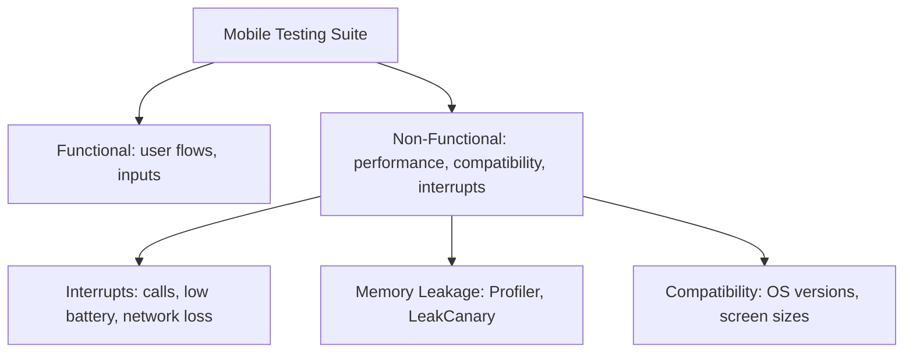
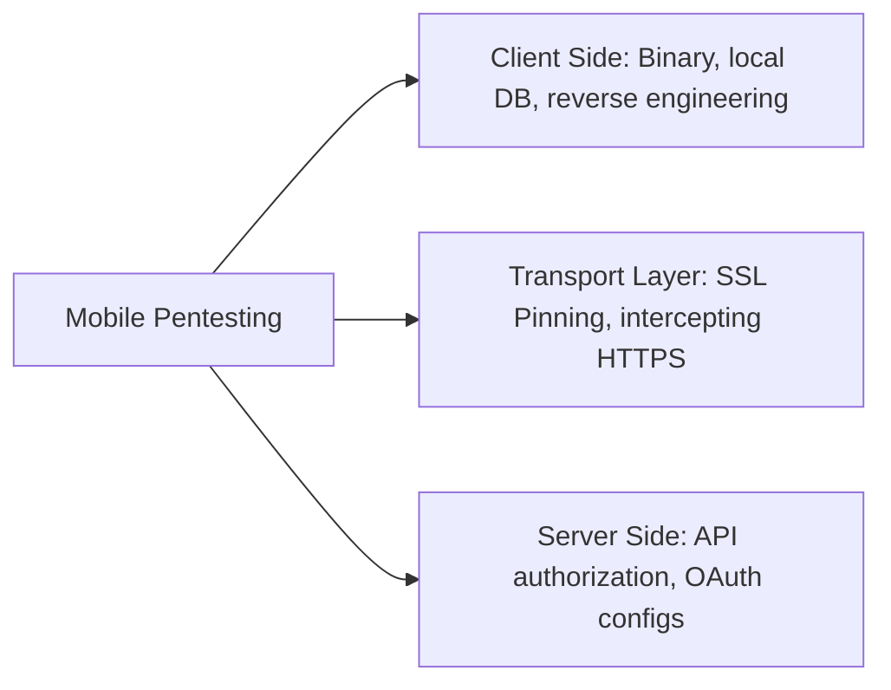
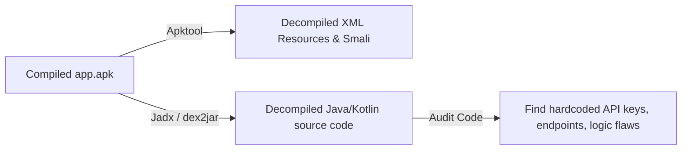
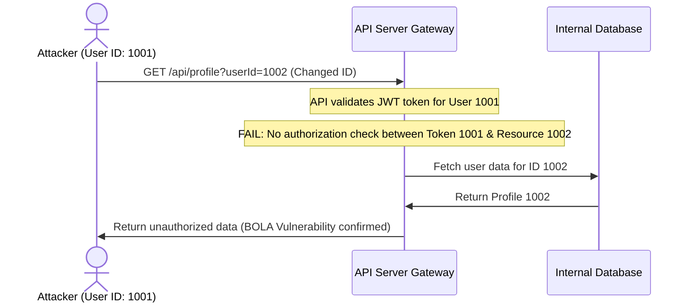
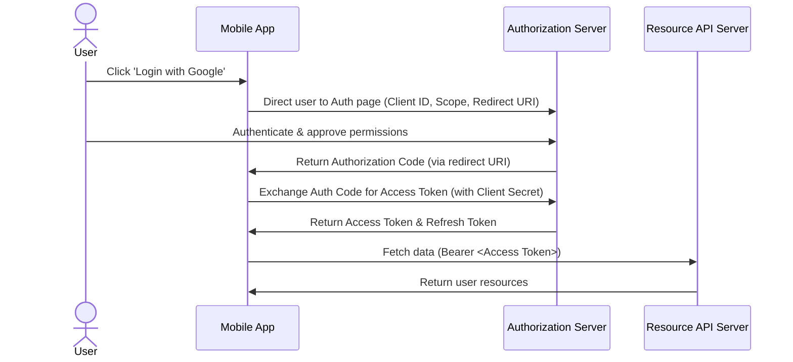

# 🛡️ Mobile App Testing, Security, and Penetration Testing — Complete Interview Preparation Guide

> **Authoritative Technical Reference**  
> Designed for Android Developers and Security Engineers with 2–5 years of experience. This guide covers mobile app QA testing methodologies, bug classification, automation, mobile app security, reverse engineering, certificate pinning, insecure storage analysis, and API/OAuth security testing in **Android 15** environments.

---

## 📑 Table of Contents

1. [Module 1: Mobile Application QA & Automation Testing](#1-mobile-application-qa--automation-testing)
2. [Module 2: Bug Severity, Priority, and Classification](#2-bug-severity-priority-and-classification)
3. [Module 3: Mobile Application Penetration Testing (Pentesting)](#3-mobile-application-penetration-testing-pentesting)
4. [Module 4: Insecure Local Storage & Reverse Engineering](#4-insecure-local-storage--reverse-engineering)
5. [Module 5: Mobile API Security, BOLA, and Rate Limiting](#5-mobile-api-security-bola-and-rate-limiting)
6. [Module 6: OAuth & Authentication Security Testing](#6-oauth--authentication-security-testing)

---

# 1. Mobile Application QA & Automation Testing

## 1.1 Mobile Testing Types

### Definition
* **Simple:** Mobile app testing is the process of checking a mobile app to make sure it functions correctly, performs well, is secure, and works on different devices.
* **Advanced:** Mobile testing involves running a suite of functional and non-functional verifications (such as interrupt checking, memory analysis, compatibility matrices, and security audits) specifically optimized for the constraints of mobile operating systems.



### Core Testing Categories
1. **Functional Testing:** Verifies that all features of the application perform as specified in the business requirements.
2. **Performance Testing:** Analyzes resource consumption (CPU spikes, memory allocation, render speeds) under heavy user loads.
3. **Memory Leakage Testing:** Monitors heap memory allocations to identify unreleased objects.
4. **Interrupt Testing:** Checks how the application handles sudden interruptions (e.g., incoming phone calls, SMS notifications, battery low warnings, or network drops) and resumes its previous state safely.
5. **Compatibility Testing:** Verifies that the app functions across diverse screen resolutions, hardware architectures (ARM vs. x86), and OS versions (Android 5.0 to 15).

---

## 1.2 Native, Web, and Hybrid Applications

### Comparison Table

| Feature | Native Applications | Mobile Web Applications | Hybrid Applications |
|---|---|---|---|
| **Development Platform** | Platforms-specific (Kotlin/Swift) | HTML5, CSS3, JavaScript | Wrapper containers (Ionic, React Native, Flutter) |
| **Execution Speed** | Extremely High (Compiled native code) | Medium (Runs inside browser sandbox) | High (Native rendering bridge) |
| **Hardware Access** | Complete (Direct API calls) | Limited (Depends on browser capabilities) | Good (Accesses sensors via JavaScript bridges) |
| **Distribution** | App Stores | Direct URL | App Stores |
| **Update Process** | User must download updates | Instant updates on host server | Mix (Instant JS bundle push vs. Store updates) |

---

## 1.3 Emulators vs. Simulators

* **Emulator (Android Emulator):** A software program that virtualizes the **hardware architecture** of the target system (e.g., emulating an ARM processor on an x86 computer via QEMU). It runs the actual Android operating system kernel and libraries, providing a high-fidelity test environment close to a real device.
* **Simulator (iOS Simulator):** A software tool that copies the **software behaviors** of the target device onto the host operating system, executing compiled code directly on the host CPU without hardware translation. It does not run the actual device kernel, making it faster but less accurate for hardware-specific tests.

---

# 2. Bug Severity, Priority, and Classification

## 2.1 Severity vs. Priority

* **Severity:** Defines the technical impact of a defect on the software functionality. It is evaluated from a system perspective (e.g., does it crash the system, or is it a minor cosmetic alignment issue?).
* **Priority:** Defines the business urgency of fixing the defect. It is evaluated from a product/market perspective (e.g., how quickly must this bug be fixed to prevent financial or user loss?).

```mermaid
grid
  Severity (System Impact) | Priority (Business Urgency)
  High Severity / High Priority: App crashes on launch. | High Severity / Low Priority: Crash on an obsolete, rare OS version.
  Low Severity / High Priority: Typo in the company logo on login screen. | Low Severity / Low Priority: Minor color mismatch in deep settings.
```

### Bug Classifications
1. **Critical:** Disables primary application pathways (e.g., user checkout crashes completely). No workaround exists.
2. **Major:** A major feature does not function as expected, but the overall application remains operational (e.g., profile editing is failing, but users can still search and purchase products).
3. **Minor:** Visual or non-functional bugs that do not hinder operations (e.g., missing margins, incorrect hyphenation, or minor typos).
4. **Blocker:** Prevents the QA team from performing further tests (e.g., the login button is completely disabled, blocking access to all inner pages).

---

# 3. Mobile Application Penetration Testing (Pentesting)

## 3.1 Mobile vs. Web Pentesting

### Definition
* **Simple:** Mobile pentesting is a security test where we try to hack a mobile app to find security gaps before real hackers do.
* **Advanced:** Mobile application penetration testing is a structured security audit that combines static application security testing (SAST) on decrypted binaries, dynamic application security testing (DAST) of memory and filesystems, and API-level authorization verification.



### Comparison Table

| Feature | Mobile Pentesting | Web Pentesting |
|---|---|---|
| **Primary Scope** | Binary analysis, SQLite encryption, runtime memory manipulation | Server-side logic, session management, database injections |
| **Attack Surface** | Local storage, IPC components, shared preferences, root checks | Web parameters, headers, cookies, server configuration |
| **Interception** | Requires certificate installation & SSL pinning bypasses | Standard proxy setup (Burp Suite) |
| **Reverse Engineering** | Essential (dex2jar, Jadx, Apktool) | Generally not applicable (JavaScript is source-visible) |

---

## 3.2 Dynamic Traffic Analysis & Certificate Pinning

### Intercepting HTTPS Traffic
To perform dynamic analysis on mobile APIs, testers route the mobile device's traffic through an interception proxy (e.g. Burp Suite or OWASP ZAP). 
1. The tester installs a custom CA certificate generated by the proxy onto the test device.
2. For Android 7.0+ (API 24+), the network security config (`network_security_config.xml`) must explicitly trust user-installed certificates for debug builds:
   ```xml
   <network-security-config>
       <debug-overrides>
           <trust-anchors>
               <certificates src="user" />
           </trust-anchors>
       </debug-overrides>
   </network-security-config>
   ```

### Certificate Pinning (SSL Pinning)
* **What it is:** A security mechanism where an app only trusts a pre-defined cryptographic public key or certificate hash, rejecting all other certificates, even if they are trusted by the device's root certificate store.
* **Bypassing SSL Pinning during Pentests:** Testers use runtime hook tools (like **Frida** or **Objection**) to inject Javascript code into the running application memory, overriding the certificate validation methods (such as `TrustManager` classes) to accept the proxy's certificate.

---

# 4. Insecure Local Storage & Reverse Engineering

## 4.1 Insecure Local Storage

### Definition
* **Simple:** Storing sensitive information (like user passwords or API tokens) in standard text files on the device that can be easily read by other apps or rooted devices.
* **Advanced:** Storing unencrypted cryptographic keys, authentication tokens (JWTs), or personally identifiable information (PII) inside vulnerable device storage spaces (e.g., standard `SharedPreferences`, unprotected SQLite databases, or external SD card storage).

### Real Scenario: Testing Local Storage Vulnerabilities
To audit insecure local storage on an Android device:
1. Connect the test device via ADB and access the app's sandboxed directory:
   ```bash
   adb shell
   run-as com.example.vulnerableapp
   cd /data/data/com.example.vulnerableapp/
   ```
2. Inspect the subfolders:
   * **`shared_prefs/`:** Check XML files for plain-text credentials or API tokens.
   * **`databases/`:** Attempt to open SQLite files directly using `sqlite3` to verify if they are unencrypted.
3. **Remediation:** Sensitive keys should be stored in **EncryptedSharedPreferences** or encrypted databases (like **SQLCipher**), with keys managed by the **Android Keystore System**.

---

## 4.2 Reverse Engineering Mobile Binaries

### Definition
Reverse engineering is the process of decompiling an APK back into readable source code (Java/Kotlin classes, XML configurations) to analyze its inner workings.



### Common Tools
* **Apktool:** Decodes resources to nearly original form and rebuilds them back into an APK after modifications.
* **Jadx-GUI:** Directly decompiles DEX files into readable Java/Kotlin source code.
* **Frida:** A dynamic instrumentation toolkit that lets you inject custom scripts into the black-box process of an application to bypass check logic at runtime.

---

# 5. Mobile API Security, BOLA, and Rate Limiting

## 5.1 Broken Object Level Authorization (BOLA)

### Definition
* **Simple:** An authorization bug where a user can access another user's private data simply by changing the ID number in the API request.
* **Advanced:** An access control vulnerability occurring when an API endpoint exposes object resource identifiers and fails to perform validation checks to ensure the requesting user has the authorization to access the requested resource.



### Real Scenario: Exploiting BOLA
1. Intercept a user profile request in Burp Suite:
   `GET /v1/users/accounts/1001` with `Authorization: Bearer <Token_for_User_1001>`
2. Change the final ID parameter:
   `GET /v1/users/accounts/1002`
3. If the server returns account details for User 1002 without validating that the authenticated token owns account 1002, the endpoint is vulnerable to BOLA.
4. **Remediation:** Enforce authorization checks at the data controller layer using session-based owner checks (e.g. verifying `current_user.id == requested_user.id`).

---

## 5.2 Rate Limiting

### Definition
* **Simple:** Restricting the number of times a user can make an API request within a specific timeframe (e.g., limiting login attempts to 5 per minute).
* **Advanced:** An API constraint mechanism designed to control the rate of incoming traffic, preventing denial of service (DoS), brute force credential validation, and automated scraping attacks.

### Implementing Rate Limiting
APIs implement rate limiting at the gateway level (e.g., using Nginx or API Gateways) using algorithms like **Token Bucket** or **Leaky Bucket**, sending an HTTP status code **`429 Too Many Requests`** when thresholds are exceeded.

---

# 6. OAuth & Authentication Security Testing

## 6.1 OAuth Authorization Flow

OAuth is an open-standard authorization framework that allows third-party applications to access user resources securely without exposing user passwords.



---

## 6.2 OAuth Security Vulnerabilities

1. **Insecure Redirect URIs:** If the authorization server does not enforce exact matching for redirect URIs, attackers can intercept authorization codes using wildcard redirects.
2. **Missing State Parameter:** The `state` parameter prevents Cross-Site Request Forgery (CSRF). If missing or not validated, an attacker can link their resource accounts to a victim's session.
3. **Insecure Token Storage:** Storing access and refresh tokens in unencrypted local storage opens them to extraction by malware or physical theft.

---

# 7. Core Interview Questions & Answers

### Q. What is the difference between a normal broadcast and an ordered broadcast, and how does it affect security?
* **Answer:** 
  * **Normal Broadcast:** Delivered asynchronously to all registered receivers at once. It is fast, but receivers cannot alter or abort the broadcast.
  * **Ordered Broadcast:** Delivered sequentially to one receiver at a time based on declared priority. Receivers can modify the broadcast content or abort the transmission entirely.
  * **Security Implications:** Attackers can register high-priority receivers to intercept, block, or manipulate data sent via ordered broadcasts. To secure broadcasts, restrict receiver scopes using custom permissions or use **LocalBroadcastManager** (or Flow streams).

### Q. How do you bypass certificate pinning during an Android application security audit?
* **Answer:** Bypassing certificate pinning requires dynamic analysis tools:
  1. Root the test device or use a custom ROM.
  2. Start the **Frida** server daemon on the device.
  3. Load Frida injection scripts on the host PC (like Universal Android SSL Pinning Bypass scripts) targeting classes like `OkHttpClient`, `TrustManagerImpl`, or network library endpoints.
  4. Run the app under Frida’s control to hook and override SSL validation methods, causing them to return true for all custom certificates.

### Q. What is Broken Object Level Authorization (BOLA), and how is it tested on mobile APIs?
* **Answer:** BOLA occurs when an API endpoint processes object identifiers directly without checking if the authenticated user has access rights to that resource. 
  * **Testing Method:** Log into the app with Account A, record the request URLs and resource IDs using a proxy. Log into Account B, modify the API request parameters of A to access B's resource IDs. If Account A receives the private data of B, the API has a BOLA vulnerability.
