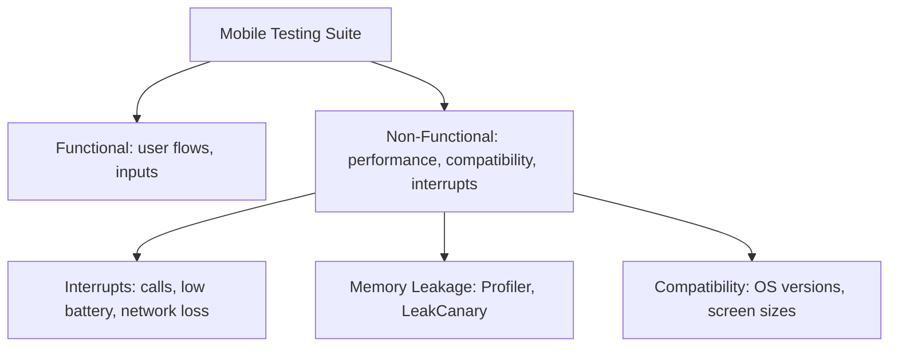
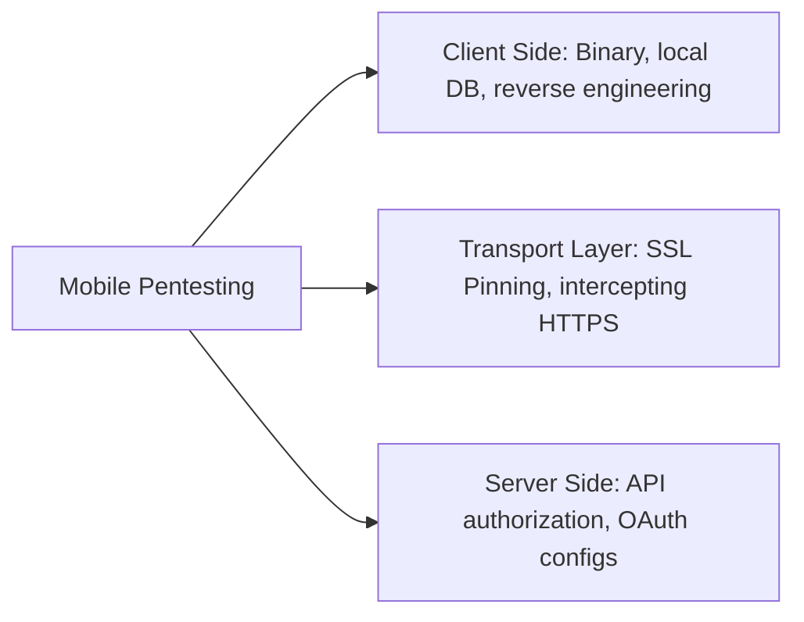
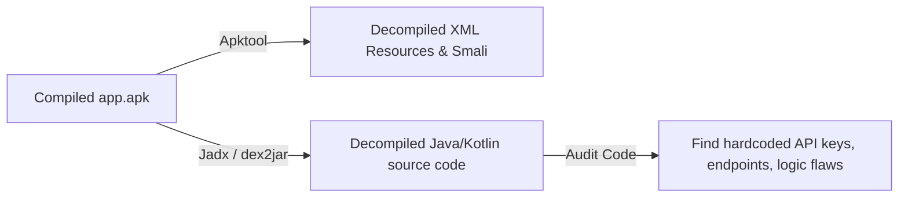
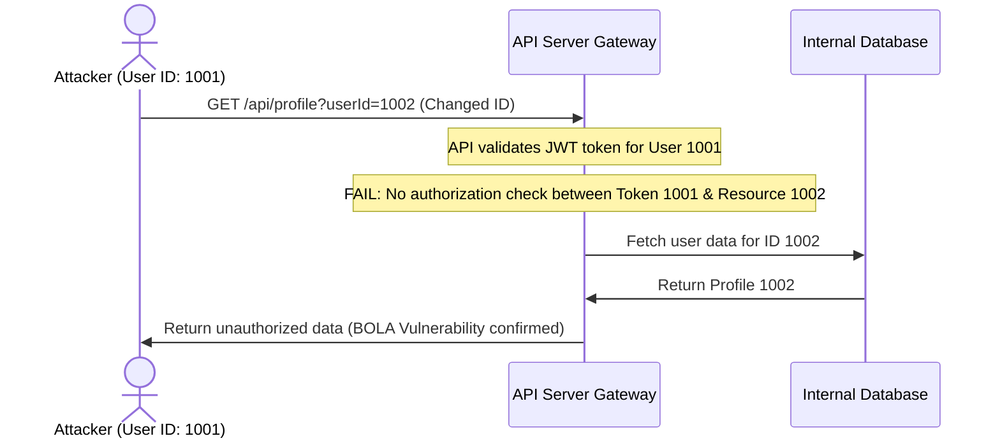
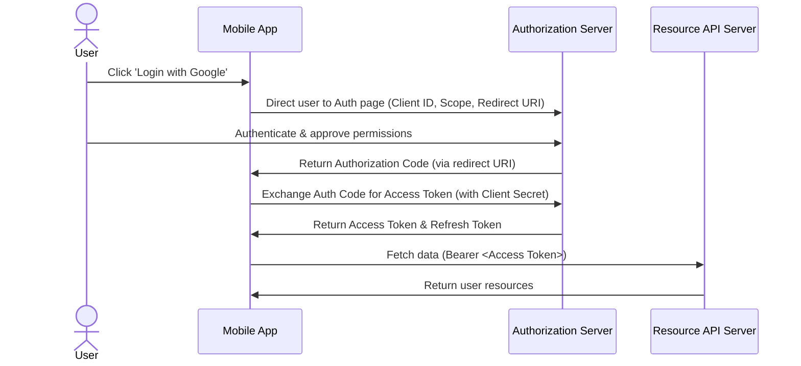

# 🛡️ Mobile Testing, Security, and Penetration Testing — Complete Interview Preparation Guide

> **Authoritative Technical Reference**
> Every topic follows the same structure — **Definition → Why It Is Used → How It Works Internally → Code Example → Common Pitfalls**.
>
> Covers both sides: the **testing stack** an Android engineer is expected to build, and the **security posture** a pentester will probe.
>
> **25 testing & security interview questions:** [Section 12](#12-testing--security-interview-questions-25-questions)

---

## 📑 Table of Contents

| # | Module | Key Topics |
|---|---|---|
| 1 | [Mobile QA & Automation Testing](#1-mobile-application-qa--automation-testing) | Testing types, native vs hybrid, emulators vs simulators |
| 2 | [The Android Testing Stack](#2-the-android-testing-stack) | Testing pyramid, JUnit/MockK/Turbine, Robolectric, Espresso, UI Automator, coverage, CI |
| 3 | [Bug Severity & Classification](#3-bug-severity-priority-and-classification) | Severity vs priority, bug taxonomy |
| 4 | [Mobile Penetration Testing](#4-mobile-application-penetration-testing-pentesting) | Mobile vs web pentesting, traffic interception, pinning bypass |
| 5 | [Insecure Storage & Reverse Engineering](#5-insecure-local-storage--reverse-engineering) | Local storage attacks, decompilation toolchain |
| 6 | [API Security, BOLA & Rate Limiting](#6-mobile-api-security-bola-and-rate-limiting) | Object-level authorization, abuse prevention |
| 7 | [OAuth & Authentication Testing](#7-oauth--authentication-security-testing) | Authorization flow, PKCE, common vulnerabilities |
| 8 | [Secure Storage & Keystore](#8-secure-storage-android-keystore-and-encrypted-data) | Keystore, StrongBox, encrypted DataStore, SQLCipher, backup rules |
| 9 | [Network Security](#9-network-security-tls-pinning-and-network-security-config) | Network Security Config, pinning, TLS hardening |
| 10 | [App Hardening](#10-app-hardening-root-detection-tamper-detection-and-anti-reversing) | Root/tamper/Frida detection, R8 hardening, Play Integrity |
| 11 | [OWASP MASVS & Mobile Top 10](#11-owasp-masvs-and-the-mobile-top-10) | MASVS control groups, Top 10 with Android specifics |
| 12 | [Interview Questions](#12-interview-questions) | Pointer to the question bank |

---

# 1. Mobile Application QA & Automation Testing

## 1.1 Mobile Testing Types

### Definition
* **Simple:** Mobile app testing is the process of checking a mobile app to make sure it functions correctly, performs well, is secure, and works on different devices.
* **Advanced:** Mobile testing involves running a suite of functional and non-functional verifications (such as interrupt checking, memory analysis, compatibility matrices, and security audits) specifically optimized for the constraints of mobile operating systems.



### Core Testing Categories
1. **Functional Testing:** Verifies that all features of the application perform as specified in the business requirements.
2. **Performance Testing:** Analyzes resource consumption (CPU spikes, memory allocation, render speeds) under heavy user loads.
3. **Memory Leakage Testing:** Monitors heap memory allocations to identify unreleased objects.
4. **Interrupt Testing:** Checks how the application handles sudden interruptions (e.g., incoming phone calls, SMS notifications, battery low warnings, or network drops) and resumes its previous state safely.
5. **Compatibility Testing:** Verifies that the app functions across diverse screen resolutions, hardware architectures (ARM vs. x86), and OS versions (Android 5.0 to 15).

---

## 1.2 Native, Web, and Hybrid Applications

### Definition
* **Native app** — built with the platform's own SDK and language, compiled to run directly on the device. It has full access to hardware APIs and the best performance.
* **Web app** — a website accessed through a browser. It is not installed, cannot use most device APIs, and is updated purely server-side.
* **Hybrid app** — a native shell hosting web content in a `WebView`. It installs like a native app but renders like a web page, so it inherits the WebView's performance and its security surface.
* **Cross-platform app** — one codebase compiled or interpreted for several platforms (Flutter, React Native, KMP). Distinct from hybrid: the UI is not necessarily web content.
* **Why the distinction matters to testing** — each type fails differently. Native testing exercises platform APIs and lifecycle; hybrid testing must cover the web/native bridge, which is where most of its vulnerabilities live.

### Comparison Table

| Feature | Native Applications | Mobile Web Applications | Hybrid Applications |
|---|---|---|---|
| **Development Platform** | Platforms-specific (Kotlin/Swift) | HTML5, CSS3, JavaScript | Wrapper containers (Ionic, React Native, Flutter) |
| **Execution Speed** | Extremely High (Compiled native code) | Medium (Runs inside browser sandbox) | High (Native rendering bridge) |
| **Hardware Access** | Complete (Direct API calls) | Limited (Depends on browser capabilities) | Good (Accesses sensors via JavaScript bridges) |
| **Distribution** | App Stores | Direct URL | App Stores |
| **Update Process** | User must download updates | Instant updates on host server | Mix (Instant JS bundle push vs. Store updates) |

---

## 1.3 Emulators vs. Simulators

### Definition
* **Emulator** — software that reproduces the target device's **hardware**, including its CPU instruction set, so unmodified device binaries run. The Android emulator is one.
* **Simulator** — software that reproduces the target's **behavior** using the host's own architecture and libraries, without emulating hardware. The iOS Simulator is one.
* **The practical consequence** — an emulator is slower but far more faithful; a simulator is fast but cannot reveal architecture-specific bugs, real hardware behavior, or true performance.
* **Why neither replaces a device** — thermal throttling, real storage I/O speed, actual GPU behavior, cellular conditions, and OEM firmware modifications exist only on hardware.

* **Emulator (Android Emulator):** A software program that virtualizes the **hardware architecture** of the target system (e.g., emulating an ARM processor on an x86 computer via QEMU). It runs the actual Android operating system kernel and libraries, providing a high-fidelity test environment close to a real device.
* **Simulator (iOS Simulator):** A software tool that copies the **software behaviors** of the target device onto the host operating system, executing compiled code directly on the host CPU without hardware translation. It does not run the actual device kernel, making it faster but less accurate for hardware-specific tests.

---

# 2. The Android Testing Stack

## 2.1 The Testing Pyramid on Android

### Definition
* **Unit tests** — pure JVM, no Android framework, milliseconds each.
* **Integration / Robolectric tests** — JVM, with a simulated Android framework, tens of milliseconds each.
* **Instrumented UI tests** — real device or emulator, seconds to minutes each.

### Why It Is Used
Instrumented tests are 100–1000× slower than JVM tests and far more flaky. A pyramid shape — many unit tests, fewer integration tests, a thin layer of end-to-end tests — keeps the suite fast enough that developers actually run it.

### How It Works Internally

| Layer | Location | Runs On | Typical Count |
|---|---|---|---|
| Unit | `src/test/` | JVM | Hundreds to thousands |
| Robolectric | `src/test/` | JVM with shadowed framework | Tens to hundreds |
| Instrumented | `src/androidTest/` | Device / emulator | Tens |
| Screenshot | `src/test/` (Paparazzi) or device | Either | Tens |

**What belongs where:** ViewModels, repositories, mappers, and use cases are pure Kotlin and belong in `src/test/`. Anything needing `Context`, `Resources`, or a real `Looper` can run under Robolectric on the JVM. Only genuine end-to-end user journeys justify an instrumented test.

### Code Example
```gradle
dependencies {
    testImplementation("junit:junit:4.13.2")
    testImplementation("io.mockk:mockk:1.13.x")
    testImplementation("org.jetbrains.kotlinx:kotlinx-coroutines-test:1.9.x")
    testImplementation("app.cash.turbine:turbine:1.x")
    testImplementation("com.google.truth:truth:1.4.x")
    testImplementation("org.robolectric:robolectric:4.x")
    testImplementation("androidx.test.ext:junit:1.2.x")

    androidTestImplementation("androidx.test.espresso:espresso-core:3.6.x")
    androidTestImplementation("androidx.compose.ui:ui-test-junit4")
    androidTestImplementation("androidx.test.uiautomator:uiautomator:2.3.x")
    debugImplementation("androidx.compose.ui:ui-test-manifest")
}

android {
    testOptions {
        unitTests {
            isIncludeAndroidResources = true    // Required for Robolectric
            isReturnDefaultValues = true        // Stub android.jar methods return defaults, not throw
        }
    }
}
```

---

## 2.2 Unit Testing ViewModels, Coroutines, and Flow

### Definition
* **Unit test** — exercising one unit of behavior with its collaborators replaced, running on the JVM in milliseconds with no device.
* **Why a ViewModel is the highest-value unit** — it holds the screen's entire decision logic, so testing it directly gives near-complete behavioral coverage without an emulator.
* **`Dispatchers.setMain`** — replaces the main dispatcher, which `viewModelScope` requires and which does not exist on the JVM.
* **`TestDispatcher`** — a dispatcher whose scheduler you control. `StandardTestDispatcher` queues coroutines until you advance time (deterministic); `UnconfinedTestDispatcher` runs them eagerly.
* **Virtual time** — `runTest` skips `delay` rather than waiting, so a 30-second timeout is testable in microseconds.
* **Turbine** — collects a `Flow` into a queue with `awaitItem()` and **fails the test on an unconsumed emission**, which is what catches unexpected extra states.

### Why It Is Used
A ViewModel holds the screen's entire decision logic. Testing it directly gives near-complete behavioral coverage at unit-test speed, without an emulator.

### How It Works Internally
* **`StandardTestDispatcher`** queues coroutines; nothing runs until `advanceUntilIdle()` or `runCurrent()`. This gives deterministic control over timing, including `delay`, which is skipped virtually rather than actually waited on.
* **`UnconfinedTestDispatcher`** runs coroutines eagerly — convenient for simple cases, but it hides ordering bugs.
* **`Dispatchers.setMain`** replaces the main dispatcher, which `viewModelScope` uses. Without it, every ViewModel test throws "Module with the Main dispatcher had failed to initialize".
* **Turbine** collects a `Flow` into a queue with `awaitItem()`/`awaitComplete()`, and fails the test if an emission is unconsumed — which catches the "extra emission" bugs plain `toList()` misses.

### Code Example
```kotlin
// Reusable rule: swaps the Main dispatcher for every test in the class
class MainDispatcherRule(
    private val dispatcher: TestDispatcher = StandardTestDispatcher()
) : TestWatcher() {
    override fun starting(description: Description) = Dispatchers.setMain(dispatcher)
    override fun finished(description: Description) = Dispatchers.resetMain()
}

class SearchViewModelTest {

    @get:Rule val mainDispatcher = MainDispatcherRule()

    // A hand-written fake is usually clearer and more robust than a mock,
    // because it encodes the collaborator's real contract once.
    private val repo = FakeSearchRepository()
    private lateinit var viewModel: SearchViewModel

    @Before fun setUp() { viewModel = SearchViewModel(repo, SavedStateHandle()) }

    @Test
    fun `debounces input and emits results`() = runTest {
        viewModel.uiState.test {                         // Turbine
            assertThat(awaitItem()).isEqualTo(SearchUiState.Idle)

            viewModel.onQueryChange("ka")
            viewModel.onQueryChange("kot")
            viewModel.onQueryChange("kotlin")

            // Virtual time: the 300 ms debounce elapses instantly
            advanceTimeBy(301)

            assertThat(awaitItem()).isEqualTo(SearchUiState.Loading)
            val success = awaitItem() as SearchUiState.Success
            assertThat(success.results).hasSize(3)

            // Only ONE request fired despite three keystrokes — the debounce assertion
            assertThat(repo.searchCallCount).isEqualTo(1)

            cancelAndIgnoreRemainingEvents()
        }
    }

    @Test
    fun `network failure surfaces an offline error and keeps prior results`() = runTest {
        repo.failNext(IOException())

        viewModel.onQueryChange("kotlin")
        advanceUntilIdle()                               // Run every queued coroutine to completion

        assertThat(viewModel.uiState.value)
            .isInstanceOf(SearchUiState.Error::class.java)
    }
}

// A fake, not a mock: real behavior, controllable, no verify() brittleness
class FakeSearchRepository : SearchRepository {
    var searchCallCount = 0; private set
    private var nextFailure: Throwable? = null

    fun failNext(t: Throwable) { nextFailure = t }

    override fun search(query: String, filters: Filters): Flow<List<Result>> = flow {
        searchCallCount++
        nextFailure?.let { nextFailure = null; throw it }
        emit(List(3) { Result(id = it.toLong(), title = "$query $it") })
    }
}
```

```kotlin
// Room DAO tests run fast on the JVM with an in-memory database under Robolectric
@RunWith(RobolectricTestRunner::class)
class UserDaoTest {
    private lateinit var db: AppDatabase
    private lateinit var dao: UserDao

    @Before fun create() {
        db = Room.inMemoryDatabaseBuilder(
            ApplicationProvider.getApplicationContext(), AppDatabase::class.java
        ).allowMainThreadQueries().build()
        dao = db.userDao()
    }

    @After fun close() = db.close()

    @Test
    fun `upsert replaces an existing row and emits once`() = runTest {
        dao.upsert(UserEntity(1, "Ada"))
        dao.upsert(UserEntity(1, "Ada Lovelace"))

        dao.observeAll().test {
            assertThat(awaitItem().single().name).isEqualTo("Ada Lovelace")
        }
    }
}

// Retrofit tests against MockWebServer: real HTTP, real parsing, no network
class UserApiTest {
    private val server = MockWebServer()
    private val api = Retrofit.Builder()
        .baseUrl(server.url("/"))
        .addConverterFactory(Json.asConverterFactory("application/json".toMediaType()))
        .build().create(UserApi::class.java)

    @Test
    fun `unknown JSON fields do not break parsing`() = runTest {
        server.enqueue(MockResponse().setBody("""{"id":1,"full_name":"Ada","new_field":"x"}"""))
        val user = api.getUser(1)
        assertThat(user.fullName).isEqualTo("Ada")
    }

    @Test
    fun `500 maps to a server error`() = runTest {
        server.enqueue(MockResponse().setResponseCode(500))
        val result = safeApiCall { api.getUser(1) }
        assertThat(result).isEqualTo(DataResult.Failure(AppError.Server(500)))
    }
}
```

### Common Pitfalls
* **Forgetting `Dispatchers.setMain`.** Every `viewModelScope` test fails at construction.
* **`Thread.sleep` in a coroutine test.** `runTest` uses virtual time; sleeping wastes real time and does not advance the scheduler. Use `advanceTimeBy` / `advanceUntilIdle`.
* **Over-mocking.** `verify(exactly = 1) { repo.search(any()) }` couples the test to the implementation. Assert on observable state instead.
* **`UnconfinedTestDispatcher` everywhere.** It hides ordering bugs that `StandardTestDispatcher` would surface.
* **Testing `StateFlow` with `.value` only.** Intermediate emissions (Loading) are missed. Use Turbine.

---

## 2.3 Instrumented UI Testing: Espresso, UI Automator, Compose

### Definition
* **Espresso** — in-process View testing with automatic synchronization against the main-thread message queue.
* **UI Automator** — cross-process testing that can drive system UI, notifications, and other apps.
* **Compose test rule** — semantics-tree testing for Compose UI.

### Why It Is Used
They verify the wiring that unit tests cannot: does tapping this actually navigate, does the permission dialog flow work, does the notification open the right screen.

### How It Works Internally
Espresso's synchronization is its defining feature: before each interaction it waits until the message queue is empty and all registered `IdlingResource`s are idle. This eliminates the `sleep`-and-hope pattern — but only for work Espresso can see. Background coroutines and OkHttp calls are invisible to it unless you register an idling resource or, better, inject test doubles.

| Tool | Scope | Use For |
|---|---|---|
| Espresso | Your app's Views, in-process | View-based screens |
| Compose rule | Your app's semantics tree | Compose screens |
| UI Automator | Whole device, cross-process | Permission dialogs, notifications, multi-app flows |

### Code Example
```kotlin
@HiltAndroidTest
@RunWith(AndroidJUnit4::class)
class LoginFlowTest {

    @get:Rule(order = 0) val hilt = HiltAndroidRule(this)
    @get:Rule(order = 1) val compose = createAndroidComposeRule<MainActivity>()

    // Replace the real network module with a fake for the whole test run.
    // This removes the largest source of UI-test flakiness: the network.
    @BindValue @JvmField val repository: AuthRepository = FakeAuthRepository()

    @Test
    fun successful_login_navigates_to_home() {
        compose.onNodeWithTag("email").performTextInput("ada@example.com")
        compose.onNodeWithTag("password").performTextInput("correct-horse")
        compose.onNodeWithText("Sign in").performClick()

        // waitUntil polls with a timeout — correct; Thread.sleep is not
        compose.waitUntil(timeoutMillis = 5_000) {
            compose.onAllNodesWithTag("home_screen").fetchSemanticsNodes().isNotEmpty()
        }
        compose.onNodeWithTag("home_screen").assertIsDisplayed()
    }
}
```

```kotlin
// Espresso for a View-based screen
@Test
fun submitting_empty_form_shows_validation_errors() {
    onView(withId(R.id.submit)).perform(click())
    onView(withId(R.id.email_layout))
        .check(matches(hasDescendant(withText(R.string.error_email_required))))
}

// RecyclerView interactions need the contrib actions
onView(withId(R.id.list))
    .perform(RecyclerViewActions.actionOnItemAtPosition<UserViewHolder>(5, click()))
```

```kotlin
// UI Automator: system dialogs Espresso cannot reach
@Test
fun granting_camera_permission_opens_the_viewfinder() {
    val device = UiDevice.getInstance(InstrumentationRegistry.getInstrumentation())

    onView(withId(R.id.take_photo)).perform(click())

    // The permission dialog belongs to the system package, not to your app
    val allow = device.findObject(
        UiSelector().textMatches("(?i)allow|while using the app")
    )
    if (allow.exists()) allow.click()

    onView(withId(R.id.viewfinder)).check(matches(isDisplayed()))
}
```

```kotlin
// Deterministic tests: disable animations, or Espresso's synchronization fights them
// In the Gradle config:
//   testOptions { animationsDisabled = true }
// Or on the device:
//   adb shell settings put global window_animation_scale 0
//   adb shell settings put global transition_animation_scale 0
//   adb shell settings put global animator_duration_scale 0
```

### Common Pitfalls
* **Hitting the real network in UI tests.** Every test then depends on staging availability. Inject fakes with `@BindValue` or a test Hilt module.
* **`Thread.sleep` to "fix" flakiness.** It makes the suite slow and still flaky. Use `waitUntil` or an `IdlingResource`.
* **Animations left enabled.** Espresso's idle detection interacts badly with running animations.
* **Tests that depend on each other's order.** Every test must set up and tear down its own state; shared state produces failures that only appear in CI.
* **Asserting on test tags only.** They prove structure, not that a user could complete the task.

---

## 2.4 Test Doubles, Coverage, and CI

### Definition
* **Stub** — returns canned data.
* **Fake** — a working lightweight implementation (in-memory repository).
* **Mock** — records interactions so you can verify them.
* **Spy** — a real object with some methods overridden.

### Why It Is Used
Choosing the wrong double is the main cause of brittle tests. Mocks couple the test to *how* the code works; fakes couple it only to *what* the collaborator promises, so a refactor that preserves behavior does not break the suite.

### How It Works Internally
MockK generates a proxy class at runtime and records calls. `mockkStatic`/`mockkObject` rewrite bytecode to intercept static and object members — powerful, but a signal that the code under test has a hard dependency that should have been injected.

### Code Example
```kotlin
// MockK basics
val api = mockk<UserApi>()
coEvery { api.getUser(1) } returns UserDto(1, "Ada")
coEvery { api.getUser(404) } throws HttpException(Response.error<Any>(404, "".toResponseBody()))

// relaxed = true auto-stubs every method, useful for fire-and-forget collaborators
val analytics = mockk<Analytics>(relaxed = true)

// Verify only when the INTERACTION is the behavior under test (e.g. "we log this event")
coVerify(exactly = 1) { analytics.track("purchase_completed", any()) }

// Capturing an argument for detailed assertions
val slot = slot<PurchaseEvent>()
coVerify { analytics.trackPurchase(capture(slot)) }
assertThat(slot.captured.amountCents).isEqualTo(1999)
```

```gradle
// JaCoCo coverage with realistic exclusions
tasks.register<JacocoReport>("jacocoTestReport") {
    dependsOn("testDebugUnitTest")
    reports { xml.required.set(true); html.required.set(true) }

    val excludes = listOf(
        "**/R.class", "**/R$*.class", "**/BuildConfig.*",
        "**/*_Hilt*.*", "**/hilt_aggregated_deps/**",      // Generated DI code
        "**/*Binding.*",                                    // Generated view binding
        "**/databinding/**"
    )
    classDirectories.setFrom(
        fileTree(layout.buildDirectory.dir("tmp/kotlin-classes/debug")) { exclude(excludes) }
    )
    sourceDirectories.setFrom(files("src/main/kotlin", "src/main/java"))
    executionData.setFrom(fileTree(layout.buildDirectory) { include("**/*.exec") })
}
```

```yaml
# CI: run the fast suite on every push, the slow suite on merge
name: android-ci
on: [push, pull_request]
jobs:
  unit:
    runs-on: ubuntu-latest
    steps:
      - uses: actions/checkout@v4
      - uses: actions/setup-java@v4
        with: { distribution: temurin, java-version: '17' }
      - uses: gradle/actions/setup-gradle@v4
      - run: ./gradlew testDebugUnitTest lintDebug
      - run: ./gradlew jacocoTestReport
      - uses: actions/upload-artifact@v4
        if: always()
        with: { name: test-reports, path: '**/build/reports/' }

  instrumented:
    runs-on: ubuntu-latest
    if: github.event_name == 'pull_request'
    steps:
      - uses: actions/checkout@v4
      - uses: reactivecircus/android-emulator-runner@v2
        with:
          api-level: 34
          # Disabling animations is what makes emulator tests reliable in CI
          script: ./gradlew connectedDebugAndroidTest
```

### Common Pitfalls
* **Chasing a coverage percentage.** 100% coverage of getters proves nothing. Cover decision logic and error paths.
* **Mocking types you own.** A fake is usually clearer and survives refactoring.
* **Mocking the Android framework.** If a test needs `mockkStatic(TextUtils::class)`, the production code should have taken an injectable abstraction instead.
* **Not excluding generated code from coverage.** Hilt and ViewBinding generate thousands of uncovered lines, making the number meaningless.
* **Flaky tests left quarantined indefinitely.** A quarantined test is a test that does not exist; fix it or delete it.

---
# 3. Bug Severity, Priority, and Classification

## 3.1 Severity vs. Priority

### Definition
* **Severity** — how badly the defect affects the **product** when it occurs: does it crash, corrupt data, block a flow, or merely look wrong? It is an objective, technical judgement, usually set by whoever finds it.
* **Priority** — how urgently it should be **fixed**, relative to everything else in the backlog. It is a business judgement weighing user impact, frequency, visibility, and cost.
* **Why they are tracked separately** — they genuinely diverge. A crash in a feature nobody uses is *high severity, low priority*; a typo in the company name on the launch screen is *low severity, highest priority*.
* **Frequency and reach** — the two factors that most often move priority away from severity: how many users hit it, and how often.

* **Severity:** Defines the technical impact of a defect on the software functionality. It is evaluated from a system perspective (e.g., does it crash the system, or is it a minor cosmetic alignment issue?).
* **Priority:** Defines the business urgency of fixing the defect. It is evaluated from a product/market perspective (e.g., how quickly must this bug be fixed to prevent financial or user loss?).

```mermaid
grid
  Severity (System Impact) | Priority (Business Urgency)
  High Severity / High Priority: App crashes on launch. | High Severity / Low Priority: Crash on an obsolete, rare OS version.
  Low Severity / High Priority: Typo in the company logo on login screen. | Low Severity / Low Priority: Minor color mismatch in deep settings.
```

### Bug Classifications
1. **Critical:** Disables primary application pathways (e.g., user checkout crashes completely). No workaround exists.
2. **Major:** A major feature does not function as expected, but the overall application remains operational (e.g., profile editing is failing, but users can still search and purchase products).
3. **Minor:** Visual or non-functional bugs that do not hinder operations (e.g., missing margins, incorrect hyphenation, or minor typos).
4. **Blocker:** Prevents the QA team from performing further tests (e.g., the login button is completely disabled, blocking access to all inner pages).

---

# 4. Mobile Application Penetration Testing (Pentesting)

## 4.1 Mobile vs. Web Pentesting

### Definition
* **Simple:** Mobile pentesting is a security test where we try to hack a mobile app to find security gaps before real hackers do.
* **Advanced:** Mobile application penetration testing is a structured security audit that combines static application security testing (SAST) on decrypted binaries, dynamic application security testing (DAST) of memory and filesystems, and API-level authorization verification.



### Comparison Table

| Feature | Mobile Pentesting | Web Pentesting |
|---|---|---|
| **Primary Scope** | Binary analysis, SQLite encryption, runtime memory manipulation | Server-side logic, session management, database injections |
| **Attack Surface** | Local storage, IPC components, shared preferences, root checks | Web parameters, headers, cookies, server configuration |
| **Interception** | Requires certificate installation & SSL pinning bypasses | Standard proxy setup (Burp Suite) |
| **Reverse Engineering** | Essential (dex2jar, Jadx, Apktool) | Generally not applicable (JavaScript is source-visible) |

---

## 4.2 Dynamic Traffic Analysis & Certificate Pinning

### Definition
* **Dynamic analysis** — examining an application while it **runs**, as opposed to static analysis of the binary at rest.
* **Intercepting proxy** — a tool (Burp Suite, mitmproxy) placed between app and server that terminates TLS on both sides so requests and responses can be read and modified.
* **Why interception needs a CA** — the proxy must present a certificate the device trusts. Installing the proxy's CA is what makes that possible.
* **The Android 7 change** — apps no longer trust **user-installed** CAs by default, so interception requires either a debug build that opts in or a rooted device.
* **Certificate pinning** — the app restricting which certificates or public keys it accepts for a host, so even a trusted-CA certificate is rejected unless it matches a pin.
* **What pinning is and is not for** — it protects **users** from network attackers. It does not protect **you** from someone who controls the device, since the check can be patched out.

### Intercepting HTTPS Traffic
To perform dynamic analysis on mobile APIs, testers route the mobile device's traffic through an interception proxy (e.g. Burp Suite or OWASP ZAP). 
1. The tester installs a custom CA certificate generated by the proxy onto the test device.
2. For Android 7.0+ (API 24+), the network security config (`network_security_config.xml`) must explicitly trust user-installed certificates for debug builds:
   ```xml
   <network-security-config>
       <debug-overrides>
           <trust-anchors>
               <certificates src="user" />
           </trust-anchors>
       </debug-overrides>
   </network-security-config>
   ```

### Certificate Pinning (SSL Pinning)
* **What it is:** A security mechanism where an app only trusts a pre-defined cryptographic public key or certificate hash, rejecting all other certificates, even if they are trusted by the device's root certificate store.
* **Bypassing SSL Pinning during Pentests:** Testers use runtime hook tools (like **Frida** or **Objection**) to inject Javascript code into the running application memory, overriding the certificate validation methods (such as `TrustManager` classes) to accept the proxy's certificate.

---

# 5. Insecure Local Storage & Reverse Engineering

## 5.1 Insecure Local Storage

### Definition
* **Simple:** Storing sensitive information (like user passwords or API tokens) in standard text files on the device that can be easily read by other apps or rooted devices.
* **Advanced:** Storing unencrypted cryptographic keys, authentication tokens (JWTs), or personally identifiable information (PII) inside vulnerable device storage spaces (e.g., standard `SharedPreferences`, unprotected SQLite databases, or external SD card storage).

### Real Scenario: Testing Local Storage Vulnerabilities
To audit insecure local storage on an Android device:
1. Connect the test device via ADB and access the app's sandboxed directory:
   ```bash
   adb shell
   run-as com.example.vulnerableapp
   cd /data/data/com.example.vulnerableapp/
   ```
2. Inspect the subfolders:
   * **`shared_prefs/`:** Check XML files for plain-text credentials or API tokens.
   * **`databases/`:** Attempt to open SQLite files directly using `sqlite3` to verify if they are unencrypted.
3. **Remediation:** Sensitive keys should be stored in **EncryptedSharedPreferences** or encrypted databases (like **SQLCipher**), with keys managed by the **Android Keystore System**.

---

## 5.2 Reverse Engineering Mobile Binaries

### Definition
Reverse engineering is the process of decompiling an APK back into readable source code (Java/Kotlin classes, XML configurations) to analyze its inner workings.



### Common Tools
* **Apktool:** Decodes resources to nearly original form and rebuilds them back into an APK after modifications.
* **Jadx-GUI:** Directly decompiles DEX files into readable Java/Kotlin source code.
* **Frida:** A dynamic instrumentation toolkit that lets you inject custom scripts into the black-box process of an application to bypass check logic at runtime.

---

# 6. Mobile API Security, BOLA, and Rate Limiting

## 6.1 Broken Object Level Authorization (BOLA)

### Definition
* **Simple:** An authorization bug where a user can access another user's private data simply by changing the ID number in the API request.
* **Advanced:** An access control vulnerability occurring when an API endpoint exposes object resource identifiers and fails to perform validation checks to ensure the requesting user has the authorization to access the requested resource.



### Real Scenario: Exploiting BOLA
1. Intercept a user profile request in Burp Suite:
   `GET /v1/users/accounts/1001` with `Authorization: Bearer <Token_for_User_1001>`
2. Change the final ID parameter:
   `GET /v1/users/accounts/1002`
3. If the server returns account details for User 1002 without validating that the authenticated token owns account 1002, the endpoint is vulnerable to BOLA.
4. **Remediation:** Enforce authorization checks at the data controller layer using session-based owner checks (e.g. verifying `current_user.id == requested_user.id`).

---

## 6.2 Rate Limiting

### Definition
* **Simple:** Restricting the number of times a user can make an API request within a specific timeframe (e.g., limiting login attempts to 5 per minute).
* **Advanced:** An API constraint mechanism designed to control the rate of incoming traffic, preventing denial of service (DoS), brute force credential validation, and automated scraping attacks.

### Implementing Rate Limiting
APIs implement rate limiting at the gateway level (e.g., using Nginx or API Gateways) using algorithms like **Token Bucket** or **Leaky Bucket**, sending an HTTP status code **`429 Too Many Requests`** when thresholds are exceeded.

---

# 7. OAuth & Authentication Security Testing

## 7.1 OAuth Authorization Flow

### Definition
* **OAuth 2.0** — a **delegated authorization** framework. It lets an app act on a user's behalf at another service without ever seeing that user's password.
* **The four roles** — the **resource owner** (the user), the **client** (your app), the **authorization server** (issues tokens), and the **resource server** (holds the data).
* **Authorization code** — a short-lived, single-use value returned to the app after the user consents, which is then exchanged for tokens. The code, not the token, travels through the browser redirect.
* **Access token** — a short-lived credential presented to the resource server on each request.
* **Refresh token** — a longer-lived credential used only to obtain a new access token, so the user does not re-authenticate constantly.
* **PKCE (Proof Key for Code Exchange)** — mandatory for mobile. The app sends a hash of a secret it generated, then proves it holds the original when redeeming the code, which defeats interception of the redirect.
* **Why mobile apps are "public clients"** — anything shipped in the binary is extractable, so a mobile app cannot hold a client secret and PKCE takes its place.

OAuth is an open-standard authorization framework that allows third-party applications to access user resources securely without exposing user passwords.



---

## 7.2 OAuth Security Vulnerabilities

### Definition
* **Why this flow attracts attacks** — it grants access to another service's data, and it involves a redirect through a channel (the browser, a custom URI scheme) that other apps on the device can observe or claim.
* **Redirect URI manipulation** — an attacker causing the authorization code to be delivered somewhere they control, which is why the server must match the redirect URI **exactly** rather than by prefix.
* **Authorization code interception** — another app registering the same custom URI scheme and receiving the code. PKCE is the countermeasure, since the code alone is then useless.
* **CSRF on the callback** — an attacker tricking the app into completing a flow they initiated. The `state` parameter, generated per request and verified on return, prevents it.
* **Implicit flow** — a deprecated variant returning the access token directly in the redirect, exposing it in logs and browser history. Authorization code plus PKCE replaces it.
* **Token storage** — the client-side half of the problem: a refresh token in plain `SharedPreferences` undoes the protocol's guarantees.

1. **Insecure Redirect URIs:** If the authorization server does not enforce exact matching for redirect URIs, attackers can intercept authorization codes using wildcard redirects.
2. **Missing State Parameter:** The `state` parameter prevents Cross-Site Request Forgery (CSRF). If missing or not validated, an attacker can link their resource accounts to a victim's session.
3. **Insecure Token Storage:** Storing access and refresh tokens in unencrypted local storage opens them to extraction by malware or physical theft.

---

# 8. Secure Storage: Android Keystore and Encrypted Data

## 8.1 The Android Keystore System

### Definition
* **Simple:** A container where cryptographic keys are generated and used but can never be read out, even by your own app.
* **Advanced:** Keystore keys live in the Trusted Execution Environment (TEE) or a dedicated secure element (StrongBox). Your app receives a *handle*; every crypto operation is executed inside the secure hardware, so the key material never enters the app's address space.

### Why It Is Used
Any key stored in `SharedPreferences`, in the APK, or in a string constant is extractable in minutes with `strings`, `jadx`, or a rooted device. Keystore makes extraction require a hardware attack rather than a decompiler.

### How It Works Internally
* **`setUserAuthenticationRequired(true)`** binds the key to biometric or device-credential authentication. The key is unusable until the user authenticates, enforced by the TEE — not by your code.
* **`setInvalidatedByBiometricEnrollment(true)`** permanently invalidates the key if a new fingerprint is enrolled, so an attacker who adds their own biometric cannot decrypt existing data.
* **StrongBox** (`setIsStrongBoxBacked(true)`) uses a separate tamper-resistant chip where available; fall back gracefully, since not every device has one.

**Key generation must be per-device, at runtime.** A key shipped in the APK is shared by every installation and is not a secret.

### Code Example
```kotlin
class SecureCipher(private val alias: String = "app_master_key") {

    private val keyStore = KeyStore.getInstance("AndroidKeyStore").apply { load(null) }

    private fun getOrCreateKey(): SecretKey {
        (keyStore.getEntry(alias, null) as? KeyStore.SecretKeyEntry)?.let { return it.secretKey }

        val generator = KeyGenerator.getInstance(KeyProperties.KEY_ALGORITHM_AES, "AndroidKeyStore")
        val spec = KeyGenParameterSpec.Builder(
            alias,
            KeyProperties.PURPOSE_ENCRYPT or KeyProperties.PURPOSE_DECRYPT
        )
            .setBlockModes(KeyProperties.BLOCK_MODE_GCM)
            .setEncryptionPaddings(KeyProperties.ENCRYPTION_PADDING_NONE)  // GCM needs no padding
            .setKeySize(256)
            // Requires biometric/PIN before EVERY use; enforced by hardware, not by app code
            .setUserAuthenticationRequired(true)
            .setUserAuthenticationParameters(30, KeyProperties.AUTH_BIOMETRIC_STRONG)
            // Adding a new fingerprint destroys this key — an attacker cannot enrol their way in
            .setInvalidatedByBiometricEnrollment(true)
            .apply {
                if (Build.VERSION.SDK_INT >= Build.VERSION_CODES.P) setIsStrongBoxBacked(true)
            }
            .build()

        return try {
            generator.init(spec); generator.generateKey()
        } catch (e: StrongBoxUnavailableException) {
            // Not every device has a secure element; retry without it
            generator.init(
                KeyGenParameterSpec.Builder(alias, spec.purposes)
                    .setBlockModes(KeyProperties.BLOCK_MODE_GCM)
                    .setEncryptionPaddings(KeyProperties.ENCRYPTION_PADDING_NONE)
                    .setKeySize(256)
                    .build()
            )
            generator.generateKey()
        }
    }

    fun encryptCipher(): Cipher = Cipher.getInstance("AES/GCM/NoPadding")
        .apply { init(Cipher.ENCRYPT_MODE, getOrCreateKey()) }

    // The GCM IV is generated by the cipher and must be STORED alongside the ciphertext.
    // Reusing an IV with GCM catastrophically breaks the encryption.
    fun decryptCipher(iv: ByteArray): Cipher = Cipher.getInstance("AES/GCM/NoPadding")
        .apply { init(Cipher.DECRYPT_MODE, getOrCreateKey(), GCMParameterSpec(128, iv)) }
}
```

```kotlin
// Handling key invalidation — this WILL happen in production
fun decryptOrReset(data: EncryptedBlob): String? = try {
    String(secureCipher.decryptCipher(data.iv).doFinal(data.ciphertext))
} catch (e: KeyPermanentlyInvalidatedException) {
    // The user changed their biometrics or screen lock. The data is unrecoverable —
    // delete it and force re-authentication rather than crashing.
    keyStore.deleteEntry(alias)
    localStore.clearEncryptedData()
    null
}
```

### Common Pitfalls
* **Hardcoding a key or a "salt" in the source or in `BuildConfig`.** Both are trivially extracted from the APK.
* **Not handling `KeyPermanentlyInvalidatedException`.** Changing a screen lock crashes the app for that user, permanently, until reinstall.
* **Reusing a GCM IV.** It destroys the confidentiality guarantee. Let the cipher generate one and store it with the ciphertext.
* **Assuming Keystore protects against a rooted device with the app running.** It protects the *key*, not the *plaintext* your app holds in memory after decrypting.

---

## 8.2 Encrypted Storage and Data at Rest

### Definition
* **Data at rest** — information stored on the device, as opposed to *data in transit* moving over the network.
* **What the sandbox already gives you** — app-private storage is unreadable by other apps on an unmodified device. Encryption defends the cases where that assumption fails: a rooted device, an unlocked bootloader, a full-device backup, or a stolen unencrypted image.
* **Envelope encryption** — the pattern used throughout: data is encrypted with a key, and that key is protected by the Keystore rather than stored alongside the data.
* **AES-GCM** — the standard authenticated cipher, which both encrypts and detects tampering. Its **IV** must be unique per encryption and stored with the ciphertext; reusing one breaks the guarantee entirely.
* **Backup exclusion** — `dataExtractionRules` and `allowBackup`, which control whether cloud backup and device-to-device transfer may copy a file off the device.
* **`FLAG_SECURE`** — blocks screenshots and the Recents thumbnail for a window showing sensitive content.

### Why It Is Used
App-private storage is already inaccessible to other apps on an unrooted device. Encryption defends against the cases where that assumption fails: a rooted device, an unlocked bootloader, a full-device backup, or a stolen unencrypted device image.

### How It Works Internally

| Data | Mechanism |
|---|---|
| Preferences | `EncryptedSharedPreferences` (AES-256 GCM values, AES-256 SIV keys) — deprecated in Jetpack Security, so many teams now wrap DataStore themselves |
| Database | SQLCipher — transparently encrypts the whole SQLite file |
| Files | `EncryptedFile`, or your own Keystore-backed `CipherOutputStream` |
| Backups | `android:allowBackup="false"`, or `dataExtractionRules` to exclude sensitive files |

### Code Example
```kotlin
// DataStore with Keystore-backed encryption — the current recommended approach,
// since Jetpack Security's EncryptedSharedPreferences is deprecated.
class EncryptedPreferences(
    private val dataStore: DataStore<Preferences>,
    private val cipher: SecureCipher
) {
    suspend fun putSecret(key: String, value: String) {
        val encryptCipher = cipher.encryptCipher()
        val ciphertext = encryptCipher.doFinal(value.toByteArray())
        // Store the IV with the ciphertext; it is not secret, but it is required for decryption
        val blob = Base64.encodeToString(encryptCipher.iv + ciphertext, Base64.NO_WRAP)
        dataStore.edit { it[stringPreferencesKey(key)] = blob }
    }

    fun getSecret(key: String): Flow<String?> = dataStore.data.map { prefs ->
        val blob = prefs[stringPreferencesKey(key)] ?: return@map null
        val bytes = Base64.decode(blob, Base64.NO_WRAP)
        val iv = bytes.copyOfRange(0, 12)              // GCM IV is 12 bytes
        val ciphertext = bytes.copyOfRange(12, bytes.size)
        String(cipher.decryptCipher(iv).doFinal(ciphertext))
    }
}
```

```kotlin
// SQLCipher: an encrypted Room database with a Keystore-derived passphrase
val passphrase: ByteArray = SQLiteDatabase.getBytes(keystorePassphrase().toCharArray())
val factory = SupportOpenHelperFactory(passphrase)

val db = Room.databaseBuilder(context, AppDatabase::class.java, "secure.db")
    .openHelperFactory(factory)
    .build()
```

```xml
<!-- Exclude sensitive data from cloud backup and device-to-device transfer -->
<application
    android:allowBackup="true"
    android:dataExtractionRules="@xml/data_extraction_rules"
    android:fullBackupContent="@xml/backup_rules">
```

```xml
<!-- res/xml/data_extraction_rules.xml (Android 12+) -->
<data-extraction-rules>
    <cloud-backup>
        <exclude domain="sharedpref" path="secure_prefs.xml" />
        <exclude domain="database" path="secure.db" />
        <exclude domain="file" path="tokens/" />
    </cloud-backup>
    <device-transfer>
        <exclude domain="sharedpref" path="secure_prefs.xml" />
    </device-transfer>
</data-extraction-rules>
```

```kotlin
// Prevent screenshots and Recents thumbnails on screens showing sensitive data
class PaymentActivity : AppCompatActivity() {
    override fun onCreate(savedInstanceState: Bundle?) {
        window.setFlags(WindowManager.LayoutParams.FLAG_SECURE,
                        WindowManager.LayoutParams.FLAG_SECURE)
        super.onCreate(savedInstanceState)
    }
}
```

### Common Pitfalls
* **Logging sensitive values.** `Log.d("Auth", "token=$token")` writes the token to logcat, readable by ADB and by crash reporters. Strip logs from release with R8's `assumenosideeffects`.
* **Leaving `allowBackup="true"` with no extraction rules.** `adb backup` (or cloud backup) then exports your encrypted store *and* any plaintext alongside it.
* **Encrypting the database but writing the passphrase to preferences in plaintext.** The weakest link defines the security.
* **Assuming encryption at rest defends a rooted, running device.** An attacker with root and a debugger can read decrypted values from memory.

---

# 9. Network Security: TLS, Pinning, and Network Security Config

## 9.1 Network Security Configuration

### Definition
* **Network Security Config** — an XML file declaring the app's TLS policy **declaratively**, applied by the platform at process start.
* **Why declarative beats code** — it applies to every network library in the process (OkHttp, WebView, native code) and cannot be bypassed by a library that configured TLS incorrectly.
* **Trust anchor** — the set of certificate authorities the app accepts. Since Android 7 the default is **system CAs only**, which is what makes proxy interception require an explicit opt-in.
* **Cleartext traffic** — unencrypted HTTP, disabled by default since Android 9 so an unconfigured `http://` request simply fails.
* **`<domain-config>`** — a per-domain override, so one legacy endpoint can be exempted without weakening the whole app.
* **`<debug-overrides>`** — a block applied **only** to debuggable builds and stripped from release, which is where QA's proxy CA belongs.

### Why It Is Used
It is declarative, applies to every network library in the process (OkHttp, WebView, native code), and cannot be bypassed by a library that forgot to configure TLS correctly.

### How It Works Internally
The platform reads the config at process start and installs the resulting trust manager for the whole app. From Android 9 (API 28), cleartext HTTP is **disabled by default** — an unconfigured `http://` request fails with `CLEARTEXT communication not permitted`. From Android 7 (API 24), apps no longer trust user-installed CAs by default, which is exactly what makes intercepting proxy traffic require an explicit debug override.

### Code Example
```xml
<!-- res/xml/network_security_config.xml -->
<network-security-config>
    <!-- Production default: TLS only, system CAs only -->
    <base-config cleartextTrafficPermitted="false">
        <trust-anchors>
            <certificates src="system" />
        </trust-anchors>
    </base-config>

    <!-- Pinning: only these public-key hashes are accepted for this domain -->
    <domain-config>
        <domain includeSubdomains="true">api.example.com</domain>
        <pin-set expiration="2027-01-01">
            <pin digest="SHA-256">base64PrimaryKeyHash=</pin>
            <!-- A BACKUP pin is mandatory: without it, a key rotation bricks every
                 installed client until they update. -->
            <pin digest="SHA-256">base64BackupKeyHash=</pin>
        </pin-set>
    </domain-config>

    <!-- Debug-only: trust the proxy CA so QA can intercept traffic.
         debug-overrides is stripped from release builds by the platform. -->
    <debug-overrides>
        <trust-anchors>
            <certificates src="system" />
            <certificates src="user" />
        </trust-anchors>
    </debug-overrides>
</network-security-config>
```

```xml
<application android:networkSecurityConfig="@xml/network_security_config" ... >
```

```kotlin
// OkHttp-level pinning — an alternative, with programmatic control over failures
val pinner = CertificatePinner.Builder()
    .add("api.example.com", "sha256/AAAAAAAAAAAAAAAAAAAAAAAAAAAAAAAAAAAAAAAAAAA=")
    .add("api.example.com", "sha256/BBBBBBBBBBBBBBBBBBBBBBBBBBBBBBBBBBBBBBBBBBB=")  // Backup
    .build()

val client = OkHttpClient.Builder()
    .certificatePinner(pinner)
    .connectionSpecs(listOf(ConnectionSpec.RESTRICTED_TLS))   // TLS 1.2+ and strong ciphers only
    .build()
```

```bash
# Extract the current pin so you can verify what you are pinning to
openssl s_client -servername api.example.com -connect api.example.com:443 < /dev/null 2>/dev/null \
  | openssl x509 -pubkey -noout \
  | openssl pkey -pubin -outform der \
  | openssl dgst -sha256 -binary \
  | openssl enc -base64
```

### Common Pitfalls
* **Pinning without a backup pin.** When the certificate rotates, every installed client loses connectivity until users update — an outage you cannot fix server-side.
* **Pinning the leaf certificate instead of the intermediate.** Leaf certificates rotate every 90 days with Let's Encrypt; pin the intermediate or the key.
* **Trusting user CAs in release.** This re-enables trivial traffic interception. Keep it inside `<debug-overrides>`.
* **Treating pinning as an anti-tamper control.** A determined attacker on a rooted device patches it out with Frida in minutes. It defends users against network attackers, not you against the user.
* **`cleartextTrafficPermitted="true"` app-wide** to fix one legacy endpoint. Scope it to that domain only.

---

# 10. App Hardening: Root Detection, Tamper Detection, and Anti-Reversing

## 10.1 Layered Client Hardening

### Definition
* **App hardening** — client-side controls that raise the cost of reverse engineering, repackaging, and running on a compromised device.
* **The honest framing** — the attacker controls the device, so every client-side check can eventually be patched out. Hardening buys **time** and filters low-effort attacks; it does not create a security boundary.
* **Root detection** — looking for signs the device's security model has been bypassed (an `su` binary, known Magisk paths, test-keys build tags).
* **Tamper detection** — verifying the running app is the one you shipped, usually by checking the signing certificate hash.
* **Runtime instrumentation detection** — looking for Frida or Xposed, which allow live modification of the running process.
* **Attestation** — the one control with real strength: a **server-verified** signed verdict (Play Integrity) about the device, the binary, and the account.
* **The design rule that follows** — report client signals to the server as **risk context** and let the server decide. Hard-exiting on device only tells the attacker which branch to patch.

### Why It Is Used
The honest framing matters in an interview: **client-side hardening cannot make a client trustworthy** — the attacker controls the device. It raises cost and filters out low-effort attacks, while the real security boundary stays on the server.

### How It Works Internally

| Control | What It Detects | Bypass Difficulty |
|---|---|---|
| Root detection (su binary, Magisk paths, `ro.debuggable`) | Casual root | Low — Magisk Hide/Zygisk defeats it |
| Debugger detection (`Debug.isDebuggerConnected`, TracerPid) | Attached debugger | Low |
| Signature verification | Repackaged APK | Medium — patch the check |
| Frida/Xposed detection (loaded libraries, open ports, named threads) | Runtime instrumentation | Medium |
| R8 obfuscation | Static analysis | Medium — slows, does not stop |
| **Play Integrity API** | Device, app, and account integrity — **verified server-side** | **High** |
| Native (NDK) checks | All of the above, harder to patch | High |

**The only control on that list with real strength is server-side verification.** Everything else is a speed bump; verify a Play Integrity token on your backend and make the security decision there.

### Code Example
```kotlin
// Defense in depth: multiple weak signals, reported to the server, never trusted alone
class IntegrityHeuristics(private val context: Context) {

    fun collectSignals(): Set<String> = buildSet {
        if (hasSuBinary()) add("su_binary")
        if (isDebuggerAttached()) add("debugger")
        if (hasFridaArtifacts()) add("frida")
        if (!signatureMatches()) add("bad_signature")
        if (Build.TAGS?.contains("test-keys") == true) add("test_keys")
    }

    private fun hasSuBinary() = listOf(
        "/system/bin/su", "/system/xbin/su", "/sbin/su",
        "/data/local/xbin/su", "/su/bin/su"
    ).any { File(it).exists() }

    private fun isDebuggerAttached(): Boolean =
        Debug.isDebuggerConnected() ||
            // TracerPid != 0 means a process is ptrace-attached
            File("/proc/self/status").readLines()
                .firstOrNull { it.startsWith("TracerPid:") }
                ?.substringAfter(":")?.trim()?.toIntOrNull() != 0

    private fun hasFridaArtifacts() =
        File("/proc/self/maps").readText().contains("frida") ||
            runCatching { Socket("127.0.0.1", 27042).use { true } }.getOrDefault(false)

    private fun signatureMatches(): Boolean {
        val info = context.packageManager.getPackageInfo(
            context.packageName, PackageManager.GET_SIGNING_CERTIFICATES
        )
        val hash = info.signingInfo!!.apkContentsSigners
            .first().toByteArray()
            .let { MessageDigest.getInstance("SHA-256").digest(it) }
            .joinToString("") { "%02x".format(it) }
        return hash == EXPECTED_SIGNATURE_SHA256
    }
}

// Correct use: report signals to the server as RISK CONTEXT, and let the server decide
// whether to step up authentication, limit the transaction, or block.
// Do NOT hard-exit on device — that only tells the attacker exactly which check to patch.
suspend fun onAppStart() {
    val token = integrityChecker.token(server.nonce())
    server.reportSession(
        integrityToken = token,                          // Verified server-side: the real control
        heuristics = IntegrityHeuristics(context).collectSignals()
    )
}
```

```proguard
# R8: raise the cost of static analysis
-repackageclasses ''            # Flatten every class into a single unnamed package
-allowaccessmodification        # Let R8 widen access modifiers for more aggressive optimization
-overloadaggressively           # Reuse short names across different signatures

# Do NOT do this — it disables shrinking and obfuscation for your whole app:
# -keep class com.example.** { *; }
```

### Common Pitfalls
* **Crashing or exiting on a root signal.** It breaks legitimate power users and developers, and it tells the attacker precisely which branch to patch.
* **Verifying Play Integrity on the device.** The device is the attacker; only server verification means anything.
* **Treating obfuscation as security.** `jadx` on an R8'd APK still produces readable logic; obfuscation buys time, not safety.
* **Storing the "expected signature" in an easily-patched constant** as the sole control.
* **Blocking every rooted device.** Weigh it against the legitimate user base you lose; a risk score is usually better than a binary block.

---

# 11. OWASP MASVS and the Mobile Top 10

## 11.1 The Standards

### Definition
* **MASVS (Mobile Application Security Verification Standard)** — the requirements: *what* a secure mobile app must do.
* **MASTG (Mobile Application Security Testing Guide)** — the procedures: *how* to test each requirement.
* **Mobile Top 10** — the ranked list of the most common mobile risks.

### Why It Is Used
They give a shared vocabulary and a checklist that both developers and pentesters work from. Naming MASVS control groups in an interview signals that your security knowledge is structured rather than anecdotal.

### How It Works Internally

**MASVS control groups (v2):**

| Group | Covers |
|---|---|
| **MASVS-STORAGE** | Data at rest, backups, logs, keyboard cache |
| **MASVS-CRYPTO** | Key management, algorithm choice, randomness |
| **MASVS-AUTH** | Authentication, session handling, biometrics |
| **MASVS-NETWORK** | TLS configuration, certificate verification, pinning |
| **MASVS-PLATFORM** | IPC, WebView, deep links, exported components |
| **MASVS-CODE** | Dependencies, input validation, build settings |
| **MASVS-RESILIENCE** | Anti-tamper, obfuscation, device integrity |
| **MASVS-PRIVACY** | Data minimization, consent, transparency |

**OWASP Mobile Top 10 (2024), with the Android specifics:**

| # | Risk | Android Manifestation |
|---|---|---|
| M1 | Improper credential usage | API keys in `BuildConfig`, hardcoded secrets |
| M2 | Inadequate supply chain security | Unaudited SDKs, unpinned dependency versions |
| M3 | Insecure authentication/authorization | BOLA on mobile APIs, client-side auth decisions |
| M4 | Insufficient input/output validation | SQL injection in raw Room queries, WebView XSS |
| M5 | Insecure communication | Cleartext HTTP, disabled hostname verification |
| M6 | Inadequate privacy controls | Over-broad permissions, PII in logs and analytics |
| M7 | Insufficient binary protection | No obfuscation, trivially patchable checks |
| M8 | Security misconfiguration | `exported="true"`, `allowBackup="true"`, debuggable release |
| M9 | Insecure data storage | Tokens in plain `SharedPreferences` |
| M10 | Insufficient cryptography | ECB mode, hardcoded IV, `Math.random()` for tokens |

### Code Example
```kotlin
// M4: WebView is the single most dangerous component in most Android apps
webView.settings.apply {
    javaScriptEnabled = false                 // Enable ONLY if genuinely required
    allowFileAccess = false                   // Prevents file:// exfiltration
    allowContentAccess = false
    allowFileAccessFromFileURLs = false
    allowUniversalAccessFromFileURLs = false  // Universal access = same-origin bypass
    mixedContentMode = WebSettings.MIXED_CONTENT_NEVER_ALLOW
}

// Never call this with untrusted content — it exposes app internals to page JavaScript
// webView.addJavascriptInterface(BridgeObject(), "Android")

// Allowlist navigation so a compromised page cannot redirect into an arbitrary origin
webView.webViewClient = object : WebViewClient() {
    override fun shouldOverrideUrlLoading(view: WebView, request: WebResourceRequest): Boolean {
        val host = request.url.host ?: return true
        return host !in ALLOWED_HOSTS          // true = block the navigation
    }
}
```

```kotlin
// M10: correct randomness for anything security-relevant
val secure = SecureRandom().let { ByteArray(32).apply(it::nextBytes) }   // Correct
// val weak = Random.nextBytes(32)                                       // NOT for security

// M4: parameterized queries. Room's @Query is safe; raw SQL is not.
@Query("SELECT * FROM users WHERE email = :email")     // Safe: bound parameter
fun findByEmail(email: String): UserEntity?

// db.query("SELECT * FROM users WHERE email = '$email'")   // SQL injection
```

```xml
<!-- M8: the manifest misconfigurations a pentester checks first -->
<application
    android:allowBackup="false"
    android:debuggable="false"                <!-- Never true in release -->
    android:usesCleartextTraffic="false"
    android:networkSecurityConfig="@xml/network_security_config">

    <!-- Every component: exported must be explicit and false unless genuinely needed -->
    <activity android:name=".InternalActivity" android:exported="false" />

    <!-- An exported component needs a signature-level permission -->
    <provider
        android:name=".SyncProvider"
        android:authorities="${applicationId}.sync"
        android:exported="true"
        android:permission="${applicationId}.permission.SYNC" />
</application>
```

```bash
# The first pass any pentester runs — worth running on your own APK before they do
apktool d app-release.apk -o out/
grep -rn "exported=\"true\"" out/AndroidManifest.xml
grep -rniE "api[_-]?key|secret|password|token" out/res/values/strings.xml
jadx -d src app-release.apk && grep -rn "http://" src/ | head

# Automated static analysis across the whole MASVS checklist
docker run -it -p 8000:8000 opensecurity/mobile-security-framework-mobsf:latest
```

### Common Pitfalls
* **Treating the Top 10 as a checklist and stopping there.** It is a risk ranking, not a test plan; MASTG is the test plan.
* **Shipping an API key in `BuildConfig` and calling it protected.** `BuildConfig` fields are plain strings in the DEX file.
* **`exported="true"` by copy-paste.** Android 12+ forces the attribute to be explicit precisely because this was so common.
* **A debuggable release build.** It allows `run-as`, full data access, and debugger attach on any device.
* **Security review only at the end.** Threat model at design time; a pentest at the end finds design flaws too late to fix cheaply.

---

# 12. Testing & Security Interview Questions (25 Questions)

> Core topics: Testing pyramid, unit & integration testing (JUnit, MockK, Turbine, Robolectric), UI testing (Espresso), Android Keystore, TLS & cert pinning, app hardening, and OWASP MASVS.
> Difficulty: `[Junior]` `[Mid]` `[Senior]`

---

### Q1. Describe the testing pyramid for Android and what belongs where. `[Junior]`

**Answer**
* **Unit** (`src/test/`, JVM, milliseconds) — ViewModels, repositories, mappers, use cases. Hundreds to thousands.
* **Integration / Robolectric** (`src/test/`, JVM with a shadowed framework) — DAOs, anything needing `Context`. Tens to hundreds.
* **Instrumented** (`src/androidTest/`, device, seconds each) — genuine end-to-end journeys. Tens.

**Follow-up:** *Why does the shape matter so much on Android specifically?*
> Instrumented tests are 100–1000× slower and far flakier. An inverted pyramid produces a suite that takes 40 minutes and fails randomly, so developers stop trusting it — at which point it provides no safety at all.

---

### Q2. Why does a ViewModel test fail with "Module with the Main dispatcher had failed to initialize"? `[Mid]`

**Answer**
`viewModelScope` uses `Dispatchers.Main`, which has no Android main looper on the JVM. Replace it for the test:

```kotlin
class MainDispatcherRule(
    private val dispatcher: TestDispatcher = StandardTestDispatcher()
) : TestWatcher() {
    override fun starting(d: Description) = Dispatchers.setMain(dispatcher)
    override fun finished(d: Description) = Dispatchers.resetMain()
}
```

**Follow-up:** *Why must `resetMain` run in `finished`?*
> `setMain` is global. Leaving it set leaks the test dispatcher into later tests, producing failures that depend on execution order — the hardest kind to debug.

---

### Q3. What is Turbine and why not just use `toList()`? `[Mid]`

**Answer**
Turbine collects a Flow into a queue with `awaitItem()` / `awaitComplete()` / `awaitError()`, and **fails the test if an emission is left unconsumed**.

`toList()` requires the flow to complete, which a `StateFlow` never does, and it hides intermediate emissions. Turbine tests the sequence of states, which is usually the actual behavior under test.

```kotlin
viewModel.uiState.test {
    assertThat(awaitItem()).isEqualTo(UiState.Idle)
    viewModel.load()
    assertThat(awaitItem()).isEqualTo(UiState.Loading)
    assertThat(awaitItem()).isInstanceOf(UiState.Content::class.java)
    cancelAndIgnoreRemainingEvents()
}
```

**Follow-up:** *Why is "fails on unconsumed emission" valuable?*
> It catches extra emissions — a duplicate Loading, a state emitted twice — that a test reading only the final value would pass through silently.

---

### Q4. Fake, stub, mock, or spy — how do you choose? `[Mid]`

**Answer**
* **Stub** — returns canned data.
* **Fake** — a working lightweight implementation (in-memory repository). **The default choice.**
* **Mock** — records interactions for `verify`.
* **Spy** — a real object with some methods overridden.

Prefer a fake for anything you own: it encodes the contract once and survives refactoring. Use a mock only when the **interaction itself** is the behavior — "we log this event exactly once", "we do not call the API when offline".

**Follow-up:** *Why is `verify(exactly = 1) { repo.load() }` often a bad assertion?*
> It asserts *how* the ViewModel works rather than *what* it produces. Renaming a method, adding a cache check, or reordering calls breaks the test without any behavior change.

---

### Q5. What is virtual time in `runTest`? `[Mid]`

**Answer**
`runTest` uses a `TestCoroutineScheduler` that fast-forwards `delay`. A `delay(30_000)` completes instantly when time is advanced, so testing a 30-second timeout takes microseconds.

* `advanceTimeBy(n)` — advance by n ms.
* `advanceUntilIdle()` — run everything queued.
* `runCurrent()` — run only what is due now.

**Follow-up:** *Why is `Thread.sleep` in a coroutine test always wrong?*
> It blocks real time without advancing the virtual scheduler, so the coroutines you are waiting for still do not run. It makes the test slow and does not fix the timing problem it was added for.

---

### Q6. How do you test a Room DAO fast? `[Mid]`

**Answer**
An in-memory database under Robolectric, on the JVM.

```kotlin
@RunWith(RobolectricTestRunner::class)
class UserDaoTest {
    private val db = Room.inMemoryDatabaseBuilder(
        ApplicationProvider.getApplicationContext(), AppDatabase::class.java
    ).build()

    @Test fun `upsert replaces an existing row`() = runTest {
        db.userDao().upsert(UserEntity(1, "Ada"))
        db.userDao().upsert(UserEntity(1, "Ada Lovelace"))
        db.userDao().observeAll().test {
            assertThat(awaitItem().single().name).isEqualTo("Ada Lovelace")
        }
    }
}
```

**Follow-up:** *What can an in-memory database not test?*
> Migrations — they need `MigrationTestHelper` with a real file. Also anything depending on file-level behavior such as SQLCipher or WAL mode.

---

### Q7. How do you test a Room migration? `[Senior]`

**Answer**
Export schemas (`ksp { arg("room.schemaLocation", ...) }`) and use `MigrationTestHelper`.

```kotlin
@Test fun migrate1To2() {
    helper.createDatabase(TEST_DB, 1).apply {
        execSQL("INSERT INTO user (id, name) VALUES (1, 'Ada')")   // Insert real data
        close()
    }
    val db = helper.runMigrationsAndValidate(TEST_DB, 2, true, MIGRATION_1_2)
    db.query("SELECT age FROM user WHERE id = 1").use {
        it.moveToFirst(); assertThat(it.getInt(0)).isEqualTo(0)
    }
}
```

**Follow-up:** *Why insert data before migrating?*
> A migration that drops and recreates a table passes schema validation while destroying every row. Only asserting on data afterwards catches that.

---

### Q8. Why is `MockWebServer` better than mocking a Retrofit interface? `[Mid]`

**Answer**
Mocking the interface skips serialization, interceptors, and error mapping — exactly the layers where the bugs live. `MockWebServer` runs a real HTTP server on localhost, so the full stack is exercised with a controlled response.

```kotlin
@Test fun `unknown fields do not break parsing`() = runTest {
    server.enqueue(MockResponse().setBody("""{"id":1,"full_name":"Ada","new_field":"x"}"""))
    assertThat(api.getUser(1).fullName).isEqualTo("Ada")
}
```

**Follow-up:** *What other failure modes can you simulate with it?*
> `setResponseCode(500)`, `setBodyDelay` for timeout behavior, `setSocketPolicy(DISCONNECT_AT_START)` for connection failures, and malformed bodies for parser robustness — all things a mocked interface cannot express.

---

### Q9. How does Espresso avoid flakiness, and where does it fail? `[Mid]`

**Answer**
Before each interaction Espresso waits until the main-thread message queue is empty and all registered `IdlingResource`s are idle — so no `sleep` is needed.

It fails for work it cannot see: background coroutines, OkHttp calls, and anything on a thread pool. The robust fix is not an `IdlingResource` but injecting test doubles so the asynchrony is deterministic.

**Follow-up:** *Why disable animations in UI tests?*
> Running animations keep the message queue busy, so Espresso's idle detection interacts badly with them. `testOptions { animationsDisabled = true }`, or the three `adb shell settings put global *_scale 0` commands.

---

### Q10. When do you need UI Automator instead of Espresso? `[Mid]`

**Answer**
When the target is outside your app's process: permission dialogs, the notification shade, system settings, the share sheet, or another app entirely.

```kotlin
val device = UiDevice.getInstance(InstrumentationRegistry.getInstrumentation())
device.findObject(UiSelector().textMatches("(?i)allow|while using the app")).click()
```

**Follow-up:** *Why is UI Automator flakier?*
> It matches on text and resource IDs of UI you do not control, which vary by OEM, Android version, and locale. Keep such tests few and match defensively with regexes.

---

### Q11. How do you test a Compose screen? `[Mid]`

**Answer**
`createComposeRule()` (or `createAndroidComposeRule<Activity>()`) with finders against the **semantics tree**.

```kotlin
compose.onNodeWithText("Wireless Mouse").assertIsDisplayed().performClick()
compose.onNode(hasTestTag("list")).performScrollToNode(hasText("Item 95"))
compose.waitUntil(5_000) {
    compose.onAllNodesWithTag("home").fetchSemanticsNodes().isNotEmpty()
}
```

**Follow-up:** *A test with an infinite animation hangs. Fix?*
> `compose.mainClock.autoAdvance = false`, then drive time with `advanceTimeBy`. The composition is otherwise never idle and `waitForIdle` never returns.

---

### Q12. How do you replace dependencies in an instrumented test with Hilt? `[Mid]`

**Answer**
```kotlin
@HiltAndroidTest
class LoginTest {
    @get:Rule(order = 0) val hilt = HiltAndroidRule(this)
    @get:Rule(order = 1) val compose = createAndroidComposeRule<MainActivity>()

    @BindValue @JvmField val repo: AuthRepository = FakeAuthRepository()
}
```
Rule order matters: Hilt must build the component before the Activity launches.

**Follow-up:** *Why is removing the real network from UI tests the single biggest reliability win?*
> Every test otherwise depends on staging availability, data state, and latency. Injecting fakes makes the tests deterministic and about ten times faster.

---

### Q13. What should code coverage exclude, and what does the number mean? `[Mid]`

**Answer**
Exclude generated code — `*_Hilt*`, `*Binding*`, `R`, `BuildConfig`, databinding — or the number is dominated by thousands of uncovered generated lines.

The number means little on its own. Coverage of getters proves nothing; what matters is that decision logic and **error paths** are covered. Use it to find untested branches, not as a target.

**Follow-up:** *What is the danger of a coverage target in CI?*
> It incentivizes tests that execute code without asserting anything. A test calling every method and asserting nothing gives 100% coverage and zero safety.

---

### Q14. How should an Android CI pipeline be staged? `[Mid]`

**Answer**
| Stage | When | Budget |
|---|---|---|
| Lint + detekt | Every push | < 2 min |
| Unit tests | Every push | < 5 min |
| Instrumented tests | Pull request | < 20 min |
| Screenshot tests | Pull request | < 10 min |
| Build + upload AAB | Tag / main merge | < 15 min |

Cache Gradle, disable animations on emulators, and cancel superseded runs with a concurrency group.

**Follow-up:** *Why run instrumented tests on PRs rather than every push?*
> They dominate CI time and cost. Pushes need fast feedback; the expensive suite belongs at the merge gate, where it is a genuine quality bar rather than a tax on every commit.

---

### Q15. What is the Android Keystore and what does it actually protect? `[Mid]`

**Answer**
Keys are generated and used inside the TEE or a secure element; your app receives a **handle**, never the key material. Crypto operations execute inside the secure hardware.

It protects the **key**, not the plaintext. An attacker with root on a running device can read decrypted values from your process memory.

```kotlin
KeyGenParameterSpec.Builder(alias, PURPOSE_ENCRYPT or PURPOSE_DECRYPT)
    .setBlockModes(BLOCK_MODE_GCM)
    .setEncryptionPaddings(ENCRYPTION_PADDING_NONE)
    .setUserAuthenticationRequired(true)             // Hardware-enforced
    .setInvalidatedByBiometricEnrollment(true)       // New fingerprint destroys the key
    .build()
```

**Follow-up:** *What is `KeyPermanentlyInvalidatedException` and why must you handle it?*
> Changing the screen lock or enrolling a new biometric invalidates the key. Unhandled, the app crashes for that user permanently until reinstall. Catch it, delete the key and the unreadable data, and force re-authentication.

---

### Q16. Why is `BiometricPrompt` without a `CryptoObject` weak? `[Senior]`

**Answer**
Without a `CryptoObject`, the success callback is just a boolean your code trusts — and on a rooted device an attacker can invoke it directly or patch the branch.

With a `CryptoObject`, the Keystore key is **unusable** until the TEE observes a successful authentication. The proof of authentication is the ability to decrypt, not the callback.

**Follow-up:** *Why must you use `BIOMETRIC_STRONG` for this?*
> `BIOMETRIC_WEAK` (some face-unlock implementations) cannot back a `CryptoObject` — the platform will not bind a key to it, because the false-accept rate is too high.

---

### Q17. Where should secrets live in an Android app? `[Mid]`

**Answer**
Nowhere on the client, ideally. `BuildConfig` fields, `strings.xml`, and native `.so` constants are all extractable — `BuildConfig` values are plain strings in the DEX.

If a client-side secret is unavoidable: generate it per-install at runtime and store it in the Keystore. For third-party API keys, proxy the call through your backend so the key never ships.

**Follow-up:** *"But it is obfuscated by R8" — is that an answer?*
> No. R8 renames symbols, not string constants. `strings app.apk | grep -i key` finds them in seconds, and `jadx` produces readable code around them.

---

### Q18. Explain Network Security Config and certificate pinning. `[Mid]`

**Answer**
An XML file declaring the app's TLS policy — applied process-wide, so it covers OkHttp, WebView, and native code alike.

```xml
<base-config cleartextTrafficPermitted="false">
    <trust-anchors><certificates src="system" /></trust-anchors>
</base-config>
<domain-config>
    <domain includeSubdomains="true">api.example.com</domain>
    <pin-set expiration="2027-01-01">
        <pin digest="SHA-256">primary=</pin>
        <pin digest="SHA-256">backup=</pin>   <!-- Mandatory -->
    </pin-set>
</domain-config>
<debug-overrides>
    <trust-anchors><certificates src="system" /><certificates src="user" /></trust-anchors>
</debug-overrides>
```

**Follow-up:** *What is the operational risk of pinning, and what does pinning not protect against?*
> Without a backup pin, a certificate rotation disconnects every installed client and you cannot fix it server-side. And it does not stop a determined attacker on a rooted device — Frida patches it out. Pinning protects **users** from network attackers, not you from the device owner.

---

### Q19. How is HTTPS traffic intercepted during a security test, and why does it fail on modern apps? `[Mid]`

**Answer**
Install a proxy CA (Burp, mitmproxy) on the device and route traffic through it. It fails because:
1. Since **Android 7 (API 24)**, apps do not trust user-installed CAs by default.
2. Certificate pinning rejects the proxy certificate even if the CA is trusted.

Bypasses in a legitimate engagement: a debug build with `<debug-overrides>` trusting user CAs, or Frida to hook the pinning check on a rooted test device.

**Follow-up:** *Why is that "bypass" not a vulnerability report?*
> Both require either the developer's own debug build or full control of a rooted device. Neither is available to a remote attacker against a normal user, so the finding is "pinning can be bypassed with device control" — expected, not a vulnerability.

---

### Q20. What is BOLA and how do you test for it? `[Mid]`

**Answer**
Broken Object Level Authorization: the server returns an object based on an ID in the request without checking that the caller is authorized for **that** object.

Test by authenticating as user A and requesting user B's resource ID. If it returns data, it is BOLA.
```
GET /api/orders/1001   Authorization: Bearer <user A token>   → 200 with user B's order
```

**Follow-up:** *Why is this the most common serious mobile API bug?*
> The mobile client only ever requests its own IDs, so it never surfaces in normal use or in QA. The check is missing on the server and nothing on the happy path reveals it.

---

### Q21. What manifest misconfigurations does a pentester check first? `[Mid]`

**Answer**
```xml
<application
    android:allowBackup="false"          <!-- true allows adb backup extraction -->
    android:debuggable="false"           <!-- true allows run-as and debugger attach -->
    android:usesCleartextTraffic="false"
    android:networkSecurityConfig="@xml/network_security_config">

    <activity android:name=".Internal" android:exported="false" />
    <provider android:exported="true" android:permission="${applicationId}.permission.SYNC" />
</application>
```
Plus: exported components with no permission, `MANAGE_EXTERNAL_STORAGE`, over-broad permissions, and secrets in `strings.xml`.

**Follow-up:** *Why is a debuggable release build so severe?*
> It enables `adb run-as`, giving full read/write access to app-private storage on **any** device, and allows attaching a debugger to inspect and modify memory. It effectively removes the sandbox.

---

### Q22. How much value is there in root detection and anti-tamper checks? `[Senior]`

**Answer**
Limited, and worth stating honestly: the attacker controls the device, so every client-side check can be patched out. Their value is raising cost and filtering low-effort attacks.

The only control with real strength is **server-side verification** of a Play Integrity token. Client heuristics should be reported to the server as **risk signals**, feeding a decision the server makes — never used to hard-exit on device, which just tells the attacker which branch to patch.

**Follow-up:** *Why is blocking every rooted device usually the wrong product decision?*
> It excludes legitimate power users and developers, root detection has false positives, and it is trivially bypassed by the attackers it targets. A risk score that escalates authentication for high-value actions is both more secure and less hostile.

---

### Q23. What are the OWASP MASVS control groups? `[Mid]`

**Answer**
MASVS-**STORAGE**, -**CRYPTO**, -**AUTH**, -**NETWORK**, -**PLATFORM**, -**CODE**, -**RESILIENCE**, -**PRIVACY**. MASVS states the requirements; MASTG gives the test procedures for each.

**Follow-up:** *Which group covers exported components and WebView, and why is it the most commonly failed?*
> MASVS-PLATFORM. It is failed most often because these are ordinary development decisions — an `exported="true"` copied from a sample, `javaScriptEnabled = true` to make a page work — that carry security consequences no build tool flags.

---

### Q24. Why is WebView the most dangerous component in most Android apps? `[Senior]`

**Answer**
It executes remote content inside your app's sandbox. The dangerous combinations:
* `addJavascriptInterface` — page JavaScript can call into your app; historically a direct RCE.
* `allowUniversalAccessFromFileURLs` — a same-origin bypass allowing a local file to read any origin.
* `allowFileAccess` — page content can read app-private files.
* Unrestricted navigation — a compromised page can redirect anywhere.

```kotlin
webView.settings.apply {
    javaScriptEnabled = false
    allowFileAccess = false
    allowUniversalAccessFromFileURLs = false
    mixedContentMode = WebSettings.MIXED_CONTENT_NEVER_ALLOW
}
webView.webViewClient = object : WebViewClient() {
    override fun shouldOverrideUrlLoading(v: WebView, r: WebResourceRequest) =
        r.url.host !in ALLOWED_HOSTS      // true = block
}
```

**Follow-up:** *When is `addJavascriptInterface` acceptable?*
> Only with content you fully control and serve over TLS with pinning, exposing the minimum possible surface with `@JavascriptInterface` on individual methods. For arbitrary web content it should never be enabled.

---

### Q25. Design a testing and security strategy for a banking app. `[Senior]`

**Answer**
**Testing**
* Unit tests for every use case and ViewModel, including error paths — a banking app's error paths *are* the product.
* Property-based tests for money arithmetic (rounding, currency conversion) — the class of bug unit tests with hand-picked values miss.
* Room migration tests for every version, because a failed migration means data loss on real accounts.
* `MockWebServer` contract tests, including 401 refresh, 500, timeout, and malformed responses.
* A small instrumented suite for the critical journeys: login, transfer, logout.
* Screenshot tests for dark theme and 200% font scale.

**Security**
* Keystore-backed encryption with `setUserAuthenticationRequired`, and `KeyPermanentlyInvalidatedException` handled.
* `BiometricPrompt` with a `CryptoObject` and `BIOMETRIC_STRONG` only.
* Network Security Config: no cleartext, pinning with a backup pin and an expiry, system CAs only in release.
* `FLAG_SECURE` on every screen showing balances or card details, blocking screenshots and Recents thumbnails.
* `allowBackup="false"` plus `dataExtractionRules` excluding sensitive files.
* Play Integrity verified **server-side**; client heuristics reported as risk signals only.
* R8 with `repackageclasses` and log stripping; mapping files uploaded.
* No secrets in the client; third-party keys proxied through the backend.
* Session timeout with re-authentication for high-value actions.

**Process**
* Threat model at design time, not a pentest at the end.
* Dependency scanning in CI, plus an annual third-party pentest against MASVS.

**Follow-up:** *If you could only implement three of those, which?*
> Server-side authorization (defeating BOLA), TLS with a correctly-operated pinning setup, and Keystore-backed storage with `FLAG_SECURE`. Those cover the network attacker, the lost-device case, and the most damaging server-side flaw. Everything else is defense in depth on top.

---

## 📚 Related Guides

| Guide | Covers |
|---|---|
| [`android.md`](./android.md) | Permissions, Keystore usage, Play Integrity, security best practices |
| [`compose.md`](./compose.md) | Compose UI testing with the semantics tree |
| [`CD_Setup_Guide.md`](./CD_Setup_Guide.md) | Wiring these test suites into a real CI/CD pipeline |
| [`../CyberSecurity/`](../CyberSecurity/) | Broader offensive and defensive security material |
