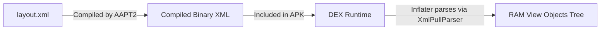
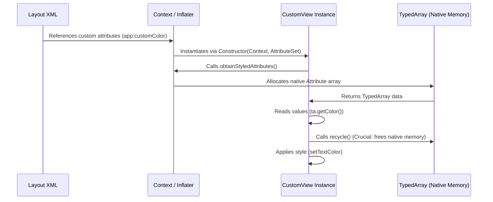
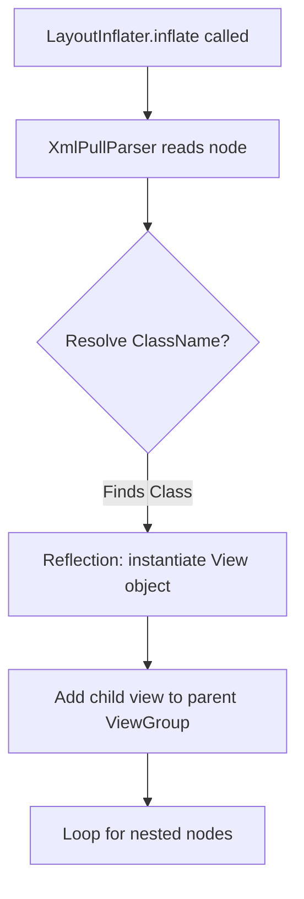
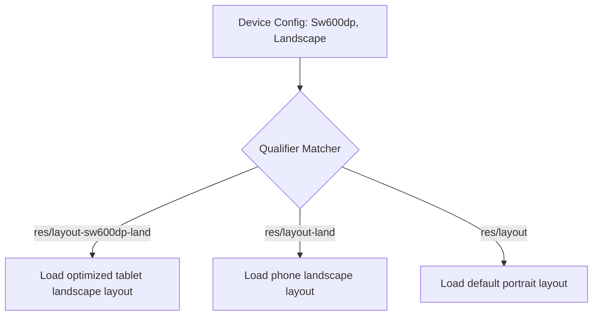
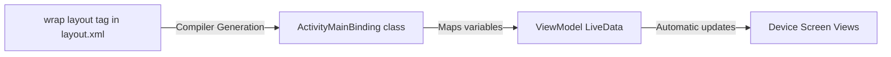

# 🎨 Android XML & Layout Architecture — Complete Interview Preparation Guide

> **Authoritative Technical Reference**
> Every topic follows the same structure — **Definition → Why It Is Used → How It Works Internally → Code Example → Common Pitfalls**.
>
> Covers the View system: layouts, resources, styles, themes, drawables, Data Binding, MotionLayout, and Navigation graphs.
>
> **30 View-system interview questions:** [`interview_questions/03_ui_views_xml.md`](./interview_questions/03_ui_views_xml.md)

---

## 📑 Table of Contents

| # | Module | Key Topics |
|---|---|---|
| 1 | [XML Role & Architecture](#1-xml-role--architecture-in-android) | Why XML, namespaces, core attributes |
| 2 | [Custom Attributes & Custom Views](#2-custom-xml-attributes--custom-views) | `declare-styleable`, `TypedArray`, custom view lifecycle |
| 3 | [Resources, Styles & Themes](#3-resource-management-styles-and-themes) | Resource organization, styles vs themes, drawable types |
| 4 | [Layout Inflation & Performance](#4-layout-inflation--performance-optimization) | `LayoutInflater` internals, `merge`, `ViewStub`, `include` |
| 5 | [Adaptive Layouts & Qualifiers](#5-adaptive-layouts--resource-qualifiers) | Screen qualifiers, weights, ConstraintLayout helpers |
| 6 | [Selectors & XML Animations](#6-interactive-selectors--xml-custom-animations) | State lists, animation sets, interpolators |
| 7 | [Data Binding](#7-advanced-data-binding-in-xml) | Binding expressions, two-way binding, binding adapters |
| 8 | [Accessibility & Localization](#8-accessibility--internationalization) | Content descriptions, RTL, string resources |
| 9 | [MotionLayout](#9-motionlayout) | MotionScene, keyframes, `OnSwipe`, transition listeners |
| 10 | [Navigation Graphs & Safe Args](#10-navigation-graphs-and-safe-args) | Destinations, actions, typed arguments, nested graphs |
| 11 | [Dark Theme & Qualifiers](#11-dark-theme-theme-overlays-and-resource-qualifiers) | `values-night`, theme overlays, qualifier precedence |
| 12 | [Interview Questions](#12-interview-questions) | Pointer to the question bank |

---

# 1. XML Role & Architecture in Android

## 1.1 Role of XML

### Definition
* **Simple:** XML (Extensible Markup Language) is a readable text format used in Android to build screen layouts, define color/string values, and configure application settings.
* **Advanced:** XML serves as the declarative configuration and presentation layer in Android. It separates the declarative view structure from the imperative controller logic (Java/Kotlin), enabling compile-time generation of layout resources and structured indexing via the `R.java` pointer file.



### Why it is Used
XML allows clean **Separation of Concerns**. UI designers and developers can write layout configurations independently of business logic. It also supports **multimodal resource loading**—the OS automatically selects different XML files at runtime depending on the device config (language, orientation, screen size) without changing code.

---

## 1.2 Structure of an Android XML & Namespaces

### Namespace Declarations
Namespaces tell the compiler how to interpret custom attributes inside the XML document.
* `xmlns:android="http://schemas.android.com/apk/res/android"`: Maps standard attributes provided by the Android OS framework.
* `xmlns:app="http://schemas.android.com/apk/res-auto"`: Maps attributes belonging to support libraries (Jetpack) or custom attributes defined in your own application modules.
* `xmlns:tools="http://schemas.android.com/tools"`: Provides layout editor design-time overrides that do not compile into the final production APK.

### Core Specifying Attributes
1. **`layout_width` and `layout_height`:** Dimensions of the view component. Can be fixed (e.g. `100dp`), `wrap_content` (expand to fit internal contents), or `match_parent` (expand to fill parent constraints).
2. **Margin vs. Padding:**
   * **Margin:** Specifies the empty spacing *outside* the boundaries of a view.
   * **Padding:** Specifies the spacing *inside* the view boundaries (between the view border and the view's content).
3. **Gravity vs. Layout Gravity:**
   * **`android:gravity`:** Aligns the *internal content* within the boundaries of the view itself.
   * **`android:layout_gravity`:** Aligns the *entire view* within the layout bounds of its parent ViewGroup.

---

# 2. Custom XML Attributes & Custom Views

## 2.1 Custom View Lifecycle & Attribute Extraction

### Definition
A **Custom View** is a user-created component that inherits from `View` (or widgets like `TextView`), using custom XML attributes to configure its styling directly in the layout file.



### Why it is Used
It groups styling configurations into reusable UI elements, allowing developers to configure custom view layouts without writing repetitive configuration code.

### Code Example: Creating a Custom View with Custom Attributes
1. **Define Attributes (`res/values/attrs.xml`):**
   ```xml
   <resources>
       <declare-styleable name="CustomBadgeView">
           <attr name="badgeColor" format="color" />
           <attr name="badgeCount" format="integer" />
       </declare-styleable>
   </resources>
   ```
2. **Extract Attributes in custom View Class (Kotlin):**
   ```kotlin
   class CustomBadgeView @JvmOverloads constructor(
       context: Context,
       attrs: AttributeSet? = null,
       defStyleAttr: Int = 0
   ) : TextView(context, attrs, defStyleAttr) {

       init {
           attrs?.let {
               // Extract values from TypedArray
               val typedArray = context.obtainStyledAttributes(it, R.styleable.CustomBadgeView)
               try {
                   val badgeColor = typedArray.getColor(
                       R.styleable.CustomBadgeView_badgeColor, 
                       Color.RED
                   )
                   val badgeCount = typedArray.getInt(
                       R.styleable.CustomBadgeView_badgeCount, 
                       0
                   )
                   
                   // Apply configurations to View
                   setBackgroundColor(badgeColor)
                   text = badgeCount.toString()
               } finally {
                   // CRITICAL: Always recycle TypedArray to prevent native memory leak
                   typedArray.recycle()
               }
           }
       }
   }
   ```
3. **Reference View in XML:**
   ```xml
   <com.example.app.CustomBadgeView
       android:layout_width="wrap_content"
       android:layout_height="wrap_content"
       app:badgeColor="#FF00FF"
       app:badgeCount="99" />
   ```

---

# 3. Resource Management, Styles, and Themes

## 3.1 Resource Management

### Definition
Resources are external static files or values (like strings, layout hierarchies, color palettes, and dimensions) that compile separately from application code.

### File Separation Best Practices
* **`colors.xml`:** Centralizes all hex color values. Prevents hardcoded color constants across screens.
* **`dimens.xml`:** Centralizes dimensions. Use **`dp`** (density-independent pixels) for layouts to ensure consistent physical sizing across pixel-density layouts, and **`sp`** (scale-independent pixels) for text sizes to respect user-defined system font scale settings.
* **`strings.xml`:** Stores user-facing text strings, enabling localization and internationalization.
* **`styles.xml` / `themes.xml`:** Encapsulates style attributes to ensure design consistency.

---

## 3.2 Styles vs. Themes

### Comparison Table

| Feature | Style | Theme |
|---|---|---|
| **Scope** | Local (Applied to a single `View` instance) | Global (Applied to an `Activity` or the entire `<application>`) |
| **Declaration** | `style="@style/MyButtonStyle"` | `android:theme="@style/AppTheme"` |
| **Inheritance** | Single specific component hierarchy | Cascading (all children inherit properties) |
| **Usage** | Overrides layout dimensions, backgrounds, text | Configures status bar color, window background, accent color |

### Global Theme Example (`res/values/themes.xml`):
```xml
<resources>
    <style name="AppTheme" parent="Theme.Material3.DayNight.NoActionBar">
        <item name="colorPrimary">@color/blue_500</item>
        <item name="colorSecondary">@color/teal_200</item>
        <item name="android:statusBarColor">?attr/colorPrimary</item>
    </style>
</resources>
```

---

## 3.3 Drawable Types

### Definition
A `Drawable` is anything that can draw itself into a `Canvas`. Android provides many XML-declarable types, each solving a different problem, and picking the right one is a direct APK-size and rendering-quality decision.

### Why It Is Used
A single vector replaces five raster densities. A shape drawable replaces a nine-patch. A layer-list replaces an extra nested `FrameLayout`. Each substitution removes assets, view depth, or both.

### How It Works Internally

| Type | Root Tag | Best For | Notes |
|---|---|---|---|
| **Vector** | `<vector>` | Icons, simple illustrations | One asset for all densities; parsed and rasterized at load, cached afterward |
| **Shape** | `<shape>` | Backgrounds, dividers, chips | Rectangle/oval/line/ring with gradient, stroke, corners |
| **Layer list** | `<layer-list>` | Stacking without extra views | Each `<item>` is a layer with its own insets |
| **State list** | `<selector>` | Pressed/checked/disabled states | Order matters — first match wins |
| **Nine-patch** | `.9.png` | Stretchable raster (chat bubbles) | The 1 px border defines stretch and content regions |
| **Animated vector** | `<animated-vector>` | Icon morphs (play↔pause) | Binds an `<objectAnimator>` to a named vector path |
| **Ripple** | `<ripple>` | Touch feedback | Default on all clickable Material views |
| **Inset / clip / scale** | `<inset>` etc. | Adjusting an existing drawable | Wrappers around another drawable |

**Vector rendering cost.** Vectors are rasterized on first use and cached. A very complex path (a detailed illustration) is measurably slower to inflate than a PNG — use vectors for icons, WebP for photographic or complex art.

### Code Example
```xml
<!-- res/drawable/ic_favorite.xml — one asset, every density -->
<vector xmlns:android="http://schemas.android.com/apk/res/android"
    android:width="24dp"
    android:height="24dp"
    android:viewportWidth="24"
    android:viewportHeight="24"
    android:tint="?attr/colorControlNormal">   <!-- Theme attribute: adapts to dark mode -->
    <path
        android:fillColor="@android:color/white"
        android:pathData="M12,21.35l-1.45,-1.32C5.4,15.36 2,12.28 2,8.5 2,5.42 4.42,3 7.5,3c1.74,0 3.41,0.81 4.5,2.09C13.09,3.81 14.76,3 16.5,3 19.58,3 22,5.42 22,8.5c0,3.78 -3.4,6.86 -8.55,11.54L12,21.35z" />
</vector>
```

```xml
<!-- res/drawable/bg_card.xml — replaces a PNG and adapts to the theme -->
<shape xmlns:android="http://schemas.android.com/apk/res/android"
    android:shape="rectangle">
    <corners android:radius="12dp" />
    <solid android:color="?attr/colorSurface" />
    <stroke android:width="1dp" android:color="?attr/colorOutline" />
    <padding android:left="16dp" android:top="12dp" android:right="16dp" android:bottom="12dp" />
</shape>
```

```xml
<!-- res/drawable/bg_badge_shadow.xml — a fake shadow without an extra view -->
<layer-list xmlns:android="http://schemas.android.com/apk/res/android">
    <item android:top="2dp">                         <!-- Offset layer = shadow -->
        <shape android:shape="oval">
            <solid android:color="#22000000" />
        </shape>
    </item>
    <item android:bottom="2dp">                      <!-- Foreground layer -->
        <shape android:shape="oval">
            <solid android:color="?attr/colorPrimary" />
        </shape>
    </item>
</layer-list>
```

```xml
<!-- res/drawable/ic_play_to_pause.xml — animated vector for an icon morph -->
<animated-vector xmlns:android="http://schemas.android.com/apk/res/android"
    android:drawable="@drawable/ic_play">
    <target
        android:name="leftBar"
        android:animation="@animator/play_to_pause_left" />
</animated-vector>
```

```kotlin
// Starting the morph from code
val avd = AppCompatResources.getDrawable(context, R.drawable.ic_play_to_pause)
imageView.setImageDrawable(avd)
(avd as? AnimatedVectorDrawableCompat)?.start()

// Tinting programmatically without mutating the shared constant state
val tinted = AppCompatResources.getDrawable(context, R.drawable.ic_favorite)!!
    .mutate()                                        // MANDATORY: without it, every user of this
                                                     // drawable resource gets the tint too
    .apply { setTint(ContextCompat.getColor(context, R.color.accent)) }
```

### Common Pitfalls
* **Not calling `mutate()` before changing a drawable's state.** Drawables loaded from the same resource share a `ConstantState`; tinting one tints them all, app-wide, with no obvious cause.
* **Hardcoding colors instead of `?attr/` theme references.** The drawable then cannot follow dark mode.
* **Using vectors for complex illustrations.** Inflation cost grows with path complexity; profile before shipping a 200-path vector.
* **Shipping PNGs at five densities** when a `<shape>` or vector would do.

---
# 4. Layout Inflation & Performance Optimization

## 4.1 Layout Inflation Internals

### Definition
* **Simple:** Layout Inflation is the process of converting an XML layout file into visual Java/Kotlin view objects in RAM.
* **Advanced:** Inflation is triggered via `LayoutInflater.inflate()`. It reads compiled binary XML resources using an `XmlPullParser`, maps layout nodes to View classes using reflection (`Constructor.newInstance()`), and builds a nested tree of physical View objects in memory.



### Inflation Optimization Tags
1. **`<include>`:** Injects a reusable XML layout into a parent layout. Helps reduce code duplication, but doesn't change performance on its own.
2. **`<merge>`:** Used as the root tag in layout files intended for inclusion. It merges child views directly into the parent view container, eliminating redundant nested layouts.
3. **`<ViewStub>`:** A lightweight, invisible view with zero dimensions. It serves as a placeholder that does not inflate its target layout until explicitly requested (`viewStub.inflate()`). Excellent for loading conditional screens (like errors or load pages) only when needed.

---

# 5. Adaptive Layouts & Resource Qualifiers

## 5.1 Screen Adaptation Qualifiers

### Definition
Android selects optimized layouts at runtime based on configuration qualifiers added as directory suffixes under the `res/` folder.



### Standard Directory Qualifiers
* **`layout/`:** Default layouts (usually portrait mobile layouts).
* **`layout-land/`:** Layouts optimized for landscape mode on all screen sizes.
* **`layout-sw600dp/`:** Smallest Width layouts. Applies only when the shortest screen dimension is at least 600dp (standard target for 7-inch tablets).
* **`layout-sw600dp-land/`:** Tablet layouts in landscape mode.

---

## 5.2 Dynamic View Spacing in XML

### Using `layout_weight`
In `LinearLayout`, `layout_weight` specifies how much remaining space should be distributed among sibling views.
* **Best Practice:** Set the size attribute corresponding to the layout orientation to `0dp` (e.g. `android:layout_width="0dp"` in horizontal orientation) so the compiler calculates dimensions using weight ratios, bypassing static measurements.

### ConstraintLayout Positioning
Provides a flat view hierarchy by aligning components via relative constraints. Uses bias (`layout_constraintHorizontal_bias`) to position views dynamically as percentages of the remaining parent layout size.

---

## 5.3 ConstraintLayout: Chains, Barriers, Guidelines, Groups, and Flow

### Definition
The helper constructs that let one flat `ConstraintLayout` express layouts that would otherwise require nested `LinearLayout`s.

### Why It Is Used
Every nesting level costs another measure pass, and nested weighted `LinearLayout`s measure their children twice per level. `ConstraintLayout` solves the whole layout with a constraint solver in a flat hierarchy, so removing nesting is the single biggest View-system layout win.

### How It Works Internally
`ConstraintLayout` builds a system of linear equations from the constraints and solves it with Cassowary, the same algorithm behind iOS Auto Layout. Guidelines, barriers, and groups are `View`s with `visibility="gone"` — they occupy no space and never draw, they only contribute constraints.

| Helper | Purpose |
|---|---|
| **Chain** | Distribute a run of views along an axis (`spread`, `spread_inside`, `packed`) |
| **Guideline** | A virtual line at a fixed dp or a percentage of the parent |
| **Barrier** | A virtual line at the extreme edge of several views — sizes to the longest |
| **Group** | Toggles the visibility of several views at once |
| **Flow** | A virtual chain that wraps, replacing a nested layout for tag lists |
| **Layer** | Transforms (rotate/scale) a set of views together |

### Code Example
```xml
<androidx.constraintlayout.widget.ConstraintLayout
    xmlns:android="http://schemas.android.com/apk/res/android"
    xmlns:app="http://schemas.android.com/apk/res-auto"
    android:layout_width="match_parent"
    android:layout_height="wrap_content">

    <!-- Guideline: content never crosses the 50% mark -->
    <androidx.constraintlayout.widget.Guideline
        android:id="@+id/half"
        android:layout_width="wrap_content"
        android:layout_height="wrap_content"
        android:orientation="vertical"
        app:layout_constraintGuide_percent="0.5" />

    <TextView
        android:id="@+id/label_name"
        android:layout_width="wrap_content"
        android:layout_height="wrap_content"
        android:text="@string/name"
        app:layout_constraintStart_toStartOf="parent"
        app:layout_constraintTop_toTopOf="parent" />

    <TextView
        android:id="@+id/label_email"
        android:layout_width="wrap_content"
        android:layout_height="wrap_content"
        android:text="@string/email_address"
        app:layout_constraintStart_toStartOf="parent"
        app:layout_constraintTop_toBottomOf="@id/label_name" />

    <!-- Barrier: the value column starts after the LONGEST label, in any language.
         This is what makes the layout survive translation without hardcoded widths. -->
    <androidx.constraintlayout.widget.Barrier
        android:id="@+id/label_barrier"
        android:layout_width="wrap_content"
        android:layout_height="wrap_content"
        app:barrierDirection="end"
        app:constraint_referenced_ids="label_name,label_email" />

    <TextView
        android:id="@+id/value_name"
        android:layout_width="0dp"                       <!-- 0dp = "match constraints" -->
        android:layout_height="wrap_content"
        app:layout_constraintStart_toEndOf="@id/label_barrier"
        app:layout_constraintEnd_toEndOf="parent"
        app:layout_constraintTop_toTopOf="@id/label_name" />

    <!-- Group: one visibility toggle for an entire section -->
    <androidx.constraintlayout.widget.Group
        android:id="@+id/premium_section"
        android:layout_width="wrap_content"
        android:layout_height="wrap_content"
        android:visibility="gone"
        app:constraint_referenced_ids="badge,expiry_label,expiry_value" />

    <!-- Flow: a wrapping tag row without a nested layout or a RecyclerView -->
    <androidx.constraintlayout.helper.widget.Flow
        android:layout_width="0dp"
        android:layout_height="wrap_content"
        app:constraint_referenced_ids="tag1,tag2,tag3,tag4"
        app:flow_wrapMode="chain"
        app:flow_horizontalGap="8dp"
        app:flow_verticalGap="8dp"
        app:layout_constraintStart_toStartOf="parent"
        app:layout_constraintEnd_toEndOf="parent"
        app:layout_constraintTop_toBottomOf="@id/value_name" />

</androidx.constraintlayout.widget.ConstraintLayout>
```

```xml
<!-- A weighted chain: replaces a horizontal LinearLayout with layout_weight -->
<Button
    android:id="@+id/cancel"
    android:layout_width="0dp"
    android:layout_height="wrap_content"
    app:layout_constraintHorizontal_chainStyle="spread"
    app:layout_constraintHorizontal_weight="1"
    app:layout_constraintStart_toStartOf="parent"
    app:layout_constraintEnd_toStartOf="@id/confirm" />
<Button
    android:id="@+id/confirm"
    android:layout_width="0dp"
    android:layout_height="wrap_content"
    app:layout_constraintHorizontal_weight="2"          <!-- Twice the width of cancel -->
    app:layout_constraintStart_toEndOf="@id/cancel"
    app:layout_constraintEnd_toEndOf="parent" />
```

```kotlin
// ConstraintSet: animate between two full layout states with one line
val collapsed = ConstraintSet().apply { clone(context, R.layout.header_collapsed) }
val expanded  = ConstraintSet().apply { clone(context, R.layout.header_expanded) }

fun toggle(expandedNow: Boolean) {
    TransitionManager.beginDelayedTransition(binding.root, AutoTransition())
    (if (expandedNow) expanded else collapsed).applyTo(binding.root)
}
```

### Common Pitfalls
* **`match_parent` inside a `ConstraintLayout`.** It is not supported and behaves unpredictably; use `0dp` (match constraints) with start and end constraints.
* **Missing a constraint on one axis.** The view silently jumps to (0,0) at runtime while looking fine in the editor. Enable "Missing constraints" lint.
* **Hardcoded widths for label columns.** They break in German and Arabic. Use a `Barrier`.
* **Setting each view's visibility individually.** Use a `Group`, or the states drift out of sync.
* **Nesting `ConstraintLayout` inside `ConstraintLayout`.** This defeats the entire point; flatten instead.

---
# 6. Interactive Selectors & XML Custom Animations

## 6.1 State-List Selectors

A **Selector** is a drawable resource defined in XML that updates a view's appearance based on state changes (e.g. focused, pressed, selected, disabled).

```xml
<!-- res/drawable/button_state_selector.xml -->
<selector xmlns:android="http://schemas.android.com/apk/res/android">
    <!-- Pressed state -->
    <item android:drawable="@color/blue_pressed" android:state_pressed="true" />
    <!-- Focused state -->
    <item android:drawable="@color/blue_focused" android:state_focused="true" />
    <!-- Default state -->
    <item android:drawable="@color/blue_default" />
</selector>
```

---

## 6.2 XML Custom Animations & Interpolators

Animations can be declared in XML files located in the `res/anim/` folder.

### Animation Set Tags
* **`<set>`:** Container that groups multiple animation operations together.
* **`<translate>`:** Moves a view horizontally or vertically.
* **`<alpha>`:** Animates the opacity (transparency) of a view.
* **`<scale>`:** Resizes a view along the X and Y axes.
* **`<rotate>`:** Spins a view around a specific pivot point.

### Interpolators
Modify the rate of animation progress over time.
* `LinearInterpolator`: Constant speed.
* `AccelerateInterpolator`: Starts slow and accelerates.
* `DecelerateInterpolator`: Starts fast and slows down.

---

# 7. Advanced Data Binding in XML

## 7.1 Data Binding

### Definition
* **Simple:** Data Binding links UI layout elements directly to data model variables, reducing boilerplate activity code.
* **Advanced:** Data Binding is a support library that auto-generates binding classes at compile time based on `<layout>` wrapped XML files. It replaces runtime `findViewById()` calls with direct binding references, resolving layout updates during compilation.



### Double-Way Binding (`@={}` vs. `@{}`)
* **One-Way Binding (`@{variable}`):** Passes data from the model down to the UI view. If the variable updates, the view is updated automatically.
* **Two-Way Binding (`@={variable}`):** Synchronizes changes in both directions. If the user edits text inside an `EditText`, the bound variable update propagates back to the data class automatically.

```xml
<!-- Example Layout XML -->
<layout xmlns:android="http://schemas.android.com/apk/res/android">
    <data>
        <variable
            name="viewmodel"
            type="com.example.app.UserViewModel" />
    </data>
    
    <LinearLayout
        android:layout_width="match_parent"
        android:layout_height="match_parent"
        android:orientation="vertical">
        
        <!-- Two-Way Binding: changes sync to ViewModel automatically -->
        <EditText
            android:layout_width="match_parent"
            android:layout_height="wrap_content"
            android:text="@={viewmodel.inputUserName}" />
    </LinearLayout>
</layout>
```

---

# 8. Accessibility & Internationalization

## 8.1 Accessibility (a11y) in XML

Accessibility ensures that users with visual, auditory, or motor impairments can interact with your application.

### Key Best Practices
1. **`contentDescription`:** Add clear descriptions to all non-text components (e.g. `ImageView` or `ImageButton`) so screen readers (like TalkBack) can read them aloud.
2. **`labelFor`:** Links a label (`TextView`) to a specific input field (`EditText`), so TalkBack reads the input purpose context correctly.
3. **Focus Navigation:** Use `android:focusable="true"` and `android:nextFocusDown="..."` to configure keyboard and D-pad navigation paths.
4. **Touch Targets:** Maintain a minimum size of **`48dp x 48dp`** for all interactive components to ensure comfortable touch accuracy.

---

## 8.2 Localization (l10n) in XML

Android manages localization using resource qualifiers mapped to locale tags.

### Implementation Setup
* **`res/values/strings.xml` (Default English):**
  ```xml
  <resources>
      <string name="welcome_message">Welcome</string>
  </resources>
  ```
* **`res/values-es/strings.xml` (Spanish translation):**
  ```xml
  <resources>
      <string name="welcome_message">Bienvenido</string>
  </resources>
  ```
The system automatically detects the device's locale settings and selects the corresponding string translation folder.

---

# 9. MotionLayout

## 9.1 Declarative Motion in XML

### Definition
`MotionLayout` is a `ConstraintLayout` subclass that animates between two `ConstraintSet`s described in a separate MotionScene XML file, with the animation driven either by progress or directly by a touch gesture.

### Why It Is Used
Complex coordinated motion — a collapsing toolbar with a scaling avatar, a swipe-to-reveal panel — expressed imperatively becomes hundreds of lines of interdependent animator code. MotionLayout expresses the same thing as two end states plus rules, and gives you gesture-driven scrubbing for free.

### How It Works Internally
* A **MotionScene** declares a `<Transition>` between a `start` and an `end` `<ConstraintSet>`.
* Progress runs 0.0 → 1.0. MotionLayout interpolates every differing constraint between the two sets.
* `<OnSwipe>` binds progress to a drag, so the animation follows the finger and can be reversed mid-gesture.
* `<KeyFrameSet>` inserts intermediate states — a `KeyPosition` bends the motion path, a `KeyAttribute` changes a property (alpha, scale, rotation) at a given progress point.

### Code Example
```xml
<!-- res/layout/activity_profile.xml -->
<androidx.constraintlayout.motion.widget.MotionLayout
    android:id="@+id/motion_root"
    android:layout_width="match_parent"
    android:layout_height="match_parent"
    app:layoutDescription="@xml/scene_profile">

    <ImageView
        android:id="@+id/avatar"
        android:layout_width="120dp"
        android:layout_height="120dp"
        android:src="@drawable/avatar" />

    <TextView
        android:id="@+id/name"
        android:layout_width="wrap_content"
        android:layout_height="wrap_content"
        android:text="@string/user_name" />

    <androidx.recyclerview.widget.RecyclerView
        android:id="@+id/list"
        android:layout_width="match_parent"
        android:layout_height="0dp" />
</androidx.constraintlayout.motion.widget.MotionLayout>
```

```xml
<!-- res/xml/scene_profile.xml -->
<MotionScene xmlns:android="http://schemas.android.com/apk/res/android"
    xmlns:app="http://schemas.android.com/apk/res-auto">

    <Transition
        app:constraintSetStart="@+id/expanded"
        app:constraintSetEnd="@+id/collapsed"
        app:duration="300">

        <!-- Binds progress to the RecyclerView's scroll: the header collapses as the list scrolls -->
        <OnSwipe
            app:touchAnchorId="@+id/list"
            app:touchAnchorSide="top"
            app:dragDirection="dragUp" />

        <KeyFrameSet>
            <!-- Fade the name out over the FIRST HALF of the transition only -->
            <KeyAttribute
                app:framePosition="50"
                app:motionTarget="@+id/name"
                android:alpha="0.0" />
            <!-- Bend the avatar's path so it arcs rather than moving in a straight line -->
            <KeyPosition
                app:framePosition="50"
                app:motionTarget="@+id/avatar"
                app:percentX="0.7"
                app:keyPositionType="parentRelative" />
        </KeyFrameSet>
    </Transition>

    <ConstraintSet android:id="@+id/expanded">
        <Constraint
            android:id="@+id/avatar"
            android:layout_width="120dp"
            android:layout_height="120dp"
            app:layout_constraintTop_toTopOf="parent"
            app:layout_constraintStart_toStartOf="parent"
            app:layout_constraintEnd_toEndOf="parent" />
    </ConstraintSet>

    <ConstraintSet android:id="@+id/collapsed">
        <Constraint
            android:id="@+id/avatar"
            android:layout_width="40dp"
            android:layout_height="40dp"
            android:layout_marginStart="16dp"
            app:layout_constraintTop_toTopOf="parent"
            app:layout_constraintStart_toStartOf="parent" />
    </ConstraintSet>
</MotionScene>
```

```kotlin
// Driving and observing the transition from code
binding.motionRoot.transitionToEnd()

binding.motionRoot.setTransitionListener(object : MotionLayout.TransitionListener {
    override fun onTransitionChange(l: MotionLayout?, start: Int, end: Int, progress: Float) {
        // Sync something outside MotionLayout, e.g. the status bar icon colour
        window.statusBarColorForProgress(progress)
    }
    override fun onTransitionCompleted(l: MotionLayout?, currentId: Int) {}
    override fun onTransitionStarted(l: MotionLayout?, s: Int, e: Int) {}
    override fun onTransitionTrigger(l: MotionLayout?, id: Int, pos: Boolean, prog: Float) {}
})
```

### Common Pitfalls
* **Constraining children in the layout file.** MotionLayout takes constraints from the MotionScene; any constraint in the layout XML is overwritten. Declare only sizes and content there.
* **Views appearing at (0,0).** Every animated view must be constrained in **both** ConstraintSets.
* **Nesting MotionLayout inside a scrolling parent** without `app:motionInterpolator` and correct nested-scroll setup — the two fight over the gesture.
* **Reaching for MotionLayout in a Compose codebase.** Compose has no MotionLayout equivalent worth adopting; use `Transition` and `nestedScroll` instead.

---

# 10. Navigation Graphs and Safe Args

## 10.1 XML Navigation Graphs

### Definition
A navigation graph is an XML resource declaring destinations (fragments, activities, dialogs), the actions connecting them, and the arguments each destination accepts.

### Why It Is Used
It replaces scattered `FragmentTransaction` calls with one visual, reviewable description of the app's structure, and generates type-safe argument classes so a missing or mistyped argument is a build failure.

### How It Works Internally
The Safe Args Gradle plugin reads the graph and generates a `<Destination>Directions` class per source destination (one method per action) and a `<Destination>Args` class per destination with arguments. `NavController` executes the action, applies the pop behavior, and puts arguments into the destination's `Bundle` — which `SavedStateHandle` then exposes to the ViewModel.

### Code Example
```xml
<!-- res/navigation/nav_graph.xml -->
<navigation xmlns:android="http://schemas.android.com/apk/res/android"
    xmlns:app="http://schemas.android.com/apk/res-auto"
    android:id="@+id/nav_graph"
    app:startDestination="@id/productListFragment">

    <fragment
        android:id="@+id/productListFragment"
        android:name="com.example.ui.ProductListFragment"
        android:label="@string/products">

        <action
            android:id="@+id/action_list_to_detail"
            app:destination="@id/productDetailFragment"
            app:enterAnim="@anim/slide_in_right"
            app:exitAnim="@anim/slide_out_left" />
    </fragment>

    <fragment
        android:id="@+id/productDetailFragment"
        android:name="com.example.ui.ProductDetailFragment">

        <argument
            android:name="productId"
            app:argType="long" />                    <!-- Required: no defaultValue -->
        <argument
            android:name="referrer"
            app:argType="string"
            app:nullable="true"
            android:defaultValue="@null" />          <!-- Optional -->

        <!-- Deep link: an https URL routes straight to this destination -->
        <deepLink app:uri="https://example.com/product/{productId}" />
    </fragment>

    <!-- A nested graph gets its own ViewModel scope for the whole flow -->
    <navigation
        android:id="@+id/checkout_graph"
        app:startDestination="@id/cartFragment">
        <fragment android:id="@+id/cartFragment"    android:name="com.example.ui.CartFragment" />
        <fragment android:id="@+id/paymentFragment" android:name="com.example.ui.PaymentFragment" />
    </navigation>
</navigation>
```

```kotlin
// Navigating with generated, type-safe directions
val direction = ProductListFragmentDirections
    .actionListToDetail(productId = product.id, referrer = "list")
findNavController().navigate(direction)

// Reading arguments — generated, so a signature change breaks the build
class ProductDetailFragment : Fragment(R.layout.fragment_product_detail) {
    private val args: ProductDetailFragmentArgs by navArgs()

    // The same arguments reach the ViewModel through SavedStateHandle,
    // which is why they survive process death.
    private val viewModel: ProductDetailViewModel by viewModels()
}

@HiltViewModel
class ProductDetailViewModel @Inject constructor(
    savedState: SavedStateHandle
) : ViewModel() {
    private val productId: Long = checkNotNull(savedState["productId"])
}
```

```kotlin
// A ViewModel scoped to a nested graph: shared across the whole checkout flow,
// and cleared automatically when the flow is popped.
class PaymentFragment : Fragment() {
    private val checkoutViewModel: CheckoutViewModel by navGraphViewModels(R.id.checkout_graph) {
        defaultViewModelProviderFactory
    }
}
```

```gradle
plugins { id("androidx.navigation.safeargs.kotlin") }
```

### Common Pitfalls
* **Passing a `Parcelable` model as an argument.** The Bundle goes through a Binder transaction with a ~1 MB cap. Pass an ID.
* **Double navigation on a fast double tap.** Throws `IllegalArgumentException: navigation destination is unknown`. Guard by checking `currentDestination`.
* **Forgetting `app:popUpTo`.** Back from Home returns to the login screen.
* **Holding `NavController` in a ViewModel.** It leaks the Activity; emit navigation events instead.

---

# 11. Dark Theme, Theme Overlays, and Resource Qualifiers

## 11.1 Dark Theme

### Definition
A second set of theme values selected automatically when the system is in dark mode, resolved through the `values-night/` resource qualifier.

### Why It Is Used
It is a strong user expectation, it reduces battery use on OLED, and it is a Play Store quality signal. Doing it through theme attributes rather than conditional code means one resource fork instead of branching everywhere.

### How It Works Internally
`AppCompatDelegate` sets the UI mode; `Resources` then resolves `values-night/` for colors and themes. The critical rule is that layouts and drawables reference **theme attributes** (`?attr/colorSurface`) rather than raw color resources (`@color/white`) — the attribute resolves differently per theme, the raw color does not.

### Code Example
```xml
<!-- res/values/themes.xml -->
<style name="Theme.App" parent="Theme.Material3.DayNight.NoActionBar">
    <item name="colorPrimary">@color/brand_purple</item>
    <item name="colorSurface">@color/surface_light</item>
    <item name="colorOnSurface">@color/on_surface_light</item>
    <!-- A custom attribute, declared in attrs.xml, for a value Material does not define -->
    <item name="chartGridColor">@color/grid_light</item>
</style>

<!-- res/values-night/themes.xml — only the values that DIFFER -->
<style name="Theme.App" parent="Theme.Material3.DayNight.NoActionBar">
    <item name="colorPrimary">@color/brand_purple_light</item>
    <item name="colorSurface">@color/surface_dark</item>
    <item name="colorOnSurface">@color/on_surface_dark</item>
    <item name="chartGridColor">@color/grid_dark</item>
</style>
```

```xml
<!-- res/values/attrs.xml -->
<resources>
    <attr name="chartGridColor" format="color" />
</resources>
```

```xml
<!-- Layouts must reference ATTRIBUTES, not colors -->
<TextView
    android:background="?attr/colorSurface"
    android:textColor="?attr/colorOnSurface" />

<!-- WRONG: fixed in both themes -->
<!-- <TextView android:textColor="@color/black" /> -->
```

```xml
<!-- ThemeOverlay: change part of the theme for one subtree without a whole new theme -->
<style name="ThemeOverlay.App.InverseHeader" parent="">
    <item name="colorSurface">?attr/colorPrimary</item>
    <item name="colorOnSurface">?attr/colorOnPrimary</item>
</style>

<LinearLayout
    android:theme="@style/ThemeOverlay.App.InverseHeader"
    android:background="?attr/colorSurface">
    <!-- Children inside resolve colorSurface to the PRIMARY colour -->
</LinearLayout>
```

```kotlin
// User-selectable theme, persisted, applied without recreating the Activity manually
enum class ThemeMode(val delegateValue: Int) {
    SYSTEM(AppCompatDelegate.MODE_NIGHT_FOLLOW_SYSTEM),
    LIGHT(AppCompatDelegate.MODE_NIGHT_NO),
    DARK(AppCompatDelegate.MODE_NIGHT_YES)
}

fun applyTheme(mode: ThemeMode) = AppCompatDelegate.setDefaultNightMode(mode.delegateValue)

// Apply the persisted value in Application.onCreate, before any Activity is created,
// or the app flashes the wrong theme on cold start.
```

## 11.2 Resource Qualifier Resolution

### Definition
Android picks the best-matching resource directory for the current device configuration, following a fixed precedence order.

### How It Works Internally
Qualifiers are evaluated in a defined priority: MCC/MNC → locale → layout direction → smallest width → available width/height → screen size → orientation → UI mode → night mode → density → touchscreen → keyboard → navigation → platform version. The first qualifier that eliminates candidates decides; ties fall through to the next.

| Qualifier | Directory | Selected When |
|---|---|---|
| Language + region | `values-es-rMX/` | Locale is Spanish (Mexico) |
| Layout direction | `layout-ldrtl/` | RTL locale |
| Smallest width | `layout-sw600dp/` | Smallest screen dimension ≥ 600 dp |
| Available width | `layout-w840dp/` | Current window width ≥ 840 dp — **reacts to split-screen** |
| Orientation | `layout-land/` | Landscape |
| Night mode | `values-night/` | Dark theme active |
| Density | `drawable-xxhdpi/` | ~480 dpi |
| API level | `values-v31/` | API 31 or higher |

**`sw600dp` vs `w600dp`:** `sw` describes the *device's* smallest dimension and never changes at runtime. `w` describes the *current window* and does change in split-screen and on foldables — which is why `w` qualifiers are the correct choice for adaptive layouts.

### Common Pitfalls
* **Hardcoding `@color/white` in layouts.** Dark mode then has no effect on those views.
* **Forking whole `values-night/themes.xml` files.** Redefine only what differs; duplicated values drift.
* **`sw600dp` for adaptive layouts.** It ignores split-screen. Use `w600dp`/`w840dp`.
* **Not calling `setDefaultNightMode` before the first Activity.** Produces a visible theme flash on launch.
* **Density-specific drawables for icons.** Use a single vector.

---

# 12. Interview Questions

**➡️ [`interview_questions/03_ui_views_xml.md`](./interview_questions/03_ui_views_xml.md) — 30 questions on the View system, layouts, RecyclerView, and XML resources.**

See also:
* [`interview_questions/04_jetpack_architecture.md`](./interview_questions/04_jetpack_architecture.md) — Navigation, ViewBinding, DataBinding
* [`interview_questions/10_performance_memory.md`](./interview_questions/10_performance_memory.md) — inflation cost, overdraw, view leaks
* [`interview_questions/00_INDEX.md`](./interview_questions/00_INDEX.md) — full index

---

## 📚 Related Guides

| Guide | Covers |
|---|---|
| [`android.md`](./android.md) | Custom views, touch dispatch, rendering pipeline, ViewBinding, accessibility, i18n |
| [`compose.md`](./compose.md) | The declarative replacement for this entire system |
| [`architecture_patterns.md`](./architecture_patterns.md) | MVVM/MVI with the View system |
