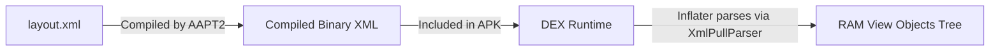
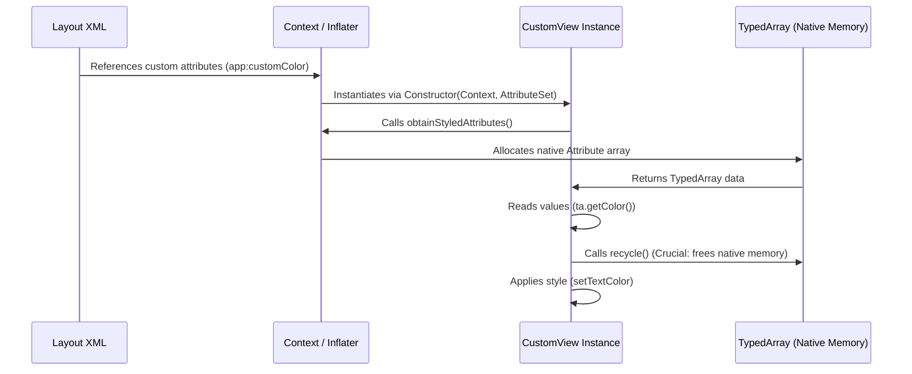
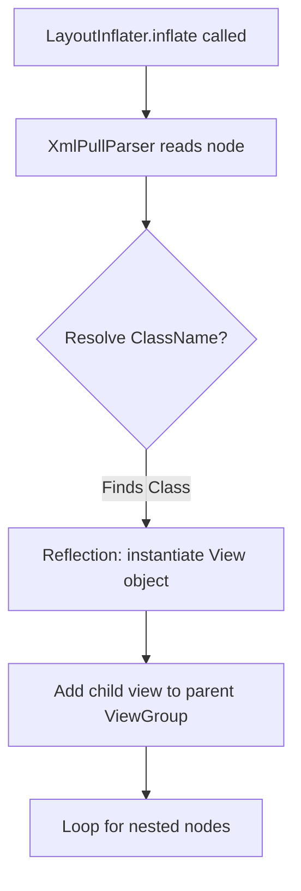
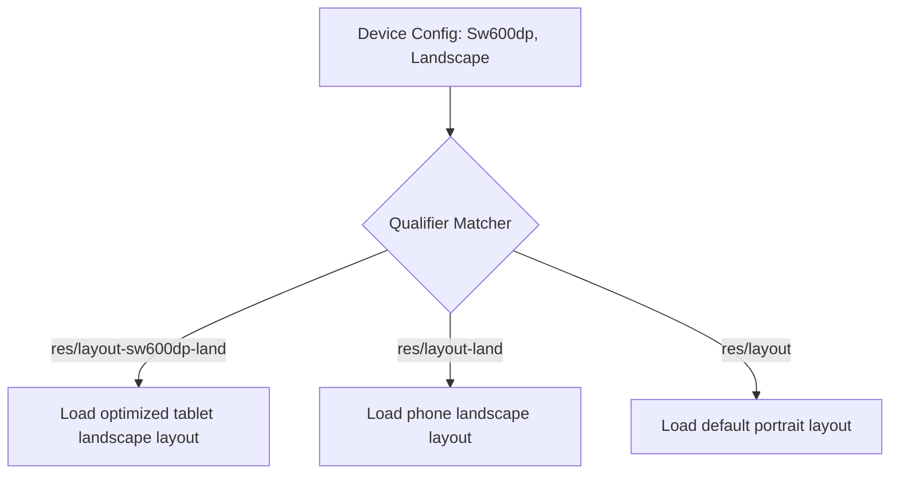
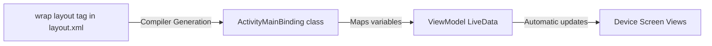

# 🎨 Android XML & Layout Architecture — Complete Interview Preparation Guide

> **Authoritative Technical Reference**  
> Designed for Android Developers with 2–5 years of experience. This guide covers Android XML layout design, resources, custom attributes, styling, optimization, data binding, localization, accessibility, and animations, updated for **Android 15** and Modern App Design.

---

## 📑 Table of Contents

1. [Module 1: XML Role & Architecture in Android](#1-xml-role--architecture-in-android)
2. [Module 2: Custom XML Attributes & Custom Views](#2-custom-xml-attributes--custom-views)
3. [Module 3: Resource Management, Styles, and Themes](#3-resource-management-styles-and-themes)
4. [Module 4: Layout Inflation & Performance Optimization](#4-layout-inflation--performance-optimization)
5. [Module 5: Adaptive Layouts & Resource Qualifiers](#5-adaptive-layouts--resource-qualifiers)
6. [Module 6: Interactive Selectors & XML Custom Animations](#6-interactive-selectors--xml-custom-animations)
7. [Module 7: Advanced Data Binding in XML](#7-advanced-data-binding-in-xml)
8. [Module 8: Accessibility & Internationalization](#8-accessibility--internationalization)

---

# 1. XML Role & Architecture in Android

## 1.1 Role of XML

### Definition
* **Simple:** XML (Extensible Markup Language) is a readable text format used in Android to build screen layouts, define color/string values, and configure application settings.
* **Advanced:** XML serves as the declarative configuration and presentation layer in Android. It separates the declarative view structure from the imperative controller logic (Java/Kotlin), enabling compile-time generation of layout resources and structured indexing via the `R.java` pointer file.



### Why it is Used
XML allows clean **Separation of Concerns**. UI designers and developers can write layout configurations independently of business logic. It also supports **multimodal resource loading**—the OS automatically selects different XML files at runtime depending on the device config (language, orientation, screen size) without changing code.

---

## 1.2 Structure of an Android XML & Namespaces

### Namespace Declarations
Namespaces tell the compiler how to interpret custom attributes inside the XML document.
* `xmlns:android="http://schemas.android.com/apk/res/android"`: Maps standard attributes provided by the Android OS framework.
* `xmlns:app="http://schemas.android.com/apk/res-auto"`: Maps attributes belonging to support libraries (Jetpack) or custom attributes defined in your own application modules.
* `xmlns:tools="http://schemas.android.com/tools"`: Provides layout editor design-time overrides that do not compile into the final production APK.

### Core Specifying Attributes
1. **`layout_width` and `layout_height`:** Dimensions of the view component. Can be fixed (e.g. `100dp`), `wrap_content` (expand to fit internal contents), or `match_parent` (expand to fill parent constraints).
2. **Margin vs. Padding:**
   * **Margin:** Specifies the empty spacing *outside* the boundaries of a view.
   * **Padding:** Specifies the spacing *inside* the view boundaries (between the view border and the view's content).
3. **Gravity vs. Layout Gravity:**
   * **`android:gravity`:** Aligns the *internal content* within the boundaries of the view itself.
   * **`android:layout_gravity`:** Aligns the *entire view* within the layout bounds of its parent ViewGroup.

---

# 2. Custom XML Attributes & Custom Views

## 2.1 Custom View Lifecycle & Attribute Extraction

### Definition
A **Custom View** is a user-created component that inherits from `View` (or widgets like `TextView`), using custom XML attributes to configure its styling directly in the layout file.



### Why it is Used
It groups styling configurations into reusable UI elements, allowing developers to configure custom view layouts without writing repetitive configuration code.

### Code Example: Creating a Custom View with Custom Attributes
1. **Define Attributes (`res/values/attrs.xml`):**
   ```xml
   <resources>
       <declare-styleable name="CustomBadgeView">
           <attr name="badgeColor" format="color" />
           <attr name="badgeCount" format="integer" />
       </declare-styleable>
   </resources>
   ```
2. **Extract Attributes in custom View Class (Kotlin):**
   ```kotlin
   class CustomBadgeView @JvmOverloads constructor(
       context: Context,
       attrs: AttributeSet? = null,
       defStyleAttr: Int = 0
   ) : TextView(context, attrs, defStyleAttr) {

       init {
           attrs?.let {
               // Extract values from TypedArray
               val typedArray = context.obtainStyledAttributes(it, R.styleable.CustomBadgeView)
               try {
                   val badgeColor = typedArray.getColor(
                       R.styleable.CustomBadgeView_badgeColor, 
                       Color.RED
                   )
                   val badgeCount = typedArray.getInt(
                       R.styleable.CustomBadgeView_badgeCount, 
                       0
                   )
                   
                   // Apply configurations to View
                   setBackgroundColor(badgeColor)
                   text = badgeCount.toString()
               } finally {
                   // CRITICAL: Always recycle TypedArray to prevent native memory leak
                   typedArray.recycle()
               }
           }
       }
   }
   ```
3. **Reference View in XML:**
   ```xml
   <com.example.app.CustomBadgeView
       android:layout_width="wrap_content"
       android:layout_height="wrap_content"
       app:badgeColor="#FF00FF"
       app:badgeCount="99" />
   ```

---

# 3. Resource Management, Styles, and Themes

## 3.1 Resource Management

### Definition
Resources are external static files or values (like strings, layout hierarchies, color palettes, and dimensions) that compile separately from application code.

### File Separation Best Practices
* **`colors.xml`:** Centralizes all hex color values. Prevents hardcoded color constants across screens.
* **`dimens.xml`:** Centralizes dimensions. Use **`dp`** (density-independent pixels) for layouts to ensure consistent physical sizing across pixel-density layouts, and **`sp`** (scale-independent pixels) for text sizes to respect user-defined system font scale settings.
* **`strings.xml`:** Stores user-facing text strings, enabling localization and internationalization.
* **`styles.xml` / `themes.xml`:** Encapsulates style attributes to ensure design consistency.

---

## 3.2 Styles vs. Themes

### Comparison Table

| Feature | Style | Theme |
|---|---|---|
| **Scope** | Local (Applied to a single `View` instance) | Global (Applied to an `Activity` or the entire `<application>`) |
| **Declaration** | `style="@style/MyButtonStyle"` | `android:theme="@style/AppTheme"` |
| **Inheritance** | Single specific component hierarchy | Cascading (all children inherit properties) |
| **Usage** | Overrides layout dimensions, backgrounds, text | Configures status bar color, window background, accent color |

### Global Theme Example (`res/values/themes.xml`):
```xml
<resources>
    <style name="AppTheme" parent="Theme.Material3.DayNight.NoActionBar">
        <item name="colorPrimary">@color/blue_500</item>
        <item name="colorSecondary">@color/teal_200</item>
        <item name="android:statusBarColor">?attr/colorPrimary</item>
    </style>
</resources>
```

---

# 4. Layout Inflation & Performance Optimization

## 4.1 Layout Inflation Internals

### Definition
* **Simple:** Layout Inflation is the process of converting an XML layout file into visual Java/Kotlin view objects in RAM.
* **Advanced:** Inflation is triggered via `LayoutInflater.inflate()`. It reads compiled binary XML resources using an `XmlPullParser`, maps layout nodes to View classes using reflection (`Constructor.newInstance()`), and builds a nested tree of physical View objects in memory.



### Inflation Optimization Tags
1. **`<include>`:** Injects a reusable XML layout into a parent layout. Helps reduce code duplication, but doesn't change performance on its own.
2. **`<merge>`:** Used as the root tag in layout files intended for inclusion. It merges child views directly into the parent view container, eliminating redundant nested layouts.
3. **`<ViewStub>`:** A lightweight, invisible view with zero dimensions. It serves as a placeholder that does not inflate its target layout until explicitly requested (`viewStub.inflate()`). Excellent for loading conditional screens (like errors or load pages) only when needed.

---

# 5. Adaptive Layouts & Resource Qualifiers

## 5.1 Screen Adaptation Qualifiers

### Definition
Android selects optimized layouts at runtime based on configuration qualifiers added as directory suffixes under the `res/` folder.



### Standard Directory Qualifiers
* **`layout/`:** Default layouts (usually portrait mobile layouts).
* **`layout-land/`:** Layouts optimized for landscape mode on all screen sizes.
* **`layout-sw600dp/`:** Smallest Width layouts. Applies only when the shortest screen dimension is at least 600dp (standard target for 7-inch tablets).
* **`layout-sw600dp-land/`:** Tablet layouts in landscape mode.

---

## 5.2 Dynamic View Spacing in XML

### Using `layout_weight`
In `LinearLayout`, `layout_weight` specifies how much remaining space should be distributed among sibling views.
* **Best Practice:** Set the size attribute corresponding to the layout orientation to `0dp` (e.g. `android:layout_width="0dp"` in horizontal orientation) so the compiler calculates dimensions using weight ratios, bypassing static measurements.

### ConstraintLayout Positioning
Provides a flat view hierarchy by aligning components via relative constraints. Uses bias (`layout_constraintHorizontal_bias`) to position views dynamically as percentages of the remaining parent layout size.

---

# 6. Interactive Selectors & XML Custom Animations

## 6.1 State-List Selectors

A **Selector** is a drawable resource defined in XML that updates a view's appearance based on state changes (e.g. focused, pressed, selected, disabled).

```xml
<!-- res/drawable/button_state_selector.xml -->
<selector xmlns:android="http://schemas.android.com/apk/res/android">
    <!-- Pressed state -->
    <item android:drawable="@color/blue_pressed" android:state_pressed="true" />
    <!-- Focused state -->
    <item android:drawable="@color/blue_focused" android:state_focused="true" />
    <!-- Default state -->
    <item android:drawable="@color/blue_default" />
</selector>
```

---

## 6.2 XML Custom Animations & Interpolators

Animations can be declared in XML files located in the `res/anim/` folder.

### Animation Set Tags
* **`<set>`:** Container that groups multiple animation operations together.
* **`<translate>`:** Moves a view horizontally or vertically.
* **`<alpha>`:** Animates the opacity (transparency) of a view.
* **`<scale>`:** Resizes a view along the X and Y axes.
* **`<rotate>`:** Spins a view around a specific pivot point.

### Interpolators
Modify the rate of animation progress over time.
* `LinearInterpolator`: Constant speed.
* `AccelerateInterpolator`: Starts slow and accelerates.
* `DecelerateInterpolator`: Starts fast and slows down.

---

# 7. Advanced Data Binding in XML

## 7.1 Data Binding

### Definition
* **Simple:** Data Binding links UI layout elements directly to data model variables, reducing boilerplate activity code.
* **Advanced:** Data Binding is a support library that auto-generates binding classes at compile time based on `<layout>` wrapped XML files. It replaces runtime `findViewById()` calls with direct binding references, resolving layout updates during compilation.



### Double-Way Binding (`@={}` vs. `@{}`)
* **One-Way Binding (`@{variable}`):** Passes data from the model down to the UI view. If the variable updates, the view is updated automatically.
* **Two-Way Binding (`@={variable}`):** Synchronizes changes in both directions. If the user edits text inside an `EditText`, the bound variable update propagates back to the data class automatically.

```xml
<!-- Example Layout XML -->
<layout xmlns:android="http://schemas.android.com/apk/res/android">
    <data>
        <variable
            name="viewmodel"
            type="com.example.app.UserViewModel" />
    </data>
    
    <LinearLayout
        android:layout_width="match_parent"
        android:layout_height="match_parent"
        android:orientation="vertical">
        
        <!-- Two-Way Binding: changes sync to ViewModel automatically -->
        <EditText
            android:layout_width="match_parent"
            android:layout_height="wrap_content"
            android:text="@={viewmodel.inputUserName}" />
    </LinearLayout>
</layout>
```

---

# 8. Accessibility & Internationalization

## 8.1 Accessibility (a11y) in XML

Accessibility ensures that users with visual, auditory, or motor impairments can interact with your application.

### Key Best Practices
1. **`contentDescription`:** Add clear descriptions to all non-text components (e.g. `ImageView` or `ImageButton`) so screen readers (like TalkBack) can read them aloud.
2. **`labelFor`:** Links a label (`TextView`) to a specific input field (`EditText`), so TalkBack reads the input purpose context correctly.
3. **Focus Navigation:** Use `android:focusable="true"` and `android:nextFocusDown="..."` to configure keyboard and D-pad navigation paths.
4. **Touch Targets:** Maintain a minimum size of **`48dp x 48dp`** for all interactive components to ensure comfortable touch accuracy.

---

## 8.2 Localization (l10n) in XML

Android manages localization using resource qualifiers mapped to locale tags.

### Implementation Setup
* **`res/values/strings.xml` (Default English):**
  ```xml
  <resources>
      <string name="welcome_message">Welcome</string>
  </resources>
  ```
* **`res/values-es/strings.xml` (Spanish translation):**
  ```xml
  <resources>
      <string name="welcome_message">Bienvenido</string>
  </resources>
  ```
The system automatically detects the device's locale settings and selects the corresponding string translation folder.

---

# 9. Core Interview Questions & Answers

### Q. How does Layout Inflation affect application performance, and how do we resolve it?
* **Answer:** Layout Inflation converts XML layout files into runtime View objects. Because it parses XML strings and uses reflection to instantiate views, it can block the UI thread if the layout hierarchy is deep or contains complex view types.
* **Optimization Strategies:**
  1. Flatten layout hierarchies using `ConstraintLayout` to reduce measurement passes.
  2. Use `<ViewStub>` to delay the inflation of secondary views.
  3. Pre-inflate layouts on background threads using `AsyncLayoutInflater`.

### Q. What is the difference between `android:gravity` and `android:layout_gravity`?
* **Answer:** 
  * `android:gravity` positions the **internal content** inside the view boundary. For example, setting `gravity="center"` on a `TextView` aligns the text characters in the middle of the text block.
  * `android:layout_gravity` positions the **view itself** within the boundaries of its parent container. For example, setting `layout_gravity="center_horizontal"` on a `TextView` aligns the entire `TextView` widget in the horizontal center of its parent layout.

### Q. Why must a custom view constructor recycle the `TypedArray` object?
* **Answer:** `obtainStyledAttributes()` allocates a native memory buffer (C++ layer) to hold layout attributes. The `TypedArray` object acts as a bridge to this native resource. If you do not call `recycle()`, the native memory block is not freed, causing memory leaks that persist until the garbage collector reclaims the Java wrapper object.

### Q. How do you create and call a Fragment in Android layouts?
* **Answer:** 
  * **Static declaration:** Add a `<fragment>` tag directly in the XML layout, using `android:name` to specify the Fragment class name.
  * **Dynamic declaration (Preferred):** Define a placeholder container (like `FragmentContainerView`) in the XML layout. Then, instantiate the Fragment using a `newInstance()` helper pattern to pass parameters via a `Bundle`. Finally, use the `FragmentManager` and `FragmentTransaction` to replace the container with the Fragment.
  ```kotlin
  // Dynamic replacement example
  val fragment = DetailFragment.newInstance("itemId")
  supportFragmentManager.beginTransaction()
      .replace(R.id.fragment_container, fragment)
      .commit()
  ```
