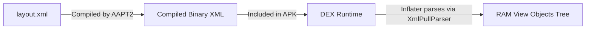
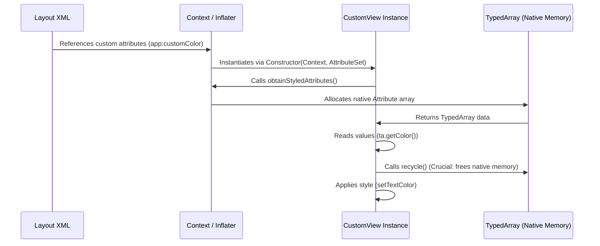
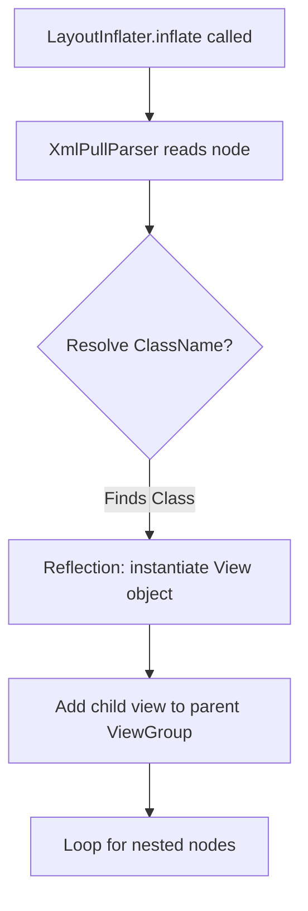
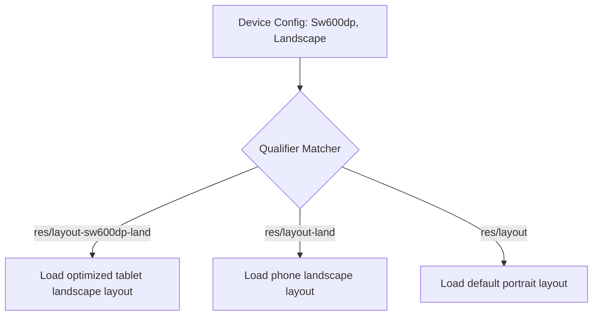
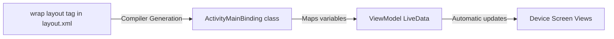
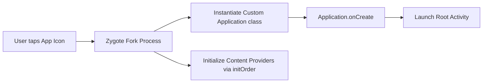
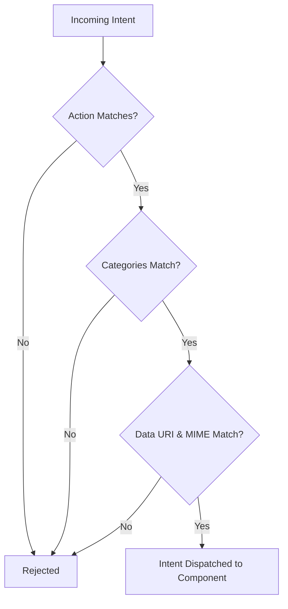
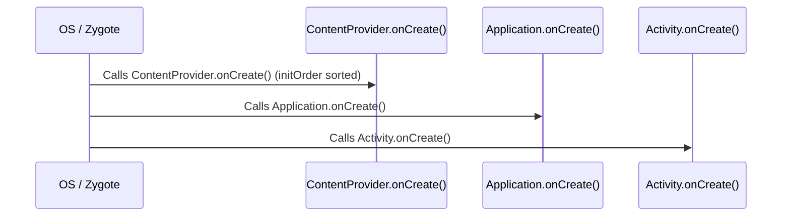

# 🎨 Android XML, Manifest & Architecture — Complete Interview Preparation Guide

> **Authoritative Technical Reference**
> Every topic follows the same structure — **Definition → Why It Is Used → How It Works Internally → Code Example → Common Pitfalls**.
>
> Covers the View system, layouts, resources, styles, themes, drawables, Data Binding, MotionLayout, Navigation graphs, **AndroidManifest.xml architecture**, and **Specialized System XML configurations**.
>
> **50 In-Depth View & Manifest Interview Questions:** [Section 14](#14-comprehensive-xml--manifest-interview-questions-50-questions)

---

## 📑 Table of Contents

| # | Module | Key Topics |
|---|---|---|
| 1 | [XML Role & Architecture](#1-xml-role--architecture-in-android) | Why XML, namespaces, core attributes |
| 2 | [Custom Attributes & Custom Views](#2-custom-xml-attributes--custom-views) | `declare-styleable`, `TypedArray`, custom view lifecycle |
| 3 | [Resources, Styles & Themes](#3-resource-management-styles-and-themes) | Resource organization, styles vs themes, drawable types |
| 4 | [Layout Inflation & Performance](#4-layout-inflation--performance-optimization) | `LayoutInflater` internals, `merge`, `ViewStub`, `include` |
| 5 | [Adaptive Layouts & Qualifiers](#5-adaptive-layouts--resource-qualifiers) | Screen qualifiers, weights, ConstraintLayout helpers |
| 6 | [Selectors & XML Animations](#6-interactive-selectors--xml-custom-animations) | State lists, animation sets, interpolators |
| 7 | [Data Binding](#7-advanced-data-binding-in-xml) | Binding expressions, two-way binding, binding adapters |
| 8 | [Accessibility & Localization](#8-accessibility--internationalization) | Content descriptions, RTL, string resources |
| 9 | [MotionLayout](#9-motionlayout) | MotionScene, keyframes, `OnSwipe`, transition listeners |
| 10 | [Navigation Graphs & Safe Args](#10-navigation-graphs-and-safe-args) | Destinations, actions, typed arguments, nested graphs |
| 11 | [Dark Theme & Qualifiers](#11-dark-theme-theme-overlays-and-resource-qualifiers) | `values-night`, theme overlays, qualifier precedence |
| 12 | [AndroidManifest.xml Architecture](#12-androidmanifestxml-architecture-components--system-declarations) | Manifest parsing, `<application>` flags, components, permissions, multi-process, `<queries>` |
| 13 | [Specialized Android XML Configurations](#13-specialized-android-xml-configurations) | Network Security Config, FileProvider, Shortcuts, App Widgets, Fonts |
| 14 | [Interview Questions Bank (50 Questions)](#14-comprehensive-xml--manifest-interview-questions-50-questions) | Core & Senior questions with follow-ups on Views, Layouts, Manifest, and Security |

---

# 1. XML Role & Architecture in Android

## 1.1 Role of XML

### Definition
* **Simple:** XML (Extensible Markup Language) is a readable text format used in Android to build screen layouts, define color/string values, and configure application settings.
* **Advanced:** XML serves as the declarative configuration and presentation layer in Android. It separates the declarative view structure from the imperative controller logic (Java/Kotlin), enabling compile-time generation of layout resources and structured indexing via the `R.java` pointer file.



### Why It Is Used
XML allows clean **Separation of Concerns**. UI designers and developers can write layout configurations independently of business logic. It also supports **multimodal resource loading**—the OS automatically selects different XML files at runtime depending on the device config (language, orientation, screen size) without changing code.

---

## 1.2 Structure of an Android XML & Namespaces

### Definition
* **XML namespace** — a prefix bound to a URI that tells the build tools which vocabulary an attribute belongs to, so identically-named attributes from different sources cannot collide.
* **`android:`** — the framework namespace (`http://schemas.android.com/apk/res/android`), covering every platform attribute.
* **`app:`** — the application/library namespace (`.../apk/res-auto`), used by AndroidX and by your own custom attributes.
* **`tools:`** — a **design-time-only** namespace. Its attributes are stripped from the built APK, so they configure the preview without affecting runtime.
* **Resource reference (`@`) vs attribute reference (`?`)** — `@color/red` points at a fixed resource; `?attr/colorPrimary` resolves through the **current theme**, which is what makes dark mode and theming work.

### Namespace Declarations
Namespaces tell the compiler how to interpret custom attributes inside the XML document.
* `xmlns:android="http://schemas.android.com/apk/res/android"`: Maps standard attributes provided by the Android OS framework.
* `xmlns:app="http://schemas.android.com/apk/res-auto"`: Maps attributes belonging to support libraries (Jetpack) or custom attributes defined in your own application modules.
* `xmlns:tools="http://schemas.android.com/tools"`: Provides layout editor design-time overrides that do not compile into the final production APK.

### Core Specifying Attributes
1. **`layout_width` and `layout_height`:** Dimensions of the view component. Can be fixed (e.g. `100dp`), `wrap_content` (expand to fit internal contents), or `match_parent` (expand to fill parent constraints).
2. **Margin vs. Padding:**
   * **Margin:** Specifies the empty spacing *outside* the boundaries of a view.
   * **Padding:** Specifies the spacing *inside* the view boundaries (between the view border and the view's content).
3. **Gravity vs. Layout Gravity:**
   * **`android:gravity`:** Aligns the *internal content* within the boundaries of the view itself.
   * **`android:layout_gravity`:** Aligns the *entire view* within the layout bounds of its parent ViewGroup.

---

# 2. Custom XML Attributes & Custom Views

## 2.1 Custom View Lifecycle & Attribute Extraction

### Definition
A **Custom View** is a user-created component that inherits from `View` (or widgets like `TextView`), using custom XML attributes to configure its styling directly in the layout file.



### Why It Is Used
It groups styling configurations into reusable UI elements, allowing developers to configure custom view layouts without writing repetitive configuration code.

### Code Example: Creating a Custom View with Custom Attributes
1. **Define Attributes (`res/values/attrs.xml`):**
   ```xml
   <resources>
       <declare-styleable name="CustomBadgeView">
           <attr name="badgeColor" format="color" />
           <attr name="badgeCount" format="integer" />
       </declare-styleable>
   </resources>
   ```
2. **Extract Attributes in custom View Class (Kotlin):**
   ```kotlin
   class CustomBadgeView @JvmOverloads constructor(
       context: Context,
       attrs: AttributeSet? = null,
       defStyleAttr: Int = 0
   ) : TextView(context, attrs, defStyleAttr) {

       init {
           attrs?.let {
               // Extract values from TypedArray
               val typedArray = context.obtainStyledAttributes(it, R.styleable.CustomBadgeView)
               try {
                   val badgeColor = typedArray.getColor(
                       R.styleable.CustomBadgeView_badgeColor, 
                       Color.RED
                   )
                   val badgeCount = typedArray.getInt(
                       R.styleable.CustomBadgeView_badgeCount, 
                       0
                   )
                   
                   // Apply configurations to View
                   setBackgroundColor(badgeColor)
                   text = badgeCount.toString()
               } finally {
                   // CRITICAL: Always recycle TypedArray to prevent native memory leak
                   typedArray.recycle()
               }
           }
       }
   }
   ```
3. **Reference View in XML:**
   ```xml
   <com.example.app.CustomBadgeView
       android:layout_width="wrap_content"
       android:layout_height="wrap_content"
       app:badgeColor="#FF00FF"
       app:badgeCount="99" />
   ```

---

# 3. Resource Management, Styles, and Themes

## 3.1 Resource Management

### Definition
* **Resource** — any non-code asset the app ships: strings, colours, dimensions, layouts, drawables, animations. Each lives in a typed directory under `res/`.
* **Why resources are not constants in code** — externalizing them is what allows the **same reference** to resolve differently per language, screen density, orientation, or theme.
* **Resource ID** — the generated integer in the `R` class that identifies a resource; `R.string.title` is compile-checked, so a typo is a build error.
* **Qualifier** — a suffix on a directory name (`values-night`, `layout-w600dp`) declaring the configuration it applies to.
* **Default resource** — the unqualified directory, which must always exist as the fallback when no qualified variant matches.

### File Separation Best Practices
* **`colors.xml`:** Centralizes all hex color values. Prevents hardcoded color constants across screens.
* **`dimens.xml`:** Centralizes dimensions. Use **`dp`** (density-independent pixels) for layouts to ensure consistent physical sizing across pixel-density layouts, and **`sp`** (scale-independent pixels) for text sizes to respect user-defined system font scale settings.
* **`strings.xml`:** Stores user-facing text strings, enabling localization and internationalization.
* **`styles.xml` / `themes.xml`:** Encapsulates style attributes to ensure design consistency.

---

## 3.2 Styles vs. Themes

### Definition
* **Style** — a named bundle of attributes applied to a **single view**, replacing repeated attributes on each widget.
* **Theme** — a style applied to an **Activity or a view subtree**, whose values are inherited by everything inside and can be referenced with `?attr/`.
* **The distinguishing property** — a style affects only the view it is set on; a theme's values propagate down the hierarchy.
* **Theme attribute** — a named slot (`colorPrimary`, `colorSurface`) that different themes fill with different values. Referencing the slot rather than a fixed color is what lets one file swap the whole app's appearance.
* **`ThemeOverlay`** — a partial theme that changes only a few attributes for one subtree, without redefining a complete theme.

### Comparison Table

| Feature | Style | Theme |
|---|---|---|
| **Scope** | Local (Applied to a single `View` instance) | Global (Applied to an `Activity` or the entire `<application>`) |
| **Declaration** | `style="@style/MyButtonStyle"` | `android:theme="@style/AppTheme"` |
| **Inheritance** | Single specific component hierarchy | Cascading (all children inherit properties) |
| **Usage** | Overrides layout dimensions, backgrounds, text | Configures status bar color, window background, accent color |

### Global Theme Example (`res/values/themes.xml`):
```xml
<resources>
    <style name="AppTheme" parent="Theme.Material3.DayNight.NoActionBar">
        <item name="colorPrimary">@color/blue_500</item>
        <item name="colorSecondary">@color/teal_200</item>
        <item name="android:statusBarColor">?attr/colorPrimary</item>
    </style>
</resources>
```

---

## 3.3 Drawable Types

### Definition
* **Drawable** — anything that knows how to draw itself into a `Canvas`. It is an abstraction over images, shapes, gradients, and state-dependent graphics.
* **Raster vs vector** — a raster (PNG, WebP) stores pixels and therefore needs one asset per density; a **vector** stores drawing instructions and scales to any density from a single file.
* **`ConstantState`** — the shared state object behind drawables loaded from the same resource. Because it is shared, changing one drawable's tint changes **every** user of that resource unless you call `mutate()` first.
* **Nine-patch** — a raster image with a 1-pixel border marking which regions may stretch and where content may sit.
* **Layer list** — several drawables stacked with individual insets, which frequently removes the need for an extra wrapper view.

### Why It Is Used
A single vector replaces five raster densities. A shape drawable replaces a nine-patch. A layer-list replaces an extra nested `FrameLayout`. Each substitution removes assets, view depth, or both.

### How It Works Internally

| Type | Root Tag | Best For | Notes |
|---|---|---|---|
| **Vector** | `<vector>` | Icons, simple illustrations | One asset for all densities; parsed and rasterized at load, cached afterward |
| **Shape** | `<shape>` | Backgrounds, dividers, chips | Rectangle/oval/line/ring with gradient, stroke, corners |
| **Layer list** | `<layer-list>` | Stacking without extra views | Each `<item>` is a layer with its own insets |
| **State list** | `<selector>` | Pressed/checked/disabled states | Order matters — first match wins |
| **Nine-patch** | `.9.png` | Stretchable raster (chat bubbles) | The 1 px border defines stretch and content regions |
| **Animated vector** | `<animated-vector>` | Icon morphs (play↔pause) | Binds an `<objectAnimator>` to a named vector path |
| **Ripple** | `<ripple>` | Touch feedback | Default on all clickable Material views |
| **Inset / clip / scale** | `<inset>` etc. | Adjusting an existing drawable | Wrappers around another drawable |

**Vector rendering cost.** Vectors are rasterized on first use and cached. A very complex path (a detailed illustration) is measurably slower to inflate than a PNG — use vectors for icons, WebP for photographic or complex art.

### Code Example
```xml
<!-- res/drawable/ic_favorite.xml — one asset, every density -->
<vector xmlns:android="http://schemas.android.com/apk/res/android"
    android:width="24dp"
    android:height="24dp"
    android:viewportWidth="24"
    android:viewportHeight="24"
    android:tint="?attr/colorControlNormal">   <!-- Theme attribute: adapts to dark mode -->
    <path
        android:fillColor="@android:color/white"
        android:pathData="M12,21.35l-1.45,-1.32C5.4,15.36 2,12.28 2,8.5 2,5.42 4.42,3 7.5,3c1.74,0 3.41,0.81 4.5,2.09C13.09,3.81 14.76,3 16.5,3 19.58,3 22,5.42 22,8.5c0,3.78 -3.4,6.86 -8.55,11.54L12,21.35z" />
</vector>
```

```xml
<!-- res/drawable/bg_card.xml — replaces a PNG and adapts to the theme -->
<shape xmlns:android="http://schemas.android.com/apk/res/android"
    android:shape="rectangle">
    <corners android:radius="12dp" />
    <solid android:color="?attr/colorSurface" />
    <stroke android:width="1dp" android:color="?attr/colorOutline" />
    <padding android:left="16dp" android:top="12dp" android:right="16dp" android:bottom="12dp" />
</shape>
```

```xml
<!-- res/drawable/bg_badge_shadow.xml — a fake shadow without an extra view -->
<layer-list xmlns:android="http://schemas.android.com/apk/res/android">
    <item android:top="2dp">                         <!-- Offset layer = shadow -->
        <shape android:shape="oval">
            <solid android:color="#22000000" />
        </shape>
    </item>
    <item android:bottom="2dp">                      <!-- Foreground layer -->
        <shape android:shape="oval">
            <solid android:color="?attr/colorPrimary" />
        </shape>
    </item>
</layer-list>
```

```xml
<!-- res/drawable/ic_play_to_pause.xml — animated vector for an icon morph -->
<animated-vector xmlns:android="http://schemas.android.com/apk/res/android"
    android:drawable="@drawable/ic_play">
    <target
        android:name="leftBar"
        android:animation="@animator/play_to_pause_left" />
</animated-vector>
```

```kotlin
// Starting the morph from code
val avd = AppCompatResources.getDrawable(context, R.drawable.ic_play_to_pause)
imageView.setImageDrawable(avd)
(avd as? AnimatedVectorDrawableCompat)?.start()

// Tinting programmatically without mutating the shared constant state
val tinted = AppCompatResources.getDrawable(context, R.drawable.ic_favorite)!!
    .mutate()                                        // MANDATORY: without it, every user of this
                                                     // drawable resource gets the tint too
    .apply { setTint(ContextCompat.getColor(context, R.color.accent)) }
```

### Common Pitfalls
* **Not calling `mutate()` before changing a drawable's state.** Drawables loaded from the same resource share a `ConstantState`; tinting one tints them all, app-wide, with no obvious cause.
* **Hardcoding colors instead of `?attr/` theme references.** The drawable then cannot follow dark mode.
* **Using vectors for complex illustrations.** Inflation cost grows with path complexity; profile before shipping a 200-path vector.
* **Shipping PNGs at five densities** when a `<shape>` or vector would do.

---
# 4. Layout Inflation & Performance Optimization

## 4.1 Layout Inflation Internals

### Definition
* **Simple:** Layout Inflation is the process of converting an XML layout file into visual Java/Kotlin view objects in RAM.
* **Advanced:** Inflation is triggered via `LayoutInflater.inflate()`. It reads compiled binary XML resources using an `XmlPullParser`, maps layout nodes to View classes using reflection (`Constructor.newInstance()`), and builds a nested tree of physical View objects in memory.



### Inflation Optimization Tags
1. **`<include>`:** Injects a reusable XML layout into a parent layout. Helps reduce code duplication, but doesn't change performance on its own.
2. **`<merge>`:** Used as the root tag in layout files intended for inclusion. It merges child views directly into the parent view container, eliminating redundant nested layouts.
3. **`<ViewStub>`:** A lightweight, invisible view with zero dimensions. It serves as a placeholder that does not inflate its target layout until explicitly requested (`viewStub.inflate()`). Excellent for loading conditional screens (like errors or load pages) only when needed.

---

# 5. Adaptive Layouts & Resource Qualifiers

## 5.1 Screen Adaptation Qualifiers

### Definition
Android selects optimized layouts at runtime based on configuration qualifiers added as directory suffixes under the `res/` folder.



### Standard Directory Qualifiers
* **`layout/`:** Default layouts (usually portrait mobile layouts).
* **`layout-land/`:** Layouts optimized for landscape mode on all screen sizes.
* **`layout-sw600dp/`:** Smallest Width layouts. Applies only when the shortest screen dimension is at least 600dp (standard target for 7-inch tablets).
* **`layout-sw600dp-land/`:** Tablet layouts in landscape mode.

---

## 5.2 Dynamic View Spacing in XML

### Definition
* **The problem** — a layout must adapt to screen sizes and text lengths that were never anticipated, so spacing cannot be a set of fixed numbers.
* **`layout_weight`** — in a `LinearLayout`, the proportion of **leftover** space a child receives. Using it requires setting the corresponding dimension to `0dp` so the child claims none of the space up front.
* **Margin vs padding** — margin is space **outside** a view's boundary (between it and its neighbours); padding is space **inside**, between the boundary and the content.
* **`match_parent` / `wrap_content` / fixed `dp`** — fill the parent, size to the content, or commit to an exact size that will not adapt.
* **Why weighted nesting is costly** — a weighted `LinearLayout` measures its children **twice**, and nesting them multiplies that cost per level.

### Using `layout_weight`
In `LinearLayout`, `layout_weight` specifies how much remaining space should be distributed among sibling views.
* **Best Practice:** Set the size attribute corresponding to the layout orientation to `0dp` (e.g. `android:layout_width="0dp"` in horizontal orientation) so the compiler calculates dimensions using weight ratios, bypassing static measurements.

### ConstraintLayout Positioning
Provides a flat view hierarchy by aligning components via relative constraints. Uses bias (`layout_constraintHorizontal_bias`) to position views dynamically as percentages of the remaining parent layout size.

---

## 5.3 ConstraintLayout: Chains, Barriers, Guidelines, Groups, and Flow

### Definition
* **Constraint** — a declared relationship between an edge of one view and an edge of another (or of the parent). A view needs at least one horizontal and one vertical constraint to be positioned.
* **Why it replaces nesting** — the layout solves the whole screen as a system of equations in a **flat** hierarchy, removing the repeated measure passes that nested layouts cost.
* **Chain** — a run of views linked in both directions along an axis, distributed together (`spread`, `spread_inside`, `packed`).
* **Guideline** — an invisible line at a fixed `dp` or a percentage of the parent, used as a constraint target.
* **Barrier** — an invisible line that tracks the **extreme edge of several views**, so a column adapts to whichever neighbour is longest. This is what makes label/value layouts survive translation.
* **Group** — a handle that toggles the visibility of several views together.
* **Flow** — a virtual chain that **wraps** onto multiple lines, replacing a nested layout for tag rows.

### Why It Is Used
Every nesting level costs another measure pass, and nested weighted `LinearLayout`s measure their children twice per level. `ConstraintLayout` solves the whole layout with a constraint solver in a flat hierarchy, so removing nesting is the single biggest View-system layout win.

### How It Works Internally
`ConstraintLayout` builds a system of linear equations from the constraints and solves it with Cassowary, the same algorithm behind iOS Auto Layout. Guidelines, barriers, and groups are `View`s with `visibility="gone"` — they occupy no space and never draw, they only contribute constraints.

| Helper | Purpose |
|---|---|
| **Chain** | Distribute a run of views along an axis (`spread`, `spread_inside`, `packed`) |
| **Guideline** | A virtual line at a fixed dp or a percentage of the parent |
| **Barrier** | A virtual line at the extreme edge of several views — sizes to the longest |
| **Group** | Toggles the visibility of several views at once |
| **Flow** | A virtual chain that wraps, replacing a nested layout for tag lists |
| **Layer** | Transforms (rotate/scale) a set of views together |

### Code Example
```xml
<androidx.constraintlayout.widget.ConstraintLayout
    xmlns:android="http://schemas.android.com/apk/res/android"
    xmlns:app="http://schemas.android.com/apk/res-auto"
    android:layout_width="match_parent"
    android:layout_height="wrap_content">

    <!-- Guideline: content never crosses the 50% mark -->
    <androidx.constraintlayout.widget.Guideline
        android:id="@+id/half"
        android:layout_width="wrap_content"
        android:layout_height="wrap_content"
        android:orientation="vertical"
        app:layout_constraintGuide_percent="0.5" />

    <TextView
        android:id="@+id/label_name"
        android:layout_width="wrap_content"
        android:layout_height="wrap_content"
        android:text="@string/name"
        app:layout_constraintStart_toStartOf="parent"
        app:layout_constraintTop_toTopOf="parent" />

    <TextView
        android:id="@+id/label_email"
        android:layout_width="wrap_content"
        android:layout_height="wrap_content"
        android:text="@string/email_address"
        app:layout_constraintStart_toStartOf="parent"
        app:layout_constraintTop_toBottomOf="@id/label_name" />

    <!-- Barrier: the value column starts after the LONGEST label, in any language.
         This is what makes the layout survive translation without hardcoded widths. -->
    <androidx.constraintlayout.widget.Barrier
        android:id="@+id/label_barrier"
        android:layout_width="wrap_content"
        android:layout_height="wrap_content"
        app:barrierDirection="end"
        app:constraint_referenced_ids="label_name,label_email" />

    <TextView
        android:id="@+id/value_name"
        android:layout_width="0dp"                       <!-- 0dp = "match constraints" -->
        android:layout_height="wrap_content"
        app:layout_constraintStart_toEndOf="@id/label_barrier"
        app:layout_constraintEnd_toEndOf="parent"
        app:layout_constraintTop_toTopOf="@id/label_name" />

    <!-- Group: one visibility toggle for an entire section -->
    <androidx.constraintlayout.widget.Group
        android:id="@+id/premium_section"
        android:layout_width="wrap_content"
        android:layout_height="wrap_content"
        android:visibility="gone"
        app:constraint_referenced_ids="badge,expiry_label,expiry_value" />

    <!-- Flow: a wrapping tag row without a nested layout or a RecyclerView -->
    <androidx.constraintlayout.helper.widget.Flow
        android:layout_width="0dp"
        android:layout_height="wrap_content"
        app:constraint_referenced_ids="tag1,tag2,tag3,tag4"
        app:flow_wrapMode="chain"
        app:flow_horizontalGap="8dp"
        app:flow_verticalGap="8dp"
        app:layout_constraintStart_toStartOf="parent"
        app:layout_constraintEnd_toEndOf="parent"
        app:layout_constraintTop_toBottomOf="@id/value_name" />

</androidx.constraintlayout.widget.ConstraintLayout>
```

```xml
<!-- A weighted chain: replaces a horizontal LinearLayout with layout_weight -->
<Button
    android:id="@+id/cancel"
    android:layout_width="0dp"
    android:layout_height="wrap_content"
    app:layout_constraintHorizontal_chainStyle="spread"
    app:layout_constraintHorizontal_weight="1"
    app:layout_constraintStart_toStartOf="parent"
    app:layout_constraintEnd_toStartOf="@id/confirm" />
<Button
    android:id="@+id/confirm"
    android:layout_width="0dp"
    android:layout_height="wrap_content"
    app:layout_constraintHorizontal_weight="2"          <!-- Twice the width of cancel -->
    app:layout_constraintStart_toEndOf="@id/cancel"
    app:layout_constraintEnd_toEndOf="parent" />
```

```kotlin
// ConstraintSet: animate between two full layout states with one line
val collapsed = ConstraintSet().apply { clone(context, R.layout.header_collapsed) }
val expanded  = ConstraintSet().apply { clone(context, R.layout.header_expanded) }

fun toggle(expandedNow: Boolean) {
    TransitionManager.beginDelayedTransition(binding.root, AutoTransition())
    (if (expandedNow) expanded else collapsed).applyTo(binding.root)
}
```

### Common Pitfalls
* **`match_parent` inside a `ConstraintLayout`.** It is not supported and behaves unpredictably; use `0dp` (match constraints) with start and end constraints.
* **Missing a constraint on one axis.** The view silently jumps to (0,0) at runtime while looking fine in the editor. Enable "Missing constraints" lint.
* **Hardcoded widths for label columns.** They break in German and Arabic. Use a `Barrier`.
* **Setting each view's visibility individually.** Use a `Group`, or the states drift out of sync.
* **Nesting `ConstraintLayout` inside `ConstraintLayout`.** This defeats the entire point; flatten instead.

---
# 6. Interactive Selectors & XML Custom Animations

## 6.1 State-List Selectors

### Definition
* **State-list drawable (`<selector>`)** — a drawable that picks a different image or shape depending on the view's current **state**.
* **View state** — a boolean condition the framework reports: `state_pressed`, `state_focused`, `state_selected`, `state_checked`, `state_enabled`.
* **First-match-wins** — the rule that governs the whole file: the system uses the **first** `<item>` whose listed conditions all hold, so the unconditional default must be **last** or nothing after it is reachable.
* **Colour state list** — the same idea applied to colours rather than drawables, letting text colour change per state.

A **Selector** is a drawable resource defined in XML that updates a view's appearance based on state changes (e.g. focused, pressed, selected, disabled).

```xml
<!-- res/drawable/button_state_selector.xml -->
<selector xmlns:android="http://schemas.android.com/apk/res/android">
    <!-- Pressed state -->
    <item android:drawable="@color/blue_pressed" android:state_pressed="true" />
    <!-- Focused state -->
    <item android:drawable="@color/blue_focused" android:state_focused="true" />
    <!-- Default state -->
    <item android:drawable="@color/blue_default" />
</selector>
```

---

## 6.2 XML Custom Animations & Interpolators

### Definition
* **View animation (`<set>`, `<translate>`, `<alpha>`)** — the legacy system that changes only how a view is **drawn**; the view's actual position and its touch target do not move.
* **Property animation (`<objectAnimator>`)** — the modern system that changes real property values over time, so layout and touch handling follow.
* **Interpolator** — the curve mapping elapsed time to progress. It is what makes motion feel natural rather than mechanical: `accelerate`, `decelerate`, `overshoot`, `bounce`.
* **Duration and start offset** — how long a step takes, and how long it waits before beginning, which is what lets a `<set>` stagger its children.

Animations can be declared in XML files located in the `res/anim/` folder.

### Animation Set Tags
* **`<set>`:** Container that groups multiple animation operations together.
* **`<translate>`:** Moves a view horizontally or vertically.
* **`<alpha>`:** Animates the opacity (transparency) of a view.
* **`<scale>`:** Resizes a view along the X and Y axes.
* **`<rotate>`:** Spins a view around a specific pivot point.

### Interpolators
Modify the rate of animation progress over time.
* `LinearInterpolator`: Constant speed.
* `AccelerateInterpolator`: Starts slow and accelerates.
* `DecelerateInterpolator`: Starts fast and slows down.

---

# 7. Advanced Data Binding in XML

## 7.1 Data Binding

### Definition
* **Simple:** Data Binding links UI layout elements directly to data model variables, reducing boilerplate activity code.
* **Advanced:** Data Binding is a support library that auto-generates binding classes at compile time based on `<layout>` wrapped XML files. It replaces runtime `findViewById()` calls with direct binding references, resolving layout updates during compilation.



### Double-Way Binding (`@={}` vs. `@{}`)
* **One-Way Binding (`@{variable}`):** Passes data from the model down to the UI view. If the variable updates, the view is updated automatically.
* **Two-Way Binding (`@={variable}`):** Synchronizes changes in both directions. If the user edits text inside an `EditText`, the bound variable update propagates back to the data class automatically.

```xml
<!-- Example Layout XML -->
<layout xmlns:android="http://schemas.android.com/apk/res/android">
    <data>
        <variable
            name="viewmodel"
            type="com.example.app.UserViewModel" />
    </data>
    
    <LinearLayout
        android:layout_width="match_parent"
        android:layout_height="match_parent"
        android:orientation="vertical">
        
        <!-- Two-Way Binding: changes sync to ViewModel automatically -->
        <EditText
            android:layout_width="match_parent"
            android:layout_height="wrap_content"
            android:text="@={viewmodel.inputUserName}" />
    </LinearLayout>
</layout>
```

---

# 8. Accessibility & Internationalization

## 8.1 Accessibility (a11y) in XML

### Definition
* **Accessibility** — making the screen usable by people navigating with a screen reader, a switch device, enlarged text, or high-contrast settings.
* **`android:contentDescription`** — the text a screen reader speaks for an element that has no visible label, such as an icon button. It should describe the **action**, not the picture.
* **`android:importantForAccessibility="no"`** — removes a purely decorative element from the accessibility tree, so the user does not stop on something meaningless.
* **`android:labelFor`** — links a label to the input it describes, so focusing the field announces its purpose.
* **Touch target** — the tappable area, required to be at least **48 × 48 dp** however small the icon inside it is drawn.
* **`sp` vs `dp`** — text sizes use `sp` so they follow the user's font-scale setting; everything else uses `dp`.

Accessibility ensures that users with visual, auditory, or motor impairments can interact with your application.

### Key Best Practices
1. **`contentDescription`:** Add clear descriptions to all non-text components (e.g. `ImageView` or `ImageButton`) so screen readers (like TalkBack) can read them aloud.
2. **`labelFor`:** Links a label (`TextView`) to a specific input field (`EditText`), so TalkBack reads the input purpose context correctly.
3. **Focus Navigation:** Use `android:focusable="true"` and `android:nextFocusDown="..."` to configure keyboard and D-pad navigation paths.
4. **Touch Targets:** Maintain a minimum size of **`48dp x 48dp`** for all interactive components to ensure comfortable touch accuracy.

---

## 8.2 Localization (l10n) in XML

### Definition
* **Internationalization (i18n)** — building the app so it *can* be translated: no hardcoded strings, no assumptions about word order, text direction, or number and date format.
* **Localization (l10n)** — supplying the actual translations and locale-specific resources.
* **String resource** — text extracted into `strings.xml` so it can be replaced per locale without touching code.
* **Positional argument (`%1$s`)** — a numbered placeholder, which lets a translator **reorder** the substitutions when the target language needs a different word order.
* **Plurals (`<plurals>`)** — a set of forms selected by quantity. It exists because languages have up to six plural categories, so an `if (n == 1)` check is wrong outside English.
* **RTL (right-to-left)** — languages such as Arabic and Hebrew, supported by using `start`/`end` instead of `left`/`right` throughout.

Android manages localization using resource qualifiers mapped to locale tags.

### Implementation Setup
* **`res/values/strings.xml` (Default English):**
  ```xml
  <resources>
      <string name="welcome_message">Welcome</string>
  </resources>
  ```
* **`res/values-es/strings.xml` (Spanish translation):**
  ```xml
  <resources>
      <string name="welcome_message">Bienvenido</string>
  </resources>
  ```
The system automatically detects the device's locale settings and selects the corresponding string translation folder.

---

# 9. MotionLayout

## 9.1 Declarative Motion in XML

### Definition
* **MotionLayout** — a `ConstraintLayout` subclass that animates **between two complete layout states** instead of animating individual properties.
* **`ConstraintSet`** — one complete set of constraints describing the layout at one end of the transition. MotionLayout interpolates every attribute that differs between the start and end sets.
* **MotionScene** — the separate XML file holding those sets and the transition between them, keeping motion out of the layout file.
* **Progress** — a value from 0.0 to 1.0 representing how far through the transition the layout is. Everything else is derived from it.
* **`<OnSwipe>`** — binds progress directly to a drag, so the animation follows the finger and can be reversed mid-gesture rather than merely playing.
* **Keyframe** — an intermediate state at a given progress point, used to bend the motion path or change a property partway through.

### Why It Is Used
Complex coordinated motion — a collapsing toolbar with a scaling avatar, a swipe-to-reveal panel — expressed imperatively becomes hundreds of lines of interdependent animator code. MotionLayout expresses the same thing as two end states plus rules, and gives you gesture-driven scrubbing for free.

### How It Works Internally
* A **MotionScene** declares a `<Transition>` between a `start` and an `end` `<ConstraintSet>`.
* Progress runs 0.0 → 1.0. MotionLayout interpolates every differing constraint between the two sets.
* `<OnSwipe>` binds progress to a drag, so the animation follows the finger and can be reversed mid-gesture.
* `<KeyFrameSet>` inserts intermediate states — a `KeyPosition` bends the motion path, a `KeyAttribute` changes a property (alpha, scale, rotation) at a given progress point.

### Code Example
```xml
<!-- res/layout/activity_profile.xml -->
<androidx.constraintlayout.motion.widget.MotionLayout
    android:id="@+id/motion_root"
    android:layout_width="match_parent"
    android:layout_height="match_parent"
    app:layoutDescription="@xml/scene_profile">

    <ImageView
        android:id="@+id/avatar"
        android:layout_width="120dp"
        android:layout_height="120dp"
        android:src="@drawable/avatar" />

    <TextView
        android:id="@+id/name"
        android:layout_width="wrap_content"
        android:layout_height="wrap_content"
        android:text="@string/user_name" />

    <androidx.recyclerview.widget.RecyclerView
        android:id="@+id/list"
        android:layout_width="match_parent"
        android:layout_height="0dp" />
</androidx.constraintlayout.motion.widget.MotionLayout>
```

```xml
<!-- res/xml/scene_profile.xml -->
<MotionScene xmlns:android="http://schemas.android.com/apk/res/android"
    xmlns:app="http://schemas.android.com/apk/res-auto">

    <Transition
        app:constraintSetStart="@+id/expanded"
        app:constraintSetEnd="@+id/collapsed"
        app:duration="300">

        <!-- Binds progress to the RecyclerView's scroll: the header collapses as the list scrolls -->
        <OnSwipe
            app:touchAnchorId="@+id/list"
            app:touchAnchorSide="top"
            app:dragDirection="dragUp" />

        <KeyFrameSet>
            <!-- Fade the name out over the FIRST HALF of the transition only -->
            <KeyAttribute
                app:framePosition="50"
                app:motionTarget="@+id/name"
                android:alpha="0.0" />
            <!-- Bend the avatar's path so it arcs rather than moving in a straight line -->
            <KeyPosition
                app:framePosition="50"
                app:motionTarget="@+id/avatar"
                app:percentX="0.7"
                app:keyPositionType="parentRelative" />
        </KeyFrameSet>
    </Transition>

    <ConstraintSet android:id="@+id/expanded">
        <Constraint
            android:id="@+id/avatar"
            android:layout_width="120dp"
            android:layout_height="120dp"
            app:layout_constraintTop_toTopOf="parent"
            app:layout_constraintStart_toStartOf="parent"
            app:layout_constraintEnd_toEndOf="parent" />
    </ConstraintSet>

    <ConstraintSet android:id="@+id/collapsed">
        <Constraint
            android:id="@+id/avatar"
            android:layout_width="40dp"
            android:layout_height="40dp"
            android:layout_marginStart="16dp"
            app:layout_constraintTop_toTopOf="parent"
            app:layout_constraintStart_toStartOf="parent" />
    </ConstraintSet>
</MotionScene>
```

```kotlin
// Driving and observing the transition from code
binding.motionRoot.transitionToEnd()

binding.motionRoot.setTransitionListener(object : MotionLayout.TransitionListener {
    override fun onTransitionChange(l: MotionLayout?, start: Int, end: Int, progress: Float) {
        // Sync something outside MotionLayout, e.g. the status bar icon colour
        window.statusBarColorForProgress(progress)
    }
    override fun onTransitionCompleted(l: MotionLayout?, currentId: Int) {}
    override fun onTransitionStarted(l: MotionLayout?, s: Int, e: Int) {}
    override fun onTransitionTrigger(l: MotionLayout?, id: Int, pos: Boolean, prog: Float) {}
})
```

### Common Pitfalls
* **Constraining children in the layout file.** MotionLayout takes constraints from the MotionScene; any constraint in the layout XML is overwritten. Declare only sizes and content there.
* **Views appearing at (0,0).** Every animated view must be constrained in **both** ConstraintSets.
* **Nesting MotionLayout inside a scrolling parent** without `app:motionInterpolator` and correct nested-scroll setup — the two fight over the gesture.
* **Reaching for MotionLayout in a Compose codebase.** Compose has no MotionLayout equivalent worth adopting; use `Transition` and `nestedScroll` instead.

---

# 10. Navigation Graphs and Safe Args

## 10.1 XML Navigation Graphs

### Definition
* **Navigation graph** — an XML resource declaring every destination in an app and the connections between them, so routing is described in one reviewable file.
* **Destination** — a screen in the graph: a fragment, an activity, or a dialog.
* **Action** — a named connection from one destination to another, carrying its own animations and back-stack behavior.
* **Argument** — a typed value a destination requires, declared in the graph so **Safe Args** can generate classes that make a missing or mistyped argument a build error.
* **Nested graph** — a sub-graph representing a self-contained flow. It gets its own `ViewModelStore`, so a ViewModel scoped to it is cleared when the flow is popped.
* **`popUpTo`** — the attribute controlling what is removed from the back stack when navigating, which is how you prevent Back returning into a completed login flow.

### Why It Is Used
It replaces scattered `FragmentTransaction` calls with one visual, reviewable description of the app's structure, and generates type-safe argument classes so a missing or mistyped argument is a build failure.

### How It Works Internally
The Safe Args Gradle plugin reads the graph and generates a `<Destination>Directions` class per source destination (one method per action) and a `<Destination>Args` class per destination with arguments. `NavController` executes the action, applies the pop behavior, and puts arguments into the destination's `Bundle` — which `SavedStateHandle` then exposes to the ViewModel.

### Code Example
```xml
<!-- res/navigation/nav_graph.xml -->
<navigation xmlns:android="http://schemas.android.com/apk/res/android"
    xmlns:app="http://schemas.android.com/apk/res-auto"
    android:id="@+id/nav_graph"
    app:startDestination="@id/productListFragment">

    <fragment
        android:id="@+id/productListFragment"
        android:name="com.example.ui.ProductListFragment"
        android:label="@string/products">

        <action
            android:id="@+id/action_list_to_detail"
            app:destination="@id/productDetailFragment"
            app:enterAnim="@anim/slide_in_right"
            app:exitAnim="@anim/slide_out_left" />
    </fragment>

    <fragment
        android:id="@+id/productDetailFragment"
        android:name="com.example.ui.ProductDetailFragment">

        <argument
            android:name="productId"
            app:argType="long" />                    <!-- Required: no defaultValue -->
        <argument
            android:name="referrer"
            app:argType="string"
            app:nullable="true"
            android:defaultValue="@null" />          <!-- Optional -->

        <!-- Deep link: an https URL routes straight to this destination -->
        <deepLink app:uri="https://example.com/product/{productId}" />
    </fragment>

    <!-- A nested graph gets its own ViewModel scope for the whole flow -->
    <navigation
        android:id="@+id/checkout_graph"
        app:startDestination="@id/cartFragment">
        <fragment android:id="@+id/cartFragment"    android:name="com.example.ui.CartFragment" />
        <fragment android:id="@+id/paymentFragment" android:name="com.example.ui.PaymentFragment" />
    </navigation>
</navigation>
```

```kotlin
// Navigating with generated, type-safe directions
val direction = ProductListFragmentDirections
    .actionListToDetail(productId = product.id, referrer = "list")
findNavController().navigate(direction)

// Reading arguments — generated, so a signature change breaks the build
class ProductDetailFragment : Fragment(R.layout.fragment_product_detail) {
    private val args: ProductDetailFragmentArgs by navArgs()

    // The same arguments reach the ViewModel through SavedStateHandle,
    // which is why they survive process death.
    private val viewModel: ProductDetailViewModel by viewModels()
}

@HiltViewModel
class ProductDetailViewModel @Inject constructor(
    savedState: SavedStateHandle
) : ViewModel() {
    private val productId: Long = checkNotNull(savedState["productId"])
}
```

```kotlin
// A ViewModel scoped to a nested graph: shared across the whole checkout flow,
// and cleared automatically when the flow is popped.
class PaymentFragment : Fragment() {
    private val checkoutViewModel: CheckoutViewModel by navGraphViewModels(R.id.checkout_graph) {
        defaultViewModelProviderFactory
    }
}
```

```gradle
plugins { id("androidx.navigation.safeargs.kotlin") }
```

### Common Pitfalls
* **Passing a `Parcelable` model as an argument.** The Bundle goes through a Binder transaction with a ~1 MB cap. Pass an ID.
* **Double navigation on a fast double tap.** Throws `IllegalArgumentException: navigation destination is unknown`. Guard by checking `currentDestination`.
* **Forgetting `app:popUpTo`.** Back from Home returns to the login screen.
* **Holding `NavController` in a ViewModel.** It leaks the Activity; emit navigation events instead.

---

# 11. Dark Theme, Theme Overlays, and Resource Qualifiers

## 11.1 Dark Theme

### Definition
* **Dark theme** — a second set of colours the system selects when the user prefers a dark interface, resolved through the `values-night` qualifier rather than through conditional code.
* **`DayNight` theme** — a parent theme that already defines both variants, so your theme only overrides what differs.
* **`AppCompatDelegate.setDefaultNightMode`** — the API selecting light, dark, or follow-system for the whole app, and where a user-chosen preference is applied.
* **The one rule that makes it work** — layouts and drawables must reference **theme attributes** (`?attr/colorSurface`), never fixed colour resources (`@color/white`), because only an attribute can resolve differently per theme.

### Why It Is Used
It is a strong user expectation, it reduces battery use on OLED, and it is a Play Store quality signal. Doing it through theme attributes rather than conditional code means one resource fork instead of branching everywhere.

### How It Works Internally
`AppCompatDelegate` sets the UI mode; `Resources` then resolves `values-night/` for colors and themes. The critical rule is that layouts and drawables reference **theme attributes** (`?attr/colorSurface`) rather than raw color resources (`@color/white`) — the attribute resolves differently per theme, the raw color does not.

### Code Example
```xml
<!-- res/values/themes.xml -->
<style name="Theme.App" parent="Theme.Material3.DayNight.NoActionBar">
    <item name="colorPrimary">@color/brand_purple</item>
    <item name="colorSurface">@color/surface_light</item>
    <item name="colorOnSurface">@color/on_surface_light</item>
    <!-- A custom attribute, declared in attrs.xml, for a value Material does not define -->
    <item name="chartGridColor">@color/grid_light</item>
</style>

<!-- res/values-night/themes.xml — only the values that DIFFER -->
<style name="Theme.App" parent="Theme.Material3.DayNight.NoActionBar">
    <item name="colorPrimary">@color/brand_purple_light</item>
    <item name="colorSurface">@color/surface_dark</item>
    <item name="colorOnSurface">@color/on_surface_dark</item>
    <item name="chartGridColor">@color/grid_dark</item>
</style>
```

```xml
<!-- res/values/attrs.xml -->
<resources>
    <attr name="chartGridColor" format="color" />
</resources>
```

```xml
<!-- Layouts must reference ATTRIBUTES, not colors -->
<TextView
    android:background="?attr/colorSurface"
    android:textColor="?attr/colorOnSurface" />

<!-- WRONG: fixed in both themes -->
<!-- <TextView android:textColor="@color/black" /> -->
```

```xml
<!-- ThemeOverlay: change part of the theme for one subtree without a whole new theme -->
<style name="ThemeOverlay.App.InverseHeader" parent="">
    <item name="colorSurface">?attr/colorPrimary</item>
    <item name="colorOnSurface">?attr/colorOnPrimary</item>
</style>

<LinearLayout
    android:theme="@style/ThemeOverlay.App.InverseHeader"
    android:background="?attr/colorSurface">
    <!-- Children inside resolve colorSurface to the PRIMARY colour -->
</LinearLayout>
```

```kotlin
// User-selectable theme, persisted, applied without recreating the Activity manually
enum class ThemeMode(val delegateValue: Int) {
    SYSTEM(AppCompatDelegate.MODE_NIGHT_FOLLOW_SYSTEM),
    LIGHT(AppCompatDelegate.MODE_NIGHT_NO),
    DARK(AppCompatDelegate.MODE_NIGHT_YES)
}

fun applyTheme(mode: ThemeMode) = AppCompatDelegate.setDefaultNightMode(mode.delegateValue)

// Apply the persisted value in Application.onCreate, before any Activity is created,
// or the app flashes the wrong theme on cold start.
```

## 11.2 Resource Qualifier Resolution

### Definition
* **Qualifier** — a suffix on a resource directory declaring the device or window configuration it applies to (`values-es`, `layout-land`, `drawable-xxhdpi`, `values-night`).
* **Resolution** — the process by which the system picks the best-matching directory for the current configuration at the moment the resource is requested.
* **Precedence** — qualifiers are evaluated in a **fixed order** (locale, then layout direction, then size, then orientation, then night mode, then density, then platform version). The first qualifier that eliminates candidates decides.
* **`sw` vs `w`** — `sw600dp` describes the **device's smallest dimension** and never changes at runtime; `w600dp` describes the **current window** and does change in split-screen and on foldables.
* **Default directory** — the unqualified one, which must always exist as the fallback.

### How It Works Internally
Qualifiers are evaluated in a defined priority: MCC/MNC → locale → layout direction → smallest width → available width/height → screen size → orientation → UI mode → night mode → density → touchscreen → keyboard → navigation → platform version. The first qualifier that eliminates candidates decides; ties fall through to the next.

| Qualifier | Directory | Selected When |
|---|---|---|
| Language + region | `values-es-rMX/` | Locale is Spanish (Mexico) |
| Layout direction | `layout-ldrtl/` | RTL locale |
| Smallest width | `layout-sw600dp/` | Smallest screen dimension ≥ 600 dp |
| Available width | `layout-w840dp/` | Current window width ≥ 840 dp — **reacts to split-screen** |
| Orientation | `layout-land/` | Landscape |
| Night mode | `values-night/` | Dark theme active |
| Density | `drawable-xxhdpi/` | ~480 dpi |
| API level | `values-v31/` | API 31 or higher |

**`sw600dp` vs `w600dp`:** `sw` describes the *device's* smallest dimension and never changes at runtime. `w` describes the *current window* and does change in split-screen and on foldables — which is why `w` qualifiers are the correct choice for adaptive layouts.

### Common Pitfalls
* **Hardcoding `@color/white` in layouts.** Dark mode then has no effect on those views.
* **Forking whole `values-night/themes.xml` files.** Redefine only what differs; duplicated values drift.
* **`sw600dp` for adaptive layouts.** It ignores split-screen. Use `w600dp`/`w840dp`.
* **Not calling `setDefaultNightMode` before the first Activity.** Produces a visible theme flash on launch.
* **Density-specific drawables for icons.** Use a single vector.

---


# 12. AndroidManifest.xml Architecture, Components & System Declarations

## 12.1 Manifest Role & Architecture

### Definition
* **Simple:** The `AndroidManifest.xml` is the master blueprint and identity file of an Android application. It tells the Android OS what components the app has (Activities, Services, Broadcast Receivers, Content Providers), what permissions it needs, and how it interacts with other apps and hardware.
* **Senior / Advanced:** The Manifest is the declarative system contract parsed by the **`PackageManagerService` (PMS)** during package installation (`pm install`). During the build process, **`AAPT2` (Android Asset Packaging Tool 2)** compiles the XML into binary XML format (`res/raw` or root binary `AndroidManifest.xml` in the APK). PMS extracts this binary metadata to construct in-memory component registries, security sandbox definitions (UID/GID), intent-filter routing tables, and process isolation boundaries before any app code executes.

```mermaid
graph TD
    SourceManifest[Source AndroidManifest.xml + Library Manifests] -->|AGP ManifestMerger2| MergedManifest[Merged AndroidManifest.xml]
    MergedManifest -->|AAPT2 Compilation| BinaryXML[Binary AndroidManifest.xml in APK]
    BinaryXML -->|APK Install / Boot| PMS[PackageManagerService (System Server)]
    PMS --> ComponentRegistry[Component Registry & Intent Tables]
    PMS --> SecuritySandbox[UID / GID & Permission Grant Tables]
    PMS --> PackageQueries[Package Visibility Filter Rules]
```

### `<manifest>` Root Element Attributes
```xml
<manifest xmlns:android="http://schemas.android.com/apk/res/android"
    xmlns:tools="http://schemas.android.com/tools"
    package="com.example.myapp"
    android:versionCode="100"
    android:versionName="1.0.0"
    android:installLocation="auto">
```
* **`package` vs `namespace` / `applicationId`:** 
  * In modern AGP (Android Gradle Plugin 7.0+), `package` in the manifest defines the Kotlin/Java package for generated `R` and `BuildConfig` classes (now configured via `android.namespace` in `build.gradle.kts`).
  * `applicationId` in `build.gradle.kts` defines the unique application identity on Google Play and on the Android OS package manager.
* **`android:versionCode`:** An integer used by Google Play and the OS to evaluate upgrade sequences (must increment for updates).
* **`android:versionName`:** A user-visible version string (e.g., `"2.4.1"`).
* **`android:sharedUserId` (DEPRECATED & DANGEROUS):** Historically allowed two APKs signed with the same certificate to share the same Linux UID and access each other’s internal sandboxes. Deprecated in API 29 because it causes package-upgrade deadlocks, security vulnerabilities, and breaks multi-user support.

---

## 12.2 `<application>` Configuration & Process Architecture

### Definition
The `<application>` tag declares application-wide metadata, themes, global process behaviors, hardware acceleration, and security boundaries.



### Core Application Attributes

| Attribute | Purpose | Security / Performance Impact |
|---|---|---|
| **`android:name`** | Specifies custom `Application` class subclass. | Instantiated before any Activity or Service; used for DI initialization (Hilt, Koin) and crash logging. |
| **`android:allowBackup`** | Enables ADB backup and Google Cloud Auto Backup. | **Security Risk:** If `true` without strict rules, sensitive app data can be extracted via `adb backup`. Must pair with `dataExtractionRules`. |
| **`android:dataExtractionRules`** | (Android 12+ API 31+) Defines explicit XML rules for cloud backup and device-to-device transfers. | Replaces legacy `fullBackupContent`. Allows excluding Keystore-encrypted tokens, databases, or cache directories. |
| **`android:hardwareAccelerated`** | Enables 2D GPU rendering for all views in the app (default `true` on API 14+). | Drastically improves rendering performance. Disabling forces software rasterization via CPU Skia canvas. |
| **`android:largeHeap`** | Requests a larger Dalvik/ART heap limit (e.g. 512MB instead of 192MB). | **Pitfall:** Often misused to mask memory leaks. Does not prevent OOM on low-RAM devices; only legitimate for photo/video editing apps. |
| **`android:usesCleartextTraffic`** | Allows unencrypted plain HTTP network connections (default `false` on API 28+). | Leaving `true` exposes network communication to Man-in-the-Middle (MitM) attacks. Should use `network_security_config.xml` instead. |
| **`android:networkSecurityConfig`** | Points to `@xml/network_security_config` file. | Configures Certificate Pinning, custom trust anchors (debug certs), and per-domain cleartext policies. |
| **`android:extractNativeLibs`** | Whether the installer extracts `.so` files from the APK to the filesystem. | If `false` (uncompressed in APK aligned to page boundaries), saves disk space and reduces install time. |
| **`android:supportsRtl`** | Declares support for Right-to-Left (RTL) locales (Arabic, Hebrew, Persian). | Must be `true` for `start`/`end` layout mirroring to take effect at runtime. |

### Multi-Process Execution (`android:process`)
By default, all components of an app run in a single Linux process named after the package name. Using `android:process` assigns a component to run in a separate process.

```xml
<!-- Private Process (colon prefix): only accessible by this app -->
<service 
    android:name=".services.BackgroundSyncService"
    android:process=":sync_process" />

<!-- Global / Shared Process (lowercase without colon): accessible across apps sharing UID -->
<service 
    android:name=".services.GlobalLocationService"
    android:process="com.example.myapp.shared_location" />
```

#### Senior Architectural Considerations for Multi-Process:
1. **Separate `Application` Instance:** Every process spawns its own Linux process from `Zygote` and calls `Application.onCreate()` independently. Any singleton or static variable is **not shared** between processes.
2. **IPC Required:** Inter-process communication must use Binder mechanisms (AIDL, Messenger, Broadcasts, or ContentProviders).
3. **Memory Footprint:** Spawning an extra process incurs a baseline ART runtime overhead (~20–40 MB RAM).

---

## 12.3 App Components in Manifest

### 1. Activity Declaration (`<activity>`)
```xml
<activity
    android:name=".ui.MainActivity"
    android:exported="true"
    android:launchMode="singleTop"
    android:configChanges="orientation|screenSize|screenLayout|keyboardHidden"
    android:windowSoftInputMode="adjustResize"
    android:screenOrientation="portrait">
    <intent-filter>
        <action android:name="android.intent.action.MAIN" />
        <category android:name="android.intent.category.LAUNCHER" />
    </intent-filter>
</activity>
```

#### Key Activity Attributes:
* **`android:exported` (MANDATORY in Android 12+ API 31):**
  * `true`: Accessible to other apps and system launchers (required for launcher activities, broadcast receivers handling system intents, etc.).
  * `false`: Private to this application only.
  * **Critical Rule:** If an activity defines an `<intent-filter>`, `android:exported` **must be explicitly declared** or the app fails to install (`INSTALL_PARSE_FAILED_MANIFEST_MALFORMED`).
* **`android:launchMode`:**
  * `standard`: Creates a new instance every time an intent is dispatched.
  * `singleTop`: Reuses the instance at the top of the current task stack and routes the intent to `onNewIntent(intent)`.
  * `singleTask`: Creates a new task or brings the existing task to the foreground, clearing all activities above it (pops stack) and delivering the intent to `onNewIntent()`.
  * `singleInstance`: Runs in an exclusive task with no other activities ever allowed in that task.
  * `singleInstancePerTask` (API 31+): Creates a new task if no task with matching affinity exists; reuses the task root if it exists.
* **`android:configChanges`:**
  * Tells the OS that the Activity handles the specified configuration changes **manually** instead of being destroyed and recreated.
  * Overrides: `onConfigurationChanged(newConfig: Configuration)` is invoked.
  * *Senior Warning:* Avoid abusing this solely to prevent Activity recreation on rotation; properly handling `ViewModel` and `SavedStateHandle` is the recommended architecture.
* **`android:windowSoftInputMode`:** Controls soft keyboard interaction with the window (e.g. `adjustResize` resizes layout to fit above keyboard, `adjustPan` shifts window focus).

---

### 2. Service Declaration (`<service>`)
```xml
<service
    android:name=".media.MusicPlaybackService"
    android:exported="false"
    android:foregroundServiceType="mediaPlayback"
    android:permission="android.permission.BIND_JOB_SERVICE" />
```

#### Key Service Attributes:
* **`android:foregroundServiceType` (MANDATORY in Android 14+ API 34):**
  * Must declare explicit types: `location`, `camera`, `microphone`, `mediaPlayback`, `dataSync`, `health`, `connectedDevice`, `remoteMessaging`, `shortService`, `specialUse`.
  * In Android 14, calling `startForeground()` without declaring the matching `foregroundServiceType` in the manifest throws `MissingForegroundServiceTypeException` or `SecurityException`.
* **Background Service Execution Limits (Android 8.0+ API 26):** Apps in the background cannot start standard background services via `startService()`; they must use `WorkManager`, `JobScheduler`, or start a foreground service with `startForegroundService()`.

---

### 3. Broadcast Receiver Declaration (`<receiver>`)
```xml
<receiver
    android:name=".receivers.BootCompletedReceiver"
    android:exported="false">
    <intent-filter>
        <action android:name="android.intent.action.BOOT_COMPLETED" />
    </intent-filter>
</receiver>
```

#### Static vs Dynamic Broadcast Receivers:
* **Static (Manifest-registered):** Registered with the OS at install time. The OS can wake up the app process to deliver matching broadcasts.
  * *Android 8.0 (API 26) Restriction:* Apps cannot register static receivers for **implicit broadcasts** (e.g. `ACTION_SCREEN_ON`, `ACTION_BATTERY_CHANGED`) with few exceptions (e.g. `BOOT_COMPLETED`, `MY_PACKAGE_REPLACED`).
* **Dynamic (Context-registered):** Registered at runtime via `context.registerReceiver()`. Bound to the lifecycle of the registering component (Activity/Service). Required for all non-exempt implicit broadcasts.

---

### 4. Content Provider Declaration (`<provider>`)
```xml
<provider
    android:name="androidx.core.content.FileProvider"
    android:authorities="${applicationId}.fileprovider"
    android:exported="false"
    android:grantUriPermissions="true">
    <meta-data
        android:name="android.support.FILE_PROVIDER_PATHS"
        android:resource="@xml/file_paths" />
</provider>
```

#### Content Provider Initialization Internals:
* **`android:initOrder`:** Controls provider initialization sequence before any Activity starts.
* **Execution Order:** Providers are initialized on the main thread **before** `Application.onCreate()`.
* **Jetpack App Startup:** Leverages this mechanism (using `androidx.startup.InitializationProvider`) to initialize multiple libraries with a single ContentProvider, avoiding provider startup latency.

---

## 12.4 Intent Filters, Deep Links & App Links

### Definition
An `<intent-filter>` specifies the types of explicit or implicit intents that a component can respond to. It defines the actions, categories, and data formats accepted by the component.



### Deep Links vs Web Links vs Android App Links

| Type | URI Scheme | User Experience | Verification Required |
|---|---|---|---|
| **Custom Scheme Deep Link** | `myapp://checkout/123` | Directly opens app if installed; fails if not installed. | None |
| **Web Link** | `https://example.com/item/123` | Shows Android **Disambiguation Dialog** ("Open with Chrome or MyApp?"). | None |
| **Android App Link** | `https://example.com/item/123` | **Instantly opens the app** directly without asking the user. | **Yes:** Requires `android:autoVerify="true"` and digital asset links on domain. |

### Android App Link Configuration
```xml
<activity
    android:name=".ui.ProductDetailsActivity"
    android:exported="true">
    
    <!-- App Link Filter -->
    <intent-filter android:autoVerify="true">
        <action android:name="android.intent.action.VIEW" />
        
        <category android:name="android.intent.category.DEFAULT" />
        <category android:name="android.intent.category.BROWSABLE" />
        
        <data
            android:scheme="https"
            android:host="www.example.com"
            android:pathPrefix="/products" />
    </intent-filter>
</activity>
```

#### Digital Asset Links Verification:
1. When the APK is installed, the OS checks `android:autoVerify="true"`.
2. The OS issues an HTTPS request to `https://www.example.com/.well-known/assetlinks.json`.
3. The server must return the SHA-256 fingerprint matching the app's signing certificate:
   ```json
   [{
     "relation": ["delegate_permission/common.handle_all_urls"],
     "target": {
       "namespace": "android_app",
       "package_name": "com.example.myapp",
       "sha256_cert_fingerprints": ["14:6D:E9:...:B4:72"]
     }
   }]
   ```
4. If verification succeeds, all matching URLs bypass the disambiguation dialog and open the app natively.

---

## 12.5 Permissions System & Hardware Features

### `<uses-permission>` vs Custom `<permission>`
```xml
<!-- Standard Permission Request -->
<uses-permission android:name="android.permission.INTERNET" />
<uses-permission android:name="android.permission.POST_NOTIFICATIONS" />
<uses-permission-sdk-23 android:name="android.permission.ACCESS_FINE_LOCATION" />

<!-- Custom Permission Definition -->
<permission
    android:name="com.example.myapp.permission.INTERNAL_SYNC"
    android:protectionLevel="signature"
    android:label="Internal Sync Permission" />
```

### Permission Protection Levels

| Protection Level | Meaning & Behavior | Typical Use Case |
|---|---|---|
| **`normal`** | Granted automatically at install time without prompting user (low risk). | `INTERNET`, `ACCESS_NETWORK_STATE` |
| **`dangerous`** | Runtime permissions requiring explicit user approval via prompt dialog. | `CAMERA`, `ACCESS_FINE_LOCATION`, `RECORD_AUDIO` |
| **`signature`** | Granted automatically **only if** requesting app is signed with the same signing key. | Secure inter-app communication between proprietary apps. |
| **`signatureOrSystem`** | Granted to system image apps or apps with the same signature. | OEM / System platform integrations. |

### Hardware Filtering (`<uses-feature>`)
```xml
<!-- App requires Camera hardware; Google Play hides app from devices without camera -->
<uses-feature
    android:name="android.hardware.camera"
    android:required="true" />

<!-- App can use BLE if available, but can still be installed on devices without BLE -->
<uses-feature
    android:name="android.hardware.bluetooth_le"
    android:required="false" />
```

* **Play Store Filtering:** Setting `android:required="true"` automatically hides your application on Google Play Store from devices lacking that physical hardware module.
* **Implicit Feature Requests:** Certain `<uses-permission>` declarations (e.g. `CAMERA`, `RECORD_AUDIO`) implicitly add `<uses-feature android:required="true">` unless explicitly overridden with `android:required="false"`.

---

## 12.6 Package Visibility (`<queries>`) in Android 11+ (API 30+)

### Definition
Starting in Android 11 (API 30), apps can no longer inspect or query the full list of installed apps on the device using `getInstalledPackages()` or `queryIntentActivities()`. Apps must declare what other apps or intent actions they intend to interact with via the `<queries>` element in the Manifest.

### Why It Was Introduced
To protect user privacy by preventing apps from fingerprinting users based on their installed app inventory or harvesting competitive intelligence.

### Code Example: Declaring `<queries>`
```xml
<manifest package="com.example.myapp">

    <queries>
        <!-- 1. Specific Package Query -->
        <package android:name="com.google.android.apps.maps" />
        <package android:name="com.whatsapp" />

        <!-- 2. Intent Action Query (e.g. Browser or Email Clients) -->
        <intent>
            <action android:name="android.intent.action.VIEW" />
            <data android:scheme="https" />
        </intent>
        <intent>
            <action android:name="android.intent.action.SEND" />
            <data android:mimeType="text/plain" />
        </intent>

        <!-- 3. Content Provider Authority Query -->
        <provider android:authorities="com.example.customprovider" />
    </queries>

</manifest>
```

* **`QUERY_ALL_PACKAGES` Permission:** A broad permission (`android.permission.QUERY_ALL_PACKAGES`) restoring pre-Android 11 visibility. **Google Play strictly restricts this** to apps whose core functionality requires full package visibility (e.g. Antivirus, File Managers, Device Launchers). Using it without approval leads to app removal from Play Store.

---

## 12.7 Manifest Merging Rules & Tools Markers

### Definition
When building an Android APK, the Gradle build system combines manifests from multiple sources into a single merged `AndroidManifest.xml`.

```mermaid
graph TD
    BuildType[Build Type Manifest (e.g., debug/AndroidManifest.xml)] -->|Priority 1| MergedManifest
    ProductFlavor[Flavor Manifest (e.g., free/AndroidManifest.xml)] -->|Priority 2| MergedManifest
    MainManifest[Main Manifest (src/main/AndroidManifest.xml)] -->|Priority 3| MergedManifest
    LibManifests[Library Manifests (AAR / AndroidX / 3rd-Party)] -->|Priority 4| MergedManifest
```

### Manifest Merge Conflict Resolution with `tools:`
When a library manifest declares an attribute that contradicts your main app manifest (e.g., conflicting `android:theme` or `android:allowBackup`), Gradle fails the build with a merge collision error.

```xml
<manifest xmlns:android="http://schemas.android.com/apk/res/android"
    xmlns:tools="http://schemas.android.com/tools"
    package="com.example.myapp">

    <application
        android:name=".MyApplication"
        android:allowBackup="false"
        android:theme="@style/Theme.MyApp"
        tools:replace="android:allowBackup,android:theme">

        <!-- Remove a component injected by a third-party library -->
        <service
            android:name="com.thirdparty.analytics.TrackingService"
            tools:node="remove" />

        <!-- Forcefully replace whole node declaration -->
        <receiver
            android:name="com.thirdparty.sdk.OldReceiver"
            tools:node="replace"
            android:exported="false" />

    </application>
</manifest>
```

### Summary of `tools:node` Markers

| Marker | Behavior |
|---|---|
| **`tools:replace="attr1,attr2"`** | Overrides conflicting attributes from lower-priority manifests with the main manifest's value. |
| **`tools:node="remove"`** | Completely deletes the component or permission so it does not appear in the final merged manifest. |
| **`tools:node="merge"`** | Merges attributes (default behavior when no conflict exists). |
| **`tools:node="removeAll"`** | Removes all matching elements from lower-priority manifests. |
| **`tools:node="strict"`** | Causes build to fail if lower-priority manifest does not match exactly. |

---

# 13. Specialized Android XML Configurations

## 13.1 Network Security Configuration (`res/xml/network_security_config.xml`)

### Definition
A declarative XML file linked via `android:networkSecurityConfig` in the `<application>` tag that defines app-wide transport layer security (TLS) policies, certificate pinning, and custom trust anchors.

```xml
<!-- res/xml/network_security_config.xml -->
<?xml version="1.0" encoding="utf-8"?>
<network-security-config>

    <!-- Global Base Policy: Enforce HTTPS / Disable Cleartext -->
    <base-config cleartextTrafficPermitted="false">
        <trust-anchors>
            <certificates src="system" />
        </trust-anchors>
    </base-config>

    <!-- Domain Specific Override with Certificate Pinning -->
    <domain-config cleartextTrafficPermitted="false">
        <domain includeSubdomains="true">api.mybank.com</domain>
        <pin-set expiration="2027-12-31">
            <!-- SHA-256 Public Key Pin -->
            <pin digest="SHA-256">7HIpactkIAq2Y49orFOOQKurWxmmSFZhBCoQYcRhJ3Y=</pin>
            <!-- Backup Pin (Mandatory for key rotation) -->
            <pin digest="SHA-256">k2v657xBsOwg11eLqK9SraNiJ4qxgqLBEU7VJBRuFxw=</pin>
        </pin-set>
    </domain-config>

    <!-- Debug Override: Allow Charles / Proxyman Interception on Debug Builds -->
    <debug-overrides>
        <trust-anchors>
            <certificates src="user" />
            <certificates src="system" />
        </trust-anchors>
    </debug-overrides>

</network-security-config>
```

---

## 13.2 FileProvider Paths XML (`res/xml/file_paths.xml`)

### Definition
Declares the directories exposed to other applications via secure `content://` URIs generated by `androidx.core.content.FileProvider`. Prevents `FileUriExposedException` on Android 7.0+ (API 24+).

```xml
<!-- res/xml/file_paths.xml -->
<?xml version="1.0" encoding="utf-8"?>
<paths xmlns:android="http://schemas.android.com/apk/res/android">
    <!-- Maps to context.filesDir (internal storage /data/data/pkg/files) -->
    <files-path name="internal_files" path="documents/" />

    <!-- Maps to context.cacheDir (/data/data/pkg/cache) -->
    <cache-path name="internal_cache" path="temp_images/" />

    <!-- Maps to context.getExternalFilesDir(null) (/storage/emulated/0/Android/data/pkg/files) -->
    <external-files-path name="ext_files" path="photos/" />

    <!-- Maps to Environment.getExternalStorageDirectory() -->
    <external-path name="ext_storage" path="." />
</paths>
```

### Kotlin Code to Share URI:
```kotlin
val file = File(context.filesDir, "documents/invoice.pdf")
val contentUri: Uri = FileProvider.getUriForFile(
    context,
    "${context.packageName}.fileprovider",
    file
)

val shareIntent = Intent(Intent.ACTION_SEND).apply {
    type = "application/pdf"
    putExtra(Intent.EXTRA_STREAM, contentUri)
    addFlags(Intent.FLAG_GRANT_READ_URI_PERMISSION)
}
context.startActivity(Intent.createChooser(shareIntent, "Share Invoice"))
```

---

## 13.3 App Shortcuts XML (`res/xml/shortcuts.xml`)

### Definition
Defines static deep-linked shortcuts that appear when the user long-presses the application launcher icon.

```xml
<!-- res/xml/shortcuts.xml -->
<shortcuts xmlns:android="http://schemas.android.com/apk/res/android">
    <shortcut
        android:shortcutId="scan_qr"
        android:enabled="true"
        android:icon="@drawable/ic_qr_scanner"
        android:shortcutShortLabel="@string/shortcut_scan_short"
        android:shortcutLongLabel="@string/shortcut_scan_long">
        <intent
            android:action="android.intent.action.VIEW"
            android:targetPackage="com.example.myapp"
            android:targetClass="com.example.myapp.ui.ScannerActivity" />
        <categories android:name="android.shortcut.conversation" />
    </shortcut>
</shortcuts>
```
* Linked in Manifest under main launcher Activity:
  ```xml
  <meta-data android:name="android.app.shortcuts" android:resource="@xml/shortcuts" />
  ```

---

## 13.4 App Widget Provider Info XML (`res/xml/appwidget_info.xml`)

### Definition
Declares metadata for Home Screen widgets, including layout, minimum resizing dimensions, update intervals, and preview images.

```xml
<!-- res/xml/crypto_widget_info.xml -->
<appwidget-provider xmlns:android="http://schemas.android.com/apk/res/android"
    android:minWidth="180dp"
    android:minHeight="110dp"
    android:targetCellWidth="3"
    android:targetCellHeight="2"
    android:updatePeriodMillis="1800000"
    android:initialLayout="@layout/widget_crypto_tracker"
    android:previewLayout="@layout/widget_crypto_tracker"
    android:previewImage="@drawable/widget_preview"
    android:resizeMode="horizontal|vertical"
    android:widgetCategory="home_screen|keyguard" />
```

---

## 13.5 Fonts & Typography XML (`res/font/`)

### Definition
Defines downloadable or bundled font families in XML with different weights and font styles, usable across both XML layouts and global themes.

```xml
<!-- res/font/outfit_family.xml -->
<?xml version="1.0" encoding="utf-8"?>
<font-family xmlns:app="http://schemas.android.com/apk/res-auto">
    <font
        app:font="@font/outfit_regular"
        app:fontStyle="normal"
        app:fontWeight="400" />
    <font
        app:font="@font/outfit_medium"
        app:fontStyle="normal"
        app:fontWeight="500" />
    <font
        app:font="@font/outfit_bold"
        app:fontStyle="normal"
        app:fontWeight="700" />
</font-family>
```

---

# 14. Comprehensive XML & Manifest Interview Questions (50 Questions)

> Core topics: Rendering pipeline, Layout inflation, RecyclerView internals, Custom views, Touch dispatch, Drawables, Styles vs Themes, MotionLayout, AndroidManifest architecture, Intent filters & App Links, Security configs, FileProvider, and Multi-Process.
> Difficulty: `[Junior]` `[Mid]` `[Senior]` `[Staff]`

---

### Q1. Describe the three passes of the View rendering pipeline. `[Junior]`

**Answer**
1. **Measure** — each parent asks each child how big it wants to be, passing a `MeasureSpec` (mode + size). The child calls `setMeasuredDimension`.
2. **Layout** — each parent assigns final positions to children via `layout(l, t, r, b)`.
3. **Draw** — each view records drawing commands into a `DisplayList`, which `RenderThread` replays on the GPU.

**Follow-up:** *Why can a single layout pass measure a child more than once?*
> `RelativeLayout` measures twice by design (once to resolve dependencies, once with final constraints), and `LinearLayout` with `layout_weight` measures twice to distribute remaining space. Nesting these multiplies: two levels of weighted LinearLayout is four measure passes per child.

---

### Q2. Explain `MeasureSpec` modes. `[Mid]`

**Answer**
A `MeasureSpec` is a packed int: 2 bits of mode, 30 bits of size.

| Mode | Meaning | Produced by |
|---|---|---|
| `EXACTLY` | This dimension is fixed | `match_parent` or a fixed dp |
| `AT_MOST` | Anything up to this bound | `wrap_content` |
| `UNSPECIFIED` | No constraint | `ScrollView` measuring its child |

```kotlin
override fun onMeasure(widthSpec: Int, heightSpec: Int) {
    val desired = (96 * resources.displayMetrics.density).toInt()
    // resolveSize honors the parent's constraint against our preference
    setMeasuredDimension(resolveSize(desired, widthSpec), resolveSize(desired, heightSpec))
}
```

**Follow-up:** *What happens if you ignore the spec and call `setMeasuredDimension(500, 500)` unconditionally?*
> The view claims 500px regardless of what the parent allowed, so it gets clipped, overlaps siblings, or breaks the parent's layout. Lint does not catch it; it just looks broken on some screen sizes.

---

### Q3. `invalidate()` vs `requestLayout()`. `[Junior]`

**Answer**
`invalidate()` marks the view dirty and schedules a **draw** pass only — cheap. `requestLayout()` marks the view and every ancestor up to the root as needing **measure and layout**, then draw — expensive.

Change a color → `invalidate()`. Change a size or add a child → `requestLayout()`.

**Follow-up:** *Why does calling `requestLayout()` in `onDraw` cause a problem?*
> It schedules a layout pass from inside the draw pass, so the next frame re-measures the whole tree. Doing it every frame means the view hierarchy is never stable and the app drops frames continuously.

---

### Q4. How does RecyclerView recycle views? `[Mid]`

**Answer**
Four cache tiers, from cheapest to most expensive:
1. **Attached/Changed Scrap** — views detached during the current layout pass; reattached with no rebind.
2. **Cache (`mCachedViews`, default 2)** — recently scrolled-off views, reused **without** rebinding if the same position returns.
3. **ViewCacheExtension** — an optional custom tier.
4. **RecycledViewPool** — keyed by `viewType`; views from here **must** be rebound via `onBindViewHolder`.

**Follow-up:** *Why does increasing `setItemViewCacheSize` help a scroll-back-and-forth pattern but not a one-directional scroll?*
> The cache reuses views without rebinding only for the *same* position. Scrolling one direction always hits new positions, so views come from the pool and are rebound anyway; the larger cache just holds more memory for nothing.

---

### Q5. `RecyclerView.Adapter` vs `ListAdapter`. `[Mid]`

**Answer**
`RecyclerView.Adapter` requires manual `notify*` calls; `notifyDataSetChanged()` rebinds everything and loses animations. `ListAdapter` wraps `AsyncListDiffer`, computes a diff on a background thread with `DiffUtil`, and dispatches minimal granular updates.

```kotlin
class UserAdapter : ListAdapter<User, UserViewHolder>(Diff) {
    object Diff : DiffUtil.ItemCallback<User>() {
        // Identity: is this the same logical item?
        override fun areItemsTheSame(a: User, b: User) = a.id == b.id
        // Contents: does it need rebinding?
        override fun areContentsTheSame(a: User, b: User) = a == b
    }
}
```

**Follow-up:** *`areContentsTheSame` returns `true` but the row still shows stale data. What went wrong?*
> The model is not a `data class`, or it contains a mutable field not included in `equals`. `DiffUtil` trusts `equals` completely, so a model mutated in place looks unchanged.

---

### Q6. A RecyclerView scrolls with visible stutter. How do you diagnose and fix it? `[Senior]`

**Answer**
Diagnose first: capture a Perfetto trace and look at the `RV OnBindView` slices on the main thread. Common causes in order of frequency:
1. **Work in `onBindViewHolder`** — date formatting, string building, database or file access. Move it into the model, precomputed off the main thread.
2. **Nested layouts in the item** — flatten to `ConstraintLayout`.
3. **`notifyDataSetChanged()`** — switch to `ListAdapter`.
4. **Image decoding on the main thread** — use Coil/Glide, which downsample and decode off-thread.
5. **`wrap_content` on the RecyclerView itself** — forces it to measure all children. Give it a fixed size and `setHasFixedSize(true)`.

**Follow-up:** *What does `setHasFixedSize(true)` actually do?*
> It tells RecyclerView that adapter content changes cannot change the RecyclerView's own size, so an item insert or removal skips a full `requestLayout` up the tree. It is about the RecyclerView's dimensions, not the items'.

---

### Q7. Compare LinearLayout, RelativeLayout, FrameLayout, and ConstraintLayout. `[Junior]`

**Answer**

| Layout | Cost | Use for |
|---|---|---|
| `FrameLayout` | Very low | Single child, overlays, fragment containers |
| `LinearLayout` | Low, **high with weights** | Simple rows/columns |
| `RelativeLayout` | High — double measure | Legacy; superseded |
| `ConstraintLayout` | Low, flat hierarchy | Complex responsive UI |

**Follow-up:** *Is ConstraintLayout always faster than LinearLayout?*
> No. For a simple vertical stack of three views, `LinearLayout` is faster — the constraint solver has overhead. ConstraintLayout wins when it removes nesting, which is where the real cost lives.

---

### Q8. What are Barriers, Guidelines, Groups, and Flow in ConstraintLayout? `[Mid]`

**Answer**
All are zero-size `View`s that contribute constraints without drawing:
* **Guideline** — a virtual line at a fixed dp or percent of the parent.
* **Barrier** — a virtual line at the extreme edge of several referenced views; it moves to whichever is longest. This is how a label/value layout survives translation.
* **Group** — toggles visibility of several views at once.
* **Flow** — a virtual chain that wraps, replacing a nested layout for tag rows.

**Follow-up:** *Why is a Barrier better than a fixed-width label column?*
> A fixed width is tuned to the English string. German is often 30% longer and Arabic wraps differently, so the fixed column either clips or wastes space. A Barrier adapts per locale automatically.

---

### Q9. What does `0dp` mean in ConstraintLayout? `[Junior]`

**Answer**
`0dp` means "match constraints" — the view expands to fill the space between its start and end constraints. `match_parent` is not supported inside ConstraintLayout and behaves unpredictably.

**Follow-up:** *A view with `0dp` width collapses to nothing. Why?*
> It has a constraint on only one side. "Match constraints" needs both ends anchored; with one, there is no span to fill.

---

### Q10. Explain the custom view lifecycle and where to do what. `[Mid]`

**Answer**
* **Constructors** — read custom attributes via `obtainStyledAttributes`; recycle the `TypedArray`.
* `onAttachedToWindow` / `onDetachedFromWindow` — start/stop animations, register/unregister listeners.
* `onMeasure` — resolve size against the spec.
* `onSizeChanged` — recompute bounds-dependent geometry. This is where `RectF`s belong, not in `onDraw`.
* `onLayout` — position children (`ViewGroup` only).
* `onDraw` — issue drawing commands. **Allocate nothing here.**
* `onSaveInstanceState` / `onRestoreInstanceState` — persist your own properties.

**Follow-up:** *Why must you recycle a `TypedArray`?*
> It comes from a shared pool. Not recycling exhausts the pool over time and leaks the underlying data. Kotlin's `.use { }` extension handles it.

---

### Q11. Why must you never allocate in `onDraw`? `[Junior]`

**Answer**
`onDraw` runs up to 120 times per second per view. A `Paint`, `Path`, `Rect`, or even a string concatenation allocated there produces continuous garbage, triggering frequent GC and visible stutter. Lint flags it as `DrawAllocation`.

```kotlin
// Correct: allocate once as a field
private val paint = Paint(Paint.ANTI_ALIAS_FLAG)
private val bounds = RectF()

override fun onSizeChanged(w: Int, h: Int, ow: Int, oh: Int) { bounds.set(0f, 0f, w.toFloat(), h.toFloat()) }
override fun onDraw(canvas: Canvas) { canvas.drawOval(bounds, paint) }
```

**Follow-up:** *ART's GC is concurrent. Why does allocation still cost frames?*
> High allocation rates force more frequent collections, read barriers add per-access cost, and exhausting the heap triggers a blocking allocation-failure GC. Concurrent means mostly pause-free, not free.

---

### Q12. Explain touch event dispatch through a ViewGroup. `[Senior]`

**Answer**
`dispatchTouchEvent` → `onInterceptTouchEvent` → child's `dispatchTouchEvent` → child's `onTouchEvent`, bubbling back up if unconsumed.

Three rules explain nearly every dispatch bug:
1. **`ACTION_DOWN` decides ownership.** Whoever returns `true` from `onTouchEvent` for DOWN gets every subsequent MOVE and UP.
2. **Interception is one-way.** Once a parent intercepts mid-gesture, the child gets `ACTION_CANCEL` and is out.
3. **`requestDisallowInterceptTouchEvent(true)`** is the child's veto against ancestors for the rest of the gesture.

**Follow-up:** *A horizontal RecyclerView inside a ViewPager2 does not scroll horizontally. Fix?*
> On `ACTION_DOWN` in the inner list, call `parent.requestDisallowInterceptTouchEvent(true)` so the pager stops intercepting. ViewPager2 also offers a `NestedScrollableHost` wrapper that implements this correctly.

---

### Q13. Why should you never intercept `ACTION_DOWN`? `[Mid]`

**Answer**
Returning `true` from `onInterceptTouchEvent` for DOWN means children never receive the gesture at all — buttons stop responding entirely. Interception should begin at `ACTION_MOVE`, once the gesture's direction reveals whether the parent should claim it.

```kotlin
override fun onInterceptTouchEvent(ev: MotionEvent): Boolean = when (ev.actionMasked) {
    MotionEvent.ACTION_DOWN -> { downY = ev.y; false }               // Never intercept DOWN
    MotionEvent.ACTION_MOVE -> abs(ev.y - downY) > touchSlop         // Claim once clearly vertical
    else -> false
}
```

**Follow-up:** *Why use `ViewConfiguration.get(context).scaledTouchSlop` instead of a constant?*
> It is density-aware and respects accessibility settings. A hardcoded 20px threshold feels twitchy on a low-density screen and unresponsive on a high-density one.

---

### Q14. What is `ACTION_CANCEL` and why must you handle it? `[Mid]`

**Answer**
It is delivered to a view whose gesture was stolen by an ancestor. If you only handle `ACTION_UP` for cleanup, a cancelled gesture leaves the view in a stuck state — still pressed, still dragging, animation half-run.

**Follow-up:** *Where does `ACTION_CANCEL` most commonly appear in a normal app?*
> Any clickable item inside a scrolling container. Pressing a list row then scrolling delivers CANCEL to the row so it does not fire its click and does not stay highlighted.

---

### Q15. Explain `Choreographer` and the frame budget. `[Senior]`

**Answer**
`Choreographer` receives a VSYNC pulse from `SurfaceFlinger` and runs callbacks in a fixed order per frame: **INPUT → ANIMATION → TRAVERSAL (measure/layout/draw) → COMMIT**. The budget is 16.6 ms at 60 Hz, 8.3 ms at 120 Hz.

Missing the deadline means the previous frame is shown again — visible jank.

**Follow-up:** *How do you measure jank objectively?*
> `adb shell dumpsys gfxinfo <pkg> framestats` for per-frame timings, `JankStats` (androidx.metrics) in-app with contextual state attribution, and `FrameTimingMetric` in Macrobenchmark for CI regression detection.

---

### Q16. What is overdraw and how do you find it? `[Mid]`

**Answer**
Overdraw is painting the same pixel multiple times in one frame — a window background, under an opaque layout background, under an opaque card. GPU fill rate is finite, so heavy overdraw costs frames.

Find it with Developer Options → **Debug GPU Overdraw**: blue is 1×, green 2×, light red 3×, dark red 4×+. Aim for at most 2× on most of the screen.

**Follow-up:** *What is the single most common fix?*
> Removing the window background when the app's root layout already paints an opaque background: `<item name="android:windowBackground">@null</item>`, or `getWindow().setBackgroundDrawable(null)` after the first frame.

---

### Q17. `include`, `merge`, and `ViewStub` — what does each do? `[Mid]`

**Answer**
* **`<include>`** — inserts another layout file; the reused layout's root becomes a real view.
* **`<merge>`** — used as the root of an included layout to avoid adding a redundant wrapper view when the parent already provides one.
* **`<ViewStub>`** — a zero-size, invisible placeholder that inflates its layout only when made visible. Perfect for error states, empty states, and rarely-shown sections.

```xml
<ViewStub
    android:id="@+id/error_stub"
    android:layout="@layout/view_error"
    android:layout_width="match_parent"
    android:layout_height="wrap_content" />
```
```kotlin
// Inflates on first use only; the stub then removes itself from the hierarchy
binding.errorStub.inflate().findViewById<TextView>(R.id.message).text = error
```

**Follow-up:** *What is the gotcha with `ViewStub`?*
> It can be inflated only once, and after inflation the stub's ID no longer exists in the hierarchy — `findViewById(R.id.error_stub)` returns null. Keep the reference returned by `inflate()`.

---

### Q18. How does `LayoutInflater` work and why is inflation expensive? `[Mid]`

**Answer**
It parses the compiled binary XML, and for each tag **reflectively** instantiates the View class via its `(Context, AttributeSet)` constructor, then parses and applies every attribute. Reflection plus attribute resolution plus object allocation, per view, per inflation.

Mitigations: flatten the hierarchy, use `ViewStub` for conditional content, use `AsyncLayoutInflater` for very large layouts, and use a `RecyclerView` so inflation is amortized across scrolling.

**Follow-up:** *What does `attachToRoot` do in `inflate(resource, root, attachToRoot)`?*
> `true` adds the inflated view to `root` immediately and returns `root`. `false` returns the inflated view without attaching, but still uses `root` to resolve `layout_*` params. Passing `null` as root discards all `layout_*` attributes — the classic bug where a RecyclerView item's margins silently disappear.

---

### Q19. Styles vs themes. `[Junior]`

**Answer**
A **style** is a set of attributes applied to a **single view** (`style="@style/PrimaryButton"`). A **theme** is applied to an Activity or a view subtree and supplies values that anything inside can reference with `?attr/`.

A theme's values are inherited down the hierarchy; a style's are not.

**Follow-up:** *What is a `ThemeOverlay` for?*
> Changing part of a theme for one subtree without defining a whole new theme — for example making a header render on the primary color by remapping `colorSurface` to `colorPrimary` for that subtree only.

---

### Q20. How does dark theme work, and what is the one rule that makes it work? `[Junior]`

**Answer**
Provide `values-night/` overrides for colors and theme attributes; the system selects them based on `AppCompatDelegate.setDefaultNightMode` or the system setting.

The one rule: **reference theme attributes, not raw colors**, in layouts and drawables.
```xml
<TextView android:textColor="?attr/colorOnSurface" />   <!-- Adapts -->
<!-- <TextView android:textColor="@color/black" />          Never adapts -->
```

**Follow-up:** *The app flashes the light theme for a moment on cold start in dark mode. Fix?*
> Call `AppCompatDelegate.setDefaultNightMode` with the persisted value in `Application.onCreate`, before any Activity is created, and make sure `windowBackground` in the theme itself is night-aware.

---

### Q21. Explain resource qualifier precedence. `[Mid]`

**Answer**
Qualifiers are evaluated in a fixed priority order: MCC/MNC → locale → layout direction → smallest width → available width/height → screen size → orientation → UI mode → **night mode** → density → touchscreen → keyboard → navigation → platform version. The first qualifier that eliminates candidates decides.

**Follow-up:** *`sw600dp` vs `w600dp` — which one for adaptive layouts, and why?*
> `w600dp`. `sw` describes the **device's** smallest dimension and never changes at runtime, so it ignores split-screen and foldable resizing. `w` describes the **current window** and reacts correctly.

---

### Q22. What drawable types exist and when do you use each? `[Mid]`

**Answer**

| Type | Use |
|---|---|
| `<vector>` | Icons — one asset, all densities |
| `<shape>` | Backgrounds, dividers, chips |
| `<layer-list>` | Stacking without extra views |
| `<selector>` | Pressed/checked/disabled states — order matters, first match wins |
| `.9.png` | Stretchable raster (chat bubbles) |
| `<animated-vector>` | Icon morphs |
| `<ripple>` | Touch feedback |

**Follow-up:** *You tint a drawable and every other view using the same resource turns that color. Why?*
> Drawables loaded from the same resource share a `ConstantState`. Call `.mutate()` before changing state to get a private copy.

---

### Q23. What is a `<selector>` and what is the ordering trap? `[Junior]`

**Answer**
A state-list drawable picks a drawable based on view state. The system uses the **first** `<item>` whose conditions all match, so the default (no state qualifiers) must be **last**.

```xml
<selector xmlns:android="http://schemas.android.com/apk/res/android">
    <item android:state_enabled="false" android:drawable="@drawable/btn_disabled" />
    <item android:state_pressed="true"  android:drawable="@drawable/btn_pressed" />
    <item android:drawable="@drawable/btn_normal" />   <!-- Default LAST -->
</selector>
```

**Follow-up:** *What happens if the default is first?*
> It matches unconditionally, so the pressed and disabled states are never reached and the button never changes appearance.

---

### Q24. `android:gravity` vs `android:layout_gravity`. `[Junior]`

**Answer**
`android:gravity` positions a view's **content** within itself (text inside a TextView). `android:layout_gravity` positions the **view itself** within its parent, and it only works in parents that support it (`LinearLayout`, `FrameLayout`).

**Follow-up:** *`layout_gravity="center"` has no effect inside a ConstraintLayout. Why?*
> ConstraintLayout does not honor `layout_gravity` — positioning is expressed entirely through constraints. Center a view by constraining it to both opposite sides of the parent.

---

### Q25. ViewBinding vs DataBinding vs findViewById. `[Junior]`

**Answer**

| | findViewById | ViewBinding | DataBinding |
|---|---|---|---|
| Null-safe | No | Yes | Yes |
| Type-safe | No | Yes | Yes |
| Build cost | None | Negligible | Significant (KSP/kapt) |
| Logic in XML | No | No | Yes |

ViewBinding is the current recommendation; DataBinding only for existing code.

**Follow-up:** *What is the one thing you must remember with ViewBinding in a Fragment?*
> Null the binding in `onDestroyView`. The Fragment instance survives on the back stack, and a retained binding keeps the whole destroyed view hierarchy alive.

---

### Q26. What is two-way data binding and what is the risk? `[Senior]`

**Answer**
`@={}` binds in both directions: the view updates when the data changes, and the data updates when the user edits the view. `@{}` is one-way.

```xml
<EditText android:text="@={viewModel.email}" />
```

The risk is an infinite loop — the view writes the data, which writes the view, which writes the data. The framework guards against the trivial case by comparing values, but a formatter or a validator in between can defeat that comparison and loop.

**Follow-up:** *Why do modern codebases avoid two-way binding?*
> It is bidirectional data flow, which is exactly what UDF exists to eliminate. It also puts logic in XML, which is untestable and invisible to code search. Compose's `TextFieldState` or an explicit `onValueChange` gives the same ergonomics with one-way flow.

---

### Q27. What is MotionLayout and when would you not use it? `[Mid]`

**Answer**
MotionLayout animates between two `ConstraintSet`s described in a MotionScene, with progress optionally driven directly by a touch gesture (`<OnSwipe>`). It replaces hundreds of lines of coordinated animator code for things like collapsing toolbars.

Do not use it if: the app is Compose-based (use `Transition` and `nestedScroll` instead), the animation is a single property (a plain `ValueAnimator` is simpler), or the views are inside a scrolling parent that will fight over the gesture.

**Follow-up:** *Views vanish to the top-left when the transition starts. Why?*
> Every animated view must be constrained in **both** ConstraintSets. Constraints in the layout XML are overwritten by the MotionScene, so a view missing from one set has no position there.

---

### Q28. Explain the Navigation Component's back-stack model. `[Mid]`

**Answer**
`NavController` owns a stack of `NavBackStackEntry`s. Each entry is itself a `LifecycleOwner`, `ViewModelStoreOwner`, and `SavedStateRegistryOwner` — which is why a graph-scoped ViewModel is cleared exactly when that entry is popped.

```kotlin
navController.navigate(Home) {
    popUpTo(Login) { inclusive = true }   // User cannot go back into the login flow
    launchSingleTop = true                // No duplicate destination on a double tap
}
```

**Follow-up:** *How do you return a result to the previous screen so it survives process death?*
> Write into `navController.previousBackStackEntry?.savedStateHandle` before popping, and observe it via `currentBackStackEntry?.savedStateHandle?.getStateFlow(...)`. Because it is a `SavedStateHandle`, the value survives process death.

---

### Q29. How do you support RTL languages properly? `[Mid]`

**Answer**
* Set `android:supportsRtl="true"` on `<application>`.
* Use `Start`/`End` instead of `Left`/`Right` for margins, padding, gravity, and drawables (`drawableStart`).
* Use `android:textAlignment="viewStart"` rather than `gravity="left"`.
* Never build sentences by concatenation — word order differs.
* Test with `adb shell settings put global debug.force_rtl 1` or a `@Preview(locale = "ar")`.

**Follow-up:** *What still breaks even after doing all of that?*
> Custom views drawing with hardcoded coordinates, and any layout with a fixed width tuned to the English string length. Check `layoutDirection == LAYOUT_DIRECTION_RTL` in custom drawing code.

---

### Q30. You are given a screen that scrolls badly, overdraws heavily, and takes 400 ms to inflate. Walk through your fix. `[Senior]`

**Answer**
Measure before changing anything:
1. **Perfetto trace** to see whether time goes to `inflate`, `measure`, or `draw`.
2. **Layout Inspector** for hierarchy depth; each nesting level multiplies measure cost, and weighted/relative layouts double it.
3. **GPU Overdraw** to see the fill-rate cost.

Then, in order of expected payoff:
* Flatten the hierarchy into one `ConstraintLayout` — usually the single biggest win for both inflation and measure.
* Remove redundant backgrounds; clear `windowBackground` if the root is opaque.
* Move rarely-shown sections into `ViewStub`s.
* Move any formatting or data work out of `onBindViewHolder` into precomputed model fields.
* Use `ListAdapter` so updates are granular.
* Verify with a Macrobenchmark `FrameTimingMetric` run, comparing before and after.

**Follow-up:** *Everything is fixed but the first launch is still slow. What is left?*
> JIT compilation of cold code paths. Add a Baseline Profile covering startup and the first scroll — typically 20–40% off cold start with no code change.

---

### Q31. Why is `android:exported` mandatory in Android 12+ (API 31)? What happens if you omit it? `[Junior]`

**Definition**
`android:exported` is a boolean attribute on `<activity>`, `<service>`, and `<receiver>` declaring whether the component is accessible to external applications, system services, or inter-process intents outside its own UID sandbox.

**Answer**
Prior to Android 12, components containing `<intent-filter>` were implicitly set to `android:exported="true"`. This caused widespread security vulnerabilities where developers accidentally exposed internal screens, sync services, or broadcast receivers to arbitrary invocation and intent-injection attacks by malicious apps on the device.

In Android 12 (API 31+):
* If any component declares an `<intent-filter>`, `android:exported` **must be explicitly declared** as `true` or `false`.
* **Build/Install Failure:** If omitted when targeting API 31+, the app build will fail with `Manifest merger failed` or installation will fail with `INSTALL_PARSE_FAILED_MANIFEST_MALFORMED`.

```xml
<!-- MUST explicitly declare exported -->
<activity
    android:name=".ui.DeepLinkActivity"
    android:exported="true">
    <intent-filter>
        <action android:name="android.intent.action.VIEW" />
        <category android:name="android.intent.category.DEFAULT" />
        <category android:name="android.intent.category.BROWSABLE" />
        <data android:scheme="https" android:host="example.com" />
    </intent-filter>
</activity>
```

**Follow-up:** *How do you prevent third-party apps from launching an exported Activity if you only want your own companion apps to access it?*
> Protect the exported Activity with a custom permission using `android:protectionLevel="signature"`. The OS will block any app whose signing certificate does not match yours.

---

### Q32. Compare Deep Links, Web Links, and Android App Links. How does `android:autoVerify="true"` work? `[Mid]`

**Definition**
* **Deep Link:** A URI of any custom scheme (e.g., `myapp://product/42`) routing to a specific destination in the app.
* **Web Link:** An HTTP/HTTPS URL (`https://example.com/product/42`) opening in a browser or showing the Android Disambiguation Dialog ("Open with Browser or App").
* **Android App Link:** A verified HTTPS web link that **instantly opens the app directly** without ever presenting the disambiguation dialog.

**Answer**
Android App Links require three things:
1. `android:autoVerify="true"` inside the `<intent-filter>`.
2. Both `android.intent.category.DEFAULT` and `android.intent.category.BROWSABLE` categories.
3. Hosting a valid `assetlinks.json` file at `https://domain.com/.well-known/assetlinks.json` containing the app's package name and SHA-256 certificate fingerprint.

```xml
<activity android:name=".ui.ProductActivity" android:exported="true">
    <intent-filter android:autoVerify="true">
        <action android:name="android.intent.action.VIEW" />
        <category android:name="android.intent.category.DEFAULT" />
        <category android:name="android.intent.category.BROWSABLE" />
        <data android:scheme="https" android:host="www.example.com" android:pathPrefix="/product" />
    </intent-filter>
</activity>
```

**Follow-up:** *What happens if `autoVerify` verification fails (e.g., server was down during app installation)?*
> The OS falls back to treating the link as a standard **Web Link**, prompting the user with the disambiguation dialog instead of automatically opening the app.

---

### Q33. Explain the four Activity `launchMode`s and their task back-stack behavior. `[Senior]`

**Definition**
`launchMode` dictates how a new instance of an Activity is associated with the current task and whether an existing instance should be reused.

**Answer**

| Mode | Behavior | Stack Re-use | Method Called |
|---|---|---|---|
| **`standard`** (Default) | Always creates a new instance on top of the calling task stack. | None (multiple instances allowed everywhere). | `onCreate()` |
| **`singleTop`** | If instance already exists **at the very top** of the stack, reuses it; otherwise creates a new instance. | Reused only if at top. | `onNewIntent()` |
| **`singleTask`** | Creates a new task (or locates existing task with same `taskAffinity`), then **pops all activities above it** so it becomes top of stack. | Root of task; clears stack above. | `onNewIntent()` |
| **`singleInstance`** | Same as `singleTask`, but the system permits **no other activities** in that task. Any new activity launched from it opens in a separate task. | Exclusive solitary task instance. | `onNewIntent()` |

**Follow-up:** *What is the difference between declaring `launchMode="singleTop"` in XML vs passing `FLAG_ACTIVITY_SINGLE_TOP` in code?*
> XML sets the permanent static behavior for every launch of that Activity. Intent flags (`Intent.FLAG_ACTIVITY_*`) override or customize behavior dynamically at the specific call site (`startActivity`). Dynamic flags always take precedence over XML declarations.

---

### Q34. What is `android:configChanges` and why is using it to bypass Activity recreation considered an anti-pattern? `[Senior]`

**Definition**
`android:configChanges` lists configuration change events (e.g. `orientation|screenSize|locale`) that the Activity will handle manually, preventing the system from destroying and recreating the Activity.

**Answer**
When declared:
```xml
<activity
    android:name=".MainActivity"
    android:configChanges="orientation|screenSize|screenLayout" />
```
The OS bypasses `onDestroy()` → `onCreate()` and instead calls `onConfigurationChanged(newConfig: Configuration)`.

**Why It Is an Anti-Pattern:**
1. **Resource Loading Failure:** The app does not automatically reload configuration-qualified resources (`layout-land/`, `values-sw600dp/`, `drawable-night/`). Developers must manually re-inflate views and update drawable references in code.
2. **False Sense of Security:** It does not protect against **Process Death** (OS killing background process under memory pressure). An app that handles configuration changes manually still crashes when restored from process death if `SavedStateHandle` / `onSaveInstanceState` is neglected.

**Legitimate Use Cases:** Real-time video playback or camera feeds where recreation overhead causes unacceptable audio/frame drop stutter.

---

### Q35. How does AndroidManifest merging work during Gradle builds? How do you resolve conflicts with `tools:replace` and `tools:node`? `[Mid]`

**Definition**
The Gradle Manifest Merger combines manifests from the Main source set, Product Flavors, Build Types, and imported AAR libraries into a single unified binary manifest based on a strict priority hierarchy.

**Priority Hierarchy:**
`Build Type (debug/release)` > `Product Flavor` > `Main (src/main)` > `Imported Libraries (AARs)`

**Answer**
If a third-party library defines `android:allowBackup="true"` and your app defines `android:allowBackup="false"`, Gradle aborts with a merge collision error.

To resolve:
```xml
<manifest xmlns:android="http://schemas.android.com/apk/res/android"
    xmlns:tools="http://schemas.android.com/tools">

    <application
        android:allowBackup="false"
        tools:replace="android:allowBackup"> <!-- Overrides library's value -->

        <!-- Remove a rogue service registered by a dependency -->
        <service
            android:name="com.adnetwork.TrackingService"
            tools:node="remove" />
    </application>
</manifest>
```

**Follow-up:** *Where can you inspect the final combined manifest in Android Studio?*
> Open `AndroidManifest.xml` in Android Studio and switch to the **Merged Manifest** tab at the bottom, or check `app/build/intermediates/merged_manifests/<variant>/AndroidManifest.xml`.

---

### Q36. Explain Package Visibility (`<queries>`) in Android 11+ and why Google Play restricts `QUERY_ALL_PACKAGES`. `[Senior]`

**Definition**
`<queries>` is a top-level manifest element introduced in Android 11 (API 30) that declares which other installed packages or intent filters the application needs to inspect at runtime.

**Answer**
Prior to Android 11, calling `packageManager.getInstalledPackages(0)` returned every single app on the user's phone, allowing ad trackers to fingerprint users based on their installed app inventory.

Under Package Visibility:
* Apps can only see their own package, system packages, and packages declared inside `<queries>`.
* If an app calls `startActivity(intent)` or `packageManager.queryIntentActivities(intent)` for an undeclared action, `queryIntentActivities` returns an empty list, and `startActivity` throws `ActivityNotFoundException`.

```xml
<queries>
    <package android:name="com.google.android.apps.maps" />
    <intent>
        <action android:name="android.intent.action.DIAL" />
        <data android:scheme="tel" />
    </intent>
</queries>
```

**Follow-up:** *What happens if an app declares `<uses-permission android:name="android.permission.QUERY_ALL_PACKAGES" />`?*
> It bypasses `<queries>` filtering, but Google Play policy strictly rejects any app with this permission unless its core user-facing functionality requires discovering all installed apps (e.g. Launchers, Antivirus scanners, File Managers).

---

### Q37. What is `NetworkSecurityConfig` and how do you implement Certificate Pinning and Debug Overrides in XML? `[Senior]`

**Definition**
`network_security_config.xml` is a declarative configuration file linked via `android:networkSecurityConfig` in `<application>` that centralizes TLS trust anchors, cleartext policies, and public key pinning without requiring custom `X509TrustManager` code in OkHttp.

**Answer**
```xml
<!-- res/xml/network_security_config.xml -->
<network-security-config>
    <!-- 1. Enforce HTTPS app-wide -->
    <base-config cleartextTrafficPermitted="false">
        <trust-anchors>
            <certificates src="system" />
        </trust-anchors>
    </base-config>

    <!-- 2. Certificate Pinning for sensitive API -->
    <domain-config>
        <domain includeSubdomains="true">api.payments.com</domain>
        <pin-set expiration="2027-01-01">
            <pin digest="SHA-256">primaryPinHashBase64=</pin>
            <pin digest="SHA-256">backupPinHashBase64=</pin>
        </pin-set>
    </domain-config>

    <!-- 3. Debug Overrides for Charles / Proxyman SSL Proxying -->
    <debug-overrides>
        <trust-anchors>
            <certificates src="user" /> <!-- Trust user-installed CA certs in debug only -->
            <certificates src="system" />
        </trust-anchors>
    </debug-overrides>
</network-security-config>
```

**Follow-up:** *Why is providing a backup pin mandatory in `<pin-set>`?*
> If your primary TLS certificate expires or gets revoked and you do not ship a backup pin, all HTTPS requests will immediately fail until an app update is approved and downloaded by the user.

---

### Q38. Why did Android 7.0 introduce `FileProvider` and how does `file_paths.xml` prevent `FileUriExposedException`? `[Mid]`

**Definition**
`FileProvider` is a specialized subclass of `ContentProvider` that securely shares private app files with other applications by generating content URIs (`content://...`) instead of raw filesystem paths (`file://...`).

**Answer**
In Android 7.0 (API 24+), passing a `file://` URI outside the package domain triggers a `FileUriExposedException` because:
1. The receiving app lacks file permissions to read another app's private sandbox directory (`/data/data/pkg/`).
2. Raw file paths expose internal directory structures.

`FileProvider` converts paths into scoped URIs with temporary read/write access granted via `Intent.FLAG_GRANT_READ_URI_PERMISSION`.

```xml
<!-- res/xml/file_paths.xml -->
<paths xmlns:android="http://schemas.android.com/apk/res/android">
    <files-path name="internal_docs" path="invoices/" />
    <cache-path name="temp_images" path="camera/" />
</paths>
```

```kotlin
val file = File(context.filesDir, "invoices/order_123.pdf")
val uri = FileProvider.getUriForFile(context, "${context.packageName}.fileprovider", file)
```

---

### Q39. What happens when an app defines `android:process=":remote"` on a Service? `[Senior]`

**Definition**
`android:process=":remote"` instructs the Android OS to run that Service in a separate private Linux process.

**Answer**
* **Memory & Lifecycle:** Spawns an independent Linux PID. The OS creates a whole new ART runtime and executes `Application.onCreate()` a second time for that process.
* **State Isolation:** Memory, singletons, static variables, and in-memory caches are **completely separate**. Modifying a static variable in the main process has zero effect in `:remote`.
* **IPC Requirement:** Calling methods between the Activity (main process) and the Service (`:remote`) requires Inter-Process Communication via **AIDL / Messenger / Binder**.
* **Crash Isolation:** If the `:remote` service crashes, the main UI process remains alive.

**Follow-up:** *Why do apps often experience duplicate analytics events or double initialization when using `:remote`?*
> Because `Application.onCreate()` runs in **every** process. Developers must check the current process name (via `Application.getProcessName()` in API 28+ or reading `/proc/self/cmdline`) and initialize heavy SDKs only in the main process.

---

### Q40. What are Foreground Service Types in Android 14 (API 34) and what happens if a type is missing in the manifest? `[Mid]`

**Definition**
Foreground Service Types categorize why a foreground service needs to keep the application alive, enforcing strict system policies and runtime permission requirements.

**Answer**
In Android 14 (API 34+), every foreground service must declare at least one explicit type in `AndroidManifest.xml`:

```xml
<service
    android:name=".location.TrackingService"
    android:exported="false"
    android:foregroundServiceType="location" />
```

Supported types: `camera`, `connectedDevice`, `dataSync`, `health`, `location`, `mediaPlayback`, `mediaProjection`, `microphone`, `phoneCall`, `remoteMessaging`, `shortService`, `specialUse`, `systemExempted`.

**If Missing:**
Calling `ServiceCompat.startForeground(this, id, notification, type)` with a type not declared in the manifest throws `MissingForegroundServiceTypeException` or `SecurityException`, immediately crashing the app.

---

### Q41. Explain the initialization order of ContentProviders relative to `Application.onCreate()` and how Jetpack App Startup leverages it. `[Senior]`

**Definition**
A `ContentProvider` is an Android component designed for sharing structured data across applications. During process initialization, the OS instantiates all declared ContentProviders before invoking the custom `Application` class.



**Answer**
1. When an app process starts, the system creates the `Application` instance.
2. The system calls `ContentProvider.onCreate()` for every manifest-declared provider (ordered by `android:initOrder`).
3. Only **after** all providers return does the system invoke `Application.onCreate()`.

**Jetpack App Startup (`androidx.startup`):**
Historically, libraries like Firebase and WorkManager used invisible ContentProviders for automatic setup. Having 10 libraries each running a separate ContentProvider introduced measurable cold-start latency. Jetpack App Startup uses a **single shared `InitializationProvider`** that initializes all registered initializers in a centralized, dependency-ordered graph.

---

### Q42. Compare `<uses-permission>` protection levels: `normal`, `dangerous`, `signature`, and `signatureOrSystem`. `[Junior]`

**Definition**
Protection levels define the risk level of a permission and the procedure the OS uses to grant it.

**Answer**

| Level | Prompt Mechanism | User Interaction | Examples |
|---|---|---|---|
| **`normal`** | Granted automatically at install time. | None (listed on app store details). | `INTERNET`, `ACCESS_NETWORK_STATE`, `WAKE_LOCK` |
| **`dangerous`** | Granted at runtime by user prompt. | Explicit permission dialog displayed when requested. | `ACCESS_FINE_LOCATION`, `CAMERA`, `READ_CONTACTS` |
| **`signature`** | Granted automatically if caller has the **same signing certificate**. | Zero user prompts; fully verified by PMS during install. | Internal cross-app proprietary communication. |
| **`signatureOrSystem`** | Granted if app is pre-installed in `/system/priv-app` OR signed with platform key. | System platform level only. | Low-level hardware control, telephony settings. |

---

### Q43. What is the difference between `android:allowBackup="true"` and `android:dataExtractionRules`? What are the security risks? `[Mid]`

**Definition**
* `android:allowBackup`: Controls whether application data can be backed up and extracted via Android Debug Bridge (`adb backup`) and Google Drive Auto Backup.
* `android:dataExtractionRules`: Introduced in Android 12 (API 31) to specify fine-grained XML rules separating Cloud Backups from Device-to-Device (D2D) transfers.

**Answer**
* **Security Risk:** Leaving `android:allowBackup="true"` without rules allows attackers to plug an unlocked device into a computer and dump plaintext SQLite databases, SharedPreferences, and private app files via `adb backup`.

```xml
<!-- res/xml/data_extraction_rules.xml -->
<data-extraction-rules>
    <cloud-backup>
        <exclude path="databases/secure_credentials.db" />
        <exclude path="shared_prefs/auth_token.xml" />
    </cloud-backup>
    <device-transfer>
        <include path="databases/" />
    </device-transfer>
</data-extraction-rules>
```

---

### Q44. What is `android:largeHeap`? When is it justified, and why is it dangerous? `[Mid]`

**Definition**
`android:largeHeap="true"` requests that the system allocate a larger maximum heap size (e.g. 512 MB instead of the standard 192 MB) for the app's ART process.

**Answer**
* **Why It Is Dangerous:**
  1. It slows down Garbage Collection (GC) pauses because a larger heap takes longer to scan and compact.
  2. It does not prevent OutOfMemory (OOM) errors; it merely delays them if the app has an underlying memory leak (e.g., leaking Activities in static references).
  3. Low-end devices may ignore the request or aggressively kill the app when memory pressure increases.
* **When Justified:** Legitimate only for memory-intensive data operations, such as high-resolution photo/video editing, CAD rendering, or local ML models.

---

### Q45. How does `<uses-feature android:required="false">` prevent Google Play Store from filtering out incompatible devices? `[Junior]`

**Definition**
`<uses-feature>` specifies the hardware or software capabilities (e.g. Camera autofocus, BLE, NFC, Telephony) that the application utilizes.

**Answer**
* By default, declaring `<uses-permission android:name="android.permission.CAMERA" />` implicitly flags `android.hardware.camera` as **`required="true"`**.
* Devices without physical camera hardware (e.g., Android TV, ChromeOS, tablets) are automatically **hidden from installing the app** on Google Play Store.
* To support devices without the hardware:
  ```xml
  <uses-feature android:name="android.hardware.camera" android:required="false" />
  <uses-feature android:name="android.hardware.telephony" android:required="false" />
  ```
* In code, the app must dynamically verify hardware presence:
  ```kotlin
  val hasCamera = context.packageManager.hasSystemFeature(PackageManager.FEATURE_CAMERA_ANY)
  ```

---

### Q46. Explain the difference between `ViewStub`, `<include>`, and `<merge>` tags in layout XML. `[Mid]`

**Definition**
* **`<include>`:** Reuses a common layout file inside another layout at layout inflation time.
* **`<merge>`:** Eliminates redundant parent ViewGroups when an included layout or custom view already provides its own container root.
* **`ViewStub`:** A lightweight, invisible, zero-dimension placeholder View that defers layout inflation until explicitly inflated or made visible (`visibility = View.VISIBLE`).

**Comparison Table:**

| Tag | Inflated When? | Memory Footprint | Hierarchy Impact | Best For |
|---|---|---|---|---|
| **`<include>`** | Instantly during parent inflation | Full view tree allocated immediately | Adds nested ViewGroup unless `<merge>` used | Toolbars, recurring cards |
| **`<merge>`** | Merged directly into parent | Zero wrapper overhead | Flattens tree, removes duplicate ViewGroup | Root of custom Compound Views |
| **`ViewStub`** | Only upon `stub.inflate()` | Negligible until inflated | Replaced by inflated layout at runtime | Error states, empty views, payment modals |

---

### Q47. What is `ConstantState` in Android Drawables and why does changing a drawable tint affect other views unless `mutate()` is called? `[Senior]`

**Definition**
`ConstantState` is a shared cache object stored in `Resources` holding the immutable visual data (bitmaps, colors, shader configurations) for all Drawables loaded from the same resource ID.

**Answer**
When two `ImageView`s reference `@drawable/ic_star`, Android creates two `Drawable` instances sharing the **same underlying `ConstantState`** to save RAM:

```mermaid
graph TD
    ResStar[R.drawable.ic_star] --> CS[Shared ConstantState]
    CS --> D1[Drawable Instance 1 (View A)]
    CS --> D2[Drawable Instance 2 (View B)]
```

If you call `imageViewA.drawable.setTint(Color.RED)`, the color filter modifies the shared `ConstantState`, causing **`ImageViewB` to turn red as well**.

**The Fix:** Call **`drawable.mutate()`**:
```kotlin
// Clones the ConstantState so changes remain private to this instance
imageViewA.drawable.mutate().setTint(Color.RED)
```

---

### Q48. How do you implement a Two-Way Data Binding custom attribute using `@InverseBindingAdapter`? `[Senior]`

**Definition**
Two-way Data Binding allows changes in the UI to automatically update the ViewModel data model (`@={viewModel.value}`), and changes in the ViewModel to reflect in the UI.

**Answer**
1. **Getter / Setter Binding Adapters:**
```kotlin
object CustomSliderBindingAdapters {
    // 1. Model -> View (Push updates to UI)
    @JvmStatic
    @BindingAdapter("sliderValue")
    fun setSliderValue(slider: CustomSlider, newValue: Float) {
        if (slider.value != newValue) {
            slider.value = newValue
        }
    }

    // 2. View -> Model (Read value from UI)
    @JvmStatic
    @InverseBindingAdapter(attribute = "sliderValue", event = "sliderValueAttrChanged")
    fun getSliderValue(slider: CustomSlider): Float {
        return slider.value
    }

    // 3. Event Listener (Notify binding system when UI changes)
    @JvmStatic
    @BindingAdapter("sliderValueAttrChanged")
    fun setSliderListener(slider: CustomSlider, listener: InverseBindingListener?) {
        slider.setOnValueChangedListener {
            listener?.onChange()
        }
    }
}
```

2. **Usage in Layout XML:**
```xml
<com.example.CustomSlider
    android:layout_width="match_parent"
    android:layout_height="wrap_content"
    app:sliderValue="@={viewModel.temperature}" />
```

---

### Q49. What is the difference between `android:hardwareAccelerated="true"` vs `View.setLayerType(LAYER_TYPE_HARDWARE)`? `[Senior]`

**Definition**
* `hardwareAccelerated`: Configures whether the window rendering pipeline uses OpenGL ES / Vulkan via `RenderThread` to draw View display lists on the GPU.
* `setLayerType(LAYER_TYPE_HARDWARE, paint)`: Backs an individual View by an off-screen GPU texture (Hardware Buffer / Framebuffer Object).

**Answer**
* **Global Hardware Acceleration:** The standard mode where view draw commands are recorded into a `DisplayList` and executed directly onto the window frame.
* **Hardware Layer (`LAYER_TYPE_HARDWARE`):** Renders the view once into an off-screen GPU texture cache. When the view animates (e.g. `translationX`, `alpha`, `rotation`), the GPU merely transforms the cached texture without re-executing `onDraw()`.
* **Pitfall:** If the view's content is changing continuously (e.g. a scrolling list or progress bar), using `LAYER_TYPE_HARDWARE` causes severe frame drops because the off-screen texture must be continuously re-rendered and uploaded to the GPU every frame.

---

### Q50. A production crash report shows `SecurityException: Permission Denial` when launching an Activity via an explicit intent from another app. How do you debug and fix this? `[Staff]`

**Definition**
A `SecurityException: Permission Denial` occurs when an external caller attempts to bind to or launch a private component without necessary permissions or export visibility.

**Root Causes & Systematic Debugging:**
1. **`android:exported="false"` Collision:** The target Activity is marked `exported="false"`. An external app (or notification pending intent with wrong flags) attempts to launch it directly.
   * *Fix:* If intended to be public, set `android:exported="true"`. If private, route the intent through an exported Dispatcher Activity or use a broadcast with signed permissions.
2. **Missing Custom Permission:** The target component requires a `<permission>` that the caller has not declared via `<uses-permission>`:
   ```xml
   <activity
       android:name=".InternalApiActivity"
       android:exported="true"
       android:permission="com.example.myapp.INTERNAL_ACCESS" />
   ```
   * *Fix:* Ensure both apps are signed with the same keystore if using `protectionLevel="signature"`, or declare the required `<uses-permission>`.
3. **`grantUriPermissions` on Content Providers:** An external app is passed a `content://` URI without `Intent.FLAG_GRANT_READ_URI_PERMISSION` or `FLAG_GRANT_WRITE_URI_PERMISSION`.
   * *Fix:* Pass `addFlags(Intent.FLAG_GRANT_READ_URI_PERMISSION)` when invoking the chooser.

---

## 📚 Related Guides

| Guide | Covers |
|---|---|
| [`android.md`](./android.md) | Custom views, touch dispatch, rendering pipeline, ViewBinding, accessibility, i18n |
| [`compose.md`](./compose.md) | The declarative replacement for this entire system |
| [`architecture_patterns.md`](./architecture_patterns.md) | MVVM/MVI with the View system |
| [`testing_security.md`](./testing_security.md) | App security, Keystore, ProGuard/R8, encryption |

