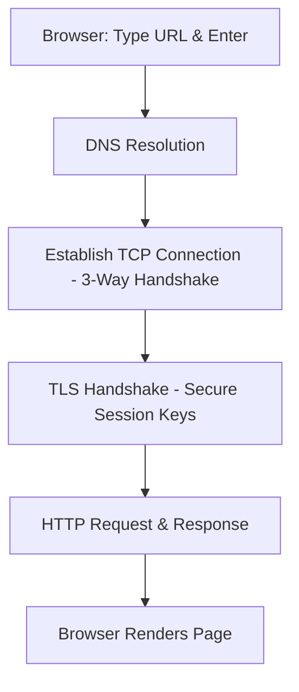

# 🏆 Module 08 — Comprehensive Networking Interview Q&A Cheatsheet

---

## 8.1 The Ultimate Classic: "What happens when you type `https://www.google.com` in a browser and press Enter?"

This is the most common networking interview question designed to test your end-to-end understanding of the network stack.

### Step-by-Step Breakdown



1. **URL Parsing & Protocol Check**:
   - The browser parses the URL `https://www.google.com` to identify the protocol (`HTTPS`), the host (`www.google.com`), and the port (`443`).
2. **DNS Resolution (Domain to IP)**:
   - **Local Cache Check**: The browser checks its own DNS cache, then the OS DNS cache, then the hosts file (`/etc/hosts`).
   - **Recursive Query**: If not cached, a DNS request is sent to the local DNS resolver (usually configured via DHCP, e.g., your ISP's resolver or `8.8.8.8`).
   - **Iterative Lookup**: The resolver queries the Root servers (`.`), TLD servers (`.com`), and finally the Authoritative servers for `google.com` to fetch the IPv4 (`A` record) or IPv6 (`AAAA` record) address.
3. **ARP Resolution (IP to MAC)**:
   - To send packets on the local network, the host checks its ARP cache to map the gateway IP (router) to its hardware MAC address. If not present, an ARP Request is broadcast.
4. **TCP 3-Way Handshake**:
   - The client initiates a TCP connection to Google's IP at port 443 by sending a **SYN** packet.
   - Google responds with a **SYN-ACK**.
   - The client sends an **ACK**. The connection is now established.
5. **TLS/SSL Handshake**:
   - Since the protocol is HTTPS, client and server negotiate encryption parameters.
   - Client sends supported TLS version/ciphers. Server replies with the chosen cipher and its SSL certificate.
   - Client verifies the certificate against built-in Root CAs, generates a symmetric session key, encrypts it with the server's public key, and sends it back.
   - Decryption takes place on the server; all subsequent communication is symmetrically encrypted using this key.
6. **HTTP Request & Response**:
   - The browser sends an encrypted HTTP `GET` request: `GET / HTTP/1.1\r\nHost: www.google.com...`
   - Load balancers and web servers at Google process the request and respond with an HTTP `200 OK` along with the HTML, CSS, and JS files.
7. **Page Rendering**:
   - The browser parses the HTML to construct the DOM tree, downloads CSS/JS assets asynchronously, renders the web page, and displays it to the user.

---

## 8.2 Scenario-Based & Troubleshooting Questions

### Q: A user complains that they can access internal servers (like database, fileshare) but cannot load google.com. How do you troubleshoot?
> **Answer**:
> 1. **Check local IP configuration**: Confirm the client has a valid IP, subnet mask, and default gateway (`ifconfig`/`ip addr`). Since internal servers work, the IP configuration is likely fine.
> 2. **Test Default Gateway**: Ping the gateway router. If it responds, the local segment is healthy.
> 3. **Test DNS Resolution**: Run `nslookup google.com` or `dig google.com`. If it fails or times out, the DNS server is down or unreachable. Try pinging a public IP directly (`ping 8.8.8.8`).
> 4. **Check WAN/Gateway**: If ping to `8.8.8.8` works but DNS fails, configure the system to use a public DNS resolver. If pinging `8.8.8.8` fails, the issue is at the gateway/WAN edge (NAT failure, ISP outage, or routing issue).

### Q: What is an MTU mismatch, and how does it affect a network?
> **Answer**:
> **MTU (Maximum Transmission Unit)** is the maximum size of a packet a physical interface can transmit (default Ethernet MTU is 1500 bytes).
> - **The Problem**: If a router receives a packet larger than the egress interface's MTU, and the `DF` (Don't Fragment) bit is set to `1` in the IP header, the router drops the packet and sends an ICMP Type 3 Code 4 message ("Destination Unreachable, Fragmentation Needed").
> - **The Symptom**: "Black hole router" behavior. Small packets (like Ping) go through perfectly, but larger payloads (like TLS handshakes or file transfers) hang or timeout indefinitely.
> - **The Fix**: Enable **Path MTU Discovery (PMTUD)**, adjust **MSS (Maximum Segment Size)** clamping on routers, or decrease the client's MTU.

### Q: Why do UDP packets sometimes arrive faster than TCP packets on the same link?
> **Answer**:
> UDP is a connectionless protocol with a minimal 8-byte header and **zero flow/congestion control mechanisms**. It pushes data onto the wire as fast as the application generates it. TCP, on the other hand, must establish a connection first, carries a larger header (20-60 bytes), must wait for acknowledgments (ACKs), and adjusts its transmission rate dynamically based on network congestion algorithms (like Slow Start).

---

## 8.3 Advanced Protocol Deep-Dives

### Q: Explain the difference between HTTP/1.1, HTTP/2, and HTTP/3.

| Feature | HTTP/1.1 | HTTP/2 | HTTP/3 |
|---|---|---|---|
| **Transport Protocol** | TCP | TCP | **QUIC (UDP)** |
| **Connection Reuse** | Persistent connections (sequential) | Multiplexing (parallel streams over 1 TCP connection) | Multiplexing (parallel streams over 1 QUIC connection) |
| **HOL Blocking** | Head-of-Line blocking at application level | Solved app HOL, but **TCP level HOL** still exists if packet is lost | **Fully Solved** (QUIC streams are independent; packet loss affects 1 stream only) |
| **Encryption** | Optional (HTTPS) | Optional (but browsers require HTTPS/TLS) | **Built-in (TLS 1.3 is mandatory)** |
| **Header Compression** | None | HPACK | QPACK |

---

### Q: How does QUIC (Quick UDP Internet Connections) improve latency?
> **Answer**:
> 1. **1-RTT or 0-RTT Connection Establishment**: In standard HTTPS (TCP + TLS), setting up a connection requires a TCP 3-way handshake followed by a TLS handshake (2-3 round trips). QUIC combines transport and cryptographic handshakes into a single exchange, allowing data to flow in 1-RTT (or even 0-RTT for resumed connections).
> 2. **Elimination of Head-of-Line (HOL) Blocking**: Under TCP, if one packet is lost, all subsequent packets must wait in the buffer until the lost packet is retransmitted. In QUIC, packets belong to independent streams; if packet loss occurs on Stream A, Stream B continues to process without delay.
> 3. **Connection Migration**: QUIC uses a unique **Connection ID** instead of the 4-tuple (IP/Port). If a user switches from Wi-Fi to cellular data, their IP changes, but the Connection ID stays the same, allowing active downloads/streams to continue seamlessly without reconnecting.

---

## 8.4 Network Design & Architecture

### Q: What is the difference between Symmetric Routing and Asymmetric Routing?
- **Symmetric Routing**: Packets take the exact same physical/logical path going from Host A to Host B as they do returning from Host B to Host A.
- **Asymmetric Routing**: Packets take one path to the destination but take a **different path** on the return trip.
- **Security Impact**: Asymmetric routing can break **Stateful Firewalls**. The firewall along the return path might drop the return packets because it never saw the initial SYN packet that established the connection.

```
                  ┌───► Router X (Forward Path) ───┐
Host A ───────────┤                                ├───────────► Host B
                  └───◄ Router Y (Return Path) ◄───┘
```

---

## 8.5 Trick Interview Questions

### Q: If a device has an IP address of `169.254.34.89`, what does this tell you?
> **Answer**:
> This is an **APIPA (Automatic Private IP Addressing)** address (subnet `169.254.0.0/16`). It indicates that the device is configured to get an IP dynamically but **failed to contact a DHCP server**. The OS self-assigns this address so it can still communicate with other devices on the same local segment, but it will not have internet access or a default gateway.

### Q: Can two web servers run on the same public IP and same port (e.g., Port 80)?
> **Answer**:
> Yes, this is commonly done using a **Reverse Proxy** (like Nginx, HAProxy) or an **Application Load Balancer (ALB)**. The proxy listens on Port 80, receives all HTTP requests, inspects the HTTP `Host` header (e.g., `app1.example.com` vs `app2.example.com`), and routes the traffic to the appropriate internal backend server.

---

*Previous: [Module 07 — Network Security & Diagnostics](Module-07-Security-Diagnostics.md) | Next: [NotesModule](NotesModule.md)*
