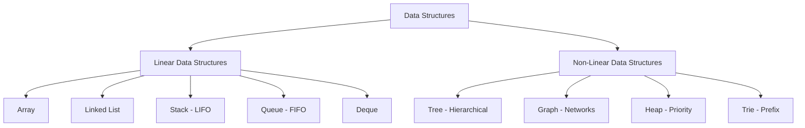

# 🧱 DSA — Data Types and Classification

> A complete guide on data types, primitive vs. non-primitive representations, JVM memory models, and the structural classification of linear vs. non-linear data structures.

---

## 📑 Table of Contents

- [1. What is a Data Type?](#1-what-is-a-data-type)
- [2. Primitive Data Types](#2-primitive-data-types)
- [3. Non-Primitive Data Types](#3-non-primitive-data-types)
- [4. Primitive vs. Non-Primitive Comparison](#4-primitive-vs-non-primitive-comparison)
  - [Crucial Kotlin & Java JVM Nuance](#crucial-kotlin--java-jvm-nuance)
- [5. Data Structures Classification](#5-data-structures-classification)
- [6. Linear Data Structures](#6-linear-data-structures)
  - [7. Array](#7-array)
  - [8. Linked List](#8-linked-list)
  - [9. Stack (LIFO)](#9-stack-lifo)
  - [10. Queue (FIFO)](#10-queue-fifo)
- [11. Non-Linear Data Structures](#11-non-linear-data-structures)
  - [12. Tree (Hierarchical)](#12-tree-hierarchical)
  - [13. Graph (Network Relationships)](#13-graph-network-relationships)
  - [14. Heap (Priority Ordering)](#14-heap-priority-ordering)
- [15. Complete Classification Mental Model](#15-complete-classification-mental-model)
- [16. Crucial Distinction: Data Types vs. Data Structures](#16-crucial-distinction-data-types-vs-data-structures)
- [17. Interview Questions & Answers (Q1–Q16)](#17-interview-questions--answers)
- [18. Senior-Level Interview Question (Q17)](#18-senior-level-interview-question)
- [19. Essential Interview Correction](#19-essential-interview-correction)

---

# 1. What is a Data Type?

### Definition

> **A data type defines the classification of a value, the memory footprint and binary representation allocated for it, and the set of valid operations that can be performed on it.**

For example:

```kotlin
val age: Int = 25          // 32-bit signed integer
val name: String = "Raj"   // Reference to character sequence
val isActive: Boolean = true // Boolean true/false
```

At the highest level, data types are divided into:

```text
                         Data Types
                             │
              ┌──────────────┴──────────────┐
          Primitive                    Non-Primitive
              │                             │
       Basic single values        Collections / Objects
```

---

# 2. Primitive Data Types

### Definition

> **Primitive data types are fundamental, scalar building blocks provided directly by the programming language or runtime, storing a single raw value directly in memory.**

Standard categories:
* **Integer types:** `Byte` (8-bit), `Short` (16-bit), `Int` (32-bit), `Long` (64-bit)
* **Floating-point types:** `Float` (32-bit), `Double` (64-bit)
* **Character type:** `Char` (16-bit Unicode)
* **Boolean type:** `Boolean` (`true` / `false`)

```kotlin
val age: Int = 25
val salary: Double = 50000.0
val grade: Char = 'A'
val active: Boolean = true
```

In low-level execution, primitive values reside directly on the **execution stack** (within thread activation frames) rather than requiring heap allocation and pointer dereferencing.

---

# 3. Non-Primitive Data Types

### Definition

> **Non-primitive (reference / composite) data types are higher-level structures composed of primitive types and other objects, capable of storing collections of values or complex state.**

Standard examples:
* `String`
* `Array`
* Classes and Objects
* `List`, `Set`, `Map`
* Linked Lists, Trees, Heaps, Graphs

```kotlin
val numbers = arrayOf(10, 20, 30, 40)

data class User(
    val id: Int,
    val name: String,
    val age: Int
)
```

Non-primitive entities are allocated on the **heap**, and variables store a **memory reference (pointer)** to that heap location.

---

# 4. Primitive vs. Non-Primitive Comparison

| Dimension | Primitive Data Types | Non-Primitive (Reference) Data Types |
|---|---|---|
| **Value Representation** | Holds a single scalar value | Can hold multiple values or complex state |
| **Memory Allocation** | Typically on the **Stack** | Stored on the **Heap**; variable holds a reference |
| **Default Value** | Has defined defaults (e.g., `0`, `false`) | Defaults to `null` if uninitialized |
| **Memory Overhead** | Minimal (exact bits: 8, 16, 32, 64) | Object header (8–16 bytes) + padding + pointer |
| **Nullability** | In Java, cannot be `null` | Can reference `null` |
| **Examples** | `int`, `double`, `char`, `boolean` | `String`, `Array`, `HashMap`, custom classes |

### Crucial Kotlin & Java JVM Nuance

> **Interview Caution:** In Java, primitives (`int`, `boolean`) and reference wrappers (`Integer`, `Boolean`) have distinct syntax. In Kotlin, everything is presented as an object (`Int`, `Boolean`, `Double`).
>
> However, the **Kotlin compiler automatically optimizes non-nullable types to JVM primitives (`int`)** wherever possible to eliminate heap boxing overhead. When a type is nullable (`Int?`) or used as a generic parameter (`List<Int>`), the compiler automatically boxes it into `java.lang.Integer`.

---

# 5. Data Structures Classification

While **data types** describe what kind of value a variable stores, **data structures** describe how multiple data elements are organized and related in memory.



---

# 6. Linear Data Structures

### Definition

> **A linear data structure arranges elements in a single sequential order, where every element (except the first and last) has a unique predecessor and successor.**

---

## 7. Array

An array stores elements of identical type in a **contiguous memory block** accessed via zero-based indices.

```text
Index:     0      1      2      3
Value:   [ 10 ] [ 20 ] [ 30 ] [ 40 ]
```

* **Indexed Access:** $O(1)$ directly computed via $\text{BaseAddress} + (\text{index} \times \text{size})$.
* **Search (Unsorted):** $O(n)$.
* **Insertion / Deletion:** $O(n)$ due to shifting elements.

---

## 8. Linked List

A linked list consists of independent node objects connected through memory pointers/references.

```text
[ Data: 10 | Next: ──> ] [ Data: 20 | Next: ──> ] [ Data: 30 | Next: null ]
```

```kotlin
class Node(
    val data: Int,
    var next: Node? = null
)
```

* **Insertion / Deletion at known node:** $O(1)$.
* **Search / Access:** $O(n)$ (must traverse pointers sequentially).
* **Trade-off:** Chasing pointers causes CPU cache misses compared to contiguous arrays.

---

## 9. Stack (LIFO)

A stack is a linear container enforcing the **LIFO (Last In, First Out)** protocol:

```text
Push 10 ──> Push 20 ──> Push 30

[ 30 ]  <── Top (Pop removes 30)
[ 20 ]
[ 10 ]
```

* **Operations:** `push()`, `pop()`, `peek()` — all $O(1)$.
* **Applications:**
  - JVM Call Stack & recursion activation records.
  - Undo/Redo mechanisms in text editors.
  - Parsing expressions & matching parentheses.
  - Backtracking (DFS).

---

## 10. Queue (FIFO)

A queue is a linear container enforcing the **FIFO (First In, First Out)** protocol:

```text
Enqueue ──> [ 30 ] [ 20 ] [ 10 ] ──> Dequeue (Removes 10)
            Rear           Front
```

* **Operations:** `enqueue()`, `dequeue()`, `peek()` — all $O(1)$.
* **Applications:**
  - Asynchronous task scheduling (Android Main Looper, thread pools).
  - Breadth-First Search (BFS) level-order traversal.
  - Buffering & rate-limiting pipelines (Kafka, RabbitMQ).

---

# 11. Non-Linear Data Structures

### Definition

> **A non-linear data structure organizes elements with branching, hierarchical, or interconnected relationships, where an element can connect to multiple other elements.**

---

## 12. Tree (Hierarchical)

A tree is an acyclic, hierarchical collection of nodes with a single root:

```text
               Root [ A ]
               /        \
          Node [ B ]   Node [ C ]
          /        \            \
     Leaf [ D ]  Leaf [ E ]   Leaf [ F ]
```

* **Components:** Root, Parent, Child, Siblings, Leaf nodes, Height, Depth.
* **Applications:**
  - File system folder structures.
  - Document Object Model (DOM) & Android View hierarchies.
  - Database indexing (B-Trees, B+ Trees).
  - Self-balancing search trees (AVL, Red-Black Trees for $O(\log n)$ operations).

---

## 13. Graph (Network Relationships)

A graph consists of a set of **Vertices (Nodes)** connected by **Edges**:

```text
     ( A ) ──────── ( B )
       │              │
       │              │
     ( C ) ──────── ( D )
```

* **Classifications:** Directed vs. Undirected, Weighted vs. Unweighted, Cyclic vs. Acyclic (DAG).
* **Applications:**
  - Social network relationship mapping (LinkedIn connections, Facebook friends).
  - GPS navigation & shortest path routing (Dijkstra, A*).
  - Compiler dependency graphs & build task graphs (Gradle).

---

## 14. Heap (Priority Ordering)

A Heap is a complete binary tree satisfying the **heap invariant**:

```text
       Min-Heap (Root is Minimum)              Max-Heap (Root is Maximum)
                 [ 10 ]                                  [ 50 ]
                /      \                                /      \
            [ 20 ]    [ 30 ]                        [ 40 ]    [ 30 ]
            /    \                                  /    \
        [ 40 ]  [ 50 ]                          [ 20 ]  [ 10 ]
```

* **Root Access:** $O(1)$ for minimum or maximum element.
* **Insert (`offer`) / Remove (`poll`):** $O(\log n)$.
* **Implementation:** Backed by a contiguous array without object pointers.
* **Primary Use Case:** **Priority Queue** implementation and Dijkstra's algorithm.

---

# 15. Complete Classification Mental Model

```text
                               DATA
                                │
                         Data Types
                                │
              ┌─────────────────┴─────────────────┐
          Primitive                          Non-Primitive
              │                                   │
      Int, Boolean, Char,                  String, Array, Objects,
      Float, Double, Long                  Collections
                                                  │
                                          Data Structures
                                                  │
                                  ┌───────────────┴───────────────┐
                               Linear                         Non-Linear
                                  │                               │
                       ┌──────────┴──────────┐         ┌──────────┴──────────┐
                     Array                 Queue      Tree                 Graph
                     LinkedList            Deque      Heap                 Trie
                     Stack
```

---

# 16. Crucial Distinction: Data Types vs. Data Structures

| Dimension | Data Type | Data Structure |
|---|---|---|
| **Core Question** | *"What kind of value is this?"* | *"How are multiple values organized & related?"* |
| **Scope** | Single variable or raw value representation | Spatial arrangement and traversal topology |
| **Classification** | **Primitive vs. Non-Primitive** | **Linear vs. Non-Linear** |
| **Examples** | `Int`, `Double`, `String`, `Boolean` | `Array`, `LinkedList`, `Tree`, `Graph`, `Heap` |

---

# 17. Interview Questions & Answers

### Q1. What is a Data Type? `[Junior]`
**Answer:**
A data type is an attribute of data that tells the compiler or interpreter how the programmer intends to use the data. It defines the format, memory size, internal representation, and allowable operations on that data.

---

### Q2. What are Primitive Data Types? `[Junior]`
**Answer:**
Primitive data types are basic types provided directly by the programming language to hold single, fundamental values (e.g., integers, booleans, floating-point numbers, characters). They do not have methods or internal structural components.

---

### Q3. What are Non-Primitive Data Types? `[Junior]`
**Answer:**
Non-primitive (reference or composite) data types are user-defined or language-provided complex types that can hold collections of values, objects, or multiple fields. Examples include arrays, classes, strings, and collections.

---

### Q4. What is the fundamental difference between Primitive and Non-Primitive types? `[Junior]`
**Answer:**
Primitive types hold raw scalar values directly (typically on the thread stack), whereas non-primitive types hold memory references (pointers) to heap-allocated objects and can store multiple attributes.

---

### Q5. What is a Linear Data Structure? `[Junior]`
**Answer:**
A data structure where elements are arranged sequentially in a single line or list. Each element has a unique predecessor and successor (except endpoints). Examples: Array, Linked List, Stack, Queue.

---

### Q6. What is a Non-Linear Data Structure? `[Junior]`
**Answer:**
A data structure where elements are arranged hierarchically or as an interconnected network, meaning an element can connect to multiple elements. Examples: Tree, Graph, Heap, Trie.

---

### Q7. Compare Linear vs. Non-Linear structures. `[Mid]`
**Answer:**
* **Traversal:** Linear structures can be traversed in a single pass ($O(n)$ sequential scan). Non-linear structures require multi-directional or recursive traversals (pre-order, in-order, post-order, BFS, DFS).
* **Relationship:** 1-to-1 in linear; 1-to-many (hierarchical tree) or many-to-many (graph network) in non-linear.
* **Memory Topology:** Often contiguous or linear chains vs. branched pointer graphs.

---

### Q8. Is an Array a primitive data type? `[Mid]`
**Answer:**
**No.** An array is a non-primitive composite data structure because it represents an ordered collection of values and has an object identity on the heap. In Kotlin, `IntArray` or `Array<Int>` are objects on the JVM, though `IntArray` stores unboxed primitive `int[]` values internally.

---

### Q9. Is `String` a primitive type in Java or Kotlin? `[Mid]`
**Answer:**
`String` is **non-primitive**. In Java, `java.lang.String` is an immutable class whose instance is allocated on the heap (or the String Pool). In Kotlin, `String` is similarly an object reference. It represents an array/sequence of characters with methods and properties.

---

### Q10. Why is a Linked List linear even though nodes are scattered across the heap? `[Senior]`
**Answer:**
Because linearity is a **logical ordering concept**, not a physical hardware constraint. Each node in a linked list has exactly one logical next element (and one previous element in a doubly linked list), forming a strictly sequential 1-to-1 relationship.

---

### Q11. Is a Stack linear or non-linear? `[Junior]`
**Answer:**
A Stack is linear because elements are ordered sequentially according to arrival time, even though access is restricted to the top element via LIFO.

---

### Q12. Is a Queue linear or non-linear? `[Junior]`
**Answer:**
A Queue is linear because elements follow a sequential order from front to rear based on FIFO processing.

---

### Q13. Is a Tree linear or non-linear? `[Junior]`
**Answer:**
A Tree is non-linear because a parent node branches out to multiple child nodes, forming a 1-to-many hierarchical relationship that cannot be represented as a single linear sequence.

---

### Q14. Is a Graph linear or non-linear? `[Junior]`
**Answer:**
A Graph is non-linear because vertices connect to multiple arbitrary vertices via edges, forming a many-to-many network topology.

---

### Q15. What is an Abstract Data Type (ADT) vs. a Data Structure? `[Senior]`
**Answer:**
* **ADT (Abstract Data Type):** The mathematical specification of what operations can be performed and their behavior, with zero implementation details (e.g., `Stack`, `Queue`, `Map`, `Set`).
* **Data Structure:** The concrete physical implementation of that ADT in code and memory (e.g., implementing the `Stack` ADT using an `Array` or a `DoublyLinkedList`).

---

### Q16. Can one data structure be implemented using another? Give concrete examples. `[Senior]`
**Answer:**
Yes, high-level structures are almost universally constructed from lower-level structures:
1. **Stack ADT** implemented using a dynamic array (`ArrayDeque`) or singly linked list.
2. **Queue ADT** implemented using circular arrays or two Stacks.
3. **Priority Queue ADT** implemented using a Binary Heap array.
4. **HashMap** implemented using an array of Linked Lists and Red-Black Trees.

---

# 18. Senior-Level Interview Question

### Q17. Why is the classification of data structures critical in software architecture? `[Senior]`
**Answer:**
The structural classification dictates the **natural access patterns and operational bounds** of the data:
* When data represents an ordered stream, event journal, or sequential pipeline, a **linear structure** (Array, Deque) guarantees $O(1)$ appends and sequential cache locality.
* When data represents containment or taxonomy (DOM, organizational chart, file folders), a **Tree** provides natural recursion and $O(\log n)$ search.
* When data represents arbitrary networks with cycles (social graphs, road routing, dependency managers), only a **Graph** can model many-to-many relationships without loss of topology.

Selecting the wrong classification forces artificial workarounds—such as flattening trees into arrays, requiring expensive $O(n)$ reconstruction.

---

# 19. Essential Interview Correction

> [!TIP]
> If an interviewer asks: *"What are the types of data structures?"*
>
> **Do not simply reply:** *"Primitive and Non-Primitive."*
>
> **The Senior Answer:**
> *"Data structures are classified into **Linear** (Arrays, Linked Lists, Stacks, Queues) and **Non-Linear** (Trees, Graphs, Heaps, Tries) based on how elements relate to one another.*
>
> *Separately, programming languages classify individual **data types** into primitive (scalar values like integers and booleans) and non-primitive (objects, arrays, collections). Confusing these two classifications is a common mistake."*
