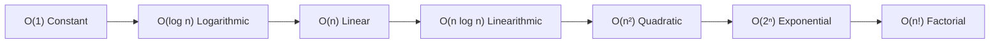

# 🧠 Data Structures & Algorithms (DSA) — Java Technical Interview Guide (10+ Years Experience)

> A comprehensive, senior-level guide covering DSA fundamentals, computational complexity, memory trade-offs, architecture decisions, and real-world interview Q&A.
> Tailored for experienced software engineers and architects interviewing at companies like Google, Microsoft, Meta, Amazon, and Apple.

---

## 📑 Table of Contents

- [PART 1 — ARCHITECTURAL FOUNDATIONS & DEFINITIONS](#part-1--architectural-foundations--definitions)
  - [1. What is DSA?](#1-what-is-dsa)
  - [2. Why do we need DSA?](#2-why-do-we-need-dsa)
  - [3. Why is DSA Important for Experienced Developers?](#3-why-is-dsa-important-for-experienced-developers)
  - [4. Real-World Engineering Example](#4-real-world-engineering-example)
  - [5. What Exactly Does DSA Cover?](#5-what-exactly-does-dsa-cover)
  - [6. What is an Algorithm?](#6-what-is-an-algorithm)
  - [7. What is a Data Structure?](#7-what-is-a-data-structure)
  - [8. Relationship Between Data Structures and Algorithms](#8-relationship-between-data-structures-and-algorithms)
  - [9. Why Top Tech Companies Evaluate DSA](#9-why-top-tech-companies-evaluate-dsa)
  - [10. What a 10+ Year Experienced Candidate Must Emphasize](#10-what-a-10-year-experienced-candidate-must-emphasize)
  - [11. DSA vs. System Design](#11-dsa-vs-system-design)
  - [12. The Core Concept: Asymptotic Complexity](#12-the-core-concept-asymptotic-complexity)
  - [13. The 60-Second Senior Interview Pitch](#13-the-60-second-senior-interview-pitch)
- [PART 2 — SENIOR-LEVEL INTERVIEW QUESTIONS & ANSWERS](#part-2--senior-level-interview-questions--answers)
  - [Complexity & Big-O (Q1–Q4)](#complexity--big-o)
  - [Arrays & Linked Lists (Q5–Q6)](#arrays--linked-lists)
  - [Stacks & Queues (Q7–Q9)](#stacks--queues)
  - [Hashing & Internal Mechanics (Q10–Q13)](#hashing--internal-mechanics)
  - [Trees & Balanced BSTs (Q14–Q17)](#trees--balanced-bsts)
  - [Heaps & Priority Queues (Q18–Q19)](#heaps--priority-queues)
  - [Graphs & Traversals (Q20–Q21)](#graphs--traversals)
  - [Algorithm Paradigms (Q22–Q25)](#algorithm-paradigms)
  - [Senior Architectural Trade-offs & Interview Strategy (Q26–Q32)](#senior-architectural-trade-offs--interview-strategy)

---

# PART 1 — ARCHITECTURAL FOUNDATIONS & DEFINITIONS

If you are preparing for **10+ years experienced interviews at top tech companies**, don't define DSA as simply *"Data Structures and Algorithms."* You should explain **what it is, why it matters, and how it affects software design and performance**.

---

## 1. What is DSA?

### Proper Definition

> **Data Structures and Algorithms (DSA) is the study of how data is organized, stored, accessed, and manipulated using appropriate data structures, and how algorithms are designed to solve computational problems efficiently.**

It has two major pillars:
* **Data Structures** → How data is organized and stored in memory.
* **Algorithms** → Step-by-step procedures used to process that data to solve a problem.

### Interview-Ready Senior Definition

> *"DSA is the foundation of efficient problem solving in computer science. Data structures determine how data is represented and accessed, while algorithms define the deterministic steps used to process that data. The goal is to choose an appropriate combination of data structure and algorithm to achieve the required correctness, minimal time complexity, and optimal space efficiency under real-world engineering constraints."*

---

## 2. Why do we need DSA?

The primary reason is **computational efficiency and scalability**.

Suppose you have **10,000,000 users** and need to find a particular user:

```text
User 1
User 2
User 3
...
User 10,000,000
```

* In an unorganized list (**Linear Search**), you inspect elements one by one: **Worst case = 10,000,000 operations (`O(n)`)**.
* If the data is organized in a balanced search tree: **`O(log n)` ≈ 24 operations**.
* If the data is organized in a hash table: **`O(1)` average lookup time ≈ 1 operation**.

DSA directly answers the engineering question:

> **"How can I solve this problem correctly while using the least reasonable amount of CPU cycles and memory bandwidth?"**

---

## 3. Why is DSA Important for Experienced Developers?

For a senior engineer or architect, DSA is not about competitive coding or LeetCode tricks. It directly drives production engineering decisions:

### 1. Performance Under Load
Choosing an algorithm that scales predictably:
* `O(1)` → Constant
* `O(log n)` → Logarithmic
* `O(n)` → Linear
* `O(n log n)` → Linearithmic (optimal comparison sorting)
* `O(n²)` → Quadratic (unusable for large data)

An algorithm that runs in 2 milliseconds for 100 records can freeze a production service when handling 100 million records.

### 2. Scalability Architecture
DSA allows reasoning about behavior as input explodes:
```text
1,000 records ──> 1,000,000 records ──> 100,000,000 records ──> 1,000,000,000 records
```
A senior engineer asks: *"Does my solution scale linearly, logarithmically, or does it hit an exponential wall?"*

### 3. Memory & Cache Efficiency
The fastest algorithm often consumes more memory:
* **Approach A (In-Place)**: Time `O(n log n)`, Space `O(1)` auxiliary.
* **Approach B (Hash Cache)**: Time `O(n)`, Space `O(n)` auxiliary.

Senior developers evaluate memory overhead, Garbage Collection (GC) pressure, and CPU cache locality (L1/L2/L3 cache misses).

### 4. Selecting the Right Data Structure

| Engineering Requirement | Recommended Data Structure | Java Standard Type | Time Complexity |
|---|---|---|---|
| Fast key-value lookup | Hash Table | `HashMap<K, V>` | `O(1)` avg |
| Insertion-order traversal | Hash Table + Linked List | `LinkedHashMap<K, V>` | `O(1)` avg |
| Sorted order traversal | Self-Balancing Red-Black Tree | `TreeMap<K, V>` | `O(log n)` |
| Unique membership check | Hash Set | `HashSet<E>` | `O(1)` avg |
| LIFO (Last-In-First-Out) | Deque / Array Stack | `ArrayDeque<E>` | `O(1)` push/pop |
| FIFO (First-In-First-Out) | Queue / Linked Deque | `ArrayDeque<E>`, `LinkedList<E>` | `O(1)` enqueue/dequeue |
| Priority-based scheduling | Binary Heap | `PriorityQueue<E>` | `O(log n)` push/poll |
| Hierarchical data / Prefix | Trie / N-ary Tree | Custom Node / Prefix Tree | `O(L)` where L = key length |
| Disjoint sets / Connectivity | Union-Find with Path Compression | Custom Disjoint Set | `O(α(n))` almost constant |
| Network relationships | Graph (Adjacency List) | `Map<Node, List<Edge>>` | `O(V + E)` traversal |

---

## 4. Real-World Engineering Example

Suppose you are building an application with **1,000,000 user IDs** and need to check whether an incoming ID has already been processed.

### Approach 1 — ArrayList / List (`O(n)`)
```java
List<String> users = new ArrayList<>();

if (users.contains(userId)) { // Scans sequentially: O(n)
    // User exists
}
```
* With 1M elements, every lookup performs up to 1,000,000 string comparisons. Under high throughput, CPU usage spikes to 100%.

### Approach 2 — HashSet (`O(1)` average)
```java
Set<String> users = new HashSet<>();

if (users.contains(userId)) { // Hash code lookup: O(1) average
    // User exists
}
```
* Lookup completes in roughly 1 to 2 memory jumps regardless of whether there are 1,000 or 1,000,000 users.

> **Senior Insight:** *"This is a membership-check problem. Choosing a hash-based set over a linear list reduces time complexity from O(n) to O(1), protecting system SLA and throughput."*

---

## 5. What Exactly Does DSA Cover?

```text
                                DSA
                                 │
              ┌──────────────────┴──────────────────┐
        Data Structures                         Algorithms
              │                                     │
       ┌──────┴──────┐                       ┌──────┴──────┐
    Linear       Non-Linear               Searching      Sorting
       │             │                       │             │
    Array         Tree (BST, AVL, Trie)   Binary Search  Merge Sort
    LinkedList    Graph                   BFS / DFS      Quick Sort
    Stack         Heap (PriorityQueue)    Two Pointers   TimSort
    Queue         Disjoint Set (UnionFind)Sliding Window
    HashMap                               Dynamic Programming
                                          Greedy / Backtracking
```

---

## 6. What is an Algorithm?

### Proper Definition

> **An algorithm is a finite, well-defined, and deterministic sequence of unambiguous instructions that transforms valid input into the desired output, solving a computational problem.**

Every robust algorithm satisfies 5 criteria:
1. **Input:** Well-defined inputs (0 or more).
2. **Output:** At least one well-defined result.
3. **Definiteness:** Every step is clear and unambiguous.
4. **Finiteness:** Terminates after a countable number of steps.
5. **Effectiveness:** Every operation is basic enough to be executed in finite time.

---

## 7. What is a Data Structure?

### Proper Definition

> **A data structure is a specialized format for organizing, storing, and managing data in memory to enable efficient access, querying, and modifications according to specific algorithmic requirements.**

---

## 8. Relationship Between Data Structures and Algorithms

> **"Data structures and algorithms are inextricably linked: the structure dictates what algorithms are feasible, while the required algorithm dictates the optimal data structure. An algorithm cannot perform better than the access limits of its underlying data structure."**

* In an **array**, finding the minimum takes `O(n)` because elements are unsorted.
* In a **Min-Heap**, finding the minimum takes `O(1)` because the data structure continuously maintains the heap property at the root.

---

## 9. Why Top Tech Companies Evaluate DSA

High-scale tech companies evaluate candidates on DSA because:
* Scale exposes asymptotic inefficiencies that pass unnoticed in smaller systems.
* DSA tests **core problem-solving ability under ambiguity**.
* Engineers must reason about latency, memory footprints, lock contention, and hardware cache performance.

---

## 10. What a 10+ Year Experienced Candidate Must Emphasize

Avoid shallow definitions like *"DSA is arrays and linked lists."*

A senior engineer emphasizes:
> *"I view DSA as a framework for making architectural and engineering trade-offs. It is not just about implementing textbook algorithms, but understanding memory locality, constant factors, GC overhead, concurrency safety, and selecting the right data representation to meet production SLAs."*

---

## 11. DSA vs. System Design

| Dimension | Data Structures & Algorithms (DSA) | System Design |
|---|---|---|
| **Scope** | In-process, in-memory, component level | Distributed systems, network level |
| **Focus** | CPU cycles, memory usage, algorithm steps | Scalability, availability, fault tolerance |
| **Primitives** | Array, Map, Tree, Heap, Graph | Load Balancers, CDN, Caches, Sharded DBs, Queues |
| **Optimization** | Big-O time and space complexity | Latency (p99), throughput (QPS), durability |
| **Connection** | A cache uses a **HashMap + DoublyLinkedList** (LRU) | Distributed cache like Redis applies the same LRU algorithm across servers |

---

## 12. The Core Concept: Asymptotic Complexity

```text
O(1) < O(log n) < O(n) < O(n log n) < O(n²) < O(2ⁿ) < O(n!)
```



* **Time Complexity:** How running time grows as input size `n` approaches infinity.
* **Space Complexity:** How auxiliary memory usage grows as input size `n` approaches infinity.

---

## 13. The 60-Second Senior Interview Pitch

> *"DSA defines how we structure data in memory and process it through deterministic algorithmic steps. In large-scale systems, choosing the right structure directly determines whether an operation completes in constant or exponential time.*
>
> *For an experienced engineer, DSA is about evaluating trade-offs: balancing theoretical Big-O with cache locality, garbage collector pressure, constant factors, and maintainability to deliver scalable, production-grade solutions."*

---

# PART 2 — SENIOR-LEVEL INTERVIEW QUESTIONS & ANSWERS

---

## Complexity & Big-O

### Q1. What is Time Complexity? `[Junior]`

**Answer:**
Time complexity quantifies how an algorithm's execution time or fundamental operation count scales as the input size ($n$) increases towards infinity. It is independent of machine hardware, CPU clock rate, or compiler optimizations.

**Follow-up:** *Why is Big-O an asymptotic upper bound?*
> Big-O ($O$) defines the mathematical worst-case ceiling. Formally, $f(n) = O(g(n))$ means there exist constants $c > 0$ and $n_0 \ge 0$ such that $f(n) \le c \cdot g(n)$ for all $n \ge n_0$. It guarantees that performance will not degrade worse than this rate.

---

### Q2. What is Space Complexity vs. Auxiliary Space? `[Mid]`

**Answer:**
* **Space Complexity:** The total memory used by the algorithm, including input space and any extra memory allocated.
* **Auxiliary Space:** The **extra or temporary memory** allocated by the algorithm outside the input data.

```java
// Space Complexity: O(n) for input, Auxiliary Space: O(1)
public int findMax(int[] numbers) {
    int max = numbers[0]; // O(1) auxiliary
    for (int num : numbers) {
        if (num > max) max = num;
    }
    return max;
}
```

**Follow-up:** *Does recursion consume auxiliary space?*
> Yes. Every recursive call pushes an activation frame onto the call stack containing parameters and local variables. A recursive tree with depth $d$ consumes $O(d)$ auxiliary stack memory.

---

### Q3. Explain Big-O vs. Big-Theta ($\Theta$) vs. Big-Omega ($\Omega$). `[Mid]`

**Answer:**
* **Big-O ($O$):** Asymptotic **upper bound** (worst-case ceiling).
* **Big-Omega ($\Omega$):** Asymptotic **lower bound** (best-case floor).
* **Big-Theta ($\Theta$):** Asymptotic **tight bound** (exact bound when upper and lower match).

For example, Merge Sort is $O(n \log n)$, $\Omega(n \log n)$, and $\Theta(n \log n)$ because it requires $n \log n$ operations in best, average, and worst cases.

---

### Q4. Compare $O(1)$, $O(\log n)$, $O(n)$, and $O(n \log n)$ with real numbers. `[Mid]`

**Answer:**

Suppose $n = 1,000,000$ operations:

| Complexity | Operations for $n = 1,000,000$ | Practical Example |
|---|---|---|
| **$O(1)$** | 1 operation | Array indexing, HashMap lookup |
| **$O(\log n)$** | ~20 operations | Binary Search ($\log_2(10^6) \approx 20$) |
| **$O(n)$** | 1,000,000 operations | Linear Search, single loop |
| **$O(n \log n)$** | ~20,000,000 operations | Merge Sort, QuickSort, TimSort |
| **$O(n^2)$** | 1,000,000,000,000 operations ($10^{12}$) | Nested loops, Bubble Sort |

---

## Arrays & Linked Lists

### Q5. What is an Array and why is indexed access $O(1)$? `[Junior]`

**Answer:**
An array is a collection of identical data types stored in **contiguous memory locations**.
Indexed access is $O(1)$ because the memory address of index $i$ is calculated directly in hardware:
$$\text{Address}(i) = \text{BaseAddress} + (i \times \text{ElementSize})$$

**Follow-up:** *What is CPU cache locality in arrays?*
> Because memory is contiguous, modern CPUs fetch an entire 64-byte cache line when accessing an element. Iterating over an array exhibits high spatial locality, keeping CPU caches full and eliminating memory stalls.

---

### Q6. Array vs. Linked List: Deep Comparison. `[Senior]`

**Answer:**

| Parameter | Array / `ArrayList` | Singly / Doubly Linked List |
|---|---|---|
| **Memory Allocation** | Contiguous block | Dispersed nodes connected via pointers |
| **Random Access** | `O(1)` | `O(n)` |
| **Insert at Beginning** | `O(n)` (must shift elements) | `O(1)` (relink pointers) |
| **Insert at End** | `O(1)` amortized | `O(1)` if tail pointer maintained |
| **Insert in Middle** | `O(n)` | `O(n)` search + `O(1)` insertion |
| **Memory Overhead** | Low (only array buffer) | High (8–24 bytes per node for pointers) |
| **Cache Locality** | **Excellent** | **Poor** (pointer hopping causes cache misses) |

**Follow-up:** *Why is `ArrayList` almost always faster in practice than `LinkedList` in Java, even for insertions?*
> Due to CPU cache misses and JVM pointer dereferencing. Traversing a linked list requires chasing pointers scattered across the heap, which invalidates CPU L1/L2 caches. Shifting contiguous bytes in an `ArrayList` uses `System.arraycopy`, an intrinsic block memory copy that is hardware accelerated.

---

## Stacks & Queues

### Q7. What is a Stack and what are its production applications? `[Junior]`

**Answer:**
A Stack is a linear data structure adhering to **LIFO (Last In, First Out)**.
Operations: `push()`, `pop()`, `peek()` — all `O(1)`.

**Production Applications:**
1. JVM Method Call Stack.
2. Undo / Redo operations in editors.
3. Syntax parsing and matching parentheses.
4. Backtracking (e.g., Depth-First Search).

---

### Q8. What is a Queue and what are its production applications? `[Junior]`

**Answer:**
A Queue is a linear data structure adhering to **FIFO (First In, First Out)**.
Operations: `enqueue()`, `dequeue()`, `peek()` — all `O(1)`.

**Production Applications:**
1. Asynchronous task execution and event dispatch loops (Android Looper, Node.js Event Loop).
2. Rate limiters and message brokers (Kafka, RabbitMQ).
3. Breadth-First Search (BFS) shortest path traversal.

---

### Q9. Why should you use `ArrayDeque` instead of `Stack` or `LinkedList` in Java? `[Senior]`

**Answer:**
* `java.util.Stack` extends `Vector`, meaning every method is `synchronized`. It incurs heavy lock overhead even in single-threaded code.
* `LinkedList` allocates a `Node` object for every pushed item, increasing memory overhead and triggering GC pressure.
* `ArrayDeque` uses a resizable circular array buffer. It is unsynchronized, avoids node allocation, and outperforms `Stack` and `LinkedList` as both a stack and a queue.

---

## Hashing & Internal Mechanics

### Q10. What is a HashMap and how does it work internally in Java? `[Senior]`

**Answer:**
A `HashMap` stores key-value pairs using a hash table.
1. **Hash Calculation:** The key's `hashCode()` is calculated, and a bit-shift spreader function minimizes collisions.
2. **Bucket Indexing:** The bucket index is calculated via bitwise AND: `index = (n - 1) & hash`, where `n` is the array capacity (power of 2).
3. **Collision Handling:**
   * Entries are stored in linked list nodes (`Node<K, V>`).
   * **Treeification (Java 8+):** When a bucket contains **8 or more nodes** and the total table capacity is $\ge 64$, the bucket is converted into a **Red-Black Tree** (`TreeNode<K, V>`). This upgrades worst-case search from $O(n)$ to $O(\log n)$.

```mermaid
graph TD
    Key[Key Input] --> Hash["hashCode() & Spreader"]
    Hash --> Index["index = (n - 1) & hash"]
    Index --> Bucket{Bucket Type}
    Bucket -->|size < 8| LL[Linked List Node: O(n)]
    Bucket -->|size >= 8 & cap >= 64| RBT[Red-Black Tree: O(log n)]
```

**Follow-up:** *What is Load Factor and Resizing?*
> Default load factor is `0.75`. When `size > capacity * loadFactor`, the internal array doubles in size ($2 \times n$). Every entry is rehashed or shifted using power-of-two bitmasks.

---

### Q11. What is a Hash Collision and how is it resolved? `[Mid]`

**Answer:**
A hash collision occurs when two distinct keys yield the same bucket index.
Resolution methods:
1. **Separate Chaining (Used in Java):** Buckets hold linked lists or self-balancing trees.
2. **Open Addressing:** Probing the table sequentially for the next available slot (Linear Probing, Quadratic Probing, Double Hashing).

---

### Q12. Why must `equals()` and `hashCode()` contract be respected? `[Senior]`

**Answer:**
The Java contract dictates:
1. If `a.equals(b) == true`, then `a.hashCode() == b.hashCode()` **must be true**.
2. If `a.hashCode() == b.hashCode()`, `a.equals(b)` is **not necessarily true** (collision).

**What breaks if violated:**
If two equal objects return different hash codes, they will land in different buckets in a `HashMap` or `HashSet`. When querying `map.get(key)`, the map inspects the wrong bucket and returns `null`, causing data corruption and phantom misses.

---

### Q13. Why should Map keys be immutable? `[Senior]`

**Answer:**
If a key's mutable field changes after being stored in a map, its `hashCode()` will change. When queried later, the map searches the bucket corresponding to the *new* hash code instead of the *old* bucket where the entry actually resides, making the entry permanently unretrievable (memory leak).

---

## Trees & Balanced BSTs

### Q14. What is a Binary Tree vs. a Binary Search Tree (BST)? `[Junior]`

**Answer:**
* **Binary Tree:** A hierarchical structure where each node has at most two children.
* **Binary Search Tree (BST):** A binary tree with the ordering invariant:
  * All nodes in the left subtree have values **strictly less** than the parent.
  * All nodes in the right subtree have values **strictly greater** than the parent.

---

### Q15. What is a Balanced Tree and why is balancing critical? `[Mid]`

**Answer:**
A BST can degrade into a linked list if items are inserted in sorted order, collapsing search from $O(\log n)$ to $O(n)$:

```text
Skewed Tree (Worst Case: O(n)):
1
 \
  2
   \
    3
     \
      4
```

A **balanced tree** (e.g., AVL, Red-Black) automatically performs tree rotations upon insertion/deletion to keep height bounded by $O(\log n)$, guaranteeing logarithmic operations.

---

### Q16. AVL Tree vs. Red-Black Tree: When to use which? `[Senior]`

**Answer:**
* **AVL Trees:** Strictly balanced (height difference between subtrees $\le 1$). Provides faster lookups ($O(\log n)$ with smaller constant factors) at the expense of more rotations during insertion/deletion.
* **Red-Black Trees:** Loosely balanced (black-height rule guarantees the longest path is at most twice the shortest). Requires at most 2 rotations per insertion, making it faster for write-heavy workloads.
* **Java's Choice:** `java.util.TreeMap` and `HashMap` use Red-Black trees due to their balanced write-and-read efficiency.

---

### Q17. What is a Trie and when does it outperform a HashMap? `[Senior]`

**Answer:**
A Trie (Prefix Tree) is a tree where each node represents a character of a key.
* **Lookup Time:** $O(L)$, where $L$ is the string length, independent of the number of items $n$ in the dictionary.
* **Advantage over HashMap:**
  1. Prefix searches (`startsWith("pre")`) in $O(L)$.
  2. Autocomplete, spelling correction, and longest common prefix in $O(L)$.
  3. No hash collisions or resizing overhead.

---

## Heaps & Priority Queues

### Q18. What is a Binary Heap and how is it represented in memory? `[Mid]`

**Answer:**
A Binary Heap is a complete binary tree satisfying the **heap property**:
* **Min-Heap:** Each parent node is $\le$ its children (Root = minimum).
* **Max-Heap:** Each parent node is $\ge$ its children (Root = maximum).

**Array Representation:**
Because it is a complete tree, it is stored in a contiguous array without pointers:
* Node at index $i$:
  * Left child: $2i + 1$
  * Right child: $2i + 2$
  * Parent: $\lfloor(i - 1) / 2\rfloor$

---

### Q19. What is a PriorityQueue and what are its operation complexities? `[Mid]`

**Answer:**
A `PriorityQueue` processes elements based on priority rather than insertion order, backed by a Min-Heap.
* `peek()`: $O(1)$
* `add()` / `offer()`: $O(\log n)$ (sift-up)
* `poll()`: $O(\log n)$ (sift-down)
* `remove(Object)`: $O(n)$ search + $O(\log n)$ sift

**Follow-up:** *How do you build a heap from an unsorted array of size $n$?*
> Calling `add()` $n$ times takes $O(n \log n)$. However, bottom-up heap construction (`heapify` starting at parent nodes down to the root) runs in mathematically proven **$O(n)$** time.

---

## Graphs & Traversals

### Q20. Graph Representations: Adjacency Matrix vs. Adjacency List. `[Mid]`

**Answer:**

| Feature | Adjacency Matrix | Adjacency List |
|---|---|---|
| **Space** | $O(V^2)$ | $O(V + E)$ |
| **Check if edge (u, v) exists** | $O(1)$ | $O(\text{degree}(u))$ |
| **Find all neighbors of u** | $O(V)$ | $O(\text{degree}(u))$ |
| **Optimal For** | Dense graphs ($E \approx V^2$) | Sparse graphs ($E \ll V^2$) |

In production software, the majority of networks (social graphs, road maps, web links) are sparse, so **Adjacency Lists** (`Map<Node, List<Edge>>`) are standard.

---

### Q21. BFS vs. DFS: When do you use which? `[Senior]`

**Answer:**
* **Breadth-First Search (BFS):** Explores level-by-level using a `Queue`.
  * Guarantees the **shortest path in an unweighted graph**.
  * Consumes $O(W)$ memory, where $W$ is the maximum width of the graph.
* **Depth-First Search (DFS):** Explores as deep as possible using recursion or a `Stack`.
  * Ideal for cycle detection, topological sorting, connected components, and solving mazes.
  * Consumes memory proportional to the maximum path depth $O(D)$.

---

## Algorithm Paradigms

### Q22. Explain Binary Search and its invariants. `[Junior]`

**Answer:**
Binary search finds a target in a **sorted array** by repeatedly halving the search window:
```java
public int binarySearch(int[] arr, int target) {
    int low = 0, high = arr.length - 1;
    while (low <= high) {
        int mid = low + (high - low) / 2; // Prevents 32-bit integer overflow
        if (arr[mid] == target) return mid;
        else if (arr[mid] < target) low = mid + 1;
        else high = mid - 1;
    }
    return -1;
}
```
* **Time:** $O(\log n)$
* **Space:** $O(1)$

**Follow-up:** *Why write `low + (high - low) / 2` instead of `(low + high) / 2`?*
> In Java, if `low + high` exceeds $2^{31} - 1$, it overflows to a negative integer, causing an `ArrayIndexOutOfBoundsException`.

---

### Q23. What is Recursion vs. Dynamic Programming? `[Mid]`

**Answer:**
* **Recursion:** Solves a problem by dividing it into smaller subproblems. If subproblems overlap, vanilla recursion recomputes identical states exponentially ($O(2^n)$).
* **Dynamic Programming (DP):** Solves problems with **optimal substructure** and **overlapping subproblems** by storing subproblem results so each is calculated only once.
  * **Top-down with Memoization:** Recursion + cache table.
  * **Bottom-up Tabulation:** Iterative table filling from base cases up.

---

### Q24. When should you use Greedy Algorithms? `[Senior]`

**Answer:**
A Greedy algorithm makes the locally optimal choice at each step, hoping to reach a global optimum.
It is only valid when the problem possesses:
1. **Greedy Choice Property:** A global optimum can be reached by selecting the local optimum without backtracking.
2. **Optimal Substructure:** The optimal solution to the problem contains optimal solutions to its subproblems.

*Classic examples:* Dijkstra's Algorithm, Kruskal's MST, Huffman Coding. If greedy choice does not hold, Dynamic Programming is required.

---

### Q25. What is the Two-Pointer technique and Sliding Window? `[Mid]`

**Answer:**
* **Two Pointers:** Using two index references to traverse a collection in linear time (converging from ends or moving in lockstep). Ideal for sorted two-sum, partitioning, and cycle detection (Floyd's Tortoise and Hare).
* **Sliding Window:** Maintaining a sub-range (window) $[L, R]$ across an array/string that expands and contracts based on conditions. Reduces nested $O(n^2)$ search to single-pass $O(n)$.

---

## Senior Architectural Trade-offs & Interview Strategy

### Q26. How do you choose the right data structure in production? `[Senior]`

**Answer:**
I follow a 5-step operational framework:
1. **Access Pattern Analysis:** What are the dominant operations? (Reads vs. writes, random access vs. sequential traversal, priority vs. FIFO).
2. **Cardinality & Growth:** What is the expected dataset size and growth rate?
3. **Hardware & Latency Constraints:** What are the SLA boundaries? Can we trade auxiliary memory for $O(1)$ latency?
4. **Memory Footprint & GC:** Does this structure allocate millions of small objects (e.g., node-based trees) that trigger GC pauses?
5. **Concurrency Requirements:** Is access single-threaded, read-heavy, or write-contended? (e.g., `ConcurrentHashMap` vs. lock-free queues).

---

### Q27. Can you always choose the algorithm with the lowest Big-O? `[Senior]`

**Answer:**
**No.** Theoretical Big-O ignores **constant factors** and hardware realities:
* For small inputs ($n < 50$), Insertion Sort often beats QuickSort due to lower constant overhead and no recursion stack.
* In high-throughput systems, an $O(n)$ array scan can beat an $O(\log n)$ tree traversal because sequential memory reads trigger hardware prefetching, whereas tree pointer-chasing triggers cache misses.
* In distributed systems, network round-trips dominate: an algorithm that does 1 network call of $O(n)$ easily beats an algorithm doing $\log n$ round-trips.

---

### Q28. What is Amortized Complexity? Give concrete examples. `[Senior]`

**Answer:**
Amortized analysis computes the average cost of an operation over a long sequence of operations, guaranteeing that the total time for $k$ operations is bounded even if an occasional single operation is expensive.

**Example 1: Dynamic Array Resizing (`ArrayList`)**
* Appending an item is usually $O(1)$.
* When the array capacity is exceeded, it allocates a new array of size $2N$ and copies elements ($O(N)$).
* Because doubling occurs exponentially less frequently, inserting $N$ items takes $O(N)$ total copies.
* Amortized cost per insertion = $O(N) / N = \mathbf{O(1)}$.

---

### Q29. Explain Time-Space Trade-off with a production example. `[Senior]`

**Answer:**
A time-space trade-off occurs when memory is spent to reduce CPU execution time, or CPU cycles are spent to conserve memory.

**Production Example: In-Memory Bloom Filter**
* Checking if a key exists in a remote database takes high latency.
* **Trade-off:** Allocate a few megabytes for a probabilistic **Bloom Filter** in RAM.
  * Time: `O(k)` instant hash checks.
  * Space: Small bit array.
  * Result: 99% of negative queries are dropped before hitting the database, saving massive database CPU at the cost of slight memory.

---

### Q30. How do you handle concurrency in standard data structures? `[Senior]`

**Answer:**
1. **Intrinsic Synchronization (`Collections.synchronizedMap`):** Coarse-grained locking on the entire collection. Causes severe lock contention under concurrent load.
2. **Lock-Striping (`ConcurrentHashMap`):** Segregates buckets into stripes or uses fine-grained CAS (Compare-And-Swap) on individual bucket heads, allowing concurrent lock-free reads and parallel writes.
3. **Copy-On-Write (`CopyOnWriteArrayList`):** Clones the underlying array on every modification. Ideal for read-heavy, write-rare scenarios (e.g., event listeners).
4. **Lock-Free / Non-Blocking Queues (`ConcurrentLinkedQueue`):** Uses atomic CAS pointers to enqueue/dequeue without thread suspension.

---

### Q31. What is your structured approach to solving a live coding problem? `[Senior]`

**Answer:**
I use a disciplined 7-step engineering process:
1. **Clarify Inputs, Outputs & Constraints:** Verify edge cases ($n = 0$, duplicates, negative values, integer limits).
2. **State Assumptions:** Ask about memory limits and data volume.
3. **Propose Brute Force First:** Establish correctness and state its complexity.
4. **Identify Bottlenecks:** Pinpoint redundant calculations or linear lookups.
5. **Select Optimal Data Structure:** Explain *why* the structure solves the bottleneck.
6. **Code Cleanly & Defensively:** Write modular, readable code with proper naming and edge-case guards.
7. **Dry Run & Verify:** Walk through sample inputs, boundary inputs, and calculate Big-O time and space.

---

### Q32. What does a senior interviewer actually evaluate? `[Senior]`

**Answer:**
An experienced interviewer evaluates:
* **Problem Decomposition:** Can the candidate break an ambiguous problem into manageable components?
* **Communication & Collaboration:** Do they explain their thought process before coding?
* **Trade-off Reasoning:** Can they articulate why they chose one structure over another?
* **Edge-Case Thoroughness:** Do they anticipate nulls, empty collections, and extreme bounds without prompting?
* **Production Quality Code:** Is the code maintainable, properly structured, and clean?
