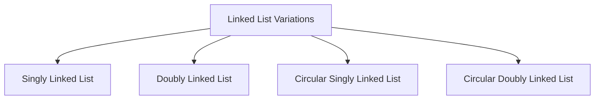
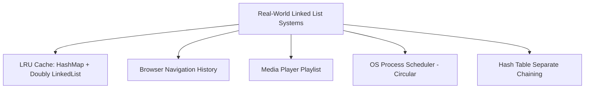

# 🔗 Linked List — Complete Technical Interview Documentation

> A comprehensive, senior-level interview preparation and engineering reference covering Linked List internal memory topology, classifications, Kotlin & Java implementations, time/space complexity analysis, algorithmic patterns, decision-making frameworks, real-world system designs, and FAANG interview questions.

---

## 📑 Table of Contents

- [1. Definition & Core Architecture](#1-definition--core-architecture)
- [2. Why Do We Need Linked Lists? (Array vs. List Motivation)](#2-why-do-we-need-linked-lists-array-vs-list-motivation)
- [3. Essential Linked List Terminology](#3-essential-linked-list-terminology)
- [4. How to Write a Linked List (Kotlin & Java)](#4-how-to-write-a-linked-list-kotlin--java)
- [5. The `head` Pointer & The Risk of Head Loss](#5-the-head-pointer--the-risk-of-head-loss)
- [6. Traversing a Linked List](#6-traversing-a-linked-list)
- [7. Types of Linked Lists](#7-types-of-linked-lists)
  - [7.1 Singly Linked List](#71-singly-linked-list)
  - [7.2 Doubly Linked List](#72-doubly-linked-list)
  - [7.3 Circular Singly Linked List](#73-circular-singly-linked-list)
  - [7.4 Circular Doubly Linked List](#74-circular-doubly-linked-list)
- [8. Comprehensive Comparison Matrix Across Types](#8-comprehensive-comparison-matrix-across-types)
- [9. Deep Dive: Linked List vs. Array](#9-deep-dive-linked-list-vs-array)
- [10. Advantages of Linked Lists](#10-advantages-of-linked-lists)
- [11. Disadvantages & Production Trade-Offs](#11-disadvantages--production-trade-offs)
- [12. Real-World Architectural Use Cases](#12-real-world-architectural-use-cases)
  - [12.1 LRU Cache (HashMap + Doubly Linked List)](#121-lru-cache-hashmap--doubly-linked-list)
  - [12.2 Browser Navigation History](#122-browser-navigation-history)
  - [12.3 Music & Video Playlists](#123-music--video-playlists)
  - [12.4 OS Round-Robin Task Scheduling](#124-os-round-robin-task-scheduling)
  - [12.5 Hash Table Collision Resolution (Separate Chaining)](#125-hash-table-collision-resolution-separate-chaining)
- [13. Important Operations to Master](#13-important-operations-to-master)
- [14. Operations Complexity Reference Table](#14-operations-complexity-reference-table)
- [15. The Most Important Interview Concept: Don't Memorize Methods](#15-the-most-important-interview-concept-dont-memorize-methods)
- [16. Requirement → Technique Decision-Making Matrix](#16-requirement--technique-decision-making-matrix)
- [17. How to Identify the Correct Technique from Problem Constraints](#17-how-to-identify-the-correct-technique-from-problem-constraints)
- [18. Step-by-Step Interview Thinking Examples](#18-step-by-step-interview-thinking-examples)
  - [Example 1: Find the Middle Node (Fast & Slow Pointers)](#example-1-find-the-middle-node-fast--slow-pointers)
  - [Example 2: Find the 3rd Node from the End (Gap Technique)](#example-2-find-the-3rd-node-from-the-end-gap-technique)
  - [Example 3: In-Place Linked List Reversal (Three Pointers)](#example-3-in-place-linked-list-reversal-three-pointers)
  - [Example 4: Cycle Detection (HashSet vs. Floyd's Algorithm)](#example-4-cycle-detection-hashset-vs-floyds-algorithm)
- [19. The Senior & Staff-Level Interview Framework (11 Steps)](#19-the-senior--staff-level-interview-framework-11-steps)
- [20. How Problem Constraints Dictate the Approach](#20-how-problem-constraints-dictate-the-approach)
- [21. The Brute Force → Optimization Mindset](#21-the-brute-force--optimization-mindset)
- [22. Real-World Problem Scenarios to Practice](#22-real-world-problem-scenarios-to-practice)
- [23. Technical Interview Questions & Answers](#23-technical-interview-questions--answers)
  - [Section A: Basic Questions (Q1–Q6)](#section-a-basic-questions-q1q6)
  - [Section B: Intermediate Questions (Q7–Q12)](#section-b-intermediate-questions-q7q12)
  - [Section C: Advanced & Staff Questions (Q13–Q17)](#section-c-advanced--staff-questions-q13q17)
- [24. The Pattern Mental Map You Should Memorize](#24-the-pattern-mental-map-you-should-memorize)
- [25. The Golden Rule of Linked List Interviews](#25-the-golden-rule-of-linked-list-interviews)
- [26. Pre-Coding Self-Assessment Checklist](#26-pre-coding-self-assessment-checklist)

---

# 1. Definition & Core Architecture

A **Linked List** is a linear data structure in which elements, called **nodes**, are stored as separate, individually allocated objects in heap memory. Unlike an array, linked list elements **do not reside in contiguous physical memory locations**.

Each node contains two essential components:
1. **Data / Payload:** The actual value (primitive or object reference) being stored.
2. **Link / Pointer / Reference:** A memory address pointing to the subsequent node (and preceding node in doubly linked lists).

### Basic Memory Structure

```text
HEAD
  │
  ▼
┌──────────────┬───────────┐         ┌──────────────┬───────────┐         ┌──────────────┬───────────┐
│  data: 10    │  next: ───┼────────►│  data: 20    │  next: ───┼────────►│  data: 30    │  next:null│
└──────────────┴───────────┘         └──────────────┴───────────┘         └──────────────┴───────────┘
```

* The **`head`** pointer references the first node of the list.
* The **`tail`** node's `next` reference points to `null`, marking the termination of the linear chain.

```text
Node Anatomy
┌────────────────────┬────────────────────┐
│      data          │       next         │
│  (payload value)   │ (reference to Node)│
└────────────────────┴────────────────────┘
```

---

# 2. Why Do We Need Linked Lists? (Array vs. List Motivation)

Consider an array containing five elements:

```text
Index:    0     1     2     3     4
Value:  [ 10 ][ 20 ][ 30 ][ 40 ][ 50 ]
```

If we want to insert `25` between `20` and `30`, all subsequent elements (`30`, `40`, `50`) must be shifted one position to the right in physical memory:

```text
Step 1: Shift right    [ 10 ][ 20 ][    ][ 30 ][ 40 ][ 50 ]
Step 2: Insert 25      [ 10 ][ 20 ][ 25 ][ 30 ][ 40 ][ 50 ]
                                      ▲
                             O(n) shift overhead
```

This shifting requires **$O(n)$ time complexity**. If the underlying array is already at full capacity, the entire buffer must be reallocated and copied to a new memory block ($O(n)$ re-allocation).

### The Linked List Alternative

With a linked list, nodes are independent heap allocations:

```text
Initial State:
[ 10 | • ] ──► [ 20 | • ] ─────────────► [ 30 | • ] ──► [ 40 | null ]

Insert 25 after 20:
                    [ 25 | • ]
                       │   │
           ┌───────────┘   └──────────┐
           ▼                          ▼
[ 10 | • ] ──► [ 20 | • ]               [ 30 | • ] ──► [ 40 | null ]

Resulting State:
[ 10 | • ] ──► [ 20 | • ] ──► [ 25 | • ] ──► [ 30 | • ] ──► [ 40 | null ]
```

Changing references requires only a constant number of pointer reassignments:
1. `newNode.next = curr.next;`
2. `curr.next = newNode;`

**Time Complexity:** $\mathbf{O(1)}$ constant time (assuming the reference to node `20` is already held).

> **Fundamental Architectural Reason:**
> Linked lists provide **dynamic memory allocation** with guaranteed **$O(1)$ insertions and deletions** whenever the target position or predecessor node reference is already available.

---

# 3. Essential Linked List Terminology

| Term | Meaning | JVM / Architectural Details |
|---|---|---|
| **Node** | The individual element building block. | Heap-allocated object holding `data` and pointer(s). |
| **Data / Payload** | The actual value stored in the node. | Primitive (`Int`, `Double`) or reference (`String`, Object). |
| **Next** | Pointer/reference to the subsequent node. | Holds the 64-bit (or 32-bit compressed) address of the next node. |
| **Previous (`prev`)** | Pointer/reference to the preceding node. | Present in Doubly Linked Lists for backward traversal. |
| **Head** | Reference to the first node in the list. | If `head == null`, the entire list is empty. |
| **Tail** | Reference to the last node in the list. | In singly linked lists, `tail.next == null`. |
| **Null** | Sentinel value indicating absence of a node. | Marks the end of a chain or an uninitialized pointer. |
| **Traversal** | Visiting every node sequentially from head to tail. | Requires $O(n)$ time via pointer dereferencing. |
| **Sentinel / Dummy Node** | An auxiliary node preceding `head` or following `tail`. | Eliminates edge cases during head/tail insertions and deletions. |

---

# 4. How to Write a Linked List (Kotlin & Java)

### Kotlin Implementation

```kotlin
// 1. Define the Node building block
class Node<T>(
    var data: T,
    var next: Node<T>? = null
)

// 2. Define the Singly Linked List container
class SinglyLinkedList<T> {
    var head: Node<T>? = null
    var tail: Node<T>? = null
    var size: Int = 0
        private set

    fun addFirst(value: T) {
        val newNode = Node(value, next = head)
        head = newNode
        if (tail == null) {
            tail = head
        }
        size++
    }

    fun addLast(value: T) {
        val newNode = Node(value)
        if (head == null) {
            head = newNode
            tail = newNode
        } else {
            tail?.next = newNode
            tail = newNode
        }
        size++
    }

    fun isEmpty(): Boolean = head == null
}
```

### Java Implementation

```java
public class SinglyLinkedList<T> {
    public static class Node<T> {
        public T data;
        public Node<T> next;

        public Node(T data) {
            this.data = data;
            this.next = null;
        }

        public Node(T data, Node<T> next) {
            this.data = data;
            this.next = next;
        }
    }

    private Node<T> head;
    private Node<T> tail;
    private int size;

    public void addFirst(T value) {
        Node<T> newNode = new Node<>(value, head);
        head = newNode;
        if (tail == null) {
            tail = head;
        }
        size++;
    }

    public void addLast(T value) {
        Node<T> newNode = new Node<>(value);
        if (head == null) {
            head = newNode;
            tail = newNode;
        } else {
            tail.next = newNode;
            tail = newNode;
        }
        size++;
    }

    public int size() { return size; }
    public boolean isEmpty() { return head == null; }
}
```

### Creating and Linking Nodes Manually

```kotlin
val node1 = Node(10)
val node2 = Node(20)
val node3 = Node(30)

// Connect nodes sequentially
node1.next = node2
node2.next = node3

// Result: node1 -> [10] -> [20] -> [30] -> null
```

---

# 5. The `head` Pointer & The Risk of Head Loss

The variable `head` is the single root of access for the entire data structure:

```kotlin
var head: Node? = null
```

```text
Empty State:
head ──► null

Populated State:
head
  │
  ▼
[ 10 | • ] ──► [ 20 | • ] ──► [ 30 | null ]
```

> [!CAUTION]
> **The Head Loss Pitfall:**
> If you overwrite the `head` reference without preserving it (e.g., executing `head = head.next` in an attempt to iterate), the original first node loses all incoming references.
> On garbage-collected runtimes (JVM / ART), unreferenced nodes become immediately eligible for GC cleanup. You permanently lose access to the beginning of your list!
> **Golden Rule:** Always declare an auxiliary pointer (`var current = head`) to traverse, leaving `head` intact.

---

# 6. Traversing a Linked List

Traversal involves systematically visiting every node in the sequence from `head` to `tail`.

```kotlin
fun printList(head: Node<Int>?) {
    var current: Node<Int>? = head

    while (current != null) {
        println(current.data)
        current = current.next // Advance pointer to next node
    }
}
```

### Trace of Pointer States

```text
Step 0: current = head    ──► [10] ──► [20] ──► [30] ──► null
Step 1: Prints 10, advances: current = [20]
Step 2: Prints 20, advances: current = [30]
Step 3: Prints 30, advances: current = null
Step 4: Loop condition (current != null) fails. Traversal complete.
```

* **Time Complexity:** $\mathbf{O(n)}$ (Must visit all $n$ nodes).
* **Auxiliary Space Complexity:** $\mathbf{O(1)}$ (Only one local pointer variable `current`).

---

# 7. Types of Linked Lists



---

## 7.1 Singly Linked List

Each node contains data and a single forward reference (`next`).

```text
HEAD
  │
  ▼
[ 10 | • ] ──► [ 20 | • ] ──► [ 30 | • ] ──► [ 40 | null ]
```

* **Directionality:** Forward-only ($10 \to 20 \to 30 \to 40$). Cannot navigate backward.
* **Advantages:** Minimal memory footprint per node (one reference pointer); ideal for sequential forward processing and simple pipelines.
* **Disadvantages:** Deleting a node requires traversing to its predecessor; backward navigation is impossible without reversing or using extra storage.

---

## 7.2 Doubly Linked List

Each node contains a data payload, a forward reference (`next`), and a backward reference (`prev`).

```text
HEAD                                                      TAIL
  │                                                         │
  ▼                                                         ▼
null ◄── [ • | 10 | • ] ⇄ [ • | 20 | • ] ⇄ [ • | 30 | • ] ⇄ [ • | 40 | • ] ──► null
```

### Node Definition

```kotlin
class DoublyNode<T>(
    var data: T,
    var prev: DoublyNode<T>? = null,
    var next: DoublyNode<T>? = null
)
```

* **Directionality:** Bidirectional ($10 \rightleftharpoons 20 \rightleftharpoons 30 \rightleftharpoons 40$).
* **Advantages:**
  * Bidirectional iteration.
  * $O(1)$ deletion of any arbitrary node when the node reference itself is known (no predecessor search needed: `node.prev.next = node.next; node.next.prev = node.prev;`).
  * $O(1)$ insertions before or after any given node.
* **Disadvantages:**
  * Extra memory overhead: Requires two pointer references (16 bytes on 64-bit JVM) per node.
  * More pointer reassignment operations per insert/delete, increasing susceptibility to reference-wiring bugs.

---

## 7.3 Circular Singly Linked List

The `next` pointer of the final node references `head` rather than `null`.

```text
HEAD
  │
  ▼
┌───────────┐      ┌───────────┐      ┌───────────┐
│  data: 10 │ ───► │  data: 20 │ ───► │  data: 30 │ ──┐
└───────────┘      └───────────┘      └───────────┘  │
      ▲                                              │
      └──────────────────────────────────────────────┘
```

* **Termination:** There is no `null` sentinel. Traversal loops terminate when `current.next == head`.
* **Primary Use Cases:**
  * Round-robin CPU task scheduling.
  * Cyclic streaming buffers.
  * Turn-based game engines (Player 1 $\to$ Player 2 $\to$ Player 3 $\to$ Player 1).

---

## 7.4 Circular Doubly Linked List

Combines bidirectional traversal with circular closure.

```text
      ┌───────────────────────────────────────────────┐
      │                                               ▼
┌─────┴─────┐      ┌───────────┐      ┌───────────┐   │
│  data: 10 │ ⇄──► │  data: 20 │ ⇄──► │  data: 30 │ ──┘
└───────────┘ ◄────┴───────────┴────► └───────────┘
      ▲                                       │
      └───────────────────────────────────────┘
```

* `head.prev` directly points to `tail`.
* `tail.next` directly points to `head`.
* **Advantages:** Instant $O(1)$ access to both ends with seamless circular bidirectional traversal. Used in high-performance circular queues and advanced buffer management.

---

# 8. Comprehensive Comparison Matrix Across Types

| Attribute | Singly Linked List | Doubly Linked List | Circular Singly | Circular Doubly |
|---|:---:|:---:|:---:|:---:|
| **Forward Traversal** | ✅ Yes | ✅ Yes | ✅ Yes | ✅ Yes |
| **Backward Traversal** | ❌ No | ✅ Yes | ❌ No | ✅ Yes |
| **Circular Continuity** | ❌ No | ❌ No | ✅ Yes | ✅ Yes |
| **Pointers per Node** | 1 (`next`) | 2 (`prev`, `next`) | 1 (`next`) | 2 (`prev`, `next`) |
| **Tail Points To** | `null` | `null` | `head` | `head` |
| **Head `prev` Points To** | N/A | `null` | N/A | `tail` |
| **Delete Given Node ($O(1)$)**| ❌ Needs predecessor | ✅ Instant | ❌ Needs predecessor | ✅ Instant |
| **Memory Overhead** | Lowest | Higher | Lowest | Higher |

---

# 9. Deep Dive: Linked List vs. Array

| Evaluation Dimension | Array / ArrayList | Linked List |
|---|---|---|
| **Physical Memory Layout** | Contiguous chunk of RAM | Dispersed individual heap allocations |
| **Access by Index (`k`)** | **$\mathbf{O(1)}$ Direct Math:** $\text{Base} + (k \times \text{size})$ | **$\mathbf{O(n)}$ Pointer Hops:** Must traverse from `head` |
| **Search by Value** | $O(n)$ linear scan ($O(\log n)$ if sorted) | $O(n)$ linear scan |
| **Insert / Delete at Head**| $O(n)$ (requires shifting all elements right/left) | **$\mathbf{O(1)}$** (reassign `head` pointer) |
| **Insert / Delete at Tail**| $O(1)$ amortized (may trigger array resize) | **$\mathbf{O(1)}$** (with `tail` pointer) |
| **Insert / Delete in Middle**| $O(n)$ physical element shifts | **$\mathbf{O(1)}$** once target pointer is located ($O(n)$ to locate) |
| **Capacity Flexibility** | Fixed (static) or $1.5\times$/$2\times$ resize copy | 100% dynamic; allocates and frees memory per node |
| **Memory Efficiency** | High (compact array buffer) | Low (stores data + 8–16 bytes of pointer & header per node) |
| **CPU Cache Locality** | **Superior:** Hardware L1/L2 spatial prefetching | **Poor:** Non-contiguous heap nodes trigger cache misses |

---

# 10. Advantages of Linked Lists

1. **Dynamic Size Allocation:** No need to pre-allocate fixed capacities or pay amortized $O(n)$ copying penalties during array resizing.
2. **Guaranteed $O(1)$ Boundary Insertions & Deletions:** Adding or removing from the head (or tail if tracked) is instant, requiring no memory shifts.
3. **Non-Contiguous Allocation:** Can utilize fragmented RAM blocks where no single large contiguous memory chunk is available.
4. **Foundation for Advanced ADTs:** Serves as the natural underlying representation for Stacks, Queues, Hash Table collision buckets, and LRU caches.

---

# 11. Disadvantages & Production Trade-Offs

1. **Zero Random Access ($O(n)$ Lookup):** You cannot execute `list[500]`. The CPU must traverse 500 successive pointers.
2. **Memory Bloat (The JVM Overhead):**
   * In a 64-bit JVM, an `int` takes 4 bytes.
   * A `Node` object requires: 16-byte object header + 4-byte int + 4-byte padding + 8-byte `next` reference = **32 bytes per node** to store a single 4-byte integer (800% overhead)!
3. **Severe Cache Misses (Pointer Chasing):** Because nodes are scattered across the heap, the CPU cannot utilize spatial locality or hardware prefetchers. Iterating through an array can be 10–50x faster in wall-clock time than traversing an identical linked list.
4. **Implementation Vulnerability:** Pointer assignment order bugs can cause lost nodes, circular deadlocks, or `NullPointerException`s.

---

# 12. Real-World Architectural Use Cases



---

## 12.1 LRU Cache (HashMap + Doubly Linked List)

The **Least Recently Used (LRU) Cache** is one of the most famous production uses of a Doubly Linked List:
* **Problem:** Evict the least recently used item in $O(1)$ when cache capacity is exceeded, while allowing $O(1)$ lookups and updates.
* **Architecture:**
  * `HashMap<Key, Node>` provides $\mathbf{O(1)}$ key-to-node lookup.
  * `DoublyLinkedList` maintains recency order.

```text
MRU (Most Recently Used)                          LRU (Least Recently Used)
       HEAD                                                  TAIL
         │                                                     │
         ▼                                                     ▼
     [ Node A ] ⇄ [ Node B ] ⇄ [ Node C ] ⇄ [ Node D ] ⇄ [ Node E ]
```

* **On `get(key)` / `put(key)`:** Lookup node via HashMap in $O(1)$, splice it out of its current position, and move it to the `HEAD` in $O(1)$.
* **On eviction:** Remove node at `TAIL` in $O(1)$ and remove its key from the HashMap.

---

## 12.2 Browser Navigation History

Web browsers maintain user navigation across tabs:
* **Backward / Forward Buttons:** A Doubly Linked List represents history entries.
* Clicking **Back** moves pointer to `current.prev`.
* Clicking **Forward** moves pointer to `current.next`.
* Visiting a new URL truncates all forward nodes from `current` and appends a new node.

---

## 12.3 Music & Video Playlists

Media engines (Spotify, Apple Music, YouTube Queues):
* **Next / Previous:** Bidirectional traversal via a Doubly Linked List.
* **Repeat All / Loop Mode:** Connects `tail.next = head` (Circular Doubly Linked List) for seamless endless looping without resetting index counters.

---

## 12.4 OS Round-Robin Task Scheduling

Operating system kernels manage multi-tasking CPU slices using a **Circular Linked List**:
* Each process is allocated a quantum (e.g., 20ms).
* Once the quantum expires, the scheduler shifts to `current = current.next`.
* When a process terminates, it splices itself out in $O(1)$ without affecting other tasks.

---

## 12.5 Hash Table Collision Resolution (Separate Chaining)

In `java.util.HashMap`, each bucket is an array index pointing to the head of a linked list:
* When hash collisions occur, multiple keys hash to the same bucket.
* Keys are chained in a singly linked list (`Bucket[i] -> NodeA -> NodeB -> NodeC`).
* In Java 8+, if a bucket's chain length exceeds 8 (`TREEIFY_THRESHOLD`), the linked list converts into a Red-Black Tree ($O(\log n)$) to protect against hash collision attacks.

---

# 13. Important Operations to Master

```text
Foundational Operations (Phase 1)
 ├── 1. Insert at Beginning (Head)
 ├── 2. Insert at End (Tail)
 ├── 3. Insert at Specific Position
 ├── 4. Delete from Beginning
 ├── 5. Delete from End
 ├── 6. Delete Specific Node by Value
 ├── 7. Search for Element
 ├── 8. Full Traversal & Print
 ├── 9. Count Nodes (Length)
 └── 10. Reverse a List In-Place

Interview Patterns (Phase 2)
 ├── 11. Find Middle Node (Tortoise & Hare)
 ├── 12. Detect Cycle (Floyd's Algorithm)
 ├── 13. Find Cycle Starting Node
 ├── 14. Merge Two Sorted Lists
 ├── 15. Remove Duplicates from Sorted List
 ├── 16. Find N-th Node From End (Gap Technique)
 ├── 17. Palindrome Linked List Check
 ├── 18. Find Intersection Node of Two Lists
 └── 19. Remove N-th Node From End in One Pass
```

---

# 14. Operations Complexity Reference Table

| Operation | Best Case | Worst Case | Auxiliary Space | Key Pre-condition |
|---|:---:|:---:|:---:|---|
| **Access 1st Element (`head`)** | $O(1)$ | $O(1)$ | $O(1)$ | List is non-empty |
| **Access $k$-th Element** | $O(1)$ | $O(n)$ | $O(1)$ | Must traverse from `head` |
| **Search by Value** | $O(1)$ | $O(n)$ | $O(1)$ | Unsorted list requires linear scan |
| **Insert at Head** | $O(1)$ | $O(1)$ | $O(1)$ | Always constant time |
| **Delete Head** | $O(1)$ | $O(1)$ | $O(1)$ | Always constant time |
| **Insert After Known Node** | $O(1)$ | $O(1)$ | $O(1)$ | Node pointer already in hand |
| **Delete After Known Predecessor**| $O(1)$ | $O(1)$ | $O(1)$ | Predecessor pointer in hand |
| **Delete Given Node (Doubly)** | $O(1)$ | $O(1)$ | $O(1)$ | Target node pointer in hand |
| **Insert at End (Without Tail)** | $O(n)$ | $O(n)$ | $O(1)$ | Must traverse all $n$ nodes |
| **Insert at End (With Tail)** | $O(1)$ | $O(1)$ | $O(1)$ | Pointer update via `tail.next` |
| **Delete at End (Singly List)** | $O(n)$ | $O(n)$ | $O(1)$ | Must locate $(n-1)$-th node |
| **Delete at End (Doubly List)** | $O(1)$ | $O(1)$ | $O(1)$ | Update via `tail = tail.prev` |
| **Reverse In-Place** | $O(n)$ | $O(n)$ | $O(1)$ | 3-pointer iterative technique |

---

# 15. The Most Important Interview Concept: Don't Memorize Methods

In real-world technical interviews, candidates often fail by asking themselves:
> ❌ *"Which specific LeetCode linked-list solution did I memorize for this?"*

Top-tier interviewers intentionally rephrase problems so they do not look like textbook questions. Instead, adopt the **Functional Requirement Mindset**:

```text
Step 1: What fundamental operation does this problem require?
 ├── Need random access?                  ──► Linked List is WRONG; choose Array/Vector
 ├── Need fast key-based retrieval?       ──► Choose HashMap / HashSet
 ├── Need frequent boundary updates?      ──► Choose Doubly Linked List / Deque
 ├── Need relative position from the end? ──► Choose Two-Pointer Gap Technique
 ├── Need to find the midpoint in 1 pass? ──► Choose Fast & Slow Pointer (1x / 2x)
 ├── Need cycle detection?                ──► Choose Floyd's Cycle Algorithm
 └── Need to reorder or reverse?          ──► Choose Three-Pointer In-Place Mutation
```

---

# 16. Requirement → Technique Decision-Making Matrix

| If the Problem Requires... | Optimal Technique | Complexity Target |
|---|---|:---:|
| **Finding the $k$-th element or searching a value** | Standard Pointer Traversal (`while current != null`) | Time: $O(n)$, Space: $O(1)$ |
| **Finding the Middle Node in a single pass** | **Fast & Slow Pointers** (`slow = 1x`, `fast = 2x`) | Time: $O(n)$, Space: $O(1)$ |
| **Detecting a Cycle or Loop** | **Floyd's Cycle-Finding Algorithm** (`fast` meets `slow`) | Time: $O(n)$, Space: $O(1)$ |
| **Finding the Cycle's Starting Node** | Floyd's Phase 1 + Reset `slow = head` and step by 1 | Time: $O(n)$, Space: $O(1)$ |
| **Finding the $k$-th Node from End** | **Two-Pointer Gap:** Advance `fast` $k$ steps ahead | Time: $O(n)$, Space: $O(1)$ |
| **Reversing the List in-place** | **Three Pointers:** `prev`, `curr`, `next` | Time: $O(n)$, Space: $O(1)$ |
| **Checking if List is Palindrome** | Find middle $\to$ Reverse 2nd half $\to$ Compare halves | Time: $O(n)$, Space: $O(1)$ |
| **Merging Two Sorted Lists** | **Two Pointers:** Compare heads, splice smaller node | Time: $O(n + m)$, Space: $O(1)$ |
| **Finding Intersection Node of Two Lists** | Traverse both; switch heads on reaching end | Time: $O(n + m)$, Space: $O(1)$ |
| **Removing Duplicates from Sorted List** | Lookahead pointer: `if (curr.val == curr.next.val)` | Time: $O(n)$, Space: $O(1)$ |
| **LRU Cache Implementation** | `HashMap<K, Node>` + `DoublyLinkedList` | Time: $O(1)$ all ops |

---

# 17. How to Identify the Correct Technique from Problem Constraints

Interviewers evaluate how you deduce algorithmic techniques from constraints:

```text
Constraint Breakdown:
 1. n <= 100
    ──► O(n^2) brute force or extra collections may pass, but an optimal O(n) is expected.
 2. n >= 100,000
    ──► MUST be O(n) or O(n log n). O(n^2) nested traversal will trigger Time Limit Exceeded (TLE).
 3. "Space Complexity must be O(1)"
    ──► Forbids HashSets, auxiliary arrays, or recursive call stacks.
    ──► Forces in-place pointer manipulation (Fast/Slow, 3-pointer reverse, gap pointers).
 4. "You cannot modify node values; you can only alter links"
    ──► Standard FAANG constraint: Forbids swapping val fields; requires physical link re-wiring.
```

---

# 18. Step-by-Step Interview Thinking Examples

---

### Example 1: Find the Middle Node (Fast & Slow Pointers)

**Interviewer Prompt:** *"Find the middle node of a singly linked list in a single pass without using extra memory."*

#### Thought Process
1. **Brute Force:** Traverse to count total nodes ($n$). Traverse again to index $n/2$. Works, but requires two passes.
2. **Optimization:** Can we do it in one pass?
3. **Technique:** Fast & Slow pointers (Tortoise and Hare).
   * Pointer `slow` moves **1 step** per iteration.
   * Pointer `fast` moves **2 steps** per iteration.
   * By the time `fast` reaches the end (or `null`), `slow` has traveled exactly half the distance!

```text
List: 1 ──► 2 ──► 3 ──► 4 ──► 5 ──► null

Step 0: slow = 1, fast = 1
Step 1: slow = 2, fast = 3
Step 2: slow = 3, fast = 5 (fast.next == null -> STOP)

Result: slow is at 3 (the exact middle node).
```

#### Kotlin Implementation
```kotlin
fun findMiddle(head: Node<Int>?): Node<Int>? {
    var slow = head
    var fast = head

    while (fast?.next != null) {
        slow = slow?.next
        fast = fast.next?.next
    }
    return slow
}
```

---

### Example 2: Find the 3rd Node from the End (Gap Technique)

**Interviewer Prompt:** *"Find the $k$-th node from the end in a single traversal."*

#### Thought Process
1. Calculating length requires two passes ($n$, then $n - k$).
2. To find the target in one pass, maintain a constant gap of $k$ nodes between two pointers:
   * Advance `fast` pointer $k$ steps forward.
   * Now start `slow` at `head` and advance both `slow` and `fast` together at 1 step per turn.
   * When `fast` reaches `null`, `slow` is positioned exactly $k$ nodes from the end!

```text
k = 3
List: 1 ──► 2 ──► 3 ──► 4 ──► 5 ──► null

Phase 1: Advance fast 3 steps:
fast is at 4, slow is at 1 (Gap = 3)

Phase 2: Advance both together:
Step 1: slow = 2, fast = 5
Step 2: slow = 3, fast = null -> STOP

Result: slow points to 3 (the 3rd node from the end).
```

---

### Example 3: In-Place Linked List Reversal (Three Pointers)

**Interviewer Prompt:** *"Reverse a singly linked list in $O(n)$ time and $O(1)$ space."*

#### Thought Process
1. We must flip every node's `next` pointer backward.
2. If we execute `curr.next = prev`, we break our link to the rest of the list.
3. Therefore, we need three pointers:
   * `prev` (tracks the reversed portion, starts at `null`)
   * `curr` (the current node being rewired, starts at `head`)
   * `nextTemp` (temporarily stores `curr.next` before we overwrite it)

```text
Reversal Loop:
1. nextTemp = curr.next    // Save forward reference
2. curr.next = prev        // Reverse current pointer
3. prev = curr             // Advance prev to curr
4. curr = nextTemp         // Advance curr to saved forward node
```

#### Kotlin Implementation
```kotlin
fun reverseList(head: Node<Int>?): Node<Int>? {
    var prev: Node<Int>? = null
    var curr: Node<Int>? = head

    while (curr != null) {
        val nextTemp = curr.next
        curr.next = prev
        prev = curr
        curr = nextTemp
    }
    return prev // prev is the new head
}
```

---

### Example 4: Cycle Detection (HashSet vs. Floyd's Algorithm)

**Interviewer Prompt:** *"Determine if a linked list contains a cycle."*

#### Solution Progression in an Interview

**Stage 1 — Candidate Proposes Auxiliary Space ($O(n)$ Space):**
> *"We can iterate through the list, inserting each node's reference into a `HashSet<Node>`. If we encounter a node already present in the set, a cycle exists. Time: $O(n)$, Space: $O(n)$."*

**Stage 2 — Interviewer Pushes for Space Optimization:**
> *"Can you solve this without allocating extra heap memory ($O(1)$ auxiliary space)?"*

**Stage 3 — Candidate Delivers Floyd's Cycle-Finding Algorithm:**
> *"Yes, we can use Floyd's Tortoise and Hare algorithm. We initialize `slow` and `fast` at `head`. `slow` advances 1 step; `fast` advances 2 steps. If a cycle exists, `fast` will enter the loop and eventually lap `slow` from behind ($fast == slow$). If `fast` or `fast.next` encounters `null`, no cycle exists."*

```kotlin
fun hasCycle(head: Node<Int>?): Boolean {
    var slow = head
    var fast = head

    while (fast?.next != null) {
        slow = slow?.next
        fast = fast.next?.next
        if (slow === fast) return true
    }
    return false
}
```

---

# 19. The Senior & Staff-Level Interview Framework (11 Steps)

```text
 1. Clarify Requirements  ──► Ask about node value ranges, list size, null inputs.
 2. Identify Structure    ──► Singly, doubly, or circular? Is there a tail pointer?
 3. Define the Operation  ──► Insertion, deletion, search, reordering, cycle?
 4. State Brute Force     ──► Establish baseline correctness and Big-O bounds.
 5. Identify Bottlenecks  ──► Where is repeated traversal or memory allocation occurring?
 6. Check Constraints     ──► Does n = 10^6 force O(n)? Does O(1) space forbid sets?
 7. Propose Optimal Model ──► Fast/slow pointers, dummy node, gap technique, 3 pointers.
 8. Explain Trade-Offs    ──► CPU cache misses, reference overhead, pointer mutation risks.
 9. Write Clean Code      ──► Modular methods with defensive null checks and guards.
10. Trace Edge Cases      ──► Empty list, 1 node, 2 nodes, cycle at head, cycle at tail.
11. State Final Big-O    ──► Confidently justify Time Complexity and Auxiliary Space.
```

---

# 20. How Problem Constraints Dictate the Approach

```text
Constraint Matrix:
┌─────────────────────────┬────────────────────────────────────────────────────────┐
│ Constraint              │ Engineering Implication & Architecture Selection        │
├─────────────────────────┼────────────────────────────────────────────────────────┤
│ n <= 50                 │ Any correct O(n) or O(n^2) approach works. Prioritize   │
│                         │ readability and simplicity over micro-optimizations.   │
├─────────────────────────┼────────────────────────────────────────────────────────┤
│ n >= 10^5               │ Algorithm MUST run in O(n) or O(n log n). Single-pass  │
│                         │ two-pointer techniques are mandatory.                  │
├─────────────────────────┼────────────────────────────────────────────────────────┤
│ Memory Limit < 16MB     │ Forbids HashSet or recursion (call stack frames).      │
│                         │ Must use in-place pointer manipulation.                │
├─────────────────────────┼────────────────────────────────────────────────────────┤
│ Immutable Input         │ Must clone nodes rather than mutating links in-place.  │
└─────────────────────────┴────────────────────────────────────────────────────────┘
```

---

# 21. The Brute Force → Optimization Mindset

In Google and top-tier interviews, never jump straight to the most complex code. Demonstrate structured analytical progression:

```mermaid
graph LR
    BF[1. Brute Force<br>O(n^2) Search] --> ExtraSpace[2. HashSet Optimization<br>O(n) Time / O(n) Space]
    ExtraSpace --> InPlace[3. Optimal In-Place<br>O(n) Time / O(1) Space]
```

Demonstrating this progression shows the interviewer that:
1. You prioritize correctness first.
2. You understand space-time trade-offs.
3. You can refactor code iteratively under changing constraints.

---

# 22. Real-World Problem Scenarios to Practice

1. **Browser Navigation Engine:** Implement `back(steps)` and `forward(steps)` with $O(1)$ appends $\implies$ **Doubly Linked List**.
2. **High-Throughput LRU Cache:** Evict least-recently-used items in $O(1)$ with fast key access $\implies$ **HashMap + Doubly Linked List**.
3. **OS Multi-Tasking Scheduler:** Share CPU slices among active processes continuously $\implies$ **Circular Singly Linked List**.
4. **Media Playlist Shuffle / Loop:** Seamless playback transition with repeat mode $\implies$ **Circular Doubly Linked List**.
5. **Corrupted Transaction Journal:** Identify looping payment transfers $\implies$ **Floyd's Cycle Detection**.
6. **Merging Distributed Microservice Log Streams:** Combine two chronologically sorted event streams $\implies$ **Two-Pointer Merge**.
7. **Common Code Branching (Git Merge Base):** Find the point where two commit histories converge $\implies$ **Linked List Intersection**.
8. **Reversing an Undo/Redo Action Journal:** Invert an operation sequence for rollbacks $\implies$ **In-Place Reversal**.

---

# 23. Technical Interview Questions & Answers

---

### Section A: Basic Questions (Q1–Q6)

#### Q1. What is a Linked List?
**Answer:**
A linked list is a linear data structure consisting of independent heap-allocated objects called nodes. Each node encapsulates a data payload and one or more memory references (pointers) to neighboring nodes. Unlike arrays, linked lists do not require contiguous physical memory.

---

#### Q2. What is the difference between an Array and a Linked List?
**Answer:**
* **Memory Layout:** Arrays are contiguous in physical RAM; linked list nodes are scattered across the heap.
* **Access:** Arrays offer $O(1)$ random access via indexing math. Linked lists require $O(n)$ linear pointer traversal.
* **Insertions/Deletions:** Arrays require shifting subsequent elements ($O(n)$). Linked lists achieve $O(1)$ insertions/deletions once the target node or predecessor reference is available.
* **Cache Performance:** Arrays offer superior CPU cache locality; linked lists suffer from pointer-chasing cache misses.

---

#### Q3. What is a Node?
**Answer:**
A node is the fundamental structural primitive of a linked list. It contains the data payload and reference field(s) (`next`, `prev`) storing the memory address of adjacent nodes.

---

#### Q4. What is the `head`?
**Answer:**
The `head` is the root reference pointer pointing to the first node of the linked list. It serves as the single entry point for all traversal and collection operations.

---

#### Q5. What happens if the `head` is null?
**Answer:**
The linked list is completely empty. Any attempt to dereference `head.data` or `head.next` will trigger a `NullPointerException` (Java) or compile error (Kotlin non-null types).

---

#### Q6. Why is random access $O(n)$ in a Linked List?
**Answer:**
Because nodes are allocated at arbitrary heap memory addresses with no mathematical relationship between an element's logical index $k$ and its physical RAM location. To reach index $k$, the CPU must step through $k$ successive pointer dereferences starting from `head`.

---

### Section B: Intermediate Questions (Q7–Q12)

#### Q7. Why is insertion at the beginning of a Linked List $O(1)$?
**Answer:**
Because it requires only two constant-time pointer assignments regardless of list size:
```kotlin
newNode.next = head
head = newNode
```
No existing elements need to be shifted in memory.

---

#### Q8. Why is searching an unsorted Linked List $O(n)$?
**Answer:**
Because elements are unsorted and non-contiguous. The algorithm must inspect each node sequentially from `head` until a matching value is found or `null` is reached (worst-case $n$ comparisons).

---

#### Q9. When should you choose a Doubly Linked List over a Singly Linked List?
**Answer:**
Choose a Doubly Linked List when:
1. Bidirectional navigation is required (e.g., browser back/forward, undo/redo stacks).
2. Frequent $O(1)$ deletions of arbitrary nodes are required where you already hold the target node reference (such as in an LRU Cache).

---

#### Q10. What is the disadvantage of a Doubly Linked List?
**Answer:**
1. **Memory Overhead:** Requires an extra 8-byte pointer (`prev`) per node, increasing heap footprint.
2. **Code Complexity:** Every insert and delete operation requires updating up to four pointer references (`next` and `prev` on two adjacent nodes), increasing the risk of wiring bugs.

---

#### Q11. How do you reverse a Linked List in-place?
**Answer:**
Using the **Three-Pointer Iterative Pattern** (`prev`, `curr`, `nextTemp`):
```kotlin
var prev: Node<T>? = null
var curr = head

while (curr != null) {
    val nextTemp = curr.next
    curr.next = prev
    prev = curr
    curr = nextTemp
}
head = prev
```
* **Time Complexity:** $O(n)$.
* **Space Complexity:** $O(1)$ auxiliary space.

---

#### Q12. How do you find the middle of a Linked List in one pass?
**Answer:**
Using **Fast and Slow Pointers**:
Initialize `slow = head` and `fast = head`. Advance `slow` by 1 node and `fast` by 2 nodes per iteration (`while (fast?.next != null)`). When `fast` reaches the end, `slow` is positioned exactly at the middle node.

---

### Section C: Advanced & Staff Questions (Q13–Q17)

#### Q13. How do you detect a cycle in a Linked List without extra space?
**Answer:**
Use **Floyd's Cycle-Finding Algorithm (Tortoise and Hare)**:
* Advance `slow` by 1 step and `fast` by 2 steps.
* If `fast` or `fast.next` hits `null`, the list has no cycle.
* If `slow === fast` at any point, a cycle exists.
* **Complexity:** Time $O(n)$, Auxiliary Space $O(1)$.

---

#### Q14. Mathematical Proof: How do you find the starting node of a cycle?
**Answer:**
1. Let the distance from `head` to the cycle entry point be $L_1$.
2. Let the distance from the cycle entry point to the meeting point be $k$.
3. Let the perimeter of the cycle be $C$.
4. When `slow` and `fast` meet:
   * Distance traveled by `slow`: $D_{\text{slow}} = L_1 + k$
   * Distance traveled by `fast`: $D_{\text{fast}} = L_1 + k + mC$ (where $m$ is the number of full loops)
5. Because `fast` moves at twice the speed of `slow`:
   $$2(L_1 + k) = L_1 + k + mC \implies L_1 + k = mC \implies \mathbf{L_1 = mC - k}$$
6. **Algorithm:**
   * Leave `fast` at the meeting point.
   * Reset `slow = head`.
   * Advance both `slow` and `fast` at **1 step at a time**.
   * Both pointers will travel distance $L_1$ and meet precisely at the **cycle entry node**!

---

#### Q15. How do you remove the $n$-th node from the end in a single pass?
**Answer:**
Use a **Dummy / Sentinel Node** and the **Two-Pointer Gap Technique**:
1. Create `dummy.next = head`.
2. Initialize `fast = dummy` and `slow = dummy`.
3. Advance `fast` $n + 1$ steps forward to establish a gap of $n$ nodes.
4. Move both `slow` and `fast` 1 step at a time until `fast == null`.
5. `slow` will now point to the node immediately *preceding* the target node.
6. Delete target: `slow.next = slow.next.next`.
7. Return `dummy.next`.
* **Complexity:** Time $O(L)$, Space $O(1)$. Handles edge cases (like removing the head node) cleanly.

---

#### Q16. How do you determine if a Singly Linked List is a Palindrome in $O(n)$ time and $O(1)$ space?
**Answer:**
1. **Find Middle:** Use fast & slow pointers to reach the midpoint.
2. **Reverse Second Half:** Invert pointers of the second half in-place.
3. **Compare Halves:** Maintain pointer `p1 = head` and `p2 = reversedSecondHalfHead`. Compare data values node-by-node.
4. **Restore List (Optional / Best Practice):** Re-reverse the second half back to its original state to avoid mutating client data.
* **Complexity:** Time $O(n)$, Space $O(1)$.

---

#### Q17. How do you merge two sorted Linked Lists in-place?
**Answer:**
Maintain a `dummy` sentinel node and a `tail` pointer:
```kotlin
fun mergeTwoLists(l1: Node<Int>?, l2: Node<Int>?): Node<Int>? {
    val dummy = Node(0)
    var tail = dummy
    var p1 = l1
    var p2 = l2

    while (p1 != null && p2 != null) {
        if (p1.data <= p2.data) {
            tail.next = p1
            p1 = p1.next
        } else {
            tail.next = p2
            p2 = p2.next
        }
        tail = tail.next!!
    }
    // Attach remaining chain
    tail.next = p1 ?: p2
    return dummy.next
}
```
* **Complexity:** Time $O(n + m)$, Auxiliary Space $O(1)$ (splices existing nodes without new heap allocations).

---

# 24. The Pattern Mental Map You Should Memorize

```text
                             Linked List Master Taxonomy
                                          │
       ┌─────────────────┬────────────────┴────────────────┬──────────────────┐
       ▼                 ▼                                 ▼                  ▼
Pointer Mutation   Two Pointers                     Multiple Lists       Hybrid Structures
 ├── Insert        ├── Fast & Slow (1x / 2x)        ├── Merge Sorted     ├── HashMap + DLL
 ├── Delete        │    ├── Middle Node             └── Find Intersection│   └── LRU Cache
 └── Reverse       │    └── Cycle Detection                              └── LFU Cache
      (3-pointer)  └── Gap Technique (k steps)
                        └── N-th from End
```

---

# 25. The Golden Rule of Linked List Interviews

When faced with any linked list problem during an interview:

```text
                      What is the Core Need?
                                │
        ┌───────────────────────┼───────────────────────┐
        ▼                       ▼                       ▼
    Relative                Structural              Directional
    Position?                Change?                Continuity?
        │                       │                       │
Two Pointers            Pointer Rewiring         Doubly / Circular
(Fast/Slow or Gap)     (prev, curr, next)       (prev, next, tail)
```

Always state:
> *"I will use a **Sentinel Dummy Node** to protect against edge cases (such as deleting or swapping the head), apply in-place pointer manipulation to maintain **$O(1)$ auxiliary memory**, and verify boundaries against null inputs, single-node lists, and cycles."*

---

# 26. Pre-Coding Self-Assessment Checklist

Before moving to complex LeetCode problems, ensure you can implement and explain each of these without reference material:

- [ ] Can define a `Node` class with generic data payload and nullable reference.
- [ ] Understand the role of `head` and why losing it causes memory leaks / GC loss.
- [ ] Can write a clean traversal loop using `while (current != null)`.
- [ ] Can explain why Array indexing is $O(1)$ while Linked List indexing is $O(n)$.
- [ ] Can articulate CPU cache locality and object header overhead on the JVM.
- [ ] Can implement an in-place list reversal using three pointers (`prev`, `curr`, `nextTemp`).
- [ ] Can implement Fast and Slow pointers to find the middle node in one pass.
- [ ] Can explain Floyd's Cycle Detection algorithm and its mathematical proof ($L_1 = mC - k$).
- [ ] Can use the gap technique to find and remove the $n$-th node from the end.
- [ ] Can explain the architecture of an LRU Cache combining a `HashMap` with a `DoublyLinkedList`.
- [ ] Defensive edge cases: Empty list (`head == null`), single-node list, two-node list, cycle.
