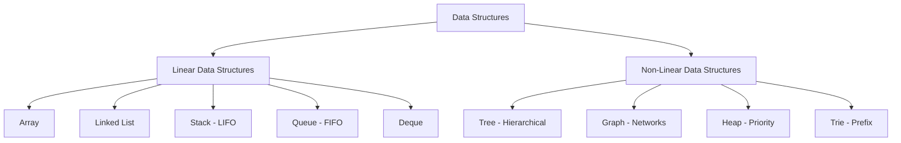
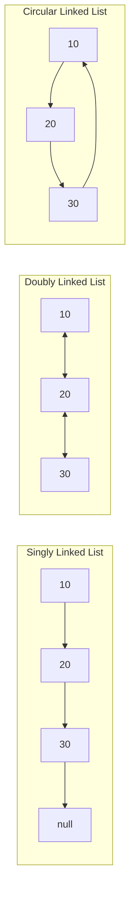
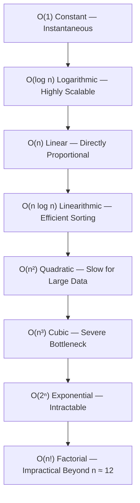

# ⏱️ DSA — Data Types, Classification, Time & Space Complexity

> A complete foundational and senior-level interview preparation guide covering Data Types, Primitive vs. Non-Primitive representations, Linear vs. Non-Linear Data Structures, Time Complexity, Space Complexity, Big-O analysis, and production engineering trade-offs.

---

## 📑 Table of Contents

- [PART 1 — DATA TYPES & DATA STRUCTURES CLASSIFICATION](#part-1--data-types--data-structures-classification)
  - [1. What is a Data Type?](#1-what-is-a-data-type)
  - [2. Primitive Data Types](#2-primitive-data-types)
  - [3. Non-Primitive Data Types](#3-non-primitive-data-types)
  - [4. Primitive vs. Non-Primitive Comparison](#4-primitive-vs-non-primitive-comparison)
    - [Crucial Kotlin & Java JVM Nuance (Boxing)](#crucial-kotlin--java-jvm-nuance-boxing)
  - [5. Data Structures Classification Overview](#5-data-structures-classification-overview)
  - [6. Linear Data Structures](#6-linear-data-structures)
    - [Array](#array)
    - [Linked List — Core Prerequisite Foundations & Mental Models](#linked-list--core-prerequisite-foundations--mental-models)
      - [What You Should Know Before Linked List](#what-you-should-know-before-linked-list)
      - [1. References / Pointers — VERY IMPORTANT](#1-references--pointers--very-important)
      - [2. Classes and Objects (The Node Building Block)](#2-classes-and-objects-the-node-building-block)
      - [3. null and Loop Termination](#3-null-and-loop-termination)
      - [4. Arrays vs. Linked Lists Deep Comparison](#4-arrays-vs-linked-lists-deep-comparison)
      - [5. Time Complexity of Linked List Operations](#5-time-complexity-of-linked-list-operations)
      - [6. Traversal Mechanics (current = current.next)](#6-traversal-mechanics-current--currentnext)
      - [7. Head and Tail Pointers](#7-head-and-tail-pointers)
      - [8. Critical Distinction: Node vs. Linked List](#8-critical-distinction-node-vs-linked-list)
      - [9. Visualizing the Internal Memory Structure](#9-visualizing-the-internal-memory-structure)
      - [10. Types of Linked Lists](#10-types-of-linked-lists)
      - [Recommended Learning Order & Study Roadmap](#recommended-learning-order--study-roadmap)
    - [Stack (LIFO)](#stack-lifo)
    - [Queue (FIFO)](#queue-fifo)
  - [7. Non-Linear Data Structures](#7-non-linear-data-structures)
    - [Tree (Hierarchical)](#tree-hierarchical)
    - [Graph (Network Relationships)](#graph-network-relationships)
    - [Heap (Priority Ordering)](#heap-priority-ordering)
  - [8. Complete Classification Mental Model](#8-complete-classification-mental-model)
  - [9. Crucial Distinction: Data Types vs. Data Structures](#9-crucial-distinction-data-types-vs-data-structures)
- [PART 2 — ASYMPTOTIC COMPLEXITY & BIG-O ANALYSIS](#part-2--asymptotic-complexity--big-o-analysis)
  - [10. Introduction & What is Complexity?](#10-introduction--what-is-complexity)
  - [11. What is Time Complexity?](#11-what-is-time-complexity)
  - [12. What is Space Complexity?](#12-what-is-space-complexity)
  - [13. Time Complexity vs. Space Complexity](#13-time-complexity-vs-space-complexity)
  - [14. Input Size (n)](#14-input-size-n)
  - [15. Big-O Notation & Growth Hierarchy](#15-big-o-notation--growth-hierarchy)
  - [16. Detailed Complexity Growth Rates](#16-detailed-complexity-growth-rates)
    - [O(1) — Constant Complexity](#o1--constant-complexity)
    - [O(n) — Linear Complexity](#on--linear-complexity)
    - [O(n²) — Quadratic Complexity](#on--quadratic-complexity)
    - [O(log n) — Logarithmic Complexity](#olog-n--logarithmic-complexity)
    - [O(n log n) — Linearithmic Complexity](#on-log-n--linearithmic-complexity)
    - [O(2ⁿ) — Exponential Complexity](#o2--exponential-complexity)
    - [O(n!) — Factorial Complexity](#on--factorial-complexity)
  - [17. Mathematical Foundations: Dropping Constants & Lower-Order Terms](#17-mathematical-foundations-dropping-constants--lower-order-terms)
  - [18. How to Calculate Time Complexity Step-by-Step](#18-how-to-calculate-time-complexity-step-by-step)
  - [19. Sequential vs. Nested Loops (O(n × m) Gotcha)](#19-sequential-vs-nested-loops-on--m-gotcha)
  - [20. Space Complexity: Auxiliary vs. Input Space](#20-space-complexity-auxiliary-vs-input-space)
  - [21. Time-Space Trade-Offs in Production](#21-time-space-trade-offs-in-production)
  - [22. Best Case, Average Case, and Worst Case Bounds](#22-best-case-average-case-and-worst-case-bounds)
- [PART 3 — COMPLETE INTERVIEW QUESTIONS & ANSWERS](#part-3--complete-interview-questions--answers)
  - [Section A: Data Types & Structural Classification Questions (Q1–Q22)](#section-a-data-types--classification-questions)
  - [Section B: Core Complexity Questions (Q23–Q32)](#section-b-core-complexity-questions)
  - [Section C: Senior & Staff-Level Architectural Questions (Q33–Q42)](#section-c-senior--staff-level-architectural-questions)
- [PART 4 — QUICK REFERENCE & MENTAL MODELS](#part-4--quick-reference--mental-models)
  - [Complexity Analysis Cheat Sheet](#complexity-analysis-cheat-sheet)
  - [Senior Interview Mindset & Mental Model](#senior-interview-mindset--mental-model)
  - [10 Quick Rules to Remember](#10-quick-rules-to-remember)
  - [Final 60-Second Interview Definition](#final-60-second-interview-definition)

---

# PART 1 — DATA TYPES & DATA STRUCTURES CLASSIFICATION

Before analyzing algorithmic performance, we must understand the memory representations of the data being processed.

---

## 1. What is a Data Type?

### Definition

> **A data type defines the classification of a value, the memory footprint and binary representation allocated for it, and the set of valid operations that can be performed on it.**

For example:

```kotlin
val age: Int = 25            // 32-bit signed integer
val name: String = "Raj"     // Reference to character sequence
val isActive: Boolean = true // 1-bit logical truth value
```

At the highest level, data types are divided into:

```text
                         Data Types
                             │
              ┌──────────────┴──────────────┐
          Primitive                    Non-Primitive
              │                             │
       Basic single values        Collections / Objects
```

---

## 2. Primitive Data Types

### Definition

> **Primitive data types are fundamental, scalar building blocks provided directly by the programming language or runtime, storing a single raw value directly in memory.**

Standard categories:
* **Integer types:** `Byte` (8-bit), `Short` (16-bit), `Int` (32-bit), `Long` (64-bit)
* **Floating-point types:** `Float` (32-bit), `Double` (64-bit)
* **Character type:** `Char` (16-bit Unicode)
* **Boolean type:** `Boolean` (`true` / `false`)

```kotlin
val age: Int = 25
val salary: Double = 50000.0
val grade: Char = 'A'
val active: Boolean = true
```

In low-level execution, primitive values reside directly on the **execution stack** (within thread activation frames) rather than requiring heap allocation and pointer dereferencing.

---

## 3. Non-Primitive Data Types

### Definition

> **Non-primitive (reference / composite) data types are higher-level structures composed of primitive types and other objects, capable of storing collections of values or complex state.**

Standard examples:
* `String`
* `Array`
* Classes and Objects
* `List`, `Set`, `Map`
* Linked Lists, Trees, Heaps, Graphs

```kotlin
val numbers = arrayOf(10, 20, 30, 40)

data class User(
    val id: Int,
    val name: String,
    val age: Int
)
```

Non-primitive entities are allocated on the **heap**, and variables store a **memory reference (pointer)** to that heap location.

---

## 4. Primitive vs. Non-Primitive Comparison

| Dimension | Primitive Data Types | Non-Primitive (Reference) Data Types |
|---|---|---|
| **Value Representation** | Holds a single scalar value | Can hold multiple values or complex state |
| **Memory Allocation** | Typically on the **Stack** | Stored on the **Heap**; variable holds a reference |
| **Default Value** | Has defined defaults (e.g., `0`, `false`) | Defaults to `null` if uninitialized |
| **Memory Overhead** | Minimal (exact bits: 8, 16, 32, 64) | Object header (8–16 bytes) + padding + pointer |
| **Nullability** | In Java, cannot be `null` | Can reference `null` |
| **Examples** | `int`, `double`, `char`, `boolean` | `String`, `Array`, `HashMap`, custom classes |

### Crucial Kotlin & Java JVM Nuance (Boxing)

> **Interview Caution:** In Java, primitives (`int`, `boolean`) and reference wrappers (`Integer`, `Boolean`) have distinct syntax. In Kotlin, everything is presented as an object (`Int`, `Boolean`, `Double`).
>
> However, the **Kotlin compiler automatically optimizes non-nullable types to JVM primitives (`int`)** wherever possible to eliminate heap boxing overhead. When a type is nullable (`Int?`) or used as a generic parameter (`List<Int>`), the compiler automatically boxes it into `java.lang.Integer`.

---

## 5. Data Structures Classification Overview

While **data types** describe what kind of value a variable stores, **data structures** describe how multiple data elements are organized and related in memory.



---

## 6. Linear Data Structures

### Definition

> **A linear data structure arranges elements in a single sequential order, where every element (except the first and last) has a unique predecessor and successor.**

### Array
An array stores elements of identical type in a **contiguous memory block** accessed via zero-based indices.
```text
Index:     0      1      2      3
Value:   [ 10 ] [ 20 ] [ 30 ] [ 40 ]
```
* **Indexed Access:** $O(1)$ directly computed via $\text{BaseAddress} + (\text{index} \times \text{size})$.
* **Search (Unsorted):** $O(n)$.
* **Insertion / Deletion:** $O(n)$ due to shifting elements.

### Linked List — Core Prerequisite Foundations & Mental Models

> **Senior Interview Context:** Before starting **Linked List** problems, there are fundamental concepts you must be completely comfortable with. If you master these foundational building blocks first, solving Linked List interview problems (like reversal, cycle detection, or fast & slow pointers) becomes intuitive rather than memorization.

```text
Node
 ├── data
 └── next ──────> another Node
```

---

#### What You Should Know Before Linked List

##### 1. References / Pointers — VERY IMPORTANT

The most critical prerequisite for understanding linked structures.

A Linked List is built by connecting independent heap objects (**nodes**) using **memory references** (often called pointers in general computer science).

In Java:
```java
class Node {
    int data;
    Node next;
}
```

In Kotlin:
```kotlin
class Node(
    var data: Int,
    var next: Node? = null
)
```

**Crucial Mental Model:**
> `Node next;` does **not** store the next node's actual data or an entire node copy. It stores a **memory reference (address) pointing to another `Node` object on the heap**.

Key reference concepts you must understand:
* **What an object reference is:** A 64-bit (or 32-bit with JVM Compressed OOPs) reference pointing to an allocated object on the heap.
* **How one object refers to another:** The `next` reference field holds the address of the subsequent node.
* **`null`:** Represents the absence of an object reference. In a linked list, `null` signifies the termination of the sequence.
* **Creating objects:** Using `new Node()` in Java or `Node()` in Kotlin dynamically allocates a new node on the heap.
* **Reference assignment:** Setting `first.next = second;` connects two independent heap objects.

For example:
```java
Node first = new Node();
Node second = new Node();

first.data = 10;
second.data = 20;

first.next = second;
```

**Conceptual Memory Layout:**
```text
first
  │
  ▼
┌─────────────┬───────────┐         ┌─────────────┬───────────┐
│  data: 10   │  next: ───┼────────►│  data: 20   │  next:null│
└─────────────┴───────────┘         └─────────────┴───────────┘
                                          ▲
                                          │
                                        second
```

---

##### 2. Classes and Objects (The Node Building Block)

A Linked List is constructed using a dedicated **`Node` class**.

```java
class Node {
    int data;
    Node next;

    Node(int data) {
        this.data = data;
        this.next = null;
    }
}
```

**Creating individual nodes:**
```java
Node node1 = new Node(10);
Node node2 = new Node(20);
Node node3 = new Node(30);
```

**Connecting them into a chain:**
```java
node1.next = node2;
node2.next = node3;
```

**Resulting Logical Structure:**
```text
10 → 20 → 30 → null
```

---

##### 3. `null` and Loop Termination

You need to be completely comfortable with `null` references:

1. The `next` reference of the **last node** in a singly linked list points to `null`:
   ```text
   10 → 20 → 30 → null
   ```
   This means:
   ```java
   node3.next == null
   ```
2. In algorithms, `current == null` serves as the universal **sentinel check** indicating we have reached the end of the list:
   ```java
   Node current = head;
   while (current != null) {
       // Process current node
       current = current.next;
   }
   ```
   > **Interview Tip:** Forgetting the `null` check or dereferencing `current.next` when `current` is already `null` is the #1 cause of `NullPointerException` in live coding rounds.

---

##### 4. Arrays vs. Linked Lists Deep Comparison

Interviewers frequently ask candidates to contrast Arrays and Linked Lists across storage, access patterns, and performance:

* **Array:** Contiguous indexed storage in physical memory.
  ```text
  [ 10 ] [ 20 ] [ 30 ] [ 40 ] [ 50 ]
  ```
* **Linked List:** Dispersed nodes connected through memory references.
  ```text
  [ 10 | next ] ──► [ 20 | next ] ──► [ 30 | next ] ──► null
  ```

| Dimension | Array / ArrayList | Linked List |
|---|---|---|
| **Memory Topology** | Contiguous memory block | Non-contiguous nodes scattered across the heap |
| **Element Access** | Direct $O(1)$ random access via index (`arr[i]`) | Sequential $O(n)$ traversal from `head` |
| **Size Flexibility** | Fixed (static array) or resized via copying ($O(n)$ resize) | Fully dynamic; grows/shrinks per node with zero re-allocation copying |
| **Insert / Delete at Head** | $O(n)$ (requires shifting all subsequent elements) | $O(1)$ (constant pointer update) |
| **Insert / Delete in Middle** | $O(n)$ (requires shifting elements) | $O(1)$ **once the target node/predecessor is known** ($O(n)$ to find it) |
| **Memory Overhead** | Low (only the stored primitive or object reference) | High (stores data + 8-byte pointer + 16-byte object header per node) |
| **CPU Cache Locality** | **Superior** (spatial locality allows L1/L2 hardware prefetching) | **Poor** (pointer chasing across heap triggers L1/L2 cache misses) |

---

##### 5. Time Complexity of Linked List Operations

Connecting algorithmic complexity directly to Linked List mechanics:

| Operation | Time Complexity | Auxiliary Space | Why / Mechanical Reason |
|---|:---:|:---:|---|
| **Access by index ($k$-th element)** | $O(n)$ | $O(1)$ | No indexing math; must step through $k$ nodes sequentially |
| **Search by value** | $O(n)$ | $O(1)$ | Linear scan from `head` to `tail` comparing each node's `data` |
| **Insert at head** | $O(1)$ | $O(1)$ | `newNode.next = head; head = newNode;` |
| **Delete at head** | $O(1)$ | $O(1)$ | `head = head.next;` |
| **Insert after known node** | $O(1)$ | $O(1)$ | `newNode.next = curr.next; curr.next = newNode;` |
| **Delete after known predecessor** | $O(1)$ | $O(1)$ | `curr.next = curr.next.next;` |
| **Insert at tail (without tail pointer)** | $O(n)$ | $O(1)$ | Must traverse all $n$ nodes to reach the end |
| **Insert at tail (with tail pointer)** | $O(1)$ | $O(1)$ | `tail.next = newNode; tail = newNode;` |
| **Delete at tail (singly linked list)** | $O(n)$ | $O(1)$ | Even with a `tail` pointer, must traverse to find the $(n-1)$-th node |
| **Traverse entire list** | $O(n)$ | $O(1)$ | Visits each of the $n$ nodes exactly once |

> **Core Architectural Rule:** Linked Lists excel when your workload requires **frequent $O(1)$ insertions and deletions at boundaries or known references**, but degrade severely when workloads require random access or frequent searching.

---

##### 6. Traversal Mechanics (`current = current.next`)

Moving through sequences is fundamentally different between arrays and linked lists:

* **Array Traversal:**
  ```java
  for (int i = 0; i < arr.length; i++) {
      System.out.println(arr[i]);
  }
  ```
* **Linked List Traversal:**
  ```java
  Node current = head;

  while (current != null) {
      System.out.println(current.data);
      current = current.next;
  }
  ```

**Master this single line:**
```java
current = current.next;
```
It means:
> **"Copy the memory reference stored in `current.next` into the local variable `current`, advancing our pointer to the next node in the heap."**

---

##### 7. Head and Tail Pointers

These two reference pointers define the boundaries of the list:

```text
HEAD
  │
  ▼
┌────┐      ┌────┐      ┌────┐      ┌────┐
│ 10 │ ───► │ 20 │ ───► │ 30 │ ───► │ 40 │ ───► null
└────┘      └────┘      └────┘      └────┘
                                      ▲
                                      │
                                    TAIL
```

* **`head`:** Reference to the first node in the list.
  * `head.next` refers to the second node.
  * If `head == null`, the list is empty.
* **`tail`:** Reference to the last node in the list.
  * `tail.next` is strictly `null` in a standard singly linked list.

---

##### 8. Critical Distinction: Node vs. Linked List

Do not confuse the building block with the collection container:

* **`Node` (The Element):** Represents a single item storing raw data and pointer(s).
  ```java
  class Node {
      int data;
      Node next;
  }
  ```
* **`LinkedList` (The Data Structure Container):** Manages the collection state, pointer boundaries, size, and encapsulates operations:
  ```java
  class SinglyLinkedList {
      private Node head;
      private Node tail;
      private int size = 0;

      public void addFirst(int val) {
          Node newNode = new Node(val);
          newNode.next = head;
          head = newNode;
          if (tail == null) tail = head;
          size++;
      }

      public int size() {
          return size;
      }
  }
  ```

---

##### 9. Visualizing the Internal Memory Structure

```text
                       Linked List Structure

HEAD
  │
  ▼
┌──────────────┐          ┌──────────────┐          ┌──────────────┐
│  data: 10    │          │  data: 20    │          │  data: 30    │
│  next: ──────┼─────────►│  next: ──────┼─────────►│  next: null  │
└──────────────┘          └──────────────┘          └──────────────┘
```

The relationship between any node during iteration is:
```text
current
   │
   ▼
[ data | next ] ────────► [ data | next ]
```

---

##### 10. Types of Linked Lists



1. **Singly Linked List:**
   * Each node contains data and a single `next` reference.
   * Traversal is strictly unidirectional (forward only).
   ```text
   10 → 20 → 30 → null
   ```
2. **Doubly Linked List:**
   * Each node contains data, a `next` reference, and a `prev` reference.
   * Allows bidirectional traversal (forward and backward) and $O(1)$ deletion of any given node without needing predecessor traversal.
   ```text
   null ← 10 ⇄ 20 ⇄ 30 → null
   ```
3. **Circular Linked List:**
   * The `tail` node's `next` reference points back to `head` instead of `null`.
   * Useful for round-robin CPU scheduling, circular buffers, and media playlist repeat cycles.
   ```text
   10 ───► 20 ───► 30
   ▲                │
   └────────────────┘
   ```

---

##### Recommended Learning Order & Study Roadmap

For Google, Meta, and senior engineering interviews, study Linked Lists in this precise progressive sequence:

```text
1. References / Objects & Heap Allocation
        │
2. Node Class Structure
        │
3. Head & Tail Pointers
        │
4. Singly Linked List Implementation
        │
5. Traversal Mechanics (while current != null)
        │
6. Insertion (Head, Tail, Middle)
        │
7. Deletion (Head, Tail, Middle)
        │
8. Search & Value Lookup
        │
9. Reverse a Linked List (Iterative & Recursive)
        │
10. Fast & Slow Pointer Technique (Floyd's Tortoise & Hare)
        │
11. Detect Cycle & Find Cycle Start Node
        │
12. Find the Middle Node (One-Pass)
        │
13. Merge Two Sorted Lists (Splice without new nodes)
        │
14. Remove N-th Node From End of List
        │
15. Doubly Linked List Mechanics
        │
16. Circular Linked List & LRU Cache Design
        │
17. Advanced Problems (Reverse in K-Groups, Copy List with Random Pointer)
```

##### Most Important Prerequisite Rule

If you remember only one single sentence before tackling Linked List interview questions:

> **A Linked List is a collection of heap objects (nodes) where each node stores data and a reference to another node.**

Master **references + `null` checks + `head` + `current = current.next` + pointer reassignment order**, and every complex Linked List interview question becomes manageable.

---

### Stack (LIFO)
A stack is a linear container enforcing **Last In, First Out (LIFO)**.
* **Operations:** `push()`, `pop()`, `peek()` — all $O(1)$.
* **Applications:** JVM Call Stack, undo/redo, parenthesis matching, DFS.

### Queue (FIFO)
A queue is a linear container enforcing **First In, First Out (FIFO)**.
* **Operations:** `enqueue()`, `dequeue()`, `peek()` — all $O(1)$.
* **Applications:** Task scheduling, BFS, rate limiters, message queues.

---

## 7. Non-Linear Data Structures

### Definition

> **A non-linear data structure organizes elements with branching, hierarchical, or interconnected relationships, where an element can connect to multiple other elements.**

### Tree (Hierarchical)
An acyclic, hierarchical collection of nodes with a single root.
* **Components:** Root, Parent, Child, Leaf, Edges.
* **Applications:** DOM & View hierarchies, file systems, database indexing ($B$-Trees, $B+$-Trees), BSTs ($O(\log n)$ search).

### Graph (Network Relationships)
A collection of **Vertices (Nodes)** connected by **Edges**.
* **Classifications:** Directed vs. Undirected, Weighted vs. Unweighted, Cyclic vs. Acyclic (DAG).
* **Applications:** Social networks, road maps (Dijkstra), task dependency graphs.

### Heap (Priority Ordering)
A complete binary tree satisfying the **heap property**:
* **Min-Heap:** Parent $\le$ children (root is minimum).
* **Max-Heap:** Parent $\ge$ children (root is maximum).
* **Root Access:** $O(1)$ for min/max.
* **Insert / Extract:** $O(\log n)$. Used to implement **Priority Queues**.

---

## 8. Complete Classification Mental Model

```text
                               DATA
                                │
                         Data Types
                                │
              ┌─────────────────┴─────────────────┐
          Primitive                          Non-Primitive
              │                                   │
      Int, Boolean, Char,                  String, Array, Objects,
      Float, Double, Long                  Collections
                                                  │
                                          Data Structures
                                                  │
                                  ┌───────────────┴───────────────┐
                               Linear                         Non-Linear
                                  │                               │
                       ┌──────────┴──────────┐         ┌──────────┴──────────┐
                     Array                 Queue      Tree                 Graph
                     LinkedList            Deque      Heap                 Trie
                     Stack
```

---

## 9. Crucial Distinction: Data Types vs. Data Structures

| Dimension | Data Type | Data Structure |
|---|---|---|
| **Core Question** | *"What kind of value is this?"* | *"How are multiple values organized & related?"* |
| **Scope** | Single variable or raw value representation | Spatial arrangement and traversal topology |
| **Classification** | **Primitive vs. Non-Primitive** | **Linear vs. Non-Linear** |
| **Examples** | `Int`, `Double`, `String`, `Boolean` | `Array`, `LinkedList`, `Tree`, `Graph`, `Heap` |

---

# PART 2 — ASYMPTOTIC COMPLEXITY & BIG-O ANALYSIS

---

## 10. Introduction & What is Complexity?

When solving an algorithmic problem, correctness is only the baseline. In production systems, we must critically evaluate:
* How efficiently does the solution execute under load?
* How much memory does it allocate?
* How does performance degrade when the input size explodes ($100 \to 10,000,000$)?
* What are the engineering trade-offs between execution speed and memory consumption?

> **Complexity is an asymptotic mathematical framework used to analyze the computational resources (CPU time and memory space) required by an algorithm as a function of its input size.**

```text
                Algorithm
                    │
         ┌──────────┴──────────┐
         │                     │
  Time Complexity       Space Complexity
         │                     │
  CPU Operations        Memory Allocated
```

---

## 11. What is Time Complexity?

### Definition

> **Time complexity quantifies how the number of fundamental computational operations performed by an algorithm scales with respect to the input size ($n$).**

Time complexity does **not** measure wall-clock seconds because physical execution time fluctuates depending on:
* CPU architecture and clock frequency
* RAM speed and bus bandwidth
* Operating system scheduling and system load
* Compiler optimizations (JIT compilation, loop unrolling)
* Language runtime and Garbage Collection (GC) pauses

Instead, we analyze how the operation count scales asymptotically as $n$ grows:

```text
n = 10
n = 100
n = 1,000
n = 1,000,000
```

If operations scale directly proportional to $n$, the algorithm is **$O(n)$ (Linear)**.

---

## 12. What is Space Complexity?

### Definition

> **Space complexity measures how the total memory requirements of an algorithm scale as a function of the input size ($n$).**

```kotlin
fun printNumbers(numbers: IntArray) {
    for (number in numbers) {
        println(number)
    }
}
```

The function allocates only a single iteration variable (`number`). It does not construct any data structures proportional to $n$.
Therefore, its **auxiliary space complexity is $O(1)$ (Constant)**.

---

## 13. Time Complexity vs. Space Complexity

| Dimension | Time Complexity | Space Complexity |
|---|---|---|
| **Measures** | How fundamental CPU operations scale | How memory consumption scales |
| **Physical Resource** | CPU cycles & instruction execution | RAM & heap/stack memory |
| **Growth Unit** | Instruction count relative to $n$ | Memory bytes relative to $n$ |

### Example Trade-off

```text
Algorithm A (In-Place Search)
Time  ──> O(n)
Space ──> O(1)

Algorithm B (Hash Table Index)
Time  ──> O(1) average
Space ──> O(n)
```

Algorithm B trades additional heap memory ($O(n)$) to achieve near-instantaneous ($O(1)$) lookups.

---

## 14. Input Size (n)

Complexity is expressed in terms of the input size, conventionally denoted as **$n$**.

```kotlin
val array = intArrayOf(10, 20, 30, 40, 50) // n = 5
```

If the collection holds one million records:
```text
n = 1,000,000
```

Complexity analysis models the mathematical limit of resource usage as $n \to \infty$.

---

## 15. Big-O Notation & Growth Hierarchy

### Definition

> **Big-O notation describes the asymptotic upper bound of an algorithm's growth rate, establishing the worst-case operational ceiling as input size approaches infinity.**

### Asymptotic Hierarchy (Fastest to Slowest)

```text
O(1) < O(log n) < O(n) < O(n log n) < O(n²) < O(n³) < O(2ⁿ) < O(n!)
```



---

## 16. Detailed Complexity Growth Rates

### O(1) — Constant Complexity
* **Definition:** Operational work is completely independent of input size.
* **Example:** `arr[0]`, `map.put()`, `stack.push()`.

### O(n) — Linear Complexity
* **Definition:** Computational work scales in direct 1:1 proportion to input size.
* **Example:** Linear search, single loop across an array.

### O(n²) — Quadratic Complexity
* **Definition:** Work scales proportionally to the square of input size ($n \times n$).
* **Example:** Nested loops, Bubble Sort, Selection Sort.

### O(log n) — Logarithmic Complexity
* **Definition:** Repeatedly divides the search space by a constant factor (typically 2).
* **Example:** Binary Search on sorted data ($\log_2(1,000,000) \approx 20$ operations).

### O(n log n) — Linearithmic Complexity
* **Definition:** Work partitioned across $\log n$ levels where each level processes $n$ items.
* **Example:** Merge Sort, QuickSort (avg), TimSort. Theoretical limit for comparison sorting.

### O(2ⁿ) — Exponential Complexity
* **Definition:** Operations double with every single increment of $n$.
* **Example:** Unmemoized recursive Fibonacci, power-set brute-force.

### O(n!) — Factorial Complexity
* **Definition:** Work grows with the permutations of $n$ ($n! = n \times (n-1) \times \dots \times 1$).
* **Example:** Brute-force Traveling Salesperson, generating all permutations. Intractable for $n > 12$.

---

## 17. Mathematical Foundations: Dropping Constants & Lower-Order Terms

### Why We Ignore Constants
$$O(2n) \to O(n)$$
$$O(50n) \to O(n)$$
As $n \to \infty$, scalar multiples do not alter the fundamental growth curve. Big-O categorizes the **rate of growth**, not machine cycle counts.

### Why We Drop Lower-Order Terms
$$f(n) = n^2 + 100n + 500 \implies O(n^2)$$
For $n = 1,000,000$, $n^2$ represents $10^{12}$ operations, while $100n = 10^8$. The $n^2$ term accounts for $99.99\%$ of the work.

---

## 18. How to Calculate Time Complexity Step-by-Step

A disciplined 4-step framework:

```text
Step 1: Identify Input Size (n)
               ↓
Step 2: Inspect Loops & Recursion Depth
               ↓
Step 3: Combine Sequential Blocks (Addition: Drop Constants)
               ↓
Step 4: Combine Nested Blocks (Multiplication: n × m)
```

---

## 19. Sequential vs. Nested Loops (O(n × m) Gotcha)

### Sequential Loops (Addition)
```kotlin
for (i in 0 until n) { /* work */ } // O(n)
for (j in 0 until n) { /* work */ } // O(n)
```
$$\text{Total} = O(n + n) = O(2n) \to \mathbf{O(n)}$$

### Nested Loops Over Same Input (Multiplication)
```kotlin
for (i in 0 until n) {
    for (j in 0 until n) { /* work */ }
}
```
$$\text{Total} = O(n \times n) \to \mathbf{O(n^2)}$$

### Nested Loops Over Different Inputs
```kotlin
for (i in 0 until n) {
    for (j in 0 until m) { /* work */ }
}
```
$$\text{Total} = \mathbf{O(n \times m)}$$
> **Senior Gotcha:** Do **not** call this $O(n^2)$ unless $m \approx n$. If $m$ is a constant ($m = 5$), the complexity is $O(5n) \to O(n)$.

---

## 20. Space Complexity: Auxiliary vs. Input Space

Always clarify this distinction during technical interviews:
* **Input Space:** Memory occupied by the problem inputs passed to the function.
* **Auxiliary Space:** **Extra or temporary memory** allocated by the algorithm outside the inputs.

```kotlin
fun process(numbers: IntArray) { // Input Space: O(n)
    val visited = BooleanArray(numbers.size) // Auxiliary Space: O(n)
}
```

---

## 21. Time-Space Trade-Offs in Production

> **A time-space trade-off occurs when an engineer allocates additional memory to reduce algorithmic execution time, or accepts higher CPU cycles to conserve restricted memory.**

**Production Example:** In-Memory Caching (Redis / Guava Cache) & Bloom Filters. Storing pre-computed responses consumes server RAM ($O(n)$ space) but drops database query latency from hundreds of milliseconds to $O(1)$ microseconds.

---

## 22. Best Case, Average Case, and Worst Case Bounds

| Case | Formal Notation | Meaning | Linear Search Example |
|---|---|---|---|
| **Best Case** | $\Omega$ (Big-Omega) | Most favorable input distribution | Target at index 0 $\to \Omega(1)$ |
| **Average Case** | $\Theta$ (Big-Theta) | Expected behavior across all inputs | Target in middle $\to \Theta(n/2) \to \Theta(n)$ |
| **Worst Case** | $O$ (Big-O) | Maximum possible work required | Target at end or missing $\to O(n)$ |

> **Interview Standard:** Always default to quoting **worst-case Big-O** unless specifically asked for average or amortized performance.

---

# PART 3 — COMPLETE INTERVIEW QUESTIONS & ANSWERS

---

## Section A: Data Types & Classification Questions

### Q1. What is a Data Type? `[Junior]`
**Answer:**
A data type is an attribute of data that tells the compiler or interpreter how the programmer intends to use the data. It defines the format, memory size, internal representation, and allowable operations on that data.

---

### Q2. What are Primitive Data Types? `[Junior]`
**Answer:**
Primitive data types are basic types provided directly by the programming language to hold single, fundamental values (e.g., integers, booleans, floating-point numbers, characters). They do not have methods or internal structural components.

---

### Q3. What are Non-Primitive Data Types? `[Junior]`
**Answer:**
Non-primitive (reference or composite) data types are user-defined or language-provided complex types that can hold collections of values, objects, or multiple fields. Examples include arrays, classes, strings, and collections.

---

### Q4. What is the fundamental difference between Primitive and Non-Primitive types? `[Junior]`
**Answer:**
Primitive types hold raw scalar values directly (typically on the thread stack), whereas non-primitive types hold memory references (pointers) to heap-allocated objects and can store multiple attributes.

---

### Q5. What is a Linear Data Structure? `[Junior]`
**Answer:**
A data structure where elements are arranged sequentially in a single line or list. Each element has a unique predecessor and successor (except endpoints). Examples: Array, Linked List, Stack, Queue.

---

### Q6. What is a Non-Linear Data Structure? `[Junior]`
**Answer:**
A data structure where elements are arranged hierarchically or as an interconnected network, meaning an element can connect to multiple elements. Examples: Tree, Graph, Heap, Trie.

---

### Q7. Compare Linear vs. Non-Linear structures. `[Mid]`
**Answer:**
* **Traversal:** Linear structures can be traversed in a single pass ($O(n)$ sequential scan). Non-linear structures require multi-directional or recursive traversals (pre-order, in-order, post-order, BFS, DFS).
* **Relationship:** 1-to-1 in linear; 1-to-many (hierarchical tree) or many-to-many (graph network) in non-linear.
* **Memory Topology:** Contiguous arrays or linear chains vs. branched pointer graphs.

---

### Q8. Is an Array a primitive data type? `[Mid]`
**Answer:**
**No.** An array is a non-primitive composite data structure because it represents an ordered collection of values and has an object identity on the heap. In Kotlin, `IntArray` or `Array<Int>` are objects on the JVM, though `IntArray` stores unboxed primitive `int[]` values internally.

---

### Q9. Is `String` a primitive type in Java or Kotlin? `[Mid]`
**Answer:**
`String` is **non-primitive**. In Java, `java.lang.String` is an immutable class whose instance is allocated on the heap (or the String Pool). In Kotlin, `String` is similarly an object reference. It represents an array/sequence of characters with methods and properties.

---

### Q10. Why is a Linked List linear even though nodes are scattered across the heap? `[Senior]`
**Answer:**
Because linearity is a **logical ordering concept**, not a physical hardware constraint. Each node in a linked list has exactly one logical next element (and one previous element in a doubly linked list), forming a strictly sequential 1-to-1 relationship.

---

### Q11. Is a Stack linear or non-linear? `[Junior]`
**Answer:**
A Stack is linear because elements are ordered sequentially according to arrival time, even though access is restricted to the top element via LIFO.

---

### Q12. Is a Queue linear or non-linear? `[Junior]`
**Answer:**
A Queue is linear because elements follow a sequential order from front to rear based on FIFO processing.

---

### Q13. Is a Tree linear or non-linear? `[Junior]`
**Answer:**
A Tree is non-linear because a parent node branches out to multiple child nodes, forming a 1-to-many hierarchical relationship that cannot be represented as a single linear sequence.

---

### Q14. Is a Graph linear or non-linear? `[Junior]`
**Answer:**
A Graph is non-linear because vertices connect to multiple arbitrary vertices via edges, forming a many-to-many network topology.

---

### Q15. What is an Abstract Data Type (ADT) vs. a Data Structure? `[Senior]`
**Answer:**
* **ADT (Abstract Data Type):** The mathematical specification of what operations can be performed and their behavior, with zero implementation details (e.g., `Stack`, `Queue`, `Map`, `Set`).
* **Data Structure:** The concrete physical implementation of that ADT in code and memory (e.g., implementing the `Stack` ADT using an `Array` or a `DoublyLinkedList`).

---

### Q16. Can one data structure be implemented using another? Give concrete examples. `[Senior]`
**Answer:**
Yes, high-level structures are almost universally constructed from lower-level structures:
1. **Stack ADT** implemented using a dynamic array (`ArrayDeque`) or singly linked list.
2. **Queue ADT** implemented using circular arrays or two Stacks.
3. **Priority Queue ADT** implemented using a Binary Heap array.
4. **HashMap** implemented using an array of Linked Lists and Red-Black Trees.

---

### Q17. Why is the classification of data structures critical in software architecture? `[Senior]`
**Answer:**
The structural classification dictates the **natural access patterns and operational bounds** of the data:
* When data represents an ordered stream, event journal, or sequential pipeline, a **linear structure** (Array, Deque) guarantees $O(1)$ appends and sequential cache locality.
* When data represents containment or taxonomy (DOM, organizational chart, file folders), a **Tree** provides natural recursion and $O(\log n)$ search.
* When data represents arbitrary networks with cycles (social graphs, road routing, dependency managers), only a **Graph** can model many-to-many relationships without loss of topology.

---

### Q18. What is an Object Reference in Java/Kotlin, and how does it enable Linked Lists? `[Junior]`
**Answer:**
An object reference is a 64-bit (or 32-bit with JVM Compressed OOPs) address pointing to an object allocated on the JVM heap, rather than holding the object data inline.

In a Linked List, each `Node` instance contains a `next` reference holding the memory address of the subsequent `Node`. By executing `nodeA.next = nodeB;`, we create an explicit directed pointer from one heap object to another. This enables dynamic chaining of elements across non-contiguous memory without requiring pre-allocated contiguous blocks.

---

### Q19. Explain the expression `current = current.next` during Linked List traversal. What happens if `current` is `null`? `[Junior]`
**Answer:**
* **Mechanics:** `current = current.next` reads the memory reference stored in the `next` field of the node currently pointed to by the `current` variable, and updates `current` to point to that next node. This steps forward one position in the linear chain.
* **Failure Case:** If `current` is already `null` (e.g., executing `null.next`), the runtime immediately throws a `NullPointerException` (Java) or fails compilation (Kotlin strict null safety).
* **Prevention:** All traversal algorithms must guard with the sentinel condition `while (current != null)` before dereferencing `.next`.

---

### Q20. Why does an Array offer $O(1)$ random access, while a Linked List requires $O(n)$ access time? `[Mid]`
**Answer:**
* **Array:** Elements reside in a single contiguous block of physical RAM. Any element's memory address is calculated instantly in $O(1)$ time via pointer arithmetic:
  $$\text{Address}(i) = \text{BaseAddress} + (i \times \text{SizeOfElement})$$
* **Linked List:** Nodes are non-contiguous objects scattered randomly across the heap. There is zero mathematical relation between an element's logical index $k$ and its physical memory address. Accessing index $k$ requires dereferencing $k$ successive pointer hops starting from `head`, which scales linearly ($O(n)$).

---

### Q21. What is the architectural difference between a `Node` class and a `LinkedList` container class? `[Mid]`
**Answer:**
* **`Node` (The Element):** The low-level structural primitive that holds raw data payload (`data`) and reference pointers (`next`, `prev`). It has zero awareness of the overall list size, boundaries, or invariants.
* **`LinkedList` (The Data Structure Container):** The high-level ADT manager that maintains references to the boundaries (`head`, `tail`), tracks metadata (`size`), and exposes encapsulated public API operations (`addFirst`, `addLast`, `remove`, `contains`) with invariant enforcement and null safety.

---

### Q22. When should a senior engineer choose an `ArrayList` over a `LinkedList` in production, despite theoretical $O(1)$ insertions? `[Senior]`
**Answer:**
In almost all real-world production systems, **`ArrayList` heavily outperforms `LinkedList`**, even for heavy-insertion workloads:
1. **CPU Cache Locality:** `ArrayList` stores elements in contiguous memory. When the CPU fetches an element, hardware prefetchers load adjacent elements into L1/L2 cache lines (spatial locality). `LinkedList` nodes are scattered across the heap, triggering CPU cache misses on nearly every pointer hop.
2. **Memory Overhead:** On a 64-bit JVM, every `Node` in a `LinkedList` incurs 24 bytes of overhead (16-byte object header + 8-byte pointer) just to store a 4-byte integer. `ArrayList` has zero per-element object header overhead.
3. **GC Pressure:** Instantiating and discarding millions of tiny `Node` objects causes severe heap fragmentation and frequent GC collection pauses. `ArrayList` reuses its underlying contiguous array buffer.

---

## Section B: Core Complexity Questions

### Q23. What is Time Complexity? `[Junior]`
**Answer:**
Time complexity measures how the number of fundamental computational operations performed by an algorithm scales as the input size ($n$) increases. It evaluates algorithmic scalability independent of hardware, language runtime, or compiler optimizations.

---

### Q24. What is Space Complexity? `[Junior]`
**Answer:**
Space complexity measures the total memory required by an algorithm as a function of the input size. In interviews, we distinguish between total space (including inputs) and **auxiliary space** (extra memory allocated for data structures and stack frames).

---

### Q25. What is Big-O Notation? `[Junior]`
**Answer:**
Big-O notation is a mathematical metric that describes the asymptotic upper bound (worst-case ceiling) of an algorithm's growth rate as input size approaches infinity.

---

### Q26. What is the difference between Time and Space Complexity? `[Junior]`
**Answer:**
Time complexity measures CPU operations and instruction growth; space complexity measures RAM allocation, heap objects, and call-stack frame growth.

---

### Q27. What does $O(1)$ mean? `[Junior]`
**Answer:**
$O(1)$ denotes constant complexity, meaning operational work does not grow when the input size increases. Example: accessing an array element by index (`arr[0]`).

---

### Q28. What does $O(n)$ mean? `[Junior]`
**Answer:**
$O(n)$ denotes linear complexity, where computational work grows directly and proportionally with input size. Example: a single loop scanning an unsorted array.

---

### Q29. What does $O(\log n)$ mean? `[Junior]`
**Answer:**
$O(\log n)$ denotes logarithmic complexity, where the search space is divided by a constant factor at each step. Example: Binary Search.

---

### Q30. What does $O(n^2)$ mean? `[Junior]`
**Answer:**
$O(n^2)$ denotes quadratic complexity, where operations scale with the square of the input size. Example: two nested loops iterating over the same $n$ elements.

---

### Q31. Why is $O(\log n)$ generally better than $O(n)$? `[Junior]`
**Answer:**
As $n$ becomes large, logarithmic growth increases exponentially slower than linear growth. For $n = 1,000,000$, $O(\log_2 n) \approx 20$ operations, whereas $O(n)$ takes $1,000,000$ operations.

---

### Q32. Why is $O(n \log n)$ preferred over $O(n^2)$? `[Junior]`
**Answer:**
For $n = 100,000$:
* $n \log_2 n \approx 1,700,000$ operations.
* $n^2 = 10,000,000,000$ operations.
$O(n \log n)$ scales efficiently for large-scale data, which is why standard library sort functions use $O(n \log n)$ algorithms.

---

## Section C: Senior & Staff-Level Architectural Questions

### Q33. Is an $O(1)$ algorithm always faster than an $O(n)$ algorithm? `[Senior]`
**Answer:**
**Not necessarily.** Big-O describes asymptotic scalability as $n \to \infty$, not absolute run time for small inputs. An $O(1)$ algorithm with a huge constant factor ($c = 10,000$) will be slower than an $O(n)$ algorithm for $n < 10,000$. Big-O wins only when input size exceeds the cross-over threshold.

---

### Q34. Can two algorithms have the same Big-O complexity but dramatically different real-world performance? `[Senior]`
**Answer:**
**Yes.** Two algorithms can both be $O(n)$ while performing very differently due to:
1. **Constant Factors:** One does 2 comparisons per loop; the other does 50.
2. **Memory Access & Cache Locality:** Scanning a contiguous array exhibits spatial locality (L1/L2 cache hits). Chasing pointers in a linked list triggers CPU cache misses.
3. **Branch Prediction:** Predictable conditional branches run faster than unpredictable data-dependent branches.
4. **Memory Allocation & GC Pressure:** Creating millions of objects creates GC pause latency.

---

### Q35. Is the algorithm with the lowest time complexity always the optimal engineering choice? `[Senior]`
**Answer:**
**No.** Architecture is about balancing trade-offs:
* **Code Complexity & Maintainability:** A simple $O(n)$ solution may be far more maintainable than a complex $O(\log n)$ balanced tree.
* **Memory Limits:** An $O(1)$ time algorithm might consume gigabytes of RAM.
* **Concurrency:** Lock contention in concurrent structures can eliminate theoretical Big-O advantages.
* **Input Distribution:** If production $n$ is guaranteed to be $\le 50$, an $O(n^2)$ algorithm with zero memory overhead may outperform an $O(n \log n)$ algorithm.

---

### Q36. What is a Time-Space Trade-Off? Give a production example. `[Senior]`
**Answer:**
A time-space trade-off involves using extra memory to minimize CPU execution latency, or accepting extra computation to keep memory footprint bounded.

**Production Example:** In-memory caching (Redis / Guava Cache) or Bloom Filters. Storing pre-computed responses consumes server RAM ($O(n)$ space) but drops database query latency from hundreds of milliseconds to $O(1)$ microseconds.

---

### Q37. What is Amortized Complexity? `[Senior]`
**Answer:**
Amortized analysis calculates the average cost of an operation over a continuous sequence of operations, guaranteeing that the aggregate cost is bounded even if an occasional single operation is expensive.

**Classic Example:** Resizing in `ArrayList`:
* Appending an item is usually $O(1)$.
* When the buffer fills, it allocates an array of size $2N$ and copies elements ($O(N)$).
* Because capacity doubles exponentially, inserting $N$ items takes only $O(N)$ total copy operations.
* Amortized cost per append = $O(N) / N = \mathbf{O(1)}$.

---

### Q38. Worst-Case vs. Average-Case Complexity in Hash Tables. `[Mid]`
**Answer:**
* **Average Case:** With a uniform hash distribution, `HashMap.get()` is $O(1)$.
* **Worst Case:** If all keys hash to the same bucket (hash flooding attack or pathological keys), traditional chaining degrades to a linked list ($O(n)$). In modern Java (Java 8+), buckets treeify into Red-Black trees, bounding worst-case lookup to $O(\log n)$.

---

### Q39. Why do engineers analyze Big-O instead of benchmarking execution time? `[Mid]`
**Answer:**
Physical execution times are machine-dependent, influenced by CPU clock speeds, background OS processes, memory architecture, and compiler versions. Big-O provides a universal, hardware-agnostic mathematical model to compare algorithms purely based on their fundamental growth rate.

---

### Q40. How do you analyze an algorithm's complexity during a live interview? `[Senior]`
**Answer:**
1. Identify the input variable ($n$, $m$).
2. Analyze loop structures (single vs. nested).
3. Evaluate recursive depth and call-tree branching factor.
4. Account for helper function calls and library operations (`contains`, `sort`, `substring`).
5. Calculate auxiliary memory allocated in heap structures and the JVM call stack.
6. Summarize both worst-case Time Complexity and Auxiliary Space Complexity with justification.

---

### Q41. What is more important in production: Time Complexity or Space Complexity? `[Senior]`
**Answer:**
Neither is universally more important; the choice is determined by system constraints and SLAs:
* In low-latency user interfaces or trading systems, **Time Complexity** is paramount.
* In embedded devices, mobile apps, or memory-constrained serverless containers, **Space Complexity** is critical to avoid OutOfMemory (OOM) crashes and excessive GC thrashing.

---

### Q42. How do you systematically optimize an algorithmic bottleneck? `[Senior]`
**Answer:**
1. Profile first to confirm the true bottleneck (avoid premature optimization).
2. Look for redundant calculations (introduce caching, memoization, or prefix sums).
3. Eliminate inner linear scans ($O(n)$) by using hash maps, sets, or two pointers.
4. Prune unnecessary search branches in recursion (backtracking / dynamic programming).
5. Verify that optimizations do not introduce unmanageable code complexity or GC pressure.

---

# PART 4 — QUICK REFERENCE & MENTAL MODELS

---

## Complexity Analysis Cheat Sheet

| Complexity | Name | Sample Algorithm | $n = 10^6$ Ops | Scalability Verdict |
|---|---|---|---|---|
| **$O(1)$** | Constant | Hash map lookup, array indexing | 1 | **Optimal** |
| **$O(\log n)$** | Logarithmic | Binary Search, BST lookup | ~20 | **Exceptional** |
| **$O(n)$** | Linear | Array scan, counting | $10^6$ | **Scalable** |
| **$O(n \log n)$** | Linearithmic | Merge Sort, QuickSort, TimSort | $\approx 2 \times 10^7$ | **Practical limit for large data** |
| **$O(n^2)$** | Quadratic | Bubble sort, nested loops | $10^{12}$ | **Fails for $n > 10,000$** |
| **$O(n^3)$** | Cubic | Matrix multiplication (standard) | $10^{18}$ | **Fails for $n > 1,000$** |
| **$O(2^n)$** | Exponential | Recursive Fibonacci, power set | $\approx 10^{300,000}$ | **Intractable for $n > 30$** |
| **$O(n!)$** | Factorial | Generating permutations, TSP | $\infty$ | **Intractable for $n > 12$** |

---

## Senior Interview Mindset & Mental Model

In a senior-level interview, never just state:
> ❌ *"The time complexity is O(n)."*

Demonstrate computational reasoning by explaining the derivation:
> ✅ *"The algorithm iterates through the collection once, performing constant-time hash map insertions at each step. Therefore, the total number of operations scales linearly with input size, yielding **$O(n)$ time complexity**. Since we store at most $n$ distinct elements in the map, the **auxiliary space complexity is $O(n)$**."*

```text
Code Structure ──> Operations Count ──> Asymptotic Curve ──> Big-O Time & Space ──> Trade-off Justification
```

---

## 10 Quick Rules to Remember

1. **Single Loop:** $O(n)$
2. **Two Nested Loops over same input:** $O(n^2)$
3. **Three Nested Loops:** $O(n^3)$
4. **Sequential Non-Nested Loops:** $O(n) + O(n) = O(2n) \to \mathbf{O(n)}$
5. **Nested Loops over different inputs:** $\mathbf{O(n \times m)}$ (Do *not* assume $O(n^2)$)
6. **Halving the search space each step:** $\mathbf{O(\log n)}$
7. **Divide-and-conquer processing all elements:** $\mathbf{O(n \log n)}$
8. **Auxiliary collection scaling with input:** $\mathbf{O(n)}$ auxiliary space
9. **Fixed primitive variables:** $\mathbf{O(1)}$ auxiliary space
10. **Always evaluate constraints:** $n$, memory limits, p99 latency SLA, and concurrency.

---

## Final 60-Second Interview Definition

If asked: *"Explain data types, data structures, and time and space complexity."*

> *"Data types define the representation and operations of individual values, classified into primitives (scalar stack values) and non-primitives (heap objects). Data structures define how multiple elements are organized, classified into Linear (Arrays, Lists, Stacks, Queues) and Non-Linear (Trees, Graphs, Heaps).*
>
> *Time complexity measures how CPU operations scale as input size grows, while space complexity measures auxiliary memory growth. We use Big-O to reason about worst-case scalability independently of physical hardware.*
>
> *In production engineering, lowest Big-O is not the only metric—we evaluate constant factors, CPU cache locality, GC pressure, and time-space trade-offs to select the most reliable, maintainable, and scalable architecture."*
