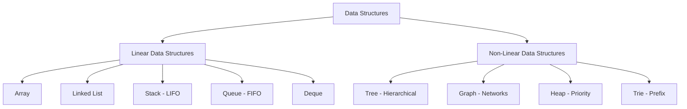
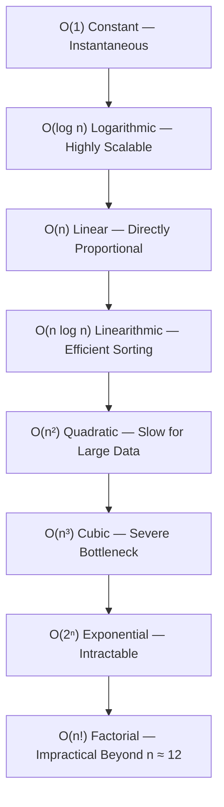

# ⏱️ DSA — Data Types, Classification, Time & Space Complexity

> A complete foundational and senior-level interview preparation guide covering Data Types, Primitive vs. Non-Primitive representations, Linear vs. Non-Linear Data Structures, Time Complexity, Space Complexity, Big-O analysis, and production engineering trade-offs.

---

## 📑 Table of Contents

- [PART 1 — DATA TYPES & DATA STRUCTURES CLASSIFICATION](#part-1--data-types--data-structures-classification)
  - [1. What is a Data Type?](#1-what-is-a-data-type)
  - [2. Primitive Data Types](#2-primitive-data-types)
  - [3. Non-Primitive Data Types](#3-non-primitive-data-types)
  - [4. Primitive vs. Non-Primitive Comparison](#4-primitive-vs-non-primitive-comparison)
    - [Crucial Kotlin & Java JVM Nuance (Boxing)](#crucial-kotlin--java-jvm-nuance-boxing)
  - [5. Data Structures Classification Overview](#5-data-structures-classification-overview)
  - [6. Linear Data Structures](#6-linear-data-structures)
    - [Array](#array)
    - [Linked List](#linked-list)
    - [Stack (LIFO)](#stack-lifo)
    - [Queue (FIFO)](#queue-fifo)
  - [7. Non-Linear Data Structures](#7-non-linear-data-structures)
    - [Tree (Hierarchical)](#tree-hierarchical)
    - [Graph (Network Relationships)](#graph-network-relationships)
    - [Heap (Priority Ordering)](#heap-priority-ordering)
  - [8. Complete Classification Mental Model](#8-complete-classification-mental-model)
  - [9. Crucial Distinction: Data Types vs. Data Structures](#9-crucial-distinction-data-types-vs-data-structures)
- [PART 2 — ASYMPTOTIC COMPLEXITY & BIG-O ANALYSIS](#part-2--asymptotic-complexity--big-o-analysis)
  - [10. Introduction & What is Complexity?](#10-introduction--what-is-complexity)
  - [11. What is Time Complexity?](#11-what-is-time-complexity)
  - [12. What is Space Complexity?](#12-what-is-space-complexity)
  - [13. Time Complexity vs. Space Complexity](#13-time-complexity-vs-space-complexity)
  - [14. Input Size (n)](#14-input-size-n)
  - [15. Big-O Notation & Growth Hierarchy](#15-big-o-notation--growth-hierarchy)
  - [16. Detailed Complexity Growth Rates](#16-detailed-complexity-growth-rates)
    - [O(1) — Constant Complexity](#o1--constant-complexity)
    - [O(n) — Linear Complexity](#on--linear-complexity)
    - [O(n²) — Quadratic Complexity](#on--quadratic-complexity)
    - [O(log n) — Logarithmic Complexity](#olog-n--logarithmic-complexity)
    - [O(n log n) — Linearithmic Complexity](#on-log-n--linearithmic-complexity)
    - [O(2ⁿ) — Exponential Complexity](#o2--exponential-complexity)
    - [O(n!) — Factorial Complexity](#on--factorial-complexity)
  - [17. Mathematical Foundations: Dropping Constants & Lower-Order Terms](#17-mathematical-foundations-dropping-constants--lower-order-terms)
  - [18. How to Calculate Time Complexity Step-by-Step](#18-how-to-calculate-time-complexity-step-by-step)
  - [19. Sequential vs. Nested Loops (O(n × m) Gotcha)](#19-sequential-vs-nested-loops-on--m-gotcha)
  - [20. Space Complexity: Auxiliary vs. Input Space](#20-space-complexity-auxiliary-vs-input-space)
  - [21. Time-Space Trade-Offs in Production](#21-time-space-trade-offs-in-production)
  - [22. Best Case, Average Case, and Worst Case Bounds](#22-best-case-average-case-and-worst-case-bounds)
- [PART 3 — COMPLETE INTERVIEW QUESTIONS & ANSWERS](#part-3--complete-interview-questions--answers)
  - [Section A: Data Types & Classification Questions (Q1–Q17)](#section-a-data-types--classification-questions)
  - [Section B: Core Complexity Questions (Q18–Q27)](#section-b-core-complexity-questions)
  - [Section C: Senior & Staff-Level Architectural Questions (Q28–Q37)](#section-c-senior--staff-level-architectural-questions)
- [PART 4 — QUICK REFERENCE & MENTAL MODELS](#part-4--quick-reference--mental-models)
  - [Complexity Analysis Cheat Sheet](#complexity-analysis-cheat-sheet)
  - [Senior Interview Mindset & Mental Model](#senior-interview-mindset--mental-model)
  - [10 Quick Rules to Remember](#10-quick-rules-to-remember)
  - [Final 60-Second Interview Definition](#final-60-second-interview-definition)

---

# PART 1 — DATA TYPES & DATA STRUCTURES CLASSIFICATION

Before analyzing algorithmic performance, we must understand the memory representations of the data being processed.

---

## 1. What is a Data Type?

### Definition

> **A data type defines the classification of a value, the memory footprint and binary representation allocated for it, and the set of valid operations that can be performed on it.**

For example:

```kotlin
val age: Int = 25            // 32-bit signed integer
val name: String = "Raj"     // Reference to character sequence
val isActive: Boolean = true // 1-bit logical truth value
```

At the highest level, data types are divided into:

```text
                         Data Types
                             │
              ┌──────────────┴──────────────┐
          Primitive                    Non-Primitive
              │                             │
       Basic single values        Collections / Objects
```

---

## 2. Primitive Data Types

### Definition

> **Primitive data types are fundamental, scalar building blocks provided directly by the programming language or runtime, storing a single raw value directly in memory.**

Standard categories:
* **Integer types:** `Byte` (8-bit), `Short` (16-bit), `Int` (32-bit), `Long` (64-bit)
* **Floating-point types:** `Float` (32-bit), `Double` (64-bit)
* **Character type:** `Char` (16-bit Unicode)
* **Boolean type:** `Boolean` (`true` / `false`)

```kotlin
val age: Int = 25
val salary: Double = 50000.0
val grade: Char = 'A'
val active: Boolean = true
```

In low-level execution, primitive values reside directly on the **execution stack** (within thread activation frames) rather than requiring heap allocation and pointer dereferencing.

---

## 3. Non-Primitive Data Types

### Definition

> **Non-primitive (reference / composite) data types are higher-level structures composed of primitive types and other objects, capable of storing collections of values or complex state.**

Standard examples:
* `String`
* `Array`
* Classes and Objects
* `List`, `Set`, `Map`
* Linked Lists, Trees, Heaps, Graphs

```kotlin
val numbers = arrayOf(10, 20, 30, 40)

data class User(
    val id: Int,
    val name: String,
    val age: Int
)
```

Non-primitive entities are allocated on the **heap**, and variables store a **memory reference (pointer)** to that heap location.

---

## 4. Primitive vs. Non-Primitive Comparison

| Dimension | Primitive Data Types | Non-Primitive (Reference) Data Types |
|---|---|---|
| **Value Representation** | Holds a single scalar value | Can hold multiple values or complex state |
| **Memory Allocation** | Typically on the **Stack** | Stored on the **Heap**; variable holds a reference |
| **Default Value** | Has defined defaults (e.g., `0`, `false`) | Defaults to `null` if uninitialized |
| **Memory Overhead** | Minimal (exact bits: 8, 16, 32, 64) | Object header (8–16 bytes) + padding + pointer |
| **Nullability** | In Java, cannot be `null` | Can reference `null` |
| **Examples** | `int`, `double`, `char`, `boolean` | `String`, `Array`, `HashMap`, custom classes |

### Crucial Kotlin & Java JVM Nuance (Boxing)

> **Interview Caution:** In Java, primitives (`int`, `boolean`) and reference wrappers (`Integer`, `Boolean`) have distinct syntax. In Kotlin, everything is presented as an object (`Int`, `Boolean`, `Double`).
>
> However, the **Kotlin compiler automatically optimizes non-nullable types to JVM primitives (`int`)** wherever possible to eliminate heap boxing overhead. When a type is nullable (`Int?`) or used as a generic parameter (`List<Int>`), the compiler automatically boxes it into `java.lang.Integer`.

---

## 5. Data Structures Classification Overview

While **data types** describe what kind of value a variable stores, **data structures** describe how multiple data elements are organized and related in memory.



---

## 6. Linear Data Structures

### Definition

> **A linear data structure arranges elements in a single sequential order, where every element (except the first and last) has a unique predecessor and successor.**

### Array
An array stores elements of identical type in a **contiguous memory block** accessed via zero-based indices.
```text
Index:     0      1      2      3
Value:   [ 10 ] [ 20 ] [ 30 ] [ 40 ]
```
* **Indexed Access:** $O(1)$ directly computed via $\text{BaseAddress} + (\text{index} \times \text{size})$.
* **Search (Unsorted):** $O(n)$.
* **Insertion / Deletion:** $O(n)$ due to shifting elements.

### Linked List
A linked list consists of independent node objects connected through memory pointers/references.
```text
[ Data: 10 | Next: ──> ] [ Data: 20 | Next: ──> ] [ Data: 30 | Next: null ]
```
```kotlin
class Node(val data: Int, var next: Node? = null)
```
* **Insertion / Deletion at known node:** $O(1)$.
* **Search / Access:** $O(n)$ (sequential pointer traversal).

### Stack (LIFO)
A stack is a linear container enforcing **Last In, First Out (LIFO)**.
* **Operations:** `push()`, `pop()`, `peek()` — all $O(1)$.
* **Applications:** JVM Call Stack, undo/redo, parenthesis matching, DFS.

### Queue (FIFO)
A queue is a linear container enforcing **First In, First Out (FIFO)**.
* **Operations:** `enqueue()`, `dequeue()`, `peek()` — all $O(1)$.
* **Applications:** Task scheduling, BFS, rate limiters, message queues.

---

## 7. Non-Linear Data Structures

### Definition

> **A non-linear data structure organizes elements with branching, hierarchical, or interconnected relationships, where an element can connect to multiple other elements.**

### Tree (Hierarchical)
An acyclic, hierarchical collection of nodes with a single root.
* **Components:** Root, Parent, Child, Leaf, Edges.
* **Applications:** DOM & View hierarchies, file systems, database indexing ($B$-Trees, $B+$-Trees), BSTs ($O(\log n)$ search).

### Graph (Network Relationships)
A collection of **Vertices (Nodes)** connected by **Edges**.
* **Classifications:** Directed vs. Undirected, Weighted vs. Unweighted, Cyclic vs. Acyclic (DAG).
* **Applications:** Social networks, road maps (Dijkstra), task dependency graphs.

### Heap (Priority Ordering)
A complete binary tree satisfying the **heap property**:
* **Min-Heap:** Parent $\le$ children (root is minimum).
* **Max-Heap:** Parent $\ge$ children (root is maximum).
* **Root Access:** $O(1)$ for min/max.
* **Insert / Extract:** $O(\log n)$. Used to implement **Priority Queues**.

---

## 8. Complete Classification Mental Model

```text
                               DATA
                                │
                         Data Types
                                │
              ┌─────────────────┴─────────────────┐
          Primitive                          Non-Primitive
              │                                   │
      Int, Boolean, Char,                  String, Array, Objects,
      Float, Double, Long                  Collections
                                                  │
                                          Data Structures
                                                  │
                                  ┌───────────────┴───────────────┐
                               Linear                         Non-Linear
                                  │                               │
                       ┌──────────┴──────────┐         ┌──────────┴──────────┐
                     Array                 Queue      Tree                 Graph
                     LinkedList            Deque      Heap                 Trie
                     Stack
```

---

## 9. Crucial Distinction: Data Types vs. Data Structures

| Dimension | Data Type | Data Structure |
|---|---|---|
| **Core Question** | *"What kind of value is this?"* | *"How are multiple values organized & related?"* |
| **Scope** | Single variable or raw value representation | Spatial arrangement and traversal topology |
| **Classification** | **Primitive vs. Non-Primitive** | **Linear vs. Non-Linear** |
| **Examples** | `Int`, `Double`, `String`, `Boolean` | `Array`, `LinkedList`, `Tree`, `Graph`, `Heap` |

---

# PART 2 — ASYMPTOTIC COMPLEXITY & BIG-O ANALYSIS

---

## 10. Introduction & What is Complexity?

When solving an algorithmic problem, correctness is only the baseline. In production systems, we must critically evaluate:
* How efficiently does the solution execute under load?
* How much memory does it allocate?
* How does performance degrade when the input size explodes ($100 \to 10,000,000$)?
* What are the engineering trade-offs between execution speed and memory consumption?

> **Complexity is an asymptotic mathematical framework used to analyze the computational resources (CPU time and memory space) required by an algorithm as a function of its input size.**

```text
                Algorithm
                    │
         ┌──────────┴──────────┐
         │                     │
  Time Complexity       Space Complexity
         │                     │
  CPU Operations        Memory Allocated
```

---

## 11. What is Time Complexity?

### Definition

> **Time complexity quantifies how the number of fundamental computational operations performed by an algorithm scales with respect to the input size ($n$).**

Time complexity does **not** measure wall-clock seconds because physical execution time fluctuates depending on:
* CPU architecture and clock frequency
* RAM speed and bus bandwidth
* Operating system scheduling and system load
* Compiler optimizations (JIT compilation, loop unrolling)
* Language runtime and Garbage Collection (GC) pauses

Instead, we analyze how the operation count scales asymptotically as $n$ grows:

```text
n = 10
n = 100
n = 1,000
n = 1,000,000
```

If operations scale directly proportional to $n$, the algorithm is **$O(n)$ (Linear)**.

---

## 12. What is Space Complexity?

### Definition

> **Space complexity measures how the total memory requirements of an algorithm scale as a function of the input size ($n$).**

```kotlin
fun printNumbers(numbers: IntArray) {
    for (number in numbers) {
        println(number)
    }
}
```

The function allocates only a single iteration variable (`number`). It does not construct any data structures proportional to $n$.
Therefore, its **auxiliary space complexity is $O(1)$ (Constant)**.

---

## 13. Time Complexity vs. Space Complexity

| Dimension | Time Complexity | Space Complexity |
|---|---|---|
| **Measures** | How fundamental CPU operations scale | How memory consumption scales |
| **Physical Resource** | CPU cycles & instruction execution | RAM & heap/stack memory |
| **Growth Unit** | Instruction count relative to $n$ | Memory bytes relative to $n$ |

### Example Trade-off

```text
Algorithm A (In-Place Search)
Time  ──> O(n)
Space ──> O(1)

Algorithm B (Hash Table Index)
Time  ──> O(1) average
Space ──> O(n)
```

Algorithm B trades additional heap memory ($O(n)$) to achieve near-instantaneous ($O(1)$) lookups.

---

## 14. Input Size (n)

Complexity is expressed in terms of the input size, conventionally denoted as **$n$**.

```kotlin
val array = intArrayOf(10, 20, 30, 40, 50) // n = 5
```

If the collection holds one million records:
```text
n = 1,000,000
```

Complexity analysis models the mathematical limit of resource usage as $n \to \infty$.

---

## 15. Big-O Notation & Growth Hierarchy

### Definition

> **Big-O notation describes the asymptotic upper bound of an algorithm's growth rate, establishing the worst-case operational ceiling as input size approaches infinity.**

### Asymptotic Hierarchy (Fastest to Slowest)

```text
O(1) < O(log n) < O(n) < O(n log n) < O(n²) < O(n³) < O(2ⁿ) < O(n!)
```



---

## 16. Detailed Complexity Growth Rates

### O(1) — Constant Complexity
* **Definition:** Operational work is completely independent of input size.
* **Example:** `arr[0]`, `map.put()`, `stack.push()`.

### O(n) — Linear Complexity
* **Definition:** Computational work scales in direct 1:1 proportion to input size.
* **Example:** Linear search, single loop across an array.

### O(n²) — Quadratic Complexity
* **Definition:** Work scales proportionally to the square of input size ($n \times n$).
* **Example:** Nested loops, Bubble Sort, Selection Sort.

### O(log n) — Logarithmic Complexity
* **Definition:** Repeatedly divides the search space by a constant factor (typically 2).
* **Example:** Binary Search on sorted data ($\log_2(1,000,000) \approx 20$ operations).

### O(n log n) — Linearithmic Complexity
* **Definition:** Work partitioned across $\log n$ levels where each level processes $n$ items.
* **Example:** Merge Sort, QuickSort (avg), TimSort. Theoretical limit for comparison sorting.

### O(2ⁿ) — Exponential Complexity
* **Definition:** Operations double with every single increment of $n$.
* **Example:** Unmemoized recursive Fibonacci, power-set brute-force.

### O(n!) — Factorial Complexity
* **Definition:** Work grows with the permutations of $n$ ($n! = n \times (n-1) \times \dots \times 1$).
* **Example:** Brute-force Traveling Salesperson, generating all permutations. Intractable for $n > 12$.

---

## 17. Mathematical Foundations: Dropping Constants & Lower-Order Terms

### Why We Ignore Constants
$$O(2n) \to O(n)$$
$$O(50n) \to O(n)$$
As $n \to \infty$, scalar multiples do not alter the fundamental growth curve. Big-O categorizes the **rate of growth**, not machine cycle counts.

### Why We Drop Lower-Order Terms
$$f(n) = n^2 + 100n + 500 \implies O(n^2)$$
For $n = 1,000,000$, $n^2$ represents $10^{12}$ operations, while $100n = 10^8$. The $n^2$ term accounts for $99.99\%$ of the work.

---

## 18. How to Calculate Time Complexity Step-by-Step

A disciplined 4-step framework:

```text
Step 1: Identify Input Size (n)
               ↓
Step 2: Inspect Loops & Recursion Depth
               ↓
Step 3: Combine Sequential Blocks (Addition: Drop Constants)
               ↓
Step 4: Combine Nested Blocks (Multiplication: n × m)
```

---

## 19. Sequential vs. Nested Loops (O(n × m) Gotcha)

### Sequential Loops (Addition)
```kotlin
for (i in 0 until n) { /* work */ } // O(n)
for (j in 0 until n) { /* work */ } // O(n)
```
$$\text{Total} = O(n + n) = O(2n) \to \mathbf{O(n)}$$

### Nested Loops Over Same Input (Multiplication)
```kotlin
for (i in 0 until n) {
    for (j in 0 until n) { /* work */ }
}
```
$$\text{Total} = O(n \times n) \to \mathbf{O(n^2)}$$

### Nested Loops Over Different Inputs
```kotlin
for (i in 0 until n) {
    for (j in 0 until m) { /* work */ }
}
```
$$\text{Total} = \mathbf{O(n \times m)}$$
> **Senior Gotcha:** Do **not** call this $O(n^2)$ unless $m \approx n$. If $m$ is a constant ($m = 5$), the complexity is $O(5n) \to O(n)$.

---

## 20. Space Complexity: Auxiliary vs. Input Space

Always clarify this distinction during technical interviews:
* **Input Space:** Memory occupied by the problem inputs passed to the function.
* **Auxiliary Space:** **Extra or temporary memory** allocated by the algorithm outside the inputs.

```kotlin
fun process(numbers: IntArray) { // Input Space: O(n)
    val visited = BooleanArray(numbers.size) // Auxiliary Space: O(n)
}
```

---

## 21. Time-Space Trade-Offs in Production

> **A time-space trade-off occurs when an engineer allocates additional memory to reduce algorithmic execution time, or accepts higher CPU cycles to conserve restricted memory.**

**Production Example:** In-Memory Caching (Redis / Guava Cache) & Bloom Filters. Storing pre-computed responses consumes server RAM ($O(n)$ space) but drops database query latency from hundreds of milliseconds to $O(1)$ microseconds.

---

## 22. Best Case, Average Case, and Worst Case Bounds

| Case | Formal Notation | Meaning | Linear Search Example |
|---|---|---|---|
| **Best Case** | $\Omega$ (Big-Omega) | Most favorable input distribution | Target at index 0 $\to \Omega(1)$ |
| **Average Case** | $\Theta$ (Big-Theta) | Expected behavior across all inputs | Target in middle $\to \Theta(n/2) \to \Theta(n)$ |
| **Worst Case** | $O$ (Big-O) | Maximum possible work required | Target at end or missing $\to O(n)$ |

> **Interview Standard:** Always default to quoting **worst-case Big-O** unless specifically asked for average or amortized performance.

---

# PART 3 — COMPLETE INTERVIEW QUESTIONS & ANSWERS

---

## Section A: Data Types & Classification Questions

### Q1. What is a Data Type? `[Junior]`
**Answer:**
A data type is an attribute of data that tells the compiler or interpreter how the programmer intends to use the data. It defines the format, memory size, internal representation, and allowable operations on that data.

---

### Q2. What are Primitive Data Types? `[Junior]`
**Answer:**
Primitive data types are basic types provided directly by the programming language to hold single, fundamental values (e.g., integers, booleans, floating-point numbers, characters). They do not have methods or internal structural components.

---

### Q3. What are Non-Primitive Data Types? `[Junior]`
**Answer:**
Non-primitive (reference or composite) data types are user-defined or language-provided complex types that can hold collections of values, objects, or multiple fields. Examples include arrays, classes, strings, and collections.

---

### Q4. What is the fundamental difference between Primitive and Non-Primitive types? `[Junior]`
**Answer:**
Primitive types hold raw scalar values directly (typically on the thread stack), whereas non-primitive types hold memory references (pointers) to heap-allocated objects and can store multiple attributes.

---

### Q5. What is a Linear Data Structure? `[Junior]`
**Answer:**
A data structure where elements are arranged sequentially in a single line or list. Each element has a unique predecessor and successor (except endpoints). Examples: Array, Linked List, Stack, Queue.

---

### Q6. What is a Non-Linear Data Structure? `[Junior]`
**Answer:**
A data structure where elements are arranged hierarchically or as an interconnected network, meaning an element can connect to multiple elements. Examples: Tree, Graph, Heap, Trie.

---

### Q7. Compare Linear vs. Non-Linear structures. `[Mid]`
**Answer:**
* **Traversal:** Linear structures can be traversed in a single pass ($O(n)$ sequential scan). Non-linear structures require multi-directional or recursive traversals (pre-order, in-order, post-order, BFS, DFS).
* **Relationship:** 1-to-1 in linear; 1-to-many (hierarchical tree) or many-to-many (graph network) in non-linear.
* **Memory Topology:** Contiguous arrays or linear chains vs. branched pointer graphs.

---

### Q8. Is an Array a primitive data type? `[Mid]`
**Answer:**
**No.** An array is a non-primitive composite data structure because it represents an ordered collection of values and has an object identity on the heap. In Kotlin, `IntArray` or `Array<Int>` are objects on the JVM, though `IntArray` stores unboxed primitive `int[]` values internally.

---

### Q9. Is `String` a primitive type in Java or Kotlin? `[Mid]`
**Answer:**
`String` is **non-primitive**. In Java, `java.lang.String` is an immutable class whose instance is allocated on the heap (or the String Pool). In Kotlin, `String` is similarly an object reference. It represents an array/sequence of characters with methods and properties.

---

### Q10. Why is a Linked List linear even though nodes are scattered across the heap? `[Senior]`
**Answer:**
Because linearity is a **logical ordering concept**, not a physical hardware constraint. Each node in a linked list has exactly one logical next element (and one previous element in a doubly linked list), forming a strictly sequential 1-to-1 relationship.

---

### Q11. Is a Stack linear or non-linear? `[Junior]`
**Answer:**
A Stack is linear because elements are ordered sequentially according to arrival time, even though access is restricted to the top element via LIFO.

---

### Q12. Is a Queue linear or non-linear? `[Junior]`
**Answer:**
A Queue is linear because elements follow a sequential order from front to rear based on FIFO processing.

---

### Q13. Is a Tree linear or non-linear? `[Junior]`
**Answer:**
A Tree is non-linear because a parent node branches out to multiple child nodes, forming a 1-to-many hierarchical relationship that cannot be represented as a single linear sequence.

---

### Q14. Is a Graph linear or non-linear? `[Junior]`
**Answer:**
A Graph is non-linear because vertices connect to multiple arbitrary vertices via edges, forming a many-to-many network topology.

---

### Q15. What is an Abstract Data Type (ADT) vs. a Data Structure? `[Senior]`
**Answer:**
* **ADT (Abstract Data Type):** The mathematical specification of what operations can be performed and their behavior, with zero implementation details (e.g., `Stack`, `Queue`, `Map`, `Set`).
* **Data Structure:** The concrete physical implementation of that ADT in code and memory (e.g., implementing the `Stack` ADT using an `Array` or a `DoublyLinkedList`).

---

### Q16. Can one data structure be implemented using another? Give concrete examples. `[Senior]`
**Answer:**
Yes, high-level structures are almost universally constructed from lower-level structures:
1. **Stack ADT** implemented using a dynamic array (`ArrayDeque`) or singly linked list.
2. **Queue ADT** implemented using circular arrays or two Stacks.
3. **Priority Queue ADT** implemented using a Binary Heap array.
4. **HashMap** implemented using an array of Linked Lists and Red-Black Trees.

---

### Q17. Why is the classification of data structures critical in software architecture? `[Senior]`
**Answer:**
The structural classification dictates the **natural access patterns and operational bounds** of the data:
* When data represents an ordered stream, event journal, or sequential pipeline, a **linear structure** (Array, Deque) guarantees $O(1)$ appends and sequential cache locality.
* When data represents containment or taxonomy (DOM, organizational chart, file folders), a **Tree** provides natural recursion and $O(\log n)$ search.
* When data represents arbitrary networks with cycles (social graphs, road routing, dependency managers), only a **Graph** can model many-to-many relationships without loss of topology.

---

## Section B: Core Complexity Questions

### Q18. What is Time Complexity? `[Junior]`
**Answer:**
Time complexity measures how the number of fundamental computational operations performed by an algorithm scales as the input size ($n$) increases. It evaluates algorithmic scalability independent of hardware, language runtime, or compiler optimizations.

---

### Q19. What is Space Complexity? `[Junior]`
**Answer:**
Space complexity measures the total memory required by an algorithm as a function of the input size. In interviews, we distinguish between total space (including inputs) and **auxiliary space** (extra memory allocated for data structures and stack frames).

---

### Q20. What is Big-O Notation? `[Junior]`
**Answer:**
Big-O notation is a mathematical metric that describes the asymptotic upper bound (worst-case ceiling) of an algorithm's growth rate as input size approaches infinity.

---

### Q21. What is the difference between Time and Space Complexity? `[Junior]`
**Answer:**
Time complexity measures CPU operations and instruction growth; space complexity measures RAM allocation, heap objects, and call-stack frame growth.

---

### Q22. What does $O(1)$ mean? `[Junior]`
**Answer:**
$O(1)$ denotes constant complexity, meaning operational work does not grow when the input size increases. Example: accessing an array element by index (`arr[0]`).

---

### Q23. What does $O(n)$ mean? `[Junior]`
**Answer:**
$O(n)$ denotes linear complexity, where computational work grows directly and proportionally with input size. Example: a single loop scanning an unsorted array.

---

### Q24. What does $O(\log n)$ mean? `[Junior]`
**Answer:**
$O(\log n)$ denotes logarithmic complexity, where the search space is divided by a constant factor at each step. Example: Binary Search.

---

### Q25. What does $O(n^2)$ mean? `[Junior]`
**Answer:**
$O(n^2)$ denotes quadratic complexity, where operations scale with the square of the input size. Example: two nested loops iterating over the same $n$ elements.

---

### Q26. Why is $O(\log n)$ generally better than $O(n)$? `[Junior]`
**Answer:**
As $n$ becomes large, logarithmic growth increases exponentially slower than linear growth. For $n = 1,000,000$, $O(\log_2 n) \approx 20$ operations, whereas $O(n)$ takes $1,000,000$ operations.

---

### Q27. Why is $O(n \log n)$ preferred over $O(n^2)$? `[Junior]`
**Answer:**
For $n = 100,000$:
* $n \log_2 n \approx 1,700,000$ operations.
* $n^2 = 10,000,000,000$ operations.
$O(n \log n)$ scales efficiently for large-scale data, which is why standard library sort functions use $O(n \log n)$ algorithms.

---

## Section C: Senior & Staff-Level Architectural Questions

### Q28. Is an $O(1)$ algorithm always faster than an $O(n)$ algorithm? `[Senior]`
**Answer:**
**Not necessarily.** Big-O describes asymptotic scalability as $n \to \infty$, not absolute run time for small inputs. An $O(1)$ algorithm with a huge constant factor ($c = 10,000$) will be slower than an $O(n)$ algorithm for $n < 10,000$. Big-O wins only when input size exceeds the cross-over threshold.

---

### Q29. Can two algorithms have the same Big-O complexity but dramatically different real-world performance? `[Senior]`
**Answer:**
**Yes.** Two algorithms can both be $O(n)$ while performing very differently due to:
1. **Constant Factors:** One does 2 comparisons per loop; the other does 50.
2. **Memory Access & Cache Locality:** Scanning a contiguous array exhibits spatial locality (L1/L2 cache hits). Chasing pointers in a linked list triggers CPU cache misses.
3. **Branch Prediction:** Predictable conditional branches run faster than unpredictable data-dependent branches.
4. **Memory Allocation & GC Pressure:** Creating millions of objects creates GC pause latency.

---

### Q30. Is the algorithm with the lowest time complexity always the optimal engineering choice? `[Senior]`
**Answer:**
**No.** Architecture is about balancing trade-offs:
* **Code Complexity & Maintainability:** A simple $O(n)$ solution may be far more maintainable than a complex $O(\log n)$ balanced tree.
* **Memory Limits:** An $O(1)$ time algorithm might consume gigabytes of RAM.
* **Concurrency:** Lock contention in concurrent structures can eliminate theoretical Big-O advantages.
* **Input Distribution:** If production $n$ is guaranteed to be $\le 50$, an $O(n^2)$ algorithm with zero memory overhead may outperform an $O(n \log n)$ algorithm.

---

### Q31. What is a Time-Space Trade-Off? Give a production example. `[Senior]`
**Answer:**
A time-space trade-off involves using extra memory to minimize CPU execution latency, or accepting extra computation to keep memory footprint bounded.

**Production Example:** In-memory caching (Redis / Guava Cache) or Bloom Filters. Storing pre-computed responses consumes server RAM ($O(n)$ space) but drops database query latency from hundreds of milliseconds to $O(1)$ microseconds.

---

### Q32. What is Amortized Complexity? `[Senior]`
**Answer:**
Amortized analysis calculates the average cost of an operation over a continuous sequence of operations, guaranteeing that the aggregate cost is bounded even if an occasional single operation is expensive.

**Classic Example:** Resizing in `ArrayList`:
* Appending an item is usually $O(1)$.
* When the buffer fills, it allocates an array of size $2N$ and copies elements ($O(N)$).
* Because capacity doubles exponentially, inserting $N$ items takes only $O(N)$ total copy operations.
* Amortized cost per append = $O(N) / N = \mathbf{O(1)}$.

---

### Q33. Worst-Case vs. Average-Case Complexity in Hash Tables. `[Mid]`
**Answer:**
* **Average Case:** With a uniform hash distribution, `HashMap.get()` is $O(1)$.
* **Worst Case:** If all keys hash to the same bucket (hash flooding attack or pathological keys), traditional chaining degrades to a linked list ($O(n)$). In modern Java (Java 8+), buckets treeify into Red-Black trees, bounding worst-case lookup to $O(\log n)$.

---

### Q34. Why do engineers analyze Big-O instead of benchmarking execution time? `[Mid]`
**Answer:**
Physical execution times are machine-dependent, influenced by CPU clock speeds, background OS processes, memory architecture, and compiler versions. Big-O provides a universal, hardware-agnostic mathematical model to compare algorithms purely based on their fundamental growth rate.

---

### Q35. How do you analyze an algorithm's complexity during a live interview? `[Senior]`
**Answer:**
1. Identify the input variable ($n$, $m$).
2. Analyze loop structures (single vs. nested).
3. Evaluate recursive depth and call-tree branching factor.
4. Account for helper function calls and library operations (`contains`, `sort`, `substring`).
5. Calculate auxiliary memory allocated in heap structures and the JVM call stack.
6. Summarize both worst-case Time Complexity and Auxiliary Space Complexity with justification.

---

### Q36. What is more important in production: Time Complexity or Space Complexity? `[Senior]`
**Answer:**
Neither is universally more important; the choice is determined by system constraints and SLAs:
* In low-latency user interfaces or trading systems, **Time Complexity** is paramount.
* In embedded devices, mobile apps, or memory-constrained serverless containers, **Space Complexity** is critical to avoid OutOfMemory (OOM) crashes and excessive GC thrashing.

---

### Q37. How do you systematically optimize an algorithmic bottleneck? `[Senior]`
**Answer:**
1. Profile first to confirm the true bottleneck (avoid premature optimization).
2. Look for redundant calculations (introduce caching, memoization, or prefix sums).
3. Eliminate inner linear scans ($O(n)$) by using hash maps, sets, or two pointers.
4. Prune unnecessary search branches in recursion (backtracking / dynamic programming).
5. Verify that optimizations do not introduce unmanageable code complexity or GC pressure.

---

# PART 4 — QUICK REFERENCE & MENTAL MODELS

---

## Complexity Analysis Cheat Sheet

| Complexity | Name | Sample Algorithm | $n = 10^6$ Ops | Scalability Verdict |
|---|---|---|---|---|
| **$O(1)$** | Constant | Hash map lookup, array indexing | 1 | **Optimal** |
| **$O(\log n)$** | Logarithmic | Binary Search, BST lookup | ~20 | **Exceptional** |
| **$O(n)$** | Linear | Array scan, counting | $10^6$ | **Scalable** |
| **$O(n \log n)$** | Linearithmic | Merge Sort, QuickSort, TimSort | $\approx 2 \times 10^7$ | **Practical limit for large data** |
| **$O(n^2)$** | Quadratic | Bubble sort, nested loops | $10^{12}$ | **Fails for $n > 10,000$** |
| **$O(n^3)$** | Cubic | Matrix multiplication (standard) | $10^{18}$ | **Fails for $n > 1,000$** |
| **$O(2^n)$** | Exponential | Recursive Fibonacci, power set | $\approx 10^{300,000}$ | **Intractable for $n > 30$** |
| **$O(n!)$** | Factorial | Generating permutations, TSP | $\infty$ | **Intractable for $n > 12$** |

---

## Senior Interview Mindset & Mental Model

In a senior-level interview, never just state:
> ❌ *"The time complexity is O(n)."*

Demonstrate computational reasoning by explaining the derivation:
> ✅ *"The algorithm iterates through the collection once, performing constant-time hash map insertions at each step. Therefore, the total number of operations scales linearly with input size, yielding **$O(n)$ time complexity**. Since we store at most $n$ distinct elements in the map, the **auxiliary space complexity is $O(n)$**."*

```text
Code Structure ──> Operations Count ──> Asymptotic Curve ──> Big-O Time & Space ──> Trade-off Justification
```

---

## 10 Quick Rules to Remember

1. **Single Loop:** $O(n)$
2. **Two Nested Loops over same input:** $O(n^2)$
3. **Three Nested Loops:** $O(n^3)$
4. **Sequential Non-Nested Loops:** $O(n) + O(n) = O(2n) \to \mathbf{O(n)}$
5. **Nested Loops over different inputs:** $\mathbf{O(n \times m)}$ (Do *not* assume $O(n^2)$)
6. **Halving the search space each step:** $\mathbf{O(\log n)}$
7. **Divide-and-conquer processing all elements:** $\mathbf{O(n \log n)}$
8. **Auxiliary collection scaling with input:** $\mathbf{O(n)}$ auxiliary space
9. **Fixed primitive variables:** $\mathbf{O(1)}$ auxiliary space
10. **Always evaluate constraints:** $n$, memory limits, p99 latency SLA, and concurrency.

---

## Final 60-Second Interview Definition

If asked: *"Explain data types, data structures, and time and space complexity."*

> *"Data types define the representation and operations of individual values, classified into primitives (scalar stack values) and non-primitives (heap objects). Data structures define how multiple elements are organized, classified into Linear (Arrays, Lists, Stacks, Queues) and Non-Linear (Trees, Graphs, Heaps).*
>
> *Time complexity measures how CPU operations scale as input size grows, while space complexity measures auxiliary memory growth. We use Big-O to reason about worst-case scalability independently of physical hardware.*
>
> *In production engineering, lowest Big-O is not the only metric—we evaluate constant factors, CPU cache locality, GC pressure, and time-space trade-offs to select the most reliable, maintainable, and scalable architecture."*
