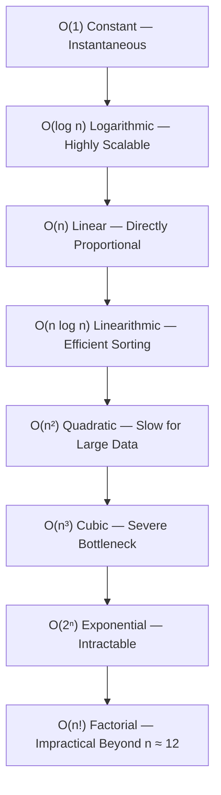

# ⏱️ DSA — Time and Space Complexity

> Complete foundational and senior-level interview preparation guide on Time Complexity, Space Complexity, Big-O analysis, asymptotic growth, and real-world engineering trade-offs.

---

## 📑 Table of Contents

- [1. Introduction](#1-introduction)
- [2. What is Complexity?](#2-what-is-complexity)
- [3. What is Time Complexity?](#3-what-is-time-complexity)
- [4. What is Space Complexity?](#4-what-is-space-complexity)
- [5. Time Complexity vs. Space Complexity](#5-time-complexity-vs-space-complexity)
- [6. What is Input Size (n)?](#6-what-is-input-size-n)
- [7. Big-O Notation & Growth Hierarchy](#7-big-o-notation--growth-hierarchy)
- [8. O(1) — Constant Complexity](#8-o1--constant-complexity)
- [9. O(n) — Linear Complexity](#9-on--linear-complexity)
- [10. O(n²) — Quadratic Complexity](#10-on--quadratic-complexity)
- [11. O(log n) — Logarithmic Complexity](#11-olog-n--logarithmic-complexity)
- [12. O(n log n) — Linearithmic Complexity](#12-on-log-n--linearithmic-complexity)
- [13. O(2ⁿ) — Exponential Complexity](#13-o2--exponential-complexity)
- [14. O(n!) — Factorial Complexity](#14-on--factorial-complexity)
- [15. Why Do We Ignore Constants?](#15-why-do-we-ignore-constants)
- [16. Why Do We Drop Lower-Order Terms?](#16-why-do-we-drop-lower-order-terms)
- [17. How to Calculate Time Complexity Step-by-Step](#17-how-to-calculate-time-complexity-step-by-step)
- [18. Sequential vs. Nested Loops](#18-sequential-vs-nested-loops)
- [19. Space Complexity Analysis](#19-space-complexity-analysis)
- [20. O(n) Space Complexity](#20-on-space-complexity)
- [21. Time-Space Trade-Off](#21-time-space-trade-off)
- [22. Auxiliary Space vs. Input Space](#22-auxiliary-space-vs-input-space)
- [23. Best Case, Average Case, and Worst Case](#23-best-case-average-case-and-worst-case)
- [24. Core Interview Questions & Answers (Q1–Q10)](#24-core-interview-questions--answers)
- [25. Senior-Level Interview Questions (Q11–Q20)](#25-senior-level-interview-questions)
- [26. Complexity Analysis Cheat Sheet](#26-complexity-analysis-cheat-sheet)
- [27. Senior Interview Mindset & Mental Model](#27-senior-interview-mindset--mental-model)
- [28. 10 Quick Rules to Remember](#28-10-quick-rules-to-remember)
- [29. Final 60-Second Interview Definition](#29-final-60-second-interview-definition)

---

# 1. Introduction

**Data Structures and Algorithms (DSA)** is a foundational pillar of computer science and software engineering.

When solving a programming problem, producing a correct answer is only the baseline. In production systems, we must critically evaluate:

* How efficiently does the solution execute under load?
* How much memory does it allocate?
* How does performance degrade when the input size explodes ($100 \to 10,000,000$)?
* Can the architecture scale horizontally or vertically without latency spikes?
* What are the engineering trade-offs between execution speed and memory consumption?

To answer these questions deterministically, we evaluate algorithms using:
1. **Time Complexity**
2. **Space Complexity**

---

# 2. What is Complexity?

### Definition

> **Complexity is an asymptotic mathematical framework used to analyze the computational resources (CPU time and memory space) required by an algorithm as a function of its input size.**

```text
                Algorithm
                    │
         ┌──────────┴──────────┐
         │                     │
  Time Complexity       Space Complexity
         │                     │
  CPU Operations        Memory Allocated
```

---

# 3. What is Time Complexity?

### Definition

> **Time complexity quantifies how the number of fundamental computational operations performed by an algorithm scales with respect to the input size ($n$).**

Time complexity does **not** measure wall-clock seconds.

Saying *"This function takes 5 milliseconds"* is unscientific because physical execution time fluctuates depending on:
* CPU architecture and clock frequency
* RAM speed and bus bandwidth
* Operating system scheduling and system load
* Compiler optimizations (JIT compilation, loop unrolling)
* Language runtime and Garbage Collection (GC) pauses

Instead, we analyze how the operation count scales asymptotically as $n$ grows:

```text
n = 10
n = 100
n = 1,000
n = 1,000,000
```

If operations scale directly proportional to $n$, the algorithm is **$O(n)$ (Linear)**.

---

# 4. What is Space Complexity?

### Definition

> **Space complexity measures how the total memory requirements of an algorithm scale as a function of the input size ($n$).**

```kotlin
fun printNumbers(numbers: IntArray) {
    for (number in numbers) {
        println(number)
    }
}
```

The function allocates only a single iteration variable (`number`). It does not construct any data structures proportional to $n$.
Therefore, its **auxiliary space complexity is $O(1)$ (Constant)**.

---

# 5. Time Complexity vs. Space Complexity

| Dimension | Time Complexity | Space Complexity |
|---|---|---|
| **Measures** | How fundamental CPU operations scale | How memory consumption scales |
| **Physical Resource** | CPU cycles & instruction execution | RAM & heap/stack memory |
| **Growth Unit** | Instruction count relative to $n$ | Memory bytes relative to $n$ |

### Example Trade-off

```text
Algorithm A (In-Place Search)
Time  ──> O(n)
Space ──> O(1)

Algorithm B (Hash Table Index)
Time  ──> O(1) average
Space ──> O(n)
```

Algorithm B trades additional heap memory ($O(n)$) to achieve near-instantaneous ($O(1)$) lookups.

---

# 6. What is Input Size ($n$)?

Complexity is expressed in terms of the input size, conventionally denoted as **$n$**.

```kotlin
val array = intArrayOf(10, 20, 30, 40, 50) // n = 5
```

If the collection holds one million records:
```text
n = 1,000,000
```

Complexity analysis models the mathematical limit of resource usage as $n \to \infty$.

---

# 7. Big-O Notation & Growth Hierarchy

### Definition

> **Big-O notation describes the asymptotic upper bound of an algorithm's growth rate, establishing the worst-case operational ceiling as input size approaches infinity.**

### Asymptotic Hierarchy (Fastest to Slowest)

```text
O(1) < O(log n) < O(n) < O(n log n) < O(n²) < O(n³) < O(2ⁿ) < O(n!)
```



---

# 8. O(1) — Constant Complexity

### Definition

> **An algorithm has $O(1)$ complexity when its resource consumption remains completely independent of the input size.**

```kotlin
fun getFirst(numbers: IntArray): Int {
    return numbers[0]
}
```

Whether the array contains 10 items or 100,000,000 items, the operation performs a single indexed memory jump.

> **Key Rule:** $O(1)$ does not mean "one CPU instruction." It means execution work **does not scale with $n$**.

---

# 9. O(n) — Linear Complexity

### Definition

> **An algorithm has $O(n)$ complexity when its computational work scales in direct linear proportion to the input size.**

```kotlin
fun findNumber(numbers: IntArray, target: Int): Boolean {
    for (number in numbers) {
        if (number == target) return true
    }
    return false
}
```

* In the worst case (target at the end or absent), every element is inspected:
  * $n = 10 \implies \approx 10$ operations
  * $n = 1,000,000 \implies \approx 1,000,000$ operations

---

# 10. O(n²) — Quadratic Complexity

### Definition

> **An algorithm has $O(n^2)$ complexity when its computational operations scale proportionally to the square of the input size.**

```kotlin
fun printPairs(numbers: IntArray) {
    for (i in numbers.indices) {
        for (j in numbers.indices) {
            println("${numbers[i]}, ${numbers[j]}")
        }
    }
}
```

The outer loop executes $n$ times; for each iteration, the inner loop executes $n$ times:
$$\text{Total Work} = n \times n = n^2 \implies O(n^2)$$

For $n = 100,000$, $n^2 = 10,000,000,000$ operations (freezes single-threaded execution).

---

# 11. O(log n) — Logarithmic Complexity

### Definition

> **An algorithm has $O(\log n)$ complexity when it repeatedly reduces the problem search space by a constant fraction (typically half) at each step.**

Classic example: **Binary Search** on a sorted array:

```text
n = 16 ──> 8 ──> 4 ──> 2 ──> 1 (4 steps = log₂(16))
n = 1,000,000 ──> ~20 comparisons (log₂(10⁶) ≈ 20)
```

```kotlin
fun binarySearch(arr: IntArray, target: Int): Int {
    var low = 0
    var high = arr.size - 1
    while (low <= high) {
        val mid = low + (high - low) / 2
        when {
            arr[mid] == target -> return mid
            arr[mid] < target -> low = mid + 1
            else -> high = mid - 1
        }
    }
    return -1
}
```

> **Requirement:** Logarithmic search requires sorted data or a deterministic ordering property.

---

# 12. O(n log n) — Linearithmic Complexity

### Definition

> **$O(n \log n)$ describes an algorithm where work is partitioned across $\log n$ recursive levels, and each level processes $n$ elements.**

This is the mathematically proven theoretical lower bound for general comparison-based sorting:
* **Merge Sort**
* **Heap Sort**
* **QuickSort (Average Case)**
* **TimSort (Java / Kotlin default)**

```text
Level 1: [                 n items                 ] ──> n operations
Level 2: [     n/2 items     ] [     n/2 items     ] ──> n operations
Level 3: [ n/4 ] [ n/4 ] ...                         ──> n operations
... log₂ n levels total ...
Total Work = n × log₂ n ──> O(n log n)
```

---

# 13. O(2ⁿ) — Exponential Complexity

### Definition

> **An algorithm has exponential complexity when operational work doubles with each additional increment of input size ($n$).**

```kotlin
// Inefficient recursive Fibonacci: O(2ⁿ)
fun fibonacci(n: Int): Int {
    if (n <= 1) return n
    return fibonacci(n - 1) + fibonacci(n - 2)
}
```

* $n = 10 \implies \approx 1,024$ operations
* $n = 30 \implies \approx 1,073,741,824$ operations
* $n = 50 \implies \approx 10^{15}$ operations (takes days)

Exponential growth occurs in unmemoized brute-force recursion and subset generation.

---

# 14. O(n!) — Factorial Complexity

### Definition

> **An algorithm has factorial complexity when work grows proportionally to the permutations of the input size ($n! = n \times (n-1) \times \dots \times 1$).**

Examples:
* Brute-force Traveling Salesperson Problem (TSP).
* Generating all permutations of an array.

| $n$ | Operations ($n!$) |
|---|---|
| $3$ | $6$ |
| $5$ | $120$ |
| $10$ | $3,628,800$ |
| $20$ | $\approx 2.43 \times 10^{18}$ |

Factorial algorithms become computationally intractable for $n > 12$ without aggressive pruning.

---

# 15. Why Do We Ignore Constants?

Consider two algorithms:
* Algorithm 1: $f(n) = 2n$
* Algorithm 2: $g(n) = 50n$

In Big-O analysis:
$$O(2n) \to O(n)$$
$$O(50n) \to O(n)$$

**Why?** As $n$ grows to $10^9$, multiplying by 2 or 50 does not alter the fundamental linear scaling curve. Big-O categorizes the **rate of growth**, not machine-level cycle counts.

---

# 16. Why Do We Drop Lower-Order Terms?

Suppose an algorithm performs:
$$f(n) = n^2 + 100n + 500$$

When $n = 1,000,000$:
* $n^2 = 1,000,000,000,000$ ($10^{12}$)
* $100n = 100,000,000$ ($10^8$)
* $500 = 500$

The $n^2$ term accounts for **99.99%** of the computational work. The lower-order terms become mathematically insignificant:
$$O(n^2 + 100n + 500) \to O(n^2)$$

---

# 17. How to Calculate Time Complexity Step-by-Step

A disciplined 4-step framework:

```text
Step 1: Identify Input Size (n)
               ↓
Step 2: Inspect Loops & Recursion Depth
               ↓
Step 3: Combine Sequential Blocks (Addition: Drop Constants)
               ↓
Step 4: Combine Nested Blocks (Multiplication: n × m)
```

---

# 18. Sequential vs. Nested Loops

### Sequential Loops (Addition)
```kotlin
for (i in 0 until n) { /* work */ } // O(n)
for (j in 0 until n) { /* work */ } // O(n)
```
$$\text{Total} = O(n + n) = O(2n) \to \mathbf{O(n)}$$

### Nested Loops Over Same Input (Multiplication)
```kotlin
for (i in 0 until n) {
    for (j in 0 until n) { /* work */ }
}
```
$$\text{Total} = O(n \times n) \to \mathbf{O(n^2)}$$

### Nested Loops Over Different Inputs
```kotlin
for (i in 0 until n) {
    for (j in 0 until m) { /* work */ }
}
```
$$\text{Total} = \mathbf{O(n \times m)}$$
> **Senior Gotcha:** Do **not** call this $O(n^2)$ unless $m \approx n$. If $m$ is a small constant ($m = 5$), the complexity is $O(5n) \to O(n)$.

---

# 19. Space Complexity Analysis

Space complexity evaluates how memory scales with input size.

```kotlin
fun sum(numbers: IntArray): Int {
    var sum = 0
    for (number in numbers) {
        sum += number
    }
    return sum
}
```
* Variables: `sum`, `number`.
* Count: Constant (2 scalar variables).
* **Auxiliary Space: $O(1)$**.

---

# 20. O(n) Space Complexity

```kotlin
fun copy(numbers: IntArray): IntArray {
    val result = IntArray(numbers.size)
    for (i in numbers.indices) {
        result[i] = numbers[i]
    }
    return result
}
```
* Memory allocated for `result` grows in 1:1 proportion with the size of `numbers`.
* **Space Complexity: $O(n)$**.

---

# 21. Time-Space Trade-Off

### Definition

> **A time-space trade-off occurs when an engineer allocates additional memory to reduce algorithmic execution time, or accepts higher CPU cycles to conserve restricted memory.**

### Practical Comparison: Deduplication

```text
Approach 1: In-Place Sort & Scan
Time  ──> O(n log n)
Space ──> O(1) auxiliary

Approach 2: HashSet Membership
Time  ──> O(n) single pass
Space ──> O(n) memory allocation
```

---

# 22. Auxiliary Space vs. Input Space

Always clarify this distinction during technical interviews:
* **Input Space:** Memory occupied by the problem inputs passed to the function.
* **Auxiliary Space:** **Extra or temporary memory** allocated by the algorithm outside the inputs.

```kotlin
fun process(numbers: IntArray) { // Input Space: O(n)
    val visited = BooleanArray(numbers.size) // Auxiliary Space: O(n)
}
```

---

# 23. Best Case, Average Case, and Worst Case

| Case | Formal Notation | Meaning | Linear Search Example |
|---|---|---|---|
| **Best Case** | $\Omega$ (Big-Omega) | Most favorable input distribution | Target at index 0 $\to \Omega(1)$ |
| **Average Case** | $\Theta$ (Big-Theta) | Expected behavior across all inputs | Target in middle $\to \Theta(n/2) \to \Theta(n)$ |
| **Worst Case** | $O$ (Big-O) | Maximum possible work required | Target at end or missing $\to O(n)$ |

> **Interview Standard:** Always default to quoting **worst-case Big-O** unless specifically asked for average or amortized performance.

---

# 24. Core Interview Questions & Answers

### Q1. What is Time Complexity? `[Junior]`
**Answer:**
Time complexity measures how the number of fundamental computational operations performed by an algorithm scales as the input size ($n$) increases. It evaluates algorithmic scalability independent of hardware, language runtime, or compiler optimizations.

---

### Q2. What is Space Complexity? `[Junior]`
**Answer:**
Space complexity measures the total memory required by an algorithm as a function of the input size. In interviews, we distinguish between total space (including inputs) and **auxiliary space** (extra memory allocated for data structures and stack frames).

---

### Q3. What is Big-O Notation? `[Junior]`
**Answer:**
Big-O notation is a mathematical metric that describes the asymptotic upper bound (worst-case ceiling) of an algorithm's growth rate as input size approaches infinity.

---

### Q4. What is the difference between Time and Space Complexity? `[Junior]`
**Answer:**
Time complexity measures CPU operations and instruction growth; space complexity measures RAM allocation, heap objects, and call-stack frame growth.

---

### Q5. What does $O(1)$ mean? `[Junior]`
**Answer:**
$O(1)$ denotes constant complexity, meaning operational work does not grow when the input size increases. Example: accessing an array element by index (`arr[0]`).

---

### Q6. What does $O(n)$ mean? `[Junior]`
**Answer:**
$O(n)$ denotes linear complexity, where computational work grows directly and proportionally with input size. Example: a single loop scanning an unsorted array.

---

### Q7. What does $O(\log n)$ mean? `[Junior]`
**Answer:**
$O(\log n)$ denotes logarithmic complexity, where the search space is divided by a constant factor at each step. Example: Binary Search.

---

### Q8. What does $O(n^2)$ mean? `[Junior]`
**Answer:**
$O(n^2)$ denotes quadratic complexity, where operations scale with the square of the input size. Example: two nested loops iterating over the same $n$ elements.

---

### Q9. Why is $O(\log n)$ generally better than $O(n)$? `[Junior]`
**Answer:**
As $n$ becomes large, logarithmic growth increases exponentially slower than linear growth. For $n = 1,000,000$, $O(\log_2 n) \approx 20$ operations, whereas $O(n)$ takes $1,000,000$ operations.

---

### Q10. Why is $O(n \log n)$ preferred over $O(n^2)$? `[Junior]`
**Answer:**
For $n = 100,000$:
* $n \log_2 n \approx 1,700,000$ operations.
* $n^2 = 10,000,000,000$ operations.
$O(n \log n)$ scales efficiently for large-scale data, which is why standard library sort functions use $O(n \log n)$ algorithms.

---

# 25. Senior-Level Interview Questions

### Q11. Is an $O(1)$ algorithm always faster than an $O(n)$ algorithm? `[Senior]`
**Answer:**
**Not necessarily.** Big-O describes asymptotic scalability as $n \to \infty$, not absolute run time for small inputs. An $O(1)$ algorithm with a huge constant factor ($c = 10,000$) will be slower than an $O(n)$ algorithm for $n < 10,000$. Big-O wins only when input size exceeds the cross-over threshold.

---

### Q12. Can two algorithms have the same Big-O complexity but dramatically different real-world performance? `[Senior]`
**Answer:**
**Yes.** Two algorithms can both be $O(n)$ while performing very differently due to:
1. **Constant Factors:** One does 2 comparisons per loop; the other does 50.
2. **Memory Access & Cache Locality:** Scanning a contiguous array exhibits spatial locality (L1/L2 cache hits). Chasing pointers in a linked list triggers CPU cache misses.
3. **Branch Prediction:** Predictable conditional branches run faster than unpredictable data-dependent branches.
4. **Memory Allocation & GC Pressure:** Creating millions of objects creates GC pause latency.

---

### Q13. Is the algorithm with the lowest time complexity always the optimal engineering choice? `[Senior]`
**Answer:**
**No.** Architecture is about balancing trade-offs:
* **Code Complexity & Maintainability:** A simple $O(n)$ solution may be far more maintainable than a complex $O(\log n)$ balanced tree.
* **Memory Limits:** An $O(1)$ time algorithm might consume gigabytes of RAM.
* **Concurrency:** Lock contention in concurrent structures can eliminate theoretical Big-O advantages.
* **Input Distribution:** If production $n$ is guaranteed to be $\le 50$, an $O(n^2)$ algorithm with zero memory overhead may outperform an $O(n \log n)$ algorithm.

---

### Q14. What is a Time-Space Trade-Off? Give a production example. `[Senior]`
**Answer:**
A time-space trade-off involves using extra memory to minimize CPU execution latency, or accepting extra computation to keep memory footprint bounded.

**Production Example:** In-memory caching (Redis / Guava Cache) or Bloom Filters. Storing pre-computed responses consumes server RAM ($O(n)$ space) but drops database query latency from hundreds of milliseconds to $O(1)$ microseconds.

---

### Q15. What is Amortized Complexity? `[Senior]`
**Answer:**
Amortized analysis calculates the average cost of an operation over a continuous sequence of operations, guaranteeing that the aggregate cost is bounded even if an occasional single operation is expensive.

**Classic Example:** Resizing in `ArrayList`:
* Appending an item is usually $O(1)$.
* When the buffer fills, it allocates an array of size $2N$ and copies elements ($O(N)$).
* Because capacity doubles exponentially, inserting $N$ items takes only $O(N)$ total copy operations.
* Amortized cost per append = $O(N) / N = \mathbf{O(1)}$.

---

### Q16. Worst-Case vs. Average-Case Complexity in Hash Tables. `[Mid]`
**Answer:**
* **Average Case:** With a uniform hash distribution, `HashMap.get()` is $O(1)$.
* **Worst Case:** If all keys hash to the same bucket (hash flooding attack or pathological keys), traditional chaining degrades to a linked list ($O(n)$). In modern Java (Java 8+), buckets treeify into Red-Black trees, bounding worst-case lookup to $O(\log n)$.

---

### Q17. Why do engineers analyze Big-O instead of benchmarking execution time? `[Mid]`
**Answer:**
Physical execution times are machine-dependent, influenced by CPU clock speeds, background OS processes, memory architecture, and compiler versions. Big-O provides a universal, hardware-agnostic mathematical model to compare algorithms purely based on their fundamental growth rate.

---

### Q18. How do you analyze an algorithm's complexity during a live interview? `[Senior]`
**Answer:**
1. Identify the input variable ($n$, $m$).
2. Analyze loop structures (single vs. nested).
3. Evaluate recursive depth and call-tree branching factor.
4. Account for helper function calls and library operations (`contains`, `sort`, `substring`).
5. Calculate auxiliary memory allocated in heap structures and the JVM call stack.
6. Summarize both worst-case Time Complexity and Auxiliary Space Complexity with justification.

---

### Q19. What is more important in production: Time Complexity or Space Complexity? `[Senior]`
**Answer:**
Neither is universally more important; the choice is determined by system constraints and SLAs:
* In low-latency user interfaces or trading systems, **Time Complexity** is paramount.
* In embedded devices, mobile apps, or memory-constrained serverless containers, **Space Complexity** is critical to avoid OutOfMemory (OOM) crashes and excessive GC thrashing.

---

### Q20. How do you systematically optimize an algorithmic bottleneck? `[Senior]`
**Answer:**
1. Profile first to confirm the true bottleneck (avoid premature optimization).
2. Look for redundant calculations (introduce caching, memoization, or prefix sums).
3. Eliminate inner linear scans ($O(n)$) by using hash maps, sets, or two pointers.
4. Prune unnecessary search branches in recursion (backtracking / dynamic programming).
5. Verify that optimizations do not introduce unmanageable code complexity or GC pressure.

---

# 26. Complexity Analysis Cheat Sheet

| Complexity | Name | Sample Algorithm | $n = 10^6$ Ops | Scalability Verdict |
|---|---|---|---|---|
| **$O(1)$** | Constant | Hash map lookup, array indexing | 1 | **Optimal** |
| **$O(\log n)$** | Logarithmic | Binary Search, BST lookup | ~20 | **Exceptional** |
| **$O(n)$** | Linear | Array scan, counting | $10^6$ | **Scalable** |
| **$O(n \log n)$** | Linearithmic | Merge Sort, QuickSort, TimSort | $\approx 2 \times 10^7$ | **Practical limit for large data** |
| **$O(n^2)$** | Quadratic | Bubble sort, nested loops | $10^{12}$ | **Fails for $n > 10,000$** |
| **$O(n^3)$** | Cubic | Matrix multiplication (standard) | $10^{18}$ | **Fails for $n > 1,000$** |
| **$O(2^n)$** | Exponential | Recursive Fibonacci, power set | $\approx 10^{300,000}$ | **Intractable for $n > 30$** |
| **$O(n!)$** | Factorial | Generating permutations, TSP | $\infty$ | **Intractable for $n > 12$** |

---

# 27. Senior Interview Mindset & Mental Model

In a senior-level interview, never just state:
> ❌ *"The time complexity is O(n)."*

Demonstrate computational reasoning by explaining the derivation:
> ✅ *"The algorithm iterates through the collection once, performing constant-time hash map insertions at each step. Therefore, the total number of operations scales linearly with input size, yielding **$O(n)$ time complexity**. Since we store at most $n$ distinct elements in the map, the **auxiliary space complexity is $O(n)$**."*

```text
Code Structure ──> Operations Count ──> Asymptotic Curve ──> Big-O Time & Space ──> Trade-off Justification
```

---

# 28. 10 Quick Rules to Remember

1. **Single Loop:** $O(n)$
2. **Two Nested Loops over same input:** $O(n^2)$
3. **Three Nested Loops:** $O(n^3)$
4. **Sequential Non-Nested Loops:** $O(n) + O(n) = O(2n) \to \mathbf{O(n)}$
5. **Nested Loops over different inputs:** $\mathbf{O(n \times m)}$ (Do *not* assume $O(n^2)$)
6. **Halving the search space each step:** $\mathbf{O(\log n)}$
7. **Divide-and-conquer processing all elements:** $\mathbf{O(n \log n)}$
8. **Auxiliary collection scaling with input:** $\mathbf{O(n)}$ auxiliary space
9. **Fixed primitive variables:** $\mathbf{O(1)}$ auxiliary space
10. **Always evaluate constraints:** $n$, memory limits, p99 latency SLA, and concurrency.

---

# 29. Final 60-Second Interview Definition

If asked: *"Explain time and space complexity and how you use them in software design."*

> *"Time complexity measures how an algorithm's computational operations scale as the input size grows, while space complexity measures how its memory consumption scales. We use asymptotic Big-O notation to reason about worst-case scalability independently of physical hardware.*
>
> *When designing software, I evaluate loops, recursive depth, and data structure operations to establish complexity bounds. But in production engineering, lowest Big-O is not the only metric—I evaluate constant factors, CPU cache locality, GC pressure, and time-space trade-offs to select the most reliable, maintainable, and scalable architecture."*
