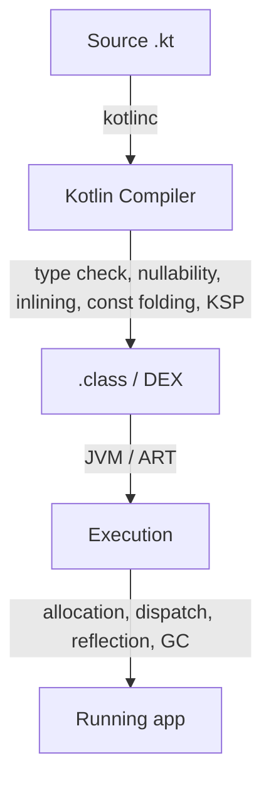

# 🚀 Kotlin Interview Preparation Guide

> **Complete technical reference** — Kotlin from fundamentals to advanced, written for interview preparation.
>
> Every topic follows the same structure: **Definition → Why It Is Used → How It Works Internally → Code Example → Common Pitfalls**.
>
> Updated for **Kotlin 2.x (K2 compiler)**. Android-specific usage lives in [`../Android/`](../Android/); Java fundamentals in [`java.md`](./java.md).

---

## 📚 Table of Contents

| # | Section | Key Topics |
|---|---|---|
| 1 | [Kotlin Fundamentals](#1-kotlin-fundamentals) | What Kotlin is, compilation targets, compile-time vs runtime, the K2 compiler |
| 2 | [Variables & Constants](#2-variables--constants) | `var`, `val`, `const val`, type inference, `lateinit`, `lazy` |
| 3 | [Null Safety](#3-null-safety) | Nullable types, `?.`, `?:`, `!!`, `as?`, smart casts, platform types |
| 4 | [Type System](#4-type-system) | Numeric types, `Any`/`Unit`/`Nothing`, type checks, `typealias`, value classes |
| 5 | [Strings](#5-strings) | Interpolation, raw strings, `StringBuilder`, formatting, comparison |
| 6 | [Control Flow](#6-control-flow) | `if`/`when` as expressions, loops, ranges, labels, jumps, non-local return |
| 7 | [Functions](#7-functions) | Declarations, default/named/`vararg`, extensions, `infix`, `operator`, `tailrec`, `inline`, lambdas, higher-order functions, references, composition, closures |
| 8 | [Object-Oriented Kotlin](#8-object-oriented-kotlin) | Classes, constructors, `data`, `sealed`, `enum`, `object`, `companion`, nested vs inner, inheritance, interfaces, delegation |
| 9 | [Visibility Modifiers](#9-visibility-modifiers) | `public`, `private`, `protected`, `internal` |
| 10 | [Delegated Properties](#10-delegated-properties) | `by lazy`, `observable`, `vetoable`, map delegation, custom delegates |
| 11 | [Generics](#11-generics) | Type parameters, constraints, variance (`in`/`out`), star projection, type erasure, `reified` |
| 12 | [Collections](#12-collections) | List/Set/Map, mutability, operations, sequences, arrays, complexity, builders |
| 13 | [Scope Functions](#13-scope-functions) | `let`, `run`, `with`, `also`, `apply`, `takeIf`, `takeUnless` |
| 14 | [Coroutines](#14-coroutines) | `suspend`, builders, dispatchers, structured concurrency, cancellation, exceptions, internals |
| 15 | [Flow & Channels](#15-flow--channels) | Cold/hot streams, operators, `flowOn`, `StateFlow`/`SharedFlow`, `callbackFlow`, channels |
| 16 | [Exceptions & Result](#16-exceptions--result) | `try`/`catch`, `Nothing`, `require`/`check`/`error`, `runCatching`, `Result`, contracts |
| 17 | [Annotations & Reflection](#17-annotations--reflection) | Declaring annotations, use-site targets, KAPT vs KSP, reflection, callable references |
| 18 | [DSLs & Idiomatic Kotlin](#18-dsls--idiomatic-kotlin) | Lambdas with receiver, `@DslMarker`, idioms, performance and boxing |
| 19 | [Java Interoperability](#19-java-interoperability) | Platform types, `@Jvm*` annotations, SAM conversion, `==` vs `===`, collection mutability |
| 20 | [Testing Kotlin](#20-testing-kotlin) | `kotlin.test`, coroutine tests, Flow tests, fakes |
| 21 | [Interview Questions & Answers](#21-interview-questions--answers) | **150 questions** with answers, follow-ups, and code |
| 22 | [Quick Reference Cheat Sheet](#-quick-reference-cheat-sheet) | One-page syntax recall |

---

# 1. Kotlin Fundamentals

## 1.1 What Kotlin Is

### Definition
* **Simple:** Kotlin is a modern programming language from JetBrains that runs anywhere Java runs, with far less boilerplate and null-pointer crashes designed out of the type system.
* **Advanced:** Kotlin is a statically typed, multi-paradigm language targeting JVM bytecode, JavaScript, WebAssembly, and native binaries via LLVM. It is fully bidirectionally interoperable with Java on the JVM.

### Why It Is Used
| Benefit | What it actually means |
|---|---|
| **Null safety** | Nullability is part of the type system, so most NPEs become compile errors |
| **Conciseness** | Data classes, type inference, and expression bodies remove large amounts of boilerplate |
| **Interoperability** | Java and Kotlin coexist in the same module with no wrappers |
| **Expressiveness** | Extension functions, lambdas, and DSL support let libraries read like language features |
| **Coroutines** | Structured, cancellable asynchrony built into the language rather than bolted on |
| **Multiplatform** | One codebase for Android, iOS, server, desktop, and web |

### How It Works Internally
```text
Main.kt ──kotlinc──> MainKt.class (JVM bytecode) ──D8/R8──> classes.dex ──> ART
                 └──> .js / .wasm         (Kotlin/JS, Kotlin/Wasm)
                 └──> native binary       (Kotlin/Native via LLVM)
```
On Android the Kotlin compiler produces standard JVM bytecode, which D8/R8 converts to DEX. There is **no Kotlin runtime interpreter** — the output is ordinary bytecode plus a small standard-library dependency (`kotlin-stdlib`).

### Common Pitfalls
* **Assuming Kotlin is slower than Java.** It compiles to the same bytecode. Measured differences come from specific constructs (boxing, non-inlined lambdas), not from the language itself.
* **Assuming null safety extends to Java calls.** Values from unannotated Java are *platform types* and receive no null checks. See [§19.1](#191-platform-types-and-null-safety-at-the-boundary).

---

## 1.2 Compile-Time vs. Runtime

### Definition
* **Compile-time** is when `kotlinc` parses, type-checks, and translates source into bytecode. Errors here fail the build; no binary is produced.
* **Runtime** is when the produced bytecode executes on the JVM, ART, or a native CPU. Errors here crash a running application.

### Why It Is Used
Almost every Kotlin design decision — `const val`, `inline`, `reified`, sealed exhaustiveness, nullability — is a choice about *which phase* does the work. Knowing the phase tells you the cost and the failure mode.

### How It Works Internally


| Aspect | Compile-time | Runtime |
|---|---|---|
| Error feedback | Build fails | Exception thrown |
| Type checking | Static, for all declarations | Dynamic, via `is`/`as` and reflection |
| `const val` | Inlined as a literal into every call site | Nothing left to evaluate |
| `val` | Reassignment forbidden | Getter invoked; value computed |
| Null safety | Non-nullable types cannot receive `null` | `!!` emits a runtime check that can throw |
| Generics | Type parameters checked; `reified` substituted | **Type erasure** — `List<String>` becomes `List` |
| Sealed/enum | `when` exhaustiveness enforced | Instances created, branches dispatched |
| Metaprogramming | KSP/KAPT code generation | Reflection (`KClass`, `KProperty`) |

### Code Example
```kotlin
// A. const val is substituted at compile time; val is evaluated at runtime
const val TIMEOUT_MS = 5_000L                       // Becomes the literal 5000L everywhere
val startedAt = System.currentTimeMillis()          // Computed when execution reaches it

// B. Null safety is split across both phases
val a: String = null        // Compile error: null cannot be a value of a non-null type
val b: String? = maybe()
val n = b!!.length          // Compiles; Intrinsics.checkNotNull throws NPE at runtime if null

// C. Generics: erased unless reified
fun <T> naive(item: T) {
    // if (item is T) { }   // Compile error: cannot check for erased type T
}

inline fun <reified T> checked(item: Any): Boolean = item is T   // T substituted at each call site
```

### Common Pitfalls
* **Expecting `!!` to be a compile-time guarantee.** It defers the check to runtime and converts a compile error into a crash.
* **Reflecting on generic types.** Erasure means `List<String>` and `List<Int>` are indistinguishable at runtime unless the function is `inline` + `reified`.
* **Overusing `const val` for non-primitives.** It is restricted to primitives and `String` precisely because the value must be embeddable in bytecode.

---

## 1.3 The K2 Compiler (Kotlin 2.x)

### Definition
* **Compiler frontend** — the stage that reads source, resolves names, infers and checks types, and reports errors. The *backend* then turns the checked program into bytecode for a specific target.
* **K2** — the rewritten frontend, default since Kotlin 2.0. It replaces the original one, which analysed code separately per target.
* **FIR (Frontend Intermediate Representation)** — the single internal model K2 builds from your source. Because every target now shares it, analysis happens **once** instead of per platform.
* **What that buys you** — roughly 1.5–2× faster compilation, smarter smart casts, and identical behavior across JVM, JS, and Native.

### Why It Is Used
The old frontend had target-specific analysis, so a bug or a smart-cast limitation could differ between JVM, JS, and Native. K2 gives one analysis pipeline: **faster compilation** (roughly 1.5–2× on large projects), **better smart casts**, and consistent behavior across platforms.

### How It Works Internally
K2 builds FIR from source, resolves and type-checks it once, then lowers it to each backend's IR. Compiler plugins (Compose, serialization, Parcelize) target this shared IR rather than each backend separately.

Practical improvements you can observe:
```kotlin
// Smart casts K2 handles that the old frontend rejected
fun render(value: Any?) {
    if (value !is String) return
    println(value.length)          // Smart cast survives the early return
}

fun process(x: Any) {
    val isText = x is String
    if (isText) {
        // K2 propagates the condition through the boolean variable
        println((x as String).length)
    }
}
```

### Common Pitfalls
* **Compiler plugin version drift.** KSP, Compose, and serialization plugin versions are tied to a specific Kotlin version. A mismatch fails the build with a version error — always upgrade them together.
* **Assuming K2 changes runtime behavior.** It is a frontend change; the emitted bytecode semantics are the same. Build speed and diagnostics improve, program behavior does not.

---

# 2. Variables & Constants

## 2.1 `var`, `val`, and `const val`

### Definition
* **`var`** — a mutable reference; can be reassigned.
* **`val`** — a read-only reference; assigned once. It is **not** deep immutability.
* **`const val`** — a compile-time constant, inlined into bytecode. Only top-level, or inside an `object`/`companion object`, and only primitives or `String`.

### Why It Is Used
`val` by default makes state changes explicit and localized, which removes a large class of bugs. `const val` removes a getter call and a field lookup entirely.

### How It Works Internally
`val` compiles to a private final field plus a getter. `const val` produces no field at all — the compiler substitutes the literal at each use site, so changing it requires recompiling every consumer.

| | `var` | `val` | `const val` |
|---|---|---|---|
| Reassignable | Yes | No | No |
| Evaluated | Runtime | Runtime | **Compile time** |
| Allowed types | Any | Any | Primitives + `String` |
| Allowed location | Anywhere | Anywhere | Top level, `object`, `companion object` |
| Bytecode | Field + getter + setter | Field + getter | Inlined literal |

### Code Example
```kotlin
const val BASE_URL = "https://api.example.com"   // Inlined literal, zero runtime cost

class Session {
    var token: String? = null                     // Mutable
    val createdAt = System.currentTimeMillis()    // Read-only, computed at construction

    // A `val` with a custom getter is recomputed on every access
    val isExpired: Boolean
        get() = System.currentTimeMillis() - createdAt > BASE_TTL
}

// `val` is reference immutability, NOT content immutability
val items = mutableListOf(1, 2, 3)
items.add(4)          // Allowed — the list changes
// items = mutableListOf()   // Not allowed — the reference cannot be reassigned
```

### Common Pitfalls
* **Believing `val` means immutable.** `val list: MutableList<T>` is fully mutable. Use `List<T>` (read-only) or an immutable collection if you want that guarantee.
* **`const val` for a value that may change per environment.** Every consuming module must be recompiled; a normal `val` in an `object` is safer for configuration.
* **A `val` with a getter that does real work.** `val expensive get() = compute()` recomputes on every read and looks free at the call site.

---

## 2.2 Type Inference

### Definition
* **Type inference** — the compiler deducing a declaration's type from its initializer, so you need not write it: `val count = 42` is an `Int`.
* **What it is not** — dynamic typing. The type is fixed at compile time and checked exactly as strictly as if you had written it; only the *spelling* is optional.
* **Where it stops** — a public function's inferred return type becomes part of its published signature, so changing the body can silently change the API.

### Why It Is Used
It removes noise (`val map = mutableMapOf<String, List<User>>()` rather than repeating the type) while keeping full type safety and IDE support.

### How It Works Internally
Inference runs over the whole expression, including generic arguments and lambda parameter types. It does **not** cross a public API boundary: a public function's return type is inferred from its body but becomes part of the signature, which is why explicit return types on public APIs prevent accidental breaking changes.

### Code Example
```kotlin
val count = 42                 // Int
val ratio = 42.0               // Double
val label = "hits"             // String
val ids = listOf(1, 2, 3)      // List<Int>
val lookup = mutableMapOf<String, Int>()   // Explicit generic args when the initializer is empty

// Lambda parameter types are inferred from the expected type
val lengths: List<Int> = listOf("a", "bb").map { it.length }

// Explicit return type on a public API: prevents an implementation change
// from silently altering the published signature
fun activeUsers(): List<User> = repository.all().filter { it.isActive }
```

### Common Pitfalls
* **Omitting return types on public functions.** Changing the body can silently change the public type, breaking callers.
* **Expecting inference for a recursive function.** It cannot infer a type that depends on itself; declare it explicitly.
* **`val x = 1` when you needed a `Long`.** Numeric literals default to `Int`; write `1L` or annotate the type.

---

## 2.3 `lateinit` and `lazy`

### Definition
* **`lateinit var`** — a *promise to the compiler* that you will assign this non-null property before anything reads it. It suspends the normal rule that a non-null property must be initialized at construction.
* **`by lazy { }`** — a *read-only property whose value is produced by a lambda the first time it is read*, then cached and reused for every later read.
* **The difference in one line:** `lateinit` is initialized by **you**, at a time you choose; `lazy` is initialized by **the lambda**, at the moment of first access.

### Why It Is Used
Some properties genuinely cannot be initialized at construction — a dependency injected after the constructor, or an Android view available only in `onCreate`. `lazy` avoids paying for expensive construction that may never be needed.

### How It Works Internally
`lateinit` compiles to a nullable backing field plus a generated check; reading before assignment throws `UninitializedPropertyAccessException`, not `NullPointerException`. `by lazy` creates a `Lazy<T>` delegate object holding the initializer and the cached value; the default mode is `SYNCHRONIZED`, using double-checked locking.

| | `lateinit var` | `by lazy` |
|---|---|---|
| Mutability | `var` | `val` |
| Types | Non-null, non-primitive | Any |
| Initialized by | You, explicitly | The lambda, on first read |
| Thread safety | None | `SYNCHRONIZED` by default |
| Can check state | `::prop.isInitialized` | Not applicable |

### Code Example
```kotlin
class ProfileFragment : Fragment() {
    // Assigned in onViewCreated; reading earlier throws a clear exception
    private lateinit var adapter: UserAdapter

    // Computed once, on first access; never computed if never read
    private val formatter: DateTimeFormatter by lazy {
        DateTimeFormatter.ofPattern("dd MMM yyyy", Locale.getDefault())
    }

    fun refresh() {
        if (::adapter.isInitialized) adapter.notifyDataSetChanged()
    }
}

// Modes: pick NONE only when access is provably single-threaded
val cache: Map<String, Int> by lazy(LazyThreadSafetyMode.NONE) { buildExpensiveMap() }
```

### Common Pitfalls
* **`lateinit` on a primitive or nullable type.** Not allowed — the compiler needs a null sentinel, and primitives have none.
* **`lazy` on a value that depends on mutable state.** It is computed once and cached; later state changes are never reflected.
* **`LazyThreadSafetyMode.NONE` accessed from two threads.** The initializer can run twice and produce two different instances.

---
# 3. Null Safety

## 3.1 The Nullable Type System

### Definition
* **Non-nullable type (`String`)** — a type that can **never** hold `null`. The compiler rejects any attempt to put `null` into it.
* **Nullable type (`String?`)** — the same type widened to also permit `null`. It is a *different* type, and the compiler refuses any operation on it that does not account for `null`.
* **The core idea** — nullability is part of the **type**, not a runtime property or a comment. That is what moves null errors from runtime to compile time.
* **What remains at runtime** — nothing: nullability is erased. The compiler inserts checks at boundaries so a null arriving from Java fails immediately rather than corrupting state later.

### Why It Is Used
The null pointer exception — Tony Hoare's "billion-dollar mistake" — is moved from runtime to compile time. Nullability becomes documentation the compiler enforces, rather than a comment nobody reads.

### How It Works Internally
There is no runtime representation of nullability; it is erased. The compiler inserts `Intrinsics.checkNotNull` calls at boundaries (public function parameters, `!!`) so that a null crossing from Java fails fast with a clear message rather than corrupting state.

### The Operators

| Operator | Meaning | Result when receiver is `null` |
|---|---|---|
| `?.` | Safe call | `null` (does not invoke) |
| `?:` | Elvis — supply a fallback | The right-hand side |
| `!!` | Assert non-null | Throws `NullPointerException` |
| `as?` | Safe cast | `null` instead of `ClassCastException` |
| `?.let { }` | Run a block only if non-null | Block skipped, expression is `null` |

### Code Example
```kotlin
val name: String? = user.displayName

// Safe call: chains stop at the first null
val length: Int? = name?.length
val city: String? = user?.address?.city          // Any null in the chain yields null

// Elvis: fallback value, or an early exit
val safeLength: Int = name?.length ?: 0
fun greet(user: User?): String {
    val n = user?.name ?: return "Guest"          // Elvis with return works because `return` is Nothing
    return "Hello, $n"
}

// Safe cast: null instead of an exception
val asText: String? = payload as? String

// let: operate only when non-null
name?.let { nonNull ->
    println(nonNull.uppercase())                  // `nonNull` is String, not String?
}

// Combining: transform if present, otherwise a default
val slug: String = name?.lowercase()?.replace(" ", "-") ?: "unnamed"
```

### Common Pitfalls
* **Using `!!` to silence the compiler.** It converts a compile-time question into a production crash. Every `!!` should be justified; most can be replaced by `?:`, `?.let`, or `requireNotNull` with a message.
* **`?.let { }` as a null *check* with an else branch.** `x?.let { a() } ?: b()` runs `b()` when `a()` itself returns `null` — a real bug. Use `if (x != null) a() else b()`.
* **Assuming a nullable chain short-circuits side effects.** `a?.b()?.c()` skips `c()` when `b()` returns null, which may not be what you intended.

---

## 3.2 Smart Casts

### Definition
* **Smart cast** — the compiler automatically treating a value as a narrower type after a check has already proven it, so no explicit cast is needed.
* **What triggers one** — an `is` check, a `!is` early return, or a `null` comparison.
* **The condition for it to apply** — the compiler must be able to prove the value **cannot change** between the check and the use. That is why it works for a local `val` and is refused for a `var` property, a custom getter, or an `open` property another module could override.

### Why It Is Used
It removes the redundant cast that a check has already justified, and — critically — the compiler will not let a smart cast apply where it would be unsound.

### How It Works Internally
Smart casting requires the compiler to prove the value **cannot change** between the check and the use. That is why it works for a local `val` but not for a `var` captured by a lambda, nor for a `var` property of another class (another thread could write it between the two lines).

### Code Example
```kotlin
fun describe(value: Any?): String {
    if (value is String) return "text of ${value.length}"     // Smart cast to String
    if (value == null) return "nothing"
    return value.toString()                                    // Smart cast to Any (non-null)
}

// Works with when, and with early returns (K2 handles more cases than the old frontend)
fun area(shape: Shape): Double = when (shape) {
    is Circle -> Math.PI * shape.radius * shape.radius          // Smart cast to Circle
    is Rect -> shape.width * shape.height                       // Smart cast to Rect
}

// Where smart cast is REFUSED, and why
class Holder(var value: String?) {
    fun show() {
        if (value != null) {
            // println(value.length)  // Error: `value` is a mutable property; another thread could null it
            val local = value ?: return
            println(local.length)     // Correct: copy to a local val first
        }
    }
}
```

### Common Pitfalls
* **"Smart cast to String is impossible, because value is a mutable property."** The fix is always the same: copy into a local `val`.
* **Expecting a smart cast through a custom getter.** `val x get() = compute()` can return a different value on each read, so no cast is possible.
* **Smart casts across module boundaries on `open` properties.** A subclass could override the getter, so the compiler refuses.

---

## 3.3 Null-Safety Helpers Beyond the Operators

### Definition
* **The gap they fill** — `!!` throws with no explanation, and `?:` silently substitutes a default. Sometimes you want to fail loudly *with a reason*, or to remove nulls from a collection cleanly.
* **`requireNotNull` / `checkNotNull`** — assert a value is non-null and **return it**, throwing with a message you supply when it is not.
* **`mapNotNull` / `filterNotNull`** — drop nulls while transforming, or from an existing collection, in a single pass.
* **`orEmpty()`** — substitute an empty `String`, `List`, or `Map` for a null receiver.

### Code Example
```kotlin
// requireNotNull / checkNotNull: assert with a message that explains the failure
val id = requireNotNull(intent.getStringExtra("id")) { "Launch intent must carry an id" }

// Filtering nulls out of a collection
val names: List<String> = users.mapNotNull { it.displayName }      // Drops nulls while mapping
val clean: List<String> = maybeNames.filterNotNull()               // Drops nulls from List<String?>

// Default-on-null for collections and strings
val label = user.nickname.orEmpty()                                 // "" when null
val list = maybeList.orEmpty()                                      // emptyList() when null
val n = maybeInt ?: 0

// Nullable receiver extensions read naturally
fun String?.isBlankOrNull(): Boolean = this == null || this.isBlank()
```

### Common Pitfalls
* **`!!` where `requireNotNull(x) { "why" }` would do.** Both throw, but only one tells you what went wrong at 3 a.m.
* **`filterNotNull` after `map` instead of `mapNotNull`.** The latter is one pass and one allocation.

---

# 4. Type System

## 4.1 Numeric and Basic Types

### Definition
* **Basic type** — in Kotlin there are no primitive *types* in the source language. `Int`, `Long`, `Double`, `Boolean`, and `Char` are all classes with methods you can call.
* **Primitive mapping** — the compiler still emits a JVM primitive (`int`, `long`) wherever a value can never be `null`, so you get object syntax at primitive cost.
* **Boxing** — the fallback when a primitive *must* be an object (because it is nullable or a generic argument): the value is wrapped in `java.lang.Integer` and allocated on the heap.

### How It Works Internally
An `Int` variable compiles to a JVM `int`. An `Int?` **cannot** — null needs a reference — so it compiles to `java.lang.Integer`, which means boxing. The same applies to generic type arguments: `List<Int>` stores boxed `Integer`s.

| Type | Bits | Notes |
|---|---|---|
| `Byte` / `Short` / `Int` / `Long` | 8 / 16 / 32 / 64 | No implicit widening — conversion is explicit |
| `Float` / `Double` | 32 / 64 | `Double` is the default for decimal literals |
| `Boolean` | — | |
| `Char` | 16 | Not a number; no implicit `Int` conversion |
| `UInt`, `ULong`, `UByte`, `UShort` | — | Unsigned, implemented as value classes |

### Code Example
```kotlin
val a: Int = 1
// val b: Long = a           // Error: no implicit widening in Kotlin
val b: Long = a.toLong()     // Explicit conversion required

// Readability separators and literal suffixes
val million = 1_000_000
val big = 10L
val precise = 1.5f

// Boxing: measurable in hot paths and large collections
val boxed: List<Int> = listOf(1, 2, 3)     // Stores java.lang.Integer objects
val unboxed: IntArray = intArrayOf(1, 2, 3) // Stores JVM int[] — no boxing

// Integer overflow is silent, exactly as in Java
val overflow = Int.MAX_VALUE + 1           // -2147483648
val safe = Math.addExact(Int.MAX_VALUE, 1) // Throws ArithmeticException
```

### Common Pitfalls
* **Expecting implicit numeric widening.** Kotlin deliberately removed it because it hides precision loss; you must call `.toLong()`.
* **`Int?` in a hot loop.** Every value is boxed, allocating an object per element.
* **Comparing boxed values with `==` in Java-interop code.** In Kotlin `==` calls `equals`, so it is correct — but the same code read as Java would be reference comparison.

---

## 4.2 `Any`, `Unit`, and `Nothing`

### Definition
* **`Any`** — the root of the non-nullable type hierarchy; `Any?` is the root of everything.
* **`Unit`** — the type of a function that returns no meaningful value. A real singleton object, not a void keyword.
* **`Nothing`** — the type with **no values**, and a subtype of every type. It marks code that never returns normally.

### Why It Is Used
`Nothing` is the one that earns its keep in real code: it is what makes `throw` and `return` usable as expressions, and what makes `?:` with an early exit type-check.

### How It Works Internally
Because `Nothing` is a subtype of everything, an expression of type `Nothing` fits wherever any type is expected. The compiler also uses it for **unreachable-code analysis**: anything after a `Nothing`-typed expression is dead code.

### Code Example
```kotlin
// Unit is a value; these two are identical
fun log(msg: String) { println(msg) }
fun log2(msg: String): Unit { println(msg) }

// Nothing lets throw be an expression
fun fail(message: String): Nothing = throw IllegalStateException(message)

val user = findUser(id) ?: fail("User $id not found")   // Type-checks: Nothing fits User

// Nothing? is the type of a bare null literal
val n = null                                             // Inferred as Nothing?

// Any: equals/hashCode/toString are declared here
fun printAll(items: List<Any>) = items.forEach { println(it) }
```

### Common Pitfalls
* **Confusing `Unit` with `void`.** `Unit` is a real object, so `List<Unit>` is legal and a generic `T` can be `Unit`.
* **Declaring a helper that always throws as returning `Unit`.** The compiler then cannot prove the code after the call is unreachable, and `?:` with it will not type-check. Return `Nothing`.
* **Using `Any` where a generic would be better.** `Any` erases type information the caller has to cast back.

---

## 4.3 Type Checks and Casts

### Definition
* **Type check (`is`)** — asks at runtime whether a value is of a given type, returning `Boolean`. `!is` is the negation.
* **Unsafe cast (`as`)** — asserts that a value *is* a given type. If it is not, it throws `ClassCastException`.
* **Safe cast (`as?`)** — attempts the same cast but yields `null` instead of throwing, so the failure becomes a value you can handle.

### Code Example
```kotlin
if (payload is String) println(payload.length)      // is + smart cast
if (payload !is String) return

val text = payload as String        // Throws ClassCastException when wrong
val maybe = payload as? String      // null when wrong

// Casting a collection: the element check is erased, so this succeeds and fails later
val strings = anyList as List<String>       // Unchecked cast warning — no runtime verification
val safeStrings = anyList.filterIsInstance<String>()   // Correct: checks each element
```

### Common Pitfalls
* **Unchecked generic casts.** `as List<String>` cannot verify elements because of erasure; the failure surfaces later, far from the cast. Use `filterIsInstance`.
* **`as` on a nullable value.** `x as String` throws when `x` is null; `x as String?` allows it.

---

## 4.4 Type Aliases and Value Classes

### Definition
* **`typealias`** — an alternative name for an existing type. Purely a compile-time convenience; **no new type is created**.
* **`@JvmInline value class`** — a genuinely new type that wraps a single value and is **erased to that value at runtime** where possible, so it costs nothing.

### Why It Is Used
This is the fix for "primitive obsession". A function taking `(String, String)` invites passing the arguments in the wrong order; taking `(UserId, Email)` makes that a compile error — and with value classes, for free.

### How It Works Internally
A value class is compiled away: `UserId(5L)` is represented as a plain `long` in most positions. It is **boxed** only when it must be treated as an object — when used as a generic argument, when nullable, or when it implements an interface used polymorphically.

| | `typealias` | `value class` |
|---|---|---|
| New type? | **No** — fully interchangeable | **Yes** — not interchangeable |
| Type safety | None | Full |
| Runtime cost | None | None when unboxed |
| Can add members | No | Yes (functions, computed properties) |

### Code Example
```kotlin
// typealias: readability only — these remain the same type
typealias UserMap = Map<String, List<User>>
typealias ClickHandler = (View) -> Unit

// value class: a distinct type with no allocation
@JvmInline
value class UserId(val value: Long) {
    init { require(value > 0) { "UserId must be positive" } }   // Validation at construction
}

@JvmInline
value class Email(val value: String) {
    val domain: String get() = value.substringAfter('@')
}

// The compiler now prevents argument-order mistakes
fun invite(id: UserId, email: Email) { /* ... */ }
// invite(email, id)   // Compile error — impossible with two raw Strings

// Boxing happens here, and is worth knowing about
val ids: List<UserId> = listOf(UserId(1))    // Generic argument => boxed
val maybe: UserId? = null                     // Nullable => boxed
```

### Common Pitfalls
* **Expecting `typealias` to give type safety.** `typealias Meters = Double` still lets you pass seconds.
* **A value class in a `List` or as a nullable, in a hot path.** Both box, so the "free" claim no longer holds.
* **Java interop.** A value class's mangled JVM signature is awkward from Java; add `@JvmName` on functions taking one if Java must call them.

---

# 5. Strings

## 5.1 Templates, Raw Strings, and Building

### Definition
* **String template** — a string literal containing `$name` or `${expression}`, which the compiler replaces with the evaluated value at that position.
* **Raw string (`"""…"""`)** — a literal that keeps newlines and treats backslashes literally, so no escaping is needed. Useful for SQL, JSON, and regex.
* **`trimIndent()` / `trimMargin()`** — helpers that strip the leading whitespace a raw string picked up from your source indentation.
* **`StringBuilder` / `buildString`** — a mutable character buffer used to assemble a string in a loop without allocating a new `String` per step.

### How It Works Internally
Simple concatenation and templates compile to `StringBuilder` operations (or `invokedynamic` string concat on newer JVM targets). A template inside a **loop** still allocates per iteration, which is why an explicit `StringBuilder` matters there.

### Code Example
```kotlin
val name = "Raj"
val greeting = "Hello, $name — you have ${messages.size} messages"

// Raw string: no escaping, newlines preserved
val query = """
    SELECT id, name
    FROM users
    WHERE active = 1
""".trimIndent()          // Removes the common leading indentation

val bordered = """
    |Line one
    |Line two
""".trimMargin()          // Removes everything up to and including the | prefix

// A literal dollar sign in a raw string
val price = """Cost: ${'$'}9.99"""

// StringBuilder for loops — a template here would allocate per iteration
val csv = buildString {
    users.forEachIndexed { i, u ->
        if (i > 0) append(',')
        append(u.name)
    }
}
```

### Common Pitfalls
* **`trimIndent()` vs `trimMargin()`.** `trimIndent` removes the *common* indentation; `trimMargin` needs an explicit prefix. Mixing them up leaves ragged output.
* **Building strings with `+=` in a loop.** Each iteration allocates a new string. Use `buildString` or `joinToString`.
* **Forgetting that `$` needs escaping in raw strings.**

---

## 5.2 Comparison, Formatting, and Useful Operations

### Definition
* **Structural equality (`==`)** — compares **contents** by calling `equals()`. This is what you almost always want for strings.
* **Referential equality (`===`)** — compares **object identity**: are these the same object in memory? Java's `==` behaves this way.
* **Formatting** — producing a display string from values, via `String.format`/`"%.2f".format(x)` or a template.
* **Locale sensitivity** — case conversion and formatting depend on the user's language settings, so a machine-facing comparison must pin the locale explicitly.

### Code Example
```kotlin
// Equality: == is structural (calls equals); === is referential
val a = "kotlin"
val b = buildString { append("kot"); append("lin") }
println(a == b)      // true  — same content
println(a === b)     // false — different objects

// Case-insensitive comparison, locale-aware where it matters
"Kotlin".equals("KOTLIN", ignoreCase = true)     // true

// Joining is almost always better than manual loops
val line = users.joinToString(separator = ", ", prefix = "[", postfix = "]") { it.name }

// Splitting, trimming, checking
"a,b,,c".split(",").filter { it.isNotBlank() }   // [a, b, c]
"  text  ".trim()
"".isEmpty()        // true  — length 0
"   ".isBlank()     // true  — empty or only whitespace
"".isNullOrBlank()  // Works on String?

// Substring helpers that avoid index arithmetic
val file = "report.2024.pdf"
file.substringBefore('.')       // report
file.substringAfterLast('.')    // pdf
file.substringBeforeLast('.')   // report.2024

// Formatting
"%.2f".format(3.14159)          // 3.14
"Total: %d items".format(42)
```

### Common Pitfalls
* **`isEmpty()` when you meant `isBlank()`.** A field containing only spaces passes `isNotEmpty()`.
* **`==` on strings assumed to be reference comparison** by developers coming from Java. In Kotlin `==` is `equals`; `===` is the reference check.
* **`toUpperCase()` without a locale.** In Turkish, `"i".uppercase()` is not `"I"`. Use `uppercase(Locale.ROOT)` for machine-facing comparisons.

---

# 6. Control Flow

## 6.1 `if` and `when` as Expressions

### Definition
* **Statement vs expression** — a *statement* performs an action and yields nothing; an *expression* evaluates to a value you can assign or return.
* **`if` as an expression** — every branch produces a value, and the whole `if` evaluates to the chosen branch's value. This is why Kotlin has no ternary operator.
* **`when` as an expression** — a multi-branch selection that also produces a value. Given a sealed type or enum, the compiler additionally verifies that **every** case is covered (*exhaustiveness*).

### Why It Is Used
An expression can initialize a `val`, which keeps values immutable and makes every branch's contribution explicit. Used with a sealed type, `when` is also **exhaustiveness-checked**, so adding a subtype becomes a compile error rather than a silent fall-through.

### Code Example
```kotlin
// if as an expression — replaces the ternary operator
val status = if (score >= 50) "pass" else "fail"

// A block form returns its last expression
val grade = if (score > 90) {
    logger.debug("top band")
    "A"
} else "B"

// when with subject
val label = when (code) {
    0 -> "ok"
    in 1..99 -> "warning"            // Range
    400, 401, 403 -> "client error"  // Multiple values
    is Int -> "other int"            // Type check
    else -> "unknown"
}

// when without subject replaces an if/else-if chain
val category = when {
    age < 13 -> "child"
    age < 20 -> "teen"
    else -> "adult"
}

// Exhaustive when over a sealed type: no `else` needed, and adding a
// subtype breaks the build instead of silently falling through
sealed interface Result
data class Ok(val data: String) : Result
data class Err(val cause: Throwable) : Result

fun render(r: Result): String = when (r) {
    is Ok -> r.data
    is Err -> r.cause.message.orEmpty()
}
```

### Common Pitfalls
* **Adding `else` to a `when` over a sealed type.** It silences the exhaustiveness check, so a new subtype compiles and misbehaves at runtime. Omit `else` deliberately.
* **Using `when` as a statement and losing exhaustiveness.** Only `when` used as an *expression* is checked. Assigning the result (or annotating the function's return) restores the check.
* **Non-constant branches on a `when` with subject.** They are evaluated in order, top to bottom — order matters.

---

## 6.2 Loops, Ranges, and Progressions

### Definition
* **`for` loop** — iterates over anything providing an `iterator()`: collections, ranges, sequences, strings.
* **`while` / `do-while`** — repeat while a condition holds; `do-while` always runs the body at least once.
* **Range** — an object representing all values between two bounds: `1..5` (inclusive) or `1..<5` (end exclusive).
* **Progression** — a range with a direction and step: `5 downTo 1`, `0..10 step 2`. A range is simply a progression with step 1.

### How It Works Internally
A `for` loop over an `IntRange` with a constant step is **compiled to an ordinary indexed loop** — no iterator object is allocated. That optimization is lost if the range is stored in a variable of type `Iterable<Int>`.

### Code Example
```kotlin
for (i in 1..5) print(i)              // 12345  (inclusive)
for (i in 1..<5) print(i)             // 1234   (exclusive end, Kotlin 1.9+; `until` before that)
for (i in 5 downTo 1) print(i)        // 54321
for (i in 0..10 step 2) print(i)      // 0246810
for (c in 'a'..'e') print(c)          // abcde

// Collections
for (item in list) { }
for ((index, item) in list.withIndex()) { }
for ((key, value) in map) { }          // Destructuring in the loop header

// Membership tests use the same ranges
if (age in 18..64) { }
if (status !in setOf(ACTIVE, PENDING)) { }

// repeat for a fixed count
repeat(3) { i -> println("attempt $i") }

// while / do-while
while (queue.isNotEmpty()) process(queue.removeFirst())
do { attempt++ } while (attempt < 3 && !succeeded)
```

### Common Pitfalls
* **`for (i in 0..list.size)`** — off by one. Use `list.indices` or `0..<list.size`.
* **Mutating a collection while iterating it.** Throws `ConcurrentModificationException`; iterate a copy, or use `removeAll { }`.
* **A descending range written as `10..1`.** It is empty, not descending. Use `downTo`.

---

## 6.3 Labels, Jumps, and Non-Local Return

### Definition
* **`break`** — stops the nearest enclosing loop entirely.
* **`continue`** — skips the rest of the current iteration and starts the next one.
* **Label (`outer@`)** — a name attached to a loop so `break@outer` / `continue@outer` can target *that* loop instead of the innermost one.
* **Local return (`return@forEach`)** — returns from the **lambda** only, so the surrounding loop continues. Behaves like `continue`.
* **Non-local return (bare `return`)** — returns from the **enclosing function**, exiting it completely. It is possible only inside an `inline` lambda, because the body is copied into the caller.

### Why It Is Used
This is one of the most commonly misunderstood parts of Kotlin, and a frequent interview question: a bare `return` inside `forEach` exits the **enclosing function**, not the lambda.

### How It Works Internally
`forEach` is an `inline` function, so its lambda body is copied into the caller. A `return` in that copied body is therefore a return from the caller — a **non-local return**. A labelled `return@forEach` returns only from the lambda, behaving like `continue`. Non-local return is impossible in a non-inline lambda, and the compiler rejects it.

### Code Example
```kotlin
// Labelled break / continue for nested loops
outer@ for (i in 1..3) {
    for (j in 1..3) {
        if (i == 2 && j == 2) break@outer     // Leaves BOTH loops
        if (j == 3) continue@outer            // Next i
        println("$i,$j")
    }
}

// Non-local return: exits the whole function
fun findFirstNegative(numbers: List<Int>): Int? {
    numbers.forEach { if (it < 0) return it }   // Returns from findFirstNegative
    return null
}

// Local return: acts like `continue`
fun printPositives(numbers: List<Int>) {
    numbers.forEach {
        if (it < 0) return@forEach              // Skips this element only
        println(it)
    }
    println("done")                             // Always reached
}

// Usually the idiomatic answer is neither — use the right operator
val firstNegative = numbers.firstOrNull { it < 0 }
numbers.filter { it >= 0 }.forEach(::println)
```

### Common Pitfalls
* **A bare `return` in `forEach` when you meant `continue`.** The function exits early and the code after the loop never runs — and it looks correct at a glance.
* **Expecting `break`/`continue` to work inside `forEach`.** They are not allowed; the compiler rejects them. Use a real `for` loop, or `firstOrNull`/`takeWhile`/`filter`.
* **Labelled returns in deeply nested lambdas.** If you need them, the code is usually asking for extraction into a named function.

---
# 7. Functions

> This section is the single place functions are covered. Lambdas, higher-order functions, extension functions, `inline`, `infix`, and operator functions all live here rather than being repeated elsewhere.

## 7.1 Declaring Functions

### Definition
* **Function** — a named, reusable block of code that optionally takes parameters and optionally returns a value. Declared with `fun`.
* **Block body** — `fun add(a: Int, b: Int): Int { return a + b }`. The return type must be written explicitly (unless it is `Unit`).
* **Expression body** — `fun add(a: Int, b: Int) = a + b`. The body is a single expression, and the return type is inferred from it.
* **First-class function** — Kotlin treats functions as **values**: they can be stored in variables, passed as arguments, and returned from other functions.
* **Local function** — a function declared inside another function's body, visible only there, able to read the enclosing scope's variables.

### How It Works Internally
A top-level function compiles to a `static` method on a synthetic class named after the file (`Utils.kt` → `UtilsKt`), which is why Java callers write `UtilsKt.foo()` unless `@JvmName` renames it.

### Code Example
```kotlin
// Block body: explicit return type required (unless Unit)
fun add(a: Int, b: Int): Int {
    return a + b
}

// Expression body: return type inferred
fun multiply(a: Int, b: Int) = a * b

// Unit return: the type can be omitted
fun log(message: String) { println(message) }

// Local function — closes over the enclosing scope, keeps helpers private
fun validate(username: String, email: String) {
    fun tooShort(s: String) = s.length < 4      // Sees `username` and `email` if needed
    require(!tooShort(username)) { "username too short" }
    require(email.contains('@')) { "invalid email" }
}
```

### Common Pitfalls
* **Omitting the return type on a public expression-bodied function.** A body change silently changes the published signature.
* **Deeply nested local functions.** Beyond one level they hurt readability more than a private top-level function would.

---

## 7.2 Default, Named, and `vararg` Parameters

### Definition
* **Default argument** — a value written in the parameter list (`greeting: String = "Hello"`) that is used when the caller omits that argument. One function replaces a family of overloads.
* **Named argument** — passing an argument by writing its parameter name at the call site (`greet(name = "Raj")`). Because the name identifies the parameter, order no longer matters and you can skip any parameter that has a default.
* **`vararg` parameter** — a parameter marked `vararg` that accepts **zero or more** arguments of its type. Inside the function it is an array; at the call site you write the values individually.
* **Spread operator (`*`)** — passes an existing array *as* the individual `vararg` arguments: `sum(*existing)`.

### Why It Is Used
Default arguments remove the need for telescoping overloads. Named arguments make call sites self-documenting, which matters most for booleans and same-typed parameters.

### How It Works Internally
Kotlin generates **one** method plus a synthetic `$default` bridge that fills in missing arguments using a bitmask. Java sees only the full-arity method unless you add `@JvmOverloads`, which generates the overload chain.

### Code Example
```kotlin
fun createUser(
    name: String,
    role: Role = Role.MEMBER,
    active: Boolean = true,
    tags: List<String> = emptyList()
) { /* ... */ }

createUser("Ada")
createUser("Ada", active = false)                   // Skip the middle parameter by name
createUser(name = "Ada", role = Role.ADMIN)         // Order-independent

// vararg: zero or more; spread an existing array with *
fun sum(vararg numbers: Int): Int = numbers.sum()
sum(1, 2, 3)
val existing = intArrayOf(1, 2, 3)
sum(*existing)                                       // Spread operator

// Named arguments make boolean parameters readable at the call site
setVisible(visible = true, animate = false)          // vs setVisible(true, false)
```

### Common Pitfalls
* **A default value that is evaluated per call.** `fun f(now: Long = System.currentTimeMillis())` is re-evaluated on each call — usually what you want, but surprising if you expected a constant.
* **Default arguments in an `open` function.** Overrides may not specify their own defaults; the base declaration's are always used.
* **Forgetting `@JvmOverloads` for Java callers.** They see only the full-arity signature.

---

## 7.3 Extension Functions and Properties

### Definition
* **Extension function** — a function declared *outside* a class but called *as if* it were a member: `fun String.slug(): String`. The type it extends is the **receiver**, referred to as `this` inside the body.
* **Extension property** — the same idea for a property: `val String.wordCount: Int get() = ...`. It can have no backing field, so it must define a getter.
* **Static resolution** — the key property of both: the compiler picks the extension by the **declared** type of the expression, not the runtime type, because they compile to ordinary static functions.

### Why It Is Used
It lets you extend types you do not own (`String`, `View`, a third-party model) with domain-specific behavior, keeping call sites readable (`"x".isEmailValid()` rather than `EmailUtils.isValid("x")`).

### How It Works Internally
Extensions are **resolved statically at compile time** and compile to static methods taking the receiver as the first parameter. Three consequences follow directly:
1. They are **not polymorphic** — dispatch uses the *declared* type, not the runtime type.
2. A member function always **wins** over an extension with the same signature.
3. They cannot access `private` members of the receiver.

### Code Example
```kotlin
fun String.isEmailValid(): Boolean = contains('@') && contains('.')
val String.wordCount: Int get() = trim().split(Regex("\\s+")).size

"dev@kotlin.org".isEmailValid()      // true
"hello there world".wordCount        // 3

// Nullable receiver: the extension itself handles null
fun String?.orPlaceholder(): String = if (isNullOrBlank()) "—" else this

// Static dispatch — the classic interview trap
open class Base
class Derived : Base()
fun Base.name() = "Base"
fun Derived.name() = "Derived"

val obj: Base = Derived()
println(obj.name())      // "Base" — resolved by the DECLARED type, not the runtime type

// Member always wins over extension
class Repo { fun load() = "member" }
fun Repo.load() = "extension"        // Never called; the compiler warns
println(Repo().load())               // "member"

// Scoped extensions: available only inside a class or a lambda receiver
class Formatter(private val locale: Locale) {
    fun Double.asCurrency(): String = NumberFormat.getCurrencyInstance(locale).format(this)
    fun render(amount: Double) = amount.asCurrency()    // Visible only here
}
```

### Common Pitfalls
* **Expecting polymorphic behavior.** Extensions are static; if you need overriding, use a member function or an interface.
* **Extending a type you own** when a member function would be clearer. Extensions are for types you cannot change, or for keeping a class's API small.
* **Extension pollution.** A top-level `fun Any.debug()` appears on every type in autocomplete throughout the project.

---

## 7.4 Lambdas, Function Types, and Higher-Order Functions

### Definition
* **Function type** — a type describing a function's shape, written `(Int, Int) -> Int`: two `Int` parameters, returning `Int`. Variables and parameters can have this type.
* **Lambda** — a function written as a literal value, with no name: `{ a, b -> a + b }`. It is an *instance* of a function type.
* **Higher-order function** — a function that takes a function as a parameter, returns a function, or both. `list.filter { }` is one.
* **`it`** — the automatic name for the single parameter of a one-parameter lambda, so `{ it * 2 }` needs no explicit declaration.
* **Closure** — a lambda that captures variables from the scope where it was written, keeping them alive for as long as the lambda lives.

### Why It Is Used
Passing behavior as a value is what makes the collection API, coroutine builders, and Compose possible. It replaces the single-method interfaces (callbacks, listeners) that dominate Java.

### How It Works Internally
A lambda compiles to an instance of `FunctionN` (`Function0`, `Function1`, …). A **non-inlined** lambda therefore allocates an object; if it captures variables, it allocates a closure holding them. This is exactly the cost `inline` removes ([§7.6](#76-inline-noinline-and-crossinline)).

### Code Example
```kotlin
// Declaring and calling
val add: (Int, Int) -> Int = { a, b -> a + b }
val square: (Int) -> Int = { it * it }              // `it` = the single implicit parameter
val greet: (String) -> Unit = { println("hi $it") }

// Higher-order: taking a function
fun operate(a: Int, b: Int, op: (Int, Int) -> Int): Int = op(a, b)
operate(5, 3) { x, y -> x + y }                      // Trailing lambda: outside the parentheses

// Higher-order: returning a function
fun multiplier(factor: Int): (Int) -> Int = { it * factor }
val double = multiplier(2)
double(5)                                            // 10

// Trailing lambda + no other args: parentheses can be dropped entirely
list.filter { it > 10 }

// Anonymous function: needed when you want an explicit return type,
// or a `return` that exits only the lambda
val parse = fun(s: String): Int? {
    if (s.isBlank()) return null                     // Returns from the anonymous function
    return s.toIntOrNull()
}

// Closures capture and can MUTATE enclosing variables (unlike Java's effectively-final rule)
var counter = 0
listOf(1, 2, 3).forEach { counter += it }
println(counter)                                     // 6
```

### Common Pitfalls
* **`it` in nested lambdas.** The inner `it` shadows the outer one; name the parameters when nesting.
* **A lambda in a hot loop that is not inlined.** Each iteration allocates. Prefer inline stdlib functions or hoist the lambda.
* **Capturing a mutable variable in a lambda that outlives its scope.** The closure keeps the variable alive — a leak source in Android when the captured value is a `View` or `Context`.

---

## 7.5 Function References and Composition

### Definition
* **Function reference (`::`)** — a way to refer to an *existing* named function as a value, instead of wrapping it in a lambda: `list.map(::parse)` rather than `list.map { parse(it) }`.
* **Unbound reference** — `String::toInt`, where the receiver is not yet chosen; it becomes the function's first argument.
* **Bound reference** — `logger::log`, where the receiver is fixed at the point the reference is created and captured with it.
* **Composition** — combining two functions into one that applies them in sequence, so `f then g` means "run `f`, feed its result to `g`".

### Why It Is Used
`.map(::transform)` is clearer than `.map { transform(it) }`, and avoids creating a wrapping lambda.

### Code Example
```kotlin
fun isEven(n: Int) = n % 2 == 0

listOf(1, 2, 3, 4).filter(::isEven)          // Top-level function reference
listOf("1", "2").map(String::toInt)          // Unbound member reference — receiver is the argument

val logger = Logger()
listOf("a", "b").forEach(logger::log)        // Bound reference — receiver captured

data class User(val name: String)
listOf("Ada", "Alan").map(::User)            // Constructor reference

// Property references
val nameGetter = User::name
println(nameGetter(User("Ada")))             // Ada

// Composition
infix fun <A, B, C> ((A) -> B).then(next: (B) -> C): (A) -> C = { a -> next(this(a)) }
val slugify = String::trim then String::lowercase then { s: String -> s.replace(' ', '-') }
println(slugify("  Hello World  "))          // hello-world
```

### Common Pitfalls
* **Ambiguous references when overloads exist.** `::println` is ambiguous; annotate the expected type or use a lambda.
* **Bound references capture the receiver.** `logger::log` holds `logger` for as long as the reference lives — relevant when the receiver is an Activity.

---

## 7.6 `inline`, `noinline`, and `crossinline`

### Definition
* **`inline`** — instructs the compiler to **copy the function's body, and the bodies of its lambda arguments, into every call site**, so no lambda object is allocated and no virtual call is made.
* **`noinline`** — applied to one lambda parameter of an inline function to **exclude it** from that copying, so it remains a real object. Required when the lambda must be stored in a variable or passed on.
* **`crossinline`** — applied to a lambda parameter that **will be inlined but must not contain a non-local `return`**. Required when the lambda is invoked from a different execution context, such as inside another lambda or an anonymous object.

### Why It Is Used
Inlining removes the `Function` object allocation and the virtual call for each lambda. It is also what makes `reified` type parameters and non-local returns possible.

### How It Works Internally
Because the body is copied, the lambda never becomes an object. But copying means **code size grows** with each call site, so inlining a large function is a net loss. `noinline` is needed when a lambda must be *stored* or *passed on* (an inlined lambda is not an object and cannot be). `crossinline` is needed when the lambda will be invoked from another context (inside another lambda or an object), where a non-local return would be unsound.

### Code Example
```kotlin
// Inline: no Function object, no virtual call
inline fun measure(block: () -> Unit): Long {
    val start = System.nanoTime()
    block()
    return System.nanoTime() - start
}

// reified requires inline — this is the main reason to inline a small function
inline fun <reified T> Gson.fromJson(json: String): T =
    fromJson(json, T::class.java)

// noinline: the lambda must be stored, so it has to remain an object
inline fun register(onStart: () -> Unit, noinline onFinish: () -> Unit) {
    onStart()
    pendingCallbacks += onFinish        // Storing requires a real object
}

// crossinline: invoked from another context, so a non-local return would be unsound
inline fun runOnBackground(crossinline block: () -> Unit) {
    executor.submit { block() }         // Without crossinline this does not compile
}
```

### When NOT to inline

| Situation | Why |
|---|---|
| The function has no lambda parameters | No allocation to remove; the compiler warns |
| The function body is large | Code size multiplies per call site |
| It is called from many places | Same reason — DEX size grows measurably |

### Common Pitfalls
* **Inlining every function "for performance".** For a function without lambda parameters, there is nothing to gain and code size to lose.
* **Inline functions and `private` members.** A public inline function cannot access non-public members, because the body is copied into other modules. `@PublishedApi internal` is the escape hatch.
* **Forgetting that inlining is why `forEach` allows non-local return.** That behavior is a consequence of inlining, not a special case.

---

## 7.7 `infix`, `operator`, and `tailrec`

### Definition
* **`infix`** — allows dot-free, parenthesis-free calls. Must be a member or extension with exactly one non-default, non-`vararg` parameter.
* **`operator`** — implements a built-in operator (`+`, `[]`, `in`, `()`, comparison).
* **`tailrec`** — converts a tail-recursive function into a loop at compile time, eliminating stack growth.

### Code Example
```kotlin
// infix — most valuable for DSLs and readable assertions
infix fun Int.pow(exp: Int): Int = (1..exp).fold(1) { acc, _ -> acc * this }
val eight = 2 pow 3
val pair = "key" to 1                                // `to` is an infix function, not syntax

// operator — the conventional names matter
data class Vec(val x: Int, val y: Int) {
    operator fun plus(o: Vec) = Vec(x + o.x, y + o.y)      // a + b
    operator fun times(k: Int) = Vec(x * k, y * k)         // a * k
    operator fun unaryMinus() = Vec(-x, -y)                // -a
    operator fun get(i: Int) = if (i == 0) x else y        // a[i]
    operator fun contains(v: Int) = v == x || v == y       // v in a
    operator fun compareTo(o: Vec) = (x * x + y * y).compareTo(o.x * o.x + o.y * o.y)
    operator fun invoke() = "($x, $y)"                     // a()
}

val v = Vec(1, 2) + Vec(3, 4)     // Vec(4, 6)
val scaled = v * 2                // Vec(8, 12)
val first = v[0]                  // 4
val has = 4 in v                  // true

// tailrec — the recursive call must be the LAST operation
tailrec fun factorial(n: Long, acc: Long = 1): Long =
    if (n <= 1) acc else factorial(n - 1, acc * n)         // Compiles to a loop

// NOT tail-recursive: the multiplication happens after the call returns
fun badFactorial(n: Long): Long = if (n <= 1) 1 else n * badFactorial(n - 1)
```

### Common Pitfalls
* **`tailrec` on a call that is not in tail position.** The compiler warns and does **not** optimize — you still get a `StackOverflowError`.
* **Overloading operators with non-obvious meaning.** `user + order` is unreadable; operators should preserve their conventional semantics.
* **`infix` overuse.** It reads well for a small DSL and badly for ordinary business logic.

---
# 8. Object-Oriented Kotlin

## 8.1 The Four Pillars, in Kotlin Terms

### Definition
* **Encapsulation** — keeping an object's internal state private and exposing only a controlled surface, so invariants cannot be broken from outside.
* **Abstraction** — describing *what* a type can do without committing to *how*, so callers depend on a contract rather than an implementation.
* **Inheritance** — deriving a type from another so it reuses and specialises its behavior.
* **Polymorphism** — one declared type standing for many concrete implementations, with the correct one chosen at runtime.

| Pillar | What it means | Kotlin mechanism |
|---|---|---|
| **Encapsulation** | Hide internal state behind a controlled surface | Visibility modifiers, custom getters/setters, `private set` |
| **Abstraction** | Expose *what*, hide *how* | `interface`, `abstract class` |
| **Inheritance** | Reuse and specialize behavior | `open class`, `: Base()`, `override` |
| **Polymorphism** | One interface, many implementations | Virtual dispatch on `open`/`abstract` members |

```kotlin
// Encapsulation: the setter is private, so mutation is controlled
class Cart {
    var total: Int = 0
        private set                      // Readable everywhere, writable only inside Cart

    private val items = mutableListOf<Item>()
    val contents: List<Item> get() = items.toList()   // Defensive copy; callers cannot mutate

    fun add(item: Item) { items += item; total += item.price }
}

// Abstraction + polymorphism
interface PaymentMethod { fun charge(cents: Long): Result<Receipt> }
class Card(private val token: String) : PaymentMethod { override fun charge(cents: Long) = ... }
class Wallet(private val id: String) : PaymentMethod { override fun charge(cents: Long) = ... }

fun checkout(method: PaymentMethod, cents: Long) = method.charge(cents)   // Any implementation
```

---

## 8.2 Classes and Constructors

### Definition
* **Class** — a blueprint describing state (properties) and behavior (functions). In Kotlin a class is **final and public by default**, so it cannot be subclassed unless marked `open`.
* **Primary constructor** — the parameter list in the class *header*. Parameters declared `val`/`var` there automatically become properties.
* **`init` block** — a block of code that runs as part of the primary constructor. Several are allowed, and they execute in declaration order, interleaved with property initializers.
* **Secondary constructor** — an additional constructor declared in the class body with the `constructor` keyword. It **must** delegate to the primary constructor using `this(...)`.

### Why It Is Used
Final-by-default forces inheritance to be a deliberate decision (`open`), which prevents fragile base classes. The primary constructor collapses field declaration, assignment, and parameter list into one line.

### How It Works Internally
Primary-constructor parameters declared with `val`/`var` become properties with generated backing fields, getters, and setters. `init` blocks and property initializers run **in declaration order**, interleaved, as part of the primary constructor.

### Code Example
```kotlin
class User(
    val id: Long,                       // Property: field + getter
    var name: String,                   // Property: field + getter + setter
    email: String                       // Constructor parameter only — no field kept
) {
    // Initializers and init blocks execute top-to-bottom as one constructor body
    val domain: String = email.substringAfter('@')

    init {
        require(name.isNotBlank()) { "name must not be blank" }
        require('@' in email) { "invalid email" }
    }

    // Secondary constructor MUST delegate to the primary one
    constructor(id: Long) : this(id, "Anonymous", "anon@example.com")
}

// No `new` keyword
val u = User(1, "Ada", "ada@example.com")

// Custom accessors — no backing field is generated when you never use `field`
class Rect(val w: Int, val h: Int) {
    val area: Int get() = w * h                    // Computed on each read

    var label: String = ""
        set(value) { field = value.trim() }        // `field` is the backing field
}
```

### Common Pitfalls
* **Calling an `open` member from a constructor or `init`.** The subclass override runs before the subclass's own properties are initialized, so it sees uninitialized state. This is a genuine, hard-to-find bug.
* **Assuming secondary constructors can skip the primary.** They cannot — they must delegate with `this(...)`.
* **Forgetting that a plain constructor parameter (no `val`/`var`) is not a property.** It is usable only in initializers and `init` blocks.

---

## 8.3 Data Classes

### Definition
* **Data class** — a class whose purpose is to *hold values* rather than to perform behavior. Declaring it `data` asks the compiler to generate the members such a type always needs, from the properties in its **primary constructor**.
* **`equals()` / `hashCode()`** — give the type **structural equality**: two instances are equal when their property values are equal, rather than only when they are the same object. This is what makes a data class usable as a `Map` key or in a `Set`.
* **`toString()`** — produces a readable form (`User(id=1, name=Ada)`) instead of the default identity hash, which is what makes logs and test failures legible.
* **`copy()`** — creates a new instance with the same values except the ones you name: `user.copy(name = "Ada L")`. It is the standard way to "modify" an immutable object.
* **`componentN()`** — one function per constructor property (`component1()`, `component2()`, …), which is what enables **destructuring**: `val (id, name) = user`.
* **The boundary that causes most bugs** — only properties in the **primary constructor** take part. A property declared in the class body is invisible to every generated member.

### Why It Is Used
Value-holding types need structural equality and readable printing. Writing those by hand is boilerplate that goes stale the moment a field is added.

### How It Works Internally
Only properties **declared in the primary constructor** participate. A property declared in the body is excluded from `equals`, `hashCode`, `toString`, and `copy` — a subtle and frequently-hit trap.

### Code Example
```kotlin
data class User(val id: Long, val name: String) {
    var lastSeen: Long = 0            // NOT in equals/hashCode/toString/copy
}

val a = User(1, "Ada").apply { lastSeen = 100 }
val b = User(1, "Ada").apply { lastSeen = 999 }
println(a == b)          // true  — lastSeen is ignored
println(a.copy())        // lastSeen resets to 0, NOT copied

// copy for immutable updates
val updated = a.copy(name = "Ada Lovelace")

// Destructuring uses componentN, which is POSITIONAL
val (id, name) = a
// Reordering the constructor properties silently changes every destructuring site.

// Requirements and restrictions
// - At least one primary constructor parameter
// - All primary constructor parameters must be val/var
// - Cannot be open, abstract, sealed, or inner
```

### Common Pitfalls
* **Body properties excluded from `equals`.** Two "different" objects compare equal, and `copy()` silently drops the value. Put everything meaningful in the primary constructor.
* **A `data class` with a mutable collection property.** `hashCode` changes when the collection mutates, corrupting any `HashMap` or `HashSet` holding it.
* **Destructuring by position.** Renaming is safe; **reordering** is not, and the compiler cannot warn you.
* **Using a data class as a domain entity with identity.** Structural equality says two users with the same fields are the same user — often wrong for entities.

---

## 8.4 Sealed Classes and Interfaces

### Definition
* **Sealed type** — a type whose set of direct subtypes is **closed**: every subtype must be declared in the same package and module, so the compiler knows them all.
* **Why that matters** — because the set is complete, a `when` over a sealed type is checked for **exhaustiveness**: if you fail to handle a case, the code does not compile.
* **`sealed class`** — can hold state and declare constructors; use it when the shared cases need common data.
* **`sealed interface`** — carries no state and no constructor, but a single type may implement several of them, so a class can belong to more than one closed hierarchy.

### Why It Is Used
It makes `when` **exhaustive**, so adding a new case becomes a compile error at every site that must handle it. This is the single most valuable modelling tool in Kotlin for UI state, results, and events.

### How It Works Internally
Subtypes must be declared in the same **package and module** (same file, before Kotlin 1.5). The compiler therefore knows the full set and can verify exhaustiveness. At runtime they are ordinary classes.

| | `sealed` | `enum` |
|---|---|---|
| Instances | Many per subtype, each with its own state | One per constant |
| Per-case data | Yes — different fields per subtype | Only fields shared by all |
| Exhaustive `when` | Yes | Yes |
| Use for | States/results carrying different payloads | A fixed set of simple constants |

### Code Example
```kotlin
sealed interface UiState {
    data object Loading : UiState                         // `data object` gives a nice toString
    data class Content(val items: List<Item>, val refreshing: Boolean = false) : UiState
    data class Error(val message: String, val retryable: Boolean) : UiState
}

// Exhaustive: no `else`, so a new subtype breaks the build here
fun render(state: UiState) = when (state) {
    UiState.Loading -> showSpinner()
    is UiState.Content -> showList(state.items, state.refreshing)
    is UiState.Error -> showError(state.message, state.retryable)
}

// A sealed interface can be implemented by types in other hierarchies
sealed interface Cacheable
sealed interface Syncable
data class Note(val id: Long) : Cacheable, Syncable
```

### Common Pitfalls
* **Adding `else` to an exhaustive `when`.** It disables the check that is the whole point. Leave it out and let the compiler find every site when the hierarchy grows.
* **Using a sealed class where an enum suffices.** If no case carries data, an enum is simpler and cheaper.
* **`object` instead of `data object` for a stateless case.** `data object` gives a readable `toString` and correct `equals` semantics for free (Kotlin 1.9+).

---

## 8.5 Enum Classes

### Definition
* **Enum class** — a type whose set of possible values is a **fixed list of named constants** written at declaration. A variable of that type can hold nothing else.
* **Constant** — each name in the list (`OK`, `ERROR`) is a **singleton instance** of the enum type, created once by the runtime. Comparing with `==` therefore behaves like identity comparison.
* **Constructor parameters** — an enum may carry data, so each constant supplies its own values: `OK(200, retryable = false)`.
* **Per-constant behavior** — declaring an `abstract` member on the enum forces each constant to provide its own implementation, giving different behavior per case.
* **`ordinal`** — the constant's zero-based **position** in the declaration list. It is positional, so reordering the declarations changes it.
* **`entries`** — the cached, immutable list of all constants (Kotlin 1.9+), replacing `values()`, which returned a freshly allocated array on every call.

### Code Example
```kotlin
enum class HttpStatus(val code: Int, val retryable: Boolean) {
    OK(200, false),
    TOO_MANY_REQUESTS(429, true),
    SERVER_ERROR(500, true);

    val isSuccess: Boolean get() = code in 200..299

    companion object {
        fun fromCode(code: Int): HttpStatus? = entries.firstOrNull { it.code == code }
    }
}

// Per-constant behavior via an abstract member
enum class Operation {
    PLUS  { override fun apply(a: Int, b: Int) = a + b },
    TIMES { override fun apply(a: Int, b: Int) = a * b };

    abstract fun apply(a: Int, b: Int): Int
}

// entries (Kotlin 1.9+) replaces values() — no array allocation per call
HttpStatus.entries.forEach { println(it.code) }
val parsed = enumValueOf<HttpStatus>("OK")
println(HttpStatus.OK.ordinal)      // 0 — position, not the code
```

### Common Pitfalls
* **`values()` in a loop.** It allocates a fresh array on every call. Use `entries` (1.9+) or cache it.
* **Persisting `ordinal`.** Reordering the constants silently changes stored data. Persist `name` or an explicit, stable `code`.
* **`valueOf` on unvalidated input.** Throws `IllegalArgumentException`; use `entries.firstOrNull { it.name == input }`.

---

## 8.6 `object`, `companion object`, and Nested vs Inner Classes

### Definition
* **Singleton** — a type with exactly **one** instance for the whole process. Kotlin gives it first-class syntax rather than requiring the hand-written pattern Java needs.
* **`object` declaration** — declares that singleton: `object Tracker { }`. The instance is created the first time it is touched (**lazily**) and the JVM's class-loading rules make that creation **thread-safe** without any locking you write.
* **`object` expression** — an *anonymous* object created on the spot to implement an interface or extend a class: `object : OnClickListener { }`. It replaces Java's anonymous inner classes, and unlike a declaration a **new instance is created each time** the expression is evaluated.
* **`companion object`** — a single object bound to a class, so its members are reached through the class name (`User.create()`). It is where Kotlin puts what Java would declare `static`, including factory functions and constants.
* **Nested class** — a class declared inside another purely for **namespacing**. It holds **no reference** to the outer instance and can be created without one. This is Kotlin's default.
* **`inner` class** — a nested class marked `inner`, which **does** hold a reference to the outer instance (so it can read the outer object's properties) and can only be created from one. That hidden reference is what makes `inner` a memory-leak risk.

### How It Works Internally
An `object` compiles to a class with a static `INSTANCE` field, initialized in a static initializer — so it is thread-safe and lazy by JVM class-loading rules. An `inner` class keeps a synthetic `this$0` field pointing at the outer instance, which is why non-static inner classes leak their outer object on Android.

### Code Example
```kotlin
// Singleton
object AnalyticsTracker {
    private val queue = mutableListOf<Event>()
    fun track(e: Event) { queue += e }
}
AnalyticsTracker.track(event)

// Anonymous object
val listener = object : OnClickListener {
    override fun onClick(v: View) { /* ... */ }
}

// Companion: factory functions and constants
class User private constructor(val id: Long, val name: String) {
    companion object Factory {
        const val ANONYMOUS_ID = -1L                 // Truly static, inlined
        fun anonymous() = User(ANONYMOUS_ID, "Guest")
        fun fromDto(dto: UserDto) = User(dto.id, dto.name)
    }
}
val guest = User.anonymous()

// Nested (default): no outer reference — prefer this
class Outer(val value: Int) {
    class Nested { fun describe() = "no access to Outer" }
    inner class Inner { fun describe() = "outer value is $value" }   // Holds Outer
}
Outer.Nested()                 // No outer instance needed
Outer(1).Inner()               // Requires an outer instance
```

### Common Pitfalls
* **`inner` when `class` would do.** The outer reference is a leak source; Kotlin defaults to nested precisely for this reason.
* **Expecting `companion object` members to be Java statics.** Java sees `User.Companion.anonymous()` unless the member is `@JvmStatic` or `const`.
* **Mutable state in an `object`.** It is process-wide and shared across every caller and thread — a global variable with better syntax.

---

## 8.7 Inheritance, Abstract Classes, and Interfaces

### Definition
* **Inheritance** — a class taking on the members of another class. Kotlin classes and members are **final by default**; `open` is required on both the class and each member you intend to override.
* **`override`** — the mandatory keyword on a member that replaces an inherited one. Kotlin will not let you override accidentally.
* **Abstract class** — a class that cannot be instantiated and may declare members without a body. It **can hold state** (backing fields) and have a constructor, but a class may extend only one.
* **Interface** — a contract that may provide default method bodies but **cannot hold state**. A class may implement any number of them.

### How It Works Internally
Interface default methods compile to a static method on a synthetic `DefaultImpls` class (or to a JVM default method with `-Xjvm-default=all`), which is why an interface cannot have backing fields — there is nowhere to put them.

| | Abstract class | Interface |
|---|---|---|
| Multiple inheritance | No — one only | **Yes** |
| State (backing fields) | **Yes** | No (properties must be abstract or have getters) |
| Constructor | Yes | No |
| Use when | Sharing state and implementation among close relatives | Defining a capability many unrelated types can have |

### Code Example
```kotlin
open class Animal(val name: String) {
    open fun speak() = "..."                 // Must be open to override
    fun sleep() = "$name sleeps"             // final: cannot be overridden
}

class Dog(name: String) : Animal(name) {
    override fun speak() = "Woof"
    final override fun toString() = "Dog($name)"    // Block further overriding
}

abstract class Repository<T> {
    abstract suspend fun load(id: Long): T           // No body: subclass must implement
    protected open val cacheTtlMs: Long = 60_000     // Shared state and a sensible default
}

interface Clickable {
    val id: String                                   // Abstract property — no backing field
    fun onClick()
    fun onLongClick(): Boolean = false               // Default implementation
}

// Resolving a diamond: explicit super qualification is required
interface A { fun greet() = "A" }
interface B { fun greet() = "B" }
class C : A, B {
    override fun greet() = super<A>.greet() + super<B>.greet()   // Compiler forces this
}
```

### Common Pitfalls
* **Forgetting `open`.** "This type is final, so it cannot be inherited from" is usually this.
* **Calling an `open` member from `init`.** The override runs against a partially-constructed subclass.
* **Putting state in an interface.** `var count = 0` in an interface does not compile; interfaces have no backing fields.
* **Reaching for inheritance where composition or delegation fits better.** See [§8.8](#88-delegation).

---

## 8.8 Delegation

### Definition
* **Delegation** — an object fulfilling an interface by **handing the work to another object** that already implements it, instead of inheriting the implementation.
* **`by` (class delegation)** — the syntax that automates it: in `class Logging(d: Repo) : Repo by d`, the compiler generates every `Repo` method on `Logging` as a call that forwards straight to `d`.
* **What you gain over inheritance** — you reuse an implementation without extending it, so there is no fragile base class, and you can override only the members you actually want to change.
* **The one-way rule** — forwarding goes *out* to the delegate and never comes back. If the delegate's own methods call each other internally, they invoke **its** implementations, never your overrides.

### Why It Is Used
It gives composition the ergonomics of inheritance: reuse an implementation without extending it, and override only what you need — with none of the fragile-base-class risk.

### Code Example
```kotlin
interface Repository { fun load(id: Long): User?; fun save(user: User) }

class NetworkRepository : Repository { /* real implementation */ }

// All Repository methods are forwarded to `delegate` automatically
class LoggingRepository(
    private val delegate: Repository
) : Repository by delegate {

    // Override only what needs to change
    override fun save(user: User) {
        println("saving ${user.id}")
        delegate.save(user)
    }
}

// Delegating a collection interface
class CountingList<T>(
    private val inner: MutableList<T> = mutableListOf()
) : MutableList<T> by inner {
    var additions = 0; private set
    override fun add(element: T): Boolean { additions++; return inner.add(element) }
}
```

### Common Pitfalls
* **Assuming the delegate calls your overrides.** It does not. `delegate.save()` inside `NetworkRepository` calls *its own* method, never the decorator's — the forwarding is one-way.
* **Delegating a large interface to hide one change.** The generated surface is still the whole interface; make sure that is genuinely the contract you want.

---

# 9. Visibility Modifiers

### Definition

| Modifier | Top-level declaration | Class member |
|---|---|---|
| `public` (default) | Visible everywhere | Visible everywhere the class is |
| `internal` | Visible within the **module** | Visible within the module |
| `private` | Visible within the **file** | Visible within the class |
| `protected` | *Not allowed* | Visible in the class and its subclasses |

### Why It Is Used
`internal` is the one without a Java equivalent and the reason modularized Kotlin projects can have real boundaries: a class can be visible across a whole Gradle module while remaining invisible to every consumer of that module.

### Code Example
```kotlin
// A module's public surface is deliberately small
class PaymentProcessor internal constructor(       // Only this module can construct it
    private val gateway: Gateway                    // Invisible outside the class
) {
    fun charge(cents: Long): Result<Receipt> = gateway.charge(cents)
    internal fun debugState(): String = gateway.toString()   // Module-only helper
}

open class Base {
    protected open fun hook() {}                    // Subclasses only
    private fun internalDetail() {}                 // This class only
}
```

### Common Pitfalls
* **Expecting `internal` to be enforced from Java.** It compiles to `public` with a mangled name, so Java code in the same project can technically call it.
* **`protected` on a top-level declaration.** Not allowed — there is no class to be protected within.
* **Leaving everything public.** In a library or a multi-module app, the public surface is the contract you must keep working.

---

# 10. Delegated Properties

### Definition
`by` on a property routes its `get` and `set` through a delegate object implementing `getValue`/`setValue`.

### Why It Is Used
It factors out repeated property behavior — lazy initialization, change notification, validation, reading from a map or from `SharedPreferences` — into one reusable place.

### How It Works Internally
The compiler generates a hidden field holding the delegate and rewrites every access into `delegate.getValue(thisRef, property)`. The `property` argument is a `KProperty` carrying the property's name, which is what lets a delegate use the name as a storage key.

### The Standard Delegates

| Delegate | Purpose |
|---|---|
| `lazy { }` | Compute once on first read, then cache |
| `Delegates.observable(initial) { p, old, new -> }` | Callback **after** each change |
| `Delegates.vetoable(initial) { p, old, new -> Boolean }` | Callback **before**; return `false` to reject |
| `Delegates.notNull<T>()` | Like `lateinit`, but works for primitives |
| A `Map` / `MutableMap` | Read the property from a map by its name |

### Code Example
```kotlin
class Settings {
    // lazy: expensive, computed at most once
    val config: Config by lazy { parseConfig(file) }

    // observable: react to every change
    var theme: Theme by Delegates.observable(Theme.LIGHT) { _, old, new ->
        if (old != new) applyTheme(new)
    }

    // vetoable: reject invalid values before they are stored
    var volume: Int by Delegates.vetoable(50) { _, _, new -> new in 0..100 }

    // notNull: lateinit for a primitive
    var startedAt: Long by Delegates.notNull()
}

// Map delegation: property names become keys — handy for JSON-shaped data
class Payload(private val map: Map<String, Any?>) {
    val id: Long by map
    val name: String by map
}
val p = Payload(mapOf("id" to 1L, "name" to "Ada"))

// A custom delegate: type-safe preferences with no repetition
class PreferenceDelegate<T>(
    private val prefs: SharedPreferences,
    private val default: T
) : ReadWriteProperty<Any?, T> {

    @Suppress("UNCHECKED_CAST")
    override fun getValue(thisRef: Any?, property: KProperty<*>): T =
        when (default) {
            is String -> prefs.getString(property.name, default) as T
            is Int -> prefs.getInt(property.name, default) as T
            is Boolean -> prefs.getBoolean(property.name, default) as T
            else -> error("Unsupported type")
        }

    override fun setValue(thisRef: Any?, property: KProperty<*>, value: T) {
        prefs.edit {
            when (value) {
                is String -> putString(property.name, value)
                is Int -> putInt(property.name, value)
                is Boolean -> putBoolean(property.name, value)
            }
        }
    }
}

class UserPrefs(prefs: SharedPreferences) {
    var username: String by PreferenceDelegate(prefs, "")
    var loginCount: Int by PreferenceDelegate(prefs, 0)
}
```

### Common Pitfalls
* **Map delegation with a missing key.** Throws `NoSuchElementException` at access time, not at construction — validate up front or use a nullable type.
* **A delegate that does IO on every access.** `by PreferenceDelegate` reads from disk on every `get`; that is main-thread IO if the property is read in a layout pass.
* **`observable` firing on equal values.** It fires on every assignment, not only on genuine changes — compare `old != new` yourself.

---
# 11. Generics

## 11.1 Type Parameters and Constraints

### Definition
* **Generic type parameter** — a placeholder type (conventionally `T`) supplied by the caller, letting one class or function work over many types while keeping full type checking.
* **Type argument** — the concrete type substituted for the parameter at a use site: in `Box<String>`, `String` is the argument.
* **Upper bound / constraint** — a restriction on what the caller may supply, written `<T : Comparable<T>>`. Without one, `T` is only known to be `Any?`, so you can call almost nothing on it.
* **`where` clause** — the syntax for expressing more than one constraint on the same parameter.

### Why It Is Used
Without them you fall back to `Any` and casting, which moves errors to runtime and loses IDE support.

### Code Example
```kotlin
class Box<T>(private var value: T) {
    fun get(): T = value
    fun set(v: T) { value = v }
}

// Upper bound: T must be Comparable
fun <T : Comparable<T>> maxOf(a: T, b: T): T = if (a > b) a else b

// Multiple bounds require a `where` clause
fun <T> process(item: T) where T : Serializable, T : Comparable<T> { /* ... */ }

// Nullable vs non-null type parameters
fun <T> firstOrNull(list: List<T>): T? = list.firstOrNull()
fun <T : Any> requireFirst(list: List<T>): T = list.first()   // T cannot be nullable
```

### Common Pitfalls
* **Forgetting `T : Any` when you need non-null.** A bare `T` may be inferred as a nullable type.
* **Over-generifying.** A function generic in a type parameter used exactly once is usually just a concrete function.

---

## 11.2 Variance: `in`, `out`, and Star Projection

### Definition
* **`out T` (covariant)** — the type is only ever **produced**. `List<Dog>` is then a `List<Animal>`.
* **`in T` (contravariant)** — the type is only ever **consumed**. `Comparator<Animal>` is then a `Comparator<Dog>`.
* **`*` (star projection)** — "some type, but I do not know which".

### Why It Is Used
Without variance, `List<Dog>` would not be usable where `List<Animal>` is expected, even though every dog is an animal. Java solves this with wildcards at each *use site*; Kotlin lets you declare it once at the *declaration site*.

### How It Works Internally
The rule is memorable as **PECS — Producer `out`, Consumer `in`**. The compiler enforces it: a type marked `out` may not appear in a parameter position, and `in` may not appear in a return position. This is what makes the substitution safe.

### Code Example
```kotlin
// Covariant producer: T appears only in return positions
interface Source<out T> {
    fun next(): T
    // fun add(item: T)     // Compile error: T is in an `in` position
}
val dogs: Source<Dog> = DogSource()
val animals: Source<Animal> = dogs           // Safe: reading a Dog is reading an Animal

// Contravariant consumer: T appears only in parameter positions
interface Sink<in T> {
    fun accept(item: T)
    // fun last(): T        // Compile error: T is in an `out` position
}
val animalSink: Sink<Animal> = AnimalSink()
val dogSink: Sink<Dog> = animalSink          // Safe: anything accepting Animals accepts Dogs

// Standard library uses exactly this
// List<out E>          — read-only, covariant
// MutableList<E>       — invariant, because it both produces and consumes
// Comparable<in T>     — contravariant

// Use-site variance when the declaration is invariant
fun copy(from: MutableList<out Any>, to: MutableList<Any>) { to.addAll(from) }

// Star projection: unknown type argument
fun describe(items: List<*>) = "size=${items.size}"      // Elements are Any?
fun clear(box: Box<*>) {
    // box.set(anything)   // Not allowed: the real type is unknown
    println(box.get())     // Allowed: reads as Any?
}
```

### Common Pitfalls
* **Trying to mark a type parameter `out` when the class also consumes it.** The compiler rejects it, and the rejection is correct — allowing it would let you put a `Cat` into a `List<Dog>`.
* **Confusing `List<*>` with `List<Any?>`.** The former is "some specific unknown type" and cannot be written to; the latter genuinely accepts anything.
* **Assuming Kotlin's `List` is Java's `List`.** Kotlin's is read-only and covariant; Java's is mutable and invariant.

---

## 11.3 Type Erasure and `reified`

### Definition
* **Type erasure** — the JVM discards generic type arguments after compilation, so at runtime `List<String>` and `List<Int>` are both just `List`. Nothing can recover which was written.
* **What erasure forbids** — `value is T`, `T::class`, and two overloads that differ only by type argument, because none of them are distinguishable once the type is gone.
* **`reified`** — a modifier on a type parameter of an `inline` function that makes the compiler substitute the **concrete type at each call site**, restoring the ability to write `is T` and `T::class`.

### Code Example
```kotlin
// Erased: these checks are impossible
fun <T> isType(value: Any): Boolean {
    // return value is T          // Compile error: cannot check for an erased type
    return false
}

// reified: the compiler substitutes the real type where the function is called
inline fun <reified T> isType(value: Any): Boolean = value is T
inline fun <reified T> List<*>.ofType(): List<T> = filterIsInstance<T>()
inline fun <reified T> Bundle.get(key: String): T? = get(key) as? T

isType<String>("hi")                        // true
listOf(1, "a", 2).ofType<Int>()             // [1, 2]

// Erasure also means overloads differing only by type argument do not compile
// fun handle(items: List<String>) { }
// fun handle(items: List<Int>) { }         // Error: same JVM signature
```

### Common Pitfalls
* **Expecting `reified` without `inline`.** It requires the body to be copied to the call site; the compiler enforces this.
* **Unchecked casts hidden behind reified helpers.** `as? T` inside a reified function is checked, but `as T` is not — the failure surfaces later.
* **Two overloads differing only in generic arguments.** They collide after erasure.

---

# 12. Collections

## 12.1 Read-Only vs Mutable

### Definition
* **Read-only interface (`List`, `Set`, `Map`)** — a view that exposes **no mutating methods**. You cannot add or remove through this reference.
* **Mutable interface (`MutableList`, …)** — the same collection with `add`, `remove`, and `clear` available.
* **Read-only is not immutable** — the crucial distinction. A `List` may be backed by an `ArrayList` that some other reference still holds and can change underneath you.
* **Genuine immutability** — requires a defensive copy (`toList()`) or a truly immutable type from `kotlinx.collections.immutable`.

### Why It Is Used
Returning a read-only type documents and enforces that callers must not modify the result — the most common source of accidental shared-state bugs.

### How It Works Internally
Read-only is **not immutable**. `List<T>` is a view without mutating methods; the underlying object may still be an `ArrayList` someone else can change. Only `kotlinx.collections.immutable` or a defensive copy gives a real guarantee.

### Code Example
```kotlin
val readOnly: List<Int> = listOf(1, 2, 3)
val mutable: MutableList<Int> = mutableListOf(1, 2, 3)

// The trap: a read-only reference to a mutable object
val backing = mutableListOf(1, 2)
val view: List<Int> = backing        // Read-only VIEW
backing.add(3)
println(view)                        // [1, 2, 3] — the "read-only" list changed

// Correct encapsulation: hand out a copy, or an immutable type
class Cart {
    private val items = mutableListOf<Item>()
    val contents: List<Item> get() = items.toList()      // Defensive copy
}
```

### Common Pitfalls
* **Treating `List` as immutable.** It is read-only, which is a different guarantee.
* **Exposing the mutable backing field via a `List` property without copying.** Callers cannot mutate it directly, but anything else holding the mutable reference can.

---

## 12.2 Collection Operations

### Definition
* **Collection operation** — an extension function on `Iterable` that produces a new collection or a single value from an existing one, replacing a hand-written loop.
* **Transformation** (`map`, `flatMap`, `associateBy`) — produces a new collection of a different shape.
* **Filtering** (`filter`, `filterNot`, `filterIsInstance`) — produces a subset.
* **Aggregation** (`sumOf`, `count`, `fold`, `reduce`, `maxByOrNull`) — collapses the collection to one value.
* **Grouping** (`groupBy`, `groupingBy`, `partition`) — splits it into buckets.
* **They are eager** — each step immediately builds a complete intermediate collection, which is what [§12.3](#123-sequences) exists to avoid.

### Code Example
```kotlin
val users = listOf(User(1, "Ada", 36), User(2, "Alan", 41), User(3, "Grace", 45))

// Transform
users.map { it.name }                              // [Ada, Alan, Grace]
users.mapNotNull { it.nickname }                   // Transform and drop nulls in one pass
users.flatMap { it.roles }                         // Flatten nested collections
users.associateBy { it.id }                        // Map<Long, User>
users.associateWith { it.age }                     // Map<User, Int>

// Filter and search
users.filter { it.age > 40 }
users.filterNot { it.isActive }
users.filterIsInstance<Admin>()                    // Type-safe element filtering
users.first { it.age > 40 }                        // Throws if none
users.firstOrNull { it.age > 100 }                 // null if none
users.find { it.name == "Ada" }                    // Alias for firstOrNull
users.any { it.age > 40 }; users.all { it.age > 18 }; users.none { it.age < 0 }

// Aggregate
users.sumOf { it.age }
users.maxByOrNull { it.age }                       // The element with the largest age
users.maxOfOrNull { it.age }                       // The largest age itself
users.count { it.isActive }
users.fold(0) { acc, u -> acc + u.age }            // With an initial value
users.reduce { a, b -> if (a.age > b.age) a else b } // Throws on an empty list

// Group and partition
users.groupBy { it.age / 10 }                      // Map<Int, List<User>>
users.groupingBy { it.role }.eachCount()           // Map<Role, Int>, one pass
val (adults, minors) = users.partition { it.age >= 18 }

// Order
users.sortedBy { it.age }
users.sortedByDescending { it.age }
users.sortedWith(compareBy({ it.role }, { it.name }))   // Multi-key comparator

// Window and chunk
listOf(1, 2, 3, 4).chunked(2)                      // [[1,2],[3,4]]
listOf(1, 2, 3, 4).windowed(2)                     // [[1,2],[2,3],[3,4]]
listOf(1, 2, 3).zip(listOf("a", "b"))              // [(1,a), (2,b)] — stops at the shorter

// Build without an intermediate mutable variable
val ids = buildList { users.forEach { add(it.id) }; add(-1L) }
```

### `map` vs `flatMap`
```kotlin
val nested = listOf(listOf(1, 2), listOf(3, 4))
nested.map { it }        // [[1, 2], [3, 4]]  — still nested
nested.flatMap { it }    // [1, 2, 3, 4]      — flattened one level
```

### Common Pitfalls
* **Chaining many operators over a large list.** Each step allocates a new list. Use a `Sequence` ([§12.3](#123-sequences)).
* **`first()`/`reduce()` on a possibly-empty collection.** Both throw. Use `firstOrNull()`/`fold()`.
* **`sortedBy` when you wanted `sortBy`.** `sortedBy` returns a new list; `sortBy` sorts a `MutableList` in place.
* **`groupBy` when `groupingBy().eachCount()` would do.** The former builds intermediate lists you immediately discard.

---

## 12.3 Sequences

### Definition
* **Sequence** — a collection-like type whose operations are **lazy**: calling `map` or `filter` only records the intent, and nothing runs until a terminal operation asks for a result.
* **Intermediate operation** — `map`, `filter`, `take`. Returns another `Sequence` and performs no work.
* **Terminal operation** — `toList`, `first`, `sum`, `forEach`. This is what actually drives the evaluation.
* **Horizontal vs vertical** — an eager `List` chain processes **every element through one operator, then every element through the next**. A sequence passes **one element through the whole chain** before starting the next, which is why a short-circuiting terminal like `first()` can stop almost immediately.

### Why It Is Used
For a large collection with several chained operations, or when a terminal operation short-circuits (`first`, `take`, `any`), a sequence does dramatically less work.

### How It Works Internally
Eager collection operators are **horizontal**: `map` processes every element, producing a list, then `filter` processes every element again. A sequence is **vertical**: each element passes through `map` then `filter` before the next element starts — so `first()` stops after the first match.

### Code Example
```kotlin
val users = List(1_000_000) { User(it.toLong(), "user$it", it % 80) }

// Eager: builds a 1,000,000-element list, then filters it, then takes 10
val eager = users
    .map { it.name.uppercase() }        // 1,000,000 transformations + a new list
    .filter { it.startsWith("USER1") }  // 1,000,000 tests + another new list
    .take(10)

// Lazy: stops as soon as 10 elements have passed the whole chain
val lazy = users.asSequence()
    .map { it.name.uppercase() }
    .filter { it.startsWith("USER1") }
    .take(10)
    .toList()                            // Terminal operation triggers evaluation

// Generating sequences
val fibonacci = generateSequence(0 to 1) { (a, b) -> b to (a + b) }.map { it.first }
fibonacci.take(10).toList()              // [0, 1, 1, 2, 3, 5, 8, 13, 21, 34]

val lines = generateSequence(::readLine)  // Until readLine returns null
```

### When a sequence is NOT worth it

| Situation | Better choice |
|---|---|
| Small collection (tens of elements) | Eager — sequence setup costs more than it saves |
| A single operation | Eager — there is no intermediate list to avoid |
| The terminal operation needs everything anyway (`sorted`, `groupBy`) | Eager |

### Common Pitfalls
* **Forgetting the terminal operation.** Without `toList()`, `first()`, `sum()`, and so on, nothing is evaluated at all.
* **Reusing a sequence built from an iterator.** Many sequences can be consumed only once; a second terminal operation throws.
* **Using sequences everywhere "for performance".** On small collections they are measurably slower.

---

## 12.4 Arrays and Primitive Arrays

### Definition
* **`Array<T>`** — a fixed-size, ordered container of object references. It is *invariant*, so `Array<Dog>` is not an `Array<Animal>`.
* **Primitive array (`IntArray`, `LongArray`, `DoubleArray`, …)** — a specialised array compiled to a JVM primitive array (`int[]`), storing values directly with **no boxing** and no per-element object.
* **The distinction that matters** — `Array<Int>` holds a heap object per element; `IntArray` holds a contiguous block of raw values.

### Code Example
```kotlin
val objects = arrayOf(1, 2, 3)          // Array<Int>  — boxed Integer objects
val primitives = intArrayOf(1, 2, 3)    // IntArray    — JVM int[], no boxing
val sized = IntArray(5) { it * it }     // [0, 1, 4, 9, 16]

// Conversion
primitives.toTypedArray()               // IntArray -> Array<Int>  (boxes)
objects.toIntArray()                    // Array<Int> -> IntArray  (unboxes)
```

| | `Array<T>` / `List<T>` | `IntArray` etc. |
|---|---|---|
| Boxing | Yes for primitives | **No** |
| Size | Fixed (`Array`) / dynamic (`List`) | Fixed |
| Use for | General code | Numeric hot paths, large numeric data, interop |

### Common Pitfalls
* **`Array<Int>` in performance-sensitive numeric code.** Every element is a heap object; `IntArray` is a contiguous primitive block.
* **Using an `Array` where a `List` is meant.** Arrays are invariant and lack the rich operator set; `List` is the idiomatic default.

---

## 12.5 Complexity and Choosing a Collection

### Definition
* **Time complexity** — how an operation's cost grows with the number of elements `n`. `O(1)` is constant regardless of size; `O(n)` grows in proportion to it.
* **Why it decides the collection** — the same logical operation costs wildly different amounts depending on the structure: finding an element is `O(n)` in a `List` and `O(1)` in a `Set` or `Map`.
* **The practical question** — for each collection you declare, ask which operation dominates: index access, membership testing, key lookup, or insertion at the front.

| Operation | `ArrayList` | `LinkedList` | `HashSet` | `HashMap` |
|---|---|---|---|---|
| Access by index | O(1) | O(n) | — | — |
| Search | O(n) | O(n) | O(1) | O(1) |
| Insert at end | O(1) amortized | O(1) | O(1) | O(1) |
| Insert at front/middle | O(n) | O(1) at a known node | — | — |
| Delete | O(n) | O(1) at a known node | O(1) | O(1) |

**Choosing:** `listOf`/`mutableListOf` (backed by `ArrayList`) for almost everything; `Set` when membership tests dominate or duplicates must be excluded; `Map` for key lookup; `LinkedHashMap`/`LinkedHashSet` (Kotlin's defaults) when insertion order matters.

### Common Pitfalls
* **`list.contains(x)` in a loop.** O(n) per call; convert to a `Set` first for O(1).
* **A mutable object as a `HashMap` key or `HashSet` element.** Mutating it changes its `hashCode`, and it becomes unfindable in its own collection.

---

# 13. Scope Functions

In Kotlin, scope functions are functions that let you execute a block of code within the context of an object. They make code shorter and cleaner, especially when initializing or configuring objects.

## 13.1 The Five, and How to Choose

### Definition
Five standard functions that execute a block in the context of an object, differing in **how the object is referenced** and **what is returned**.

| Function | Object referenced as | Returns | Extension? | Typical use |
|---|---|---|---|---|
| `let` | `it` | Lambda result | Yes | Null-safe transformation |
| `run` | `this` | Lambda result | Yes | Compute a value using the object |
| `with` | `this` | Lambda result | **No** (takes an argument) | Several calls on one object |
| `also` | `it` | **The object** | Yes | Side effects: logging, validation |
| `apply` | `this` | **The object** | Yes | Configuration and initialization |

**The decision rule:** need the object back → `apply` / `also`; need the lambda's result → `let` / `run` / `with`. Then pick `it` (clearer when nesting or when the receiver is nullable) or `this` (less noise when calling many members).

### Code Example
```kotlin
// let — null safety and transformation
val length = name?.let { it.trim().length } ?: 0
user?.let { sendWelcomeEmail(it) }

// run — compute a result using the object's members
val summary = user.run { "$name <$email>, age $age" }

// run without a receiver — scope a block and return a value
val config = run {
    val raw = loadFile()
    parse(raw)
}

// with — several operations on one object, no chaining needed
with(canvas) {
    drawRect(bounds, paint)
    drawText(label, x, y, paint)
    save()
}

// apply — configure and return the same object
val intent = Intent(context, DetailActivity::class.java).apply {
    putExtra("id", id)
    flags = Intent.FLAG_ACTIVITY_NEW_TASK
}

// also — side effect in the middle of a chain, object passes through unchanged
val result = fetchUsers()
    .also { Log.d(TAG, "fetched ${it.size} users") }
    .filter { it.isActive }
    .also { Log.d(TAG, "${it.size} active") }
```

### `let` vs `run` vs `also` — the distinction that gets asked
```kotlin
data class Config(var host: String = "", var port: Int = 0)

val a = Config().let { it.host = "api"; "configured ${it.host}" }   // it, returns String
val b = Config().run { host = "api"; "configured $host" }           // this, returns String
val c = Config().also { it.host = "api" }                           // it, returns Config
val d = Config().apply { host = "api" }                             // this, returns Config
```

---

## 13.1.1 Per-Function Deep Dive

Kotlin has **5 scope functions**:

| Function | Object inside block | Returns         | Main use                      |
| -------- | ------------------- | --------------- | ----------------------------- |
| `let`    | `it`                | Lambda result   | Null checks / transformations |
| `run`    | `this`              | Lambda result   | Execute multiple operations   |
| `with`   | `this`              | Lambda result   | Work with an existing object  |
| `apply`  | `this`              | **Same object** | Configure/initialize object   |
| `also`   | `it`                | **Same object** | Extra actions / logging       |

### 1. `let`

Use `let` when you want to perform an operation on an object, especially for **null safety**.

```kotlin
val name: String? = "Raj"

name?.let {
    println("Name is $it")
}
```

* `it` → refers to `name`
* `let` returns the **last expression**

```kotlin
val length = name?.let {
    it.length
}
// length = 3
```

---

### 2. `apply`

`apply` is mainly used to **configure an object**.

```kotlin
val person = Person().apply {
    name = "Raj"
    age = 25
}
```

Inside `apply` you don't need `person.name = ...` — you write `name = ...` directly. Most importantly, `apply` returns the **same object**, making it ideal for object initialization.

```kotlin
val person = Person().apply {
    name = "Raj"
}
// person is the fully configured Person
```

---

### 3. `also`

`also` is useful when you want to perform an **additional operation** without changing the object.

```kotlin
val person = Person().also {
    println("Person created: ${it.name}")
}
```

`also` returns the **same object**. A common example is logging:

```kotlin
val user = getUser()
    .also {
        println("User received: $it")
    }
```

> Think: **"Do this also."**

---

### 4. `run`

`run` executes multiple operations using the object as `this` and returns the **last expression**.

```kotlin
val result = person.run {
    println(name)
    println(age)
    age + 10
}
// result = age + 10
```

Inside the block, you can access properties directly as `name`, `age` instead of `person.name`, `person.age`.

---

### 5. `with`

`with` is similar to `run`, but you provide the object as an argument.

```kotlin
val result = with(person) {
    println(name)
    println(age)
    age + 10
}
```

The last expression is returned. `with` is commonly used when you want to perform **multiple operations on an existing object**.

---

## 13.1.2 The Most Important Differences

### `let`, `also` → `it`

```kotlin
person.let {
    println(it.name)
}
```

### `run`, `with`, `apply` → `this`

```kotlin
person.run {
    println(name)   // this.name
}
```

### Return value summary

```text
             Object reference     Returns
------------------------------------------------
let              it              Lambda result
also             it              Same object
run              this            Lambda result
with             this            Lambda result
apply            this            Same object
```

### Android examples

```kotlin
// apply — configure ViewBinding
binding.apply {
    tvName.text = user.name
    tvAge.text = user.age.toString()
}

// let — null-safe access
user?.let {
    viewModel.loadUser(it.id)
}
```

---

## 13.1.3 Interview Q&A — Scope Functions

### Q1. What are scope functions in Kotlin?

Kotlin provides five scope functions: `let`, `run`, `with`, `apply`, and `also`. They execute a block of code within the context of an object and differ in:
1. How the object is referenced inside the block — `this` or `it`
2. What the scope function returns — the original object or the lambda result

```text
let   → it   → lambda result
run   → this → lambda result
with  → this → lambda result
apply → this → original object
also  → it   → original object
```

---

### Q2. What is the difference between `it` and `this`?

`let` and `also` use `it`; `run`, `with`, and `apply` use `this`.

```kotlin
user.let { println(it.name) }   // it
user.run { println(name) }      // this (name == this.name)
```

---

### Q3. What does `let` return?

`let` returns the **result of the lambda**, not the original object.

```kotlin
val result = "Raj".let { it.length }  // result = 3
```

---

### Q4. What does `apply` return?

`apply` always returns the **receiver object**.

```kotlin
val user = User().apply { name = "Raj" }
// user is the same User instance
```

---

### Q5. Difference between `apply` and `also`?

Both return the original object, but:
* `apply` → uses `this`, designed for **configuration**
* `also` → uses `it`, designed for **side effects / logging**

```kotlin
val user = User()
    .apply { name = "Raj"; age = 25 }       // configure
    .also { println("Created: $it") }        // log
```

---

### Q6. Difference between `let` and `run`?

Both return the lambda result, but:
* `let` → uses `it`
* `run` → uses `this`

```kotlin
user.let  { println(it.name) }   // it
user.run  { println(name) }      // this
```

> Use `let` when you want to treat the object as a value; use `run` when you want to work with the object's members directly.

---

### Q7. Difference between `with` and `run`?

Both use `this` and return the lambda result, but:
* `with(obj) { }` — object is passed as an **argument**
* `obj.run { }` — object is the **receiver**

`run` also supports nullable receivers (`user?.run { ... }`), while `with` does not chain naturally.

---

### Q8. Difference between `apply` and `run`?

Both use `this`, but:
* `apply` → returns the **object** (use to configure)
* `run` → returns the **lambda result** (use to compute)

```text
apply → object
run   → lambda result
```

---

### Q9. Difference between `also` and `let`?

Both use `it`, but:
* `also` → returns the **object**
* `let` → returns the **lambda result**

```text
also → object
let  → lambda result
```

---

### Q10. What is `?.let` used for?

It executes the block only when the nullable value is **not null** — the most common null-safety pattern in Kotlin.

```kotlin
val name: String? = "Raj"
name?.let { println(it.uppercase()) }
// block is skipped if name == null
```

---

### Q11. Can scope functions be nested?

Yes, but avoid deep nesting. Rename `it` to avoid shadowing:

```kotlin
user?.let { user ->
    user.address?.let { address ->
        println(address.city)
    }
}
```

---

### Q12. Can we rename `it`?

Yes. This is especially important in nested scope functions:

```kotlin
user.let { currentUser ->
    println(currentUser.name)
}
```

---

### Q13. What happens with nested `apply`?

Inside the inner `apply`, `this` refers to the **inner receiver**. Use a labeled receiver for the outer one:

```kotlin
user.apply userScope@{
    address.apply {
        println(this@userScope.name)  // outer receiver
    }
}
```

---

### Q14. What is wrong with `?.let { } ?: else`?

If the `let` block itself returns `null`, the `else` branch executes even when the original object was non-null. Use a real `if` statement for true if/else semantics.

---

### Q15. Which scope function for object initialization?

`apply` — it returns the configured object.

```kotlin
val request = Request().apply {
    url = "/users"
    method = "GET"
}
```

---

### Q16. Which scope function for null checking?

`let` with `?.`:

```kotlin
user?.let { showUser(it) }
```

---

### Q17. Which scope function for logging in a chain?

`also` — it returns the same object so the chain continues unchanged.

```kotlin
val users = repository.getUsers()
    .also { println("Users: $it") }
```

---

### Q18. Which scope function for transforming an object?

`let` — transform from one type to another:

```kotlin
val userName: String = user.let { it.name }
```

---

### Q19. Output question — what does this print?

```kotlin
val result = "Hello".let { it.length }
println(result)
```
**Output:** `5`

---

### Q20. Output question — what does `apply` return?

```kotlin
val result = StringBuilder("Hello").apply { append(" Raj") }
println(result)
```
**Output:** `Hello Raj` (`apply` returns the same `StringBuilder`)

---

### Q21. Output question — what does `run` return?

```kotlin
val result = StringBuilder("Hello").run {
    append(" Raj")
    toString()
}
```
**Output:** `Hello Raj` (`run` returns the last expression)

---

### Q22. Output question — what does `with` return?

```kotlin
val result = with(StringBuilder("Hello")) {
    append(" Raj")
    length
}
```
**Output:** `9` (`with` returns the last expression, `length`)

---

### Q23. Can scope functions improve performance?

They are primarily a **readability and code-operation feature**. Most are `inline` functions so they avoid lambda allocation overhead. Choose based on **clarity and intent**, not performance.

---

### Q24. Is this code good?

```kotlin
user?.let {
    it.name = "Raj"
    it.address?.let { it.city = "Hyderabad" }
}
```

It works, but `apply` better communicates configuration intent and avoids `it` shadowing:

```kotlin
user?.apply {
    name = "Raj"
    address?.apply { city = "Hyderabad" }
}
```

---

### Q25. Complete cheat sheet

| Function | Reference | Return | Typical use                           |
| -------- | --------- | ------ | ------------------------------------- |
| `let`    | `it`      | Result | Null checks / transformation          |
| `run`    | `this`    | Result | Execute operations / calculate result |
| `with`   | `this`    | Result | Multiple operations on object         |
| `apply`  | `this`    | Object | Configure object                      |
| `also`   | `it`      | Object | Logging / side effects                |

**Memory grid:**

```text
           it             this
        ┌───────┐       ┌─────────────┐
Result  │  let  │       │ run / with  │
        ├───────┤       ├─────────────┤
Object  │ also  │       │    apply    │
        └───────┘       └─────────────┘
```

**One-line interview answer:**
> `let` transforms using `it`; `run` and `with` execute a block using `this` and return its result; `apply` configures and returns the object using `this`; `also` performs side effects using `it` and returns the object.

---

### Common Pitfalls
* **`?.let { } ?: else` as an if/else.** If the `let` block itself returns `null`, the `else` branch runs too. Use a real `if`.
* **Nested scope functions with `it`.** The inner `it` shadows the outer one; name the parameter (`user?.let { u -> ... }`).
* **`apply` for computing a value.** It returns the receiver, so the block's result is discarded — a silent bug.
* **Long `apply` blocks.** They read like a constructor and hide how much work is happening.

---

## 13.2 `takeIf` and `takeUnless`

### Definition
* **`takeIf { predicate }`** — returns the receiver **unchanged** when the predicate is `true`, and `null` when it is `false`. It converts a condition into a nullable value.
* **`takeUnless { predicate }`** — the exact inverse: returns the receiver when the predicate is `false`.
* **Why they exist** — they let a validity check join a `?.` / `?:` chain instead of interrupting it with an `if` statement.

### Code Example
```kotlin
// Turn a validity check into a nullable value that composes with ?: and ?.let
val validEmail = input.takeIf { it.contains('@') } ?: return null
val nonBlank = text.takeUnless { it.isBlank() }

// Reads well in a chain
val cached = readCache()
    .takeIf { it.isFresh() }
    ?: fetchFromNetwork()
```

### Common Pitfalls
* **`takeIf` on a `Boolean` receiver.** `flag.takeIf { it }` returns `true` or `null`, which is rarely what is meant.
* **Overusing it for simple conditions.** `if (x > 0) x else null` is clearer than `x.takeIf { it > 0 }` when there is no chain.

---
# 14. Coroutines

## 14.1 What a Coroutine Is

### Definition
> A coroutine is a **lightweight unit of asynchronous execution** that can suspend and resume without blocking the underlying thread. Kotlin coroutines allow writing asynchronous code in a sequential style. A coroutine is **not a thread** — multiple coroutines can execute on a small number of threads.

### Why It Is Used
Thousands of coroutines share a small thread pool. A thread costs roughly 1 MB of stack and an OS context switch; a coroutine is a small heap object. This is what makes structured, cancellable asynchrony affordable.

### Simple Explanation

```kotlin
viewModelScope.launch {
    val user = repository.getUser()   // suspends here — thread is freed
    updateUI(user)                    // resumes here when result is ready
}
```

`launch` starts a coroutine. If `getUser()` suspends, the thread can be used by other work and the coroutine resumes when the result is available.

### Interview Point — Coroutine ≠ Thread

```text
Thread     → OS-managed execution resource (~1 MB stack)
Coroutine  → Lightweight unit of work running on a thread
```

Thousands of coroutines can share a relatively small number of threads.

### How It Works Internally — CPS and the State Machine
The compiler rewrites every `suspend` function into Continuation-Passing Style: it gains a hidden `Continuation` parameter, and its body becomes a state machine with a `label` marking the current suspension point.

```kotlin
suspend fun load(): User {
    val id = fetchId()          // suspension point 0
    return fetchUser(id)        // suspension point 1
}

// Conceptually compiles to a class with:
//   label = 0 → call fetchId(this); if it returns COROUTINE_SUSPENDED, return and free the thread
//   label = 1 → resume here with fetchId's result; call fetchUser(id, this)
// Local variables become fields on the state machine so they survive suspension.
```

When a suspension point actually suspends, the function saves its locals, returns `COROUTINE_SUSPENDED`, and releases the thread. When the awaited work completes, `resumeWith` re-enters at the saved label.

If the callee completes **without** suspending, it returns the value directly and execution falls through to the next label — which is why a `suspend` call that hits a cache costs essentially nothing.

### Common Pitfalls
* **Marking a function `suspend` that never suspends.** It adds a continuation parameter and forces callers into a coroutine for no benefit.
* **Calling a blocking API inside a coroutine.** `Thread.sleep`, a blocking JDBC call, or `File.readText` blocks the thread, defeating the entire model. Wrap it in `withContext(Dispatchers.IO)`.

---

## 14.2 `suspend` Functions

### Definition
> A `suspend` function is a function that can **suspend execution and later resume without blocking the underlying thread**. The `suspend` modifier does not automatically make a function asynchronous or move it to another thread — it only means the function is **allowed to suspend**.

### Simple Explanation

```kotlin
suspend fun getUser(): User {
    return api.getUser()
}
```

A `suspend` function must be called from:
- another `suspend` function, **OR**
- a coroutine builder like `launch` or `async`

```kotlin
viewModelScope.launch {
    val user = getUser()   // OK — called from a coroutine
}
```

### Important Interview Point

> **Does `suspend` create a new thread?**
> **No.** `suspend` does not create a thread. The coroutine's dispatcher determines where the coroutine executes, and suspension allows the underlying thread to be released while waiting.

```text
suspend ≠ asynchronous
suspend ≠ background thread
suspend = function is allowed to suspend
```

---

## 14.3 Builders: `launch`, `async`, `runBlocking`

### Definition
> A **coroutine builder** is an API used to create and start a coroutine within a `CoroutineScope`. Common builders are `launch`, `async`, and `runBlocking`. Each has different semantics regarding return values, exception handling, and thread blocking.

* **`launch`** — starts a coroutine that produces **no result**. Returns a `Job`. Exceptions propagate through the coroutine hierarchy.
* **`async`** — starts a coroutine that **produces a value**. Returns a `Deferred<T>`. The exception is held inside the `Deferred` and re-thrown when `await()` is called — it does **not** silently disappear; its handling depends on the coroutine hierarchy and whether supervision is used.
* **`runBlocking`** — **blocks the calling thread** until the coroutine finishes. Correct in `main()` and tests; a bug in Android application code.

### Code Example

```kotlin
// launch: no result needed
viewModelScope.launch { repository.refresh() }

// async: parallel decomposition — both start immediately, both awaited together
val page = coroutineScope {
    val user = async { repo.user() }
    val feed = async { repo.feed() }
    Page(user.await(), feed.await())
}

// runBlocking: bridges blocking and suspending worlds (main/tests only)
fun main() = runBlocking {
    val data = fetchData()
    println(data)
}
```

### `launch` vs `async`

| | `launch` | `async` |
|---|---|---|
| Use for | Work without a result | Work that produces a value |
| Returns | `Job` | `Deferred<T>` |
| `await()` | Not applicable | Yes — suspends until result is ready |
| Exception | Propagates through hierarchy immediately | Held in `Deferred`; surfaces at `await()` |

### Common Pitfalls
* **`async` result never `await()`-ed.** The exception is not silently lost by default — in a normal (non-supervisor) scope it still propagates to the parent. Use `launch` when no result is needed.
* **`runBlocking` in production code** — blocks a thread, can cause ANR on Android.
* **Sequential `await`.** `async { a() }.await()` then `async { b() }.await()` is sequential, not parallel. Start both, then await both.

---

## 14.4 Dispatchers and Context

### Definition
> A `CoroutineDispatcher` determines **which thread or thread pool executes a coroutine's code**. It is one element of the `CoroutineContext`, alongside the `Job`, a name, and an exception handler.

| Dispatcher | Backing | Use for |
|---|---|---|
| `Main` | UI thread | Touching UI |
| `Main.immediate` | UI thread, no re-dispatch if already there | Avoiding an unnecessary post |
| `IO` | Elastic pool, 64 threads by default | Blocking network, disk, database |
| `Default` | Pool sized to CPU cores | Parsing, sorting, CPU-intensive work |
| `Unconfined` | Caller's thread until first suspension | Tests and advanced cases only |

### `withContext()`

> `withContext()` **temporarily changes the coroutine context** (typically the dispatcher) for the execution of a block and returns the block's result. It suspends the current coroutine rather than blocking the underlying thread.

```kotlin
suspend fun loadUser(): User {
    return withContext(Dispatchers.IO) {
        database.getUser()
    }
    // After block, execution resumes in caller's original context
}
```

```text
Main
 ↓
withContext(IO)   → IO work
 ↓
back to Main
```

### `launch` vs `withContext`

| | `launch` | `withContext` |
|---|---|---|
| Creates new coroutine | Yes | No — runs within the current coroutine |
| Returns | `Job` | Result of the block |
| Use for | Starting concurrent work | Changing context and getting a result |

### Code Example

```kotlin
// Context elements combine with +
val scope = CoroutineScope(SupervisorJob() + Dispatchers.Default + CoroutineName("sync"))

// withContext switches dispatcher and returns a value
suspend fun loadAndRender() {
    val data = withContext(Dispatchers.IO) { api.fetch() }   // Off main thread
    render(data)                                              // Back on caller's context
}

// Inject dispatchers so tests can substitute a TestDispatcher
class Repository(private val io: CoroutineDispatcher = Dispatchers.IO) {
    suspend fun load() = withContext(io) { /* ... */ }
}
```

### Common Pitfalls
* **`withContext(Dispatchers.IO)` around Retrofit or a Room `suspend` DAO.** Both are already main-safe; the extra switch costs a dispatch for nothing.
* **`withContext` inside a loop.** Each iteration is a context switch. Wrap the loop, not the body.
* **Hardcoding `Dispatchers.IO` instead of injecting it.** The class becomes untestable without real threading.

---

## 14.5 Structured Concurrency, `Job`, and Cancellation

### Definition
> **Structured concurrency** is a design principle where coroutines are organized into a **parent-child hierarchy**. A parent coroutine is responsible for its children, waits for them to complete, and cancellation propagates from parent to children. This makes leaked background work structurally impossible.

### `Job`

> A `Job` represents the **lifecycle of a coroutine**. It allows you to control and observe the coroutine — cancel it, wait for it with `join()`, and check its state.

```kotlin
val job = scope.launch { doWork() }

job.cancel()
job.join()
job.isActive
job.isCancelled
job.isCompleted
```

### `SupervisorJob`

> `SupervisorJob` is a special `Job` variant where **failure of one child does not automatically cancel its sibling children**. Useful when child operations are logically independent.

```text
SupervisorJob
    │
    ├── API A ❌  (fails)
    ├── API B ✅  (continues)
    └── API C ✅  (continues)
```

### `Job` vs `SupervisorJob`

| | `Job` (default) | `SupervisorJob` |
|---|---|---|
| A child fails | Cancels the parent **and all siblings** | Only that child fails |
| Used by | `coroutineScope { }`, plain `launch` | `viewModelScope`, `supervisorScope { }` |
| Right for | All-or-nothing work | Independent tasks |

### `coroutineScope` vs `supervisorScope`

```kotlin
// coroutineScope — one failure cancels all
coroutineScope {
    launch { taskA() }   // A fails → B is cancelled
    launch { taskB() }
}

// supervisorScope — failures are isolated
supervisorScope {
    launch { taskA() }   // A fails → B continues
    launch { taskB() }
}
```

### Cancellation

> Coroutine cancellation is a **cooperative mechanism**. Calling `cancel()` marks the coroutine as cancelled, and cancellable suspending functions respond by throwing `CancellationException`. CPU-bound code that never checks cancellation may continue running.

```kotlin
val job = launch { delay(10_000) }
job.cancel()   // delay() is cancellable — responds immediately
```

CPU-bound code must cooperate:

```kotlin
// Without ensureActive() — cancellation is ignored
while (true) {
    performCpuWork()
}

// With ensureActive() — responds to cancellation
while (isActive) {
    ensureActive()
    performCpuWork()
}
```

### `NonCancellable`

> `NonCancellable` is a special context for **cleanup operations that must complete even when the surrounding coroutine has been cancelled**.

```kotlin
try {
    upload()
} finally {
    withContext(NonCancellable) {
        releaseResource()   // Must finish even after cancel
    }
}
```

### Timeouts

```kotlin
// Throws TimeoutCancellationException on timeout
withTimeout(5_000) { api.getUser() }

// Returns null on timeout — safer
val user = withTimeoutOrNull(5_000) { api.getUser() }
```

### Code Example

```kotlin
// Cooperating with cancellation in CPU-bound work
suspend fun compress(frames: List<Frame>) = withContext(Dispatchers.Default) {
    frames.map { frame ->
        ensureActive()   // Throws CancellationException if cancelled
        encode(frame)
    }
}

// Cleanup that must run even after cancellation
suspend fun upload(data: ByteArray) {
    try {
        api.upload(data)
    } finally {
        withContext(NonCancellable) { releaseLock() }
    }
}

// All-or-nothing vs independent
suspend fun loadAll() = coroutineScope {
    val a = async { repo.a() }
    val b = async { repo.b() }
    Combined(a.await(), b.await())
}

suspend fun loadIndependently() = supervisorScope {
    launch { runCatching { repo.header() }.onSuccess(::setHeader) }
    launch { runCatching { repo.feed() }.onSuccess(::setFeed) }
}
```

### Common Pitfalls
* **Catching `Exception` around a suspending call.** `CancellationException` is an `Exception`; swallowing it breaks cancellation. Rethrow it explicitly, or catch specific types.
* **`GlobalScope.launch`.** No parent, never cancelled — a leak by construction.
* **`launch(SupervisorJob())`.** Supervision is a property of the scope's parent job; passing one to a child detaches it from the real scope instead.

---

## 14.6 Exception Handling

### Definition
> How an exception behaves depends on **which builder started the coroutine** and **what kind of `Job` its scope has**.
> * **`launch`** — exception propagates upward immediately through the coroutine hierarchy to a `CoroutineExceptionHandler` or the thread's default handler.
> * **`async`** — exception is **stored in the `Deferred`** and re-thrown when `await()` is called. In a non-supervisor scope, it also propagates to the parent.
> * **`CoroutineExceptionHandler`** — a context element that receives exceptions reaching a **root** coroutine. Installing it on a child coroutine is a no-op.
> * **`CancellationException`** — signals normal cancellation, not failure. It must always be **re-thrown**, never swallowed.

### Code Example

```kotlin
class DashboardViewModel : ViewModel() {

    // Handler on the ROOT coroutine's context — child handler would never fire
    private val handler = CoroutineExceptionHandler { _, e ->
        _state.update { it.copy(error = e.message) }
    }

    fun load() = viewModelScope.launch(handler) {
        val page = coroutineScope {
            val user = async { repo.user() }
            val feed = async { repo.feed() }
            Page(user.await(), feed.await())   // Failure propagates to handler
        }
        _state.update { it.copy(page = page) }
    }
}

// Safe wrapping that respects cancellation
suspend fun <T> safely(block: suspend () -> T): Result<T> = try {
    Result.success(block())
} catch (e: CancellationException) {
    throw e                // ALWAYS rethrow CancellationException
} catch (e: Throwable) {
    Result.failure(e)
}
```

### Why NOT to catch `CancellationException`

`CancellationException` indicates **normal coroutine cancellation**, not an application failure.

Bad:
```kotlin
try {
    apiCall()
} catch (e: Exception) {
    showError()   // accidentally treats cancellation as an error
}
```

Better:
```kotlin
try {
    apiCall()
} catch (e: CancellationException) {
    throw e        // rethrow cancellation
} catch (e: Exception) {
    showError()
}
```

### `runCatching` — the hidden problem

`runCatching` catches `Throwable`, including `CancellationException`, which can accidentally swallow coroutine cancellation.

Safer:
```kotlin
try {
    Result.success(apiCall())
} catch (e: CancellationException) {
    throw e
} catch (e: Throwable) {
    Result.failure(e)
}
```

### Common Pitfalls
* **`runCatching` around suspending code.** It catches `CancellationException`. Rethrow it, or use a helper.
* **A handler installed on a child coroutine.** It silently never fires.
* **Expecting `try/catch` around `launch` to catch the body's exception.** `launch` returns immediately; the exception happens later, in the coroutine body.

---

## 14.7 Bridging Callback APIs

### Definition
> A **callback API** invokes a method later when a result is ready. **Bridging** wraps such an API so it becomes a `suspend` function. `suspendCancellableCoroutine` is the standard-library builder that performs the bridge — it hands you a `Continuation` to resume with a value or an exception, plus a hook to cancel the underlying work.

### Code Example

```kotlin
suspend fun getToken(): String =
    suspendCancellableCoroutine { continuation ->

        val call = requestToken(object : Callback {
            override fun onSuccess(token: String) {
                continuation.resume(token)
            }
            override fun onError(error: Throwable) {
                continuation.resumeWithException(error)
            }
        })

        // Without this, cancelling the coroutine leaves the SDK call running
        continuation.invokeOnCancellation {
            call.cancel()
        }
    }
```

### Common Pitfalls
* **Omitting `invokeOnCancellation`.** The coroutine cancels but the underlying work continues — a resource leak.
* **Resuming twice.** Throws `IllegalStateException: Already resumed`. Guard with `cont.isActive` when the callback can fire more than once.

---

## 14.8 Parallel Decomposition Pattern

This is a **very common senior Android interview question**.

```kotlin
suspend fun loadDashboard(): Dashboard = coroutineScope {

    val user = async { repository.getUser() }
    val feed = async { repository.getFeed() }

    Dashboard(
        user = user.await(),
        feed = feed.await()
    )
}
```

```text
async(user)  ──┐
               ├── both run concurrently
async(feed)  ──┘
               ↓
await user + feed
```

**Don't write** sequential async:
```kotlin
// WRONG — sequential, not parallel
val user = async { getUser() }.await()   // waits for user first
val feed = async { getFeed() }.await()   // then starts feed
```

---

## 14.9 Lifecycle-Aware Scopes

### `viewModelScope`
> `viewModelScope` is an Android lifecycle-aware `CoroutineScope` associated with a `ViewModel`. Coroutines launched here are automatically cancelled when the `ViewModel` is cleared.

```kotlin
class UserViewModel : ViewModel() {
    fun loadUser() {
        viewModelScope.launch {
            val user = repository.getUser()
            _uiState.value = UiState.Success(user)
        }
    }
}
```

### `GlobalScope` — avoid it
> `GlobalScope` creates coroutines not tied to any lifecycle. Work is never automatically cancelled, leading to leaks and uncontrolled background execution.

```kotlin
// Avoid
GlobalScope.launch { doWork() }

// Prefer
viewModelScope.launch { doWork() }
```

---

## 14.10 Interview Q&A — Coroutines

### Q1. What is a coroutine?
A lightweight unit of asynchronous execution that can suspend and resume without blocking the underlying thread. Thousands of coroutines can share a small thread pool, unlike threads.

### Q2. What is a `suspend` function?
A function that is allowed to suspend its execution without blocking the underlying thread. `suspend` does **not** create a thread — the coroutine's dispatcher controls threading.

### Q3. What is a Continuation?
A `Continuation` represents the point at which a suspended coroutine can resume. It contains the coroutine context and provides `resumeWith()` to continue with a value or exception.

### Q4. Does a `suspend` function always suspend?
No. If the operation completes immediately (e.g., a cache hit), there is no actual suspension — execution falls through to the next step without releasing the thread.

### Q5. Difference between `launch` and `async`?

| | `launch` | `async` |
|---|---|---|
| Result | None | `Deferred<T>` via `await()` |
| Returns | `Job` | `Deferred<T>` |
| Exception | Propagates immediately | Held in Deferred; thrown at `await()` |
| Use for | Fire-and-manage work | Parallel tasks returning values |

### Q6. What is `runBlocking` and when should it be used?
`runBlocking` creates a coroutine scope while **blocking the current thread**. Use it in `main()` and unit tests to bridge blocking and suspending code. Never use it in Android application code — it can cause ANRs.

### Q7. What are the main dispatchers?

```text
Dispatchers.Main    → UI thread work
Dispatchers.IO      → Blocking I/O (network, disk, database)
Dispatchers.Default → CPU-intensive work
Dispatchers.Unconfined → Not recommended for application code
```

### Q8. What does `withContext` do?
Temporarily changes the coroutine context (typically the dispatcher) for a block and returns the block's result. It does **not** create a new independent coroutine — it runs within the current coroutine.

### Q9. Difference between `withContext` and `launch`?

```text
launch       → starts a new concurrent coroutine; returns Job
withContext  → changes context within current coroutine; returns a result
```

### Q10. What is CoroutineContext?
A collection of elements defining a coroutine's behavior: `Job`, `CoroutineDispatcher`, `CoroutineName`, `CoroutineExceptionHandler`. Elements are combined with `+`.

```kotlin
val context = SupervisorJob() + Dispatchers.Default + CoroutineName("DataSync")
```

### Q11. What is structured concurrency?
A design principle where every coroutine has a parent. Cancelling the parent cancels all descendants, and no parent completes before its children. This prevents coroutine leaks.

### Q12. What is a `Job`?
The handle representing a coroutine's lifecycle. Supports `cancel()`, `join()`, `isActive`, `isCancelled`, `isCompleted`.

### Q13. What is `SupervisorJob`?
A `Job` variant where a child's failure does **not** automatically cancel its sibling children. Used for logically independent tasks.

### Q14. Difference between `coroutineScope` and `supervisorScope`?

```text
coroutineScope  → child failure cancels all siblings and propagates up
supervisorScope → child failure is isolated; siblings continue
```

### Q15. Is coroutine cancellation automatic?
Not for all code. Cancellation is **cooperative** — `cancel()` only marks the job inactive. Code must reach a suspension point or call `ensureActive()` to respond.

### Q16. What is `ensureActive()`?
Checks whether the current coroutine is still active. If cancelled, throws `CancellationException`. Use it in CPU-bound loops to make them respond to cancellation.

### Q17. What is `NonCancellable`?
A special context for cleanup that must complete even when the coroutine is cancelled. Use inside `finally` blocks for operations that must not be interrupted.

### Q18. Difference between `withTimeout` and `withTimeoutOrNull`?

```text
withTimeout       → throws TimeoutCancellationException on timeout
withTimeoutOrNull → returns null on timeout (safer for most cases)
```

### Q19. How does exception handling differ between `launch` and `async`?

```text
launch → exception propagates immediately through hierarchy
async  → exception stored in Deferred; surfaces at await()
         (also propagates to parent in non-supervisor scope)
```

### Q20. What is `CoroutineExceptionHandler`?
A `CoroutineContext` element that handles **uncaught exceptions from root coroutines**. Installing it on a child coroutine has no effect — the exception has already propagated to the parent.

### Q21. Why must `CancellationException` be re-thrown?
It represents **normal cooperative cancellation**, not an error. Swallowing it with a broad `catch (e: Exception)` breaks the cancellation mechanism.

### Q22. What is the problem with `runCatching` in coroutines?
`runCatching` catches `Throwable`, including `CancellationException`, which can accidentally suppress coroutine cancellation. Use explicit `try/catch` with `CancellationException` re-thrown.

### Q23. Why avoid `GlobalScope`?
Coroutines in `GlobalScope` are not tied to any lifecycle and are never automatically cancelled, leading to resource leaks and uncontrolled background work.

### Q24. How do you run two API calls in parallel?

```kotlin
suspend fun loadDashboard() = coroutineScope {
    val user = async { repository.getUser() }
    val feed = async { repository.getFeed() }
    Dashboard(user.await(), feed.await())
}
```

Start both with `async`, then `await` both — not `async { }.await()` sequentially.

### Q25. How do you convert a callback API to a suspend function?

```kotlin
suspend fun getToken(): String = suspendCancellableCoroutine { cont ->
    val call = requestToken(object : Callback {
        override fun onSuccess(token: String) = cont.resume(token)
        override fun onError(e: Throwable) = cont.resumeWithException(e)
    })
    cont.invokeOnCancellation { call.cancel() }
}
```

Always hook `invokeOnCancellation` so cancelling the coroutine also cancels the underlying operation.

---

## 14.11 Senior Interview Quick Revision

```text
Coroutine              → Lightweight unit of async execution; suspends without blocking thread
suspend                → Allows a function to suspend; does NOT create a thread
Continuation           → Represents where suspended execution resumes
launch                 → Starts coroutine; returns Job; exception propagates immediately
async                  → Starts coroutine; returns Deferred<T>; exception held until await()
await                  → Suspends until Deferred result is available
runBlocking            → Starts coroutine while BLOCKING the current thread (main/tests only)
Dispatchers.Main       → UI/main-thread work
Dispatchers.IO         → Blocking I/O work
Dispatchers.Default    → CPU-intensive work
withContext            → Temporarily changes coroutine context; returns result
CoroutineContext       → Collection of coroutine configuration elements
Job                    → Represents coroutine lifecycle
SupervisorJob          → Child failures don't automatically cancel sibling children
Structured concurrency → Parent-child coroutine lifecycle hierarchy
Cancellation           → Cooperative; code must be cancellable
ensureActive           → Explicit cancellation check in CPU-bound work
NonCancellable         → Cleanup that must run despite cancellation
withTimeout            → Timeout + throws exception
withTimeoutOrNull      → Timeout + returns null
CoroutineExceptionHandler → Handles uncaught exceptions from root coroutines only
coroutineScope         → Structured scope; child failure propagates to all
supervisorScope        → Structured scope with isolated child failures
suspendCancellableCoroutine → Converts callback APIs into cancellable suspend functions
viewModelScope         → Lifecycle-aware scope; auto-cancelled on ViewModel clear
GlobalScope            → Avoid — no lifecycle, no automatic cancellation
```

---

# 15. Flow & Channels

---

# PART 1 — DEFINITIONS

## 15.1 Flow Fundamentals

### 1. What is Flow?

> `Flow` is a Kotlin API for representing an **asynchronous stream of values emitted sequentially over time**. A Flow can emit multiple values, and a collector receives those values one at a time. Flow works naturally with coroutines and supports suspension, cancellation, and operators for transforming streams.

```kotlin
val numbers = flow {
    emit(1)
    emit(2)
    emit(3)
}

numbers.collect { value ->
    println(value)
}
// Output: 1  2  3
```

```text
Producer
   ↓  value
   ↓  value
   ↓  value
Collector
```

---

### 2. What is a Cold Flow?

> A cold Flow does **not start producing values until it has a collector**. Every collector gets its own independent execution of the Flow.

```kotlin
val numbers = flow {
    println("Flow started")
    emit(1)
}

numbers.collect { }   // prints "Flow started"
numbers.collect { }   // prints "Flow started" again
```

Nothing happens until `collect` is called.

---

### 3. What is a Hot Flow?

> A hot Flow **exists independently of collectors** and can maintain or produce values while there may be zero, one, or multiple collectors.

```text
Cold Flow  → execution starts per collector
Hot Flow   → stream exists independently of individual collectors
```

Common hot stream types: `StateFlow`, `SharedFlow`, `Channel`

---

### 4. What is Emission?

> Emission is the process of a Flow producer sending a value downstream using the `emit()` function inside a `flow {}` builder.

```kotlin
flow {
    emit(10)
    emit(20)
    emit(30)
}
```

---

### 5. What is Collection?

> Collection is the process of consuming values from a Flow. A **terminal operator** such as `collect`, `first`, or `toList` starts execution of a cold Flow.

```kotlin
numbers.collect { value ->
    println(value)
}
```

Without collection, a cold Flow does not execute its builder.

---

### 6. What is a Flow Builder?

> A Flow builder is an API used to create a Flow.

```kotlin
flow { emit(1); emit(2) }          // suspend-capable builder
flowOf(1, 2, 3)                    // fixed values
listOf(1, 2, 3).asFlow()           // from collection
```

---

## 15.2 Intermediate Operators

### 7. What is an Intermediate Operator?

> An intermediate operator transforms, filters, combines, or modifies a Flow and returns another Flow. Intermediate operators are **lazy** — they describe the pipeline but execute nothing until a terminal operator collects.

```kotlin
val result = numbers
    .map { it * 2 }
    .filter { it > 2 }
// Nothing runs until: result.collect { }
```

---

### 8. What is a Terminal Operator?

> A terminal operator **starts collection** of a Flow and consumes its values. Unlike intermediate operators, it triggers actual execution.

```kotlin
numbers.map { it * 2 }.collect { println(it) }
// collect is the terminal operator that starts the pipeline
```

---

### 9. `map`

> Transforms every emitted value into another value, preserving emission order.

```kotlin
flowOf(1, 2, 3).map { it * 2 }
// Produces: 2  4  6
```

---

### 10. `filter`

> Allows only values satisfying a condition to pass downstream.

```kotlin
flowOf(1, 2, 3, 4).filter { it % 2 == 0 }
// Produces: 2  4
```

---

### 11. `debounce`

> Delays emissions until a specified period has passed without another value being emitted. Useful to wait for rapid input to settle before performing an operation.

```kotlin
query.debounce(300)   // wait 300ms after last keystroke
```

---

### 12. `distinctUntilChanged`

> Suppresses consecutive duplicate values — a value is only emitted when it differs from the previously emitted value.

```kotlin
flowOf("A", "A", "B", "B", "C").distinctUntilChanged()
// Produces: A  B  C
```

---

### 13. `flatMapLatest`

> Transforms each upstream value into another Flow and collects **only the latest inner Flow**. When a new upstream value arrives, the previous inner Flow is **cancelled**.

```kotlin
query.flatMapLatest { q ->
    repository.search(q)
}
// "ap" → starts, "app" → cancels "ap", "apple" → cancels "app"
```

---

### 14. `flatMapConcat`

> Processes inner Flows **sequentially** — waits for one inner Flow to complete before starting the next.

```text
Flow A → complete → Flow B → complete → Flow C
```

Use when ordering matters.

---

### 15. `flatMapMerge`

> Collects multiple inner Flows **concurrently** and merges their emissions into one Flow.

```text
Flow A ──┐
Flow B ──┼──→ merged Flow
Flow C ──┘
```

Use when inner operations can run concurrently.

---

### 16. `combine`

> Combines the **latest value from multiple Flows**. Emits whenever any source emits, after every source has emitted at least once.

```kotlin
combine(userFlow, settingsFlow) { user, settings ->
    UiState(user, settings)
}
```

```text
A1 + B1
A2 + B1   (A updated; uses latest B)
A2 + B2   (B updated; uses latest A)
```

---

### 17. `zip`

> Pairs emissions from two Flows **one-to-one** based on emission order.

```text
Flow A: 1   2   3
Flow B: X   Y   Z
zip:  1-X  2-Y  3-Z
```

Unlike `combine`, `zip` does not use the latest value continuously.

---

### 18. `combine` vs `zip`

| | `combine` | `zip` |
|---|---|---|
| Uses | Latest value from each source | One-to-one pairing |
| Emits when | Any source emits (after first from each) | Both have a new paired value |
| Use for | Latest state from multiple streams | One-to-one pairing of emissions |

---

## 15.3 `flowOn` and Backpressure

### 19. What is `flowOn`?

> `flowOn` changes the `CoroutineContext` used by the **upstream portion** of a Flow pipeline. It is the correct way to move upstream work to another dispatcher while preserving Flow's context invariant.

```kotlin
repository.getUsers()
    .map { processUser(it) }
    .flowOn(Dispatchers.IO)   // map + getUsers run on IO
    .collect { updateUI(it) } // collect runs in caller's context
```

```text
upstream of flowOn → IO
downstream/collect → caller's context
```

---

### 20. Why can't we use `withContext` inside `flow {}`?

A Flow has a **context-preservation invariant** — it must emit in the context of its collection. Using `withContext` inside `flow {}` to change the emission context violates this invariant and throws:

```text
Flow invariant is violated
```

**Wrong:**
```kotlin
flow {
    withContext(Dispatchers.IO) {
        emit(getData())   // ❌ violates context rule
    }
}
```

**Correct:**
```kotlin
flow {
    emit(getData())
}.flowOn(Dispatchers.IO)   // ✅
```

---

### 21. What is Backpressure?

> Backpressure occurs when a producer emits values **faster than a consumer can process them**. Kotlin Flow provides `buffer`, `conflate`, and `collectLatest` to control this.

---

### 22. `buffer()`

> Allows producer and consumer to run **concurrently** by buffering emitted values between them.

```kotlin
flow.buffer().collect { process(it) }
```

---

### 23. `conflate()`

> Skips intermediate values when the collector is slow, keeping only the **most recent** value available.

```text
Producer:  1  2  3  4  5  6
           ↓
Slow collector receives: 1 → 3 → 6
```

Useful for rapidly changing UI state where only the latest matters.

---

### 24. `collectLatest()`

> **Cancels the previous collector block** when a new value arrives. Only the processing for the latest value completes.

```kotlin
flow.collectLatest { value ->
    process(value)   // cancelled if a new value arrives
}
```

```text
conflate    → skips intermediate upstream values
collectLatest → cancels current collector block on new value
```

---

## 15.4 StateFlow, SharedFlow, and One-Shot Events

### 25. What is StateFlow?

> `StateFlow` is a **hot Flow designed to represent state**. It always has a current value, requires an initial value, and immediately delivers the current value to any new collector.

```kotlin
private val _state = MutableStateFlow(UiState())
val state: StateFlow<UiState> = _state.asStateFlow()

// Atomic read-modify-write
_state.update { it.copy(loading = true) }
```

Used for: UI State, Screen State, Loading State, Error State, Data State.

---

### 26. What is SharedFlow?

> `SharedFlow` is a hot Flow for **broadcasting values to multiple collectors**. It has no required current value and can be configured with `replay` and buffering.

```kotlin
private val _events = MutableSharedFlow<UiEvent>()
val events = _events.asSharedFlow()
```

Used for: app-wide events, analytics events, transient notifications.

---

### 27. StateFlow vs SharedFlow

| | `StateFlow` | `SharedFlow` |
|---|---|---|
| Represents | State | Events / broadcasts |
| Current value | Always has one | No required current value |
| Initial value | Required | Not required |
| New collector | Receives current state | Depends on `replay` config |
| Conflation | Equal values not re-emitted | No conflation by default |

```text
"What is the current state?"  → StateFlow
"Something just happened."    → SharedFlow / Channel
```

---

### 28. What is a One-Shot Event?

> A one-shot event is an action that should be handled **once as an occurrence**, not as persistent state. Examples: navigation, Snackbar, Toast, dialog.

These events should **not** be stored as `StateFlow` — after a configuration change, a new collector would re-read the current state and fire the event again.

---

### 29. Why should navigation not be stored as StateFlow?

If navigation is stored as `StateFlow<UiEvent>`:
- After a configuration change, a new collector receives the current event
- This can trigger navigation **again** unintentionally

Use a `Channel` with `receiveAsFlow()` for one-shot event delivery.

---

### 30. What is a Channel?

> A `Channel` is a hot communication primitive providing a **queue-like mechanism** for sending values between coroutines. Unlike `SharedFlow`, a channel element is received by **exactly one consumer**.

```kotlin
val channel = Channel<String>()

launch { channel.send("Hello") }
launch { val msg = channel.receive() }
```

```text
StateFlow    → broadcast state (all collectors receive)
SharedFlow   → broadcast events (all collectors receive)
Channel      → queue (one consumer receives each element)
```

---

### 31. What is `receiveAsFlow()`?

> Converts a `ReceiveChannel` into a Flow-like interface for collecting channel elements, while preserving single-consumer delivery semantics.

```kotlin
private val events = Channel<UiEvent>(Channel.BUFFERED)
val eventFlow: Flow<UiEvent> = events.receiveAsFlow()
```

---

## 15.5 callbackFlow and channelFlow

### 32. What is `callbackFlow`?

> `callbackFlow` is a Flow builder for converting **callback- or listener-based APIs** into a Flow. It provides a channel-backed mechanism for safely emitting callback results and requires `awaitClose` to unregister the callback when collection ends.

```kotlin
fun observeNetwork(): Flow<Boolean> = callbackFlow {
    val callback = object : NetworkCallback() {
        override fun onAvailable(network: Network) {
            trySend(true)
        }
        override fun onLost(network: Network) {
            trySend(false)
        }
    }
    connectivityManager.registerNetworkCallback(request, callback)

    awaitClose {
        connectivityManager.unregisterNetworkCallback(callback)
    }
}
```

Use cases: Location updates, Network callbacks, Bluetooth callbacks, Firebase listeners, Sensor listeners.

---

### 33. What is `awaitClose()`?

> `awaitClose()` keeps a `callbackFlow` **alive until the collector cancels** or the channel closes, and executes a cleanup block when the Flow is no longer being collected.

```kotlin
callbackFlow {
    val listener = createListener()
    register(listener)

    awaitClose {
        unregister(listener)   // runs when collection stops
    }
}
```

Without `awaitClose`, the listener remains registered and leaks resources.

---

### 34. What is `trySend()`?

> Callbacks are not suspend functions, so `send()` (a suspending call) cannot be used directly inside them. `trySend()` sends a value without suspending.

```kotlin
override fun onAvailable(network: Network) {
    trySend(true)   // ✅ non-suspending
    // send(true)   // ❌ cannot call suspend function here
}
```

---

### 35. What is `channelFlow`?

> `channelFlow` is a Flow builder that allows values to be **sent concurrently from multiple coroutines** while preserving safe communication through its underlying channel.

```kotlin
fun merged(): Flow<Item> = channelFlow {
    launch { sourceA().collect { send(it) } }
    launch { sourceB().collect { send(it) } }
}
```

Unlike the plain `flow {}` builder, `channelFlow` permits concurrent emission from multiple coroutines.

---

# PART 2 — INTERVIEW QUESTIONS & ANSWERS

## Basic Questions

### Q1. What is Flow?
Flow is an asynchronous stream of values that emits multiple values over time. It integrates with coroutines and supports operators for transforming, filtering, combining, and controlling streams.

### Q2. Is Flow cold or hot?
A normal `flow {}` builder creates a **cold** Flow. `StateFlow` and `SharedFlow` are **hot**. A `Channel` is also a hot communication primitive.

### Q3. When does a cold Flow start executing?
When a terminal operator (such as `collect`) starts collection.

```kotlin
val f = flow { println("Started"); emit(1) }
// Nothing runs yet
f.collect { }   // "Started" prints now
```

### Q4. What are intermediate operators?
Operators that return another Flow without executing the pipeline. They are lazy. Examples: `map`, `filter`, `debounce`, `combine`, `flatMapLatest`.

### Q5. What are terminal operators?
Operators that consume a Flow and start execution. Examples: `collect`, `first`, `toList`.

---

## Intermediate / Senior Questions

### Q6. Difference between `map` and `flatMapLatest`?

`map` transforms each value into another value.

```kotlin
flow.map { transform(it) }
```

`flatMapLatest` transforms each value into another Flow and cancels the previous inner Flow on each new upstream value.

```kotlin
query.flatMapLatest { repository.search(it) }
```

---

### Q7. Difference between `flatMapConcat`, `flatMapMerge`, `flatMapLatest`?

```text
flatMapConcat   → sequential inner Flows
flatMapMerge    → concurrent inner Flows
flatMapLatest   → latest only; previous inner Flow cancelled
```

```text
Input: A  B  C

flatMapConcat: A complete → B complete → C complete
flatMapMerge:  A, B, C all run concurrently
flatMapLatest: A cancelled, B cancelled, C continues
```

---

### Q8. `combine` vs `zip`?

`combine` uses the **latest value** from each Flow; `zip` pairs emissions **one-to-one** by position.

```text
combine:  A1+B1 → A2+B1 → A2+B2
zip:      A1+B1 → A2+B2 → A3+B3
```

---

### Q9. Why does `combine` sometimes not emit?

`combine` waits for **every source Flow to emit at least once**. If any source never emits, the combined Flow cannot produce its first result.

---

### Q10. What is `flowOn` and how does it differ from `withContext`?

`flowOn` changes the upstream execution context of a Flow pipeline. `withContext` changes the coroutine context for a block.

Inside `flow {}`, you cannot use `withContext` to change the emission context — that violates Flow's context-preservation rule. Use `flowOn` instead.

---

### Q11. What is backpressure?

Backpressure is when a producer emits values faster than the consumer can process them. Solutions: `buffer()`, `conflate()`, `collectLatest()`.

---

### Q12. Difference between `buffer`, `conflate`, and `collectLatest`?

| | `buffer` | `conflate` | `collectLatest` |
|---|---|---|---|
| Mechanism | Buffer values | Skip intermediate values | Cancel current collector block |
| Keeps | All buffered values | Only latest upstream value | Only latest processing |

---

### Q13. What is StateFlow?
A hot Flow for representing **observable state**. Always has a current value; new collectors immediately receive it. Conflates equal consecutive values.

```kotlin
private val _state = MutableStateFlow(UiState())
val state = _state.asStateFlow()
```

---

### Q14. Why expose `StateFlow` instead of `MutableStateFlow`?

To enforce **encapsulation and single-writer ownership**. External callers should only read state, not modify it.

```kotlin
private val _state = MutableStateFlow(UiState())   // writable — private
val state: StateFlow<UiState> = _state.asStateFlow() // read-only — public
```

---

### Q15. What is SharedFlow?
A hot Flow for **broadcasting values to multiple collectors**. No required current value; configurable `replay` and buffering.

---

### Q16. Would you use StateFlow for navigation?
No. Navigation is a one-shot event, not persistent state. After a configuration change, a new collector re-reads `StateFlow`'s current value and could navigate again. Use a `Channel` with `receiveAsFlow()` for one-shot event semantics.

---

### Q17. How do you implement one-shot events?

```kotlin
private val _events = Channel<UiEvent>(Channel.BUFFERED)
val events: Flow<UiEvent> = _events.receiveAsFlow()

// Send
viewModelScope.launch { _events.send(UiEvent.Navigate) }
```

Channel delivers each element to **one** receiver, preventing re-delivery on recollection.

---

### Q18. Channel vs SharedFlow?

| | `Channel` | `SharedFlow` |
|---|---|---|
| Delivery | One element → one receiver | One emission → all active collectors |
| Use for | Queue / one-consumer work | Broadcast events |

---

### Q19. What is `callbackFlow`?
A Flow builder for converting callback/listener APIs into a Flow. Provides channel-backed emission and requires `awaitClose` for listener cleanup.

---

### Q20. Why is `awaitClose()` mandatory in `callbackFlow`?
Without `awaitClose`, when collection stops the listener is not unregistered, causing resource leaks. `awaitClose` ties listener unregistration to Flow collection cancellation.

---

### Q21. Why use `trySend()` inside a callback?
Because callbacks are not suspending functions. `send()` is a suspending call and cannot be used directly inside a non-suspending callback. `trySend()` is the non-suspending alternative.

---

### Q22. What is `channelFlow`?
A Flow builder that allows **concurrent emission from multiple coroutines** into the same Flow safely. Unlike `flow {}`, it does not restrict emission to a single coroutine.

---

### Q23. What is the search pipeline pattern?

```kotlin
query
    .debounce(300)             // wait for typing to settle
    .distinctUntilChanged()    // skip duplicate queries
    .flatMapLatest { q ->      // cancel previous in-flight search
        repository.search(q)
            .map { UiState.Success(it) }
            .onStart { emit(UiState.Loading) }
            .catch { emit(UiState.Error(it.message.orEmpty())) }
    }
    .flowOn(Dispatchers.IO)
    .stateIn(scope, SharingStarted.WhileSubscribed(5_000), UiState.Idle)
```

---

### Q24. Context preservation and `flowOn`
`flowOn` affects only operators **upstream** of it. Using `withContext` inside `flow {}` throws an `IllegalStateException` because it violates the Flow context-preservation invariant.

---

### Q25. What does `stateIn` do?
Converts a cold Flow into a `StateFlow` backed by a coroutine scope. The `SharingStarted` policy controls when the upstream Flow is active.

```kotlin
val users = repo.observeUsers()
    .stateIn(
        scope = viewModelScope,
        started = SharingStarted.WhileSubscribed(5_000),
        initialValue = emptyList()
    )
```

---

# PART 3 — SENIOR / TRICKY QUESTIONS

### Q26. Why is this wrong?

```kotlin
flow {
    withContext(Dispatchers.IO) {
        emit(repository.getUsers())
    }
}
```

**Answer:** Violates Flow's context-preservation invariant. Use:

```kotlin
flow { emit(repository.getUsers()) }.flowOn(Dispatchers.IO)
```

---

### Q27. Why is this search implementation inefficient?

```kotlin
query.collect { repository.search(it) }
```

**Answer:** Every keystroke triggers a search. Better:

```kotlin
query
    .debounce(300)
    .distinctUntilChanged()
    .flatMapLatest { repository.search(it) }
```

---

### Q28. Why shouldn't we expose `MutableStateFlow`?

External code could mutate ViewModel state directly, breaking single-writer ownership. Always expose the read-only `StateFlow` alias.

---

### Q29. Why does `combine` appear stuck?

It waits for **all source Flows to emit at least once**. If any source never emits, the first combined value is never produced.

---

### Q30. What happens when a collector subscribes to `StateFlow`?

It immediately receives the **current state value** — even if no new emission has occurred. This is a key difference from a cold Flow.

---

### Q31. What happens when two collectors collect a cold Flow?

The Flow's upstream execution runs **independently for each collector** — the builder runs twice.

```text
Cold Flow
   ├── Collector A → execution A
   └── Collector B → execution B
```

---

### Q32. What happens when two coroutines receive from a Channel?

They **compete for elements** — each element goes to exactly **one** receiver.

```text
Channel
  ├── Worker A ← receives element 1
  ├── Worker B ← receives element 2
  └── Worker C ← receives element 3
```

Useful for worker-pool patterns.

---

### Q33. What happens when two collectors collect `SharedFlow`?

Each active collector receives the emitted value according to the `replay`/buffering configuration — unlike a Channel where consumers compete.

---

### Q34. Difference between `conflate()` and `collectLatest()`?

```text
conflate      → skips intermediate upstream values; slow collector gets latest available
collectLatest → cancels the current collector block when a new value arrives
```

Example:
```text
conflate:
  1 2 3 4 5 → slow collector sees: 1 → 4

collectLatest:
  value 1 → processing...
  value 2 arrives → cancel processing 1 → process 2
```

---

### Q35. What happens if `awaitClose()` is missing in `callbackFlow`?

The callback/listener is not unregistered when collection stops. This causes resource leaks — the listener continues receiving and processing events even after the Flow is no longer collected.

---

## Final Cheat Sheet

```text
FLOW               → Asynchronous stream of values
COLD FLOW          → Starts per collector
HOT FLOW           → Exists independently of collectors
emit()             → Produces a value
collect()          → Consumes values; starts a cold Flow
INTERMEDIATE OP    → Returns Flow; lazy
TERMINAL OP        → Consumes Flow; starts execution
map                → Transform values
filter             → Keep matching values
debounce           → Wait for input to settle
distinctUntilChanged → Remove consecutive duplicates
flatMapLatest      → Cancel previous inner Flow
flatMapConcat      → Sequential inner Flows
flatMapMerge       → Concurrent inner Flows
combine            → Latest value from every source
zip                → Pair emissions one-to-one
flowOn             → Change upstream execution context
buffer             → Producer-consumer concurrency
conflate           → Keep latest, skip intermediate values
collectLatest      → Cancel previous collector block on new value
StateFlow          → Hot state holder with current value
SharedFlow         → Hot broadcast stream
Channel            → Hot queue / one-consumer delivery
callbackFlow       → Convert callbacks/listeners to Flow
awaitClose         → Cleanup callback/listener on collection end
channelFlow        → Concurrent producers into one Flow
trySend            → Non-suspending channel send (for callbacks)
stateIn            → Convert cold Flow to StateFlow
receiveAsFlow      → Expose Channel as a Flow
```

---
# 16. Exceptions & Result

## 16.1 Exceptions in Kotlin

### Definition
* **Exception** — an object thrown to signal that execution cannot continue normally, unwinding the call stack until something catches it.
* **No checked exceptions** — unlike Java, Kotlin never forces a caller to declare or handle an exception. Every exception is effectively unchecked.
* **`try` is an expression** — it produces a value, so `val x = try { parse() } catch (e: Exception) { default }` is valid. The `finally` block's value is **not** the result.
* **The hierarchy** — `Throwable` splits into `Error` (JVM-level failures you should not catch) and `Exception`, which further splits into `RuntimeException` (programming mistakes) and everything else (recoverable environmental failures).

### Why It Is Used
Checked exceptions in Java produced two failure modes: `throws Exception` on every signature, and empty `catch` blocks that swallowed real errors. Kotlin removes the compiler mandate and relies on explicit result modelling instead.

### How It Works Internally
`try` is an **expression** in Kotlin, so it produces a value. Every exception descends from `Throwable`; there is no compile-time distinction between checked and unchecked.

```
Throwable
├── Error              — JVM-level, do not catch (OutOfMemoryError, StackOverflowError)
└── Exception
    ├── RuntimeException  — programming errors (NullPointerException, IllegalArgumentException,
    │                       IllegalStateException, IndexOutOfBoundsException, ClassCastException)
    └── IOException etc.  — recoverable environmental failures
```

### Code Example
```kotlin
// try as an expression
val port: Int = try {
    config.getString("port").toInt()
} catch (e: NumberFormatException) {
    8080                                     // The catch block's value is the result
} finally {
    logger.debug("port resolved")            // Runs regardless; its value is NOT the result
}

// Multiple catch blocks are evaluated top to bottom — most specific first
try {
    parse(input)
} catch (e: NumberFormatException) {
    handleBadNumber(e)
} catch (e: IllegalArgumentException) {      // NumberFormatException is a subclass, so order matters
    handleBadArgument(e)
}

// Custom exceptions carry domain context
class InsufficientFundsException(
    val required: Long,
    val available: Long
) : Exception("Need $required but only $available available")

// @Throws makes the exception visible to Java callers
@Throws(IOException::class)
fun readConfig(): Config = File("config.json").readText().let(::parse)
```

### Common Pitfalls
* **`catch (e: Exception)` around suspending code.** `CancellationException` is an `Exception`; swallowing it breaks structured concurrency. Rethrow it explicitly.
* **Catching `Throwable`.** That includes `OutOfMemoryError` and `StackOverflowError`, which you cannot meaningfully recover from.
* **An empty catch block.** The error is gone and so is any chance of diagnosing it. At minimum, log with the cause.
* **`finally` that returns.** A `return` in `finally` discards the exception entirely — it silently disappears.

---

## 16.2 Preconditions: `require`, `check`, `error`, `assert`

### Definition
Standard-library functions that express *which kind* of failure occurred, throwing the appropriate exception with a lazily-built message.

| Function | Throws | Use for |
|---|---|---|
| `require(cond) { msg }` | `IllegalArgumentException` | Validating **arguments** |
| `requireNotNull(x) { msg }` | `IllegalArgumentException` | A required argument is null |
| `check(cond) { msg }` | `IllegalStateException` | Validating **object state** |
| `checkNotNull(x) { msg }` | `IllegalStateException` | Required state is null |
| `error(msg)` | `IllegalStateException` | An unreachable branch; returns `Nothing` |
| `assert(cond) { msg }` | `AssertionError` | Debug-only; disabled unless `-ea` is set |

### Why It Is Used
The exception type tells the reader who is at fault: `require` means the **caller** passed something invalid; `check` means the **object** is in the wrong state. The message lambda is inline, so building it costs nothing when the condition holds.

### Code Example
```kotlin
class Account(private var balanceCents: Long) {

    fun withdraw(amountCents: Long) {
        // Argument validation — the caller made the mistake
        require(amountCents > 0) { "amount must be positive, was $amountCents" }

        // State validation — the object is not in a valid state for this call
        check(!isFrozen) { "cannot withdraw from a frozen account" }

        if (amountCents > balanceCents) {
            throw InsufficientFundsException(amountCents, balanceCents)
        }
        balanceCents -= amountCents
    }
}

// error() returns Nothing, so it works as an expression
fun statusFor(code: Int): Status = when (code) {
    in 200..299 -> Status.OK
    in 400..499 -> Status.CLIENT_ERROR
    else -> error("Unhandled status code $code")     // Nothing fits the Status return type
}

// requireNotNull returns the non-null value, so it doubles as a smart-cast
val id = requireNotNull(intent.getStringExtra("id")) { "launch intent must carry an id" }
```

### Common Pitfalls
* **String concatenation instead of the lambda.** `require(x > 0, "bad: " + x)` builds the string on every call; `require(x > 0) { "bad: $x" }` builds it only on failure.
* **`assert` for real validation.** JVM assertions are disabled by default, so the check simply does not run in production.
* **`require` for state and `check` for arguments.** Swapping them makes the thrown type mislead whoever reads the crash.

---

## 16.3 `runCatching` and `Result`

### Definition
* **`Result<T>`** — a value that holds **either** a successful result of type `T` **or** the `Throwable` that was raised. It turns exception-based control flow into an ordinary value.
* **`runCatching { }`** — runs a block and packages its outcome into a `Result`, catching anything thrown.
* **The catch** — it catches `Throwable`, which includes `CancellationException`, so used unguarded inside coroutines it silently breaks cancellation.

### Why It Is Used
It converts exception-based control flow into a value you can pass, map, and pattern-match, without a `try` block at every call site.

### How It Works Internally
`Result<T>` is a `value class` wrapping either the value or a `Failure` holder, so a success costs no allocation. It has a genuine limitation: it catches **`Throwable`**, including `CancellationException`.

### Code Example
```kotlin
// Basic use
val outcome: Result<User> = runCatching { api.getUser(id) }

outcome
    .onSuccess { user -> render(user) }
    .onFailure { e -> logger.error("load failed", e) }

// Transforming
val name: String = runCatching { api.getUser(id) }
    .map { it.name }
    .getOrDefault("Unknown")

val user: User = runCatching { api.getUser(id) }
    .recover { cache.getUser(id) }          // Fall back on failure
    .getOrThrow()

// The coroutine trap, and the fix
suspend fun <T> safely(block: suspend () -> T): Result<T> = try {
    Result.success(block())
} catch (e: CancellationException) {
    throw e                                  // MUST rethrow, or cancellation silently breaks
} catch (e: Throwable) {
    Result.failure(e)
}
```

### A domain result type is usually better across layers
```kotlin
// Result<T> carries only a Throwable, so the UI ends up matching on exception types.
// A sealed domain type makes the `when` exhaustive and carries structured payloads.
sealed interface DataResult<out T> {
    data class Success<T>(val data: T) : DataResult<T>
    data class Failure(val error: AppError) : DataResult<Nothing>
}

sealed interface AppError {
    data object Offline : AppError
    data object Unauthorized : AppError
    data class Server(val code: Int) : AppError
    data class Validation(val fields: Map<String, String>) : AppError
}
```

### Common Pitfalls
* **`runCatching` in suspending code.** It swallows `CancellationException`; use an explicit `try/catch` that rethrows it.
* **`Result<T>` as a public API return type across modules.** It has restrictions in some suspending positions and carries no domain typing. Prefer a sealed type.
* **`getOrNull()` that discards the error.** The failure reason is lost and the user gets a generic message.

---

## 16.4 Contracts

### Definition
* **Contract** — a declaration that tells the compiler something about a function's behavior that it **cannot work out on its own**, so it can reason better about code that calls it.
* **`returns(true) implies (x is String)`** — the most common form: it states that a `true` return proves something about an argument, which lets the **caller** get a smart cast.
* **`callsInPlace(block, EXACTLY_ONCE)`** — states that a lambda parameter is invoked exactly once, which lets the caller assign a `val` inside it.
* **The catch** — the compiler **trusts** a contract without verifying it. A contract that does not match the implementation produces unsound smart casts and runtime `ClassCastException`s.

### Why It Is Used
Without contracts, your own validation helpers do not enable smart casts, so callers must repeat the check or use `!!`.

### Code Example
```kotlin
@OptIn(ExperimentalContracts::class)
fun Any?.isNonEmptyString(): Boolean {
    contract {
        // Tells the compiler: a `true` return proves the receiver is a non-null String
        returns(true) implies (this@isNonEmptyString is String)
    }
    return this is String && isNotEmpty()
}

fun use(value: Any?) {
    if (value.isNonEmptyString()) {
        println(value.length)        // Smart cast to String — only possible thanks to the contract
    }
}

// callsInPlace lets the compiler prove a val is definitely assigned
@OptIn(ExperimentalContracts::class)
inline fun <R> measured(block: () -> R): R {
    contract { callsInPlace(block, InvocationKind.EXACTLY_ONCE) }
    val start = System.nanoTime()
    return block().also { println(System.nanoTime() - start) }
}

fun demo() {
    val result: String                // No initializer
    measured { result = compute() }   // Compiles: the contract proves exactly-once assignment
    println(result)
}
```
This is how `require`, `checkNotNull`, and `isNullOrEmpty` in the standard library enable smart casts.

### Common Pitfalls
* **Writing a contract the function does not honor.** The compiler trusts it without verification, so a wrong contract produces unsound smart casts and `ClassCastException` at runtime.
* **Forgetting that `contract { }` must be the very first statement** in the function body.

---

# 17. Annotations & Reflection

## 17.1 Annotations

### Definition
* **Annotation** — metadata attached to a declaration. It changes nothing on its own; something else must read it — the compiler, an annotation processor, or reflection at runtime.
* **`@Target`** — declares which kinds of declaration the annotation may be applied to (class, function, property, parameter).
* **`@Retention`** — declares how long it survives: `SOURCE` (discarded after compilation), `BINARY` (kept in the class file but invisible to reflection), or `RUNTIME` (readable by reflection; the default).
* **Use-site target** — a prefix such as `@field:` or `@get:` that says **which generated JVM element** the annotation belongs to, because one Kotlin property produces several.

### How It Works Internally
`@Retention` decides how long it survives:

| Retention | Kept in | Readable by |
|---|---|---|
| `SOURCE` | Source only | The compiler and KSP/KAPT |
| `BINARY` | The class file | Bytecode tools, not reflection |
| `RUNTIME` (default) | The class file | **Reflection** |

### Code Example
```kotlin
@Target(AnnotationTarget.CLASS, AnnotationTarget.FUNCTION)
@Retention(AnnotationRetention.RUNTIME)
annotation class Auditable(val category: String = "general")

@Auditable("payments")
class PaymentService {
    @Auditable fun charge(cents: Long) { }
}
```

### Use-site targets
A Kotlin property generates several JVM elements — a field, a getter, a setter, a constructor parameter — so an annotation needs to say **which one** it applies to. Getting this wrong is a very common source of "the annotation seems to be ignored".

```kotlin
class User(
    @field:Json(name = "user_id")  val id: Long,      // The backing FIELD (needed by Gson/Jackson)
    @get:JsonProperty("full_name") val name: String,  // The GETTER
    @param:Inject                  val service: Api   // The CONSTRUCTOR PARAMETER
)
```
Available targets: `field`, `get`, `set`, `param`, `property`, `receiver`, `setparam`, `delegate`.

### Common Pitfalls
* **Omitting the use-site target for a JSON library.** Kotlin applies the annotation to the constructor parameter by default, while the library reads the field — so the annotation appears to do nothing.
* **`SOURCE` retention with runtime reflection.** The annotation is not in the bytecode; reflection finds nothing.

---

## 17.2 KAPT vs KSP

### Definition
Both run annotation processors at build time. **KAPT** generates Java stubs for all Kotlin code first, then runs Java processors. **KSP** reads Kotlin symbols directly through a Kotlin-aware API.

| | KAPT | KSP |
|---|---|---|
| Mechanism | Java stub generation + `javac` processors | Native Kotlin symbol processing |
| Speed | Baseline | Roughly **2× faster** |
| Kotlin awareness | Sees the Java view (nullability lost) | Full Kotlin type information |
| Status | Maintenance mode | Recommended |

### Code Example
```kotlin
plugins { id("com.google.devtools.ksp") }

dependencies {
    implementation(libs.room.runtime)
    ksp(libs.room.compiler)          // was: kapt(libs.room.compiler)
}

ksp { arg("room.schemaLocation", "$projectDir/schemas") }
```

### Common Pitfalls
* **A partial migration.** The stub-generation cost is paid as soon as **any** processor still uses KAPT, so the saving appears only when the last one is gone.
* **Mismatched KSP and Kotlin versions.** The KSP version string embeds the Kotlin version (`2.0.21-1.0.25`) precisely because they must match.

---

## 17.3 Reflection

### Definition
* **Reflection** — inspecting and calling a program's own declarations at **runtime**, using types discovered then rather than names written in source.
* **Kotlin reflection (`kotlin-reflect`)** — exposes Kotlin-level concepts Java reflection cannot see: properties, nullability, default arguments, and whether a class is a `data class`.
* **`KClass`** — Kotlin's class handle, obtained with `User::class`; `.java` converts it to a Java `Class` for interop.
* **Callable reference (`::`)** — a lightweight, compile-time-resolved pointer to a function or property. It is **not** reflection and needs no extra dependency, which is why it should be preferred wherever it suffices.

### Why It Is Used
Sparingly. It is the mechanism behind serialization libraries and DI containers, but it is slow, defeats R8 shrinking, and moves errors to runtime.

### Code Example
```kotlin
val kClass: KClass<User> = User::class          // Kotlin reflection
val jClass: Class<User> = User::class.java      // Java interop

kClass.simpleName                                // "User"
kClass.isData                                    // true for a data class
kClass.memberProperties.forEach { println("${it.name}: ${it.returnType}") }

// Callable references do NOT require kotlin-reflect and are the cheap alternative
val getName: (User) -> String = User::name
val make: (Long, String) -> User = ::User
listOf("1", "2").map(String::toInt)

// Reading a property reflectively
val prop = User::class.memberProperties.first { it.name == "name" }
println(prop.get(user))
```

### Common Pitfalls
* **Reflection in a hot path.** It is orders of magnitude slower than a direct call.
* **Forgetting R8 keep rules.** Shrinking removes or renames anything reached only reflectively, producing crashes that appear only in release builds.
* **Adding `kotlin-reflect` for something callable references already do.** The library is roughly 3 MB before shrinking.

---

# 18. DSLs & Idiomatic Kotlin

## 18.1 Type-Safe Builders

### Definition
* **Lambda with receiver** — a function type written `Type.() -> Unit`. Inside such a lambda, `this` is an instance of `Type`, so its members can be called **without any qualifier**. This one feature is what makes Kotlin DSLs possible.
* **Type-safe builder (DSL)** — nested lambdas-with-receiver that read like a declarative configuration language while remaining ordinary, fully type-checked Kotlin code.
* **`@DslMarker`** — an annotation that stops an inner lambda from accidentally seeing an **outer** receiver's members, which would otherwise compile and silently produce the wrong structure.
* **Where you already use it** — `apply` is exactly a lambda with receiver, as are Gradle's Kotlin DSL, Ktor routing, and `buildString`.

### Why It Is Used
This is the mechanism behind Gradle Kotlin DSL, Compose, Ktor routing, and `buildString`. It produces configuration code that is fully type-checked and autocompleted.

### How It Works Internally
Inside a `Type.() -> Unit` lambda, `this` is the receiver, so its members resolve without a qualifier. `apply` is exactly this: `inline fun <T> T.apply(block: T.() -> Unit): T`.

### Code Example
```kotlin
// A small HTML DSL
@DslMarker
annotation class HtmlDsl                 // Prevents accidentally calling an OUTER receiver

@HtmlDsl
class Tag(private val name: String) {
    private val children = mutableListOf<Tag>()
    private var text: String = ""

    fun body(block: Tag.() -> Unit) = Tag("body").apply(block).also { children += it }
    fun p(block: Tag.() -> Unit) = Tag("p").apply(block).also { children += it }
    operator fun String.unaryPlus() { text = this }        // +"content"

    override fun toString(): String =
        "<$name>$text${children.joinToString("")}</$name>"
}

fun html(block: Tag.() -> Unit): Tag = Tag("html").apply(block)

val page = html {
    body {
        p { +"Hello" }
        p { +"World" }
    }
}
```

**What `@DslMarker` does:** without it, an inner lambda can still see the outer receiver's members, so `p { p { } }` compiles and silently nests wrongly. With it, calling an outer receiver's member from an inner scope is a compile error.

### Common Pitfalls
* **Omitting `@DslMarker`.** Nested scopes leak, producing structurally wrong output that still compiles.
* **A DSL where named arguments would do.** `createUser(name = "Ada", role = ADMIN)` is simpler than a builder for a flat configuration.

---

## 18.2 Idiomatic Kotlin

### Definition
* **Idiomatic code** — code written the way the language intends, using the constructs Kotlin provides rather than transliterating Java patterns into Kotlin syntax.
* **Why it is worth naming** — idiomatic Kotlin is usually shorter, safer (immutability and exhaustiveness are the default path), and immediately readable to another Kotlin developer.
* **The recurring themes** — prefer expressions over statements, `val` over `var`, collection operators over manual loops, and types that make illegal states unrepresentable.

### Code Example
```kotlin
// Prefer expression bodies for single-expression functions
fun double(x: Int) = x * 2

// Prefer when over long if/else chains
val label = when { x < 0 -> "neg"; x == 0 -> "zero"; else -> "pos" }

// Prefer collection operators over manual loops
val activeNames = users.filter { it.isActive }.map { it.name }

// Prefer destructuring for multi-value returns
data class Size(val width: Int, val height: Int)
val (w, h) = measure()

// Prefer the Elvis operator over if-null checks
val name = user?.name ?: "Guest"

// Prefer string templates over concatenation
val msg = "User $name has ${orders.size} orders"

// Prefer immutability: val, read-only collections, data classes with val properties
data class Config(val host: String, val port: Int)

// Prefer named arguments for booleans and same-typed parameters
copyFile(source = from, target = to, overwrite = true)

// Prefer requireNotNull with a message over !!
val id = requireNotNull(args.id) { "id is required" }

// Prefer sealed hierarchies over boolean/enum + nullable field combinations
sealed interface State { data object Loading : State; data class Ready(val data: String) : State }
```

## 18.3 Performance Notes

### Definition
* **Boxing** — wrapping a primitive value in an object so it can be null or used as a generic argument. Each boxed value is a separate heap allocation.
* **Allocation cost** — every object created adds pressure on the garbage collector; in a loop or a per-frame callback this is what turns into visible slowness.
* **Code size cost** — `inline` trades a larger compiled output for fewer allocations, so it is a win for small functions with lambda parameters and a loss for large or widely-called ones.

| Concern | Detail |
|---|---|
| **Boxing** | `Int?`, `List<Int>`, and generic `T` box to `java.lang.Integer`. Use `IntArray` in numeric hot paths. |
| **Lambda allocation** | A non-inlined lambda allocates a `FunctionN` object; a capturing one allocates a closure. `inline` removes both. |
| **`inline` code size** | Each call site duplicates the body. Inline small functions with lambda parameters, not large ones. |
| **Sequences** | Win on large collections with several operations; lose on small ones. |
| **`values()` on enums** | Allocates a fresh array per call. Use `entries` (1.9+). |
| **String concatenation in loops** | Allocates per iteration. Use `buildString` or `joinToString`. |
| **`data class` in a `HashSet`** | Mutating a property changes `hashCode` and the element becomes unfindable. |

---

# 19. Java Interoperability

## 19.1 Platform Types and Null Safety at the Boundary

### Definition
* **Platform type** — the type Kotlin assigns to a value coming from Java that carries **no nullability annotation**. It is written `String!` in compiler messages and cannot be written in source.
* **Its behavior** — the compiler applies **no null checks** to it. You may assign it to `String` or to `String?`, and it will accept either without complaint.
* **Why it exists** — Kotlin cannot know whether unannotated Java may return null, so rather than reject all Java interop it defers the decision to you.

### Why It Matters
This is the single largest hole in Kotlin's null safety, and it is invisible: the code compiles, and the NPE surfaces later, far from the boundary.

### Code Example
```java
// Java, unannotated
public class LegacyRepo {
    public User findUser(long id) { return null; }     // May return null
}
```
```kotlin
val user: User = legacyRepo.findUser(id)     // Compiles! NPE at THIS line if null
val safe: User? = legacyRepo.findUser(id)    // Correct: treat unannotated Java as nullable
```
```java
// The fix on the Java side — Kotlin then enforces it
public class LegacyRepo {
    @Nullable public User findUser(long id) { ... }    // Kotlin sees User?
    @NonNull  public List<User> allUsers()  { ... }    // Kotlin sees List<User>
}
```

### Common Pitfalls
* **Trusting an unannotated Java return type.** Annotate the Java side, or declare the Kotlin variable nullable.
* **Kotlin's `List<T>` handed to Java.** It is read-only *to Kotlin* but is an ordinary `java.util.List` at runtime — Java can mutate it.

---

## 19.2 Making Kotlin Pleasant to Call from Java

### Definition
* **The problem** — several Kotlin features (default arguments, companion objects, top-level functions, properties, `suspend`) have no direct Java equivalent, so Java callers see awkward generated names and signatures.
* **`@Jvm*` annotations** — a family of annotations that change **only what Java sees**, leaving Kotlin call sites untouched: `@JvmStatic`, `@JvmOverloads`, `@JvmField`, `@JvmName`, `@Throws`.
* **When it matters** — only when Java code actually calls your Kotlin. In a pure-Kotlin module these annotations add nothing.

| Kotlin feature | What Java sees | Fix |
|---|---|---|
| Top-level function in `Utils.kt` | `UtilsKt.foo()` | `@file:JvmName("Utils")` |
| `companion object` member | `Foo.Companion.bar()` | `@JvmStatic` |
| Default parameter values | Only the full-arity overload | `@JvmOverloads` |
| A property | `getX()` / `setX()` | `@JvmField` to expose the field directly |
| `suspend fun` | A method taking a `Continuation` | Provide a callback wrapper |
| Checked exceptions | None declared | `@Throws(IOException::class)` |

### Code Example
```kotlin
@file:JvmName("StringUtils")            // Java: StringUtils.slugify(...)
package com.example.util

fun slugify(input: String): String = input.lowercase().replace(Regex("[^a-z0-9]+"), "-")

class Analytics private constructor() {
    companion object {
        @JvmStatic fun getInstance(): Analytics = INSTANCE     // Java: Analytics.getInstance()
        private val INSTANCE = Analytics()
    }

    @JvmOverloads                                              // Generates 3 Java overloads
    fun track(event: String, params: Map<String, Any> = emptyMap(), immediate: Boolean = false) {}

    @Throws(IOException::class)                                // Java can now catch it
    fun flush() {}
}

class Config {
    @JvmField val version = 1            // Java: config.version, not config.getVersion()
}
```

## 19.3 SAM Conversion and `==` vs `===`

### Definition
* **SAM interface** — a *Single Abstract Method* interface: one method to implement, so a lambda can stand in for an instance of it.
* **SAM conversion** — the compiler automatically converting a lambda into such an instance. It applies to **Java** interfaces automatically, and to a Kotlin interface only when declared `fun interface`.
* **`==` (structural)** — compares contents by calling `equals()`.
* **`===` (referential)** — compares object identity. Java's `==` corresponds to Kotlin's `===`, which is the most common interop confusion.

```kotlin
// SAM conversion: a Java single-abstract-method interface accepts a lambda
button.setOnClickListener { view -> handle(view) }

// For a KOTLIN interface, SAM conversion requires `fun interface`
fun interface Validator { fun validate(input: String): Boolean }
val notBlank = Validator { it.isNotBlank() }        // Works because of `fun interface`

// Equality
val a = "kotlin"
val b = StringBuilder("kot").append("lin").toString()
a == b        // true  — structural, calls equals()
a === b       // false — referential, same object?

// Java's == is Kotlin's ===; Java's .equals() is Kotlin's ==
```

### Common Pitfalls
* **Expecting SAM conversion for a normal Kotlin interface.** Only Java interfaces and Kotlin `fun interface` declarations support it.
* **`===` on boxed numbers.** `Integer` caching makes `128 === 128` false while `127 === 127` is true. Always use `==` for value comparison.

---

# 20. Testing Kotlin

## 20.1 Unit Tests

### Definition
* **Unit test** — a test that exercises one unit of behavior in isolation, with no framework, device, or network, so it runs in milliseconds.
* **`kotlin.test`** — an assertion library (`assertEquals`, `assertTrue`, `assertFailsWith`) that maps to JUnit on the JVM and to each platform's runner elsewhere, so the same test can live in shared multiplatform code.
* **Backtick test names** — Kotlin permits `` fun `rejects a blank name`() ``, which makes test reports read as sentences rather than as camelCase identifiers.

### Code Example
```kotlin
class SlugifyTest {
    @Test fun `replaces spaces with hyphens`() {
        assertEquals("hello-world", slugify("Hello World"))
    }

    @Test fun `rejects a blank name`() {
        val e = assertFailsWith<IllegalArgumentException> { createUser("") }
        assertTrue("blank" in e.message.orEmpty())
    }
}
```
Backtick-quoted function names are legal in Kotlin and make test reports readable.

---

## 20.2 Testing Coroutines

### Definition
* **The problem** — coroutine code involves real delays and background dispatchers, so a naive test either waits in real time or finishes before the work does.
* **`runTest`** — a builder that runs the test body in a coroutine backed by a **test scheduler**, and fails if any child coroutine is still running at the end.
* **Virtual time** — the scheduler *skips* `delay` rather than waiting, so a 30-second timeout is testable in microseconds. `advanceTimeBy` and `advanceUntilIdle` move it forward on demand.
* **`TestDispatcher`** — a dispatcher you substitute for the real one. `StandardTestDispatcher` queues coroutines until you advance time (deterministic); `UnconfinedTestDispatcher` runs them eagerly (convenient, but hides ordering bugs).

### Code Example
```kotlin
@Test
fun `retries three times then fails`() = runTest {
    val repo = FakeRepo(failures = 3)

    val result = repo.loadWithRetry()

    advanceUntilIdle()                       // Run everything queued
    assertEquals(3, repo.attempts)
}

@Test
fun `debounce issues one request for three keystrokes`() = runTest {
    viewModel.onQuery("ko"); viewModel.onQuery("kot"); viewModel.onQuery("kotlin")
    advanceTimeBy(301)                       // Virtual: instant in real time
    assertEquals(1, repo.searchCount)
}
```

| Dispatcher | Behavior |
|---|---|
| `StandardTestDispatcher` (default) | Queues coroutines; you advance time explicitly. Deterministic. |
| `UnconfinedTestDispatcher` | Runs eagerly. Convenient, but hides ordering bugs. |

### Common Pitfalls
* **`Thread.sleep` in a coroutine test.** It burns real time without advancing the virtual scheduler, so the awaited coroutines still do not run.
* **Forgetting `Dispatchers.setMain`** when the class under test uses `Dispatchers.Main` — the test fails at construction.

---

## 20.3 Testing Flows

### Definition
* **The difficulty** — a `StateFlow` never completes, so a test that simply collects it into a list hangs forever, and reading only `.value` hides the intermediate states that are usually the behavior under test.
* **Turbine** — a test library that collects a flow into a queue with `awaitItem()`, and **fails the test if an emission is left unconsumed**, so unexpected extra emissions are caught rather than ignored.

### Code Example
```kotlin
// Turbine: fails the test if an emission is left unconsumed
@Test fun `emits loading then content`() = runTest {
    viewModel.state.test {
        assertEquals(UiState.Loading, awaitItem())
        assertTrue(awaitItem() is UiState.Content)
        cancelAndIgnoreRemainingEvents()
    }
}

// Without Turbine, for a finite flow
@Test fun `emits three values`() = runTest {
    val values = numbersFlow().toList()
    assertEquals(listOf(1, 2, 3), values)
}
```

### Common Pitfalls
* **`toList()` on a `StateFlow`.** It never completes, so the test hangs. Use Turbine or `take(n)`.
* **Asserting only `stateFlow.value`.** Intermediate emissions — a Loading state, an error that was replaced — are invisible, and those transitions are usually the behavior under test.

---

## 20.4 Fakes over Mocks

### Definition
* **Mock** — an object generated to record which methods were called, so the test can assert on the *interaction*.
* **Fake** — a real, lightweight, hand-written implementation of the same interface (an in-memory repository), so the test asserts on the *outcome*.
* **Why fakes are the default choice** — a mock encodes *how* the code under test calls its collaborator, so a refactor that preserves behavior still breaks the test. A fake encodes the collaborator's contract once and survives.

### Code Example
```kotlin
// A fake encodes the collaborator's contract once and survives refactoring
class FakeUserRepository : UserRepository {
    private val users = mutableMapOf<Long, User>()
    var loadCount = 0; private set
    private var nextFailure: Throwable? = null

    fun seed(user: User) { users[user.id] = user }
    fun failNext(t: Throwable) { nextFailure = t }

    override suspend fun load(id: Long): User {
        loadCount++
        nextFailure?.let { nextFailure = null; throw it }
        return users[id] ?: error("no user $id")
    }
}
```
A mock (`coEvery { repo.load(1) } returns user`) couples the test to *how* the subject calls the collaborator; renaming a method or adding a cache check breaks tests that should not care. Reach for a mock only when the **interaction itself** is the behavior under test.

---
# 21. Interview Questions & Answers

> **150 questions** with answers, follow-up probes, and code where code clarifies.
> Difficulty: `[Junior]` · `[Mid]` · `[Senior]`

---

## 21.1 Fundamentals & Compilation

### Q1. How does Kotlin run on Android? `[Junior]`
**Answer:** `kotlinc` compiles `.kt` to standard JVM bytecode (`.class`), D8/R8 converts it to DEX, and ART executes it. There is no Kotlin interpreter — the output is ordinary bytecode plus the `kotlin-stdlib` dependency.
**Follow-up:** *Does Kotlin add runtime overhead?* Not from the language itself; the bytecode is equivalent. Costs come from specific constructs — boxing of `Int?`, non-inlined lambda allocation — not from choosing Kotlin.

### Q2. What is the difference between compile-time and runtime in Kotlin? `[Mid]`
**Answer:** Compile-time is when `kotlinc` type-checks, verifies nullability, expands `inline` functions, folds `const val`, checks `when` exhaustiveness, and runs KSP. Errors fail the build. Runtime is when the JVM/ART executes the bytecode — allocation, dispatch, reflection, GC. Errors throw exceptions.
**Follow-up:** *Which phase does `!!` belong to?* Both: it compiles unconditionally, and emits a runtime `Intrinsics.checkNotNull` that throws. It converts a compile-time question into a runtime crash.

### Q3. What is the K2 compiler and what changed? `[Mid]`
**Answer:** The rewritten frontend, default since Kotlin 2.0. It uses one shared intermediate representation (FIR) across all targets instead of per-target analysis, giving roughly 1.5–2× faster compilation, better smart casts, and consistent behavior across JVM/JS/Native.
**Follow-up:** *Does it change runtime behavior?* No — it is a frontend change. Build speed and diagnostics improve; program semantics do not. But compiler plugins (Compose, serialization, KSP) must be version-matched to the Kotlin release.

### Q4. Why does Kotlin have no ternary operator? `[Junior]`
**Answer:** Because `if` is already an **expression** that returns a value: `val s = if (x > 0) "pos" else "neg"`. A separate ternary would be redundant.
**Follow-up:** *What else is an expression in Kotlin that is a statement in Java?* `when`, `try/catch`, and `throw` — which is why `val user = find(id) ?: throw NotFound()` type-checks.

### Q5. What are Kotlin's compilation targets? `[Junior]`
**Answer:** JVM bytecode (Android, server), JavaScript, WebAssembly, and native binaries via LLVM (iOS, macOS, Linux, Windows). Kotlin Multiplatform shares one source set across them.
**Follow-up:** *What cannot be shared?* Anything platform-intrinsic — the Android SDK, UIKit, JVM reflection. Those are bridged with `expect`/`actual` declarations.

### Q6. What is `Unit` and how does it differ from `void`? `[Mid]`
**Answer:** `Unit` is a real singleton object and a real type, so `List<Unit>` is legal and a generic `T` can be `Unit`. Java's `void` is a keyword with no value.
**Follow-up:** *Where does that matter practically?* In generic code: `Deferred<Unit>` or `(Int) -> Unit` need a real type. A function type returning `void` cannot be expressed.

### Q7. What is `Nothing` and why does it exist? `[Senior]`
**Answer:** `Nothing` has **no values** and is a subtype of every type, so an expression of type `Nothing` fits anywhere. It marks code that never returns normally, which is what makes `throw` and `return` usable as expressions.
```kotlin
fun fail(msg: String): Nothing = throw IllegalStateException(msg)
val user = find(id) ?: fail("not found")     // Nothing fits User
```
**Follow-up:** *What happens if you declare that helper as returning `Unit` instead?* The `?:` no longer type-checks, and the compiler can no longer prove code after the call is unreachable.

### Q8. What is `Any` and what does it declare? `[Junior]`
**Answer:** The root of the non-nullable type hierarchy, declaring `equals`, `hashCode`, and `toString`. `Any?` is the root of everything including nullables. It is Kotlin's analogue of `java.lang.Object`, but Java's `Object` maps to `Any!`.
**Follow-up:** *Why prefer a generic over `Any`?* `Any` erases the caller's type information, forcing a cast back.

### Q9. Why does Kotlin have no checked exceptions? `[Mid]`
**Answer:** Java's checked exceptions produced two failure modes at scale: `throws Exception` propagating up every signature, and empty catch blocks that swallow real errors. Kotlin removes the compiler mandate and expects explicit result modelling instead.
**Follow-up:** *How do Java callers catch a Kotlin function's exception?* Only if it is annotated `@Throws(IOException::class)` — otherwise Java does not know it can be thrown.

### Q10. What is the entry point of a Kotlin program, and where does a top-level function live? `[Junior]`
**Answer:** `fun main()`, optionally taking `args: Array<String>`. A top-level function compiles to a `static` method on a synthetic class named after the file — `Utils.kt` produces `UtilsKt`.
**Follow-up:** *How do you give it a nicer Java name?* `@file:JvmName("Utils")` at the top of the file, before the package declaration.

---

## 21.2 Variables, Null Safety & Types

### Q11. `var` vs `val` vs `const val`? `[Junior]`
**Answer:** `var` is reassignable; `val` is assigned once; `const val` is a compile-time constant inlined into bytecode, restricted to primitives and `String` at top level or inside an `object`/`companion object`.
**Follow-up:** *Does `val` mean immutable?* No — it is **reference** immutability. `val list = mutableListOf<Int>()` can still be mutated; only reassignment is forbidden.

### Q12. Where does `const val` actually save anything? `[Mid]`
**Answer:** It produces no field and no getter — every usage becomes a literal in the bytecode. A normal `val` in an `object` costs a static field access plus a getter call.
**Follow-up:** *What is the cost of `const val`?* Changing it requires recompiling every consuming module, because the old value is baked into their bytecode.

### Q13. Explain the safe call, Elvis, and not-null assertion operators. `[Junior]`
**Answer:** `?.` invokes only if the receiver is non-null, otherwise yields `null`. `?:` supplies a fallback when the left side is `null`. `!!` asserts non-null and throws `NullPointerException` otherwise.
```kotlin
val len = name?.length ?: 0
val forced = name!!.length     // Throws if null
```
**Follow-up:** *When is `!!` acceptable?* When you can state why null is impossible and the alternative is worse. Usually `requireNotNull(x) { "why" }` is better — it throws too, but explains what went wrong.

### Q14. Why is `x?.let { a() } ?: b()` a bug? `[Senior]`
**Answer:** It looks like if/else but is not. If `x` is non-null **and** `a()` returns `null`, the Elvis branch also runs, so `b()` executes for a non-null `x`.
**Follow-up:** *What is the correct form?* A real `if (x != null) a() else b()`, or `x?.let { a() } ?: run { b() }` only when `a()` provably never returns null.

### Q15. What is a smart cast and when does the compiler refuse one? `[Mid]`
**Answer:** After `is` or a null check, the compiler treats the value as the narrowed type without an explicit cast. It refuses when it cannot prove the value is unchanged between check and use — a `var` property, a value with a custom getter, or an `open` property another module could override.
```kotlin
class Holder(var value: String?) {
    fun show() {
        val local = value ?: return       // Copy to a local val
        println(local.length)             // Smart cast now works
    }
}
```
**Follow-up:** *Why does a local `var` smart-cast but a property `var` not?* The compiler can see every write to a local; another thread could write the property between the check and the use.

### Q16. What is a platform type? `[Senior]`
**Answer:** A type from unannotated Java, written `String!`. The compiler applies **no** null checks, so assigning it to a non-null Kotlin type compiles and can throw at that assignment.
**Follow-up:** *How do you close the hole?* Annotate the Java side with `@Nullable`/`@NonNull`, or declare the Kotlin variable nullable. Never assume an unannotated Java return is non-null.

### Q17. `lateinit` vs `lazy`? `[Mid]`
**Answer:** `lateinit var` defers initialization of a non-null, non-primitive property that **you** assign; reading first throws `UninitializedPropertyAccessException`. `by lazy` is a `val` computed by its lambda on first read and cached, thread-safe by default.
**Follow-up:** *Why can't `lateinit` be used on `Int`?* It needs a null sentinel in the backing field to detect "not yet assigned", and primitives have none. Use `Delegates.notNull<Int>()`.

### Q18. How do you check whether a `lateinit` property was assigned? `[Mid]`
**Answer:** `::propertyName.isInitialized`, available from inside the declaring class.
**Follow-up:** *If you need that check often, what does it suggest?* That the property is genuinely optional, so it should be nullable — the check is working around the wrong type.

### Q19. What does `as?` do that `as` does not? `[Junior]`
**Answer:** `as?` yields `null` on a failed cast instead of throwing `ClassCastException`, so it composes with `?:` and `?.let`.
**Follow-up:** *Why is `list as List<String>` dangerous even with `as`?* Erasure means the element type is unverifiable, so the cast succeeds and fails much later. Use `filterIsInstance<String>()`.

### Q20. `typealias` vs `value class`? `[Senior]`
**Answer:** `typealias` is a compile-time alias creating **no new type** — `typealias Meters = Double` still accepts seconds. A `@JvmInline value class` is a genuinely distinct type, erased to the wrapped value at runtime where possible, so it gives type safety at no allocation cost.
```kotlin
@JvmInline value class UserId(val value: Long)
fun invite(id: UserId, email: Email)      // Argument order is now compiler-enforced
```
**Follow-up:** *When does a value class box?* When it must be an object — as a generic argument (`List<UserId>`), when nullable, or when used polymorphically through an interface.

### Q21. Why does Kotlin forbid implicit numeric widening? `[Mid]`
**Answer:** Because implicit conversion hides precision loss and surprising overload resolution. `val l: Long = anInt` does not compile; `anInt.toLong()` is required.
**Follow-up:** *What about `Int` overflow?* It wraps silently, exactly as in Java. Use `Math.addExact` or `Long` when overflow matters.

### Q22. Why does `Int?` cost more than `Int`? `[Mid]`
**Answer:** `Int` maps to a JVM primitive. `Int?` needs a null reference, so it becomes `java.lang.Integer` — a heap object per value. The same applies inside generics: `List<Int>` stores boxed integers.
**Follow-up:** *How do you avoid boxing in numeric code?* `IntArray`/`LongArray`/`DoubleArray`, which compile to JVM primitive arrays.

### Q23. What is the difference between `==` and `===`? `[Junior]`
**Answer:** `==` is structural — it calls `equals()`. `===` is referential — same object identity. Java's `==` corresponds to Kotlin's `===`.
**Follow-up:** *Why is `===` unreliable on boxed numbers?* The JVM caches `Integer` values −128..127, so `127 === 127` is true and `128 === 128` is false.

### Q24. What is destructuring and what is its hidden risk? `[Mid]`
**Answer:** `val (a, b) = pair` calls `component1()`, `component2()`, generated automatically for data classes. The risk is that it is **positional**: reordering a data class's constructor properties silently changes every destructuring site with no compiler error.
**Follow-up:** *How do you destructure a map entry?* `for ((key, value) in map)` — `Map.Entry` provides `component1`/`component2`.

### Q25. `isEmpty()` vs `isBlank()`? `[Junior]`
**Answer:** `isEmpty()` is length 0. `isBlank()` is empty **or only whitespace**. A field containing `"   "` passes `isNotEmpty()` — usually a validation bug.
**Follow-up:** *What handles a nullable string?* `isNullOrEmpty()` and `isNullOrBlank()`, which are extensions on `String?`.

### Q26. `trimIndent()` vs `trimMargin()`? `[Junior]`
**Answer:** `trimIndent()` removes the common leading whitespace from every line. `trimMargin()` removes everything up to and including a prefix character, `|` by default.
**Follow-up:** *How do you write a literal `$` in a raw string?* `${'$'}` — there is no backslash escaping inside `"""`.

### Q27. Why is `"i".uppercase()` risky? `[Senior]`
**Answer:** It is locale-sensitive. In Turkish, uppercase `i` is `İ`, not `I`, so machine-facing comparisons break for Turkish users. Use `uppercase(Locale.ROOT)` for identifiers and protocol values.
**Follow-up:** *Where does this bite in practice?* Case-insensitive comparison of HTTP headers, enum names, or file extensions built with the default locale.

### Q28. What is the `Nothing?` type? `[Senior]`
**Answer:** The type inferred for a bare `null` literal — the only value it can hold is `null`. `val x = null` infers `Nothing?`, which is why you usually need an explicit type there.
**Follow-up:** *Why is `Nothing` a subtype of everything?* So an expression that never produces a value (a `throw`) is usable in any position expecting any type.

---

## 21.3 Control Flow

### Q29. Why is `when` over a sealed type exhaustive, and why should you omit `else`? `[Mid]`
**Answer:** The compiler knows the complete set of subtypes, so it can verify every case is handled. Adding `else` disables that check, and a newly added subtype then compiles and misbehaves at runtime instead of breaking the build.
**Follow-up:** *Does exhaustiveness apply to a `when` used as a statement?* Only when used as an **expression** (or when the function's return type forces it). Assigning the result restores the check.

### Q30. What does a bare `return` inside `forEach` do? `[Senior]`
**Answer:** It returns from the **enclosing function**, not the lambda — a non-local return. It is possible only because `forEach` is `inline`, so the lambda body is copied into the caller.
```kotlin
fun printPositives(nums: List<Int>) {
    nums.forEach {
        if (it < 0) return          // Exits printPositives entirely
        println(it)
    }
    println("done")                 // Never reached if any value is negative
}
```
**Follow-up:** *How do you get `continue` behavior?* `return@forEach`. Better still, use the right operator — `filter`, `firstOrNull`, `takeWhile`.

### Q31. Can you use `break` or `continue` inside `forEach`? `[Mid]`
**Answer:** No — the compiler rejects them, because `forEach` is a function call, not a loop. Use a real `for` loop, a labelled return, or a collection operator.
**Follow-up:** *Why is non-local `return` allowed but `break` not?* `return` has a well-defined target (the enclosing function); `break` would need a loop that does not exist at that point.

### Q32. How do labelled break and continue work? `[Mid]`
**Answer:** A label (`outer@`) before a loop lets `break@outer` / `continue@outer` target that loop rather than the innermost one.
**Follow-up:** *When is a label a smell?* When nesting is deep enough to need one, extracting the inner loop into a named function with an early return is usually clearer.

### Q33. What is the difference between `..`, `until` / `..<`, and `downTo`? `[Junior]`
**Answer:** `1..5` is inclusive of 5; `1..<5` (or `1 until 5`) excludes it; `5 downTo 1` counts down. `10..1` is an **empty** range, not a descending one.
**Follow-up:** *Does a `for` loop over a range allocate an iterator?* Not for a constant-step `IntRange` — the compiler emits a plain indexed loop. Storing it as an `Iterable<Int>` loses that optimization.

---

## 21.4 Functions & Lambdas

### Q34. What makes a function "first-class" in Kotlin? `[Junior]`
**Answer:** Functions can be stored in variables, passed as arguments, and returned — expressed through function types like `(Int, Int) -> Int`.
**Follow-up:** *What does a lambda compile to?* An instance of `FunctionN` (`Function0`, `Function1`, …), so a non-inlined lambda allocates an object, and a capturing one allocates a closure.

### Q35. What does `inline` actually do, and when is it wrong? `[Mid]`
**Answer:** It copies the function body and its lambda bodies into every call site, removing the `Function` object allocation and the virtual call. It is wrong when the function has no lambda parameters (nothing to gain) or is large and widely called (code size multiplies per call site).
**Follow-up:** *What else does `inline` enable?* `reified` type parameters and non-local returns — both require the body to exist at the call site.

### Q36. What are `noinline` and `crossinline` for? `[Senior]`
**Answer:** `noinline` excludes one lambda from inlining, needed when it must be **stored** or passed on — an inlined lambda is not an object. `crossinline` inlines the lambda but forbids non-local return, needed when it will be invoked from another context (inside another lambda or an object), where a non-local return would be unsound.
```kotlin
inline fun run(crossinline block: () -> Unit) {
    executor.submit { block() }        // Without crossinline this does not compile
}
```
**Follow-up:** *Why can a public inline function not touch private members?* Its body is copied into other modules, which cannot see private declarations. `@PublishedApi internal` is the escape hatch.

### Q37. What is `reified` and why does it require `inline`? `[Mid]`
**Answer:** The JVM erases generic type arguments, so `T` is unavailable at runtime. `reified` makes the compiler substitute the concrete type at each call site — which is only possible because inlining puts the body there.
```kotlin
inline fun <reified T> Bundle.get(key: String): T? = get(key) as? T
```
**Follow-up:** *What can you do with a reified `T`?* `is T`, `T::class`, `T::class.java` — everything erasure normally forbids.

### Q38. How are extension functions dispatched? `[Senior]`
**Answer:** **Statically**, at compile time, based on the **declared** type. They compile to static methods taking the receiver as the first parameter, so they are not polymorphic.
```kotlin
open class Base; class Derived : Base()
fun Base.name() = "Base"
fun Derived.name() = "Derived"
val obj: Base = Derived()
obj.name()          // "Base" — declared type wins
```
**Follow-up:** *What happens when a member and an extension have the same signature?* The **member always wins**, and the compiler warns that the extension is shadowed.

### Q39. Can an extension access private members of the receiver? `[Mid]`
**Answer:** No. It is an external static function, so it sees only the receiver's public (or, if declared in the same file, `private`-to-file) surface.
**Follow-up:** *When should you prefer a member function?* When you own the type and the behavior is intrinsic to it. Extensions are for types you cannot change, or for keeping a class's core API small.

### Q40. What is the difference between a lambda and an anonymous function? `[Mid]`
**Answer:** A lambda (`{ a -> b }`) infers its return type and its bare `return` is non-local (when inlined). An anonymous function (`fun(a: Int): Int { ... }`) declares an explicit return type and its `return` exits **only** that function.
**Follow-up:** *When do you need an anonymous function?* When you want an explicit return type, or a local `return` from a non-inlined context.

### Q41. What is `it` and when should you avoid it? `[Junior]`
**Answer:** The implicit name for a single lambda parameter. Avoid it when lambdas nest — the inner `it` shadows the outer — or when the meaning is not obvious from context.
**Follow-up:** *Does `it` exist for multi-parameter lambdas?* No; you must name them.

### Q42. Explain trailing lambda syntax. `[Junior]`
**Answer:** When a lambda is the **last** parameter it can be written outside the parentheses, and if it is the only argument the parentheses can be dropped entirely: `list.filter { it > 10 }`.
**Follow-up:** *Why do library APIs put the lambda last?* Precisely to enable this, which is what makes `apply`, `launch`, and Compose read like language constructs.

### Q43. What are default arguments compiled to? `[Senior]`
**Answer:** One method plus a synthetic `$default` bridge that fills missing arguments using a bitmask — not a chain of overloads. Java therefore sees only the full-arity method unless you add `@JvmOverloads`.
**Follow-up:** *Can an override declare its own defaults?* No. Overrides inherit the base declaration's defaults; specifying new ones is a compile error.

### Q44. What is `vararg` and how do you forward an existing array? `[Junior]`
**Answer:** `vararg numbers: Int` accepts zero or more arguments and is an `IntArray` inside the function. Forward an existing array with the spread operator: `sum(*existing)`.
**Follow-up:** *Can a function have two `vararg` parameters?* No — only one, and any parameters after it must be passed by name.

### Q45. What are function references and when do they help? `[Mid]`
**Answer:** `::` creates a reference to a function, constructor, or property usable wherever a function type is expected — `list.map(String::toInt)` instead of `list.map { it.toInt() }`. It avoids a wrapping lambda and reads more directly.
**Follow-up:** *What is the difference between a bound and an unbound reference?* `logger::log` is bound — it captures `logger` as the receiver. `String::toInt` is unbound — the receiver becomes the first argument.

### Q46. What is a closure, and how does Kotlin differ from Java here? `[Mid]`
**Answer:** A lambda capturing variables from its enclosing scope. Unlike Java, Kotlin allows capturing and **mutating** a `var` — Java requires captured locals to be effectively final.
```kotlin
var count = 0
listOf(1, 2, 3).forEach { count += it }    // Legal in Kotlin
```
**Follow-up:** *What is the Android risk?* The closure keeps the captured variable alive. Capturing a `View` or `Activity` in a long-lived lambda leaks it.

### Q47. What is an `infix` function and what are its constraints? `[Mid]`
**Answer:** A member or extension function callable without a dot or parentheses. It must take exactly one parameter, which cannot be `vararg` or have a default. `to` in `"key" to 1` is an infix function, not syntax.
**Follow-up:** *When is `infix` a bad idea?* For ordinary business logic — it reads well in a DSL and confusingly everywhere else.

### Q48. How does operator overloading work? `[Mid]`
**Answer:** Mark a function `operator` and give it a conventional name: `plus` for `+`, `times` for `*`, `get` for `[]`, `contains` for `in`, `invoke` for `()`, `compareTo` for `<`/`>`.
**Follow-up:** *What is the rule for using it well?* Preserve the operator's conventional meaning. `vector + vector` is clear; `user + order` is not.

### Q49. What does `tailrec` do, and when does it silently do nothing? `[Senior]`
**Answer:** It converts a tail-recursive function into a loop at compile time, preventing stack overflow. It does nothing — with a compiler **warning** — when the recursive call is not the last operation.
```kotlin
tailrec fun fact(n: Long, acc: Long = 1): Long = if (n <= 1) acc else fact(n - 1, acc * n)  // Optimized
fun bad(n: Long): Long = if (n <= 1) 1 else n * bad(n - 1)   // NOT tail position
```
**Follow-up:** *Why is the second not tail-recursive?* The multiplication happens **after** the recursive call returns, so the frame must be kept.

### Q50. What is a local function good for? `[Junior]`
**Answer:** Extracting a helper used only inside one function, with access to the enclosing scope's variables. It keeps the class's namespace clean.
**Follow-up:** *When is it too much?* Beyond one nesting level, a private top-level or member function is clearer.

---

## 21.5 Object-Oriented Kotlin

### Q51. Why are Kotlin classes final by default? `[Mid]`
**Answer:** To make inheritance a deliberate decision. Accidentally-extensible classes produce fragile base classes, where a superclass change silently breaks subclasses. `open` opts in.
**Follow-up:** *What is the Android-specific consequence?* Mocking frameworks need `open` classes, which is why the `all-open`/`mock-maker-inline` configurations exist for tests.

### Q52. What does the primary constructor generate? `[Junior]`
**Answer:** Parameters declared with `val`/`var` become properties with a backing field, a getter, and a setter for `var`. A parameter without `val`/`var` is only visible inside initializers and `init` blocks.
**Follow-up:** *In what order do `init` blocks and property initializers run?* Top to bottom, interleaved, as a single constructor body.

### Q53. Why is calling an `open` function from a constructor dangerous? `[Senior]`
**Answer:** The subclass override runs **before** the subclass's own properties are initialized, so it observes uninitialized state — typically `null` for a `lateinit` or a default `0`.
**Follow-up:** *How do you avoid it?* Do not call overridable members during construction; use an explicit `initialize()` called after construction, or make the member final.

### Q54. What does a `data class` generate, and what does it exclude? `[Mid]`
**Answer:** `equals`, `hashCode`, `toString`, `copy`, and `componentN` — from the **primary constructor properties only**. A property declared in the body is excluded from all of them.
```kotlin
data class User(val id: Long) { var lastSeen: Long = 0 }
User(1).apply { lastSeen = 5 } == User(1)     // true — lastSeen ignored
```
**Follow-up:** *Why is a mutable collection property in a data class dangerous?* Mutating it changes `hashCode`, so the object becomes unfindable in any `HashMap` or `HashSet` holding it.

### Q55. When is a data class the wrong choice? `[Senior]`
**Answer:** For an entity with **identity**. Structural equality says two users with identical fields are the same user, which is wrong when identity is defined by a database ID and the fields can change.
**Follow-up:** *What are its declaration restrictions?* At least one primary constructor parameter, all primary parameters `val`/`var`, and it cannot be `open`, `abstract`, `sealed`, or `inner`.

### Q56. Sealed class vs sealed interface vs enum? `[Mid]`
**Answer:** An `enum` has one instance per constant and only shared fields. A `sealed class`/`interface` has a closed set of subtypes, each able to carry different data and have many instances. A `sealed interface` additionally lets a type belong to several hierarchies.
**Follow-up:** *What is the constraint on where subtypes are declared?* Same package and module (same file, before Kotlin 1.5) — that is how the compiler knows the set is complete.

### Q57. What is a `data object` and why was it added? `[Mid]`
**Answer:** Kotlin 1.9. It gives a stateless singleton a readable `toString` (`Loading` instead of `Loading@3f2a`) and proper `equals`/`hashCode` semantics — ideal for sealed hierarchy cases with no payload.
**Follow-up:** *Why not just use `object`?* Its default `toString` prints the identity hash, which is noise in logs and in test failure messages.

### Q58. `object` declaration vs `object` expression vs `companion object`? `[Mid]`
**Answer:** A declaration is a named singleton compiled to a class with a static `INSTANCE`, initialized lazily and thread-safely by JVM class loading. An expression is an anonymous object — Kotlin's replacement for Java anonymous classes. A companion is an object tied to a class, holding what Java would make static.
**Follow-up:** *Does Java see companion members as static?* No — `Foo.Companion.bar()` unless the member is `@JvmStatic` or `const`.

### Q59. Nested class vs `inner` class? `[Mid]`
**Answer:** A nested class (the default) has **no** reference to the outer instance. An `inner` class holds one, via a synthetic `this$0` field.
**Follow-up:** *Why does Kotlin default to nested?* Because the outer reference is a leak source — the opposite of Java's default, which is a common source of Android memory leaks.

### Q60. Abstract class vs interface — how do you choose? `[Junior]`
**Answer:** An interface when you are defining a **capability** many unrelated types can have, and you need multiple inheritance. An abstract class when close relatives share **state** and implementation — interfaces cannot hold backing fields.
**Follow-up:** *Can an interface declare a property?* Yes, but it must be abstract or have a custom getter; there is nowhere to store a field.

### Q61. How do you resolve a diamond conflict between two interface defaults? `[Senior]`
**Answer:** The compiler forces you to override and disambiguate explicitly with `super<A>.method()`.
```kotlin
interface A { fun greet() = "A" }
interface B { fun greet() = "B" }
class C : A, B { override fun greet() = super<A>.greet() }
```
**Follow-up:** *How do interface default methods compile?* To a static method on a synthetic `DefaultImpls` class, or to a JVM default method with `-Xjvm-default=all`.

### Q62. What is class delegation and what is its one surprise? `[Senior]`
**Answer:** `class Logging(d: Repo) : Repo by d` generates forwarding methods to `d`. The surprise is that forwarding is **one-way**: if `d`'s own methods call each other internally, they call `d`'s implementations, never your overrides.
**Follow-up:** *When is that a problem?* Whenever you expect decorator behavior on internal calls — it does not happen, unlike with inheritance.

### Q63. What is `internal` and is it enforced everywhere? `[Mid]`
**Answer:** Module-level visibility — visible throughout the Gradle module, invisible to consumers. It compiles to `public` with a **name-mangled** JVM signature, so Java code in the same project can technically call it.
**Follow-up:** *Why does that matter in a library?* `internal` is a Kotlin-level contract; it does not create a hard boundary against Java or reflection.

### Q64. How do you make a property read-only from outside but writable inside? `[Junior]`
**Answer:** `var total: Int = 0; private set`.
**Follow-up:** *What is the equivalent for a collection?* Keep a `private val items = mutableListOf<T>()` and expose `val contents: List<T> get() = items.toList()` — the copy prevents callers holding a live mutable view.

### Q65. What is a backing field and when is one generated? `[Mid]`
**Answer:** The hidden storage behind a property, referenced as `field` inside a custom accessor. It is generated **only** if at least one accessor uses `field` or uses the default implementation.
```kotlin
val area: Int get() = w * h        // No backing field — computed each read
var name: String = ""
    set(v) { field = v.trim() }    // Backing field exists
```
**Follow-up:** *What does that mean for an interface property?* It can never have a backing field, so it must be abstract or computed.

### Q66. Why does `enum.values()` matter for performance? `[Mid]`
**Answer:** It returns a **defensive copy** — a new array on every call. In a loop that is an allocation per iteration. `entries` (Kotlin 1.9+) returns a cached immutable list.
**Follow-up:** *Why should you never persist `ordinal`?* Reordering the constants silently changes the meaning of stored data. Persist `name` or an explicit stable code.

### Q67. How do you give each enum constant its own behavior? `[Mid]`
**Answer:** Declare an abstract member on the enum and override it per constant.
```kotlin
enum class Op {
    PLUS { override fun apply(a: Int, b: Int) = a + b },
    TIMES { override fun apply(a: Int, b: Int) = a * b };
    abstract fun apply(a: Int, b: Int): Int
}
```
**Follow-up:** *When is a sealed hierarchy better?* As soon as the cases need **different data**, not just different behavior.

### Q68. What is the `by lazy` thread-safety default, and when do you change it? `[Mid]`
**Answer:** `LazyThreadSafetyMode.SYNCHRONIZED` — double-checked locking, so the initializer runs at most once. Change to `NONE` only when access is provably single-threaded, and to `PUBLICATION` when running the initializer more than once is harmless but the result must be consistent.
**Follow-up:** *What breaks with `NONE` under concurrency?* Two threads can both run the initializer and observe different instances.

### Q69. What is `Delegates.observable` vs `vetoable`? `[Mid]`
**Answer:** `observable` fires a callback **after** each assignment. `vetoable` fires **before** and returns a `Boolean` — returning `false` rejects the write.
**Follow-up:** *Does `observable` fire when the new value equals the old?* Yes — on every assignment. Compare `old != new` inside the callback yourself.

### Q70. How does a custom property delegate work? `[Senior]`
**Answer:** Implement `getValue`/`setValue` (or `ReadOnlyProperty`/`ReadWriteProperty`). The compiler rewrites each access into `delegate.getValue(thisRef, property)`, passing a `KProperty` that carries the property's **name** — which is what lets a delegate use the name as a storage key.
```kotlin
class Pref<T>(private val prefs: SharedPreferences, private val default: T) : ReadWriteProperty<Any?, T> {
    override fun getValue(thisRef: Any?, property: KProperty<*>): T = read(property.name)
    override fun setValue(thisRef: Any?, property: KProperty<*>, value: T) = write(property.name, value)
}
```
**Follow-up:** *What is the hidden cost?* Every access runs the delegate. A preferences delegate does disk IO on **every read**, which is main-thread IO if the property is read during layout.

---
## 21.6 Generics

### Q71. What is type erasure and what does it prevent? `[Mid]`
**Answer:** The JVM removes generic type arguments at runtime, so `List<String>` and `List<Int>` are the same class. It prevents `value is T`, `T::class`, and two overloads differing only in type arguments.
**Follow-up:** *What is the one escape?* `inline fun <reified T>` — the compiler substitutes the concrete type at each call site.

### Q72. Explain `out` and `in`. `[Senior]`
**Answer:** `out T` (covariant) means T only appears in **return** positions, so `Source<Dog>` is a `Source<Animal>`. `in T` (contravariant) means T only appears in **parameter** positions, so `Sink<Animal>` is a `Sink<Dog>`. The mnemonic is PECS — Producer `out`, Consumer `in`.
**Follow-up:** *Why is `MutableList<T>` invariant?* It both produces and consumes T. Allowing `MutableList<Dog>` as a `MutableList<Animal>` would let you add a `Cat` to a list of dogs.

### Q73. What is declaration-site vs use-site variance? `[Senior]`
**Answer:** Kotlin declares variance once on the type (`interface Source<out T>`). Java has no such mechanism, so it repeats a wildcard at every use site (`List<? extends Animal>`). Kotlin also supports use-site variance when the declaration is invariant: `MutableList<out Any>`.
**Follow-up:** *What does that correspond to in Java?* `MutableList<out Any>` is exactly `List<? extends Object>`.

### Q74. What is a star projection? `[Senior]`
**Answer:** `List<*>` means "a list of some specific unknown type". You can read from it (as `Any?`) but not write to it, because the real element type is unknown.
**Follow-up:** *How does it differ from `List<Any?>`?* `List<Any?>` genuinely accepts anything; `List<*>` might really be a `List<String>`, so writing would be unsound.

### Q75. How do you require multiple bounds on a type parameter? `[Mid]`
**Answer:** A `where` clause: `fun <T> f(x: T) where T : Serializable, T : Comparable<T>`.
**Follow-up:** *How do you require non-null?* `<T : Any>` — a bare `T` can be inferred as a nullable type.

### Q76. Why can't you have `fun f(x: List<String>)` and `fun f(x: List<Int>)`? `[Mid]`
**Answer:** After erasure both have the JVM signature `f(List)`, so they collide. Rename one, or use `@JvmName` to differentiate the JVM-level names.
**Follow-up:** *Does `@JvmName` fix it for Kotlin callers too?* No — it changes only the JVM name. The Kotlin-level ambiguity remains, so renaming is usually the better fix.

### Q77. What is an unchecked cast and why is it dangerous? `[Mid]`
**Answer:** `anyList as List<String>` compiles with a warning because erasure makes element verification impossible. The cast succeeds regardless, and a `ClassCastException` surfaces much later at the first element access — far from the cause.
**Follow-up:** *What is the safe alternative?* `filterIsInstance<String>()`, which checks every element.

---

## 21.7 Collections

### Q78. `List` vs `MutableList` — is `List` immutable? `[Mid]`
**Answer:** No. `List` is **read-only**: it lacks mutating methods, but the underlying object may be an `ArrayList` that something else still holds and mutates.
```kotlin
val backing = mutableListOf(1, 2)
val view: List<Int> = backing
backing.add(3)
println(view)      // [1, 2, 3] — the "read-only" list changed
```
**Follow-up:** *How do you get real immutability?* A defensive copy (`toList()`) or `kotlinx.collections.immutable`.

### Q79. `map` vs `flatMap`? `[Junior]`
**Answer:** `map` transforms each element one-to-one. `flatMap` transforms each element into a collection and flattens the result one level.
```kotlin
listOf(listOf(1,2), listOf(3,4)).map { it }       // [[1,2],[3,4]]
listOf(listOf(1,2), listOf(3,4)).flatMap { it }   // [1,2,3,4]
```
**Follow-up:** *What is `mapNotNull` for?* Transform and drop nulls in a single pass — cheaper than `map { }.filterNotNull()`.

### Q80. What is a `Sequence` and when does it win? `[Mid]`
**Answer:** A lazily-evaluated stream: each element passes through the whole operator chain before the next starts, so no intermediate collections are created and short-circuiting terminals stop early. It wins on **large** collections with **several** operations, especially with `first`/`take`/`any`.
**Follow-up:** *When does it lose?* On small collections (setup cost dominates), with a single operation, or when the terminal needs everything anyway (`sorted`, `groupBy`).

### Q81. Why does a sequence sometimes produce nothing? `[Mid]`
**Answer:** Intermediate operators are lazy; without a **terminal** operation (`toList`, `first`, `sum`, `forEach`) nothing is evaluated at all.
**Follow-up:** *Can you collect a sequence twice?* Not one built from an iterator — a second terminal operation throws `IllegalStateException`.

### Q82. `fold` vs `reduce`? `[Mid]`
**Answer:** `fold` takes an explicit initial value and can return a different type. `reduce` uses the first element as the seed and **throws** on an empty collection.
**Follow-up:** *Which is safer by default?* `fold` — it has a defined result for an empty collection.

### Q83. `groupBy` vs `groupingBy`? `[Senior]`
**Answer:** `groupBy` builds a `Map<K, List<T>>`, materializing every list. `groupingBy` returns a `Grouping` that supports one-pass aggregations like `eachCount()` or `fold()` without building the intermediate lists.
**Follow-up:** *When does that matter?* Counting occurrences over a large collection — `groupBy { }.mapValues { it.value.size }` allocates lists you immediately discard.

### Q84. `sortedBy` vs `sortBy`? `[Junior]`
**Answer:** `sortedBy` returns a **new** sorted list and works on any `Iterable`. `sortBy` sorts a `MutableList` **in place** and returns `Unit`.
**Follow-up:** *How do you sort by several keys?* `sortedWith(compareBy({ it.role }, { it.name }))`.

### Q85. Why is `list.contains(x)` in a loop a problem? `[Mid]`
**Answer:** It is O(n) per call, so the loop becomes O(n²). Converting to a `Set` first makes each lookup O(1).
**Follow-up:** *What is the risk of a mutable object as a `HashSet` element?* Mutating it changes its `hashCode`, so it lands in the wrong bucket and becomes unfindable in its own collection.

### Q86. `Array<Int>` vs `IntArray`? `[Mid]`
**Answer:** `Array<Int>` stores boxed `java.lang.Integer` objects; `IntArray` compiles to a JVM `int[]` with no boxing. In numeric hot paths or large datasets the difference is substantial.
**Follow-up:** *Why prefer `List` over `Array` generally?* `Array` is invariant, fixed-size, and lacks the rich operator set. `List` is the idiomatic default.

### Q87. What does `associateBy` do? `[Junior]`
**Answer:** Builds a `Map` keyed by the selector: `users.associateBy { it.id }` gives `Map<Long, User>`. `associateWith` does the inverse — elements become keys.
**Follow-up:** *What happens on duplicate keys?* The last one wins, silently. Use `groupBy` if duplicates are expected.

### Q88. What are `buildList` / `buildString` for? `[Mid]`
**Answer:** They give a mutable builder inside a lambda and return a read-only result, so no mutable variable escapes.
```kotlin
val csv = buildString { users.forEachIndexed { i, u -> if (i > 0) append(','); append(u.name) } }
```
**Follow-up:** *Why not `+=` on a String in a loop?* Each iteration allocates a new string; `buildString` uses one `StringBuilder`.

### Q89. How do you partition a collection in one pass? `[Junior]`
**Answer:** `val (matching, rest) = users.partition { it.isActive }` — returns a `Pair` of two lists.
**Follow-up:** *What about `chunked` and `windowed`?* `chunked(2)` gives non-overlapping groups; `windowed(2)` gives sliding overlapping ones.

### Q90. What does `zip` do when the collections differ in length? `[Junior]`
**Answer:** It stops at the shorter one — the result's size is the minimum of the two.
**Follow-up:** *How do you get the index alongside the element?* `withIndex()` in a `for` loop, or `mapIndexed`/`forEachIndexed`.

---

## 21.8 Scope Functions

### Q91. How do the five scope functions differ? `[Mid]`
**Answer:** By **how the object is referenced** and **what is returned**.

| | Reference | Returns |
|---|---|---|
| `let` | `it` | Lambda result |
| `run` | `this` | Lambda result |
| `with` | `this` (argument, not extension) | Lambda result |
| `also` | `it` | **The object** |
| `apply` | `this` | **The object** |

**Follow-up:** *What is the decision rule?* Need the object back → `apply`/`also`. Need the lambda's result → `let`/`run`/`with`.

### Q92. When do you use `apply` vs `also`? `[Junior]`
**Answer:** Both return the receiver. `apply` uses `this`, so it reads as configuration (`Intent(...).apply { flags = ... }`). `also` uses `it`, so it reads as a side effect (`.also { Log.d(TAG, "$it") }`) and avoids shadowing when nested.
**Follow-up:** *What is the bug with `apply`?* Using it to compute a value — the block's result is discarded and the receiver is returned instead.

### Q93. When is `with` the right choice over `run`? `[Mid]`
**Answer:** `with(obj) { }` is a normal function taking the object as an argument, so it cannot be called on a nullable receiver. `obj.run { }` is an extension, so `obj?.run { }` works. Use `with` when the object is definitely non-null and you want several calls on it.
**Follow-up:** *What is `run` without a receiver for?* Scoping a block that returns a value: `val config = run { val raw = load(); parse(raw) }`.

### Q94. What does `takeIf` return? `[Junior]`
**Answer:** The receiver if the predicate holds, otherwise `null` — turning a condition into a nullable value that composes with `?:` and `?.let`.
**Follow-up:** *When is it misused?* On a `Boolean` receiver (`flag.takeIf { it }` returns `true` or `null`), and for simple conditions where a plain `if` is clearer.

### Q95. Why can nested scope functions be a problem? `[Mid]`
**Answer:** The inner `it` or `this` shadows the outer one, so a reference silently resolves to the wrong object. Name the parameters (`user?.let { u -> ... }`) or restructure.
**Follow-up:** *Which combination is most confusing?* Nested `apply`/`run`, because `this` is implicit — you cannot see which receiver a bare member call resolves to.

---

## 21.9 Coroutines

### Q96. What is a coroutine, and how does it differ from a thread? `[Junior]`
**Answer:** A coroutine is a compiler-generated state machine that runs on a thread and can **suspend** without blocking it. A thread costs ~1 MB of stack and OS context switches; a coroutine is a small heap object, so thousands can share a small pool.
**Follow-up:** *What is the difference between suspending and blocking?* Suspending releases the thread for other work; blocking holds it idle.

### Q97. How does the compiler implement `suspend`? `[Senior]`
**Answer:** Continuation-Passing Style. Each `suspend` function gains a hidden `Continuation` parameter, and its body becomes a state machine with a `label` marking the current suspension point. Locals become fields so they survive suspension. At a suspension point it returns `COROUTINE_SUSPENDED` and frees the thread; `resumeWith` later re-enters at the saved label.
**Follow-up:** *Why is a `suspend` call that does not actually suspend nearly free?* It returns the value directly instead of `COROUTINE_SUSPENDED`, so execution falls straight through to the next label with no thread handoff.

### Q98. `launch` vs `async`? `[Junior]`
**Answer:** `launch` returns a `Job`, produces no value, and throws uncaught exceptions **immediately**. `async` returns a `Deferred<T>` and **stores** its exception until `await()` is called.
**Follow-up:** *What happens to an exception in an `async` that is never awaited?* It disappears silently. If you do not need the value, use `launch`.

### Q99. What is structured concurrency? `[Mid]`
**Answer:** Every coroutine has a parent; cancelling the parent cancels all children, and a parent does not complete until its children do. It makes leaked background work structurally impossible.
**Follow-up:** *What breaks it?* `GlobalScope.launch` — no parent, never cancelled. Inject a scope built from `SupervisorJob()` if you genuinely need app-lifetime work.

### Q100. `Job` vs `SupervisorJob`? `[Mid]`
**Answer:** With a normal `Job`, one child's failure cancels the parent and all siblings. With a `SupervisorJob`, failures are isolated to that child. `viewModelScope` and `supervisorScope` use supervision; `coroutineScope` does not.
**Follow-up:** *Why does `launch(SupervisorJob())` not work as expected?* Supervision is a property of the **scope's parent job**. Passing one to a child creates a new parent, detaching that coroutine from the real scope.

### Q101. Why is cancellation cooperative? `[Mid]`
**Answer:** `cancel()` only sets `isActive = false` and arranges `CancellationException` at the **next suspension point**. A CPU-bound loop with no suspension point ignores it entirely.
```kotlin
frames.map { ensureActive(); encode(it) }     // ensureActive() is the cooperation point
```
**Follow-up:** *What else works?* `yield()`, which also gives other coroutines a turn, and any suspending call.

### Q102. Why is `catch (e: Exception)` dangerous around suspending code? `[Senior]`
**Answer:** `CancellationException` is an `Exception`. Swallowing it means the coroutine believes it is still running after being cancelled — it keeps working and can prevent its scope from completing.
```kotlin
catch (e: CancellationException) { throw e }   // Always rethrow first
```
**Follow-up:** *Does `runCatching` have the same problem?* Yes, and worse — it catches `Throwable`. Use an explicit try/catch that rethrows cancellation.

### Q103. Why does cleanup in `finally` sometimes not run? `[Senior]`
**Answer:** After cancellation, any **suspending** call throws `CancellationException` immediately — including one inside `finally`. Shield it with `withContext(NonCancellable) { }`.
**Follow-up:** *Does non-suspending cleanup need this?* No — plain code in `finally` runs normally. Only suspending calls need the shield.

### Q104. Which dispatcher for which work? `[Junior]`
**Answer:** `Main` for UI, `IO` for network/disk/database (elastic pool, 64 threads), `Default` for CPU-bound work (pool sized to cores).
**Follow-up:** *Why is `IO` 64 threads but `Default` core-count?* IO-bound work spends its time blocked, so more threads mean more in-flight operations. CPU-bound work gains nothing beyond core count — extra threads only add context switches.

### Q105. Do you need `withContext(Dispatchers.IO)` around Retrofit or a Room suspend DAO? `[Mid]`
**Answer:** No. Both are **main-safe** by contract — they dispatch internally. The extra switch costs a dispatch for nothing.
**Follow-up:** *When do you need it?* Around blocking code **you** wrote — `File.readText()`, a blocking JDBC call, heavy synchronous parsing.

### Q106. `coroutineScope` vs `supervisorScope` vs `withContext`? `[Mid]`
**Answer:** `withContext` switches context and suspends until the block finishes — not a concurrency tool. `coroutineScope` creates a child scope for concurrent children where one failure cancels the rest. `supervisorScope` is the same but isolates failures.
**Follow-up:** *Why is `withContext` inside a loop a mistake?* Each call is a context switch. Wrap the loop, not the body.

### Q107. Where must a `CoroutineExceptionHandler` be installed? `[Senior]`
**Answer:** On a **root** coroutine's context. Installed on a child it is a no-op, because the exception has already propagated to the parent. It also never fires for `async` — that exception lives in the `Deferred` until `await()`.
**Follow-up:** *What handles it if no handler exists?* The thread's default uncaught handler, which on Android crashes the app.

### Q108. What does `runBlocking` do and where is it appropriate? `[Mid]`
**Answer:** It blocks the current thread until the coroutine completes, bridging blocking and suspending worlds. Appropriate in `main()` and in tests; a bug in application code, and an ANR risk on Android's main thread.
**Follow-up:** *Can it deadlock?* Yes — `runBlocking` on a dispatcher whose only thread is needed to complete the awaited work deadlocks immediately.

### Q109. How do you run two operations in parallel and wait for both? `[Mid]`
**Answer:** Start both with `async`, then `await` both.
```kotlin
coroutineScope {
    val a = async { repo.a() }
    val b = async { repo.b() }
    Combined(a.await(), b.await())      // Both already running
}
```
**Follow-up:** *What is the common mistake?* `async { }.await()` on one line then another — that is sequential, not parallel.

### Q110. `withTimeout` vs `withTimeoutOrNull`? `[Mid]`
**Answer:** `withTimeout` throws `TimeoutCancellationException`; `withTimeoutOrNull` returns `null`. Both cancel the block cooperatively, so the block must have suspension points to be interruptible.
**Follow-up:** *Why might a timeout not fire?* If the block is CPU-bound with no suspension point, cancellation cannot take effect until it finishes.

### Q111. How do you wrap a callback API as a suspend function? `[Senior]`
**Answer:** `suspendCancellableCoroutine`, resuming on success or error, and cancelling the underlying work in `invokeOnCancellation`.
```kotlin
suspend fun Sdk.token(): String = suspendCancellableCoroutine { cont ->
    val call = request(object : Cb {
        override fun ok(t: String) = cont.resume(t)
        override fun err(e: Throwable) = cont.resumeWithException(e)
    })
    cont.invokeOnCancellation { call.cancel() }
}
```
**Follow-up:** *What if the callback can fire twice?* Resuming twice throws `IllegalStateException: Already resumed`. Guard with `cont.isActive`.

### Q112. What is `Dispatchers.Main.immediate`? `[Senior]`
**Answer:** It executes immediately if already on the main thread instead of re-dispatching through the message queue. It avoids an unnecessary frame delay when updating UI from a coroutine already on the main thread.
**Follow-up:** *Why is that not the default?* Immediate execution changes ordering guarantees — a re-dispatch always runs after currently-queued work, which some code depends on.

### Q113. Why should dispatchers be injected? `[Mid]`
**Answer:** So tests can substitute a `TestDispatcher` and control virtual time. A hardcoded `Dispatchers.IO` makes the class untestable without real threading and real waiting.
```kotlin
class Repo(private val io: CoroutineDispatcher = Dispatchers.IO) {
    suspend fun load() = withContext(io) { /* ... */ }
}
```
**Follow-up:** *What is the qualifier pattern in DI?* `@IoDispatcher CoroutineDispatcher`, provided per environment.

### Q114. `delay()` vs `Thread.sleep()`? `[Junior]`
**Answer:** `delay` suspends the coroutine and **releases** the thread for other work. `Thread.sleep` blocks the thread, holding it idle.
**Follow-up:** *What does `delay` do in `runTest`?* It is skipped — the test scheduler uses virtual time, so a 30-second delay completes instantly.

### Q115. What is a `Mutex` and how does it differ from `synchronized`? `[Senior]`
**Answer:** `Mutex.withLock { }` **suspends** rather than blocking, so a waiting coroutine releases its thread. It is also **not reentrant** — taking it twice in the same coroutine deadlocks, unlike `synchronized`.
**Follow-up:** *Do you need it if coroutines share a dispatcher?* Yes — `Default` and `IO` are multi-threaded, so coroutines genuinely run in parallel. Alternatives are immutable data or confining state to a single-threaded dispatcher.

---

## 21.10 Flow & Channels

### Q116. What is a Flow and what does "cold" mean? `[Junior]`
**Answer:** An asynchronous stream of values. **Cold** means the builder re-runs for every collector and nothing happens without one — unlike a hot `StateFlow`, which exists independently.
**Follow-up:** *You call `repo.observeUsers()` from two places and see two database queries. Why?* It is cold, so each collector triggers its own upstream. Share it with `stateIn`/`shareIn` in the ViewModel.

### Q117. `flatMapLatest` vs `flatMapMerge` vs `flatMapConcat`? `[Mid]`
**Answer:** `flatMapLatest` **cancels** the previous inner flow when a new value arrives (search-as-you-type). `flatMapMerge` runs inner flows concurrently and interleaves results. `flatMapConcat` runs them strictly in order.
**Follow-up:** *Why does `flatMapLatest` fix a stale-response race?* It cancels the coroutine collecting the previous inner flow before starting the new one, so the old response can never be emitted.

### Q118. What does `flowOn` do, and why can't you use `withContext` inside `flow { }`? `[Senior]`
**Answer:** A flow must emit in the context in which it is collected — the context-preservation invariant. `withContext` inside `flow { }` violates it and throws `IllegalStateException: Flow invariant is violated`. `flowOn` changes the context of everything **upstream** of it, leaving the collector's context intact.
**Follow-up:** *Why does the invariant exist?* So a collector can reason about where its own code runs — otherwise a library operator could silently move your `collect` block off the main thread.

### Q119. What does `catch` catch? `[Mid]`
**Answer:** Only exceptions from **upstream** operators. It does not catch exceptions thrown in the `collect` block, and it does not catch `CancellationException`.
**Follow-up:** *Why place `catch` inside a `flatMapLatest` rather than at the end?* At the end it terminates the outer flow on the first error, so the screen stops responding to further input. Inside, it terminates only that inner flow.

### Q120. `StateFlow` vs `SharedFlow`? `[Mid]`
**Answer:** `StateFlow` always holds a current value, conflates, and drops emissions equal to the current one — for **state**. `SharedFlow` has configurable replay and buffering and does not conflate — for **events** several collectors share.
**Follow-up:** *Why does a `StateFlow` sometimes "miss" a value?* It compares with `equals`, so emitting the same value twice produces one collection, and a fast producer can drop intermediates a slow collector never sees.

### Q121. Why must one-shot events not be a `StateFlow`? `[Senior]`
**Answer:** State is re-read after every configuration change, so a navigation command or snackbar stored in state fires again — sending the user to the same screen twice.
```kotlin
private val _events = Channel<UiEvent>(Channel.BUFFERED)
val events: Flow<UiEvent> = _events.receiveAsFlow()      // Consumed exactly once
```
**Follow-up:** *Why a `Channel` rather than `SharedFlow(replay = 0)`?* A zero-replay `SharedFlow` **drops** events emitted while no collector is attached — exactly what happens during a rotation. A `Channel` buffers them.

### Q122. What does `SharingStarted.WhileSubscribed(5_000)` mean? `[Mid]`
**Answer:** The upstream stays active for 5 seconds after the last collector leaves. A configuration change unsubscribes and resubscribes within milliseconds, so the upstream is not torn down and restarted; genuinely leaving the screen does stop it.
**Follow-up:** *What is wrong with `Eagerly`?* The upstream runs with no collectors for the scope's entire lifetime, wasting network and CPU.

### Q123. Why does `combine` sometimes never emit? `[Mid]`
**Answer:** It waits for **every** source to emit at least once. A source with no initial value stalls the whole chain.
**Follow-up:** *How do you fix it?* Give the source an initial emission with `onStart { emit(default) }`, or use `StateFlow`, which always has a value.

### Q124. `combine` vs `zip`? `[Mid]`
**Answer:** `combine` emits whenever **any** source emits, using each source's latest value — right for deriving UI state. `zip` pairs emissions one-to-one and waits for both.
**Follow-up:** *Which do you use to merge a data flow with a connectivity flow?* `combine` — you want the latest of each, not paired emissions.

### Q125. What is `callbackFlow` and why is `awaitClose` mandatory? `[Senior]`
**Answer:** It bridges a listener API into a Flow. `awaitClose` suspends until the flow is cancelled and runs the unregistration; without it the builder returns immediately and the callback leaks — the builder throws at runtime to prevent exactly that.
**Follow-up:** *Why `trySend` rather than `send` inside the callback?* A callback is not a suspending context, so `send` cannot be called there.

### Q126. `buffer` vs `conflate` vs `collectLatest`? `[Senior]`
**Answer:** `buffer(n)` lets emitter and collector run concurrently. `conflate()` is a buffer of 1 that drops intermediates, so the collector always gets the latest. `collectLatest` **cancels** the collector's block when a new value arrives and restarts it.
**Follow-up:** *A fast sensor feed makes the UI drop frames. Which?* `conflate()` — the UI only needs the latest state. `collectLatest` also works but cancels mid-render, which can leave partial updates.

### Q127. `Channel` vs `SharedFlow`? `[Senior]`
**Answer:** A `Channel` is a hot **single-consumer** queue with backpressure — each element goes to exactly one receiver. A `SharedFlow` broadcasts every emission to all collectors.
**Follow-up:** *Which buffer for UI events, and why?* `Channel.BUFFERED` — events survive the configuration-change gap without the producer suspending.

---

## 21.11 Exceptions, Result & Contracts

### Q128. `require` vs `check` vs `error`? `[Mid]`
**Answer:** `require` throws `IllegalArgumentException` for invalid **arguments** (caller's fault). `check` throws `IllegalStateException` for invalid **object state**. `error(msg)` throws `IllegalStateException` and returns `Nothing`, so it works as an expression.
**Follow-up:** *Why pass the message as a lambda?* It is inline, so the string is built only on failure — free when the condition holds.

### Q129. Why is `assert` unsuitable for production validation? `[Mid]`
**Answer:** JVM assertions are disabled unless `-ea` is passed, so the check simply does not run in production.
**Follow-up:** *What is the Android situation?* Assertions are disabled by default on ART too — `assert` is effectively a no-op in a shipped app.

### Q130. What is `runCatching` and what is its trap? `[Mid]`
**Answer:** It runs a block and wraps the outcome in `Result<T>`. The trap is that it catches **`Throwable`**, including `CancellationException`, so using it in coroutine code silently breaks cancellation.
**Follow-up:** *When is `Result<T>` a poor public API type?* Across module boundaries — it carries only a `Throwable`, so consumers match on exception types and messages. A sealed domain error type makes the `when` exhaustive.

### Q131. Why is a `return` inside `finally` dangerous? `[Senior]`
**Answer:** It discards any in-flight exception — the exception disappears entirely and the function returns normally, hiding the failure.
**Follow-up:** *What is the safe pattern?* Use `finally` only for cleanup, never for control flow or returning values.

### Q132. What is a contract and what does it enable? `[Senior]`
**Answer:** It tells the compiler something it cannot infer — typically that a `true` return implies a type, or that a lambda is invoked exactly once. This is how `require`, `checkNotNull`, and `isNullOrEmpty` enable smart casts.
```kotlin
contract { returns(true) implies (this@isText is String) }
```
**Follow-up:** *What is the risk?* The compiler **trusts** the contract without verifying it, so a wrong contract produces unsound smart casts and a `ClassCastException`.

### Q133. How should errors cross layer boundaries? `[Senior]`
**Answer:** Translate transport failures into a domain sealed type at the repository boundary, so the UI never sees an `IOException` or an HTTP code.
```kotlin
sealed interface AppError { data object Offline : AppError; data class Server(val code: Int) : AppError }
```
**Follow-up:** *Why does that matter beyond tidiness?* An exhaustive `when` means adding a new failure mode breaks the build at every site that must handle it, instead of falling into a generic "something went wrong".

---

## 21.12 Annotations, Reflection & Java Interop

### Q134. What are annotation use-site targets and why do they matter? `[Senior]`
**Answer:** A Kotlin property generates several JVM elements — field, getter, setter, constructor parameter — so an annotation must say which one it applies to. Kotlin defaults to the **constructor parameter**, while JSON libraries usually read the **field**, so a missing target makes the annotation appear to do nothing.
```kotlin
class User(@field:Json(name = "user_id") val id: Long)
```
**Follow-up:** *What targets exist?* `field`, `get`, `set`, `param`, `property`, `receiver`, `setparam`, `delegate`.

### Q135. What does `@Retention` control? `[Mid]`
**Answer:** How long the annotation survives: `SOURCE` (compiler and KSP only), `BINARY` (in the class file, not reflection-visible), `RUNTIME` (default, readable by reflection).
**Follow-up:** *Why does a `SOURCE` annotation break runtime reflection?* It is not in the bytecode at all, so reflection finds nothing.

### Q136. KAPT vs KSP? `[Mid]`
**Answer:** KAPT generates Java stubs for all Kotlin code before running Java annotation processors — roughly double the time. KSP reads Kotlin symbols directly with full Kotlin type information and is roughly 2× faster.
**Follow-up:** *Why does migrating one processor sometimes show no improvement?* The stub-generation cost is paid as soon as **any** processor still uses KAPT.

### Q137. When should you avoid reflection? `[Mid]`
**Answer:** In hot paths (orders of magnitude slower than a direct call), and anywhere R8 shrinking applies — it removes or renames anything reached only reflectively, producing crashes that appear only in release builds.
**Follow-up:** *What is the cheap alternative?* Callable references (`User::name`, `::User`), which need no `kotlin-reflect` dependency.

### Q138. What is a platform type and how do you defend against it? `[Senior]`
**Answer:** A type from unannotated Java (`String!`) to which the compiler applies **no** null checks. Assigning it to a non-null Kotlin type compiles and throws at that line if null.
**Follow-up:** *What are the two fixes?* Annotate the Java side with `@Nullable`/`@NonNull`, or declare the Kotlin variable nullable and handle it.

### Q139. What do `@JvmStatic`, `@JvmOverloads`, `@JvmField`, and `@JvmName` do? `[Mid]`
**Answer:** `@JvmStatic` exposes a companion member as a real Java static. `@JvmOverloads` generates the overload chain for default arguments. `@JvmField` exposes a property as a public field with no getter. `@JvmName` renames the JVM-level symbol (including `@file:JvmName` for the file class).
**Follow-up:** *What does Java see for a `suspend` function?* A method taking an extra `Continuation` parameter — effectively unusable directly. Provide a callback or future-based wrapper.

### Q140. What is SAM conversion and when does it apply to Kotlin interfaces? `[Mid]`
**Answer:** A single-abstract-method interface can accept a lambda. It applies automatically to **Java** interfaces; for a Kotlin interface it requires `fun interface`.
```kotlin
fun interface Validator { fun validate(s: String): Boolean }
val notBlank = Validator { it.isNotBlank() }
```
**Follow-up:** *Why is it not automatic for all Kotlin interfaces?* Kotlin has function types, so a lambda-shaped parameter should usually be `(String) -> Boolean` rather than an interface.

### Q141. Is Kotlin's `List` safe to hand to Java? `[Senior]`
**Answer:** Not as an immutability guarantee. It is read-only **to Kotlin** but is an ordinary `java.util.List` at runtime, so Java can mutate it.
**Follow-up:** *How do you protect against that?* Pass a defensive copy, or use `Collections.unmodifiableList` at the boundary.

---

## 21.13 Idiomatic Kotlin & Performance

### Q142. Where does boxing occur in Kotlin? `[Senior]`
**Answer:** Wherever a primitive must be an object: `Int?`, generic arguments (`List<Int>`, `T`), and value classes used generically or nullably.
**Follow-up:** *How do you avoid it in numeric code?* `IntArray`/`LongArray`/`DoubleArray`, which compile to JVM primitive arrays.

### Q143. Why is `enum.values()` a performance concern? `[Mid]`
**Answer:** It returns a defensive copy — a fresh array on every call. In a loop that is one allocation per iteration. `entries` (1.9+) returns a cached immutable list.
**Follow-up:** *Where does this show up?* Parsing helpers like `values().firstOrNull { it.code == code }` called per row while deserializing a list.

### Q144. What is the cost of a lambda, and when is it free? `[Mid]`
**Answer:** A non-inlined lambda allocates a `FunctionN` object; a capturing one allocates a closure holding the captured values. Inside an `inline` function it is free — the body is copied and no object exists.
**Follow-up:** *So should everything be inline?* No. For a function with no lambda parameters there is nothing to gain and code size to lose, and the compiler warns.

### Q145. Why is building a String with `+=` in a loop wrong? `[Junior]`
**Answer:** Strings are immutable, so each iteration allocates a new one and copies the old contents — O(n²) overall. Use `buildString` or `joinToString`.
**Follow-up:** *What about a single template like `"a $b c"`?* Fine — it compiles to one `StringBuilder` (or an `invokedynamic` concat) with no loop.

### Q146. Why is a mutable property in a `data class` used as a map key dangerous? `[Senior]`
**Answer:** `hashCode` is derived from the properties. Mutating one after insertion changes the hash, so the entry sits in the wrong bucket and becomes unfindable — the map appears to have lost it.
**Follow-up:** *What is the rule?* Keys must be immutable. Use `val` properties throughout, or key on a stable identifier.

### Q147. What does "prefer immutability" mean concretely in Kotlin? `[Mid]`
**Answer:** `val` over `var`; read-only `List`/`Map` return types; `data class` with `val` properties updated via `copy`; and defensive copies when exposing an internal mutable collection.
**Follow-up:** *What does it buy you?* Thread safety without locks, safe sharing, and structural equality that stays correct over time.

### Q148. When is a `Sequence` slower than a `List`? `[Mid]`
**Answer:** On small collections, with a single operation, or when the terminal operation needs every element anyway (`sorted`, `groupBy`). The per-element indirection costs more than the intermediate list it avoids.
**Follow-up:** *What is the rough threshold?* There is no fixed number — measure. As a heuristic, sequences start paying off in the thousands of elements with two or more operations.

### Q149. What makes a Kotlin API pleasant to use? `[Senior]`
**Answer:** Explicit return types on public functions; nullability expressed in types rather than documentation; default arguments instead of overloads; sealed types for closed result sets; read-only collection types in return positions; and lambda parameters placed **last** so trailing-lambda syntax works.
**Follow-up:** *What is the most common API mistake?* Leaking mutable state — returning `MutableList` from a getter, or exposing `MutableStateFlow` instead of `asStateFlow()`.

### Q150. You are reviewing Kotlin that uses `!!` in fifteen places. How do you approach it? `[Senior]`
**Answer:** Treat each as a question, not a style issue, and classify them:
1. **Platform types from Java** — fix by annotating the Java side or declaring the Kotlin variable nullable.
2. **A smart cast the compiler refused** (a `var` property) — copy to a local `val`.
3. **A genuine precondition** — replace with `requireNotNull(x) { "why" }`, which throws with an explanation.
4. **A design problem** — the property is optional but declared non-null, or initialization order is wrong. Fix the type or use `lateinit`.

The goal is not zero `!!` by rule; it is that each remaining one has a stated reason.
**Follow-up:** *How do you prevent regressions?* A detekt rule flagging `!!` in new code, plus explicit nullability annotations on the Java boundary so platform types stop entering the codebase.

---
## 📌 Quick Reference Cheat Sheet

```kotlin
// ---------- Variables ----------
var mutable = 10
val readOnly = 20                       // Reference immutability, not deep immutability
const val COMPILE_TIME = "API"          // Inlined literal; primitives + String only

// ---------- Null safety ----------
val len  = s?.length ?: 0               // Safe call + Elvis fallback
val forced = s!!.length                 // Throws NPE if null
val cast = any as? String               // null instead of ClassCastException
val id = requireNotNull(x) { "why" }    // Throws with an explanation
s?.let { println(it) }                  // Run only when non-null

// ---------- Control flow ----------
val label = when {
    x < 0 -> "neg"
    x in 1..9 -> "small"
    else -> "other"
}
for (i in 1..<5) { }                    // 1,2,3,4
for ((i, v) in list.withIndex()) { }
outer@ for (i in a) for (j in b) break@outer

// ---------- Functions ----------
fun add(a: Int, b: Int = 0) = a + b     // Default argument, expression body
fun sum(vararg n: Int) = n.sum()
val lambda: (Int) -> Int = { it * it }
inline fun <reified T> isType(v: Any) = v is T
infix fun Int.pow(e: Int) = ...
fun String.slug() = lowercase().replace(' ', '-')   // Extension: statically dispatched

// ---------- Classes ----------
data class User(val id: Long, val name: String)     // equals/hashCode/toString/copy/componentN
@JvmInline value class UserId(val value: Long)      // Distinct type, no allocation
sealed interface State {
    data object Loading : State
    data class Ready(val data: String) : State
}
object Singleton { }
class Foo { companion object { const val TAG = "Foo" } }

// ---------- Delegation ----------
val config by lazy { parse() }                       // Computed once, cached
var theme by Delegates.observable(LIGHT) { _, o, n -> apply(n) }
class Logging(d: Repo) : Repo by d                   // Forwarding, one-way

// ---------- Collections ----------
users.filter { it.active }.map { it.name }
users.mapNotNull { it.nickname }                     // Transform + drop nulls, one pass
users.associateBy { it.id }                          // Map<Long, User>
users.groupingBy { it.role }.eachCount()             // One-pass counting
users.sortedWith(compareBy({ it.role }, { it.name }))
val (adults, minors) = users.partition { it.age >= 18 }
users.asSequence().map { }.filter { }.first()        // Lazy, short-circuits

// ---------- Scope functions ----------
// Need the object back:   apply (this) / also (it)
// Need the lambda result: let (it) / run (this) / with (this, arg)
val intent = Intent().apply { putExtra("id", id) }
val name = user?.let { it.first + " " + it.last } ?: "Guest"
val valid = input.takeIf { it.isNotBlank() }

// ---------- Coroutines ----------
viewModelScope.launch(handler) {                     // Handler must be on the ROOT
    val data = withContext(Dispatchers.IO) { api.fetch() }
    render(data)
}
coroutineScope {                                     // All-or-nothing
    val a = async { repo.a() }; val b = async { repo.b() }
    Combined(a.await(), b.await())
}
supervisorScope { launch { } ; launch { } }          // Failures isolated
try { work() } catch (e: CancellationException) { throw e } catch (e: Throwable) { }
withContext(NonCancellable) { cleanup() }            // Suspending cleanup after cancel

// ---------- Flow ----------
val state = query
    .debounce(300)
    .distinctUntilChanged()
    .flatMapLatest { repo.search(it) }               // Cancels the previous request
    .flowOn(Dispatchers.IO)                          // Affects UPSTREAM only
    .stateIn(scope, SharingStarted.WhileSubscribed(5_000), Idle)

private val _events = Channel<UiEvent>(Channel.BUFFERED)
val events = _events.receiveAsFlow()                 // One-shot: never a StateFlow

// ---------- Errors ----------
require(n > 0) { "n must be positive, was $n" }      // IllegalArgumentException
check(!closed) { "already closed" }                  // IllegalStateException
error("unreachable")                                 // Returns Nothing
```

### Quick Decision Tables

| Need | Use |
|---|---|
| Compile-time constant | `const val` |
| Deferred non-null init you assign | `lateinit var` |
| Computed once on first read | `by lazy` |
| Distinct type, zero cost | `@JvmInline value class` |
| Closed set of states with data | `sealed interface` |
| Closed set of simple constants | `enum class` |
| Return the object | `apply` / `also` |
| Return the lambda result | `let` / `run` / `with` |
| Cancel the previous request | `flatMapLatest` |
| State the UI renders | `StateFlow` |
| One-shot event | `Channel` + `receiveAsFlow()` |
| All-or-nothing parallel work | `coroutineScope` + `async` |
| Independent parallel work | `supervisorScope` |
| Large collection, several ops | `asSequence()` |
| Numeric hot path | `IntArray` |

---

## 📚 Related Guides

| Guide | Covers |
|---|---|
| [`java.md`](./java.md) | Java language and JVM fundamentals, memory model, collections |
| [`../Android/android.md`](../Android/android.md) | Kotlin applied to Android: lifecycle, coroutines on Android, Flow with UI |
| [`../Android/compose.md`](../Android/compose.md) | Jetpack Compose, which relies heavily on lambdas with receiver and state |
| [`../Android/kmp_cmp.md`](../Android/kmp_cmp.md) | Kotlin Multiplatform: `expect`/`actual`, shared source sets, Swift interop |
| [`../Android/interview_questions/05_coroutines_concurrency.md`](../Android/interview_questions/05_coroutines_concurrency.md) | 30 more coroutine and Flow questions in an Android context |
